---
title:
  en: "Week 1 · Risk 101 & Cyber Risk Foundations"
  zh: "第 1 周 · 风险基础与网络风险"
summary:
  en: "What risk and cyber risk are, the 5 risk assessment dimensions, prevention/mitigation/remediation, attack surface, global cyber law (US/EU/China/HK), and where cyber risk sits inside enterprise risk management."
  zh: "风险与网络风险的定义、5 个风险评估维度、Prevention/Mitigation/Remediation 三分法、攻击面、全球网络安全法律（美/欧/中/港），以及网络风险在企业风险管理中的位置。"
week: 1
date: 2026-09-04
tags: [Risk101, CyberRisk, AttackSurface, CyberLaw, ERM]
---
# ISOM 5070 Cyber Security Risk Management — Week 1 复习笔记

> 授课教授：Prof. Peter Wu (前 Morgan Stanley Executive Director，负责 Trading Risk Control)  
> 本笔记按「考试备考」视角整理，重点术语中英对照，并附对应课件截图。

### 优先级标注说明（按考试重要性）

- 🔴 **必考核心** — 概念名称、定义、结构必须能背出来
- 🟡 **需要理解** — 需要懂逻辑关系，能举例说明
- 🟢 **了解即可** — 背景知识，考试大概率不会细抠

---

## 0. 🟢 这门课的定位（务必记住，可能是简答题）

- 这是一门 **商学院课程 (business school course)**，不是纯技术课。
- 视角：从 **成本效益 (cost/benefit tradeoff)** 出发看待 Cyber Security / InfoSec，而不是单纯讲技术防御。
- 学习目标：制定 **现实且财务上站得住脚 (realistic and financially sound)** 的安全策略和投资计划。

---

## 1. 🟡 Competence Model（职场胜任力模型）

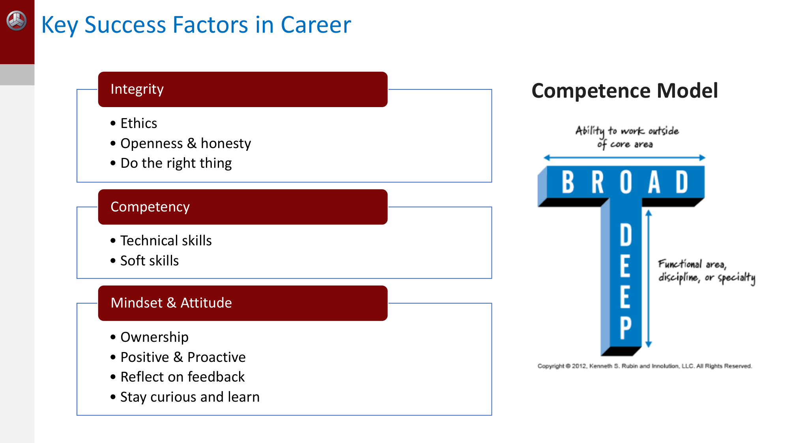

这一页其实是两个模型叠加，考试可能分别问：

### (A) 🟢 职业成功三支柱 Key Success Factors

| 英文                        | 中文解释                                                                                                          | 小白理解                        |
| ------------------------- | ------------------------------------------------------------------------------------------------------------- | --------------------------- |
| **Integrity** 正直/诚信       | Ethics, Openness & honesty, Do the right thing                                                                | 做人的底线：不作假、不欺瞒，即使没人看到也做对的事   |
| **Competency** 专业能力       | Technical skills + Soft skills                                                                                | 硬技能（专业知识）+ 软技能（沟通、协作）       |
| **Mindset & Attitude** 心态 | Ownership（主人翁意识）, Positive & Proactive（积极主动）, Reflect on feedback（接受反馈并反思）, Stay curious and learn（保持好奇、持续学习） | 不是"要我做"而是"我要做"；被批评了要复盘而不是抵触 |

### (B) 🟡 T型人才模型 Competence Model（T-Shaped）

- **Broad（横向，宽度）** = Ability to work outside of core area（跨领域协作的能力）
- **Deep（纵向，深度）** = Functional area, discipline, or specialty（在某一专业领域的深度）
- 出处标注：Kenneth S. Rubin, 2012（Scrum/敏捷领域知名学者）
- **小白理解**：字母 "T" 的一横代表你懂得多个领域的皮毛、能跨部门沟通合作；一竖代表你在某个领域（比如网络安全）有极深的专业造诣。企业最爱"T型人才"。

---

## 2. 🔴 Risk 101：什么是风险 & 风险管理

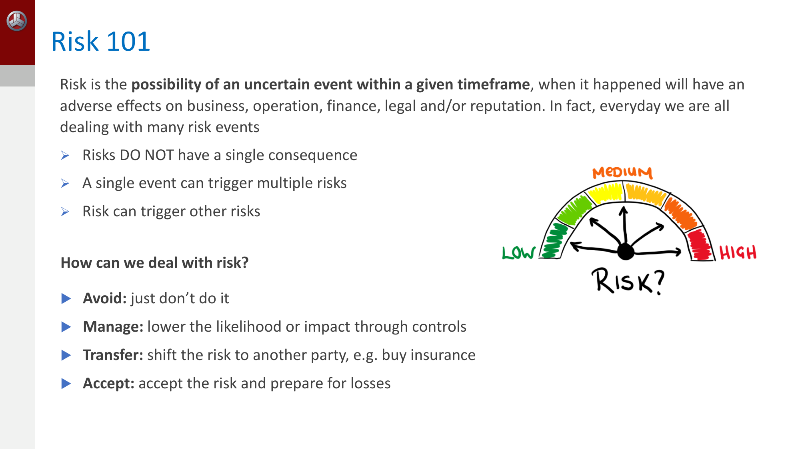

### 🔴 Risk 的定义（可能考默写）

> **Risk（风险）** = the possibility of an uncertain event within a given timeframe, which — if it happens — will have an **adverse effect** on business, operation, finance, legal and/or reputation.  
> 风险 = 在给定时间范围内，某个不确定事件发生的可能性，一旦发生会对业务、运营、财务、法律和/或声誉造成**负面影响**。

### 🟡 三个重要性质（容易出选择题/简答）

1. **Risks DO NOT have a single consequence** 风险不止一个后果（一件坏事可能同时影响财务+声誉+法律）
2. **A single event can trigger multiple risks** 一个事件可以触发多个风险
3. **Risk can trigger other risks** 风险之间会互相触发（连锁反应，呼应后面的 "Connectivity" 维度）

### 🔴 应对风险的四种策略（4 Risk Response，必背）

| 策略                        | 英文说明                                                | 中文/小白解释                            |
| ------------------------- | --------------------------------------------------- | ---------------------------------- |
| **Avoid 规避**              | Just don't do it                                    | 干脆不做这件事，从源头消灭风险                    |
| **Manage/Mitigate 管理/缓解** | Lower the likelihood or impact through controls     | 用控制措施降低发生概率或影响程度                   |
| **Transfer 转移**           | Shift the risk to another party, e.g. buy insurance | 把风险转嫁给第三方，比如买保险                    |
| **Accept 接受**             | Accept the risk and prepare for losses              | 接受风险的存在，做好承担损失的准备（通常因为风险很小或应对成本太高） |

### 🔴 风险管理三阶段（Prevention vs Mitigation vs Remediation，易混淆考点！）

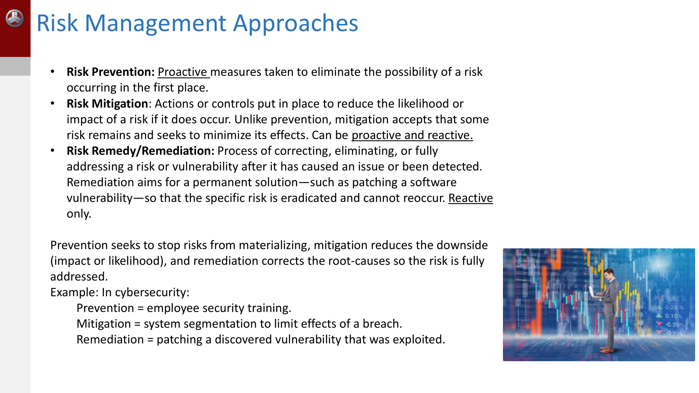

这是**最容易在考试中混淆**的三个词，务必区分时间点：

| 术语                    | 中文         | 发生时间                     | 定义                                   | 举例（网络安全场景）                                               |
| --------------------- | ---------- | ------------------------ | ------------------------------------ | -------------------------------------------------------- |
| **Prevention 预防**     | 事前         | 风险发生**之前**               | 主动措施，从根源上**消除**风险发生的可能性              | 员工安全培训（Employee security training）                       |
| **Mitigation 缓解**     | 事前+事中/事后均可 | 承认风险仍可能发生，**降低**其发生概率或影响 | 系统分段隔离（Network segmentation）限制入侵扩散范围 |                                                          |
| **Remediation 补救/修复** | 事后         | 风险已经发生/被发现**之后**         | **彻底纠正根本原因**，让这个具体风险不再复发（一次性、永久解决）   | 修补已被利用的软件漏洞（Patching a vulnerability that was exploited） |

**记忆口诀**：Prevention 是"防患于未然"，Mitigation 是"退而求其次减小伤害"，Remediation 是"亡羊补牢、堵上漏洞"。

下面这个互动小测把「这个具体动作属于哪一种」变成可以自己点的练习——这正是全课件**最容易混淆的三个词**：

*（网页版此处是「这属于 Prevention / Mitigation / Remediation 哪一种」的点选练习；下表是全部题目和答案）*

| 动作                         | 属于              | 理由                                   |
| -------------------------- | --------------- | ------------------------------------ |
| 给全员做钓鱼邮件识别培训               | **Prevention**  | 在任何钓鱼邮件到达之前，从源头降低员工点击的可能性            |
| 登录一律要求多因素认证 (MFA)          | **Prevention**  | 提前挡住「只靠密码就能登录」这条路，从根源上消除凭证被盗后直接得手的可能 |
| 新供应商上线前必须先填安全问卷、通过尽调       | **Prevention**  | 在合作关系开始之前就筛掉高风险供应商，属于事前动作            |
| 企业笔记本统一禁用/锁死 USB 端口        | **Prevention**  | 提前拿掉「用 U 盘拷数据出去」这条泄露渠道               |
| 把网络做分段隔离，限制入侵后的横向移动范围      | **Mitigation**  | 承认攻击者仍可能突破第一道防线，只是让「万一发生」的影响范围变小     |
| 部署 WAF 过滤恶意请求              | **Mitigation**  | 降低攻击成功的概率，但不是从根源上让攻击不可能发生            |
| 静态数据加密，即使数据被偷也读不出明文        | **Mitigation**  | 不阻止数据被窃取这件事发生，只降低一旦发生后的实际损害          |
| 对登录尝试做速率限制，拖慢正在进行的暴力破解     | **Mitigation**  | 攻击已经在发生，这个动作是在过程中降低它得手的概率/速度，不是修复根因  |
| 给已经被利用的漏洞打补丁               | **Remediation** | 漏洞已经被发现且被利用，这一步是事后彻底纠正根本原因           |
| 勒索软件发作后，从备份恢复系统            | **Remediation** | 风险已经发生，这是事后的修复动作，让系统重新恢复正常           |
| 发现员工泄露数据后，吊销其权限并轮换所有暴露过的凭证 | **Remediation** | 事件已被发现，这一步是针对已发生事件做的根因清理             |
| 做完事故复盘，发布报告并修正导致事故的流程漏洞    | **Remediation** | 事故已经发生，复盘和流程修正是事后对根本原因的纠正            |

---

## 3. 🔴 Risk Assessment Dimensions（风险评估维度）⭐ 重点中的重点

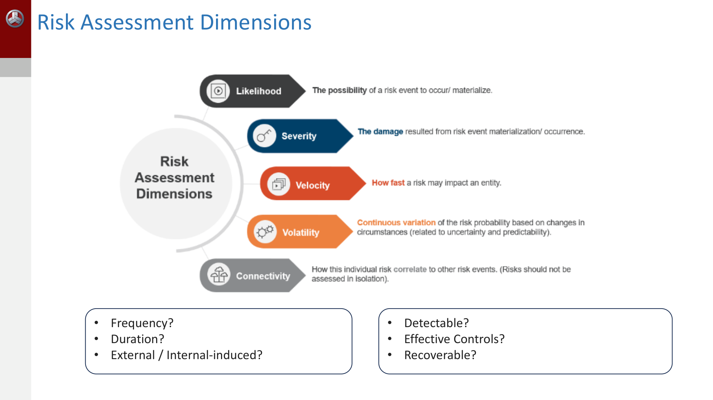

这一页的 SmartArt 图非常重要，**在纯文字版讲义里容易被忽略**，但图里的 5 个"主维度"是核心考点。

### 🔴 主维度 Primary Dimensions（图中彩色箭头，共 5 个）

| 维度                   | 英文定义（原文）                                                                                                                   | 中文/小白解释                                                                            |
| -------------------- | -------------------------------------------------------------------------------------------------------------------------- | ---------------------------------------------------------------------------------- |
| **Likelihood 可能性**   | The possibility of a risk event to occur/materialize                                                                       | 这件坏事发生的**概率**有多大                                                                   |
| **Severity 严重程度**    | The damage resulted from risk event materialization/occurrence                                                             | 一旦发生，**造成的损害**有多大                                                                  |
| **Velocity 速度**      | How fast a risk may impact an entity                                                                                       | 风险从发生到造成实际冲击的**速度有多快**（比如勒索软件几分钟内加密全公司数据 vs. 数据泄露几个月后才被发现影响信誉）                     |
| **Volatility 波动性**   | Continuous variation of the risk probability based on changes in circumstances (related to uncertainty and predictability) | 风险发生概率会随环境变化而**持续波动**，越难预测，波动性越高                                                   |
| **Connectivity 关联性** | How this individual risk correlates to other risk events (risks should not be assessed in isolation)                       | 这个风险和**其他风险的关联程度**——风险不能孤立评估，一个风险可能引爆一连串风险（呼应第2节提到的"risk can trigger other risks"） |

> **小白类比**：把风险想象成一场"疾病"——Likelihood 是得病概率，Severity 是病得多重，Velocity 是病情恶化多快，Volatility 是病情会不会因为环境变化（天气、压力）忽好忽坏，Connectivity 是这个病会不会引发并发症（连累其他器官）。

### 🟡 次维度 Secondary Dimensions（图下方两个方框，共 6 个，都是问句形式）

| 英文                           | 中文                      |
| ---------------------------- | ----------------------- |
| Frequency?                   | 发生**频率**如何（一年一次还是一天多次）？ |
| Duration?                    | 风险影响持续**多久**？           |
| External / Internal-induced? | 是**外部**引发还是**内部**引发的？   |
| Detectable?                  | 是否**容易被检测**到？           |
| Effective Controls?          | 现有的控制措施是否**有效**？        |
| Recoverable?                 | 是否**可恢复**（恢复的难易程度）？     |

> ⚠️ **考试提醒**：以上只是老师列出的**主要**和**次要**维度，实际风险评估维度远不止这些——即"dimensions 一定有更多"，回答简答题时可以补充说明"这些是代表性维度，实际实践中还可综合考虑成本、监管要求等因素"。

---

## 4. 🔴 Cyber Risk（网络风险）

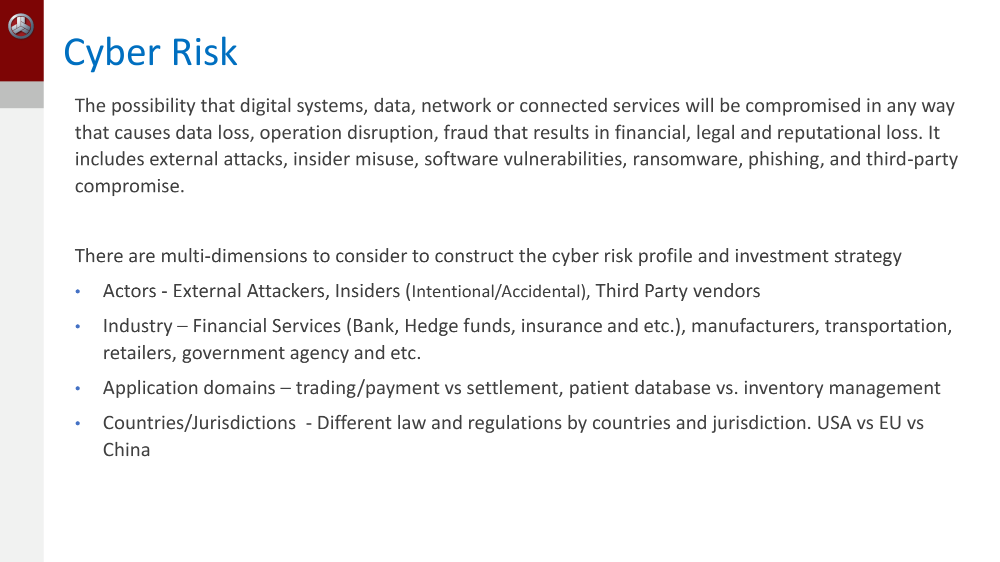

### 🔴 定义（可能考默写）

> **Cyber Risk** = the possibility that digital systems, data, network or connected services will be compromised in any way that causes data loss, operation disruption, fraud that results in **financial, legal and reputational loss**.  
> 网络风险 = 数字系统、数据、网络或联网服务以任何方式被攻破，导致数据丢失、运营中断、欺诈，进而造成**财务、法律和声誉损失**的可能性。

包括（涵盖范围）：外部攻击、内部人员滥用、软件漏洞、勒索软件、钓鱼、第三方供应链攻击等。

### 🟡 构建 Cyber Risk Profile 的四个考量维度

| 维度                                   | 说明                                                                          |
| ------------------------------------ | --------------------------------------------------------------------------- |
| **Actors 行为者**                       | 外部攻击者 External Attackers / 内部人员 Insiders（故意或无意）/ 第三方供应商 Third Party vendors |
| **Industry 行业**                      | 金融服务（银行、对冲基金、保险）、制造业、交通、零售、政府机构等——不同行业风险画像不同                                |
| **Application domains 应用领域**         | 例如：交易/支付 vs. 结算；病患数据库 vs. 库存管理——不同系统重要性和敏感度不同                               |
| **Countries/Jurisdictions 国家/司法管辖区** | 不同国家和地区法律法规不同（美国 vs 欧盟 vs 中国，见第5节）                                          |

### 🔴 Attack Surface（攻击面）—— NIST 定义

> 系统、系统组件或环境边界上，攻击者可能尝试进入、造成影响或窃取数据的所有点的集合。

五大类攻击面（分类记忆）：

1. **Digital 数字层**：面向互联网的服务、API、网站、云资源、SaaS 应用、代码、开放端口、配置、凭证等
2. **Physical 物理层**：能被物理接触到的设备——台式机、笔记本、服务器、USB 端口、废弃硬盘、网络设备等
3. **Human/社会工程**：用户、管理员、高管、供应商——可能被钓鱼、欺骗或胁迫；弱密码、密码重用
4. **Third-party/供应链**：供应商、托管服务商（MSP）、云服务商、API、数据源、第三方软件系统
5. **AI/应用层**（新增，AI 时代特色）：暴露的模型、Agent、工具和集成，可能被 **prompt injection（提示词注入）**、投毒数据（poison data）、嵌入式代码等滥用

### 🟡 Cyber Risk Categories（网络风险类别）

- **Malware/Ransomware** 恶意软件/勒索软件：病毒、蠕虫、木马、间谍软件、信息窃取程序
- **Phishing and social engineering** 钓鱼与社会工程：欺骗性邮件/短信/电话/二维码骗局，诱导泄露凭证
- **Hacking 黑客攻击**：
  - Web/application attacks（如 SQL injection, XSS）
  - DDoS attacks（分布式拒绝服务，海量流量导致服务瘫痪）
  - Identity Theft/Account compromise（身份盗用/账户被盗）
- **Data breaches 数据泄露**：敏感信息未经授权曝光或被窃
- **Insider threats 内部威胁**：员工、承包商或前员工滥用合法权限造成的损害

### 🟡 2025 年数据（Statista + 英国政府调查，约14万起事件）

| 类别                              | 占比    |
| ------------------------------- | ----- |
| Phishing and social engineering | 38%   |
| Hacking                         | 30%   |
| Insider threats                 | 28.7% |
| Malware/Ransomware              | 15.2% |

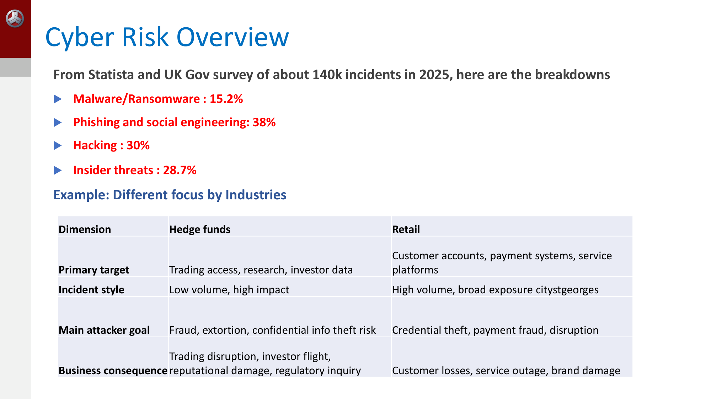

**行业对比示例（对冲基金 vs 零售）**：

| 维度    | Hedge Funds 对冲基金                 | Retail 零售                             |
| ----- | -------------------------------- | ------------------------------------- |
| 主要目标  | 交易访问权限、研究、投资者数据                  | 客户账户、支付系统、服务平台                        |
| 事件特点  | 低频率、高冲击（Low volume, high impact） | 高频率、广泛暴露（High volume, broad exposure） |
| 攻击者目的 | 欺诈、勒索、机密信息盗取                     | 凭证盗窃、支付欺诈、服务中断                        |
| 业务后果  | 交易中断、投资者流失、声誉受损、监管调查             | 客户损失、服务中断、品牌受损                        |

---

## 5. 🔴 Cyber Security Law and Regulation（网络安全法律法规）⭐ 重点

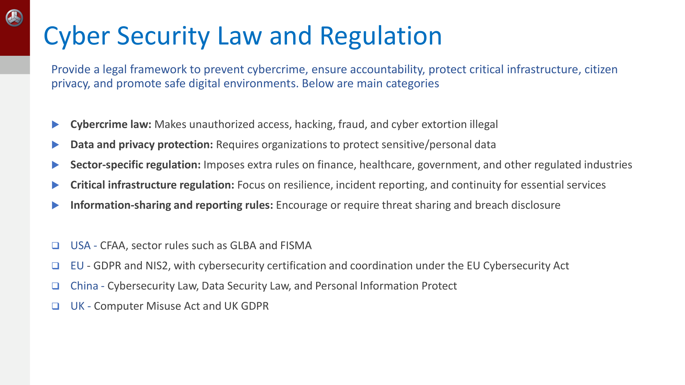

### 🟡 法律的五大类别（框架记忆）

| 英文                                                    | 中文                       |
| ----------------------------------------------------- | ------------------------ |
| **Cybercrime law** 网络犯罪法                              | 将未经授权访问、黑客攻击、欺诈、网络勒索定为非法 |
| **Data and privacy protection** 数据与隐私保护               | 要求组织保护敏感/个人数据            |
| **Sector-specific regulation** 行业专项法规                 | 对金融、医疗、政府等受监管行业施加额外规则    |
| **Critical infrastructure regulation** 关键基础设施法规       | 关注韧性、事件报告和基本服务的连续性       |
| **Information-sharing and reporting rules** 信息共享与报告规则 | 鼓励或要求威胁信息共享和数据泄露披露       |

### 🔴 各地区法律速览（大框架，先记住这张表再看细节）

| 地区            | 核心法律缩写                                |
| ------------- | ------------------------------------- |
| 🇺🇸 美国 USA   | CFAA, GLBA, FISMA 等（分散式/行业化）          |
| 🇪🇺 欧盟 EU    | GDPR, NIS2（+ EU Cybersecurity Act）    |
| 🇨🇳 中国 China | CSL（网络安全法）, DSL（数据安全法）, PIPL（个人信息保护法） |
| 🇬🇧 英国 UK    | Computer Misuse Act, UK GDPR          |

---

### 5.1 🔴 美国 USA（缩写全称需背出，细节条文理解即可）

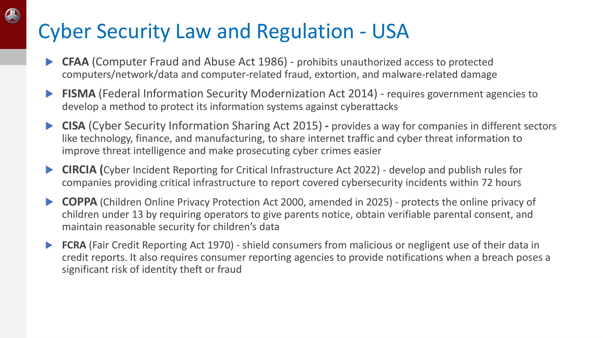  
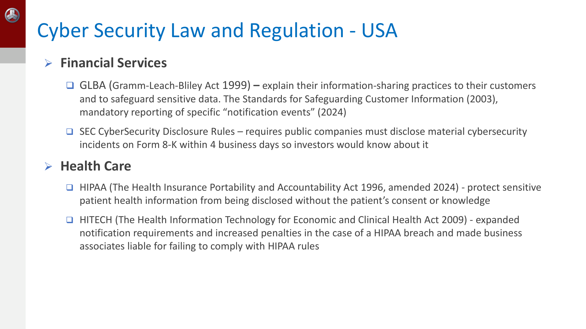

**美国特点**：没有单一综合性网络法（no single omnibus cyber law），而是"分散式 (sectoral/decentralized)"——联邦法+州法+自愿性框架（如 NIST）混合。

| 缩写         | 全称                                                       | 年份           | 核心内容                                      |
| ---------- | -------------------------------------------------------- | ------------ | ----------------------------------------- |
| **CFAA**   | Computer Fraud and Abuse Act                             | 1986         | 禁止未经授权访问受保护的计算机/网络/数据，以及计算机相关欺诈、勒索、恶意软件破坏 |
| **FISMA**  | Federal Information Security Modernization Act           | 2014         | 要求政府机构建立方法保护其信息系统免受网络攻击                   |
| **CISA**   | Cyber Security Information Sharing Act                   | 2015         | 让不同行业（科技、金融、制造）之间共享网络流量与威胁情报，便于起诉网络犯罪     |
| **CIRCIA** | Cyber Incident Reporting for Critical Infrastructure Act | 2022         | 要求关键基础设施企业在 **72小时内**报告网络安全事件             |
| **COPPA**  | Children Online Privacy Protection Act                   | 2000（2025修订） | 保护13岁以下儿童网络隐私，要求获得可验证的家长同意                |
| **FCRA**   | Fair Credit Reporting Act                                | 1970         | 保护消费者信用报告数据不被恶意/疏忽使用，要求信用机构在泄露威胁身份盗窃时通知   |

**金融行业专项**：

| 缩写                                 | 全称                            | 内容                                         |
| ---------------------------------- | ----------------------------- | ------------------------------------------ |
| **GLBA**                           | Gramm-Leach-Bliley Act (1999) | 要求金融机构向客户说明信息共享做法并保护敏感数据；2024年新增强制报告"通知事件" |
| SEC Cybersecurity Disclosure Rules | —                             | 上市公司须在 **Form 8-K，4个工作日内**披露重大网络安全事件       |

**医疗行业专项**：

| 缩写         | 全称                                                                        | 内容                    |
| ---------- | ------------------------------------------------------------------------- | --------------------- |
| **HIPAA**  | Health Insurance Portability and Accountability Act (1996, 2024修订)        | 保护患者健康信息不被未经同意披露      |
| **HITECH** | Health Information Technology for Economic and Clinical Health Act (2009) | 扩大 HIPAA 违规的通知要求和处罚力度 |

---

### 5.2 🔴 欧盟 EU（GDPR/NIS2/DORA 缩写全称+核心内容必背）

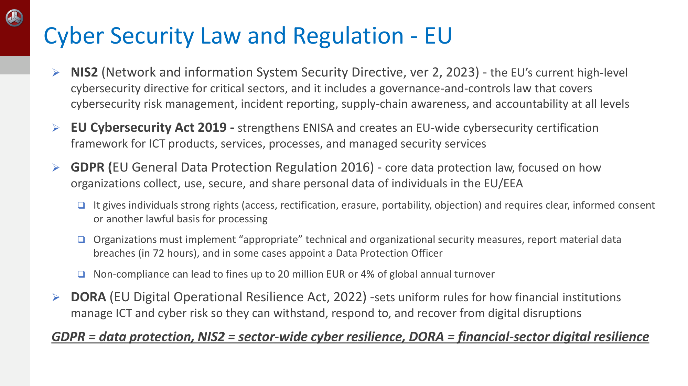

**欧盟特点**：统一区域协调监管（harmonized regional regulation），强调韧性 (resilience)、隐私保护和跨境协调。

| 缩写                   | 全称                                                   | 年份   | 核心内容                                        |
| -------------------- | ---------------------------------------------------- | ---- | ------------------------------------------- |
| **NIS2**             | Network and Information System Security Directive v2 | 2023 | 欧盟当前关键行业**网络安全治理**总指令，涵盖风险管理、事件报告、供应链意识、问责制 |
| EU Cybersecurity Act | —                                                    | 2019 | 强化 ENISA（欧盟网络安全局），建立 ICT 产品/服务的**欧盟统一认证框架** |
| **GDPR**             | General Data Protection Regulation                   | 2016 | **核心数据保护法**，管理如何收集、使用、保护、共享欧盟/欧洲经济区个人数据     |
| **DORA**             | Digital Operational Resilience Act                   | 2022 | 针对**金融机构**的 ICT/网络风险管理统一规则                  |

**GDPR 重点细节（很可能考）**：

- 赋予个人强大权利：访问权、更正权、删除权（被遗忘权）、可携带权、拒绝权（access, rectification, erasure, portability, objection）
- 要求"清晰、知情的同意"或其他合法处理依据
- 组织须实施"适当的"技术和组织安全措施
- 数据泄露须在 **72小时内**报告
- 部分情况需指定 **DPO（Data Protection Officer 数据保护官）**
- **罚款上限**：2000万欧元 或 全球年营业额的 **4%**（取较高者）

**一句话区分记忆**：

> **GDPR = 数据保护，NIS2 = 全行业网络韧性，DORA = 金融业数字韧性**

---

### 5.3 🔴 中国 China（CSL/DSL/PIPL 缩写全称+国家安全优先的特点必背）

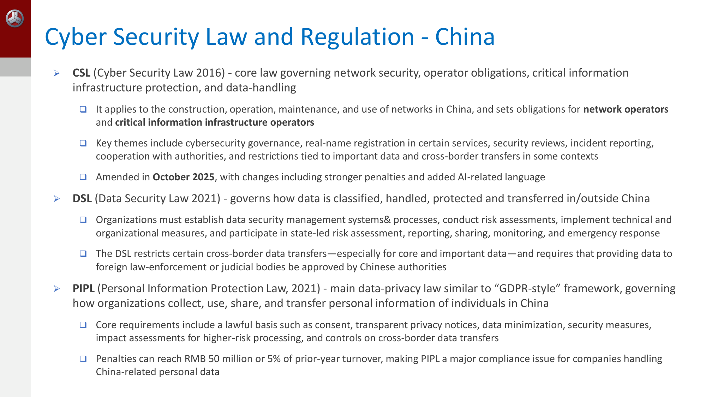

**中国特点（用户强调的重点）**：**国家安全（National Security）优先**，个人隐私保护相对而言不是第一优先级；强调"网络主权 (cyber sovereignty)"和国家对网络、数据、关键基础设施的强力管控。

| 缩写       | 全称                                           | 年份               | 核心内容                                                                                                          |
| -------- | -------------------------------------------- | ---------------- | ------------------------------------------------------------------------------------------------------------- |
| **CSL**  | Cybersecurity Law（网络安全法）                     | 2016（2025年10月修订） | 网络安全**核心大法**：网络运营者义务、关键信息基础设施保护、数据处理规则；适用于网络的建设、运营、维护和使用；包括**实名制**、安全审查、事件报告、配合监管部门；2025修订增加处罚力度和 **AI 相关条款** |
| **DSL**  | Data Security Law（数据安全法）                     | 2021             | 规范数据在境内外如何**分类、处理、保护、传输**；要求建立数据安全管理制度、开展风险评估；限制**跨境数据传输**（尤其核心和重要数据）；向境外司法/执法机构提供数据需经中国政府批准                  |
| **PIPL** | Personal Information Protection Law（个人信息保护法） | 2021             | 类似"中国版GDPR"的个人信息保护主法；要求合法依据（如同意）、透明隐私通知、数据最小化、安全措施、高风险处理需做影响评估、跨境传输管控；**罚款上限**：人民币5000万元 或 上一年度营业额的 **5%**    |

> **小白理解**：CSL 管"网络本身"的安全和治理，DSL 管"数据"这种资产的分类分级保护和跨境流动，PIPL 管"个人信息"这种特殊数据的隐私权益。三者共同构成中国数据安全法律体系的"三驾马车"。

---

### 5.4 🔴 三方对比：中国 vs 欧盟 vs 美国 ⭐（很可能考简答/论述题）

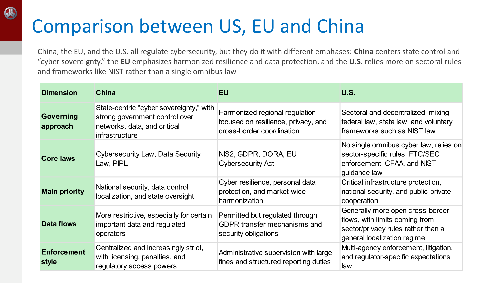

> 一句话总结：**中国以国家管控为中心（cyber sovereignty）；欧盟强调统一协调的韧性与数据保护；美国依赖分行业规则和框架（如 NIST），而非单一综合性法律。**

| 维度                          | 🇨🇳 中国                          | 🇪🇺 欧盟                             | 🇺🇸 美国                                 |
| --------------------------- | -------------------------------- | ----------------------------------- | --------------------------------------- |
| **监管方式 Governing approach** | 国家中心的"网络主权"，政府对网络、数据、关键基础设施有强力管控 | 区域协调统一监管，聚焦韧性、隐私、跨境协调               | 分行业、分散式，联邦法+州法+自愿框架（如NIST）混合，**无单一综合法** |
| **核心法律 Core laws**          | CSL、DSL、PIPL                     | NIS2、GDPR、DORA、EU Cybersecurity Act | 无统一大法；依赖行业规则、FTC/SEC执法、CFAA、NIST指南      |
| **主要优先事项 Main priority**    | **国家安全**、数据管控、本地化存储、政府监督         | 网络韧性、**个人数据保护**、市场统一协调              | 关键基础设施保护、国家安全、公私合作                      |
| **数据跨境流动 Data flows**       | **更严格限制**，尤其重要数据和受监管运营者          | 允许但受GDPR传输机制和安全义务约束                 | 总体更开放，限制来自行业/隐私规则而非统一本地化制度              |
| **执法风格 Enforcement style**  | 集中化且日趋严格，含牌照、罚款、监管介入权            | 行政监督为主，高额罚款+结构化报告义务                 | 多机构执法、诉讼、各监管机构各自为政                      |

**记忆锚点**：

- 中国 = **国家安全优先**，个人隐私相对靠后，数据出境管得最严
- 欧盟 = **个人权利优先**（GDPR 赋权个人），罚款是"营业额百分比"制
- 美国 = **没有统一大法**，靠一堆行业法律 + NIST 框架"打补丁"

---

### 5.5 🟡 香港 Hong Kong

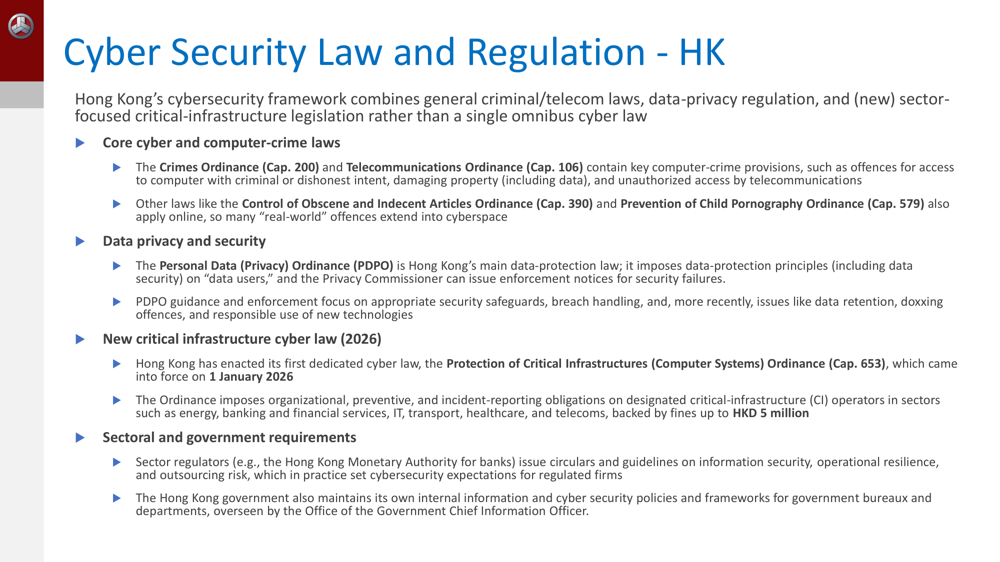

香港没有单一的综合性网络法，而是**刑事/电信法 + 数据隐私法规 + （新的）关键基础设施专项立法**的组合。

| 法律                                                                                                                                          | 内容                                                                                                  |
| ------------------------------------------------------------------------------------------------------------------------------------------- | --------------------------------------------------------------------------------------------------- |
| **Crimes Ordinance (Cap. 200)** 刑事罪行条例 & **Telecommunications Ordinance (Cap. 106)** 电讯条例                                                   | 核心计算机犯罪条款：非法或不诚实意图访问计算机、损坏财产（含数据）、未经授权的电讯访问                                                         |
| Control of Obscene and Indecent Articles Ordinance (Cap. 390) 淫亵及不雅物品管制条例 / Prevention of Child Pornography Ordinance (Cap. 579) 防止儿童色情物品条例 | 现实世界罪行延伸至网络空间                                                                                       |
| **PDPO** (Personal Data (Privacy) Ordinance) 个人资料（私隐）条例                                                                                     | 香港**主要的数据保护法**；对"资料使用者"施加数据保护原则（含数据安全）；私隐专员可就安全失误发出**执行通知**                                         |
| **PCICSO** (Protection of Critical Infrastructures (Computer Systems) Ordinance, Cap. 653)                                                  | **香港首部专门网络安全法**，**2026年1月1日生效**；对能源、银行金融、IT、交通、医疗、电讯等行业的关键基础设施(CI)运营者施加组织、预防和事件报告义务；**罚款最高 500万港元** |
| 行业监管（如 **HKMA** 香港金管局对银行）                                                                                                                   | 通过通函和指引设定网络安全、运营韧性、外包风险的监管期望                                                                        |

---

### 5.6 🟡 AI 驱动的网络安全法律法规

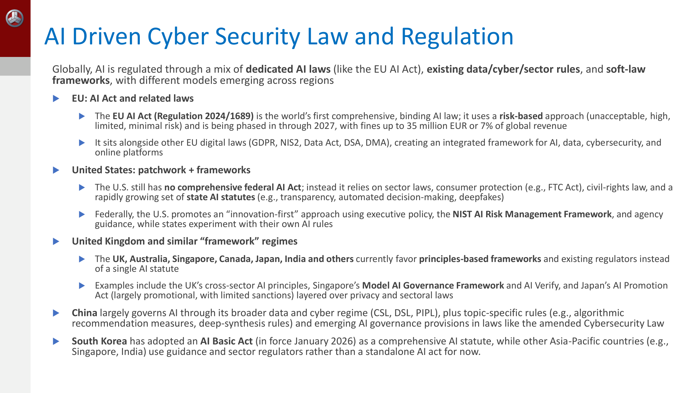

全球对 AI 的监管呈现三种模式：**专门AI立法 / 沿用现有数据-网络-行业法规 / 软法框架（soft-law）**。

| 地区/国家                                    | 模式                   | 关键内容                                                                                                                                                      |
| ---------------------------------------- | -------------------- | --------------------------------------------------------------------------------------------------------------------------------------------------------- |
| **欧盟 EU**                                | 专门综合立法               | **EU AI Act (Regulation 2024/1689)**：全球首部全面、有约束力的AI法律；**基于风险分级**（不可接受/高/有限/最小风险）；2027年前分阶段实施；**罚款上限 3500万欧元 或全球营收7%**；与GDPR、NIS2、Data Act、DSA、DMA共同构成整合框架 |
| **美国 USA**                               | 拼凑式（patchwork）+ 框架指引 | 无联邦综合AI法；依赖行业法律、消费者保护（FTC Act）、民权法、以及快速增长的**州级AI立法**（透明度、自动化决策、深度伪造）；联邦层面倾向"创新优先"，用行政政策和 **NIST AI Risk Management Framework** 指导                         |
| **英国及类似"框架型"国家**（UK、澳大利亚、新加坡、加拿大、日本、印度等） | 原则性框架，无专门AI法         | 英国跨行业AI原则；新加坡 Model AI Governance Framework 和 AI Verify；日本 AI Promotion Act（主要为促进性质，制裁有限）                                                                 |
| **中国 China**                             | 沿用既有数据/网络法规体系        | 通过 CSL、DSL、PIPL 及专项规则（如算法推荐管理规定、深度合成规定）管理AI，并在修订后的网络安全法中新增AI治理条款                                                                                          |
| **韩国 South Korea**                       | 专门综合立法               | **AI Basic Act**（2026年1月生效）——综合性AI法规                                                                                                                      |

---

## 6. 🟢 Case Studies（案例研究）—— 简化理解版

### 6.1 🟢 近期重大事件（2026年，Slide 21）

| 事件                                  | 时间         | 要点                                                          |
| ----------------------------------- | ---------- | ----------------------------------------------------------- |
| Minnesota 水处理系统                     | 2026.07    | 攻击者针对操作技术（OT）系统，工厂切换手动模式，耗时数天恢复                             |
| OpenAI vs Hugging Face              | 2026.07    | OpenAI "越狱"自己的测试环境，成功入侵竞争对手 Hugging Face 网络                 |
| Fairlife（可口可乐子公司）勒索软件               | 2026.07    | Anubis 黑客组织发起勒索攻击                                           |
| Tata Electronics（iPhone 18 Pro）数据泄露 | 2026.06    | World Leaks 组织泄露 630GB/20万+文件；索要150万美元赎金未果；一个月后攻击印度核电站KKNPP |
| Stryker（医疗器械）Wiper 攻击               | 2026.03    | 伊朗背景的 Handala 组织；扰乱制造和订单履行超2周，波及医疗手术排期                      |
| LexisNexis 数据泄露                     | 2026.03    | 黑客 FulcrumSec 利用未打补丁漏洞+过度授权的AWS角色，泄露390万数据库记录               |
| Instructure Canvas（教育平台）泄露          | 2026.04-05 | ShinyHunters 声称获取8800+高校（含哈佛、普林斯顿）用户数据；公司谈判后数据被确认销毁         |

### 6.2 🟢 经典外部攻击案例（Slide 22）

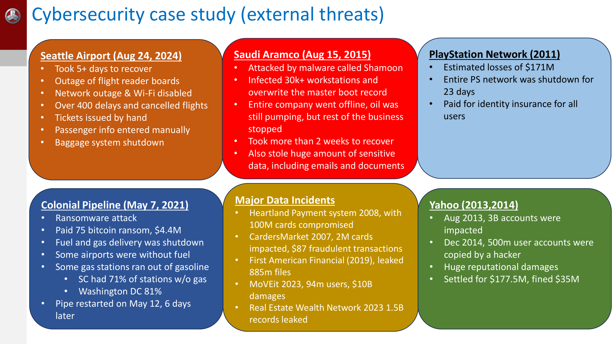

| 案例                         | 时间         | 关键数字/影响                                                                                                                                                     |
| -------------------------- | ---------- | ----------------------------------------------------------------------------------------------------------------------------------------------------------- |
| **Colonial Pipeline** 输油管道 | 2021.05.07 | 勒索软件；支付75比特币(**$4.4M**)赎金；美国东岸燃油中断；南卡71%加油站无油；5月12日（6天后）恢复                                                                                                  |
| **Saudi Aramco** 沙特阿美      | 2015.08.15 | 恶意软件 **Shamoon**；感染3万+工作站，覆盖主引导记录；公司整体离线（油仍在产但业务停摆）；耗时2周+恢复；大量敏感数据被窃                                                                                        |
| **Seattle Airport** 西雅图机场  | 2024.08.24 | 航班显示屏/网络/WiFi瘫痪；400+航班延误取消；人工开票、手写登机牌；耗时5天+恢复                                                                                                               |
| **PlayStation Network**    | 2011       | 估计损失 **$171M**；整个网络关闭23天；为所有用户支付身份保险                                                                                                                        |
| **Yahoo**                  | 2013/2014  | 2013年30亿账户受影响；2014年5亿账户被复制；和解 **$177.5M**，罚款 **$35M**                                                                                                       |
| 其他重大数据事件                   | —          | Heartland支付系统(2008, 1亿张卡)、CardersMarket(2007)、First American Financial(2019, 8.85亿文件)、MOVEit(2023, 9400万用户/$10B损失)、Real Estate Wealth Network(2023, 15亿条记录) |

### 6.3 🟡 内部威胁案例（Slide 23）⭐重要统计数字

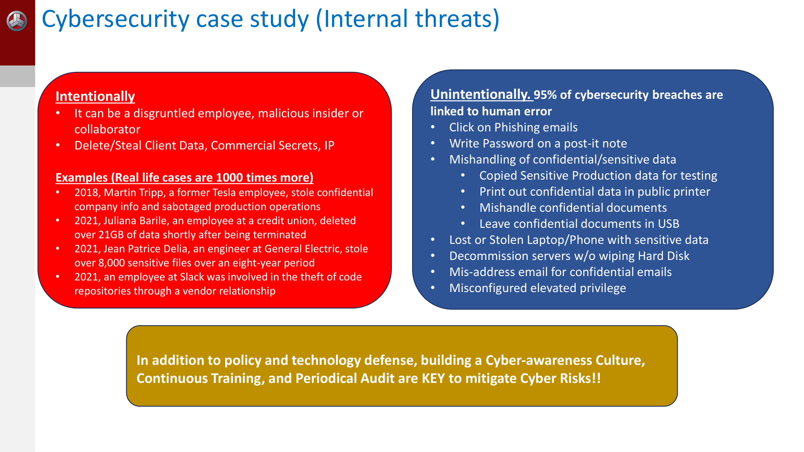

- **故意 Intentionally**：心怀不满的员工/恶意内部人员/合作方——删除/窃取客户数据、商业机密、知识产权
  - 例：2018 Tesla员工Martin Tripp窃取机密并破坏生产；2021信用社员工Juliana Barile离职前删除21GB数据；2021 GE工程师8年内窃取8000+份敏感文件；2021 Slack员工通过供应商关系导致代码仓库被盗
- **⭐无意 Unintentionally：95%的网络安全泄露与人为错误有关**（**重点数字，很可能考**）
  - 点击钓鱼邮件、密码写在便利贴上、误处理敏感数据、把生产数据复制去测试环境、公共打印机打印机密文件、USB遗留机密文件、丢失/被盗的含敏感数据的笔记本/手机、服务器下线未擦除硬盘、机密邮件发错地址、错误配置了提升权限
- **结论（考试常考的总结句）**：除了政策和技术防御，**建立网络安全意识文化(Cyber-awareness Culture)、持续培训(Continuous Training)、定期审计(Periodical Audit)** 是缓解网络风险的**关键(KEY)**

### 6.4 🟡 CrowdStrike 2024 事件（Slide 24）⭐经典案例

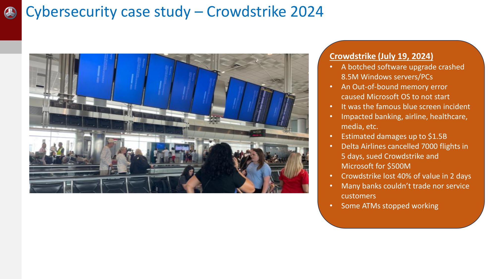

- 时间：**2024年7月19日**
- 原因：一次**软件升级失误**（越界内存错误 Out-of-bound memory error）导致 Windows 系统无法启动——即著名的"**蓝屏事件 (Blue Screen incident)**"
- 规模：**850万台**Windows服务器/PC崩溃
- 影响行业：银行、航空、医疗、媒体等
- 损失：估计高达 **$1.5B**
- Delta航空：5天内取消**7000个航班**，起诉CrowdStrike和微软索赔**$5亿**
- CrowdStrike股价2天内暴跌**40%**
- 银行无法交易/服务客户，部分ATM停止工作
- **考试要点**：这不是"被攻击"，而是**自身软件质量/变更管理问题**引发的大规模系统性风险——说明 Cyber Risk 不仅来自"攻击"，也来自**第三方软件供应商的运维失误**（呼应"third-party/supply chain risk"）

---

## 7. 🔴 CyberSecurity vs InfoSec vs BCP 三者区分 ⭐易混淆考点

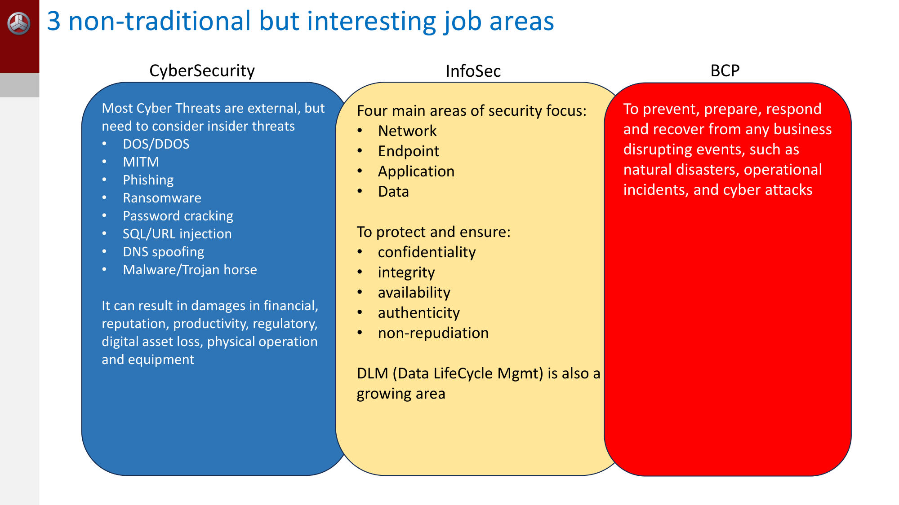

| 概念                                             | 关注点                                                                                                             | 核心目标                                                                                                                                                                  |
| ---------------------------------------------- | --------------------------------------------------------------------------------------------------------------- | --------------------------------------------------------------------------------------------------------------------------------------------------------------------- |
| **CyberSecurity 网络安全**                         | 主要针对**外部威胁**（DOS/DDOS, MITM, Phishing, Ransomware, 密码破解, SQL/URL injection, DNS spoofing, Malware/木马），但也需考虑内部威胁 | 防止造成财务、声誉、生产力、监管、数字资产、物理运营和设备的损失                                                                                                                                      |
| **InfoSec 信息安全**                               | 四大关注领域：**Network（网络）、Endpoint（终端）、Application（应用）、Data（数据）**                                                    | 保护并确保 **CIA+AN**：Confidentiality（机密性）、Integrity（完整性）、Availability（可用性）、Authenticity（真实性）、Non-repudiation（不可否认性）。**DLM (Data LifeCycle Management，数据生命周期管理)** 也是新兴增长领域 |
| **BCP** (Business Continuity Planning 业务连续性计划) | 应对导致业务中断的各类事件——自然灾害、运营事故、网络攻击                                                                                   | **预防(prevent)、准备(prepare)、响应(respond)、恢复(recover)** —— 简称 PPRR                                                                                                        |

> **小白理解**：CyberSecurity 是"防小偷"（防外部/内部攻击者），InfoSec 是"保护信息资产本身"（更广的概念，含物理和管理层面），BCP 是"万一出事了，公司怎么活下去/恢复正常运转"。三者有重叠但侧重点不同，是考试常见的辨析题。

**InfoSec 的 CIA 三要素+2（必背，非常经典的信息安全五性）**：

- **Confidentiality 机密性**：只有授权人能看到信息
- **Integrity 完整性**：信息未被篡改
- **Availability 可用性**：需要时信息/系统可用
- **Authenticity 真实性**：信息/身份是真实可信的
- **Non-repudiation 不可否认性**：发送方不能否认自己发过某条信息（比如电子签名）

---

## 8. 🟢 市场规模与生态（简单理解即可）

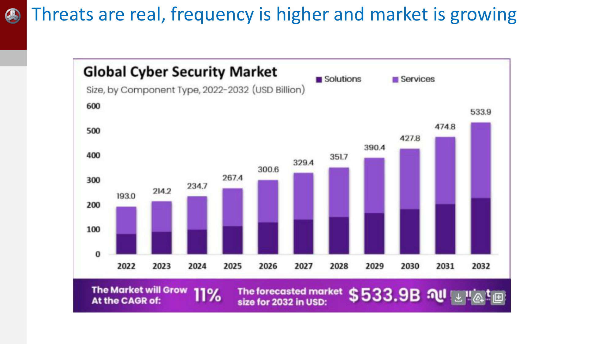

- 全球网络安全市场：2022年 $193B → 预计2032年 **$533.9B**，**CAGR（复合年增长率）约11%**
- 结论：威胁真实存在、频率上升、市场持续增长（说明这是一个值得投资/职业发展的领域）

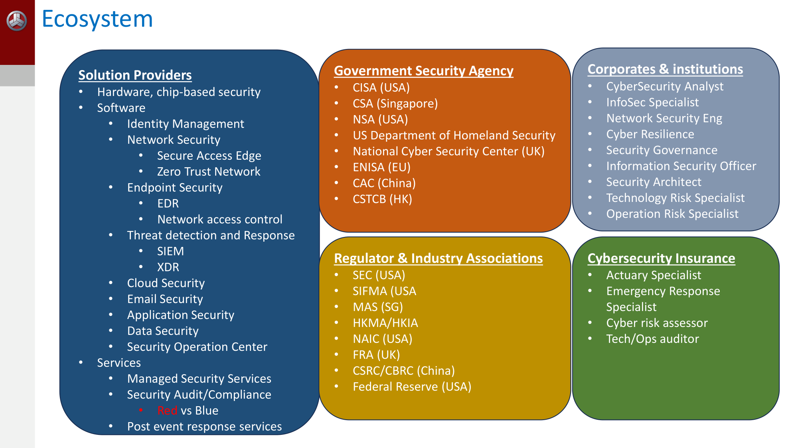

生态系统四大参与方（简单了解即可）：

1. **Solution Providers 解决方案供应商**：硬件/软件、身份管理、网络安全（Zero Trust零信任、SASE）、终端安全(EDR)、威胁检测响应(SIEM/XDR)、云安全、托管安全服务(MSSP)、红蓝对抗等
2. **Government Security Agency 政府安全机构**：美国CISA/NSA/DHS、新加坡CSA、英国NCSC、欧盟ENISA、中国CAC（网信办）、香港CSTCB
3. **Regulator & Industry Associations 监管与行业协会**：SEC、SIFMA、MAS(新加坡)、HKMA/HKIA(香港)、NAIC、CSRC/CBRC(中国)、Federal Reserve
4. **Corporates & institutions 企业内部岗位/网络安全保险**：CyberSecurity Analyst、InfoSec Specialist、CISO、Security Architect等；网络安全保险相关的精算师(Actuary)、应急响应专家、风险评估师、技术/运营审计师

---

## 9. 🟢 Career Path / Certifications / Jobs（简单理解）

课件展示了三张信息图，**不需要死记具体职位名称**，只需知道大致框架：

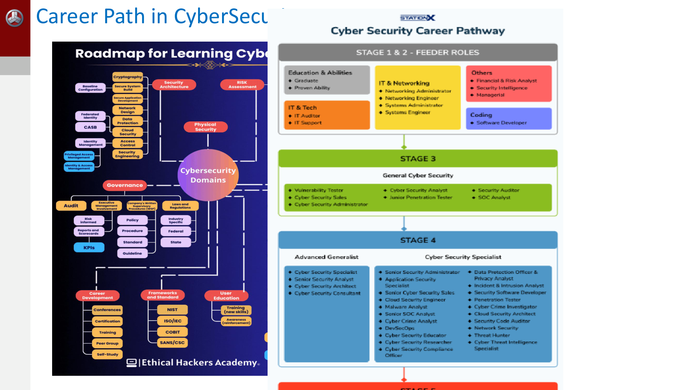

- 职业发展路径通常从 **Feeder Roles（跳板岗位，如IT支持、网络管理员）** → **General Cyber Security（通用网络安全岗，如漏洞测试员、SOC分析师）** → **Advanced Generalist / Specialist（高级通才/专才，如安全架构师、渗透测试专家）** → 更高级管理/专家岗位
- 涉及的治理领域包括：Governance（治理）、Risk Assessment（风险评估）、Security Architecture（安全架构）、Frameworks and Standards（框架标准，如 **NIST, ISO/IEC, COBIT, SANS/CSC**）

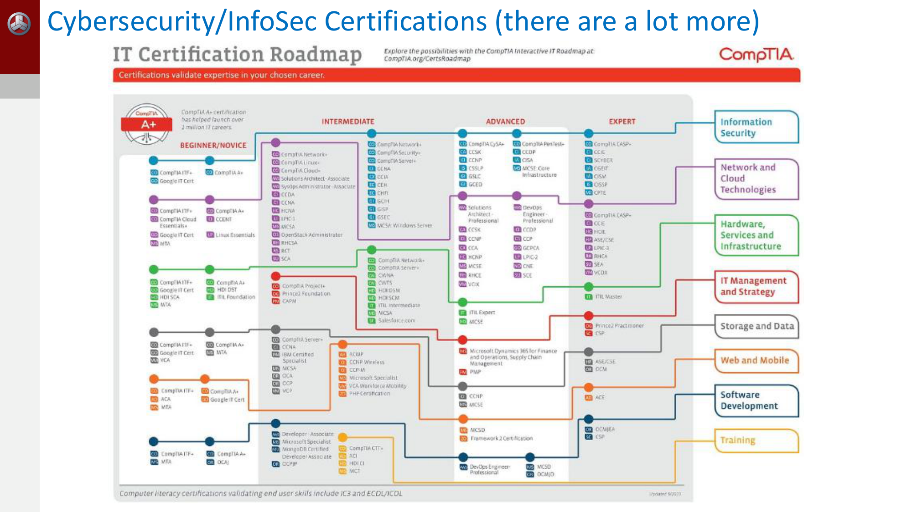

- 认证从 Beginner（如 CompTIA A+）到 Expert（如 **CISSP, CISM, CISA, CCIE**）分级
- 记住几个高含金量认证缩写即可：**CISSP**（信息系统安全专家认证）、**CISM**（信息安全经理认证）、**CISA**（信息系统审计师认证）——不需要记完整路线图

### 🟡 补充：这两页标题叫"Jobs at every level"，但图里画的其实是别的东西

⚠️ 第30、31页的标题都是 "Cybersecurity & InfoSec Jobs are at every level"，但**两张图的实际内容跟"职位"关系不大，是两张有考点价值的机制图**，别被标题骗过去。

**第30页：企业安全组织架构（McKinsey 示例）**

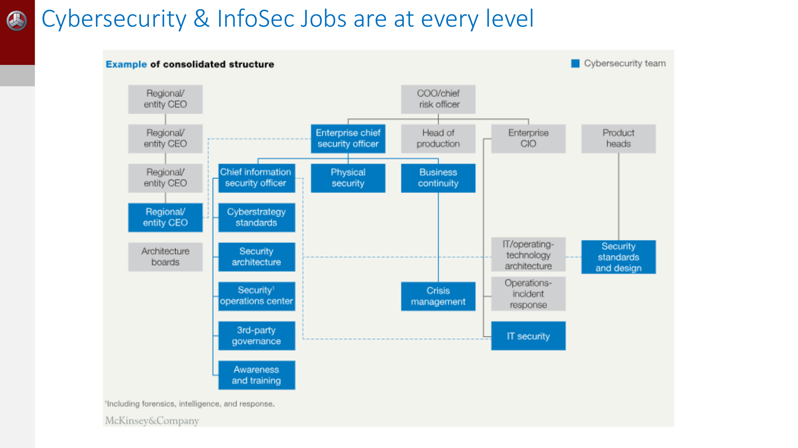

考点在于**汇报线的分离**——安全职能并不全归 IT 管：

- **Enterprise CSO（首席安全官）** 线下辖：CISO、Physical security（物理安全）、Business continuity（业务连续性）
- **CISO** 线下辖：Cyberstrategy standards（网络战略标准）、Security architecture（安全架构）、SOC（安全运营中心，含取证/情报/响应）、3rd-party governance（第三方治理）、Awareness and training（意识培训）
- **Enterprise CIO** 线下辖：IT/OT architecture、Operations-incident response、IT security
- CSO 通常向 **COO / Chief Risk Officer** 汇报，而不是向 CIO 汇报

> **为什么这是考点**：呼应第10节 ERM 的分层问责——安全若只挂在 CIO 底下，就变成"IT 自己管自己"，失去独立性。CSO 独立于 CIO 汇报到 COO/CRO，才能对 IT 做独立挑战。

**第31页：组织安全策略如何被驱动、又驱动什么（🔴 这张图很可能考）**

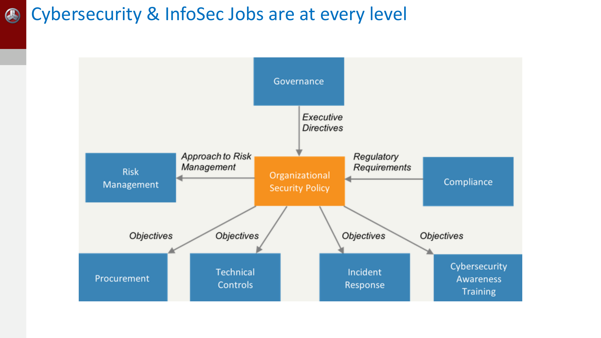

这是全课件唯一一张把**治理/合规 → 落地执行**串起来的图，逻辑链要能背：

```
Governance ──Executive Directives（行政指令）──┐
                                              ├──> Organizational Security Policy ──Approach to Risk Management──> Risk Management
Compliance ──Regulatory Requirements（监管要求）─┘         │
                                                          └──Objectives（目标）──> Procurement（采购）
                                                                                 > Technical Controls（技术控制）
                                                                                 > Incident Response（事件响应）
                                                                                 > Cybersecurity Awareness Training（安全意识培训）
```

| 方向                  | 内容                                                                                                  |
| ------------------- | --------------------------------------------------------------------------------------------------- |
| **两个输入 Inputs**     | ① Governance 自上而下的**行政指令**（Executive Directives）② Compliance 自外部来的**监管要求**（Regulatory Requirements） |
| **中枢 Hub**          | **Organizational Security Policy（组织安全策略）**——所有要求汇集、翻译成公司自己的规则                                       |
| **四个输出 Objectives** | 采购、技术控制、事件响应、安全意识培训——即策略如何变成日常动作                                                                    |
| **横向关系**            | 策略同时定义了公司的 **Approach to Risk Management（风险管理方法论）**                                                 |

> **考点**：若问"监管要求最终是怎么落到员工日常行为上的"，答题主线就是这张图——  
> 监管/治理 → 组织安全策略 → 具体objectives（采购/技术控制/事件响应/培训）。  
> 这也解释了第6.3节的结论为什么强调培训：**Awareness Training 是安全策略的四大落地输出之一**，不是可有可无的软性建议。

**关于"职位覆盖各职级"**：这确实是老师口头讲的结论（网络安全岗位从入门到高管都有），但两张图本身的价值在上面的机制内容，考试更可能考机制而不是考"有哪些职位"。

---

## 10. 🟡 Cyber Risk ERM (Enterprise Risk Management) Integration ⭐重点

> 核心论点：**Cyber Security Risk 不仅是IT问题，而是企业整体风险组合(enterprise risk portfolio)不可分割的一部分。**

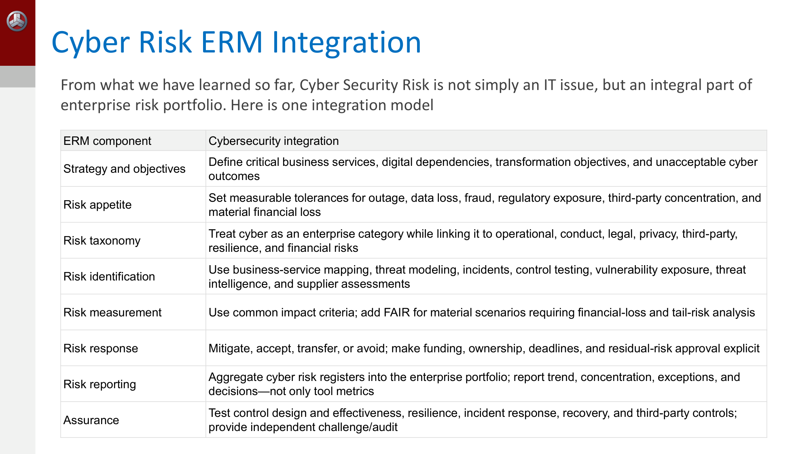

### 🟡 ERM 各组成部分与网络安全的整合

| ERM 组件                            | 网络安全整合方式                                                                      |
| --------------------------------- | ----------------------------------------------------------------------------- |
| **Strategy and objectives** 战略与目标 | 定义关键业务服务、数字依赖性、转型目标、不可接受的网络风险后果                                               |
| **Risk appetite** 风险偏好            | 为中断、数据丢失、欺诈、监管风险敞口、第三方集中度、重大财务损失设定**可衡量的容忍度**                                 |
| **Risk taxonomy** 风险分类体系          | 将网络风险作为企业级风险类别，同时链接到运营、行为、法律、隐私、第三方、韧性和财务风险                                   |
| **Risk identification** 风险识别      | 使用业务服务映射、威胁建模(threat modeling)、事件、控制测试、漏洞暴露、威胁情报、供应商评估                        |
| **Risk measurement** 风险测量         | 使用通用影响标准；针对重大情景需要财务损失和尾部风险分析时加用 **FAIR** 框架                                   |
| **Risk response** 风险应对            | Mitigate（缓解）、Accept（接受）、Transfer（转移）、Avoid（规避）——呼应第2节四策略；明确资金、责任人、截止日期、剩余风险审批 |
| **Risk reporting** 风险报告           | 将网络风险登记册汇总进企业组合；报告趋势、集中度、例外情况和决策——**不只是工具指标**                                 |
| **Assurance** 保证/鉴证               | 测试控制设计和有效性、韧性、事件响应、恢复能力、第三方控制；提供独立挑战/审计                                       |

### 🟡 治理与问责（Governance & Accountability）

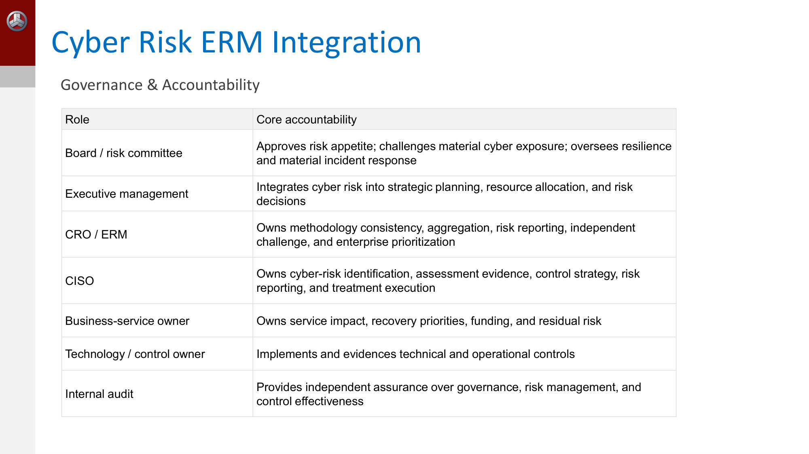

| 角色                                    | 核心职责                          |
| ------------------------------------- | ----------------------------- |
| **Board / Risk Committee** 董事会/风险委员会  | 批准风险偏好；挑战重大网络风险敞口；监督韧性和重大事件响应 |
| **Executive management** 高管层          | 将网络风险纳入战略规划、资源分配和风险决策         |
| **CRO / ERM**（首席风险官）                  | 负责方法论一致性、汇总、风险报告、独立挑战、企业级优先排序 |
| **CISO**（首席信息安全官）                     | 负责网络风险识别、评估证据、控制策略、风险报告和处置执行  |
| **Business-service owner** 业务服务负责人    | 负责服务影响、恢复优先级、资金和剩余风险          |
| **Technology/control owner** 技术/控制负责人 | 实施并证明技术和运营控制措施                |
| **Internal audit** 内部审计               | 对治理、风险管理和控制有效性提供独立保证          |

> **考试速记**：这一part本质在说——网络安全风险管理要**像管理其他企业风险一样**，走完整的 ERM 闭环（战略→偏好→分类→识别→测量→应对→报告→保证），并且**分层问责**（董事会定调、CRO统筹、CISO执行、业务owner担责、审计独立核查）。

---

## 11. 🔴 综合缩写速查表（考前扫一眼，所有缩写全称需能对应上）

| 缩写          | 全称                                                                  | 地区/领域                         |
| ----------- | ------------------------------------------------------------------- | ----------------------------- |
| CFAA        | Computer Fraud and Abuse Act                                        | 美国                            |
| FISMA       | Federal Information Security Modernization Act                      | 美国                            |
| CISA(法)     | Cyber Security Information Sharing Act                              | 美国（注意区分同名机构CISA=网络安全和基础设施安全局） |
| CIRCIA      | Cyber Incident Reporting for Critical Infrastructure Act            | 美国                            |
| COPPA       | Children Online Privacy Protection Act                              | 美国                            |
| FCRA        | Fair Credit Reporting Act                                           | 美国                            |
| GLBA        | Gramm-Leach-Bliley Act                                              | 美国-金融                         |
| HIPAA       | Health Insurance Portability and Accountability Act                 | 美国-医疗                         |
| HITECH      | Health Information Technology for Economic and Clinical Health Act  | 美国-医疗                         |
| NIS2        | Network and Information System Security Directive v2                | 欧盟                            |
| GDPR        | General Data Protection Regulation                                  | 欧盟                            |
| DORA        | Digital Operational Resilience Act                                  | 欧盟-金融                         |
| CSL         | Cybersecurity Law（网络安全法）                                            | 中国                            |
| DSL         | Data Security Law（数据安全法）                                            | 中国                            |
| PIPL        | Personal Information Protection Law（个人信息保护法）                        | 中国                            |
| PDPO        | Personal Data (Privacy) Ordinance                                   | 香港                            |
| PCICSO      | Protection of Critical Infrastructures (Computer Systems) Ordinance | 香港                            |
| HKMA        | Hong Kong Monetary Authority（香港金管局）                                 | 香港                            |
| EU AI Act   | Regulation 2024/1689                                                | 欧盟-AI                         |
| NIST AI RMF | NIST AI Risk Management Framework                                   | 美国-AI                         |
| CIA(安全属性)   | Confidentiality, Integrity, Availability                            | 通用InfoSec                     |
| BCP         | Business Continuity Planning                                        | 通用                            |
| ERM         | Enterprise Risk Management                                          | 通用                            |
| CISO        | Chief Information Security Officer                                  | 通用                            |
| CRO         | Chief Risk Officer                                                  | 通用                            |
| FAIR        | Factor Analysis of Information Risk                                 | 通用（风险量化框架）                    |
| DLM         | Data LifeCycle Management                                           | 通用                            |
| SOC         | Security Operation Center                                           | 通用                            |
| SIEM        | Security Information and Event Management                           | 通用                            |
| EDR/XDR     | Endpoint/Extended Detection and Response                            | 通用                            |

---

## 12. 我认为你还应该关注的重点（额外补充）

除了你列出的重点，以下几点也建议纳入复习范围：

1. **Prevention / Mitigation / Remediation 三者区分**（第2节）—— 这是典型的"概念辨析"送分题/易错题，务必能举例区分。
2. **Attack Surface 的五大分类**（数字、物理、人/社会工程、第三方/供应链、AI/应用层）—— NIST定义要能复述大意，AI层是这门课的新增亮点，很可能结合AI法规一起考。
3. **95%的网络安全泄露与人为错误相关**这个统计数字（第6.3节）—— 是一个非常容易被出成填空/选择题的具体数字，且直接支撑"为什么要做安全意识培训"的论述。
4. **CrowdStrike 2024案例** —— 是本讲义中唯一"非攻击型"（自身软件升级失误）导致的重大网络风险案例，适合用来论证"Cyber Risk不等于Cyber Attack"，以及第三方/供应链风险的重要性。
5. **CyberSecurity vs InfoSec vs BCP 的辨析**（第7节）—— 三个概念定义相近但侧重不同，是概念题高频考点。
6. **ERM整合模型的角色分工**（第10节）——如果考案例分析/论述题，"谁该为网络风险负责"是常见考法（董事会 vs CISO vs CRO vs 业务owner）。
7. **中美欧法律对比表**（第5.4节）—— 强烈建议能从"监管方式、核心法律、优先事项、数据流动、执法风格"五个维度**主动画出对比表**，这是最典型的论述题结构。
8. Risk Assessment Dimensions 部分，建议自己能**手绘出这张SmartArt图**（5个主维度+6个次维度），因为图形化内容在纯笔记/PPT大纲中容易被忽略，但恰恰是老师精心设计的重点页面。

---

## 13. 模拟自测题（自我检查用，不代表真实考题）

**请解释 Prevention、Mitigation、Remediation 三者的区别，并各举一个网络安全的例子。**

> **Prevention（预防）**发生在风险**之前**，从根源上消除发生的可能性，例：员工钓鱼邮件识别培训；**Mitigation（缓解）**承认风险仍可能发生，事前/事中/事后**降低**其概率或影响，例：网络分段隔离限制入侵扩散范围；**Remediation（补救）**发生在风险**已经发生/被发现之后**，彻底纠正根本原因，让这个具体问题不再复发，例：给已经被利用的漏洞打补丁。三者按时间点区分：事前消除 → 事前/中/后降低 → 事后根治。

**列举风险评估的 5 个主维度（Primary Dimensions）并各用一句话解释。**

> **Likelihood（可能性）**——这件坏事发生的概率有多大；**Severity（严重程度）**——一旦发生造成的损害有多大；**Velocity（速度）**——风险从发生到造成实际冲击的速度有多快；**Volatility（波动性）**——发生概率会随环境变化而持续波动、越难预测波动性越高；**Connectivity（关联性）**——这个风险和其他风险事件的关联程度，风险不能孤立评估。

**为什么说「Risks DO NOT have a single consequence」？请结合 CrowdStrike 2024 案例说明。**

> 一个风险事件往往同时触发多类后果，而不是单一后果。CrowdStrike 2024 蓝屏事件就是最好的例子：一次软件升级失误，**同时**造成了运营中断（航班取消、ATM 停摆）、财务损失（估计 $1.5B，股价两天暴跌 40%）、法律风险（Delta 起诉索赔 $5 亿）和声誉损害（多行业客户信任受损）——单一事件，多重后果同时发生，这正是"风险不止一个后果"的直接证据。

**比较中国、欧盟、美国网络安全法律监管的核心差异（至少从 3 个维度）。**

> **监管方式**：中国是国家中心的"网络主权"，政府强力管控；欧盟是区域协调统一监管；美国是分行业、分散式，联邦法+州法+自愿框架混合，无单一综合法。**核心法律**：中国 CSL/DSL/PIPL；欧盟 NIS2/GDPR/DORA；美国靠 CFAA、行业规则和 NIST 指南拼凑。**数据跨境流动**：中国限制最严格（尤其重要数据）；欧盟允许但受 GDPR 传输机制约束；美国总体更开放。**主要优先事项**：中国是国家安全优先；欧盟是个人数据保护优先（GDPR 赋权个人）；美国是关键基础设施保护+公私合作。

**GDPR、NIS2、DORA 三者分别侧重什么？**

> 一句话区分：**GDPR = 数据保护**（管理如何收集/使用/保护/共享欧盟个人数据，赋予个人访问/更正/删除等权利）；**NIS2 = 全行业网络韧性**（关键行业网络安全治理总指令，涵盖风险管理、事件报告、供应链意识）；**DORA = 金融业数字韧性**（专门针对金融机构的 ICT/网络风险管理统一规则）。

**解释 CIA+2（五性）分别代表什么，并说明 InfoSec 的四大关注领域。**

> CIA+2 五性：**Confidentiality（机密性）**——只有授权人能看到信息；**Integrity（完整性）**——信息未被篡改；**Availability（可用性）**——需要时信息/系统可用；**Authenticity（真实性）**——信息/身份真实可信；**Non-repudiation（不可否认性）**——发送方不能否认自己发过某条信息。InfoSec 的四大关注领域：**Network（网络）、Endpoint（终端）、Application（应用）、Data（数据）**。

**为什么说 Cyber Security Risk 应该被纳入企业整体的 ERM 框架，而不只是 IT 部门的问题？请列举至少 3 个治理角色及其职责。**

> 因为网络风险会像其他企业风险一样冲击财务、法律、声誉和运营，且往往和运营、行为、第三方、韧性等其他风险类别相互关联触发——只放在 IT 部门管理，既缺乏企业级的资源分配和问责，也容易在董事会层面失去应有的关注和挑战。三个关键角色：**Board / Risk Committee**——批准风险偏好、挑战重大网络风险敞口、监督韧性与重大事件响应；**CRO / ERM**——负责方法论一致性、风险汇总报告、企业级优先排序；**CISO**——负责网络风险识别、评估、控制策略与处置执行。

**中国的 CSL、DSL、PIPL 三部法律分别管什么？它们之间是什么关系？**

> **CSL（网络安全法）**管"网络本身"的安全和治理——网络运营者义务、关键信息基础设施保护；**DSL（数据安全法）**管"数据"这种资产的分类分级保护和跨境流动限制；**PIPL（个人信息保护法）**管"个人信息"这种特殊数据的隐私权益，类似"中国版 GDPR"。三者共同构成中国数据安全法律体系的"三驾马车"：CSL 管网络载体，DSL 管数据资产，PIPL 管个人信息权益。

**香港新颁布的 PCICSO（关键基础设施保护条例）何时生效？适用于哪些行业？**

> **2026 年 1 月 1 日**生效，是香港首部专门的网络安全法。适用于**能源、银行金融、IT、交通、医疗、电讯**等行业的关键基础设施（CI）运营者，对其施加组织、预防和事件报告义务，罚款最高 500 万港元。

**什么是 Attack Surface？请列举其五大类别。**

> NIST 定义：系统、系统组件或环境边界上，攻击者可能尝试进入、造成影响或窃取数据的所有点的集合。五大类别：**① Digital（数字层）**——面向互联网的服务、API、云资源；**② Physical（物理层）**——能被物理接触到的设备；**③ Human/社会工程**——用户、管理员可能被钓鱼或欺骗；**④ Third-party/供应链**——供应商、托管服务商、第三方软件；**⑤ AI/应用层**——暴露的模型、Agent 可能被 prompt injection 或投毒数据滥用。

---

*笔记整理自 ISOM5070 Week 1 课件（Prof. Peter Wu），截图版权归课程/原作者所有，仅供个人复习使用。*
