---
title:
  en: "Week 2 · Governance, Frameworks & AI Impacts"
  zh: "第 2 周 · 安全治理、框架与 AI 影响"
summary:
  en: "Why frameworks exist and how NIST CSF 2.0, ISO 27001/27002, CIS Controls, COBIT, FAIR and MITRE ATT&CK/D3FEND fit together, plus a deepfake-fraud case study and AI's dual impact on offense and defense."
  zh: "为什么需要框架，以及 NIST CSF 2.0、ISO 27001/27002、CIS Controls、COBIT、FAIR 和 MITRE ATT&CK/D3FEND 如何组合使用，再加一个 deepfake 诈骗案例和 AI 对攻防两端的双重影响。"
week: 2
date: 2026-09-03
tags: [NIST CSF, ISO 27001, CIS Controls, COBIT, FAIR, MITRE ATT&CK, Deepfake]
---
# ISOM5070 Cyber Security Risk Management — Week 2 复习笔记
**主题：Cyber Security Governance, Frameworks, AI Impacts**

> 优先级标注说明（按考试重要性）：
> 🔴 **必考核心** — 概念名称、定义、结构必须能背出来
> 🟡 **需要理解** — 需要懂逻辑关系，能举例说明
> 🟢 **了解即可** — 背景知识，考试大概率不会细抠

---

## 0. 这节课的核心地图（先建立整体框架）

这节课讲的是「企业如何管理网络安全风险」这个大问题下的**工具箱**。核心逻辑链是：

```
为什么需要framework(动机) → framework分几类(分类) → 每一类怎么用(方法论)
→ 框架之间怎么组合(comparison) → 定量算风险(FAIR) → 具体攻防语言(ATT&CK/D3FEND)
→ 真实案例落地(AI deepfake fraud)
```

记住这条链，几乎所有概念都能挂上去。

---

## 1. 🔴 Why Cyber Security Frameworks（为什么需要框架）

Framework 不是"最佳实践的堆砌"，它解决三个具体问题：
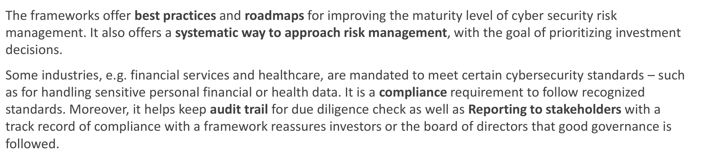

| 作用 | 说明 |
|---|---|
| **Best practice / Roadmap** | 提供成熟度提升路径，帮助企业系统化地做风险管理，而不是"东一榔头西一棒子" |
| **Compliance（合规要求）** | 金融、医疗等行业**被强制要求**满足特定标准（处理敏感个人财务/健康数据） |
| **Audit trail + Stakeholder reporting** | 留痕便于审计；向投资人/董事会证明"公司治理良好" |

**考点**：如果题目问"为什么企业要用framework而不是自己拍脑袋做安全"，答案要包含**系统性方法论 + 合规强制 + 对外证明治理良好**这三层，不能只说"更安全"。

**中英对照（考试可能是英文出题，建议直接背英文关键词）**：

| # | 中文 | English | 对应slide原词 |
|---|---|---|---|
| 1 | 系统性方法论 | **Systematic methodology / prioritized roadmap** for risk management decisions | Best practices, roadmaps, systematic way to approach risk management |
| 2 | 合规强制 | **Mandatory regulatory compliance**（部分行业被法律/监管要求） | Compliance requirement, recognized standards |
| 3 | 对外证明治理良好 | **Demonstrable governance**（留痕给审计、向董事会/投资人证明治理到位） | Audit trail, reporting to stakeholders, reassures investors/board |

**英文模范答句（可直接套用/背诵）**：
> *"Organizations adopt cybersecurity frameworks not simply to be 'more secure', but because frameworks provide (1) a **systematic, prioritized methodology** for risk management decisions, (2) a way to meet **mandatory compliance** requirements in regulated industries such as financial services and healthcare, and (3) an **audit trail that demonstrates good governance** to investors, regulators, and the board."*

🔴 **踩坑提醒**：千万别只写"more secure"或"防止被黑客攻击"——这个考点专门在测试你有没有理解framework的**三重价值**（方法论层/合规层/治理证明层），只答"更安全"等于没答到点子上。

---

## 2. 🔴 三大类框架（General 3 Types）— 这是本节课最重要的分类框架

这三类框架**不是互斥的，是叠加使用的**（后面会讲怎么组合）。

| 类型 | 回答的问题 | 代表框架 |
|---|---|---|
| **① Core Risk Management Framework**（核心风险管理框架） | "我们该管理哪些风险方向/该有什么样的outcome？" | NIST CSF、ISO27001/27002、CIS、COBIT、FAIR |
| **② Controls and Regulatory Framework**（控制与监管框架） | "具体要落实哪些控制点，满足哪个监管要求？" | NIST SP 800-53、HIPAA/HITRUST、GLBA、DORA、PCI DSS、SOC 2、FFIEC CAT |
| **③ Threat, Detection and Architecture Framework**（威胁/检测/架构框架） | "攻击者怎么打进来？我们怎么侦测和防守？" | MITRE ATT&CK & D3FEND、Kill Chain、Pyramid of Pain、Zero Trust |

**记忆技巧**：① 是"战略层"（要不要做、做什么方向），② 是"合规层"（必须做到什么程度，通常和监管挂钩），③ 是"战术层"（攻防语言，落地到具体技术动作）。

---

## 2.5 🟡 名词解释：Control / Objective / Safeguard 到底是什么（贯穿全课的基础词汇）

这几个词后面会反复出现（ISO27001的93个control、CIS的18个control+153个safeguard、COBIT的40个objective），但**粒度不一样**，提前搞清楚，后面看到这些数字就不会懵。

| 词 | 大白话理解 | 回答的问题 | 例子 |
|---|---|---|---|
| **Control（控制/控制措施）** | 一件具体要做的"防护动作/机制"，是可以被审计、能打勾"做了没做"的执行单位 | "要做哪件具体的事来降低风险？" | 开启MFA、日志保留90天、季度访问权限审查 |
| **Objective（目标/管理目标）** | 一个"责任领域/管理方向"，描述要达成的一类结果，本身不是单一动作，需要靠若干个control/activity一起实现 | "这个领域整体要管到什么程度？由谁负责？" | APO12 Managed Risk（把IT风险管理在企业能接受的范围内，这整件事） |
| **Safeguard（防护措施）** | CIS框架自己的说法，其实就是更细一级的control，是18个大类control下面具体的执行项 | "这个大类control具体拆成哪些可执行的小动作？" | CIS Control 5 "Account Management"下面的具体safeguard，比如"为所有账户强制唯一密码" |

**🔴 关键点——同一个词在不同框架里粒度不一样，别混着比**：
- **ISO27001 的 93 个 "control"** —— 已经是很具体的执行层动作（比如"加密"、"供应商尽调"），粒度接近 CIS 的 **safeguard**
- **CIS 的 18 个 "control"** —— 其实是"大类/方向"（比如"账户管理"这整个方向），粒度接近 COBIT 的 **objective**；真正落地执行的是它下面的 153 个 **safeguard**
- **COBIT 的 40 个 "objective"** —— 是最抽象的"管理责任域"，一个 objective 里往往需要多个具体 control/safeguard 才能实现

一个简单类比：**Objective 像"部门要达成的KPI"**（比如"风险要管好"）→ **Control 像"为达成KPI要遵守的具体规定"**（比如"每季度做一次风险评估"）→ **Safeguard/具体动作 像"执行这条规定的操作步骤"**（比如"用哪个模板、谁签字、多久一次"）。三者是**目标→规定→执行动作**层层往下拆解的关系，不是同一层级的三个平行概念。

---

## 3. 🔴 NIST CSF 2.0（VERY IMPORTANT）

### 3.1 定位
outcomes-based（以结果为导向）的框架，2024年2月发布 CSF 2.0，是目前**最全面、采用最广**(most comprehensive)的核心风险管理框架。
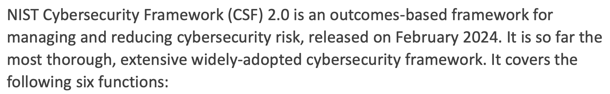

### 3.2 六大 Functions（🔴 必须背出名字+一句话核心目的）

| Function | 核心目的（一句话记忆） |
|---|---|
| **Govern (GV)** | 定战略、定风险胃口、定政策、定角色、管供应链期望 —— "谁说了算、方向是什么" |
| **Identify (ID)** | 摸清资产、系统、数据、业务背景、依赖关系和风险 —— "我有什么、风险在哪" |
| **Protect (PR)** | 落实防护措施：身份管理、访问控制、培训、数据安全 —— "怎么防" |
| **Detect (DE)** | 持续监控、日志、分析，发现异常事件 —— "怎么发现" |
| **Respond (RS)** | 遏制、分析、沟通、补救已确认的事件 —— "出事了怎么处理" |
| **Recover (RC)** | 恢复运营、提升韧性 —— "怎么恢复正常" |

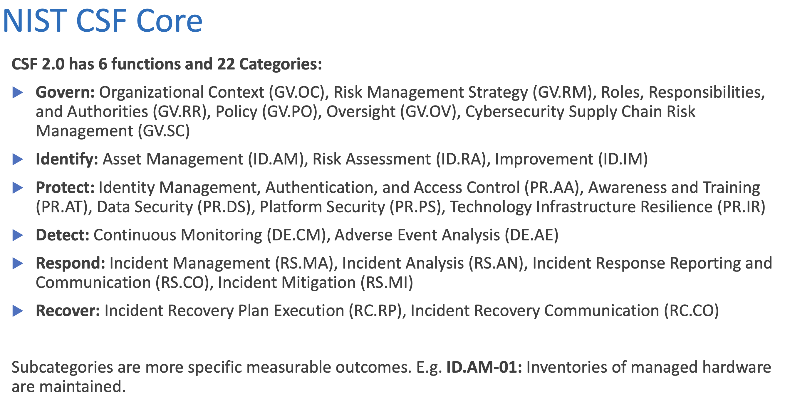
> 💡 这六个其实就是一个**闭环生命周期**：Govern（定方向）→ Identify → Protect → Detect → Respond → Recover，跟其他风险框架的"计划-预防-侦测-响应-恢复"逻辑是相通的。

### 3.3 三个组成部分（🔴 必背这三个词的定义区别，很容易考选择/填空）
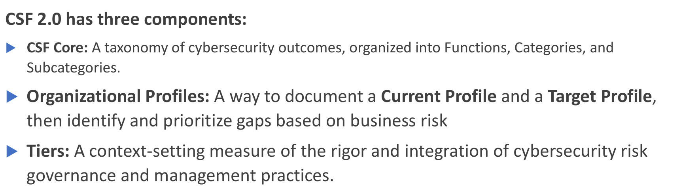

| 组成部分 | 是什么 |
|---|---|
| **CSF Core** | 一套 taxonomy（分类体系）：Functions → **Categories**（类别，22个）→ **Subcategories**（子类别，更具体可衡量的结果，如 `ID.AM-01`） |
| **Organizational Profiles** | 记录企业**现状（Current Profile）**和**目标（Target Profile）**的工具，用于识别和排序gap |
| **Tiers** | 描述企业网络风险治理的"严谨程度/整合程度"，**不是**合规认证，也**不是**打分 |

**重要区分（🔴 容易混淆考点）**：
- **Category / Subcategory** = 内容分类（"要管什么"）
- **Profile** = 现状 vs 目标的落地记录（"现在做到哪、要做到哪"）
- **Tier** = 治理成熟度的语境描述（"做得规不规范、整合不整合"），**Tier 高不代表控制点齐全，只代表管理过程成熟**

### 3.4 Organizational Profile 的五步流程（🟡 理解逻辑即可，不必逐字背）

1. **Scope the Profile**：定义评估范围（整个企业/某业务/某法律实体/某供应商关系）
2. **Gather inputs**：收集政策、风险胃口、BIA、威胁情报、监管要求、资产清单等
3. **Create Current & Target Profiles**：选定适用的Subcategories，记录现状、责任人、证据、目标
4. **Analyze gaps**：对比现状与目标，评估 **residual risk（剩余风险）**、依赖性、成本、可行性
5. **Implement and refresh**：执行计划、衡量进度，并在业务/威胁/技术变化时更新

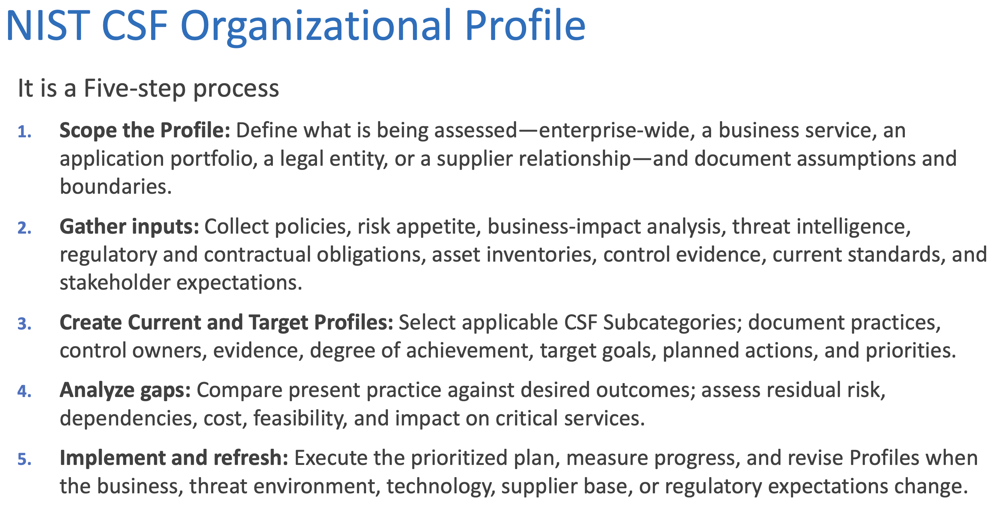
### 3.5 🔴 关键术语：Inherent Risk vs Residual Risk
虽然slide没有单独展开，但在 Gap Analysis 和 Profile 模板字段里反复出现，是风险管理的基础概念，**必须理解**：

- **Inherent Risk（固有风险）**：在**没有任何控制措施**情况下的原始风险水平
- **Residual Risk（剩余风险）**：**实施控制措施之后**仍然存在的风险水平

逻辑关系：`Residual Risk = Inherent Risk − 控制措施降低的部分`。这个概念是贯穿整个课程的底层逻辑（后面FAIR定量计算、Gap analysis排优先级，本质都是在算/比较 residual risk）。

**🟡 真实场景举例（帮助建立直觉）**：

假设某公司要评估"员工被钓鱼邮件骗取登录凭证、黑客借此登入邮箱/系统"这个风险：

- **Inherent Risk（固有风险）**：想象公司**完全没有任何防护**——没有邮件过滤、没有MFA、没有员工培训。这种"裸奔"状态下，只要黑客发一封钓鱼邮件，员工点击并输入密码的概率就很高，一旦得手黑客能直接登录系统。这个"完全不设防"情况下的风险水平，就是inherent risk——它只跟**资产有多敏感、攻击面有多大**有关，跟公司实际做没做防护无关，是一个理论上的"起点"。

- **公司落地了几项控制措施**：
  - 邮件过滤 + 员工反钓鱼培训（降低"员工上钩"的概率）
  - 启用MFA（就算密码泄露，没有二次验证也登不进去）
  - 异常登录地点/设备触发告警（就算登进去了也能被及时发现并阻断）

- **Residual Risk（剩余风险）**：做完以上措施后，风险明显降低了，但**不会降到0**——比如攻击者可能用deepfake语音/AI合成的方式同时骗取MFA验证码（参考第12节的deepfake诈骗案例），或者员工在未受管理的个人设备上被绕过。这个"控制措施都做了之后依然剩下的"风险水平，就是residual risk。

**类比第7节的FAIR公式**：控制措施本质上大多是在降低"Vulnerability"（让威胁事件更难真正变成损失事件），从而降低LEF；residual risk说到底就是控制措施生效之后剩下的 `LEF × LM`。

**记忆锚点**：企业做风险管理，目标从来不是把风险降到零（不现实，也不划算），而是把residual risk压到"风险胃口（risk appetite）"能接受的范围内——这也是为什么后面Gap Analysis、CSF Target Profile反复在讨论"这个gap要不要补、值不值得花钱补"。

### 3.6 Tiers 1-4（🟡 需要理解四个层级的递进关系，不需要逐字背 indicator）

| Tier | 描述 |
|---|---|
| **1 — Partial** | 临时性、被动反应、各自为政 |
| **2 — Risk Informed** | 管理层已意识到风险，但未在全企业范围内规范化 |
| **3 — Repeatable** | 有正式的、管理层批准的政策，被一致执行且定期审查 |
| **4 — Adaptive** | 持续用经验教训、指标、威胁情报改进，风险管理已融入企业整体规划 |

Tier 评估维度（🟢 了解即可）：Risk-management process 的规范程度 / Integrated risk-management program 是否与企业风险整合 / External participation 是否与供应商监管者协作。

### 3.7 财务行业落地案例（🟡 理解方法论，不需要背案例细节）
以 **PR.AA**（身份管理与访问控制）为例：
- Current Profile：MFA 只覆盖 VPN 和大部分 SaaS，遗留系统仍是纯密码登录
- Target Profile：所有特权/远程/外部可访问系统都要 **phishing-resistant MFA**，每个服务账号有明确owner
- Gap → 变成一个有owner、有deadline、有资金的**具体项目**

企业实施六步走（🟢 了解即可）：组建风险委员会 → 定义关键业务服务 → 建current profile → 建target profile → 按影响排优先级 → 通过Govern function向董事会汇报。

### 3.8 🔴 易混淆点澄清：Profile的颗粒度 vs Tier的适用范围（自问自答）

**Q1：Profile到底是针对Function、Category，还是Subcategory来制定的？**

准确说法是两层结合：
- **评估的最小单位始终是Subcategory**——五步流程里"Create Current & Target Profiles"这一步写的是"Select applicable **CSF Subcategories**"，Current/Target记录的其实是一条条subcategory的达成情况
- 但**覆盖范围（Scope）由企业自己决定**——这是五步流程的第一步"Scope the Profile"，可以窄到一个供应商关系，也可以宽到整个企业。你选择"这次评估要覆盖哪些Function/Category"，本质上就是在选"要不要把这些Function下面的Subcategory都纳入"

所以更精确的表述是：**Profile的"记录颗粒度"固定在Subcategory层级，但"覆盖广度"（选哪些Function/Category进来）由企业自行决定**——不是"可以选择用Category层级或Subcategory层级来制定"，而是"始终用Subcategory记录，但可以选择要不要评估这个Function/Category下的全部或部分Subcategory"。

**Q2：Tier能不能针对某一条Subcategory单独评？**

不太行，这是原理层面的限制，不是规则层面的限制。Tier评的三个维度——risk-management process是否规范、是否integrated进企业整体风险管理、external participation跟供应商监管者协作得怎么样——**天然是"一组能力/一个业务范围"才谈得上的东西**，落到单条subcategory（比如"硬件资产清单有没有维护"）上，没法回答"流程规不规范"这个问题。

Slide说的是 "characterize the rigor... **by Tier overall or for parts of the Profile**"，这里的"parts"更合理的理解是**Category或Function层级**（比如"我们Identify这个Function整体是Tier 2，Respond已经到Tier 3"），而不是精确到某一条subcategory打分。

🔴 **记忆锚点**：Subcategory/Profile 问的是"**有没有做到**"（是/否/程度）；Tier 问的是"**我们是怎么做到的**"（流程有多正式、多整合）——后一个问题只有放在一组能力里才成立，单条subcategory撑不起"流程"这个概念。

**Q3：Tier是不是对"现状"的评判？现状很烂但Tier依旧可以很高吗？**

**完全可以**，这正是Tier和Profile必须分开看的原因：

- **Profile层面的"现状"** 回答的是"结果/工具达到了目标的哪个程度"
- **Tier** 只回答"支撑这个结果的流程规不规范"，跟结果本身的先进程度**无关**

举例（资产清点，用Excel而非自动化工具，但流程严格）：
- **Current Profile的达成度看起来不高**：还在用Excel记录资产，没有自动化CMDB实时同步（对照"自动化实时追踪"这个Target，gap还很大——这是Profile层面在说的事）
- **但支撑这份Excel的流程很规范**：员工每天repeatedly核对、出入库有强制扫码标准、有明确责任人、定期被管理层review
- 这套**流程**完全符合 **Tier 3 (Repeatable)** 的定义——"Formal, management-approved policies and procedures are **consistently implemented and regularly reviewed**"

**结论**：工具/结果的先进程度（Profile维度）和管理流程的成熟度（Tier维度）是**两个互相独立的轴**，可以任意组合：
- 用Excel但流程严谨 = **Profile未达标 + Tier较高**（你举的例子）
- 上了最先进的CMDB但没人维护review = **Profile"看起来"达标 + Tier较低**
- 两者都到位 = 理想状态

> 小提醒：与其说"现状很烂"，更精确的表述是"**技术方案朴素/离Target Profile还有距离**"——Profile本身没有"烂不烂"的价值判断，只有"离目标有多远"；"烂"这个词容易让人误以为Profile也在评判"好坏"，而它其实只是**客观记录**现状和目标的落地文档。

---

## 4. 🔴 ISO 27001 / ISO 27002
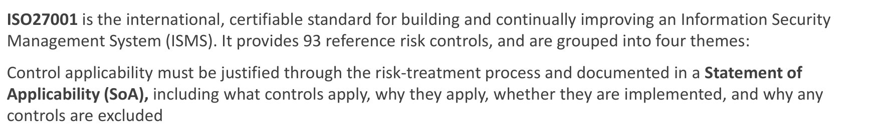
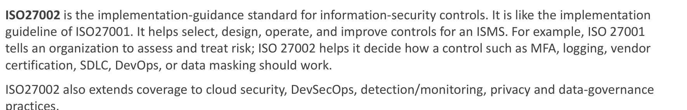

| | ISO 27001 | ISO 27002 |
|---|---|---|
| **性质** | 国际**可认证**标准（可以拿证书） | 实施指南（不可认证，是27001的"怎么做"手册） |
| **回答的问题** | 我们有没有一个可审计的ISMS来管理信息安全风险？ | 具体的控制措施该怎么设计、怎么运作？ |
| **核心产出** | **Statement of Applicability (SoA)**：哪些控制适用、为什么适用、是否已落实、为什么排除某些控制 | 例如MFA、日志、供应商认证、SDLC、DevOps、数据脱敏该怎么做 |

### 27001 的 93 个控制 / 4 大主题（🟡 数字建议记住，细节了解即可）
> 这里的"control"是具体执行层的动作（粒度接近CIS的safeguard），详见上文「2.5 名词解释」小节

| Theme | 控制数 | 覆盖内容 |
|---|---|---|
| Organizational (A.5) | 37 | 政策、资产归属、供应商、事件管理、云服务 |
| People (A.6) | 8 | 背调、雇佣条款、意识培训、远程办公 |
| Physical (A.7) | 14 | 安全区域、物理监控、设备保护 |
| Technological (A.8) | 34 | IAM、加密、日志、恶意软件防护、安全开发 |

### 🔴 CIA Triad（信息安全的三大基石，必考基础概念）
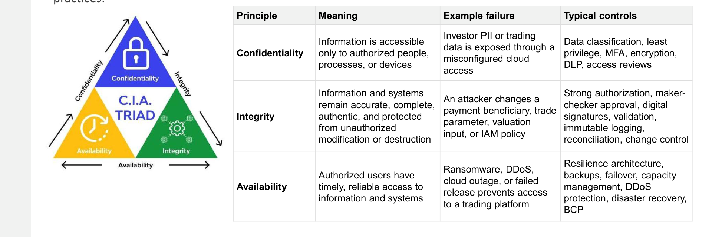

| 原则 | 含义 | 失败案例 | 典型控制 |
|---|---|---|---|
| **Confidentiality（保密性）** | 信息只能被授权的人/流程/设备访问 | 因云配置错误导致个人数据泄露 | 数据分类、最小权限、MFA、加密、DLP |
| **Integrity（完整性）** | 信息准确、完整、真实，不被未授权篡改 | 攻击者篡改支付收款方信息 | 强授权、maker-checker复核、数字签名、不可篡改日志 |
| **Availability（可用性）** | 授权用户能及时可靠地访问系统 | 勒索软件/DDoS导致交易平台不可用 | 容灾架构、备份、DR、BCP |

---

## 5. 🟡 CIS Critical Security Controls
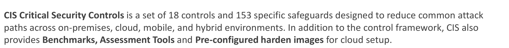

- **18 个 Controls + 153 个具体 Safeguards**，覆盖本地/云/移动/混合环境的常见攻击路径
- 附带 Benchmarks、评估工具、预配置加固镜像

> 这里的"control"（18个）是大类/方向，真正的执行动作是它下面的153个**safeguard**——粒度对照详见上文「2.5 名词解释」小节

**实施分组（🔴 这个表格建议记住，容易考"哪个组织该用哪个IG"）**：

| Group | 范围 | 适用对象 |
|---|---|---|
| **IG1** | 56 项 safeguards | 基础防护，应对常见攻击 |
| **IG2** | 130 项（累加） | 有专职IT/安全团队、系统敏感度较高的组织 |
| **IG3** | 全部153项 | 高风险、资源充足、频繁被威胁盯上的组织 |

18个控制不需要逐条死记，但要知道大类逻辑：**资产清点(1-2) → 配置与数据保护(3-4) → 身份与访问(5-6) → 漏洞管理(7) → 日志(8) → 邮件/浏览器(9) → 恶意软件(10) → 备份(11) → 网络(12-13) → 人员培训(14) → 供应商/软件安全(15-16) → 事件响应(17) → 渗透测试(18)**。

---

## 6. 🔴 COBIT 2019（Governance vs Management 的区分是考点）

**核心目的**：帮助董事会和高管确保技术**创造价值、在风险胃口内运作、资源被负责任地使用**。
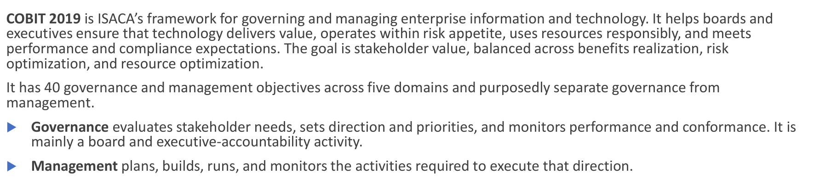

### 🔴 最重要的一句话概念区分：
- **Governance（治理）**：评估干系人需求、定方向、定优先级、监督绩效 —— **董事会/高管层的职责**
- **Management（管理）**：计划、建设、运行、监控具体活动去执行方向 —— **执行层的职责**

### 5大领域 / 40个objectives（🟡 记住领域名+一句话职能，不需要背全部objective代码）
> 这里的"objective"是最抽象的责任域/管理方向（不是单一动作），详见上文「2.5 名词解释」小节

| Domain | Objective数 | 职能 |
|---|---|---|
| **EDM**（Evaluate, Direct, Monitor） | 5 | 董事会/高管监督：治理框架、收益、风险、资源 |
| **APO**（Align, Plan, Organize） | 14 | 战略、架构、组合、预算、风险、安全、数据、供应商、人员 |
| **BAI**（Build, Acquire, Implement） | 11 | 项目、变更、方案交付、资产、发布部署 |
| **DSS**（Deliver, Service, Support） | 6 | 运营、服务交付、安全服务、连续性、事件、业务流程控制 |
| **MEA**（Monitor, Evaluate, Assess） | 4 | 绩效、内控、合规、保证 |

**与cyber security最相关的12个objectives里，重点记这两个（slide明确点名）**：
- **APO12 — Managed Risk**：在企业批准的容忍度内，持续识别/评估/降低I&T风险
- **APO13 — Managed Security**：定义、运行、监控信息安全管理系统

---

## 7. 🔴 Framework Comparison（把前面所有框架串起来）
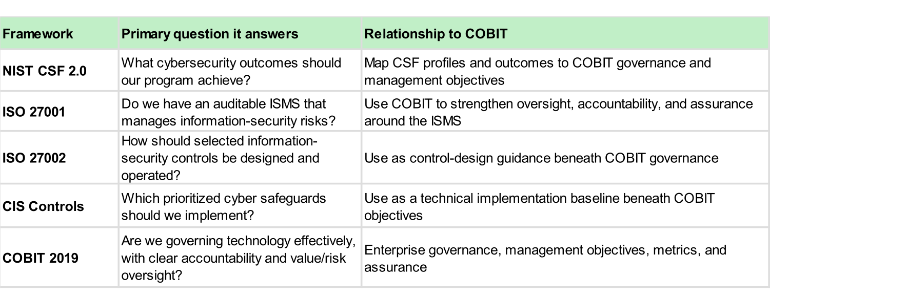

| Framework | 回答的问题 | 与COBIT的关系 |
|---|---|---|
| **NIST CSF 2.0** | 我们的安全项目该达成什么outcome？ | 把CSF profile映射到COBIT的治理/管理目标 |
| **ISO 27001** | 我们有没有可审计的ISMS管理信息安全风险？ | 用COBIT加强ISMS的监督、问责、保证 |
| **ISO 27002** | 选定的控制该怎么设计和运作？ | 作为COBIT治理下的控制设计指南 |
| **CIS Controls** | 该优先落实哪些具体的网络安全防护措施？ | 作为COBIT目标之下的技术落地基线 |
| **COBIT 2019** | 我们的技术治理是否有效、问责是否清晰？ | 企业级治理、管理目标、指标、保证 |

**🔴 一个典型运营模型（这段话如果考简答，直接照抄逻辑）**：
> 用 **COBIT** 分配董事会/高管/风险/技术/安全/审计的问责 → 用 **ISO 27001** 建ISMS → 用 **ISO 27002 + CIS Controls** 设计并落地具体控制环境 → 用 **NIST CSF Profile** 对外沟通当前安全状态和目标状态。

这句话本质上就是把①②③三大类框架，按照"谁负责—怎么建体系—具体怎么做—怎么对外汇报"的顺序串起来。

> 💡 注意这张表里没有FAIR——FAIR不是用来"分工"的框架，它是**独立的定量计算工具**，可以套在任何一个框架识别出来的风险点上算钱（下一节详细讲）。

---

## 8. 🔴 FAIR (Factor Analysis of Information Risk) — 定量风险计算模型

这是这节课**唯一有公式的框架**，非常容易考计算题/概念填空。

### 核心公式（必须背）
```
Risk = Loss Event Frequency (LEF) × Loss Magnitude (LM)
```
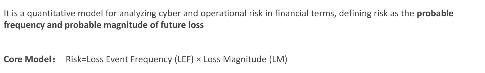

### 拆解逻辑（🔴 必须理解每层怎么算出来的）

```
Threat Event Frequency (TEF) ─┐
                                ├──→ Loss Event Frequency (LEF)
        Vulnerability ─────────┘

Primary Loss Magnitude ────────┐
                                 ├──→ Loss Magnitude (LM)
Secondary Loss Magnitude ───────┘

LEF × LM = Risk
```
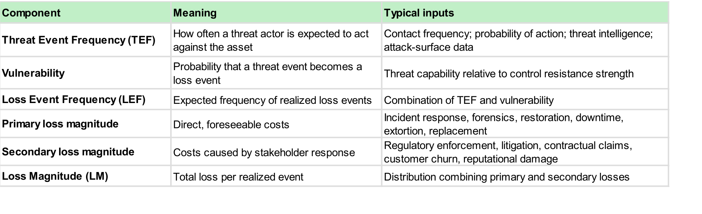

| 组件 | 含义 | 典型输入 |
|---|---|---|
| **TEF**（威胁事件频率） | 威胁行为者预计对该资产采取行动的频率 | 接触频率、行动概率、威胁情报 |
| **Vulnerability**（脆弱性） | 一次威胁事件真正变成损失事件的概率 | 威胁能力 vs 控制抵抗强度的对比 |
| **LEF**（损失事件频率） | TEF × Vulnerability 的组合结果，预期实际发生损失事件的频率 | — |
| **Primary Loss Magnitude**（直接损失） | 直接、可预见的成本 | 应急响应、取证、修复、停机、赎金、更换设备 |
| **Secondary Loss Magnitude**（次生损失） | 因干系人反应而产生的成本 | 监管处罚、诉讼、客户流失、声誉损害 |
| **LM**（总损失量级） | Primary + Secondary 的组合分布 | — |

### 🟡 大白话拆解：这几个词到底在说什么（配一个具体场景走一遍）

FAIR 的整个逻辑其实就是把"这件坏事有多大风险"拆成两个大白话问题：**"多久会发生一次？"（LEF）** 和 **"发生一次要赔多少？"（LM）**，再把这两个数字乘起来。而 LEF 和 LM 各自又能再往下拆一层。用一个场景走一遍——"公司的客户数据库被黑客拖库（数据泄露）"：

- **TEF（Threat Event Frequency，威胁事件频率）**：大白话就是 **"黑客一年大概会来敲几次门/试几次"**——不管这几次尝试最后成不成功，单纯是"有人在打这个主意、动手尝试"的次数。比如威胁情报显示，这类数据库一年大概会被扫描/尝试攻击20次。**这里还没涉及"成不成功"，只是"有没有人来试"。**

- **Vulnerability（脆弱性）**：大白话是 **"黑客每次来敲门，有多大概率真的能破门而入"**——是一个百分比/概率，取决于"攻击者的能力"相对"你的防御有多强"。比如数据库没打补丁、没做网络隔离，那这个概率可能是30%；如果做了严格的分段+及时打补丁，可能只有2%。**这里在回答"防得住防不住"。**

- **LEF（Loss Event Frequency，损失事件频率）= TEF × Vulnerability**：大白话是 **"这一年里，预计真的会发生几次数据泄露"**——把"来了多少次"和"每次成功率多高"结合起来，算出"预计真正出事的次数"。上面例子：20次尝试 × 30%成功率 ≈ **一年大概会真的出6次事**（如果加强了防御，20次 × 2% ≈ 一年大概0.4次，也就是"平均两年半才出一次事"）。

- **Primary Loss Magnitude（直接损失）**：大白话是 **"事情一旦发生，公司自己直接要掏的钱"**——不牵扯别人怎么反应，就是"处理这件事本身"的成本：请人做应急响应/取证、修复系统、业务停摆的损失、如果是勒索软件要付的赎金、换新设备的钱。比如一次数据泄露，直接花费约 **HK$5,000,000**（调查+修复+停机）。

- **Secondary Loss Magnitude（次生损失）**：大白话是 **"因为别人（监管、客户、媒体、股东）看到这件事之后做出反应，公司被迫多花/多亏的钱"**——不是处理事故本身的钱，而是"事故被外界知道之后的连锁反应"：监管罚款、集体诉讼、客户跑掉导致的收入损失、股价/声誉受损。比如同一次数据泄露，监管罚款+集体诉讼+客户流失，额外亏了 **HK$15,000,000**。

- **LM（Loss Magnitude，总损失量级）= Primary + Secondary**：大白话是 **"这一次事故总共让公司亏多少钱"**——把直接花的钱和因为别人反应多花的钱加起来。上面例子：500万 + 1500万 = **每次事故大概亏HK$20,000,000**。

- **最后 Risk = LEF × LM**：大白话是 **"平均一年下来，这个风险预计会让公司亏多少钱"**——把"多久出一次事"和"一次亏多少"相乘，变成一个"年化的期望损失"，方便管理层跟别的投资项目一样比较"值不值得花钱去防"。上面例子（未加强防御时）：6次/年 × HK$20,000,000/次 = **预期一年要亏HK$120,000,000**；如果加强防御后 LEF 降到0.4次/年：0.4 × HK$20,000,000 = **预期一年只亏HK$8,000,000**——这一进一出，就是"这笔安全投资到底值不值"的量化依据。

> 🔴 一句话记忆链：**TEF（来试几次）→ 乘以 Vulnerability（防不防得住）= LEF（真出几次事）**；**Primary（自己直接花的钱）+ Secondary（别人反应导致多花的钱）= LM（一次亏多少）**；**LEF × LM = Risk（一年平均预期亏多少）**。

下面这个互动计算器就是上面这个数据库拖库案例——默认是"未加固"场景，切到"已加固"能立刻看到**只改一个 Vulnerability**，Risk 从 HK$120M/年掉到 HK$8M/年；也可以自己拖动数字，感受哪个参数对最终 Risk 的杠杆最大：

<FairCalculator initial="databreach-weak" />

**考试提示**：如果给出一个场景，问"哪个是Primary loss哪个是Secondary loss"，判断标准是——**Primary = 直接花的钱**，**Secondary = 因为别人反应而多花的钱**（罚款、客户跑了、被告）。

**FAIR 和前面 NIST CSF 的 residual risk 概念是相通的**：FAIR是把"risk"这个抽象词，用财务语言变成LEF×LM这样一个可以量化、可以做cost-benefit分析的数字，方便管理层决策"这笔安全投资值不值"。控制措施主要是在降低**Vulnerability**（防得住的概率更高）或**LEF**（出事的频率更低），这跟第3.5节的residual risk逻辑完全一致。

---

## 9. 🔴 MITRE ATT&CK

**全称**：Adversarial **T**actics, **T**echniques, and Common Knowledge —— 一个**开放的、真实攻击者行为知识库**。
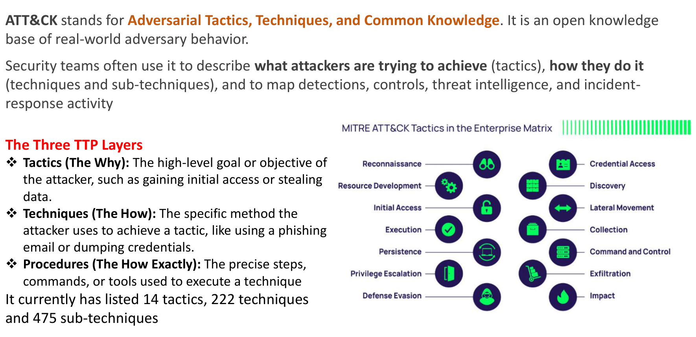

### TTP 三层结构（🔴 必背，很典型的填空/选择考点）

| 层级 | 英文 | 含义 | 记忆锚点 |
|---|---|---|---|
| **Tactics** | The **Why** | 攻击者的高层目标（如获取初始访问、窃取数据） | "为什么打" |
| **Techniques** | The **How** | 达成该目标的具体方法（如钓鱼邮件、凭证转储） | "怎么打" |
| **Procedures** | The **How Exactly** | 执行该技术的具体步骤、命令、工具 | "具体怎么打（脚本级）" |

### 规模（🟡 数字知道大概量级即可，不必精确背）
14 tactics、222 techniques、475 sub-techniques。

Enterprise Matrix 的典型 Tactics 顺序（🟢 了解攻击链先后顺序即可）：
Reconnaissance → Resource Development → Initial Access → Execution → Persistence → Privilege Escalation → Defense Evasion → Credential Access → Discovery → Lateral Movement → Collection → Command and Control → Exfiltration → Impact

### 第三方工具（🟢 知道名字即可，不需要会用）
- Open Source：**ATT&CK Navigator**（GitHub项目，可视化matrix）
- **CISA Decider**（美国CISA出品）
- MITRE-Engenuity
- **Mandiant**（Google子公司）

---

## 10. 🔴 MITRE D3FEND

**全称**：**D**etection, **D**enial, and **D**isruption Framework Empowering Network **D**efense —— 一个**防御技术的知识图谱**，把防御措施和ATT&CK里的攻击者行为**关联起来**。
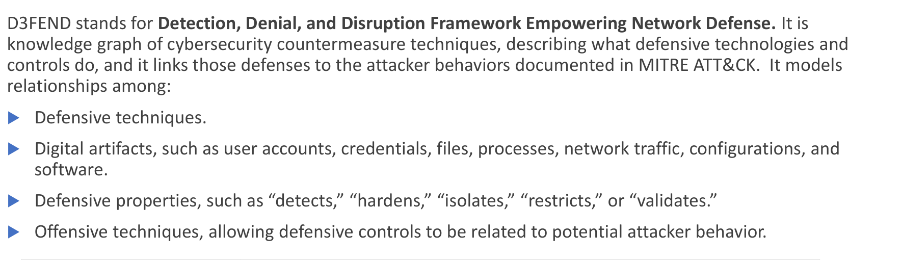

### 建模的四类关系（🟡 理解，不用死记术语顺序）
1. Defensive techniques（防御技术本身）
2. Digital artifacts（数字对象：账号、凭证、文件、进程、网络流量、配置、软件）
3. Defensive properties（防御属性：**detects / hardens / isolates / restricts / validates**）
4. Offensive techniques（把防御和ATT&CK里的攻击行为关联）

**一句话理解 D3FEND 和 ATT&CK 的关系**：ATT&CK 讲"攻击者会怎么打"，D3FEND 讲"针对这种打法，我该用什么类型的防御手段（侦测/拒绝/隔离/限制/验证）去应对"——**两者是攻防对照表**。

### 举例（🟡 建议记住这种"攻击顾虑→对应防御类型"的映射逻辑）

| Attack concern | 对应 D3FEND 防御方向 |
|---|---|
| 凭证钓鱼/窃取 | MFA、凭证加固、消息过滤、抗钓鱼认证 |
| 使用被盗凭证 | 访问策略执行、条件访问、账号使用监控、会话限制 |
| 横向移动 | 网络分段、网络隔离、远程服务限制、账号隔离 |
| 数据窃取 | 数据访问限制、文件监控、DLP、出站流量监控 |

### 五大用例（🟢 了解即可）
安全架构设计 / 控制差距分析（产品宣称的功能是否真的实现了）/ 检测工程（该采集哪些artifact）/ 采购（写技术中立的供应商需求）/ Purple teaming（用ATT&CK模拟攻击，用D3FEND验证防御是否真的检测/拒绝/阻断了）。

---

## 11. 🟡 Red / Purple / Blue Team
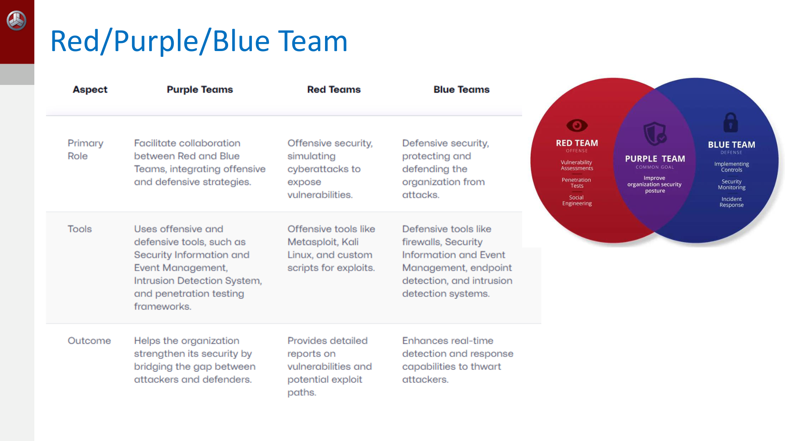

| | Red Team | Blue Team | Purple Team |
|---|---|---|---|
| **角色** | 攻方，模拟真实攻击暴露漏洞 | 守方，保护和防御组织 | 促进红蓝协作，整合攻防策略 |
| **工具** | Metasploit、Kali Linux、自定义漏洞脚本 | 防火墙、SIEM、终端检测、IDS | 攻防工具都用（SIEM+渗透测试框架） |
| **产出** | 漏洞和潜在攻击路径的详细报告 | 实时检测和响应能力提升 | 打通攻防之间的gap，整体提升安全姿态 |

**考点提示**：Purple Team 不是一个独立的第三个团队在打仗，而是**协作机制**——本质是让Red的发现快速变成Blue的检测规则。

---

## 12. 🔴 AI Impacts on Cyber Security — 深度案例（HK$200M Deepfake 诈骗）

这是本节课**唯一的真实案例**，很可能出现在考试的应用题/简答题里，建议按"root cause → attack chain → 该加什么控制"这个结构来记，而不是死记细节。

### 案例概述
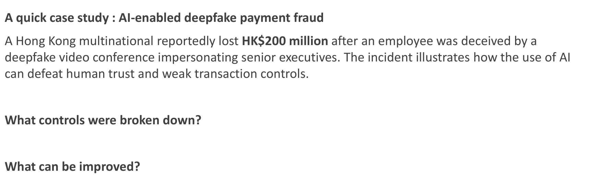

香港某跨国企业员工被 **deepfake视频会议**冒充高管欺骗，损失 HK$200 million。说明AI能**同时击穿人的信任和薄弱的交易控制**。

### 🔴 这类 Case Study 该怎么分析——两个层面（slide原题就是这个框架，考试大概率照这个结构出题）

slide在案例后面只问了两个问题——**"What controls were broken down?"（哪些控制失效了？）** 和 **"What can be improved?"（可以怎么改进？）**——这其实就是老师给的**通用case study分析方法论**：以后碰到任何一个安全事件案例（不只是这个deepfake案例），都应该按这两层来拆：

1. **第一层——诊断（Diagnose）："哪些控制失效了？"**：对应下面的 **Root Causes（根本原因）** 和 **Attack Chain（攻击链）** 两部分——先把"到底是哪个环节的哪个控制没挡住"搞清楚。这一层**只描述事实，不提解决方案**，是"复盘"阶段。
2. **第二层——开处方（Prescribe）："可以怎么改进？"**：对应后面的 **控制改进** 部分——针对第一层找到的每一个失效点，具体提出"该加什么control/流程"去堵上这个漏洞。

**🔴 记忆锚点（也是简答题的标准答题结构）**：**先诊断，后开药**——不能跳过第一层直接说"我们应该上MFA"，一定要先说清楚"因为XX这个控制点缺失/失效了，所以攻击者才能得手，因此需要加YY控制"，这样的答案才有逻辑闭环。

### 🔴 五大 Root Causes（建议逐条理解，考试常考"哪个环节失效了"）

> 🟡 **Root Cause 是什么意思？** 就是"**根本原因**"——不是"表面上发生了什么事"，而是往下追问"制度/流程层面到底是哪个深层漏洞，导致这件事能够发生"。
>
> 举例：表面现象是"员工批准了一笔假的转账"（这只是**症状 symptom**，是"发生了什么"）；往下追问"为什么这笔假转账能被批准？"——答案可能是"因为公司默认视频/语音通话就等于身份证明，没有其他独立验证渠道"，**这才是root cause**（是"为什么防线没能挡住"）。
>
> **区分技巧**：症状回答"发生了什么"，root cause回答"哪个control本该存在/生效但没有"。同一个事件往往能问出好几层"为什么"（这就是经典的**5 Whys**方法），一直往下追问到"这是一个制度/流程设计上的漏洞"为止，才算挖到了root cause，而不是停在"员工大意了"这种表面归因上。

| Root Cause | 说明 |
|---|---|
| 身份验证依赖外表 | 视频/语音被默认当作高管身份的证明 |
| 高风险动作的控制路径不足 | 社工请求可以在没有独立验证的情况下推进付款流程 |
| 权威绕过了验证 | "老板发话+紧急"压制了正常的质疑/挑战流程 |
| 收款方控制不足 | 新增收款人、异常付款模式没有触发足够强的"停下来核实"机制 |
| 检测太晚 | 缺乏实时行为/交易监控，无法及时升级异常付款序列 |

### 🔴 Attack Chain（按阶段记，考试可能让你填空/排序）
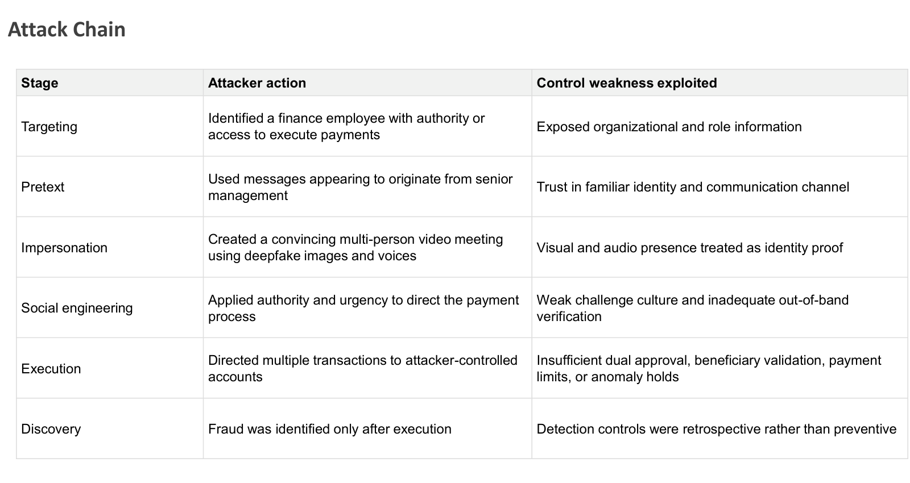

| 阶段 | 攻击者动作 | 被利用的控制弱点 |
|---|---|---|
| **Targeting** | 锁定有付款权限的财务员工 | 组织架构和岗位信息暴露过多 |
| **Pretext** | 伪装成高管发送消息 | 对熟悉身份/沟通渠道的信任 |
| **Impersonation** | 用deepfake图像和声音制造逼真的多人视频会议 | 视觉/听觉呈现被当作身份证明 |
| **Social Engineering** | 用权威+紧迫感引导付款流程 | 挑战文化薄弱、缺少带外(out-of-band)验证 |
| **Execution** | 多笔转账转到攻击者账户 | 双重审批、收款人验证、限额、异常拦截都不足 |
| **Discovery** | 事后才发现诈骗 | 检测控制是事后追溯型而非事前预防型 |

### 🟡 对应的控制改进（三大类，理解逻辑即可，不必逐条背）
- **身份与沟通**：抗钓鱼MFA + 强交易签名、建立反冒充流程（涉及钱/凭证/敏感数据/绕过安控的请求都必须被质疑）、用AI钓鱼邮件和deepfake场景做员工模拟培训
- **治理与应急准备**：把deepfake冒充和AI诈骗纳入企业威胁模型和欺诈风险登记册、做涉及高管身份被冒充的演练、与银行建立快速响应机制（撤回请求/冻结账户/证据保全/报警）
- **操作控制**：超阈值付款要求双重独立审批、变更收款方/银行信息/异常金额要有验证程序、**"仅凭邮件/聊天/语音/视频通话不能作为核实重大付款指令的充分依据"**（🔴这句是slide原话精神，建议直接记住这个判断标准）、收款人白名单、冷静期、maker-checker、多风险信号叠加时自动暂停待审

### 🔴 AI 对网络安全的双面影响（框架性总结，考试很可能考"举例说明AI如何同时提升攻击和防御能力"）

**Better Offenses（攻击者获得的AI增益，集中在攻击链早期阶段）**：

| 攻击环节 | AI带来的影响 |
|---|---|
| 侦察 | 更快聚合公开信息、技术指纹、员工角色、暴露资产 |
| 钓鱼/社工 | 更流畅的定制邮件、多语言诱饵、克隆语音、合成视频冒充 |
| 恶意软件与脚本 | 更快生成/修改/调试/混淆代码（复杂操作仍需专业知识） |
| 凭证与身份攻击 | 基于泄露数据更精准定位、更逼真的BEC(商业邮件诈骗)场景 |
| 数据分析 | 入侵后更快提取敏感信息、识别高价值目标 |
| 攻击规模 | 自动化campaign可测试更多目标、变化内容绕过静态检测 |

**Better Defenses（防守方获得的AI增益）**：
- **检测与分流**：识别异常行为、聚合相关告警、优先排序真实事件、降低低价值告警噪音
- **钓鱼与欺诈防御**：分类可疑消息/域名/附件/行为模式，标记异常付款或身份事件
- **漏洞管理**：映射资产、总结安全公告、识别可被利用的暴露面、按资产关键性和活跃威胁排优先级
- **事件响应**：加速信息富化、案例总结、playbook执行、遏制建议、证据收集
- **安全工程**：开发人员用AI审查代码、生成测试、识别不安全模式、把控制转化为IaC或检测内容

**一句话总结考点**：AI**不改变攻防的基本逻辑**（还是侦察→武器化→交付→执行→…），但AI**大幅提高了双方的效率和规模**，尤其是攻击链**早期阶段**（侦察、钓鱼、冒充）被显著放大——这也是为什么deepfake案例里"身份验证依赖外表"这个薄弱环节被针对性击穿。

---

## 13. 🟢 课堂小作业（不是考点，仅记录context）

- 主题：企业采用AI会带来哪些新风险？
- 要求：团队协作，至少3个风险+对应remediation，下周二前提交canvas，随机抽3组做5-10分钟展示+2-3分钟Q&A

---

## 14. 模拟自测题（自我检查用，不代表真实考题）

<QA q="为什么企业要用 framework，而不是自己拍脑袋做安全？请说出三层理由。">
Framework 提供三重价值，不能只答"更安全"：① **系统性方法论**——提供成熟度提升路径，系统化做风险管理而不是东一榔头西一棒子；② **合规强制**——金融、医疗等行业被法律/监管要求满足特定标准；③ **对外证明治理良好**——留痕便于审计，向投资人/董事会证明公司治理到位。
</QA>

<QA q="Control、Objective、Safeguard 这三个词有什么区别？为什么不能跨框架直接比数字？">
**Objective（目标）**是最抽象的责任领域（如 COBIT 的 APO12），本身不是单一动作；**Control（控制）**是可审计、能打勾"做了没做"的具体防护动作；**Safeguard（防护措施）**是 CIS 框架自己的说法，是 18 个大类 control 下面更细的执行项。三者是"目标→规定→执行动作"层层拆解的关系，但**同一个词在不同框架里粒度不一样**——ISO 27001 的 93 个"control"粒度接近 CIS 的 safeguard，CIS 的 18 个"control"粒度接近 COBIT 的 objective，所以不能直接拿"ISO 有 93 个 control"和"CIS 有 18 个 control"来说谁的控制更多。
</QA>

<QA q="NIST CSF 2.0 的 Category/Subcategory、Profile、Tier 三者分别回答什么问题？">
**Category/Subcategory** 回答"要管什么"（内容分类）；**Profile** 回答"现在做到哪、要做到哪"（现状 vs 目标的落地记录，记录颗粒度固定在 Subcategory）；**Tier** 回答"我们是怎么做到的"（流程有多正式、多整合，不是合规认证也不是打分）。三者互相独立：Tier 高不代表控制点齐全，只代表管理过程成熟；现状很朴素但流程规范，一样可以是 Tier 3。
</QA>

<QA q="Inherent Risk 和 Residual Risk 的区别是什么？和 FAIR 公式是什么关系？">
**Inherent Risk（固有风险）**是完全没有任何控制措施时的原始风险水平，只跟资产敏感度和攻击面有关；**Residual Risk（剩余风险）**是实施控制措施之后仍然存在的风险水平。关系：Residual Risk = Inherent Risk − 控制措施降低的部分。对应到 FAIR 公式，控制措施本质上大多在降低 Vulnerability（从而降低 LEF），residual risk 说到底就是控制生效后剩下的 `LEF × LM`。
</QA>

<QA q="ISO 27001 和 ISO 27002 有什么区别？各自的核心产出是什么？">
**ISO 27001** 是国际可认证标准，回答"我们有没有一个可审计的 ISMS 来管理信息安全风险"，核心产出是 **Statement of Applicability (SoA)**——哪些控制适用、是否已落实、为什么排除某些控制。**ISO 27002** 是不可认证的实施指南，回答"具体的控制措施该怎么设计、怎么运作"，是 27001 的"怎么做"手册。
</QA>

<QA q="COBIT 里 Governance 和 Management 的区别是什么？APO12 和 APO13 分别是什么？">
**Governance（治理）**是评估干系人需求、定方向、定优先级、监督绩效，属于董事会/高管层的职责；**Management（管理）**是计划、建设、运行、监控具体活动去执行方向，属于执行层的职责。**APO12 (Managed Risk)** 是在企业批准的容忍度内持续识别/评估/降低 I&T 风险；**APO13 (Managed Security)** 是定义、运行、监控信息安全管理系统。
</QA>

<QA q="用课件给出的运营模型，说明 NIST CSF、ISO 27001、ISO 27002、CIS Controls、COBIT 五个框架是怎么串起来一起用的。">
用 **COBIT** 分配董事会/高管/风险/技术/安全/审计的问责 → 用 **ISO 27001** 建 ISMS → 用 **ISO 27002 + CIS Controls** 设计并落地具体控制环境 → 用 **NIST CSF Profile** 对外沟通当前安全状态和目标状态。FAIR 不在这张分工表里，因为它不是用来"分工"的框架，而是可以套在任何一个框架识别出的风险点上算钱的独立定量工具。
</QA>

<QA q="FAIR 公式里，Primary Loss 和 Secondary Loss 怎么区分？给一个判断标准。">
判断标准：**Primary = 直接花的钱**（应急响应、取证、修复、停机、赎金），不牵扯别人的反应；**Secondary = 因为别人（监管、客户、媒体、股东）看到这件事之后做出反应，而多花/多亏的钱**（监管罚款、集体诉讼、客户流失、声誉受损）。同一个事故里两者要分开算，最后 LM = Primary + Secondary。
</QA>

<QA q="MITRE ATT&CK 的 Tactics / Techniques / Procedures 三层分别回答什么问题？和 D3FEND 是什么关系？">
**Tactics** 回答 "The Why"——攻击者的高层目标（如获取初始访问）；**Techniques** 回答 "The How"——达成目标的具体方法（如钓鱼邮件）；**Procedures** 回答 "The How Exactly"——执行该技术的具体步骤/命令/工具。**D3FEND** 是防御技术知识图谱，把防御措施和 ATT&CK 里的攻击者行为关联起来——ATT&CK 讲"攻击者会怎么打"，D3FEND 讲"针对这种打法该用什么类型的防御手段（侦测/拒绝/隔离/限制/验证）"，两者是攻防对照表。
</QA>

<QA q="分析 HK$200M Deepfake 诈骗案例，为什么老师强调「先诊断，后开药」，不能直接跳到「应该上 MFA」？">
因为不先诊断清楚"哪个具体控制点失效了"，提出的补救措施就是无的放矢、答案没有逻辑闭环。正确结构是先说清楚"因为 XX 控制缺失/失效，所以攻击者才能得手"（对应五大 Root Causes，例如"身份验证依赖外表"），再针对每个失效点提出"该加什么 control/流程"（例如强交易签名、双重独立审批）。跳过诊断直接开药方，答案就只是堆砌安全名词，答不到案例分析想考的因果链。
</QA>

<QA q="为什么说 AI 不改变攻防的基本逻辑，只是放大了效率和规模？重点放大了攻击链的哪个阶段？">
攻防的基本逻辑依然是"侦察 → 武器化 → 交付 → 执行 → …"这条链，AI 并没有创造新的攻击阶段，而是让双方在**已有环节里**做得更快、更逼真、更大规模——比如钓鱼邮件更流畅定制、恶意代码生成更快、检测告警的优先排序更准。**攻击链早期阶段（侦察、钓鱼/社工、冒充）被显著放大**，这正是 Deepfake 案例能得手的原因：AI 把"冒充身份"这个早期环节的逼真度和效率都拉满了，而后端的支付控制没跟上。
</QA>

---

## 附：一页速记表（考前5分钟扫一眼）

| 框架 | 一句话 | 关键数字 |
|---|---|---|
| NIST CSF 2.0 | outcomes-based，6 Functions + 3 Components (Core/Profile/Tier) | 6 functions, 22 categories |
| ISO 27001 | 可认证ISMS标准，产出SoA | 93 controls, 4 themes |
| ISO 27002 | 27001的实施指南，落地CIA triad | — |
| CIS Controls | 优先级排序的技术防护清单 | 18 controls, 153 safeguards, IG1/2/3 |
| COBIT 2019 | 企业IT治理框架，区分Governance vs Management | 40 objectives, 5 domains |
| FAIR | 定量风险模型 | Risk = LEF × LM |
| MITRE ATT&CK | 攻击者行为知识库，TTP三层 | 14 tactics, 222 techniques, 475 sub-techniques |
| MITRE D3FEND | 防御技术知识图谱，对照ATT&CK | detects/hardens/isolates/restricts/validates |

**最终一句话记住整节课**：企业先用①核心框架定方向和目标状态，再用②合规框架满足强制要求，最后用③威胁架构框架把方向落到具体的攻防技术动作上；FAIR负责把风险变成钱，ATT&CK/D3FEND负责把攻防变成可对照的技术语言；而AI正在同时放大攻防两端的效率，deepfake案例就是这套逻辑在真实世界的体现。
