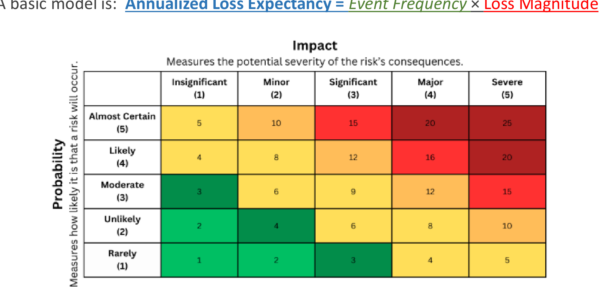
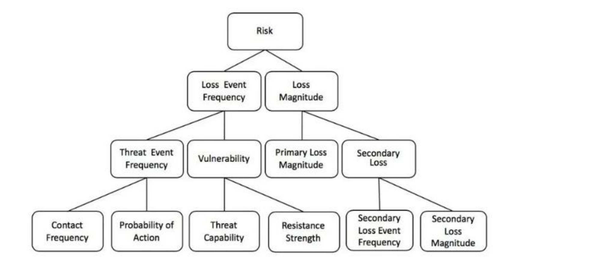
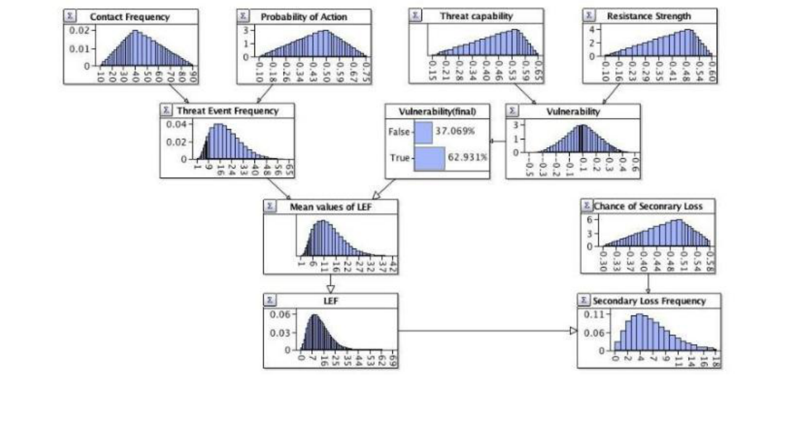

---
title:
  en: "Week 3 · Risk Management Methodology & Threat Modeling"
  zh: "第 3 周 · 风险管理方法论与威胁建模"
summary:
  en: "The 7-step cyber risk management methodology, threat modeling, inherent/residual risk, monitor-report-test-reassess, and a deep dive into the FAIR quantitative model with a detailed ransomware case and Monte Carlo simulation."
  zh: "网络安全风险管理七步法、威胁建模、固有/剩余风险、监控-报告-测试-重评估，以及 FAIR 定量模型深挖（详细勒索软件案例 + 蒙特卡洛模拟）。"
week: 3
date: 2026-09-09
tags: [Risk Management, Threat Modeling, FAIR, Monte Carlo, Inherent Risk]
---
# ISOM 5070 Cyber Security Risk Management — Week 3 复习笔记

**主题：Cyber Security Risk Management Methodology（七步法）· Threat Modeling · Inherent / Residual Risk · Monitor, Report, Test, Reassess · FAIR 定量风险模型深挖**

> 优先级标注说明（按考试重要性）：  
> 🔴 **必考核心** — 概念名称、定义、结构必须能背出来  
> 🟡 **需要理解** — 需要懂逻辑关系，能举例说明  
> 🟢 **了解即可** — 背景知识，考试大概率不会细抠
>
> **优先级依据**：  
> ① **篇幅**：全篇 36 页里，FAIR 一个话题就占了 p.23–36 共 14 页（近 40%），是本周分量最重的部分；Monitor/Report/Test/Reassess 占 p.13–21 共 9 页；  
> ② **重复强调**：FAIR 的核心公式 `Risk = LEF × LM` 在 Week 2 已经出现过一次，Week 3 又用整整 14 页重新展开、给出完整 workflow 和一个带数字的详细案例——**同一个知识点被老师反复讲，几乎可以确定是必考点**；  
> ③ **案例密度**：本周唯一附带具体数字、Low/Most-likely/High 三档估计、Monte Carlo 模拟图的内容也是 FAIR，说明老师希望学生能**真正算一遍**，而不只是背公式；  
> ④ 七步法（p.5）是这门课risk management的主干流程，后面几周（Week 4 财务建模、Week 5 供应链风险、Week 6 应急响应）都会在这七步的某一步上展开，必须先建立整体框架。

---

## 0. 核心地图（先建立整体框架）

这节课把 Week 1–2 讲的"风险是什么、用什么框架"落地成**一套可以逐步执行的方法论**：

```
① Establish context and governance（划边界、定责任人）
   → ② Identify assets, processes, data, dependencies（盘点要保护什么）
      → ③ Threat Modeling（谁会来、怎么攻、哪里弱、打中什么、后果是什么）
         → ④ Assess inherent risk（不考虑控制措施时风险有多大：Likelihood × Impact）
            → ⑤ Select and implement risk treatment（Mitigate / Avoid / Transfer / Accept）
               → ⑥ Assess residual risk and obtain acceptance（控制措施生效后还剩多少风险，谁签字认了）
                  → ⑦ Monitor, report, test, and reassess（持续检查这一切是否还成立）
                        ↺ 变化了就回到 ① 重新走一遍
```

**一句话抓住本周**：前六步是"怎么把一个风险从发现到处理走完一遍"，第七步是"怎么确保这套判断不会过期"；而 **FAIR** 不是这七步之外的新东西，是**把第④步"Assess inherent risk"和第⑥步"Assess residual risk"里的"风险有多大"，从一个模糊的高/中/低，换算成一个具体的美元数字**，方便管理层做成本效益决策。

---

## 1. 🔴 Step ①–②：Establish Context & Governance / Identify Assets

### 1.1 Establish Context：先划边界

Establish Context 这一步没有配图，是纯文字的四件事：

| 要素                            | 课件原文                                                                                                                                  | 中文 / 小白解释                                |
| ----------------------------- | ------------------------------------------------------------------------------------------------------------------------------------- | ---------------------------------------- |
| **Scope（范围）**                 | Business unit, platform, process, legal entity, cloud tenant, third party, or critical service                                        | 这次风险评估到底管到哪——一个业务线？一个云租户？一个第三方关系？        |
| **Business objectives（业务目标）** | Revenue protection, client confidentiality, service availability, regulatory compliance, financial resilience, operational continuity | 保护这些目标不受影响，是做风险管理的"why"                  |
| **Risk appetite（风险胃口）**       | The level of cyber risk the board and senior management is prepared to tolerate                                                       | 董事会和高管**愿意承受**多大风险——这是后面判断"要不要治理这个风险"的标尺 |
| **Assessment criteria（评估标准）** | Likelihood, impact, risk-rating scale, evidence requirements, review cadence, escalation thresholds                                   | 用什么尺子量风险、多久复查一次、多严重要上报                   |

### 1.2 Establish Governance：分配责任人

🔴 **考点**：Establish Governance 就是给四类角色签字画押——**business risk owner**（业务风险所有者）、**technology/control owner**（技术/控制措施所有者）、**security owner**（安全负责人）、**formal risk-acceptance authority**（正式的风险接受权限人）。少了这一步，后面第⑥步"obtain acceptance"根本没人能签字。

### 1.3 金融机构典型的风险影响面（p.7）

> **💡 为什么单独列这张表**
>
> 这张表回答"**风险大不大要看哪几个维度**"，和 FAIR 的 Loss Magnitude 拆解（Primary/Secondary）逻辑相通——**先列全影响面，才能不漏项地估损失**。

| Impact Area           | 该问的问题                      |
| --------------------- | -------------------------- |
| **Financial**         | 潜在损失、修复成本、欺诈风险、合同违约责任有多大？  |
| **Client**            | 客户资产、PII、交易数据、机密持仓会不会暴露？   |
| **Regulatory**        | 会不会触发可报告事件、监管违规、审计发现、执法行动？ |
| **Operational**       | 交易、开户、支付、保证金、结算、客户服务会中断多久？ |
| **Reputation**        | 机构客户或交易对手的信心会不会受损？         |
| **Safety / systemic** | 会不会影响市场诚信、金融稳定、关键基础设施？     |

### 1.4 Identify what to protect（资产盘点，p.8）

🟡 六类要盘点的东西，**每一类都要有 named owner（指定负责人）能说清楚"这东西没了业务上会怎样"，并且写下来**：

| 类别                          | 例子                                                                                                                                 |
| --------------------------- | ---------------------------------------------------------------------------------------------------------------------------------- |
| **Core services** 核心服务      | Trading platforms, client portals, payment systems, market-data infrastructure, settlement workflows, treasury, identity platforms |
| **Information assets** 信息资产 | Client PII、KYC records、交易与持仓数据、源代码、模型、凭证、密钥、内部策略文件                                                                                 |
| **Technology assets** 技术资产  | Applications、APIs、云账号、端点、数据存储、网络分段、SaaS、OT/IoT                                                                                     |
| **Dependencies** 依赖关系       | 托管服务商、云服务商、经纪商、交易所、市场数据供应商、软件供应商、外包运营                                                                                              |
| **Data flows** 数据流向         | 敏感数据从哪产生、流向哪、被怎么处理、存在哪、离开组织的路径                                                                                                     |
| **Ownership** 责任人           | 能说清"这东西被攻破/中断会造成什么业务后果"的人，**并且要文档化**                                                                                               |

---

## 2. 🔴 Step ③：Threat Modeling — Scenario & Vulnerability

### 2.1 一个合格威胁模型的五要素（🔴 必背，选择/填空常考）

| # | 要素                             | 说明          |
| - | ------------------------------ | ----------- |
| 1 | **An Actor**                   | 谁在攻击（威胁行为者） |
| 2 | **An attack path**             | 怎么打进来       |
| 3 | **A weakness (vulnerability)** | 哪个环节弱       |
| 4 | **Targeted assets/services**   | 打中什么资产/服务   |
| 5 | **Business impacts**           | 造成什么业务后果    |

> **✍️ 课件例句：把五要素串成一句话（可以直接当模板背）**
>
> *"A financially motivated hacker group **compromises a privileged administrator account** through **phishing and MFA fatigue**, uses **excessive cloud permissions** to **exfiltrate client onboarding data**, and **disrupts the client portal**, resulting in **client privacy exposure, regulatory notification, client remediation costs, and loss of service availability**."*
>
> 拆开看：Actor = financially motivated hacker group；Attack path = phishing + MFA fatigue → 拿到特权账号；Weakness = excessive cloud permissions；Targeted asset = client onboarding data + client portal；Business impact = privacy exposure + regulatory notification + remediation cost + availability loss。
>
> **答题模板**：只要题目给一个场景，就按"谁 → 怎么打 → 哪里弱 → 打中什么 → 造成什么后果"五段式拆解，写威胁建模题基本不会跑偏。

### 2.2 用什么素材来构造威胁场景（p.10，🟡 列举题）

➢ MITRE ATT\&CK techniques 与已观察到的攻击路径（呼应 Week 2 的 ATT\&CK）  
➢ Threat intelligence 与行业相关的对手活动  
➢ Incident and near-miss history（事故与未遂事件历史）  
➢ Business-impact analysis 与灾难恢复测试  
➢ Penetration testing、red-team exercises、vulnerability management  
➢ Supplier and third-party assessments  
➢ Architecture reviews、云配置审查、身份/访问审查  
➢ Regulatory findings 与内部审计观察

> **➕ 课外补充：这张清单其实是在说「情报不是凭空想象」**
>
> 威胁场景不能靠"我觉得黑客可能这样打"拍脑袋编，必须有证据支撑——这也是为什么 Week 2 学的 **MITRE ATT\&CK**（真实攻击者行为知识库）会被放在这份清单第一位。

---

## 3. 🔴 Step ④：Assess Inherent Risk

> **Inherent risk** is the level of risk **before considering existing controls**. It helps distinguish intrinsically high-risk activities from lower-risk activities with weak implementation.

🔴 **两个基础公式（必背）**：

```
Inherent Risk = Likelihood × Impact
Annualized Loss Expectancy (ALE) = Event Frequency × Loss Magnitude
```

> **💡 小白理解**
>
> 这两个公式其实是同一个逻辑在两个粒度上的表达：**Likelihood/Event Frequency 回答"多久会发生"，Impact/Loss Magnitude 回答"发生一次多严重"**——这和第 8 节 FAIR 的 `Risk = LEF × LM` 是同一条思路的三个版本，粒度从粗到细：Inherent Risk（定性）→ ALE（半定量）→ FAIR（定量，带概率分布）。

### 🔴 风险矩阵（Likelihood × Impact Heat Map）



*5×5 风险矩阵：横轴 Impact（后果严重度），纵轴 Probability（发生可能性），交叉格 = 两者相乘的风险分数（Slide 11）*

| 颜色        | 分数区间  | 含义                    |
| --------- | ----- | --------------------- |
| 🟢 深绿     | 1–3   | 风险很低，通常可以直接 Accept    |
| 🟡 黄      | 4–9   | 中等，需要评估是否在 appetite 内 |
| 🟠 橙      | 10–12 | 偏高，通常需要 Mitigate      |
| 🔴 红 / 深红 | 14–25 | 高到严重，往往需要立即处理或上报董事会   |

🎯 **考点**：矩阵不是"背数字"，而是理解**分数 = Probability 等级 × Impact 等级**——例如 Probability=Likely(4) × Impact=Major(4) = 16（红色）。给一个场景问"这个风险大概落在矩阵哪个格子"，要先分别判断 Likelihood 档位和 Impact 档位，再相乘。

---

## 4. 🔴 Step ⑤：Evaluate Control and Select Treatment

### 4.1 评估控制措施的四个标准（p.12）

➢ **Design effectiveness**：这个控制**设计上**能不能实质性降低这个场景的可能性或影响？  
➢ **Operating effectiveness**：是不是**持续被部署**、被监控、有证据、被测试过？  
➢ **Coverage**：覆盖了所有相关的用户、系统、地区、账号、数据流、第三方吗？  
➢ **Resilience**：能不能扛住**真实的对手、控制失效、运营中断**？

> **🧠 记忆口诀**
>
> **Design 管"有没有用"，Operating 管"有没有真的在跑"，Coverage 管"有没有漏"，Resilience 管"扛不扛得住"。** 四个都要过关，一个控制措施才算真的有效。

### 4.2 🔴 四种风险处置策略（Mitigate / Avoid / Transfer / Accept，必背）

| 策略              | 什么时候用                   | 例子                               |
| --------------- | ----------------------- | -------------------------------- |
| **Mitigate 缓解** | 控制措施能**划算地**降低可能性或影响    | 上抗钓鱼 MFA、PAM、网络分段、不可篡改备份、EDR、DLP |
| **Avoid 规避**    | 这个活动**超出了风险胃口**         | 不允许高风险数据用例、不支持不安全的遗留系统集成         |
| **Transfer 转移** | 别人能通过合同或财务方式**承担一部分损失** | 网络保险、赔偿条款、托管服务协议                 |
| **Accept 接受**   | 剩余风险在胃口内，**被正式批准**      | 对一个即将被替换的遗留平台做限时风险接受             |

🎯 **考点**：给一个场景判断该用哪种策略，标准是——**能不能划算地降低（Mitigate）？活动本身值不值得做（Avoid）？有没有第三方能分担（Transfer）？剩下的能不能接受、谁签字（Accept）？** 四选一，选的时候要讲出"为什么不是另外三个"。

---

## 5. 🔴 Step ⑥–⑦：Monitor, Report, Test, Reassess

这是本周篇幅第二大的部分（p.13–21，共 9 页），是七步法里**唯一持续循环、不会做完就结束**的一步。

### 5.1 四个动作各自回答什么问题

| 动作               | 目的                                               |
| ---------------- | ------------------------------------------------ |
| **Monitor 监控**   | 确保控制措施**存在**并且**产生预期的告警**                        |
| **Test 测试**      | 确保控制措施**扛得住**真实的失效或攻击                            |
| **Report 报告**    | 把技术细节**翻译成决策**，给不同层级的受众看，内容包括监控/测试结果、事件报告、事后补救计划 |
| **Reassess 重评估** | 判断原来的风险场景、可能性、影响、控制假设、剩余风险和相关决策**是否还成立**         |

> **🧠 记忆口诀**
>
> **Monitor 问"在不在"，Test 问"扛不扛得住"，Report 问"该让谁知道"，Reassess 问"还准不准"。**

### 5.2 🟡 NIST 对 Continuous Monitoring 的定义

> Maintaining ongoing awareness of information security, vulnerabilities, and threats to support risk-management decisions.

🔴 **踩坑提醒**：监控**不是"安全工具产出什么就看什么"**，而应该**围绕业务服务和最高优先级的风险场景来设计**——这是老师原话强调的一句，容易考"监控设计的原则是什么"。

### 5.3 该监控什么（p.14，四个领域）

| 领域                                         | 监控什么                       | 例子                                      |
| ------------------------------------------ | -------------------------- | --------------------------------------- |
| **Threat environment** 威胁环境                | 相关对手、攻击活动、漏洞利用活动、欺诈模式、行业事件 | 影响你技术栈的已利用 CVE；针对金融机构的新钓鱼手法；供应商泄露通知     |
| **Exposure and vulnerability** 暴露面与漏洞      | 资产清单、外部攻击面、错误配置、漏洞、身份弱点    | 互联网暴露资产的清点比例；关键漏洞在 SLA 内修复率；云错误配置       |
| **Control effectiveness** 控制有效性            | 防护措施是否按预期运行、覆盖了应覆盖的人群      | EDR 覆盖率、MFA 覆盖率、特权账号审查完成率、备份不可篡改性与恢复成功率 |
| **Business and technology change** 业务/技术变化 | 可能让原风险评估失效的变化              | 新云区域、并购、新 API 集成、重大外包、GenAI 用例上线、数据分类变化 |

### 5.4 监控频率要和风险成正比（p.15）

| 控制/风险领域                | 典型监控频率         |
| ---------------------- | -------------- |
| 安全事件、身份异常、EDR 告警、暴露的服务 | 近实时或每日         |
| 关键漏洞与外部攻击面             | 每日到每周          |
| 漏洞修复与配置合规              | 每周或每月          |
| 特权访问、日志、备份成功率、端点覆盖     | 每月             |
| 第三方风险与重大供应商暴露          | 每季度，另加事件触发     |
| 控制设计与运行有效性             | 每季度到每年（视关键性而定） |
| 企业级网络风险画像与董事会报告        | 每月或每季度         |
| 全面风险评估刷新               | 至少每年一次         |

### 5.5 🟡 测试要怎么做才算有效（p.16，5 步）

> 有效的测试是**场景驱动、证据支撑**的——例如测试一个交易或客户前台应用，要验证完整链路：**攻击检测 → 隔离 → 事件响应 → 客户沟通 → 从干净备份恢复 → 完整性验证 → 在预定 RTO 内恢复服务**。

1. 先定义风险场景和期望的控制结果
2. 测试**有代表性的群体**，包括例外情况、高风险用户、远程站点、云账号、遗留系统
3. 记录测试方法、样本、证据、结果、发现的严重程度和责任人
4. 修复后**重测**——关闭一个发现要靠证据，不能只靠责任人一句"我做了"
5. 把反复出现的失败**转化为**风险登记更新、控制重新设计、政策变更或投资决策

### 5.6 报告：把技术细节翻译给不同受众（p.17）

| 受众                 | 频率       | 关注点                            |
| ------------------ | -------- | ------------------------------ |
| **SOC / 安全运营**     | 每日或每周    | 重大告警、事件、攻击者活动、检测缺口、遏制动作        |
| **技术与控制负责人**       | 每周或每月    | 控制失效、逾期修复、漏洞 SLA 表现、证据缺口       |
| **业务风险所有者**        | 每月       | 剩余风险、服务影响、处置里程碑、需要行动的例外情况      |
| **执行风险委员会**        | 每月或每季度   | 最高风险、风险胃口突破、趋势、投资决策、系统性依赖      |
| **董事会 / 董事会风险委员会** | 每季度或事件驱动 | 重大网络风险暴露、韧性、重大事件、重大第三方集中度、战略决策 |

### 5.7 🔴 报告/仪表盘该包含什么（p.18，速记清单）

➢ Top 10–15 个按剩余风险排序的场景化网络风险  
➢ Inherent vs residual risk、当前趋势、是否在胃口内  
➢ 处置计划状态：on track / at risk / overdue / blocked / completed  
➢ 最高风险场景的控制有效性指标  
➢ 关键漏洞：总数、账龄、SLA 违反、外部暴露系统、例外情况  
➢ 身份态势：抗钓鱼 MFA 覆盖率、特权账号、休眠账号、PAM 采用率  
➢ 韧性：备份/恢复测试成功率、恢复时间表现、关键服务依赖  
➢ 第三方暴露：已评估的关键供应商、未结的高风险发现、集中度与退出计划  
➢ 事件与未遂事件：根本原因、控制失效、经验教训、损失/影响  
➢ 需要的决策/行动：资金、风险接受、政策例外、修复责任、风险转移

### 5.8 🔴 Reassess 的十个触发条件（p.19）

1. 固定周期（每季度或每年）
2. 重大安全事件、未遂事件、欺诈事件、已确认的控制失效
3. 相关漏洞被主动利用，或有可信的威胁情报警报
4. 关键漏洞超过修复 SLA 或需要例外
5. 系统、应用架构、云环境、数据流、身份模型或网络设置的重大变化
6. 新业务产品、市场、法律实体、客户服务、支付流程或 AI 部署
7. 关键供应商的入职、续约、违约、财务恶化或集中度风险
8. 内部审计、外部审计、监管检查、渗透测试或红队活动的发现
9. 风险接受、补偿性控制或修复承诺到期
10. 法律法规、合同义务或组织风险胃口的变化

### 5.9 🟡 一个完整走一遍的真实例子（p.20）

> **场景**：特权云账号被攻破，可能暴露客户数据并中断交易门户。

| 动作           | 具体做法                                                                     |
| ------------ | ------------------------------------------------------------------------ |
| **Monitor**  | 追踪特权账号清单、抗钓鱼 MFA 覆盖率、常设管理权限、异常登录、云审计日志完整性、外部云暴露、关键配置漂移                   |
| **Test**     | 每季度访问审查抽样；验证条件访问是否拦截高风险登录；模拟 token 盗用的紫队演练；从干净备份恢复门户数据；测试事件响应升级与客户通知流程   |
| **Report**   | 展示剩余风险、PAM 覆盖的特权账号比例、MFA 例外数量与账龄、测试结果、未解决的控制缺口、修复里程碑、是否超出胃口              |
| **Reassess** | 如果相关身份提供商漏洞被主动利用，就调高可能性评级；只有在 PAM 和抗钓鱼 MFA 部署完成、证据被审查、独立测试确认有效后，才能调低剩余风险 |

### 5.10 🔴 一个可以直接照抄的最低标准（p.21）

➢ 对高风险暴露和关键控制，按风险分级的节奏去监控  
➢ 关键控制**至少每年测试一次**，身份、漏洞、云、检测、备份、关键服务韧性要测得更频繁  
➢ 剩余风险和处置状态**每月**报告给责任管理层，**每季度**报告给董事会/风险委员会  
➢ 每年对重大风险评估做一次**全面刷新**  
➢ 出现重大事件、架构变化、关键供应商变化、重大漏洞、重大审计发现或风险接受到期时，**要求事件驱动的重评估**  
➢ 修复只有在**验证确认控制确实降低了预期风险后**才算完成

---

## 6. 🔴 Related Artifacts（这套流程要落到哪些文档上）

| Artifact                                 | 是什么                                                                |
| ---------------------------------------- | ------------------------------------------------------------------ |
| **Risk taxonomy 风险分类体系**                 | 身份、云、应用安全、数据保护、韧性、第三方、欺诈、内部人风险、AI、监管合规等领域                          |
| **Scenario-based risk register 风险登记册**   | 记录所有重大风险的**唯一真相来源**                                                |
| **Control library 控制库**                  | 映射到 NIST CSF、ISO 27001、CIS Controls、内部政策与监管要求                      |
| **Risk heat map & executive dashboard**  | 展示最高风险、趋势、剩余暴露、逾期处置、胃口突破                                           |
| **Treatment plan 处置计划**                  | 具体补救行动、预算需求、责任高管、里程碑、可衡量的完成标准                                      |
| **Exception / risk-acceptance register** | 包含到期日和批准权限                                                         |
| **Key risk indicators (KRI)**            | 例如 MFA 覆盖率、特权账号卫生、关键漏洞 SLA 合规、备份恢复测试成功率、MTTD/MTTR、第三方评估状态、抗钓鱼认证采用率 |

---

## 7. 🔴 FAIR (Factor Analysis of Information Risk) 深挖

Week 2 已经学过 FAIR 的基本公式和一个简化的"公司数据库被拖库"走一遍例子。这周老师用 **14 页**（本周篇幅最重的部分）重新展开——补上**完整的 7 步 workflow**、一个**带 Low/Most-likely/High 三档估计的详细案例**、**Monte Carlo 模拟**，以及"**什么时候该用 FAIR、什么时候不该用**"。同一个模型被反复讲两周，基本可以确定是这门课的必考重点。

### 7.1 核心模型（🔴 必背）

> FAIR 是一个用财务语言分析网络与运营风险的**定量模型**，把风险定义为**未来损失的可能频率与可能量级**。

```
Risk = Loss Event Frequency (LEF) × Loss Magnitude (LM)
```



*FAIR 因子分解树：Risk 一路拆到最底层的 6 个可估计输入（Slide 23）*

### 7.2 组件表（🔴 必背，和 Week 2 的版本完全一致，可以对照复习）

| 组件                               | 含义                 | 典型输入                      |
| -------------------------------- | ------------------ | ------------------------- |
| **Threat Event Frequency (TEF)** | 威胁行为者预计对该资产采取行动的频率 | 接触频率、行动概率、威胁情报、攻击面数据      |
| **Vulnerability**                | 一次威胁事件真正变成损失事件的概率  | 威胁能力 vs 控制抵抗强度            |
| **Loss Event Frequency (LEF)**   | 实际发生损失事件的预期频率      | TEF × Vulnerability       |
| **Primary loss magnitude**       | 直接、可预见的成本          | 事件响应、取证、修复、停机、勒索、更换设备     |
| **Secondary loss magnitude**     | 因干系人反应而产生的成本       | 监管处罚、诉讼、合同索赔、客户流失、声誉损害    |
| **Loss Magnitude (LM)**          | 一次事件的总损失           | Primary + Secondary 的组合分布 |

### 7.3 🟡 一个典型 FAIR workflow（7 步，p.25）

1. **定义损失场景**：资产、威胁群体、威胁行为、影响、损失形式
2. **估计 TEF**：用内部遥测、行业事件、红队结果、欺诈/网络数据、专家校准
3. **估计 Vulnerability**：对比合理的威胁能力与控制抵抗强度
4. **建模 Loss Magnitude**：分别估计直接损失和次生损失
5. **跑概率分析**（常用 **Monte Carlo 模拟**）：生成年化损失分布和超越概率曲线
6. **比较处置方案**：只改动某个控制措施会影响的输入，比较风险降低量和控制成本
7. **记录不确定性与敏感性**：关键假设、数据来源、区间、最影响结果的变量

### 7.4 🟡 案例一：Water Plant（定性走一遍，p.26）

> 外部行为者攻破一个可从互联网访问的远程管理接口，扰乱处理运营，导致人工操作、紧急承包商成本、水质检测、监管介入和服务中断。

- **Frequency（频率）**：远程访问的暴露面、观察到的扫描/尝试数据、相关威胁群体活动、攻击者行动的可能性
- **Vulnerability（脆弱性）**：MFA 覆盖率、IT 与 OT 之间的网络分段、安全远程访问架构、特权访问限制、补丁管理、监控、能否切回人工控制
- **Magnitude（量级）**：停产时长、检测与补救、加班、公众沟通、第三方响应、合同罚款、索赔、监管结果

🎯 **考点**：管理层该在经济层面评估的选项——移除公开暴露、部署带 MFA 的分段跳板机、提升 OT 监控/检测能力、或建立冗余/人工运营能力。这一题**没有唯一答案**，考的是"能不能把风险场景拆成 Frequency/Vulnerability/Magnitude 三段去分析选项"。

### 7.5 🟡 案例二：MFA + PAM 投资决策（聚合数字，p.27–29）

> **问题**：该不该为高风险管理账号投资 US$1.8 million 做抗钓鱼 MFA 和特权访问管理（PAM）改进？

| 指标                | Baseline（现状）   | MFA + PAM 处置后            | 决策依据                     |
| ----------------- | -------------- | ------------------------ | ------------------------ |
| 年化损失暴露            | US$6.0 million | US$2.2 million           | 约 US$3.8 million 的年化风险降低 |
| 单年损失超过 US$10M 的概率 | 14%            | 4%                       | 尾部风险明显降低                 |
| 实施与运行成本           | —              | US$1.8M 一次性 + US$0.4M 每年 | 拿成本和避免的损失比较              |
| 剩余风险              | 可能超出胃口         | 可能在胃口内                   | 决定风险接受是否还站得住             |

*（网页版此处可以自己调 Baseline / Residual / Cost；下表是预设场景的结果）*

| 场景                        | Expected Benefit | Net Benefit | ROI      |
| ------------------------- | ---------------- | ----------- | -------- |
| MFA + PAM 投资（Week 3/4 案例） | US$3.8M          | US$1.6M     | **73%**  |
| 自定义                       | US$2M            | US$1M       | **100%** |

> **💡 小白理解**
>
> 上面这个计算器就是这张表背后的算法：**Expected Benefit = Baseline − Residual，Net Benefit = Expected Benefit − Cost，ROI = Net Benefit / Cost**。默认加载的就是这个 MFA+PAM 案例（Cost 合并成 US$2.2M = 1.8M 一次性 + 0.4M 第一年运行）。

### 7.6 🔴 案例三：详细的勒索软件 FAIR 案例（p.30–32，最可能出计算题）

**场景定义（FAIR element 表）**：

| FAIR element        | 内容                              |
| ------------------- | ------------------------------- |
| Asset at risk       | 客户门户、支撑的身份服务、应用服务器、客户数据仓库       |
| Primary stakeholder | 该金融机构                           |
| Threat community    | 财务动机的勒索软件运营者及其附属团伙              |
| Threat event        | 通过钓鱼、被盗凭证或漏洞利用发起的初始攻破尝试         |
| Loss event          | 范围内系统被成功加密/中断，可能带数据勒索           |
| Timeframe           | 未来 12 个月                        |
| Decision            | 是否为网络分段、抗钓鱼 MFA、不可篡改备份和恢复能力改进拨款 |

**① 频率假设（🔴 LEF 计算，考试很可能直接考这个）**：

| Factor                      | Low  | Most likely | High |
| --------------------------- | ---- | ----------- | ---- |
| Threat Event Frequency（次/年） | 0.4  | 1.0         | 2.0  |
| Vulnerability               | 10%  | 25%         | 45%  |
| Loss Event Frequency（次/年）   | 0.04 | 0.25        | 0.90 |

```
LEF (most likely) = TEF × Vulnerability = 1.0 × 25% = 0.25
```

即：most-likely 情形下，**大约每 4 年发生一次**重大损失事件。

**② 损失量级假设（🔴 LM 计算）**：

| Loss component                  | Low         | Most likely | High         |
| ------------------------------- | ----------- | ----------- | ------------ |
| Incident response and forensics | US$0.3m     | US$0.8m     | US$2.0m      |
| Technology recovery             | US$0.5m     | US$1.5m     | US$4.0m      |
| Business interruption           | US$0.8m     | US$3.0m     | US$10.0m     |
| Client remediation              | US$0.2m     | US$1.0m     | US$5.0m      |
| Regulatory / legal costs        | US$0.0m     | US$1.0m     | US$8.0m      |
| Reputational / customer loss    | US$0.0m     | US$2.0m     | US$15.0m     |
| **Total Loss Magnitude**        | **US$1.8m** | **US$9.3m** | **US$44.0m** |

```
LM (most likely) = 0.8 + 1.5 + 3.0 + 1.0 + 1.0 + 2.0 = US$9.3 million
```

> **🎯 怎么把这 6 项分成 Primary / Secondary（考试可能反着问）**
>
> 按 §7.2 的定义——**Primary = 直接处理事件本身的钱**：Incident response and forensics + Technology recovery + Business interruption = 0.8+1.5+3.0 = **US$5.3m**。**Secondary = 因为别人（监管、客户）反应而多花的钱**：Client remediation + Regulatory/legal + Reputational = 1.0+1.0+2.0 = **US$4.0m**。两者相加正好等于 US$9.3m 的总 LM。

### 🔴 互动：自己调 FAIR 的四个输入，看 Risk 怎么变

*（网页版此处可以自己调 TEF / Vulnerability / Primary / Secondary；下表是预设场景的结果）*

| 场景                    | LEF = TEF × Vulnerability | LM      | Risk（年化预期损失） |
| --------------------- | ------------------------- | ------- | ------------ |
| Ransomware（Week 3 案例） | 1 × 25% = 0.250           | US$9.3M | **US$2.33M** |
| 数据泄露 · 未加固（Week 2 案例） | 20 × 30% = 6.000          | HK$20M  | **HK$120M**  |
| 数据泄露 · 已加固（Week 2 案例） | 20 × 2% = 0.400           | HK$20M  | **HK$8M**    |
| 自定义                   | 2 × 20% = 0.400           | US$3M   | **US$1.2M**  |

> **💡 小白理解**
>
> 默认加载的就是上面案例三的 most-likely 数字（TEF=1.0、Vulnerability=25%、Primary=US$5.3M、Secondary=US$4.0M）。试试把 Vulnerability 从 25% 降到 10%（对应"改进防护后"的 Low 档），看看年化预期损失下降多少——这就是第 7.5 节 ROI 计算器里"Baseline vs Residual"两个数字的由来。

### 7.7 🟢 Monte Carlo 模拟长什么样（p.33）



*每个输入（Contact Frequency、Probability of Action、Threat Capability、Resistance Strength…）都不是一个单点数字，而是一条概率分布；层层组合算出 LEF、Vulnerability 和 Secondary Loss Frequency 各自的分布（Slide 33）*

> **➕ 课外补充**
>
> 真正做 FAIR 分析时，**不会只给一个点估计**，而是给每个输入一个分布（比如上表的 Low/Most-likely/High 就是三角分布的三个顶点），然后用 Monte Carlo 跑成千上万次模拟，得到一条**年化损失超越曲线（loss-exceedance curve）**——这样才能回答"P95 损失是多少"这种问题，而不只是一个平均数。本课的公式计算（Risk=LEF×LM）用的是 most-likely 单点估计，是 Monte Carlo 的简化版。

### 7.8 🔴 什么时候该用 FAIR，什么时候不该用（p.34–35，容易考判断题）

**该用（选择性地用在重大、有争议或昂贵的决策上）**：  
❑ 补救或安全项目需要大笔资金  
❑ 两个以上控制能解决同一风险，高层需要经济层面的比较  
❑ 定性热力图把太多风险都归为"High"，区分不出优先级  
❑ 需要定义网络保险的 retention 和 limit  
❑ 董事会委员会要财务暴露或尾部风险信息  
❑ 新供应商、并购、云架构或 AI 用例可能造成重大下行风险  
❑ 业务负责人想接受一笔很大的剩余风险

**不该用（成本收益不划算）**：  
❖ 风险明显很低、在胃口内  
❖ 该做的行动是**强制性的、不看经济账**的（比如有约束力的监管控制，如 Kill Switch）  
❖ 决策**运营上很紧急**，等不了详细建模  
❖ 证据太弱，区分不出各个方案的差别  
❖ 预期损失或控制成本本身**不重要**（immaterial）

🎯 **考点**：FAIR 的目的**不是做出完美预测**，而是让假设显性化、量化不确定性、改善"值不值得投资"的权衡决策——对每一个低风险漏洞、审计发现都跑一遍完整 FAIR 模型，是**过度使用**，这是常见的错误认知。

### 7.9 🟡 该向管理层展示什么（p.36，速记清单）

具体场景与范围 · FAIR 因子与假设的图 · 每个输入的证据来源/估计区间/置信度/责任 SME · Baseline vs 处置后的损失分布（不只是点估计）· 通过敏感性分析找到的关键不确定性驱动因素 · 50th/90th/95th 百分位的财务暴露 · 年损失超过风险胃口阈值的概率 · 每投入一美元的风险降低量、实施时间线、剩余风险 · 明确要求的决策：拨款 / 推迟 / 调整范围 / 用保险转移 / 正式接受剩余风险。

---

## 🔴 综合缩写速查表

| 缩写   | 全称                                  | 一句话                              |
| ---- | ----------------------------------- | -------------------------------- |
| ALE  | Annualized Loss Expectancy          | Event Frequency × Loss Magnitude |
| TEF  | Threat Event Frequency              | 威胁行为者预计行动的频率                     |
| LEF  | Loss Event Frequency                | TEF × Vulnerability，预期真出事的频率     |
| LM   | Loss Magnitude                      | Primary + Secondary，一次事件的总损失     |
| FAIR | Factor Analysis of Information Risk | Risk = LEF × LM 的定量风险模型          |
| KRI  | Key Risk Indicator                  | 关键风险指标，例如 MFA 覆盖率、MTTD/MTTR      |
| RTO  | Recovery Time Objective             | 服务要在多久内恢复                        |
| PAM  | Privileged Access Management        | 特权访问管理                           |
| SME  | Subject Matter Expert               | 提供估计的领域专家                        |

---

## 模拟自测题

**按顺序写出 Cyber Security Risk Management 七步法的名称（不要求一字不差，但顺序和意思要对）**

> ① Establish context and governance → ② Identify assets, processes, data, and dependencies → ③ Threat Modeling（Identify threat scenarios and vulnerabilities）→ ④ Assess inherent risk → ⑤ Select and implement risk treatment → ⑥ Assess residual risk and obtain acceptance → ⑦ Monitor, report, test, and reassess。

**一个合格的威胁模型 (threat model) 必须包含哪五个要素？请用一个场景把它们串起来。**

> Actor（威胁行为者）、Attack path（攻击路径）、Weakness/Vulnerability（弱点）、Targeted assets/services（目标资产）、Business impacts（业务影响）。
>
> 例如："某财务动机的黑客组织（Actor）通过钓鱼和 MFA 疲劳攻击（Attack path）拿下一个权限过大的云账号（Weakness），窃取客户开户数据并中断客户门户（Targeted assets），导致客户隐私暴露、监管通知、客户补救成本和服务不可用（Business impacts）。"

**Inherent Risk 和 Residual Risk 的区别是什么？为什么风险管理的目标从来不是把风险降到零？**

> Inherent Risk 是**在没有任何控制措施**情况下的原始风险水平（= Likelihood × Impact）；Residual Risk 是**实施控制措施之后**仍然存在的风险水平。风险管理的目标不是降到零，因为不现实也不划算——目标是把 residual risk 压到董事会/高管定义的 **risk appetite（风险胃口）**能接受的范围内，超出的部分才需要继续 Mitigate/Avoid/Transfer，在胃口内的可以 Accept。

**给定 Baseline expected loss = US$6.0M，MFA+PAM 处置后 residual expected loss = US$2.2M，控制成本（一次性+年度）= US$2.2M。请计算 Expected Benefit、Net Benefit 和这笔投资值不值得做。**

> Expected Benefit = Baseline − Residual = 6.0 − 2.2 = **US$3.8M**。  
> Net Benefit = Expected Benefit − Cost = 3.8 − 2.2 = **US$1.6M**。  
> Net Benefit > 0，所以经济上这笔投资**值得做**（还要结合实施可行性、监管要求等因素综合判断，不能只看这一个数字）。可以用本笔记 §7.5 的 ControlRoiCalculator 互动验证。

**给定 TEF = 1.0 次/年，Vulnerability = 25%，Primary loss = US$5.3M，Secondary loss = US$4.0M，用 FAIR 模型算出年化预期损失 (Risk)。**

> LEF = TEF × Vulnerability = 1.0 × 0.25 = **0.25 次/年**  
> LM = Primary + Secondary = 5.3 + 4.0 = **US$9.3M**  
> Risk = LEF × LM = 0.25 × 9.3 = **US$2.325M / 年**
>
> 即平均下来，这个风险场景每年会让公司损失约 232.5 万美元；实际上大约每 4 年会真的发生一次约 930 万美元的损失事件。可以用本笔记 §7.6 的 FairCalculator 互动验证。

**什么时候不应该为一个风险跑完整的 FAIR 定量模型？列举至少三种情况。**

> 例如：① 风险明显很低、在风险胃口内；② 该做的行动是强制性的、不看经济账（如有约束力的监管控制）；③ 决策运营上很紧急，等不了详细建模；④ 证据太弱，区分不出各方案的差别；⑤ 预期损失或控制成本本身不重要（immaterial）。FAIR 应该选择性地用在重大、有争议或昂贵的决策上，不是每个漏洞、每个审计发现都要跑一遍。

**Monitor、Test、Report、Reassess 这四个动作分别回答什么问题？**

> Monitor（监控）回答"控制措施在不在、产不产生预期告警"；Test（测试）回答"控制措施扛不扛得住真实的失效或攻击"；Report（报告）回答"该把哪些技术细节翻译给哪个层级的受众做决策"；Reassess（重评估）回答"原来的风险场景、可能性、影响、控制假设和相关决策是否还站得住"。
