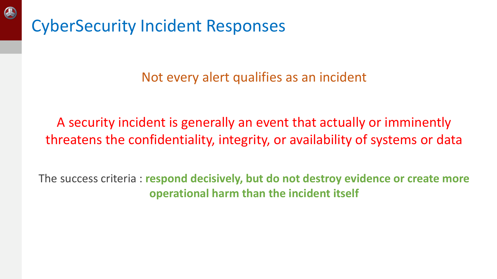
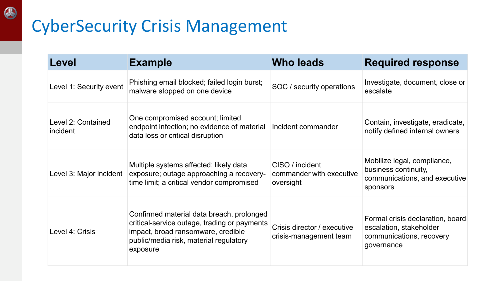
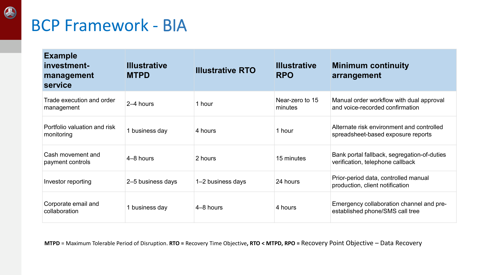

---
title:
  en: "Week 6 · Incident Response, Crisis Management & BCP"
  zh: "第 6 周 · 事件响应、危机管理与业务连续性"
summary:
  en: "The six incident-response stages walked through a ransomware timeline, the Level 1–4 severity ladder and when an incident becomes a crisis, the Anticipate-to-Learn crisis framework and crisis-team roles, and business continuity: how IR, crisis management, BCP and DR divide the work, the BIA, and MTPD / RTO / RPO."
  zh: "用勒索软件时间线走一遍事件响应六阶段，Level 1–4 事件分级以及事件何时升级为危机，Anticipate→Learn 危机管理框架与危机团队分工，以及业务连续性：IR / 危机管理 / BCP / DR 四者怎么分工、BIA、MTPD / RTO / RPO。"
week: 6
date: 2026-09-30
tags: [Incident Response, Crisis Management, BCP, BIA, RTO, RPO, Ransomware]
---
# ISOM 5070 Cyber Security Risk Management — Week 6 复习笔记

**主题：Incident Response（事件响应）· Crisis Management（危机管理）· Business Continuity Plan（业务连续性计划，BCP）**

> 优先级标注说明（按考试重要性）：  
> 🔴 **必考核心** — 概念名称、定义、结构必须能背出来  
> 🟡 **需要理解** — 需要懂逻辑关系，能举例说明  
> 🟢 **了解即可** — 背景知识，考试大概率不会细抠
>
> **优先级依据**（这周没有老师手写补充，按课件本身推断）：  
> ① **课程大纲（p.3）**：Week 6 的标题就是「Incident Response, BCP and Crisis Management」三件事，三块各占约三分之一篇幅（IR p.4–13、危机管理 p.14–27、BCP p.28–37）；  
> ② **三个「阶段/周期」结构**：IR 六阶段（p.5）、危机管理六阶段（p.22–23）、BCP 周期（p.30–31）——这门课 Week 3 七步法、Week 5 供应商生命周期都是这种「流程类」考法，按 🔴 处理；  
> ③ **对比表**：p.29 把 IR / Crisis management / Business continuity / Disaster recovery 四种能力放在一张表里对比，这是最典型的「说说区别」考题；  
> ④ **唯一有数字的地方**：Level 1–4 分级（p.16）和 BIA 的 MTPD / RTO / RPO（p.33）——给场景要你定级、给数字要你判断达不达标，按 🔴 处理；  
> ⑤ **两个完整案例**：p.10–12 勒索软件时间线、p.25 投资公司勒索升级为危机——情景题的素材；  
> ⑥ 大量 checklist（p.6–7、p.9、p.21、p.26、p.35–36）内容高度重复（都在说「事前授权、证据、沟通、演练」），按 🟡/🟢 处理，**抓住反复出现的几个关键词比逐条背更有效**。

---

## 0. 核心地图（先建立整体框架）

```
告警 Alert —— 大多数不是事件（p.4）
   → 确认是 Incident：按 IR 六阶段处理（Preparation → … → Post Mortem，p.5）
      → 按严重度定级 Level 1 → 2 → 3 → 4（p.16）
         → 升到 Level 4 = Crisis：高管接手，走危机管理框架（Anticipate → … → Learn，p.22）
   同时在跑：
      → BCP：关键业务怎么在中断期间「继续转」（BIA 定 MTPD / RTO / RPO，p.32–33）
      → DR：IT 系统和数据怎么「修回来」（p.29）
```

**一句话抓住本周**：同一个勒索软件攻击，公司里有**四套能力同时在跑**——**IR** 管技术上的止血和清除，**Crisis management** 管高管的战略决策和对外沟通，**Business continuity** 管业务在系统瘫痪时怎么靠手工流程撑住，**Disaster recovery** 管 IT 系统怎么恢复。本周所有 checklist 反复强调同四件事：**决策权要事前授予、证据要先保全、沟通要有节奏和唯一口径、计划不演练就只是一份文件**。

---

## 1. 🔴 什么才算 Incident（p.4）



*Not every alert qualifies as an incident（Slide 4）*

| 课件原文                                                                                                                                             | 中文 / 小白解释                                                                    |
| ------------------------------------------------------------------------------------------------------------------------------------------------ | ---------------------------------------------------------------------------- |
| **Not every alert qualifies as an incident**                                                                                                     | 告警 ≠ 事件。SOC 每天收到成千上万条告警，大部分是误报或已被拦截的尝试                                       |
| A security incident is an event that **actually or imminently** threatens the **confidentiality, integrity, or availability** of systems or data | 事件 = **已经或即将**威胁到 **CIA**（Week 1 的机密性、完整性、可用性）的事件。「即将」也算——攻击者已在内网但还没动手，同样是事件 |
| Success criteria: **respond decisively, but do not destroy evidence or create more operational harm than the incident itself**                   | 成功标准：**果断响应，但不能毁掉证据，也不能造成比事件本身更大的运营伤害**（例如为了一台中毒的笔记本把整个交易系统停掉）               |

> **🎯 考点**
>
> 这页的**成功标准**是整周的主线，后面每一张 checklist 都在展开它：「果断」→ 事前授权（p.15）；「不毁证据」→ Preserve evidence（p.8、p.13）；「不造成更大伤害」→ Contain proportionately（p.8）、区分可逆动作与会中断业务的动作（p.6）。情景题问「这个响应有什么问题」，先拿这三点去对照。

**IR 的定义（p.5）**：Cybersecurity incident response 是检测、调查、遏制、清除、恢复并从网络事件中吸取教训的**有组织的流程**。目的**不只是「修好一条告警」**，而是：降低业务伤害、保全证据、恢复**可信**的运营、履行通知义务、防止复发。

---

## 2. 🔴 IR 的六个阶段（p.5）

| # | Stage              | 中文      | 做什么（课件原文精简）                                             |
| - | ------------------ | ------- | ------------------------------------------------------- |
| 1 | **Preparation**    | 准备      | 定角色、on-call 值班、playbook、日志、备份、法务 / 公关流程；**做演练**         |
| 2 | **Identification** | 识别 / 研判 | 研判告警（triage）、验证遥测数据、确定**范围和严重度**、受影响的资产 / 账号 / 数据、攻击者活动 |
| 3 | **Containment**    | 遏制      | 隔离终端、吊销会话 / token、封锁攻击指标（IoC）、网络分段、禁用被盗账号               |
| 4 | **Eradication**    | 根除      | 清除恶意软件和持久化、打补丁、**轮换凭证 / 密钥**、重建系统、关闭暴露路径                |
| 5 | **Recovery**       | 恢复      | 从 **known-good 备份**恢复、验证系统、**加强监控**、分批回到生产              |
| 6 | **Post Mortem**    | 事后复盘    | 取证、时间线、**根因分析**、控制改进、指标、监管报告、更新演练剧本                     |

> **🧠 记忆口诀**
>
> **P-I-C-E-R-L**（Preparation, Identification, Containment, Eradication, Recovery, Lessons learned）——这就是业界常说的 **SANS 六步法**，课件把最后一步叫 Post Mortem。  
> 中间三步最容易混，记一句话：**Containment 止血（临时、可逆），Eradication 拔根（永久去掉原因），Recovery 回血（干净地恢复）**。

> **⚠️ Containment vs Eradication 的边界**
>
> 「吊销 token / 禁用账号」出现在 Containment，「轮换凭证 / 密钥」出现在 Eradication，看起来很像。区别在**目的**：Containment 是**先切断攻击者当下的控制**，让损害不再扩大；Eradication 是**确保攻击者回不来**——把他留下的后门、偷走的所有凭证、被利用的漏洞全部清理掉。p.11 的原话：Eradicates the cause **rather than merely deleting visible files**。

> **➕ 和 ISOM 5280 Lesson 6 的 NIST 四阶段对照**
>
> ISOM 5280 学的是 **NIST SP 800-61** 的四阶段。两套只是切法不同，内容一样：
>
> | NIST 四阶段（ISOM 5280）                 | 本课六阶段（PICERL）                              |
> | ----------------------------------- | ------------------------------------------ |
> | Preparation                         | Preparation                                |
> | Detection & Analysis                | Identification                             |
> | Containment, Eradication & Recovery | Containment + Eradication + Recovery（拆成三步） |
> | Post-Incident Activity              | Post Mortem                                |
>
> 考 5070 时用本课的**六阶段**名称回答。

---

## 3. 🟡 IR Plan 要提前准备什么（p.6–7）

> 一份可用的 IR 计划要**短到能在压力下执行**，再配上常见场景的详细 playbook：勒索软件、商业邮件诈骗（BEC）、云凭证被盗、数据外泄、DDoS、第三方被攻陷、内部人员作案。

| 类别                                                           | 关键内容                                                                                                                                                                        |
| ------------------------------------------------------------ | --------------------------------------------------------------------------------------------------------------------------------------------------------------------------- |
| **Governance and people** 治理与人员                              | ① 有权做紧急决策的 **incident commander（事件指挥官）**；② SOC、IT、云、身份、法务、隐私、公关、HR、物理安全、风险、高管的角色；③ **7×24 上报与升级路线（call tree）**，含主备联系人；④ **破坏性动作的决策权**：隔离系统、禁用账号、**暂停交易或支付**、启动灾备、请外部律师或取证公司 |
| **Technical readiness** 技术准备                                 | ① 集中、**时间同步**、防篡改的日志（身份、终端、网络、云、邮件、SaaS、特权访问、关键应用）；② EDR、身份遥测、SIEM/SOAR、资产清单、漏洞数据、**经过验证的离线或不可篡改备份**；③ 取证采集流程和**证据保管链（chain of custody）**标准；④ **预先批准的遏制选项，区分可逆动作和会中断业务的动作** |
| **Business, legal, communications readiness** 业务 / 法务 / 沟通准备 | ① 业务影响评估方法（CIA、财务损失、客户影响、运营中断、监管暴露）；② 预先写好、经法务和公关审过的对内部 / 客户 / 监管 / 保险 / 媒体的沟通模板；③ **在重建或清空系统之前保全证据**的流程；④ 正式的事后复盘，整改项要有 **owner、due date、funding** 和治理层报告                  |

> **💡 小白理解**
>
> 为什么日志要「时间同步」？事后要把身份系统、终端、防火墙的日志拼成一条时间线，如果各系统时钟差几分钟，就无法判断「先登录还是先加密」。**chain of custody** 是指证据从采集到出庭，每一次经手都有记录，证明没被篡改——否则证据在法律程序里可能不被采信。

---

## 4. 🔴 IR 现场 Checklist：事件一来先做什么（p.8）

| # | 步骤                                              | 要点                                                                   |
| - | ----------------------------------------------- | -------------------------------------------------------------------- |
| 1 | **Open an incident record** 建立事件记录              | 指定 incident commander、每个动作打时间戳、开**决策日志**、建立**不依赖可能已被攻陷的公司系统**的安全沟通渠道 |
| 2 | **Validate the alert** 验证告警                     | 是不是真事件？涉及哪些资产 / 身份？**特权访问**是否被牵连？攻击者是否**仍在控制**？                      |
| 3 | **Preserve evidence** 保全证据                      | 适当时采集易失数据（内存）；在改动系统前保全日志、终端镜像、云审计记录、邮件、身份事件                          |
| 4 | **Scope before broadly disrupting** 先定范围，再大面积中断 | 找出受影响的业务服务、数据分类、账号、终端、云租户、集成、可能的横向移动路径                               |
| 5 | **Contain proportionately** 按比例遏制               | 隔离一台主机、禁用一个用户、吊销 OAuth token、封锁恶意域名 / IP、限制出站流量、网络分段                 |
| 6 | **Protect crown jewels** 保护皇冠上的明珠               | 优先保护：特权身份、域控、身份提供商、**支付通道、交易和行情平台**、客户数据库、**备份基础设施**、管理平面            |
| 7 | **Engage required stakeholders** 拉上必要的人         | 法务 / 隐私、业务负责人、高管危机小组、**网络保险公司**、外部取证，必要时监管或执法                        |
| 8 | **Set an update cadence** 定更新节奏                 | 汇报**已确认的事实、工作假设、需要的决策**、业务影响、下一步；**避免没有根据的归因或过早的保证**                 |

> **🎯 考点**
>
> 几个反直觉、容易出题的点：
>
> - **沟通渠道要独立于公司系统**——攻击者可能正在读你的公司邮件和 Teams；
> - **先保全证据再改系统**——重装系统会把攻击痕迹一起抹掉；
> - **先定范围再大面积中断**——「按比例」遏制，不是一上来就全网断开；
> - **备份基础设施是 crown jewel**——勒索软件会专门找备份下手，备份被加密就无路可退；
> - 更新时**不要过早归因**（「是某国黑客干的」）和**过早保证**（「客户数据没泄露」）——事后被推翻会严重损害信誉和监管关系。

---

## 5. 🔴 案例：一家金融服务公司的勒索软件事件（p.10–12）

**场景（p.10）**：09:15，SOC 收到终端告警——财务共享盘正在被快速加密；几名用户发现文件扩展名变了、屏幕上出现勒索信。初步调查：一名员工打开了恶意附件，凭证被盗，攻击者**横向移动**到了文件服务器。

| 时间      | 响应动作（精简）                                              | 为什么重要                     | 对应 IR 阶段（我的标注）                     |
| ------- | ----------------------------------------------------- | ------------------------- | ---------------------------------- |
| 09:15   | SOC 验证告警，开高严重度工单，**任命 incident commander**            | 明确责任人、审计轨迹、统一决策           | Identification                     |
| 09:20   | 找出受影响的终端、账号、共享盘、IP、可疑进程；**保全日志、终端遥测、内存 / 磁盘镜像**       | 定范围，同时为取证、监管、执法保全证据       | Identification                     |
| 09:25   | **隔离**中毒终端，禁用被盗账号和会话，封锁攻击者基础设施；扩散严重时**把受影响的共享盘或子网断开** | 阻止继续加密和横向移动（CISA 建议立即隔离）  | Containment                        |
| 09:40   | IC 向 CIO/CISO、法务、风险、公关、业务连续性、业务服务负责人通报；**开始决策日志**     | 让技术遏制和运营、法律、客户、监管后果对齐     | （升级与协调，贯穿全程）                       |
| 10:00   | 取证确定入侵路径（钓鱼？暴露的远程访问？漏洞？），找持久化机制，**检查备份库和特权账号**        | **防止把系统恢复到一个攻击者仍在控制的环境里** | Identification → 为 Eradication 做准备 |
| 11:30   | 清除恶意软件、吊销 token、重置凭证、修补漏洞、用可信 **gold image** 重装设备     | 根除原因，而不只是删掉看得见的文件         | Eradication                        |
| Day 1–2 | 从**经过验证的离线备份**把文件服务器恢复到**干净、隔离**的恢复环境，校验数据完整性和依赖后再接回  | 优先恢复关键 / 创收服务，避免把感染带回来    | Recovery                           |
| Day 2–7 | 加强监控、确认运营正常、评估通知义务、高管报告、**lessons-learned 会议**        | 把事件转化为长期的风险降低             | Recovery → Post Mortem             |

> **💡 小白理解**
>
> 注意时间线的顺序：**09:20 先保全证据，09:25 才隔离**；**10:00 先查清入侵路径和备份是否干净，11:30 才清除，Day 1 才恢复**。这正是 p.4 成功标准的落地——果断，但不毁证据，也不把系统恢复进一个仍被控制的环境。

**事件状态报告（Incident Status Report，p.12）的六个要素**：

| 要素                        | 本例                                           |
| ------------------------- | -------------------------------------------- |
| Incident description 事件描述 | 确认勒索软件加密了财务文件服务器 FS-02 和 14 台用户终端            |
| Business impact 业务影响      | 财务文档无法访问；**支付处理不受影响**                        |
| Containment status 遏制状态   | 终端已隔离、被盗账号已禁用、FS-02 的 SMB 访问已封锁、恶意域名和 IP 已封锁 |
| Evidence preserved 已保全证据  | EDR 遥测、防火墙日志、身份提供商登录日志、服务器镜像、勒索信哈希           |
| Recovery decision 恢复决策    | 用干净镜像重建 FS-02，恢复 02:00 的已验证备份，验证后再加入生产域      |
| Next update 下次更新          | 12:00，由 IC 向高管危机管理小组汇报                       |

### 🔴 互动：这一步属于 IR 哪个阶段？

*（网页版此处是「这一步属于 IR 哪个阶段」的点选练习；下表是全部题目和答案）*

| 动作                                                                          | 阶段                 | 理由                                                                                                                                                    |
| --------------------------------------------------------------------------- | ------------------ | ----------------------------------------------------------------------------------------------------------------------------------------------------- |
| 事发前：公司每季度针对「勒索软件加密共享盘」跑一次桌面演练（tabletop exercise），并把离线、不可篡改的备份做了恢复测试。        | **Preparation**    | 演练、备份、日志、playbook 都是在事故发生之前备好的「工具和肌肉记忆」——属于 Preparation（p.5 第 1 条：run exercises、backups）。                                                             |
| 事发前：董事会书面授权 incident commander 可以直接隔离服务器、禁用账号、封锁供应商访问，不需要层层审批。              | **Preparation**    | p.15「Speed comes from decisions made before the incident」——决策权要在事前授予，这是 Preparation 里的 decision rights，不是事中才去争取。                                      |
| 09:15 SOC 收到「财务共享盘被快速加密」的告警，先确认这是真实事件而不是误报，开一张高严重度工单并指定 incident commander。 | **Identification** | Triage alerts、validate telemetry、定 severity——这是 Identification。「Not every alert qualifies as an incident」，先确认是不是事件，才谈得上后面的动作。                         |
| 09:20 分析员列出受影响的终端、账号、共享盘、IP 和可疑进程，同时保全日志、EDR 数据和内存 / 磁盘镜像。                  | **Identification** | Establish scope（影响范围）是 Identification 的核心；同步保全证据是 p.8 checklist 的「Preserve evidence」，要在改动系统之前做。                                                       |
| 09:25 IT 把中毒的终端从网络隔离，禁用被盗账号和会话，封锁攻击者的域名 / IP，必要时把受影响网段断开。                   | **Containment**    | 目的是「止血」：阻止继续加密和横向移动（lateral movement）。隔离、禁用、封锁都是临时性的、可逆的动作——Containment。                                                                              |
| 一名员工账号出现异常登录，SOC 立刻吊销该用户的 OAuth token、强制下线所有会话，并限制该网段的出站流量。                 | **Containment**    | p.8「Contain proportionately」的例子原话：revoking OAuth tokens、restricting egress。先切断攻击者的控制通道，还没到清除根源那一步。                                                    |
| 11:30 团队清除恶意软件和持久化机制，修补被利用的漏洞，重置受影响的凭证和密钥，用可信的 gold image 重装被攻陷的设备。         | **Eradication**    | Eradication = 把原因彻底去掉（remove persistence、patch、rotate credentials、rebuild）。p.11 的解释：「Eradicates the cause rather than merely deleting visible files」。 |
| Day 1–2 从经过验证的离线备份，把文件服务器恢复到一个干净、隔离的恢复环境，校验数据完整性和应用依赖之后再接回生产网络。             | **Recovery**       | Restore from known-good backups、validate、progressively return to production——Recovery。重点是「干净地」恢复，避免把中毒的系统或数据重新带回来。                                    |
| Day 2–7 恢复上线后，对相关系统做加强监控（heightened monitoring），确认运营恢复正常。                   | **Recovery**       | p.5 把 heightened monitoring 写在 Recovery 阶段：系统刚回到生产，要盯紧有没有复发，这仍是恢复的一部分，还不是复盘。                                                                          |
| 事件结束后，团队重建完整时间线，做根因分析（root-cause analysis），并把整改项分配给具体负责人，定截止日期和预算。          | **Post Mortem**    | Forensics、timeline、root-cause analysis、control improvements——Post Mortem。p.7 强调整改要有 owner、due date、funding，否则复盘只是走过场。                                 |
| 根据这次事件评估监管通知义务、写高管报告，并更新下一次桌面演练的剧本。                                         | **Post Mortem**    | Regulatory reporting、metrics、tabletop updates 都列在 p.5 的 Post Mortem 里。更新演练剧本会反过来喂给下一轮 Preparation，IR 是一个循环。                                           |
| 告警显示管理员账号在凌晨从两个国家同时登录，分析员需要先判断：是否涉及特权访问？攻击者是否仍在控制？                          | **Identification** | p.8「Validate the alert」：判断是否为真实事件、涉及哪些资产和身份、特权访问是否被牵连、攻击者是否仍在活动——还在搞清楚状况，属于 Identification。                                                           |

---

## 6. 🔴 一个好的响应应该具备的八个要素（p.13）

| 要素                                         | 一句话                                        |
| ------------------------------------------ | ------------------------------------------ |
| **Clear authority** 明确授权                   | IC 有权隔离系统、做升级决策                            |
| **Rapid triage** 快速研判                      | 确认是否发生事件、关联证据、记录发现，按**功能影响、信息影响、可恢复性**排优先级 |
| **Evidence discipline** 证据纪律               | 重建前保全日志、镜像、时间戳、IoC 和证据保管链                  |
| **Containment before convenience** 遏制优先于便利 | 暂时中断一个系统，往往好过让攻击者继续扩散                      |
| **Root-cause remediation** 根因修复            | 清除持久化、吊销受影响凭证、补上被利用的控制缺口、复核特权访问            |
| **Clean recovery** 干净恢复                    | 只从 known-good、测试过的备份恢复；验证后再上线              |
| **Governance** 治理                          | 按义务拉上法务、隐私、合规、风险、公关、保险、监管或执法               |
| **Lessons learned** 吸取教训                   | 把发现转化为**具体的负责人、截止日期**、控制改进、演练和指标           |

> **🧠 记忆口诀**
>
> 这八条几乎就是六阶段加两条「横向要求」：Clear authority + Governance 是**谁来决定、要通知谁**，其余六条依次对应 Identification → Preparation 里的证据准备 → Containment → Eradication → Recovery → Post Mortem。

### 🟡 给管理层的 IR 指标（p.9）

从**速度、影响、质量、韧性**四个维度衡量：

- **Mean time to detect / acknowledge / contain / eradicate / recover**（MTTD、MTTA、MTTC……各阶段的平均耗时）
- 在目标时间内被遏制的高严重度事件百分比
- 业务停机时间、受影响用户 / 客户、暴露的数据类别、财务影响
- **备份恢复成功率**、关键服务恢复耗时
- 证据完整、及时复盘、整改项关闭的事件百分比
- **重复事件率**、逾期整改项
- 演练频率、关键 playbook 端到端测试的比例

> 课件总结：**测试过的计划、清晰的授权、干净的遥测数据、有韧性的身份控制、演练过的沟通**是成功的关键。

---

## 7. 🔴 危机管理：别让事件变成危机（p.14）

> **Best Crisis Management is to PREVENT or STOP an incident to become a CRISIS.**  
> 最好的危机管理，是不让一个事件演变成危机。

| 失败模式                                 | 它怎么制造危机                       | 预防性控制                            |
| ------------------------------------ | ----------------------------- | -------------------------------- |
| **Delayed detection** 发现太晚           | 攻击者有时间横向移动、窃取数据、欺诈、部署勒索软件     | 集中监控、EDR、身份监控、**测试过的告警研判**       |
| **Large blast radius** 影响半径太大        | 一个被攻陷的账号或服务器波及关键运营、客户数据或大量系统  | **网络分段、最小权限、特权访问管理（PAM）、不可篡改备份** |
| **Slow or unclear decisions** 决策慢或不清 | 各团队争论谁有权决定，事态在此期间恶化           | **预先批准的严重度等级、明确的决策权、7×24 升级矩阵**  |
| **Poor communications** 沟通差          | 互相矛盾或迟到的信息侵蚀信任，还可能带来本可避免的监管风险 | 沟通 playbook、法务审核、预定义的利益相关方和通知流程  |

> **🎯 考点**
>
> **四个失败模式 = 后面四页的四个对策**：发现晚 → p.18 Detect and decide early；影响半径大 → p.19 Contain the blast radius；决策慢 → p.15–16 预授权 + 分级；沟通差 → p.20 Communicate timely and effectively。考「为什么一个事件会升级成危机」，就答这四条。

---

## 8. 🔴 预授权决策：速度来自事前（p.15）

> **Speed comes from decisions made before the incident, not during it.**

CISA 建议把三个角色分开：**incident management（事件管理）、technical management（技术管理）、communications management（沟通管理）**——让事件经理专心协调人和信息流，而不被技术执行分散精力。

要以**书面形式**授权 incident commander：

1. 隔离一台设备、服务器、工作负载、业务应用或网段
2. 禁用可疑的账号、token、会话、API key 和**供应商访问**
3. 封锁域名、IP、邮件发件人和恶意文件哈希
4. 启动**紧急变更流程**，引入外部 IR 专家
5. 在**预设阈值**下升级到 CISO、COO、CEO、总法律顾问和危机管理小组

> **💼 业务视角**
>
> 为什么要「书面、事前」？在大公司，隔离一台交易服务器正常需要走变更审批（change management），可能要几个小时甚至几天。事故当下如果还要层层审批，勒索软件早就加密完了。事前把「哪些动作 IC 可以直接做」写成政策、由高管签字，出事时就没有「谁有权拍板」的争论——这正是 p.14「Slow or unclear decisions」的解药。

---

## 9. 🔴 事件分级 Level 1–4（p.16）



*Incident severity levels: who leads and what response is required（Slide 16）*

| Level                                  | 例子                                                                    | 谁来领导                           | 必须做什么                         |
| -------------------------------------- | --------------------------------------------------------------------- | ------------------------------ | ----------------------------- |
| **Level 1: Security event** 安全事件       | 钓鱼邮件被拦截；一波登录失败；一台设备上的恶意软件被阻止                                          | **SOC / 安全运营**                 | 调查、记录，关闭或升级                   |
| **Level 2: Contained incident** 已遏制的事件 | 一个账号被盗；少量终端感染；**没有**重大数据丢失或关键中断的证据                                    | **Incident commander**         | 遏制、调查、根除，通知指定的内部负责人           |
| **Level 3: Major incident** 重大事件       | 多个系统受影响；**很可能**有数据暴露；中断时长**逼近 RTO**；**关键供应商被攻陷**                      | **CISO / IC + 高管监督**           | 动员法务、合规、业务连续性、公关和高管           |
| **Level 4: Crisis** 危机                 | **确认**重大数据泄露；关键服务长时间中断；**交易或支付受影响**；大范围勒索；可信的**媒体 / 公众风险**；重大**监管暴露** | **Crisis director / 高管危机管理小组** | **正式宣布危机、上报董事会**、利益相关方沟通、恢复治理 |

> **🧠 记忆口诀**
>
> **谁来领导**这一列是一条阶梯：SOC → IC → CISO（+高管监督）→ 高管危机小组。  
> Level 3 → Level 4 的关键词是**「可能」变「确认」**（likely data exposure → confirmed material breach）、**「逼近 RTO」变「长时间中断」**，以及**外部性**（媒体、监管、交易 / 支付）。

### 🔴 互动：给一个事件定级

*（网页版此处可交互：按五个维度点选事件特征，取最严重的一维定级；下表是预设场景的结果）*

| 场景                            | 触发升级的特征                                                                                             | 级别                               | 谁来领导                                               |
| ----------------------------- | --------------------------------------------------------------------------------------------------- | -------------------------------- | -------------------------------------------------- |
| 钓鱼邮件被拦截                       | 全部最低一档                                                                                              | **Level 1 · Security event**     | SOC / security operations                          |
| 一个账号被盗，已禁用                    | 一个账号或少量终端中招（L2）                                                                                     | **Level 2 · Contained incident** | Incident commander                                 |
| p.10 勒索：FS-02 + 14 台终端，支付不受影响 | 多个系统受影响（L3）                                                                                         | **Level 3 · Major incident**     | CISO / incident commander with executive oversight |
| 关键供应商（MSP）被攻陷                 | 一个账号或少量终端中招（L2）；关键供应商被攻陷（L3）                                                                        | **Level 3 · Major incident**     | CISO / incident commander with executive oversight |
| p.25 投资公司勒索 + 数据外泄            | 大范围勒索软件（broad ransomware）（L4）；很可能有数据暴露（likely exposure）（L3）；中断时长逼近 RTO（L3）；可信的媒体 / 公众风险，或重大监管暴露（L4） | **Level 4 · Crisis**             | Crisis director / executive crisis-management team |

> **📌 这个分级器的规则是我的建模**
>
> 课件只给了每一级的**例子**，没有给打分公式。这里的规则是：把每个特征对应到课件里第一次提到它的那一级，**取最严重的一维**定级（p.18 的 severity matrix 同时看业务影响、数据敏感度、攻击者活动、受影响人数、监管触发和可恢复性，任何一维触线都该升级）。  
> 预设里 **p.10 的 FS-02 案例是 Level 3**（多个系统，但支付不受影响、没有确认外泄）；**p.25 的投资公司案例是 Level 4**（大范围加密 + 疑似外泄 + 监管和声誉暴露）——同样是勒索软件，**级别取决于业务影响而不是攻击类型**。

> **⚠️ p.25 写的是「Level 1 cyber crisis」**
>
> p.25 案例里 CEO「declares a **Level 1** cyber crisis」，和 p.16 的「Level 4: Crisis」数字相反。很多公司的危机管理会另设一套**危机等级**（Crisis Level 1 = 最严重），和事件分级的 Level 1–4 不是同一把尺子。考试答分级题时**按 p.16 的 Level 1–4**，并知道「危机」是最高一级即可。

---

## 10. 🟡 危机管理的四个动作（p.17–20）

### 10.1 演练最难的场景（p.17）

计划只有在人能**在压力下执行**时才有用。**至少每季度一次 tabletop exercise（桌面演练）**，加定期的技术模拟，针对最可能威胁公司的场景：

- 勒索软件影响共享服务、投资者报告或组合管理基础设施
- **BEC（商业邮件诈骗）**试图篡改银行或结算指令
- 云或 SaaS 中断影响交易、风险、财务或客户运营
- 数据外泄：投资者数据、员工数据、研究报告或 **MNPI**（Week 5 学过的重大非公开信息）
- 基金管理人、托管行、主经纪商、MSP 或其他关键供应商被攻陷
- 内部人员滥用或未经授权提取敏感信息

每次演练不仅要测**检测和遏制**，还要测**高管决策权、替代运营流程、对监管 / 客户的沟通、第三方协调、从备份恢复、事后文档**。

### 10.2 早发现、早决策（p.18）

让事件在**还是可控的运营问题时**就能被识别：

- 集中日志：身份提供商、EDR、邮件、防火墙、云平台、关键 SaaS、关键第三方
- 盯住**高后果信号**：impossible travel（不可能的旅行，两地短时间内先后登录）、**MFA fatigue**（MFA 轰炸，反复推送直到用户误点同意）、特权角色变更、**邮箱规则被创建**（BEC 常用来隐藏回信）、异常批量下载、大规模文件加密、异常的付款指令变更、异常访问投资者或交易数据
- 🔴 **7×24 研判 SLO 示例：高严重度告警 15 分钟内确认（acknowledge），60 分钟内定范围并初步遏制**
- 用一个简单的严重度矩阵：业务服务影响、数据敏感度、攻击者活动、受影响人数、监管触发、可恢复性
- 要求 IC **在事态明显失控之前**就上报高管

### 10.3 控制影响半径（p.19）

目标：**一个被攻陷的身份、工作站、供应商连接或云工作负载，不能拖垮整个公司。**

- 远程、特权、管理员和**第三方访问**要求**抗钓鱼 MFA**（phishing-resistant MFA，如 FIDO2 硬件密钥）
- 最小权限 + **just-in-time（JIT）特权访问**；定期复核高风险账号、服务账号、休眠凭证
- 分段：用户网络、生产系统、**备份**、敏感数据库、管理平面
- 终端和关键服务器用有**隔离能力**的 EDR/XDR
- 限制管理工具、远程管理协议和出站流量（攻击者的 command-and-control 靠它们）
- 加密的、**不可篡改或离线**的备份，**用独立凭证**和独立的备份基础设施
- 🔴 **测试恢复，而不只是测试备份完成**——对照 RTO / RPO

### 10.4 及时有效地沟通（p.20）

- 技术团队要快速共享事实，但**只有获批的职能部门能对外发声**
- 维护**唯一一份 situation report（态势报告）**：已确认事实、不确定事实、业务影响、决策、行动、负责人、风险、下次更新时间
- 🔴 **固定节奏：遏制期间每 30 分钟一次，恢复期间每 2–4 小时一次**
- **对内运营更新**与**对客户、投资者、媒体、监管、公众的声明**分开
- 预先写好 **holding statement（临时声明）**：勒索软件、疑似数据泄露、云服务商中断、支付欺诈、第三方事件
- **尽早**让法务和合规评估合同、监管、隐私、记录保存和通知要求
- 准确的**决策日志**：决定了什么、谁决定的、什么时候、基于什么证据、接受了什么风险

> **💡 小白理解**
>
> **Holding statement** 是事情还没查清时先发的「占位声明」，大意是「我们发现了一起安全事件，已启动应急响应，正在调查，将及时更新」——不承认也不否认细节。它的价值是**先占住话语权**，避免媒体和社交网络在信息真空里自行猜测，同时不说任何日后可能被推翻的话。

---

## 11. 🟡 危机管理 Checklist（p.21）

> 🔴 **The rule is simple: contain quickly, recover from clean and tested assets, decide with pre-agreed authority, and communicate with evidence rather than speculation.**  
> 快速遏制、从干净且测试过的资产恢复、按预先约定的授权决策、用证据而不是猜测来沟通——这样能把许多潜在的重大攻击变成可控的事件，而不是企业危机。

自检八问：

1. 能不能在**几分钟内**隔离系统或禁用账号，而不用等多层审批？
2. 关键服务是否映射了负责人、依赖、RTO 和手工替代方案？
3. 备份是否隔离、尽可能不可篡改，并在定期测试中**成功恢复**过？
4. 公司是否知道哪些事件需要通知客户、交易对手、监管、保险或执法？
5. 是否有**一名**指定的 IC 负责协调，以及一名有权做企业级取舍的 crisis director？
6. 法务、公关、合规、风险、业务连续性、技术能否在**一小时内**集合？
7. **过去 12 个月**是否演练过真实的勒索软件、数据泄露和关键第三方场景？
8. 过去事件和演练的整改项是否被责任人追踪到关闭？

---

## 12. 🔴 Crisis Management Framework：六个阶段（p.22–23）

> **Crisis management framework** 是组织层面的结构，用来带领组织度过威胁**人员、运营、声誉、财务稳定或法律 / 监管地位**的事件。和 IR 不同——**IR 解决技术事件；危机管理做战略决策**：谁有权、优先保什么、通知谁、怎么恢复信心和正常运营。

```
Anticipate → Prepare → Activate → Stabilize → Recover → Learn
  预判          准备        启动        稳定         恢复        学习
```

| Phase          | 领导层要回答的问题      | 核心活动                                        | 典型产出                                              |
| -------------- | -------------- | ------------------------------------------- | ------------------------------------------------- |
| **Anticipate** | 什么可能变成危机？      | 趋势扫描、情景分析、风险评估、利益相关方映射、预警指标                 | 危机风险登记册、触发阈值、情景库                                  |
| **Prepare**    | 我们准备好在压力下领导了吗？ | 定治理、任命危机管理团队、建计划和 playbook、建沟通渠道、培训和演练      | 危机管理计划、联系人目录、决策日志、媒体 holding statement            |
| **Activate**   | 这需要高管危机领导吗？    | 评估严重度、**宣布危机**、召集团队、定目标、定汇报节奏               | 危机声明、初始态势报告、利益相关方地图                               |
| **Stabilize**  | 怎么保护人员、防止升级？   | **保护生命安全**、控制业务伤害、保留选项、协调技术 / 运营响应、发布经核实的沟通 | 行动计划、利益相关方更新、决策记录                                 |
| **Recover**    | 怎么恢复可持续的运营和信任？ | 业务恢复、客户补救、监管沟通、财务影响评估、声誉修复                  | 恢复计划、恢复里程碑、通知记录                                   |
| **Learn**      | 下一次危机之前要改什么？   | **独立复盘**、经验教训、根因分析、整改、测试                    | 事后报告（after-action report）、有负责人的整改计划、修订后的 playbook |

> **🧠 记忆口诀**
>
> **和 IR 六阶段对照着记**：
>
> - IR：Preparation → Identification → Containment → Eradication → Recovery → Post Mortem（**技术视角**）
> - Crisis：Anticipate → Prepare → **Activate** → **Stabilize** → Recover → Learn（**高管视角**）
>
> 两套都是「准备 → 发现 → 控制 → 恢复 → 复盘」的骨架。危机管理多了 **Anticipate（预判哪些会变成危机）** 和 **Activate（正式宣布危机）**——因为不是每个事件都需要高管介入，**「要不要启动」本身就是一个决策**，对应第 9 节的 Level 4。

---

## 13. 🟡 危机团队结构（p.24）

> **精简的核心团队通常比大委员会好用。** CISA 建议事先定义 incident manager、technical manager、communications manager；incident manager 负责**协调和管理沟通流**，**而不是亲自做技术工作**。

| 角色                                    | 主要职责                                          |
| ------------------------------------- | --------------------------------------------- |
| **Crisis director** 危机总指挥             | 整体战略指挥、排优先级、高管决策、**上报董事会**                    |
| **Incident commander** 事件指挥官          | 技术或运营响应、范围评估、遏制、恢复                            |
| **CIO / CISO**                        | 网络风险建议、威胁情报、取证策略、控制决策                         |
| **General counsel** 总法律顾问             | **律师-客户特权（legal privilege）**、监管分析、通知策略、协调外部律师 |
| **Communications lead** 公关负责人         | 员工、客户、媒体、官网、社交媒体；信息审批和口径一致                    |
| **Business-continuity lead** 业务连续性负责人 | 关键服务排序、替代方案、恢复协调                              |
| **Risk and compliance lead** 风险合规负责人  | 影响评估、监管联络、**风险接受和决策记录**                       |
| **HR lead** 人力资源                      | 员工沟通、员工福利、内部人员风险和纪律处分                         |
| **Finance lead** 财务                   | 流动性、损失、**保险**、供应商 / 付款影响、成本追踪                 |
| **Third-party lead** 第三方负责人           | 联络供应商、合同权利、收集证据、协同遏制                          |

> **🎯 考点**
>
> **Crisis director vs Incident commander** 是最容易考的一对：crisis director 做**战略**（优先保什么业务、要不要通知客户、上报董事会），IC 做**战术**（技术遏制和恢复）。这和第 12 节「IR 解决技术事件，危机管理做战略决策」是同一个区分。

> **➕ 为什么总法律顾问要管「legal privilege」**
>
> 在美国等普通法地区，律师指导下形成的调查报告、沟通可以受**律师-客户特权**保护，诉讼时不必交给对方。所以大公司出事后常由**外部律师**聘请取证公司，让取证报告走律师渠道——这也是 p.25 说 Legal 要确保沟通「appropriately privileged」的原因。

---

## 14. 🔴 案例：一家投资公司的勒索攻击升级为危机（p.25）

| 步骤                                 | 发生了什么                                                                   |
| ---------------------------------- | ----------------------------------------------------------------------- |
| **Detect and assess** 发现与评估        | 安全团队确认共享基础设施被加密，且有**可疑的数据外泄**。IC 估计报告系统可能 **48 小时**不可用                  |
| **Activate** 启动                    | CEO 或授权的 crisis director **宣布网络危机**——因为事件同时涉及**客户数据、运营中断、可能的监管通知、声誉暴露** |
| **Set strategic objectives** 定战略目标 | 保护客户数据；阻止攻击者移动；**维持交易和现金关键流程**；保全证据；履行监管义务；准确地与客户沟通                     |
| **Run parallel workstreams** 并行工作流 | 见下表                                                                     |
| **Recover and learn** 恢复与学习        | 服务恢复后监控复发，**董事会层面复盘**，分配整改：抗钓鱼 MFA、不可篡改备份测试、收紧供应商访问、改进分段、更新危机演练         |

| 工作流                 | 做什么                                      | 对应第 13 节角色                |
| ------------------- | ---------------------------------------- | ------------------------- |
| Cybersecurity       | 隔离系统、调查、重建受影响资产                          | Incident commander / CISO |
| Business continuity | 把投资者报告切换到批准的**手工或替代流程**                  | Business-continuity lead  |
| Legal               | 评估通知要求，确保沟通**事实准确、受特权保护**                | General counsel           |
| Communications      | 准备员工信息、客户 holding statement、媒体 Q\&A、监管简报 | Communications lead       |
| Finance             | 追踪损失、恢复费用、可能的**保险通知**                    | Finance lead              |

> **💡 小白理解**
>
> 这个案例把本周三块内容串在了一起：**Cybersecurity 工作流 = IR 六阶段**，**Business continuity 工作流 = BCP 的手工替代方案**，**整个指挥结构 = 危机管理框架的 Activate / Stabilize / Recover / Learn**。「宣布危机」的理由（客户数据 + 运营中断 + 监管 + 声誉）正好是第 9 节 Level 4 的特征。

---

## 15. 🟢/🟡 危机管理的必备文档与运营原则（p.26–27）

### 🟢 必备文档（Essential artifacts，p.26）

成熟的项目应随时备好：危机管理政策（高层或董事会批准）；**危机升级矩阵**（严重度等级、决策权、启动阈值）；**7×24 联系人目录**（高管、技术负责人、律师、保险、公关顾问、监管、关键供应商）；分场景 playbook（网络攻击、数据泄露、中断、欺诈、第三方失败、不当行为、物理中断）；利益相关方地图；预先批准的沟通模板；**态势报告模板**（已知事实、未知事实、影响、决策、行动、风险、下次更新时间）；决策和行动日志；演练项目。

### 🟡 运营原则（Operating principles，p.27）

1. **以事实为先，但明确说出不确定性**；不用猜测填补空白
2. 先保护**人员、关键服务和证据**，再考虑便利或速度
3. 🔴 区分「**我们知道什么**」「**我们认为什么**」和「**我们正在做什么来核实**」（what we know / believe / are doing to verify）
4. 维护**唯一的权威信息源（one source of truth）**和可靠的汇报节奏（急性响应期间每 30–60 分钟）
5. **把沟通当作运营控制，而不是公关的事后补救**
6. 实时记录重大决策，包括考虑过的替代方案和接受的风险
7. 🔴 **定期测试框架——没测试过的计划只是一份文件，不是一种能力**（an untested plan is only a document, not a capability）
8. 把经验教训转化为**有预算、有负责人、有截止日期**的整改

---

## 16. 🔴 BCP 是什么，和 IR / 危机管理 / DR 怎么分工（p.28–29）

> **Business continuity plan (BCP) framework** 是让组织**在中断期间继续提供最重要的服务**、并**按受控顺序恢复正常运营**的管理体系。它覆盖网络攻击、技术中断、场所丢失、供应商失败、人员中断、市场事件等——**不只是灾难恢复（DR）**。  
> **ISO 22301** 是主流的管理体系模型：计划、建立、实施、运行、监控、评审、维护并持续改进有文档的连续性能力。  
> 实用的 BCP 框架要和 IR、危机管理、IT 灾备**整合，但各自角色不同**。

| 能力                            | 核心问题                      | 典型负责人                         | 主要产出                 |
| ----------------------------- | ------------------------- | ----------------------------- | -------------------- |
| **Incident response** 事件响应    | 发生了什么？怎么遏制和根除？            | **CISO / incident commander** | 威胁被遏制；系统被调查和加固       |
| **Crisis management** 危机管理    | 高管如何保护人员、利益相关方、声誉和战略选项？   | **CEO、COO、crisis director**   | 企业级决策和利益相关方治理        |
| **Business continuity** 业务连续性 | 怎么让关键业务服务**在可接受水平上继续运转**？ | **COO / BCP 经理 / 业务服务负责人**    | 靠替代方案或备用安排**维持**优先服务 |
| **Disaster recovery** 灾难恢复    | 怎么**恢复**应用、基础设施、数据和技术平台？  | **CIO / CTO / IT 恢复负责人**      | 技术恢复到约定的服务水平         |

> **🎯 考点**
>
> 🎯 **本周最可能出的对比题**。一个口诀：**IR 管威胁，Crisis 管决策，BC 管业务，DR 管技术**。  
> 最容易混的是 **BC vs DR**：
>
> - **BC 问「系统没恢复之前，业务怎么继续」**——答案常常是**手工流程**（电话下单、网银后备），负责人是**业务方（COO）**；
> - **DR 问「系统怎么修回来」**——答案是备份、灾备站点、failover，负责人是 **IT（CIO/CTO）**。
>
> 所以「BCP 就是灾备」是错的——p.28 原话 not only disaster recovery。

---

## 17. 🔴 BCP Framework 周期（p.30–31）

> A durable framework follows a continuous cycle:  
> **Govern → Assess → Design → Respond → Recover → Test → Improve**

| Stage          | 核心活动                             | 关键交付物                                        |
| -------------- | -------------------------------- | -------------------------------------------- |
| **Govern** 治理  | 定范围、政策、角色、风险胃口、预算、治理论坛、董事会报告     | BCP 政策、治理章程、**RACI**、项目路线图                   |
| **Assess** 评估  | 识别关键服务、依赖、中断情景、**影响容忍度**、义务      | **BIA（业务影响分析）**、依赖图、风险评估                     |
| **Design** 设计  | 选连续性策略，定恢复目标                     | 连续性策略、**RTO / RPO 目标**、备用站点和供应商安排            |
| **Plan** 计划    | 记录启动、沟通、替代方案、恢复任务、升级路径           | BCP、call tree、playbook、沟通模板                  |
| **Respond** 响应 | 中断后启动连续性流程，维持关键服务                | 态势报告、行动日志、服务优先级决策                            |
| **Recover** 恢复 | 从临时安排回到稳定的正常运营                   | 恢复计划、**对账清单（reconciliation checklist）**、退出标准 |
| **Test** 测试    | 桌面演练、技术测试、call tree 测试、模拟、完整恢复测试 | 演练报告、测试证据、整改项                                |
| **Improve** 改进 | 在演练、变更、事件、审计结果和新风险之后更新计划         | 整改追踪表、年度计划评审、管理评审记录                          |

> **⚠️ p.30 写 7 个阶段，p.31 表里有 8 个**
>
> p.30 的循环是 7 步（没有 **Plan**），p.31 的表格在 Design 和 Respond 之间多了一个 **Plan**。两者不矛盾：Design 选策略，Plan 把策略写成可执行的文档。考试如果要默写，**写 p.31 的 8 个**更完整；也可以注明「Design 包括写 plan」。

**NIST 的应急规划七步法（p.30，NIST SP 800-34）**：① 制定政策 → ② 做 BIA → ③ 识别预防性控制 → ④ 制定恢复策略 → ⑤ 编写计划 → ⑥ 测试、培训、演练 → ⑦ 维护计划。和上面的周期一一对应：政策 = Govern，BIA = Assess，预防控制 + 恢复策略 = Design，编写计划 = Plan，测试 = Test，维护 = Improve。

---

## 18. 🔴 BIA：BCP 的核心（p.32–33）

> **Business impact analysis (BIA)** 是 BCP 的核心。它把笼统的韧性目标转化为**有优先级、可衡量的恢复要求**。BIA 应该由**业务服务负责人主导，而不是只靠技术部门**。

对每个关键服务要记录：

| 要素                                                   | 中文 / 解释                                    |
| ---------------------------------------------------- | ------------------------------------------ |
| Service purpose and accountable executive            | 服务目的和负责高管                                  |
| Consequences of disruption                           | 中断对客户、投资者、监管、市场、财务的后果                      |
| 🔴 **MTPD — Maximum tolerable period of disruption** | **最长可容忍中断时间**：组织能承受的最长中断，超过之后伤害**不可接受**    |
| 🔴 **RTO — Recovery time objective**                 | **恢复时间目标**：把服务恢复到约定最低水平的**目标时间**           |
| 🔴 **RPO — Recovery point objective**                | **恢复点目标**：**以时间衡量的**最大可容忍数据丢失（「最多能丢多久的数据」） |
| **MBCO — Minimum business continuity objective**     | **最低业务连续性目标**：中断期间可以接受的最低服务水平              |
| Required resources                                   | 需要的人员、场所、技术、数据、供应商、沟通渠道和**手工替代方案**         |
| Dependencies                                         | 上下游依赖，包括关键外包服务商（→ Week 5 供应商风险）            |



*Illustrative MTPD / RTO / RPO for an investment-management firm（Slide 33）*

| 投资管理服务（示例）    | MTPD     | RTO      | RPO          | 最低持续安排                          |
| ------------- | -------- | -------- | ------------ | ------------------------------- |
| **交易执行和订单管理** | 2–4 小时   | 1 小时     | 接近 0 到 15 分钟 | 人工下单流程 + **双人审批** + 电话录音确认      |
| 组合估值和风险监控     | 1 个工作日   | 4 小时     | 1 小时         | 备用风险环境 + 受控的 spreadsheet 敞口报告   |
| **资金划转和支付控制** | 4–8 小时   | 2 小时     | 15 分钟        | 网银后备 + **职责分离核验** + 电话回拨确认      |
| 投资者报告         | 2–5 个工作日 | 1–2 个工作日 | 24 小时        | 用上一期数据 + 受控的人工制作 + 通知客户         |
| 企业邮件和协作       | 1 个工作日   | 4–8 小时   | 4 小时         | 应急协作渠道 + 预先建好的电话 / 短信 call tree |

> **🧠 记忆口诀**
>
> 课件脚注：**RTO < MTPD**。
>
> - **MTPD** 是业务方说的「**最多能停多久**」——一条红线；
> - **RTO** 是恢复计划承诺的「**多久能恢复**」——必须落在红线之内，还要留余量；
> - **RPO** 管的是**数据**不是时间线上的停机：「**最多丢多久的数据**」，它决定**备份多频繁**，而不决定恢复多快。
>
> 交易系统的 RPO 接近 0（丢一笔订单都可能是巨额损失），投资者报告的 RPO 是 24 小时（每天备份一次就够）——**越接近钱和交易的服务，三个数字都越小**。

### 🔴 互动：MTPD / RTO / RPO 达不达标

*（网页版此处可交互：自己调备份间隔、RPO、RTO、MTPD，时间轴实时变化；下表是 p.33 各项服务和两个反例的结果）*

| 服务                | RTO vs MTPD             | 停机          | 数据丢失                    | RPO     | 最低持续安排                                                       |
| ----------------- | ----------------------- | ----------- | ----------------------- | ------- | ------------------------------------------------------------ |
| 交易执行 / 订单管理       | RTO 1 小时 vs MTPD 2 小时   | 达标          | 备份间隔 15 分钟 vs RPO 15 分钟 | 达标      | 人工下单流程 + 双人审批 + 电话录音确认                                       |
| 组合估值 / 风险监控       | RTO 4 小时 vs MTPD 24 小时  | 达标          | 备份间隔 1 小时 vs RPO 1 小时   | 达标      | 备用风险环境 + 受控的 spreadsheet 敞口报告                                |
| 资金划转 / 支付控制       | RTO 2 小时 vs MTPD 4 小时   | 达标          | 备份间隔 15 分钟 vs RPO 15 分钟 | 达标      | 银行网银后备 + 职责分离核验 + 电话回拨确认                                     |
| 投资者报告             | RTO 24 小时 vs MTPD 48 小时 | 达标          | 备份间隔 24 小时 vs RPO 24 小时 | 达标      | 用上一期数据 + 受控的人工制作 + 通知客户                                      |
| 企业邮件 / 协作         | RTO 4 小时 vs MTPD 24 小时  | 达标          | 备份间隔 4 小时 vs RPO 4 小时   | 达标      | 应急协作渠道 + 预先建好的电话 / 短信 call tree                              |
| ✗ 交易系统，但恢复要 3 小时  | RTO 3 小时 vs MTPD 2 小时   | **超出 1 小时** | 备份间隔 15 分钟 vs RPO 15 分钟 | 达标      | RTO 超过 MTPD：人工下单流程必须撑过这个缺口，否则伤害不可接受                          |
| ✗ 支付系统，但每 4 小时才备份 | RTO 2 小时 vs MTPD 4 小时   | 达标          | 备份间隔 4 小时 vs RPO 15 分钟  | **不达标** | RPO 不达标：最坏会丢 4 小时的支付指令，要逐笔对账补录（p.35 reconciliation controls） |

> **➕ 和 ISOM 5280 Lesson 6 的术语对照**
>
> ISOM 5280 用的是 **MTD / RTO / WRT / RPO** 四个指标：**MTD（Maximum Tolerable Downtime）≈ 本课的 MTPD**；5280 还多一个 **WRT（Work Recovery Time，系统恢复后补数据、验证的时间）**，要求 RTO + WRT ≤ MTD。本课 p.33 没有 WRT，只写 RTO < MTPD。考 5070 时用 **MTPD**，并可补充一句「RTO 之后还需要验证时间，所以 RTO 要比 MTPD 留出余量」。

---

## 19. 🟡 连续性策略：按「哪种依赖失效」准备方案（p.34）

> BCP 需要**真实的、有预算的选项**——不能只是一句「远程办公」。

| 依赖失效                                           | 可能的连续性策略                                            | 验证证据                    |
| ---------------------------------------------- | --------------------------------------------------- | ----------------------- |
| **Office unavailable** 办公室不可用                  | 远程办公、备用办公场所、预先配置的安全设备、应急联系方式                        | 远程办公模拟、容量测试、员工可用性验证     |
| **Core application unavailable** 核心应用不可用       | **Warm standby（温备）**、替代应用、手工处理、只读报表环境               | Failover 测试、手工流程测试、对账证据 |
| **Data corruption or ransomware** 数据损坏或勒索      | **不可篡改备份**、干净的恢复环境、替代数据源、离线流程                       | 恢复测试、恶意软件扫描、恢复时间证据      |
| **Key supplier unavailable** 关键供应商不可用          | **双供应商**、合同恢复承诺、内部后备、替代数据源                          | 第三方演练、SLA 复核、**退出计划测试** |
| **Key personnel unavailable** 关键人员不可用          | 指定副手、交叉培训、文档化 runbook、委托授权                          | Call tree 测试、角色覆盖演练     |
| **Primary communications unavailable** 主要通信不可用 | **带外（out-of-band）消息**、应急网站、电话 / 短信 call tree、替代协作服务 | 通信演练、联系人数据准确性测试         |

> **💡 小白理解**
>
> 这张表的每一行都是「**失效 → 策略 → 证据**」三段式，和 Week 5 尽职调查表的「问题 → 证据」是同一个思路：**光有策略不够，要有测试证据证明它真的能用**——呼应 p.27 的「untested plan is only a document」。

---

## 20. 🟡 BCP 的最低内容与治理指标（p.35–36）

### 每个业务单元的 BCP 至少要包含（p.35）

要**短到能在压力下使用**：

1. 启动触发条件和**有权启动 BCP 的人**
2. 范围、假设和服务优先级
3. 指定角色、副手、联系方式和 7×24 升级路径
4. 🔴 **最初 30–60 分钟的即时行动**
5. 每个关键流程的连续性流程和手工替代方案
6. 技术和数据依赖、备用安排、恢复优先级
7. 对内部、客户、供应商、监管、媒体的沟通责任
8. 🔴 **对账控制（reconciliation controls）**：交易、变更、延迟处理和手工记录
9. 恢复正常运营的标准和事后复盘
10. 版本控制、文档负责人、年度评审日期、测试证据

> **💼 业务视角**
>
> 为什么「对账」单独一条？中断期间用的是**手工流程**（电话下单、纸质记录），系统恢复后，这些手工交易必须**逐笔补录并和系统核对**，否则会出现重复下单、漏记付款。金融机构的 BCP 里，「恢复」不是系统上线就结束，而是**账对平了才结束**。

### 🟢 给董事会的仪表盘（p.36）

- 有**当前 BIA、负责人、RTO、RPO 和测试过的连续性计划**的关键服务百分比
- 对照 RTO / RPO 的恢复测试成功率
- 未解决的韧性缺口或演练整改项的数量和账龄
- 有测试过的连续性和灾备承诺的关键第三方
- **依赖集中度**：在人员、技术、地点、数据或供应商上存在**单点故障**的服务
- 需要启动连续性的重大事件数量
- 实际恢复能力**达不到**批准的业务影响容忍度的例外

---

## 21. 🟡 BCP 的实施顺序（p.37）

> BCP 有效的标志，是它能给业务一个可信的答案来回答这个问题：  
> **「如果这个关键服务现在失效，我们怎么维持可接受的运营水平、在约定的容忍度内恢复、把发生的事情对上账，并证明我们做到了？」**

1. 获得**高管支持**，批准 BCP 政策、范围、治理结构和风险胃口
2. 识别**关键业务服务**，指定负责的业务负责人
3. **做 BIA**，映射端到端依赖（数据、技术、人员、场所、第三方）
4. 设定并批准影响容忍度、**RTO、RPO** 和最低服务水平
5. **出资并落实**满足这些目标的连续性策略
6. 编写简明的分角色计划、替代方案、call tree 和沟通模板
7. **逐步测试**：联系人核对 → 桌面演练 → 技术恢复 → failover → 供应商演练 → 真实的端到端模拟
8. 把整改项追踪到关闭；业务、系统、供应商或法规变化时**刷新 BIA 和计划**

> **🧠 记忆口诀**
>
> 那个「一句话问题」里有四个动词，正好是 BCP 的四个目标：**maintain（维持）→ recover（恢复）→ reconcile（对账）→ prove（证明）**。

---

## 🔴 综合缩写速查表

| 缩写 / 概念           | 含义                                                                                                                        |
| ----------------- | ------------------------------------------------------------------------------------------------------------------------- |
| IR                | Incident Response，事件响应                                                                                                    |
| PICERL            | Preparation, Identification, Containment, Eradication, Recovery, Lessons learned（本课叫 Post Mortem），IR 六阶段                  |
| IC                | Incident Commander，事件指挥官（战术 / 技术协调）                                                                                       |
| Crisis director   | 危机总指挥（战略决策、上报董事会）                                                                                                         |
| SOC               | Security Operations Center，安全运营中心                                                                                         |
| IoC               | Indicator of Compromise，入侵指标（恶意 IP、域名、文件哈希等）                                                                              |
| EDR / XDR         | Endpoint / Extended Detection and Response，终端 / 扩展检测与响应                                                                   |
| SIEM / SOAR       | 安全信息与事件管理 / 安全编排自动化与响应                                                                                                    |
| BEC               | Business Email Compromise，商业邮件诈骗                                                                                          |
| MFA fatigue       | MFA 轰炸：反复推送验证请求，直到用户误点同意                                                                                                  |
| JIT               | Just-in-time 特权访问：需要时才临时授予                                                                                                |
| MTTD / MTTC       | Mean Time to Detect / Contain，平均检测 / 遏制时间                                                                                 |
| Holding statement | 事实未明时先发的临时声明                                                                                                              |
| Chain of custody  | 证据保管链                                                                                                                     |
| BCP               | Business Continuity Plan，业务连续性计划（管业务继续运转）                                                                                 |
| DR                | Disaster Recovery，灾难恢复（管 IT 系统恢复）                                                                                         |
| ISO 22301         | 业务连续性管理体系的国际标准                                                                                                            |
| BIA               | Business Impact Analysis，业务影响分析（BCP 的核心，由业务方主导）                                                                           |
| MTPD              | Maximum Tolerable Period of Disruption，最长可容忍中断时间                                                                          |
| RTO               | Recovery Time Objective，恢复时间目标，**RTO < MTPD**                                                                            |
| RPO               | Recovery Point Objective，最大可容忍数据丢失（以时间计），决定备份频率                                                                           |
| MBCO              | Minimum Business Continuity Objective，中断期间的最低服务水平                                                                         |
| Level 1–4         | Security event → Contained incident → Major incident → Crisis                                                             |
| 关键数字              | 高严重度告警 **15 分钟**确认、**60 分钟**定范围并初步遏制；沟通遏制期 **每 30 分钟**、恢复期 **每 2–4 小时**；**至少每季度**一次桌面演练；相关方 **1 小时内**集合；**12 个月内**演练过关键场景 |

---

## 模拟自测题

**SOC 一天收到 5,000 条告警。什么样的告警才算 security incident？IR 的「成功标准」是什么？**

> **Security incident** 是**已经或即将**威胁到系统或数据的**机密性、完整性或可用性（CIA）**的事件——被拦截的钓鱼邮件、登录失败的尝试通常只是 security event，不是 incident。
>
> **成功标准（p.4）**：果断响应，但**不能毁掉证据**，也**不能造成比事件本身更大的运营伤害**。

**按顺序写出 IR 的六个阶段，并说明 Containment、Eradication、Recovery 三者的区别。**

> **Preparation → Identification → Containment → Eradication → Recovery → Post Mortem**。
>
> - **Containment（遏制）**：止血。临时、可逆地切断攻击者当前的控制，阻止扩散（隔离终端、禁用账号、吊销会话、封锁 IoC）。
> - **Eradication（根除）**：拔根。永久去掉原因，确保攻击者回不来（清除恶意软件和持久化、打补丁、轮换所有凭证和密钥、用 gold image 重装）。
> - **Recovery（恢复）**：回血。从 known-good 备份**干净地**恢复，验证后分批回到生产，并加强监控防复发。

**在 p.11 的勒索软件时间线里，为什么 09:20 先保全证据、09:25 才隔离？为什么 10:00 要先检查备份库和特权账号，Day 1 才恢复？**

> **先保全再隔离**：隔离和后续改动可能破坏易失数据（内存里的进程、网络连接），日志也可能被覆盖。证据用于取证、监管报告和可能的执法，一旦丢失无法补回。这就是 p.4 的「do not destroy evidence」。（实际上两步只隔 5 分钟——保全要快，不能拖慢遏制。）
>
> **先查备份和特权账号再恢复**：如果攻击者已经在备份里埋了后门，或者仍握有特权账号，直接恢复等于**把系统恢复到一个攻击者仍在控制的环境里**（p.11 原话），很快会被再次加密。所以要先 Eradication（找到入口和持久化、确认备份干净），再 Recovery。

**p.10 的 FS-02 事件（14 台终端 + 财务文件服务器被加密，支付不受影响）和 p.25 的投资公司事件（共享基础设施被加密 + 可疑外泄 + 报告系统停 48 小时）分别属于 p.16 的哪一级？为什么同样是勒索软件，级别不同？**

> - **FS-02 → Level 3 Major incident**：多个系统受影响，但支付不受影响、没有确认数据外泄、没有外部曝光。由 CISO / IC 领导，高管监督，动员法务、合规、BCP、公关。
> - **投资公司 → Level 4 Crisis**：大范围加密 + 可疑数据外泄 + 客户数据 + 可能的监管通知 + 声誉暴露。由 crisis director / 高管危机小组领导，正式宣布危机、上报董事会。
>
> **定级看的是业务影响，而不是攻击类型**：p.16 升到 Level 4 的关键词是「**确认**泄露」「关键服务**长时间**中断」「**交易或支付**受影响」「**媒体 / 监管**暴露」。可以用第 9 节的 SeverityLadder 验证。

**p.14 列出了让事件演变成危机的四种失败。写出这四种失败，以及各自的预防性控制。**

> | 失败                                | 预防性控制                                              |
> | --------------------------------- | -------------------------------------------------- |
> | **Delayed detection** 发现太晚        | 集中监控、EDR、身份监控、测试过的告警研判（→ p.18 的 15 分钟 / 60 分钟 SLO） |
> | **Large blast radius** 影响半径太大     | 网络分段、最小权限、PAM、不可篡改备份（→ p.19）                       |
> | **Slow or unclear decisions** 决策慢 | 预先批准的严重度等级、明确的决策权、7×24 升级矩阵（→ p.15–16）             |
> | **Poor communications** 沟通差       | 沟通 playbook、法务审核、预定义的利益相关方和通知流程（→ p.20）            |
>
> 一句话：**最好的危机管理是不让事件变成危机**。

**「Speed comes from decisions made before the incident, not during it.」请解释这句话，并举出至少三项应该事先书面授权给 incident commander 的权力。**

> 事故发生时时间就是损失——勒索软件几分钟就能加密一个共享盘。如果隔离一台服务器还要走常规变更审批、各部门争论谁有权拍板，事态会在争论中恶化（p.14 的「Slow or unclear decisions」）。所以**决策权要在事前由高管书面授予**，出事时直接执行。
>
> 应事先授权 IC 的权力（p.15，任选三项）：① 隔离设备、服务器、工作负载、业务应用或网段；② 禁用可疑的账号、token、会话、API key 和供应商访问；③ 封锁域名、IP、邮件发件人和恶意文件哈希；④ 启动紧急变更流程、引入外部 IR 专家；⑤ 在预设阈值下升级到 CISO、COO、CEO、总法律顾问和危机管理小组。

**危机管理框架的六个阶段是什么？它和 IR 的区别是什么？**

> **Anticipate → Prepare → Activate → Stabilize → Recover → Learn**。
>
> 区别（p.22）：**IR 解决技术事件**（遏制、清除、恢复系统）；**危机管理做战略决策**——谁有权、优先保什么、通知谁、怎么恢复信心和正常运营。危机管理的对象是威胁**人员、运营、声誉、财务稳定、法律 / 监管地位**的事件，不限于网络攻击。IR 由 CISO / IC 领导，危机管理由 CEO / COO / crisis director 领导。

**比较 Incident response、Crisis management、Business continuity、Disaster recovery 四种能力：各自回答什么问题、谁负责？**

> | 能力                  | 核心问题                    | 负责人                       |
> | ------------------- | ----------------------- | ------------------------- |
> | Incident response   | 发生了什么？怎么遏制和根除？          | CISO / incident commander |
> | Crisis management   | 高管怎么保护人员、利益相关方、声誉和战略选项？ | CEO、COO、crisis director   |
> | Business continuity | 关键业务服务怎么在可接受水平上继续运转？    | COO / BCP 经理 / 业务服务负责人    |
> | Disaster recovery   | 应用、基础设施、数据怎么恢复？         | CIO / CTO / IT 恢复负责人      |
>
> 口诀：**IR 管威胁，Crisis 管决策，BC 管业务，DR 管技术**。BC 和 DR 的区别：BC 问「系统恢复前业务怎么继续」（常靠手工流程，业务方负责），DR 问「系统怎么修回来」（IT 负责）。

**定义 MTPD、RTO、RPO。p.33 中交易执行的 MTPD 是 2–4 小时、RTO 是 1 小时、RPO 接近 0 到 15 分钟——如果备份每 1 小时一次、系统恢复需要 3 小时，哪个指标不达标？**

> - **MTPD**：最长可容忍中断时间，超过之后伤害不可接受；
> - **RTO**：把服务恢复到约定最低水平的目标时间，必须 **RTO < MTPD**；
> - **RPO**：以时间衡量的最大可容忍数据丢失，决定备份频率。
>
> **两个都不达标**：
>
> - 恢复需要 3 小时，超过了 MTPD 的下限 2 小时（也超过 RTO 目标 1 小时）→ 停机时间不达标，中间必须靠「人工下单 + 双人审批 + 电话录音确认」撑住；
> - 备份每 1 小时一次，最坏会丢 1 小时的订单数据，远超 RPO 的 15 分钟 → 需要更频繁的备份或实时复制，并在恢复后做逐笔对账（reconciliation）。
>
> 可以用第 18 节的 BiaTimeLab 验证。

**为什么 p.32 强调 BIA 要由业务服务负责人主导，而不是只靠技术部门？**

> BIA 要回答的是「这个服务停了对**客户、投资者、监管、市场、财务**有什么后果」「最多能停多久（MTPD）」「最多能丢多少数据（RPO）」——这些是**业务判断**，只有业务方知道一笔交易延迟 2 小时会造成多大损失、监管会不会追责。技术部门能回答的是「恢复要多久、要花多少钱」，那是**满足**这些要求的手段（Design 阶段），而不是**定义**要求。如果由 IT 自己定 RTO，容易按「现有能力能做到多少」来定，而不是按「业务需要多少」来定。

**p.27 说「an untested plan is only a document, not a capability」。本周课件里有哪些地方体现了这一原则？至少举三处。**

> - **p.5 / p.6**：IR 的 Preparation 阶段要 run exercises；
> - **p.17**：至少每季度一次桌面演练，测的不只是检测和遏制，还有高管决策权、替代流程、沟通、第三方协调、备份恢复；
> - **p.19**：测试**恢复**，而不只是测试**备份完成**；
> - **p.21**：过去 12 个月是否演练过勒索软件、数据泄露和关键第三方场景；
> - **p.31 / p.37**：BCP 周期里专门有 Test 阶段，实施顺序第 7 步是逐步测试（联系人核对 → 桌面演练 → 技术恢复 → failover → 供应商演练 → 端到端模拟）；
> - **p.34**：每个连续性策略都要有**验证证据**；
> - **p.9 / p.36**：管理层指标里有「关键 playbook 端到端测试的比例」「对照 RTO / RPO 的恢复测试成功率」。
