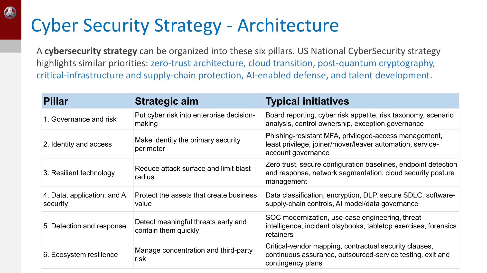
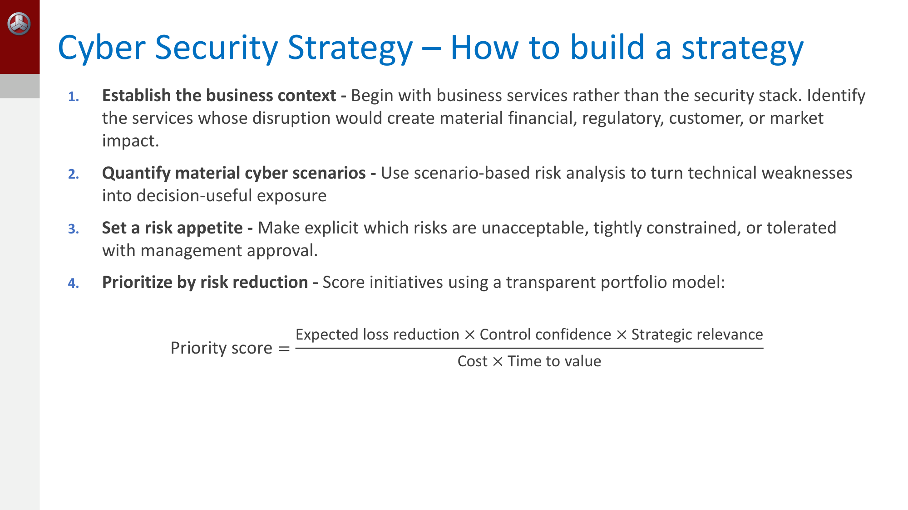
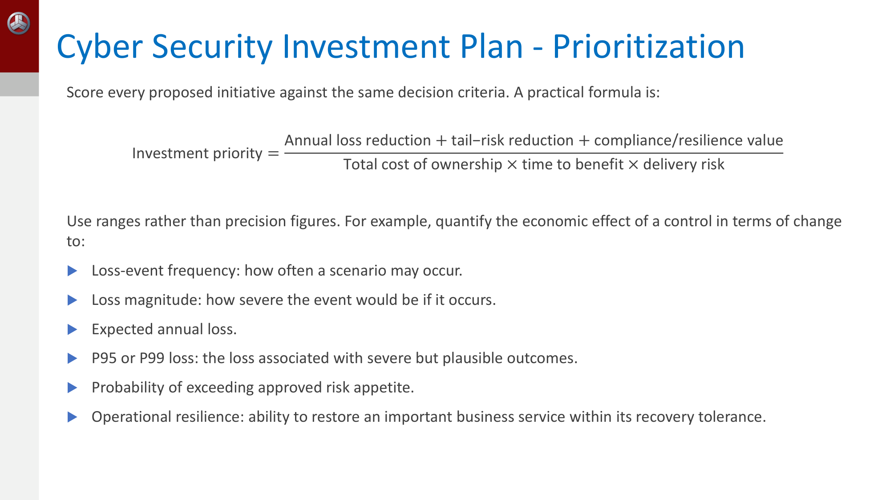
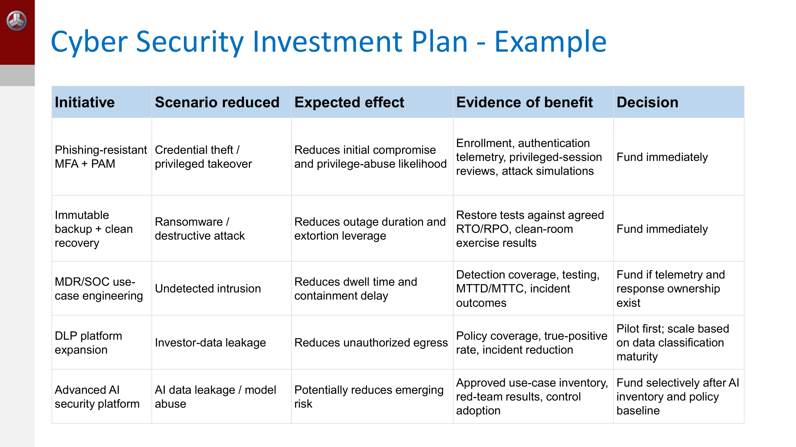
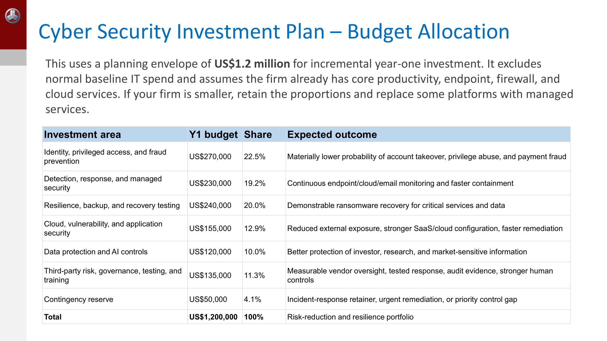

---
title:
  en: "Week 7 · Cyber & InfoSec Strategy and Investment Plan"
  zh: "第 7 周 · 网络安全 / 信息安全战略与投资计划"
summary:
  en: "What a cyber security strategy is (outcomes, six pillars, how to build one, the three-year roadmap and KPI/KRI), how an information security strategy differs, and the cyber investment plan: risk-reduction-per-dollar prioritisation formulas, percentage budget ranges, the one-page business case, go-slow items, and a full US$1.2M case for a Hong Kong hedge fund — plus Mythos-class AI and what it means for risk."
  zh: "网络安全战略是什么（目标、六大支柱、四步制定法、三年路线图、KPI/KRI），信息安全战略和它的区别，以及网络安全投资计划：按「每块钱降多少风险」排优先级的公式、预算百分比区间、一页纸 business case、该慢下来的项目，再加一个香港对冲基金 120 万美元的完整案例，最后是 Mythos 级 AI 对风险分布的影响。"
week: 7
date: 2026-10-07
tags: [Cyber Strategy, InfoSec Strategy, Investment Plan, Prioritization, Budget, Roadmap, KPI, KRI, NIST CSF 2.0, ISO 27001]
---
# ISOM 5070 Cyber Security Risk Management — Week 7 复习笔记

**主题：Cyber Security Strategy（网络安全战略）· Information Security Strategy（信息安全战略）· Cyber Security Investment Plan（网络安全投资计划）**

> 优先级标注说明（按考试重要性）：  
> 🔴 **必考核心** — 概念名称、定义、结构必须能背出来  
> 🟡 **需要理解** — 需要懂逻辑关系，能举例说明  
> 🟢 **了解即可** — 背景知识，考试大概率不会细抠
>
> **优先级依据**（这周没有老师手写补充，按课件本身推断）：  
> ① **这是最后一周新内容**（p.3）：Week 8 是 final team presentation + **30 分钟 final exam**，所以本周内容大概率出现在期末，而且 30 分钟的考试更可能考**定义、对比、公式、短情景题**，不会考逐行背表；  
> ② **两个公式**（p.7 Priority score、p.20 Investment priority）和**一组百分比**（p.19 预算区间）是本周仅有的「可以算」的地方，按 🔴；  
> ③ **课件唯一的红字**（p.17）：「Which material business-loss scenario does it reduce, by how much, by when, and what evidence will prove the reduction?」——这是整份投资计划的考核标准，按 🔴；  
> ④ **两组「定义 + 区别」**：cyber strategy「不是工具清单，也不是合规练习」（p.4）、InfoSec strategy「比技术性的网络防御更宽」（p.11）、investment plan「不是安全产品购物清单」（p.17）——典型的「说说区别」题；  
> ⑤ **p.25–37 是一整个案例**（13 页），表格密度很高，但内容是前面原则的落地。**抓住结构和几个关键数字，不要逐行背**，按 🟡；  
> ⑥ 本周大量引用前几周的东西：NIST CSF 2.0 / ISO 27001（Week 2）、情景分析和 risk appetite（Week 3）、ROI 和尾部损失（Week 4）、供应商分层（Week 5）、RTO / RPO（Week 6）——**这一周其实是全课的总装**，复习时顺便回看。

---

## 0. 核心地图（先建立整体框架）

```
Cyber Security Strategy（p.4–10）—— 业务主导：保护什么结果、优先防哪些情景、投哪些能力、怎么衡量
   → 5 个 outcomes（p.5）+ 6 大支柱（p.6）
   → 怎么做：业务背景 → 量化情景 → 定 risk appetite → 按降险排优先级（p.7–8）
   → 三年路线图（p.9）+ KPI / KRI（p.10）
Information Security Strategy（p.11–16）—— 范围更宽：所有形态的信息、全生命周期
   → ISMS（ISO 27001）+ NIST CSF 2.0 六功能
   → 90 天 → 3–6 个月 → 6–12 个月路线图（p.13–14）+ 至少每年复审（p.15）
Cyber Security Investment Plan（p.17–24）—— 把战略变成一个「有钱的降险组合」
   → 五原则（p.18）→ 预算区间（p.19）→ 优先级公式（p.20）→ 一页纸 business case（p.22）→ go-slow（p.24）
   → 案例：香港 220 人对冲基金，US$1.2M 第一年预算（p.25–37）
More AI：Mythos 级模型让风险分布两头都变（p.38–39）
```

**一句话抓住本周**：安全战略和投资计划都要**从业务服务和损失情景出发，而不是从安全工具出发**。每一块钱都要能回答 p.17 的红字问题：**降的是哪个重大业务损失情景、降多少、什么时候降、用什么证据证明**。

---

## 1. 🔴 什么是 Cyber Security Strategy（p.4）

| 课件原文                                                                                                                                                                                                                                   | 中文 / 小白解释                                                                        |
| -------------------------------------------------------------------------------------------------------------------------------------------------------------------------------------------------------------------------------------- | -------------------------------------------------------------------------------- |
| A cybersecurity strategy is the **business-led** plan for managing cyber risk                                                                                                                                                          | 网络安全战略是**业务主导**的网络风险管理计划——不是 IT 部门自己定的                                           |
| it defines the outcomes the organization must **protect**, the threats and failure scenarios it will **prioritize**, the controls and capabilities it will **fund**, and how leadership will **measure** accountability and resilience | 四个动词：**protect（保护什么结果）→ prioritize（优先防哪些情景）→ fund（为哪些能力出钱）→ measure（怎么衡量问责和韧性）** |
| It is **not a tool list or a compliance exercise**                                                                                                                                                                                     | 它**不是工具清单，也不是合规练习**                                                              |
| it connects security investment to **operational continuity, customer trust, financial exposure, and regulatory obligations**                                                                                                          | 它把安全投资和四件业务关心的事连起来：运营连续性、客户信任、财务敞口、监管义务                                          |

**金融服务公司的战略目标示例（p.4）**：保护关键服务、客户资产和敏感信息，抵御网络中断、欺诈、数据泄露和第三方失败——**同时支持安全的数字化增长**，并展示**监管级别的韧性**。

> **🧠 记忆口诀**
>
> 定义里的四个蓝色动词就是答题骨架：**Protect → Prioritize → Fund → Measure**。  
> 注意目标的后半句「**while enabling** secure digital growth」：安全战略不只是防守，还要让业务能放心上云、用 AI——这就是 p.5 第五个 outcome「Secure enablement」。

---

## 2. 🔴 战略的五个 Outcomes（p.5）

| Outcome                                  | 「做得好」是什么样                        | 示例指标                                   |
| ---------------------------------------- | -------------------------------- | -------------------------------------- |
| **Service resilience** 服务韧性              | 关键的客户和交易服务在攻击后**继续运转或快速恢复**      | 恢复时间、恢复点达成率、韧性测试结果                     |
| **Data and identity protection** 数据和身份保护 | 敏感数据和特权访问**受控、被监控、可恢复**          | MFA 覆盖率、特权账号复核完成率、数据分类覆盖率              |
| **Loss prevention** 损失预防                 | 勒索软件、BEC、支付欺诈、数据窃取**造成的损失有限**    | 欺诈损失率、高风险控制覆盖率、抗钓鱼 MFA 采用率             |
| **Regulatory assurance** 监管保证            | 公司能**拿出证据**证明治理、测试、事件报告和第三方监督    | 未关闭的审计发现、控制测试通过率、报告及时性                 |
| **Secure enablement** 安全赋能               | 上云、AI、软件交付和第三方采用都在**明确的风险决策**下推进 | Secure-by-design 采用率、关键漏洞修复、供应商风险评估完成率 |

> **💡 小白理解**
>
> 注意 Loss prevention 的措辞是「produce **limited** losses」——不是「零损失」。和 Week 3 一样，目标是把剩余风险压进 risk appetite，而不是消灭风险。  
> 每个 outcome 都配了**可量化的指标**，呼应定义里的「measure」：没有指标的目标没法问责。

---

## 3. 🔴 战略架构：六大支柱（p.6）



*Cyber Security Strategy – Architecture: six pillars（Slide 6）*

| 支柱 Pillar                                              | 战略目标             | 典型举措                                                    |
| ------------------------------------------------------ | ---------------- | ------------------------------------------------------- |
| **1. Governance and risk** 治理与风险                       | 把网络风险放进**企业决策**  | 董事会报告、cyber risk appetite、风险分类、情景分析、控制 owner、例外管理       |
| **2. Identity and access** 身份与访问                       | 让**身份成为主要的安全边界** | 抗钓鱼 MFA、PAM、最小权限、**joiner / mover / leaver** 自动化、服务账号治理 |
| **3. Resilient technology** 韧性技术                       | 缩小攻击面、**限制影响半径** | 零信任、安全配置基线、EDR、网络分段、CSPM                                |
| **4. Data, application, and AI security** 数据、应用与 AI 安全 | 保护**创造业务价值**的资产  | 数据分类、加密、DLP、secure SDLC、软件供应链控制、AI 模型 / 数据治理            |
| **5. Detection and response** 检测与响应                    | **早发现、快遏制**      | SOC 现代化、用例工程、威胁情报、事件 playbook、桌面演练、取证 retainer          |
| **6. Ecosystem resilience** 生态韧性                       | 管理**集中度和第三方**风险  | 关键供应商映射、合同安全条款、持续保证、外包服务测试、退出和应急计划                      |

> 美国国家网络安全战略强调的优先事项与此类似：**零信任架构、上云、后量子密码、关键基础设施和供应链保护、AI 赋能的防御、人才培养**。

> **🧠 记忆口诀**
>
> 六大支柱 = **G-I-R-D-D-E**：**G**overnance → **I**dentity → **R**esilient tech → **D**ata/app/AI → **D**etection → **E**cosystem。  
> 它们和前几周一一对应：Governance ↔ Week 1–2 ERM 与框架；Identity ↔ Week 2 deepfake 案例里的身份冒充；Detection and response ↔ Week 6 IR；Ecosystem ↔ Week 5 第三方风险。

> **💡 几个术语**
>
> - **Identity as the primary perimeter**：员工在家办公、系统在云上，传统的「公司网络边界」已经不存在，**谁在登录**成了真正的边界——所以身份排在技术支柱前面。
> - **Joiner / mover / leaver（JML）**：员工入职、转岗、离职时自动开通、调整、回收权限。转岗不收回旧权限是权限膨胀最常见的来源。
> - **Blast radius（影响半径）**：一个账号或一台机器被攻陷后能波及多大范围（Week 6 p.19 讲过）。
> - **Forensics retainer**：事先和取证公司签好的服务协议，出事时不用临时找人谈价。

---

## 4. 🔴 怎么制定战略：四步法 + Priority score（p.7–8）



*How to build a strategy — and the priority-score formula（Slide 7）*

| # | 步骤                                             | 要点                                                  |
| - | ---------------------------------------------- | --------------------------------------------------- |
| 1 | **Establish the business context** 确立业务背景      | 从**业务服务**出发，而不是从安全技术栈出发。找出一旦中断会造成重大财务、监管、客户或市场影响的服务 |
| 2 | **Quantify material cyber scenarios** 量化重大网络情景 | 用**基于情景的风险分析**，把技术弱点变成对决策有用的风险敞口（→ Week 3 FAIR）     |
| 3 | **Set a risk appetite** 设定风险胃口                 | 明确哪些风险**不可接受**、哪些**严格限制**、哪些**经管理层批准后可容忍**          |
| 4 | **Prioritize by risk reduction** 按降险效果排优先级     | 用一个**透明的组合模型**给举措打分                                 |

```
                  Expected loss reduction × Control confidence × Strategic relevance
Priority score = ───────────────────────────────────────────────────────────────────
                                   Cost × Time to value
```

> **🎯 考点**
>
> **公式要会读**：分子是「**收益 × 把握 × 相关度**」，分母是「**成本 × 见效时间**」。
>
> - **Control confidence**：这个控制真能起作用的把握（有没有测试证据、团队会不会用）。同样降 100 万损失的两个方案，一个已经验证过、一个只是厂商宣传，前者分子更大。
> - **Strategic relevance**：和 p.5 那五个 outcomes、和公司战略的关系有多紧。
> - **Time to value**：越晚见效分数越低——一年后才上线的方案，这一年里风险一直敞着。
>
> 和 Week 4 的 ROI = (Benefit − Cost) / Cost 比：ROI 只看钱；这个公式**多了把握、战略相关度和时间**三个维度。第 10 节 p.20 还有一个更完整的版本。

### 🟡 第 1 步落地：业务服务视角（p.8）

金融服务公司的**关键业务服务**可能包括：客户交易、执行、清算、结算、抵押品和保证金流程；行情数据和组合管理平台；支付和资金流程；投资者门户和客户报告；监管报告、账簿记录和通讯监控；以及支撑以上服务的身份、终端、云和网络服务。

对**每个服务**再列出：

- 业务 owner 和技术 owner
- 系统、数据存储、身份、供应商和云依赖
- **最长可容忍停机时间和数据丢失**（→ Week 6 的 MTPD / RPO）
- 可信的网络情景：勒索、破坏性攻击、云配置错误、凭证被盗、内部人员、供应商被攻陷、**AI 赋能的欺诈**
- 手工替代方案和恢复依赖

> **🎯 考点**
>
> **p.8 最后一句是经典考点**：业务服务视角能防止一种常见失败——汇报「**补丁完成率 95%**」，却回答不了「**一次网络攻击会不会让交易停下来、会不会泄露客户数据**」。  
> 这就是「技术指标 vs 业务结果」的区别：董事会不关心补丁率，关心的是业务服务的风险。剩下那 5% 如果恰好是交易系统，95% 毫无意义。

---

## 5. 🟡 三年路线图（p.9）

| 时间                | 主要目标                 | 关键交付物                                                                     |
| ----------------- | -------------------- | ------------------------------------------------------------------------- |
| **First 90 days** | **建立可见性**，堵住后果最严重的暴露 | Crown-jewel 服务地图、董事会风险仪表盘、关键漏洞计划、特权访问复核、勒索恢复评估、事件升级矩阵、第三方关键度清单            |
| **Months 3–12**   | 建立**基础控制的一致性**       | MFA / PAM 上线、EDR 和 SOC 用例、**备份不可篡改 + 恢复测试**、云护栏、高风险岗位安全意识、供应商尽调标准、演练项目    |
| **Year 2**        | 提升韧性和工程纪律            | 分段或零信任、secure SDLC、持续控制监控、威胁导向测试、重大服务恢复演练、数据保护现代化、第三方持续监控                 |
| **Year 3**        | 优化，让网络安全成为**业务能力**   | 量化的网络风险组合、自动化保证、转型项目里的 resilience by design、AI 安全治理、**后量子迁移规划**、高级模拟和对手仿真 |

> **🧠 记忆口诀**
>
> 四个阶段的目标是一条递进线：**看得见 → 做得齐 → 做得硬 → 做成业务能力**（visibility → consistency → resilience → capability）。  
> 先「看得见」是因为：不知道 crown jewel 在哪、没有资产清单，后面所有投资都没法排优先级。

---

## 6. 🟡 KPI / KRI（p.10）

| 领域                | 示例指标                                    |
| ----------------- | --------------------------------------- |
| **Identity**      | 使用抗钓鱼 MFA 的特权账号比例；陈旧的特权账号；**回收权限所需时间**  |
| **Vulnerability** | 在目标时间内修复的关键漏洞比例；可被利用的对外暴露数量             |
| **Detection**     | MTTD；MTTC；在 SLA 内调查完的高置信告警比例            |
| **Recovery**      | 恢复能力**已验证**的关键服务比例；恢复测试成功率；实际 vs 目标恢复时间 |
| **Third parties** | 已评估的关键供应商比例；**没有测试过事件通知承诺**的供应商；集中度暴露   |
| **Data**          | 已分类的敏感存储库比例；高严重度数据暴露；加密覆盖率              |
| **Human risk**    | 高风险岗位的模拟测试表现；员工上报的可疑活动；**付款控制例外**       |
| **Governance**    | 未关闭的风险接受；逾期审计发现；政策 / 控制测试完成率            |

> **➕ KPI 和 KRI 的区别（课件只写了标题）**
>
> - **KPI（Key Performance Indicator，关键绩效指标）**：衡量**安全项目做得怎么样**，例如「MFA 覆盖率 98%」「MTTC 30 分钟」——回头看，衡量执行。
> - **KRI（Key Risk Indicator，关键风险指标）**：衡量**风险是不是在变大**，是预警信号，例如「陈旧特权账号数量在上升」「没测试过通知承诺的供应商增加」——往前看，触线就要升级。
>
> 同一个数字可以两用：「关键漏洞修复率」当 KPI 看团队绩效，反过来「超过 SLA 未修的关键漏洞数」就是 KRI。

---

## 7. 🔴 Information Security Strategy：和 Cyber Strategy 有什么不同（p.11–12）

> **Information security strategy** 是保护信息在**完整生命周期**中的**机密性、完整性和可用性**的管理计划——无论信息存在应用、云服务、**纸质记录**、终端、供应商平台还是 AI 系统里。  
> 它**比技术性的网络防御计划更宽**，因为它结合了治理、数据 ownership、人员、**物理防护**、第三方控制、合规和持续保证。  
> 好的战略应作为**企业风险与信任项目**来定位：用对齐 **ISO 27001** 的 **ISMS**，按 **NIST CSF 2.0 的六个功能**组织风险结果：**Govern, Identify, Protect, Detect, Respond, Recover**。

**金融服务公司的 InfoSec 使命示例**：保护客户、员工、市场、财务和专有信息，防止**未授权的披露、篡改、丢失或不可用**；支持合法、可信地使用数据；在内部运营和第三方生态中保持**可证明的韧性**。

| Outcome                        | 实际含义                                      |
| ------------------------------ | ----------------------------------------- |
| **Confidentiality** 机密性        | 只有授权的人、流程、系统能访问敏感信息                       |
| **Integrity** 完整性              | 信息完整、准确、真实、**可追溯**，防止未授权修改                |
| **Availability** 可用性           | 关键信息和服务在约定的恢复目标内可访问                       |
| **Compliance and trust** 合规与信任 | 信息的使用、保留、共享和销毁符合法律、合同、政策和客户期望             |
| **Accountability** 问责          | 每个关键数据集都有**业务 owner**、分类、记录在案的风险决策和可审计的控制 |

> **🎯 Cyber strategy vs InfoSec strategy**
>
> |      | Cyber Security Strategy   | Information Security Strategy         |
> | ---- | ------------------------- | ------------------------------------- |
> | 保护对象 | **网络空间里的**系统、服务、数据（防网络攻击） | **一切形态的信息**，包括纸质记录、员工脑子里的信息           |
> | 范围   | 偏技术 + 业务服务韧性              | 更宽：治理、数据 ownership、人员、**物理防护**、第三方、合规 |
> | 组织框架 | 六大支柱（p.6）                 | **ISMS（ISO 27001）+ NIST CSF 2.0 六功能** |
> | 核心问题 | 网络攻击会不会让关键服务停下、造成损失？      | 信息在整个生命周期里的 CIA 有没有保住？                |
>
> 记忆点：mission statement 里的「**disclosure, alteration, loss, or unavailability**」正好对应 C、I、A（loss 和 unavailability 都是 A）。这和 Week 1 的「Cyber Security vs InfoSec vs BCP」三者区分是同一组概念。

> **🧠 记忆口诀**
>
> **NIST CSF 2.0 六功能：G-I-P-D-R-R** —— Govern, Identify, Protect, Detect, Respond, Recover。2.0 版新增的是 **Govern**（Week 2 讲过）。

---

## 8. 🟡 InfoSec 路线图与复审（p.13–15）

ISO 27001 的实施模型强调：高管支持、范围定义、风险评估与处置、监控、意识培训、控制实施、审计、管理评审、纠正措施、持续改进。路线图因此分三段：

| 阶段                         | 关键动作                                                                                                                                                                 |
| -------------------------- | -------------------------------------------------------------------------------------------------------------------------------------------------------------------- |
| **First 90 days：建立控制和可见性** | 拿到**高管支持**、定 **ISMS 范围**；批准信息安全政策、risk appetite 和控制 owner 模型；识别关键信息资产、存储库、数据流和关键第三方；初步分类和处理标准；评估访问、外部共享、备份、日志、供应商风险缺口；建立**风险登记册**和管理层汇报节奏；定义事件分级、升级、证据保全、法务审查和监管通知流程 |
| **Months 3–6：实施基线**        | 给高价值信息指定**业务 data owner 和技术 custodian**；MFA、特权访问控制、定期访问复核；受限信息加密和密钥管理；在高风险外发渠道（邮件、云存储、协作、终端介质、网页上传）配 DLP；终端、云、SaaS 的安全配置标准；供应商分层、尽调、最低合同要求；**按角色**做安全意识培训            |
| **Months 6–12：测试韧性，成熟保证**  | 测试勒索恢复和关键信息存储的还原；高管 IR / 数据泄露桌面演练；secure SDLC 和应用安全关卡；渗透测试；针对敏感数据访问、特权操作、异常下载、外部共享的监控用例；**ISMS 内审和管理评审**；根据结果更新风险处置计划、控制和投资路线图                                       |

> **💡 小白理解**
>
> **Data owner vs custodian**：owner 是**业务方**（例如投资者关系主管），决定数据的分类、谁能看、风险能不能接受；custodian 是**技术方**（IT），负责按 owner 的要求去实施备份、加密、权限。这就是 p.12「Accountability：每个关键数据集都有 business owner」的落地。

### 🟡 复审（p.15）

战略**至少每年复审一次**，并且在以下情况发生时也要复审：**重大收购、上云迁移、监管变化、重大事件、新的 AI 部署、商业模式变化**。

董事会记分卡要能显示「信息风险**是否真的在下降**」：关键信息资产有 owner / 分类 / 风险评估的比例；受限存储库加密和访问日志覆盖率；特权账号 MFA 和访问复核完成率；高严重度数据丢失事件和政策例外；检测、遏制、调查、整改时间；关键供应商保证覆盖率和未解决的高风险发现；关键数据存储的备份恢复成功率；逾期的风险处置、审计发现和已接受的剩余风险；**部署前已评估的 AI 用例**。

---

## 9. 🟡 InfoSec 战略的金融业重点（p.16）

| 重点                                      | 为什么重要                         | 战略应对                                         |
| --------------------------------------- | ----------------------------- | -------------------------------------------- |
| **Client and personal data** 客户和个人数据    | 泄露暴露、隐私义务、客户信任                | 分类、加密、DLP、访问重新认证、安全共享                        |
| **Market-sensitive information** 市场敏感信息 | 市场滥用、操守、声誉和监管风险               | **信息隔离墙（information barriers）**、实名访问、监控、审计轨迹 |
| **Data integrity** 数据完整性                | 定价、风险、交易、抵押品或报告**出错**就会造成财务损失 | 源头校验、**对账**、变更控制、**职责分离**、不可篡改的审计日志          |
| **Fraud and impersonation** 欺诈和冒充       | BEC 和 **AI 驱动的冒充**能迅速造成损失     | 抗钓鱼 MFA、**付款回拨确认、双人审批**、行为监控                 |
| **Third-party concentration** 第三方集中度    | 外包服务会变成共同的故障点                 | 关键供应商映射、韧性测试、退出计划、审计权、通知 SLA                 |
| **Generative AI** 生成式 AI                | 敏感输入可能被暴露或**留存在公司控制之外**       | 批准工具清单、数据使用限制、企业租户、prompt / 数据防泄露、人工审核       |

> **💼 业务视角**
>
> 金融业为什么特别强调 **Integrity**？一般公司数据被改了是「麻烦」，金融公司的估值、风险或交易数据被改了是**直接亏钱**，还可能变成操守和监管问题（例如向投资者报错了 NAV）。所以对策全是「**双重核对**」类的：对账、职责分离、不可篡改日志。  
> **Fraud and impersonation** 的对策「付款回拨 + 双人审批」正是 Week 2 那个 **HK$200M deepfake 视频会议诈骗**案的解药——不依赖「看见老板的脸」，而是用独立渠道核实。

---

## 10. 🔴 Cyber Security Investment Plan：定义与五原则（p.17–18）

> **Cybersecurity investment plan** 是**有资金支持的降险和韧性举措组合**（a funded portfolio），**不是一张安全产品的购物清单**。对金融服务或对冲基金，计划应把钱投向**少数几个**最可能造成财务损失、交易或运营中断、投资者数据暴露、欺诈或监管伤害的网络情景。
>
> 最站得住脚的计划把**每一块钱**连到：一个**重大风险情景**、一个**可衡量的可能性或影响的降低**、一个**负责的 owner**、以及**证明投资有效的证据**。NIST 的 ERM 指南要求按网络风险对企业目标的潜在影响排优先级，并据此选择风险处置。

> **🎯 课件唯一的红字（p.17）**
>
> **每个投资提案的检验标准：**  
> **Which material business-loss scenario does it reduce, by how much, by when, and what evidence will prove the reduction?**  
> 降低的是**哪个**重大业务损失情景？降**多少**？**什么时候**降？用**什么证据**证明？
>
> 四问 = **Which / How much / By when / What evidence**。情景题问「这个投资提案有什么问题」，就拿这四问去对照——缺哪一问，就是哪里有问题。

**投资计划的五原则（p.18）**：

| # | 原则                                                               | 要点                                                                                            |
| - | ---------------------------------------------------------------- | --------------------------------------------------------------------------------------------- |
| 1 | **Start with business services and loss scenarios** 从业务服务和损失情景出发 | 为交易、组合管理、投资者报告、支付、资金、行情、特权管理、关键第三方连接提供保护——**不是孤立地买安全工具**                                      |
| 2 | **Prioritize risk reduction per dollar** 按「每块钱降多少风险」排优先级         | 比较：年损失敞口的预期降幅、**尾部损失**降幅、监管 / 韧性必要性、成本、见效时间、依赖风险                                              |
| 3 | **Fund the whole control lifecycle** 为控制的完整生命周期出钱                | 新工具如果没有运营人员、集成、检测工程、测试、维护和高管 owner，就只是「**shelfware**（买了放架子上吃灰的软件）」，不是韧性                       |
| 4 | **Separate mandatory resilience from optimization** 把必需的韧性和优化分开  | 安全备份、关键访问 MFA、事件响应、漏洞修复是**基础要求**——**即使狭义的 ROI 看起来一般也要投**                                      |
| 5 | **Treat cyber as an ERM portfolio** 把网络安全当作 ERM 组合               | 把情景风险汇总进企业风险登记册，用和操作、法律、流动性、声誉、第三方风险**相同的语言**。**NIST IR 8286** 讲用网络安全风险登记册把风险信息汇总到更高层的 ERM 决策 |

> **⚠️ 原则 2 和原则 4 的张力**
>
> 原则 2 说「按每块钱降多少风险排序」，原则 4 又说「有些东西 ROI 一般也得投」，看起来矛盾。实际上是**两层决策**：
>
> - 第一层（原则 4）：备份、MFA、IR、补漏洞是**入场券**——没有它们，一次勒索就可能让公司停摆，监管也不会接受。这类控制的价值主要在**尾部**（防住那次毁灭性事件），用「预期年损失」算 ROI 会系统性低估它。
> - 第二层（原则 2）：在入场券之外的「优化型」投资里，再按降险效率排序。
>
> 第 11 节的互动打分器就是按这两层来决定的。

---

## 11. 🔴 优先级公式与举措示例（p.20–21）



*Investment priority formula and the quantities to estimate（Slide 20）*

```
                       Annual loss reduction + Tail-risk reduction + Compliance/resilience value
Investment priority = ─────────────────────────────────────────────────────────────────────────
                               Total cost of ownership × Time to benefit × Delivery risk
```

**用区间，不要用精确数字**。把一个控制的经济效果量化为以下几项的**变化**：

| 量                                                   | 中文 / 解释                                          |
| --------------------------------------------------- | ------------------------------------------------ |
| **Loss-event frequency**                            | 损失事件频率：情景多久会发生一次（→ FAIR 的 LEF）                   |
| **Loss magnitude**                                  | 损失幅度：发生一次有多严重（→ FAIR 的 LM）                       |
| **Expected annual loss**                            | 预期年损失 = 频率 × 幅度（→ Week 4 的 ALE）                  |
| **P95 or P99 loss**                                 | 「严重但合理」结果对应的损失——100 年里最坏的那 5 年 / 1 年会亏多少（→ 尾部风险） |
| **Probability of exceeding approved risk appetite** | 损失超出批准的风险胃口的**概率**                               |
| **Operational resilience**                          | 在恢复容忍度内恢复重要业务服务的能力（→ Week 6 MTPD / RTO）          |

> **🎯 p.7 和 p.20 两个公式对比**
>
> |        | p.7 Priority score            | p.20 Investment priority               |
> | ------ | ----------------------------- | -------------------------------------- |
> | 分子     | 预期损失降低 **×** 控制把握 **×** 战略相关度 | 年损失降低 **+** 尾部风险降低 **+** 合规 / 韧性价值     |
> | 分母     | 成本 × 见效时间                     | **TCO** × 见效时间 × **交付风险**              |
> | 多考虑了什么 | 把握和战略相关度（乘法：任何一项为 0 整个就是 0）   | **尾部风险**、**合规价值**、**全生命周期成本**、**交付风险** |
>
> p.20 版本更贴近原则 2–4：**TCO** 体现「为完整生命周期出钱」（原则 3），**tail-risk + compliance/resilience value** 让备份、MFA 这类基础控制不会因为预期年损失小就被排到后面（原则 4）。



*Example initiatives: scenario, effect, evidence and funding decision（Slide 21）*

| 举措                                    | 降低的情景          | 预期效果                         | 收益的证据                              | 决定                       |
| ------------------------------------- | -------------- | ---------------------------- | ---------------------------------- | ------------------------ |
| **Phishing-resistant MFA + PAM**      | 凭证被盗 / 特权被接管   | 降低初始入侵和特权滥用的可能性              | 注册率、认证遥测、特权会话复核、攻击模拟               | 🔴 **Fund immediately**  |
| **Immutable backup + clean recovery** | 勒索 / 破坏性攻击     | 缩短停机、削弱勒索筹码                  | 按 RTO / RPO 做的恢复测试、clean room 演练结果 | 🔴 **Fund immediately**  |
| **MDR / SOC use-case engineering**    | 未被发现的入侵        | 缩短 **dwell time（潜伏时间）**和遏制延迟 | 检测覆盖、测试、MTTD / MTTC、事件结果           | **有遥测数据和响应 owner 才投**    |
| **DLP platform expansion**            | 投资者数据泄露        | 减少未授权外发                      | 策略覆盖、真阳性率、事件减少                     | **先试点**，按数据分类成熟度扩大       |
| **Advanced AI security platform**     | AI 数据泄露 / 模型滥用 | **可能**降低新兴风险                 | 批准用例清单、红队结果、控制采用率                  | 先建 AI 清单和政策基线，**再有选择地投** |

> **🧠 记忆口诀**
>
> 决定这一列从上到下是一条「确定性递减」的阶梯：**立即投 → 有前提才投 → 先试点 → 打好基础再挑着投**。  
> 越往下，「预期效果」的措辞越弱（reduces → **potentially** reduces），前提条件越多。**前提没满足，买了也是 shelfware。**

### 🔴 互动：给举措打分，再决定投不投

*（网页版此处可交互：切换 p.7 / p.20 公式、改每项举措的输入和前提条件；下表是默认数值的结果。数值为示意，成本参考 p.30–34 案例）*

| Initiative                                                           | p.20 分数   | p.7 分数    | 决定                   | 理由                                            |
| -------------------------------------------------------------------- | --------- | --------- | -------------------- | --------------------------------------------- |
| Phishing-resistant MFA + PAM（Credential theft / privileged takeover） | 65.5（第 1） | 87.3（第 1） | **Fund immediately** | 基础性控制（p.18 ④）：即使 ROI 看起来一般也要先投                |
| Immutable backup + clean recovery（Ransomware / destructive attack）   | 50.0（第 2） | 40.0（第 2） | **Fund immediately** | 基础性控制（p.18 ④）：即使 ROI 看起来一般也要先投                |
| MDR / SOC use-case engineering（Undetected intrusion）                 | 14.4（第 3） | 18.5（第 3） | **Fund**             | 前提条件已满足，分数排在可投范围内                             |
| DLP platform expansion（Investor-data leakage）                        | 3.00（第 4） | 3.00（第 4） | **Pilot first**      | 先小范围试点（pilot），数据分类成熟后再扩大（p.21 / p.24）         |
| Advanced AI security platform（AI data leakage / model abuse）         | 1.50（第 5） | 0.45（第 6） | **Go slow**          | 先建 AI 清单和政策基线，再有选择地投（p.21 / p.24）             |
| Large SIEM migration（Undetected intrusion）                           | 0.50（第 6） | 0.50（第 5） | **Go slow**          | Go slow：先把 telemetry、ownership 和优先用例做出来（p.24） |

> **📌 这个打分器的数字和规则是我的建模**
>
> 课件只给了公式和 p.21 的定性决定，**没有给任何数字**。这里的输入是示意值（US$k、年），成本尽量取自 p.30–34 案例的预算明细。决定规则是把 p.18 ④（基础控制先投）、p.21 和 p.24（前提不满足就先试点 / 慢下来）叠在分数上面。  
> 试试：点 DLP 那一行，勾上「敏感数据已分类」——它从「Pilot first」变成和 MDR 竞争剩下的预算；把「今年还能再投」从 1 项改成 2 项，它才进入「Fund」。再切到 p.7 公式，看排序变不变。这就是本周的核心——**公式回答「值不值」，前提条件回答「现在能不能」**。

---

## 12. 🔴 预算怎么分：百分比区间（p.19）

> 在**不知道预算或成熟度基线**时，用**百分比分配**而不是凭空编金额。具体配比随成熟度变化：**恢复能力还不可靠的公司，应先把钱放在身份、恢复和事件准备上，再扩展高级分析或 AI 安全工具。**

| 投资类别                                                       | 建议占比       | 投什么                                   |
| ---------------------------------------------------------- | ---------- | ------------------------------------- |
| **Identity, access, and fraud prevention** 身份、访问与反欺诈       | **20–25%** | MFA、PAM、身份治理、邮件安全、付款欺诈控制、条件访问         |
| **Resilience and recovery** 韧性与恢复                          | **20–25%** | 不可篡改备份、clean-room 恢复、灾备、分段、事件响应、演练    |
| **Detection and response** 检测与响应                           | **15–20%** | EDR / XDR、SOC 或 MDR、SIEM 用例、威胁狩猎、取证准备 |
| **Vulnerability, cloud, and application security** 漏洞、云与应用 | **15–20%** | 资产发现、暴露管理、补丁、CSPM、secure SDLC、渗透测试    |
| **Data security and privacy** 数据安全与隐私                      | **10–15%** | 分类、加密、DLP、数据访问监控、记录控制                 |
| **Third-party, governance, and assurance** 第三方、治理与保证       | **10–15%** | 供应商风险、风险量化、GRC、审计、桌面演练、培训、保险优化        |
| **Strategic innovation and AI security** 战略创新与 AI 安全       | **0–10%**  | AI 治理、红队、安全自动化、后量子准备、试点               |

> **🧠 记忆口诀**
>
> **两个 20–25、两个 15–20、两个 10–15、一个 0–10**。  
> 排在最前的两类（身份、恢复）正好是 p.21 里两个「Fund immediately」；排在最后的 AI 下限是 **0**——说明它是**可选**的。身份 + 恢复 + 检测三类合计 **55–70%**，超过一半的钱花在「防进来、能恢复、早发现」上。

互动的预算配比检查器放在第 15 节，用 p.29 的案例数字来对照这张表。

---

## 13. 🔴 一页纸 Business Case 与决策指标（p.22–23）

**每个投资提案都应该一页纸讲完，回答这些问题（p.22）**：

| 字段                          | 必须回答                                             |
| --------------------------- | ------------------------------------------------ |
| **Business problem** 业务问题   | **哪个**关键业务服务、数据资产、法规或运营目标面临风险？                   |
| **Scenario** 情景             | 具体会发生什么？例如：特权账号被盗导致勒索中断                          |
| **Baseline exposure** 基线敞口  | 当前可能性、预期损失估计、尾部敞口、控制缺口和证据                        |
| **Proposed treatment** 拟议处置 | 技术、流程、人员、托管服务、韧性能力或控制重新设计                        |
| **Benefit mechanism** 收益机制  | 它是降低攻击可能性、缩短检测时间、限制影响半径、缩短恢复时间，还是降低财务损失？         |
| **Cost** 成本                 | 一次性实施、订阅、内部人力、集成、托管服务、测试、**退役（decommissioning）** |
| **Delivery risk** 交付风险      | 依赖、owner、实施时间表、运营变更负担、失败模式                       |
| **Success measures** 成功指标   | 覆盖、质量、测试结果、损失敞口变化、恢复结果、审计证据                      |
| **Residual risk** 剩余风险      | 实施后还剩什么，**谁有权接受**？                               |

> **💡 小白理解**
>
> 九个字段就是 p.17 红字四问的展开：**Scenario + Baseline = Which**；**Benefit mechanism = How much**；**Delivery risk = By when**；**Success measures = What evidence**。再加上 **Cost**（含退役——很多人忘了工具到期下线也要钱）和 **Residual risk**（和 Week 3 一样，剩余风险要有人签字接受）。  
> 「Benefit mechanism」那五种机制，其实就是 Week 3 风险 = 可能性 × 影响的不同切入点：降可能性、缩短检测（降潜伏）、限制影响半径、缩短恢复时间、降财务损失（例如保险）。

### 🟡 管理层的决策指标（p.23）

- 头部网络损失情景：**固有（gross）和剩余（residual）敞口**及趋势
- 预期年损失和**严重损失分位数**，相对于风险胃口
- 关键系统和特权用户的**抗钓鱼 MFA** 覆盖率
- 勒索恢复表现：实际恢复时间和恢复点 vs 目标
- 超出修复目标的重大关键漏洞
- 优先攻击路径的检测和遏制表现
- 关键第三方集中度、保证缺口、未测试的依赖
- **投资实际交付 vs 计划**，包括实现的控制覆盖和降险
- 未关闭的高风险例外、逾期整改、负责的高管 owner

---

## 14. 🔴 Go Slow：别把这些当起点（p.24）

> 除非前提条件已经存在，否则**不要**把以下这些当作起点：

| Go-slow 项目      | 缺的前提                            |
| --------------- | ------------------------------- |
| **大规模 SIEM 迁移** | 有用的遥测数据、响应 ownership、优先检测用例     |
| **大范围 DLP 铺开**  | 知道敏感数据在哪、owner 是谁、业务流程和可接受的共享模式 |
| **高级 AI 安全产品**  | AI 清单、使用政策、风险分类、批准的平台模型         |
| **年度合规评估**      | 只产出发现，却**没有整改资金和负责的 owner**     |
| **多个重叠的点工具**    | 只增加告警，却不能改善遏制、恢复或控制有效性的证据       |

> **🎯 考点**
>
> 五个 go-slow 项目的共同点：**买了东西，但没有能让它产生价值的「地基」**——数据、流程、owner、整改资金。这是原则 3「Fund the whole control lifecycle / shelfware」的反面教材。  
> 对比 p.21：DLP「pilot first」、AI 平台「after inventory and policy baseline」、MDR「if telemetry and ownership exist」——**p.21 的条件决定和 p.24 的 go-slow 清单说的是同一件事**。

> **💼 业务视角**
>
> 为什么 DLP 没有数据分类就上会出问题？DLP 靠规则判断「这封邮件里有没有敏感数据」。如果不知道哪些数据敏感、业务正常要怎么对外共享，规则只能写得很宽：要么误报满天飞、业务被卡住、员工想办法绕过；要么写得很松，什么都拦不住。所以先分类、先试点，再扩大。

---

## 15. 🔴 案例：香港中型另类投资管理人的 12 个月投资计划（p.25–35）

### 15.1 🟡 背景假设（p.25–26）

一家**总部在香港的中型另类投资管理人**（多策略对冲基金）：约 **220 名员工**（香港、伦敦、纽约），AUM **50–150 亿美元**；基金行政和部分 IT / 安全服务外包；重度依赖云和 SaaS；机构投资者；电子交易连接；**没有自建的 7×24 SOC**。

| 项目    | 假设                                                                     |
| ----- | ---------------------------------------------------------------------- |
| 技术    | Microsoft 365、云数据平台、SaaS 组合 / 风险工具、**OMS/EMS**（订单 / 执行管理系统）、行情终端、投资者门户 |
| 关键供应商 | 基金行政管理人、托管行 / 主经纪商、云服务商、MSP、行情供应商、法务和薪资 SaaS                           |
| 敏感信息  | 投资者 PII、银行 / 付款信息、持仓、交易和研究数据、**MNPI**、风险和估值模型、员工信息                     |
| 关键暴露  | 邮件和身份被盗、付款欺诈、勒索、云 / SaaS 配置错误、投资者数据泄露、供应商中断、**交易或风险数据被篡改**             |

计划**首先**投向身份被盗、欺诈、勒索、投资者数据丢失、交易数据完整性和关键第三方失败——**而不是买一大堆重叠的安全工具**。它对齐 NIST CSF 2.0 的结果导向模型，也符合**香港监管**对网络治理、MFA、访问控制、补丁、离线备份、事件升级、员工意识和供应商监督的期望。

### 15.2 🟡 六个投资目标（p.27）

> **香港证监会（SFC）的网上交易指引**明确了这些实际要求：**双因素认证**、监控未授权访问、need-to-know 访问、**至少每年一次访问复核**、安全补丁、防恶意软件、**每日离线备份**、网络风险治理、事件升级、应急计划、**每年意识培训**。

1. 预防或迅速遏制大多数**账号接管和提权**事件
2. 在勒索或破坏性攻击后**恢复**支撑关键业务服务的系统和信息
3. 检测特权凭证的重大滥用、可疑数据外泄和高风险云活动
4. 按定义好的 ownership、分类和处理要求保护投资者和市场敏感数据
5. 展示对关键**外包服务**的有效网络监督
6. 执行**演练过的**网络危机响应，包括对法务、监管、投资者、客户、交易对手和媒体的沟通

> **🧠 记忆口诀**
>
> 六个目标正好对应六大支柱（p.6）：① Identity → ② Resilient tech / recovery → ③ Detection → ④ Data → ⑤ Ecosystem → ⑥ Governance + response。**目标、支柱、预算类别是同一套骨架。**

### 15.3 🔴 范围内的六个风险情景（p.28）

| 风险情景                        | 业务影响                          | 假设的基线缺口                   | 投资应对                       |
| --------------------------- | ----------------------------- | ------------------------- | -------------------------- |
| **被钓鱼的员工账号变成管理员账号**         | 投资者数据被窃、付款欺诈、勒索、交易支持中断        | 传统 MFA、**常驻特权过多**、访问复核不完整 | 抗钓鱼 MFA、条件访问、PAM、身份监控      |
| **勒索攻击文件服务或组合运营**           | 交易 / 运营中断、错过截止时间、恢复成本、数据勒索    | **备份有，但恢复没有端到端测过**        | 不可篡改备份、隔离恢复、EDR/MDR、恢复演练   |
| **AI 冒充触发虚假的付款变更**          | 直接现金损失、供应商欺诈、声誉损害             | 依赖**邮件审批或非正式核实**          | 双人审批、可信回拨、付款流程控制、财务专项培训    |
| **投资者数据被外发或上传到未批准的 AI 工具**  | 隐私、法律、监管、投资者信任后果              | 数据发现弱、外部共享控制不一致           | 分类、DLP、批准 AI 政策、受限数据流程     |
| **云 / SaaS 或基金行政管理人故障阻断运营** | 无法访问记录、处理 **NAV** 相关流程、向投资者报告 | 关键供应商依赖**没有完全映射或测试**      | 供应商分层、韧性证据、应急程序、退出 / 可移植计划 |
| **风险、估值或交易支持数据被篡改**         | 错误决策、损失、操守 / 监管后果             | 变更审批和异常检测不足               | **职责分离**、审计轨迹、对账、特权会话监控    |

> **💡 小白理解**
>
> 这张表每一行都是 p.22 business case 的压缩版：**情景 → 影响 → 基线缺口 → 处置**。注意「基线缺口」这一列很具体（「备份有，但没测过恢复」），不是笼统的「安全不足」——**找到具体缺口，投资才有针对性**。

### 15.4 🔴 预算分配：US$1.2M（p.29）



*Case-study budget allocation: US$1.2M incremental year-one investment（Slide 29）*

> 这是 **US$1.2M 的第一年增量投资**规划额度，**不含正常 IT 基线支出**，假设公司已经有生产力工具、终端、防火墙和云服务。**公司更小的话，保持比例，把部分平台换成托管服务。**

| 投资领域                         | 第一年预算            | 占比        | 预期结果                          |
| ---------------------------- | ---------------- | --------- | ----------------------------- |
| 身份、特权访问与反欺诈                  | US$270,000       | **22.5%** | 大幅降低账号接管、特权滥用、付款欺诈的概率         |
| 检测、响应与托管安全                   | US$230,000       | 19.2%     | 持续的终端 / 云 / 邮件监控，更快遏制         |
| 韧性、备份与恢复测试                   | US$240,000       | 20.0%     | 关键服务和数据**可证明的**勒索恢复能力         |
| 云、漏洞与应用安全                    | US$155,000       | 12.9%     | 更少的外部暴露、更强的 SaaS / 云配置、更快修复   |
| 数据保护与 AI 控制                  | US$120,000       | 10.0%     | 更好地保护投资者、研究和市场敏感信息            |
| 第三方风险、治理、测试与培训               | US$135,000       | 11.3%     | 可衡量的供应商监督、测试过的响应、审计证据、更强的人员控制 |
| **应急储备 Contingency reserve** | US$50,000        | 4.1%      | IR retainer、紧急整改或优先控制缺口       |
| **合计**                       | **US$1,200,000** | 100%      | 降险与韧性组合                       |

### 🔴 互动：预算配比 vs p.19 区间

*（网页版此处可交互：拖动每一类的预算占比、改总预算、切换「恢复能力不可靠」，并展开 p.30–35 的举措明细；下面是三个预设的结果）*

**p.29 案例：US$1.2M（合计 100%）**

| 类别                                             | p.19 建议   | 占比    | 金额      | 判断       |
| ---------------------------------------------- | --------- | ----- | ------- | -------- |
| Identity, access, and fraud prevention         | 20–25%    | 22.5% | US$270k | 区间内      |
| Resilience and recovery                        | 20–25%    | 20%   | US$240k | 区间内      |
| Detection and response                         | 15–20%    | 19.2% | US$230k | 区间内      |
| Vulnerability, cloud, and application security | 15–20%    | 12.9% | US$155k | **低于区间** |
| Data security and privacy                      | 10–15%    | 7.5%  | US$90k  | **低于区间** |
| Third-party, governance, and assurance         | 10–15%    | 11.3% | US$135k | 区间内      |
| Strategic innovation and AI security           | 0–10%     | 2.5%  | US$30k  | 区间内      |
| Contingency reserve                            | —（p.19 无） | 4.2%  | US$50k  | —        |

**p.19 区间中点（合计 110%）**

| 类别                                             | p.19 建议   | 占比    | 金额      | 判断  |
| ---------------------------------------------- | --------- | ----- | ------- | --- |
| Identity, access, and fraud prevention         | 20–25%    | 22.5% | US$270k | 区间内 |
| Resilience and recovery                        | 20–25%    | 22.5% | US$270k | 区间内 |
| Detection and response                         | 15–20%    | 17.5% | US$210k | 区间内 |
| Vulnerability, cloud, and application security | 15–20%    | 17.5% | US$210k | 区间内 |
| Data security and privacy                      | 10–15%    | 12.5% | US$150k | 区间内 |
| Third-party, governance, and assurance         | 10–15%    | 12.5% | US$150k | 区间内 |
| Strategic innovation and AI security           | 0–10%     | 5%    | US$60k  | 区间内 |
| Contingency reserve                            | —（p.19 无） | 0%    | US$0k   | —   |

**反例：工具堆砌型（合计 100%）**

| 类别                                             | p.19 建议   | 占比  | 金额      | 判断       |
| ---------------------------------------------- | --------- | --- | ------- | -------- |
| Identity, access, and fraud prevention         | 20–25%    | 12% | US$144k | **低于区间** |
| Resilience and recovery                        | 20–25%    | 10% | US$120k | **低于区间** |
| Detection and response                         | 15–20%    | 35% | US$420k | **高于区间** |
| Vulnerability, cloud, and application security | 15–20%    | 15% | US$180k | 区间内      |
| Data security and privacy                      | 10–15%    | 10% | US$120k | 区间内      |
| Third-party, governance, and assurance         | 10–15%    | 3%  | US$36k  | **低于区间** |
| Strategic innovation and AI security           | 0–10%     | 15% | US$180k | **高于区间** |
| Contingency reserve                            | —（p.19 无） | 0%  | US$0k   | —        |

> **📌 几处是我的处理**
>
> - p.29 把「数据保护与 AI 控制」合成一项（US$120k），这里按 p.34 的明细拆开：数据发现 + DLP + 加密 = **US$90k（数据，7.5%）**，批准 AI 环境 + AI 测试 = **US$30k（AI，2.5%）**，这样才能分别对照 p.19 的两个区间。
> - 「恢复能力还不可靠」的检查规则（身份 / 恢复 / 检测放在区间上半段、AI 压到 5% 以下）是我对 p.19 那句话的解读，课件没有给具体数字。

> **🎯 p.29 案例和 p.19 区间对得上吗？**
>
> | 类别          | p.19 建议        | p.29 案例   | 判断         |
> | ----------- | -------------- | --------- | ---------- |
> | 身份          | 20–25%         | 22.5%     | ✅ 区间中点     |
> | 恢复          | 20–25%         | 20.0%     | ✅ 下沿       |
> | 检测          | 15–20%         | 19.2%     | ✅ 偏上       |
> | 云 / 漏洞 / 应用 | 15–20%         | **12.9%** | ⬇️ 偏低      |
> | 数据 + AI     | 10–15% + 0–10% | 10.0%     | 在合并区间的低端   |
> | 第三方 / 治理    | 10–15%         | 11.3%     | ✅          |
> | 应急储备        | （无）            | **4.1%**  | p.19 没有这一项 |
>
> **为什么偏离是合理的**：p.29 只算**增量**投资，假设已有终端、防火墙、云服务——云和漏洞管理的一部分已经在基线 IT 支出里；另外拿出 4.1% 做应急储备，其他类别自然被压低。**p.19 的区间是「不知道预算和成熟度时」的起点，不是硬规定。**考试问「这个预算合不合理」，要能说出**和区间比的结果 + 偏离的理由**。

### 15.5 🟡 各领域明细（p.30–35）

每一页都是同一个格式：**Initiative · Investment · Owner · Target outcome**——每笔钱都有负责人和可衡量的目标（呼应 p.17「accountable owner」和「evidence」）。各项金额加起来正好等于 p.29 的分项预算。

| 页    | 领域（合计）              | 最大的一项               | 值得记的点                                                                                                                              |
| ---- | ------------------- | ------------------- | ---------------------------------------------------------------------------------------------------------------------------------- |
| p.30 | 身份与反欺诈（**US$270k**） | **PAM US$95k**      | 抗钓鱼 MFA：**特权用户 100%、员工 98%+**；付款欺诈控制由 **CFO / COO** 负责：独立回拨核实 + 双人授权                                                               |
| p.31 | 检测与响应（**US$230k**）  | **MDR 7×24 US$95k** | 不能只看告警量或 MTTD，要测 MDR 能不能**在约定服务水平内**隔离终端、禁用恶意会话、保全证据、**上报给正确的业务决策者**；IR retainer 由 **General Counsel** / CISO 负责                   |
| p.32 | 韧性与恢复（**US$240k**）  | **不可篡改加密备份 US$85k** | **独立的备份凭证**；clean room = 不用重接被攻陷的生产环境就能恢复；**至少两次**关键服务按 RTO / RPO 的恢复测试；CISA 建议离线加密备份，SFC 要求**每日离线备份**                             |
| p.33 | 云与应用（**US$155k**）   | **CSPM US$40k**     | SFC：补丁要及时评估、测试，**测试后一个月内**实施；关键系统要分段                                                                                               |
| p.34 | 数据与 AI（**US$120k**） | 数据发现 / DLP 各 US$35k | 研究、交易策略、投资者信息、MNPI、凭证**不得输入消费级 AI 工具**；「批准的企业工具**也不能消除风险**，只是创造一个有合同、配置、日志、访问保护的受控环境」；AI 测试要看 **prompt injection**、过度权限、数据留存、输出完整性 |
| p.35 | 第三方与人员（**US$135k**） | 关键供应商映射 US$35k      | **HKMA 网络防卫计划（CFI）**：网络韧性评估 + 专业发展 + 情报共享；其 **C-RAF** 比较**固有风险**和**实际成熟度**，找出需要的改进路线——虽然只适用于银行，但对基金管理人也是好用的模型                      |

> **➕ 几个香港监管名词**
>
> - **SFC（Securities and Futures Commission，证监会）**：监管持牌证券 / 基金公司，本案例的基金管理人归它管。课件引用的是它对**网上交易系统**的网络安全指引（2FA、每日离线备份、每年访问复核、补丁一个月内实施等）。
> - **HKMA（Hong Kong Monetary Authority，金管局）**：监管银行（authorized institutions）。**CFI（Cybersecurity Fortification Initiative）** 是它的网络防卫计划，**C-RAF（Cyber Resilience Assessment Framework）** 是其中的评估框架：先评**固有风险**定出应达到的成熟度，再和**实际成熟度**比，差距就是路线图。这个思路和 Week 2 NIST CSF 的 Current Profile → Target Profile 一样。

---

## 16. 🟡 里程碑与成功标准（p.36–37）

### 季度里程碑（p.36）

| 季度               | 主要交付                                                                          | 高管决策                            |
| ---------------- | ----------------------------------------------------------------------------- | ------------------------------- |
| **Q1：建立与保护**     | 董事会批准的 cyber risk appetite；关键服务和供应商地图；MFA / PAM 设计；头部情景风险登记册；备份评估；IR retainer | 批准第一年组合，**接受或整改**眼前的关键缺口        |
| **Q2：实施控制**      | 优先用户的抗钓鱼 MFA；MDR / EDR 部署；不可篡改备份；付款欺诈流程；漏洞和外部暴露管理；关键供应商分层                     | 确认剩余风险，解决实施依赖                   |
| **Q3：测试恢复和数据控制** | **两个关键服务的恢复测试**；勒索和欺诈桌面演练；DLP / 数据分类铺开；云 / SaaS 护栏；门户 / API 渗透测试              | 决定恢复结果**是否满足业务容忍度**；为补救改进出钱     |
| **Q4：保证与优化**     | 供应商连续性演练；独立控制验证；量化网络损失分析；董事会结果评审；下一年优先级                                       | 根据**已证明的降损效果**决定续投、扩大、**停止或替换** |

> **🧠 记忆口诀**
>
> 每个季度都有一列「**Executive decision**」——投资计划不是一次批完就算，每季度都要高管做决策。Q4 的「**renew, scale, stop, or replace**」最关键：证据显示没降风险的项目要**敢停**，这才是「组合管理」（portfolio），而不是「预算花完就算」。

### 成功标准（p.37）

| 结果                      | 目标指标                                               |
| ----------------------- | -------------------------------------------------- |
| Identity resilience     | **100%** 特权账号抗钓鱼 MFA；员工 MFA **98%+**；没有未受管的共享管理员账号 |
| Privileged access       | 100% 特权访问经批准、**限时**、有日志；每季度重新认证                    |
| Endpoint and monitoring | EDR 覆盖 **98%+**；优先遥测 7×24 研判                       |
| Vulnerability exposure  | 没有超过 SLA 的已知对外关键漏洞；按系统 owner 追踪高危修复                |
| Ransomware recovery     | **两次**关键服务恢复在批准的恢复目标内完成；保留不可篡改和恢复证据                |
| Data protection         | 100% 关键数据存储库有 owner 和分类；高风险外部共享受管或被拦截              |
| Vendor resilience       | 100% 关键供应商分层；高风险缺口有处置计划、合同整改或管理层批准的风险接受            |
| Human and fraud risk    | 100% 年度培训；财务和高管完成 **BEC / deepfake** 专项演练；测试付款回拨合规 |
| Response readiness      | 至少两次跨职能演练；根据经验教训更新 playbook                        |
| Governance              | 每季度向董事会 / 网络风险委员会汇报；没有未经高管批准例外的逾期关键整改              |

> **💡 小白理解**
>
> 数字规律：**特权 100%、全员 98%+、恢复测试 2 次、演练 2 次、汇报每季度**。特权账号要求 100% 而不是 98%，因为 p.28 第一个情景就是「被钓鱼的账号变成管理员」——特权账号漏一个就是整个公司的钥匙。

---

## 17. 🟡 More AI：Anthropic Mythos（p.38–39）

课件的描述：

- **是什么**：Anthropic 的一个**受限访问**的 Claude 模型层级，面向能力特别强的网络安全和生命科学工作。它面向**经过审核的防御者和研究者**，而不是普通公众，因为它的编程和自主推理能力**既能大幅帮助漏洞发现，也能帮助进攻性利用**。课件说 Anthropic 表示 Mythos 5.1 仍低于其 Responsible Scaling Policy 的下一个风险等级，但因为生物和网络能力，保留了之前 Mythos 版本的访问限制。
- **意味着什么**：从「AI 能帮忙写代码」变成「AI 可能**大幅压缩整个漏洞研究周期**」——理解代码库、形成 bug 假设、测试、验证影响，甚至可能产出 exploit PoC。
- **数据点**：Anthropic 报告早期的 Mythos Preview 在 **410 次**基准尝试中**自主**构建了 **56 次**完整的端到端 exploit；同一评测中 Z.ai 的 GLM-5.3 成功 **50 次**——Anthropic 用这个对比说明先进的网络能力正在扩散到严格受控的系统之外。
- **防御性部署**：通过 **Project Glasswing** 把预览模型提供给可信的安全组织，在类似能力普及之前先找漏洞；合作方在关键软件里找到了**超过 10,000 个**漏洞。

**对金融机构，风险分布两头都变（p.39）**：

| 方向                              | 内容                                                       |
| ------------------------------- | -------------------------------------------------------- |
| **Defensive upside** 防御上行       | 在大规模 IT 环境里更快发现 web 应用缺陷、不安全代码路径、配置错误、身份弱点和有漏洞的依赖        |
| **Offensive downside** 进攻下行     | 更快的 exploit 开发、**更低的技能门槛**——攻击者可以针对 API、支付系统、第三方、终端和遗留应用 |
| **Governance requirement** 治理要求 | 把它当作**高风险 AI 系统 + 特权安全能力**，**而不是普通的员工生产力工具**             |

**相称的控制模型**：指定的批准用户、**允许目标清单**、与生产环境隔离、强制日志、**主动测试要双人审批**、不直接连接敏感环境、法务审查、记录在案的**负责任披露和整改流程**。

> **🎯 考点**
>
> 最可能的考法：「这类模型对公司的网络风险有什么影响？应该怎么治理？」——答**两个方向（防御上行 + 进攻下行）+ 一个治理定位（高风险 AI 系统 + 特权安全能力）+ 几条控制**。  
> 注意控制模型和本周前面完全一致：**特权访问的管法**（指定用户、双人审批、日志、隔离）就是 p.30 PAM 的思路，只是对象从管理员账号换成了 AI 能力。也呼应 Week 5「采用 AI 新增的风险」。

---

## 🔴 综合缩写速查表

| 缩写 / 概念                   | 含义                                                                                                                                                                              |
| ------------------------- | ------------------------------------------------------------------------------------------------------------------------------------------------------------------------------- |
| Cyber security strategy   | 业务主导的网络风险管理计划：Protect → Prioritize → Fund → Measure；不是工具清单或合规练习                                                                                                                 |
| InfoSec strategy          | 保护所有形态信息全生命周期 CIA 的管理计划，比网络防御更宽（含物理、人员、纸质记录）                                                                                                                                    |
| Investment plan           | 有资金支持的降险和韧性举措组合（funded portfolio），不是安全产品购物清单                                                                                                                                    |
| 六大支柱                      | Governance & risk · Identity & access · Resilient technology · Data, app & AI security · Detection & response · Ecosystem resilience                                            |
| NIST CSF 2.0              | Govern, Identify, Protect, Detect, Respond, Recover                                                                                                                             |
| ISMS                      | Information Security Management System，ISO 27001 的信息安全管理体系                                                                                                                      |
| Priority score（p.7）       | 预期损失降低 × 控制把握 × 战略相关度 ÷ (成本 × 见效时间)                                                                                                                                             |
| Investment priority（p.20） | (年损失降低 + 尾部风险降低 + 合规 / 韧性价值) ÷ (TCO × 见效时间 × 交付风险)                                                                                                                              |
| TCO                       | Total Cost of Ownership，总拥有成本（实施 + 订阅 + 人力 + 集成 + 测试 + 退役）                                                                                                                      |
| P95 / P99 loss            | 严重但合理情形下的损失（尾部风险）                                                                                                                                                               |
| Shelfware                 | 买了没人运营、没集成的工具，「放架子上吃灰」                                                                                                                                                          |
| KPI / KRI                 | 关键绩效指标（执行得怎么样）/ 关键风险指标（风险是否在变大）                                                                                                                                                 |
| PAM                       | Privileged Access Management，特权访问管理                                                                                                                                             |
| JML                       | Joiner / Mover / Leaver，入职 / 转岗 / 离职的权限生命周期                                                                                                                                     |
| CSPM                      | Cloud Security Posture Management，云安全态势管理                                                                                                                                       |
| DLP                       | Data Loss Prevention，数据防泄露                                                                                                                                                      |
| MDR                       | Managed Detection and Response，托管检测与响应                                                                                                                                          |
| Dwell time                | 攻击者从入侵到被发现的潜伏时间                                                                                                                                                                 |
| Clean room recovery       | 在隔离环境恢复，不重新接回被攻陷的生产环境                                                                                                                                                           |
| OMS / EMS                 | Order / Execution Management System，订单 / 执行管理系统                                                                                                                                 |
| NAV                       | Net Asset Value，基金资产净值                                                                                                                                                          |
| MNPI                      | Material Non-Public Information，重大非公开信息                                                                                                                                         |
| NIST IR 8286              | 用网络安全风险登记册把风险汇总进 ERM                                                                                                                                                            |
| SFC / HKMA                | 香港证监会 / 香港金管局                                                                                                                                                                   |
| CFI / C-RAF               | 网络防卫计划 / 网络韧性评估框架（固有风险 vs 实际成熟度）                                                                                                                                                |
| 预算区间（p.19）                | 身份 20–25 · 恢复 20–25 · 检测 15–20 · 漏洞 / 云 / 应用 15–20 · 数据 10–15 · 第三方 / 治理 10–15 · AI 0–10（%）                                                                                     |
| 关键数字                      | 案例 **US$1.2M**（身份 22.5%、恢复 20%、检测 19.2%、储备 4.1%）；MFA 特权 **100%** / 全员 **98%+**；EDR **98%+**；**2 次**恢复测试；SFC **每日离线备份**、补丁测试后 **1 个月内**；战略**至少每年**复审；Mythos Preview **56 / 410** |

---

## 模拟自测题

**什么是 cyber security strategy？它「不是」什么？**

> Cyber security strategy 是**业务主导**的网络风险管理计划：定义组织必须**保护**的结果、**优先**应对的威胁和失败情景、要**出钱**建设的控制和能力，以及领导层如何**衡量**问责和韧性（Protect → Prioritize → Fund → Measure）。
>
> 它**不是工具清单，也不是合规练习**——它把安全投资和**运营连续性、客户信任、财务敞口、监管义务**连接起来。

**p.8 说业务服务视角能防止一种常见失败。是什么失败？为什么？**

> 失败是：汇报「**补丁完成率 95%**」，却回答不了「**一次网络攻击会不会让交易停下、会不会暴露客户数据**」。
>
> 原因：技术指标衡量的是安全团队的**活动量**，而董事会关心的是**业务结果**。如果剩下的 5% 恰好是交易系统或支付系统，95% 毫无意义。从业务服务出发，先列出关键服务、它们的 owner、依赖、可容忍停机和数据丢失、可信情景、手工替代方案，再看安全控制覆盖了没有，才能回答董事会的问题。

**写出 cyber security strategy 的六大支柱，并各举一个典型举措。**

> 1. **Governance and risk**：董事会报告、cyber risk appetite
> 2. **Identity and access**：抗钓鱼 MFA、PAM、JML 自动化
> 3. **Resilient technology**：零信任、网络分段、EDR
> 4. **Data, application, and AI security**：数据分类、DLP、secure SDLC、AI 治理
> 5. **Detection and response**：SOC 现代化、incident playbook、桌面演练
> 6. **Ecosystem resilience**：关键供应商映射、合同安全条款、退出计划

**Information security strategy 和 cyber security strategy 有什么区别？InfoSec strategy 推荐用哪两个框架来组织？**

> InfoSec strategy 保护的是信息在**完整生命周期**中的 **CIA**，无论它在应用、云、**纸质记录**、终端、供应商平台还是 AI 系统里。它**比技术性的网络防御更宽**：包括治理、数据 ownership、人员、**物理防护**、第三方控制、合规和持续保证。Cyber strategy 侧重网络攻击对业务服务的影响。
>
> 推荐框架：对齐 **ISO 27001** 的 **ISMS**，按 **NIST CSF 2.0 六个功能**（Govern, Identify, Protect, Detect, Respond, Recover）组织风险结果。

**写出 p.7 和 p.20 的两个优先级公式。p.20 版本比 p.7 多考虑了什么？为什么这对备份、MFA 这类控制很重要？**

> - **p.7**：Priority score = (Expected loss reduction × Control confidence × Strategic relevance) ÷ (Cost × Time to value)
> - **p.20**：Investment priority = (Annual loss reduction + Tail-risk reduction + Compliance/resilience value) ÷ (TCO × Time to benefit × Delivery risk)
>
> p.20 多了：**尾部风险降低**、**合规 / 韧性价值**、**总拥有成本（TCO）**和**交付风险**。
>
> 对备份、MFA 很重要，因为它们的价值主要在**尾部**——防住那一次让公司停摆的勒索，以及满足监管要求（SFC 要求 2FA 和每日离线备份）。只用「预期年损失」算，它们的 ROI 会被低估。p.18 原则 4 也说：这些是**基础要求，即使狭义 ROI 一般也要投**。

**p.17 的红字是每个投资提案的检验标准。请写出来，并用它评价这个提案：「我们申请 50 万美元购买一款领先的 AI 安全平台，它采用最新技术，能全面提升公司安全水平。」**

> 检验标准：**Which material business-loss scenario does it reduce, by how much, by when, and what evidence will prove the reduction?**
>
> 这个提案四问全都答不上：
>
> - **Which**：没有说降低哪个业务损失情景（AI 数据泄露？模型滥用？），也没有说保护哪个业务服务；
> - **How much**：「全面提升安全水平」不是可衡量的降幅，没有基线敞口和预期年损失 / 尾部损失变化；
> - **By when**：没有实施时间表、见效时间、交付风险；
> - **What evidence**：没有成功指标（批准用例清单、红队结果、控制采用率）。
>
> 另外它正好是 p.24 的 **go-slow** 项目：没有提到公司是否已有 **AI 清单、使用政策、风险分类和批准的平台模型**。按 p.21，应「**先建立 AI 清单和政策基线，再有选择地投**」，而且 p.19 建议 AI 类别只占预算的 **0–10%**。

**p.18 说新工具如果缺少某些东西就会变成 shelfware。缺的是什么？这对应哪条投资原则？**

> 缺**运营人员、集成、检测工程、测试、维护和高管 owner**。对应原则 3「**Fund the whole control lifecycle**」：预算不能只算买许可证，要算总拥有成本（TCO）——这也是 p.20 公式分母用 TCO 而不是采购价的原因，p.22 business case 的 Cost 字段也要求列出人力、集成、测试和退役成本。

**按 p.19，一家不知道预算和成熟度基线的公司应怎么分配安全预算？如果这家公司的恢复能力还不可靠，配比要怎么调？**

> 用**百分比分配**而不是凭空编金额：身份、访问与反欺诈 **20–25%**；韧性与恢复 **20–25%**；检测与响应 **15–20%**；漏洞、云与应用 **15–20%**；数据安全与隐私 **10–15%**；第三方、治理与保证 **10–15%**；战略创新与 AI 安全 **0–10%**。
>
> 恢复能力不可靠时：**先把钱放在身份、恢复和事件准备上，再扩展高级分析或 AI 安全工具**——也就是前三类往区间上沿靠，AI / 高级分析压到低端。可以用第 15 节的 BudgetMixLab 勾上「恢复能力还不可靠」看效果。

**p.29 案例中，哪些类别落在 p.19 的建议区间内，哪些不在？如何解释这些偏离？**

> **在区间内**：身份 22.5%（20–25）、恢复 20.0%（20–25）、检测 19.2%（15–20）、第三方 / 治理 11.3%（10–15）。  
> **偏低**：云 / 漏洞 / 应用 **12.9%**（建议 15–20）；数据 + AI 合计 10%，在合并区间的低端。  
> **多出来**：**4.1% 应急储备**，p.19 没有这一项。
>
> 解释：p.29 只算**第一年增量投资**，不含基线 IT 支出，并假设公司已有终端、防火墙、云服务——云和漏洞管理的部分能力已在基线里；拿出应急储备给 IR retainer 和紧急整改，其他类别自然被压低。p.19 的区间是**不知道预算和成熟度时的起点**，不是硬规定；偏离只要有理由就是合理的。

**p.24 列出了哪些「go slow」项目？它们的共同问题是什么？**

> 1. 在建立有用的遥测、响应 ownership 和优先检测用例之前，做**大规模 SIEM 迁移**；
> 2. 在识别敏感数据、owner、流程和可接受共享模式之前，**大范围铺开 DLP**；
> 3. 在建立 AI 清单、使用政策、风险分类和批准平台之前，买**高级 AI 安全产品**；
> 4. 只产出发现、却**没有整改资金和负责 owner** 的年度合规评估；
> 5. 只增加告警、却不能改善遏制、恢复或控制有效性证据的**多个重叠点工具**。
>
> 共同问题：**买了东西，却没有让它产生价值的前提**（数据、流程、owner、整改资金）——结果是 shelfware 或告警噪音，而不是降险。

**案例中「备份有，但恢复没有端到端测过」是哪个情景的基线缺口？投资计划在哪些地方针对它？**

> 是「**勒索攻击文件服务或组合运营**」情景（p.28）。针对它的投资：
>
> - **p.32**：不可篡改加密备份（US$85k，独立备份凭证）、关键服务恢复设计、**clean-room 隔离恢复**、**恢复测试和勒索模拟**（至少两次关键服务按 RTO / RPO 恢复）；
> - **p.36 Q3**：两个关键服务的恢复测试，高管决定**恢复结果是否满足业务容忍度**；
> - **p.37**：成功标准「两次关键服务恢复在批准的恢复目标内完成，保留不可篡改和恢复证据」。
>
> 这呼应 Week 6 p.19 的「**测试恢复，而不只是测试备份完成**」。

**课件认为 Mythos 级 AI 模型会如何改变金融机构的网络风险分布？应当如何治理它的使用？**

> **两个方向**：
>
> - **防御上行**：在大规模环境里更快发现 web 应用缺陷、不安全代码路径、配置错误、身份弱点和有漏洞的依赖；
> - **进攻下行**：更快的 exploit 开发、**更低的技能门槛**，攻击者可针对 API、支付系统、第三方、终端和遗留应用。
>
> **治理定位**：当作**高风险 AI 系统 + 特权安全能力**，而不是普通员工生产力工具。  
> **控制**：指定的批准用户、允许目标清单、与生产隔离、强制日志、主动测试双人审批、不直接连敏感环境、法务审查、记录在案的负责任披露和整改流程。
