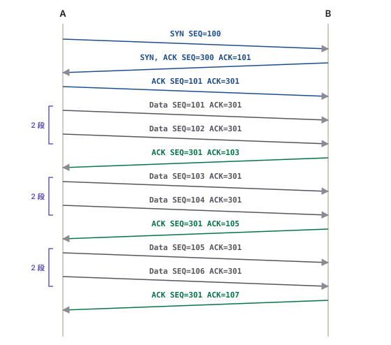

---
title:
  en: "Final Review M3 · TCP, UDP, Windowing and Port Numbers"
  zh: "期末复习 M3 · TCP、UDP、窗口与端口号"
summary:
  en: "Module 3 for the final: the five transport-layer services, the three-way handshake, sequence and expectational acknowledgment numbers, window size and sliding windows, the SEQ / ACK ladder drawing from given ISNs and a window size, port numbers and multiplexing, and TCP vs UDP — with MCQs and drawing questions."
  zh: "按期末 guideline 逐条复习 Module 3：传输层 5 个功能、三次握手、序列号与期望型确认、window size 与滑动窗口、「给 ISN 和 window size 画 SEQ / ACK 时序图」这道画图题、端口号与多路复用、TCP vs UDP；附选择题和画图题。"
week: 3
date: 2026-10-10
tags: [FinalReview, TCP, UDP, Handshake, Windowing, SequenceNumber, Ports]
---
# 期末复习 M3 · TCP、UDP、窗口与端口号

**详细笔记**：[第 3 周笔记](../../lectures/week-03/)　**总览**：[期末总复习](../final-review/)　**上一章**：[M2](../final-m2/)　**下一章**：[M4 · 子网](../final-m4/)

> 优先级：🔴 必考核心 · 🟡 需要理解 · 🟢 了解即可  
> 掌握要求：🖊️ **画图 / 填表** · 🔍 **辨析** · 📝 **默写** · 🧮 **计算**

> **🎯 这一章在期末怎么考**
>
> - **Final-guide 列的 9 条**：Transport layer functions · Three-way handshake · Windowing · Window size · Acknowledgment · TCP and UDP port numbers · Identifying application processes using port numbers · TCP sequence and acknowledgement · Comparing TCP and UDP。
> - **Final Review 里 2 道选择题**（11 connection-oriented、12 端口号的作用）。课件只有 27 页，但 9 条 guideline 里有 **5 条是 SEQ / ACK / 窗口**。
> - **🔴 重点画图题：给两边的 initial sequence number 和 window size，画出 SEQ / ACK**。先三次握手，再按窗口一批批发段、对方回期望型 ACK，可能还会丢一段要重传。第 4 节有完整画法和可以自己换数字的时序图。
> - Assignment 3 问过：握手三个包的 flags 和端口；Nmap SYN scan 收到什么包。
> - 分量：约占全部复习时间的 **15%**，但画图题要留出时间练。

## 本章大纲

- **[1. 🔴 The Transport Layer Functions 📝](#1--the-transport-layer-functions-)**
- **[2. 🔴 Three-way Handshake 🖊️🔍](#2--three-way-handshake-️)**
- **[3. 🔴 Sequence Number、Acknowledgment、Window Size 🧮🔍](#3--sequence-numberacknowledgmentwindow-size-)**
- **[4. 🔴 画图题：给 ISN 和 Window Size，画 SEQ / ACK 🖊️🧮](#4--画图题给-isn-和-window-size画-seq--ack-️)**
- **[5. 🔴 Port Numbers：Identifying Application Processes 📝🖊️](#5--port-numbersidentifying-application-processes-️)**
- **[6. 🔴 Comparing TCP and UDP 📝🔍](#6--comparing-tcp-and-udp-)**
- **[7. 练习 · 选择题](#7-练习--选择题)**
- **[8. 练习 · 画图题](#8-练习--画图题)**

---

## 1. 🔴 The Transport Layer Functions 📝

| # | 功能（Slide 4）                                       | 靠什么                                    |
| - | ------------------------------------------------- | -------------------------------------- |
| 1 | **Segmenting** upper-layer application data       | 切段 + 编号                                |
| 2 | Establishing **end-to-end** operations            | 只在两端主机，中间路由器不管                         |
| 3 | Sending segments from **one end host to another** | 端口号                                    |
| 4 | Ensuring **data reliability**                     | **Sequence numbers + acknowledgments** |
| 5 | Ensuring **flow control**                         | **Sliding windows**                    |

- **IP 负责送到哪台电脑**（best effort，不保证到、不保证顺序）；**TCP 负责完整、有序、交给对的程序**。
- Reliable data transport 4 件事：被确认 · 没确认就重传 · 按序重组 · 拥塞避免与控制。

> **🧠 记忆口诀**
>
> **切、连、送、稳、控**：Segmenting · End-to-end · Host-to-host · Reliability（SEQ / ACK）· Flow control（window）。

🔗 [第 3 周 §1](../../lectures/week-03/#1--传输层的角色与-5-个功能)

## 2. 🔴 Three-way Handshake 🖊️🔍

**Connection-oriented**：发数据前先交换消息、建立会话（打电话）；**connectionless**：直接发（寄信）。

| 步 | 方向    | Flags        | SEQ            | ACK       |
| - | ----- | ------------ | -------------- | --------- |
| ① | A → B | **SYN**      | **x**（A 的 ISN） | —         |
| ② | B → A | **SYN, ACK** | **y**（B 的 ISN） | **x + 1** |
| ③ | A → B | **ACK**      | x + 1          | **y + 1** |

- **ISN** 由各自**随机**选（大随机数，防止伪造 / session hijacking）。握手同时定下**端口**：客户端动态端口 → 服务器 well-known 端口；回包时两个端口对调。
- **SYN 本身占一个序号**，所以 ACK = 对方 SEQ + 1，第一段数据的 SEQ = ISN + 1。
- Slide 11：浏览器 SEQ 200、SPORT 49152 → DPORT 80；服务器 SEQ 1450、ACK 201；浏览器 SEQ 201、ACK 1451。

*（网页版此处可以自己填两边的 ISN 和数据长度，一步步看 SEQ / ACK；下面是两个例子的结果）*

**Slide 11（SEQ 200 / 1450）：Client ISN = 200，Server ISN = 1450**

| # | 方向              | Flags    | SEQ  | ACK  | Len | 说明                                                              |
| - | --------------- | -------- | ---- | ---- | --- | --------------------------------------------------------------- |
| 1 | Client → Server | SYN      | 200  | —    | 0   | 客户端随机选 ISN = 200，请求建立连接                                         |
| 2 | Server → Client | SYN, ACK | 1450 | 201  | 0   | 服务器选自己的 ISN = 1450；ACK = 200 + 1 = 201（SYN 占 1 个序号，下一个想收的是 201） |
| 3 | Client → Server | ACK      | 201  | 1451 | 0   | SEQ = 对方刚才确认的 201；ACK = 1450 + 1 = 1451。连接建立 (ESTABLISHED)      |

**板书 p.3（Percy 10 / G.F. 20）：Client ISN = 10，Server ISN = 20**

| # | 方向              | Flags     | SEQ | ACK | Len | 说明                                                         |
| - | --------------- | --------- | --- | --- | --- | ---------------------------------------------------------- |
| 1 | Client → Server | SYN       | 10  | —   | 0   | 客户端随机选 ISN = 10，请求建立连接                                     |
| 2 | Server → Client | SYN, ACK  | 20  | 11  | 0   | 服务器选自己的 ISN = 20；ACK = 10 + 1 = 11（SYN 占 1 个序号，下一个想收的是 11） |
| 3 | Client → Server | ACK       | 11  | 21  | 0   | SEQ = 对方刚才确认的 11；ACK = 20 + 1 = 21。连接建立 (ESTABLISHED)      |
| 4 | Client → Server | ACK, Data | 11  | 21  | 100 | 第 1 段数据 100 bytes：字节编号 11 – 110                            |
| 5 | Server → Client | ACK       | 21  | 111 | 0   | 期望型确认：ACK = 11 + 100 = 111（「前面都收到了，下一个请发 111」）             |
| 6 | Client → Server | ACK, Data | 111 | 21  | 50  | 第 2 段数据 50 bytes：字节编号 111 – 160                            |
| 7 | Server → Client | ACK       | 21  | 161 | 0   | 期望型确认：ACK = 111 + 50 = 161（「前面都收到了，下一个请发 161」）             |

🔗 [第 3 周 §2–3](../../lectures/week-03/#3--tcp-三次握手three-way-handshake)

## 3. 🔴 Sequence Number、Acknowledgment、Window Size 🧮🔍

| 字段                        | 意思                                                                           |
| ------------------------- | ---------------------------------------------------------------------------- |
| **Sequence number**       | 「我这一段从几号开始」——接收方靠它**排序、发现缺号**                                                |
| **Acknowledgment number** | 「**我下一个要几号**」——**expectational / forward acknowledgment**，不是「刚收到几号」          |
| **Window size**           | 「不等 ACK 最多还能发多少」= the maximum number of **unacknowledged** bytes outstanding |

- **Slide 23（按段编号）**：发 #10 → 回 ACK 11（「收到 10，请发 11」）。双方**各有一套编号**：客户端 Seq 10、11；服务器 Seq 5；服务器的 Ack 11 对应客户端的编号，客户端的 Ack 6 对应服务器的编号。
- **按字节编号（真实 TCP）**：SEQ = 11、长度 100 bytes → 这段是字节 11–110 → **ACK = 111**。
- **Windowing**：窗口 = 1 就是停等（发一段等一个 ACK）；窗口越大、等待越少、**效率越高**；但接收方缓冲区有限，所以每个 ACK 都带 **window advertisement**，窗口在连接过程中**会变**（*slides up and down*）→ sliding window。
- **重传**：发出去的段放进 **retransmission queue** 并启动计时器；计时器到期还没等到确认 → **重传**，并放慢发送（超时往往是网络拥塞）。

🔗 [第 3 周 §4–5](../../lectures/week-03/#4--sequence-number-与-acknowledgment)

## 4. 🔴 画图题：给 ISN 和 Window Size，画 SEQ / ACK 🖊️🧮

> **🎯 这道题的标准画法（按这个顺序写，每一步都有分）**
>
> 1. 画两条竖线（时间往下）：左边发送方 A，右边接收方 B。
> 2. **三次握手**三条斜箭头：`SYN SEQ=x` → `SYN,ACK SEQ=y ACK=x+1` → `ACK SEQ=x+1 ACK=y+1`。
> 3. **第一个窗口**：A 连发 **window size 那么多段**，不等 ACK。按段编号：SEQ = x+1, x+2, x+3；按字节编号（每段 n bytes）：SEQ = x+1, x+1+n, x+1+2n。每段的 ACK 字段都是 y+1（B 没有发数据）。
> 4. B 收完这一窗回**一个** ACK：**ACK = 下一个想要的号**（按段：x+4；按字节：x+1+3n）。B 的 SEQ 一直是 y+1。
> 5. 窗口**往前滑**到 ACK 的号码，发下一窗……直到发完。
> 6. 如果有一段丢了：B 只能 ACK「最前面缺的那一段」（**重复 ACK**），A 的计时器到期 → **重传那一段** → B 一次确认到最后（因为后面的段已经先存在缓冲区里）。

*（网页版此处可以自己填两边的 ISN、window size、段数、编号方式和丢失的段；下面是「按段编号：ISN 100 / 300，窗口 2，共 6 段」）*

| #  | 方向    | 段                          | 为什么                              |
| -- | ----- | -------------------------- | -------------------------------- |
| 1  | A → B | SYN  SEQ=100               | A 选 ISN = 100                    |
| 2  | B → A | SYN, ACK  SEQ=300  ACK=101 | B 选 ISN = 300；ACK = 100 + 1      |
| 3  | A → B | ACK  SEQ=101  ACK=301      | ACK = 300 + 1；连接建立               |
| 4  | A → B | Data  SEQ=101  ACK=301     | 第 1 段                            |
| 5  | A → B | Data  SEQ=102  ACK=301     | 第 2 段                            |
| 6  | B → A | ACK  SEQ=301  ACK=103      | ACK = 103：前面都收到了，下一个要 103（窗口往前滑） |
| 7  | A → B | Data  SEQ=103  ACK=301     | 第 3 段                            |
| 8  | A → B | Data  SEQ=104  ACK=301     | 第 4 段                            |
| 9  | B → A | ACK  SEQ=301  ACK=105      | ACK = 105：前面都收到了，下一个要 105（窗口往前滑） |
| 10 | A → B | Data  SEQ=105  ACK=301     | 第 5 段                            |
| 11 | A → B | Data  SEQ=106  ACK=301     | 第 6 段                            |
| 12 | B → A | ACK  SEQ=301  ACK=107      | ACK = 107：全部收到                   |

> **⚠️ 最常见的 5 个错**
>
> - 第一段数据的 SEQ 写成 ISN（应该是 **ISN + 1**，SYN 占了一个号）。
> - ACK 写成「收到的号」（收到 #3 写 ACK 3）——应该是 **下一个要的号**（ACK 4）。
> - 按字节编号时 ACK 只 +1——应该 **+ 段长度**。
> - 在一个窗口里每段都画一个 ACK——窗口的意思就是**发完一窗才等一个 ACK**（课件 WindowLab 的画法）。
> - 把两边的序号混在一起：A 的 SEQ 和 B 的 SEQ 是**两套独立的编号**。

*（网页版此处可以自己设窗口大小、点选丢失的段，一轮轮看滑动和重传；下面是三个例子）*

**没有丢包，窗口 3**

| 轮 | 窗口     | 发送方发出（↻ 重传，✗ 丢失） | 接收方回  |
| - | ------ | ---------------- | ----- |
| 1 | 1–3（3） | 1  2  3          | ACK 4 |
| 2 | 4–6（3） | 4  5  6          | ACK 7 |
| 3 | 7–8（3） | 7  8             | ACK 9 |

**窗口 1（停等）**

| 轮 | 窗口     | 发送方发出（↻ 重传，✗ 丢失） | 接收方回  |
| - | ------ | ---------------- | ----- |
| 1 | 1–1（1） | 1                | ACK 2 |
| 2 | 2–2（1） | 2                | ACK 3 |
| 3 | 3–3（1） | 3                | ACK 4 |
| 4 | 4–4（1） | 4                | ACK 5 |

**第 4 段丢失，窗口 3**

| 轮 | 窗口     | 发送方发出（↻ 重传，✗ 丢失） | 接收方回       |
| - | ------ | ---------------- | ---------- |
| 1 | 1–3（3） | 1  2  3          | ACK 4      |
| 2 | 4–6（3） | 4✗  5  6         | ACK 4 ⏰ 超时 |
| 3 | 4–6（3） | ↻4               | ACK 7      |
| 4 | 7–8（3） | 7  8             | ACK 9      |

🔗 [第 3 周 §5](../../lectures/week-03/#5--windowing流量控制)

## 5. 🔴 Port Numbers：Identifying Application Processes 📝🖊️

| 范围                | 名字                    | 谁用                     |
| ----------------- | --------------------- | ---------------------- |
| **0 – 1023**      | **Well-known**        | 服务器（客户端必须事先知道，IANA 管理） |
| **1024 – 49151**  | **Registered**        | 用户安装的应用；空闲时客户端也能拿来当源端口 |
| **49152 – 65535** | **Dynamic / private** | 客户端，每个连接一个             |

| Port    | 协议                             |   | Port | 协议             |
| ------- | ------------------------------ | - | ---- | -------------- |
| 20 / 21 | TCP · FTP data / control       |   | 69   | **UDP** · TFTP |
| 23      | TCP · Telnet                   |   | 80   | TCP · HTTP     |
| 25      | TCP · SMTP（发信）                 |   | 110  | TCP · POP3（收信） |
| 53      | **TCP 和 UDP** · DNS            |   | 161  | **UDP** · SNMP |
| 67 / 68 | UDP · DHCP server / client（M2） |   |      |                |

- **Multiplexing**：同一台电脑开 5 个浏览器窗口，IP 只送到这台电脑，**传输层按目的端口交给正确的窗口**。每个客户端连接用不同的源端口；服务器对所有连接用同一个端口（web = 80）。
- 一个连接由 **源 IP、目的 IP、源端口、目的端口、协议** 唯一确定。

*（网页版此处可以输入任意端口号分类，并打开多个浏览器窗口观察源端口怎样区分对话）*

| 端口        | 范围                                    | 常见用途            |
| --------- | ------------------------------------- | --------------- |
| **21**    | Well-known port（0 – 1023）             | TCP FTP control |
| **53**    | Well-known port（0 – 1023）             | TCP, UDP DNS    |
| **80**    | Well-known port（0 – 1023）             | TCP HTTP (WWW)  |
| **161**   | Well-known port（0 – 1023）             | UDP SNMP（网管）    |
| **3389**  | Registered port（1024 – 49151）         | —               |
| **49152** | Dynamic / private port（49152 – 65535） | —               |
| **65535** | Dynamic / private port（49152 – 65535） | —               |

| 方向       | IP (S, D)    | MAC (S, D)     | Port (S, D) |
| -------- | ------------ | -------------- | ----------- |
| PC → UST | (IP-1, IP-2) | (MAC-1, MAC-2) | (49152, 80) |
| UST → PC | (IP-2, IP-1) | (MAC-2, MAC-1) | (80, 49152) |
| PC → FB  | (IP-1, IP-3) | (MAC-1, MAC-3) | (49153, 80) |
| FB → PC  | (IP-3, IP-1) | (MAC-3, MAC-1) | (80, 49153) |

🔗 [第 3 周 §6](../../lectures/week-03/#6--port-numbers-与-multiplexing)

## 6. 🔴 Comparing TCP and UDP 📝🔍

| Feature                                         | TCP     | UDP                                 |
| ----------------------------------------------- | ------- | ----------------------------------- |
| Flow control and windowing                      | Yes     | No                                  |
| Connection-oriented                             | Yes     | No                                  |
| Error recovery                                  | Yes     | No                                  |
| Segmentation and reassembly                     | Yes     | No                                  |
| In-order delivery                               | Yes     | No（delivers data **as it arrives**） |
| **Identifying applications using port numbers** | **Yes** | **Yes**                             |

- **TCP**：可靠 → **HTTP、FTP、SMTP、Telnet**（错一个字节都不行）。
- **UDP**：快、开销小 → **DHCP、DNS、SNMP、TFTP、VoIP、IPTV**（小查询，或实时数据，迟到了没用）。DHCP 只能用 UDP：客户端还没有 IP，没法建 TCP 连接。

> **🧠 记忆口诀**
>
> **「错不得」选 TCP，「等不得」选 UDP。** UDP 和 TCP 唯一相同的功能：**端口号**。

🔗 [第 3 周 §7](../../lectures/week-03/#7--tcp-vs-udp)

> **➕ Assignment 3 问过的：Nmap SYN scan（🟢）**
>
> Nmap 发 SYN 探测端口（half-open，不完成握手）：端口 **open** → 回 **SYN, ACK**；**closed** → 回 **RST**；**filtered** → 没有回应（或 ICMP unreachable），通常是**防火墙**把包丢了。握手第 ② 步就是「端口开着」的证据。

---

## 7. 练习 · 选择题

**1. Host A's ISN is 300. Host B's ISN is 900. What is the acknowledgment number in the SYN-ACK sent by Host B?**

- A. 300
- B. 301
- C. 900
- D. 901

> **答案：B**
>
> SYN-ACK：SEQ = B 的 ISN 900，**ACK = A 的 ISN + 1 = 301**。

**2. A host sends a 500-byte segment with sequence number 2001. If it arrives intact, what acknowledgment number will the receiver send?**

- A. 2001
- B. 2002
- C. 2500
- D. 2501

> **答案：D**
>
> 字节 2001 – 2500 收到了，下一个要 **2501** = 2001 + 500。

**3. What does a TCP window size of 3 segments mean?**

- A. The receiver acknowledges every third byte
- B. The sender may send 3 segments before it must wait for an acknowledgment
- C. The connection is closed after 3 segments
- D. Each segment is retransmitted 3 times

> **答案：B**
>
> Window size = 不等 ACK 最多能发多少（未确认的数据上限）。

**4. Which TWO statements about TCP windowing are true? (Choose two.)**

- A. Larger windows increase communication efficiency
- B. The window size is fixed for the whole connection
- C. The receiver advertises how much it can accept in each acknowledgment
- D. Windowing is how UDP provides flow control
- E. A window of 1 lets the sender send all data at once

> **答案：A、C**
>
> 窗口大小在连接中**会变**（B 错）；UDP 没有窗口（D 错）；窗口 1 = 停等（E 错）。

**5. Segments 1–6 are sent with a window of 3. Segment 4 is lost; 5 and 6 arrive. With expectational acknowledgment, what does the receiver send after the second window?**

- A. ACK 7
- B. ACK 4
- C. ACK 5
- D. ACK 6

> **答案：B**
>
> 期望型确认只能报**最前面缺的那一段**：还缺 4 → ACK 4。发送方计时器到期重传 4，接收方再回 ACK 7（5、6 已在缓冲区里）。

**6. A web server receives segments for two different browser windows on the same PC. How does it keep the two conversations apart?**

- A. By the source MAC address
- B. By the source port number
- C. By the destination IP address
- D. By the sequence number

> **答案：B**
>
> 两个窗口 IP 相同、目的端口都是 80，只有**客户端的源端口**不同（例如 49152、49153）。

**7. Which port range is assigned dynamically to client applications?**

- A. 0 – 1023
- B. 1024 – 49151
- C. 49152 – 65535
- D. 65536 – 131071

> **答案：C**
>
> Dynamic / private ports。端口号是 16 位，最大 65535。

**8. Which TWO applications normally use UDP? (Choose two.)**

- A. HTTP
- B. TFTP
- C. SMTP
- D. SNMP
- E. Telnet

> **答案：B、D**
>
> TFTP（69）、SNMP（161）用 UDP；HTTP、SMTP、Telnet 用 TCP。注意 **TFTP ≠ FTP**。

**9. Which feature do both TCP and UDP provide?**

- A. Error recovery
- B. Connection establishment
- C. In-order delivery
- D. Identifying applications using port numbers

> **答案：D**
>
> Slide 25 的对比表里只有这一行两边都是 Yes。

**10. Why must a server use a well-known port number?**

- A. Because well-known ports are faster
- B. Because clients must know ahead of time which port the service uses
- C. Because dynamic ports are reserved for routers
- D. Because well-known ports skip the three-way handshake

> **答案：B**
>
> 课件原话：*servers cannot use dynamic port numbers because clients must know ahead of time what port numbers servers use*。

## 8. 练习 · 画图题

**画图 1：Percy 的 ISN = 10，G.f. 的 ISN = 20。画出三次握手，以及 Percy 随后发 100 bytes 数据时双方的 SEQ / ACK。**

> | 步 | 方向           | Flags           | SEQ | ACK     |
> | - | ------------ | --------------- | --- | ------- |
> | ① | Percy → G.f. | SYN             | 10  | —       |
> | ② | G.f. → Percy | SYN, ACK        | 20  | 11      |
> | ③ | Percy → G.f. | ACK             | 11  | 21      |
> | ④ | Percy → G.f. | Data（100 bytes） | 11  | 21      |
> | ⑤ | G.f. → Percy | ACK             | 21  | **111** |
>
> （M3 板书 p.3 的题目，我的解答。）

**画图 2：A 的 ISN = 100，B 的 ISN = 300，按段编号，window size = 2，A 要发 6 段。画出全部 SEQ / ACK。**

> 握手：SYN SEQ=100 → SYN,ACK SEQ=300 ACK=101 → ACK SEQ=101 ACK=301。
>
> | 窗口 | A → B（SEQ） | B → A         |
> | -- | ---------- | ------------- |
> | 1  | 101、102    | ACK = **103** |
> | 2  | 103、104    | ACK = **105** |
> | 3  | 105、106    | ACK = **107** |
>
> A 发的每一段 ACK 字段都是 301；B 的每个 ACK 的 SEQ 都是 301。上面第 4 节的时序图默认就是这一题。

**画图 3：Client ISN = 1000，Server ISN = 5000，每段 500 bytes，window = 3 段，共 6 段，第 4 段丢失。画出 SEQ / ACK，标出超时重传。**

> - 握手：SEQ=1000 → SEQ=5000 ACK=1001 → SEQ=1001 ACK=5001
> - 窗口 1：SEQ 1001、1501、2001 → Server **ACK 2501**
> - 窗口 2：SEQ 2501（✕ 丢失）、3001、3501 → Server 还缺 2501 → **ACK 2501**（重复）
> - 计时器到期 → **重传 SEQ 2501** → Server 一次确认到最后：**ACK 4001**
>
> （第 4 节时序图选「第 4 段丢失」这个例子可以看到画法。）

**画图 4：Client（IP-1 / MAC-1）开两个浏览器窗口，分别访问同一网络上的 UST web server（IP-2 / MAC-2）和 FB server（IP-3 / MAC-3）。写出四个方向的 IP(S, D)、MAC(S, D)、Port(S, D)。**

> | 方向       | IP (S, D)    | MAC (S, D)     | Port (S, D) |
> | -------- | ------------ | -------------- | ----------- |
> | PC → UST | (IP-1, IP-2) | (MAC-1, MAC-2) | (49152, 80) |
> | PC → FB  | (IP-1, IP-3) | (MAC-1, MAC-3) | (49153, 80) |
> | UST → PC | (IP-2, IP-1) | (MAC-2, MAC-1) | (80, 49152) |
> | FB → PC  | (IP-3, IP-1) | (MAC-3, MAC-1) | (80, 49153) |
>
> 同一网络 → MAC 直接写对方；服务器都用 80，客户端两个窗口用不同的动态端口；回包时三对全部对调。

**简答：为什么 VoIP 用 UDP 而网页用 TCP？**

> 网页、文件要求**每个字节都对、按顺序**，丢了必须重传 → TCP（可靠、有序、流量控制）。VoIP 是**实时**的，迟到的声音没用，为了重传一个小包让整段通话卡住体验更差 → UDP（无连接、开销小、快），丢一点点听不出来。
