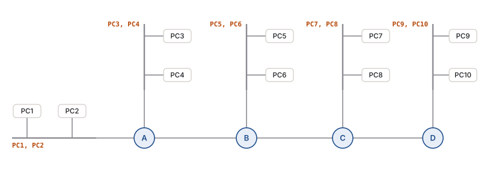

---
title:
  en: "Final Review M4 · Subnetting IPv4"
  zh: "期末复习 M4 · IPv4 子网划分"
summary:
  en: "Module 4 for the final: why subnet, borrowing bits (N + S + H = 32), subnet masks and slash notation, creating eight subnets, sizing from host and network requirements with the minimum and maximum bits borrowed, Class A and B subnetting, and ANDing — with MCQs, calculation questions and a blank addressing table to fill in."
  zh: "按期末 guideline 逐条复习 Module 4：为什么划分子网、借位（N + S + H = 32）、子网掩码与斜杠写法、借 3 位分 8 个子网、按主机数 / 网络数决定最少和最多借几位、Class A / B 的子网、ANDing；附选择题、计算题和一张自己填的空白编址表。"
week: 4
date: 2026-10-10
tags: [FinalReview, Subnetting, SubnetMask, CIDR, ANDing, Addressing]
---
# 期末复习 M4 · IPv4 子网划分

**详细笔记**：[第 4 周笔记](../../lectures/week-04/)　**做题页（7 道原题 + Assignment 2 + 编址实验）**：[子网与编址做题](../final-subnetting/)　**总览**：[期末总复习](../final-review/)　**上一章**：[M3](../final-m3/)

> 优先级：🔴 必考核心 · 🟡 需要理解 · 🟢 了解即可  
> 掌握要求：🖊️ **画图 / 填表** · 🔍 **辨析** · 📝 **默写** · 🧮 **计算**

> **🎯 这一章在期末怎么考**
>
> - **Final-guide 列的 9 条**：Subnetworks · Introduction to subnetting · Subnet mask · Creating eight subnets · Subnetting based on host requirements · Subnetting to meet network requirements · Subnetting Class A and B networks · Determining subnet mask size · Calculating the subnetwork with ANDing。
> - Final Review 的选择题里**没有** M4，因为老师把它单独出成了 **SubnetQuestions（7 道计算 / 画图题）**；Assignment 2 也是子网表 + 编址表。这说明 **M4 是大题的主要来源**。
> - 老师强调的题型：**给一个网络 + 一张多路由器的拓扑 → 填编址表**；题目不会写「路由器 LAN 接口用第一个可用地址」，但要照做。
> - 思路永远是：**确定 min / max 借几位（2^s 和 2^h − 2）→ 掩码 → 间隔 → 子网表 → 分配**。
> - 分量：约占全部复习时间的 **25%**（几乎全是计算和填表，要多练）。

## 本章大纲

- **[1. 🔴 Subnetworks：为什么要划分子网 📝](#1--subnetworks为什么要划分子网-)**
- **[2. 🔴 借位与 Subnet Mask 📝🧮](#2--借位与-subnet-mask-)**
- **[3. 🔴 Creating Eight Subnets（借 3 位）🧮🖊️](#3--creating-eight-subnets借-3-位️)**
- **[4. 🔴 Subnetting Based on Host / Network Requirements：min 和 max 🧮](#4--subnetting-based-on-host--network-requirementsmin-和-max-)**
- **[5. 🔴 Subnetting Class A and B，Determining Mask Size 🧮](#5--subnetting-class-a-and-bdetermining-mask-size-)**
- **[6. 🔴 Calculating the Subnetwork with ANDing 🧮](#6--calculating-the-subnetwork-with-anding-)**
- **[7. 练习 · 选择题](#7-练习--选择题)**
- **[8. 练习 · 计算 / 画图题](#8-练习--计算--画图题)**

---

## 1. 🔴 Subnetworks：为什么要划分子网 📝

| 理由（Slide 6）                                                             | 解释                                                    |
| ----------------------------------------------------------------------- | ----------------------------------------------------- |
| **Contain broadcast traffic within each subnetwork**                    | 广播只在子网内传播（路由器挡广播）                                     |
| **Reduce overall network traffic, improve performance**                 | 每个子网设备少、流量小                                           |
| A **router is necessary** for different subnets to communicate          | 子网之间要经过路由器 → 可以用 **ACL** 控制（板书：exam server 和学生 PC 分开） |
| Each router interface needs an address **in the subnet it connects to** | 路由器接口的 IP 属于它连着的子网                                    |
| Hosts use the router interface on their LAN as **default gateway**      | 子网里的主机网关 = 路由器接口                                      |

- **Internet 只知道你的整个网络**（路由表一条）；进了公司，子网位变成**额外的路由位**，内部路由器按子网分发。
- 安全角度（课外）：network segmentation 限制攻击的**横向移动**。

🔗 [第 4 周 §1](../../lectures/week-04/#1--为什么要划分子网reasons-for-subnetting)

## 2. 🔴 借位与 Subnet Mask 📝🧮

- **N + H = 32 → N + S + H = 32**：从 host 部分**最左边**开始连续借 s 位当子网号。
- **掩码**：N 和 S 位写 1，H 位写 0。**/n = 1 的个数 = 默认 N 位 + 借的位数**。

| 一个 octet 里借几位 | 1   | 2   | 3   | 4   | 5   | 6   | 7   | 8   |
| ------------- | --- | --- | --- | --- | --- | --- | --- | --- |
| 掩码值           | 128 | 192 | 224 | 240 | 248 | 252 | 254 | 255 |
| 间隔（256 − 掩码值） | 128 | 64  | 32  | 16  | 8   | 4   | 2   | 1   |

| Class | 默认掩码               | host 位 | 最多借（留 2 位 host） |
| ----- | ------------------ | ------ | --------------- |
| A     | 255.0.0.0（/8）      | 24     | **22**          |
| B     | 255.255.0.0（/16）   | 16     | **14**          |
| C     | 255.255.255.0（/24） | 8      | **6**           |

> **⚠️ 先看 Class，再看掩码**
>
> 255.255.255.0 **不一定**是「Class C 的默认掩码」：172.16.2.120/24 是 Class B **借了 8 位**（Slide 27）。判断借了几位 = 掩码的 1 的个数 − Class 的默认位数。

🔗 [第 4 周 §2–3](../../lectures/week-04/#2--借位n--s--h--32)

## 3. 🔴 Creating Eight Subnets（借 3 位）🧮🖊️

192.168.10.0 借 3 位 → **/27，255.255.255.224**，2³ = **8 个子网**，每个 2⁵ − 2 = **30 台**，间隔 **32**。

| # | 子网位 | Network | Host range  | Broadcast |
| - | --- | ------- | ----------- | --------- |
| 0 | 000 | .0      | .1 – .30    | .31       |
| 1 | 001 | .32     | .33 – .62   | .63       |
| 2 | 010 | .64     | .65 – .94   | .95       |
| 3 | 011 | .96     | .97 – .126  | .127      |
| 4 | 100 | .128    | .129 – .158 | .159      |
| 5 | 101 | .160    | .161 – .190 | .191      |
| 6 | 110 | .192    | .193 – .222 | .223      |
| 7 | 111 | .224    | .225 – .254 | .255      |

- **子网数 = 2^s（不减 2，Net 0 和 Net 7 都用）；主机数 = 2^h − 2。**
- Slide 19 的分配：R1 G0/0 = .1、G0/1 = .33、S0/0/0 = .65；R2 S0/0/0 = .66、G0/0 = .97、G0/1 = .129——**路由器接口都用每个子网的第一个可用地址**，串行线两端 .65 / .66。

🔗 [第 4 周 §4](../../lectures/week-04/#4--列出子网network--host-range--broadcast)

## 4. 🔴 Subnetting Based on Host / Network Requirements：min 和 max 🧮

| 两个考虑（Slide 20）                        | 决定什么                   | 不等式                    |
| ------------------------------------- | ---------------------- | ---------------------- |
| **Number of subnets required**        | **最少借几位**              | **2^s ≥ 子网数**          |
| **Number of host addresses required** | **最少留几位 host → 最多借几位** | **2^h − 2 ≥ 最大子网的主机数** |

- 按**最大**的子网算主机数，并**留出增长空间**（Slide 22）。拓扑题记得**路由器接口也占一个地址**、**路由器之间的线也是一个子网**。
- min > max → 用这个网络、同一个掩码做不到。

| Slide 23 | 子网  | 主机   | min 借 | min host 位            |
| -------- | --- | ---- | ----- | --------------------- |
| 1        | 200 | 200  | 8     | 8                     |
| 2        | 5   | 15   | 3     | **5**（2⁴ − 2 = 14 不够） |
| 3        | 12  | 3000 | 4     | 12                    |
| 4        | 100 | 100  | 7     | 7                     |

*（网页版此处可以自己填 Class、需要的子网数和主机数；下表是课件和板书题的结果）*

| 题目              | Class   | 需要子网 | 每子网主机 | 最少借位 | 最少 host 位 | 可行方案                  |
| --------------- | ------- | ---- | ----- | ---- | --------- | --------------------- |
| Slide 23 #1     | Class B | 200  | 200   | 8    | 8         | **借 8 位 (/24)**       |
| Slide 23 #2     | Class C | 5    | 15    | 3    | 5         | **借 3 位 (/27)**       |
| Slide 23 #3     | Class B | 12   | 3000  | 4    | 12        | **借 4 位 (/20)**       |
| Slide 23 #4     | Class B | 100  | 100   | 7    | 7         | **借 7–9 位 (/23–/25)** |
| 板书 ① 200.1.1.0  | Class C | 7    | 1     | 3    | 2         | **借 3–6 位 (/27–/30)** |
| 板书 ② 172.16.0.0 | Class B | 100  | 200   | 7    | 8         | **借 7–8 位 (/23–/24)** |
| 板书 ③ 178.13.0.0 | Class B | 79   | 220   | 7    | 8         | **借 7–8 位 (/23–/24)** |

🔗 [第 4 周 §5](../../lectures/week-04/#5--按需求规划借几位) · 7 道原题的完整解答：[子网与编址做题](../final-subnetting/)

## 5. 🔴 Subnetting Class A and B，Determining Mask Size 🧮

- **Class B 借 6 位**（130.12.0.0）→ /22，255.255.**252**.0，第 3 段间隔 4：130.12.0.0、4.0、8.0……每个 1,022 台，可用范围跨两个 octet（130.12.0.1 – 130.12.3.254）。
- **Class B 借 10 位** → /26，255.255.255.**192**，第 3 段借满、第 4 段间隔 64：130.12.0.0、0.64、0.128、0.192、1.0……每个 62 台。
- **Class A 借 12 位**（28.0.0.0）→ /20，255.255.240.0，4,096 个子网。
- **掩码多大**：从需求出发，min ≤ s ≤ max，再看题目要「主机最多」（取 min）还是「子网最多」（取 max）。

🔗 [第 4 周 §4（板书 p.5、p.6）](../../lectures/week-04/#4--列出子网network--host-range--broadcast)

## 6. 🔴 Calculating the Subnetwork with ANDing 🧮

- 路由器用 **目的 IP AND 子网掩码 = 子网地址**，再查路由表。**1 AND 1 = 1，其余都是 0**。
- 直觉：掩码为 1 的位原样保留，为 0 的位清零 = **把 host 位全变成 0**。

|                 | 十进制     | 最后一个 octet    |
| --------------- | ------- | ------------- |
| 192.168.10.65   | .65     | **010** 00001 |
| 255.255.255.224 | .224    | **111** 00000 |
| AND             | **.64** | **010** 00000 |

心算：65 落在 64–95 这一段 → 子网 192.168.10.64，broadcast .95。

🔗 [第 4 周 §6](../../lectures/week-04/#6--anding一个地址属于哪个子网)

---

## 7. 练习 · 选择题

**1. How many subnets and usable hosts per subnet does 192.168.1.0/27 provide?**

- A. 8 subnets, 30 hosts
- B. 6 subnets, 30 hosts
- C. 8 subnets, 32 hosts
- D. 32 subnets, 6 hosts

> **答案：A**
>
> /27 = Class C 借 3 位 → 2³ = 8 个子网；剩 5 位 → 2⁵ − 2 = 30。课件的子网数**不减 2**（B 是旧教材的算法）。

**2. A Class B network is subnetted with mask 255.255.255.0. How many bits were borrowed?**

- A. 0
- B. 8
- C. 16
- D. 24

> **答案：B**
>
> Class B 默认 /16，/24 比默认多 8 位。

**3. To which subnet does 197.15.22.131/27 belong?**

- A. 197.15.22.96
- B. 197.15.22.128
- C. 197.15.22.130
- D. 197.15.22.160

> **答案：B**
>
> 131 = **100** 00011 → AND 11100000 → 100 00000 = 128（Slide 25）。

**4. Which TWO addresses cannot be assigned to a host in subnet 10.1.64.0/20? (Choose two.)**

- A. 10.1.64.0
- B. 10.1.64.255
- C. 10.1.79.255
- D. 10.1.70.1
- E. 10.1.65.0

> **答案：A、C**
>
> /20 → 第 3 段间隔 16：子网 10.1.64.0 – 10.1.79.255。network（A）和 broadcast（C）不能用；10.1.64.255、10.1.65.0 在这个子网中间，是**合法主机地址**。

**5. A company needs 12 subnets with up to 3000 hosts each from a Class B network. What is the minimum number of bits to borrow and the minimum number of host bits?**

- A. 3 and 12
- B. 4 and 12
- C. 4 and 11
- D. 12 and 4

> **答案：B**
>
> 2⁴ = 16 ≥ 12；2¹¹ − 2 = 2046 < 3000 ≤ 4094 = 2¹² − 2 → host 12 位（Slide 23 Problem 3）。

**6. A network needs at most 100 subnets with 200 hosts each, using 172.16.0.0 and one mask. Which TWO masks meet the requirement? (Choose two.)**

- A. 255.255.252.0
- B. 255.255.254.0
- C. 255.255.255.0
- D. 255.255.255.128
- E. 255.255.240.0

> **答案：B、C**
>
> min 7（2⁷ = 128 ≥ 100），max 8（要 2^h − 2 ≥ 200 → h ≥ 8）→ /23 和 /24。/22 只有 64 个子网；/25 每个只有 126 台。

**7. The requirement says maximize the number of hosts per subnet. Which rule do you follow?**

- A. Borrow the maximum number of bits allowed
- B. Borrow the minimum number of bits that still gives enough subnets
- C. Always use the default mask
- D. Borrow half of the host bits

> **答案：B**
>
> 借得越少，剩的 host 位越多。反过来「子网最多」就借 max。

**8. What is the subnet mask for a Class C network that borrows 5 bits?**

- A. 255.255.255.240
- B. 255.255.255.248
- C. 255.255.255.252
- D. 255.255.255.224

> **答案：B**
>
> 11111000 = 128 + 64 + 32 + 16 + 8 = **248**（/29，每个子网 6 台）。

**9. Which TWO are reasons for subnetting given in the slides? (Choose two.)**

- A. To contain broadcast traffic within each subnetwork
- B. To let hosts reach other subnets without a router
- C. To reduce overall network traffic and improve performance
- D. To give every host a public IP address
- E. To remove the need for default gateways

> **答案：A、C**
>
> 不同子网之间**必须经过路由器**（B 错），子网里的主机仍然要默认网关（E 错）。

**10. A topology has 4 LANs connected by 3 router-to-router links, using 200.1.1.0. What is the minimum number of bits to borrow?**

- A. 2
- B. 3
- C. 4
- D. 7

> **答案：B**
>
> 网络 = 4 + 3 = 7 → 2³ = 8 ≥ 7。只数 LAN 会错选 2。

## 8. 练习 · 计算 / 画图题

**1. 172.20.0.0 借 5 位：写出掩码（点分和斜杠）、子网数、每个子网主机数、前 3 个子网的范围。**

> Class B，/16 + 5 = **/21** → 第 3 段 11111000 = 248 → **255.255.248.0**；2⁵ = **32** 个子网；host 11 位 → 2¹¹ − 2 = **2,046** 台；间隔在第 3 段 = 8。  
> \#0 172.20.0.0（.0.1 – .7.254，bc 172.20.7.255）；#1 172.20.8.0（.8.1 – .15.254，bc .15.255）；#2 172.20.16.0（.16.1 – .23.254，bc .23.255）。

**2. 一家公司拿到 192.168.50.0，需要 6 个部门子网，最大的部门 25 台。最少、最多借几位？选哪个掩码？列出前 6 个子网。**

> min：2³ = 8 ≥ 6 → **3**；主机 25 → 2⁵ − 2 = 30 ≥ 25 → 至少 5 位 host → max = 8 − 5 = **3**。min = max = 3 → **255.255.255.224（/27）**，每个 30 台。  
> 子网：.0（.1–.30）、.32（.33–.62）、.64（.65–.94）、.96（.97–.126）、.128（.129–.158）、.160（.161–.190）。

**3. 用 AND 求 10.1.77.200 / 255.255.240.0 所在的子网和广播地址，写出二进制过程。**

> 第 3 段：77 = 0100 1101，240 = 1111 0000 → AND = 0100 0000 = **64**；第 4 段 200 AND 0 = 0。→ 子网 **10.1.64.0**；间隔 16 → 下一个子网 10.1.80.0 → broadcast **10.1.79.255**。

**4. 画图：192.168.10.0，PC1、PC2 → A — B — C — D 一条链，A 还有一个 LAN（PC3、PC4），B、C、D 各一个 LAN（各 2 台 PC）。数网络、定借位，并写出 Router B 所有接口和 PC5（B 的 LAN）的编址。**

> 网络 = 5 个 LAN + 3 条路由器之间的线 = **8** → min 3；每个 LAN 2 台 + 1 个路由器接口 = 3 → h ≥ 3 → max 5。借 3 位（/27，每个 30 台）：子网依次给 LAN(PC1,2) .0、LAN(PC3,4) .32、LAN(PC5,6) .64、LAN(PC7,8) .96、LAN(PC9,10) .128、A–B .160、B–C .192、C–D .224。
>
> | Device   | Interface       | IP                | Mask            | Gateway           |
> | -------- | --------------- | ----------------- | --------------- | ----------------- |
> | Router B | E0（LAN PC5、PC6） | **192.168.10.65** | 255.255.255.224 | N/A               |
> | Router B | E1（→ A）         | 192.168.10.162    | 255.255.255.224 | N/A               |
> | Router B | E2（→ C）         | 192.168.10.193    | 255.255.255.224 | N/A               |
> | PC5      | NIC             | 192.168.10.66     | 255.255.255.224 | **192.168.10.65** |
>
> （A 在 A–B 线上是 .161，C 在 B–C 线上是 .194。）下面的空白表就是这张图，可以把整张表写完再检查。

*（网页版此处是空白编址表：自己加行填 Device / Interface / IP / Mask / Gateway，点「检查」逐格判断并列出漏掉的接口）*

**M4 Supplementary p.3：**只给一个 Class C 网络 192.168.10.0，给图里所有需要地址的地方编址（每个 LAN 2 台 PC）。 网络：192.168.10.0。把所有需要 IP 地址的地方写进表里。

参考答案

8 个网络 → 最少借 3 位、最多借 5 位；借 3 位，掩码 255.255.255.224

| Device   | Interface | IP Address     | Subnet Mask     | Default Gateway |
| -------- | --------- | -------------- | --------------- | --------------- |
| Router A | E0        | 192.168.10.1   | 255.255.255.224 | N/A             |
| Router A | E1        | 192.168.10.33  | 255.255.255.224 | N/A             |
| Router A | E2        | 192.168.10.161 | 255.255.255.224 | N/A             |
| Router B | E0        | 192.168.10.65  | 255.255.255.224 | N/A             |
| Router B | E1        | 192.168.10.162 | 255.255.255.224 | N/A             |
| Router B | E2        | 192.168.10.193 | 255.255.255.224 | N/A             |
| Router C | E0        | 192.168.10.97  | 255.255.255.224 | N/A             |
| Router C | E1        | 192.168.10.194 | 255.255.255.224 | N/A             |
| Router C | E2        | 192.168.10.225 | 255.255.255.224 | N/A             |
| Router D | E0        | 192.168.10.129 | 255.255.255.224 | N/A             |
| Router D | E1        | 192.168.10.226 | 255.255.255.224 | N/A             |
| PC1      | NIC       | 192.168.10.2   | 255.255.255.224 | 192.168.10.1    |
| PC2      | NIC       | 192.168.10.3   | 255.255.255.224 | 192.168.10.1    |
| PC3      | NIC       | 192.168.10.34  | 255.255.255.224 | 192.168.10.33   |
| PC4      | NIC       | 192.168.10.35  | 255.255.255.224 | 192.168.10.33   |
| PC5      | NIC       | 192.168.10.66  | 255.255.255.224 | 192.168.10.65   |
| PC6      | NIC       | 192.168.10.67  | 255.255.255.224 | 192.168.10.65   |
| PC7      | NIC       | 192.168.10.98  | 255.255.255.224 | 192.168.10.97   |
| PC8      | NIC       | 192.168.10.99  | 255.255.255.224 | 192.168.10.97   |
| PC9      | NIC       | 192.168.10.130 | 255.255.255.224 | 192.168.10.129  |
| PC10     | NIC       | 192.168.10.131 | 255.255.255.224 | 192.168.10.129  |

