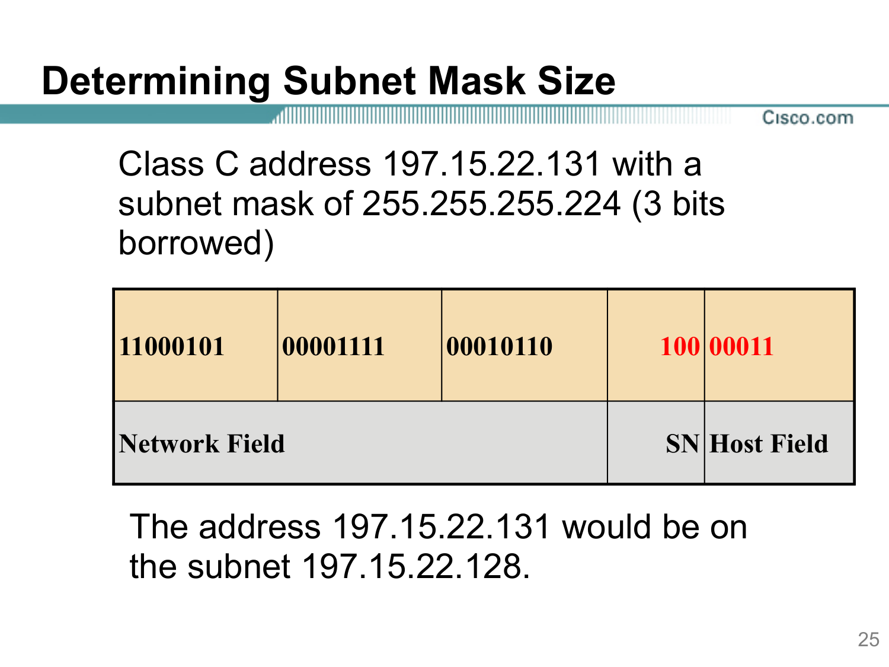

---
title:
  en: "Determining Subnet Mask Size · Cheat Sheet"
  zh: "子网掩码速查 · Determining Subnet Mask Size"
summary:
  en: "A bilingual cheat sheet for the mask questions in Module 4: from requirements to the minimum and maximum bits borrowed and the masks that work, from an address and mask to its Network | Subnet | Host fields (Slide 25), with an interactive finder, lookup tables by hosts and by subnets, the tricks, and the key terms in English and Chinese."
  zh: "Module 4 掩码题的中英速查：从需求求最少 / 最多借位和可行掩码，从地址 + 掩码拆出 Network | Subnet | Host 三段（Slide 25）；有互动查找器、按主机数 / 子网数的查表、速算口诀和中英对照术语。"
date: 2026-10-10
tags: [FinalReview, CheatSheet, SubnetMask, Subnetting, ANDing]
---
# 子网掩码速查 · Determining Subnet Mask Size

**课件出处**：M4 Slide 20–25（*Subnetting based on host / network requirements · Determining subnet mask size*）　**相关**：[二进制速算](../final-binary/) · [子网与编址做题](../final-subnetting/) · [期末开卷速查表](../final-cheatsheet/)

> Slide 25 的意思：拿到一个地址和掩码，先看掩码有几个 1，把 32 位切成 **Network field | Subnet field (SN) | Host field** 三段，就知道借了几位、子网号是多少、属于哪个子网。反过来，题目给需求时，用 **2^s ≥ 子网数** 和 **2^h − 2 ≥ 主机数** 定出能用的掩码。

## 1. 互动查找器 Finder

*（网页版此处可以输入需求找可行掩码，或输入地址 + 掩码看 Network | Subnet | Host 三段；下面是预设题目的结果和 Class C / B 的全部掩码）*

| 需求                                      | 最少借 | 最多借 | 可行掩码               |
| --------------------------------------- | --- | --- | ------------------ |
| SubnetQuestions Q1：200.1.1.0，7 个网络，主机最多 | 3   | 6   | **/27 – /30**      |
| Q2：172.16.0.0，100 个子网 × 200 台           | 7   | 8   | **/23 – /24**      |
| Q3：178.13.0.0，79 个子网，最大 220 台           | 7   | 8   | **/23 – /24**      |
| Slide 23 #2：5 个子网 × 15 台                | 3   | 3   | **/27**            |
| 预测卷 B6：135.20.0.0，90 个子网，最大 500 台       | 7   | 7   | **/23**            |
| 做不到的例子：9 个子网 × 26 台（Class C）            | 4   | 3   | **做不到（min > max）** |

| 地址 / 掩码                              | Network \| Subnet \| Host                  | 子网号                | 子网地址              | 广播             |
| ------------------------------------ | ------------------------------------------ | ------------------ | ----------------- | -------------- |
| 197.15.22.131 /27（Slide 25）          | `110001010000111100010110 \| 100 \| 00011` | 100 = #4           | **197.15.22.128** | 197.15.22.159  |
| 192.5.12.135 /27（SubnetQuestions Q4） | `110000000000010100001100 \| 100 \| 00111` | 100 = #4           | **192.5.12.128**  | 192.5.12.159   |
| 172.16.2.120 /24（Slide 27）           | `1010110000010000 \| 00000010 \| 01111000` | 00000010 = #2      | **172.16.2.0**    | 172.16.2.255   |
| 130.12.108.5 /22（M4 板书 p.1 ③）        | `1000001000001100 \| 011011 \| 0000000101` | 011011 = #27       | **130.12.108.0**  | 130.12.111.255 |
| 130.12.5.130 /26（M4 板书 p.1 ④）        | `1000001000001100 \| 0000010110 \| 000010` | 0000010110 = #22   | **130.12.5.128**  | 130.12.5.191   |
| 10.1.77.200 /20（Class A /20）         | `00001010 \| 000000010100 \| 110111001000` | 000000010100 = #20 | **10.1.64.0**     | 10.1.79.255    |

**Class C**

| Prefix 前缀 | Subnet mask 掩码  | Borrowed 借位 | Subnets 子网数 | Hosts 每子网主机 | Block 间隔   |
| --------- | --------------- | ----------- | ----------- | ----------- | ---------- |
| /25       | 255.255.255.128 | 1           | 2           | 126         | 128（第 4 段） |
| /26       | 255.255.255.192 | 2           | 4           | 62          | 64（第 4 段）  |
| /27       | 255.255.255.224 | 3           | 8           | 30          | 32（第 4 段）  |
| /28       | 255.255.255.240 | 4           | 16          | 14          | 16（第 4 段）  |
| /29       | 255.255.255.248 | 5           | 32          | 6           | 8（第 4 段）   |
| /30       | 255.255.255.252 | 6           | 64          | 2           | 4（第 4 段）   |

**Class B**

| Prefix 前缀 | Subnet mask 掩码  | Borrowed 借位 | Subnets 子网数 | Hosts 每子网主机 | Block 间隔   |
| --------- | --------------- | ----------- | ----------- | ----------- | ---------- |
| /17       | 255.255.128.0   | 1           | 2           | 32,766      | 128（第 3 段） |
| /18       | 255.255.192.0   | 2           | 4           | 16,382      | 64（第 3 段）  |
| /19       | 255.255.224.0   | 3           | 8           | 8,190       | 32（第 3 段）  |
| /20       | 255.255.240.0   | 4           | 16          | 4,094       | 16（第 3 段）  |
| /21       | 255.255.248.0   | 5           | 32          | 2,046       | 8（第 3 段）   |
| /22       | 255.255.252.0   | 6           | 64          | 1,022       | 4（第 3 段）   |
| /23       | 255.255.254.0   | 7           | 128         | 510         | 2（第 3 段）   |
| /24       | 255.255.255.0   | 8           | 256         | 254         | 1（第 3 段）   |
| /25       | 255.255.255.128 | 9           | 512         | 126         | 128（第 4 段） |
| /26       | 255.255.255.192 | 10          | 1,024       | 62          | 64（第 4 段）  |
| /27       | 255.255.255.224 | 11          | 2,048       | 30          | 32（第 4 段）  |
| /28       | 255.255.255.240 | 12          | 4,096       | 14          | 16（第 4 段）  |
| /29       | 255.255.255.248 | 13          | 8,192       | 6           | 8（第 4 段）   |
| /30       | 255.255.255.252 | 14          | 16,384      | 2           | 4（第 4 段）   |

## 2. 一张表定掩码：四步 Four steps

| 步 Step | English                                                                      | 中文                    | 例：172.16.0.0，100 subnets × 200 hosts      |
| ------ | ---------------------------------------------------------------------------- | --------------------- | ----------------------------------------- |
| 1      | Find the **class** and the number of **host bits**                           | 定 Class 和可借的 host 位数  | Class B → 16 位                            |
| 2      | **Minimum bits** to borrow: 2^s ≥ subnets needed                             | 最少借几位：子网要够            | 2⁷ = 128 ≥ 100 → s ≥ **7**                |
| 3      | **Maximum bits** to borrow: 2^h − 2 ≥ hosts needed → s ≤ host bits − h       | 最多借几位：主机要够            | 2⁸ − 2 = 254 ≥ 200 → h ≥ 8 → s ≤ **8**    |
| 4      | Pick: **max hosts → min s**, **max subnets → max s**; write /n = default + s | 选：主机最多取 min，子网最多取 max | /23 = 255.255.254.0 或 /24 = 255.255.255.0 |

> **🎯 容易丢分的三处**
>
> - **子网数不减 2，主机数减 2**：2^s vs 2^h − 2（15 台主机要 5 位 host，不是 4 位）。
> - 子网数要**加起来**（40 + 24 + 15 = 79），主机数看**最大的**那个子网。
> - 拓扑题：**路由器之间的线也是一个子网**；每个 LAN 的地址数 = 主机数 + **1 个路由器接口**。

## 3. 查表 A：按「每个子网要几个地址」Hosts → mask

| 每子网要几个地址 hosts needed | 留几位 host h | 前缀 prefix = 32 − h | 掩码 mask         | Class C 借 | Class B 借 | Class A 借 |
| --------------------- | ---------- | ------------------ | --------------- | --------- | --------- | --------- |
| 1 – 2                 | 2          | /30                | 255.255.255.252 | 6         | 14        | 22        |
| 3 – 6                 | 3          | /29                | 255.255.255.248 | 5         | 13        | 21        |
| 7 – 14                | 4          | /28                | 255.255.255.240 | 4         | 12        | 20        |
| 15 – 30               | 5          | /27                | 255.255.255.224 | 3         | 11        | 19        |
| 31 – 62               | 6          | /26                | 255.255.255.192 | 2         | 10        | 18        |
| 63 – 126              | 7          | /25                | 255.255.255.128 | 1         | 9         | 17        |
| 127 – 254             | 8          | /24                | 255.255.255.0   | —         | 8         | 16        |
| 255 – 510             | 9          | /23                | 255.255.254.0   | —         | 7         | 15        |
| 511 – 1,022           | 10         | /22                | 255.255.252.0   | —         | 6         | 14        |
| 1,023 – 2,046         | 11         | /21                | 255.255.248.0   | —         | 5         | 13        |
| 2,047 – 4,094         | 12         | /20                | 255.255.240.0   | —         | 4         | 12        |
| 4,095 – 8,190         | 13         | /19                | 255.255.224.0   | —         | 3         | 11        |
| 8,191 – 16,382        | 14         | /18                | 255.255.192.0   | —         | 2         | 10        |

用法：先在第一列找到需求所在的范围 → 读出前缀和掩码；最后三列是这个前缀对 Class C / B / A 来说借了几位（— 表示比默认掩码还短，不是子网）。这一列给的是**最多能借**的位数。

## 4. 查表 B：按「要几个子网」Subnets → mask

| 要几个子网 subnets needed | 借几位 s | Class C 前缀 · 掩码       | Class B 前缀 · 掩码       | Class A 前缀 · 掩码     |
| -------------------- | ----- | --------------------- | --------------------- | ------------------- |
| 2                    | 1     | /25 · 255.255.255.128 | /17 · 255.255.128.0   | /9 · 255.128.0.0    |
| 3 – 4                | 2     | /26 · 255.255.255.192 | /18 · 255.255.192.0   | /10 · 255.192.0.0   |
| 5 – 8                | 3     | /27 · 255.255.255.224 | /19 · 255.255.224.0   | /11 · 255.224.0.0   |
| 9 – 16               | 4     | /28 · 255.255.255.240 | /20 · 255.255.240.0   | /12 · 255.240.0.0   |
| 17 – 32              | 5     | /29 · 255.255.255.248 | /21 · 255.255.248.0   | /13 · 255.248.0.0   |
| 33 – 64              | 6     | /30 · 255.255.255.252 | /22 · 255.255.252.0   | /14 · 255.252.0.0   |
| 65 – 128             | 7     | —（超过 /30）             | /23 · 255.255.254.0   | /15 · 255.254.0.0   |
| 129 – 256            | 8     | —（超过 /30）             | /24 · 255.255.255.0   | /16 · 255.255.0.0   |
| 257 – 512            | 9     | —（超过 /30）             | /25 · 255.255.255.128 | /17 · 255.255.128.0 |
| 513 – 1,024          | 10    | —（超过 /30）             | /26 · 255.255.255.192 | /18 · 255.255.192.0 |
| 1,025 – 2,048        | 11    | —（超过 /30）             | /27 · 255.255.255.224 | /19 · 255.255.224.0 |
| 2,049 – 4,096        | 12    | —（超过 /30）             | /28 · 255.255.255.240 | /20 · 255.255.240.0 |
| 4,097 – 8,192        | 13    | —（超过 /30）             | /29 · 255.255.255.248 | /21 · 255.255.248.0 |
| 8,193 – 16,384       | 14    | —（超过 /30）             | /30 · 255.255.255.252 | /22 · 255.255.252.0 |

这一张给的是**最少要借**的位数。和查表 A 的结果比较：最少借 ≤ 最多借才有解。

## 5. 速算口诀 Tricks

| Trick   | English                                                  | 中文 / 例子                                                      |
| ------- | -------------------------------------------------------- | ------------------------------------------------------------ |
| 数 1     | **/n = number of 1s in the mask**                        | 255.255.255.224 = 8 + 8 + 8 + 3 = **/27**                    |
| 借了几位    | **Borrowed bits = n − class default**                    | 172.16.2.120 /24：24 − 16 = 借 **8** 位（不是「Class C 默认掩码」）       |
| 关键段     | The **interesting octet** holds the mask's last 1        | /27 → 第 4 段；/22 → 第 3 段；/24 → 第 3 段（间隔 1）                    |
| 间隔      | **Block size = 256 − mask value** in that octet          | 224 → 32；252 → 4；192 → 64                                    |
| 子网地址    | **Subnet = (octet ÷ block, rounded down) × block**       | 135 /27：135 ÷ 32 = 4 → **128**                               |
| 广播      | **Broadcast = next subnet − 1**                          | 128 + 32 − 1 = **159**                                       |
| 子网号     | **SN = the borrowed bits read as a number**              | 135 = **100**00111 → SN 100₂ = **4**（第 5 个子网，从 0 数）          |
| 可用范围    | **First = subnet + 1, last = broadcast − 1**             | .129 – .158                                                  |
| 跨 octet | Host part spans two octets: last octet runs 0–255 inside | /22 子网 130.12.4.0：130.12.4.1 – 130.12.7.254；130.12.5.0 是合法主机 |

## 6. Slide 25 原题拆解

*197.15.22.131，掩码 255.255.255.224（借 3 位）：11000101 00001111 00010110 | 100 | 00011 → 子网 197.15.22.128（M4 Slide 25）*

| 字段 Field                               | 位 Bits                       | 值 Value           |
| -------------------------------------- | ---------------------------- | ----------------- |
| **Network field** 网络位（Class C 默认 24 位） | `11000101 00001111 00010110` | 197.15.22         |
| **Subnet field (SN)** 子网位（借的 3 位）      | `100`                        | 子网号 4             |
| **Host field** 主机位（剩下 5 位）             | `00011`                      | 第 3 台主机           |
| **Subnet address** 子网地址（host 位全 0）     | `… 100 00000`                | **197.15.22.128** |
| **Broadcast** 广播（host 位全 1）            | `… 100 11111`                | 197.15.22.159     |

## 7. 关键术语中英对照 Key terms

| English                           | 中文          | 一句话                             |
| --------------------------------- | ----------- | ------------------------------- |
| Subnet mask                       | 子网掩码        | Network + Subnet 位写 1，Host 位写 0 |
| Prefix length / slash notation    | 前缀长度 / 斜杠写法 | /n = 掩码里 1 的个数                  |
| Default subnet mask               | 默认掩码        | A /8 · B /16 · C /24（不借位）       |
| Borrowed bits                     | 借的位         | 从 host 部分最左边连续借，N + S + H = 32  |
| Network field                     | 网络位         | Class 决定的部分                     |
| Subnet field (SN)                 | 子网位         | 借来的位，决定是第几个子网                   |
| Host field                        | 主机位         | 剩下的位，h 位 → 2^h − 2 台主机          |
| Subnet (network) address          | 子网地址        | host 位全 0，代表整个子网                |
| Broadcast address                 | 广播地址        | host 位全 1                       |
| Usable host range                 | 可用主机范围      | 子网地址 + 1 到广播 − 1                |
| Block size                        | 间隔          | 256 − 关键段的掩码值                   |
| ANDing                            | 按位与         | 地址 AND 掩码 = 子网地址                |
| Number of subnets required        | 需要的子网数      | 决定最少借几位                         |
| Number of host addresses required | 需要的主机地址数    | 决定最多借几位                         |
| Allow for growth                  | 留增长空间       | 子网和主机都不要卡得刚刚好                   |
