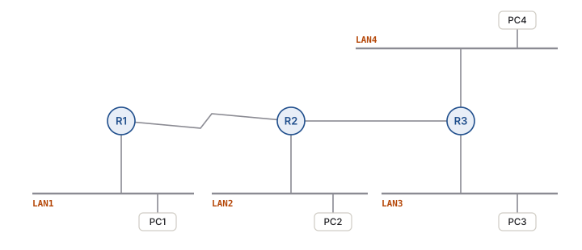
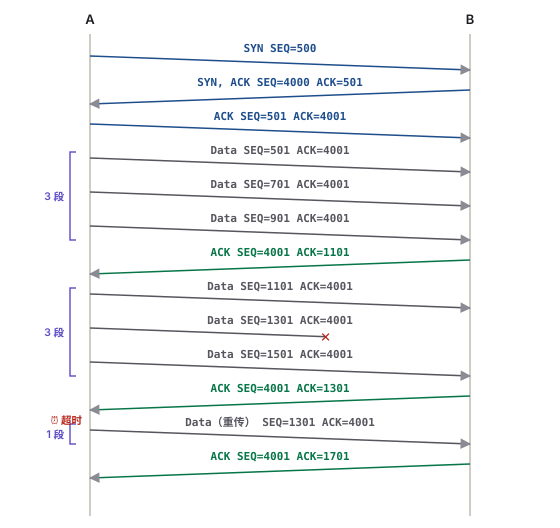

---
title:
  en: "Final Mock Paper"
  zh: "期末预测卷"
summary:
  en: "A predicted final paper built from the exam guideline, the Final Review deck, SubnetQuestions and the assignments: 20 multiple-choice questions (five choose-two / choose-three) and nine drawing and calculation questions — topology addressing, routing tables, IP / MAC per hop, a SEQ / ACK ladder with a window size, a switch MAC table, subnet requirements, PAT and ARP. Every answer starts hidden."
  zh: "按期末 guideline、Final Review、SubnetQuestions 和三次作业出的一套预测卷：20 道选择题（5 道多选）+ 9 道画图 / 计算题——拓扑编址、路由表、每跳 IP / MAC、给 window size 画 SEQ / ACK、交换机 MAC 表、按需求借位、PAT、ARP。所有答案一开始都是隐藏的。"
date: 2026-10-10
tags: [FinalReview, MockExam, Subnetting, Addressing, TCP, Routing]
---
# 期末预测卷 · ISOM 5180

**总览**：[期末总复习](../final-review/)　**老师的 19 题**：[Final Review 选择题](../final-review-mc/)　**做题方法**：[子网与编址做题](../final-subnetting/)

> **怎么用**：像考试一样，**先做完一整部分再看答案**。选择题点选后才显示答案（多选题勾够数量再提交）；画图题先在纸上画，再点开「参考答案」。B1 和 B4 还可以在页面里的实验上直接填、直接检查。

> **📌 这套卷是怎么预测出来的**
>
> - **范围**：Final-guide 只列了 **Module 1–4**，所以全卷只考 M1–M4。
> - **题型**：老师说期末**大部分是画图题 + 选择题，选择题可能有多选**。Final Review 里有 3 道多选（Choose two / three），都是「看图写地址」类。
> - **分量**：选择题按 Final Review 的分布出（M2 最多）；画图题按老师强调的两类重点出：**① 给网络 + 拓扑 → 填编址表（题目不会写路由器接口的规则）**；**② 给 ISN 和 window size 画 SEQ / ACK**。其余画图题来自各章板书（MAC 表、路由表、每跳 IP / MAC、NAT、ARP）。
> - 题量和分值是我估的，不是老师给的，只用来控制练习时间：A 部分约 30 分钟，B 部分约 90 分钟。

## Part A · Multiple Choice（20 题）

**A1. Which device regenerates the signal and sends it out every other port without looking at any address?**

- A. Switch
- B. Router
- C. Hub
- D. Bridge

> **答案：C**
>
> Hub = multiport repeater，**Layer 1**，不看地址。Switch / Bridge 看 MAC，Router 看 IP。（M1）

**A2. A switch receives a frame with destination MAC FF-FF-FF-FF-FF-FF on port Fa0/2. What does it do?**

- A. Drops the frame
- B. Forwards it only to the router
- C. Floods it out all ports except Fa0/2
- D. Sends it back out Fa0/2

> **答案：C**
>
> 广播 → 除入口外全部发出（Slide 67 第 2 步）。所以交换机的所有端口是**一个广播域**。（M1）

**A3. Which TWO statements about encapsulation are true? (Choose two.)**

- A. The data link layer adds both a header and a trailer
- B. Each layer places the PDU from the layer above into its data field and adds its own header
- C. The network layer adds the source and destination MAC addresses
- D. The transport layer PDU is called a packet
- E. A router de-encapsulates every packet up to Layer 7

> **答案：A、B**
>
> MAC 是 L2 加的（C 错）；L4 = segment、L3 = packet（D 错）；路由器只拆到 **L3**（E 错）。（M1）

**A4. A company lets its suppliers log in to check inventory levels and order status. What type of network access is this?**

- A. Intranet
- B. Extranet
- C. Internet
- D. WAN

> **答案：B**
>
> **有控制地开放给外部组织的人员** = Extranet；Intranet 只给内部成员。（M1）

**A5. Which OSI layer is responsible for data format, compression and encryption?**

- A. Application
- B. Presentation
- C. Session
- D. Transport

> **答案：B**
>
> L6 Presentation = Data representation。Session 是建立 / 管理 / 终止会话。（M1）

**A6. Using classful addressing, what is the network address of host 130.6.8.9?**

- A. 130.0.0.0
- B. 130.6.0.0
- C. 130.6.8.0
- D. 130.6.255.255

> **答案：B**
>
> 130 → Class B → N.N.H.H → host 部分全 0 → 130.6.0.0；D 是 broadcast。（M2 板书 p.3 原题）

**A7. In network 192.168.5.0/24, which TWO addresses cannot be assigned to a host? (Choose two.)**

- A. 192.168.5.1
- B. 192.168.5.0
- C. 192.168.5.128
- D. 192.168.5.255
- E. 192.168.5.254

> **答案：B、D**
>
> .0 = network address（host 全 0），.255 = broadcast address（host 全 1）。/24 下 .128 是普通主机地址（在 /25 里它才是子网地址）。（M2）

**A8. A PC is configured with 192.168.1.130 / 255.255.255.128 and default gateway 192.168.1.1. It can reach hosts in its own subnet but not the Internet. Why?**

- A. The IP address is a broadcast address
- B. The default gateway is not in the PC's subnet
- C. The subnet mask is invalid
- D. 192.168.1.130 is a network address

> **答案：B**
>
> /25 → 间隔 128：PC 在 **192.168.1.128/25**（.129 – .254），网关 .1 在 192.168.1.0/25。**网关必须在本子网**——应该是 .129。（M2 + M4，Final Review 第 19 题的子网版）

**A9. Which table does a host use to find the MAC address that matches a known IP address on its LAN?**

- A. Routing table
- B. MAC address (CAM) table
- C. ARP table
- D. NAT table

> **答案：C**
>
> ARP 表：IP → MAC。CAM 表在交换机上（MAC → Port）。（M2）

**A10. PC1 sends a packet to a server in a different network. In the frame that leaves PC1, what is the destination MAC address?**

- A. The server's MAC address
- B. FF-FF-FF-FF-FF-FF
- C. The MAC address of PC1's default gateway
- D. The MAC address of the switch

> **答案：C**
>
> 跨网络：目的 IP = 服务器，目的 MAC = **默认网关**。（M2，Assignment 3 第 3 题）

**A11. Which TWO DHCP messages are sent as unicast? (Choose two.)**

- A. DHCPDISCOVER
- B. DHCPOFFER
- C. DHCPREQUEST
- D. DHCPACK
- E. ARP request

> **答案：B、D**
>
> DORA：D 广播、O 单播、R 广播、A 单播。（M2）

**A12. Why do hosts using 10.x.x.x addresses need NAT to reach the Internet?**

- A. Private addresses are too short
- B. Internet routers discard packets with private addresses
- C. NAT assigns them a default gateway
- D. 10.x.x.x is a Class D multicast range

> **答案：B**
>
> Private 地址在 Internet 上不唯一，Internet 路由器直接丢弃；出口路由器用 NAT 换成 public 地址。（M2）

**A13. Immediately after a router's interfaces are configured and up, which routes are in its routing table?**

- A. Only static routes
- B. Only directly connected networks
- C. All networks learned by RIP
- D. A default route to the Internet

> **答案：B**
>
> Connected routes only（Slide 55）= Initial R.T.，来源 C。（M2）

**A14. Which metric does RIP use to choose the best route?**

- A. Bandwidth
- B. Delay
- C. Hop count
- D. Reliability

> **答案：C**
>
> RIP 只数 hop；IGRP / EIGRP 默认 bandwidth + delay。（M2）

**A15. Which THREE settings does a host normally receive from a DHCP server? (Choose three.)**

- A. IP address
- B. Subnet mask
- C. MAC address of the default gateway
- D. Default gateway
- E. The router's routing table

> **答案：A、B、D**
>
> DHCP 给 IP、掩码、默认网关（还有 DNS server）。网关的 MAC 由 **ARP** 拿到。（M2，Final Review 第 16 题的反面）

**A16. A TCP segment has sequence number 1000 and carries 300 bytes of data. What is the sequence number of the next segment from the same sender?**

- A. 1001
- B. 1300
- C. 1301
- D. 1003

> **答案：B**
>
> 这一段是字节 1000 – 1299，下一段从 **1300** 开始；接收方回的 ACK 也是 1300。（M3）

**A17. What does the TCP window size control?**

- A. How many routers a segment may cross
- B. How much data can be sent before an acknowledgment is required
- C. The size of the IP header
- D. Which application receives the data

> **答案：B**
>
> Window = 不等 ACK 最多能发的未确认数据量（flow control）。D 是端口号的作用。（M3）

**A18. Which TWO application protocols use TCP? (Choose two.)**

- A. HTTP
- B. TFTP
- C. SMTP
- D. SNMP
- E. VoIP

> **答案：A、C**
>
> HTTP（80）、SMTP（25）用 TCP；TFTP（69）、SNMP（161）、VoIP 用 UDP。（M3）

**A19. How many usable host addresses are in each subnet with a /26 mask?**

- A. 30
- B. 62
- C. 64
- D. 126

> **答案：B**
>
> /26 → host 6 位 → 2⁶ − 2 = 62。（M4）

**A20. A Class C network must provide at least 10 subnets with at least 10 hosts each, using one mask. Which mask works?**

- A. 255.255.255.192
- B. 255.255.255.224
- C. 255.255.255.240
- D. 255.255.255.248

> **答案：C**
>
> min：2^s ≥ 10 → s = 4；max：2^h − 2 ≥ 10 → h ≥ 4 → s ≤ 4。只有借 4 位：**/28 = 255.255.255.240**（16 个子网 × 14 台）。（M4）

**Part A 答案速查（做完再看）**

> | 题  | 答案  | 题   | 答案  | 题   | 答案    | 题   | 答案  |
> | -- | --- | --- | --- | --- | ----- | --- | --- |
> | A1 | C   | A6  | B   | A11 | B、D   | A16 | B   |
> | A2 | C   | A7  | B、D | A12 | B     | A17 | B   |
> | A3 | A、B | A8  | B   | A13 | B     | A18 | A、C |
> | A4 | B   | A9  | C   | A14 | C     | A19 | B   |
> | A5 | B   | A10 | C   | A15 | A、B、D | A20 | C   |

---

## Part B · 画图与计算

### B1 · 拓扑编址（🔴 老师强调的题型）

> Use network **192.168.100.0** and the same subnet mask for all subnets. **LAN1 has 20 hosts, LAN2 25 hosts, LAN3 10 hosts, LAN4 5 hosts.** R1–R2 is a serial link; R2–R3 is an Ethernet link.  
> (a) How many subnets are needed? (b) What are the minimum and maximum numbers of bits to borrow? (c) Write the subnet mask. (d) Complete the subnet table. (e) Complete the addressing table for **every interface that needs an IP address**.

可以直接在下面的空白表里作答（不会提示哪些接口要地址）：

*（网页版此处是空白编址表：自己加行填 Device / Interface / IP / Mask / Gateway，点「检查」逐格判断并列出漏掉的接口）*

**期末预测卷 B1：**Use 192.168.100.0 and the same mask for all subnets. LAN1 has 20 hosts, LAN2 25 hosts, LAN3 10 hosts, LAN4 5 hosts. R1–R2 is a serial link, R2–R3 an Ethernet link. Each LAN shows one PC. 网络：192.168.100.0。把所有需要 IP 地址的地方写进表里。

参考答案

6 个网络 → 最少借 3 位、最多借 3 位；借 3 位，掩码 255.255.255.224

| Device    | Interface | IP Address      | Subnet Mask     | Default Gateway |
| --------- | --------- | --------------- | --------------- | --------------- |
| Router R1 | E0        | 192.168.100.1   | 255.255.255.224 | N/A             |
| Router R1 | S0        | 192.168.100.129 | 255.255.255.224 | N/A             |
| Router R2 | E0        | 192.168.100.33  | 255.255.255.224 | N/A             |
| Router R2 | S0        | 192.168.100.130 | 255.255.255.224 | N/A             |
| Router R2 | E1        | 192.168.100.161 | 255.255.255.224 | N/A             |
| Router R3 | E0        | 192.168.100.65  | 255.255.255.224 | N/A             |
| Router R3 | E1        | 192.168.100.97  | 255.255.255.224 | N/A             |
| Router R3 | E2        | 192.168.100.162 | 255.255.255.224 | N/A             |
| PC1       | NIC       | 192.168.100.2   | 255.255.255.224 | 192.168.100.1   |
| PC2       | NIC       | 192.168.100.34  | 255.255.255.224 | 192.168.100.33  |
| PC3       | NIC       | 192.168.100.66  | 255.255.255.224 | 192.168.100.65  |
| PC4       | NIC       | 192.168.100.98  | 255.255.255.224 | 192.168.100.97  |

**B1 参考答案**

> (a) 4 个 LAN + 2 条路由器之间的线 = **6 个子网**。  
> (b) **min = 3**（2² = 4 < 6 ≤ 8 = 2³）；最大的 LAN 25 台 + 路由器接口 1 个 = 26 个地址 → 2⁴ − 2 = 14 不够，2⁵ − 2 = 30 ≥ 26 → h ≥ 5 → **max = 8 − 5 = 3**。min = max → 只能借 3 位。  
> (c) **255.255.255.224（/27）**，每个子网 30 个可用地址，间隔 32。  
> (d)
>
> | Subnet # | Network         | Usable range | Broadcast | Usage          |
> | -------- | --------------- | ------------ | --------- | -------------- |
> | 0        | 192.168.100.0   | .1 – .30     | .31       | LAN1           |
> | 1        | 192.168.100.32  | .33 – .62    | .63       | LAN2           |
> | 2        | 192.168.100.64  | .65 – .94    | .95       | LAN3           |
> | 3        | 192.168.100.96  | .97 – .126   | .127      | LAN4           |
> | 4        | 192.168.100.128 | .129 – .158  | .159      | R1–R2 serial   |
> | 5        | 192.168.100.160 | .161 – .190  | .191      | R2–R3 Ethernet |
> | 6、7      | .192、.224       |              |           | 留作增长           |
>
> (e)
>
> | Device    | Interface | IP Address         | Subnet Mask     | Default Gateway |
> | --------- | --------- | ------------------ | --------------- | --------------- |
> | R1        | E0（LAN1）  | **192.168.100.1**  | 255.255.255.224 | N/A             |
> | R1        | S0        | 192.168.100.129    | 255.255.255.224 | N/A             |
> | R2        | E0（LAN2）  | **192.168.100.33** | 255.255.255.224 | N/A             |
> | R2        | S0        | 192.168.100.130    | 255.255.255.224 | N/A             |
> | R2        | E1（→ R3）  | 192.168.100.161    | 255.255.255.224 | N/A             |
> | R3        | E0（LAN3）  | **192.168.100.65** | 255.255.255.224 | N/A             |
> | R3        | E1（LAN4）  | **192.168.100.97** | 255.255.255.224 | N/A             |
> | R3        | E2（→ R2）  | 192.168.100.162    | 255.255.255.224 | N/A             |
> | PC1（LAN1） | NIC       | 192.168.100.2      | 255.255.255.224 | 192.168.100.1   |
> | PC2（LAN2） | NIC       | 192.168.100.34     | 255.255.255.224 | 192.168.100.33  |
> | PC3（LAN3） | NIC       | 192.168.100.66     | 255.255.255.224 | 192.168.100.65  |
> | PC4（LAN4） | NIC       | 192.168.100.98     | 255.255.255.224 | 192.168.100.97  |
>
> **得分点**：路由器的 4 个 LAN 接口（加粗）都用了**第一个可用地址**，并且和同 LAN 主机的网关一致；两条链路都有自己的子网，两端 .129 / .130、.161 / .162。子网顺序和主机拿第几个地址可以不同，规则对就行。
>
> **边界提醒**：如果 LAN2 是 **30** 台主机，加上路由器接口就是 31 个地址 → /27 的 30 个不够 → h 要 6 位 → max = 2 < min = 3 → 一个 Class C 用同一个掩码做不到。

### B2 · 路由表

> For the B1 network, write **R1's initial routing table**, then the **complete routing tables of R1 and R2** (columns: Source, Network, Interface, Next hop, Hop).

**B2 参考答案**

> **R1 Initial R.T.**（只有直连）：C 192.168.100.0/27 E0；C 192.168.100.128/27 S0。
>
> **R1 完整**：
>
> | Source | Network         | Interface | Next hop        | Hop |
> | ------ | --------------- | --------- | --------------- | --- |
> | C      | 192.168.100.0   | E0        | —               | 0   |
> | C      | 192.168.100.128 | S0        | —               | 0   |
> | R      | 192.168.100.32  | S0        | 192.168.100.130 | 1   |
> | R      | 192.168.100.160 | S0        | 192.168.100.130 | 1   |
> | R      | 192.168.100.64  | S0        | 192.168.100.130 | 2   |
> | R      | 192.168.100.96  | S0        | 192.168.100.130 | 2   |
>
> **R2 完整**：
>
> | Source | Network         | Interface | Next hop        | Hop |
> | ------ | --------------- | --------- | --------------- | --- |
> | C      | 192.168.100.32  | E0        | —               | 0   |
> | C      | 192.168.100.128 | S0        | —               | 0   |
> | C      | 192.168.100.160 | E1        | —               | 0   |
> | R      | 192.168.100.0   | S0        | 192.168.100.129 | 1   |
> | R      | 192.168.100.64  | E1        | 192.168.100.162 | 1   |
> | R      | 192.168.100.96  | E1        | 192.168.100.162 | 1   |
>
> R1 只有一个出口 S0，所有远程网络都写 S0；Next hop 是对面路由器在**同一条线上**的地址。（上面 B1 的实验里切到「④ 路由表」也能看到 R3 的表：[实验一](../final-subnetting/)。）

### B3 · 每一跳的 IP 与 MAC

> PC1 sends a packet to PC4 (B1 network). For each segment, write IP (S, D), MAC (S, D), and the IP address the sender ARPs for.

**B3 参考答案**

> | 段                 | IP (S, D)                       | MAC (S, D)               | ARP 谁                           |
> | ----------------- | ------------------------------- | ------------------------ | ------------------------------- |
> | PC1 → R1          | (192.168.100.2, 192.168.100.98) | (MAC-PC1, MAC-R1-E0)     | **192.168.100.1**（默认网关）         |
> | R1 → R2（Serial）   | 同上                              | 没有以太网 MAC（PPP / HDLC 帧头） | 不用 ARP                          |
> | R2 → R3（Ethernet） | 同上                              | (MAC-R2-E1, MAC-R3-E2)   | **192.168.100.162**（next hop）   |
> | R3 → PC4          | 同上                              | (MAC-R3-E1, MAC-PC4)     | **192.168.100.98**（直连，ARP 目的主机） |
>
> IP (S, D) 一路不变；MAC 每段都换成这一段两端的接口。PC1 的 ARP 表里永远不会有 PC4。

### B4 · 给 ISN 和 Window Size 画 SEQ / ACK（🔴 画图重点）

> Host A's initial sequence number is **500**, Host B's is **4000**. A sends **6 segments of 200 bytes** with a **window size of 3 segments**. **Segment 5 is lost** and is retransmitted after a timeout. Draw the three-way handshake and the data transfer, labelling SEQ and ACK on every segment.

**B4 参考答案（含可以重画的时序图）**

> | #    | 方向    | 段                              | 说明                |
> | ---- | ----- | ------------------------------ | ----------------- |
> | 1    | A → B | SYN SEQ=500                    |                   |
> | 2    | B → A | SYN, ACK SEQ=4000 ACK=501      |                   |
> | 3    | A → B | ACK SEQ=501 ACK=4001           | 连接建立              |
> | 4–6  | A → B | Data SEQ=501、701、901（ACK=4001） | 窗口 1：段 1–3        |
> | 7    | B → A | ACK SEQ=4001 **ACK=1101**      | 下一个要 1101         |
> | 8–10 | A → B | Data SEQ=1101、**1301 ✕**、1501  | 窗口 2：段 4–6，段 5 丢失 |
> | 11   | B → A | ACK SEQ=4001 **ACK=1301**      | 还缺 1301（重复 ACK）   |
> | 12   | A → B | **重传** Data SEQ=1301           | 计时器到期             |
> | 13   | B → A | ACK SEQ=4001 **ACK=1701**      | 段 6 已在缓冲区，一次确认到底  |
>
> *（网页版此处可以自己填两边的 ISN、window size、段数、编号方式和丢失的段；下面是「预测卷 B4：ISN 500 / 4000，窗口 3，每段 200 bytes，第 5 段丢失」）*
>
> 
>
> | #  | 方向    | 段                            | 为什么                                                |
> | -- | ----- | ---------------------------- | -------------------------------------------------- |
> | 1  | A → B | SYN  SEQ=500                 | A 选 ISN = 500                                      |
> | 2  | B → A | SYN, ACK  SEQ=4000  ACK=501  | B 选 ISN = 4000；ACK = 500 + 1                       |
> | 3  | A → B | ACK  SEQ=501  ACK=4001       | ACK = 4000 + 1；连接建立                                |
> | 4  | A → B | Data  SEQ=501  ACK=4001      | 第 1 段：字节 501 – 700                                 |
> | 5  | A → B | Data  SEQ=701  ACK=4001      | 第 2 段：字节 701 – 900                                 |
> | 6  | A → B | Data  SEQ=901  ACK=4001      | 第 3 段：字节 901 – 1100                                |
> | 7  | B → A | ACK  SEQ=4001  ACK=1101      | ACK = 1101：前面都收到了，下一个要 1101（窗口往前滑）                 |
> | 8  | A → B | Data  SEQ=1101  ACK=4001     | 第 4 段：字节 1101 – 1300                               |
> | 9  | A → B | Data  SEQ=1301  ACK=4001     | 第 5 段：字节 1301 – 1500（丢失）                           |
> | 10 | A → B | Data  SEQ=1501  ACK=4001     | 第 6 段：字节 1501 – 1700                               |
> | 11 | B → A | ACK  SEQ=4001  ACK=1301      | ACK = 1301：还在等第 5 段（期望型确认只能报最前面缺的那一段）→ A 的计时器到期，重传 |
> | 12 | A → B | Data（重传）  SEQ=1301  ACK=4001 | 重传 5 段：字节 1301 – 1500                              |
> | 13 | B → A | ACK  SEQ=4001  ACK=1701      | ACK = 1701：全部收到                                    |

### B5 · 交换机 MAC 表

> A switch has H1 on Fa1, H2 on Fa2, a **hub** on Fa3 (with H3 and H4), and H5 on Fa4. Its MAC table is empty. Five frames are sent in order: ① H1 → H3 ② H3 → H1 ③ H4 → H3 ④ H2 → broadcast ⑤ H5 → H2. For each frame write what the switch learns, its decision (flood / forward / filter), and which hosts receive the frame.

**B5 参考答案**

> | #         | 学到       | 决策                            | 谁收到这一帧                             |
> | --------- | -------- | ----------------------------- | ---------------------------------- |
> | ① H1 → H3 | H1 → Fa1 | H3 未知 → **Flood** Fa2、Fa3、Fa4 | H2、H3、H4、H5（只有 H3 收下，其余丢弃）         |
> | ② H3 → H1 | H3 → Fa3 | H1 在 Fa1 → **Forward** Fa1    | H1；**H4 也收到**（Hub 把帧发给它所有端口），H4 丢弃 |
> | ③ H4 → H3 | H4 → Fa3 | H3 在 Fa3 = 入口 → **Filter**    | H3 已经通过 Hub 直接收到了；交换机不转发           |
> | ④ H2 → 广播 | H2 → Fa2 | 广播 → **Flood** Fa1、Fa3、Fa4    | H1、H3、H4、H5 全部收下                   |
> | ⑤ H5 → H2 | H5 → Fa4 | H2 在 Fa2 → **Forward** Fa2    | H2                                 |
>
> 最后的表：H1–Fa1 · H3–Fa3 · H4–Fa3 · H2–Fa2 · H5–Fa4（一个端口后面可以有多个 MAC）。

### B6 · 按需求借位

> A company has Class B network **135.20.0.0** and needs **60 subnets with 500 hosts** and **30 subnets with 200 hosts**, all with one mask. (a) Minimum and maximum bits to borrow? (b) The mask? (c) List subnets 0–3. (d) Which subnet does 135.20.37.9 belong to, and what is its broadcast address?

**B6 参考答案**

> (a) 子网 = 60 + 30 = **90** → 2⁶ = 64 < 90 ≤ 128 → **min = 7**；主机按最大的 500 → 2⁸ − 2 = 254 不够，2⁹ − 2 = 510 ≥ 500 → h ≥ 9 → **max = 16 − 9 = 7**。只能借 7 位。  
> (b) **255.255.254.0（/23）**：128 个子网 × 510 台；间隔在第 3 段 = **2**。  
> (c) #0 135.20.0.0（0.1 – 1.254，bc 135.20.1.255）· #1 135.20.2.0（2.1 – 3.254，bc 3.255）· #2 135.20.4.0（4.1 – 5.254，bc 5.255）· #3 135.20.6.0（6.1 – 7.254，bc 7.255）。  
> (d) 第 3 段 37 = 0010010**1**，AND 11111110 = 00100100 = **36** → 子网 **135.20.36.0**（#18），可用 135.20.36.1 – 135.20.37.254，broadcast **135.20.37.255**。

### B7 · PAT 表

> Hosts 10.1.1.5 and 10.1.1.6 both open a web connection from source port 3001 to server 203.0.113.10 port 80. The NAT router has one public address, 198.51.100.7, and uses PAT. Draw the translation table and write the IP:port (S, D) of host 10.1.1.5's request inside and outside, and of the reply outside and inside.

**B7 参考答案**

> | Inside local    | Inside global       |
> | --------------- | ------------------- |
> | 10.1.1.5 : 3001 | 198.51.100.7 : 5001 |
> | 10.1.1.6 : 3001 | 198.51.100.7 : 5002 |
>
> | 位置          | (S, D)                               |
> | ----------- | ------------------------------------ |
> | 请求，内网       | (10.1.1.5:3001, 203.0.113.10:80)     |
> | 请求，出了 NAT   | (198.51.100.7:5001, 203.0.113.10:80) |
> | 回包，进 NAT 之前 | (203.0.113.10:80, 198.51.100.7:5001) |
> | 回包，换回之后     | (203.0.113.10:80, 10.1.1.5:3001)     |
>
> 两台内部主机源端口一样，所以 PAT 必须把端口也换掉（5001、5002）才能区分回包。端口号具体选几不重要，同一个 public IP 上不能重复。

### B8 · ARP 与默认网关（Assignment 3 的问法）

> A student pings the default gateway, then pings [www.google.com](http://www.google.com), [www.facebook.com](http://www.facebook.com) and [www.cisco.com](http://www.cisco.com), and captures the frames. (a) In the echo request to the gateway, whose MAC is the source and whose is the destination? (b) The three websites have different IP addresses, but their destination MAC addresses are identical. Why, and which device does that MAC belong to? (c) Why is an ARP reply sent as unicast?

**B8 参考答案**

> (a) 源 MAC = **PC 自己的网卡**；目的 MAC = **路由器 LAN 接口（默认网关）**。  
> (b) 三个网站都在**别的网络**，PC 比较 Network 部分后都交给默认网关：目的 IP 各不相同，但目的 MAC 都是**默认网关（本 LAN 上路由器接口）的 MAC**。ARP 只能查本网络，PC 根本拿不到网站服务器的 MAC。  
> (c) ARP request 里已经带着询问者的 IP 和 MAC，被问到的那台直接知道该回给谁，不需要再让所有人收到。

### B9 · 简答

**(a) 为什么一个大网络要划分子网？写三点。(b) 路由器转发一个包时要查哪两张表、各查什么？**

> (a) ① 把**广播限制在子网内部**；② 减少整体流量、提高性能；③ 子网之间要经过路由器，可以在路由器上用 **ACL** 控制访问（例如考试服务器单独一个子网）；对外仍是一个网络，Internet 的路由表只需要一条。  
> (b) 先查**路由表**：目的 IP 属于哪个网络 → 出口接口 + next hop；再查 **ARP 表**：next hop（直连网络时是目的主机）的 IP → MAC，用来封装新帧。
