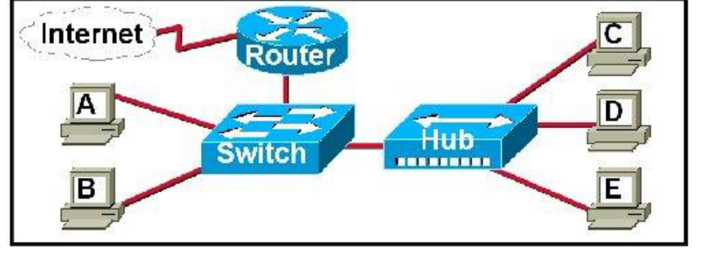
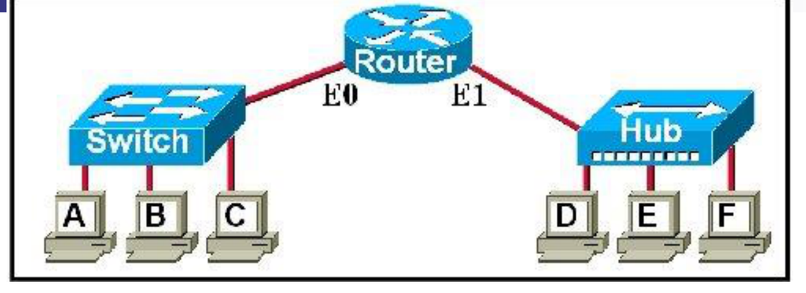
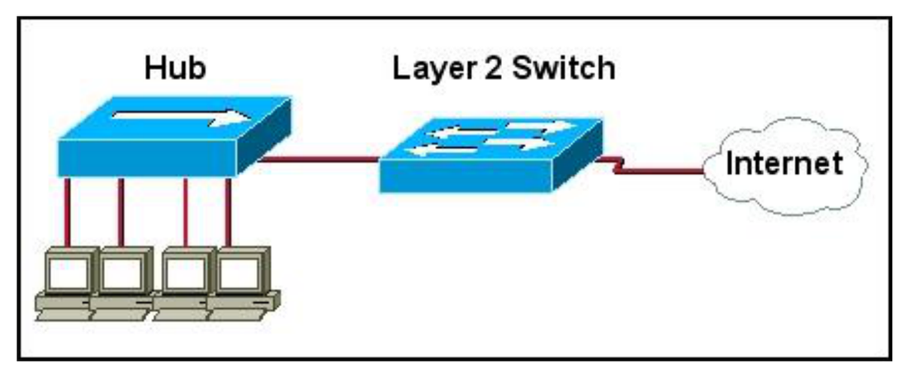
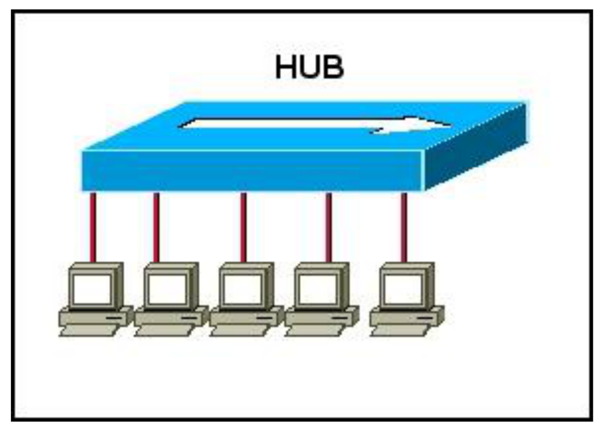
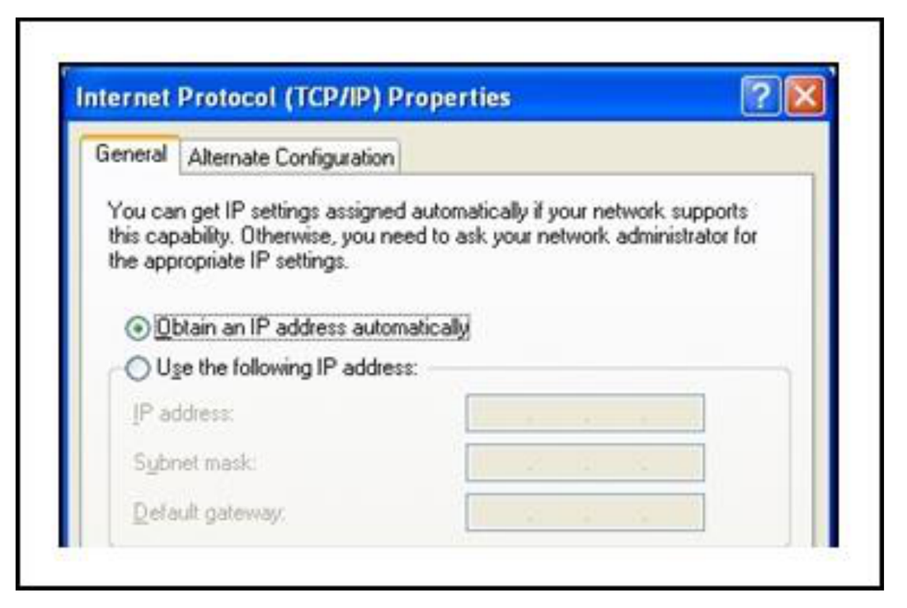
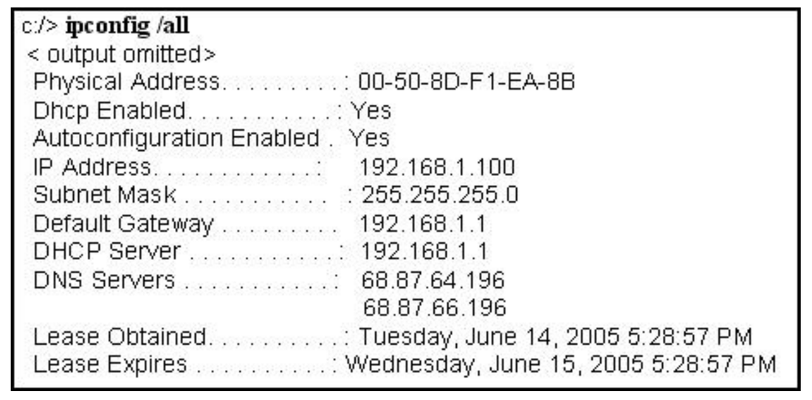
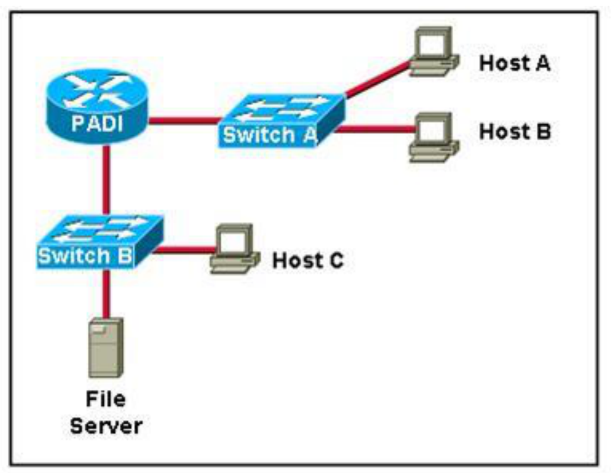
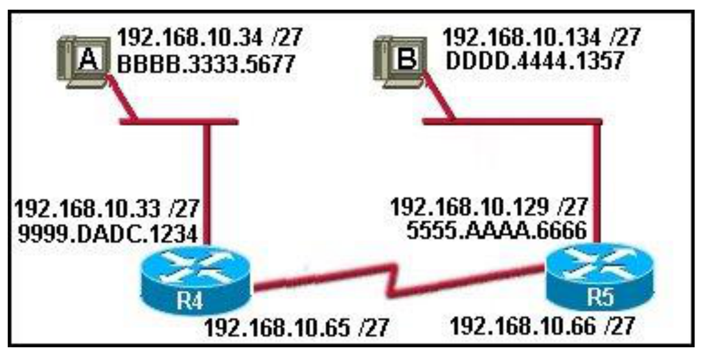
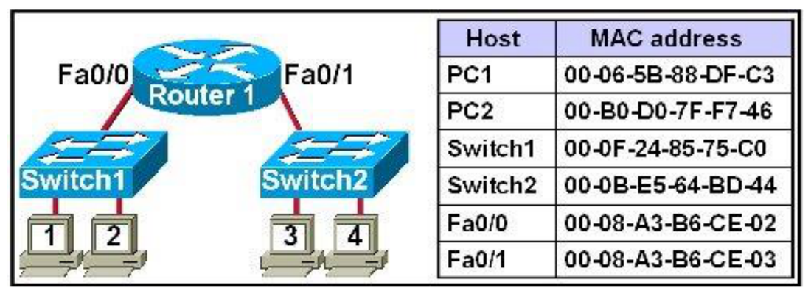
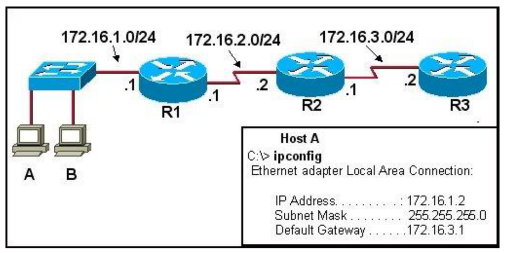

---
title:
  en: "Final Review MCQs · Answers and Explanations"
  zh: "Final Review 选择题 · 19 题答案与解析"
summary:
  en: "All 19 multiple-choice questions from the instructor's Final Review deck with their exhibits: the answer, why each wrong option is wrong, and which module it tests. Choose-two / choose-three questions are interactive multi-select."
  zh: "老师 Final Review 课件里的 19 道选择题（含 exhibit 图）：答案、每个错误选项错在哪、考的是哪个模块。Choose two / three 的题做成了可以多选的形式。"
week: 0
date: 2026-10-10
tags: [FinalReview, MCQ, Hub, Switch, Router, ARP, DHCP, DefaultGateway]
---
# Final Review 选择题 · 19 题答案与解析

**来源**：老师的 *Final Review\.pdf*（28 页，19 道选择题）　**总览**：[期末总复习](../final-review/)　**编址做题**：[子网与编址](../final-subnetting/)　**预测卷**：[期末预测卷](../final-mock/)

> **怎么用**：每题先自己选，再看解析。多选题（Choose two / three）要勾够数量再点「提交」。  
> 解析里的 **🔗** 指向对应模块的期末复习页，做错的题回去看那一节。

> **🎯 这 19 题告诉我们什么**
>
> | 模块                 | 题号                                                | 题数     | 主要考点                                                |
> | ------------------ | ------------------------------------------------- | ------ | --------------------------------------------------- |
> | **M1** 设备与 LAN 通信  | 1 · 2 · 3 · 4 · 5 · 6                             | 6      | Hub vs Switch 谁收到帧、FCS、哪些设备看 MAC、谁隔离广播              |
> | **M2** IP 地址、网关、路由 | 7 · 8 · 9 · 10 · 13 · 14 · 15 · 16 · 17 · 18 · 19 | **11** | 路由器每跳换 L2 头、默认网关、DHCP、public IP、ARP 问谁、IP/MAC(S, D) |
> | **M3** 传输层         | 11 · 12                                           | 2      | Connection-oriented、端口号的作用                          |
> | **M4** 子网          | （没有选择题）                                           | 0      | 子网计算单独出成 [SubnetQuestions](../final-subnetting/) 做题 |
>
> - **M2 占了一半以上**，而且几乎每题都要先**看图判断「在不在同一个网络」**，再推出 MAC / 网关 / ARP。
> - 有 **3 道多选**（15、16、17），都是「看图写地址」类。考试的多选很可能也是这种。
> - 图题的套路只有两个：**① 帧在 L2 设备上怎么走**（Hub 全发、Switch 查表、Router 挡广播）；**② 包跨网络时哪些地址变、哪些不变**（IP 不变，MAC 每跳换）。

## 1. Hub 与 Switch 上的广播（M1）

*A、B 接在 Switch 上，C、D、E 接在 Hub 上，Hub 接 Switch，Switch 接 Router，Router 接 Internet（Final Review p.2）*

**1. The hub and the switch are operating using factory default settings. Which hosts will receive the frame if host A transmits a broadcast frame?**

- A. Only workstation B and the router will receive the data.
- B. Workstations B, C, D, E, and the router will receive the data.
- C. Only workstations connected to the hub will receive the data.
- D. Workstations B, C, D, E, and the router will receive the data and it will be forwarded into the Internet.

> **答案：B**
>
> **一步步走**：
>
> 1. 广播帧（目的 MAC = FF-FF-FF-FF-FF-FF）进入 **Switch** → 按决策算法「广播 → 除了进来的端口，全部发出」→ B、Hub、Router 都收到。
> 2. **Hub** 是 L1 设备，收到什么都从其他所有口发出 → C、D、E 也收到。
> 3. **Router** 收到了，但**路由器不转发广播** → 不会送进 Internet。
>
> 所以 B、C、D、E 和 Router 都收到，但到 Router 为止 → **B**。D 错在「forwarded into the Internet」：路由器是广播域的边界。
>
> 🔗 [M1 · Switch 决策算法与广播](../final-m1/#6--switchesmac-address-table-️)

**2. Why would a company install a switch instead of a hub when building or expanding a corporate network?**

- A. A switch manages frames faster than a hub does. A switch operates at 100 Mbps.
- B. A hub operates at a maximum of 10 Mbps.
- C. A switch modifies the Ethernet frame to remove any errors. A hub forwards the frame exactly as it arrived.
- D. A switch provides more bandwidth by sending frames only out the port to which the destination device is attached. A hub sends the bits out all ports except the source port.

> **答案：D**
>
> Switch 的核心优势是**查 MAC 表、只从目的端口转发**（microsegmentation，每台主机独享端口带宽、每个端口一个冲突域）；Hub 把比特从除源端口外的所有端口发出，所有人共享带宽、互相冲突 → **D**。
>
> - A / B：速度不是本质区别（Hub 和 Switch 都有各种速率），题目问的是「为什么换」。
> - C：交换机**不会修正**错误帧。Store-and-forward 模式下发现 FCS 不对是**丢弃**，不是修好再转发。
>
> 🔗 [M1 · Hub vs Switch](../final-m1/#6--switchesmac-address-table-️)

**3. An Ethernet host receives a frame, calculates the FCS, and compares the calculated FCS to the FCS received in the frame. The host finds that the two FCS values do not match. What action will be taken by the host?**

- A. The host discards the frame.
- B. The host processes the data frame normally.
- C. The host initiates a request for retransmission of the frame.
- D. The host sends the frame content to an upper layer protocol for error recovery.

> **答案：A**
>
> FCS 对不上 = 帧在线上被改了（Integrity 被破坏）→ 数据链路层**只负责检测，直接丢弃** → **A**（老师板书：7 ≠ 10 → Discard）。
>
> - C：L2 不会请求重传。要重传是 **TCP（L4）** 发现丢了、计时器到期后自己重发。
> - D：坏帧不会被交给上层。
>
> 🔗 [M1 · 封装与 FCS](../final-m1/#4--encapsulation-and-de-encapsulation-️)

*左边 Switch 接 A、B、C 和 Router 的 E0；右边 Hub 接 D、E、F 和 Router 的 E1（Final Review p.5）*

**4. The switch and the hub have default configurations, and the switch has built its CAM table. Which of the hosts will receive the data when workstation A sends a unicast packet to workstation C?**

- A. workstation C
- B. workstations B and C
- C. workstations B, C, and the E0 interface of the router
- D. workstations B, C, D, E, F, and the E0 interface of the router

> **答案：A**
>
> 关键词是 **「the switch has built its CAM table」**：交换机已经知道 C 在哪个端口，单播帧**只从 C 的端口 forward** → 只有 **C** 收到 → **A**。
>
> - 如果表还是空的（unknown unicast），才会 flood 给 B、C 和 Router E0（选项 C 的情况）。
> - 右边 Hub 那一侧在路由器另一个接口后面，是**另一个网络**，A 发给 C 的帧根本到不了那边。
>
> 🔗 [M1 · MAC 表的 Flood / Forward / Filter](../final-m1/#6--switchesmac-address-table-️)

**5. Which networking devices use the MAC address to make decisions? (Choose two.)  (I) NIC  (II) bridge  (III) hub  (IV) switch  (V) repeater — Which two options are correct?**

- A. I and III
- B. I and IV
- C. II and III
- D. III and V
- E. II and IV

> **答案：E**
>
> 用 MAC 地址做**转发决策**的是 **Layer 2 设备：bridge 和 switch**（switch 就是多端口的 bridge）→ **E（II 和 IV）**。
>
> - Hub、Repeater 是 **Layer 1**，只认比特，不看任何地址 → 含 III 或 V 的选项都错。
> - NIC 也会看目的 MAC 决定「这一帧收不收」（板书：PC2 发现目的 MAC 不是自己就丢掉），但它不做转发决策；而且只有 E 同时包含 bridge 和 switch。
>
> 🔗 [M1 · 设备对比总表](../final-m1/#7--routers-️)

**6. A network administrator has a multi-floor LAN to monitor and maintain. Through careful monitoring, the administrator has noticed a large amount of broadcast traffic slowing the network. Which device would you use to best solve this problem?**

- A. bridge
- B. hub
- C. router
- D. transceiver

> **答案：C**
>
> 广播太多 → 要**把广播域切小** → 只有 **Router**（L3）默认不转发广播 → **C**。
>
> 口诀：**Hub 什么都不分；Switch / Bridge 分冲突域，不分广播域；Router 两个都分。** 这也是 M4「为什么要划分子网」的第一条理由：把广播限制在每个子网里。
>
> 🔗 [M1 · 冲突域与广播域](../final-m1/#7--routers-️) · [M4 · 为什么要子网](../final-m4/#1--subnetworks为什么要划分子网-)

## 2. 路由器转发、默认网关（M1 + M2）

**7. What header address information does a router change in the information it receives from an attached Ethernet interface before information is transmitted out another interface?**

- A. only the Layer 2 source address
- B. only the Layer 2 destination address
- C. only the Layer 3 source address
- D. only the Layer 3 destination address
- E. the Layer 2 source and destination address
- F. the Layer 3 source and destination address

> **答案：E**
>
> 路由器收到帧 → 拆掉旧帧头 → 按目的 IP 查路由表 → 用**出口接口**重新封装一个新帧：**新的源 MAC = 自己出口接口的 MAC，新的目的 MAC = 下一跳的 MAC** → L2 的源和目的**都换** → **E**。IP 头（L3 源、目的）**不变**。
>
> 一句话：**IP 管终点，MAC 管下一站**。（NAT 路由器会改源 IP，但这题问的是普通路由。）
>
> 🔗 [M2 · 跨网络时哪些地址变](../final-m2/#8--default-gateway-️)

**8. How does a router decide where the contents of a received frame should be forwarded?**

- A. by matching destination IP addresses with networks in the routing table
- B. by matching the destination IP address with IP addresses listed in the ARP table
- C. by matching the destination MAC address with MAC addresses listed in the CAM table
- D. by forwarding the frame to all interfaces except the interface on which the frame was received

> **答案：A**
>
> 路由器看**目的 IP**，在**路由表**里找它属于哪个**网络** → 从对应接口发出 → **A**。
>
> - B：ARP 表是在**选好出口之后**才查的（找下一跳的 MAC），不是用来决定往哪走。
> - C：CAM 表是**交换机**的。
> - D：这是交换机 / Hub 的 flood；**路由器不会 flood**，查不到就 discard。
>
> 🔗 [M2 · 路由器查两张表](../final-m2/#8--default-gateway-️)

*4 台 PC 接 Hub，Hub 接 Layer 2 Switch，Switch 直接接 Internet（Final Review p.10）*

**9. A student has designed a small office network to enable hosts to access the Internet. What recommendation should the teacher provide to the student in regards to the network design?**

- A. Replace the Layer 2 switch with a hub.
- B. Replace the Layer 2 switch with a router.
- C. Replace the Layer 2 switch with a bridge.
- D. Replace the Layer 2 switch with a transceiver.

> **答案：B**
>
> 办公室的 LAN 和 Internet 是**两个不同的网络**；跨网络要靠 **Layer 3 的 Router**（选路、当默认网关，通常还做 NAT）。Switch、Hub、Bridge、Transceiver 都只在一个 LAN 里工作 → **B**。
>
> 🔗 [M2 · 默认网关](../final-m2/#8--default-gateway-️)

*5 台 PC 都接在同一个 Hub 上，没有路由器（Final Review p.12）*

**10. A technician notices that a default gateway is not configured on all the hosts, but all hosts have connectivity between hosts. How would you explain the connectivity to the technician?**

- A. The hosts are detecting the default gateway configured on the hub.
- B. The hosts are all in one network, so default gateway information is not needed.
- C. The hosts in the network only require that one host has a gateway configured.
- D. The hosts in the network would only need a gateway if a switch replaces the hub.
- E. The hosts are using broadcast to reach each other since no gateway is configured.

> **答案：B**
>
> 主机发包前先比较 **Network 部分**：同一网络 → 直接 ARP 对方，用不到网关；**只有去别的网络才需要默认网关** → **B**。
>
> - A：Hub 是 L1，没有 IP，更没有网关。
> - E：只有 ARP request 是广播，真正的数据是**单播**。
> - D：换成交换机还是同一个网络，一样不需要网关。
>
> 🔗 [M2 · 主机的发送逻辑](../final-m2/#8--default-gateway-️)

## 3. 传输层（M3）

**11. TCP is referred to as connection-oriented. What does this mean?**

- A. TCP uses only LAN connections.
- B. TCP requires devices to be directly connected.
- C. TCP negotiates a session for data transfer between hosts.
- D. TCP reassembles the data steams in the order that it is received.

> **答案：C**
>
> Connection-oriented = **发数据之前先交换消息、建立会话**（三次握手：SYN → SYN-ACK → ACK，交换 ISN 和端口）→ **C**。
>
> - D 的陷阱：TCP 是按 **sequence number** 排序，不是「按收到的顺序」——那恰恰是 UDP 的做法（delivers data as it arrives）。
> - A / B：TCP 是端到端的，中间可以隔着任意多台路由器、跨 Internet。
>
> 🔗 [M3 · 三次握手](../final-m3/#2--three-way-handshake-️)

**12. What is the purpose of TCP/UDP port numbers?**

- A. indicate the beginning of a three-way handshake
- B. reassemble the segments into the correct order
- C. identify the number of data packets that may be sent without acknowledgment
- D. track different conversations crossing the network at the same time

> **答案：D**
>
> 端口号 = **区分同一台主机上的不同对话 / 应用**（multiplexing）→ **D**，课件原话 *keep track of different conversations crossing the network at the same time*。
>
> - A 是 **SYN** flag；B 是 **sequence number**；C 是 **window size**。三个干扰项正好是 TCP 头里的另外三样东西，考前把「哪个字段做什么」对一遍。
>
> 🔗 [M3 · 端口号](../final-m3/#5--port-numbersidentifying-application-processes-️)

## 4. IP 地址、DHCP 与「看 ipconfig」（M2）

**13. Which statement accurately describes public IP addresses?**

- A. Public addresses cannot be used within a private network.
- B. Public IP addresses must be unique across the entire Internet.
- C. Public addresses can be duplicated only within a local network.
- D. Public IP addresses are only required to be unique within the local network.
- E. Network administrators are free to select any public addresses to use for network devices that access the Internet.

> **答案：B**
>
> Public IP **在整个 Internet 上唯一**，由 ICANN / 地区机构（ARIN、APNIC）分配 → **B**。
>
> - E 错：public 地址不能自己挑，要向 ISP / 注册机构申请（NAT 板书里的 201.4.8.9 就是「向 ISP 买的」）。
> - 只在本地唯一的是 **private** 地址（10 / 172.16–31 / 192.168），它们出网要靠 **NAT**。
>
> 🔗 [M2 · Public / Private 与 NAT](../final-m2/#4--public-vs-privatenat-与-pat-️)

*Windows TCP/IP Properties：选中 Obtain an IP address automatically（Final Review p.17）*

**14. What is the purpose of the Obtain an IP address automatically option shown in the exhibit?**

- A. to configure the computer to use ARP
- B. to configure the computer to use DHCP
- C. to configure the computer to use a routing protocol
- D. to configure the computer with a statically assigned IP address

> **答案：B**
>
> 「自动获取 IP」= 开机时用 **DHCP**（DORA 四步）向 DHCP server 租地址，一起拿到掩码、默认网关、DNS → **B**。下面那个「Use the following IP address」才是 static。
>
> 🔗 [M2 · DHCP](../final-m2/#5--获取地址static-vs-dhcp-️)

*ipconfig /all：Physical Address 00-50-8D-F1-EA-8B，DHCP Enabled Yes，IP 192.168.1.100，Mask 255.255.255.0，Gateway 192.168.1.1，DHCP Server 192.168.1.1，DNS 68.87.64.196 / 68.87.66.196（Final Review p.19）*

**15. Which two statements are correct in reference to the output shown? (Choose two.)**

- A. The LAN segment is subnetted to allow 254 subnets.
- B. The DNS server for this host is on the same network as the host.
- C. The host automatically obtained the IP addresses 192.168.1.100.
- D. The host received the IP address from the router on the local LAN segment.
- E. The host is assigned an address of 00-50-8D-F1-EA-8D by the administrator.

> **答案：C、D**
>
> 逐行读 ipconfig：
>
> - **C ✓**：*Dhcp Enabled: Yes* → 地址是自动拿到的。
> - **D ✓**：*DHCP Server = 192.168.1.1* 和 *Default Gateway = 192.168.1.1* 是**同一个地址** → 发地址的就是本 LAN 上的路由器（家用路由器常兼做 DHCP server）。
> - A ✗：255.255.255.0 是 Class C 的默认掩码，说明**没有子网划分**；「254」是每个网络的**主机数**，不是子网数。
> - B ✗：DNS 在 68.87.x.x，主机在 192.168.1.x，Network 部分不同 → 不在同一网络（是 ISP 的 DNS）。
> - E ✗：MAC 地址烧在网卡上，不是管理员分配的；而且图里是 …EA-**8B**，选项写的是 …EA-**8D**。
>
> 🔗 [M2 · DHCP 给了哪些东西](../final-m2/#5--获取地址static-vs-dhcp-️)

*Host A、Host B 接 Switch A → 路由器 PADI；Host C 和 File Server 接 Switch B → PADI（Final Review p.21）*

**16. What must be configured on Host B to allow it to communicate with the file server? (Choose three.)**

- A. the MAC address of the file server
- B. the MAC address of the PADI router interface connected to Switch A
- C. the IP address of Switch A
- D. a unique host IP address
- E. the subnet mask for the LAN
- F. the default gateway address

> **答案：D、E、F**
>
> Host B 和 File Server 在路由器 PADI 的**两个不同接口**后面 = 两个网络。主机要跨网络通信，必须**手工配（或 DHCP 给）三样**：**唯一的 IP、子网掩码（用来判断目的在不在本网络）、默认网关** → **D、E、F**。
>
> - A / B：MAC 地址是 **ARP 自动查**的，不用配置；而且 Host B 永远拿不到另一个网络里 File Server 的 MAC，只会 ARP 网关。
> - C：交换机是 L2 设备，主机通信不需要知道它的 IP。
>
> 🔗 [M2 · 编址三要素](../final-m2/#8--default-gateway-️)

*Host A 192.168.10.34/27 (BBBB.3333.5677) — R4 E 口 192.168.10.33 (9999.DADC.1234)；R4 ═ R5 串行线 .65 / .66；R5 E 口 192.168.10.129 (5555.AAAA.6666) — Host B 192.168.10.134/27 (DDDD.4444.1357)（Final Review p.23）*

**17. Host A pings Host B. What can be concluded about the source and destination addresses contained in the communication sent by Router R5 when it forwards the ping out the Ethernet interface to Host B? (Choose two.)**

- A. source IP address: 192.168.10.129
- B. source MAC address: BBBB.3333.5677
- C. source MAC address: 5555.AAAA.6666
- D. destination IP address: 192.168.10.33
- E. destination IP address: 192.168.10.134
- F. destination MAC address: 9999.DADC.1234

> **答案：C、E**
>
> 最后一段 **R5 → Host B**：
>
> - **IP (S, D) = (192.168.10.34, 192.168.10.134)**：一路不变 → **E ✓**；A（.129 是 R5 的接口）✗、D（.33 是 R4 的接口）✗。
> - **MAC (S, D) = (5555.AAAA.6666, DDDD.4444.1357)**：源 = R5 出口以太网接口 → **C ✓**；B 是 Host A 的 MAC，只出现在第一段 ✗；F 是 R4 的 MAC，只在第一段当目的 MAC ✗。
>
> 三段对比（中间是串行线，没有以太网 MAC）：
>
> | 段               | IP (S, D)   | MAC (S, D)                       |
> | --------------- | ----------- | -------------------------------- |
> | Host A → R4     | (.34, .134) | (BBBB.3333.5677, 9999.DADC.1234) |
> | R4 → R5（Serial） | (.34, .134) | 没有以太网 MAC（PPP / HDLC）            |
> | R5 → Host B     | (.34, .134) | (5555.AAAA.6666, DDDD.4444.1357) |
>
> 顺便看掩码：/27 → 每块 32 个地址：Host A 在 .32/27，串行线在 .64/27，Host B 在 .128/27——三个不同的子网，正好是 M4 的内容。
>
> 🔗 [M2 · 每一跳的 IP / MAC](../final-m2/#8--default-gateway-️)

*Router 1：Fa0/0 接 Switch1（PC1、PC2），Fa0/1 接 Switch2（PC3、PC4）；右边是每台设备的 MAC（Final Review p.25）*

**18. Workstation 1 pings the Fa0/1 interface of Router 1. Which MAC address will workstation 1 obtain during the ARP request for this communication?**

- A. 00-06-5B-88-DF-C3
- B. 00-B0-D0-7F-F7-46
- C. 00-0F-24-85-75-C0
- D. 00-0B-E5-64-BD-44
- E. 00-08-A3-B6-CE-02
- F. 00-08-A3-B6-CE-03

> **答案：E**
>
> Fa0/1 的 IP 在路由器**另一边的网络**里，和 Workstation 1 不在同一网络 → 工作站**不会 ARP Fa0/1**，而是 ARP 自己的**默认网关 = Fa0/0** → 拿到 **00-08-A3-B6-CE-02** → **E**。
>
> - F（Fa0/1 的 MAC）是最大陷阱：目的 IP 虽然是 Fa0/1，但 ARP 广播过不了路由器，也不该去问另一个网络的地址。**跨网络 → 目的 MAC = 网关 MAC**。
> - A / B 是 PC1、PC2 自己的 MAC；C / D 是交换机的 MAC——交换机是透明的，主机通信不会以它为目的。
>
> 🔗 [M2 · ARP 与默认网关](../final-m2/#7--arp知道-ip找-mac-️)

*A、B 接交换机 → R1（.1，172.16.1.0/24）→ R2 → R3（172.16.3.2）；Host A 的 ipconfig：IP 172.16.1.2，Mask 255.255.255.0，Gateway 172.16.3.1（Final Review p.27）*

**19. Pings between Host B and Host A were successful. The technician could not ping the R3 address 172.16.3.2 from Host A. Host A's ipconfig is shown. What is the most likely problem?**

- A. The IP address of Host A is incorrect.
- B. The subnet mask of Host A is incorrect.
- C. The default gateway of Host A is incorrect.
- D. Host A is properly configured. Some other problem exists in the internetwork.

> **答案：C**
>
> Host A = 172.16.1.2/24，但网关写的是 **172.16.3.1**——那是另一个网络（172.16.3.0/24）的地址。**默认网关必须和主机在同一个网络**，应该是 R1 在这个 LAN 上的接口 **172.16.1.1** → **C**。
>
> - 为什么 A ↔ B 能 ping 通：同一网络内通信**用不到网关**（第 10 题同理），所以 IP 和掩码本身没问题（排除 A、B）。
> - 一旦目的在别的网络，Host A 要 ARP 网关 172.16.3.1——这个地址不在本网络，ARP 广播永远得不到回复 → 包发不出去。
>
> 🔗 [M2 · 默认网关必须在同一网络](../final-m2/#8--default-gateway-️) · [编址做题：主机网关 = 路由器 LAN 接口](../final-subnetting/#0--所有子网题都是同一个套路)

## 答案速查

**展开看 19 题答案（先做完再看）**

> | 题 | 答案 | 题  | 答案 | 题  | 答案  | 题  | 答案    |
> | - | -- | -- | -- | -- | --- | -- | ----- |
> | 1 | B  | 6  | C  | 11 | C   | 16 | D、E、F |
> | 2 | D  | 7  | E  | 12 | D   | 17 | C、E   |
> | 3 | A  | 8  | A  | 13 | B   | 18 | E     |
> | 4 | A  | 9  | B  | 14 | B   | 19 | C     |
> | 5 | E  | 10 | B  | 15 | C、D |    |       |

> **🧠 把 19 题浓缩成 6 句话**
>
> 1. **Hub 全发，Switch 查表（广播 / 未知 → flood），Router 挡广播。**（1、4、6）
> 2. **FCS 不对就丢，L2 不重传。**（3）
> 3. **Router 看目的 IP 查路由表；每过一台路由器，MAC 两个都换，IP 两个都不变。**（7、8、17）
> 4. **同一网络直接 ARP 对方；别的网络 ARP 默认网关，网关必须在本网络。**（10、18、19）
> 5. **主机要配 IP + 掩码 + 网关；MAC 靠 ARP 自动拿。DHCP 一次全给。**（14、15、16）
> 6. **Public IP 全球唯一；端口号区分对话；TCP 先建会话。**（11、12、13）
