---
title:
  en: "Week 1 · Networking Protocols & Communications"
  zh: "第 1 周 · 网络协议与通信"
summary:
  en: "Network components and types, CIA, the OSI and TCP/IP models, encapsulation, and how hubs, switches and routers move data."
  zh: "网络组成与类型、CIA、OSI 与 TCP/IP 模型、封装，以及集线器 / 交换机 / 路由器如何转发数据。"
week: 1
date: 2026-09-22
tags: [OSI, TCP/IP, Switching, MAC]
---
# ISOM 5180 Advanced Network and Security Management — Week 1 复习笔记

**主题：Module 1 Networking Protocols and Communications — 网络组成 · 网络类型 · 网络安全三目标 (CIA) · 带宽 · OSI / TCP/IP 分层模型 · 封装 · 网络设备（Hub / Switch / Router）· 交换机 MAC 表 · 单播 / 广播 / 组播**

> 优先级标注说明（按考试重要性）：  
> 🔴 **必考核心** — 概念名称、定义、结构必须能背出来  
> 🟡 **需要理解** — 需要懂逻辑关系，能举例说明  
> 🟢 **了解即可** — 背景知识，考试大概率不会细抠
>
> **优先级依据**：  
> ① **你确认的课堂重点**：老师重点讲了 **Networking Devices** 这条线——Repeater → Hub（flood + collision）→ Switch（MAC address table、time stamp、dynamic learning、flood / forward / filter、防冲突机制）→ Router（routing table、static / dynamic、forward / discard、serial 接口）→ MAC 地址与单播 / 广播 / 组播。第 11–14 节按这条线写，是本周最核心的部分；  
> ② **篇幅**：交换机相关内容占了 p.43–67 共 25 页，OSI 七层占 p.28–41 共 14 页；  
> ③ **老师的课堂手写补充（M1 Supplementary）**：10 页里有 6 页在画「帧怎么走」——MAC 表、封装、FCS、冲突、路由器、广播地址；  
> ④ 课件 p.21 自己点题：*"The study of network security starts with a clear understanding of the underlying switching and routing infrastructure."* ——这门课是安全课，但第一周先打网络底子。

> **📌 本笔记里的几种标记**
>
> - **✍️ 老师板书** — 来自 *M1 Supplementary Completed*（老师上课手写的讲解图），放在对应课件内容旁边。
> - **➕ 课外补充** — 课件没写、但理解或答题会用到的背景知识，考试优先级按 🟢 处理。
> - **🎯 考点 / ⚠️ 踩坑提醒 / 🧠 记忆口诀** — 答题时该怎么写、容易丢分的地方。
> - 网页版里有一张冲突示意图和两个可以点的小实验（交换机 MAC 表、FCS 差错检测），打印版会变成等价的图和表格。

---

## 0. 核心地图（先建立整体框架）

这节课其实只回答一个问题：**一份数据从我的电脑出发，怎么到达另一台电脑？** 课件的顺序就是一条从「零件」到「全过程」的链：

```
数据的单位 (bit / byte)
   → 网络由什么组成 (Devices · Media · Services)
   → 网络有哪几种 (LAN / WAN / Internet / Intranet / Extranet)
   → 为什么要保护它 (CIA 三目标 · 内外部威胁 · 多层防御)
   → 一条线路能跑多少数据 (Bandwidth)
   → 大家说同一种语言 (Protocols) + 把复杂问题拆成层 (OSI 7 层 / TCP/IP 4 层)
   → 数据下楼时一层层打包 (Encapsulation)，上楼时一层层拆包 (De-encapsulation)
   → 每一层有自己的设备：Repeater / Hub = L1 → Switch = L2 → Router = L3   ★ 本周重点
        Hub：什么都 flood → collision
        Switch：MAC address table（MAC · Port · Time stamp），用 Source 学，Flood / Forward / Filter，四招防冲突
        Router：routing table（IP · Interface），static / dynamic，只有 Forward / Discard
   → MAC 地址长什么样 · 单播 / 广播（全 1）/ 组播
   → 把所有东西串起来：Data Flow Through a Network
```

**一句话抓住本周**：*层* 是这门课的坐标系——以后讲任何安全设备（防火墙、IPS、VPN），第一个问题都是「它工作在第几层、看的是哪种地址」。

---

## 1. 🟢 Computing Measurement Terms（计算单位）

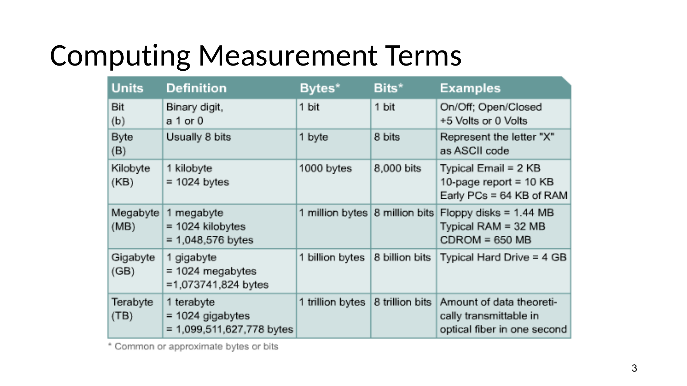

*Bit / Byte / KB / MB / GB / TB 对照表（Slide 3）*

- **Bit（比特，b）** = binary digit，只有 0 或 1。在计算机里用开 / 关、有无电脉冲、光脉冲或电磁波表示（Slide 2）。
- **Byte（字节，B）** = 通常 8 bits，可以表示一个字符，例如字母 "X" 的 ASCII 码。
- 课件表格里 1 KB 同时写了 "1024 bytes" 和 "≈1000 bytes"：**1024 是二进制的精确值，1000 是约数**（表格脚注 *Common or approximate*）。

> **➕ 课外补充：小写 b 和大写 B 差 8 倍**
>
> - 网速、带宽用 **bit**：100 **Mbps** = 每秒 1 亿 bit。
> - 文件大小用 **Byte**：100 **MB** = 1 亿 Byte。
> - 所以 100 Mbps 的宽带，理论下载速度是 100 ÷ 8 = **12.5 MB/s**。这是选择题常见陷阱。

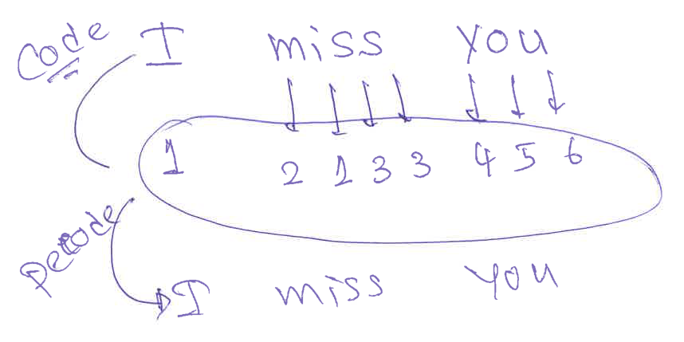

*✍️ Code / Decode：I miss you → 1 2 1 3 3 4 5 6 → I miss you（M1 Supplementary p.1）*

> **✍️ 老师板书：编码 (Code) 与解码 (Decode)**
>
> 老师用 "I miss you" 演示：给每个**不同的字母**编一个号（I/i = 1，m = 2，s = 3，y = 4，o = 5，u = 6），发送方把文字变成数字串 `1 2 1 3 3 4 5 6`，接收方用**同一本码本**再变回 "I miss you"。
>
> 要点：
>
> 1. 计算机里的文字、图片最终都要**编码成 0 和 1** 才能传输（ASCII 就是一本公开的码本）。
> 2. **双方必须使用同一套规则**才能正确解码——这就是后面「协议 (Protocol)」的本质。
> 3. 统一数据格式、编码、加密，正是 OSI 第 6 层 Presentation 的职责（见第 7 节）。

---

## 2. 🟡 Components of a Network（网络的三类组成）

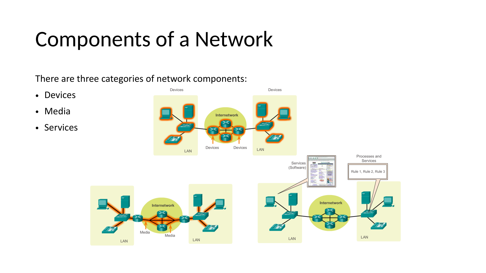

*Devices · Media · Services（Slide 4）*

| 类别                            | 英文定义（课件原文）                                                            | 中文 / 小白解释         | 例子                                 |
| ----------------------------- | --------------------------------------------------------------------- | ----------------- | ---------------------------------- |
| **End Devices 终端设备**          | Where a message **originates from** or where it is **received**       | 数据的起点和终点，用户直接用的设备 | PC、笔记本、手机、打印机、IP 电话、服务器            |
| **Intermediary Devices 中间设备** | **Interconnects** end devices                                         | 把终端连起来、替数据「指路」的设备 | Switch、Wireless AP、Router、Firewall |
| **Network Media 网络介质**        | The medium that allows a message to travel from source to destination | 数据走的「路」           | 铜线、光纤、无线电波                         |
| **Services 服务**               | 网络上运行的软件、进程与规则                                                        | 让网络「有用」的应用        | Email、Web、文件共享                     |

### 🟡 中间设备的三件管理工作（Slide 6，可能考列举）

1. **Regenerate and retransmit** data signals — 重新生成并转发信号（信号走远了会变弱）
2. **Maintain information about what pathways exist** in the network — 记住网络里有哪些路径
3. **Notify other devices of errors** and communication failures — 出错时通知其他设备

### 🟡 三种介质（Slide 7–8）

| Media Type                                                    | 信号形式                                                                  | 小白理解                         |
| ------------------------------------------------------------- | --------------------------------------------------------------------- | ---------------------------- |
| **Metal wires within cables**（铜线：双绞线 twisted-pair、同轴 coaxial） | **Electrical impulses** 电脉冲                                           | 便宜常见，但会衰减、怕电磁干扰              |
| **Glass or plastic fibers**（光纤 fiber-optic）                   | **Pulses of light** 光脉冲                                               | 距离远、速度快、不怕电磁干扰               |
| **Wireless transmission**（无线）                                 | **Modulation of specific frequencies of electromagnetic waves** 电磁波调制 | 介质就是空气（atmosphere），方便但更容易被窃听 |

### 🟡 Network Representations（拓扑图符号，Slide 9）

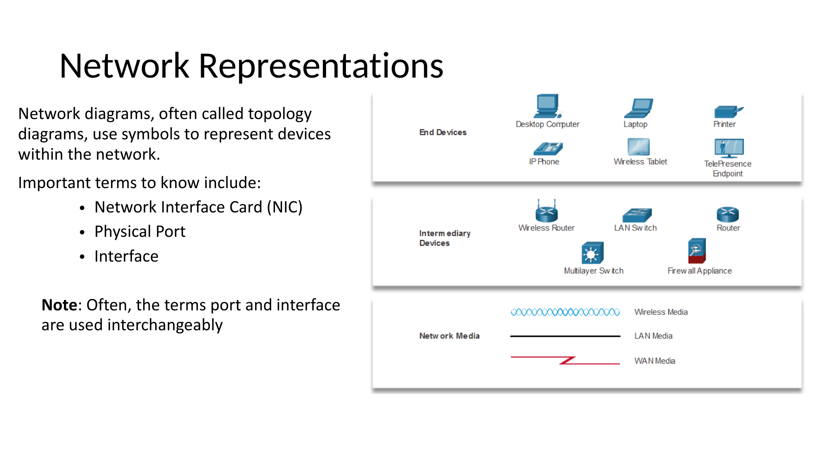

*拓扑图里的终端、中间设备、介质符号：波浪线 = 无线，直线 = LAN，红色闪电线 = WAN（Slide 9）*

| 术语                                  | 含义                              |
| ----------------------------------- | ------------------------------- |
| **NIC (Network Interface Card)** 网卡 | 设备连上网络的硬件，**MAC 地址就烧在网卡上**      |
| **Physical Port** 物理端口              | 设备上插网线的那个口                      |
| **Interface** 接口                    | 路由器、交换机上连接某个网络的端口（常带名字，如 E0、S0） |

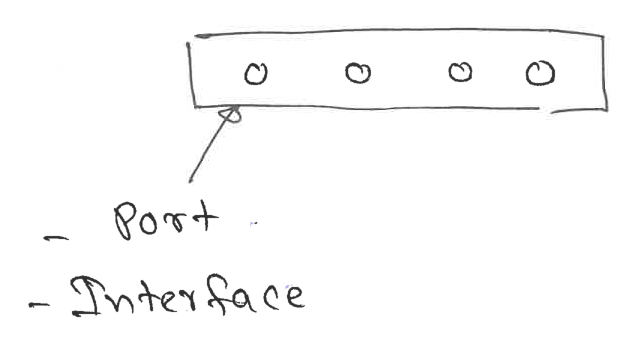

*✍️ 设备上的一排口：Port / Interface（M1 Supplementary p.3）*

> **⚠️ 踩坑提醒**
>
> 课件原话：*Often, the terms **port** and **interface** are used interchangeably.* —— 考试里两个词可以互换，不用纠结。

---

## 3. 🔴 Common Types of Networks（网络类型）

### 🔴 LAN vs WAN（必考对比）

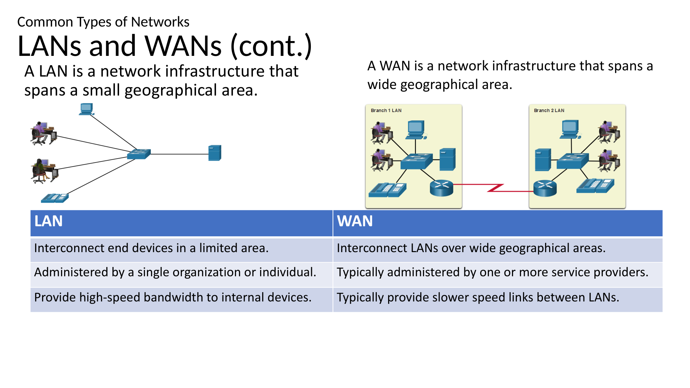

*LAN 与 WAN 的定义与对比（Slide 12）*

网络之间的差异体现在四个维度（Slide 11）：**Size of the area covered**（覆盖范围）、**Number of users connected**（用户数）、**Number and types of services available**（服务数量与种类）、**Area of responsibility**（由谁负责管理）。

| 对比维度 | **LAN (Local Area Network) 局域网**                         | **WAN (Wide Area Network) 广域网**                                    |
| ---- | -------------------------------------------------------- | ------------------------------------------------------------------ |
| 范围   | Interconnect end devices in a **limited area**（一栋楼、一个校园） | Interconnect **LANs** over **wide geographical areas**             |
| 管理者  | Administered by a **single organization or individual**  | Typically administered by **one or more service providers**（电信运营商） |
| 速度   | Provide **high-speed** bandwidth to internal devices     | Typically provide **slower speed** links between LANs              |

**记忆锚点**：LAN 连的是**设备**，WAN 连的是 **LAN**；LAN 是「自己家的」，WAN 是「租运营商的」。

**其他类型**（Slide 13，🟢 知道全称即可）：**MAN** (Metropolitan Area Network) 城域网 · **WLAN** (Wireless LAN) 无线局域网 · **SAN** (Storage Area Network) 存储区域网络。

### 🟡 The Internet（Slide 14）

- **The internet is a worldwide collection of interconnected LANs and WANs.** LAN 之间用 WAN 连起来；WAN 可以用铜线、光纤、无线。
- **The internet is not owned by any individual or group.** 靠以下组织维持结构：

| 缩写        | 全称                                                  | 做什么（课外补充）         |
| --------- | --------------------------------------------------- | ----------------- |
| **IETF**  | Internet Engineering Task Force                     | 制定互联网协议标准（RFC 文档） |
| **ICANN** | Internet Corporation for Assigned Names and Numbers | 管理域名、IP 地址的分配     |
| **IAB**   | Internet Architecture Board                         | 监督互联网整体架构与标准方向    |

### 🔴 Intranet vs Extranet（Slide 15）

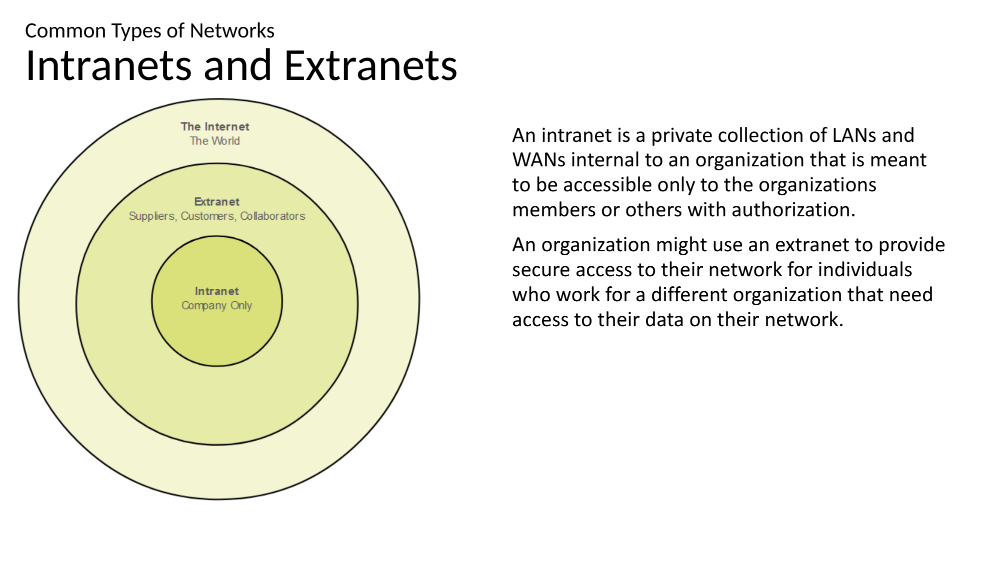

*同心圆：Intranet（公司内部）⊂ Extranet（供应商、客户、合作方）⊂ Internet（全世界）（Slide 15）*

|                  | 定义（课件原文）                                                                                                                                              | 谁能访问                                           |
| ---------------- | ----------------------------------------------------------------------------------------------------------------------------------------------------- | ---------------------------------------------- |
| **Intranet 内联网** | A **private** collection of LANs and WANs **internal to an organization**, accessible only to the organization's members or others with authorization | Company Only 仅公司成员                             |
| **Extranet 外联网** | Provides **secure access** to their network for individuals who **work for a different organization** that need access to their data                  | Suppliers, Customers, Collaborators 供应商、客户、合作者 |

> **⚠️ 踩坑提醒**
>
> - Intranet ≠ 一个 LAN：它可以横跨多个城市的 LAN 和 WAN，关键在「**私有 + 仅限内部**」。
> - Extranet 不是「公开的」，而是「**有控制地开放给外部合作方**」，所以它本身就是一个安全设计问题（要认证、要授权）。

---

## 4. 🔴 Network Security（网络安全基础）

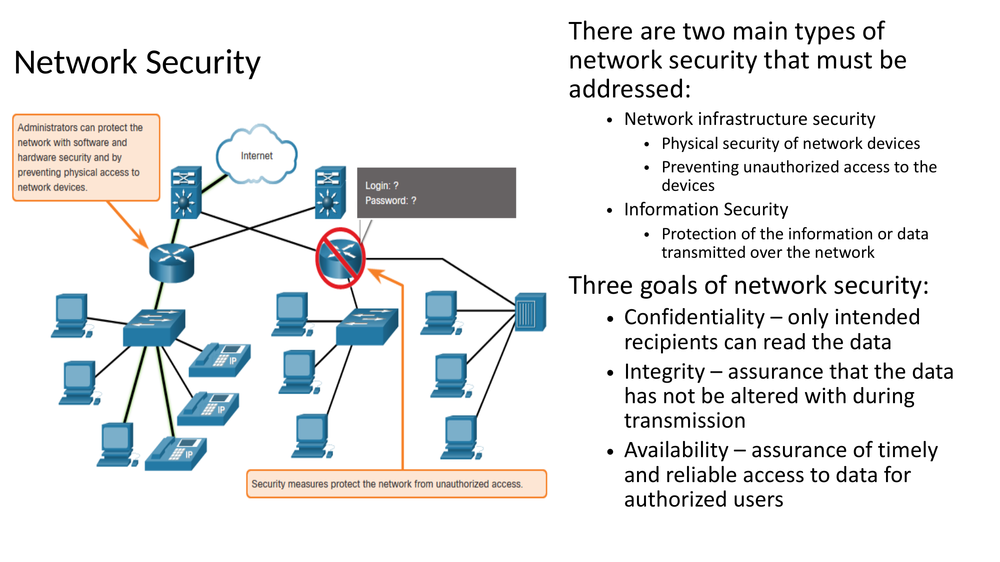

*两类网络安全 + 三个安全目标（Slide 17）*

### 🔴 两类必须处理的网络安全

| 类型                                           | 包含什么                                                                                                                                   |
| -------------------------------------------- | -------------------------------------------------------------------------------------------------------------------------------------- |
| **Network infrastructure security** 网络基础设施安全 | **Physical security** of network devices（设备的物理安全）；**Preventing unauthorized access** to the devices（防止有人未授权登录设备，如图中的 Login / Password） |
| **Information security** 信息安全                | **Protection of the information or data transmitted** over the network（保护网络上传输的数据）                                                     |

### 🔴 三个安全目标 CIA（必背）

| 目标                      | 课件原文                                                                 | 小白理解         | 被破坏的例子                   |
| ----------------------- | -------------------------------------------------------------------- | ------------ | ------------------------ |
| **Confidentiality 机密性** | Only intended recipients can read the data                           | 只有该看的人能看     | 数据被窃听（Data interception） |
| **Integrity 完整性**       | Assurance that the data has not been altered during transmission     | 数据在路上没被改过    | 转账金额被中间人篡改               |
| **Availability 可用性**    | Assurance of timely and reliable access to data for authorized users | 授权的人需要时能及时用上 | DoS 攻击让网站瘫痪              |

> **🧠 记忆口诀**
>
> **CIA** ——「看不到 (C) · 改不了 (I) · 用得上 (A)」。本周后面讲的 **FCS 差错检测**，本质就是在守 Integrity（发现数据在线路上被改了）。

### 🟡 Security Threats（Slide 18–19）

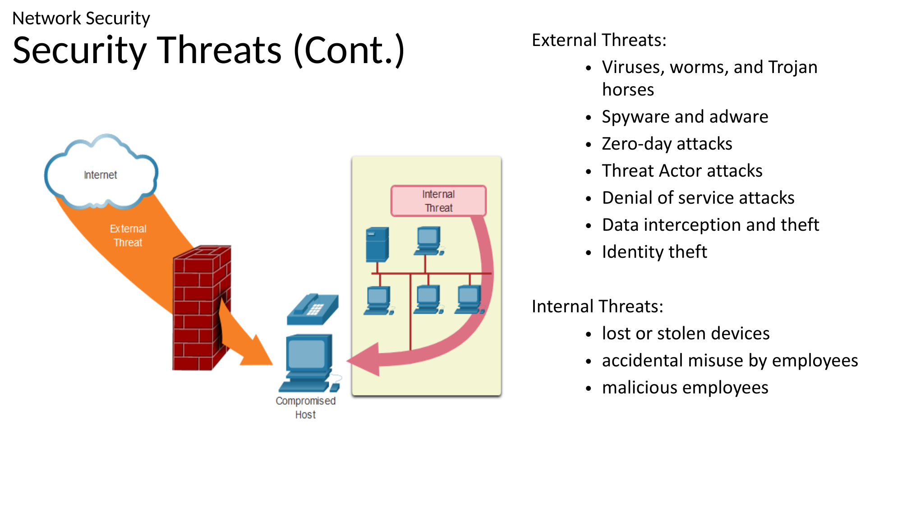

*外部威胁穿过防火墙，内部威胁直接从里面发起（Slide 19）*

- 网络安全是网络的**组成部分 (integral part)**，与网络大小无关；它要在**保护数据**和**保证服务质量 (quality of service)** 之间平衡。
- **Threat vectors might be external or internal.**

| External Threats 外部威胁               | 一句话解释                                   |
| ----------------------------------- | --------------------------------------- |
| Viruses, worms, and Trojan horses   | 病毒（要寄生在程序上）、蠕虫（能自己在网络中复制扩散）、木马（伪装成正常软件） |
| Spyware and adware                  | 间谍软件（偷偷收集信息）、广告软件                       |
| **Zero-day attacks**                | 利用厂商**还不知道或还没打补丁**的漏洞发动的攻击              |
| Threat actor attacks                | 攻击者（黑客）直接对设备或网络资源发起的攻击                  |
| **Denial of service (DoS) attacks** | 让服务变慢或瘫痪，破坏 Availability                |
| Data interception and theft         | 截获、窃取数据，破坏 Confidentiality              |
| Identity theft                      | 盗取登录凭证，冒充合法用户                           |

| Internal Threats 内部威胁          |           |
| ------------------------------ | --------- |
| Lost or stolen devices         | 设备丢失 / 被盗 |
| Accidental misuse by employees | 员工无意的误操作  |
| Malicious employees            | 心怀恶意的员工   |

> **🎯 考点**
>
> 内部威胁常被低估：图中内部威胁**不用穿过防火墙**就能直接攻击主机。若问「为什么只有防火墙不够」，答：防火墙只挡外部流量，内部威胁需要**访问控制、监控、员工培训**等其他层次的措施。

### 🔴 Security Solutions：多层防御（Slide 20–21）

> **Security must be implemented in multiple layers using more than one security solution.**（一个方案不够，要多层叠加）

| 场景                        | 需要的组件                                                                                                                                                            |
| ------------------------- | ---------------------------------------------------------------------------------------------------------------------------------------------------------------- |
| **Home / small office**   | **Antivirus and antispyware** software on end devices；**Firewall filtering** to block unauthorized access                                                        |
| **Larger networks**（额外需要） | **Dedicated firewall system** 专用防火墙；**Access control lists (ACL)** 访问控制列表；**Intrusion prevention systems (IPS)** 入侵防御系统；**Virtual private networks (VPN)** 虚拟专用网 |

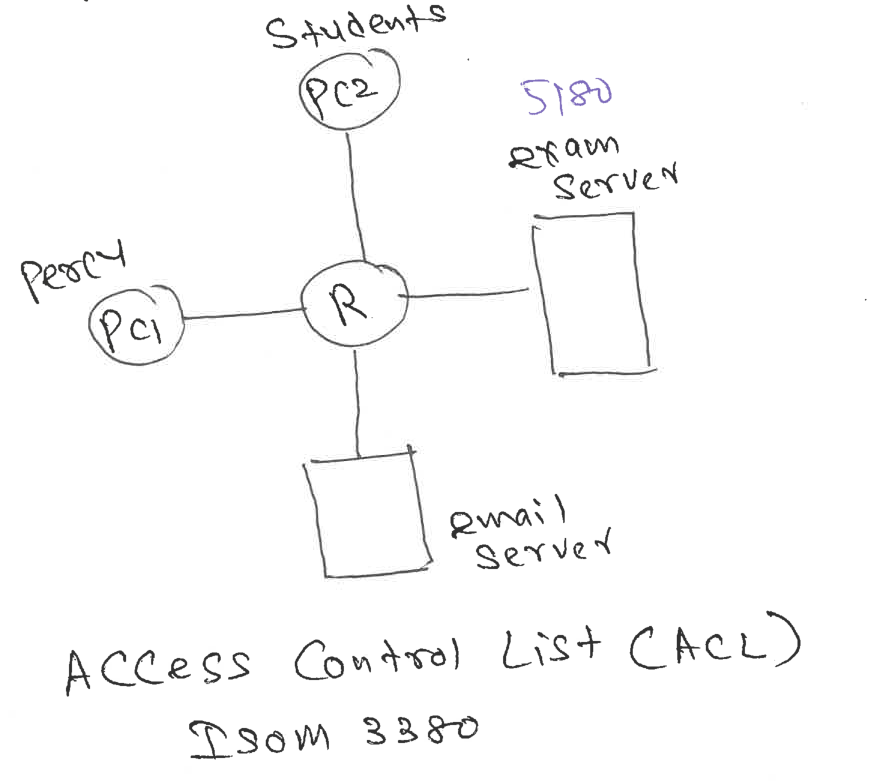

*✍️ ACL 例子：一台路由器 R 连着老师 PC1、学生 PC2、5180 考试服务器和邮件服务器（M1 Supplementary p.2）*

> **✍️ 老师板书：ACL 是什么**
>
> 路由器 R 同时连着 **Percy (PC1)**、**Students (PC2)**、**5180 Exam Server** 和 **Email Server**。如果什么规则都不设，学生也能连上考试服务器——显然不行。
>
> **ACL (Access Control List)** 就是写在路由器（或防火墙）上的一张「谁能去哪」的规则表，例如：
>
> - PC1 (Percy) → Exam Server：**允许**
> - PC2 (Students) → Exam Server：**拒绝**
> - PC1、PC2 → Email Server：**允许**
>
> 路由器按顺序逐条比对每个数据包的地址，命中「允许」就转发，命中「拒绝」就丢弃。老师提到 ACL 的具体配置在 ISOM 3380 里讲过，这门课理解概念即可。

---

## 5. 🟡 Bandwidth（带宽）

> **Bandwidth** is defined as the **amount of information that can flow through a network connection in a given period of time.**  
> 带宽 = 单位时间内一条网络连接能通过的信息量。

单位（Slide 23）：bps → kbps (10³) → Mbps (10⁶) → Gbps (10⁹) → Tbps (10¹²)。注意这里是**十进制 1000 进位**、单位是 **bit**。

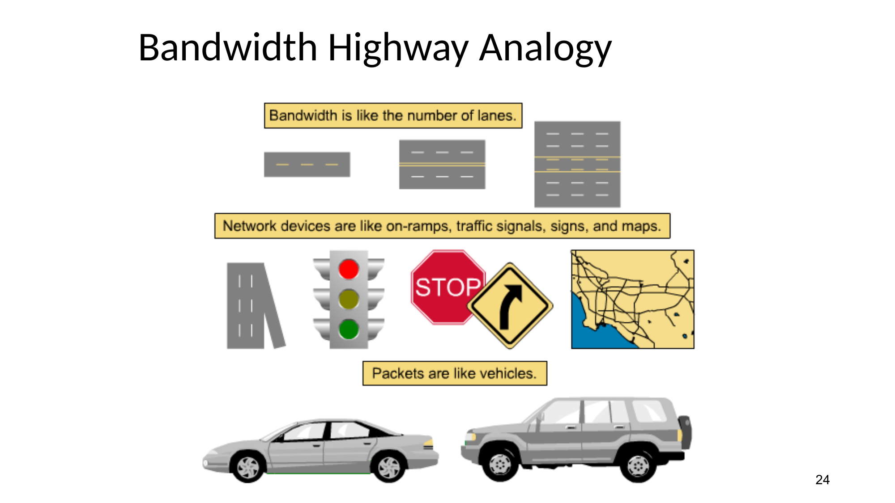

*Bandwidth Highway Analogy：带宽 = 车道数，网络设备 = 匝道、红绿灯、路牌、地图，数据包 = 车（Slide 24）*

| 高速公路                   | 网络                                   |
| ---------------------- | ------------------------------------ |
| 车道数量 (number of lanes) | **Bandwidth** 带宽                     |
| 匝道、红绿灯、路牌、地图           | **Network devices** 网络设备（决定车往哪走、何时走） |
| 汽车 (vehicles)          | **Packets** 数据包                      |

> **➕ 课外补充：带宽 ≠ 实际速度**
>
> - **Bandwidth** 是理论上限（路有几条车道）；**Throughput（吞吐量）** 是实际跑出来的速度（堵车时远小于上限）；**Latency（延迟）** 是一辆车从起点到终点要多久。
> - 所以「带宽很大但网页还是很慢」完全可能——瓶颈可能在延迟、拥塞或服务器。

---

## 6. 🔴 Network Protocols & Layered Models（协议与分层）

### 🟡 协议（Slide 25）

- Communication must follow **a set of rules**；这些规则由 **standards and protocols** 定义。
- **A single standard or protocol defines what a small part of the network does**（一个协议只管一小块）。
- **TCP/IP suite** = 一大组协议的集合，用来把计算机连成网络。

### 🔴 为什么要分层（Slide 26）

数据通信太复杂、难以整体理解 → **把整个通信系统拆成一系列层 (layers)** → **每层只负责一部分**，并且**只和上下相邻的层打交道**。两个最常见的分层模型：**OSI reference model** 和 **TCP/IP reference model**。

### 🔴 OSI 模型的六个好处（Slide 28，适合简答题直接列）

| 英文（课件原文）                             | 中文                |
| ------------------------------------ | ----------------- |
| **Reduces complexity**               | 降低复杂度（大问题拆小问题）    |
| **Standardizes interfaces**          | 统一层与层之间的接口        |
| **Facilitates modular engineering**  | 方便模块化开发（每层可以独立设计） |
| **Ensures interoperable technology** | 保证不同厂商的产品能互通      |
| **Accelerates evolution**            | 加速技术演进（改一层不影响其他层） |
| **Simplifies teaching and learning** | 便于教学与学习           |

> **🎯 考点**
>
> 若问「Why use a layered model?」，至少答出 **complexity ↓、standard interfaces、interoperability（不同厂商互通）、modularity（改一层不影响别层）** 四点，再各举一例（例如：把网线从铜线换成光纤只改变 L1，上面的 HTTP 完全不用动）。
>
> > *"A layered model reduces complexity by dividing communication into smaller functions, standardizes the interfaces between them so that products from different vendors interoperate, and lets each layer evolve independently — for example, replacing copper with fiber changes only the physical layer."*

### 🟢 互联网与 TCP/IP 的诞生（Slide 27）

| 年份       | 事件                                                                                        |
| -------- | ----------------------------------------------------------------------------------------- |
| **1969** | **ARPANET** 上线，第一个 **packet switching network（分组交换网）**，连接 4 个地点的大型机；由美国国防部 (DoD) 资助       |
| —        | 承包商 **BBN (Bolt, Beranek and Newman)** 造出第一台路由器 **IMP (Interface Message Processor)**     |
| **1973** | **Robert Kahn & Vinton Cerf** 开始研发 TCP，用来取代 ARPANET 原来的 **NCP (Network Control Program)** |
| **1978** | TCP 拆成 **TCP 和 IP** 两个协议；之后加入 Telnet、FTP、DNS 等，形成 TCP/IP 协议族                              |

---

## 7. 🔴 OSI 七层模型（逐层功能）

| # | OSI 层            | 做什么                                          | PDU         | 典型设备                   | TCP/IP         |
| - | ---------------- | -------------------------------------------- | ----------- | ---------------------- | -------------- |
| 7 | Application 应用层  | 给用户的应用程序提供网络服务（HTTP, FTP, SMTP, DNS, Telnet） | **Data**    | —                      | Application    |
| 6 | Presentation 表示层 | 数据格式、编码、压缩、加密（ASCII, JPEG, TLS 加密）           | **Data**    | —                      | Application    |
| 5 | Session 会话层      | 建立、管理、终止两台主机之间的会话（NetBIOS, RPC）              | **Data**    | —                      | Application    |
| 4 | Transport 传输层    | 端到端传输：可靠(TCP) 或不可靠(UDP)（TCP, UDP）            | **Segment** | (防火墙会看端口)              | Transport      |
| 3 | Network 网络层      | 逻辑地址(IP) + 选最佳路径（IP, ICMP, RIP, OSPF）        | **Packet**  | Router 路由器             | Internet       |
| 2 | Data Link 数据链路层  | 物理地址(MAC) 访问介质 + 差错检测（Ethernet, PPP）         | **Frame**   | Switch / Bridge 交换机/网桥 | Network Access |
| 1 | Physical 物理层     | 在设备之间传送比特(电、光、电磁波)（网线、光纤、无线电）                | **Bits**    | Repeater / Hub 中继器/集线器 | Network Access |

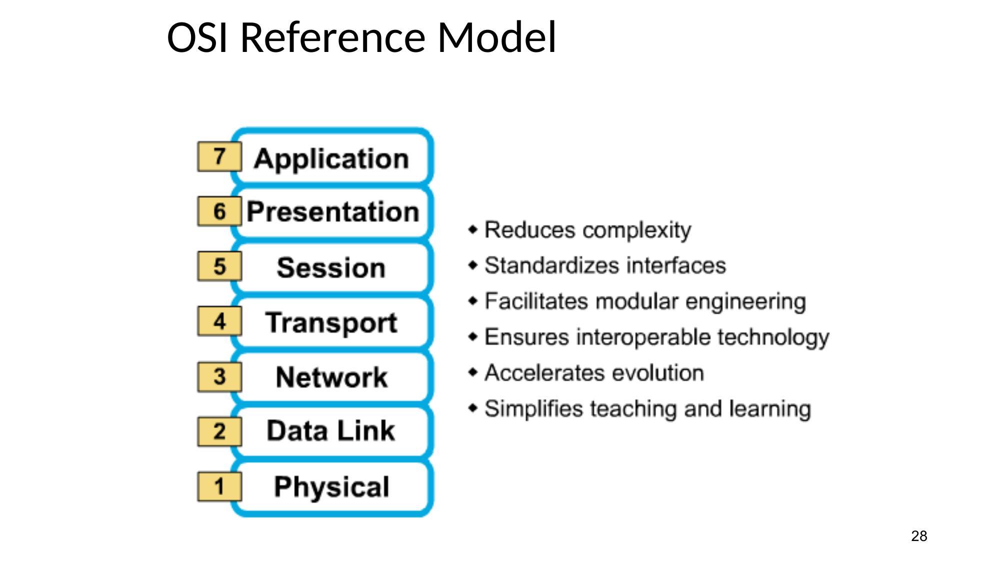

*OSI Reference Model 七层与六个好处（Slide 28）*

| 层                      | 课件标题（原文）                            | 课件要点                                                                                                                                                                    | 小白理解                                  |
| ---------------------- | ----------------------------------- | ----------------------------------------------------------------------------------------------------------------------------------------------------------------------- | ------------------------------------- |
| **7 Application 应用层**  | **Network Process to Applications** | Provides network services to the user's application；User interface；例：Telnet, HTTP, Web browsers                                                                         | 离用户最近，浏览器、邮件客户端通过它用网络                 |
| **6 Presentation 表示层** | **Data Representation**             | 确保一方应用层发出的信息**能被另一方应用层读懂**；How data is presented；**data format, compression and encryption**                                                                            | 翻译官：统一格式、压缩、加解密（呼应老师的 Code/Decode 例子） |
| **5 Session 会话层**      | **Interhost Communication**         | **Establishes, manages, and terminates** sessions between two communicating hosts                                                                                       | 负责「开始通话—保持通话—挂电话」                     |
| **4 Transport 传输层**    | **End-to-End Connection**           | How **reliable** transport between two hosts is accomplished；Reliable or unreliable delivery；例：**TCP, UDP**                                                             | 负责主机到主机的可靠送达（拆段、编号、丢了重发）              |
| **3 Network 网络层**      | **Address and Best Path**           | Connectivity and **path selection** between hosts on **geographically separated networks**；**Logical addressing** which routers use for **path determination**；例：**IP** | 用 IP 地址跨网络找最佳路线——路由器的工作               |
| **2 Data Link 数据链路层**  | **Access to Media**                 | **Physical** (as opposed to logical) addressing；Access to media using **MAC address**；**Error detection**                                                               | 用 MAC 地址在同一网段里送帧，并检查帧有没有坏             |
| **1 Physical 物理层**     | **Binary Transmission**             | **Moves bits** between devices                                                                                                                                          | 把 0/1 变成电、光、电磁信号送出去                   |

> **🧠 记忆口诀**
>
> 从上往下（7→1）：**A**ll **P**eople **S**eem **T**o **N**eed **D**ata **P**rocessing  
> 从下往上（1→7）：**P**lease **D**o **N**ot **T**hrow **S**ausage **P**izza **A**way  
> 每层一个关键词：7 应用 · 6 格式/加密 · 5 会话 · 4 **端到端可靠** · 3 **IP + 选路** · 2 **MAC + 检错** · 1 **比特**

### 🔴 Layer 4 的 TCP 做了什么（Slide 33）

- **TCP breaks large data into segments**（把大数据切成段）
- **TCP marks each data packet with a sequence number**（每段编号）
- **A missing packet can be resent**（丢了可以重发）→ 这就是 "reliable delivery"

> **➕ 课外补充：TCP vs UDP（Slide 32 只点了名字）**
>
> |     | **TCP** Transmission Control Protocol | **UDP** User Datagram Protocol |
> | --- | ------------------------------------- | ------------------------------ |
> | 可靠性 | **Reliable**：编号、确认、丢包重发               | **Unreliable**：发出去就不管          |
> | 连接  | 先建立连接（三次握手）                           | 无连接                            |
> | 速度  | 慢一些，开销大                               | 快，开销小                          |
> | 适合  | 网页、邮件、文件传输                            | 视频通话、直播、DNS 查询、游戏              |

### 🔴 L2 物理地址 vs L3 逻辑地址

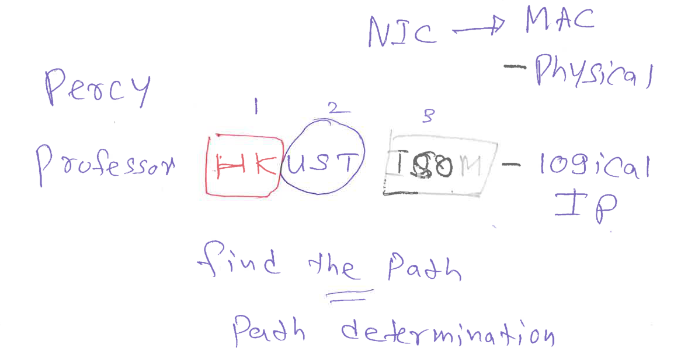

*✍️ NIC → MAC（Physical）；HK · UST · ISOM 这种分级地址 → IP（Logical）；Find the path = Path determination（M1 Supplementary p.8）*

> **✍️ 老师板书：名字 vs 地址**
>
> - **MAC 地址 = 你的名字**（"Percy"）：烧在**网卡 (NIC)** 上，跟着设备走，是 **physical address**。它能在一个房间里叫到你，但**不能告诉别人你在哪**。
> - **IP 地址 = 你的通信地址**（"Professor, **HK** → **UST** → **ISOM**"）：像 ①地区 ②学校 ③系 这样**分级 (hierarchical)**，是 **logical address**。它告诉路由器「先往香港走，再找科大，再找 ISOM」——这就是 **find the path = path determination（选路）**，也就是第 3 层的工作。

|      | **MAC 地址（L2）**     | **IP 地址（L3）**                  |
| ---- | ------------------ | ------------------------------ |
| 性质   | **Physical** 物理地址  | **Logical** 逻辑地址               |
| 在哪   | 出厂时烧在 NIC 上        | 由管理员或 DHCP 分配，换网络就会变           |
| 长度   | 48 bits（12 个十六进制数） | IPv4 = 32 bits（如 192.168.1.10） |
| 谁用它  | **Switch** 交换机     | **Router** 路由器                 |
| 作用范围 | 本地网段内送帧            | 跨网络找路                          |

---

## 8. 🔴 TCP/IP Protocol Suite（TCP/IP 协议族）

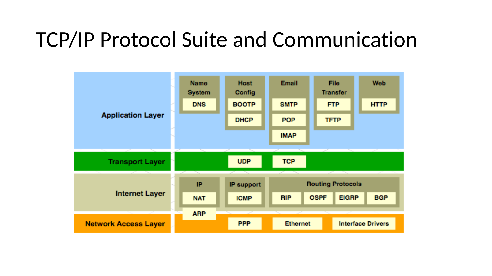

*TCP/IP 四层与各层常见协议（Slide 37）*

| TCP/IP 层                 | 对应 OSI    | 课件列出的协议                                                                                                                         |
| ------------------------ | --------- | ------------------------------------------------------------------------------------------------------------------------------- |
| **Application Layer**    | 5 + 6 + 7 | Name System: **DNS** · Host Config: **BOOTP, DHCP** · Email: **SMTP, POP, IMAP** · File Transfer: **FTP, TFTP** · Web: **HTTP** |
| **Transport Layer**      | 4         | **UDP, TCP**                                                                                                                    |
| **Internet Layer**       | 3         | **IP** · IP support: **NAT, ICMP** · Routing Protocols: **RIP, OSPF, EIGRP, BGP** · （**ARP** 画在 Internet 与 Network Access 的交界）  |
| **Network Access Layer** | 1 + 2     | **PPP, Ethernet, Interface Drivers**                                                                                            |

> **⚠️ 踩坑提醒**
>
> - **ARP** 在图里跨在 Internet 层和 Network Access 层之间：它的工作是「已知 IP，查对应的 MAC」，正好连接 L3 和 L2。
> - OSI 是**参考模型**（用来讲道理），TCP/IP 是**实际在用**的协议族。题目问「how many layers」要看清问的是哪个模型：**OSI = 7，TCP/IP = 4**。

---

## 9. 🔴 Encapsulation & De-encapsulation（封装与解封装）

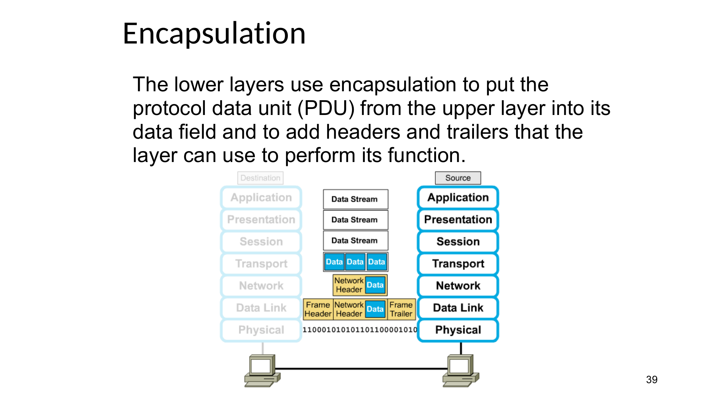

*数据从 Source 往下走：每层加上自己的 header（数据链路层还加 trailer）（Slide 39）*

> **Encapsulation**：The lower layers use encapsulation to put the **protocol data unit (PDU)** from the upper layer into its data field and to **add headers and trailers** that the layer can use to perform its function.  
> 封装 = 下层把上层交下来的 PDU 整个装进自己的「数据区」，再加上本层需要的头部（和尾部）。

### 🔴 各层数据的名字（PDU，Slide 40）

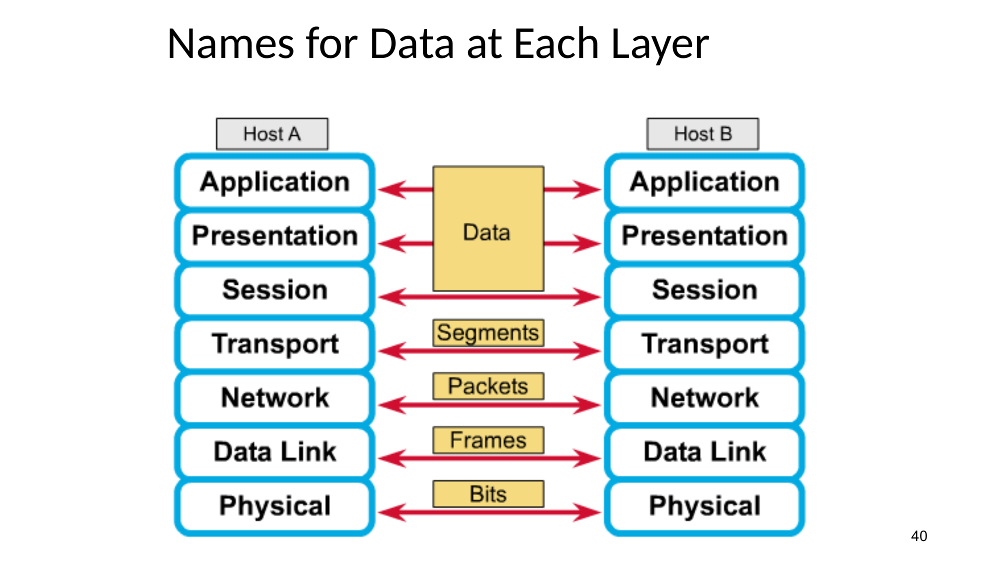

*Names for Data at Each Layer（Slide 40）*

| 层           | PDU 名称         | 加了什么                                                |
| ----------- | -------------- | --------------------------------------------------- |
| 7 / 6 / 5   | **Data**       | —（应用数据本身）                                           |
| 4 Transport | **Segments** 段 | TCP/UDP header（端口号、序号）                              |
| 3 Network   | **Packets** 包  | IP header（源 IP、目的 IP）                               |
| 2 Data Link | **Frames** 帧   | Frame header（源 MAC、目的 MAC）+ **Frame trailer (FCS)** |
| 1 Physical  | **Bits** 比特    | 变成 0101… 信号                                         |

> **🧠 记忆口诀**
>
> 从 L4 到 L1：**S**egment → **P**acket → **F**rame → **B**it —— 「**S**ome **P**eople **F**ear **B**irthdays」。只有**数据链路层同时加头和尾**（trailer 里是 FCS）。

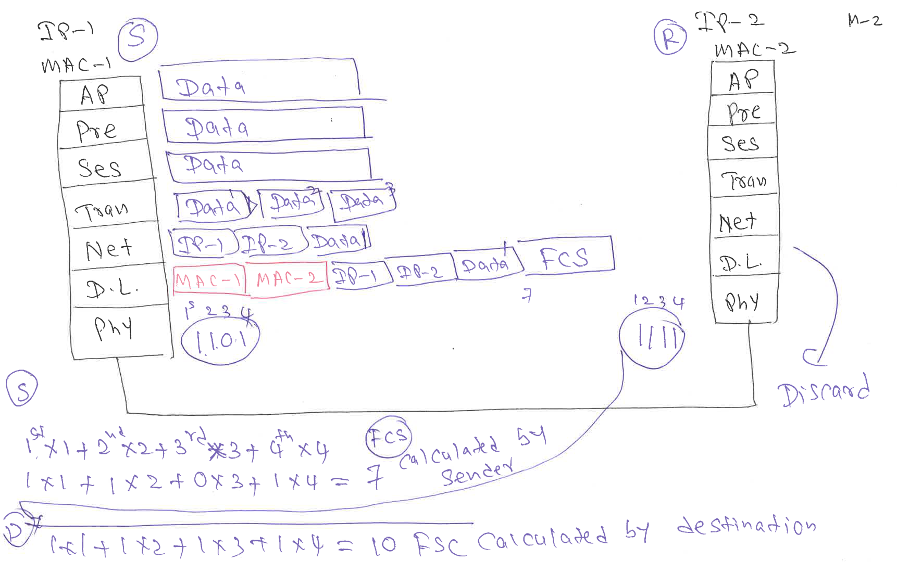

*✍️ Sender S (IP-1, MAC-1) → Receiver R (IP-2, MAC-2)：逐层封装 + FCS 校验（M1 Supplementary p.9）*

> **✍️ 老师板书：一份数据是怎么被打包的**
>
> 发送方 **S**（IP-1 / MAC-1）要把数据发给接收方 **R**（IP-2 / MAC-2）：
>
> 1. **AP / Pre / Ses**（应用、表示、会话层）：都叫 **Data**，形状基本不变。
> 2. **Tran**（传输层）：大块数据被切成 **Data 1、Data 2、Data 3**，每段编号 → **segments**。
> 3. **Net**（网络层）：每段前面加上 **IP-1（源）+ IP-2（目的）** → **packet**。
> 4. **D.L.**（数据链路层）：再加上 **MAC-1（源）+ MAC-2（目的）** 作为 header，末尾加 **FCS** 作为 trailer → **frame**。
> 5. **Phy**（物理层）：变成比特 `1 1 0 1…` 发上线路。
>
> **FCS (Frame Check Sequence) 小例子**：老师用一个简化算法——每一位乘以它的位置再加起来。
>
> - 发送方：`1×1 + 1×2 + 0×3 + 1×4 = 7`，把 7 写进 FCS 一起发出去。
> - 线路干扰把第 3 位从 0 打成 1，接收方收到 `1 1 1 1`，自己重算：`1×1 + 1×2 + 1×3 + 1×4 = 10`。
> - **10 ≠ 7 → Discard（丢弃这一帧）**。这就是 Layer 2 的 **error detection**。
>
> （真实以太网用的是 **CRC-32** 算法，但原理一样：双方算同一个函数，结果对不上就说明数据坏了。）

*（网页版此处可交互：改发送的比特、选择被干扰的位，观察接收方重算的 FCS 是否一致）*

### 🟡 De-encapsulation（Slide 41）

接收方从下往上拆包。以数据链路层为例，收到 frame 后：

1. **Reads the physical address and other control information** provided by the directly connected peer data link layer（读对方 L2 写的 MAC 地址等控制信息）；
2. **Strips the control information**（把本层的头尾剥掉），把剩下的 packet 交给上一层。

> **🎯 考点**
>
> **Peer-to-peer 思想**：发送方第 N 层加的 header，只有接收方**同一层**会读、会拆。答「封装的意义」时要点：**每层只处理自己的 header，把上层的内容当成不透明的数据**——这正是分层模型能「模块化」的原因。

---

## 10. 🟡 Physical Topology（物理拓扑）

> **Physical topology is the actual layout of the wire or media.**（线缆 / 介质的实际布局）

课件只写了 **Star（星型）**：

- **Most commonly used in Ethernet LAN**（以太网局域网最常用）
- Central connection point can be a **hub, switch or router**, and might be desirable for **security or restricted access**（中心设备方便统一管控）
- **If the central device fails, the whole network becomes disconnected**（中心设备 = 单点故障）

老师在板书上补充了其他三种拓扑：

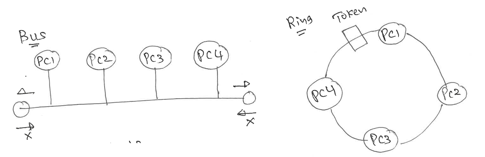

*✍️ Bus（两端有终结器，信号到头不反弹）与 Ring（令牌 Token 沿环传递）（M1 Supplementary p.2）*

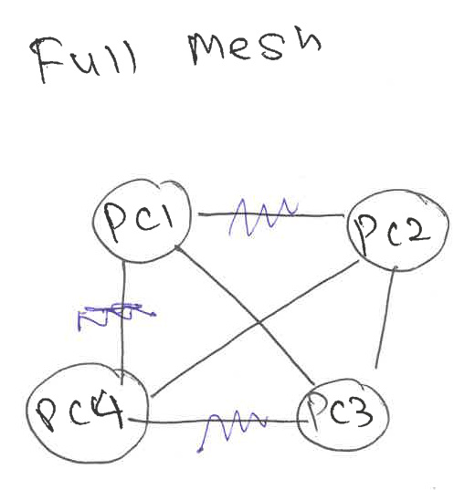

*✍️ Full mesh：每两台设备之间都有一条线（M1 Supplementary p.3）*

| 拓扑                | 布局                                                       | 优点                | 缺点                                         |
| ----------------- | -------------------------------------------------------- | ----------------- | ------------------------------------------ |
| **Bus 总线**        | 所有设备挂在一根主干线上，**两端要装终结器 (terminator)**，吸收信号、防止反射（板书两端的 ×） | 布线简单、便宜           | 共享介质 → 同时发送会**冲突 (collision)**；主干一断全网断     |
| **Ring 环型**       | 设备首尾连成环，**拿到令牌 (token) 的设备才能发送**                         | 轮流发，没有冲突          | 一个节点坏可能影响整个环                               |
| **Star 星型**       | 所有设备连到中心设备                                               | 易管理、易排障、一根线坏只影响一台 | **中心设备是单点故障**                              |
| **Full Mesh 全网状** | 每两台设备之间都直连                                               | 冗余最高，任何一条线断了都能绕路  | 线太多、成本高：n 台设备需要 **n(n−1)/2** 条线（4 台 = 6 条） |

> **⚠️ 踩坑提醒**
>
> 板书里 full mesh 的两条边画成了**锯齿线**——那是第 2 节拓扑图里 **wireless media** 的符号，意思是连线不一定是网线，也可以是无线链路。

---

## 11. 🔴 Networking Devices：从 Repeater 到 Switch（为什么需要交换机）

这一块是老师上课反复强调的重点。设备是按一条**演化线**讲的，每一代都在解决上一代的问题：

```
Repeater（信号会衰减 → 重新生成信号）
   → Hub（多端口的 Repeater，但所有端口一起收 → collision）
      → Switch（用 MAC address table 定向转发 → 基本消灭 collision）
         → Router（跨网络：用 IP address + routing table 选路）
```

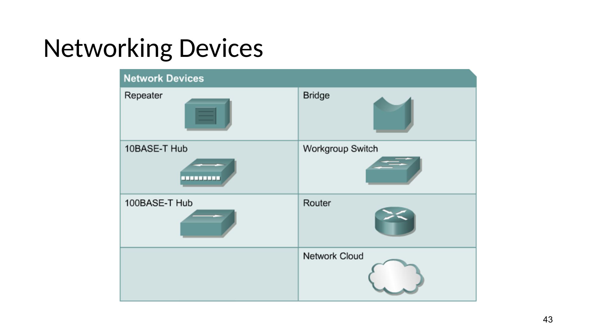

*课件里的设备图标：Repeater、Hub、Bridge、Workgroup Switch、Router、Network Cloud（Slide 43）*

### 🟡 Repeater 中继器 — Layer 1（Slide 44–47）

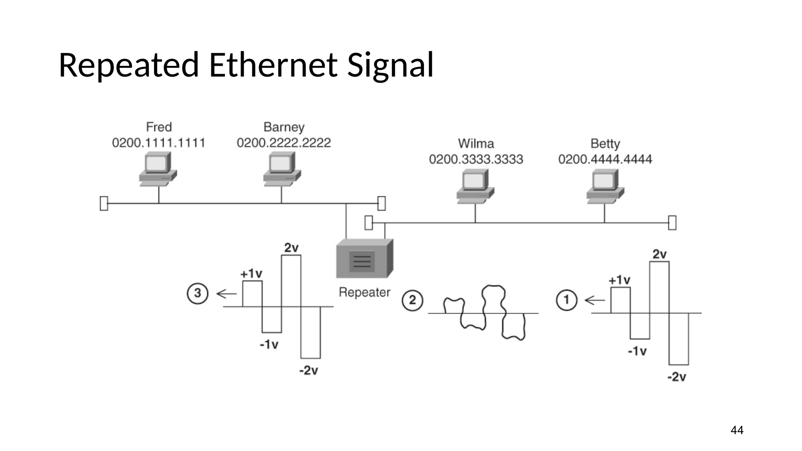

*Betty 发出干净信号 ① → 到中继器时已经变形 ② → 中继器重新生成干净信号 ③（Slide 44）*

- **When a signal is sent over a wire, it degrades**（信号在线上会衰减、变形）
- 为了**延长 LAN 的距离**而发明；通常只有**两个端口**，连接两段以太网
- **Interpreted the incoming signal as 1's and 0's, sent a regenerated clean signal out the other port**
- 它**只认识比特**，不看任何地址 → **Layer 1 device**

### 🔴 Hub 集线器 — Layer 1：什么都往外发，于是会撞

- **Regenerate signals** · **Used as network concentration points** · **Multiport repeater**（多端口的中继器）· **Layer 1 device**
- Hub 不看地址，**从一个口收到信号，就从其他所有口发出去**——相当于每一帧都 flood 给所有人。

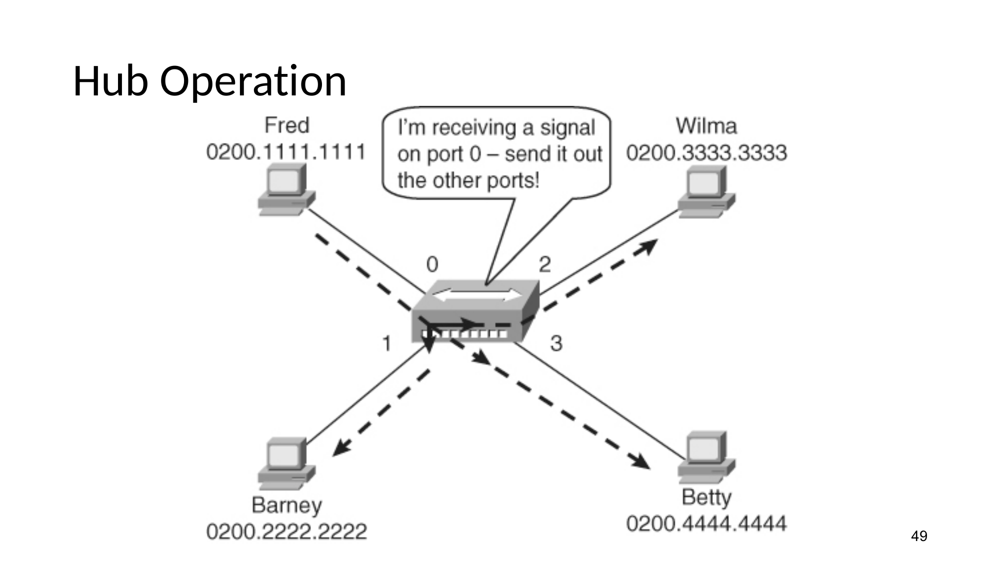

*Hub Operation：「我在 0 号口收到信号——从其他所有口发出去！」（Slide 49）*

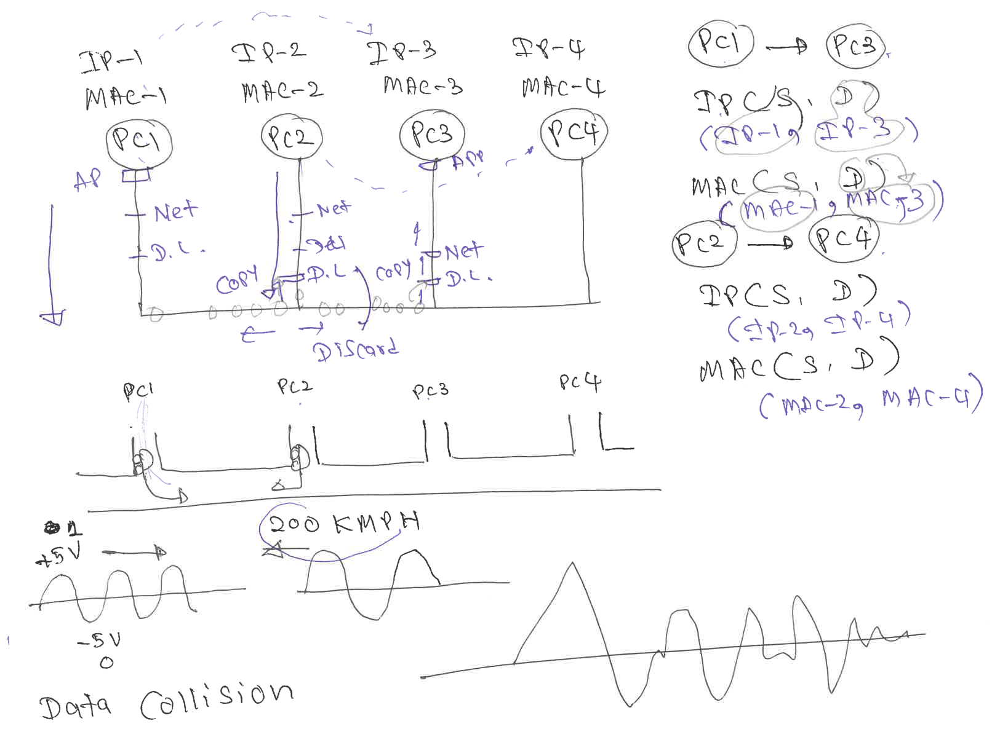

*✍️ 共享介质上：PC1 → PC3 时每台 PC 都会收到并复制这一帧；PC1 和 PC2 同时发送就会冲突（M1 Supplementary p.10）*

> **✍️ 老师板书：共享介质上发生了什么**
>
> 四台 PC 挂在同一根总线（或同一个 Hub）上，每台都有自己的 IP 和 MAC。
>
> **PC1 → PC3**：`IP (S, D) = (IP-1, IP-3)`，`MAC (S, D) = (MAC-1, MAC-3)`
>
> - 信号沿线传播，**每台 PC 的网卡都会把帧复制 (copy) 到自己的数据链路层**；
> - PC2 看目的 MAC 是 MAC-3，不是自己 → **Discard 丢弃**；
> - PC3 看目的 MAC 是自己 → 交给网络层 → 一路往上交给应用 (APP)。
>
> **Data collision 数据冲突**：如果 PC2 → PC4 **同时**发送，两路电信号（在 +5V 和 −5V 之间摆动）在线上**叠加**，变成一团乱码波形，谁都收不到。信号跑得很快（老师类比「200 km/h」），但只要两台同时发就会撞上。
>
> → Hub / Bus 上**所有设备处在同一个 collision domain（冲突域）**，设备越多冲突越频繁。**这就是交换机出现的原因。**

> **➕ 课外补充：CSMA/CD 与冲突域**
>
> - 早期共享以太网用 **CSMA/CD**（Carrier Sense Multiple Access with Collision Detection）：发之前先听线上有没有人在发；发现冲突就停下，随机等一会儿再重发。
> - **Collision domain（冲突域）**：同时发送会互相冲突的一组设备。Hub 的所有端口 = **1 个冲突域**；Switch 的**每个端口 = 1 个独立冲突域**。
> - 安全角度：Hub 把每一帧发给所有人，**任何一台接在 Hub 上的电脑都能嗅探 (sniff) 别人的流量**——这是 Hub 被淘汰的另一个原因。

---

## 12. 🔴 Switch 交换机 — Layer 2 与 MAC Address Table

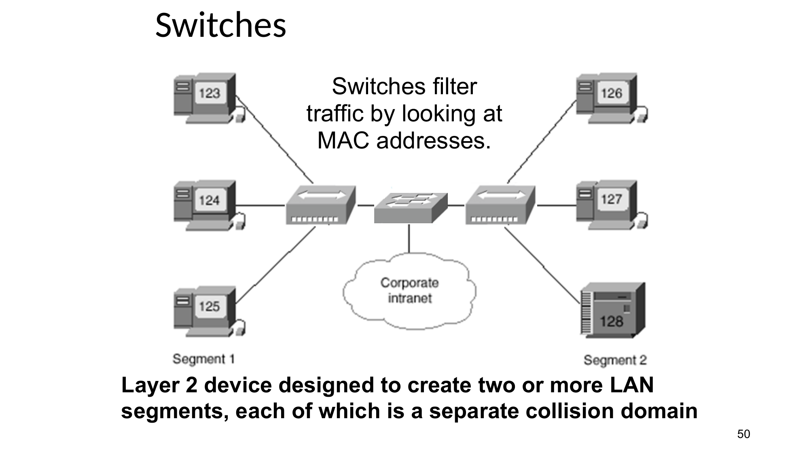

*Switches filter traffic by looking at MAC addresses（Slide 50）*

> A **Layer 2 device** designed to create two or more LAN segments, **each of which is a separate collision domain**. Switches **filter traffic by looking at MAC addresses**.

- 交换机是 **Data Link Layer（第 2 层）** 设备 → 所以它认的是 **MAC address（物理地址）**，不看 IP。
- Filter traffic on a LAN to **keep local traffic local** yet allow connectivity to other parts
- Keep track of which MAC addresses are on each side and make forwarding decisions based on the **MAC address table**

### 🔴 MAC Address Table 的三列

这张表有好几个名字，**说的是同一个东西**：**MAC address table = switching table = CAM table**（CAM = Content Addressable Memory，是 Cisco 的叫法，Slide 58）。

| MAC address | Port         | Time stamp            |
| ----------- | ------------ | --------------------- |
| 这台主机的物理地址   | 从交换机哪个端口能找到它 | 最后一次看到它**作为源地址**发帧的时间 |
| MAC-F       | E0           | 4:50                  |
| MAC-Q       | E1           | 4:45                  |

### 🔴 为什么需要 Time stamp（老化 aging）

每次交换机看到某个 MAC **作为源地址**发帧，就把它的时间戳**刷新**成当前时间；**一条记录超过 aging time（板书写 5 分钟，Cisco 默认 300 秒）没被刷新，就会被删除**。为什么要这样：

1. **主机会移动、关机、换网卡**：笔记本从 E0 拔下来插到 E3，或者直接关机走人。如果旧记录永远留着，发给它的帧会一直被送到**错误的端口**（等于被黑洞吞掉）。有了老化，旧记录自动过期；下一帧找不到记录就 flood，对方一回复就重新学到正确端口。
2. **表的容量有限**：CAM 是专用高速内存，条目数有上限。不删不活跃的记录，表会被塞满，新主机学不进去。
3. **只保留「活着的」信息**：时间戳让交换机知道哪条记录是最近还在用的，表永远反映网络的当前状态。

> **💡 小白理解**
>
> 把 MAC 表想成前台的**访客登记本**：每次有人从某个门进来就登记「谁 · 哪个门 · 几点」；再次出现就更新时间；很久没出现的就划掉。时间戳就是用来判断「这条登记还算不算数」的。

### 🔴 表是动态学出来的：用 Source 学，用 Destination 决策

MAC 表是 **dynamic** 的：交换机刚开机时表是空的，**不需要人去配置**，它在每次通信时**一点点自己补全**。

> **用源 MAC 学习，用目的 MAC 决策。**
>
> - **Learn（学习）**：Examine the **source MAC address** of the frame and the **interface on which it was received** → add them to the table（Slide 54）
> - **Decide（决策）**：Look up the **destination MAC address** in the switching table → filter, flood or forward（Slide 51）

为什么是用 **Source** 学？因为帧是从哪个端口**进来**的，交换机是亲眼看到的——「MAC-F 从 E0 进来」说明 F 就在 E0 那一侧。目的地址它没法这样确认，所以只用来**查表**。

| 决策             | 什么时候                                        | 做法                         |
| -------------- | ------------------------------------------- | -------------------------- |
| **Flood 泛洪**   | 目的 MAC **不在表里**（unknown unicast），或目的是**广播** | 从**除了进来的端口以外的所有端口**发出      |
| **Forward 转发** | 目的 MAC 在表里，且对应端口**不是**进来的端口                 | 只从**那一个正确端口**发出            |
| **Filter 过滤**  | 目的 MAC 在表里，且对应端口**就是**进来的端口                 | **不转发**（对方和发送方在同一网段，已经收到了） |

> **🧠 记忆口诀**
>
> **不在 → Flood；知道 → Forward；同一个口 → Filter。** 学习只看 Source，决策只看 Destination。

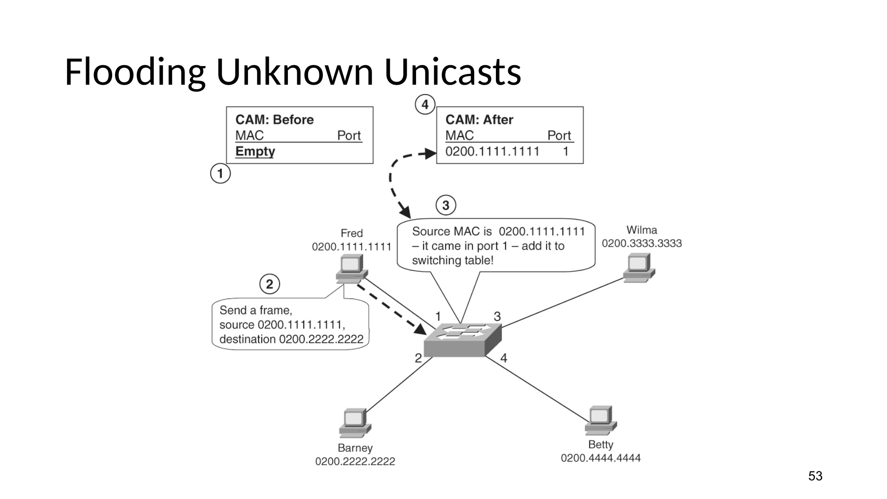

*Flooding Unknown Unicasts：CAM 表一开始是空的 → Fred 从 1 号口发帧 → 交换机记下 0200.1111.1111 在 1 号口 → 不知道 Barney 在哪，只能泛洪（Slide 53）*

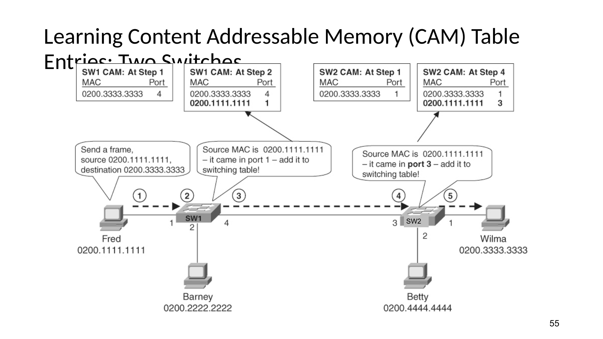

*两台交换机：SW1 学到 Fred 在 1 号口；SW2 学到 Fred 在 3 号口（从 SW1 那条线进来的）（Slide 55）*

> **⚠️ 踩坑提醒**
>
> Slide 55 的关键：**在 SW2 眼里，Fred 在 3 号口**——交换机只记录「这个 MAC 从我哪个口进来」，不知道也不关心对方真实在多远。一个端口后面可以对应很多个 MAC（接着另一台交换机或 Hub）。

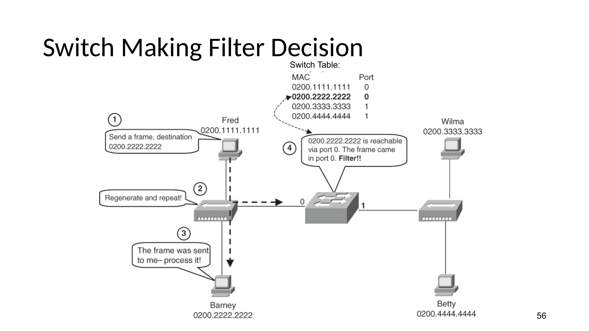

*Filter：Fred 发给 Barney，两人都在 0 号口那一侧 → 交换机不转发（Slide 56）*

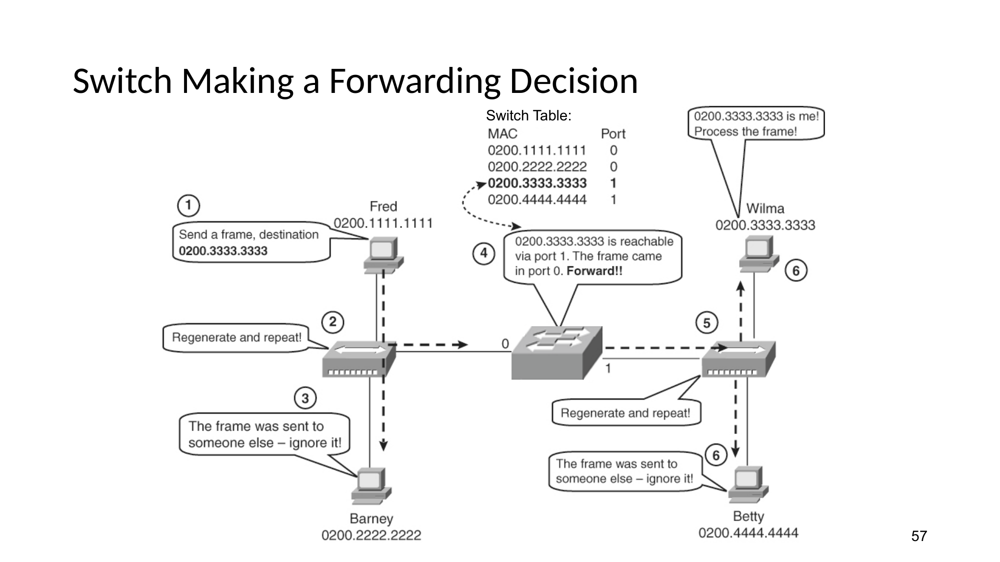

*Forward：Fred 发给 Wilma，Wilma 在 1 号口 → 只从 1 号口转发（Slide 57）*

### 🔴 老师板书：完整走一遍 MAC 表

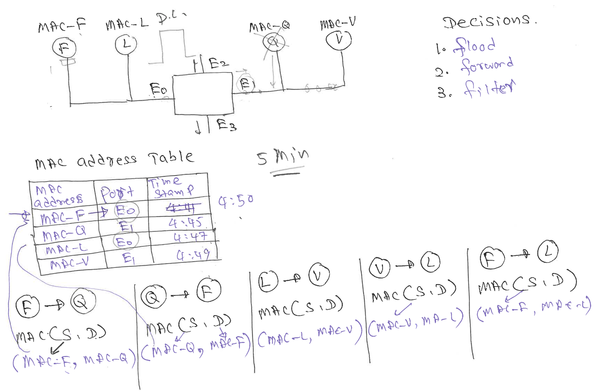

*✍️ 交换机四个口 E0–E3；F、L 在 E0 那一侧，Q、V 在 E1 那一侧；MAC 表含 Time stamp，5 分钟老化（M1 Supplementary p.4）*

交换机 E0 口外接一段共享线路（上面有 F、L 两台主机），E1 口外接另一段（上面有 Q、V）。表一开始是空的，依次发送 5 帧：

| # | 时间   | 帧 MAC (S, D)   | 学到了什么（看 Source）                    | 查目的 MAC（看 Destination） | 决策                     |
| - | ---- | -------------- | ---------------------------------- | ---------------------- | ---------------------- |
| 1 | 4:41 | (MAC-F, MAC-Q) | **新增** MAC-F → E0                  | Q 不在表里                 | **Flood**（发往 E1、E2、E3） |
| 2 | 4:45 | (MAC-Q, MAC-F) | **新增** MAC-Q → E1                  | F 在 E0 ≠ 进来的 E1        | **Forward**（只发 E0）     |
| 3 | 4:47 | (MAC-L, MAC-V) | **新增** MAC-L → E0                  | V 不在表里                 | **Flood**              |
| 4 | 4:49 | (MAC-V, MAC-L) | **新增** MAC-V → E1                  | L 在 E0 ≠ 进来的 E1        | **Forward**（只发 E0）     |
| 5 | 4:50 | (MAC-F, MAC-L) | MAC-F 已存在 → **时间戳从 4:41 刷新为 4:50** | L 在 E0 = 进来的 E0        | **Filter**             |

第 5 帧同时演示了两件事：**时间戳刷新**（F 又出现了，记录继续有效）和 **Filter**。板书里 MAC-Q 被划掉，是在演示**老化**：主机长时间不发帧，它的记录就会被删除（下面的小实验可以点「过 5 分钟」看效果）。

*（网页版此处是可交互的交换机演示；下表是同一套规则算出的结果）*

| # | 时间   | 帧     | 学习             | 决策                     |
| - | ---- | ----- | -------------- | ---------------------- |
| 1 | 4:41 | F → Q | MAC-F @ E0（新增） | **Flood → E1, E2, E3** |
| 2 | 4:45 | Q → F | MAC-Q @ E1（新增） | **Forward → E0**       |
| 3 | 4:47 | L → V | MAC-L @ E0（新增） | **Flood → E1, E2, E3** |
| 4 | 4:49 | V → L | MAC-V @ E1（新增） | **Forward → E0**       |
| 5 | 4:50 | F → L | MAC-F @ E0（刷新） | **Filter**             |

### 🔴 Switching Frames：完整决策算法（Slide 67，可能直接考步骤）

1. A frame is received.（收到一帧）
2. If the destination is a **broadcast**, forward on all ports **except the port in which the frame was received**.（广播 → 除入口外全部发）
3. If the destination is a **unicast** and the address is **not in the address table**, forward on all ports except the incoming port.（未知单播 → 泛洪）
4. If the destination is a unicast and the address **is in the table**, and the associated interface is **not** the incoming interface, forward the frame out **the one correct port**.（已知 + 不同口 → 转发）
5. **Otherwise, filter** (do not forward) the frame.（已知 + 同一个口 → 过滤）

### 🔴 交换机怎么避免 Collision：四种机制

MAC 表只是其中一种。交换机一共有四个办法，**有的在交换机内部起作用，有的在端口 / 链路上起作用**。下图左边是 Hub 上冲突会发生的地方，右边是交换机在同样位置用的办法（字母一一对应）：

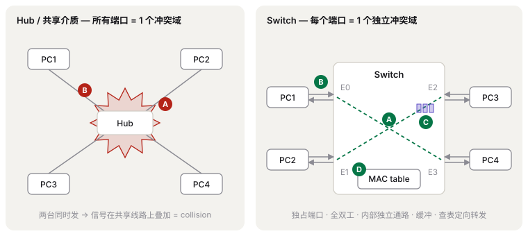

| 标记    | 冲突在哪里发生（Hub）                                  | 交换机怎么防                                                             | 位置      |
| ----- | --------------------------------------------- | ------------------------------------------------------------------ | ------- |
| **A** | 共享介质：多台主机挂在同一根线 / 同一个 Hub 上，两台同时发就撞           | Microsegmentation + Dedicated paths：每台主机独占一个交换机端口；交换机内部每对端口之间有独立通路 | 端口 + 内部 |
| **B** | 链路上：半双工 (half duplex) 时同一根线不能同时收和发，主机和端口同时发就撞 | Full duplex：发送和接收各走一对线，可以同时进行                                      | 端口 / 链路 |
| **C** | 多台主机同时发给同一台（同一个出口端口），出口只能一次发一帧                | Buffering：先把帧存进交换机内存 (frame buffers)，再一帧一帧转发                       | 内部（内存）  |
| **D** | Hub 把每一帧发给所有端口，线路上的无关流量越多，越容易撞                | MAC address table：只从目的端口发出 (forward)，同一端口的直接丢弃 (filter)            | 内部（决策）  |

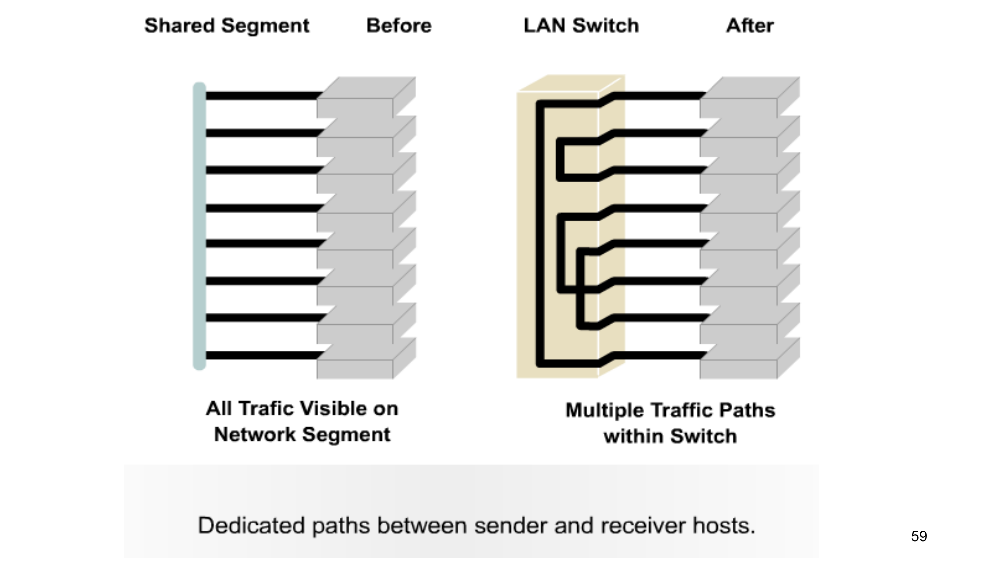

*Dedicated paths / microsegmentation — Before：共享网段上所有流量对所有人可见；After：交换机内部给每对主机独立通路（Slide 59）*

**LAN Switches**（Slide 58）：

- 用 **table of MAC addresses (switching table)** 决定帧该发往哪个网段
- **Give each host the medium's full bandwidth (microsegmentation)** —— 每台主机独享一个端口的全部带宽（不再和别人分）
- **Improve network performance: speed and bandwidth**

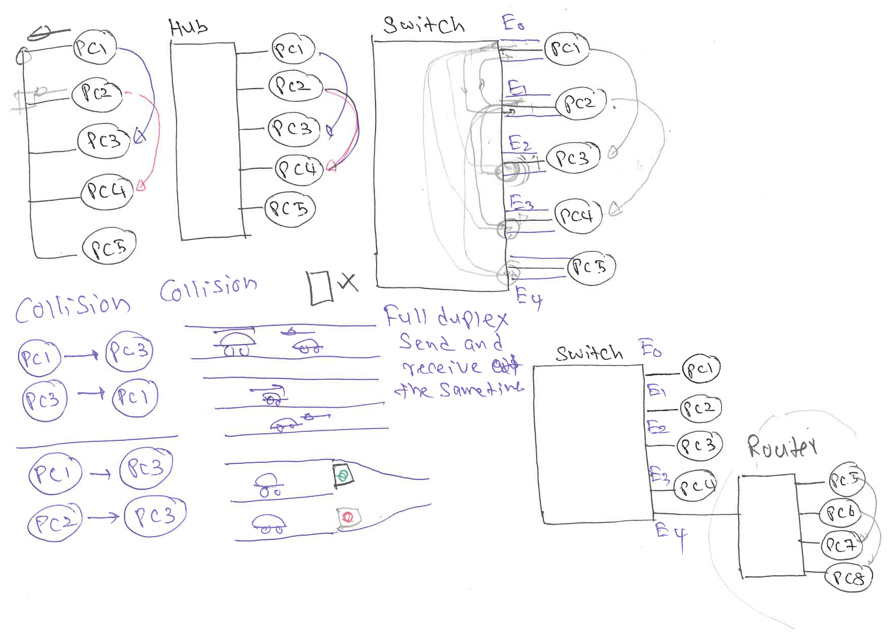

*✍️ 左：Bus / Hub 上 PC1→PC3 和 PC2→PC4 同时发会冲突；右：Switch 内部有独立通路；下：全双工双车道 与 缓冲红绿灯（M1 Supplementary p.5）*

> **✍️ 老师板书：Bus / Hub vs Switch**
>
> 1. **Bus 和 Hub**：PC1→PC3 和 PC2→PC4 同时发 → **Collision**（都在同一个冲突域）。
> 2. **Switch — dedicated paths**：PC1→PC3 走 E0→E2，PC2→PC4 走 E1→E3，交换机内部是**不同的通路**，互不干扰 → **没有冲突**。
> 3. **Full duplex（全双工）= send and receive at the same time**：像双向车道，PC1→PC3 和 PC3→PC1 可以同时进行。（Hub 只能 half duplex，同一时间只能一个方向。）
> 4. **Buffering**：真正会「撞」的情况是 **PC1→PC3 和 PC2→PC3 同时发给同一台**——两条车道并入一条。交换机像红绿灯一样**先把一帧存起来**，一帧一帧地放行。
> 5. 交换机 E4 口接上一台 **Router**，Router 后面是 PC5–PC8 的另一个网络：跨网络就要靠路由器（第 13 节）。

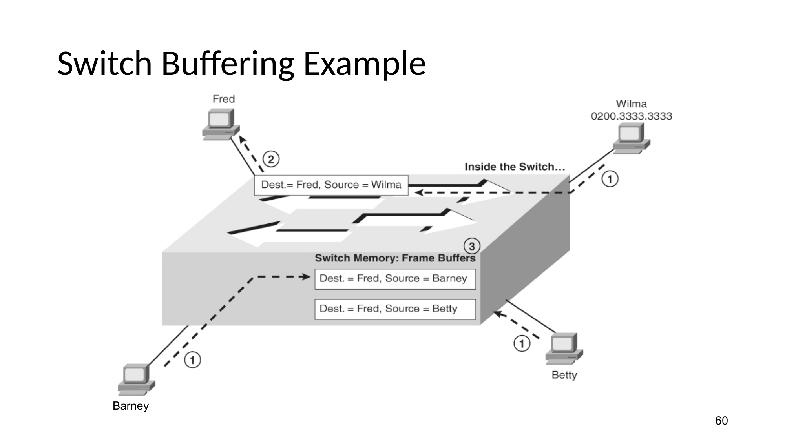

*Switch Buffering Example：Wilma 发给 Fred 的同时，Barney 和 Betty 也发给 Fred → 先存进 Frame Buffers，再逐个转发（Slide 60）*

**Preventing Collisions with Switch Buffering**（Slide 61）：Switches prevent collisions by **buffering frames**. If several PCs send frames to the **same address at the same time**, the switch **holds the frames in memory** — a process called **buffering** — and then **forwards the frames one at a time**.

### 🟡 所以 Switch 是「最好」的 LAN 设备

四个机制加在一起：**每台主机独占端口 + 全双工 + 内部独立通路 + 缓冲 + 查表定向转发** → 在「一台主机一个端口、全双工」的正常接法下，**collision 不会再发生**，每台主机都能用满端口带宽。这就是 Switch 取代 Hub 的原因。

> **⚠️ 踩坑提醒**
>
> 两个细节，答题时写上会更完整：
>
> - 交换机消灭的是**端口之间**的冲突。如果某个端口外面接的是一个 **Hub 或共享线路**（比如板书里 E0 外面挂着 F 和 L），那一段内部**照样会冲突**——交换机只是把冲突**限制在那一个端口里**（每个端口 = 一个冲突域）。
> - 交换机**隔离冲突域，但不隔离广播域**：广播帧（目的 MAC 全 F）还是会被 flood 到所有端口。隔离广播要靠 **Router**。

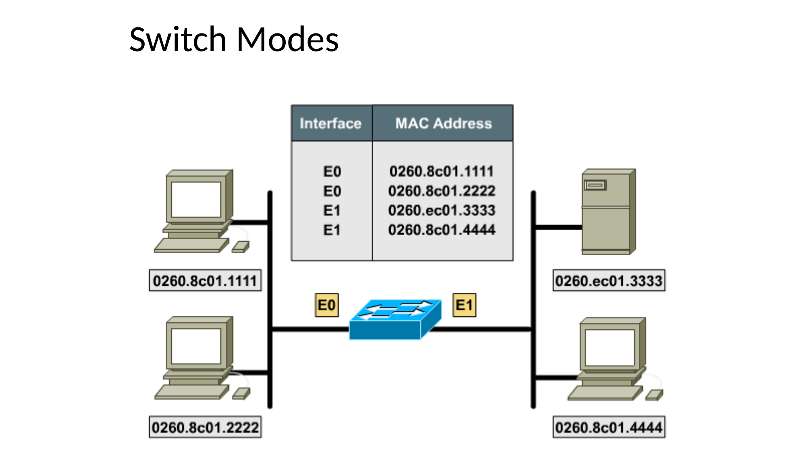

*Switch Modes 页：交换机表记录 Interface ↔ MAC Address（E0 后面两台，E1 后面两台）（Slide 66）*

> **➕ 课外补充：交换机的三种转发模式 (Switching Modes)**
>
> Slide 66 标题是 *Switch Modes*，但图里只画了 MAC 表。教科书里的 switching modes 指的是交换机**收多少再转发**：
>
> | 模式                         | 做法                  | 特点               |
> | -------------------------- | ------------------- | ---------------- |
> | **Store-and-forward** 存储转发 | 收完整帧，**检查 FCS** 再转发 | 最可靠，坏帧会被丢弃；延迟稍高  |
> | **Cut-through** 直通         | 读到目的 MAC 就开始转发      | 延迟最低，但可能把坏帧也转发出去 |
> | **Fragment-free** 无碎片      | 读完前 64 字节再转发        | 折中：能过滤大多数冲突碎片    |

> **➕ 课外补充：MAC flooding 攻击（安全课会回来讲）**
>
> MAC 表（CAM 表）容量有限。攻击者用工具**伪造大量不同的源 MAC** 狂发帧，把表塞满；合法主机的记录挤不进去，交换机只能对它们 **flood**——此时交换机退化成 Hub，攻击者就能**嗅探**本来不该看到的流量。防御：**Port Security**（限制每个端口能学的 MAC 数量）。这就是 Slide 21 说「安全要从理解交换和路由开始」的一个例子。

---

## 13. 🔴 Router 路由器 — Layer 3 与 Routing Table

交换机解决的是**同一个网络里**怎么送；要把数据送到**另一个网络**，就轮到路由器。

**Routers**（Slide 62）：

- **Layer 3 device**（Network layer）
- **Use logical address (network layer address)** → 看的是 **IP address**，不是 MAC
- **Can connect different layer 2 technologies**（例如一边是以太网 Ethernet，一边是串行 Serial WAN 线路）
- **Examine incoming packet (layer 3 data), choose the best path, and switch them to the proper outgoing port**

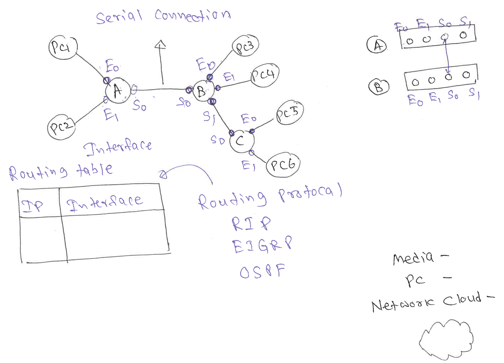

*✍️ 三台路由器 A、B、C：以太网接口 E0/E1 连 PC，串行接口 S0/S1 连其他路由器；路由表 = IP → Interface；路由协议 RIP / EIGRP / OSPF（M1 Supplementary p.6）*

### 🔴 Routing Table：目的 IP 网络 → 出口 Interface

板书上的路由表只有两列：**IP | Interface**——「要去这个 IP 网络，就从这个接口发出去」。

|            | **MAC address table（Switch）** | **Routing table（Router）**                     |
| ---------- | ----------------------------- | --------------------------------------------- |
| 层          | Layer 2 Data Link             | Layer 3 Network                               |
| 记录什么       | **MAC address → Port**        | **目的 IP 网络 → Interface**（真实设备还会记下一跳 next hop） |
| 一条记录代表     | **一台主机**                      | **一整个网络**（很多台主机）                              |
| 怎么来的       | **自己从 Source MAC 学**          | **Static**：管理员手工配置；**Dynamic**：路由协议学          |
| Time stamp | **有**，靠它老化                    | **没有 MAC 表那种时间戳**                             |
| 查不到怎么办     | **Flood**                     | **Discard**（或走 default route）                 |

### 🟡 为什么 Routing table 不需要 time stamp（good to know）

1. **记录的是网络，不是主机**：MAC 表的一条记录是一台随时可能关机、挪位置的电脑；路由表的一条记录是「10.1.1.0 这个网段在 S0 那边」，网络本身很少会移动。
2. **Static route 本来就是永久的**：管理员配上去就一直有效，直到管理员自己删掉，不需要过期。
3. **Dynamic route 的「新鲜度」由路由协议负责**：路由器之间会定期交换路由信息（例如 RIP 每 30 秒发一次更新）；某条路由长时间收不到更新（RIP 默认 180 秒），协议就会把它判定为失效并删除。所以过期机制是**协议里的计时器**，而不是 MAC 表那种「每看到一个帧就刷新一次时间戳」。

> 严格说，真实路由器用 `show ip route` 查看时，动态路由也会显示「这条路由学到多久了」，但那是路由协议自己的状态。按本课的讲法：**MAC 表靠时间戳老化，路由表不靠**。

### 🔴 Static vs Dynamic：路由表怎么「学」

|       | **Static routing 静态路由** | **Dynamic routing 动态路由**                                           |
| ----- | ----------------------- | ------------------------------------------------------------------ |
| 怎么来   | 管理员**手工**一条条写进去         | **Routing protocol** 自动学习：**RIP、EIGRP、OSPF**（TCP/IP 图的 Internet 层） |
| 网络变化时 | 不会自己变，要人去改              | 自动更新，某条线断了会自动找别的路                                                  |
| 适合    | 小网络、固定的出口               | 大网络、有多条路径                                                          |

> **⚠️ 踩坑提醒：Dynamic 学习和交换机的学法「不一样」**
>
> 交换机是**被动**学习：看路过帧的 **Source MAC** 记下来。  
> 路由器的动态路由是**主动交换信息**：路由器之间通过 RIP / EIGRP / OSPF 互相通告「我能到达哪些网络」，再把这些信息写进自己的路由表。**路由器不会去看数据包的 Source IP 来学路由。**  
> 另外，路由器**自己接口直连的网络**会自动出现在路由表里（directly connected），不需要配置也不需要学。

### 🔴 路由器怎么做决策：看 Destination IP，只有 Forward 或 Discard

1. 包从某个接口进来 → 拆掉帧头，读出 **destination IP address**；
2. 在路由表里查这个 IP 属于哪个网络；
3. **查到** → 从对应的 interface **forward** 出去；
4. **查不到**（而且没有 default route 默认路由）→ **discard** 丢弃（通常还会给发送方回一个 ICMP「目的不可达」消息）。

> **🎯 考点**
>
> **路由器不会 flood。** 交换机不知道目的在哪时可以「全发一遍」，因为它只管一个局域网；路由器连着的是不同的网络甚至整个 Internet，如果查不到就泛洪，会把流量洪水般灌进所有网络。所以路由器的决策只有 **Forward** 和 **Discard**。同理，路由器**默认不转发广播**（255.255.255.255），所以**路由器隔离广播域**。

> **➕ 课外补充：Default route 与最长匹配**
>
> - **Default route（默认路由，0.0.0.0/0）**：「表里其他都查不到的，统统往这个接口送」，一般指向通往 Internet 的出口。家里路由器基本就靠这一条。
> - 如果一个 IP 同时匹配好几条记录，路由器选\*\*最具体（掩码最长）\*\*的那条，叫 **longest prefix match**。后面讲 IP 地址和子网时会用到。

### 🔴 Interface：Ethernet vs Serial

路由器有好几个接口，板书上分两种：

| 接口           | 名字                      | 连什么                                | 特点                                                                              |
| ------------ | ----------------------- | ---------------------------------- | ------------------------------------------------------------------------------- |
| **Ethernet** | **E0、E1**（新设备叫 Gi0/0 等） | **本地 LAN**：PC、交换机                  | 以太网，用 MAC 地址                                                                    |
| **Serial**   | **S0、S1**               | **另一台路由器**，通常是 **WAN** 链路（例如租用的专线） | **点对点 (point-to-point)**：线的另一头只有一台设备；常用 **PPP / HDLC** 封装；需要一端提供时钟 (clock rate) |

板书连法：**A 的 S0 ↔ B 的 S0**，**B 的 S1 ↔ C 的 S0**；每台路由器的 E0、E1 各接一台 PC。这正好对应课件说的 **Router can connect different layer 2 technologies**：包从 A 的 E0（Ethernet）进来，从 S0（Serial）出去——路由器在中间把帧头换掉了。

### 🟡 例子：用板书拓扑走一遍

为了说明，给板书里的网络编上（假设的）地址：A 的 E0 = 10.1.1.0（PC1），E1 = 10.1.2.0（PC2）；B 的 E0 = 10.2.3.0（PC3），E1 = 10.2.4.0（PC4）；C 的 E0 = 10.3.5.0（PC5），E1 = 10.3.6.0（PC6）。**Router B** 的路由表：

| 目的网络 (IP)     | Interface | 怎么来的                          |
| ------------- | --------- | ----------------------------- |
| 10.2.3.0（PC3） | E0        | 直连 directly connected         |
| 10.2.4.0（PC4） | E1        | 直连                            |
| 10.1.1.0（PC1） | S0        | 通往 Router A（static 或 dynamic） |
| 10.1.2.0（PC2） | S0        | 通往 Router A                   |
| 10.3.5.0（PC5） | S1        | 通往 Router C                   |
| 10.3.6.0（PC6） | S1        | 通往 Router C                   |
| 其他任何地址        | —         | 查不到 → **Discard**             |

**PC1 → PC5**：A 查到 10.3.5.x 要走 S0 → 送到 B；B 查表 → 走 S1 → 送到 C；C 发现 10.3.5.0 是直连在 E0 上的 → 交给 PC5。**PC1 → 99.9.9.9**：一路查不到（也没有 default route）→ **Discard**。

> **🎯 考点**
>
> 每经过一台路由器：**IP 地址（源、目的）不变，MAC 地址（帧头）每一跳都换**。路由器收到帧 → 拆掉旧帧头 → 按目的 IP 选路 → 用出口接口的 Layer 2 格式**重新封装新帧**。这就是第 15 节 Data Flow 图里 R1 做的事。一句话：**IP 管终点，MAC 管下一站。**

### 🔴 设备对比总表（高频考点）

|       | **Repeater / Hub** | **Switch (Bridge)**                            | **Router**                        |
| ----- | ------------------ | ---------------------------------------------- | --------------------------------- |
| OSI 层 | **Layer 1**        | **Layer 2**                                    | **Layer 3**                       |
| 看什么   | 只看**比特**（电信号）      | **MAC 地址**（物理地址）                               | **IP 地址**（逻辑地址）                   |
| 用什么表  | 没有表                | **MAC address table**（MAC · Port · Time stamp） | **Routing table**（IP · Interface） |
| 怎么转发  | 从**所有其他端口**发出去     | **Flood / Forward / Filter**                   | **Forward / Discard**（不会 flood）   |
| 冲突域   | 所有端口共 **1 个**      | **每个端口 1 个**                                   | 每个接口 1 个                          |
| 广播域   | 1 个                | 所有端口共 **1 个**（广播会被泛洪）                          | **每个接口 1 个**（默认不转发广播）             |

> **🎯 考点**
>
> **口诀：Hub 分不开冲突，Switch 分开冲突域但分不开广播，Router 两个都分开。** 这类「哪种设备能隔离 collision domain / broadcast domain」的题几乎是网络课必考。

---

## 14. 🔴 MAC Address 与三种通信方式

### 🔴 MAC 地址结构（Slide 63）

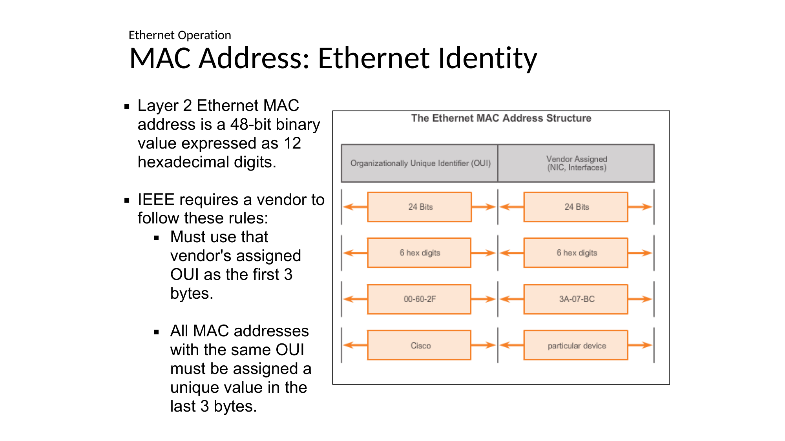

*The Ethernet MAC Address Structure：OUI (24 bits) + Vendor Assigned (24 bits)（Slide 63）*

- Layer 2 Ethernet MAC address is a **48-bit binary value expressed as 12 hexadecimal digits**
- IEEE 要求厂商：
  - **Must use that vendor's assigned OUI as the first 3 bytes**（前 3 字节 = 厂商代码 **OUI, Organizationally Unique Identifier**）
  - **All MAC addresses with the same OUI must be assigned a unique value in the last 3 bytes**（后 3 字节由厂商保证唯一）

| 部分                                    | 长度                     | 例子         | 含义       |
| ------------------------------------- | ---------------------- | ---------- | -------- |
| **OUI**                               | 24 bits = 6 hex digits | `00-60-2F` | Cisco    |
| **Vendor Assigned** (NIC, Interfaces) | 24 bits = 6 hex digits | `3A-07-BC` | 某一块具体的网卡 |

> **⚠️ 踩坑提醒**
>
> - 48 bits ÷ 4 bits/hex = **12 个十六进制数**；48 bits ÷ 8 = **6 bytes**，前 3 bytes 是 OUI。
> - 同一个 MAC 有几种写法：`00-60-2F-3A-07-BC`、`00:60:2F:3A:07:BC`，或课件里 Cisco 风格的 `0200.1111.1111`（每 4 位一组、点号分隔）。

### 🔴 三种通信方式（Slide 64–65）

| 类型               | 课件定义                                                                                               | 发送方 : 接收方 | 例子                                                       |
| ---------------- | -------------------------------------------------------------------------------------------------- | --------- | -------------------------------------------------------- |
| **Unicast 单播**   | A frame is sent from one host addressed to **a specific destination**                              | 1 : 1     | 访问网页、发邮件；**LAN 和 Internet 上最主要的传输方式 (predominant form)** |
| **Broadcast 广播** | A frame is sent from one address to **all other devices**, using a **universal broadcast address** | 1 : 全部    | ARP 请求「谁是 192.168.1.1？」、DHCP 请求                          |
| **Multicast 组播** | The destination address is **a specific group** of devices, or clients                             | 1 : 一组    | 视频会议、IPTV、路由协议更新                                         |

### 🔴 广播地址：约定俗成的「全是 1」

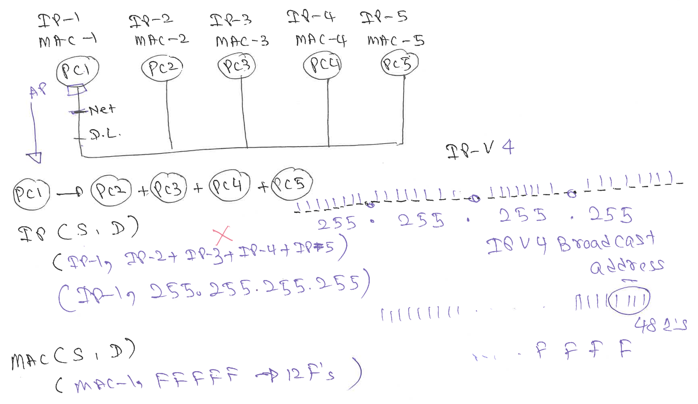

*✍️ 广播：目的地址不是把每个 IP 列出来，而是一个「全 1」的特殊地址（M1 Supplementary p.7）*

> **✍️ 老师板书：广播地址长什么样**
>
> PC1 想发给同网段的 PC2 + PC3 + PC4 + PC5：
>
> - ✗ 不是写成 `IP (S, D) = (IP-1, IP-2 + IP-3 + IP-4 + IP-5)`（老师打了红叉：不能把所有地址「加起来」或列出来）
> - ✓ 而是用一个**约定好的特殊地址**：`IP (S, D) = (IP-1, 255.255.255.255)`
>
> |                    | 位数      | 全部是 1                                 | 写出来                                            |
> | ------------------ | ------- | ------------------------------------- | ---------------------------------------------- |
> | **IPv4 broadcast** | 32 bits | `11111111.11111111.11111111.11111111` | 每 8 个 1 = 255 → **255.255.255.255**            |
> | **MAC broadcast**  | 48 bits | 48 个 1                                | 每 4 个 1 = F → **12 个 F**：**FF-FF-FF-FF-FF-FF** |
>
> 所以一个广播帧写作 `MAC (S, D) = (MAC-1, FF-FF-FF-FF-FF-FF)`。

> **⚠️ 踩坑提醒：「全 1」不是把地址加起来算出来的**
>
> 广播地址是**标准里保留 (reserved) 的一个约定**，不是任何计算的结果。为什么偏偏选「全 1」：
>
> - **它永远不会分配给任何一台设备**：MAC 第一个字节的最低位（I/G 位）是 1 就表示「组地址」，厂商给网卡分配的单播地址这一位一定是 0；IP 那边主机部分全 1 也被保留给广播。所以「全 1」不会和任何真实主机撞车。
> - **每块网卡出厂就被设定为「收自己的 MAC + 收全 F」**：所以所有人都会收下这一帧，正好实现「发给所有人」。
> - 老师的红叉就是在强调：广播不是「把所有目标地址写在一起」，而是**一个人人都认的统一地址**（universal broadcast address）。
>
> **记忆**：全 1 = 「所有位都举手」= 所有人。

> **🎯 考点**
>
> 连起来考：交换机收到目的 MAC = `FF-FF-FF-FF-FF-FF` 的帧 → 按 Slide 67 第 2 步，**从除入口外的所有端口泛洪**；所以一台交换机的所有端口处于**同一个广播域**，而**路由器默认不转发广播**，因此能隔离广播域。

---

## 15. 🟡 Data Flow Through a Network（端到端串起来）

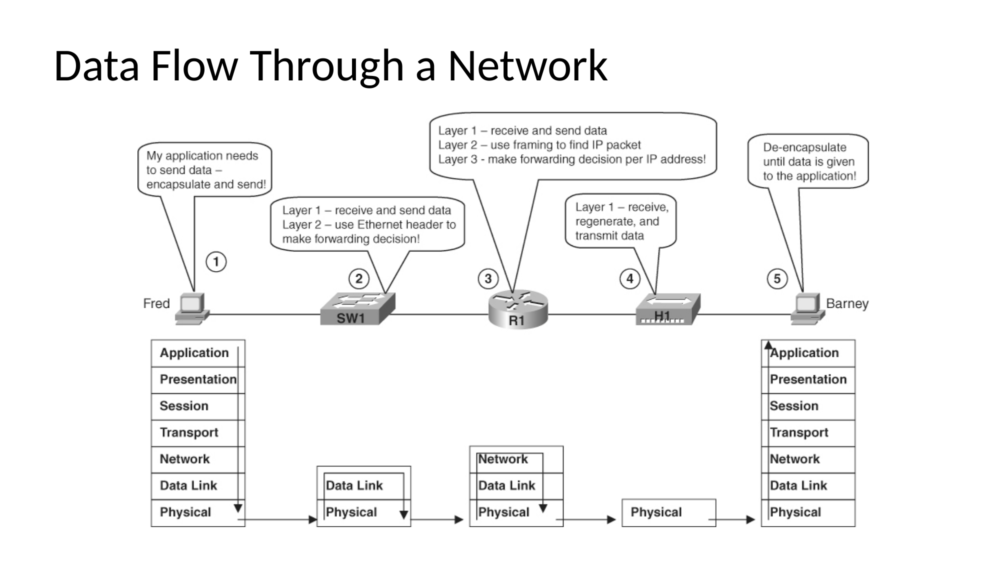

*Fred → SW1 → R1 → H1 → Barney：每台设备只拆到自己那一层（Slide 68）*

| 步骤 | 设备               | 用到的层  | 做什么（课件气泡原文 + 解释）                                                                                                     |
| -- | ---------------- | ----- | -------------------------------------------------------------------------------------------------------------------- |
| ①  | **Fred**（发送主机）   | 7 → 1 | *My application needs to send data — encapsulate and send!* 从应用层一路封装到物理层                                             |
| ②  | **SW1**（交换机）     | 1–2   | *Layer 1 – receive and send data；Layer 2 – use Ethernet header to make forwarding decision!* 只看 MAC                  |
| ③  | **R1**（路由器）      | 1–3   | *Layer 2 – use framing to find IP packet；Layer 3 – make forwarding decision per IP address!* 拆掉帧头看 IP，选路后**重新封装新的帧** |
| ④  | **H1**（集线器）      | 1     | *Layer 1 – receive, regenerate, and transmit data* 只管信号                                                              |
| ⑤  | **Barney**（接收主机） | 1 → 7 | *De-encapsulate until data is given to the application!* 一路拆包交给应用                                                    |

> **🎯 考点**
>
> **核心洞察**：每台设备**只处理到自己所在的那一层**——Hub 到 L1、Switch 到 L2、Router 到 L3，只有两端主机会走完整的 7 层。这一张图同时考了**分层、封装、设备分工**，很适合出简答题或画图题。

---

## 16. 🔴 综合缩写速查表

| 缩写              | 全称                                                      | 所属                |
| --------------- | ------------------------------------------------------- | ----------------- |
| ACL             | Access Control List                                     | 安全 / 路由器          |
| ARP             | Address Resolution Protocol（IP → MAC）                   | TCP/IP Internet 层 |
| ARPANET         | Advanced Research Projects Agency Network               | 历史                |
| BBN             | Bolt, Beranek and Newman                                | 历史                |
| BGP             | Border Gateway Protocol                                 | 路由协议              |
| BOOTP           | Bootstrap Protocol                                      | 主机配置              |
| CAM             | Content Addressable Memory（交换机 MAC 表）                   | L2 交换             |
| CIA             | Confidentiality, Integrity, Availability                | 安全目标              |
| CSMA/CD         | Carrier Sense Multiple Access with Collision Detection  | 共享以太网（补充）         |
| DHCP            | Dynamic Host Configuration Protocol                     | 主机配置              |
| DNS             | Domain Name System                                      | 应用层               |
| DoS             | Denial of Service                                       | 威胁                |
| EIGRP           | Enhanced Interior Gateway Routing Protocol              | 路由协议              |
| FCS             | Frame Check Sequence                                    | L2 帧尾（差错检测）       |
| FTP / TFTP      | File Transfer Protocol / Trivial FTP                    | 应用层               |
| HDLC            | High-Level Data Link Control                            | Serial 链路封装       |
| HTTP            | Hypertext Transfer Protocol                             | 应用层               |
| IAB             | Internet Architecture Board                             | 互联网组织             |
| ICANN           | Internet Corporation for Assigned Names and Numbers     | 互联网组织             |
| ICMP            | Internet Control Message Protocol                       | IP 辅助（ping）       |
| IETF            | Internet Engineering Task Force                         | 互联网组织             |
| IMAP / POP      | Internet Message Access Protocol / Post Office Protocol | 收邮件               |
| IMP             | Interface Message Processor（第一台路由器）                     | 历史                |
| IP              | Internet Protocol                                       | L3                |
| IPS             | Intrusion Prevention System                             | 安全                |
| LAN / WAN / MAN | Local / Wide / Metropolitan Area Network                | 网络类型              |
| MAC             | Media Access Control（address）                           | L2                |
| NAT             | Network Address Translation                             | IP 辅助             |
| NCP             | Network Control Program（TCP 之前的协议）                      | 历史                |
| NIC             | Network Interface Card                                  | 硬件                |
| OSI             | Open Systems Interconnection                            | 参考模型              |
| OSPF            | Open Shortest Path First                                | 路由协议              |
| OUI             | Organizationally Unique Identifier                      | MAC 前 3 字节        |
| PDU             | Protocol Data Unit                                      | 封装                |
| PPP             | Point-to-Point Protocol                                 | Network Access 层  |
| RIP             | Routing Information Protocol                            | 路由协议              |
| SAN             | Storage Area Network                                    | 网络类型              |
| SMTP            | Simple Mail Transfer Protocol                           | 发邮件               |
| TCP             | Transmission Control Protocol                           | L4 可靠传输           |
| UDP             | User Datagram Protocol                                  | L4 不可靠传输          |
| VPN             | Virtual Private Network                                 | 安全                |
| WLAN            | Wireless LAN                                            | 网络类型              |

---

## 17. 模拟自测题

> 以下是**自测题**，按本笔记顺序排列，用来检查自己是否真的掌握，**不是预测的考题**。点开看参考答案。

**1. 100 Mbps 的网络，理论上每秒最多能传多少 MB？为什么？**

> 约 **12.5 MB/s**。带宽单位是 bit（小写 b），文件大小单位是 Byte（大写 B），1 Byte = 8 bits，所以 100 ÷ 8 = 12.5。

**2. 比较 LAN 和 WAN（至少三个维度）。**

> **范围**：LAN 连接有限区域内的终端设备；WAN 在广阔地理范围内连接多个 LAN。**管理者**：LAN 由单一组织或个人管理；WAN 通常由一个或多个服务提供商管理。**速度**：LAN 给内部设备提供高速带宽；WAN 在 LAN 之间提供较慢的链路。

**3. Intranet 和 Extranet 的区别是什么？各举一个例子。**

> Intranet 是组织**内部私有**的 LAN/WAN 集合，只有成员或授权者能访问（例：公司内部 HR 系统）。Extranet 是**有控制地开放给外部组织的人员**，让他们访问需要的数据（例：供应商登录查看库存和订单）。

**4. 写出网络安全的三个目标，并各举一个被破坏的例子。**

> **Confidentiality**（只有预期接收者能读）——数据被窃听；**Integrity**（数据在传输中没被篡改）——中间人修改转账金额；**Availability**（授权用户能及时可靠地访问）——DoS 攻击使网站瘫痪。

**5. 为什么网络通信要用分层模型？至少写四点。**

> Reduces complexity（降低复杂度）；Standardizes interfaces（统一接口）；Facilitates modular engineering（模块化开发，一层改动不影响其他层）；Ensures interoperable technology（不同厂商互通）；Accelerates evolution；Simplifies teaching and learning。例：把铜线换成光纤只改变物理层，HTTP 不需要改动。

**6. 按从上到下写出 OSI 七层，并写出 L4、L3、L2 的 PDU 名称和使用的地址 / 标识。**

> Application · Presentation · Session · Transport · Network · Data Link · Physical。L4 = **Segment**（端口号 + 序号，TCP/UDP）；L3 = **Packet**（**IP 逻辑地址**）；L2 = **Frame**（**MAC 物理地址** + 帧尾 FCS）。

**7. 发送方算出 FCS = 7，接收方重算得到 10，接收方会怎么做？这体现了 CIA 中的哪一项？**

> 接收方判定帧在传输中被损坏，**丢弃 (discard)** 这一帧；数据链路层只负责检测错误，是否重传由上层（如 TCP）处理。这体现的是 **Integrity**（发现数据被改动）。

**8. Hub、Switch、Router 分别工作在哪一层？哪种设备能隔离冲突域？哪种能隔离广播域？**

> Hub = Layer 1，Switch = Layer 2，Router = Layer 3。Switch 和 Router 都能隔离**冲突域**（Switch 每个端口一个冲突域）；只有 **Router** 能隔离**广播域**（交换机会泛洪广播帧）。

**9. 交换机 MAC 表为空。F（在 E0）发帧给 Q（在 E1），随后 Q 回复 F。写出每一步学到的条目和转发决策。**

> 第 1 帧 F→Q：学习 **MAC-F → E0**；Q 不在表中 → **Flood**（除 E0 外所有端口）。第 2 帧 Q→F：学习 **MAC-Q → E1**；F 在表中且端口 E0 ≠ 入口 E1 → **Forward** 只从 E0 发出。

**10. 接上题，此时 F 又发帧给同样在 E0 那一侧的 L（L 已在表中，对应 E0）。交换机怎么做？为什么？**

> **Filter**（不转发）。目的 MAC 对应的端口就是帧进来的端口，说明 L 和 F 在同一网段，L 已经收到了这帧，再转发只会浪费带宽。同时 MAC-F 的时间戳被刷新。

**11. MAC address table 为什么需要 Time stamp？如果没有会出什么问题？**

> 每次看到某 MAC 作为**源地址**就刷新时间戳，超过 aging time（板书 5 分钟 / Cisco 默认 300 秒）没刷新就删除。原因：① 主机会移动、关机、换网卡，旧记录会把帧送到错误端口；② CAM 表容量有限，不删不活跃记录会被塞满；③ 让表只反映网络当前状态。记录被删后，下一帧会被 flood，对方回复时重新学习。

**12. 交换机有哪些防止 collision 的机制？分别在交换机的哪里起作用？**

> ① **Microsegmentation / dedicated paths**：每台主机独占一个端口，交换机内部每对端口之间有独立通路（端口 + 内部）；② **Full duplex**：收发同时进行，链路上不会撞（端口 / 链路）；③ **Buffering**：多台同时发往同一目的时先存进内存、逐帧转发（内部）；④ **MAC address table**：只向目的端口转发、同端口过滤，不再像 Hub 一样全发（内部）。

**13. 比较 MAC address table 和 routing table：层、记录内容、如何建立、查不到时怎么办。**

> MAC 表：Layer 2，记录 **MAC → Port（+ Time stamp）**，交换机从**源 MAC 自动学习**（dynamic），查不到就 **flood**。路由表：Layer 3，记录**目的 IP 网络 → Interface**，由管理员**手工配置 (static)** 或**路由协议 RIP / EIGRP / OSPF 学习 (dynamic)**，查不到（且无默认路由）就 **discard**，路由器不会 flood。

**14. 路由器的 Serial 接口和 Ethernet 接口有什么不同？为什么说路由器能连接不同的 Layer 2 技术？**

> Ethernet 接口（E0、E1）连本地 LAN 的主机或交换机；Serial 接口（S0、S1）是**点对点**链路，通常用来连接**另一台路由器**（WAN 专线），使用 PPP / HDLC 等封装。路由器收到帧后拆掉旧的 Layer 2 帧头，按目的 IP 选路，再用出口接口的 Layer 2 格式重新封装，所以可以从 Ethernet 进、从 Serial 出；**IP 地址不变，MAC / 帧头每一跳都换**。

**15. 一个 MAC 地址有多少位？OUI 是什么？MAC 广播地址和 IPv4 广播地址分别是什么？**

> 48 bits，写成 12 个十六进制数。**OUI (Organizationally Unique Identifier)** 是前 3 字节（24 bits），由 IEEE 分配给厂商；后 3 字节由厂商保证唯一。MAC 广播地址 = **FF-FF-FF-FF-FF-FF**（48 个 1）；IPv4 广播地址 = **255.255.255.255**（32 个 1）。全 1 是标准保留的约定地址，不会分配给任何设备，所有网卡都会接收它。

**16. 在「Data Flow Through a Network」中，数据从 Fred 经过 SW1、R1、H1 到达 Barney。每个设备分别处理到第几层？**

> Fred：7→1 全部封装；SW1：L1–L2（根据以太网帧头的 MAC 决定转发）；R1：L1–L3（拆出 IP 包，根据 IP 地址选路，再重新封装）；H1：只有 L1（接收、再生、发送信号）；Barney：1→7 全部解封装，交给应用。
