---
title:
  en: "Week 5 · IPv6"
  zh: "第 5 周 · IPv6"
summary:
  en: "Why IPv6, hexadecimal and hextets, the two compression rules, prefix length, unicast address types (global unicast, link-local, loopback, unspecified, unique local), the /48 + Subnet ID + Interface ID structure, static vs SLAAC vs DHCPv6, EUI-64, multicast (FF02::1, FF02::2, solicited-node) and subnetting a /48."
  zh: "为什么要 IPv6、十六进制与 hextet、两条压缩规则、prefix length、单播地址类型（全球单播、链路本地、回环、未指定、唯一本地）、/48 + Subnet ID + Interface ID 结构、静态配置 vs SLAAC vs DHCPv6、EUI-64、组播（FF02::1、FF02::2、solicited-node）以及 /48 的子网划分。"
week: 5
date: 2026-10-10
tags: [IPv6, SLAAC, DHCPv6, EUI-64, Multicast]
---
# ISOM 5180 Advanced Network and Security Management — Week 5 复习笔记

**主题：Module 5 IPv6 — 为什么要 IPv6 · 十六进制与 hextet · 两条压缩规则 · Prefix length · 单播地址类型 · Link-local · 全球单播地址结构（/48 + Subnet ID + Interface ID）· 静态配置 / SLAAC / DHCPv6 · EUI-64 · 组播与 solicited-node · IPv6 子网划分**

> 优先级标注说明（按考试重要性）：  
> 🔴 **必考核心** — 概念名称、定义、结构必须能背出来  
> 🟡 **需要理解** — 需要懂逻辑关系，能举例说明  
> 🟢 **了解即可** — 背景知识，考试大概率不会细抠
>
> **优先级依据**（推断，可以随时改）：① 这门课前几周的板书几乎都是「给地址 → 算」的题（第 2 周 Class / network / broadcast，第 4 周子网表），IPv6 能出同类计算题的地方是 **地址压缩 / 展开、判断地址类型、EUI-64、solicited-node、/48 切子网**，这些标 🔴；② 篇幅：地址类型和结构（Slide 10–20）、动态配置（Slide 23–31）、组播（Slide 37–41）各占一大块；③ 路由器配置命令和 Windows 截图（Slide 21–22、34–36）是「看懂」级别，标 🟡。

> **📌 关于本周的材料**
>
> - 这周的 `lec5` 文件夹里**只有课件，没有 Supplementary（老师板书）**，所以没有「✍️ 老师板书」。如果课上有手写例题，拍照发给我，我再插到对应位置。
> - 不清楚课上讲到哪一页，所以全部按「已讲」写。如果后半部分（例如 Slide 37 以后的组播和子网划分）还没讲，告诉我，我改成预习标记。
> - 课件 Slide 40–41 的 solicited-node 前缀**少了一个 1**，第 11 节有说明。

---

## 0. 核心地图（先建立整体框架）

第 2–4 周学的 IPv4 只有 32 位，不够用了。这周把同样的问题在 IPv6 里再走一遍：**地址长什么样 → 有哪几类 → 网络部分 / 主机部分怎么分 → 设备怎么拿到地址 → 怎么切子网**。

```
为什么：IPv4 只有约 43 亿个地址，靠 NAT + 私有地址续命 → IPv6 = 128 位，约 3.4 × 10^38 个
   → 怎么写：32 个十六进制数，分成 8 个 hextet → 两条规则压缩（去前导 0 · 一次 ::）
   → 网络部分：不用点分掩码，写 /prefix length（通常 /64）
   → 地址类型：Unicast（GUA 2000::/3 · Link-local FE80::/10 · Loopback ::1 · Unspecified :: · Unique local FC00::/7）+ Multicast FF00::/8（没有 broadcast）
   → GUA 结构：Global Routing Prefix /48 + Subnet ID 16 位 + Interface ID 64 位
   → 设备怎么拿地址：静态配置 · SLAAC（RA 给 prefix，自己生成 Interface ID：EUI-64 或随机）· DHCPv6
   → 组播：FF02::1 所有节点（≈ 广播）· FF02::2 所有路由器 · Solicited-node FF02::1:FFxx:xxxx
   → 子网划分：在 16 位 Subnet ID 里数数 → 65,536 个 /64；不够还能借进 Interface ID
```

**一句话抓住本周**：**IPv6 = 前 64 位是「哪个网络」（/48 公司 + 16 位子网），后 64 位是「哪个接口」**。所有题都围着这条线：会把地址写长写短、认出开头是哪一类、算出后 64 位（EUI-64）、在第 4 个 hextet 里切子网。

---

## 1. 🟡 为什么需要 IPv6（The Need for IPv6）

| 课件原文（Slide 2）                                                                                                 | 中文 / 小白解释                                   |
| ------------------------------------------------------------------------------------------------------------- | ------------------------------------------- |
| IPv6 is designed to be the **successor to IPv4**                                                              | IPv6 是 IPv4 的接班人                            |
| **Depletion of IPv4 address space** has been the motivating factor                                            | 根本原因：IPv4 地址**分完了**                         |
| increasing Internet population, limited IPv4 address space, **issues with NAT** and an **Internet of Things** | 上网的人越来越多、IoT 设备爆炸、NAT 只是权宜之计（破坏端到端连接）       |
| IPv4 has a theoretical maximum of **4.3 billion** addresses, plus private addresses in combination with NAT   | 2³² ≈ 43 亿；第 2 周学的私有地址 + NAT 是在「挤」          |
| IPv6 larger **128-bit** address space provides for **340 undecillion** addresses                              | 2¹²⁸ ≈ 3.4 × 10³⁸ 个                         |
| IPv6 fixes the limitations of IPv4 and includes additional enhancements, such as **ICMPv6**                   | ICMPv6 不只是 ping：第 8 节的 RS / RA 就是 ICMPv6 消息 |

> **💡 小白理解**
>
> **340 undecillion 有多大**：undecillion = 10³⁶，340 undecillion ≈ 3.4 × 10³⁸。地球上每一粒沙子都分一个地址也用不完。所以 IPv6 的设计思路和 IPv4 完全不同：**不用省地址**——一个子网直接给 64 位主机部分（2⁶⁴ 个地址），也不需要 NAT。

---

## 2. 🔴 十六进制与 IPv6 地址表示（Hexadecimal · Hextet）

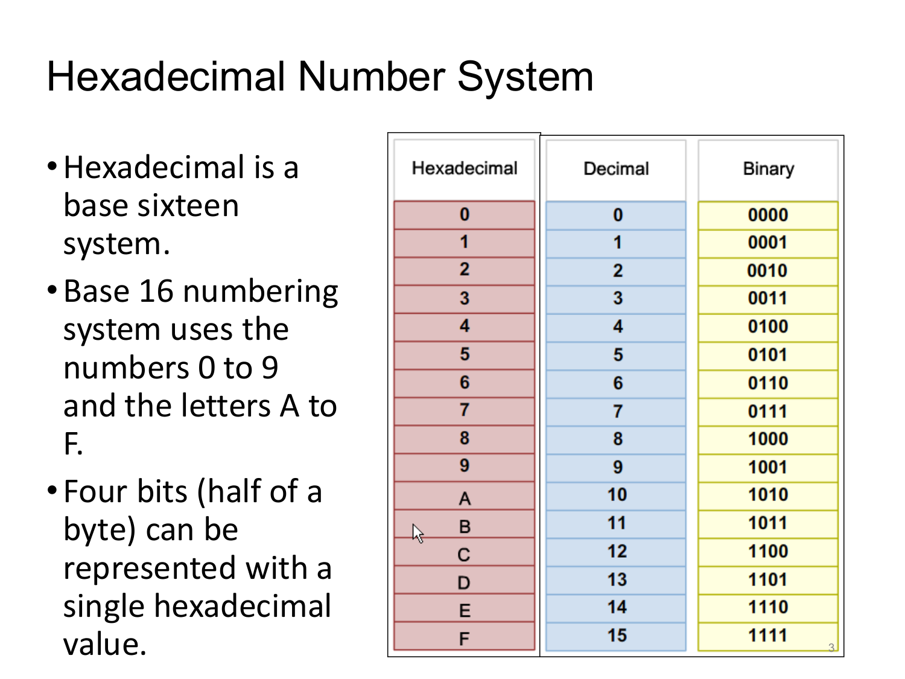

*Hexadecimal 0–F ↔ Decimal 0–15 ↔ Binary 0000–1111：一个十六进制数 = 4 位二进制（半个字节）（Slide 3）*

- **Hexadecimal is a base sixteen system**：0–9 再加 A–F（A = 10 … F = 15）
- **Four bits (half of a byte) can be represented with a single hexadecimal value**（4 位叫一个 **nibble**）
- **128 bits** in length → 每 4 位一个十六进制数 → **32 个十六进制数**
- **Hextet** = **16 位 = 4 个十六进制数**，用冒号隔开 → 一共 **8 个 hextet**
- 大写小写都可以（**can be written in either lowercase or uppercase**）

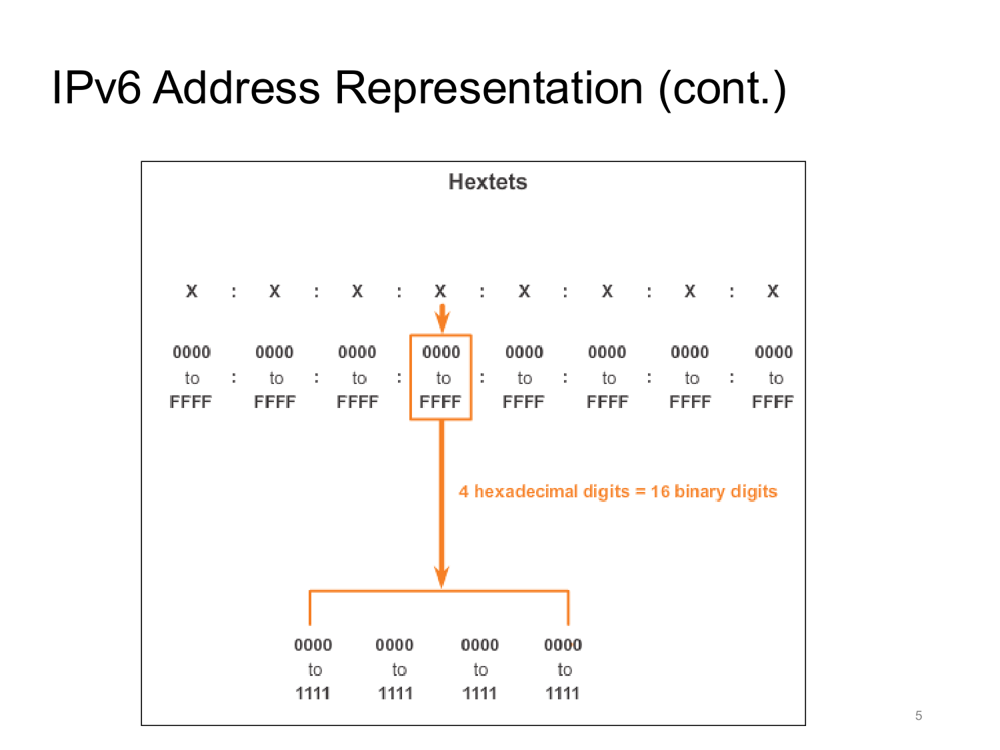

*8 个 hextet：X:X:X:X:X:X:X:X，每个 0000–FFFF；4 hexadecimal digits = 16 binary digits（Slide 5）*

|    | IPv4                | IPv6                                    |
| -- | ------------------- | --------------------------------------- |
| 长度 | 32 位                | **128 位**                               |
| 写法 | 4 段**十进制**，用 `.` 隔开 | 8 段**十六进制**（hextet），用 `:` 隔开            |
| 每段 | 8 位（octet），0–255    | 16 位（hextet），0000–FFFF                  |
| 例子 | 192.168.10.1        | 2001:0DB8:0000:1111:0000:0000:0000:0200 |

> **🧠 记忆口诀**
>
> **数位数的口诀：1 个十六进制 = 4 位，1 个 hextet = 4 个十六进制 = 16 位，8 个 hextet = 128 位**。前缀长度换算时最常用：**/48 = 前 3 个 hextet，/64 = 前 4 个 hextet**（每个 hextet 16 位）。

---

## 3. 🔴 两条压缩规则（Rule 1 · Rule 2）

### 🔴 Rule 1：去掉前导 0（Omitting Leading 0s）

**Any leading 0s (zeros) in any 16-bit section or hextet can be omitted**（Slide 6）

| 原来   | 去掉前导 0  | 说明          |
| ---- | ------- | ----------- |
| 01AB | **1AB** |             |
| 09F0 | **9F0** | 末尾的 0 不能去   |
| 0A00 | **A00** | 末尾的 0 不能去   |
| 00AB | **AB**  |             |
| 0000 | **0**   | 全 0 至少留一个 0 |

### 🔴 Rule 2：用一次 `::` 代替连续全 0 的 hextet（Omitting All 0 Segments）

- **A double colon (::) can replace any single, contiguous string of one or more 16-bit segments (hextets) consisting of all 0's**
- **Double colon (::) can only be used once within an address otherwise the address will be ambiguous**
- 这样写出来的叫 **compressed format**
- 错误例子：**2001:0DB8::ABCD::1234**（用了两次，不知道每个 `::` 各代表几个 0）

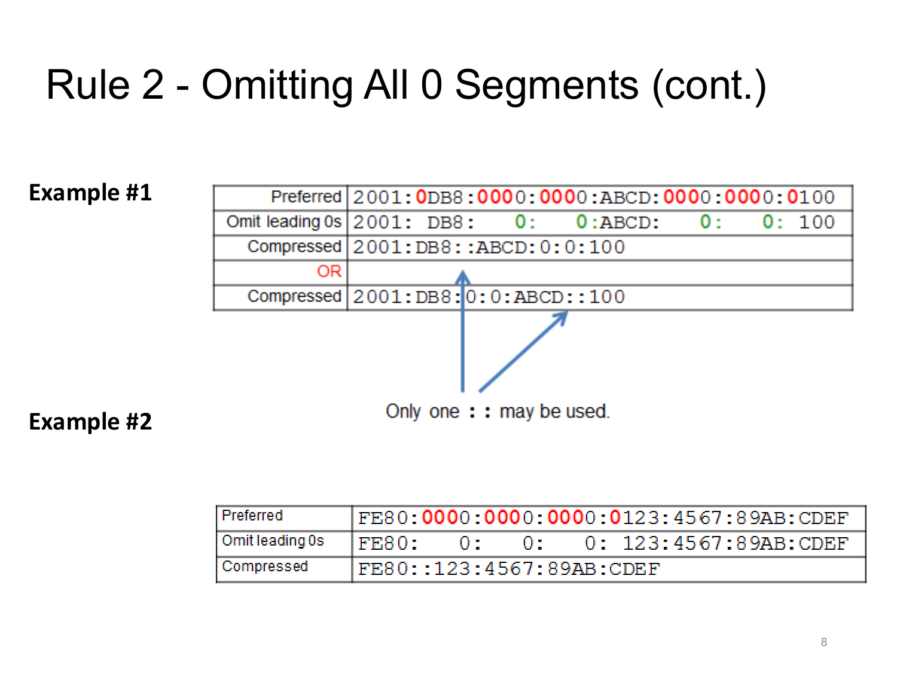

*Example #1：2001:0DB8:0000:0000:ABCD:0000:0000:0100 → 2001:DB8::ABCD:0:0:100 或 2001:DB8:0:0:ABCD::100（Only one :: may be used）；Example #2：FE80:0000:0000:0000:0123:4567:89AB:CDEF → FE80::123:4567:89AB:CDEF（Slide 8）*

> **🎯 考点：压缩要分两步，展开要数个数**
>
> **压缩**：先每个 hextet 去前导 0（Rule 1），再找**最长**的一串连续 `0`，换成 `::`（Rule 2）。Example #1 有两段 `0:0`，两种写法都对，但只能选一段。
>
> **展开（考试更容易错）**：
>
> 1. 数一下 `::` 以外写了几个 hextet，例如 `2001:DB8:A::1:0:0:5` 写了 **7** 个
> 2. `::` 代表 **8 − 7 = 1** 个全 0 的 hextet
> 3. 每个 hextet 补足 4 位：**2001:0DB8:000A:0000:0001:0000:0000:0005**

> **⚠️ 踩坑提醒**
>
> - **只能去「前导」0，不能去末尾的 0**：`0A00` → `A00`，不能写成 `A`（`A` 会被读成 `000A`）
> - **`::` 只能出现一次**：出现两次就无法还原
> - `::` 也可以在开头或结尾：`::1`（loopback）、`2001:DB8:CAFE:1::`（后 64 位全 0）

*（网页版此处可以输入任意 IPv6 地址：显示完整 / 去前导 0 / 压缩写法、地址类型、GUA 三部分和 solicited-node 地址；下表是几个例子）*

| 输入                                        | 压缩写法                       | 类型                                      | 说明                                                                |
| ----------------------------------------- | -------------------------- | --------------------------------------- | ----------------------------------------------------------------- |
| `2001:0DB8:0000:1111:0000:0000:0000:0200` | `2001:DB8:0:1111::200`     | Global unicast (GUA)（2000::/3）          | GRP 2001:DB8::/48 · Subnet ID 1111 · IID 0000:0000:0000:0200      |
| `2001:0DB8:0000:0000:ABCD:0000:0000:0100` | `2001:DB8::ABCD:0:0:100`   | Global unicast (GUA)（2000::/3）          | GRP 2001:DB8::/48 · Subnet ID 0000 · IID ABCD:0000:0000:0100      |
| `FE80:0000:0000:0000:0123:4567:89AB:CDEF` | `FE80::123:4567:89AB:CDEF` | Link-local unicast（FE80::/10）           | 每个接口必须有；只在本链路有效，路由器不转发（Slide 15–16）                               |
| `2001:DB8:ACAD:1::10/64`                  | `2001:DB8:ACAD:1::10`      | Global unicast (GUA)（2000::/3）          | GRP 2001:DB8:ACAD::/48 · Subnet ID 0001 · IID 0000:0000:0000:0010 |
| `FD00:AB::1`                              | `FD00:AB::1`               | Unique local unicast（FC00::/7）          | 站点内部用，不在 Internet 上路由（Slide 14）                                   |
| `::1`                                     | `::1`                      | Loopback（::1/128）                       | 发给自己，ping ::1 测试本机 TCP/IP；不能配到物理接口上（Slide 13）                     |
| `FF02::1`                                 | `FF02::1`                  | Assigned multicast · All-nodes（FF02::1） | 链路上所有 IPv6 设备都会加入，效果等同 IPv4 broadcast（Slide 38）                   |
| `2001:DB8::ABCD::1234`                    | —                          | —                                       | 「::」出现了不止一次——地址会有歧义（Slide 7：2001:0DB8::ABCD::1234 是错的）            |

> **➕ 课外补充：RFC 5952 的「标准压缩写法」**
>
> 课件允许 `::` 代替「一个或多个」全 0 hextet，所以同一个地址可以有好几种合法写法。实际网络设备显示地址时按 RFC 5952：**用小写**；`::` **压缩最长的那段**（一样长就压第一段）；**只有一个全 0 的 hextet 不用 `::`**，直接写 `0`。考试按课件来，两种都算对；自己写的时候选「最长那段」最稳。

---

## 4. 🔴 Prefix Length（前缀长度）

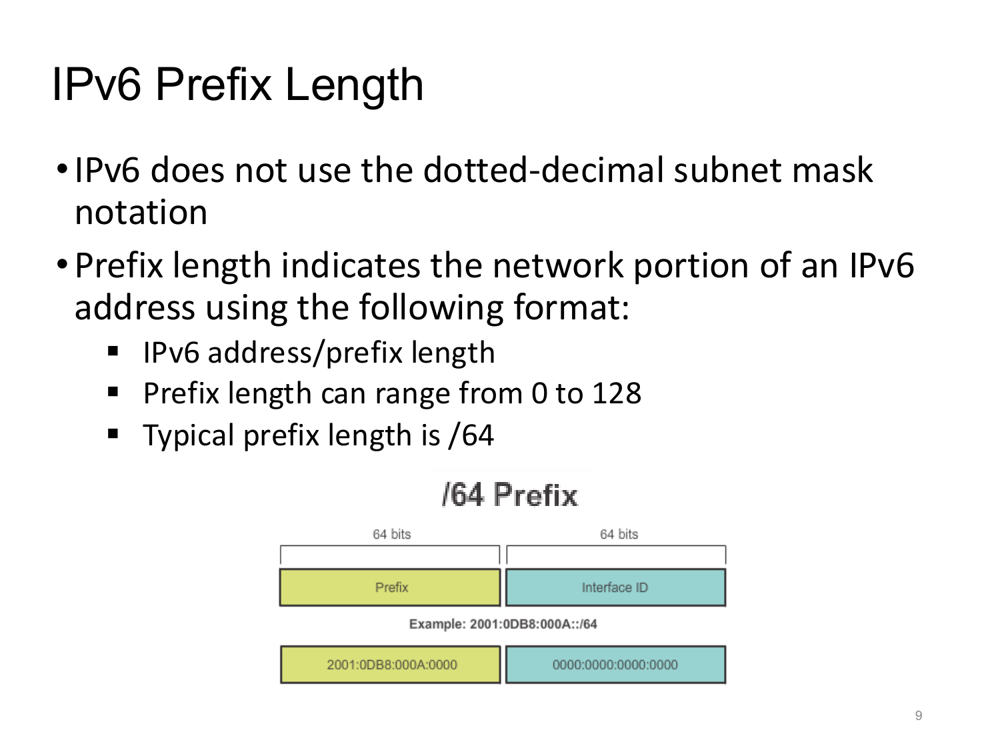

*/64 Prefix：前 64 位 Prefix（2001:0DB8:000A:0000）+ 后 64 位 Interface ID（0000:0000:0000:0000）（Slide 9）*

- **IPv6 does not use the dotted-decimal subnet mask notation**：没有 255.255.255.0 这种写法
- 写成 **IPv6 address/prefix length**，prefix length **0 到 128**
- **Typical prefix length is /64**：前 64 位是网络（prefix），后 64 位是主机（**Interface ID**）

| IPv4                                | IPv6                          |
| ----------------------------------- | ----------------------------- |
| Subnet mask 255.255.255.0 **或** /24 | **只用** /64                    |
| Network 部分 + Host 部分                | **Prefix** + **Interface ID** |

---

## 5. 🔴 IPv6 地址类型（Unicast · Multicast）

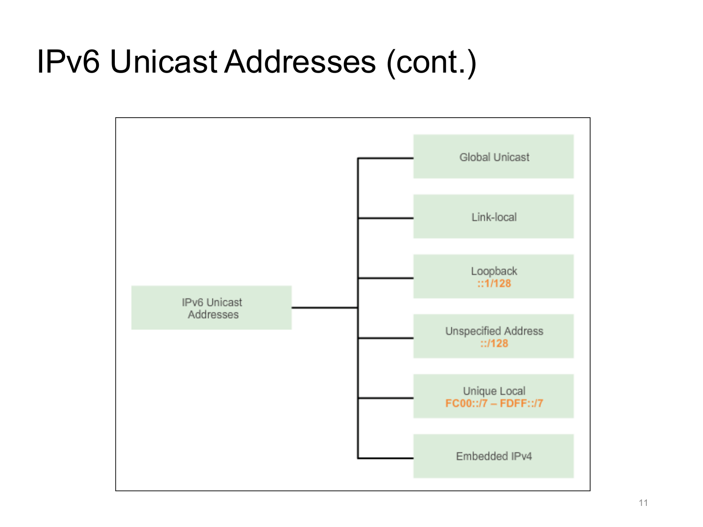

*IPv6 Unicast Addresses：Global Unicast · Link-local · Loopback ::1/128 · Unspecified Address ::/128 · Unique Local FC00::/7 – FDFF::/7 · Embedded IPv4（Slide 11）*

- **Unicast**：**Uniquely identifies an interface** on an IPv6-enabled device；发到单播地址的包只有这个接口收（Slide 10）
- **Multicast**：发给一组设备，前缀 **FF00::/8**（第 11 节）
- **IPv6 没有 broadcast**：IPv4 广播的作用由 all-nodes 组播 **FF02::1** 代替

| 类型                          | 范围 / 写法                      | 课件要点                                                   | 对应 IPv4                   |
| --------------------------- | ---------------------------- | ------------------------------------------------------ | ------------------------- |
| 🔴 **Global Unicast (GUA)** | **2000::/3**（开头 2 或 3）       | **Globally unique**、**Internet routable**；可静态或动态分配     | **公网地址**                  |
| 🔴 **Link-local**           | **FE80::/10**                | 只和**同一条链路**上的设备通信，**not routable beyond the link**     | 169.254.x.x（课外）           |
| 🔴 **Loopback**             | **::1/128**（`::1`）           | 发给自己，ping 它测试本机 TCP/IP；**不能**配到物理接口                    | 127.0.0.1                 |
| 🔴 **Unspecified**          | **::/128**（`::`）             | 全 0；**不能**分配给接口，**只能当源地址**——设备还没有正式地址时用                | 0.0.0.0                   |
| 🟡 **Unique Local**         | **FC00::/7**（FC00 – FDFF 开头） | **Similar to private addresses for IPv4**，站点内部或少数站点之间用 | 10/8、172.16/12、192.168/16 |
| 🟢 **IPv4 Embedded**        | —                            | **Used to help transition from IPv4 to IPv6**          | —                         |
| 🔴 **Multicast**            | **FF00::/8**                 | FF02::1 所有节点、FF02::2 所有路由器、solicited-node              | Class D 224.0.0.0         |

> **🧠 记忆口诀**
>
> **看开头认类型**：**2 / 3** 开头 → 全球单播；**FE8–FEB** 开头 → 链路本地；**FC / FD** 开头 → 唯一本地（私有）；**FF** 开头 → 组播；`::1` → 回环；`::` → 未指定。

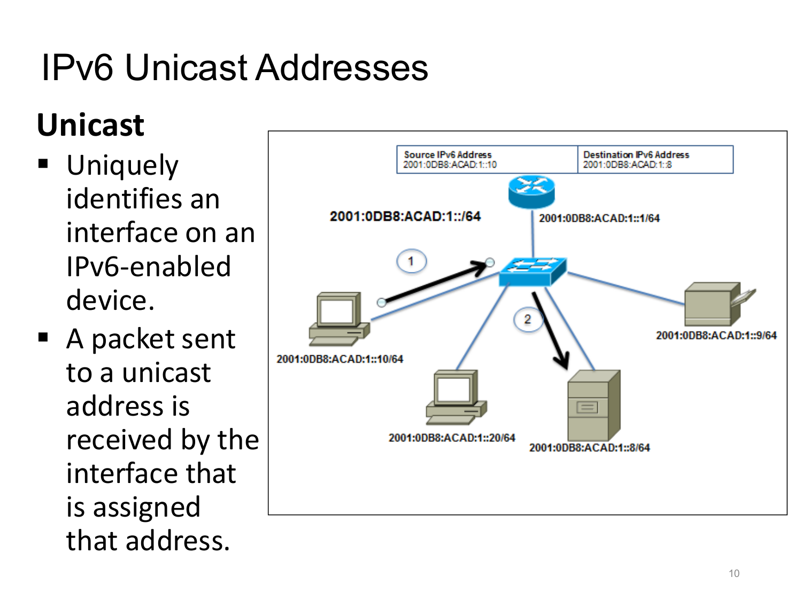

*Unicast：PC 2001:0DB8:ACAD:1::10 发给打印机 2001:0DB8:ACAD:1::8，只有打印机收到（Slide 10）*

> **➕ 课外补充：Anycast**
>
> IPv6 还有第三种地址 **anycast**：同一个地址配在好几台设备上，包会被送到「最近」的那一台（DNS 根服务器就这样做）。课件没讲，了解即可。

---

## 6. 🔴 Link-local 地址

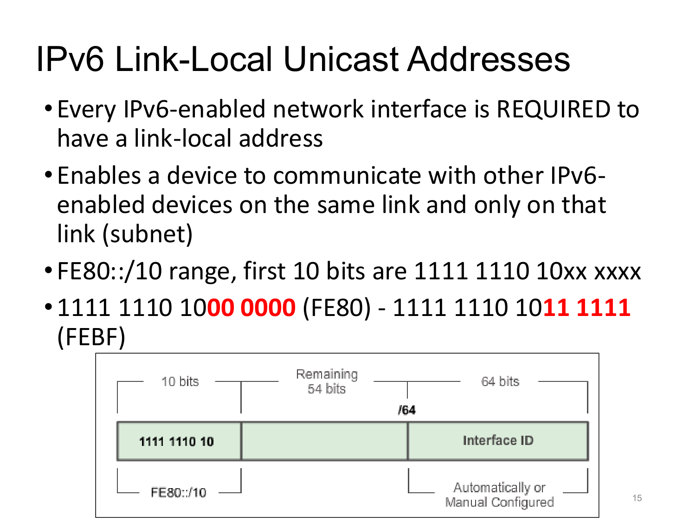

*FE80::/10：前 10 位 1111 1110 10，范围 FE80 – FEBF；后 64 位 Interface ID 自动生成或手动配置（Slide 15）*

- **Every IPv6-enabled network interface is REQUIRED to have a link-local address**：每个接口**必须**有
- 只能和**同一条链路（subnet）**上的设备通信
- **FE80::/10**：前 10 位 `1111 1110 10`，所以第一个 hextet 从 **FE80**（`1111 1110 1000 0000`）到 **FEBF**（`1111 1110 1011 1111`）

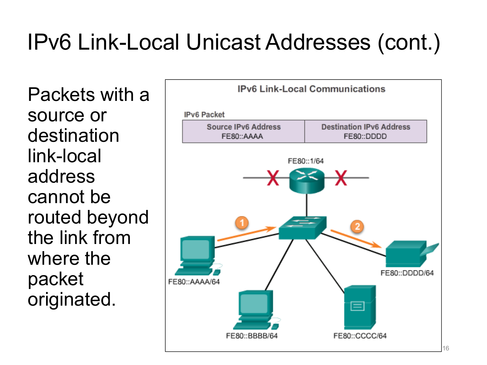

*源或目的是 link-local 的包，路由器不会转发到别的链路（FE80::1/64 两边打叉）（Slide 16）*

**Link-local 的用途**（Slide 32）：

| 课件原文                                                                                                  | 中文                                   |
| ----------------------------------------------------------------------------------------------------- | ------------------------------------ |
| **Uses the link-local address of the local router for its default gateway** IPv6 address              | 主机的**默认网关**填的是路由器的 **link-local** 地址 |
| **Routers exchange dynamic routing protocol messages using link-local addresses**                     | 路由器之间交换路由协议消息用 link-local            |
| Routers' **routing tables use the link-local address to identify the next-hop router**                | 路由表里的「下一跳」也是 link-local              |
| Routers send ICMPv6 **RA messages using the link-local address as the source** IPv6 address（Slide 24） | RA 的源地址是路由器的 link-local              |

> **🎯 考点**
>
> **为什么默认网关用 link-local 而不是 GUA**：link-local 每个接口**一定有**、**不会变**（公司换 ISP、GUA 前缀变了，link-local 不受影响），而且默认网关本来就一定在**同一条链路**上。

---

## 7. 🔴 全球单播地址的结构（GUA Structure）

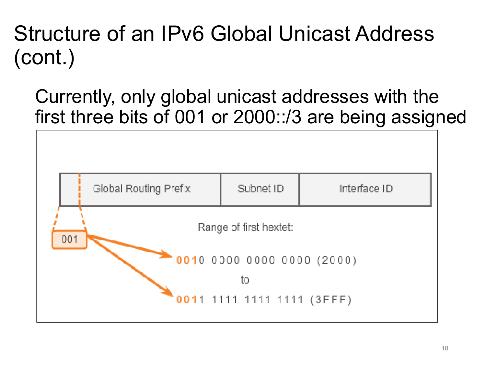

*目前只分配开头三位是 001 的地址：2000::/3，第一个 hextet 从 2000 到 3FFF（Slide 18）*

- **Globally unique and routable on the IPv6 Internet**，**equivalent to public IPv4 addresses**（Slide 17）
- **ICANN** 把 IPv6 地址块分给五个 **RIRs (Regional Internet Registries)**，例如亚太区的 APNIC
- **Currently, only global unicast addresses with the first three bits of 001 or 2000::/3 are being assigned**

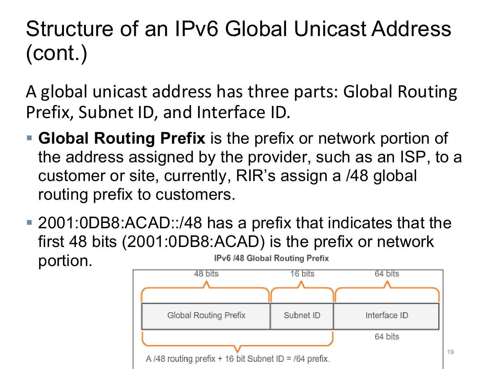

*48 bits Global Routing Prefix + 16 bits Subnet ID + 64 bits Interface ID；/48 routing prefix + 16 bit Subnet ID = /64 prefix（Slide 19）*

| 部分                        | 位数     | 谁决定            | 课件原文                                                                      | 对应 IPv4          |
| ------------------------- | ------ | -------------- | ------------------------------------------------------------------------- | ---------------- |
| **Global Routing Prefix** | **48** | ISP / RIR 分给客户 | the prefix or network portion of the address **assigned by the provider** | Network 部分       |
| **Subnet ID**             | **16** | 公司自己           | used by an organization to **identify subnets within its site**           | 第 4 周借的 Subnet 位 |
| **Interface ID**          | **64** | 设备 / 管理员       | **Equivalent to the host portion of an IPv4 address**                     | Host 部分          |

- 例：**2001:0DB8:ACAD::/48** → 前 48 位 `2001:0DB8:ACAD` 是 prefix
- 为什么叫 **Interface** ID 而不叫 host ID：**a single host may have multiple interfaces, each having one or more IPv6 addresses**（地址属于接口，不属于主机）

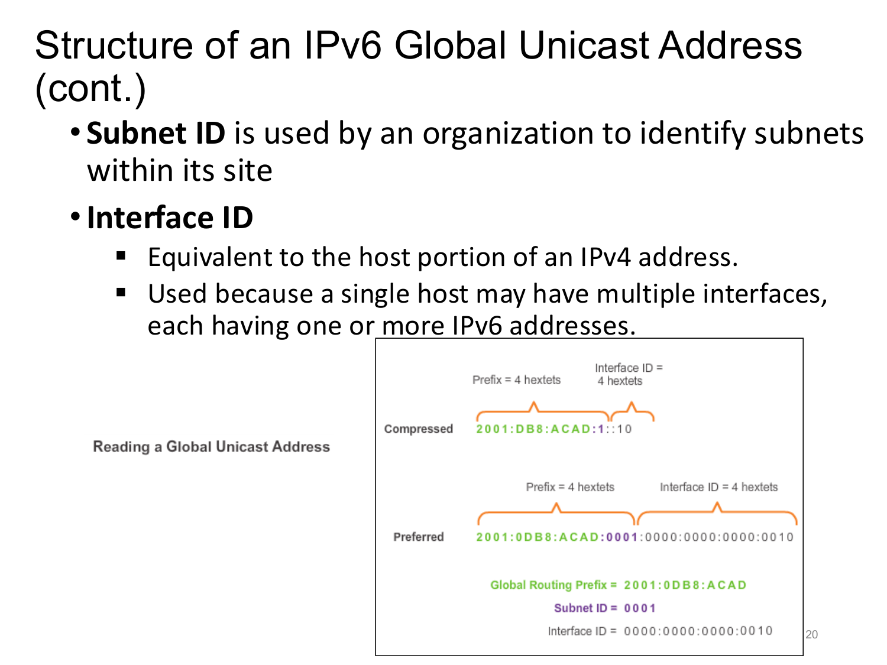

*Reading a Global Unicast Address：2001:DB8:ACAD:1::10 → Global Routing Prefix 2001:0DB8:ACAD · Subnet ID 0001 · Interface ID 0000:0000:0000:0010（Slide 20）*

> **💡 小白理解**
>
> **像地址一样从大到小读**：`2001:0DB8:ACAD` = 「港科大」（ISP 分给学校的 /48）；`0001` = 「1 号楼」（学校自己编的子网）；最后 64 位 = 「1 号楼里的哪台设备的哪个网口」。

---

## 8. 🔴 设备怎么拿到 GUA：静态 · SLAAC · DHCPv6

### 🟡 静态配置（Slide 21–22）

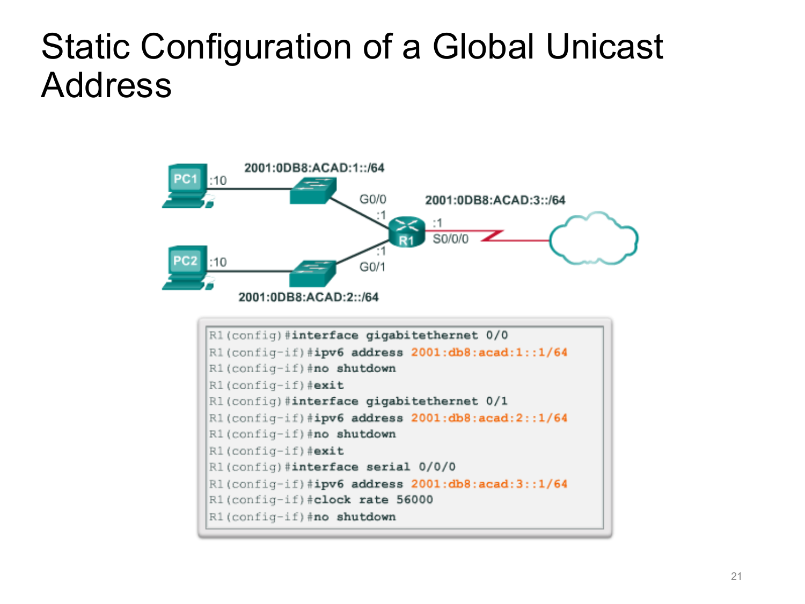

*R1：G0/0 = 2001:db8:acad:1::1/64，G0/1 = 2001:db8:acad:2::1/64，S0/0/0 = 2001:db8:acad:3::1/64；PC1、PC2 都是 ::10（Slide 21）*

```
R1(config)# interface gigabitethernet 0/0
R1(config-if)# ipv6 address 2001:db8:acad:1::1/64
R1(config-if)# no shutdown
```

- Windows：在 *Internet Protocol Version 6 (TCP/IPv6) Properties* 里填 IPv6 address、**Subnet prefix length 64**、Default gateway（Slide 22）
- 和 IPv4 一样：路由器每个接口一个子网（`:1:`、`:2:`、`:3:`），接口一般用 `::1`

### 🔴 SLAAC（Stateless Address Autoconfiguration）

| 课件原文（Slide 23）                                                                                                | 中文 / 小白解释                              |
| ------------------------------------------------------------------------------------------------------------- | -------------------------------------- |
| A method that allows a device to obtain its **prefix, prefix length and default gateway** from an IPv6 router | 设备从**路由器**拿到 prefix、prefix length、默认网关 |
| **No DHCPv6 server needed**                                                                                   | 不需要 DHCP 服务器                           |
| Rely on **ICMPv6 Router Advertisement (RA)** messages                                                         | 靠路由器发的 RA 消息                           |
| IPv6 routers … **Sends ICMPv6 RA messages**                                                                   | 路由器负责发 RA                              |
| The **ipv6 unicast-routing** command enables IPv6 routing（Slide 24）                                           | 不敲这条命令，Cisco 路由器不会当 IPv6 路由器，也不发 RA    |

- **Stateless**（无状态）= 没有服务器记录「谁用了哪个地址」：路由器只告诉你**前 64 位**，**后 64 位你自己生成**（EUI-64 或随机，第 9 节）

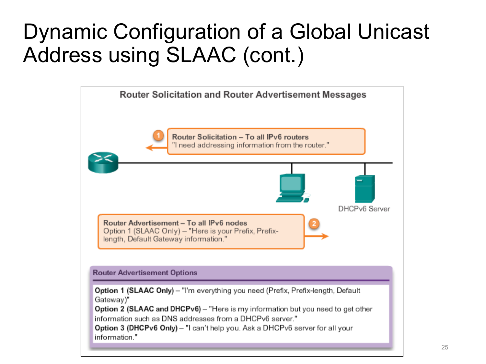

*① Router Solicitation – To all IPv6 routers：I need addressing information；② Router Advertisement – To all IPv6 nodes：Option 1 (SLAAC Only)；下面是三个 RA Options（Slide 25）*

**RA 消息里带三个选项之一**（Slide 24–25）：

| Option | 名字                   | RA 说什么（Slide 25）                                                                                          | 地址怎么来                           | DNS 等其他信息            |
| ------ | -------------------- | --------------------------------------------------------------------------------------------------------- | ------------------------------- | -------------------- |
| **1**  | **SLAAC Only**       | "I'm everything you need (Prefix, Prefix-length, Default Gateway)"                                        | RA 的 prefix + 自己生成 Interface ID | 没有                   |
| **2**  | **SLAAC and DHCPv6** | "Here is my information but you need to get other information such as DNS addresses from a DHCPv6 server" | 同上（SLAAC）                       | **Stateless DHCPv6** |
| **3**  | **DHCPv6 only**      | "I can't help you. Ask a DHCPv6 server for all your information"                                          | **Stateful DHCPv6** 分配          | DHCPv6               |

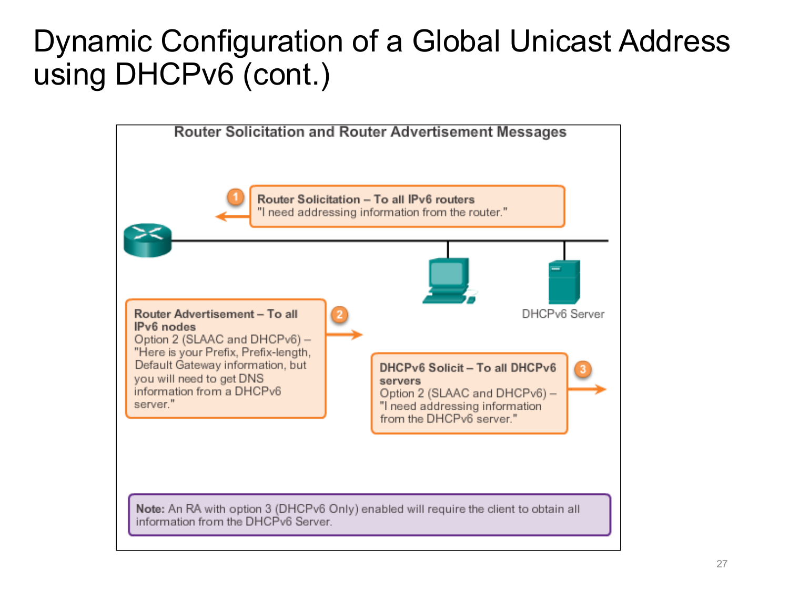

*Option 2：① RS → ② RA（SLAAC and DHCPv6）→ ③ DHCPv6 Solicit – To all DHCPv6 servers；Note：Option 3 要求客户端所有信息都从 DHCPv6 server 拿（Slide 27）*

**DHCPv6**（Slide 26）：

- **Similar to IPv4** DHCP：可以拿到 GUA、prefix length、default gateway、DNS server
- 拿全部还是部分，取决于 RA 是 **option 2** 还是 **option 3**
- **Host may choose to ignore whatever is in the router's RA message** and obtain its IPv6 address directly from a DHCPv6 server

*（网页版此处可以切换 RA 的三个选项，看消息顺序和每项信息的来源）*

| 信息                     | Option 1 · SLAAC only                                                                 | Option 2 · SLAAC and DHCPv6                                                                              | Option 3 · DHCPv6 only                                                               |
| ---------------------- | ------------------------------------------------------------------------------------- | -------------------------------------------------------------------------------------------------------- | ------------------------------------------------------------------------------------ |
| Prefix / prefix length | RA                                                                                    | RA                                                                                                       | DHCPv6 server                                                                        |
| Default gateway        | RA（路由器的 link-local 地址）                                                                | RA（路由器的 link-local 地址）                                                                                   | DHCPv6 server（课件 Slide 26 的说法）                                                       |
| Interface ID（地址后 64 位） | 主机自己生成（EUI-64 / 随机）                                                                   | 主机自己生成（EUI-64 / 随机）                                                                                      | DHCPv6 server 分配整个地址                                                                 |
| DNS server             | 没有——RA 里不带（课件只讲到这里）                                                                   | DHCPv6 server                                                                                            | DHCPv6 server                                                                        |
| 消息顺序                   | ① Router Solicitation (RS) → ② Router Advertisement (RA)，Option 1 → ③ 生成 Interface ID | ① Router Solicitation (RS) → ② Router Advertisement (RA)，Option 2 → ③ 生成 Interface ID → ④ DHCPv6 Solicit | ① Router Solicitation (RS) → ② Router Advertisement (RA)，Option 3 → ③ DHCPv6 Solicit |
| 状态                     | Stateless（没有服务器记录谁用了哪个地址）                                                             | Stateless DHCPv6（地址自己生成，DHCPv6 只给「其他信息」）                                                                 | Stateful DHCPv6（服务器分配并记录地址，和 IPv4 DHCP 最像）                                           |

> **🎯 考点：stateless vs stateful**
>
> - **Stateless** = 没人记账：SLAAC（option 1）、stateless DHCPv6（option 2 —— DHCPv6 只给 DNS 这些「其他信息」，**不分配地址**）
> - **Stateful** = DHCPv6 server **分配并记录**每个地址（option 3），最像 IPv4 的 DHCP
> - 三个选项都**先有 RS / RA**——RA 是路由器告诉主机「你该用哪种方式」的开关

> **➕ 课外补充：RS / RA 发到哪里，以及默认网关的实际来源**
>
> - RS 发到 **FF02::2**（all-routers），RA 发到 **FF02::1**（all-nodes）——正好对上第 11 节的两个组播地址；RS / RA 是 ICMPv6 的 type 133 / 134，属于 **NDP (Neighbor Discovery Protocol)**
> - 课件 Slide 26 说 DHCPv6 可以给 default gateway；**实际标准里 DHCPv6 没有「默认网关」这一项**，即使 option 3，主机的默认网关也来自 RA 的源地址（路由器的 link-local）。考试按课件答，知道这一点有助于理解「为什么三个选项都要先收到 RA」

---

## 9. 🔴 Interface ID：EUI-64 或随机生成

### 🔴 EUI-64（Extended Unique Identifier）三步（Slide 28–29）

**Uses a client's 48-bit Ethernet MAC address and inserts another 16 bits in the middle of the 48-bit MAC address to create a 64-bit Interface ID**

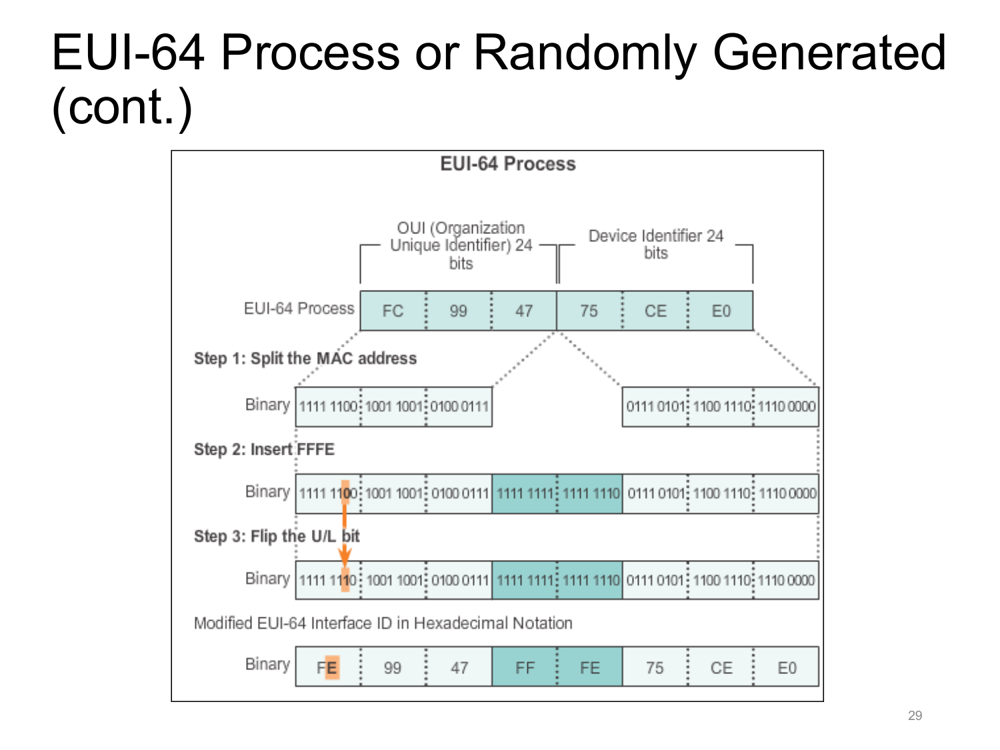

*MAC FC:99:47:75:CE:E0 → Step 1 拆成 OUI FC 99 47 + Device Identifier 75 CE E0 → Step 2 中间插 FFFE → Step 3 翻转 U/L 位：FC (1111 1100) → FE (1111 1110) → Modified EUI-64 Interface ID FE99:47FF:FE75:CEE0（Slide 29）*

| 步骤                | 做什么                                             | 例：FC:99:47:75:CE:E0                         |
| ----------------- | ----------------------------------------------- | ------------------------------------------- |
| **Step 1** Split  | 拆成 **24 位 OUI**（厂商）+ **24 位 Device identifier** | FC 99 47 \| 75 CE E0                        |
| **Step 2** Insert | 中间插入 **FFFE**（16 位）                             | FC 99 47 **FF FE** 75 CE E0                 |
| **Step 3** Flip   | OUI 的**第 7 位**（**Universally/Locally bit**）取反   | FC = 1111 11**0**0 → 1111 11**1**0 = **FE** |
| 结果                | 64 位 Interface ID                               | **FE99:47FF:FE75:CEE0**                     |

> **🧠 记忆口诀**
>
> **EUI-64 三步口诀：「切开 · 塞 FFFE · 第 7 位翻」**。第 7 位在第一个字节里的位权是 **2**，所以翻转 = 第一个字节 **±2**：FC → FE，00 → 02，02 → 00，1A → 18。

> **⚠️ 踩坑提醒：是「取反」不是「写 1」**
>
> 课件写 *the 7th bit … is reversed (0 becomes a 1)*，因为普通网卡 MAC 的这一位是 0，翻转后就是 1。如果它本来是 1（例如 02:00:5E:…），**翻转后变 0**。另外插的是 **FFFE**，不是 FFFF。

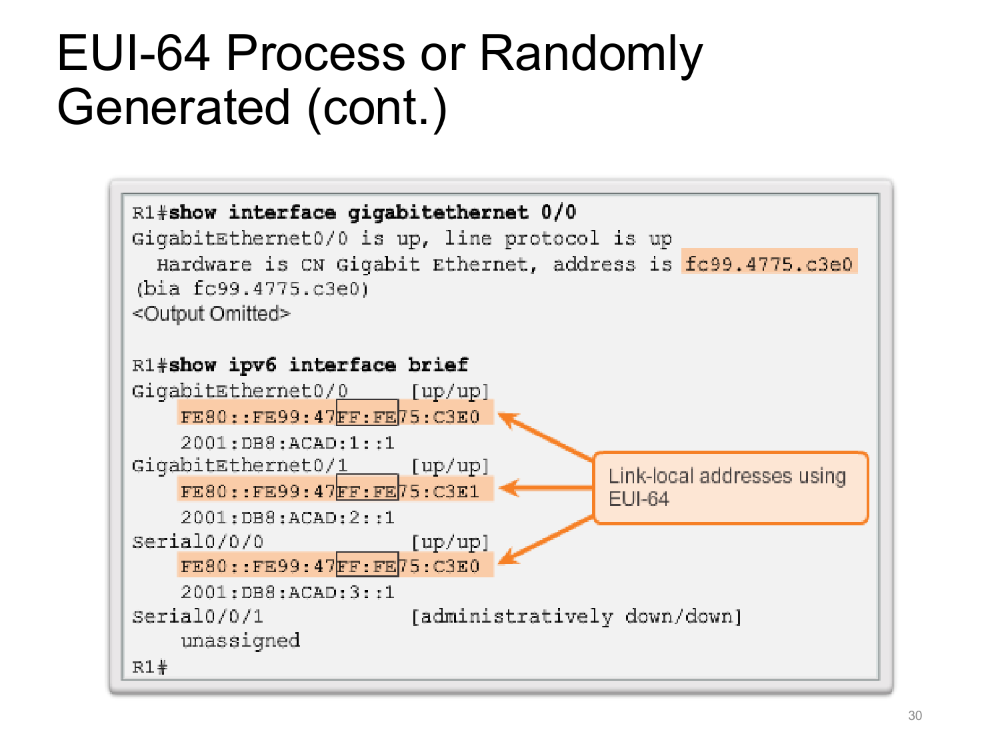

*R1 G0/0 MAC fc99.4775.c3e0 → link-local FE80::FE99:47FF:FE75:C3E0；G0/1 → …:C3E1；Serial0/0/0 也是 …:C3E0（Link-local addresses using EUI-64）（Slide 30）*

*（网页版此处可以输入任意 MAC 地址和 /64 prefix，逐步生成 EUI-64 Interface ID）*

| 例子                 | MAC               | 插入 FFFE                 | 翻转 U/L 位 | Interface ID            | Link-local                | SLAAC 全球单播                             |
| ------------------ | ----------------- | ----------------------- | -------- | ----------------------- | ------------------------- | -------------------------------------- |
| Slide 29           | FC:99:47:75:CE:E0 | FC:99:47:FF:FE:75:CE:E0 | FC → FE  | **FE99:47FF:FE75:CEE0** | FE80::FE99:47FF:FE75:CEE0 | 2001:DB8:ACAD:1:FE99:47FF:FE75:CEE0/64 |
| Slide 30 · R1 G0/0 | FC:99:47:75:C3:E0 | FC:99:47:FF:FE:75:C3:E0 | FC → FE  | **FE99:47FF:FE75:C3E0** | FE80::FE99:47FF:FE75:C3E0 | 2001:DB8:ACAD:1:FE99:47FF:FE75:C3E0/64 |
| U/L 位本来是 1         | 02:00:5E:10:00:01 | 02:00:5E:FF:FE:10:00:01 | 02 → 00  | **0000:5EFF:FE10:0001** | FE80::5EFF:FE10:1         | 2001:DB8:ACAD:2::5EFF:FE10:1/64        |

- **Advantage**：the Ethernet MAC address can be used to determine the interface; **is easily tracked**（Slide 28）

### 🟡 随机生成（Randomly Generated Interface IDs，Slide 31）

- 视操作系统而定，设备可以用**随机**的 Interface ID，不用 MAC
- **Beginning with Windows Vista, Windows uses a randomly generated Interface ID**；**Windows XP** 及更早用 EUI-64

> **💼 安全视角：为什么改成随机**
>
> EUI-64 让地址后 64 位永远等于「MAC + FFFE」：笔记本从公司到咖啡店再到机场，后 64 位都一样，网站和网络运营者能把这些记录**串成一个人的行踪**，还能从 OUI 看出是哪个厂商的设备。随机 Interface ID（加上定期更换的 temporary address）就是为了**隐私**。对管理员来说代价是：从地址反查是哪台设备变难了，要靠 DHCPv6 记录或交换机日志。

---

## 10. 🟡 Link-local 地址：动态生成 vs 静态配置（Slide 32–36）

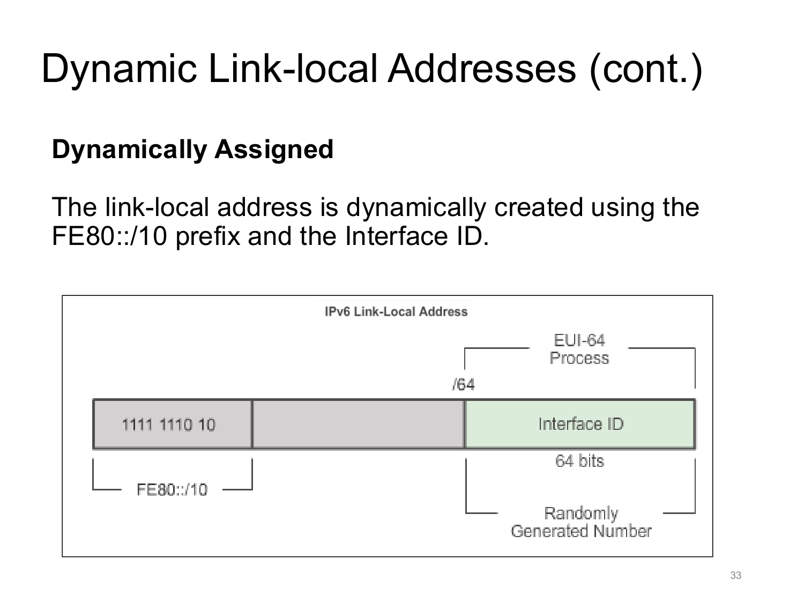

*Dynamically Assigned：FE80::/10 前缀 + Interface ID（EUI-64 Process 或 Randomly Generated Number）（Slide 33）*

- **After a global unicast address is assigned to an interface, an IPv6-enabled device automatically generates its link-local address**
- 动态生成 = **FE80::/10 prefix + Interface ID**（Cisco 路由器用 EUI-64，Windows 用随机数）
- EUI-64 生成的 link-local 又长又难记 → 路由器上常**手动**配成好记的 `FE80::1`

```
R1(config)# interface gigabitethernet 0/0
R1(config-if)# ipv6 address fe80::1 link-local
```

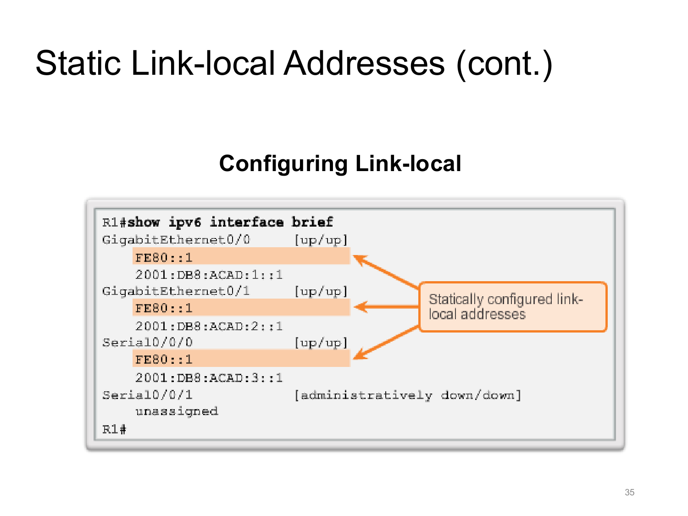

*show ipv6 interface brief：G0/0、G0/1、S0/0/0 的 link-local 都是 FE80::1（Statically configured link-local addresses）（Slide 35）*

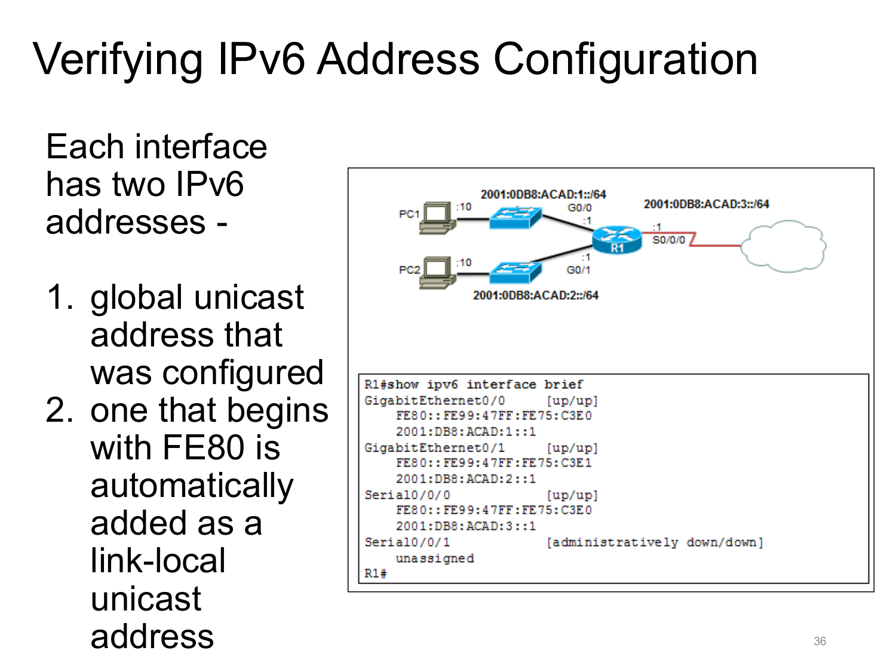

*Verifying：每个接口有两个 IPv6 地址——配置的 GUA（2001:DB8:ACAD:1::1）+ 自动加上的 FE80 开头 link-local（Slide 36）*

> **🎯 考点**
>
> **三个接口都用 FE80::1 不冲突吗？** 不冲突。link-local **只需要在本链路上唯一**，三个接口连的是三条不同的链路。GUA 就不行——GUA 全球唯一，三个接口必须是 `:1::1`、`:2::1`、`:3::1`。

> **📌 注意**
>
> Slide 30 / 36 里 **Serial0/0/0 的 link-local 和 G0/0 一样**（…:C3E0）：串口没有 MAC 地址，Cisco 借用第一个以太网接口的 MAC 来做 EUI-64。因为两个接口在不同链路上，所以没问题。

---

## 11. 🔴 IPv6 组播（Multicast · FF00::/8）

- **IPv6 multicast addresses have the prefix FF00::/8**（Slide 37）
- 两类：**Assigned multicast**（固定的组）和 **Solicited node multicast**

### 🔴 Assigned multicast（Slide 38–39）

| 地址          | 名字                              | 谁加入                                                      | 作用                                                   |
| ----------- | ------------------------------- | -------------------------------------------------------- | ---------------------------------------------------- |
| **FF02::1** | **All-nodes** multicast group   | **All IPv6-enabled devices join**                        | **Same effect as an IPv4 broadcast address**；RA 发到这里 |
| **FF02::2** | **All-routers** multicast group | **All IPv6 routers join**（敲了 `ipv6 unicast-routing` 才加入） | 发给链路上所有路由器；RS 发到这里                                   |

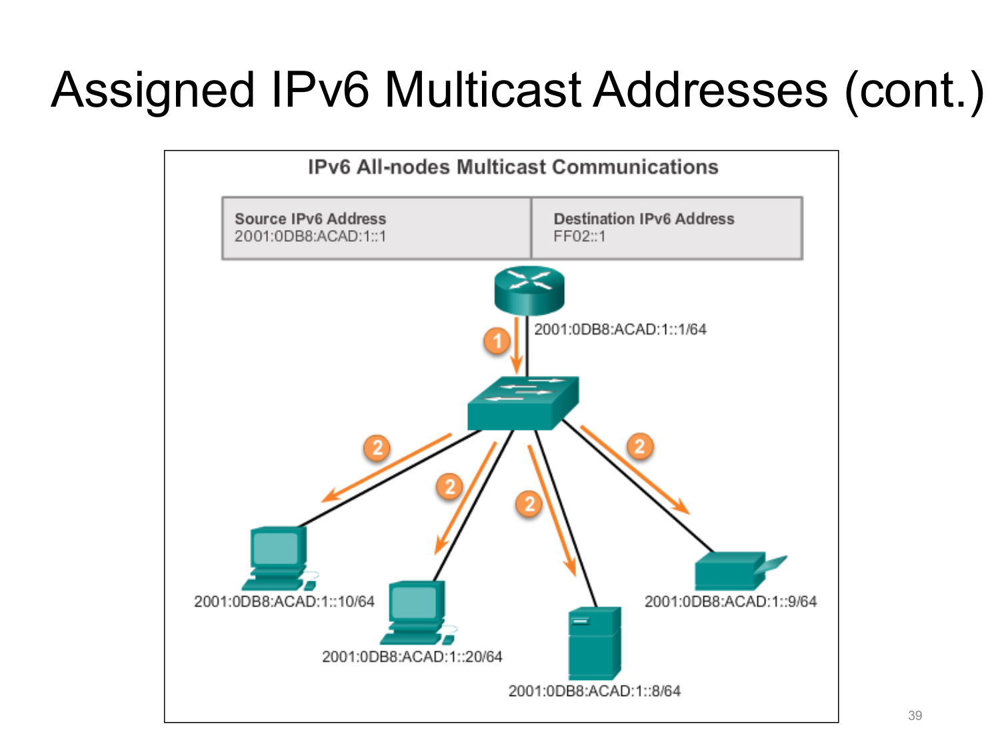

*IPv6 All-nodes Multicast Communications：路由器 2001:0DB8:ACAD:1::1 发给 FF02::1，链路上所有设备都收到（Slide 39）*

### 🔴 Solicited-node multicast（Slide 40–41）

- **Matches only the last 24 bits** of the IPv6 unicast address of a device
- **Automatically created** when the global unicast or link-local unicast addresses are assigned
- \= **FF02:0:0:0:0:1:FF00::/104 前缀**（前 104 位）+ 单播地址**最右边 24 位**（Least significant 24 bits）

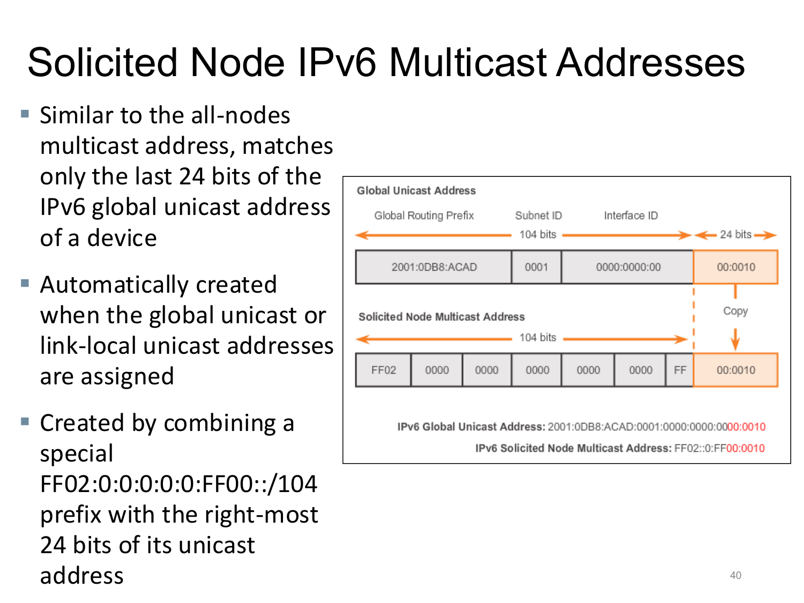

*GUA 2001:0DB8:ACAD:0001:0000:0000:0000:0010 → 最右边 24 位 00:0010 复制过来 → Solicited Node Multicast Address（Slide 40）*

**做法**：

1. 把单播地址写成完整形式，取**最后 6 个十六进制数**（24 位 = 6 × 4）
2. 前面接上 `FF02::1:FF`

| 单播地址                                           | 最后 24 位 | Solicited-node        |
| ---------------------------------------------- | ------- | --------------------- |
| 2001:DB8:ACAD:1::10（…:0000:**0010** → 00:0010） | 00 0010 | **FF02::1:FF00:10**   |
| FE80::21A:2BFF:FE3C:4D5E                       | 3C 4D5E | **FF02::1:FF3C:4D5E** |

> **⚠️ 课件笔误：少了一个 1**
>
> Slide 40–41 写的是 **FF02:0:0:0:0:0:FF00::/104**，图里的结果写成 **FF02::0:FF00:0010**。标准（RFC 4291，Cisco 原教材也是）是 **FF02:0:0:0:0:1:FF00::/104**，即 `FF02::1:FFxx:xxxx`。考试如果是选择题，看选项给的是哪一种；自己写答案时写标准版 `FF02::1:FF00:10`，必要时注明。

> **💡 小白理解**
>
> **为什么要 solicited-node**：IPv4 想知道某个 IP 的 MAC，要发 ARP **广播**，链路上所有设备都被打扰。IPv6 没有广播，改成发到对方的 **solicited-node 组播地址**——只有最后 24 位相同的设备才会处理（通常只有目标自己）。这就是 IPv6 的 **Neighbor Solicitation**（课外：NDP 代替了 ARP）。

---

## 12. 🔴 IPv6 子网划分（Subnetting IPv6）

### 🔴 在 Subnet ID 里划分（Slide 43–44）

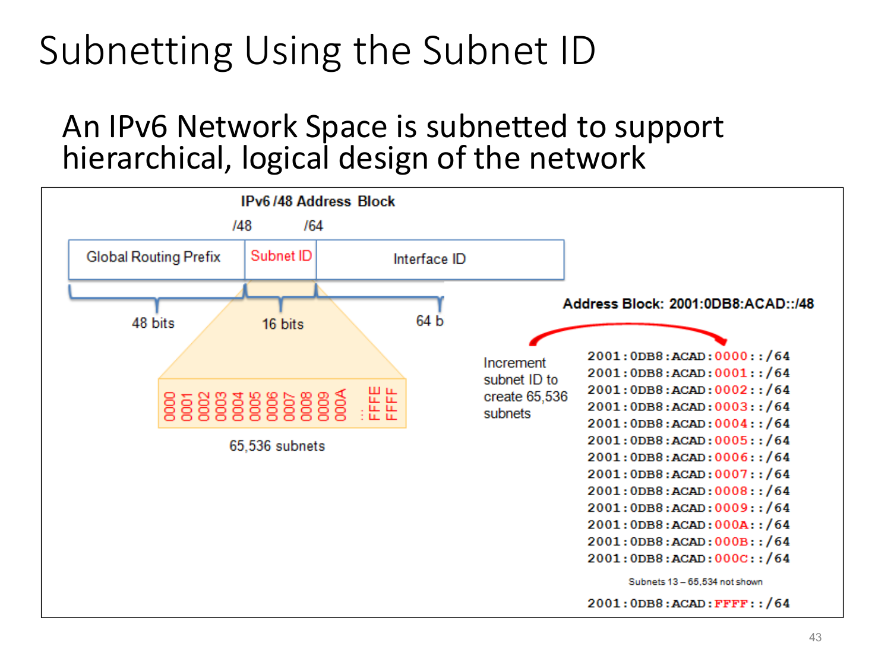

*/48 地址块 2001:0DB8:ACAD::/48：16 位 Subnet ID 从 0000 数到 FFFF → 65,536 个 /64 子网（Slide 43）*

- **An IPv6 network space is subnetted to support hierarchical, logical design of the network**
- 拿到一个 **/48** → 第 4 个 hextet（16 位 Subnet ID）**直接从 0000 数到 FFFF** → **2¹⁶ = 65,536** 个 **/64** 子网
- 每个子网的 Interface ID 有 64 位 → 2⁶⁴ 个地址，**永远不用担心主机不够**

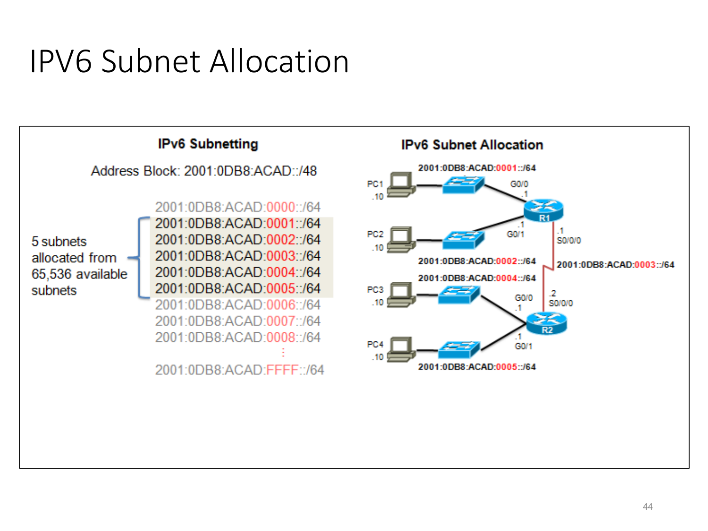

*5 subnets allocated from 65,536：R1 G0/0 = :0001::/64、R1 G0/1 = :0002::/64、R1–R2 串口 = :0003::/64、R2 G0/0 = :0004::/64、R2 G0/1 = :0005::/64（Slide 44）*

| 子网                       | 用在哪里（Slide 44）     |
| ------------------------ | ------------------ |
| 2001:DB8:ACAD:**1**::/64 | R1 G0/0（PC1 的 LAN） |
| 2001:DB8:ACAD:**2**::/64 | R1 G0/1（PC2 的 LAN） |
| 2001:DB8:ACAD:**3**::/64 | R1 – R2 之间的串口线     |
| 2001:DB8:ACAD:**4**::/64 | R2 G0/0（PC3 的 LAN） |
| 2001:DB8:ACAD:**5**::/64 | R2 G0/1（PC4 的 LAN） |

和第 4 周一样：**两台路由器之间的线也是一个子网**。

### 🟡 借进 Interface ID（Slide 45）

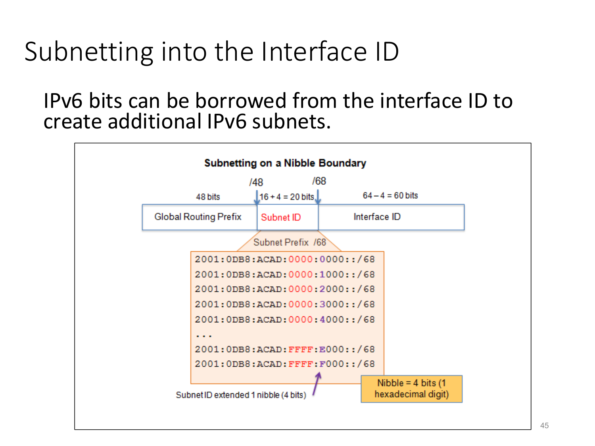

*Subnetting on a Nibble Boundary：/48 + 16 + 4 = /68，Subnet ID 多借 1 个 nibble（4 位 = 1 个十六进制数）；2001:0DB8:ACAD:0000:0000::/68、…:0000:1000::/68、…:0000:2000::/68 … …:FFFF:F000::/68（Slide 45）*

- **IPv6 bits can be borrowed from the interface ID to create additional IPv6 subnets**
- 按 **nibble boundary**（每次借 4 位 = 一个十六进制数）借，地址才好读：/68 → 第 5 个 hextet 的第一个十六进制数是子网号 → 子网之间差 **1000**（十六进制）
- /48 → /68 一共借了 **20** 位 → 2²⁰ = **1,048,576** 个子网，每个剩 60 位 Interface ID

*（网页版此处可以自己选地址块和新前缀长度，并查任意地址属于哪个子网）*

**/48 → /64（Slide 43）：借 16 位 → 2^16 = 65,536 个子网，每个子网 Interface ID 剩 64 位**

| #    | 子网                      |
| ---- | ----------------------- |
| 0    | 2001:DB8:ACAD::/64      |
| 1    | 2001:DB8:ACAD:1::/64    |
| 2    | 2001:DB8:ACAD:2::/64    |
| 3    | 2001:DB8:ACAD:3::/64    |
| …    | …                       |
| FFFF | 2001:DB8:ACAD:FFFF::/64 |

2001:DB8:ACAD:3::1 → **2001:DB8:ACAD:3::/64**

**/48 → /68 进 Interface ID（Slide 45）：借 20 位 → 2^20 = 1,048,576 个子网，每个子网 Interface ID 剩 60 位**

| #     | 子网                           |
| ----- | ---------------------------- |
| 0     | 2001:DB8:ACAD::/68           |
| 1     | 2001:DB8:ACAD:0:1000::/68    |
| 2     | 2001:DB8:ACAD:0:2000::/68    |
| 3     | 2001:DB8:ACAD:0:3000::/68    |
| …     | …                            |
| FFFFF | 2001:DB8:ACAD:FFFF:F000::/68 |

2001:DB8:ACAD:FFFF:F000::9 → **2001:DB8:ACAD:FFFF:F000::/68**

**/48 → /52：借 4 位 → 2^4 = 16 个子网，每个子网 Interface ID 剩 76 位**

| # | 子网                      |
| - | ----------------------- |
| 0 | 2001:DB8:ACAD::/52      |
| 1 | 2001:DB8:ACAD:1000::/52 |
| 2 | 2001:DB8:ACAD:2000::/52 |
| 3 | 2001:DB8:ACAD:3000::/52 |
| … | …                       |
| F | 2001:DB8:ACAD:F000::/52 |

2001:DB8:ACAD:A123::1 → **2001:DB8:ACAD:A000::/52**

> **🎯 IPv4 vs IPv6 子网划分对比**
>
> |       | IPv4（第 4 周）           | IPv6                                       |
> | ----- | --------------------- | ------------------------------------------ |
> | 子网位在哪 | 从 host 部分借            | 专门的 **16 位 Subnet ID**（不够再借 Interface ID）  |
> | 子网号写法 | 二进制，经常跨 octet，要算间隔    | **直接十六进制数数**：0、1、2 … A … FFFF              |
> | 主机数   | 2ʰ − 2                | 不用减 2（**没有 broadcast**），而且 2⁶⁴ 永远够用        |
> | 掩码    | 255.255.255.224 或 /27 | 只写 /64                                     |
> | 主要考虑  | 子网数和主机数**此消彼长**       | 只要**层次化、好记**（hierarchical, logical design） |

---

## 13. 🔴 IPv4 vs IPv6 总对照

| 项目      | IPv4                            | IPv6                                                  |
| ------- | ------------------------------- | ----------------------------------------------------- |
| 长度      | 32 位，点分十进制                      | **128 位**，冒号十六进制（8 个 hextet）                          |
| 地址数     | 约 43 亿                          | 约 3.4 × 10³⁸（340 undecillion）                         |
| 网络部分    | Subnet mask 或 /n                | **只用 /prefix length**，通常 /64                          |
| 公网 / 私网 | 公网 · 私有 10/172.16/192.168 + NAT | **GUA 2000::/3** · Unique local **FC00::/7**（不需要 NAT） |
| 本机测试    | 127.0.0.1                       | **::1**                                               |
| 未指定     | 0.0.0.0                         | **::**                                                |
| 链路本地    | 169.254.x.x（课外）                 | **FE80::/10**，每个接口**必须**有                             |
| 广播      | 有                               | **没有**，用 **FF02::1** all-nodes 组播                     |
| 找 MAC   | ARP 广播                          | 发到 **solicited-node** 组播（NDP，课外）                      |
| 自动配置    | DHCP                            | **SLAAC**（RA）· stateless DHCPv6 · stateful DHCPv6     |
| 主机部分    | Host ID                         | **Interface ID**（EUI-64 或随机）                          |

---

## 14. 🔴 综合缩写速查表

| 缩写 / 术语 | 全称                                                                             | 含义                                |
| ------- | ------------------------------------------------------------------------------ | --------------------------------- |
| Hextet  | —                                                                              | 16 位 = 4 个十六进制数，IPv6 有 8 个        |
| Nibble  | —                                                                              | 4 位 = 1 个十六进制数                    |
| GUA     | Global Unicast Address                                                         | 全球单播，2000::/3                     |
| LLA     | Link-Local Address                                                             | 链路本地，FE80::/10                    |
| ULA     | Unique Local Address                                                           | 唯一本地（≈ 私有），FC00::/7               |
| ICANN   | Internet Corporation for Assigned Names and Numbers（课件写作 Internet Committee …） | 把地址块分给 RIR                        |
| RIR     | Regional Internet Registry                                                     | 五个地区注册机构，分 /48                    |
| ICMPv6  | Internet Control Message Protocol for IPv6                                     | RS / RA 等消息                       |
| RS / RA | Router Solicitation / Router Advertisement                                     | 主机问路由器 / 路由器回答（option 1、2、3）      |
| SLAAC   | Stateless Address Autoconfiguration                                            | 用 RA 的 prefix 自己生成地址              |
| DHCPv6  | Dynamic Host Configuration Protocol for IPv6                                   | stateless（只给其他信息）/ stateful（分配地址） |
| EUI-64  | Extended Unique Identifier-64                                                  | MAC 拆开 + FFFE + 翻转第 7 位           |
| OUI     | Organizationally Unique Identifier                                             | MAC 前 24 位，厂商代码                   |
| U/L bit | Universally / Locally administered bit                                         | MAC 第一个字节的第 7 位，EUI-64 要翻转        |
| NDP     | Neighbor Discovery Protocol（课外）                                                | RS / RA / NS / NA，代替 ARP          |

---

## 15. 模拟自测题

> 以下是**自测题**，按本笔记顺序排列，用来检查自己是否真的掌握，**不是预测的考题**。点开看参考答案。

**1. 为什么要从 IPv4 转到 IPv6？至少说三点。**

> ① IPv4 地址空间耗尽（depletion）是最主要的原因，2³² 只有约 43 亿个；② 上网人数增加 + IoT 设备爆炸；③ NAT 只是权宜之计，带来很多问题；④ IPv6 有 128 位、约 340 undecillion 个地址，并改进了 IPv4 的不足（例如 ICMPv6）。

**2. 一个 IPv6 地址有多少位？多少个十六进制数？多少个 hextet？一个 hextet 多少位？**

> 128 位 = 32 个十六进制数 = 8 个 hextet；每个 hextet 16 位（4 个十六进制数）。

**3. 把 2001:0DB8:0000:0000:0000:0000:0000:0001 写成最短形式。**

> 先去前导 0：2001:DB8:0:0:0:0:0:1；再把 6 个连续的 0 换成 `::` → **2001:DB8::1**。

**4. 把 2001:DB8:A::1:0:0:5 写成完整（preferred）形式。它是最短写法吗？**

> 写出来的 hextet 有 2001、DB8、A、1、0、0、5 共 7 个，所以 `::` 代表 1 个全 0 hextet：**2001:0DB8:000A:0000:0001:0000:0000:0005**。
>
> 它不是最短写法：后面的 `0:0` 有两个 hextet，压缩那段更短 → **2001:DB8:A:0:1::5**。两种都合法，但 `::` 只能用一次。

**5. 2001:0DB8::ABCD::1234 为什么是错的？**

> `::` 用了两次。一共缺 8 − 4 = 4 个全 0 hextet，但不知道第一个 `::` 代表几个、第二个代表几个（1+3、2+2、3+1 都可能），地址有歧义。

**6. 0A00 去前导 0 后写成什么？能写成 A 吗？**

> 写成 **A00**。不能写成 A：只能去**前导** 0，A 会被读成 000A。

**7. 判断地址类型：(a) FE80::1  (b) 2001:DB8:ACAD:1::10  (c) FD00:AB::1  (d) FF02::2  (e) ::1  (f) ::**

> (a) Link-local（FE80::/10）；(b) Global unicast（2000::/3）；(c) Unique local（FC00::/7，≈ IPv4 私有地址）；(d) All-routers 组播；(e) Loopback；(f) Unspecified（只能当源地址）。

**8. Link-local 地址的范围是什么？为什么第一个 hextet 只能是 FE80 到 FEBF？**

> FE80::/10，前 10 位固定为 1111 1110 10。第一个 hextet 剩下 6 位可以变：全 0 = 1111 1110 1000 0000 = **FE80**，全 1 = 1111 1110 1011 1111 = **FEBF**。

**9. 把 2001:DB8:ACAD:1::10/64 拆成全球单播地址的三部分，并说出各自的位数和谁决定。**

> Global Routing Prefix = **2001:0DB8:ACAD**（48 位，ISP / RIR 分配）；Subnet ID = **0001**（16 位，公司自己编）；Interface ID = **0000:0000:0000:0010**（64 位，相当于 IPv4 的 host 部分）。

**10. SLAAC 是什么？「stateless」是什么意思？**

> Stateless Address Autoconfiguration：设备从路由器的 ICMPv6 **RA** 消息拿到 prefix、prefix length 和默认网关，再自己生成 Interface ID（EUI-64 或随机），不需要 DHCPv6 服务器。Stateless = 没有服务器记录哪个设备用了哪个地址。

**11. RA 的三个选项分别是什么？哪个是 stateful？**

> Option 1 **SLAAC only**：RA 里的信息就够了；Option 2 **SLAAC and DHCPv6**：地址用 SLAAC，DNS 等其他信息找 DHCPv6（stateless DHCPv6）；Option 3 **DHCPv6 only**：不要用 RA 的信息，全部找 DHCPv6 server——这是 **stateful DHCPv6**。

**12. 用 EUI-64 求 MAC 00:1A:2B:3C:4D:5E 的 Interface ID 和 link-local 地址。**

> ① 拆开：00 1A 2B | 3C 4D 5E；② 插 FFFE：00 1A 2B FF FE 3C 4D 5E；③ 翻转第 7 位：00 = 0000 00**0**0 → 0000 00**1**0 = **02**。
>
> Interface ID = **021A:2BFF:FE3C:4D5E**；link-local = **FE80::21A:2BFF:FE3C:4D5E**。

**13. EUI-64 有什么优点和缺点？Windows 现在用什么？**

> 优点：从地址能认出是哪个接口（MAC），容易追踪管理。缺点：同一设备到哪里后 64 位都一样，隐私差、容易被跟踪。从 Windows Vista 开始用**随机生成**的 Interface ID（XP 及以前用 EUI-64）。

**14. 路由器的三个接口都配成 FE80::1 link-local，可以吗？为什么默认网关用 link-local？**

> 可以。link-local 只要求在本链路上唯一，三个接口连三条不同链路。默认网关用路由器的 link-local：每个接口一定有、不会因为换 ISP 而变，而且网关本来就在同一条链路上；RA 的源地址也是 link-local。

**15. FF02::1 和 FF02::2 分别是什么？IPv6 用什么代替 IPv4 的广播？**

> FF02::1 = all-nodes 组播（所有 IPv6 设备都加入，效果等于 IPv4 广播）；FF02::2 = all-routers 组播（所有启用了 ipv6 unicast-routing 的路由器加入）。IPv6 **没有广播**，用 FF02::1 代替。

**16. 求 2001:DB8:ACAD:1::10 和 FE80::21A:2BFF:FE3C:4D5E 的 solicited-node 组播地址。**

> 取最右边 24 位（6 个十六进制数），接在 FF02::1:FF 后面：
>
> - 2001:DB8:ACAD:1::10 → 最后 24 位 00:0010 → **FF02::1:FF00:10**
> - FE80::21A:2BFF:FE3C:4D5E → 最后 24 位 3C:4D5E → **FF02::1:FF3C:4D5E**
>
> （课件把前缀写成 FF02:0:0:0:0:0:FF00::/104，少了一个 1，标准是 FF02:0:0:0:0:1:FF00::/104。）

**17. 公司拿到 2001:DB8:CAFE::/48。按 /64 划分能有多少个子网？第 10 号子网（从 0 开始数）是什么？2001:DB8:CAFE:1F::1 在哪个子网？**

> 16 位 Subnet ID → 2¹⁶ = **65,536** 个 /64 子网。10 号 = 十六进制 A → **2001:DB8:CAFE:A::/64**。2001:DB8:CAFE:1F::1 在 **2001:DB8:CAFE:1F::/64**（十六进制 1F = 第 31 号）。

**18. 什么时候要「借进 Interface ID」？为什么要按 nibble boundary 借？**

> 65,536 个 /64 子网都不够用（或想要更多层次）时，从 Interface ID 再借位，例如 /48 → /68。按 nibble（4 位 = 1 个十六进制数）借，子网号正好占完整的十六进制位，地址好读好算：/68 的子网之间差 1000（十六进制），如 2001:DB8:ACAD:0:1000::/68。
