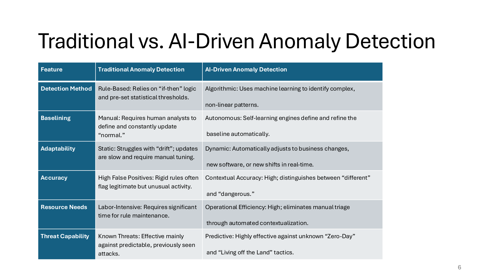
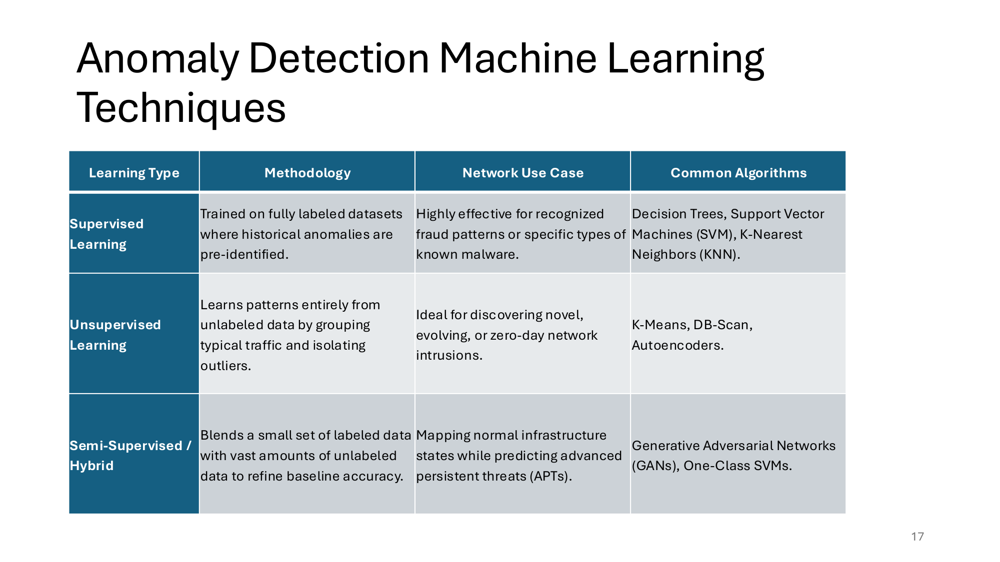
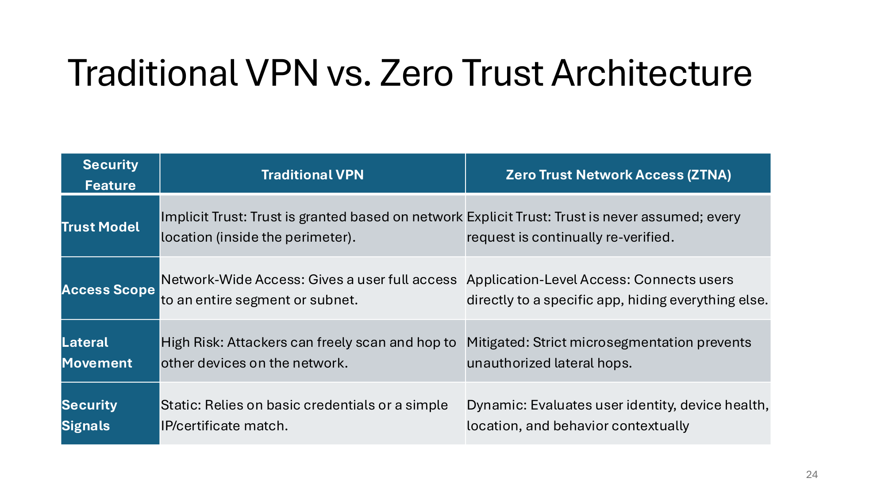
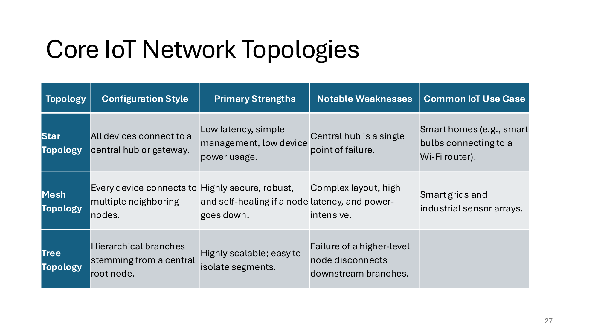
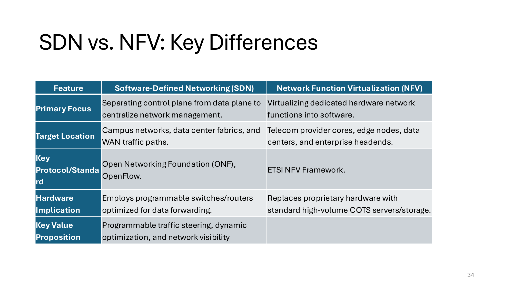

---
title:
  en: "Week 6 · AI Trends in Network Management"
  zh: "第 6 周 · 网络管理中的 AI 趋势"
summary:
  en: "AI-driven network anomaly detection (behavioural baselining vs signature rules, UEBA, NTA, supervised / unsupervised / semi-supervised techniques, business impact and trade-offs), Zero Trust Network Access principles, IoT topologies and device security, and the fundamentals of SDN and NFV."
  zh: "AI 驱动的网络异常检测（行为基线 vs 特征规则、UEBA、NTA、监督 / 无监督 / 半监督学习、业务价值与取舍）、零信任网络访问 (ZTNA) 原则、IoT 拓扑与设备安全，以及 SDN 和 NFV 的基础。"
week: 6
date: 2026-10-10
tags: [Anomaly Detection, Zero Trust, IoT, SDN, NFV]
---
# ISOM 5180 Advanced Network and Security Management — Week 6 复习笔记

**主题：Module 6 AI Trends in Network Management — AI 驱动的网络异常检测 · 自主基线 · UEBA / NTA · 机器学习三种方式 · 业务价值与取舍 · 零信任 (ZTNA) · IoT 拓扑与设备安全 · SDN 与 NFV**

> 优先级标注说明（按考试重要性）：  
> 🔴 **必考核心** — 概念名称、定义、结构必须能背出来  
> 🟡 **需要理解** — 需要懂逻辑关系，能举例说明  
> 🟢 **了解即可** — 背景知识，考试大概率不会细抠
>
> **优先级依据**（推断，可以随时改）：① 这一章**没有计算**，全是概念，最可能的考法是「比较 / 解释 / 举例」的简答题；② 课件里有 **5 张对比表**（Traditional vs AI、三种学习方式、VPN vs ZTNA、IoT 拓扑、SDN vs NFV），这是老师已经帮你整理好的答题框架，全部标 🔴；③ 带「三个 / 五个要点」的列表（ZTNA 三大支柱、IoT 三层攻击面、SDN 三个平面、NFV 三个组件）也标 🔴，适合「List and explain」类题目；④ 业务价值（Slide 10–15）偏叙述，标 🟡。

> **📌 关于本周的材料**
>
> - `lec6` 里**只有课件，没有 Supplementary**，课件本身也几乎只有文字和表格。
> - 不清楚课上讲到哪里，全部按「已讲」写；有哪部分没讲，告诉我，我改成预习标记。
> - 每一节都把课件的英文关键句放在表格左边——简答题可以直接用这些词组织答案。

---

## 0. 核心地图（先建立整体框架）

前 5 周都是「网络怎么通」：交换、路由、IP、子网、IPv6。这一章换成**管理和安全的新趋势**，四个主题其实是一条线：

```
AI 异常检测：不靠「已知特征」，而是学会这个网络的「正常样子」，偏离就报警（能抓 zero-day）
   → 零信任 ZTNA：不再相信「在内网 = 安全」，每次请求都验证；所有访问日志喂给 AI 检测
   → IoT：设备多、弱、难打补丁 → 用零信任分段（segmentation）把它们隔离出去
   → SDN / NFV：网络本身变成软件——集中控制（SDN）+ 网络功能虚拟化（NFV），才能快速做隔离和自动响应
```

**一句话抓住本周**：**从「静态规则 + 边界信任」转向「动态学习 + 永不信任」**。每个主题的对比表都是「传统做法（静态、手动、信任位置）vs 新做法（动态、自动、验证身份和行为）」。

---

## 1. 🔴 AI 驱动的网络异常检测（AI-Driven Network Anomaly Detection）

### 🔴 定义：行为分析 vs 特征规则（Slide 3）

| 课件原文                                                                                                                                                                | 中文 / 小白解释                             |
| ------------------------------------------------------------------------------------------------------------------------------------------------------------------- | ------------------------------------- |
| **proactive cybersecurity paradigm** that uses **machine learning and self-learning algorithms** to identify **abnormal behaviors or data points** within a network | 主动的安全思路：用机器学习找出网络里「不正常」的行为或数据点        |
| Traditional **NIDS** rely on **signature-based methods** or rigid **"if-then" rules** to spot **known** cyber threats                                               | 传统入侵检测系统：拿「已知攻击的特征」去比对，或写死的「如果…就报警」规则 |
| AI-driven systems focus on **behavioral analysis**, dynamically learning the unique **"personality" of a network**                                                  | AI 学这个网络平时的「性格」                       |
| catch out-of-character deviations — even if the specific threat has **never been seen before (zero-day attacks)**                                                   | 只要「不像平时」就能发现，哪怕是从没见过的攻击               |

> **💡 小白理解**
>
> **杀毒软件 vs 保安**：signature-based 像拿着通缉令照片的保安——照片上的人一定认得出，但新面孔（zero-day）完全没办法。behavioral analysis 像在公司干了十年的老保安——不认识你，但知道「平时没人凌晨 2 点拿着一箱文件出门」，所以觉得不对劲。

### 🟡 Deep Learning 与神经网络（Slide 4）

- 像一个**多层过滤器**，同时从成千上万个角度看数据
- 把多维数据交叉关联：**登录时间、数据流速度**……找出隐藏的、**非线性**的攻击模式
- 例子：规则只会因为「**一个大文件传输**」报警；神经网络会因为「**谁**在传、**什么时候**传、数据走了**什么不寻常的路线**」——哪怕是**短时间内一串小下载**——判断可疑

### 🔴 持续自主基线（Continuous Autonomous Baselining，Slide 5）

| 课件原文                                                                                                                            | 中文 / 小白解释                                                    |
| ------------------------------------------------------------------------------------------------------------------------------- | ------------------------------------------------------------ |
| **"model drift"**: your security rules become obsolete as your business grows                                                   | 业务在变，规则没变 → 规则过时                                             |
| dynamically ingests **time-series data** to establish an **evolving operational norm**                                          | 持续吃进按时间排列的数据，「正常」本身也在更新                                      |
| company deploys new software or shifts to a **24-hour work cycle** → AI automatically **self-corrects** and adapts in real-time | 上新软件、改成 24 小时轮班，AI 自己调整，**不需要人工重新校准 (manual recalibration)** |
| AI acts as a **master storyteller** … connect the dots between seemingly unrelated signals                                      | 把零散信号串成一个故事                                                  |
| a minor **privilege change** followed by a small, **encrypted outbound connection**                                             | 例：权限被小改一下 + 紧接着一个小的加密外连 → 单看都不起眼，连起来就是攻击                     |
| providing analysts with a unified, **actionable threat narrative** rather than a pile of disjointed logs                        | 给分析师一个能直接行动的「攻击经过」，而不是一堆零散日志                                 |

### 🟡 时间序列 agent 与季节性（Slide 7）

- 专门的 **"agents"** 处理 **time-series data**：不只发现**突增 (spike)** 或**突降 (dip)**，还懂数据的 **seasonality（季节性 / 周期性）**
- 例：传统系统会把**每周一早上的流量高峰**当成异常；AI agent 知道这是**每周的业务规律**
- 让 agent 自主完成 **"detect and respond"** 循环 → 从「看数据」变成以 **machine speed** 处理异常

*（网页版此处是一周流量的折线图：可以拖动规则阈值、打开 / 关闭三个场景，看规则和 AI 基线各报了什么警；下表是三个场景全开时的结果）*

| 设置              | 方法    | 报警数 | 误报 | 攻击抓到没有                                   |
| --------------- | ----- | --- | -- | ---------------------------------------- |
| 规则阈值 80         | 规则阈值  | 2   | 2  | ❌ 周二 02:00 有账号在凌晨大量拉数据；❌ 周五起每小时偷偷外传一点点数据 |
| 规则阈值 80         | AI 基线 | 8   | 6  | ✅ 周二 02:00 有账号在凌晨大量拉数据；❌ 周五起每小时偷偷外传一点点数据 |
| 为了抓凌晨那次把阈值调到 40 | 规则阈值  | 87  | 85 | ✅ 周二 02:00 有账号在凌晨大量拉数据；❌ 周五起每小时偷偷外传一点点数据 |
| 为了抓凌晨那次把阈值调到 40 | AI 基线 | 8   | 6  | ✅ 周二 02:00 有账号在凌晨大量拉数据；❌ 周五起每小时偷偷外传一点点数据 |

> **🎯 考点：用一个例子讲清「传统 vs AI」**
>
> 上面的实验就是答题模板：**① 误报**——静态阈值把周一高峰当攻击（Slide 7）；**② 漏报**——凌晨 2 点的数据拉取量不大，阈值抓不到，AI 知道「凌晨 2 点平时几乎没流量」所以报警（Slide 8 UEBA 的例子）；**③ 漂移**——改成轮班后 AI 自动更新基线（Slide 5）；**④ 局限**——只看流量大小，trickle 外传谁都抓不到，所以 NTA 要看时间、目的地和协议（Slide 9）。

### 🔴 Traditional vs AI-Driven Anomaly Detection（Slide 6）



*六个维度对比：Detection Method · Baselining · Adaptability · Accuracy · Resource Needs · Threat Capability（Slide 6）*

| 维度                    | Traditional                                  | AI-Driven                                                        |
| --------------------- | -------------------------------------------- | ---------------------------------------------------------------- |
| **Detection Method**  | **Rule-Based**：if-then 逻辑 + 预设统计阈值           | **Algorithmic**：机器学习找复杂、非线性的模式                                   |
| **Baselining**        | **Manual**：分析师定义并不断更新「正常」                    | **Autonomous**：自学习引擎自动定义、细化基线                                    |
| **Adaptability**      | **Static**：受 drift 困扰，更新慢、要手动调               | **Dynamic**：自动适应业务变化、新软件、新班次                                     |
| **Accuracy**          | **High False Positives**：死规则经常把「合法但少见」的活动当攻击 | **Contextual Accuracy**：能区分 **"different"（不同）和 "dangerous"（危险）** |
| **Resource Needs**    | **Labor-Intensive**：维护规则很花时间                 | **Operational Efficiency**：自动关联上下文，省掉人工分拣 (triage)               |
| **Threat Capability** | **Known Threats**：主要对付可预测、见过的攻击              | **Predictive**：能对付未知的 **Zero-Day** 和 **Living off the Land**     |

> **➕ 课外补充：Living off the Land (LotL)**
>
> 攻击者不带自己的恶意软件，而是用系统**自带的合法工具**（PowerShell、WMI、远程桌面、备份软件）干坏事。因为没有「恶意文件」，signature-based 工具找不到特征；只能靠行为看出「这个账号平时从不用 PowerShell 批量访问服务器」。

### 🟡 UEBA 与 NTA（Slide 8–9）

|       | **UEBA**（User and Entity Behavior Analytics）                      | **Autonomous NTA**（Network Traffic Analysis）                            |
| ----- | ----------------------------------------------------------------- | ----------------------------------------------------------------------- |
| 看什么   | **人和设备**的行为：为每个用户 / 设备建立独特的 **"DNA"**                             | **整个网络的流量**：时间、目的地、协议行为，而不只是包的大小                                        |
| 超越了什么 | 超越简单的 **"impossible travel"** 报警（10 分钟内从香港和伦敦登录）                  | 超越**按量报警**（volume-based alarms）                                         |
| 抓什么   | **账号被盗 (account takeover)**、**内部威胁 (insider threat)**——能绕过边界防护的那些 | **数据外泄 (data exfiltration)**，包括伪装成正常网页流量的隐藏信号和 **trickle exfiltration** |
| 课件例子  | 平时白天访问云存储的**市场部高管**，**凌晨 2 点**开始查询**敏感财务数据库**                     | 敏感数据被切成**很小的片**，一点点漏出去，每次都不触发流量报警                                       |

---

## 2. 🟡 业务价值（The Business Impact，Slide 10–15）

> 转向 AI 异常检测 **is more than a technical upgrade; it is a strategic decision** that directly affects an organization's **bottom line** and **operational resilience** —— from **constant firefighting** to **focused, high-value protection**（Slide 10）

| 价值                              | 课件要点                                                                                          | 底层逻辑（为什么老板在乎）                       |
| ------------------------------- | --------------------------------------------------------------------------------------------- | ----------------------------------- |
| **减少 SOC 告警疲劳**（Slide 11）       | 传统系统每天几千上万条告警，**近一半是 false positives**；AI 把相关信号**聚成一个 high-fidelity incident**，降低 noise floor | 分析师时间是最贵的资源；告警太多 → burnout、真正的攻击被淹没 |
| **加快事件响应**（Slide 12）            | 人工分拣**每条告警近一小时**；AI **几秒内重建整个攻击链**，跨 network / cloud / user behavior 关联                       | 自动化勒索软件以 machine speed 横向移动，人跟不上    |
| **降低 zero-day 的财务风险**（Slide 13） | 重大泄露的和解金可达**数亿**；在**侦察阶段 (reconnaissance)** 就抓到入侵者，**在数据外泄之前**                                | 避免灾难性损失和长期品牌损害                      |

**四大好处**（Slide 14，适合「List the benefits」）：

| Benefit                       | 中文      | 一句话                               |
| ----------------------------- | ------- | --------------------------------- |
| **Predictive Threat Hunting** | 预测性威胁狩猎 | 发现 zero-day 和 Living off the Land |
| **Operational Resilience**    | 运营韧性    | 过滤噪音，减少 SOC burnout               |
| **Contextual Accuracy**       | 上下文准确   | 区分「正常的业务灵活性」和「恶意意图」，安全不拖创新后腿      |
| **Rapid Containment**         | 快速遏制    | 在外泄或横向移动之前把威胁处理掉                  |

- Slide 15 的总结：管理安全靠**手工清单 (manual checklists)** 的时代要结束了；AI 用一个会随网络进化的「大脑」取代**死板、静态的规则**，关闭攻击者利用的 **visibility gaps**

> **💼 商科视角：怎么在答题里讲「价值」**
>
> 用「成本 + 风险」两条线：**成本**——同样的分析师团队能处理更多真实事件（每条告警 1 小时 → 秒级）；**风险**——更早发现 = 损失更小（侦察阶段 vs 数据已经外泄）。再加一句**取舍**（第 4 节）：要付算力成本、初期会有误报、还要投资人员培训和数据治理。

---

## 3. 🔴 架构与机器学习技术（Slide 16–17）

### 🔴 三步工作流程（Core Architecture & How It Works）

| 步骤                                       | 课件原文                                                                                                                                                                      | 中文 / 小白解释                                  |
| ---------------------------------------- | ------------------------------------------------------------------------------------------------------------------------------------------------------------------------- | ------------------------------------------ |
| **① Data Ingestion & Feature Selection** | collects network traffic logs, user activity records, packet metadata, system alerts；提取 **IP addresses, port numbers, protocol behaviors, packet timing** 作为 **features** | 收数据 → 挑出有用的「特征」（第 2–4 周学的 IP、端口在这里变成模型的输入） |
| **② Baseline Profiling**                 | During **model training**, reviews **historical data** to establish an expected operational **baseline** —— what **"benign"** everyday traffic looks like                 | 用历史数据学「正常长什么样」                             |
| **③ Real-Time Inference & Evaluation**   | continuously evaluates **streaming** network events against the learned baseline；significantly outside the mathematical norm → flagged as **outliers**                    | 实时比对，偏离太多就标成离群点，立刻响应                       |

> **🧠 记忆口诀**
>
> **收 → 学 → 比**：Ingest（收数据挑特征）→ Baseline（学正常）→ Inference（实时比对）。

### 🔴 三种机器学习方式（Anomaly Detection ML Techniques）



*Supervised · Unsupervised · Semi-Supervised / Hybrid：Methodology、Network Use Case、Common Algorithms（Slide 17）*

| Learning Type                | 方法（Methodology）                         | 网络用途                      | 常用算法                             |
| ---------------------------- | --------------------------------------- | ------------------------- | -------------------------------- |
| **Supervised**               | 用**全部有标签**的数据训练，历史异常已经标好                | **已知**的欺诈模式、特定类型的已知恶意软件   | **Decision Trees、SVM、KNN**       |
| **Unsupervised**             | 完全从**无标签**数据学习：把典型流量**分组**，把**离群点**隔离出来 | 发现**新型、不断变化、zero-day** 入侵 | **K-Means、DB-Scan、Autoencoders** |
| **Semi-Supervised / Hybrid** | **少量有标签** + **大量无标签**，提高基线准确度           | 描绘正常基础设施状态，同时预测 **APT**   | **GANs、One-Class SVM**           |

> **💡 小白理解**
>
> **有没有「答案」**：supervised = 老师给了每道题的答案（这条是攻击 / 这条正常），学会了只认得**见过的题型**；unsupervised = 没有答案，自己把题目分堆，「不属于任何一堆的」就可疑——所以能发现新题型；semi-supervised = 只有几道题有答案，加上大量没答案的题一起学。网络安全里**有标签的攻击数据很少**，这就是 unsupervised / semi-supervised 重要的原因。

*（网页版此处是点选练习：这属于哪种学习方式？（Slide 17）；下表是全部题目和答案）*

| 情景                                           | 答案                           | 理由                                                                   |
| -------------------------------------------- | ---------------------------- | -------------------------------------------------------------------- |
| 用过去三年已经标好「欺诈 / 正常」的交易记录训练模型，识别已知的欺诈模式        | **Supervised**               | 数据全部有标签（historical anomalies are pre-identified），针对已知模式              |
| 没有任何标签，把流量自动分成几堆「常见行为」，离所有堆都很远的点就是异常         | **Unsupervised**             | unlabeled data + 分组 (clustering) + 隔离离群点，适合发现 zero-day               |
| 只有少量已确认的攻击样本，加上海量没标注的日常流量，一起训练来预测 APT        | **Semi-supervised / Hybrid** | 少量 labeled + 大量 unlabeled = semi-supervised；课件的用例正是 APT              |
| K-Means、DB-Scan、Autoencoders                 | **Unsupervised**             | Slide 17 列出的 unsupervised 常用算法                                       |
| Decision Trees、SVM、K-Nearest Neighbors (KNN) | **Supervised**               | Slide 17 列出的 supervised 常用算法                                         |
| GANs（生成对抗网络）、One-Class SVM                   | **Semi-supervised / Hybrid** | Slide 17 列出的 semi-supervised / hybrid 常用算法                           |
| 要发现一种从来没见过的新型入侵（zero-day）                    | **Unsupervised**             | 没见过就没有标签，只能靠「和平时不一样」——ideal for novel, evolving, zero-day intrusions |

---

## 4. 🟡 实际用例与取舍（Slide 18–19）

**三个实际用例**（Slide 18）：

| 用例                             | 攻击者在做什么                                                        | AI 怎么抓                                       |
| ------------------------------ | -------------------------------------------------------------- | -------------------------------------------- |
| **Trickle Data Exfiltration**  | 把敏感数据切成很小、断断续续的片段外传，躲开流量报警                                     | 不只看包的大小，看**协议行为**和**目的地的一致性**有没有异常           |
| **Lateral Movement Detection** | 攻破一个**低优先级的容器**，再往关键数据库或未授权的云资源跳                               | 监控 **"East-West" 流量**（内部设备之间的流量）             |
| **Encrypted Traffic Analysis** | **C2 (command-and-control) beaconing**：被控设备定时「打电话回家」，伪装成普通网页流量 | 检查加密流的**元数据**（时间间隔、大小、目的地），**不需要解密** payload |

> **➕ 课外补充：North-South vs East-West**
>
> **North-South** = 进出数据中心 / 公司边界的流量（用户 ↔ 服务器、公司 ↔ Internet），传统防火墙放在这里；**East-West** = 内部服务器 / 设备之间的流量。攻击者一旦进来，主要在 East-West 方向横向移动，而传统边界防火墙看不到这部分——这正是第 5 节零信任要解决的问题。

**三个取舍**（Slide 19，适合「What are the limitations / considerations」）：

| Trade-off                                  | 内容                                                              |
| ------------------------------------------ | --------------------------------------------------------------- |
| **Dynamic Adaptation vs. False Positives** | 长期看会减少误报；但企业网络一直在变，**正常的配置变化在模型更新之前也会触发误报**（上面实验里轮班开始的前 6 小时）   |
| **Scale vs. Compute Cost**                 | 能处理人类分析师处理不了的海量遥测数据；代价是**实时处理引擎（TensorFlow、PyTorch）的算力和基础设施成本** |
| **Socio-Technical Elements**               | 成功不只靠算法：**分析师培训、信任、合乎伦理的数据治理**同样关键                              |

---

## 5. 🔴 零信任网络访问（Zero Trust Network Access，ZTNA）

### 🔴 核心理念（Slide 21）

| 课件原文                                                                                                                                          | 中文 / 小白解释                                    |
| --------------------------------------------------------------------------------------------------------------------------------------------- | -------------------------------------------- |
| a singular foundational axiom: **"Never trust, always verify"**                                                                               | 永不信任，始终验证                                    |
| Traditional security relied on a **"castle-and-moat"** approach, assuming that anyone or anything **inside the corporate perimeter was safe** | 传统 = 城堡 + 护城河：进了城门就是自己人                      |
| assuming that **threats exist both inside and outside** the network, treating **every single request as potentially hostile**                 | 零信任：内外都有威胁，每个请求都可能是敌人                        |
| secures connections at the **application level** based on **identity, device posture, and real-time context**                                 | 不是保护一个「地点」，而是按**身份、设备状态、实时情境**保护每个到**应用**的连接 |

> **💡 小白理解**
>
> **城堡 vs 机场**：城堡模式下，过了吊桥就能在城里随便走。零信任像机场：进航站楼要查证件，过安检要再查，登机口还要再查，而且你的登机牌**只能上这一架飞机**。

### 🔴 三大支柱（The Three Core Pillars，Slide 22）

| 支柱                                   | 课件要点                                                                                                                                                                                                                   | 中文                           |
| ------------------------------------ | ---------------------------------------------------------------------------------------------------------------------------------------------------------------------------------------------------------------------- | ---------------------------- |
| **Verify Explicitly**                | Always authenticate and authorize based on **all available data points**；**cannot grant trust purely because of a user's IP address or corporate location**；验证 **user identity, device health, environmental signals** | 每次都明确验证，不能因为「IP 是内网的」就信任     |
| **Use Least Privilege Access (LPA)** | **Just-In-Time (JIT)** 和 **Just-Enough-Access (JEA)**；不给整个子网，**只给完成任务需要的那个应用**                                                                                                                                         | 最小权限：需要的时候才给（JIT），只给够用的（JEA） |
| **Assume Breach**                    | 假设攻击者**已经进来了**；用**端到端加密**和**严格网络隔离**缩小 **blast radius**（爆炸半径）                                                                                                                                                          | 假设已被攻破，把损失控制在最小范围            |

> **🧠 记忆口诀**
>
> **零信任三支柱：「验 · 少 · 坏」**——每次都**验**（Verify explicitly）、权限给最**少**（Least privilege）、假设已经**坏**了（Assume breach）。

### 🔴 支撑技术（Supporting Architecture，Slide 23）

| 原则                                                      | 做什么                                                                                              | 对付什么                         |
| ------------------------------------------------------- | ------------------------------------------------------------------------------------------------ | ---------------------------- |
| **Continuous Authentication & Dynamic Risk Evaluation** | **Access is never a one-time event**；短期 token，持续评估异常登录时间、地理位置突变、设备变化 → 自动撤销访问或要求 **step-up MFA** | 登录后账号被劫持                     |
| **Microsegmentation**                                   | 把网络切成很细的隔离区，给关键工作负载建 **micro-perimeters**                                                        | 扁平网络里的 **east-west 横向移动**    |
| **Application Darkening & Hidden Infrastructure**       | 用 **trust brokers** 和**反向代理网关**，内部应用**不监听公网 IP**，对 Internet「隐形」                                  | 外部扫描探测，缩小 **attack surface** |
| **Centralized Observability and Monitoring**            | 收集、关联、检查 **100%** 的访问日志和流量，喂给 **AI 异常检测引擎**                                                      | 看不见的盲区（和第 1 节连起来了）           |

> **📌 和第 4 周的联系**
>
> 第 4 周说子网划分可以把 exam server 和学生 PC 隔开、让路由器做检查——那是**粗粒度分段**（一个子网一块）。**Microsegmentation** 是把这个思路推到极致：每个关键工作负载自己一圈边界，同一子网里的两台服务器之间也要检查。

### 🔴 Traditional VPN vs ZTNA（Slide 24）



*Trust Model · Access Scope · Lateral Movement · Security Signals 四个维度对比（Slide 24）*

| 维度                   | Traditional VPN                             | ZTNA                                             |
| -------------------- | ------------------------------------------- | ------------------------------------------------ |
| **Trust Model**      | **Implicit Trust**：按**网络位置**（在边界内）给信任       | **Explicit Trust**：从不默认信任，**每个请求持续重新验证**         |
| **Access Scope**     | **Network-Wide Access**：连上就能访问**整个网段 / 子网** | **Application-Level Access**：直接连到**某个应用**，其他全部隐藏 |
| **Lateral Movement** | **High Risk**：攻击者可以自由扫描、跳到其他设备              | **Mitigated**：严格 microsegmentation 阻止未授权的横向跳跃    |
| **Security Signals** | **Static**：只看基本凭证或简单的 IP / 证书匹配             | **Dynamic**：按情境评估用户身份、设备健康、位置、行为                 |

*（网页版此处是点选练习：这条做法体现的是 ZTNA 的哪一条？（Slide 22–23）；下表是全部题目和答案）*

| 情景                                               | 答案                            | 理由                                                                       |
| ------------------------------------------------ | ----------------------------- | ------------------------------------------------------------------------ |
| 员工在公司内网也不能直接访问系统，每次都要验证身份、设备健康状况                 | **Verify explicitly**         | 不能因为 IP 地址 / 在公司里就信任，每个 transaction 都要验证                                 |
| 财务人员只能看到报销系统这一个应用，看不到整个财务子网，权限用完即收回 (JIT)        | **Least privilege**           | Just-In-Time + Just-Enough-Access，只给完成任务所需的那个应用                          |
| 默认攻击者已经在内网，所以内部流量也全部端到端加密、严格隔离，缩小爆炸半径            | **Assume breach**             | Assume breach：minimize the blast radius                                  |
| 把数据库服务器单独划成一个小区域，其他区域被攻破也跳不进来                    | **Microsegmentation**         | micro-perimeters around critical workloads，阻止 east-west lateral movement |
| 内部应用不监听任何公网 IP，外面扫描不到，只能通过 trust broker / 反向代理访问 | **Application darkening**     | Application darkening & hidden infrastructure：缩小外部 attack surface        |
| 登录后半小时，账号突然从另一个国家发请求，系统要求再做一次 MFA                | **Continuous authentication** | Access is never a one-time event：短期 token + 动态风险评估 → step-up MFA         |

---

## 6. 🟡 IoT 网络拓扑与设备安全（Slide 26–29）

- IoT **bridges the physical and digital worlds**：规模巨大，带来独特的架构和安全挑战
- 要保护 IoT：理解**拓扑**（设备在物理 / 逻辑上怎么组织）+ 做好**设备安全**（基础防护层）

### 🔴 三种 IoT 拓扑（Core IoT Network Topologies，Slide 27）



*Star · Mesh · Tree：Configuration Style、Primary Strengths、Notable Weaknesses、Common IoT Use Case（Slide 27）*

| 拓扑       | 结构                           | 优点                                           | 缺点                                         | 常见用途                                 |
| -------- | ---------------------------- | -------------------------------------------- | ------------------------------------------ | ------------------------------------ |
| **Star** | 所有设备连到**一个中心 hub / gateway** | 延迟低、管理简单、设备省电                                | **中心 hub 是单点故障 (single point of failure)** | **智能家居**（智能灯泡连 Wi-Fi 路由器）            |
| **Mesh** | 每个设备连**多个邻居节点**              | 非常安全、**robust**，某个节点坏了能**自愈 (self-healing)** | 布局复杂、延迟高、**耗电**                            | **智能电网**、工业传感器阵列                     |
| **Tree** | 从中心**根节点**分出层级分支             | **高度可扩展**，容易隔离某一段                            | **上层节点故障 → 下游分支全部断开**                      | 课件这一格空着（我的补充：大楼 / 园区里按楼层、区域分层的传感器网络） |

> **💡 小白理解**
>
> **用第 1 周的拓扑知识理解**：star 就是交换机连一圈 PC；mesh 是「每个人都拉着好几个人的手」，断一个人还能绕过去；tree 是「公司组织架构图」，部门经理（上层节点）请假，下面整个组都联系不上。

### 🔴 IoT 三层攻击面（The Multi-Layer IoT Attack Surface，Slide 28）

| 层                                  | 包括什么                                     | 典型风险                                               |
| ---------------------------------- | ---------------------------------------- | -------------------------------------------------- |
| **Perception / Device Layer**      | 物理硬件、传感器、固件、本地存储                         | **物理篡改**、暴露的调试端口（**JTAG / UART**）、**未保护的加密密钥**     |
| **Transport / Network Layer**      | 通信协议：Wi-Fi、Zigbee、Cellular、**MQTT、CoAP** | **中间人攻击 (MitM)**、**明文传输**、被拉进 **DDoS botnet**      |
| **Processing & Application Layer** | 云服务器、API、手机 App                          | **broken object-level authentication**、**不安全的云存储** |

*（网页版此处是点选练习：这个风险在 IoT 攻击面的哪一层？（Slide 28）；下表是全部题目和答案）*

| 情景                                        | 答案                           | 理由                                                                              |
| ----------------------------------------- | ---------------------------- | ------------------------------------------------------------------------------- |
| 攻击者拆开摄像头，通过没封住的 JTAG / UART 调试口读出固件       | **Perception / Device**      | 物理硬件、固件、debug 端口都在 Perception / Device 层                                        |
| 智能门锁用明文 MQTT 传开锁指令，被同一 Wi-Fi 下的人中间人截获     | **Transport / Network**      | 通信协议（Wi-Fi、Zigbee、MQTT、CoAP）和 MitM 属于 Transport / Network 层                     |
| 手机 App 的 API 没检查对象权限，改一下设备 ID 就能看到别人家的摄像头 | **Processing & Application** | broken object-level authentication，云端 / API / App 属于 Processing & Application 层 |
| 成千上万台默认密码的摄像头被感染，组成 botnet 发起 DDoS        | **Transport / Network**      | 课件把 DDoS botnet recruitment 列在 Transport / Network 层（对策是 credential hygiene）    |
| 传感器把加密密钥明文存在本地存储里                         | **Perception / Device**      | unprotected cryptographic keys / local storage = Device 层                       |
| 设备数据上传到的云存储桶被设成公开可读                       | **Processing & Application** | insecure cloud storage = Processing & Application 层                             |

### 🔴 设备安全基础（Device Security Basics: Hardening the Network，Slide 29）

| 措施                                     | 课件要点                                                                             | 对应哪一层风险                  |
| -------------------------------------- | -------------------------------------------------------------------------------- | ------------------------ |
| **Zero-Trust Network Segmentation**    | **绝不**把 IoT 设备和敏感数据（笔记本、公司服务器）放在同一个网络 / **VLAN**；被攻破也跳不过去                        | 横向移动（第 5 节）              |
| **Credential Hygiene**                 | **绝不保留默认密码**；每台设备用唯一凭证、强 token 或证书认证（**mutual TLS**）                             | botnet 招募（Mirai 就是扫默认密码） |
| **Encryption Always**                  | 本地存储**静态加密 (at rest)**，空中传输**传输加密 (in transit)**，用 TLS/SSL                       | 明文传输、MitM、密钥泄露           |
| **Lifecycle Management & Secure Boot** | 启动时验证**加密签名**的代码（**Secure Boot**）；维护 **SBOM**（软件物料清单）追踪第三方组件；系统地推送**签名的 OTA 更新** | 固件被植入恶意代码、供应链漏洞          |
| **Physical Port Disabling**            | 生产环境**永久禁用或封住** JTAG、UART 调试口                                                    | 有物理接触的攻击者提取固件            |

> **➕ 课外补充：Mirai botnet（2016）**
>
> Mirai 扫描 Internet 上用**出厂默认密码**的摄像头和路由器，感染了几十万台，发动的 DDoS 一度让 Twitter、Netflix 等大网站在美国东岸无法访问。它同时说明了 Transport 层的 **botnet recruitment** 风险和 **credential hygiene** 为什么排在设备安全的第一批。

---

## 7. 🔴 SDN 与 NFV 基础（Slide 31–34）

- **SDN** 和 **NFV** 是现代敏捷网络的两大支柱：**互补 (complementary)**，但是**独立 (independent)** 的两种技术，解决传统网络的不同问题
- **传统网络的问题**：专有的专用硬件（路由器、交换机、防火墙），**「智能」和「搬数据的硬件」绑在一起** → 架构僵化，**难扩展、升级慢、管理贵**

### 🔴 SDN 的三个平面（The Three Planes，Slide 32）

| 平面                          | 比喻                        | 课件要点                                                                                              |
| --------------------------- | ------------------------- | ------------------------------------------------------------------------------------------------- |
| **Application Plane**       | —                         | 网络应用和服务：**安全监控、负载均衡、network slicing**                                                             |
| **Control Plane**           | **Centralized Brain（大脑）** | 从物理设备里**分离 (decoupled)**，集中在一个叫 **SDN Controller** 的软件里（例：**ONOS、Floodlight**）；掌握**全网视图**，决定包往哪里走 |
| **Data / Forwarding Plane** | **Muscle（肌肉）**            | 简单、便宜的物理或虚拟交换机 / 路由器；**自己没有路由智能**，只按控制器下发的指令转发                                                    |

> **💡 小白理解**
>
> **和第 1 周的路由器对比**：传统路由器每台都自己「想」（运行路由协议、算路由表）又自己「做」（转发）。SDN 把所有设备的「想」搬到一个中央控制器，设备只剩「做」。好处：改一条策略，在控制器里改一次，全网生效；控制器看得到全网，能做全局最优。风险（课外）：控制器本身成了**单点故障和重点攻击目标**。

### 🔴 NFV 的三个组成部分（Slide 33）

| 组件                                         | 课件要点                                                                             | 小白解释                      |
| ------------------------------------------ | -------------------------------------------------------------------------------- | ------------------------- |
| **VNFs**（Virtualized Network Functions）    | 网络服务的**软件实现**：不买硬件防火墙，在 **VM 或容器**里跑一个防火墙 VNF                                    | 「网络设备」变成「一个程序」            |
| **NFVI**（NFV Infrastructure）               | 承载 VNF 的物理和虚拟积木：服务器、存储、交换硬件 + **虚拟化层**（hypervisor：**KVM / ESXi**，或容器引擎）          | 跑这些程序的「机房」                |
| **NFV MANO**（Management and Orchestration） | 负责 provisioning、生命周期管理、资源分配；按需求 **instantiate、scale up / down、decommission** VNF | 「管理员 + 调度员」：什么时候开几个、什么时候关 |

*（网页版此处是点选练习：这属于 SDN 的哪个平面，还是 NFV 的哪个部分？（Slide 32–33）；下表是全部题目和答案）*

| 情景                                           | 答案                        | 理由                                                                        |
| -------------------------------------------- | ------------------------- | ------------------------------------------------------------------------- |
| ONOS / Floodlight 控制器：掌握全网视图，决定包往哪里走         | **SDN Control plane**     | centralized brain，SDN Controller 就在 control plane                         |
| 一台便宜的交换机，自己不会算路由，只按控制器下发的规则转发                | **SDN Data plane**        | data / forwarding plane = muscle，没有 intrinsic routing intelligence        |
| 安全监控、负载均衡、network slicing 这些网络应用             | **SDN Application plane** | application plane 放 network applications and services                     |
| 不买硬件防火墙，改成在虚拟机 / 容器里跑一个防火墙软件                 | **NFV · VNF**             | Virtualized Network Function = 网络功能的软件实现                                  |
| 跑这些虚拟防火墙的服务器、存储、交换机，加上 KVM / ESXi hypervisor | **NFV · NFVI**            | NFV Infrastructure = 物理 + 虚拟化层，承载 VNF                                     |
| 流量高峰时自动多开两个虚拟防火墙，闲时自动关掉                      | **NFV · MANO**            | Management and Orchestration 负责 provisioning、scale up / down、decommission |

### 🔴 SDN vs NFV（Slide 34）



*Primary Focus · Target Location · Key Protocol/Standard · Hardware Implication · Key Value Proposition（NFV 一栏课件空着）（Slide 34）*

| 维度                          | SDN                                              | NFV                                                  |
| --------------------------- | ------------------------------------------------ | ---------------------------------------------------- |
| **Primary Focus**           | **分离 control plane 和 data plane**，集中管理网络         | 把**专用硬件网络功能虚拟化成软件**                                  |
| **Target Location**         | 园区网、数据中心 fabric、WAN 流量路径                         | 电信运营商核心网、边缘节点、数据中心、企业总部                              |
| **Key Protocol / Standard** | **ONF**（Open Networking Foundation）、**OpenFlow** | **ETSI NFV Framework**                               |
| **Hardware Implication**    | 用**可编程交换机 / 路由器**，专门优化转发                         | 用标准、大批量的 **COTS** 服务器 / 存储**取代专有硬件**                 |
| **Key Value Proposition**   | 可编程的流量调度、动态优化、网络可见性                              | 课件空着（我的补充：**降低硬件成本 (CapEx)、按需快速部署和伸缩网络服务、不被单一厂商锁定**） |

> **🧠 记忆口诀**
>
> **一句话区分**：**SDN 分离「大脑」和「肌肉」**（控制怎么集中）；**NFV 把「盒子」变成「软件」**（功能怎么虚拟化）。两者可以一起用：SDN 控制器把流量引到 NFV 跑出来的虚拟防火墙。

> **💼 商科视角：为什么电信运营商最爱 NFV**
>
> 运营商以前每加一种网络服务（防火墙、负载均衡、计费网关）就要买一种专有硬件盒子，等厂商交货、上架、布线，几个月才能上线。NFV 后只要在通用服务器上开一个 VNF：**CapEx 变低**（通用服务器便宜）、**上线时间从月变成分钟**、**流量高峰时自动扩容**（MANO）。代价是要有懂虚拟化和自动化的人。

---

## 8. 🔴 综合缩写速查表

| 缩写                | 全称                                                                               | 含义                          |
| ----------------- | -------------------------------------------------------------------------------- | --------------------------- |
| NIDS              | Network Intrusion Detection System                                               | 传统网络入侵检测，主要靠 signature      |
| UEBA              | User and Entity Behavior Analytics                                               | 用户和实体（设备）行为分析               |
| NTA               | Network Traffic Analysis                                                         | 网络流量分析                      |
| SOC               | Security Operations Center                                                       | 安全运营中心，处理告警的团队              |
| LotL              | Living off the Land                                                              | 用系统自带的合法工具攻击                |
| APT               | Advanced Persistent Threat                                                       | 高级持续性威胁                     |
| C2                | Command-and-Control                                                              | 攻击者控制被感染设备的通道               |
| SVM / KNN         | Support Vector Machine / K-Nearest Neighbors                                     | supervised 算法               |
| GAN               | Generative Adversarial Network                                                   | semi-supervised / hybrid 算法 |
| ZTNA              | Zero Trust Network Access（课件标题写作 Architecture）                                   | 零信任网络访问                     |
| LPA / JIT / JEA   | Least Privilege Access / Just-In-Time / Just-Enough-Access                       | 最小权限 / 需要时才给 / 只给够用的        |
| MFA               | Multi-Factor Authentication                                                      | 多因素认证                       |
| VPN               | Virtual Private Network                                                          | 传统远程接入，按位置信任                |
| IoT               | Internet of Things                                                               | 物联网                         |
| MQTT / CoAP       | Message Queuing Telemetry Transport / Constrained Application Protocol           | IoT 常用的轻量通信协议               |
| JTAG / UART       | Joint Test Action Group / Universal Asynchronous Receiver-Transmitter            | 硬件调试端口                      |
| MitM              | Man-in-the-Middle                                                                | 中间人攻击                       |
| mTLS              | mutual TLS                                                                       | 双向证书认证                      |
| SBOM              | Software Bill of Materials                                                       | 软件物料清单                      |
| OTA               | Over-the-Air                                                                     | 无线远程更新                      |
| SDN               | Software-Defined Networking                                                      | 软件定义网络                      |
| NFV               | Network Function Virtualization                                                  | 网络功能虚拟化                     |
| VNF / NFVI / MANO | Virtualized Network Function / NFV Infrastructure / Management and Orchestration | NFV 三个组件                    |
| ONF / ETSI        | Open Networking Foundation / European Telecommunications Standards Institute     | SDN / NFV 的标准组织             |
| COTS              | Commercial Off-The-Shelf                                                         | 市面上现成的通用硬件                  |

---

## 9. 模拟自测题

> 以下是**自测题**，按本笔记顺序排列，用来检查自己是否真的掌握，**不是预测的考题**。点开看参考答案。

**1. 什么是 AI-driven network anomaly detection？它和传统 NIDS 的根本区别是什么？**

> 一种主动的安全方法，用机器学习和自学习算法找出网络中异常的行为或数据点。传统 NIDS 依赖 **signature-based** 方法或死板的 **if-then 规则**，只能发现**已知**威胁；AI 系统做 **behavioral analysis**，学习网络独特的「性格」，发现偏离常态的行为，所以能抓到从没见过的 **zero-day** 攻击。

**2. 什么是 model drift？AI 怎么解决？**

> 业务在增长和变化（新软件、新班次），而安全规则不变，规则就逐渐过时——这就是 model drift。AI 用 **continuous autonomous baselining**：持续吃进时间序列数据，建立一个**会演化的正常基线**，业务变化时自动、实时自我修正，不需要人工重新校准。

**3. 每周一早上流量都很高。传统系统和 AI agent 分别会怎么处理？这说明了什么？**

> 传统系统按固定阈值，会把它当异常报警（误报）；AI agent 理解数据的 **seasonality**，知道这是每周的业务规律，不报警。说明 AI 能区分 **"different"** 和 **"dangerous"**，误报更少（contextual accuracy）。

**4. 从 Detection Method、Baselining、Accuracy、Threat Capability 四个方面比较传统和 AI 异常检测。**

> - Detection Method：传统 **rule-based**（if-then + 预设阈值）；AI **algorithmic**（机器学习找非线性模式）
> - Baselining：传统**人工**定义并更新「正常」；AI **自主**定义和细化
> - Accuracy：传统 **false positives 多**；AI 有 **contextual accuracy**，区分「不同」和「危险」
> - Threat Capability：传统主要对付**已知**威胁；AI **predictive**，能对付 zero-day 和 Living off the Land

**5. UEBA 和 NTA 分别关注什么？各举一个课件里的例子。**

> **UEBA** 关注**用户和设备的行为**，为每个用户 / 设备建立独特的「DNA」，发现账号被盗和内部威胁——例：平时白天访问云存储的市场部高管，凌晨 2 点开始查询敏感财务数据库。**NTA** 关注**整个网络的流量**，看时间、目的地和协议行为而不只是大小，发现数据外泄——例：trickle exfiltration，数据切成很小的片慢慢漏出去，躲开按量报警。

**6. AI 异常检测对企业有哪三方面的业务影响？**

> ① **减少 SOC 告警疲劳**：传统告警近一半是误报，AI 把相关信号聚成一个高可信事件；② **加快事件响应**：人工分拣每条告警近一小时，AI 几秒重建攻击链，能挡住 machine-speed 的勒索软件；③ **降低 zero-day 的财务风险**：在侦察阶段、数据外泄之前就发现入侵，避免巨额和解金和品牌损害。

**7. 描述 AI 异常检测的三步架构。**

> ① **Data Ingestion & Feature Selection**：收集流量日志、用户活动、包元数据、系统告警，提取 IP、端口、协议行为、包时序等特征；② **Baseline Profiling**：训练阶段用历史数据建立「良性」日常流量的基线；③ **Real-Time Inference & Evaluation**：把实时事件和基线比对，显著偏离的标为 outlier 并立即响应。

**8. 比较 supervised、unsupervised、semi-supervised 三种学习方式，各举一种算法。为什么 unsupervised 适合 zero-day？**

> Supervised：用全部有标签的数据训练，适合已知欺诈和已知恶意软件（Decision Tree、SVM、KNN）。Unsupervised：无标签，把典型流量分组、隔离离群点，适合新型 / zero-day 入侵（K-Means、DB-Scan、Autoencoder）。Semi-supervised：少量有标签 + 大量无标签，用于描绘正常状态并预测 APT（GAN、One-Class SVM）。Zero-day 从来没出现过，不可能有标签，只能靠「和正常的样子不一样」来发现——这正是 unsupervised 的做法。

**9. 部署 AI 异常检测要考虑哪些取舍？**

> ① **动态适应 vs 误报**：长期误报减少，但正常的配置变化在模型更新前也会触发误报；② **规模 vs 算力成本**：能处理海量遥测，但实时处理引擎（TensorFlow、PyTorch）要算力和基础设施成本；③ **社会技术因素**：分析师培训、信任和合乎伦理的数据治理同样决定成败。

**10. 什么是零信任？它和传统的 castle-and-moat 模式有什么不同？**

> 零信任的核心原则是 **"Never trust, always verify"**。castle-and-moat 假设边界内的人和设备都是安全的；零信任假设**内外都有威胁**，把每个请求都当作可能有敌意，并且在**应用层**按身份、设备状态和实时情境保护每个连接，而不是保护一个物理位置。

**11. 列出并解释 ZTNA 的三大支柱。**

> ① **Verify Explicitly**：根据所有可用数据点认证和授权，不能因为 IP 地址或在公司里就信任，每次都验证身份、设备健康和环境信号；② **Least Privilege Access**：用 JIT 和 JEA 限制访问，只给完成任务所需的那个应用，而不是整个子网；③ **Assume Breach**：假设攻击者已经进来，用端到端加密和严格网络隔离缩小 blast radius。

**12. 从信任模型、访问范围、横向移动、安全信号四方面比较传统 VPN 和 ZTNA。**

> 信任模型：VPN **implicit**（按网络位置）vs ZTNA **explicit**（每个请求持续验证）；访问范围：VPN **整个网段** vs ZTNA **单个应用**；横向移动：VPN **高风险**，攻击者能自由扫描跳转 vs ZTNA 用 microsegmentation **缓解**；安全信号：VPN **静态**（凭证、IP / 证书）vs ZTNA **动态**（身份、设备健康、位置、行为）。

**13. Microsegmentation 和 application darkening 分别解决什么问题？**

> **Microsegmentation** 把网络切成细粒度的隔离区，围绕关键工作负载建 micro-perimeter，解决扁平网络中攻击者进来后的 **east-west 横向移动**。**Application darkening** 让内部应用不监听公网 IP，通过 trust broker / 反向代理访问，对 Internet 不可见，解决**外部探测扫描**，缩小外部攻击面。

**14. 比较 star、mesh、tree 三种 IoT 拓扑的优缺点。**

> Star：所有设备连中心 hub，延迟低、管理简单、省电，但 **hub 是单点故障**（智能家居）。Mesh：每个设备连多个邻居，安全、robust、能自愈，但布局复杂、延迟高、耗电（智能电网、工业传感器）。Tree：从根节点分层，扩展性强、容易隔离分段，但**上层节点故障会断开下游所有分支**。

**15. IoT 攻击面分哪三层？每层举一个风险，并给出对应的加固措施。**

> ① **Perception / Device**：调试端口（JTAG/UART）暴露 → **Physical port disabling**；② **Transport / Network**：明文传输 / MitM / botnet → **Encryption always**（TLS）、**credential hygiene**（不留默认密码）；③ **Processing & Application**：broken object-level authentication、不安全的云存储 → 严格的 API 认证和云存储配置（课件这层没有单独列措施，零信任分段可以限制被攻破后的影响）。

**16. 为什么不能把 IoT 设备和公司电脑放在同一个 VLAN？**

> IoT 设备通常安全性差（默认密码、难打补丁）。放在同一网络里，攻击者攻破一台 IoT 设备后就能**横向移动**到笔记本和公司服务器。**Zero-trust network segmentation** 把它们隔开，即使 IoT 设备被攻破，破坏也被限制在隔离区内。

**17. 说出 SDN 的三个平面，以及 control plane 和 data plane 分离带来的好处。**

> Application plane（网络应用，如安全监控、负载均衡）、Control plane（集中在 SDN Controller 里的「大脑」，有全网视图，决定路由）、Data / Forwarding plane（便宜的交换机 / 路由器，「肌肉」，只按指令转发）。分离后可以**集中管理**、全网策略一处修改、**可编程的流量调度**和更好的可见性，数据平面设备也更简单便宜。

**18. NFV 的 VNF、NFVI、MANO 分别是什么？**

> **VNF**：网络服务的软件实现（例如在 VM / 容器里跑的防火墙）；**NFVI**：承载 VNF 的物理资源（服务器、存储、交换）加虚拟化层（KVM / ESXi 或容器引擎）；**MANO**：管理和编排框架，负责 VNF 的部署、生命周期管理、资源分配和按需伸缩、下线。

**19. SDN 和 NFV 的主要区别是什么？它们能一起用吗？**

> SDN 的重点是**分离 control plane 和 data plane**、集中管理网络（标准：ONF、OpenFlow；用可编程交换机）；NFV 的重点是**把专用硬件网络功能虚拟化成软件**（标准：ETSI NFV；用 COTS 服务器取代专有硬件）。两者**互补但独立**，可以一起用：例如 SDN 控制器把可疑流量引到 NFV 运行的虚拟防火墙上。
