---
title:
  en: "Week 4 · Relational Model, Mapping & Normalization"
  zh: "第 4 周 · 关系模型、ERD 映射与规范化"
summary:
  en: "Relational keys and integrity constraints, the full ERD-to-relations mapping ruleset (14 cases), and normalization from 1NF through 3NF via functional dependencies, partial and transitive dependencies."
  zh: "关系键与完整性约束、完整的 ERD → 关系表映射规则（14 种情况），以及从函数依赖出发、通过部分依赖与传递依赖把表规范化到 3NF。"
week: 4
date: 2026-09-19
tags: [Relational Model, Normalization, Functional Dependency, Foreign Key, 3NF]
---
# ISOM 5260 Fundamentals of Database Management — Week 4 复习笔记

**主题：Relational Data Model（关系模型）· Keys & Integrity Constraints（键与完整性约束）· ERD → Relations Mapping（E-R 图转关系表）· Normalization 1NF→2NF→3NF（规范化）**

> 优先级标注说明（按考试重要性，根据课件篇幅和讲法推断；老师上课强调过的以你的记录为准）：
> 🔴 **必考核心** — 规则、定义必须能背出来，并能动手做题
> 🟡 **需要理解** — 懂逻辑，能举例说明
> 🟢 **了解即可** — 背景知识

> **表示法约定**：作业和考试统一用 **Graphical representation**（方格图），本笔记里所有 relation 都用这种画法：
> 表名写在上方，每个属性一个格子；**主键 = 实线下划线**，**外键 = 虚线下划线**；既是主键又是外键的列按课件惯例只画实线。
> 方格下方的「↳」行说明外键指向哪张表——**考试画图时要画成从外键指向被引用主键的箭头**。

---

## 0. 核心地图（先建立整体框架）

这节课回答一个问题：**上两周画好的 ERD，怎么变成数据库里真正的表？变完之后怎么检查表设计得好不好？**

```
SDLC 中的位置（Logical Design 阶段）
   → 关系模型的基本规则（什么样的表才算 relation）
   → 键：Primary Key / Foreign Key
   → 完整性约束：Domain / Entity / Referential Integrity
   → ⭐ ERD → Relations 映射规则（本课最大块，约 16 页）
        实体 → 属性(复合/多值/派生) → 弱实体 → 二元关系(1:1/1:M/M:N)
        → 关联实体 → 一元关系 → 三元关系 → 超类/子类
   → ⭐ Normalization：消除冗余与异常
        Anomalies → Functional Dependency → 1NF → 2NF → 3NF
```

**一句话**：前半节是「**怎么转**」（mapping），后半节是「**转得好不好**」（normalization）。两块都是出计算/画图题的地方。

---

## 1. 🟢 Logical Design 在 SDLC 中的位置

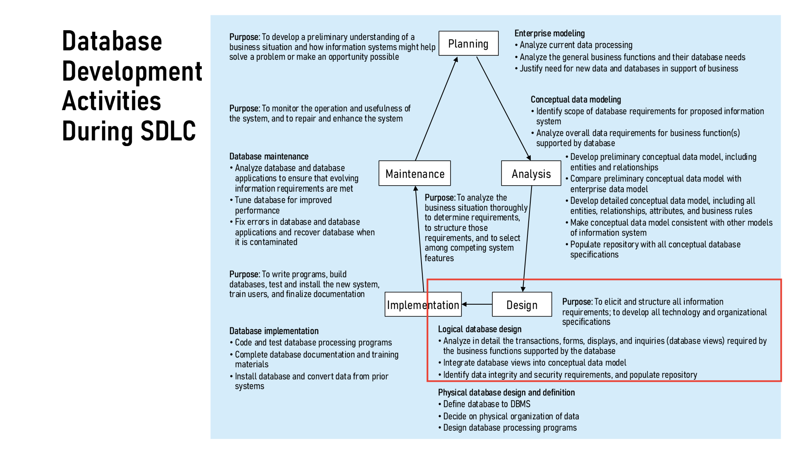

| SDLC 阶段 | 数据库相关活动 |
|---|---|
| Planning | Enterprise modeling（企业建模） |
| Analysis | Conceptual data modeling（概念建模 = 画 ERD，Week 2–3） |
| **Design** | **Logical database design（本周）** + Physical database design |
| Implementation | Database implementation（写程序、建库、迁移数据） |
| Maintenance | Database maintenance（调优、修错、恢复） |

**要点**：Logical design = 把概念模型（ERD）转成**关系模型（relations）**，并确定完整性与安全需求。还没涉及具体 DBMS 和物理存储（那是 Physical design）。

---

## 2. 🔴 Relational Data Model 关系模型

**三个组成部分**（p.4）：

| 组成 | 英文 | 解释 |
|---|---|---|
| 数据结构 | **Data structure** | 表（relations），有行和列 |
| 数据完整性 | **Data integrity** | 实现业务规则、保证数据一致的机制 |
| 数据操作 | **Data manipulation** | 用 SQL 查询和修改数据 |

### 什么样的表才算 relation？（p.5）🔴 五条要背

A relation is a **named, two-dimensional table** of data（rows = records, columns = attributes/fields）。

1. **Unique name** — 表名唯一
2. **Atomic values** — 每个格子只能有一个值（not multivalued, not composite）
3. **Unique rows** — 不能有两行完全相同
4. **Unique column names** — 同一张表里列名不能重复
5. **Order doesn't matter** — 行、列的顺序都无关紧要

> **踩坑提醒**：第 2 条（atomic）就是后面 **1NF** 的来源；第 4 条（列名不重复）在一元关系映射中会再次出现（`ManagerID`、`ComponentNo` 为什么要改名）。

### Schema 的画法：Graphical representation（p.6，作业/考试用这个）

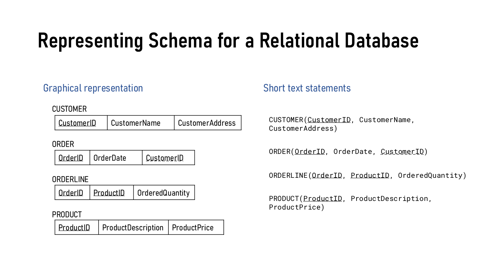

画图要点：
- 表名写在方格上方（大写）
- 每个属性占一个格子
- **主键：实线下划线**；**外键：虚线下划线**
- 外键用**箭头指向**被引用表的主键

---

## 3. 🔴 Relational Keys 键

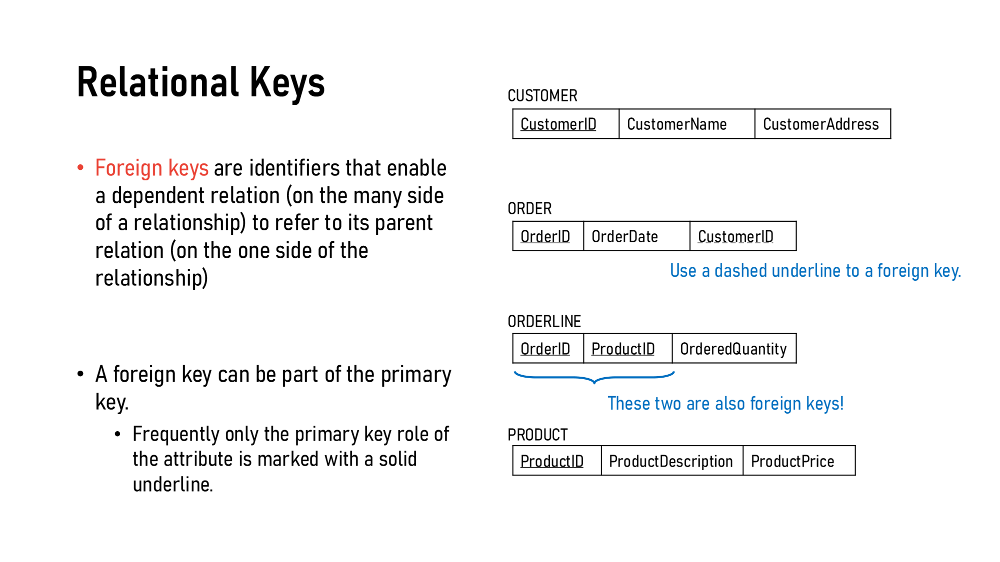

| 概念 | 英文定义（原文） | 小白解释 |
|---|---|---|
| **Primary Key 主键** | An attribute or a combination of attributes that uniquely identifies each row in a relation | 每行的"身份证号"。对应 ERD 里的 identifier。可以是 **simple**（单个属性）或 **composite**（多个属性组合，如 ORDERLINE 的 OrderID+ProductID） |
| **Foreign Key 外键** | Identifiers that enable a dependent relation (on the **many** side) to refer to its parent relation (on the **one** side) | "指向别的表的指针"。放在**多**的一方，引用**一**的一方的主键 |

**关键细节**：
- **外键可以同时是主键的一部分**（ORDERLINE 里的 OrderID、ProductID 既是 PK 的组成，又分别是 FK）。
- 这种情况下通常只画实线下划线（标主键角色）。

---

## 4. 🔴 Integrity Constraints 完整性约束（三种）

| 约束 | 规则（原文） | 小白解释 | 违反的例子 |
|---|---|---|---|
| **Domain Constraint** 域约束 | All values in a column must be from the same domain（type, size, range, meaning） | 每一列有"合法值范围" | StudentID 定义为 8 位数字，却填了 `S2026123`；Grade 填了 `82` |
| **Entity Integrity** 实体完整性 | **No primary key attribute may be null** | 主键**不能为空**（复合主键的每一部分都不能空） | COURSE 表里 CourseCode = null；ENROLLMENT 里 CourseCode = null（它是复合主键的一部分） |
| **Referential Integrity** 参照完整性 | Each **non-null** FK value must match an existing PK value in the related table | 外键要么为空，要么必须指向一个**真实存在**的主键 | ORDER 里 CustomerID = `O999`，但 CUSTOMER 表里没有这个客户 |

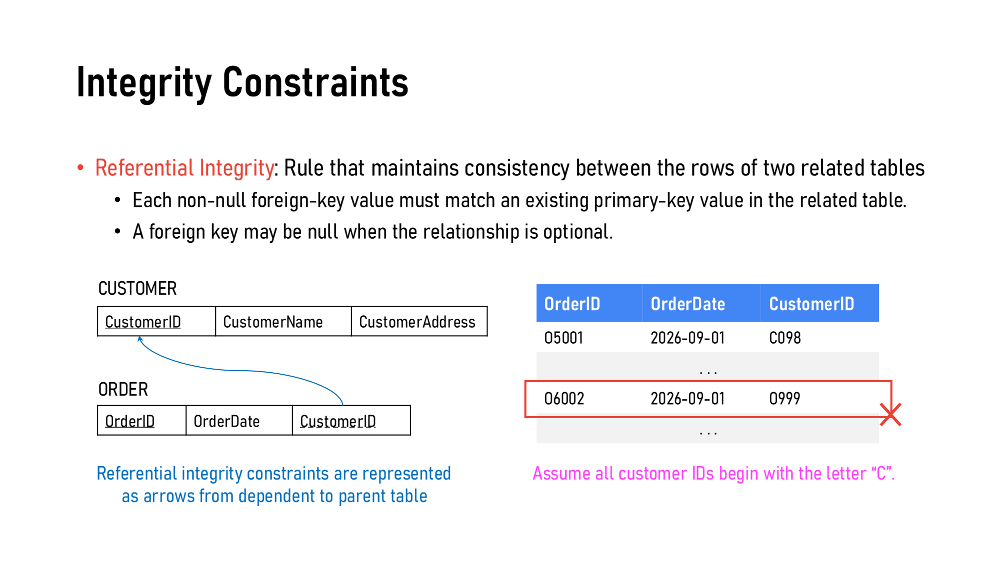

- **Null**：表示"没有值"（absence of a value），不是 0 也不是空字符串。
- **外键可以为 null**——当关系是 **optional**（可选参与）时。
- 图示：参照完整性用**箭头从 dependent（子表）指向 parent（父表）**。

> **考点**：给一张表让你找"哪一行违反了哪种约束"。判断顺序：① 值合不合 domain？② 主键有没有 null？③ 外键值在父表里存不存在？
>
> **踩坑提醒**：外键为 null **不**违反参照完整性（只要关系是可选的）；主键为 null **一定**违反实体完整性。

---

## 5. 🔴🔴 ERD → Relations 映射规则（本课最大考点）

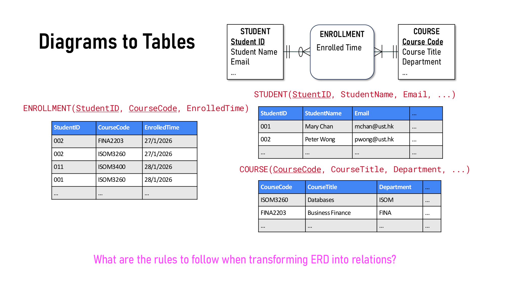

> 先放一张总表，考前背这张就够；后面逐条展开并画出结果。

| # | ERD 元素 | 映射规则 | 主键是什么 |
|---|---|---|---|
| 1 | Regular entity | 一个实体 → 一张表；简单属性 → 列 | 实体的 identifier |
| 2 | Composite attribute | 只保留**简单组成部分** | — |
| 3 | Multivalued attribute | **单独建一张表** + FK 指回原表 | 原表 PK + 该属性 |
| 3' | 多值属性自带细节 | 建独立表 + **关联表** 连起来 | 关联表：两边 PK 组合 |
| 4 | Derived attribute | **不存**（避免冗余） | — |
| 5 | Weak entity | 单独一张表 + FK 指向 owner | **Owner 的 PK + partial identifier** |
| 6 | Binary 1:1 | **Mandatory 一方的 PK** → **Optional 一方**做 FK | 各自原 PK |
| 7 | Binary 1:M | **"一"方的 PK** → **"多"方**做 FK | 各自原 PK |
| 8 | Binary M:N | **新建一张表**，两边 PK 合起来当主键 | 两个 PK 组合 |
| 9 | Associative entity（无自有 ID） | 同 M:N | 两个参与实体的 PK 组合 |
| 10 | Associative entity（有自有 ID） | 用自有 ID 当 PK，两边 PK 作 FK | **自有 ID** |
| 11 | Unary 1:M | 同一张表里加 **recursive FK** | 原 PK |
| 12 | Unary M:N | 两张表：实体表 + 关联表 | 关联表：两个属性都来自原 PK |
| 13 | Ternary | 每个实体一张表 + 关联实体一张表（带 3 个 FK） | 通常 3 个 FK 组合 |
| 14 | Supertype/Subtype | 超类一张表 + 每个子类一张表（1:1） | **子类 PK = 超类 PK** |

### 5.1 🔴 属性的处理（Regular entity, p.12–16）

用同一个 EMPLOYEE 实体贯穿：Employee ID（identifier）、Date Employed、Name (First Name, Last Name)、Home Address (Street Address, City, State)、\{Skill\}、[Years Employed]。

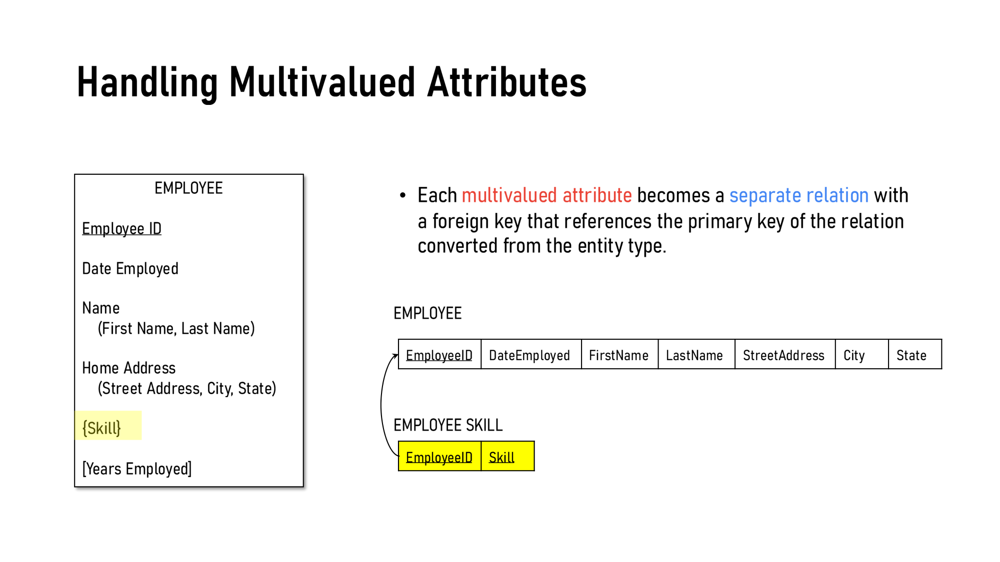

| 属性类型 | ERD 符号 | 怎么处理 | 结果 |
|---|---|---|---|
| Simple 简单 | 普通 | 直接成为一列 | EmployeeID、DateEmployed |
| **Composite 复合** | `Name (First, Last)` | **拆开**，只保留组成部分，不保留 "Name" 本身 | FirstName、LastName、StreetAddress、City、State |
| **Multivalued 多值** | `{Skill}` | **另建表** EMPLOYEE SKILL，EmployeeID 是 FK | 主键 = EmployeeID + Skill |
| **Derived 派生** | `[Years Employed]` | **不存**——可以从 DateEmployed 算出来 | 去掉 |

最终结果：

<div style={{margin: '6px 0 14px', pageBreakInside: 'avoid', breakInside: 'avoid'}}><div style={{fontSize: '0.85em', fontWeight: '600', marginBottom: '2px'}}>EMPLOYEE</div><table style={{borderCollapse: 'collapse', width: 'auto', margin: '0'}}><tr><td style={{border: '1px solid #333', padding: '4px 10px', whiteSpace: 'nowrap'}}><span style={{borderBottom: '1.5px solid #000', paddingBottom: '1px'}}>EmployeeID</span></td><td style={{border: '1px solid #333', padding: '4px 10px', whiteSpace: 'nowrap'}}>DateEmployed</td><td style={{border: '1px solid #333', padding: '4px 10px', whiteSpace: 'nowrap'}}>FirstName</td><td style={{border: '1px solid #333', padding: '4px 10px', whiteSpace: 'nowrap'}}>LastName</td><td style={{border: '1px solid #333', padding: '4px 10px', whiteSpace: 'nowrap'}}>StreetAddress</td><td style={{border: '1px solid #333', padding: '4px 10px', whiteSpace: 'nowrap'}}>City</td><td style={{border: '1px solid #333', padding: '4px 10px', whiteSpace: 'nowrap'}}>State</td></tr></table></div>

<div style={{margin: '6px 0 14px', pageBreakInside: 'avoid', breakInside: 'avoid'}}><div style={{fontSize: '0.85em', fontWeight: '600', marginBottom: '2px'}}>EMPLOYEE SKILL</div><table style={{borderCollapse: 'collapse', width: 'auto', margin: '0'}}><tr><td style={{border: '1px solid #333', padding: '4px 10px', whiteSpace: 'nowrap'}}><span style={{borderBottom: '1.5px solid #000', paddingBottom: '1px'}}>EmployeeID</span></td><td style={{border: '1px solid #333', padding: '4px 10px', whiteSpace: 'nowrap'}}><span style={{borderBottom: '1.5px solid #000', paddingBottom: '1px'}}>Skill</span></td></tr></table><div style={{fontSize: '0.8em', color: '#555', marginTop: '3px'}}>↳ EmployeeID → EMPLOYEE</div></div>

**多值属性的进阶版（p.15）**：如果 Skill 自己也有细节 \{Skill (Skill ID, Skill Name, Years Of Experience)\}：

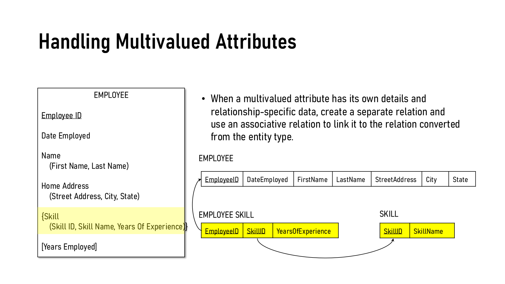

<div style={{margin: '6px 0 14px', pageBreakInside: 'avoid', breakInside: 'avoid'}}><div style={{fontSize: '0.85em', fontWeight: '600', marginBottom: '2px'}}>EMPLOYEE</div><table style={{borderCollapse: 'collapse', width: 'auto', margin: '0'}}><tr><td style={{border: '1px solid #333', padding: '4px 10px', whiteSpace: 'nowrap'}}><span style={{borderBottom: '1.5px solid #000', paddingBottom: '1px'}}>EmployeeID</span></td><td style={{border: '1px solid #333', padding: '4px 10px', whiteSpace: 'nowrap'}}>DateEmployed</td><td style={{border: '1px solid #333', padding: '4px 10px', whiteSpace: 'nowrap'}}>FirstName</td><td style={{border: '1px solid #333', padding: '4px 10px', whiteSpace: 'nowrap'}}>LastName</td><td style={{border: '1px solid #333', padding: '4px 10px', whiteSpace: 'nowrap'}}>StreetAddress</td><td style={{border: '1px solid #333', padding: '4px 10px', whiteSpace: 'nowrap'}}>City</td><td style={{border: '1px solid #333', padding: '4px 10px', whiteSpace: 'nowrap'}}>State</td></tr></table></div>

<div style={{margin: '6px 0 14px', pageBreakInside: 'avoid', breakInside: 'avoid'}}><div style={{fontSize: '0.85em', fontWeight: '600', marginBottom: '2px'}}>EMPLOYEE SKILL（关联表）</div><table style={{borderCollapse: 'collapse', width: 'auto', margin: '0'}}><tr><td style={{border: '1px solid #333', padding: '4px 10px', whiteSpace: 'nowrap'}}><span style={{borderBottom: '1.5px solid #000', paddingBottom: '1px'}}>EmployeeID</span></td><td style={{border: '1px solid #333', padding: '4px 10px', whiteSpace: 'nowrap'}}><span style={{borderBottom: '1.5px solid #000', paddingBottom: '1px'}}>SkillID</span></td><td style={{border: '1px solid #333', padding: '4px 10px', whiteSpace: 'nowrap'}}>YearsOfExperience</td></tr></table><div style={{fontSize: '0.8em', color: '#555', marginTop: '3px'}}>↳ EmployeeID → EMPLOYEE ；SkillID → SKILL</div></div>

<div style={{margin: '6px 0 14px', pageBreakInside: 'avoid', breakInside: 'avoid'}}><div style={{fontSize: '0.85em', fontWeight: '600', marginBottom: '2px'}}>SKILL</div><table style={{borderCollapse: 'collapse', width: 'auto', margin: '0'}}><tr><td style={{border: '1px solid #333', padding: '4px 10px', whiteSpace: 'nowrap'}}><span style={{borderBottom: '1.5px solid #000', paddingBottom: '1px'}}>SkillID</span></td><td style={{border: '1px solid #333', padding: '4px 10px', whiteSpace: 'nowrap'}}>SkillName</td></tr></table></div>

> **小白理解**：SkillName 只和技能本身有关 → 放 SKILL 表；YearsOfExperience 是"**某个员工**在**某个技能**上"的经验 → 属于这段关系，放关联表。
>
> **判断口诀**：属性跟着谁走，就放在谁的表里。

### 5.2 🔴 弱实体 Weak Entity（p.17–18）

**回顾**：Weak entity 只能通过 **identifying relationship**（双线）依附于 owner 存在；它没有完整的 identifier，只有 **partial identifier**。

例：EMPLOYEE —carries→ DEPENDENT（家属），partial identifier 是 Dependent Name (First Name, Last Name)。

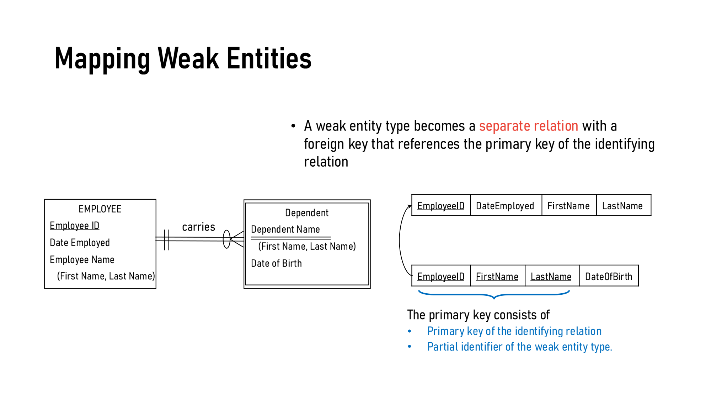

<div style={{margin: '6px 0 14px', pageBreakInside: 'avoid', breakInside: 'avoid'}}><div style={{fontSize: '0.85em', fontWeight: '600', marginBottom: '2px'}}>EMPLOYEE</div><table style={{borderCollapse: 'collapse', width: 'auto', margin: '0'}}><tr><td style={{border: '1px solid #333', padding: '4px 10px', whiteSpace: 'nowrap'}}><span style={{borderBottom: '1.5px solid #000', paddingBottom: '1px'}}>EmployeeID</span></td><td style={{border: '1px solid #333', padding: '4px 10px', whiteSpace: 'nowrap'}}>DateEmployed</td><td style={{border: '1px solid #333', padding: '4px 10px', whiteSpace: 'nowrap'}}>FirstName</td><td style={{border: '1px solid #333', padding: '4px 10px', whiteSpace: 'nowrap'}}>LastName</td></tr></table></div>

<div style={{margin: '6px 0 14px', pageBreakInside: 'avoid', breakInside: 'avoid'}}><div style={{fontSize: '0.85em', fontWeight: '600', marginBottom: '2px'}}>DEPENDENT</div><table style={{borderCollapse: 'collapse', width: 'auto', margin: '0'}}><tr><td style={{border: '1px solid #333', padding: '4px 10px', whiteSpace: 'nowrap'}}><span style={{borderBottom: '1.5px solid #000', paddingBottom: '1px'}}>EmployeeID</span></td><td style={{border: '1px solid #333', padding: '4px 10px', whiteSpace: 'nowrap'}}><span style={{borderBottom: '1.5px solid #000', paddingBottom: '1px'}}>FirstName</span></td><td style={{border: '1px solid #333', padding: '4px 10px', whiteSpace: 'nowrap'}}><span style={{borderBottom: '1.5px solid #000', paddingBottom: '1px'}}>LastName</span></td><td style={{border: '1px solid #333', padding: '4px 10px', whiteSpace: 'nowrap'}}>DateOfBirth</td></tr></table><div style={{fontSize: '0.8em', color: '#555', marginTop: '3px'}}>↳ EmployeeID → EMPLOYEE；主键 = EmployeeID（owner 的 PK）+ FirstName + LastName（partial identifier）</div></div>

> **考点**：弱实体的主键 = **Owner 的主键 + 自己的 partial identifier**。只写 partial identifier 当主键是经典失分点——两个员工的孩子可能同名。
>
> **为什么 FirstName、LastName 两列都在主键里？** 因为 Dependent Name 是**复合属性**，拆开后所有组成部分都要进主键。如果 partial identifier 是简单属性（如 DependentName），主键就是 EmployeeID + DependentName——**EmployeeID 永远不能省**。

### 5.3 🔴 二元关系 Binary Relationships（p.19–21）

**一句口诀：1:M 放"多"方；1:1 放"可选"方；M:N 新建表。**

| 基数 | 规则 | 例子 |
|---|---|---|
| **1:M** | 一方的 PK → 多方的 FK | CUSTOMER submits ORDER |
| **1:1** | **Mandatory 方**的 PK → **Optional 方**做 FK | EMPLOYEE is assigned LAPTOP |
| **M:N** | 新建关系表，PK = 两边 PK 组合；关系属性放这里 | EMPLOYEE completes COURSE |

**1:M — CUSTOMER submits ORDER**

<div style={{margin: '6px 0 14px', pageBreakInside: 'avoid', breakInside: 'avoid'}}><div style={{fontSize: '0.85em', fontWeight: '600', marginBottom: '2px'}}>CUSTOMER</div><table style={{borderCollapse: 'collapse', width: 'auto', margin: '0'}}><tr><td style={{border: '1px solid #333', padding: '4px 10px', whiteSpace: 'nowrap'}}><span style={{borderBottom: '1.5px solid #000', paddingBottom: '1px'}}>CustomerID</span></td><td style={{border: '1px solid #333', padding: '4px 10px', whiteSpace: 'nowrap'}}>CustomerName</td><td style={{border: '1px solid #333', padding: '4px 10px', whiteSpace: 'nowrap'}}>CustomerAddress</td></tr></table></div>

<div style={{margin: '6px 0 14px', pageBreakInside: 'avoid', breakInside: 'avoid'}}><div style={{fontSize: '0.85em', fontWeight: '600', marginBottom: '2px'}}>ORDER</div><table style={{borderCollapse: 'collapse', width: 'auto', margin: '0'}}><tr><td style={{border: '1px solid #333', padding: '4px 10px', whiteSpace: 'nowrap'}}><span style={{borderBottom: '1.5px solid #000', paddingBottom: '1px'}}>OrderID</span></td><td style={{border: '1px solid #333', padding: '4px 10px', whiteSpace: 'nowrap'}}>OrderDate</td><td style={{border: '1px solid #333', padding: '4px 10px', whiteSpace: 'nowrap'}}><span style={{borderBottom: '1.5px dashed #000', paddingBottom: '1px'}}>CustomerID</span></td></tr></table><div style={{fontSize: '0.8em', color: '#555', marginTop: '3px'}}>↳ CustomerID → CUSTOMER</div></div>

**1:1 — EMPLOYEE is assigned LAPTOP**

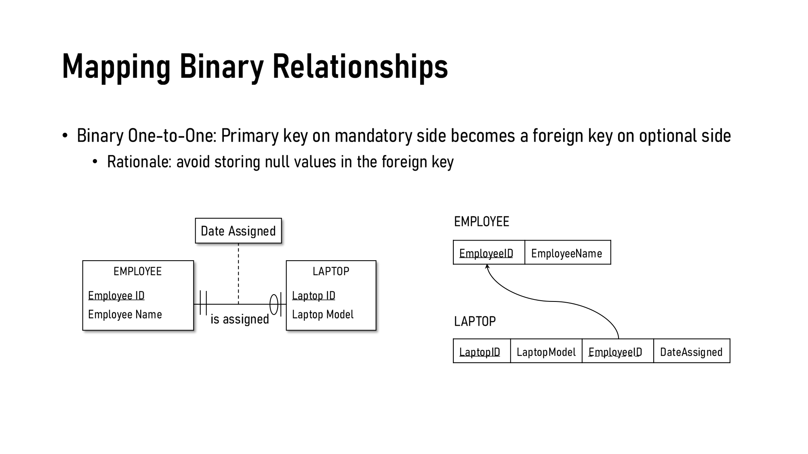

<div style={{margin: '6px 0 14px', pageBreakInside: 'avoid', breakInside: 'avoid'}}><div style={{fontSize: '0.85em', fontWeight: '600', marginBottom: '2px'}}>EMPLOYEE</div><table style={{borderCollapse: 'collapse', width: 'auto', margin: '0'}}><tr><td style={{border: '1px solid #333', padding: '4px 10px', whiteSpace: 'nowrap'}}><span style={{borderBottom: '1.5px solid #000', paddingBottom: '1px'}}>EmployeeID</span></td><td style={{border: '1px solid #333', padding: '4px 10px', whiteSpace: 'nowrap'}}>EmployeeName</td></tr></table></div>

<div style={{margin: '6px 0 14px', pageBreakInside: 'avoid', breakInside: 'avoid'}}><div style={{fontSize: '0.85em', fontWeight: '600', marginBottom: '2px'}}>LAPTOP</div><table style={{borderCollapse: 'collapse', width: 'auto', margin: '0'}}><tr><td style={{border: '1px solid #333', padding: '4px 10px', whiteSpace: 'nowrap'}}><span style={{borderBottom: '1.5px solid #000', paddingBottom: '1px'}}>LaptopID</span></td><td style={{border: '1px solid #333', padding: '4px 10px', whiteSpace: 'nowrap'}}>LaptopModel</td><td style={{border: '1px solid #333', padding: '4px 10px', whiteSpace: 'nowrap'}}><span style={{borderBottom: '1.5px dashed #000', paddingBottom: '1px'}}>EmployeeID</span></td><td style={{border: '1px solid #333', padding: '4px 10px', whiteSpace: 'nowrap'}}>DateAssigned</td></tr></table><div style={{fontSize: '0.8em', color: '#555', marginTop: '3px'}}>↳ EmployeeID → EMPLOYEE</div></div>

**1:1 为什么这样放？（Rationale: avoid null FK）**
- 图里：每台 laptop **必须**分配给一个员工（EMPLOYEE 那端是 `||` = mandatory）；员工**可以没有** laptop（LAPTOP 那端是 `O|` = optional）。
- 如果把 LaptopID 放进 EMPLOYEE 表 → 没电脑的员工那一格就是 null。
- 把 EmployeeID 放进 LAPTOP 表 → 每台电脑都有主人，**FK 永远不为空**。
- 关系属性 DateAssigned 也跟着 FK 一起放进 LAPTOP。

**1:1 补充（课件没演示，了解即可）🟡**

| 情况 | 外键放哪里 |
|---|---|
| Mandatory – Optional（课件例子） | 放在 **optional 一方**，引用 mandatory 一方的主键 |
| Mandatory – Mandatory | **哪边都行，只放一个**（也可以合并成一张表） |
| Optional – Optional | 哪边都行，选 **null 更少**的一边 |

> **踩坑提醒**：1:1 **不要两边都放外键**——冗余、改一边忘改另一边会自相矛盾、两边都 NOT NULL 时第一行插不进去。

**M:N — EMPLOYEE completes COURSE**

<div style={{margin: '6px 0 14px', pageBreakInside: 'avoid', breakInside: 'avoid'}}><div style={{fontSize: '0.85em', fontWeight: '600', marginBottom: '2px'}}>EMPLOYEE</div><table style={{borderCollapse: 'collapse', width: 'auto', margin: '0'}}><tr><td style={{border: '1px solid #333', padding: '4px 10px', whiteSpace: 'nowrap'}}><span style={{borderBottom: '1.5px solid #000', paddingBottom: '1px'}}>EmployeeID</span></td><td style={{border: '1px solid #333', padding: '4px 10px', whiteSpace: 'nowrap'}}>EmployeeName</td></tr></table></div>

<div style={{margin: '6px 0 14px', pageBreakInside: 'avoid', breakInside: 'avoid'}}><div style={{fontSize: '0.85em', fontWeight: '600', marginBottom: '2px'}}>COMPLETION</div><table style={{borderCollapse: 'collapse', width: 'auto', margin: '0'}}><tr><td style={{border: '1px solid #333', padding: '4px 10px', whiteSpace: 'nowrap'}}><span style={{borderBottom: '1.5px solid #000', paddingBottom: '1px'}}>EmployeeID</span></td><td style={{border: '1px solid #333', padding: '4px 10px', whiteSpace: 'nowrap'}}><span style={{borderBottom: '1.5px solid #000', paddingBottom: '1px'}}>CourseID</span></td><td style={{border: '1px solid #333', padding: '4px 10px', whiteSpace: 'nowrap'}}>DateCompleted</td></tr></table><div style={{fontSize: '0.8em', color: '#555', marginTop: '3px'}}>↳ EmployeeID → EMPLOYEE ；CourseID → COURSE</div></div>

<div style={{margin: '6px 0 14px', pageBreakInside: 'avoid', breakInside: 'avoid'}}><div style={{fontSize: '0.85em', fontWeight: '600', marginBottom: '2px'}}>COURSE</div><table style={{borderCollapse: 'collapse', width: 'auto', margin: '0'}}><tr><td style={{border: '1px solid #333', padding: '4px 10px', whiteSpace: 'nowrap'}}><span style={{borderBottom: '1.5px solid #000', paddingBottom: '1px'}}>CourseID</span></td><td style={{border: '1px solid #333', padding: '4px 10px', whiteSpace: 'nowrap'}}>CourseTitle</td></tr></table></div>

> **踩坑提醒**：1:M 时**绝不能**把"多"方的 PK 放进"一"方——一个客户有多个订单，一格塞不下多个 OrderID（违反 atomic）。

### 5.4 🔴 关联实体 Associative Entity（p.22–23）

| 情况 | 主键 | 例子 |
|---|---|---|
| **没有**自己的 identifier | 默认 = 两个参与实体 PK 的组合 | ORDERLINE |
| **有**自己的 identifier | **就用自己的 ID**；两边 PK 只作 FK | SHIPMENT |

**没有自有 ID — ORDERLINE（ORDER 与 PRODUCT 之间）**

<div style={{margin: '6px 0 14px', pageBreakInside: 'avoid', breakInside: 'avoid'}}><div style={{fontSize: '0.85em', fontWeight: '600', marginBottom: '2px'}}>ORDER</div><table style={{borderCollapse: 'collapse', width: 'auto', margin: '0'}}><tr><td style={{border: '1px solid #333', padding: '4px 10px', whiteSpace: 'nowrap'}}><span style={{borderBottom: '1.5px solid #000', paddingBottom: '1px'}}>OrderID</span></td><td style={{border: '1px solid #333', padding: '4px 10px', whiteSpace: 'nowrap'}}>OrderDate</td></tr></table></div>

<div style={{margin: '6px 0 14px', pageBreakInside: 'avoid', breakInside: 'avoid'}}><div style={{fontSize: '0.85em', fontWeight: '600', marginBottom: '2px'}}>ORDERLINE</div><table style={{borderCollapse: 'collapse', width: 'auto', margin: '0'}}><tr><td style={{border: '1px solid #333', padding: '4px 10px', whiteSpace: 'nowrap'}}><span style={{borderBottom: '1.5px solid #000', paddingBottom: '1px'}}>OrderID</span></td><td style={{border: '1px solid #333', padding: '4px 10px', whiteSpace: 'nowrap'}}><span style={{borderBottom: '1.5px solid #000', paddingBottom: '1px'}}>ProductID</span></td><td style={{border: '1px solid #333', padding: '4px 10px', whiteSpace: 'nowrap'}}>OrderedQuantity</td></tr></table><div style={{fontSize: '0.8em', color: '#555', marginTop: '3px'}}>↳ OrderID → ORDER ；ProductID → PRODUCT</div></div>

<div style={{margin: '6px 0 14px', pageBreakInside: 'avoid', breakInside: 'avoid'}}><div style={{fontSize: '0.85em', fontWeight: '600', marginBottom: '2px'}}>PRODUCT</div><table style={{borderCollapse: 'collapse', width: 'auto', margin: '0'}}><tr><td style={{border: '1px solid #333', padding: '4px 10px', whiteSpace: 'nowrap'}}><span style={{borderBottom: '1.5px solid #000', paddingBottom: '1px'}}>ProductID</span></td><td style={{border: '1px solid #333', padding: '4px 10px', whiteSpace: 'nowrap'}}>ProductDescription</td><td style={{border: '1px solid #333', padding: '4px 10px', whiteSpace: 'nowrap'}}>ProductPrice</td></tr></table></div>

**有自有 ID — SHIPMENT（CUSTOMER 与 VENDOR 之间）**

<div style={{margin: '6px 0 14px', pageBreakInside: 'avoid', breakInside: 'avoid'}}><div style={{fontSize: '0.85em', fontWeight: '600', marginBottom: '2px'}}>CUSTOMER</div><table style={{borderCollapse: 'collapse', width: 'auto', margin: '0'}}><tr><td style={{border: '1px solid #333', padding: '4px 10px', whiteSpace: 'nowrap'}}><span style={{borderBottom: '1.5px solid #000', paddingBottom: '1px'}}>CustomerID</span></td><td style={{border: '1px solid #333', padding: '4px 10px', whiteSpace: 'nowrap'}}>CustomerName</td></tr></table></div>

<div style={{margin: '6px 0 14px', pageBreakInside: 'avoid', breakInside: 'avoid'}}><div style={{fontSize: '0.85em', fontWeight: '600', marginBottom: '2px'}}>SHIPMENT</div><table style={{borderCollapse: 'collapse', width: 'auto', margin: '0'}}><tr><td style={{border: '1px solid #333', padding: '4px 10px', whiteSpace: 'nowrap'}}><span style={{borderBottom: '1.5px solid #000', paddingBottom: '1px'}}>ShipmentID</span></td><td style={{border: '1px solid #333', padding: '4px 10px', whiteSpace: 'nowrap'}}><span style={{borderBottom: '1.5px dashed #000', paddingBottom: '1px'}}>CustomerID</span></td><td style={{border: '1px solid #333', padding: '4px 10px', whiteSpace: 'nowrap'}}><span style={{borderBottom: '1.5px dashed #000', paddingBottom: '1px'}}>VendorID</span></td><td style={{border: '1px solid #333', padding: '4px 10px', whiteSpace: 'nowrap'}}>ShipmentDate</td></tr></table><div style={{fontSize: '0.8em', color: '#555', marginTop: '3px'}}>↳ CustomerID → CUSTOMER ；VendorID → VENDOR</div></div>

<div style={{margin: '6px 0 14px', pageBreakInside: 'avoid', breakInside: 'avoid'}}><div style={{fontSize: '0.85em', fontWeight: '600', marginBottom: '2px'}}>VENDOR</div><table style={{borderCollapse: 'collapse', width: 'auto', margin: '0'}}><tr><td style={{border: '1px solid #333', padding: '4px 10px', whiteSpace: 'nowrap'}}><span style={{borderBottom: '1.5px solid #000', paddingBottom: '1px'}}>VendorID</span></td><td style={{border: '1px solid #333', padding: '4px 10px', whiteSpace: 'nowrap'}}>VendorAddress</td></tr></table></div>

> **为什么 SHIPMENT 要有自己的 ID？** 同一个 vendor 可能给同一个 customer 发**多次**货。如果用 (CustomerID, VendorID) 当主键，第二次发货就会"主键重复"。
>
> **注意画法区别**：ORDERLINE 的两个外键在主键里 → 实线；SHIPMENT 的两个外键不在主键里 → 虚线。

### 5.5 🔴 一元关系 Unary Relationships（p.24–25）

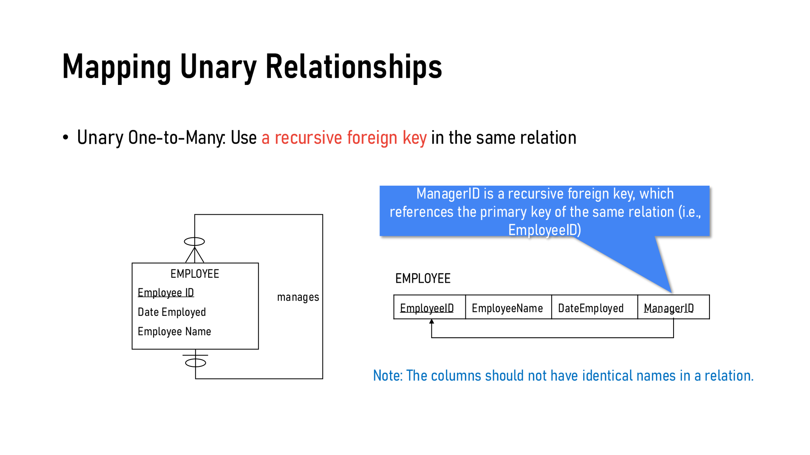

**Unary 1:M**（员工 manages 员工）→ 在同一张表里加 **recursive foreign key**：

<div style={{margin: '6px 0 14px', pageBreakInside: 'avoid', breakInside: 'avoid'}}><div style={{fontSize: '0.85em', fontWeight: '600', marginBottom: '2px'}}>EMPLOYEE</div><table style={{borderCollapse: 'collapse', width: 'auto', margin: '0'}}><tr><td style={{border: '1px solid #333', padding: '4px 10px', whiteSpace: 'nowrap'}}><span style={{borderBottom: '1.5px solid #000', paddingBottom: '1px'}}>EmployeeID</span></td><td style={{border: '1px solid #333', padding: '4px 10px', whiteSpace: 'nowrap'}}>EmployeeName</td><td style={{border: '1px solid #333', padding: '4px 10px', whiteSpace: 'nowrap'}}>DateEmployed</td><td style={{border: '1px solid #333', padding: '4px 10px', whiteSpace: 'nowrap'}}><span style={{borderBottom: '1.5px dashed #000', paddingBottom: '1px'}}>ManagerID</span></td></tr></table><div style={{fontSize: '0.8em', color: '#555', marginTop: '3px'}}>↳ ManagerID → 本表 EmployeeID（递归外键，箭头指回同一张表）</div></div>

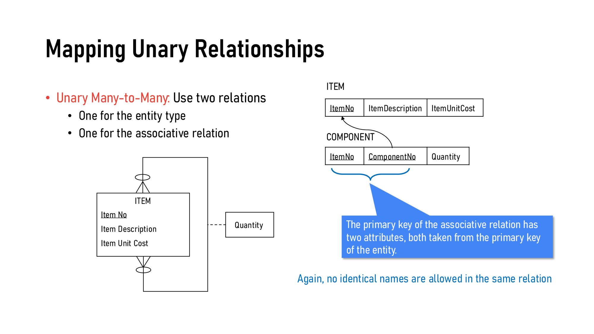

**Unary M:N**（物品由其他物品组成，Bill of Materials）→ **两张表**：

<div style={{margin: '6px 0 14px', pageBreakInside: 'avoid', breakInside: 'avoid'}}><div style={{fontSize: '0.85em', fontWeight: '600', marginBottom: '2px'}}>ITEM</div><table style={{borderCollapse: 'collapse', width: 'auto', margin: '0'}}><tr><td style={{border: '1px solid #333', padding: '4px 10px', whiteSpace: 'nowrap'}}><span style={{borderBottom: '1.5px solid #000', paddingBottom: '1px'}}>ItemNo</span></td><td style={{border: '1px solid #333', padding: '4px 10px', whiteSpace: 'nowrap'}}>ItemDescription</td><td style={{border: '1px solid #333', padding: '4px 10px', whiteSpace: 'nowrap'}}>ItemUnitCost</td></tr></table></div>

<div style={{margin: '6px 0 14px', pageBreakInside: 'avoid', breakInside: 'avoid'}}><div style={{fontSize: '0.85em', fontWeight: '600', marginBottom: '2px'}}>COMPONENT</div><table style={{borderCollapse: 'collapse', width: 'auto', margin: '0'}}><tr><td style={{border: '1px solid #333', padding: '4px 10px', whiteSpace: 'nowrap'}}><span style={{borderBottom: '1.5px solid #000', paddingBottom: '1px'}}>ItemNo</span></td><td style={{border: '1px solid #333', padding: '4px 10px', whiteSpace: 'nowrap'}}><span style={{borderBottom: '1.5px solid #000', paddingBottom: '1px'}}>ComponentNo</span></td><td style={{border: '1px solid #333', padding: '4px 10px', whiteSpace: 'nowrap'}}>Quantity</td></tr></table><div style={{fontSize: '0.8em', color: '#555', marginTop: '3px'}}>↳ ItemNo → ITEM ；ComponentNo → ITEM（两个都来自 ITEM 的主键）</div></div>

**Unary 1:1（课件没演示，了解即可）🟡**：做法同 1:M，本表加递归外键，区别只是外键值**不能重复**。例：PERSON is married to PERSON：

<div style={{margin: '6px 0 14px', pageBreakInside: 'avoid', breakInside: 'avoid'}}><div style={{fontSize: '0.85em', fontWeight: '600', marginBottom: '2px'}}>PERSON</div><table style={{borderCollapse: 'collapse', width: 'auto', margin: '0'}}><tr><td style={{border: '1px solid #333', padding: '4px 10px', whiteSpace: 'nowrap'}}><span style={{borderBottom: '1.5px solid #000', paddingBottom: '1px'}}>PersonID</span></td><td style={{border: '1px solid #333', padding: '4px 10px', whiteSpace: 'nowrap'}}>PersonName</td><td style={{border: '1px solid #333', padding: '4px 10px', whiteSpace: 'nowrap'}}>DateOfBirth</td><td style={{border: '1px solid #333', padding: '4px 10px', whiteSpace: 'nowrap'}}><span style={{borderBottom: '1.5px dashed #000', paddingBottom: '1px'}}>SpouseID</span></td></tr></table><div style={{fontSize: '0.8em', color: '#555', marginTop: '3px'}}>↳ SpouseID → 本表 PersonID</div></div>

> **踩坑提醒**：同一张表不能有两列都叫 EmployeeID / ItemNo / PersonID（relation 规则第 4 条），所以必须**改名**——ManagerID、ComponentNo、SpouseID。考试画表时忘记改名会扣分。

### 5.6 🟡 三元关系 Ternary Relationships（p.26）

PART、VENDOR、WAREHOUSE 三方关系 SUPPLY SCHEDULE。规则：**每个实体一张表 + 关联实体一张表**，关联表对三个实体各有一个 FK。

<div style={{margin: '6px 0 14px', pageBreakInside: 'avoid', breakInside: 'avoid'}}><div style={{fontSize: '0.85em', fontWeight: '600', marginBottom: '2px'}}>PART</div><table style={{borderCollapse: 'collapse', width: 'auto', margin: '0'}}><tr><td style={{border: '1px solid #333', padding: '4px 10px', whiteSpace: 'nowrap'}}><span style={{borderBottom: '1.5px solid #000', paddingBottom: '1px'}}>PartNo</span></td><td style={{border: '1px solid #333', padding: '4px 10px', whiteSpace: 'nowrap'}}>PartDescription</td></tr></table></div>

<div style={{margin: '6px 0 14px', pageBreakInside: 'avoid', breakInside: 'avoid'}}><div style={{fontSize: '0.85em', fontWeight: '600', marginBottom: '2px'}}>VENDOR</div><table style={{borderCollapse: 'collapse', width: 'auto', margin: '0'}}><tr><td style={{border: '1px solid #333', padding: '4px 10px', whiteSpace: 'nowrap'}}><span style={{borderBottom: '1.5px solid #000', paddingBottom: '1px'}}>VendorID</span></td><td style={{border: '1px solid #333', padding: '4px 10px', whiteSpace: 'nowrap'}}>VendorName</td></tr></table></div>

<div style={{margin: '6px 0 14px', pageBreakInside: 'avoid', breakInside: 'avoid'}}><div style={{fontSize: '0.85em', fontWeight: '600', marginBottom: '2px'}}>WAREHOUSE</div><table style={{borderCollapse: 'collapse', width: 'auto', margin: '0'}}><tr><td style={{border: '1px solid #333', padding: '4px 10px', whiteSpace: 'nowrap'}}><span style={{borderBottom: '1.5px solid #000', paddingBottom: '1px'}}>WarehouseID</span></td><td style={{border: '1px solid #333', padding: '4px 10px', whiteSpace: 'nowrap'}}>WarehouseAddress</td></tr></table></div>

<div style={{margin: '6px 0 14px', pageBreakInside: 'avoid', breakInside: 'avoid'}}><div style={{fontSize: '0.85em', fontWeight: '600', marginBottom: '2px'}}>SUPPLY SCHEDULE</div><table style={{borderCollapse: 'collapse', width: 'auto', margin: '0'}}><tr><td style={{border: '1px solid #333', padding: '4px 10px', whiteSpace: 'nowrap'}}><span style={{borderBottom: '1.5px solid #000', paddingBottom: '1px'}}>PartNo</span></td><td style={{border: '1px solid #333', padding: '4px 10px', whiteSpace: 'nowrap'}}><span style={{borderBottom: '1.5px solid #000', paddingBottom: '1px'}}>VendorID</span></td><td style={{border: '1px solid #333', padding: '4px 10px', whiteSpace: 'nowrap'}}><span style={{borderBottom: '1.5px solid #000', paddingBottom: '1px'}}>WarehouseID</span></td><td style={{border: '1px solid #333', padding: '4px 10px', whiteSpace: 'nowrap'}}>ShippingMode</td><td style={{border: '1px solid #333', padding: '4px 10px', whiteSpace: 'nowrap'}}>UnitCost</td></tr></table><div style={{fontSize: '0.8em', color: '#555', marginTop: '3px'}}>↳ PartNo → PART ；VendorID → VENDOR ；WarehouseID → WAREHOUSE</div></div>

### 5.7 🔴 超类/子类 Supertype/Subtype（p.27）

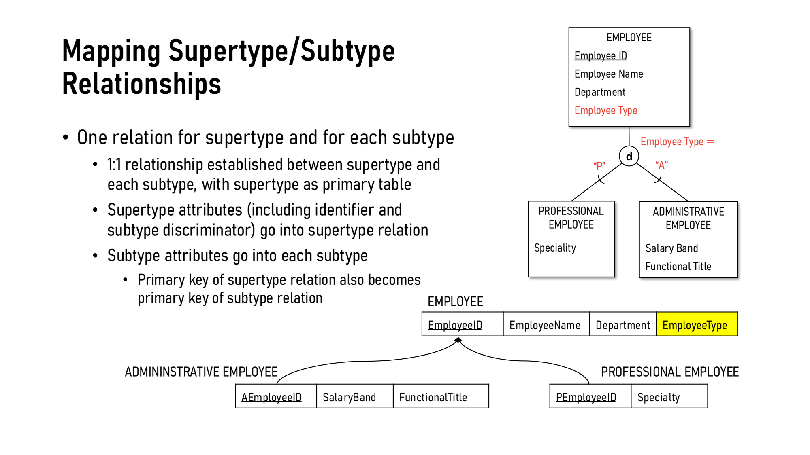

EMPLOYEE（超类）分为 ADMINISTRATIVE（"A"）和 PROFESSIONAL（"P"），disjoint（d）。

<div style={{margin: '6px 0 14px', pageBreakInside: 'avoid', breakInside: 'avoid'}}><div style={{fontSize: '0.85em', fontWeight: '600', marginBottom: '2px'}}>EMPLOYEE</div><table style={{borderCollapse: 'collapse', width: 'auto', margin: '0'}}><tr><td style={{border: '1px solid #333', padding: '4px 10px', whiteSpace: 'nowrap'}}><span style={{borderBottom: '1.5px solid #000', paddingBottom: '1px'}}>EmployeeID</span></td><td style={{border: '1px solid #333', padding: '4px 10px', whiteSpace: 'nowrap'}}>EmployeeName</td><td style={{border: '1px solid #333', padding: '4px 10px', whiteSpace: 'nowrap'}}>Department</td><td style={{border: '1px solid #333', padding: '4px 10px', whiteSpace: 'nowrap'}}>EmployeeType</td></tr></table><div style={{fontSize: '0.8em', color: '#555', marginTop: '3px'}}>↳ EmployeeType = subtype discriminator</div></div>

<div style={{margin: '6px 0 14px', pageBreakInside: 'avoid', breakInside: 'avoid'}}><div style={{fontSize: '0.85em', fontWeight: '600', marginBottom: '2px'}}>ADMINISTRATIVE EMPLOYEE</div><table style={{borderCollapse: 'collapse', width: 'auto', margin: '0'}}><tr><td style={{border: '1px solid #333', padding: '4px 10px', whiteSpace: 'nowrap'}}><span style={{borderBottom: '1.5px solid #000', paddingBottom: '1px'}}>AEmployeeID</span></td><td style={{border: '1px solid #333', padding: '4px 10px', whiteSpace: 'nowrap'}}>SalaryBand</td><td style={{border: '1px solid #333', padding: '4px 10px', whiteSpace: 'nowrap'}}>FunctionalTitle</td></tr></table><div style={{fontSize: '0.8em', color: '#555', marginTop: '3px'}}>↳ AEmployeeID → EMPLOYEE</div></div>

<div style={{margin: '6px 0 14px', pageBreakInside: 'avoid', breakInside: 'avoid'}}><div style={{fontSize: '0.85em', fontWeight: '600', marginBottom: '2px'}}>PROFESSIONAL EMPLOYEE</div><table style={{borderCollapse: 'collapse', width: 'auto', margin: '0'}}><tr><td style={{border: '1px solid #333', padding: '4px 10px', whiteSpace: 'nowrap'}}><span style={{borderBottom: '1.5px solid #000', paddingBottom: '1px'}}>PEmployeeID</span></td><td style={{border: '1px solid #333', padding: '4px 10px', whiteSpace: 'nowrap'}}>Specialty</td></tr></table><div style={{fontSize: '0.8em', color: '#555', marginTop: '3px'}}>↳ PEmployeeID → EMPLOYEE</div></div>

五条规则：
1. 超类一张表，**每个子类各一张表**
2. 超类与每个子类之间是 **1:1** 关系，超类是 primary table
3. **超类属性**（包括 identifier 和 **subtype discriminator**）放超类表
4. **子类特有属性**放子类表
5. **超类的主键同时也是子类的主键**（AEmployeeID、PEmployeeID 同时是 FK 指回 EMPLOYEE）

---

## 6. 🔴 Normalization 规范化

### 6.1 定义与目的（p.28）

> **Normalization**: The process of **successively decomposing** relations with anomalies to produce smaller, **well-structured relations**.

目的（四点）：
- **Minimize data redundancy**（减少冗余）← 老师 Main Takeaway 里说的**主要目标**
- Simplify enforcement of referential integrity constraints
- Make it easier to maintain
- Better representation of the real world

### 6.2 🔴 三种 Anomalies 异常（p.29–31）

**Well-structured relation**：冗余最少，增删改都不会产生不一致（anomalies）。

用这张"员工+课程"混在一起的烂表举例：

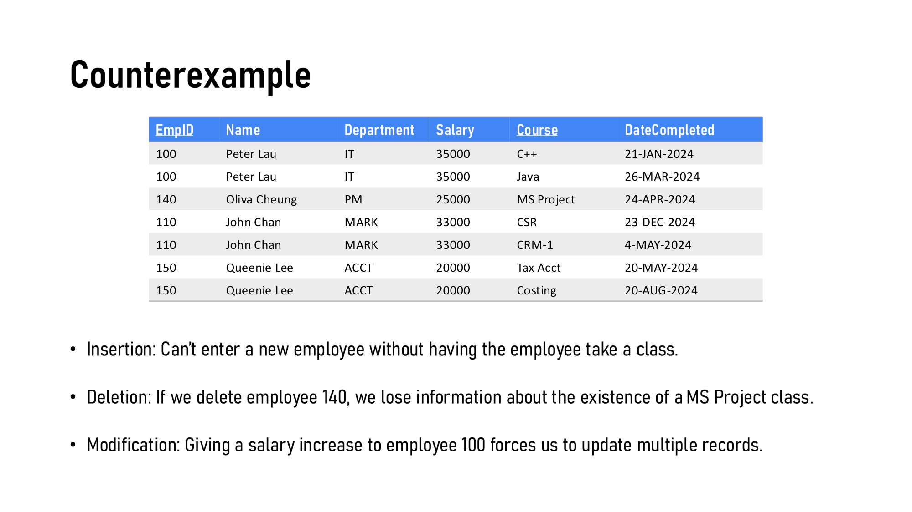

| 异常 | 定义（原文） | 例子中的表现 |
|---|---|---|
| **Insertion anomaly** 插入异常 | Adding new rows forces user to create duplicate data | 新员工**没上过课就没法录入**（Course 是主键一部分，不能空） |
| **Deletion anomaly** 删除异常 | Deleting rows may cause a loss of data needed for other future rows | 删掉员工 140 → **MS Project 这门课存在过的信息也没了** |
| **Modification anomaly** 修改异常 | Changing data in a row forces changes to other rows because of duplication | 给员工 100 加薪 → 要改**多行** |

**解决**：拆成两张表（p.31）。拆完后员工 190 没上课也能录入。

<div style={{margin: '6px 0 14px', pageBreakInside: 'avoid', breakInside: 'avoid'}}><div style={{fontSize: '0.85em', fontWeight: '600', marginBottom: '2px'}}>EMPLOYEE</div><table style={{borderCollapse: 'collapse', width: 'auto', margin: '0'}}><tr><td style={{border: '1px solid #333', padding: '4px 10px', whiteSpace: 'nowrap'}}><span style={{borderBottom: '1.5px solid #000', paddingBottom: '1px'}}>EmpID</span></td><td style={{border: '1px solid #333', padding: '4px 10px', whiteSpace: 'nowrap'}}>Name</td><td style={{border: '1px solid #333', padding: '4px 10px', whiteSpace: 'nowrap'}}>Department</td><td style={{border: '1px solid #333', padding: '4px 10px', whiteSpace: 'nowrap'}}>Salary</td></tr></table></div>

<div style={{margin: '6px 0 14px', pageBreakInside: 'avoid', breakInside: 'avoid'}}><div style={{fontSize: '0.85em', fontWeight: '600', marginBottom: '2px'}}>EMPCOURSE</div><table style={{borderCollapse: 'collapse', width: 'auto', margin: '0'}}><tr><td style={{border: '1px solid #333', padding: '4px 10px', whiteSpace: 'nowrap'}}><span style={{borderBottom: '1.5px solid #000', paddingBottom: '1px'}}>EmpID</span></td><td style={{border: '1px solid #333', padding: '4px 10px', whiteSpace: 'nowrap'}}><span style={{borderBottom: '1.5px solid #000', paddingBottom: '1px'}}>Course</span></td><td style={{border: '1px solid #333', padding: '4px 10px', whiteSpace: 'nowrap'}}>DateCompleted</td></tr></table><div style={{fontSize: '0.8em', color: '#555', marginTop: '3px'}}>↳ EmpID → EMPLOYEE</div></div>

> **考点**：给一张表，让你**各举一个**三种异常的例子。答题格式："Insertion anomaly: we cannot add ___ without ___."

### 6.3 🔴 规范化步骤图（p.32，纯图片，文字版讲义里是空的）

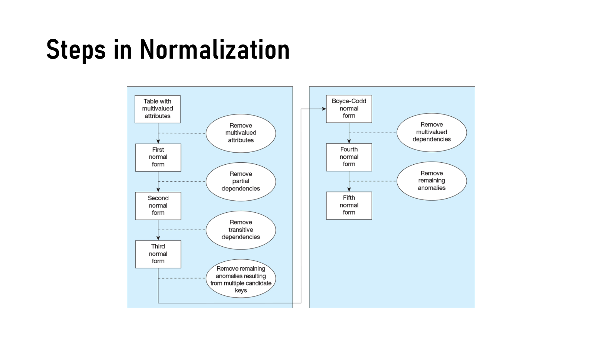

```
Table with multivalued attributes
   │  Remove multivalued attributes
   ▼
1NF
   │  Remove partial dependencies
   ▼
2NF
   │  Remove transitive dependencies
   ▼
3NF
   │  Remove remaining anomalies resulting from multiple candidate keys
   ▼
BCNF (Boyce-Codd)
   │  Remove multivalued dependencies
   ▼
4NF
   │  Remove remaining anomalies
   ▼
5NF
```

本课只详细讲到 **3NF**；BCNF / 4NF / 5NF 🟢 知道顺序和各自消除什么即可。

### 6.4 🔴 Functional Dependency 函数依赖（p.34–35）

> **Functional Dependency**: The value of one attribute (the **determinant**) determines the value of another attribute. 写作 `A → B`。

- 知道 EmpID 就能唯一确定 Name、Department、Salary：`EmpID → Name, Department, Salary`
- 决定因素也可以是**组合**：`EmpID, Course → DateCompleted`（要同时知道谁 + 哪门课，才知道完成日期）

> **小白理解**："A 决定 B" = 只要 A 一样，B 一定一样。像学号决定姓名。
>
> **注意**：`A → B` 是函数依赖的写法（考试也这样写），和表结构的 short text 不是一回事，保留。

### 6.5 🔴 三个范式——定义 + 转换步骤

| 范式 | 条件 | 要消除的问题 | 转换方法 |
|---|---|---|---|
| **1NF** | **No multivalued attributes**（每格单值） | 多值属性 / repeating groups | 把多值**摊开成多行**，公共值重复填写 |
| **2NF** | 1NF + **no partial functional dependencies** | **部分依赖**：非键属性只依赖于**复合主键的一部分** | 为每个部分依赖的 determinant 建新表，以它为 PK；把只依赖它的属性搬过去 |
| **3NF** | 2NF + **no transitive dependencies** | **传递依赖**：**两个非键属性之间**的依赖 | 为每个非键 determinant 建新表，以它为 PK；搬走依赖它的属性；**原表保留它作 FK** |

**2NF 例子（p.36–37）**

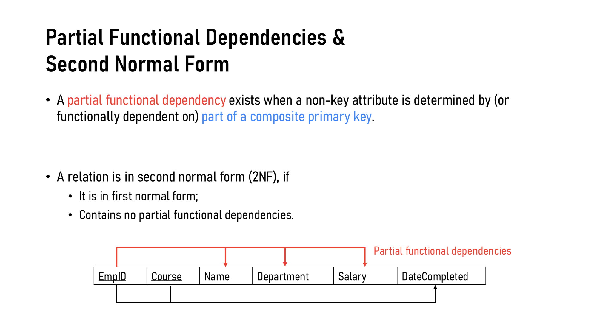

转换前（1NF，主键 = EmpID + Course）：

<div style={{margin: '6px 0 14px', pageBreakInside: 'avoid', breakInside: 'avoid'}}><div style={{fontSize: '0.85em', fontWeight: '600', marginBottom: '2px'}}>EMP COURSE</div><table style={{borderCollapse: 'collapse', width: 'auto', margin: '0'}}><tr><td style={{border: '1px solid #333', padding: '4px 10px', whiteSpace: 'nowrap'}}><span style={{borderBottom: '1.5px solid #000', paddingBottom: '1px'}}>EmpID</span></td><td style={{border: '1px solid #333', padding: '4px 10px', whiteSpace: 'nowrap'}}><span style={{borderBottom: '1.5px solid #000', paddingBottom: '1px'}}>Course</span></td><td style={{border: '1px solid #333', padding: '4px 10px', whiteSpace: 'nowrap'}}>Name</td><td style={{border: '1px solid #333', padding: '4px 10px', whiteSpace: 'nowrap'}}>Department</td><td style={{border: '1px solid #333', padding: '4px 10px', whiteSpace: 'nowrap'}}>Salary</td><td style={{border: '1px solid #333', padding: '4px 10px', whiteSpace: 'nowrap'}}>DateCompleted</td></tr></table></div>

- `EmpID → Name, Department, Salary` ← **部分依赖**（只依赖主键的一部分 EmpID）
- `EmpID, Course → DateCompleted` ← 完全依赖

转换后（2NF）：

<div style={{margin: '6px 0 14px', pageBreakInside: 'avoid', breakInside: 'avoid'}}><div style={{fontSize: '0.85em', fontWeight: '600', marginBottom: '2px'}}>EMPLOYEE</div><table style={{borderCollapse: 'collapse', width: 'auto', margin: '0'}}><tr><td style={{border: '1px solid #333', padding: '4px 10px', whiteSpace: 'nowrap'}}><span style={{borderBottom: '1.5px solid #000', paddingBottom: '1px'}}>EmpID</span></td><td style={{border: '1px solid #333', padding: '4px 10px', whiteSpace: 'nowrap'}}>Name</td><td style={{border: '1px solid #333', padding: '4px 10px', whiteSpace: 'nowrap'}}>Department</td><td style={{border: '1px solid #333', padding: '4px 10px', whiteSpace: 'nowrap'}}>Salary</td></tr></table></div>

<div style={{margin: '6px 0 14px', pageBreakInside: 'avoid', breakInside: 'avoid'}}><div style={{fontSize: '0.85em', fontWeight: '600', marginBottom: '2px'}}>EMPCOURSE</div><table style={{borderCollapse: 'collapse', width: 'auto', margin: '0'}}><tr><td style={{border: '1px solid #333', padding: '4px 10px', whiteSpace: 'nowrap'}}><span style={{borderBottom: '1.5px solid #000', paddingBottom: '1px'}}>EmpID</span></td><td style={{border: '1px solid #333', padding: '4px 10px', whiteSpace: 'nowrap'}}><span style={{borderBottom: '1.5px solid #000', paddingBottom: '1px'}}>Course</span></td><td style={{border: '1px solid #333', padding: '4px 10px', whiteSpace: 'nowrap'}}>DateCompleted</td></tr></table><div style={{fontSize: '0.8em', color: '#555', marginTop: '3px'}}>↳ EmpID → EMPLOYEE</div></div>

**3NF 例子（p.38–39）**

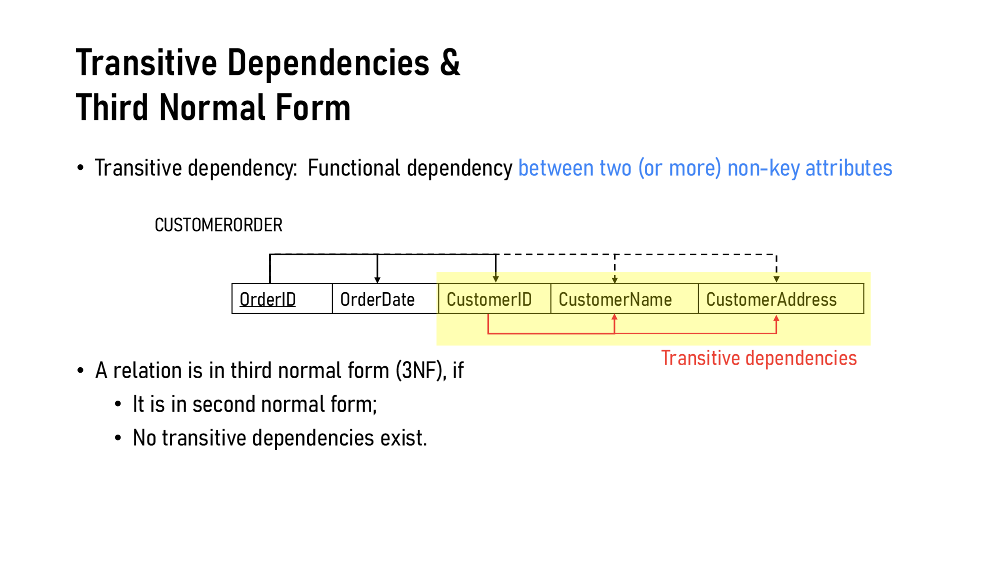

转换前（2NF，主键 = OrderID）：

<div style={{margin: '6px 0 14px', pageBreakInside: 'avoid', breakInside: 'avoid'}}><div style={{fontSize: '0.85em', fontWeight: '600', marginBottom: '2px'}}>CUSTOMERORDER</div><table style={{borderCollapse: 'collapse', width: 'auto', margin: '0'}}><tr><td style={{border: '1px solid #333', padding: '4px 10px', whiteSpace: 'nowrap'}}><span style={{borderBottom: '1.5px solid #000', paddingBottom: '1px'}}>OrderID</span></td><td style={{border: '1px solid #333', padding: '4px 10px', whiteSpace: 'nowrap'}}>OrderDate</td><td style={{border: '1px solid #333', padding: '4px 10px', whiteSpace: 'nowrap'}}>CustomerID</td><td style={{border: '1px solid #333', padding: '4px 10px', whiteSpace: 'nowrap'}}>CustomerName</td><td style={{border: '1px solid #333', padding: '4px 10px', whiteSpace: 'nowrap'}}>CustomerAddress</td></tr></table></div>

- `OrderID → OrderDate, CustomerID`
- `CustomerID → CustomerName, CustomerAddress` ← **传递依赖**（CustomerID 不是主键），即 OrderID → CustomerID → CustomerName

转换后（3NF）：

<div style={{margin: '6px 0 14px', pageBreakInside: 'avoid', breakInside: 'avoid'}}><div style={{fontSize: '0.85em', fontWeight: '600', marginBottom: '2px'}}>ORDER</div><table style={{borderCollapse: 'collapse', width: 'auto', margin: '0'}}><tr><td style={{border: '1px solid #333', padding: '4px 10px', whiteSpace: 'nowrap'}}><span style={{borderBottom: '1.5px solid #000', paddingBottom: '1px'}}>OrderID</span></td><td style={{border: '1px solid #333', padding: '4px 10px', whiteSpace: 'nowrap'}}>OrderDate</td><td style={{border: '1px solid #333', padding: '4px 10px', whiteSpace: 'nowrap'}}><span style={{borderBottom: '1.5px dashed #000', paddingBottom: '1px'}}>CustomerID</span></td></tr></table><div style={{fontSize: '0.8em', color: '#555', marginTop: '3px'}}>↳ CustomerID → CUSTOMER（原表保留 determinant 作外键）</div></div>

<div style={{margin: '6px 0 14px', pageBreakInside: 'avoid', breakInside: 'avoid'}}><div style={{fontSize: '0.85em', fontWeight: '600', marginBottom: '2px'}}>CUSTOMER</div><table style={{borderCollapse: 'collapse', width: 'auto', margin: '0'}}><tr><td style={{border: '1px solid #333', padding: '4px 10px', whiteSpace: 'nowrap'}}><span style={{borderBottom: '1.5px solid #000', paddingBottom: '1px'}}>CustomerID</span></td><td style={{border: '1px solid #333', padding: '4px 10px', whiteSpace: 'nowrap'}}>CustomerName</td><td style={{border: '1px solid #333', padding: '4px 10px', whiteSpace: 'nowrap'}}>CustomerAddress</td></tr></table></div>

下面这个互动组件把「判断 Full / Partial / Transitive，再分解到 3NF」变成可以自己点的练习，切换按钮可以换四个不同的场景（包括上面两个课件例子，以及本笔记自测题 Q10、Q11 的表）：

<NormalizationLab />

### 6.6 🔴 老师的 Main Takeaway（p.40，原话要记）

- The main goal is to **remove data redundancy**.
- 1NF 很直接：去掉多值属性。
- **区分部分依赖和传递依赖的关键是：先认清主键是哪些属性。**
  - Determinant 是**主键的一部分** → **partial**（违反 2NF）
  - Determinant **不是主键**（是非键属性） → **transitive**（违反 3NF）

> **记忆口诀**：**"部分看主键的一部分，传递看非键"**
> 2NF 问："**整个**主键吗？"（the whole key）；3NF 问："**只有**主键吗？"（nothing but the key）
>
> 英文经典口诀：*Every non-key attribute must depend on **the key** (1NF), **the whole key** (2NF), and **nothing but the key** (3NF).*
>
> **踩坑提醒**：如果主键是**单个属性**，就**不可能**有部分依赖 → 满足 1NF 就自动满足 2NF。部分依赖只在**复合主键**时才会出现。
>
> **踩坑提醒 2**：Partial **identifier**（弱实体的部分标识符，mapping 概念）≠ Partial **dependency**（部分依赖，normalization 概念）。

> **英文模范答句**：
> *"The relation is in 2NF but not 3NF because CustomerName and CustomerAddress are transitively dependent on OrderID through CustomerID, a non-key attribute. To reach 3NF, we move CustomerID, CustomerName and CustomerAddress into a new CUSTOMER relation with CustomerID as its primary key, and retain CustomerID in ORDER as a foreign key."*

---

## 7. 🔴 术语速查表

| 英文 | 中文 | 一句话 |
|---|---|---|
| Relation | 关系（表） | 命名的二维表，满足 5 条规则 |
| Graphical representation | 图形表示法 | 本课作业/考试使用的 schema 画法 |
| Atomic value | 原子值 | 每格只有一个不可再分的值 |
| Primary Key (PK) | 主键 | 唯一标识每一行；实线下划线 |
| Composite key | 复合键 | 多个属性组合成的主键 |
| Foreign Key (FK) | 外键 | 引用另一张表的主键；虚线下划线 + 箭头 |
| Recursive FK | 递归外键 | 引用**本表**主键的外键（ManagerID） |
| Null | 空值 | 没有值 |
| Domain constraint | 域约束 | 列值必须在合法范围内 |
| Entity integrity | 实体完整性 | 主键不能为空 |
| Referential integrity | 参照完整性 | 非空外键必须对应存在的主键 |
| Partial identifier | 部分标识符 | 弱实体用来区分同一 owner 下实例的属性 |
| Subtype discriminator | 子类判别符 | 标明属于哪个子类的属性（EmployeeType） |
| Anomaly | 异常 | Insertion / Deletion / Modification |
| Functional dependency | 函数依赖 | A → B，A 决定 B |
| Determinant | 决定因素 | 箭头左边的属性 |
| Partial dependency | 部分依赖 | 非键属性依赖于复合主键的一部分 → 违反 2NF |
| Transitive dependency | 传递依赖 | 非键属性之间的依赖 → 违反 3NF |
| 1NF / 2NF / 3NF / BCNF | 第一/二/三范式 / BC 范式 | 见 6.3–6.5 |
| SDLC | Systems Development Life Cycle | 系统开发生命周期 |

---

## 8. 模拟自测题（自查用，非押题）

**画图题请一律用 graphical representation 作答。**

<QA q="一张表要成为 relation，必须满足哪五个条件？">
① **Unique name**——表名唯一；② **Atomic values**——每个格子只能有一个值，不能多值也不能复合；③ **Unique rows**——不能有两行完全相同；④ **Unique column names**——同一张表里列名不能重复；⑤ **Order doesn't matter**——行、列的顺序都无关紧要。
</QA>

<QA q="ENROLLMENT 表主键是 StudentID + CourseCode + Semester，其中一行为 StudentID = 20261235、CourseCode = null、Semester = 2026F1。违反了哪种完整性约束？为什么？">
违反 **Entity Integrity（实体完整性）**——CourseCode 是复合主键的一部分，而实体完整性规定"主键不能为空"，复合主键的每一部分都不能为空。
</QA>

<QA q="ORDER 表中某行 CustomerID = null，是否违反参照完整性？在什么条件下可以接受？">
**不违反**。Referential Integrity 只要求**非空**的外键值必须匹配父表里一个真实存在的主键；外键本身允许为 null。只要 ORDER 和 CUSTOMER 之间的关系是 **optional**（可选参与，比如允许匿名下单/内部测试订单没有客户），CustomerID = null 就是可以接受的。
</QA>

<QA q="把以下实体转成关系：STUDENT 有 Student ID（identifier）、Name (First, Last)、{Phone}、[Age]、Date of Birth。">
Age 是派生属性，不存；Phone 是多值属性，单独建表；Name 是复合属性，拆开只保留组成部分：

<div style={{margin: '6px 0 14px', pageBreakInside: 'avoid', breakInside: 'avoid'}}><div style={{fontSize: '0.85em', fontWeight: '600', marginBottom: '2px'}}>STUDENT</div><table style={{borderCollapse: 'collapse', width: 'auto', margin: '0'}}><tr><td style={{border: '1px solid #333', padding: '4px 10px', whiteSpace: 'nowrap'}}><span style={{borderBottom: '1.5px solid #000', paddingBottom: '1px'}}>StudentID</span></td><td style={{border: '1px solid #333', padding: '4px 10px', whiteSpace: 'nowrap'}}>FirstName</td><td style={{border: '1px solid #333', padding: '4px 10px', whiteSpace: 'nowrap'}}>LastName</td><td style={{border: '1px solid #333', padding: '4px 10px', whiteSpace: 'nowrap'}}>DateOfBirth</td></tr></table></div>

<div style={{margin: '6px 0 14px', pageBreakInside: 'avoid', breakInside: 'avoid'}}><div style={{fontSize: '0.85em', fontWeight: '600', marginBottom: '2px'}}>STUDENT PHONE</div><table style={{borderCollapse: 'collapse', width: 'auto', margin: '0'}}><tr><td style={{border: '1px solid #333', padding: '4px 10px', whiteSpace: 'nowrap'}}><span style={{borderBottom: '1.5px solid #000', paddingBottom: '1px'}}>StudentID</span></td><td style={{border: '1px solid #333', padding: '4px 10px', whiteSpace: 'nowrap'}}><span style={{borderBottom: '1.5px solid #000', paddingBottom: '1px'}}>Phone</span></td></tr></table><div style={{fontSize: '0.8em', color: '#555', marginTop: '3px'}}>↳ StudentID → STUDENT</div></div>
</QA>

<QA q="EMPLOYEE 和 PARKING SPOT 是 1:1 关系，每个车位必须属于一个员工，员工不一定有车位。外键应该放在哪张表？为什么？">
放在 **PARKING SPOT**（optional 一方）里，引用 EMPLOYEE 的主键——因为 1:1 关系的外键要放在 optional 一方，才能保证"每个车位都有主人，FK 永远不为空"；反过来放进 EMPLOYEE 表的话，没有车位的员工那一格就会是 null。

<div style={{margin: '6px 0 14px', pageBreakInside: 'avoid', breakInside: 'avoid'}}><div style={{fontSize: '0.85em', fontWeight: '600', marginBottom: '2px'}}>EMPLOYEE</div><table style={{borderCollapse: 'collapse', width: 'auto', margin: '0'}}><tr><td style={{border: '1px solid #333', padding: '4px 10px', whiteSpace: 'nowrap'}}><span style={{borderBottom: '1.5px solid #000', paddingBottom: '1px'}}>EmployeeID</span></td><td style={{border: '1px solid #333', padding: '4px 10px', whiteSpace: 'nowrap'}}>EmployeeName</td></tr></table></div>

<div style={{margin: '6px 0 14px', pageBreakInside: 'avoid', breakInside: 'avoid'}}><div style={{fontSize: '0.85em', fontWeight: '600', marginBottom: '2px'}}>PARKING SPOT</div><table style={{borderCollapse: 'collapse', width: 'auto', margin: '0'}}><tr><td style={{border: '1px solid #333', padding: '4px 10px', whiteSpace: 'nowrap'}}><span style={{borderBottom: '1.5px solid #000', paddingBottom: '1px'}}>SpotID</span></td><td style={{border: '1px solid #333', padding: '4px 10px', whiteSpace: 'nowrap'}}><span style={{borderBottom: '1.5px dashed #000', paddingBottom: '1px'}}>EmployeeID</span></td></tr></table><div style={{fontSize: '0.8em', color: '#555', marginTop: '3px'}}>↳ EmployeeID → EMPLOYEE</div></div>
</QA>

<QA q="弱实体 DEPENDENT 的主键怎么构成？只用 DependentName 当主键会有什么问题？">
主键 = **Owner 的主键（EmployeeID）+ 自己的 partial identifier（DependentName）**。只用 DependentName 当主键会有问题：两个不同员工的家属完全可能同名（比如都叫"张伟"），单独 DependentName 无法唯一区分，必须配上 EmployeeID 才能确定"这是哪位员工的哪个家属"。
</QA>

<QA q="有自己 identifier 的关联实体和没有的，映射时主键有什么不同？举一个「必须有自己 ID」的场景。">
**没有**自己 identifier 的关联实体：主键默认 = 两个参与实体主键的组合（如 ORDERLINE = OrderID + ProductID）。**有**自己 identifier 的关联实体：直接用这个自有 ID 当主键，两边的主键降级为普通外键（不进复合主键）。"必须有自己 ID"的场景：**SHIPMENT**（同一个 vendor 可能给同一个 customer 发多次货）——如果用 (CustomerID, VendorID) 当主键，第二次发货就会主键重复，必须用独立的 ShipmentID 区分。
</QA>

<QA q="Unary 1:M 和 Unary M:N 分别怎么映射？为什么要给列改名？">
**Unary 1:M**（如员工 manages 员工）：在**同一张表**里加一个 recursive foreign key（如 ManagerID），指回本表自己的主键。**Unary M:N**（如物品由其他物品组成）：需要**两张表**——实体表本身 + 一张关联表，关联表里两个属性都来自同一张表的主键（如 ItemNo + ComponentNo）。改名的原因：关系规则第 4 条"列名不能重复"——同一张表不能有两列都叫 EmployeeID，所以指向自己的那一列必须改成有区分度的名字（ManagerID、ComponentNo）。
</QA>

<QA q="超类/子类映射中，子类表的主键是什么？subtype discriminator 放在哪张表？">
**子类表的主键 = 超类的主键**（同一个值，同时也是指回超类表的外键，如 AEmployeeID 既是 ADMINISTRATIVE EMPLOYEE 的主键，也是引用 EMPLOYEE 的外键）。**Subtype discriminator**（如 EmployeeType）放在**超类表**里，因为它的作用是"标明这一行该去哪张子类表找剩下的属性"，这个判断本身属于超类层面的信息。
</QA>

<QA q="下面这张表（主键 = StudentID + CourseID），写出所有函数依赖，指出属于哪种依赖，并规范化到 3NF：">

<div style={{margin: '6px 0 14px', pageBreakInside: 'avoid', breakInside: 'avoid'}}><div style={{fontSize: '0.85em', fontWeight: '600', marginBottom: '2px'}}>STUDENT COURSE</div><table style={{borderCollapse: 'collapse', width: 'auto', margin: '0'}}><tr><td style={{border: '1px solid #333', padding: '4px 10px', whiteSpace: 'nowrap'}}><span style={{borderBottom: '1.5px solid #000', paddingBottom: '1px'}}>StudentID</span></td><td style={{border: '1px solid #333', padding: '4px 10px', whiteSpace: 'nowrap'}}><span style={{borderBottom: '1.5px solid #000', paddingBottom: '1px'}}>CourseID</span></td><td style={{border: '1px solid #333', padding: '4px 10px', whiteSpace: 'nowrap'}}>StudentName</td><td style={{border: '1px solid #333', padding: '4px 10px', whiteSpace: 'nowrap'}}>Major</td><td style={{border: '1px solid #333', padding: '4px 10px', whiteSpace: 'nowrap'}}>Grade</td></tr></table></div>

`StudentID → StudentName, Major`（**partial**，只依赖复合主键的一部分）；`StudentID, CourseID → Grade`（**full**，依赖整个主键）。拆完已达 3NF：

<div style={{margin: '6px 0 14px', pageBreakInside: 'avoid', breakInside: 'avoid'}}><div style={{fontSize: '0.85em', fontWeight: '600', marginBottom: '2px'}}>STUDENT</div><table style={{borderCollapse: 'collapse', width: 'auto', margin: '0'}}><tr><td style={{border: '1px solid #333', padding: '4px 10px', whiteSpace: 'nowrap'}}><span style={{borderBottom: '1.5px solid #000', paddingBottom: '1px'}}>StudentID</span></td><td style={{border: '1px solid #333', padding: '4px 10px', whiteSpace: 'nowrap'}}>StudentName</td><td style={{border: '1px solid #333', padding: '4px 10px', whiteSpace: 'nowrap'}}>Major</td></tr></table></div>

<div style={{margin: '6px 0 14px', pageBreakInside: 'avoid', breakInside: 'avoid'}}><div style={{fontSize: '0.85em', fontWeight: '600', marginBottom: '2px'}}>ENROLLMENT</div><table style={{borderCollapse: 'collapse', width: 'auto', margin: '0'}}><tr><td style={{border: '1px solid #333', padding: '4px 10px', whiteSpace: 'nowrap'}}><span style={{borderBottom: '1.5px solid #000', paddingBottom: '1px'}}>StudentID</span></td><td style={{border: '1px solid #333', padding: '4px 10px', whiteSpace: 'nowrap'}}><span style={{borderBottom: '1.5px solid #000', paddingBottom: '1px'}}>CourseID</span></td><td style={{border: '1px solid #333', padding: '4px 10px', whiteSpace: 'nowrap'}}>Grade</td></tr></table><div style={{fontSize: '0.8em', color: '#555', marginTop: '3px'}}>↳ StudentID → STUDENT</div></div>
</QA>

<QA q="下面这张表（主键 = ISBN）在第几范式？规范化到 3NF：">

<div style={{margin: '6px 0 14px', pageBreakInside: 'avoid', breakInside: 'avoid'}}><div style={{fontSize: '0.85em', fontWeight: '600', marginBottom: '2px'}}>BOOK</div><table style={{borderCollapse: 'collapse', width: 'auto', margin: '0'}}><tr><td style={{border: '1px solid #333', padding: '4px 10px', whiteSpace: 'nowrap'}}><span style={{borderBottom: '1.5px solid #000', paddingBottom: '1px'}}>ISBN</span></td><td style={{border: '1px solid #333', padding: '4px 10px', whiteSpace: 'nowrap'}}>Title</td><td style={{border: '1px solid #333', padding: '4px 10px', whiteSpace: 'nowrap'}}>PublisherID</td><td style={{border: '1px solid #333', padding: '4px 10px', whiteSpace: 'nowrap'}}>PublisherName</td><td style={{border: '1px solid #333', padding: '4px 10px', whiteSpace: 'nowrap'}}>PublisherCity</td></tr></table></div>

主键单一（ISBN 一个属性）→ 不可能有部分依赖 → 已经是 **2NF**；但 `PublisherID → PublisherName, PublisherCity` 是**传递依赖**（PublisherID 不是主键）→ 不是 3NF。规范化到 3NF：

<div style={{margin: '6px 0 14px', pageBreakInside: 'avoid', breakInside: 'avoid'}}><div style={{fontSize: '0.85em', fontWeight: '600', marginBottom: '2px'}}>BOOK</div><table style={{borderCollapse: 'collapse', width: 'auto', margin: '0'}}><tr><td style={{border: '1px solid #333', padding: '4px 10px', whiteSpace: 'nowrap'}}><span style={{borderBottom: '1.5px solid #000', paddingBottom: '1px'}}>ISBN</span></td><td style={{border: '1px solid #333', padding: '4px 10px', whiteSpace: 'nowrap'}}>Title</td><td style={{border: '1px solid #333', padding: '4px 10px', whiteSpace: 'nowrap'}}><span style={{borderBottom: '1.5px dashed #000', paddingBottom: '1px'}}>PublisherID</span></td></tr></table><div style={{fontSize: '0.8em', color: '#555', marginTop: '3px'}}>↳ PublisherID → PUBLISHER</div></div>

<div style={{margin: '6px 0 14px', pageBreakInside: 'avoid', breakInside: 'avoid'}}><div style={{fontSize: '0.85em', fontWeight: '600', marginBottom: '2px'}}>PUBLISHER</div><table style={{borderCollapse: 'collapse', width: 'auto', margin: '0'}}><tr><td style={{border: '1px solid #333', padding: '4px 10px', whiteSpace: 'nowrap'}}><span style={{borderBottom: '1.5px solid #000', paddingBottom: '1px'}}>PublisherID</span></td><td style={{border: '1px solid #333', padding: '4px 10px', whiteSpace: 'nowrap'}}>PublisherName</td><td style={{border: '1px solid #333', padding: '4px 10px', whiteSpace: 'nowrap'}}>PublisherCity</td></tr></table></div>
</QA>

<QA q="为什么主键只有一个属性的表，只要满足 1NF 就一定满足 2NF？">
因为 **partial dependency 的定义是"非键属性依赖于复合主键的一部分"**——它要求主键本身是复合的（至少两个属性），才谈得上"主键的一部分"。如果主键只有一个属性，就不存在比它更小的、有意义的真子集可以充当 determinant，也就**不可能出现部分依赖**。所以单属性主键的表，只要满足 1NF（无多值属性），就自动满足 2NF——这也是为什么 6.6 节口诀强调"部分依赖只在复合主键时才会出现"。
</QA>
