---
title:
  en: "Week 4 · Relational Model, Mapping & Normalization"
  zh: "第 4 周 · 关系模型、ERD 映射与规范化"
summary:
  en: "Relational keys and integrity constraints, the full ERD-to-relations mapping ruleset (14 cases), and normalization from 1NF through 3NF via functional dependencies, partial and transitive dependencies."
  zh: "关系键与完整性约束、完整的 ERD → 关系表映射规则（14 种情况），以及从函数依赖出发、通过部分依赖与传递依赖把表规范化到 3NF。"
week: 4
date: 2026-09-19
tags: [Relational Model, Normalization, Functional Dependency, Foreign Key, 3NF]
---
# ISOM 5260 Fundamentals of Database Management — Week 4 复习笔记

**主题：Relational Data Model（关系模型）· Keys & Integrity Constraints（键与完整性约束）· ERD → Relations Mapping（E-R 图转关系表）· Normalization 1NF→2NF→3NF（规范化）**

> 优先级标注说明（按考试重要性，根据课件篇幅和讲法推断；老师上课强调过的以你的记录为准）：
> 🔴 **必考核心** — 规则、定义必须能背出来，并能动手做题
> 🟡 **需要理解** — 懂逻辑，能举例说明
> 🟢 **了解即可** — 背景知识

> **表示法约定**：作业和考试统一用 **Graphical representation**（方格图），本笔记里所有 relation 都用这种画法：
> 表名写在上方，每个属性一个格子；**主键 = 实线下划线**，**外键 = 虚线下划线**；既是主键又是外键的列按课件惯例只画实线。
> 方格下方的「↳」行说明外键指向哪张表——**考试画图时要画成从外键指向被引用主键的箭头**。

---

## 0. 核心地图（先建立整体框架）

这节课回答一个问题：**上两周画好的 ERD，怎么变成数据库里真正的表？变完之后怎么检查表设计得好不好？**

```
SDLC 中的位置（Logical Design 阶段）
   → 关系模型的基本规则（什么样的表才算 relation）
   → 键：Primary Key / Foreign Key
   → 完整性约束：Domain / Entity / Referential Integrity
   → ⭐ ERD → Relations 映射规则（本课最大块，约 16 页）
        实体 → 属性(复合/多值/派生) → 弱实体 → 二元关系(1:1/1:M/M:N)
        → 关联实体 → 一元关系 → 三元关系 → 超类/子类
   → ⭐ Normalization：消除冗余与异常
        Anomalies → Functional Dependency
        → 做题套路：找主键 → 三层检查找齐 FD → 1NF → 2NF（拆 Partial）→ 3NF（拆 Transitive）
```

**一句话**：前半节是「**怎么转**」（mapping），后半节是「**转得好不好**」（normalization）。两块都是出计算/画图题的地方。

---

## 1. 🟢 Logical Design 在 SDLC 中的位置

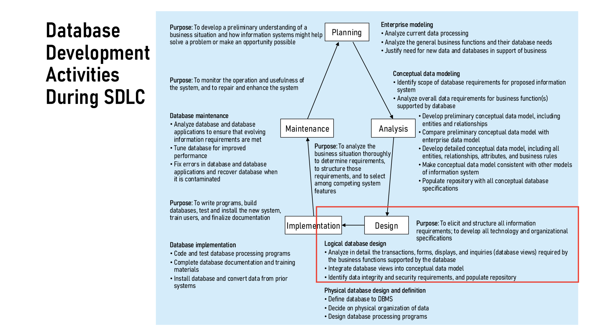

| SDLC 阶段 | 数据库相关活动 |
|---|---|
| Planning | Enterprise modeling（企业建模） |
| Analysis | Conceptual data modeling（概念建模 = 画 ERD，Week 2–3） |
| **Design** | **Logical database design（本周）** + Physical database design |
| Implementation | Database implementation（写程序、建库、迁移数据） |
| Maintenance | Database maintenance（调优、修错、恢复） |

**要点**：Logical design = 把概念模型（ERD）转成**关系模型（relations）**，并确定完整性与安全需求。还没涉及具体 DBMS 和物理存储（那是 Physical design）。

---

## 2. 🔴 Relational Data Model 关系模型

**三个组成部分**（p.4）：

| 组成 | 英文 | 解释 |
|---|---|---|
| 数据结构 | **Data structure** | 表（relations），有行和列 |
| 数据完整性 | **Data integrity** | 实现业务规则、保证数据一致的机制 |
| 数据操作 | **Data manipulation** | 用 SQL 查询和修改数据 |

### 什么样的表才算 relation？（p.5）🔴 五条要背

A relation is a **named, two-dimensional table** of data（rows = records, columns = attributes/fields）。

1. **Unique name** — 表名唯一
2. **Atomic values** — 每个格子只能有一个值（not multivalued, not composite）
3. **Unique rows** — 不能有两行完全相同
4. **Unique column names** — 同一张表里列名不能重复
5. **Order doesn't matter** — 行、列的顺序都无关紧要

> **踩坑提醒**：第 2 条（atomic）就是后面 **1NF** 的来源；第 4 条（列名不重复）在一元关系映射中会再次出现（`ManagerID`、`ComponentNo` 为什么要改名）。

### Schema 的画法：Graphical representation（p.6，作业/考试用这个）

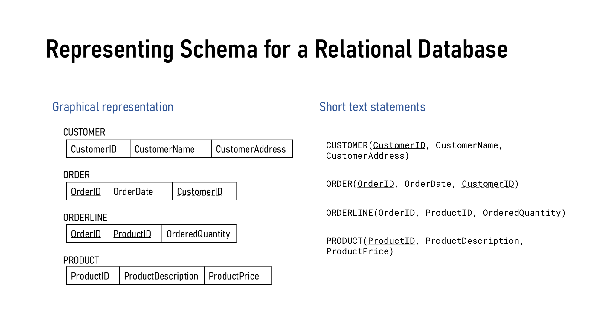

画图要点：
- 表名写在方格上方（大写）
- 每个属性占一个格子
- **主键：实线下划线**；**外键：虚线下划线**
- 外键用**箭头指向**被引用表的主键

---

## 3. 🔴 Relational Keys 键

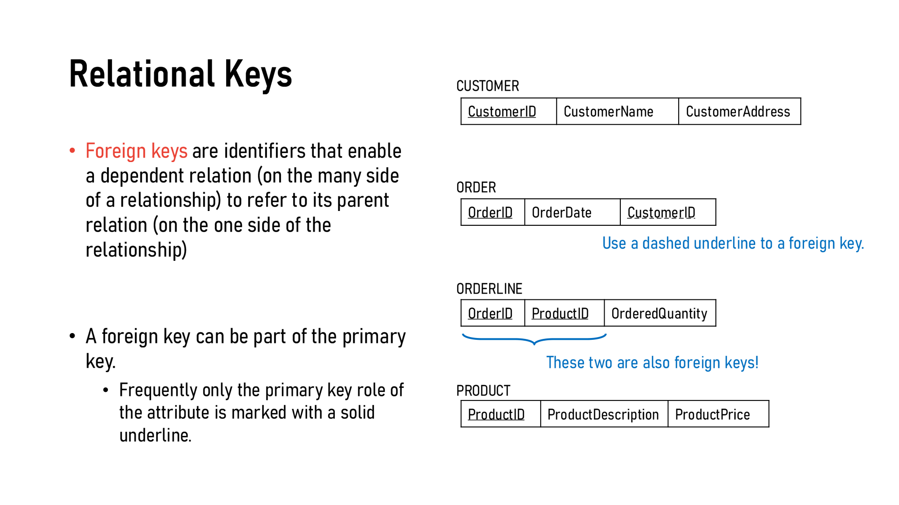

| 概念 | 英文定义（原文） | 小白解释 |
|---|---|---|
| **Primary Key 主键** | An attribute or a combination of attributes that uniquely identifies each row in a relation | 每行的"身份证号"。对应 ERD 里的 identifier。可以是 **simple**（单个属性）或 **composite**（多个属性组合，如 ORDERLINE 的 OrderID+ProductID） |
| **Foreign Key 外键** | Identifiers that enable a dependent relation (on the **many** side) to refer to its parent relation (on the **one** side) | "指向别的表的指针"。放在**多**的一方，引用**一**的一方的主键 |

**关键细节**：
- **外键可以同时是主键的一部分**（ORDERLINE 里的 OrderID、ProductID 既是 PK 的组成，又分别是 FK）。
- 这种情况下通常只画实线下划线（标主键角色）。

---

## 4. 🔴 Integrity Constraints 完整性约束（三种）

| 约束 | 规则（原文） | 小白解释 | 违反的例子 |
|---|---|---|---|
| **Domain Constraint** 域约束 | All values in a column must be from the same domain（type, size, range, meaning） | 每一列有"合法值范围" | StudentID 定义为 8 位数字，却填了 `S2026123`；Grade 填了 `82` |
| **Entity Integrity** 实体完整性 | **No primary key attribute may be null** | 主键**不能为空**（复合主键的每一部分都不能空） | COURSE 表里 CourseCode = null；ENROLLMENT 里 CourseCode = null（它是复合主键的一部分） |
| **Referential Integrity** 参照完整性 | Each **non-null** FK value must match an existing PK value in the related table | 外键要么为空，要么必须指向一个**真实存在**的主键 | ORDER 里 CustomerID = `O999`，但 CUSTOMER 表里没有这个客户 |

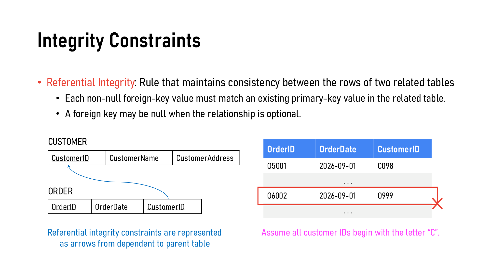

- **Null**：表示"没有值"（absence of a value），不是 0 也不是空字符串。
- **外键可以为 null**——当关系是 **optional**（可选参与）时。
- 图示：参照完整性用**箭头从 dependent（子表）指向 parent（父表）**。

> **考点**：给一张表让你找"哪一行违反了哪种约束"。判断顺序：① 值合不合 domain？② 主键有没有 null？③ 外键值在父表里存不存在？
>
> **踩坑提醒**：外键为 null **不**违反参照完整性（只要关系是可选的）；主键为 null **一定**违反实体完整性。

---

## 5. 🔴🔴 ERD → Relations 映射规则（本课最大考点）

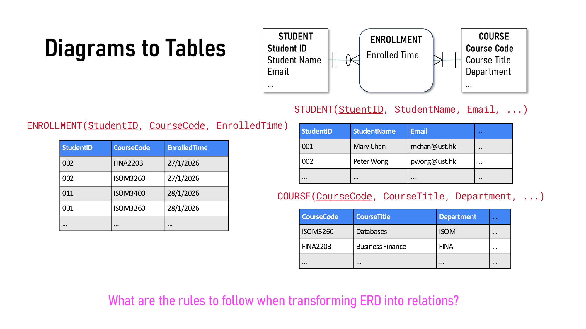

> 先放一张总表，考前背这张就够；后面逐条展开并画出结果。

| # | ERD 元素 | 映射规则 | 主键是什么 |
|---|---|---|---|
| 1 | Regular entity | 一个实体 → 一张表；简单属性 → 列 | 实体的 identifier |
| 2 | Composite attribute | 只保留**简单组成部分** | — |
| 3 | Multivalued attribute | **单独建一张表** + FK 指回原表 | 原表 PK + 该属性 |
| 3' | 多值属性自带细节 | 建独立表 + **关联表** 连起来 | 关联表：两边 PK 组合 |
| 4 | Derived attribute | **不存**（避免冗余） | — |
| 5 | Weak entity | 单独一张表 + FK 指向 owner | **Owner 的 PK + partial identifier** |
| 6 | Binary 1:1 | **Mandatory 一方的 PK** → **Optional 一方**做 FK | 各自原 PK |
| 7 | Binary 1:M | **"一"方的 PK** → **"多"方**做 FK | 各自原 PK |
| 8 | Binary M:N | **新建一张表**，两边 PK 合起来当主键 | 两个 PK 组合 |
| 9 | Associative entity（无自有 ID） | 同 M:N | 两个参与实体的 PK 组合 |
| 10 | Associative entity（有自有 ID） | 用自有 ID 当 PK，两边 PK 作 FK | **自有 ID** |
| 11 | Unary 1:M | 同一张表里加 **recursive FK** | 原 PK |
| 12 | Unary M:N | 两张表：实体表 + 关联表 | 关联表：两个属性都来自原 PK |
| 13 | Ternary | 每个实体一张表 + 关联实体一张表（带 3 个 FK） | 通常 3 个 FK 组合 |
| 14 | Supertype/Subtype | 超类一张表 + 每个子类一张表（1:1） | **子类 PK = 超类 PK** |

### 5.1 🔴 属性的处理（Regular entity, p.12–16）

用同一个 EMPLOYEE 实体贯穿：Employee ID（identifier）、Date Employed、Name (First Name, Last Name)、Home Address (Street Address, City, State)、\{Skill\}、[Years Employed]。

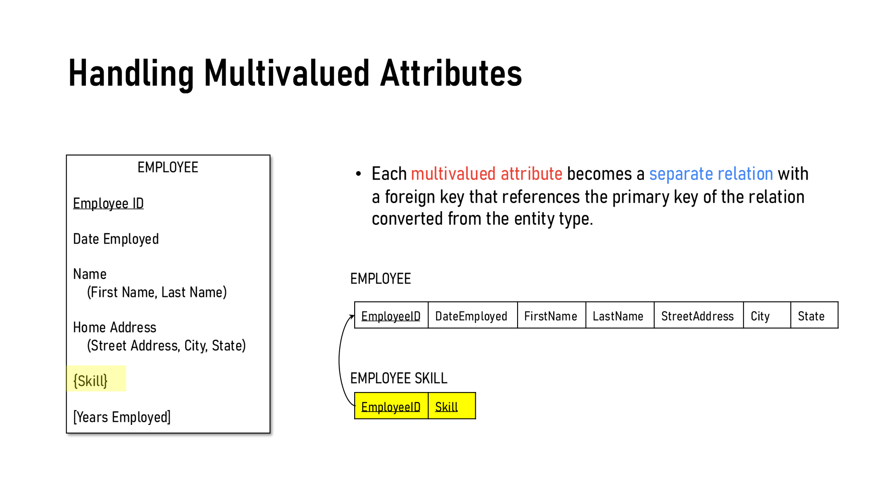

| 属性类型 | ERD 符号 | 怎么处理 | 结果 |
|---|---|---|---|
| Simple 简单 | 普通 | 直接成为一列 | EmployeeID、DateEmployed |
| **Composite 复合** | `Name (First, Last)` | **拆开**，只保留组成部分，不保留 "Name" 本身 | FirstName、LastName、StreetAddress、City、State |
| **Multivalued 多值** | `{Skill}` | **另建表** EMPLOYEE SKILL，EmployeeID 是 FK | 主键 = EmployeeID + Skill |
| **Derived 派生** | `[Years Employed]` | **不存**——可以从 DateEmployed 算出来 | 去掉 |

最终结果：

<div style={{margin: '6px 0 14px', pageBreakInside: 'avoid', breakInside: 'avoid', overflowX: 'auto'}}><div style={{fontSize: '0.85em', fontWeight: '600', marginBottom: '2px'}}>EMPLOYEE</div><table style={{borderCollapse: 'collapse', width: 'auto', margin: '0'}}><tr><td style={{border: '1px solid #333', padding: '4px 10px', whiteSpace: 'nowrap'}}><span style={{borderBottom: '1.5px solid #000', paddingBottom: '1px'}}>EmployeeID</span></td><td style={{border: '1px solid #333', padding: '4px 10px', whiteSpace: 'nowrap'}}>DateEmployed</td><td style={{border: '1px solid #333', padding: '4px 10px', whiteSpace: 'nowrap'}}>FirstName</td><td style={{border: '1px solid #333', padding: '4px 10px', whiteSpace: 'nowrap'}}>LastName</td><td style={{border: '1px solid #333', padding: '4px 10px', whiteSpace: 'nowrap'}}>StreetAddress</td><td style={{border: '1px solid #333', padding: '4px 10px', whiteSpace: 'nowrap'}}>City</td><td style={{border: '1px solid #333', padding: '4px 10px', whiteSpace: 'nowrap'}}>State</td></tr></table></div>

<div style={{margin: '6px 0 14px', pageBreakInside: 'avoid', breakInside: 'avoid', overflowX: 'auto'}}><div style={{fontSize: '0.85em', fontWeight: '600', marginBottom: '2px'}}>EMPLOYEE SKILL</div><table style={{borderCollapse: 'collapse', width: 'auto', margin: '0'}}><tr><td style={{border: '1px solid #333', padding: '4px 10px', whiteSpace: 'nowrap'}}><span style={{borderBottom: '1.5px solid #000', paddingBottom: '1px'}}>EmployeeID</span></td><td style={{border: '1px solid #333', padding: '4px 10px', whiteSpace: 'nowrap'}}><span style={{borderBottom: '1.5px solid #000', paddingBottom: '1px'}}>Skill</span></td></tr></table><div style={{fontSize: '0.8em', color: '#555', marginTop: '3px'}}>↳ EmployeeID → EMPLOYEE</div></div>

**多值属性的进阶版（p.15）**：如果 Skill 自己也有细节 \{Skill (Skill ID, Skill Name, Years Of Experience)\}：

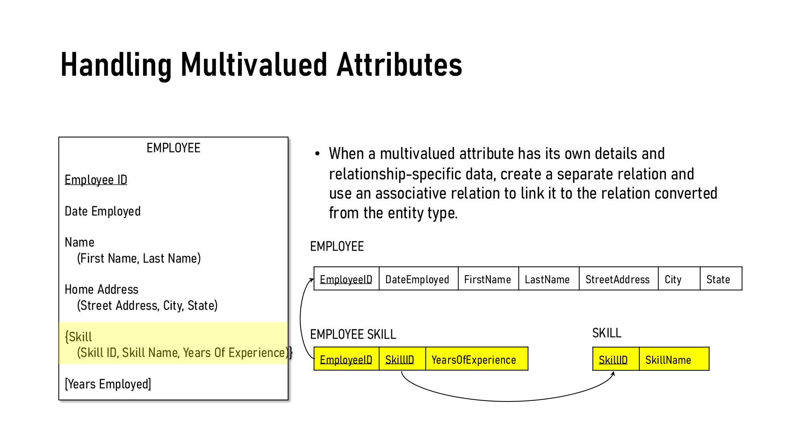

<div style={{margin: '6px 0 14px', pageBreakInside: 'avoid', breakInside: 'avoid', overflowX: 'auto'}}><div style={{fontSize: '0.85em', fontWeight: '600', marginBottom: '2px'}}>EMPLOYEE</div><table style={{borderCollapse: 'collapse', width: 'auto', margin: '0'}}><tr><td style={{border: '1px solid #333', padding: '4px 10px', whiteSpace: 'nowrap'}}><span style={{borderBottom: '1.5px solid #000', paddingBottom: '1px'}}>EmployeeID</span></td><td style={{border: '1px solid #333', padding: '4px 10px', whiteSpace: 'nowrap'}}>DateEmployed</td><td style={{border: '1px solid #333', padding: '4px 10px', whiteSpace: 'nowrap'}}>FirstName</td><td style={{border: '1px solid #333', padding: '4px 10px', whiteSpace: 'nowrap'}}>LastName</td><td style={{border: '1px solid #333', padding: '4px 10px', whiteSpace: 'nowrap'}}>StreetAddress</td><td style={{border: '1px solid #333', padding: '4px 10px', whiteSpace: 'nowrap'}}>City</td><td style={{border: '1px solid #333', padding: '4px 10px', whiteSpace: 'nowrap'}}>State</td></tr></table></div>

<div style={{margin: '6px 0 14px', pageBreakInside: 'avoid', breakInside: 'avoid', overflowX: 'auto'}}><div style={{fontSize: '0.85em', fontWeight: '600', marginBottom: '2px'}}>EMPLOYEE SKILL（关联表）</div><table style={{borderCollapse: 'collapse', width: 'auto', margin: '0'}}><tr><td style={{border: '1px solid #333', padding: '4px 10px', whiteSpace: 'nowrap'}}><span style={{borderBottom: '1.5px solid #000', paddingBottom: '1px'}}>EmployeeID</span></td><td style={{border: '1px solid #333', padding: '4px 10px', whiteSpace: 'nowrap'}}><span style={{borderBottom: '1.5px solid #000', paddingBottom: '1px'}}>SkillID</span></td><td style={{border: '1px solid #333', padding: '4px 10px', whiteSpace: 'nowrap'}}>YearsOfExperience</td></tr></table><div style={{fontSize: '0.8em', color: '#555', marginTop: '3px'}}>↳ EmployeeID → EMPLOYEE ；SkillID → SKILL</div></div>

<div style={{margin: '6px 0 14px', pageBreakInside: 'avoid', breakInside: 'avoid', overflowX: 'auto'}}><div style={{fontSize: '0.85em', fontWeight: '600', marginBottom: '2px'}}>SKILL</div><table style={{borderCollapse: 'collapse', width: 'auto', margin: '0'}}><tr><td style={{border: '1px solid #333', padding: '4px 10px', whiteSpace: 'nowrap'}}><span style={{borderBottom: '1.5px solid #000', paddingBottom: '1px'}}>SkillID</span></td><td style={{border: '1px solid #333', padding: '4px 10px', whiteSpace: 'nowrap'}}>SkillName</td></tr></table></div>

> **小白理解**：SkillName 只和技能本身有关 → 放 SKILL 表；YearsOfExperience 是"**某个员工**在**某个技能**上"的经验 → 属于这段关系，放关联表。
>
> **判断口诀**：属性跟着谁走，就放在谁的表里。

### 5.2 🔴 弱实体 Weak Entity（p.17–18）

**回顾**：Weak entity 只能通过 **identifying relationship**（双线）依附于 owner 存在；它没有完整的 identifier，只有 **partial identifier**。

例：EMPLOYEE —carries→ DEPENDENT（家属），partial identifier 是 Dependent Name (First Name, Last Name)。

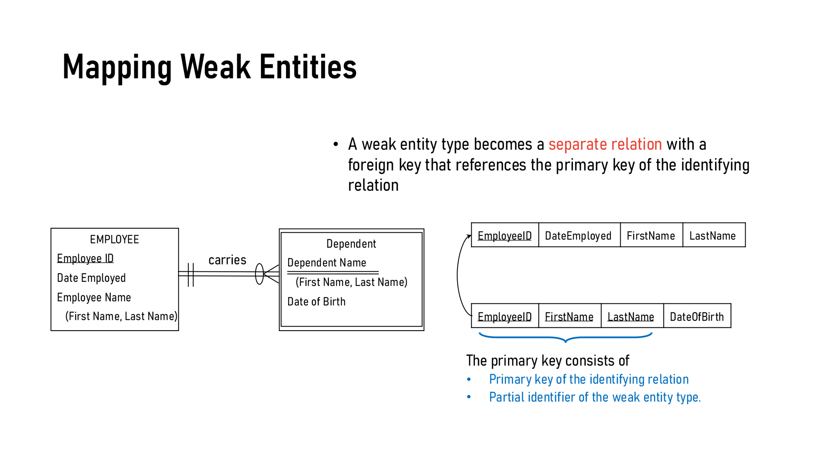

<div style={{margin: '6px 0 14px', pageBreakInside: 'avoid', breakInside: 'avoid', overflowX: 'auto'}}><div style={{fontSize: '0.85em', fontWeight: '600', marginBottom: '2px'}}>EMPLOYEE</div><table style={{borderCollapse: 'collapse', width: 'auto', margin: '0'}}><tr><td style={{border: '1px solid #333', padding: '4px 10px', whiteSpace: 'nowrap'}}><span style={{borderBottom: '1.5px solid #000', paddingBottom: '1px'}}>EmployeeID</span></td><td style={{border: '1px solid #333', padding: '4px 10px', whiteSpace: 'nowrap'}}>DateEmployed</td><td style={{border: '1px solid #333', padding: '4px 10px', whiteSpace: 'nowrap'}}>FirstName</td><td style={{border: '1px solid #333', padding: '4px 10px', whiteSpace: 'nowrap'}}>LastName</td></tr></table></div>

<div style={{margin: '6px 0 14px', pageBreakInside: 'avoid', breakInside: 'avoid', overflowX: 'auto'}}><div style={{fontSize: '0.85em', fontWeight: '600', marginBottom: '2px'}}>DEPENDENT</div><table style={{borderCollapse: 'collapse', width: 'auto', margin: '0'}}><tr><td style={{border: '1px solid #333', padding: '4px 10px', whiteSpace: 'nowrap'}}><span style={{borderBottom: '1.5px solid #000', paddingBottom: '1px'}}>EmployeeID</span></td><td style={{border: '1px solid #333', padding: '4px 10px', whiteSpace: 'nowrap'}}><span style={{borderBottom: '1.5px solid #000', paddingBottom: '1px'}}>FirstName</span></td><td style={{border: '1px solid #333', padding: '4px 10px', whiteSpace: 'nowrap'}}><span style={{borderBottom: '1.5px solid #000', paddingBottom: '1px'}}>LastName</span></td><td style={{border: '1px solid #333', padding: '4px 10px', whiteSpace: 'nowrap'}}>DateOfBirth</td></tr></table><div style={{fontSize: '0.8em', color: '#555', marginTop: '3px'}}>↳ EmployeeID → EMPLOYEE；主键 = EmployeeID（owner 的 PK）+ FirstName + LastName（partial identifier）</div></div>

> **考点**：弱实体的主键 = **Owner 的主键 + 自己的 partial identifier**。只写 partial identifier 当主键是经典失分点——两个员工的孩子可能同名。
>
> **为什么 FirstName、LastName 两列都在主键里？** 因为 Dependent Name 是**复合属性**，拆开后所有组成部分都要进主键。如果 partial identifier 是简单属性（如 DependentName），主键就是 EmployeeID + DependentName——**EmployeeID 永远不能省**。

### 5.3 🔴 二元关系 Binary Relationships（p.19–21）

**一句口诀：1:M 放"多"方；1:1 放"可选"方；M:N 新建表。**

| 基数 | 规则 | 例子 |
|---|---|---|
| **1:M** | 一方的 PK → 多方的 FK | CUSTOMER submits ORDER |
| **1:1** | **Mandatory 方**的 PK → **Optional 方**做 FK | EMPLOYEE is assigned LAPTOP |
| **M:N** | 新建关系表，PK = 两边 PK 组合；关系属性放这里 | EMPLOYEE completes COURSE |

**1:M — CUSTOMER submits ORDER**

<div style={{margin: '6px 0 14px', pageBreakInside: 'avoid', breakInside: 'avoid', overflowX: 'auto'}}><div style={{fontSize: '0.85em', fontWeight: '600', marginBottom: '2px'}}>CUSTOMER</div><table style={{borderCollapse: 'collapse', width: 'auto', margin: '0'}}><tr><td style={{border: '1px solid #333', padding: '4px 10px', whiteSpace: 'nowrap'}}><span style={{borderBottom: '1.5px solid #000', paddingBottom: '1px'}}>CustomerID</span></td><td style={{border: '1px solid #333', padding: '4px 10px', whiteSpace: 'nowrap'}}>CustomerName</td><td style={{border: '1px solid #333', padding: '4px 10px', whiteSpace: 'nowrap'}}>CustomerAddress</td></tr></table></div>

<div style={{margin: '6px 0 14px', pageBreakInside: 'avoid', breakInside: 'avoid', overflowX: 'auto'}}><div style={{fontSize: '0.85em', fontWeight: '600', marginBottom: '2px'}}>ORDER</div><table style={{borderCollapse: 'collapse', width: 'auto', margin: '0'}}><tr><td style={{border: '1px solid #333', padding: '4px 10px', whiteSpace: 'nowrap'}}><span style={{borderBottom: '1.5px solid #000', paddingBottom: '1px'}}>OrderID</span></td><td style={{border: '1px solid #333', padding: '4px 10px', whiteSpace: 'nowrap'}}>OrderDate</td><td style={{border: '1px solid #333', padding: '4px 10px', whiteSpace: 'nowrap'}}><span style={{borderBottom: '1.5px dashed #000', paddingBottom: '1px'}}>CustomerID</span></td></tr></table><div style={{fontSize: '0.8em', color: '#555', marginTop: '3px'}}>↳ CustomerID → CUSTOMER</div></div>

**1:1 — EMPLOYEE is assigned LAPTOP**

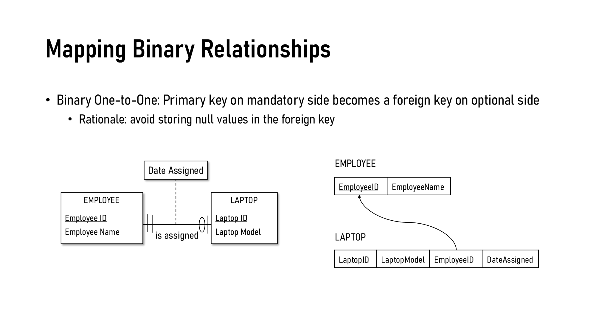

<div style={{margin: '6px 0 14px', pageBreakInside: 'avoid', breakInside: 'avoid', overflowX: 'auto'}}><div style={{fontSize: '0.85em', fontWeight: '600', marginBottom: '2px'}}>EMPLOYEE</div><table style={{borderCollapse: 'collapse', width: 'auto', margin: '0'}}><tr><td style={{border: '1px solid #333', padding: '4px 10px', whiteSpace: 'nowrap'}}><span style={{borderBottom: '1.5px solid #000', paddingBottom: '1px'}}>EmployeeID</span></td><td style={{border: '1px solid #333', padding: '4px 10px', whiteSpace: 'nowrap'}}>EmployeeName</td></tr></table></div>

<div style={{margin: '6px 0 14px', pageBreakInside: 'avoid', breakInside: 'avoid', overflowX: 'auto'}}><div style={{fontSize: '0.85em', fontWeight: '600', marginBottom: '2px'}}>LAPTOP</div><table style={{borderCollapse: 'collapse', width: 'auto', margin: '0'}}><tr><td style={{border: '1px solid #333', padding: '4px 10px', whiteSpace: 'nowrap'}}><span style={{borderBottom: '1.5px solid #000', paddingBottom: '1px'}}>LaptopID</span></td><td style={{border: '1px solid #333', padding: '4px 10px', whiteSpace: 'nowrap'}}>LaptopModel</td><td style={{border: '1px solid #333', padding: '4px 10px', whiteSpace: 'nowrap'}}><span style={{borderBottom: '1.5px dashed #000', paddingBottom: '1px'}}>EmployeeID</span></td><td style={{border: '1px solid #333', padding: '4px 10px', whiteSpace: 'nowrap'}}>DateAssigned</td></tr></table><div style={{fontSize: '0.8em', color: '#555', marginTop: '3px'}}>↳ EmployeeID → EMPLOYEE</div></div>

**1:1 为什么这样放？（Rationale: avoid null FK）**
- 图里：每台 laptop **必须**分配给一个员工（EMPLOYEE 那端是 `||` = mandatory）；员工**可以没有** laptop（LAPTOP 那端是 `O|` = optional）。
- 如果把 LaptopID 放进 EMPLOYEE 表 → 没电脑的员工那一格就是 null。
- 把 EmployeeID 放进 LAPTOP 表 → 每台电脑都有主人，**FK 永远不为空**。
- 关系属性 DateAssigned 也跟着 FK 一起放进 LAPTOP。

**1:1 补充（课件没演示，了解即可）🟡**

| 情况 | 外键放哪里 |
|---|---|
| Mandatory – Optional（课件例子） | 放在 **optional 一方**，引用 mandatory 一方的主键 |
| Mandatory – Mandatory | **哪边都行，只放一个**（也可以合并成一张表） |
| Optional – Optional | 哪边都行，选 **null 更少**的一边 |

> **踩坑提醒**：1:1 **不要两边都放外键**——冗余、改一边忘改另一边会自相矛盾、两边都 NOT NULL 时第一行插不进去。

**M:N — EMPLOYEE completes COURSE**

<div style={{margin: '6px 0 14px', pageBreakInside: 'avoid', breakInside: 'avoid', overflowX: 'auto'}}><div style={{fontSize: '0.85em', fontWeight: '600', marginBottom: '2px'}}>EMPLOYEE</div><table style={{borderCollapse: 'collapse', width: 'auto', margin: '0'}}><tr><td style={{border: '1px solid #333', padding: '4px 10px', whiteSpace: 'nowrap'}}><span style={{borderBottom: '1.5px solid #000', paddingBottom: '1px'}}>EmployeeID</span></td><td style={{border: '1px solid #333', padding: '4px 10px', whiteSpace: 'nowrap'}}>EmployeeName</td></tr></table></div>

<div style={{margin: '6px 0 14px', pageBreakInside: 'avoid', breakInside: 'avoid', overflowX: 'auto'}}><div style={{fontSize: '0.85em', fontWeight: '600', marginBottom: '2px'}}>COMPLETION</div><table style={{borderCollapse: 'collapse', width: 'auto', margin: '0'}}><tr><td style={{border: '1px solid #333', padding: '4px 10px', whiteSpace: 'nowrap'}}><span style={{borderBottom: '1.5px solid #000', paddingBottom: '1px'}}>EmployeeID</span></td><td style={{border: '1px solid #333', padding: '4px 10px', whiteSpace: 'nowrap'}}><span style={{borderBottom: '1.5px solid #000', paddingBottom: '1px'}}>CourseID</span></td><td style={{border: '1px solid #333', padding: '4px 10px', whiteSpace: 'nowrap'}}>DateCompleted</td></tr></table><div style={{fontSize: '0.8em', color: '#555', marginTop: '3px'}}>↳ EmployeeID → EMPLOYEE ；CourseID → COURSE</div></div>

<div style={{margin: '6px 0 14px', pageBreakInside: 'avoid', breakInside: 'avoid', overflowX: 'auto'}}><div style={{fontSize: '0.85em', fontWeight: '600', marginBottom: '2px'}}>COURSE</div><table style={{borderCollapse: 'collapse', width: 'auto', margin: '0'}}><tr><td style={{border: '1px solid #333', padding: '4px 10px', whiteSpace: 'nowrap'}}><span style={{borderBottom: '1.5px solid #000', paddingBottom: '1px'}}>CourseID</span></td><td style={{border: '1px solid #333', padding: '4px 10px', whiteSpace: 'nowrap'}}>CourseTitle</td></tr></table></div>

> **踩坑提醒**：1:M 时**绝不能**把"多"方的 PK 放进"一"方——一个客户有多个订单，一格塞不下多个 OrderID（违反 atomic）。

### 5.4 🔴 关联实体 Associative Entity（p.22–23）

| 情况 | 主键 | 例子 |
|---|---|---|
| **没有**自己的 identifier | 默认 = 两个参与实体 PK 的组合 | ORDERLINE |
| **有**自己的 identifier | **就用自己的 ID**；两边 PK 只作 FK | SHIPMENT |

**没有自有 ID — ORDERLINE（ORDER 与 PRODUCT 之间）**

<div style={{margin: '6px 0 14px', pageBreakInside: 'avoid', breakInside: 'avoid', overflowX: 'auto'}}><div style={{fontSize: '0.85em', fontWeight: '600', marginBottom: '2px'}}>ORDER</div><table style={{borderCollapse: 'collapse', width: 'auto', margin: '0'}}><tr><td style={{border: '1px solid #333', padding: '4px 10px', whiteSpace: 'nowrap'}}><span style={{borderBottom: '1.5px solid #000', paddingBottom: '1px'}}>OrderID</span></td><td style={{border: '1px solid #333', padding: '4px 10px', whiteSpace: 'nowrap'}}>OrderDate</td></tr></table></div>

<div style={{margin: '6px 0 14px', pageBreakInside: 'avoid', breakInside: 'avoid', overflowX: 'auto'}}><div style={{fontSize: '0.85em', fontWeight: '600', marginBottom: '2px'}}>ORDERLINE</div><table style={{borderCollapse: 'collapse', width: 'auto', margin: '0'}}><tr><td style={{border: '1px solid #333', padding: '4px 10px', whiteSpace: 'nowrap'}}><span style={{borderBottom: '1.5px solid #000', paddingBottom: '1px'}}>OrderID</span></td><td style={{border: '1px solid #333', padding: '4px 10px', whiteSpace: 'nowrap'}}><span style={{borderBottom: '1.5px solid #000', paddingBottom: '1px'}}>ProductID</span></td><td style={{border: '1px solid #333', padding: '4px 10px', whiteSpace: 'nowrap'}}>OrderedQuantity</td></tr></table><div style={{fontSize: '0.8em', color: '#555', marginTop: '3px'}}>↳ OrderID → ORDER ；ProductID → PRODUCT</div></div>

<div style={{margin: '6px 0 14px', pageBreakInside: 'avoid', breakInside: 'avoid', overflowX: 'auto'}}><div style={{fontSize: '0.85em', fontWeight: '600', marginBottom: '2px'}}>PRODUCT</div><table style={{borderCollapse: 'collapse', width: 'auto', margin: '0'}}><tr><td style={{border: '1px solid #333', padding: '4px 10px', whiteSpace: 'nowrap'}}><span style={{borderBottom: '1.5px solid #000', paddingBottom: '1px'}}>ProductID</span></td><td style={{border: '1px solid #333', padding: '4px 10px', whiteSpace: 'nowrap'}}>ProductDescription</td><td style={{border: '1px solid #333', padding: '4px 10px', whiteSpace: 'nowrap'}}>ProductPrice</td></tr></table></div>

**有自有 ID — SHIPMENT（CUSTOMER 与 VENDOR 之间）**

<div style={{margin: '6px 0 14px', pageBreakInside: 'avoid', breakInside: 'avoid', overflowX: 'auto'}}><div style={{fontSize: '0.85em', fontWeight: '600', marginBottom: '2px'}}>CUSTOMER</div><table style={{borderCollapse: 'collapse', width: 'auto', margin: '0'}}><tr><td style={{border: '1px solid #333', padding: '4px 10px', whiteSpace: 'nowrap'}}><span style={{borderBottom: '1.5px solid #000', paddingBottom: '1px'}}>CustomerID</span></td><td style={{border: '1px solid #333', padding: '4px 10px', whiteSpace: 'nowrap'}}>CustomerName</td></tr></table></div>

<div style={{margin: '6px 0 14px', pageBreakInside: 'avoid', breakInside: 'avoid', overflowX: 'auto'}}><div style={{fontSize: '0.85em', fontWeight: '600', marginBottom: '2px'}}>SHIPMENT</div><table style={{borderCollapse: 'collapse', width: 'auto', margin: '0'}}><tr><td style={{border: '1px solid #333', padding: '4px 10px', whiteSpace: 'nowrap'}}><span style={{borderBottom: '1.5px solid #000', paddingBottom: '1px'}}>ShipmentID</span></td><td style={{border: '1px solid #333', padding: '4px 10px', whiteSpace: 'nowrap'}}><span style={{borderBottom: '1.5px dashed #000', paddingBottom: '1px'}}>CustomerID</span></td><td style={{border: '1px solid #333', padding: '4px 10px', whiteSpace: 'nowrap'}}><span style={{borderBottom: '1.5px dashed #000', paddingBottom: '1px'}}>VendorID</span></td><td style={{border: '1px solid #333', padding: '4px 10px', whiteSpace: 'nowrap'}}>ShipmentDate</td></tr></table><div style={{fontSize: '0.8em', color: '#555', marginTop: '3px'}}>↳ CustomerID → CUSTOMER ；VendorID → VENDOR</div></div>

<div style={{margin: '6px 0 14px', pageBreakInside: 'avoid', breakInside: 'avoid', overflowX: 'auto'}}><div style={{fontSize: '0.85em', fontWeight: '600', marginBottom: '2px'}}>VENDOR</div><table style={{borderCollapse: 'collapse', width: 'auto', margin: '0'}}><tr><td style={{border: '1px solid #333', padding: '4px 10px', whiteSpace: 'nowrap'}}><span style={{borderBottom: '1.5px solid #000', paddingBottom: '1px'}}>VendorID</span></td><td style={{border: '1px solid #333', padding: '4px 10px', whiteSpace: 'nowrap'}}>VendorAddress</td></tr></table></div>

> **为什么 SHIPMENT 要有自己的 ID？** 同一个 vendor 可能给同一个 customer 发**多次**货。如果用 (CustomerID, VendorID) 当主键，第二次发货就会"主键重复"。
>
> **注意画法区别**：ORDERLINE 的两个外键在主键里 → 实线；SHIPMENT 的两个外键不在主键里 → 虚线。

### 5.5 🔴 一元关系 Unary Relationships（p.24–25）

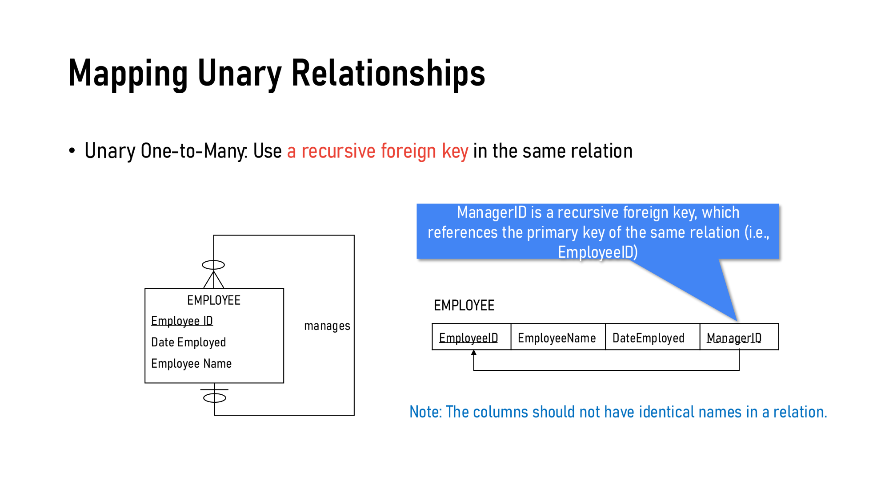

**Unary 1:M**（员工 manages 员工）→ 在同一张表里加 **recursive foreign key**：

<div style={{margin: '6px 0 14px', pageBreakInside: 'avoid', breakInside: 'avoid', overflowX: 'auto'}}><div style={{fontSize: '0.85em', fontWeight: '600', marginBottom: '2px'}}>EMPLOYEE</div><table style={{borderCollapse: 'collapse', width: 'auto', margin: '0'}}><tr><td style={{border: '1px solid #333', padding: '4px 10px', whiteSpace: 'nowrap'}}><span style={{borderBottom: '1.5px solid #000', paddingBottom: '1px'}}>EmployeeID</span></td><td style={{border: '1px solid #333', padding: '4px 10px', whiteSpace: 'nowrap'}}>EmployeeName</td><td style={{border: '1px solid #333', padding: '4px 10px', whiteSpace: 'nowrap'}}>DateEmployed</td><td style={{border: '1px solid #333', padding: '4px 10px', whiteSpace: 'nowrap'}}><span style={{borderBottom: '1.5px dashed #000', paddingBottom: '1px'}}>ManagerID</span></td></tr></table><div style={{fontSize: '0.8em', color: '#555', marginTop: '3px'}}>↳ ManagerID → 本表 EmployeeID（递归外键，箭头指回同一张表）</div></div>

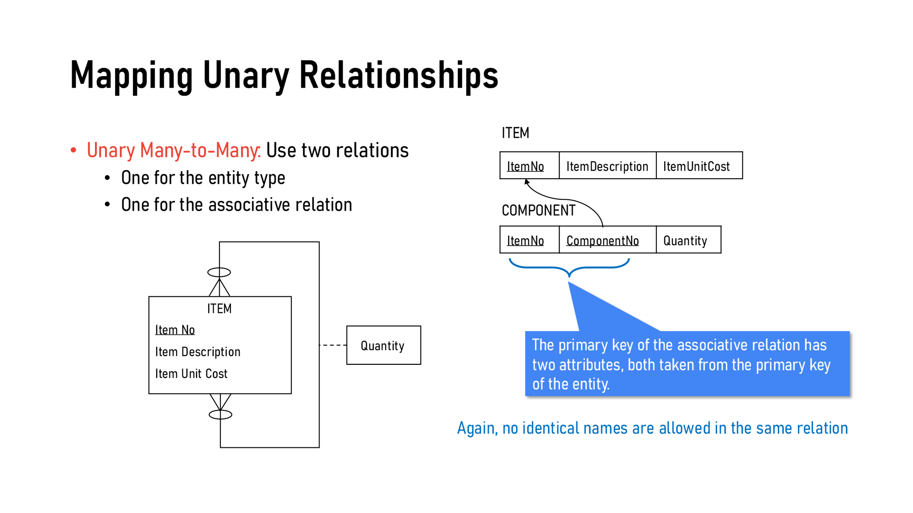

**Unary M:N**（物品由其他物品组成，Bill of Materials）→ **两张表**：

<div style={{margin: '6px 0 14px', pageBreakInside: 'avoid', breakInside: 'avoid', overflowX: 'auto'}}><div style={{fontSize: '0.85em', fontWeight: '600', marginBottom: '2px'}}>ITEM</div><table style={{borderCollapse: 'collapse', width: 'auto', margin: '0'}}><tr><td style={{border: '1px solid #333', padding: '4px 10px', whiteSpace: 'nowrap'}}><span style={{borderBottom: '1.5px solid #000', paddingBottom: '1px'}}>ItemNo</span></td><td style={{border: '1px solid #333', padding: '4px 10px', whiteSpace: 'nowrap'}}>ItemDescription</td><td style={{border: '1px solid #333', padding: '4px 10px', whiteSpace: 'nowrap'}}>ItemUnitCost</td></tr></table></div>

<div style={{margin: '6px 0 14px', pageBreakInside: 'avoid', breakInside: 'avoid', overflowX: 'auto'}}><div style={{fontSize: '0.85em', fontWeight: '600', marginBottom: '2px'}}>COMPONENT</div><table style={{borderCollapse: 'collapse', width: 'auto', margin: '0'}}><tr><td style={{border: '1px solid #333', padding: '4px 10px', whiteSpace: 'nowrap'}}><span style={{borderBottom: '1.5px solid #000', paddingBottom: '1px'}}>ItemNo</span></td><td style={{border: '1px solid #333', padding: '4px 10px', whiteSpace: 'nowrap'}}><span style={{borderBottom: '1.5px solid #000', paddingBottom: '1px'}}>ComponentNo</span></td><td style={{border: '1px solid #333', padding: '4px 10px', whiteSpace: 'nowrap'}}>Quantity</td></tr></table><div style={{fontSize: '0.8em', color: '#555', marginTop: '3px'}}>↳ ItemNo → ITEM ；ComponentNo → ITEM（两个都来自 ITEM 的主键）</div></div>

**Unary 1:1（课件没演示，了解即可）🟡**：做法同 1:M，本表加递归外键，区别只是外键值**不能重复**。例：PERSON is married to PERSON：

<div style={{margin: '6px 0 14px', pageBreakInside: 'avoid', breakInside: 'avoid', overflowX: 'auto'}}><div style={{fontSize: '0.85em', fontWeight: '600', marginBottom: '2px'}}>PERSON</div><table style={{borderCollapse: 'collapse', width: 'auto', margin: '0'}}><tr><td style={{border: '1px solid #333', padding: '4px 10px', whiteSpace: 'nowrap'}}><span style={{borderBottom: '1.5px solid #000', paddingBottom: '1px'}}>PersonID</span></td><td style={{border: '1px solid #333', padding: '4px 10px', whiteSpace: 'nowrap'}}>PersonName</td><td style={{border: '1px solid #333', padding: '4px 10px', whiteSpace: 'nowrap'}}>DateOfBirth</td><td style={{border: '1px solid #333', padding: '4px 10px', whiteSpace: 'nowrap'}}><span style={{borderBottom: '1.5px dashed #000', paddingBottom: '1px'}}>SpouseID</span></td></tr></table><div style={{fontSize: '0.8em', color: '#555', marginTop: '3px'}}>↳ SpouseID → 本表 PersonID</div></div>

> **踩坑提醒**：同一张表不能有两列都叫 EmployeeID / ItemNo / PersonID（relation 规则第 4 条），所以必须**改名**——ManagerID、ComponentNo、SpouseID。考试画表时忘记改名会扣分。

### 5.6 🟡 三元关系 Ternary Relationships（p.26）

PART、VENDOR、WAREHOUSE 三方关系 SUPPLY SCHEDULE。规则：**每个实体一张表 + 关联实体一张表**，关联表对三个实体各有一个 FK。

<div style={{margin: '6px 0 14px', pageBreakInside: 'avoid', breakInside: 'avoid', overflowX: 'auto'}}><div style={{fontSize: '0.85em', fontWeight: '600', marginBottom: '2px'}}>PART</div><table style={{borderCollapse: 'collapse', width: 'auto', margin: '0'}}><tr><td style={{border: '1px solid #333', padding: '4px 10px', whiteSpace: 'nowrap'}}><span style={{borderBottom: '1.5px solid #000', paddingBottom: '1px'}}>PartNo</span></td><td style={{border: '1px solid #333', padding: '4px 10px', whiteSpace: 'nowrap'}}>PartDescription</td></tr></table></div>

<div style={{margin: '6px 0 14px', pageBreakInside: 'avoid', breakInside: 'avoid', overflowX: 'auto'}}><div style={{fontSize: '0.85em', fontWeight: '600', marginBottom: '2px'}}>VENDOR</div><table style={{borderCollapse: 'collapse', width: 'auto', margin: '0'}}><tr><td style={{border: '1px solid #333', padding: '4px 10px', whiteSpace: 'nowrap'}}><span style={{borderBottom: '1.5px solid #000', paddingBottom: '1px'}}>VendorID</span></td><td style={{border: '1px solid #333', padding: '4px 10px', whiteSpace: 'nowrap'}}>VendorName</td></tr></table></div>

<div style={{margin: '6px 0 14px', pageBreakInside: 'avoid', breakInside: 'avoid', overflowX: 'auto'}}><div style={{fontSize: '0.85em', fontWeight: '600', marginBottom: '2px'}}>WAREHOUSE</div><table style={{borderCollapse: 'collapse', width: 'auto', margin: '0'}}><tr><td style={{border: '1px solid #333', padding: '4px 10px', whiteSpace: 'nowrap'}}><span style={{borderBottom: '1.5px solid #000', paddingBottom: '1px'}}>WarehouseID</span></td><td style={{border: '1px solid #333', padding: '4px 10px', whiteSpace: 'nowrap'}}>WarehouseAddress</td></tr></table></div>

<div style={{margin: '6px 0 14px', pageBreakInside: 'avoid', breakInside: 'avoid', overflowX: 'auto'}}><div style={{fontSize: '0.85em', fontWeight: '600', marginBottom: '2px'}}>SUPPLY SCHEDULE</div><table style={{borderCollapse: 'collapse', width: 'auto', margin: '0'}}><tr><td style={{border: '1px solid #333', padding: '4px 10px', whiteSpace: 'nowrap'}}><span style={{borderBottom: '1.5px solid #000', paddingBottom: '1px'}}>PartNo</span></td><td style={{border: '1px solid #333', padding: '4px 10px', whiteSpace: 'nowrap'}}><span style={{borderBottom: '1.5px solid #000', paddingBottom: '1px'}}>VendorID</span></td><td style={{border: '1px solid #333', padding: '4px 10px', whiteSpace: 'nowrap'}}><span style={{borderBottom: '1.5px solid #000', paddingBottom: '1px'}}>WarehouseID</span></td><td style={{border: '1px solid #333', padding: '4px 10px', whiteSpace: 'nowrap'}}>ShippingMode</td><td style={{border: '1px solid #333', padding: '4px 10px', whiteSpace: 'nowrap'}}>UnitCost</td></tr></table><div style={{fontSize: '0.8em', color: '#555', marginTop: '3px'}}>↳ PartNo → PART ；VendorID → VENDOR ；WarehouseID → WAREHOUSE</div></div>

### 5.7 🔴 超类/子类 Supertype/Subtype（p.27）

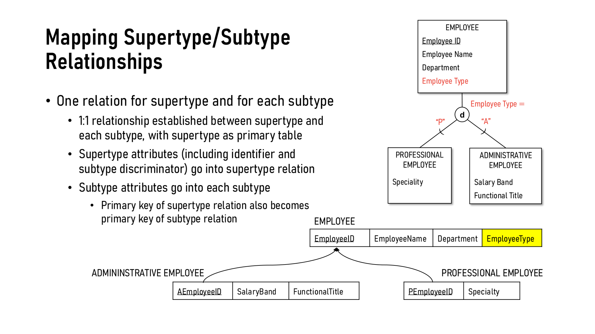

EMPLOYEE（超类）分为 ADMINISTRATIVE（"A"）和 PROFESSIONAL（"P"），disjoint（d）。

<div style={{margin: '6px 0 14px', pageBreakInside: 'avoid', breakInside: 'avoid', overflowX: 'auto'}}><div style={{fontSize: '0.85em', fontWeight: '600', marginBottom: '2px'}}>EMPLOYEE</div><table style={{borderCollapse: 'collapse', width: 'auto', margin: '0'}}><tr><td style={{border: '1px solid #333', padding: '4px 10px', whiteSpace: 'nowrap'}}><span style={{borderBottom: '1.5px solid #000', paddingBottom: '1px'}}>EmployeeID</span></td><td style={{border: '1px solid #333', padding: '4px 10px', whiteSpace: 'nowrap'}}>EmployeeName</td><td style={{border: '1px solid #333', padding: '4px 10px', whiteSpace: 'nowrap'}}>Department</td><td style={{border: '1px solid #333', padding: '4px 10px', whiteSpace: 'nowrap'}}>EmployeeType</td></tr></table><div style={{fontSize: '0.8em', color: '#555', marginTop: '3px'}}>↳ EmployeeType = subtype discriminator</div></div>

<div style={{margin: '6px 0 14px', pageBreakInside: 'avoid', breakInside: 'avoid', overflowX: 'auto'}}><div style={{fontSize: '0.85em', fontWeight: '600', marginBottom: '2px'}}>ADMINISTRATIVE EMPLOYEE</div><table style={{borderCollapse: 'collapse', width: 'auto', margin: '0'}}><tr><td style={{border: '1px solid #333', padding: '4px 10px', whiteSpace: 'nowrap'}}><span style={{borderBottom: '1.5px solid #000', paddingBottom: '1px'}}>AEmployeeID</span></td><td style={{border: '1px solid #333', padding: '4px 10px', whiteSpace: 'nowrap'}}>SalaryBand</td><td style={{border: '1px solid #333', padding: '4px 10px', whiteSpace: 'nowrap'}}>FunctionalTitle</td></tr></table><div style={{fontSize: '0.8em', color: '#555', marginTop: '3px'}}>↳ AEmployeeID → EMPLOYEE</div></div>

<div style={{margin: '6px 0 14px', pageBreakInside: 'avoid', breakInside: 'avoid', overflowX: 'auto'}}><div style={{fontSize: '0.85em', fontWeight: '600', marginBottom: '2px'}}>PROFESSIONAL EMPLOYEE</div><table style={{borderCollapse: 'collapse', width: 'auto', margin: '0'}}><tr><td style={{border: '1px solid #333', padding: '4px 10px', whiteSpace: 'nowrap'}}><span style={{borderBottom: '1.5px solid #000', paddingBottom: '1px'}}>PEmployeeID</span></td><td style={{border: '1px solid #333', padding: '4px 10px', whiteSpace: 'nowrap'}}>Specialty</td></tr></table><div style={{fontSize: '0.8em', color: '#555', marginTop: '3px'}}>↳ PEmployeeID → EMPLOYEE</div></div>

五条规则：
1. 超类一张表，**每个子类各一张表**
2. 超类与每个子类之间是 **1:1** 关系，超类是 primary table
3. **超类属性**（包括 identifier 和 **subtype discriminator**）放超类表
4. **子类特有属性**放子类表
5. **超类的主键同时也是子类的主键**（AEmployeeID、PEmployeeID 同时是 FK 指回 EMPLOYEE）

---

## 6. 🔴 Normalization 规范化（只考到 3NF）

<Callout type="note" title="这一节怎么读">

先用 6.1–6.2 搞懂**为什么要拆表**、**函数依赖是什么**；然后背 6.3 的**做题套路**（这是重点，尤其是找 FD 的三层检查）；6.4 用 Lab 5-02 完整走一遍；6.5 是一道有多值属性的例题；6.6 是可以点的 FD 检查器和逐步演示；6.7 是常见错误。课程只要求到 **3NF**，BCNF 以后不用管。

</Callout>

### 6.1 🔴 为什么要规范化：一张表只讲一件事

> **Normalization**: The process of **successively decomposing** relations with anomalies to produce smaller, **well-structured relations**.（p.28）

目的（p.28）：**Minimize data redundancy**（老师 Main Takeaway 说这是**主要目标**）；让参照完整性更容易维护；更容易维护；更贴近现实世界。

**Well-structured relation**：冗余最少，增、删、改都不会造成数据不一致（anomalies）。

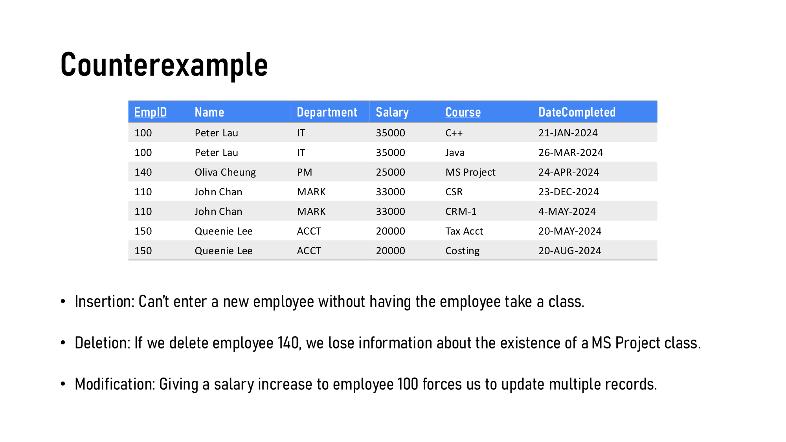

这张表的毛病在于**一行里混了两件事**：「员工是谁」（Name、Department、Salary）和「员工上过哪门课」（Course、DateCompleted）。一个员工上几门课，他的姓名、部门、工资就被**重复存几遍**。重复存储会带来三种异常：

| 异常 | 定义（p.29） | 在这张表里（p.30） | 根源 |
|---|---|---|---|
| **Insertion anomaly** 插入异常 | Adding new rows forces user to create duplicate data | 新员工**还没上过课就录不进去**（Course 是主键的一部分，不能为空） | 员工信息只能「搭着课程」存 |
| **Deletion anomaly** 删除异常 | Deleting rows may cause a loss of data needed for other future rows | 删掉员工 140 → **MS Project 这门课存在过的信息也没了** | 课程信息只能「搭着员工」存 |
| **Modification anomaly** 修改异常 | Changing data in a row forces changes to other rows because of duplication | 给员工 100 加薪 → 要改**两行**，漏改一行就前后矛盾 | 同一个工资存了两遍 |

**解决办法就是拆表**：员工的事放 EMPLOYEE，上课的事放 EMPCOURSE（p.31）。拆完以后，员工 190 没上课也能录入，加薪只改一行。

> **考点**：给一张表，让你各举一个三种异常的例子。答题格式：
> *Insertion: we cannot add a new ___ without also ___.* · *Deletion: deleting ___ also loses ___.* · *Modification: changing ___ requires updating multiple rows.*

**规范化就是用一套固定规则来找「一行里混了几件事」，再把它们拆开。** 这套规则的工具叫函数依赖。

### 6.2 🔴 Functional Dependency 函数依赖：做题的唯一工具

> **Functional Dependency**: The value of one attribute (the **determinant**) determines the value of another attribute.（p.34）写作 `A → B`，箭头左边叫 **determinant（决定因素）**。

**「A → B」就是说：只要知道 A，B 就只有一个答案。** 比如知道学号就能确定姓名：`StudentID → StudentName`。反过来不成立：同名的学生可能有好几个，所以 `StudentName ↛ StudentID`。

决定因素也可以是**组合**：`EmpID, Course → DateCompleted`。单知道员工不行（他上过好几门课），单知道课程也不行（好几个人上过），要**两个一起**才能确定完成日期。

**考试里怎么找 FD？**

这门课的 lab 和作业通常**不直接给 FD**，而是给一张带样本数据的大表，要自己找。靠两样东西：

1. **业务含义**：对每个属性问一句「**知道 X，能不能确定这个值只有一个？**」。每门课有一个课名 → `CourseID → CourseTitle`；每个人有一个职位 → `Contact_Person → Position`。
2. **样本数据只能用来否定**：如果同一个 X 对应了两个不同的 Y，那 `X → Y` 一定不成立；但几行数据恰好没冲突，并不能证明依赖成立。

怎么保证**一条都不漏**，见 6.3 的「三层检查」。

**两个名词**，后面每一步都要用到：
- **Key attribute（键属性）**：主键里的列。
- **Non-key attribute（非键属性）**：主键以外的所有列。

#### 🔴 三种依赖：只看箭头左边

| 箭头左边（determinant）是…… | 名字 | 要不要处理 | 课件例子 |
|---|---|---|---|
| **整个主键** | **Full** functional dependency（完全依赖） | ✅ 正常，不用动 | `EmpID, Course → DateCompleted` |
| **主键的一部分**（只可能出现在复合主键里） | **Partial** dependency（部分依赖） | ❌ 违反 2NF | `EmpID → Name, Department, Salary`（主键是 EmpID + Course） |
| **一个非键属性** | **Transitive** dependency（传递依赖） | ❌ 违反 3NF | `CustomerID → CustomerName`（主键是 OrderID） |

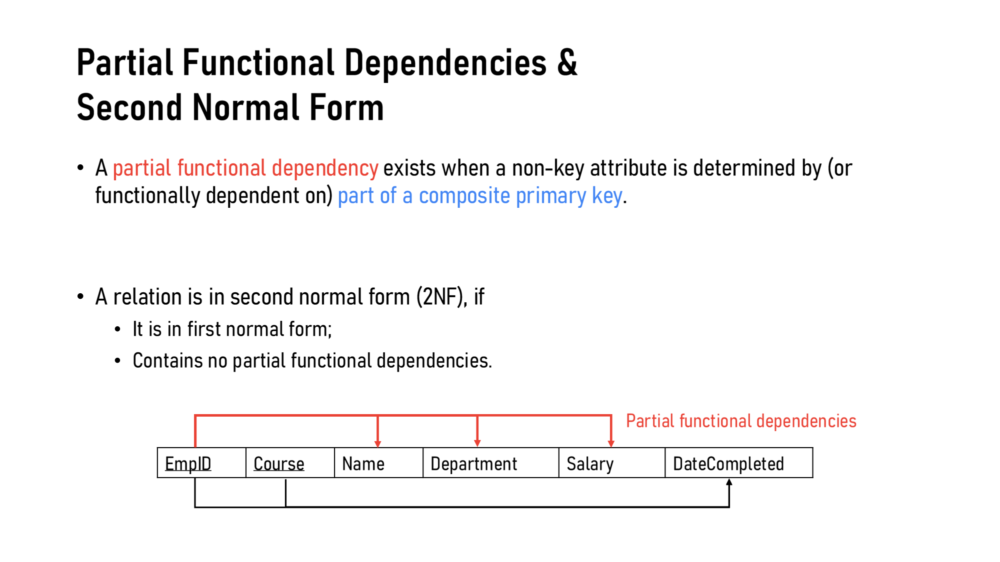

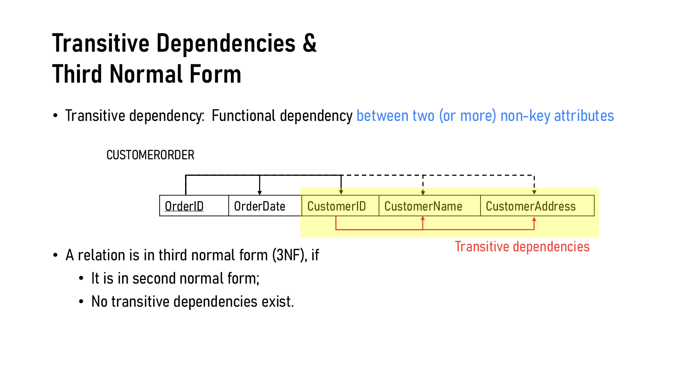

<Callout type="tip" title="为什么叫「传递」">

在 CUSTOMERORDER 里，`OrderID → CustomerID`，`CustomerID → CustomerName`，所以 OrderID 是**经过** CustomerID 间接决定 CustomerName 的：OrderID → CustomerID → CustomerName，像接力一样传过去。课件的定义更直接：**functional dependency between two (or more) non-key attributes**，也就是两个非键属性之间的依赖（p.38）。

</Callout>

<Callout type="memo">

分类只问一个问题：**「箭头左边是什么？」**
整个主键 → Full（没问题）· 主键的一部分 → Partial（2NF 拆）· 非键属性 → Transitive（3NF 拆）

英文口诀：每个非键属性都必须依赖 **the key**（1NF）、**the whole key**（2NF）、**and nothing but the key**（3NF）。

</Callout>

### 6.3 🔴🔴 做题套路：给一张大表 → 找 FD → 1NF → 2NF → 3NF

作业、lab 和考试都是同一种题：给一张**带样本数据的大表**，要你写出所有 functional dependency，再画出 1NF、2NF、3NF 的 schema。FD 通常**不会直接给**，要自己从数据和业务含义里找。

<Callout type="warn" title="最重要的一点：FD 在第一步就要找齐">

**所有 FD（包括传递依赖）都要在一开始全部写出来。** 2NF、3NF 这两步的工作是**按 FD 拆表**，不是去找新的 FD。

Lab 5-02 的答案就是这个顺序：第 9 页先列出全部 5 条 FD，第 10、13 页只是按它们拆表。如果第一步漏了 `Contact_Person → Position`，到 3NF 就不知道还要拆 CONTACT 表。

</Callout>

| 步骤 | 做什么 | 产出 |
|---|---|---|
| **① 找主键** | 找能唯一定位一行的**最小**列组合 | 主键 |
| **② 找齐 FD** | 三层检查（见下），每个非键列都当过一次决定因素才停 | FD 清单，每条标 Full / Partial / Transitive |
| **③ 1NF** | 多值属性摊开成多行；没有多值就原样照抄 | 一张大表 + 主键 |
| **④ 2NF** | 每条 **Partial** 的决定因素 → 新表，用它当主键 | 几张表 |
| **⑤ 3NF** | 每条 **Transitive** 的决定因素 → 新表，原表留它当外键 | 最终的表 |

#### ① 找主键：从数据里找「会重复的 ID」

1. 先看有哪些 ID 类的列（Project_ID、Equipment_No……）。
2. 看这些 ID 在表里有没有重复。一个 ID 出现好几次，说明它**单独**当不了主键。
3. 往上加列，直到每一行都不重复。**再检查能不能去掉某一列**，主键要最小。

Lab 5-02：Project_ID 重复 → 加 Equipment_No；P2022-001 借了两次 C414（2022 年、2023 年）→ 还要加 Date。主键 = **Project_ID + Equipment_No + Date**。

#### ② 找齐 FD：三层检查（按顺序做，不要跳）

| 层 | 问什么 | 找到的是 | Lab 5-02 |
|---|---|---|---|
| **第一层** | 整个主键能决定哪些列？ | Full | `Project_ID, Equipment_No, Date → Date_of_Return, Location_of_usage` |
| **第二层** | 把主键拆开，**每个真子集**单独能决定什么？（单列、两列组合都要试） | Partial | `Project_ID → Project_Name`；`Equipment_No → Equipment_Description`；`Project_ID, Date → Contact_Person, Position` |
| **第三层** ⭐ | 把**每个非键列**轮流放到箭头左边：只知道它，能不能确定**另一个非键列**？ | Transitive | `Contact_Person → Position` |

很多人做完第二层就以为找完了，**第三层最容易漏**，而它正好是 3NF 要拆的东西。

**什么时候可以停？** 第三层把每一个非键列都放到左边检查过一遍，就可以停了。做法是列一张表逐行打勾：

| 放在左边 | 能确定别的非键列吗？ | 理由 |
|---|---|---|
| Project_Name | 不能 | P2021-005 和 P2022-005 同名，连 Project_ID 都确定不了 |
| **Contact_Person** | **能 → Position** ✅ | 职位是**人**的属性；Collin Lee 每次都是 Senior BA，James Wong 4 次都是 PM |
| Position | 不能 | James Wong 和 Samuel Lai 都是 Project Manager |
| Equipment_Description | 不能 | C414、C415 都叫 Dell XEON server |
| Date_of_Return | 不能 | 样本里碰巧不冲突，但两个项目可以同一天还设备 |
| Location_of_usage | 不能 | 同一个会议室可以给不同项目用 |

**两个判断技巧：**

1. **问「这一列描述的是谁」**。Position 描述的是**人**，不是项目，也不是某次设备借用。所以决定它的应该是 Contact_Person，而不是 `Project_ID, Date`。一列描述的对象和主键代表的对象不一样，基本就有传递依赖。
2. **用数据找反例**。同一个 X 对应了两个不同的 Y → `X → Y` 一定不成立。但数据**只能推翻、不能证明**：几行数据碰巧没冲突（比如 Date_of_Return 在样本里都不重复）不代表 FD 成立，最后要按业务含义判断。

<Callout type="tip" title="为什么 Position 不算 Project_ID, Date 的「普通」依赖">

`Project_ID, Date → Contact_Person` 和 `Contact_Person → Position` 连起来，就得到 `Project_ID, Date → Position`。Lab 答案把 Position 也写在 `Project_ID, Date` 的右边，所以 **2NF 时 Position 跟着 Contact_Person 一起搬进 PROJECT_CONTACT**。但它其实是**经过** Contact_Person 传过去的，所以 3NF 还要再拆一次。

</Callout>

#### ③–⑤ 按 FD 拆表

- **1NF**：检查每格是不是单值。有多值就摊开成多行、公共值重复填，然后**重新找主键**（p.33）。已经是单值的表（如 Lab 5-02），1NF 就是原表加上主键。
- **2NF**：对每条 **Partial** 依赖的决定因素，建一张新表、用它当主键，把**只依赖它**的属性搬过去（p.37）。原表剩下完整主键 + Full 依赖的属性。这一步**不管传递依赖**，所以 Position 还留在 PROJECT_CONTACT 里。
- **3NF**：在**每张表**里找 Transitive 依赖（包括 2NF 新拆出来的表）。对每个非键决定因素，建一张新表、用它当主键，搬走依赖它的属性，**原表留下它当外键**（p.39）。

**最后检查三件事：**
1. **每张表**的每个非键属性都依赖「整个主键，而且只依赖主键」。
2. **没有丢东西**：原表的每一列都还在某张表里；靠外键可以把各表连回原来的信息。
3. **画图**：graphical representation，主键实线下划线、外键虚线下划线，外键画**箭头指向**被引用的主键。

#### 「这张表现在是第几范式？」判断流程

```
每一格都是单值吗？
  └─ 否 → 不是 1NF（未规范化）
  └─ 是 → 至少 1NF。主键是单个属性吗？
            └─ 是 → 不可能有部分依赖，至少 2NF，直接看传递依赖
            └─ 否 → 有部分依赖吗？
                      └─ 有 → 只是 1NF
                      └─ 没有 → 至少 2NF
          （至少 2NF 之后）有非键 → 非键的传递依赖吗？
                      └─ 有 → 只是 2NF
                      └─ 没有 → 3NF ✅
```

<Callout type="warn">

问「第几范式」时，答的是**满足的最高那一级**。一张表同时有部分依赖和传递依赖，答案是 **1NF**（先卡在 2NF），不是「2NF 和 3NF 都不满足」。

</Callout>

### 6.4 🔴 Lab 5-02 完整走一遍：Project Equipment

**题目**：项目设备登记表，每行记录「某个项目在某个日期借了某件设备」，同时写着项目名、当时的联系人和他的职位。把它规范化到 3NF。

| Project_ID | Project_Name | Date | Contact_Person | Position | Equipment_No | Equipment_Description | Date_of_Return | Location_of_usage |
|---|---|---|---|---|---|---|---|---|
| P2022-001 | Implementing a ERP system (HR module) | 01-JAN-2022 | Collin Lee | Senior Business Analyst | C414 | Dell XEON server | 30-NOV-2022 | 7/F, Server Room |
| P2022-001 | Implementing a ERP system (HR module) | 01-JAN-2022 | Collin Lee | Senior Business Analyst | C415 | Dell XEON server | 30-JUN-2023 | 7/F, Server Room |
| P2022-001 | Implementing a ERP system (HR module) | 01-JAN-2022 | Collin Lee | Senior Business Analyst | E001 | Furniture Set (Blue) | 01-MAR-2022 | 6/F, Open Office |
| P2022-001 | Implementing a ERP system (HR module) | 01-JAN-2023 | James Wong | Project Manager | E002 | Furniture Set (Green) | 30-JUN-2023 | 6/F, Meeting Room 6A |
| P2022-001 | Implementing a ERP system (HR module) | 01-JAN-2023 | James Wong | Project Manager | C414 | DELL XEON server | 31-JUL-2023 | 6/F Server Room |
| P2021-003 | Performing Training and Development System Audit | 01-JUL-2021 | Chris Wong | Senior Business Analyst | E001 | Furniture Set (Blue) | 04-APR-2022 | 6/F, Meeting Room 6C |
| P2021-003 | Performing Training and Development System Audit | 01-JUL-2021 | Chris Wong | Senior Business Analyst | P068 | HP LaserJet 4L | 04-APR-2022 | 6/F, Meeting Room 6C |
| P2021-005 | Post-implementation maintenance of the Financial System | 01-JUL-2021 | James Wong | Project Manager | M501 | AOC LCD Monitor 27" | 06-OCT-2022 | 4/F, IT Department Open Office |
| P2022-005 | Post-implementation maintenance of the Financial System | 01-JUL-2022 | James Wong | Project Manager | E002 | Furniture Set (Green) | 30-JUL-2023 | 6/F, Meeting Room 6A |
| P2022-006 | Power Load Test | 01-JUL-2022 | Samuel Lai | Project Manager | E002 | Furniture Set (Green) | (null) | TBC |

<Callout type="note" title="数据里的一个小坑">

第 5 行 C414 写成了「DELL XEON server」，第 1 行是「Dell XEON server」。这不是说 `Equipment_No → Equipment_Description` 不成立，而是同一个描述存了好几遍、有一处录入不一致，正好是 **modification anomaly** 的例子。拆出 EQUIPMENT 表以后，描述只存一次，就不会再出现这种不一致。

</Callout>

**① 主键**：Project_ID + Equipment_No + Date（理由见 6.3 ①）。

**② FD 清单**（课堂答案，Lab p.9）：

| FD | 箭头左边是…… | 类型 |
|---|---|---|
| `Project_ID → Project_Name` | 主键的一部分 | **Partial** ❌ 2NF |
| `Project_ID, Date → Contact_Person, Position` | 主键的一部分 | **Partial** ❌ 2NF |
| `Contact_Person → Position` | 非键属性 | **Transitive** ❌ 3NF |
| `Equipment_No → Equipment_Description` | 主键的一部分 | **Partial** ❌ 2NF |
| `Project_ID, Equipment_No, Date → Date_of_Return, Location_of_usage` | 整个主键 | **Full** ✅ |

**③ 1NF**：每格都是单值，原表就是 1NF，只要标出主键：

<div style={{margin: '6px 0 14px', pageBreakInside: 'avoid', breakInside: 'avoid', overflowX: 'auto'}}><div style={{fontSize: '0.85em', fontWeight: '600', marginBottom: '2px'}}>PROJECT (1NF)</div><table style={{borderCollapse: 'collapse', width: 'auto', margin: '0'}}><tr><td style={{border: '1px solid #333', padding: '4px 10px', whiteSpace: 'nowrap'}}><span style={{borderBottom: '1.5px solid #000', paddingBottom: '1px'}}>Project_ID</span></td><td style={{border: '1px solid #333', padding: '4px 10px', whiteSpace: 'nowrap'}}><span style={{borderBottom: '1.5px solid #000', paddingBottom: '1px'}}>Equipment_No</span></td><td style={{border: '1px solid #333', padding: '4px 10px', whiteSpace: 'nowrap'}}><span style={{borderBottom: '1.5px solid #000', paddingBottom: '1px'}}>Date</span></td><td style={{border: '1px solid #333', padding: '4px 10px', whiteSpace: 'nowrap'}}>Project_Name</td><td style={{border: '1px solid #333', padding: '4px 10px', whiteSpace: 'nowrap'}}>Contact_Person</td><td style={{border: '1px solid #333', padding: '4px 10px', whiteSpace: 'nowrap'}}>Position</td><td style={{border: '1px solid #333', padding: '4px 10px', whiteSpace: 'nowrap'}}>Equipment_Description</td><td style={{border: '1px solid #333', padding: '4px 10px', whiteSpace: 'nowrap'}}>Date_of_Return</td><td style={{border: '1px solid #333', padding: '4px 10px', whiteSpace: 'nowrap'}}>Location_of_usage</td></tr></table></div>

**④ 2NF**（课堂答案，Lab p.10）：三条 Partial 依赖各拆一张表，Full 依赖的列留在原表。Position 跟着 Contact_Person 一起进 PROJECT_CONTACT，传递依赖这一步先不管。

<div style={{margin: '6px 0 14px', pageBreakInside: 'avoid', breakInside: 'avoid', overflowX: 'auto'}}><div style={{fontSize: '0.85em', fontWeight: '600', marginBottom: '2px'}}>PROJECT2</div><table style={{borderCollapse: 'collapse', width: 'auto', margin: '0'}}><tr><td style={{border: '1px solid #333', padding: '4px 10px', whiteSpace: 'nowrap'}}><span style={{borderBottom: '1.5px solid #000', paddingBottom: '1px'}}>Project_ID</span></td><td style={{border: '1px solid #333', padding: '4px 10px', whiteSpace: 'nowrap'}}>Project_Name</td></tr></table></div>

<div style={{margin: '6px 0 14px', pageBreakInside: 'avoid', breakInside: 'avoid', overflowX: 'auto'}}><div style={{fontSize: '0.85em', fontWeight: '600', marginBottom: '2px'}}>PROJECT_CONTACT</div><table style={{borderCollapse: 'collapse', width: 'auto', margin: '0'}}><tr><td style={{border: '1px solid #333', padding: '4px 10px', whiteSpace: 'nowrap'}}><span style={{borderBottom: '1.5px solid #000', paddingBottom: '1px'}}>Project_ID</span></td><td style={{border: '1px solid #333', padding: '4px 10px', whiteSpace: 'nowrap'}}><span style={{borderBottom: '1.5px solid #000', paddingBottom: '1px'}}>Date</span></td><td style={{border: '1px solid #333', padding: '4px 10px', whiteSpace: 'nowrap'}}>Contact_Person</td><td style={{border: '1px solid #333', padding: '4px 10px', whiteSpace: 'nowrap'}}>Position</td></tr></table><div style={{fontSize: '0.8em', color: '#555', marginTop: '3px'}}>↳ Project_ID → PROJECT2</div></div>

<div style={{margin: '6px 0 14px', pageBreakInside: 'avoid', breakInside: 'avoid', overflowX: 'auto'}}><div style={{fontSize: '0.85em', fontWeight: '600', marginBottom: '2px'}}>EQUIPMENT</div><table style={{borderCollapse: 'collapse', width: 'auto', margin: '0'}}><tr><td style={{border: '1px solid #333', padding: '4px 10px', whiteSpace: 'nowrap'}}><span style={{borderBottom: '1.5px solid #000', paddingBottom: '1px'}}>Equipment_No</span></td><td style={{border: '1px solid #333', padding: '4px 10px', whiteSpace: 'nowrap'}}>Equipment_Description</td></tr></table></div>

<div style={{margin: '6px 0 14px', pageBreakInside: 'avoid', breakInside: 'avoid', overflowX: 'auto'}}><div style={{fontSize: '0.85em', fontWeight: '600', marginBottom: '2px'}}>PROJECT_EQUIPMENT</div><table style={{borderCollapse: 'collapse', width: 'auto', margin: '0'}}><tr><td style={{border: '1px solid #333', padding: '4px 10px', whiteSpace: 'nowrap'}}><span style={{borderBottom: '1.5px solid #000', paddingBottom: '1px'}}>Project_ID</span></td><td style={{border: '1px solid #333', padding: '4px 10px', whiteSpace: 'nowrap'}}><span style={{borderBottom: '1.5px solid #000', paddingBottom: '1px'}}>Equipment_No</span></td><td style={{border: '1px solid #333', padding: '4px 10px', whiteSpace: 'nowrap'}}><span style={{borderBottom: '1.5px solid #000', paddingBottom: '1px'}}>Date</span></td><td style={{border: '1px solid #333', padding: '4px 10px', whiteSpace: 'nowrap'}}>Date_of_Return</td><td style={{border: '1px solid #333', padding: '4px 10px', whiteSpace: 'nowrap'}}>Location_of_usage</td></tr></table><div style={{fontSize: '0.8em', color: '#555', marginTop: '3px'}}>↳ (Project_ID, Date) → PROJECT_CONTACT；Equipment_No → EQUIPMENT</div></div>

**⑤ 3NF**（课堂答案，Lab p.13）：PROJECT_CONTACT 里 Contact_Person 是非键属性，却决定 Position → 拆出 CONTACT，PROJECT_CONTACT2 留下 Contact_Person 当外键。其他三张表没有传递依赖，不变。

<div style={{margin: '6px 0 14px', pageBreakInside: 'avoid', breakInside: 'avoid', overflowX: 'auto'}}><div style={{fontSize: '0.85em', fontWeight: '600', marginBottom: '2px'}}>PROJECT2</div><table style={{borderCollapse: 'collapse', width: 'auto', margin: '0'}}><tr><td style={{border: '1px solid #333', padding: '4px 10px', whiteSpace: 'nowrap'}}><span style={{borderBottom: '1.5px solid #000', paddingBottom: '1px'}}>Project_ID</span></td><td style={{border: '1px solid #333', padding: '4px 10px', whiteSpace: 'nowrap'}}>Project_Name</td></tr></table></div>

<div style={{margin: '6px 0 14px', pageBreakInside: 'avoid', breakInside: 'avoid', overflowX: 'auto'}}><div style={{fontSize: '0.85em', fontWeight: '600', marginBottom: '2px'}}>PROJECT_CONTACT2</div><table style={{borderCollapse: 'collapse', width: 'auto', margin: '0'}}><tr><td style={{border: '1px solid #333', padding: '4px 10px', whiteSpace: 'nowrap'}}><span style={{borderBottom: '1.5px solid #000', paddingBottom: '1px'}}>Project_ID</span></td><td style={{border: '1px solid #333', padding: '4px 10px', whiteSpace: 'nowrap'}}><span style={{borderBottom: '1.5px solid #000', paddingBottom: '1px'}}>Date</span></td><td style={{border: '1px solid #333', padding: '4px 10px', whiteSpace: 'nowrap'}}><span style={{borderBottom: '1.5px dashed #000', paddingBottom: '1px'}}>Contact_Person</span></td></tr></table><div style={{fontSize: '0.8em', color: '#555', marginTop: '3px'}}>↳ Project_ID → PROJECT2；Contact_Person → CONTACT</div></div>

<div style={{margin: '6px 0 14px', pageBreakInside: 'avoid', breakInside: 'avoid', overflowX: 'auto'}}><div style={{fontSize: '0.85em', fontWeight: '600', marginBottom: '2px'}}>CONTACT</div><table style={{borderCollapse: 'collapse', width: 'auto', margin: '0'}}><tr><td style={{border: '1px solid #333', padding: '4px 10px', whiteSpace: 'nowrap'}}><span style={{borderBottom: '1.5px solid #000', paddingBottom: '1px'}}>Contact_Person</span></td><td style={{border: '1px solid #333', padding: '4px 10px', whiteSpace: 'nowrap'}}>Position</td></tr></table></div>

<div style={{margin: '6px 0 14px', pageBreakInside: 'avoid', breakInside: 'avoid', overflowX: 'auto'}}><div style={{fontSize: '0.85em', fontWeight: '600', marginBottom: '2px'}}>EQUIPMENT</div><table style={{borderCollapse: 'collapse', width: 'auto', margin: '0'}}><tr><td style={{border: '1px solid #333', padding: '4px 10px', whiteSpace: 'nowrap'}}><span style={{borderBottom: '1.5px solid #000', paddingBottom: '1px'}}>Equipment_No</span></td><td style={{border: '1px solid #333', padding: '4px 10px', whiteSpace: 'nowrap'}}>Equipment_Description</td></tr></table></div>

<div style={{margin: '6px 0 14px', pageBreakInside: 'avoid', breakInside: 'avoid', overflowX: 'auto'}}><div style={{fontSize: '0.85em', fontWeight: '600', marginBottom: '2px'}}>PROJECT_EQUIPMENT</div><table style={{borderCollapse: 'collapse', width: 'auto', margin: '0'}}><tr><td style={{border: '1px solid #333', padding: '4px 10px', whiteSpace: 'nowrap'}}><span style={{borderBottom: '1.5px solid #000', paddingBottom: '1px'}}>Project_ID</span></td><td style={{border: '1px solid #333', padding: '4px 10px', whiteSpace: 'nowrap'}}><span style={{borderBottom: '1.5px solid #000', paddingBottom: '1px'}}>Equipment_No</span></td><td style={{border: '1px solid #333', padding: '4px 10px', whiteSpace: 'nowrap'}}><span style={{borderBottom: '1.5px solid #000', paddingBottom: '1px'}}>Date</span></td><td style={{border: '1px solid #333', padding: '4px 10px', whiteSpace: 'nowrap'}}>Date_of_Return</td><td style={{border: '1px solid #333', padding: '4px 10px', whiteSpace: 'nowrap'}}>Location_of_usage</td></tr></table><div style={{fontSize: '0.8em', color: '#555', marginTop: '3px'}}>↳ (Project_ID, Date) → PROJECT_CONTACT；Equipment_No → EQUIPMENT</div></div>

> 表和列是课堂答案；外键的虚线和 ↳ 箭头是**我的解答**，按 p.37、p.39 的规则补上的（lab 幻灯片上没写）。

**检查**：9 个属性一个不少；「James Wong = Project Manager」原来存了 4 次，现在只存 1 次。

### 6.5 🔴 例题二：多值属性 + 三步都要做

**题目**：这题和 Lab 5-02 不同，原始表**有多值属性**，要先做 1NF。把下面这张选课登记表规范化到 3NF。业务规则：每个学生只有一个导师；每门课只有一个课名；成绩取决于「哪个学生上哪门课」。

| StudentID | StudentName | AdvisorID | AdvisorName | CourseID | CourseTitle | Grade |
|---|---|---|---|---|---|---|
| S1 | Amy | A7 | Dr. Lee | ISOM5260, ISOM5180, ISOM5070 | Database, Networks, Cyber Risk | A, B+, A- |
| S2 | Ben | A7 | Dr. Lee | ISOM5260, ISOM5070 | Database, Cyber Risk | B, A |
| S3 | Cara | A9 | Dr. Wong | ISOM5180 | Networks | A |

**① + ② → 1NF。** CourseID、CourseTitle、Grade 一格里有多个值，不是 1NF。把它们摊开，每门课一行，学生和导师信息重复填：

| StudentID | StudentName | AdvisorID | AdvisorName | CourseID | CourseTitle | Grade |
|---|---|---|---|---|---|---|
| S1 | Amy | A7 | Dr. Lee | ISOM5260 | Database | A |
| S1 | Amy | A7 | Dr. Lee | ISOM5180 | Networks | B+ |
| S1 | Amy | A7 | Dr. Lee | ISOM5070 | Cyber Risk | A- |
| S2 | Ben | A7 | Dr. Lee | ISOM5260 | Database | B |
| S2 | Ben | A7 | Dr. Lee | ISOM5070 | Cyber Risk | A |
| S3 | Cara | A9 | Dr. Wong | ISOM5180 | Networks | A |

摊开后 S1 出现了三行，StudentID 不再唯一。**新主键 = StudentID + CourseID**。

<div style={{margin: '6px 0 14px', pageBreakInside: 'avoid', breakInside: 'avoid', overflowX: 'auto'}}><div style={{fontSize: '0.85em', fontWeight: '600', marginBottom: '2px'}}>STUDENT ENROLLMENT (1NF)</div><table style={{borderCollapse: 'collapse', width: 'auto', margin: '0'}}><tr><td style={{border: '1px solid #333', padding: '4px 10px', whiteSpace: 'nowrap'}}><span style={{borderBottom: '1.5px solid #000', paddingBottom: '1px'}}>StudentID</span></td><td style={{border: '1px solid #333', padding: '4px 10px', whiteSpace: 'nowrap'}}><span style={{borderBottom: '1.5px solid #000', paddingBottom: '1px'}}>CourseID</span></td><td style={{border: '1px solid #333', padding: '4px 10px', whiteSpace: 'nowrap'}}>StudentName</td><td style={{border: '1px solid #333', padding: '4px 10px', whiteSpace: 'nowrap'}}>AdvisorID</td><td style={{border: '1px solid #333', padding: '4px 10px', whiteSpace: 'nowrap'}}>AdvisorName</td><td style={{border: '1px solid #333', padding: '4px 10px', whiteSpace: 'nowrap'}}>CourseTitle</td><td style={{border: '1px solid #333', padding: '4px 10px', whiteSpace: 'nowrap'}}>Grade</td></tr></table></div>

**③ 找齐 FD 并分类**（主键 = StudentID + CourseID）。第三层扫描时，把 StudentName、AdvisorID、AdvisorName、CourseTitle、Grade 逐个放左边，只有 AdvisorID 能决定别的列：

| FD | 箭头左边是…… | 类型 |
|---|---|---|
| `StudentID → StudentName, AdvisorID` | 主键的**一部分** | **Partial** ❌ 2NF |
| `CourseID → CourseTitle` | 主键的**一部分** | **Partial** ❌ 2NF |
| `StudentID, CourseID → Grade` | **整个**主键 | **Full** ✅ |
| `AdvisorID → AdvisorName` | **非键**属性 | **Transitive** ❌ 3NF |

**④ → 2NF。** 两个部分依赖的决定因素 StudentID、CourseID，各建一张表：
- **STUDENT**（主键 StudentID）：搬走 StudentName、AdvisorID，**还有 AdvisorName**。AdvisorName 通过 AdvisorID 间接依赖 StudentID，和 CourseID 没有关系，也属于「只依赖 StudentID」的属性，一起搬。
- **COURSE**（主键 CourseID）：搬走 CourseTitle。
- 原表只剩 StudentID + CourseID + Grade，改名 **ENROLLMENT**。StudentID、CourseID 既是主键的一部分，又分别是指向 STUDENT、COURSE 的外键。

<div style={{margin: '6px 0 14px', pageBreakInside: 'avoid', breakInside: 'avoid', overflowX: 'auto'}}><div style={{fontSize: '0.85em', fontWeight: '600', marginBottom: '2px'}}>STUDENT</div><table style={{borderCollapse: 'collapse', width: 'auto', margin: '0'}}><tr><td style={{border: '1px solid #333', padding: '4px 10px', whiteSpace: 'nowrap'}}><span style={{borderBottom: '1.5px solid #000', paddingBottom: '1px'}}>StudentID</span></td><td style={{border: '1px solid #333', padding: '4px 10px', whiteSpace: 'nowrap'}}>StudentName</td><td style={{border: '1px solid #333', padding: '4px 10px', whiteSpace: 'nowrap'}}>AdvisorID</td><td style={{border: '1px solid #333', padding: '4px 10px', whiteSpace: 'nowrap'}}>AdvisorName</td></tr></table></div>

<div style={{margin: '6px 0 14px', pageBreakInside: 'avoid', breakInside: 'avoid', overflowX: 'auto'}}><div style={{fontSize: '0.85em', fontWeight: '600', marginBottom: '2px'}}>COURSE</div><table style={{borderCollapse: 'collapse', width: 'auto', margin: '0'}}><tr><td style={{border: '1px solid #333', padding: '4px 10px', whiteSpace: 'nowrap'}}><span style={{borderBottom: '1.5px solid #000', paddingBottom: '1px'}}>CourseID</span></td><td style={{border: '1px solid #333', padding: '4px 10px', whiteSpace: 'nowrap'}}>CourseTitle</td></tr></table></div>

<div style={{margin: '6px 0 14px', pageBreakInside: 'avoid', breakInside: 'avoid', overflowX: 'auto'}}><div style={{fontSize: '0.85em', fontWeight: '600', marginBottom: '2px'}}>ENROLLMENT</div><table style={{borderCollapse: 'collapse', width: 'auto', margin: '0'}}><tr><td style={{border: '1px solid #333', padding: '4px 10px', whiteSpace: 'nowrap'}}><span style={{borderBottom: '1.5px solid #000', paddingBottom: '1px'}}>StudentID</span></td><td style={{border: '1px solid #333', padding: '4px 10px', whiteSpace: 'nowrap'}}><span style={{borderBottom: '1.5px solid #000', paddingBottom: '1px'}}>CourseID</span></td><td style={{border: '1px solid #333', padding: '4px 10px', whiteSpace: 'nowrap'}}>Grade</td></tr></table><div style={{fontSize: '0.8em', color: '#555', marginTop: '3px'}}>↳ StudentID → STUDENT；CourseID → COURSE</div></div>

**⑤ → 3NF。** 逐张表查传递依赖：COURSE、ENROLLMENT 都没有；**STUDENT 里还有 `AdvisorID → AdvisorName`**，AdvisorID 不是 STUDENT 的主键。于是新建 **ADVISOR** 表，STUDENT 留下 AdvisorID 当外键：

<div style={{margin: '6px 0 14px', pageBreakInside: 'avoid', breakInside: 'avoid', overflowX: 'auto'}}><div style={{fontSize: '0.85em', fontWeight: '600', marginBottom: '2px'}}>STUDENT</div><table style={{borderCollapse: 'collapse', width: 'auto', margin: '0'}}><tr><td style={{border: '1px solid #333', padding: '4px 10px', whiteSpace: 'nowrap'}}><span style={{borderBottom: '1.5px solid #000', paddingBottom: '1px'}}>StudentID</span></td><td style={{border: '1px solid #333', padding: '4px 10px', whiteSpace: 'nowrap'}}>StudentName</td><td style={{border: '1px solid #333', padding: '4px 10px', whiteSpace: 'nowrap'}}><span style={{borderBottom: '1.5px dashed #000', paddingBottom: '1px'}}>AdvisorID</span></td></tr></table><div style={{fontSize: '0.8em', color: '#555', marginTop: '3px'}}>↳ AdvisorID → ADVISOR</div></div>

<div style={{margin: '6px 0 14px', pageBreakInside: 'avoid', breakInside: 'avoid', overflowX: 'auto'}}><div style={{fontSize: '0.85em', fontWeight: '600', marginBottom: '2px'}}>ADVISOR</div><table style={{borderCollapse: 'collapse', width: 'auto', margin: '0'}}><tr><td style={{border: '1px solid #333', padding: '4px 10px', whiteSpace: 'nowrap'}}><span style={{borderBottom: '1.5px solid #000', paddingBottom: '1px'}}>AdvisorID</span></td><td style={{border: '1px solid #333', padding: '4px 10px', whiteSpace: 'nowrap'}}>AdvisorName</td></tr></table></div>

<div style={{margin: '6px 0 14px', pageBreakInside: 'avoid', breakInside: 'avoid', overflowX: 'auto'}}><div style={{fontSize: '0.85em', fontWeight: '600', marginBottom: '2px'}}>COURSE</div><table style={{borderCollapse: 'collapse', width: 'auto', margin: '0'}}><tr><td style={{border: '1px solid #333', padding: '4px 10px', whiteSpace: 'nowrap'}}><span style={{borderBottom: '1.5px solid #000', paddingBottom: '1px'}}>CourseID</span></td><td style={{border: '1px solid #333', padding: '4px 10px', whiteSpace: 'nowrap'}}>CourseTitle</td></tr></table></div>

<div style={{margin: '6px 0 14px', pageBreakInside: 'avoid', breakInside: 'avoid', overflowX: 'auto'}}><div style={{fontSize: '0.85em', fontWeight: '600', marginBottom: '2px'}}>ENROLLMENT</div><table style={{borderCollapse: 'collapse', width: 'auto', margin: '0'}}><tr><td style={{border: '1px solid #333', padding: '4px 10px', whiteSpace: 'nowrap'}}><span style={{borderBottom: '1.5px solid #000', paddingBottom: '1px'}}>StudentID</span></td><td style={{border: '1px solid #333', padding: '4px 10px', whiteSpace: 'nowrap'}}><span style={{borderBottom: '1.5px solid #000', paddingBottom: '1px'}}>CourseID</span></td><td style={{border: '1px solid #333', padding: '4px 10px', whiteSpace: 'nowrap'}}>Grade</td></tr></table><div style={{fontSize: '0.8em', color: '#555', marginTop: '3px'}}>↳ StudentID → STUDENT；CourseID → COURSE</div></div>

**检查**：7 个属性一个不少；每张表的非键属性都只依赖本表的整个主键；ENROLLMENT → STUDENT → ADVISOR 和 ENROLLMENT → COURSE 靠外键连得回去。「Dr. Lee」原来存了 5 次，现在只存 1 次。

<Callout type="exam" title="英文答题模板">

*"The relation is in 1NF but not 2NF because StudentName and AdvisorID depend only on StudentID, and CourseTitle depends only on CourseID — both are parts of the composite primary key (partial dependencies). To reach 2NF, we create STUDENT with StudentID as its primary key and COURSE with CourseID as its primary key, leaving Grade in ENROLLMENT. STUDENT is not yet in 3NF because AdvisorName depends on AdvisorID, a non-key attribute (transitive dependency). To reach 3NF, we move AdvisorID and AdvisorName into a new ADVISOR relation and keep AdvisorID in STUDENT as a foreign key."*

</Callout>

### 6.6 🔴 自己点一遍：找 FD → 1NF → 2NF → 3NF

先用下面这个检查器练「找 FD」：选一列或几列当箭头左边，看数据里有没有反例；下面的「第三层扫描」会把每个非键列都放到左边试一遍，并说明哪些候选是真的 FD、哪些只是样本太少碰巧没冲突。

<FdFinderLab />

再用下面的演示一步步拆表。**黄底格子 = 只因为坏依赖才重复存储的值**，每做一步，右上角的「重复存储」格数都会变少，到 3NF 归零。可以切换到 Lab 5-02、例题二和课件的两个例子：
- **PROJECT EQUIPMENT（Lab 5-02）**：原表已经是 1NF，要做 2NF 和 3NF；注意 2NF 那一步 PROJECT_CONTACT 里还有黄底格子（James Wong 的职位重复），3NF 才归零。
- **EMP COURSE**：要做 1NF 和 2NF，做完 2NF 就已经是 3NF（没有传递依赖）。
- **CUSTOMERORDER**：主键是单属性，1NF 直接就是 2NF，只需要做 3NF。

<NormalizeWalkthrough />

光会分类还不够熟的话，用下面这个练习专门练「这条依赖是 Full / Partial / Transitive」：

<NormalizationLab />

### 6.7 🔴 常见错误

| 错误 | 为什么错 / 正确做法 |
|---|---|
| **找 FD 时只做了前两层**，漏了非键 → 非键（Lab 5-02 漏 `Contact_Person → Position`） | 第三层要把**每个非键列**都放到左边试一遍，全部打完勾才算找完 |
| 以为传递依赖是「到 3NF 才去找」 | 所有 FD 第一步就找齐；2NF、3NF 只是按清单拆表 |
| 看到样本数据没冲突就写成 FD（如 `Date_of_Return → Project_ID`） | 数据只能推翻、不能证明，还要按业务含义判断 |
| 主键找得不够：只用 Project_ID + Equipment_No | 同一个项目可能在不同日期借同一件设备，要加 Date 才唯一 |
| 1NF 摊开之后**没重新定主键**，还用 StudentID | 摊开后 StudentID 重复出现，已经不唯一；主键要加上被摊开那组的 ID |
| 单属性主键的表还在找部分依赖 | 部分依赖要求主键是**复合**的；单属性主键 → 1NF 自动是 2NF |
| 把 **Full** 依赖也拆出去（给 Grade 单独建表） | Full 是正常的，Grade 就应该留在 ENROLLMENT |
| 2NF 时把 StudentID 从原表**删掉** | 它是原表主键的一部分，必须留下（同时成为外键） |
| 3NF 时搬走 AdvisorName，却把 AdvisorID 也从 STUDENT **删了** | 原表必须**保留决定因素作外键**，否则就不知道学生的导师是谁 |
| 只检查原表的传递依赖 | 2NF 拆出来的**新表**里也可能藏着传递依赖（例题的 STUDENT） |
| 把箭头方向写反：`CustomerName → CustomerID` | 名字不唯一，决定不了 ID。决定因素通常是 ID 类的属性 |
| 把 partial **identifier** 当成 partial **dependency** | 前者是弱实体映射的概念，后者是规范化的概念，完全无关 |
| 问「第几范式」时答了不满足的那一级 | 答**满足的最高一级**：卡在 2NF 就是 1NF |

### 6.8 🔴 老师的 Main Takeaway（p.40，原话要记）

- The main goal is to **remove data redundancy**.
- 1NF 很直接：去掉多值属性。
- **区分部分依赖和传递依赖的关键：先认清主键是哪些属性。**
  - Determinant 是**主键的一部分** → **partial**（违反 2NF）
  - Determinant **不是主键** → **transitive**（违反 3NF）

> **记忆口诀**：**「部分看主键的一部分，传递看非键」**。

### 6.9 🟢 规范化全图（p.32）

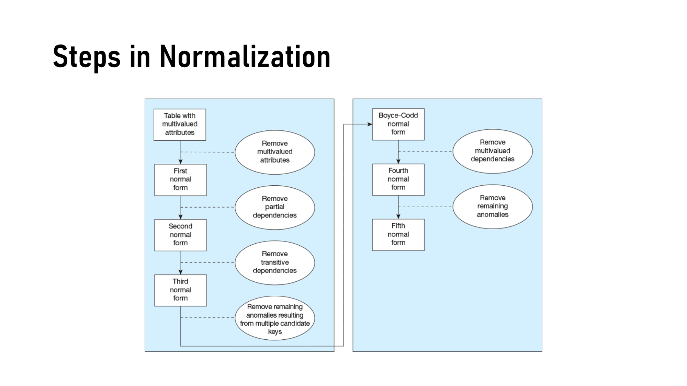

课件这张图一直画到 5NF（BCNF → 4NF → 5NF）。**这门课只考到 3NF**，后面几级知道存在就够了。

### 6.10 🔴 小练习：第几范式？

<MCQ q="1. ORDERLINE(OrderID, ProductID, Quantity, ProductName)，主键 = OrderID + ProductID，已知 ProductID → ProductName。这张表最高满足第几范式？" a="不是 1NF" b="1NF" c="2NF" d="3NF" answer="B">

ProductID 是复合主键的一部分，它决定 ProductName → 部分依赖 → 不满足 2NF。每格都是单值，所以满足 1NF。

</MCQ>

<MCQ q="2. EMPLOYEE(EmpID, Name, DeptID, DeptName)，主键 = EmpID，已知 DeptID → DeptName。这张表最高满足第几范式？" a="1NF" b="2NF" c="3NF" d="不是 1NF" answer="B">

主键是单属性 → 不可能有部分依赖 → 至少 2NF。DeptID 是非键属性却决定 DeptName → 传递依赖 → 不满足 3NF。

</MCQ>

<MCQ q="3. 把 EMPLOYEE(EmpID, Name, DeptID, DeptName) 转成 3NF，正确的结果是：" a="EMPLOYEE(EmpID, Name) 和 DEPT(DeptID, DeptName)" b="EMPLOYEE(EmpID, Name, DeptID) 和 DEPT(DeptID, DeptName)，DeptID 是指向 DEPT 的外键" c="EMPLOYEE(EmpID, Name, DeptName) 和 DEPT(DeptID)" d="EMPLOYEE(EmpID, DeptID, DeptName) 和 NAME(EmpID, Name)" answer="B">

3NF 的规则：非键决定因素 DeptID 建新表并当主键，搬走 DeptName；**原表保留 DeptID 作外键**。A 把 DeptID 删了，员工和部门就断了联系。

</MCQ>

<MCQ q="4. 表 R(A, B, C, D)，主键 = A + B，FD：A, B → C；B → D。哪一条违反了哪个范式？" a="A, B → C 违反 2NF" b="B → D 是部分依赖，违反 2NF" c="B → D 是传递依赖，违反 3NF" d="没有违反，已经是 3NF" answer="B">

B 是复合主键 A + B 的一部分 → 部分依赖 → 违反 2NF。A, B → C 依赖整个主键，是完全依赖。

</MCQ>

<MCQ q="5. 表 R(A, B, C, D)，主键 = A，FD：A → B, C；C → D。规范化到 3NF 后应该是：" a="R1(A, B, C) 和 R2(C, D)，R1 的 C 是指向 R2 的外键" b="R1(A, B) 和 R2(C, D)" c="R1(A, B, C, D) 已经是 3NF" d="R1(A, B, D) 和 R2(A, C)" answer="A">

C 是非键属性且决定 D → 传递依赖。以 C 为主键建 R2(C, D)，原表保留 C 当外键。

</MCQ>

---

## 7. 🔴 术语速查表

| 英文 | 中文 | 一句话 |
|---|---|---|
| Relation | 关系（表） | 命名的二维表，满足 5 条规则 |
| Graphical representation | 图形表示法 | 本课作业/考试使用的 schema 画法 |
| Atomic value | 原子值 | 每格只有一个不可再分的值 |
| Primary Key (PK) | 主键 | 唯一标识每一行；实线下划线 |
| Composite key | 复合键 | 多个属性组合成的主键 |
| Foreign Key (FK) | 外键 | 引用另一张表的主键；虚线下划线 + 箭头 |
| Recursive FK | 递归外键 | 引用**本表**主键的外键（ManagerID） |
| Null | 空值 | 没有值 |
| Domain constraint | 域约束 | 列值必须在合法范围内 |
| Entity integrity | 实体完整性 | 主键不能为空 |
| Referential integrity | 参照完整性 | 非空外键必须对应存在的主键 |
| Partial identifier | 部分标识符 | 弱实体用来区分同一 owner 下实例的属性 |
| Subtype discriminator | 子类判别符 | 标明属于哪个子类的属性（EmployeeType） |
| Anomaly | 异常 | Insertion / Deletion / Modification |
| Functional dependency | 函数依赖 | A → B，A 决定 B |
| Determinant | 决定因素 | 箭头左边的属性 |
| Partial dependency | 部分依赖 | 非键属性依赖于复合主键的一部分 → 违反 2NF |
| Transitive dependency | 传递依赖 | 非键属性之间的依赖 → 违反 3NF |
| 1NF / 2NF / 3NF | 第一 / 二 / 三范式 | 无多值 / 无部分依赖 / 无传递依赖，做法见 6.3 |
| SDLC | Systems Development Life Cycle | 系统开发生命周期 |

---

## 8. 模拟自测题（自查用，非押题）

**画图题请一律用 graphical representation 作答。**

<QA q="一张表要成为 relation，必须满足哪五个条件？">
① **Unique name**——表名唯一；② **Atomic values**——每个格子只能有一个值，不能多值也不能复合；③ **Unique rows**——不能有两行完全相同；④ **Unique column names**——同一张表里列名不能重复；⑤ **Order doesn't matter**——行、列的顺序都无关紧要。
</QA>

<QA q="ENROLLMENT 表主键是 StudentID + CourseCode + Semester，其中一行为 StudentID = 20261235、CourseCode = null、Semester = 2026F1。违反了哪种完整性约束？为什么？">
违反 **Entity Integrity（实体完整性）**——CourseCode 是复合主键的一部分，而实体完整性规定"主键不能为空"，复合主键的每一部分都不能为空。
</QA>

<QA q="ORDER 表中某行 CustomerID = null，是否违反参照完整性？在什么条件下可以接受？">
**不违反**。Referential Integrity 只要求**非空**的外键值必须匹配父表里一个真实存在的主键；外键本身允许为 null。只要 ORDER 和 CUSTOMER 之间的关系是 **optional**（可选参与，比如允许匿名下单/内部测试订单没有客户），CustomerID = null 就是可以接受的。
</QA>

<QA q="把以下实体转成关系：STUDENT 有 Student ID（identifier）、Name (First, Last)、{Phone}、[Age]、Date of Birth。">
Age 是派生属性，不存；Phone 是多值属性，单独建表；Name 是复合属性，拆开只保留组成部分：

<div style={{margin: '6px 0 14px', pageBreakInside: 'avoid', breakInside: 'avoid', overflowX: 'auto'}}><div style={{fontSize: '0.85em', fontWeight: '600', marginBottom: '2px'}}>STUDENT</div><table style={{borderCollapse: 'collapse', width: 'auto', margin: '0'}}><tr><td style={{border: '1px solid #333', padding: '4px 10px', whiteSpace: 'nowrap'}}><span style={{borderBottom: '1.5px solid #000', paddingBottom: '1px'}}>StudentID</span></td><td style={{border: '1px solid #333', padding: '4px 10px', whiteSpace: 'nowrap'}}>FirstName</td><td style={{border: '1px solid #333', padding: '4px 10px', whiteSpace: 'nowrap'}}>LastName</td><td style={{border: '1px solid #333', padding: '4px 10px', whiteSpace: 'nowrap'}}>DateOfBirth</td></tr></table></div>

<div style={{margin: '6px 0 14px', pageBreakInside: 'avoid', breakInside: 'avoid', overflowX: 'auto'}}><div style={{fontSize: '0.85em', fontWeight: '600', marginBottom: '2px'}}>STUDENT PHONE</div><table style={{borderCollapse: 'collapse', width: 'auto', margin: '0'}}><tr><td style={{border: '1px solid #333', padding: '4px 10px', whiteSpace: 'nowrap'}}><span style={{borderBottom: '1.5px solid #000', paddingBottom: '1px'}}>StudentID</span></td><td style={{border: '1px solid #333', padding: '4px 10px', whiteSpace: 'nowrap'}}><span style={{borderBottom: '1.5px solid #000', paddingBottom: '1px'}}>Phone</span></td></tr></table><div style={{fontSize: '0.8em', color: '#555', marginTop: '3px'}}>↳ StudentID → STUDENT</div></div>
</QA>

<QA q="EMPLOYEE 和 PARKING SPOT 是 1:1 关系，每个车位必须属于一个员工，员工不一定有车位。外键应该放在哪张表？为什么？">
放在 **PARKING SPOT**（optional 一方）里，引用 EMPLOYEE 的主键——因为 1:1 关系的外键要放在 optional 一方，才能保证"每个车位都有主人，FK 永远不为空"；反过来放进 EMPLOYEE 表的话，没有车位的员工那一格就会是 null。

<div style={{margin: '6px 0 14px', pageBreakInside: 'avoid', breakInside: 'avoid', overflowX: 'auto'}}><div style={{fontSize: '0.85em', fontWeight: '600', marginBottom: '2px'}}>EMPLOYEE</div><table style={{borderCollapse: 'collapse', width: 'auto', margin: '0'}}><tr><td style={{border: '1px solid #333', padding: '4px 10px', whiteSpace: 'nowrap'}}><span style={{borderBottom: '1.5px solid #000', paddingBottom: '1px'}}>EmployeeID</span></td><td style={{border: '1px solid #333', padding: '4px 10px', whiteSpace: 'nowrap'}}>EmployeeName</td></tr></table></div>

<div style={{margin: '6px 0 14px', pageBreakInside: 'avoid', breakInside: 'avoid', overflowX: 'auto'}}><div style={{fontSize: '0.85em', fontWeight: '600', marginBottom: '2px'}}>PARKING SPOT</div><table style={{borderCollapse: 'collapse', width: 'auto', margin: '0'}}><tr><td style={{border: '1px solid #333', padding: '4px 10px', whiteSpace: 'nowrap'}}><span style={{borderBottom: '1.5px solid #000', paddingBottom: '1px'}}>SpotID</span></td><td style={{border: '1px solid #333', padding: '4px 10px', whiteSpace: 'nowrap'}}><span style={{borderBottom: '1.5px dashed #000', paddingBottom: '1px'}}>EmployeeID</span></td></tr></table><div style={{fontSize: '0.8em', color: '#555', marginTop: '3px'}}>↳ EmployeeID → EMPLOYEE</div></div>
</QA>

<QA q="弱实体 DEPENDENT 的主键怎么构成？只用 DependentName 当主键会有什么问题？">
主键 = **Owner 的主键（EmployeeID）+ 自己的 partial identifier（DependentName）**。只用 DependentName 当主键会有问题：两个不同员工的家属完全可能同名（比如都叫"张伟"），单独 DependentName 无法唯一区分，必须配上 EmployeeID 才能确定"这是哪位员工的哪个家属"。
</QA>

<QA q="有自己 identifier 的关联实体和没有的，映射时主键有什么不同？举一个「必须有自己 ID」的场景。">
**没有**自己 identifier 的关联实体：主键默认 = 两个参与实体主键的组合（如 ORDERLINE = OrderID + ProductID）。**有**自己 identifier 的关联实体：直接用这个自有 ID 当主键，两边的主键降级为普通外键（不进复合主键）。"必须有自己 ID"的场景：**SHIPMENT**（同一个 vendor 可能给同一个 customer 发多次货）——如果用 (CustomerID, VendorID) 当主键，第二次发货就会主键重复，必须用独立的 ShipmentID 区分。
</QA>

<QA q="Unary 1:M 和 Unary M:N 分别怎么映射？为什么要给列改名？">
**Unary 1:M**（如员工 manages 员工）：在**同一张表**里加一个 recursive foreign key（如 ManagerID），指回本表自己的主键。**Unary M:N**（如物品由其他物品组成）：需要**两张表**——实体表本身 + 一张关联表，关联表里两个属性都来自同一张表的主键（如 ItemNo + ComponentNo）。改名的原因：关系规则第 4 条"列名不能重复"——同一张表不能有两列都叫 EmployeeID，所以指向自己的那一列必须改成有区分度的名字（ManagerID、ComponentNo）。
</QA>

<QA q="超类/子类映射中，子类表的主键是什么？subtype discriminator 放在哪张表？">
**子类表的主键 = 超类的主键**（同一个值，同时也是指回超类表的外键，如 AEmployeeID 既是 ADMINISTRATIVE EMPLOYEE 的主键，也是引用 EMPLOYEE 的外键）。**Subtype discriminator**（如 EmployeeType）放在**超类表**里，因为它的作用是"标明这一行该去哪张子类表找剩下的属性"，这个判断本身属于超类层面的信息。
</QA>

<QA q="下面这张表（主键 = StudentID + CourseID），写出所有函数依赖，指出属于哪种依赖，并规范化到 3NF：">

<div style={{margin: '6px 0 14px', pageBreakInside: 'avoid', breakInside: 'avoid', overflowX: 'auto'}}><div style={{fontSize: '0.85em', fontWeight: '600', marginBottom: '2px'}}>STUDENT COURSE</div><table style={{borderCollapse: 'collapse', width: 'auto', margin: '0'}}><tr><td style={{border: '1px solid #333', padding: '4px 10px', whiteSpace: 'nowrap'}}><span style={{borderBottom: '1.5px solid #000', paddingBottom: '1px'}}>StudentID</span></td><td style={{border: '1px solid #333', padding: '4px 10px', whiteSpace: 'nowrap'}}><span style={{borderBottom: '1.5px solid #000', paddingBottom: '1px'}}>CourseID</span></td><td style={{border: '1px solid #333', padding: '4px 10px', whiteSpace: 'nowrap'}}>StudentName</td><td style={{border: '1px solid #333', padding: '4px 10px', whiteSpace: 'nowrap'}}>Major</td><td style={{border: '1px solid #333', padding: '4px 10px', whiteSpace: 'nowrap'}}>Grade</td></tr></table></div>

`StudentID → StudentName, Major`（**partial**，只依赖复合主键的一部分）；`StudentID, CourseID → Grade`（**full**，依赖整个主键）。拆完已达 3NF：

<div style={{margin: '6px 0 14px', pageBreakInside: 'avoid', breakInside: 'avoid', overflowX: 'auto'}}><div style={{fontSize: '0.85em', fontWeight: '600', marginBottom: '2px'}}>STUDENT</div><table style={{borderCollapse: 'collapse', width: 'auto', margin: '0'}}><tr><td style={{border: '1px solid #333', padding: '4px 10px', whiteSpace: 'nowrap'}}><span style={{borderBottom: '1.5px solid #000', paddingBottom: '1px'}}>StudentID</span></td><td style={{border: '1px solid #333', padding: '4px 10px', whiteSpace: 'nowrap'}}>StudentName</td><td style={{border: '1px solid #333', padding: '4px 10px', whiteSpace: 'nowrap'}}>Major</td></tr></table></div>

<div style={{margin: '6px 0 14px', pageBreakInside: 'avoid', breakInside: 'avoid', overflowX: 'auto'}}><div style={{fontSize: '0.85em', fontWeight: '600', marginBottom: '2px'}}>ENROLLMENT</div><table style={{borderCollapse: 'collapse', width: 'auto', margin: '0'}}><tr><td style={{border: '1px solid #333', padding: '4px 10px', whiteSpace: 'nowrap'}}><span style={{borderBottom: '1.5px solid #000', paddingBottom: '1px'}}>StudentID</span></td><td style={{border: '1px solid #333', padding: '4px 10px', whiteSpace: 'nowrap'}}><span style={{borderBottom: '1.5px solid #000', paddingBottom: '1px'}}>CourseID</span></td><td style={{border: '1px solid #333', padding: '4px 10px', whiteSpace: 'nowrap'}}>Grade</td></tr></table><div style={{fontSize: '0.8em', color: '#555', marginTop: '3px'}}>↳ StudentID → STUDENT</div></div>
</QA>

<QA q="下面这张表（主键 = ISBN）在第几范式？规范化到 3NF：">

<div style={{margin: '6px 0 14px', pageBreakInside: 'avoid', breakInside: 'avoid', overflowX: 'auto'}}><div style={{fontSize: '0.85em', fontWeight: '600', marginBottom: '2px'}}>BOOK</div><table style={{borderCollapse: 'collapse', width: 'auto', margin: '0'}}><tr><td style={{border: '1px solid #333', padding: '4px 10px', whiteSpace: 'nowrap'}}><span style={{borderBottom: '1.5px solid #000', paddingBottom: '1px'}}>ISBN</span></td><td style={{border: '1px solid #333', padding: '4px 10px', whiteSpace: 'nowrap'}}>Title</td><td style={{border: '1px solid #333', padding: '4px 10px', whiteSpace: 'nowrap'}}>PublisherID</td><td style={{border: '1px solid #333', padding: '4px 10px', whiteSpace: 'nowrap'}}>PublisherName</td><td style={{border: '1px solid #333', padding: '4px 10px', whiteSpace: 'nowrap'}}>PublisherCity</td></tr></table></div>

主键单一（ISBN 一个属性）→ 不可能有部分依赖 → 已经是 **2NF**；但 `PublisherID → PublisherName, PublisherCity` 是**传递依赖**（PublisherID 不是主键）→ 不是 3NF。规范化到 3NF：

<div style={{margin: '6px 0 14px', pageBreakInside: 'avoid', breakInside: 'avoid', overflowX: 'auto'}}><div style={{fontSize: '0.85em', fontWeight: '600', marginBottom: '2px'}}>BOOK</div><table style={{borderCollapse: 'collapse', width: 'auto', margin: '0'}}><tr><td style={{border: '1px solid #333', padding: '4px 10px', whiteSpace: 'nowrap'}}><span style={{borderBottom: '1.5px solid #000', paddingBottom: '1px'}}>ISBN</span></td><td style={{border: '1px solid #333', padding: '4px 10px', whiteSpace: 'nowrap'}}>Title</td><td style={{border: '1px solid #333', padding: '4px 10px', whiteSpace: 'nowrap'}}><span style={{borderBottom: '1.5px dashed #000', paddingBottom: '1px'}}>PublisherID</span></td></tr></table><div style={{fontSize: '0.8em', color: '#555', marginTop: '3px'}}>↳ PublisherID → PUBLISHER</div></div>

<div style={{margin: '6px 0 14px', pageBreakInside: 'avoid', breakInside: 'avoid', overflowX: 'auto'}}><div style={{fontSize: '0.85em', fontWeight: '600', marginBottom: '2px'}}>PUBLISHER</div><table style={{borderCollapse: 'collapse', width: 'auto', margin: '0'}}><tr><td style={{border: '1px solid #333', padding: '4px 10px', whiteSpace: 'nowrap'}}><span style={{borderBottom: '1.5px solid #000', paddingBottom: '1px'}}>PublisherID</span></td><td style={{border: '1px solid #333', padding: '4px 10px', whiteSpace: 'nowrap'}}>PublisherName</td><td style={{border: '1px solid #333', padding: '4px 10px', whiteSpace: 'nowrap'}}>PublisherCity</td></tr></table></div>
</QA>

<QA q="给一张大表找 FD，什么时候可以确定已经找齐、可以停了？">
按三层检查：① 整个主键决定什么（Full）；② 主键的每个真子集单独决定什么（Partial）；③ **每个非键列**轮流放到箭头左边，看它能不能决定另一个非键列（Transitive）。第三层把所有非键列都检查过一遍，就可以停。最容易漏的是第三层，例如 Lab 5-02 的 `Contact_Person → Position`：职位是人的属性，不是项目的属性。
</QA>

<QA q="Lab 5-02 里，为什么 2NF 的 PROJECT_CONTACT 表还保留着 Position？它什么时候才被拆走？">
2NF 只消除部分依赖。Position 通过 Contact_Person 间接依赖 `Project_ID, Date`，和 Equipment_No 无关，所以 2NF 时跟着 Contact_Person 一起搬进 PROJECT_CONTACT。但 `Contact_Person → Position` 是非键 → 非键的传递依赖，3NF 时才拆出 CONTACT(Contact_Person, Position)，PROJECT_CONTACT2 留下 Contact_Person 当外键。
</QA>

<QA q="为什么主键只有一个属性的表，只要满足 1NF 就一定满足 2NF？">
因为 **partial dependency 的定义是"非键属性依赖于复合主键的一部分"**——它要求主键本身是复合的（至少两个属性），才谈得上"主键的一部分"。如果主键只有一个属性，就不存在比它更小的、有意义的真子集可以充当 determinant，也就**不可能出现部分依赖**。所以单属性主键的表，只要满足 1NF（无多值属性），就自动满足 2NF——这也是 6.3 判断流程里「主键是单个属性 → 至少 2NF」这一步的依据。
</QA>
