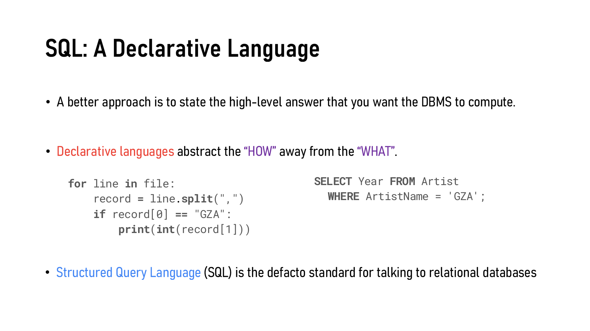
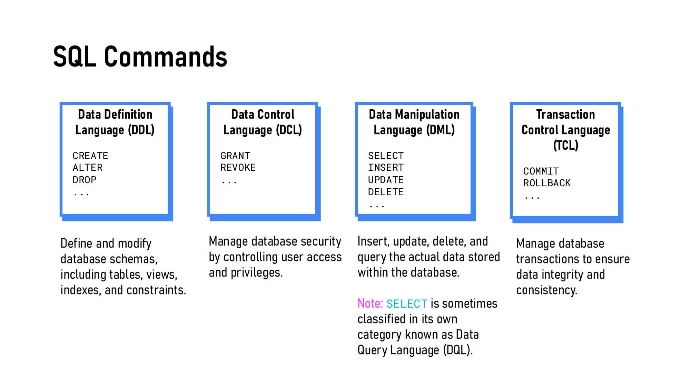
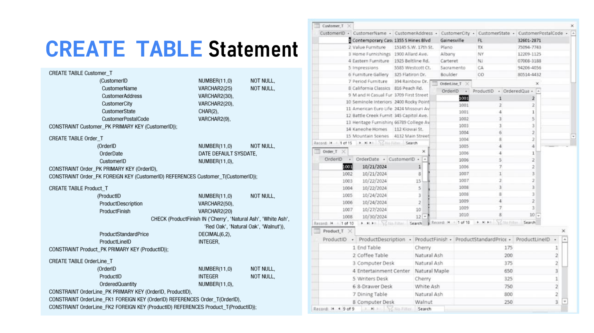
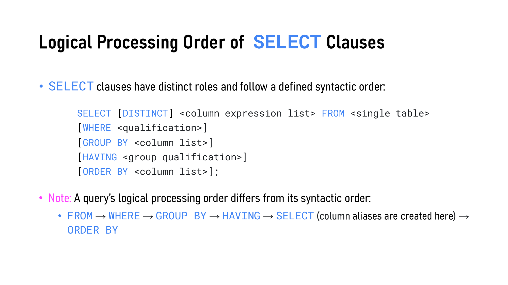
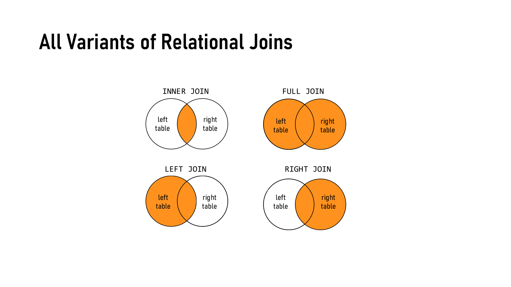
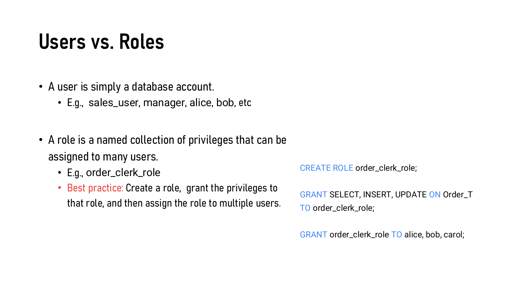
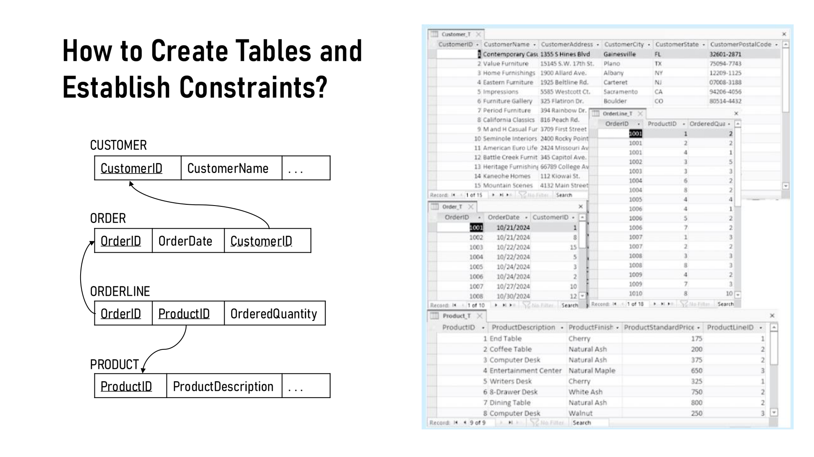

---
title:
  en: "Week 5 · Learning SQL: Commands at a Glance, Then How to Write Them"
  zh: "第 5 周 · SQL 学习版：命令一览 + 怎么写"
summary:
  en: "A lean companion to Lecture 5: every SQL command on one table (DDL / DML / TCL / DCL), a three-step method for turning a question into SQL, then each command in brief with worked examples on the teacher's Pine Valley data — CREATE / ALTER / DROP, SELECT with WHERE, GROUP BY / HAVING and joins (JOIN … ON vs FROM a, b WHERE), INSERT / UPDATE / DELETE, COMMIT / ROLLBACK and GRANT / REVOKE. Run everything in SQL Developer."
  zh: "第 5 周的精简学习版：先用一张表列出所有 SQL 命令（DDL / DML / TCL / DCL），再讲「读题 → 分析我要什么 → 写出 SQL」三步法，然后逐个命令简要讲解并配例题（用老师的 Pine Valley 数据）：CREATE / ALTER / DROP、SELECT（WHERE、GROUP BY / HAVING、JOIN … ON 与 FROM a, b WHERE）、INSERT / UPDATE / DELETE、COMMIT / ROLLBACK、GRANT / REVOKE。所有语句在 SQL Developer 里跑。"
week: 5
date: 2026-10-04
tags: [SQL, CREATE TABLE, SELECT, JOIN, COMMIT, Oracle, 学习版]
---
# 第 5 周 · SQL 学习版：命令一览 + 怎么写

**学 SQL 只要三步：① 知道有哪些命令、各自能干嘛 → ② 读题，分析出「我要什么」→ ③ 照命令的格式写出来。**

这一页就按这个顺序讲，第 7 节专门列出**不能这样写**的情况，第 10 节是 Oracle 和其他数据库写法不同的地方。每个例子下面都有一个折叠的「看结果」：建议先在 SQL Developer 里自己跑，再点开对照；手边没有 SQL Developer 时也可以直接看。例子用的是老师 `oracle demo.sql` 里的 Pine Valley 数据，四张表的完整数据放在最后的 [附录](#附录pine-valley-四张表的完整数据)，跑完可以对照原表，确认每条语句到底挑了哪些行。更多题目和标准答案在 [SQL 练习册](../../labs/sql-practice/)，按课件页码整理的考点版在 [第 5 周复习笔记](../week-05/)。

---

## 0. 从设计到实现：这一周在做什么

前四周我们一直在**设计**：第 2–3 周画 E-R 图（SDLC 的 Analysis），第 4 周把 E-R 图映射成关系表并规范化（Design）。到这里手里还只是纸上的设计。第 5 周进入 **Implementation**：用 SQL 让 DBMS（Oracle）照着设计把表建出来，然后存数据、查数据。

设计里的概念在数据库里一一对应：

| E-R 图 | 关系模型 | 数据库（SQL）                       | 例子                                  |
| ----- | ---- | ------------------------------ | ----------------------------------- |
| 实体    | 关系   | **表**                          | `Customer_T`                        |
| 属性    | 属性   | **列**（带数据类型）                   | `CustomerName VARCHAR2(25)`         |
| 标识符   | 主键   | **`PRIMARY KEY`**              | `CustomerID`                        |
| 关系    | 外键   | **`FOREIGN KEY … REFERENCES`** | `Order_T.CustomerID` → `Customer_T` |

表和表之间靠外键连在一起（参照完整性）：订单里的 CustomerID 必须是真实存在的客户。

## 1. SQL 是什么

**SQL（Structured Query Language）是和关系数据库打交道的语言**：建表、存、查、改数据、管权限都用它。各家数据库有自己的方言，这门课用 **Oracle** 的写法。



*同一件事：Python 写「怎么做」，SQL 只写「要什么」（Slide 7）*

|         | 命令式 Imperative | **声明式 Declarative（SQL）** |
| ------- | -------------- | ------------------------ |
| 你写的是    | **怎么做**：一步步操作  | **要什么**：结果长什么样           |
| 谁决定执行步骤 | 你自己            | DBMS（query optimizer）    |
| 类比      | 自己下厨           | 在餐厅点菜                    |

---

## 2. 🔴 所有命令一览



*SQL 命令四大类（Slide 10）*

分类只看一件事：**这条命令动的是什么？** 结构 → DDL，数据 → DML，存不存档 → TCL，权限 → DCL。

| 类别           | 命令             | 能干嘛                | 格式                                                |
| ------------ | -------------- | ------------------ | ------------------------------------------------- |
| **DDL** 定义结构 | `CREATE TABLE` | 建一张新表              | `CREATE TABLE 表 (列 类型 约束, …);`                    |
|              | `ALTER TABLE`  | 改表的结构：加列、改列、删列、加约束 | `ALTER TABLE 表 ADD … / MODIFY … / DROP COLUMN …;` |
|              | `DROP TABLE`   | 删掉整张表（结构 + 数据）     | `DROP TABLE 表;`                                   |
| **DML** 操作数据 | `SELECT`       | 查数据（只读）            | `SELECT 列 FROM 表 WHERE 条件;`                       |
|              | `INSERT`       | 加一行                | `INSERT INTO 表 (列, …) VALUES (值, …);`             |
|              | `UPDATE`       | 改已有的行              | `UPDATE 表 SET 列 = 值 WHERE 条件;`                    |
|              | `DELETE`       | 删行（表还在）            | `DELETE FROM 表 WHERE 条件;`                         |
| **TCL** 控制事务 | `COMMIT`       | 存档：让修改永久生效         | `COMMIT;`                                         |
|              | `ROLLBACK`     | 回档：撤销上次存档后的修改      | `ROLLBACK;`                                       |
| **DCL** 控制权限 | `GRANT`        | 给权限                | `GRANT 权限 ON 表 TO 用户或角色;`                         |
|              | `REVOKE`       | 收回权限               | `REVOKE 权限 ON 表 FROM 用户或角色;`                      |

> **⚠️ 最常考的一对：DROP vs DELETE**
>
> `DELETE FROM Customer_T;` 删掉所有**行**，表还在（DML）。`DROP TABLE Customer_T;` 连**表**一起删掉（DDL）。`SELECT` 有时被单独叫 DQL，只有 DML 这个选项时它属于 DML。

*（网页版此处是「这条语句属于哪一类」的点选练习；下表是全部题目和答案）*

| 语句                                                                                                        | 类别      | 理由                                                                  |
| --------------------------------------------------------------------------------------------------------- | ------- | ------------------------------------------------------------------- |
| `CREATE TABLE Customer_T ( … );`                                                                          | **DDL** | 建一张新表 = 定义结构。                                                       |
| `SELECT * FROM Customer_T;`                                                                               | **DML** | 读数据。有的教材把 SELECT 单独叫 DQL（Data Query Language），只有 DML 这个选项时它就属于 DML。 |
| `GRANT SELECT ON Customer_T TO sales_user;`                                                               | **DCL** | 给别人权限。                                                              |
| `DELETE FROM Customer_T;`                                                                                 | **DML** | 删的是行（数据），删完表还在，只是空了。                                                |
| `DROP TABLE Customer_T;`                                                                                  | **DDL** | 连表的定义一起删掉 = 改结构。和上一题的 DELETE 是最常考的一对。                               |
| `COMMIT;`                                                                                                 | **TCL** | 把这之前的修改永久保存（存档）。                                                    |
| `ALTER TABLE Customer_T ADD Email VARCHAR2(30);`                                                          | **DDL** | 加一列改变的是表的结构，不是数据。                                                   |
| `UPDATE Product_T SET ProductStandardPrice = 775 WHERE ProductID = 7;`                                    | **DML** | 改已有行里的值。                                                            |
| `REVOKE SELECT ON Customer_T FROM sales_user;`                                                            | **DCL** | 收回权限。                                                               |
| `ROLLBACK;`                                                                                               | **TCL** | 撤销还没 COMMIT 的修改（回档）。                                                |
| `INSERT INTO Customer_T VALUES ( … );`                                                                    | **DML** | 加一行数据。                                                              |
| `ALTER TABLE Order_T ADD CONSTRAINT Order_FK FOREIGN KEY (CustomerID) REFERENCES Customer_T(CustomerID);` | **DDL** | 加约束也是改结构（规则属于表的定义）。                                                 |

---

## 3. 🔴 读题 → 分析 → 写 SQL

拿到一道题，先别急着写，按下面的问题逐个回答，每个答案就是 SQL 里的一个子句。

**查询题（SELECT）**

| 先问自己          | 写进                                    |
| ------------- | ------------------------------------- |
| 要显示什么？        | `SELECT` 列 / 计算 / 聚合                  |
| 数据在哪张（哪些）表？   | `FROM`（多张表就 `JOIN`）                   |
| 要哪些行？         | `WHERE`                               |
| 要不要按某个东西分组统计？ | `GROUP BY` + `COUNT` / `SUM` / `AVG`… |
| 统计完还要筛掉一些组吗？  | `HAVING`                              |
| 怎么排序？         | `ORDER BY`                            |

**建表题（CREATE TABLE）**：表叫什么、有哪些列 → 每列存什么类型、能不能空 → 谁是主键、引用谁 → 有没有默认值或取值限制。

**改数据题（INSERT / UPDATE / DELETE）**：哪张表 → 改成什么（`VALUES` / `SET`）→ 改哪些行（`WHERE`）。

**题目里的关键词，几乎能直接翻译成 SQL：**

| 题目说                  | 写                                  |
| -------------------- | ---------------------------------- |
| 列出 / 显示 …            | `SELECT …`                         |
| 有哪些（不重复）/ 有哪几种       | `SELECT DISTINCT …`                |
| 一共有几个 / 平均 / 总共 / 最高 | `COUNT(*)` / `AVG` / `SUM` / `MAX` |
| **每个** … / **各** …   | `GROUP BY …`                       |
| 超过 N 个的组 / 至少有 …     | `HAVING COUNT(*) > N`              |
| 从高到低 / 最新的在前         | `ORDER BY … DESC`                  |
| 名字里含 / 以 … 结尾        | `LIKE '%…%'` / `LIKE '%…'`         |
| 没有填 / 缺失             | `IS NULL`                          |
| 连同 … 的名字一起           | `JOIN`（另一张表）                       |
| **从没** … 过的          | `LEFT JOIN` + `WHERE 右表主键 IS NULL` |

---

## 4. 🔴 DDL：建表、改表、删表

### 4.1 CREATE TABLE

> 读格式的方法：**中文**的地方换成你自己的表名、列名、值；`[ ]` 里的部分可以不写；`…` 表示可以重复写多个；其余的英文（关键字、括号、逗号）照抄。

**格式**

```sql
CREATE TABLE 表名 (
    列名  数据类型  [DEFAULT 默认值]  [NOT NULL],
    列名  数据类型  …,
    …,
    CONSTRAINT 约束名 PRIMARY KEY (列名 [, 列名 …]),
    CONSTRAINT 约束名 FOREIGN KEY (列名) REFERENCES 父表名(父表的列名)
);
```

先写所有列，再写约束；每项之间用逗号，**最后一项后面没有逗号**。每一列的顺序固定是：**列名 → 数据类型 → DEFAULT → NOT NULL**。

**例子**

```sql
CREATE TABLE Order_T (
    OrderID    NUMBER(11,0),
    OrderDate  DATE DEFAULT SYSDATE,
    CustomerID NUMBER(11,0),
    CONSTRAINT Order_PK PRIMARY KEY (OrderID),
    CONSTRAINT Order_FK FOREIGN KEY (CustomerID)
        REFERENCES Customer_T(CustomerID)
);
```

**结果：**

数据库里多了一张**空表**（0 行）：

| 列            | 类型           | 规则               |
| ------------ | ------------ | ---------------- |
| 🔑 ORDERID   | NUMBER(11,0) | 主键：不能空、不能重复      |
| ORDERDATE    | DATE         | 不填就是今天           |
| ↗ CUSTOMERID | NUMBER(11,0) | 外键 → CUSTOMER\_T |

Script Output：`Table ORDER_T created.`（如果你已经跑过老师的脚本，会报 ORA-00955：表已存在）

**常用数据类型**

| 类型      | 格式                                       | 括号里写什么                              | 例子                                                                           |
| ------- | ---------------------------------------- | ----------------------------------- | ---------------------------------------------------------------------------- |
| 数字      | `NUMBER(总位数, 小数位数)`、`DECIMAL(总位数, 小数位数)` | 两个整数：一共几位数字、其中几位是小数                 | `NUMBER(11,0)`：最多 11 位的整数（ID）<br />`DECIMAL(6,2)`：共 6 位、2 位小数，最大 9999.99（价格） |
| 整数      | `INTEGER`                                | 不用括号                                | `ProductLineID INTEGER`                                                      |
| 长短不一的文字 | `VARCHAR2(最大长度)`                         | **一个整数**：这一列最多能存几个字符。括号和数字都**不能省略** | `VARCHAR2(25)`：最多 25 个字符，存 `'Value Furniture'`（15 个字符）只占 15 个                |
| 定长的文字   | `CHAR(长度)`                               | 一个整数：每个值都正好这么长，不够的补空格               | `CHAR(2)`：州缩写 FL、TX                                                          |
| 日期      | `DATE`                                   | 不用括号                                | `OrderDate DATE`                                                             |

**文字和数字的长度定多少？**

建表时括号里的数字要**定得比现有数据大一些**，原因是：

- 定小了，以后插入更长的值会直接报错（`ORA-12899: value too large for column`）；表里有了数据之后，Oracle 不允许把列改短（`ORA-01441`）。
- 定大了几乎没有代价：`VARCHAR2` 按**实际长度**存，`VARCHAR2(50)` 存 15 个字符的名字也只占 15 个字符的空间。上限是 4000。
- 只有**每个值都一样长**的列（州缩写、性别代码）才用 `CHAR`，长度就是那个固定值，不用留余量。

**确定的方法**：

1. **看现有数据最长有多长**。手上有样例数据就数一数；数据已经在数据库里的话，可以直接查：`SELECT MAX(LENGTH(CustomerName)) FROM Customer_T;`（数字列用 `MAX(列)` 看最大值有几位）。
2. **想想以后会不会更长**：名字、地址、描述这类自由填写的内容，以后很可能出现更长的值；编号、代码通常有固定规则。
3. **在最长值的基础上留出余量**，取一个整一点的数（例如最长 20 → 定 25 或 30；描述类可以更宽松，定 50）。

老师的脚本就是这样定的（现有最长值可以对照附录里的数据）：

| 列                    | 现有数据里最长的值              | 长度    | 定的类型                       | 余量         |
| -------------------- | ---------------------- | ----- | -------------------------- | ---------- |
| CustomerName         | `Contemporary Casuals` | 20    | `VARCHAR2(25)`             | +5         |
| CustomerAddress      | `2400 Rocky Point Dr.` | 20    | `VARCHAR2(30)`             | +10        |
| CustomerCity         | `Battle Creek`         | 12    | `VARCHAR2(20)`             | +8         |
| CustomerPostalCode   | `32601-2871`           | 10    | `VARCHAR2(15)`             | +5         |
| ProductDescription   | `Entertainment Center` | 20    | `VARCHAR2(50)`             | 描述类，留得宽    |
| ProductFinish        | `Natural Maple`        | 13    | `VARCHAR2(20)`             | +7         |
| CustomerState        | `FL`（永远 2 个字母）         | 2     | `CHAR(2)`                  | 定长，不留      |
| ProductStandardPrice | 800                    | 3 位整数 | `DECIMAL(6,2)`（最大 9999.99） | 整数部分多留 1 位 |

> **⚠️ 定小了会怎样：课件 p.13 的邮编**
>
> 课件 p.13 把 CustomerPostalCode 定成了 `VARCHAR2(9)`，但数据里的邮编是 `32601-2871` 这种格式（5 位 + 连字符 + 4 位 = **10 个字符**），插入时会报 `ORA-12899`。老师的脚本把它改成了 `VARCHAR2(15)`。所以定长度时要看**真实数据的格式**，不能只凭印象（「邮编是 5 位数」）。

**约束：什么时候用，怎么写**

| 约束            | 什么时候用                    | 格式                                                      | 例子                                                                               |
| ------------- | ------------------------ | ------------------------------------------------------- | -------------------------------------------------------------------------------- |
| `NOT NULL`    | 这一列必须填                   | `列名 数据类型 NOT NULL`                                      | `CustomerName VARCHAR2(25) NOT NULL`                                             |
| `DEFAULT`     | 不填时自动给一个值                | `列名 数据类型 DEFAULT 默认值`                                   | `OrderDate DATE DEFAULT SYSDATE`                                                 |
| `PRIMARY KEY` | 唯一找到一行的列（自带「不能空 + 不能重复」） | `CONSTRAINT 约束名 PRIMARY KEY (列名)`                       | `CONSTRAINT Customer_PK PRIMARY KEY (CustomerID)`                                |
| 复合主键          | 要两列一起才能确定一行（M:N 拆出来的表）   | `CONSTRAINT 约束名 PRIMARY KEY (列名1, 列名2)`                 | `CONSTRAINT OrderLine_PK PRIMARY KEY (OrderID, ProductID)`                       |
| `FOREIGN KEY` | 这一列的值必须在另一张表里存在          | `CONSTRAINT 约束名 FOREIGN KEY (列名) REFERENCES 父表名(父表的列名)` | `CONSTRAINT Order_FK FOREIGN KEY (CustomerID) REFERENCES Customer_T(CustomerID)` |
| `UNIQUE`      | 不是主键但也不能重复（其他候选键）        | `CONSTRAINT 约束名 UNIQUE (列名)`                            | `CONSTRAINT Email_UQ UNIQUE (Email)`                                             |
| `CHECK`       | 值有范围或清单限制                | `CONSTRAINT 约束名 CHECK (条件)`                             | `CHECK (ProductFinish IN ('Cherry', 'Walnut', …))`、`CHECK (Price >= 0)`          |

约束名自己起，课件的习惯是 `表名_PK`、`表名_FK`。

**约束在做什么**：在 SQL Developer 里依次跑下面三条，看哪条成功、哪条被拦下、报的是什么错，再对照上面的约束表想想是哪条规则在起作用。跑完记得 `ROLLBACK;`。

```sql
INSERT INTO Order_T (OrderID, CustomerID)
VALUES (1009, 1);    -- ① 不写 OrderDate

INSERT INTO Order_T (OrderID, CustomerID)
VALUES (1010, 99);   -- ② 99 号客户存在吗？

INSERT INTO Order_T (OrderID, CustomerID)
VALUES (1001, 1);    -- ③ 1001 号订单已经有了
```

**结果：**

|   | 结果                                              | 谁起的作用       |
| - | ----------------------------------------------- | ----------- |
| ① | `1 row inserted.`，OrderDate 自动填了今天              | DEFAULT     |
| ② | `ORA-02291` parent key not found：没有 99 号客户      | FOREIGN KEY |
| ③ | `ORA-00001` unique constraint violated：1001 已存在 | PRIMARY KEY |

> **🎯 四个最容易错的地方**
>
> 1. **复合主键只写一条**：`PRIMARY KEY (OrderID, ProductID)`。在两列后面各写一个 `PRIMARY KEY` 会报 ORA-02260（一张表只能有一个主键）。外键则是引用几张父表就写几条。
> 2. **先建父表，再建子表**：外键引用的表必须已经存在。删表顺序相反。
> 3. **两个数字 `(总位数, 小数位数)` 只属于数字类型**；`VARCHAR2` 括号里只有一个数字（最大长度），而且不能省略。
> 4. 主键自动 NOT NULL；外键可以为空。

> **📌 注意**
>
> 关系模型要求每张表都有主键，这门课也这样要求；但 Oracle 语法上不强制，没写主键的表也能建出来。外键除了写在 CREATE TABLE 里，也可以建完表后用 `ALTER TABLE … ADD CONSTRAINT` 加（`lab6_init.sql` 就是这样做的）。

**例题**（Lab 6 课件 p.18）：建一张表，记录每所学校开设了哪些科目、每门科目的名额。

| 分析      | 结论                                                                       |
| ------- | ------------------------------------------------------------------------ |
| 一行代表什么？ | 「某所学校开某门科目」                                                              |
| 有哪些列？   | 学校编号、科目编号、名额 QUOTA                                                       |
| 类型？     | 编号和 SCHOOL、SUBJECT 的主键一致：`VARCHAR2(3)`、`VARCHAR2(4)`；名额是整数 `NUMBER(3,0)` |
| 主键？     | 一所学校开多门科目、一门科目被多所学校开 → **两列一起**才唯一 → 复合主键                                |
| 外键？     | 学校编号 → SCHOOL，科目编号 → SUBJECT，两条                                          |

```sql
CREATE TABLE SUBJECT_OFFER2 (
    FK_SCHOOL_ID    VARCHAR2(3) NOT NULL,
    FK_SUBJECT_CODE VARCHAR2(4) NOT NULL,
    QUOTA           NUMBER(3,0) NOT NULL,
    CONSTRAINT Offer2_PK  PRIMARY KEY (FK_SCHOOL_ID, FK_SUBJECT_CODE),
    CONSTRAINT Offer2_FK1 FOREIGN KEY (FK_SCHOOL_ID)    REFERENCES SCHOOL(SCHOOL_ID),
    CONSTRAINT Offer2_FK2 FOREIGN KEY (FK_SUBJECT_CODE) REFERENCES SUBJECT(SUBJECT_CODE)
);
```

（表名用了 SUBJECT\_OFFER2，因为 `lab6_init.sql` 已经建过 SUBJECT\_OFFER，同名会报 ORA-00955。试完 `DROP TABLE SUBJECT_OFFER2;`。）



*课件里 Pine Valley 四张表完整的 CREATE TABLE 语句（Slide 13）*

### 4.2 ALTER TABLE 与 DROP TABLE

表已经建好了，想改它的**结构**（加列、改列、删列、加约束），不用删了重建，用 ALTER TABLE。

**格式**

```sql
ALTER TABLE 表名 ADD 列名 数据类型 [DEFAULT 默认值] [NOT NULL];   -- 加一列
ALTER TABLE 表名 ADD (列名 数据类型, 列名 数据类型 …);            -- 一次加几列
ALTER TABLE 表名 MODIFY 列名 新的数据类型;                         -- 改类型 / 长度
ALTER TABLE 表名 DROP COLUMN 列名;                                -- 删一列
ALTER TABLE 表名 DROP (列名, 列名 …);                             -- 一次删几列
ALTER TABLE 表名 RENAME COLUMN 旧列名 TO 新列名;                   -- 改列名
ALTER TABLE 表名 ADD CONSTRAINT 约束名 约束内容;                   -- 加约束
ALTER TABLE 表名 DROP CONSTRAINT 约束名;                           -- 删约束
DROP TABLE 表名 [CASCADE CONSTRAINTS];                            -- 删整张表
```

**例子**

| 想做什么     | 例子                                                                                                        | 写不写 COLUMN   |
| -------- | --------------------------------------------------------------------------------------------------------- | ------------ |
| 加一列      | `ALTER TABLE Customer_T ADD CustomerType VARCHAR2(10) DEFAULT 'Commercial';`                              | ❌ 不写         |
| 一次加几列    | `ALTER TABLE School ADD (Address VARCHAR2(255), Email VARCHAR2(30));`                                     | ❌ 不写，用括号     |
| 改类型 / 长度 | `ALTER TABLE Customer_T MODIFY CustomerType VARCHAR2(16);`                                                | ❌ 不写         |
| 删一列      | `ALTER TABLE Customer_T DROP COLUMN CustomerType;`                                                        | ✅ **要写**     |
| 一次删几列    | `ALTER TABLE School DROP (Address, Email);`                                                               | ❌ 不写，用括号     |
| 改列名      | `ALTER TABLE School RENAME COLUMN Address TO Addr;`                                                       | ✅ **要写**     |
| 加约束      | `ALTER TABLE Order_T ADD CONSTRAINT Order_FK FOREIGN KEY (CustomerID) REFERENCES Customer_T(CustomerID);` | 写 CONSTRAINT |
| 删约束      | `ALTER TABLE Product_T DROP CONSTRAINT Product_Finish_CHK;`                                               | 写 CONSTRAINT |
| 删整张表     | `DROP TABLE Customer_T;`                                                                                  | —            |

在 SQL Developer 里试一下加列：

```sql
ALTER TABLE Customer_T
ADD CustomerType VARCHAR2(10) DEFAULT 'Commercial';
```

**结果：**

`Table CUSTOMER_T altered.` 之后 `SELECT *` 的前 3 行：

| CUSTOMERID | CUSTOMERNAME         | … | CUSTOMERTYPE |
| ---------- | -------------------- | - | ------------ |
| 1          | Contemporary Casuals | … | Commercial   |
| 2          | Value Furniture      | … | Commercial   |
| 3          | Home Furnishings     | … | Commercial   |

每一行都多了一列，已有的行自动填上 DEFAULT 值。

跑完 `SELECT * FROM Customer_T;` 看看每一行多了什么。ALTER 是 DDL，会自动提交，ROLLBACK 撤不回来；试完用 `ALTER TABLE Customer_T DROP COLUMN CustomerType;` 删掉。

> **🧠 Oracle 什么时候写 COLUMN**
>
> **加（ADD）和改（MODIFY）不写；删一列（DROP COLUMN）和改名（RENAME COLUMN）要写。** 一次删多列时用括号 `DROP (a, b)`，也不写 COLUMN。
>
> 写成 `ADD COLUMN …`、`MODIFY COLUMN …` 是 **MySQL / PostgreSQL 的写法**，在 Oracle 里会报错。网上搜到的例子很多是 MySQL 的，抄过来前先对一下。

表里已经有数据时 MODIFY 要小心：改短到放不下（ORA-01441）、给已有空值的列加 NOT NULL（ORA-02296）、加一个 NOT NULL 新列却不给 DEFAULT（ORA-01758），Oracle 都会拒绝。还被外键引用的表 DROP 不掉（ORA-02449），要先删子表，或者写 `DROP TABLE Customer_T CASCADE CONSTRAINTS;`。

---

## 5. 🔴 DML：SELECT 查数据

### 5.1 六个子句，以及执行顺序

**完整格式**（只有 SELECT 和 FROM 是必须的，其余按需要加，但**顺序不能换**）

```sql
SELECT [DISTINCT] 列名 [AS 别名], 表达式 [AS 别名], …
FROM 表名 [表别名]
[WHERE 行条件]
[GROUP BY 列名, …]
[HAVING 组条件]
[ORDER BY 列名 [ASC | DESC], …];
```

| 写的顺序       | 作用     | 执行顺序 |
| ---------- | ------ | ---- |
| `SELECT`   | 要哪些列   | 5    |
| `FROM`     | 从哪张表   | 1    |
| `WHERE`    | 筛**行** | 2    |
| `GROUP BY` | 分组     | 3    |
| `HAVING`   | 筛**组** | 4    |
| `ORDER BY` | 排序     | 6    |



*写的顺序 ≠ 执行的顺序（Slide 43）*

**执行顺序：FROM → WHERE → GROUP BY → HAVING → SELECT → ORDER BY**（从哪来 → 挑行 → 分组 → 挑组 → 挑列 → 排队）。由此得出四条规则：

- WHERE **不能**用列别名（别名在 SELECT 才产生），ORDER BY **能**
- WHERE **不能**用聚合函数（还没分组），HAVING **能**

### 5.2 SELECT … FROM：选列、去重、计算

**选列**：SELECT 后面写要哪些列，`*` 表示全部列。

格式：`SELECT 列名1, 列名2, … FROM 表名;` 或 `SELECT * FROM 表名;`

```sql
SELECT ProductDescription, ProductStandardPrice
FROM Product_T;
```

**结果：**

共 10 行，前 4 行：

| PRODUCTDESCRIPTION   | PRODUCTSTANDARDPRICE |
| -------------------- | -------------------- |
| End Table            | 175                  |
| Coffee Table         | 200                  |
| Computer Desk        | 375                  |
| Entertainment Center | 650                  |

表头是大写的，因为 Oracle 把名字一律存成大写。

**DISTINCT 去重**：紧跟在 SELECT 后面，重复的行只留一行。

格式：`SELECT DISTINCT 列名1 [, 列名2 …] FROM 表名;`（写了多列时，是这几列的**组合**不重复）

```sql
SELECT DISTINCT CustomerState
FROM Customer_T
ORDER BY CustomerState;
```

**结果：**

20 位客户只来自 10 个州：

| CUSTOMERSTATE |
| ------------- |
| CA            |
| CO            |
| FL            |
| HI            |
| MI            |
| MN            |
| NJ            |
| NY            |
| TX            |
| WA            |

**计算和列别名**：SELECT 里可以写算式，每一行算一次（表里的数据不变）；`AS 别名` 给结果列起名，AS 可以省略。

格式：`SELECT 列名, 表达式 [AS 别名] FROM 表名;`，表达式可以用 `+ - * /`，文字用 `||` 拼接。

```sql
SELECT ProductID, ProductStandardPrice,
       ProductStandardPrice * 1.1 AS Plus10Percent
FROM Product_T
WHERE ProductID <= 3;
```

**结果：**

| PRODUCTID | PRODUCTSTANDARDPRICE | PLUS10PERCENT |
| --------- | -------------------- | ------------- |
| 1         | 175                  | 192.5         |
| 2         | 200                  | 220           |
| 3         | 375                  | 412.5         |

### 5.3 🔴 WHERE：只要满足条件的行

**格式**：`SELECT … FROM 表名 WHERE 条件;`，条件有下面几种写法：

| 条件   | 格式                                  | 意思                                       |
| ---- | ----------------------------------- | ---------------------------------------- |
| 比较   | `列名 = 值`（还有 `<>`、`>`、`<`、`>=`、`<=`） | 文字用**单引号**、区分大小写；日期写 `DATE 'YYYY-MM-DD'` |
| 模糊匹配 | `列名 LIKE '模式'`                      | 模式里 `%` = 任意多个字符，`_` = 正好一个字符            |
| 范围   | `列名 BETWEEN 下限 AND 上限`              | **包含两端**                                 |
| 清单   | `列名 IN (值1, 值2, …)`                 | 等于其中任何一个                                 |
| 空值   | `列名 IS NULL` / `列名 IS NOT NULL`     | **不能写 `= NULL`**                         |
| 组合   | `条件1 AND 条件2`、`条件1 OR 条件2`、`NOT 条件` | **AND 比 OR 先算**，拿不准就加括号                  |

（下面的例子没写 ORDER BY，SQL Developer 一般按插入顺序显示，但顺序不保证。）

**比较**

```sql
SELECT ProductDescription, ProductStandardPrice
FROM Product_T
WHERE ProductStandardPrice < 275;
```

**结果：**

| PRODUCTDESCRIPTION | PRODUCTSTANDARDPRICE |
| ------------------ | -------------------- |
| End Table          | 175                  |
| Coffee Table       | 200                  |
| Computer Desk      | 250                  |

**LIKE + %**：`'%Desk'` = 前面随便、以 Desk 结尾

```sql
SELECT ProductID, ProductDescription
FROM Product_T
WHERE ProductDescription LIKE '%Desk';
```

**结果：**

| PRODUCTID | PRODUCTDESCRIPTION |
| --------- | ------------------ |
| 3         | Computer Desk      |
| 5         | Writers Desk       |
| 6         | 8-Drawer Desk      |
| 8         | Computer Desk      |

**LIKE + \_**：`_` 正好占一个字符

```sql
SELECT ProductID, ProductDescription
FROM Product_T
WHERE ProductDescription LIKE '_-Drawer%';
```

**结果：**

| PRODUCTID | PRODUCTDESCRIPTION |
| --------- | ------------------ |
| 6         | 8-Drawer Desk      |
| 9         | 3-Drawer Chest     |
| 10        | 4-Drawer Dresser   |

**BETWEEN**：200 和 375 都包含在内

```sql
SELECT ProductDescription, ProductStandardPrice
FROM Product_T
WHERE ProductStandardPrice BETWEEN 200 AND 375;
```

**结果：**

| PRODUCTDESCRIPTION | PRODUCTSTANDARDPRICE |
| ------------------ | -------------------- |
| Coffee Table       | 200                  |
| Computer Desk      | 375                  |
| Writers Desk       | 325                  |
| Computer Desk      | 250                  |

200 和 375 都包含在内。

**IN**：等于 `CustomerState = 'CA' OR CustomerState = 'WA'`

```sql
SELECT CustomerName, CustomerState
FROM Customer_T
WHERE CustomerState IN ('CA', 'WA');
```

**结果：**

| CUSTOMERNAME         | CUSTOMERSTATE |
| -------------------- | ------------- |
| Impressions          | CA            |
| Period Furniture     | WA            |
| California Classics  | CA            |
| Golden State Designs | CA            |
| Rainier Home         | WA            |

**IS NULL**：找没填邮编的客户（写成 `= NULL` 会返回 0 行）

```sql
SELECT CustomerID, CustomerName
FROM Customer_T
WHERE CustomerPostalCode IS NULL;
```

**结果：**

| CUSTOMERID | CUSTOMERNAME         |
| ---------- | -------------------- |
| 7          | Period Furniture     |
| 13         | Heritage Furnishings |
| 17         | Rocky Mountain Furn  |
| 20         | Rainier Home         |

改成 `= NULL` 会返回 0 行。

**AND / OR 的优先级**：同样三个条件，有没有括号，结果不一样

```sql
SELECT ProductDescription, ProductStandardPrice
FROM Product_T
WHERE ProductDescription LIKE '%Desk'
   OR ProductDescription LIKE '%Table'
  AND ProductStandardPrice > 300;
```

**结果：**

5 行：

| PRODUCTDESCRIPTION | PRODUCTSTANDARDPRICE |
| ------------------ | -------------------- |
| Computer Desk      | 375                  |
| Writers Desk       | 325                  |
| 8-Drawer Desk      | 750                  |
| Dining Table       | 800                  |
| Computer Desk      | **250**              |

AND 先算，等于 `Desk OR (Table AND > 300)`：价格条件只管 Table，所以 250 元的 Desk 也进来了。

```sql
SELECT ProductDescription, ProductStandardPrice
FROM Product_T
WHERE (ProductDescription LIKE '%Desk'
    OR ProductDescription LIKE '%Table')
  AND ProductStandardPrice > 300;
```

**结果：**

4 行：

| PRODUCTDESCRIPTION | PRODUCTSTANDARDPRICE |
| ------------------ | -------------------- |
| Computer Desk      | 375                  |
| Writers Desk       | 325                  |
| 8-Drawer Desk      | 750                  |
| Dining Table       | 800                  |

括号让 OR 先算，价格条件对 Desk 和 Table 都生效，250 元的 Computer Desk 被去掉了。

### 5.4 🔴 ORDER BY：排序

**格式**：`SELECT … FROM … [WHERE …] ORDER BY 列名1 [ASC | DESC], 列名2 [ASC | DESC], …;`（ORDER BY 永远写在最后）

默认升序 `ASC`，降序写 `DESC`，**DESC 只管紧挨着它的那一列**；多列时先按第一列排，第一列相同再按第二列。ORDER BY 后面也可以写列别名。

```sql
SELECT CustomerState, CustomerName
FROM Customer_T
WHERE CustomerState IN ('FL', 'TX')
ORDER BY CustomerState, CustomerName DESC;
```

**结果：**

| CUSTOMERSTATE | CUSTOMERNAME         |
| ------------- | -------------------- |
| FL            | Sunshine Interiors   |
| FL            | Seminole Interiors   |
| FL            | M and H Casual Furn  |
| FL            | Contemporary Casuals |
| FL            | American Euro Life   |
| TX            | Value Furniture      |
| TX            | Lone Star Furniture  |

State 升序；同一个州里 Name 降序。

### 5.5 🔴 聚合函数：把很多行压成一个数

**格式**：`SELECT 聚合函数(列名), … FROM 表名 [WHERE …];`

| 函数                  | 算什么            | NULL |
| ------------------- | -------------- | ---- |
| `COUNT(*)`          | 有几行            | 每行都算 |
| `COUNT(列)`          | 这一列**不是空**的有几行 | 跳过   |
| `SUM(列)` / `AVG(列)` | 总和 / 平均        | 跳过   |
| `MIN(列)` / `MAX(列)` | 最小 / 最大        | 跳过   |
| `COUNT(DISTINCT 列)` | 这一列有几种**不同**的值 | 跳过   |

```sql
SELECT COUNT(*), COUNT(CustomerPostalCode)
FROM Customer_T;
```

**结果：**

| COUNT(\*) | COUNT(CUSTOMERPOSTALCODE) |
| --------- | ------------------------- |
| 20        | 16                        |

20 行进去，1 行出来。20 位客户里有 4 位没填邮编，`COUNT(列)` 跳过了它们。

```sql
SELECT MIN(ProductStandardPrice),
       MAX(ProductStandardPrice),
       AVG(ProductStandardPrice)
FROM Product_T;
```

**结果：**

| MIN(…) | MAX(…) | AVG(…) |
| ------ | ------ | ------ |
| 175    | 800    | 460    |

10 行进去，1 行出来。

关键在于：**聚合函数会把所有行压成一行**。

### 5.6 🔴🔴 GROUP BY 到底在干什么：先分堆，再每堆算一个数

上面的 `COUNT(*)` 是把**整张表**压成一个数。如果题目问「**每条**产品线各有几个产品」，我们要的不是一个数，而是**每条产品线一个数**。GROUP BY 就是干这个的：

> **GROUP BY 某列 = 按这一列的值把行分成几堆，然后每一堆各压成一行。**

**格式**

```sql
SELECT 分组的列, 聚合函数(列名), …
FROM 表名
[WHERE 行条件]
GROUP BY 分组的列 [, 分组的列 …];
```

用 Product\_T 走一遍：`SELECT ProductLineID, COUNT(*), AVG(ProductStandardPrice) FROM Product_T GROUP BY ProductLineID;`

**第 1 步：按 ProductLineID 把 10 行分成 3 堆**

| 堆  | ProductLineID | ProductID | ProductDescription   | ProductStandardPrice |
| -- | ------------- | --------- | -------------------- | -------------------- |
| 🟥 | 1             | 1         | End Table            | 175                  |
| 🟥 | 1             | 5         | Writers Desk         | 325                  |
| 🟥 | 1             | 9         | 3-Drawer Chest       | 450                  |
| 🟦 | 2             | 2         | Coffee Table         | 200                  |
| 🟦 | 2             | 3         | Computer Desk        | 375                  |
| 🟦 | 2             | 6         | 8-Drawer Desk        | 750                  |
| 🟦 | 2             | 7         | Dining Table         | 800                  |
| 🟦 | 2             | 10        | 4-Drawer Dresser     | 625                  |
| 🟩 | 3             | 4         | Entertainment Center | 650                  |
| 🟩 | 3             | 8         | Computer Desk        | 250                  |

**第 2 步：每一堆压成一行，聚合函数在每一堆里各算一次**

| 堆  | PRODUCTLINEID | COUNT(\*) | AVG(PRODUCTSTANDARDPRICE)         |
| -- | ------------- | --------- | --------------------------------- |
| 🟥 | 1             | 3         | 316.67（175 + 325 + 450 = 950，÷ 3） |
| 🟦 | 2             | 5         | 550（2750 ÷ 5）                     |
| 🟩 | 3             | 2         | 450（900 ÷ 2）                      |

10 行进去，**3 行**出来——有几堆就有几行。

**为什么 SELECT 里不能随便放别的列？** 看第 1 步的 🟥 堆：它压成一行之后，ProductLineID 只有一个值（1），COUNT 和 AVG 也各是一个数；但 ProductDescription 有 End Table、Writers Desk、3-Drawer Chest 三个值，**一行里放不下三个**，Oracle 不知道该显示哪个，所以直接报错：

```sql
SELECT ProductLineID, ProductDescription, COUNT(*)   -- ❌ ORA-00979: not a GROUP BY expression
FROM Product_T
GROUP BY ProductLineID;
```

> **规则：用了 GROUP BY，SELECT 里的每一列，要么写在 GROUP BY 里（每堆只有一个值），要么被聚合函数包着（每堆算成一个数）。**

没写 GROUP BY 但用了聚合函数，等于整张表是**一堆**，同样的道理：`SELECT ProductID, COUNT(*) FROM Product_T;` → 10 个 ProductID 放不进 1 行 → `ORA-00937: not a single-group group function`。

**按两列分组**：`GROUP BY CustomerState, CustomerCity` = 州和城市**都相同**的才算同一堆（比如 CA + Sacramento 一堆，CA + Santa Clara 另一堆）。

### 5.7 🔴 HAVING：分完堆之后，挑出要的堆

- **WHERE 在分堆之前**，一行一行地挑：「哪些**行**参与分组」
- **HAVING 在分堆之后**，一堆一堆地挑：「哪些**堆**留在结果里」

**格式**：HAVING 紧跟在 GROUP BY 后面

```sql
SELECT 分组的列, 聚合函数(列名)
FROM 表名
[WHERE 行条件]
GROUP BY 分组的列
HAVING 含聚合函数的条件;
```

**例子**

```sql
SELECT ProductLineID, COUNT(*)
FROM Product_T
WHERE ProductStandardPrice >= 200  -- ① 先挑行
GROUP BY ProductLineID             -- ② 再分堆
HAVING COUNT(*) >= 3;              -- ③ 最后挑堆
```

**结果：**

| PRODUCTLINEID | COUNT(\*) |
| ------------- | --------- |
| 2             | 5         |

只剩产品线 2（🟦）。WHERE 先去掉了 175 元的 End Table，🟥 只剩 2 个，不够 3 个。删掉 WHERE 再跑，🟥 有 3 个，也会留下。

跑完之后，把 WHERE 那一行删掉再跑一次，比较两次结果差在哪里，对照附录里的 Product\_T 想想为什么。

**判断条件放哪里**：条件里有 COUNT / SUM / AVG 等聚合函数 → 一定是 HAVING（WHERE 的时候还没分堆，没东西可数，写在 WHERE 里报 `ORA-00934`）；条件只是某一列的值 → 放 WHERE。

### 5.8 🔴 多表：JOIN … ON 与 FROM a, b WHERE

两种写法做的是同一件事——按「外键 = 主键」把两张表的行配对。

**格式**

```sql
-- 写法 1：JOIN … ON
SELECT 列名, …
FROM 表1 别名1 [INNER] JOIN 表2 别名2
  ON 别名1.外键 = 别名2.主键
[WHERE …];

-- 写法 2：FROM 表1, 表2 WHERE
SELECT 列名, …
FROM 表1 别名1, 表2 别名2
WHERE 别名1.外键 = 别名2.主键 [AND 其他条件];

-- 外连接：保留左表（或右表）配不上的行
SELECT 列名, …
FROM 表1 别名1 LEFT [OUTER] JOIN 表2 别名2      -- 也可以是 RIGHT / FULL
  ON 别名1.外键 = 别名2.主键;

-- 三张表：每多一张表，多一个 JOIN … ON
SELECT 列名, …
FROM 表1 a JOIN 表2 b ON a.键 = b.键
           JOIN 表3 c ON b.键 = c.键;
```

**例子**

```sql
-- 写法 1：JOIN … ON（课件写法）
SELECT o.OrderID, c.CustomerName
FROM Order_T o JOIN Customer_T c ON o.CustomerID = c.CustomerID;

-- 写法 2：FROM a, b WHERE
SELECT o.OrderID, c.CustomerName
FROM Order_T o, Customer_T c
WHERE o.CustomerID = c.CustomerID;
```

```sql
SELECT o.OrderID, o.OrderDate, c.CustomerName
FROM Order_T o
  JOIN Customer_T c ON o.CustomerID = c.CustomerID
ORDER BY o.OrderID;
```

**结果：**

8 行，每张订单配上它的客户：

| ORDERID | ORDERDATE | CUSTOMERNAME         |
| ------- | --------- | -------------------- |
| 1001    | 21-OCT-24 | Contemporary Casuals |
| 1002    | 21-OCT-24 | California Classics  |
| 1003    | 22-OCT-24 | Mountain Scenes      |
| 1004    | 22-OCT-24 | Impressions          |
| 1005    | 24-OCT-24 | Home Furnishings     |
| 1006    | 24-OCT-24 | Value Furniture      |
| 1007    | 27-OCT-24 | Seminole Interiors   |
| 1008    | 30-OCT-24 | Battle Creek Furn    |

OrderDate 来自 Order\_T，CustomerName 来自 Customer\_T，靠 CustomerID 配对。

|                 | JOIN … ON                    | FROM a, b WHERE            |
| --------------- | ---------------------------- | -------------------------- |
| 连接条件写在          | `ON`                         | `WHERE`                    |
| 忘了写连接条件         | 语法错误                         | 不报错，得到笛卡尔积（8 × 20 = 160 行） |
| 能写 outer join 吗 | 能：`LEFT / RIGHT / FULL JOIN` | 不能                         |



*四种 join：INNER 只留配得上的行；LEFT / RIGHT / FULL 还保留配不上的行，另一边补 NULL（Slide 48）*

```sql
SELECT c.CustomerID, c.CustomerName, o.OrderID
FROM Customer_T c
  LEFT JOIN Order_T o ON c.CustomerID = o.CustomerID
WHERE c.CustomerID <= 7
ORDER BY c.CustomerID;
```

**结果：**

| CUSTOMERID | CUSTOMERNAME         | ORDERID  |
| ---------- | -------------------- | -------- |
| 1          | Contemporary Casuals | 1001     |
| 2          | Value Furniture      | 1006     |
| 3          | Home Furnishings     | 1005     |
| 4          | Eastern Furniture    | *(null)* |
| 5          | Impressions          | 1004     |
| 6          | Furniture Gallery    | *(null)* |
| 7          | Period Furniture     | *(null)* |

LEFT JOIN 保留所有客户，没下过单的，订单那一边补 NULL。换成普通 JOIN，4、6、7 号客户就不见了。

- `o`、`c` 是表别名，**Oracle 里表别名前不能写 AS**。
- 两张表都有的列要写前缀 `c.CustomerID`，否则 ORA-00918。
- 连 n 张表需要 n − 1 个连接条件。

### 5.9 🔴 练习：先在 SQL Developer 里写，再点开对答案

每道题按第 3 节的方法分析：要显示什么 → 从哪张表来 → 哪些行 → 要不要分组 → 怎么排。写好在 SQL Developer 里跑，再点开看分析、参考答案和结果。

**练习 1 · 列出佛罗里达州（FL）所有客户的名字和城市，按名字排序。**

> | 要什么 | 名字、城市 → `SELECT CustomerName, CustomerCity` |
> | --- | ------------------------------------------- |
> | 从哪来 | `FROM Customer_T`                           |
> | 哪些行 | `WHERE CustomerState = 'FL'`                |
> | 怎么排 | `ORDER BY CustomerName`                     |
>
> ```sql
> SELECT CustomerName, CustomerCity
> FROM Customer_T
> WHERE CustomerState = 'FL'
> ORDER BY CustomerName;
> ```
>
> 结果 5 行：American Euro Life（Orlando）、Contemporary Casuals（Gainesville）、M and H Casual Furn（Clearwater）、Seminole Interiors（Tallahassee）、Sunshine Interiors（Tampa）。

**练习 2 · 每个州有几位客户？只看超过 1 位的州，人数多的排前面。**

> | 要什么                | 州、人数 → `SELECT CustomerState, COUNT(*)` |
> | ------------------ | --------------------------------------- |
> | 从哪来                | `FROM Customer_T`                       |
> | 「每个州」              | `GROUP BY CustomerState`                |
> | 「超过 1 位」是对**组**的条件 | `HAVING COUNT(*) > 1`                   |
> | 「多的排前面」            | `ORDER BY COUNT(*) DESC`                |
>
> ```sql
> SELECT CustomerState, COUNT(*)
> FROM Customer_T
> GROUP BY CustomerState
> HAVING COUNT(*) > 1
> ORDER BY COUNT(*) DESC;
> ```
>
> 结果：FL 5、CA 3、CO 3、TX 2、WA 2（人数相同的几行之间顺序不固定）。

**练习 3 · 价格在 200 到 400 之间的产品有哪些？显示名称和价格，从贵到便宜排。**

> | 要什么 | `SELECT ProductDescription, ProductStandardPrice` |
> | --- | ------------------------------------------------- |
> | 从哪来 | `FROM Product_T`                                  |
> | 哪些行 | `WHERE ProductStandardPrice BETWEEN 200 AND 400`  |
> | 怎么排 | `ORDER BY ProductStandardPrice DESC`              |
>
> ```sql
> SELECT ProductDescription, ProductStandardPrice
> FROM Product_T
> WHERE ProductStandardPrice BETWEEN 200 AND 400
> ORDER BY ProductStandardPrice DESC;
> ```
>
> 结果 4 行：Computer Desk 375、Writers Desk 325、Computer Desk 250、Coffee Table 200。

**练习 4 · 列出每张订单的编号、日期和下单客户的名字（用两种写法各写一次）。**

> | 要什么 | 订单编号、日期（Order\_T）+ 客户名字（Customer\_T） |
> | --- | ------------------------------------ |
> | 从哪来 | 两张表，用 CustomerID 连起来                 |
>
> ```sql
> SELECT o.OrderID, o.OrderDate, c.CustomerName
> FROM Order_T o JOIN Customer_T c ON o.CustomerID = c.CustomerID
> ORDER BY o.OrderID;
>
> SELECT o.OrderID, o.OrderDate, c.CustomerName
> FROM Order_T o, Customer_T c
> WHERE o.CustomerID = c.CustomerID
> ORDER BY o.OrderID;
> ```
>
> 两种写法结果一样，都是 8 行（和 5.8 里那条 JOIN 的结果相同）。

**练习 5 · 哪些客户从来没下过订单？**

> | 要什么     | 客户编号和名字                                                          |
> | ------- | ---------------------------------------------------------------- |
> | 关键词「从没」 | 要保留没有订单的客户 → `LEFT JOIN`；再挑出订单那一边是空的 → `WHERE o.OrderID IS NULL` |
>
> ```sql
> SELECT c.CustomerID, c.CustomerName
> FROM Customer_T c LEFT JOIN Order_T o ON c.CustomerID = o.CustomerID
> WHERE o.OrderID IS NULL
> ORDER BY c.CustomerID;
> ```
>
> 结果 12 位客户：4、6、7、9、11、13、14、16、17、18、19、20。

更多题目：[SQL 练习册](../../labs/sql-practice/) b01–b06（SELECT）、w01–w12（WHERE）、a01–a09（聚合分组）、j01–j08（JOIN）、x01–x09（会不会报错）。

---

## 6. 🔴 DML：INSERT / UPDATE / DELETE 改数据

| 命令           | 格式                                                 | 说明                           |
| ------------ | -------------------------------------------------- | ---------------------------- |
| INSERT（全部列）  | `INSERT INTO 表名 VALUES (值1, 值2, …);`               | 按建表时的列顺序给出**每一列**的值          |
| INSERT（部分列）  | `INSERT INTO 表名 (列名1, 列名2, …) VALUES (值1, 值2, …);` | 值和列一一对应；没写的列用 DEFAULT 或 NULL |
| INSERT（查询结果） | `INSERT INTO 表名 SELECT … FROM 另一张表 [WHERE …];`     | 一次插入查询出来的所有行                 |
| UPDATE       | `UPDATE 表名 SET 列名 = 新值 [, 列名 = 新值 …] [WHERE 条件];`  | 不写 WHERE = 改所有行              |
| DELETE       | `DELETE FROM 表名 [WHERE 条件];`                       | 不写 WHERE = 删所有行（表还在）         |

**INSERT：多了一行**

```sql
INSERT INTO Product_T
  (ProductID, ProductDescription, ProductStandardPrice)
VALUES (11, 'Side Table', 175);
```

**结果：**

`1 row inserted.` Product\_T 多了第 11 行：

| PRODUCTID | PRODUCTDESCRIPTION | PRODUCTFINISH | PRODUCTSTANDARDPRICE | PRODUCTLINEID |
| --------- | ------------------ | ------------- | -------------------- | ------------- |
| 10        | 4-Drawer Dresser   | Natural Oak   | 625                  | 2             |
| **11**    | **Side Table**     | *(null)*      | **175**              | *(null)*      |

没写的两列变成 NULL。

**UPDATE：改已有的行**

```sql
UPDATE Product_T
SET ProductStandardPrice = 775
WHERE ProductID = 7;
```

**结果：**

`1 row updated.`

| PRODUCTID | PRODUCTDESCRIPTION | PRODUCTSTANDARDPRICE |
| --------- | ------------------ | -------------------- |
| 6         | 8-Drawer Desk      | 750                  |
| 7         | Dining Table       | ~~800~~ → **775**    |
| 8         | Computer Desk      | 250                  |

如果忘了写 WHERE，会显示 `10 rows updated.`，所有产品都变成 775。

**DELETE：删掉行，表还在**

```sql
DELETE FROM Customer_T
WHERE CustomerID = 20;
```

**结果：**

`1 row deleted.`

| CUSTOMERID | CUSTOMERNAME         |
| ---------- | -------------------- |
| 18         | Golden State Designs |
| 19         | Lone Star Furniture  |
| ~~20~~     | ~~Rainier Home~~     |

如果删的是 1 号客户，会报 `ORA-02292` child record found：他下过订单，订单还引用着他。

> **⚠️ 踩坑提醒**
>
> - **UPDATE / DELETE 不写 WHERE = 改 / 删整张表。** 动手前先用同样的 WHERE 跑一次 SELECT，看会动到哪些行。
> - 上面三个例子在 SQL Developer 里试完，执行 `ROLLBACK;` 就能全部撤销（见第 8 节）。

---

## 7. 🔴 不能这样写：常见报错一览

考试最爱考「哪条语句会报错」。下面按「错的写法 → 报什么 → 为什么 → 怎么改」整理。报错时先看 **ORA 编号**，冒号后面的英文通常已经说明了问题。

### 7.1 SELECT 里的

| ❌ 错的写法                                                                         | 报错                                           | 为什么                                         | ✅ 改成                                                 |
| ------------------------------------------------------------------------------ | -------------------------------------------- | ------------------------------------------- | ---------------------------------------------------- |
| `SELECT ProductID, COUNT(*) FROM Product_T;`                                   | ORA-00937 not a single-group group function  | 聚合把整张表压成 1 行，ProductID 却有 10 个值             | 去掉 ProductID，或加 `GROUP BY ProductID`                 |
| `SELECT ProductLineID, ProductDescription, COUNT(*) … GROUP BY ProductLineID;` | ORA-00979 not a GROUP BY expression          | 每堆里 ProductDescription 有好几个值（见 5.6）         | 把它也写进 GROUP BY，或者从 SELECT 删掉                         |
| `… WHERE COUNT(*) > 1 GROUP BY CustomerState;`                                 | ORA-00934 group function is not allowed here | WHERE 在分组之前，还没东西可数                          | 改成 `HAVING COUNT(*) > 1`                             |
| `SELECT Price * 1.1 AS NewPrice … WHERE NewPrice > 300;`                       | ORA-00904 "NEWPRICE": invalid identifier     | WHERE 在 SELECT 之前，别名还不存在                    | `WHERE Price * 1.1 > 300`                            |
| `GROUP BY 别名` / `HAVING 别名`                                                    | ORA-00904                                    | GROUP BY、HAVING 也在 SELECT 之前                | 写原来的表达式（Oracle 23ai 起 GROUP BY 可以用别名，考试按课件：不能）       |
| `WHERE CustomerState = "FL"`                                                   | ORA-00904 "FL": invalid identifier           | 双引号表示**名字**，不是文字                            | `'FL'`（单引号）                                          |
| `WHERE CustomerPostalCode = NULL`                                              | **不报错，但 0 行**                                | 和 NULL 比较的结果是「未知」                           | `IS NULL`                                            |
| `SELECT CustomerName, DISTINCT CustomerCity`                                   | ORA-00936 missing expression                 | DISTINCT 只能紧跟在 SELECT 后面，管整行                | `SELECT DISTINCT CustomerName, CustomerCity`         |
| `SUM(*)`、`AVG(*)`                                                              | ORA-00936                                    | 只有 COUNT 可以写 `*`                            | `SUM(列)`                                             |
| `FROM Customer_T AS c`                                                         | ORA-00933 SQL command not properly ended     | Oracle 的**表别名**不能加 AS                       | `FROM Customer_T c`（列别名可以加 AS）                       |
| `SELECT CustomerID … FROM Customer_T c JOIN Order_T o ON …`                    | ORA-00918 column ambiguously defined         | 两张表都有 CustomerID                            | `c.CustomerID`                                       |
| `… ORDER BY CustomerName WHERE …`                                              | ORA-00933                                    | 子句顺序是固定的                                    | SELECT → FROM → WHERE → GROUP BY → HAVING → ORDER BY |
| `FROM Order_T, Customer_T`（没写连接条件）                                             | **不报错，行数暴增**                                 | 笛卡尔积：8 × 20 = 160 行                         | 加上 `WHERE o.CustomerID = c.CustomerID`               |
| `SELECT CustomerName CustomerCity FROM …`（少了逗号）                                | **不报错**                                      | CustomerCity 变成了 CustomerName 的列别名，结果只有 1 列 | 补上逗号                                                 |

### 7.2 建表、改表时的

| ❌ 错的写法                          | 报错                                            | ✅ 改成                                        |
| ------------------------------- | --------------------------------------------- | ------------------------------------------- |
| 两列后面各写一个 `PRIMARY KEY`          | ORA-02260 table can have only one primary key | `CONSTRAINT … PRIMARY KEY (a, b)` 一条        |
| `Name VARCHAR2`                 | ORA-00906 missing left parenthesis            | `VARCHAR2(25)`                              |
| 最后一列或最后一个约束后面多了逗号               | ORA-00904 : invalid identifier                | 删掉最后的逗号                                     |
| `Qty NUMBER NOT NULL DEFAULT 1` | ORA-00907 missing right parenthesis           | `Qty NUMBER DEFAULT 1 NOT NULL`（DEFAULT 在前） |
| 外键引用的父表还没建                      | ORA-00942 table or view does not exist        | 先建父表                                        |
| 外键指向父表的普通列                      | ORA-02270 no matching unique or primary key   | 只能引用主键或 UNIQUE 列                            |
| 建一张已经存在的表                       | ORA-00955 name is already used                | 先 `DROP TABLE`，或换个名字                        |
| `ALTER TABLE … ADD COLUMN …`    | 报错                                            | Oracle 不写 COLUMN：`ADD 列名 类型`                |
| `DROP TABLE` 一张还被外键引用的表         | ORA-02449                                     | 先删子表，或加 `CASCADE CONSTRAINTS`               |

### 7.3 改数据时的

| ❌ 情况                     | 报错                                              |
| ------------------------ | ----------------------------------------------- |
| INSERT 不写列名，值又没给全        | ORA-00947 not enough values（多了是 ORA-00913）      |
| 主键重复                     | ORA-00001 unique constraint violated            |
| NOT NULL 的列没给值           | ORA-01400 cannot insert NULL                    |
| 文字超过 VARCHAR2 / CHAR 的长度 | ORA-12899 value too large for column            |
| 数字超过 NUMBER(p, s) 的位数    | ORA-01438 value larger than specified precision |
| 不满足 CHECK                | ORA-02290 check constraint violated             |
| 外键的值在父表里找不到              | ORA-02291 parent key not found                  |
| 删除 / 修改还被子表引用的行          | ORA-02292 child record found                    |
| UPDATE / DELETE 没写 WHERE | **不报错，整张表都被改 / 删**                              |

---

## 8. 🔴 TCL：COMMIT / ROLLBACK 存档与回档

**格式**

```sql
COMMIT;      -- 存档
ROLLBACK;    -- 回档
```

INSERT / UPDATE / DELETE 执行完，修改还只是「草稿」：

- `COMMIT;` = **存档**：修改永久生效，别人也能看到。
- `ROLLBACK;` = **回档**：撤销上次 COMMIT 之后的所有修改。COMMIT 过的回不去。
- **DDL（CREATE / ALTER / DROP）会自动 COMMIT**：执行前先把之前的修改存档。
- SQL Developer 默认不自动提交，改完要自己 `COMMIT;`（Lab 6 手册特别提醒）。

---

## 9. 🟡 DCL：GRANT / REVOKE 权限



*用户是账号，角色是一组权限（Slide 22）*

|     | User 用户           | Role 角色            |
| --- | ----------------- | ------------------ |
| 是什么 | 一个数据库**账号**       | 一组**权限的集合**（像一个岗位） |
| 例子  | alice、sales\_user | order\_clerk\_role |

**格式**

```sql
GRANT 权限 [, 权限 …] ON 表名 TO 用户或角色 [WITH GRANT OPTION];   -- 给对象权限
REVOKE 权限 [, 权限 …] ON 表名 FROM 用户或角色;                     -- 收回对象权限
GRANT 系统权限 TO 用户;                                            -- 例如 GRANT CREATE TABLE TO alice;
CREATE ROLE 角色名;                                                -- 建角色
GRANT 角色名 TO 用户 [, 用户 …];                                    -- 把角色给人
REVOKE 角色名 FROM 用户;                                            -- 收回角色
```

权限可以是 `SELECT`、`INSERT`、`UPDATE`、`DELETE`，或者 `ALL`。

**最佳做法**：先建角色 → 把权限给角色 → 再把角色给人。

```sql
CREATE ROLE order_clerk_role;
GRANT SELECT, INSERT, UPDATE ON Order_T TO order_clerk_role;
GRANT order_clerk_role TO alice, bob;
REVOKE SELECT ON Customer_T FROM sales_user;
```

> **🎯 三条规则**
>
> 1. `WITH GRANT OPTION`（允许转授）**不能**用于把对象权限授给角色。
> 2. 带 GRANT OPTION 的权限被收回时，转授出去的也**一起被收回**。
> 3. 收回一个角色 = 收回它带来的**所有**权限。
>
> 介词：**GRANT … TO**、**REVOKE … FROM**。两种权限：系统权限（如 `CREATE TABLE`）和对象权限（如某张表上的 `SELECT`）。

---

## 10. 🟡 Oracle 的方言：和网上其他写法不一样的地方

SQL 有标准，但每家数据库都有自己的写法。这门课和 Lab 用的是 Oracle，网上搜到的例子很多是 MySQL 或 SQL Server 的，照抄可能报错。

| 场景           | Oracle 写法                                             | 其他数据库常见写法                                                    |
| ------------ | ----------------------------------------------------- | ------------------------------------------------------------ |
| 可变长文字        | `VARCHAR2(n)`                                         | `VARCHAR(n)`                                                 |
| 数字           | `NUMBER(p, s)`                                        | `INT`、`DECIMAL(p, s)`                                        |
| 当前日期         | `SYSDATE`                                             | `CURRENT_DATE`、`NOW()`、`GETDATE()`                           |
| 日期常量         | `DATE '2024-10-22'`                                   | `'2024-10-22'`                                               |
| 日期加减         | `ADD_MONTHS(d, 2)`、`NEXT_DAY(d, 'THURSDAY')`          | `DATE_ADD`、`DATEADD`                                         |
| 拼接文字         | `'a' \|\| 'b'`                                        | `CONCAT('a', 'b')`、`'a' + 'b'`（SQL Server）                   |
| 表别名          | `FROM Customer_T c`（**不能**加 AS）                       | `FROM Customer_T AS c`                                       |
| 加列           | `ALTER TABLE t ADD 列 类型`                              | `ADD COLUMN 列 类型`（MySQL、PostgreSQL）                          |
| 改列           | `ALTER TABLE t MODIFY 列 新类型`                          | `ALTER COLUMN`（SQL Server、PostgreSQL）、`MODIFY COLUMN`（MySQL） |
| 只要前 N 行      | `FETCH FIRST 5 ROWS ONLY`（12c 起）或 `WHERE ROWNUM <= 5` | `LIMIT 5`（MySQL、PostgreSQL）、`TOP 5`（SQL Server）              |
| 不查表、只算一个值    | `SELECT SYSDATE FROM DUAL;`（23ai 以前必须写 FROM）          | `SELECT NOW();`                                              |
| 空字符串         | `''` 被当成 **NULL**                                     | `''` 和 NULL 不一样                                              |
| 名字的大小写       | 没加双引号的表名、列名一律存成**大写**                                 | 各家不同                                                         |
| 提交           | SQL Developer 默认**不自动提交**，要自己 `COMMIT;`               | 很多 MySQL 客户端默认自动提交                                           |
| 脚本里单独一行的 `/` | 表示「执行上面这一段」（`lab6_init.sql` 里有）                       | —                                                            |

---

## 11. 自测

**1. Which statement correctly defines a composite primary key on (OrderID, ProductID)?**

- A. OrderID NUMBER PRIMARY KEY, ProductID INTEGER PRIMARY KEY
- B. CONSTRAINT OrderLine\_PK PRIMARY KEY (OrderID, ProductID)
- C. CONSTRAINT PK1 PRIMARY KEY (OrderID), CONSTRAINT PK2 PRIMARY KEY (ProductID)
- D. PRIMARY KEY OrderID AND ProductID

> **答案：B**
>
> 一张表只有一个主键，复合主键是一条约束、括号里放多列。A、C 都是在建两个主键。

**2. Order\_T has a foreign key referencing Customer\_T. Which creation order works?**

- A. Order\_T first, then Customer\_T
- B. Customer\_T first, then Order\_T
- C. Either order
- D. Both in one statement

> **答案：B**
>
> 外键引用的父表必须先存在。删表顺序相反。

**3. Which command removes all rows but keeps the table?**

- A. DROP TABLE Customer\_T
- B. DELETE FROM Customer\_T
- C. ALTER TABLE Customer\_T DROP COLUMN CustomerID
- D. REVOKE ALL ON Customer\_T

> **答案：B**
>
> DELETE 是 DML，删行不删表；DROP TABLE 是 DDL。

**4. Which query does NOT return the same rows as the others?**

- A. FROM Order\_T o JOIN Customer\_T c ON o.CustomerID = c.CustomerID
- B. FROM Order\_T o, Customer\_T c WHERE o.CustomerID = c.CustomerID
- C. FROM Order\_T o INNER JOIN Customer\_T c ON o.CustomerID = c.CustomerID
- D. FROM Order\_T o, Customer\_T c

> **答案：D**
>
> D 没有连接条件，得到笛卡尔积。

**5. 'Show each state with more than one customer.' Where does the condition COUNT(\*) > 1 go?**

- A. WHERE
- B. HAVING
- C. ORDER BY
- D. SELECT

> **答案：B**
>
> 「超过 1 位」是对每个州这一**组**的条件，分组之后才能数，所以放 HAVING。WHERE 里不能用聚合函数。

**6. A user runs UPDATE … ; then CREATE TABLE Temp\_T (x NUMBER); then ROLLBACK; What happens to the update?**

- A. It is undone
- B. It stays, because CREATE TABLE committed it
- C. ROLLBACK raises an error
- D. Only half of it is undone

> **答案：B**
>
> DDL 执行前会自动 COMMIT，之前的 UPDATE 已经存档。

**7. SELECT ProductLineID, ProductDescription, COUNT(\*) FROM Product\_T GROUP BY ProductLineID; What happens?**

- A. Returns one row per product
- B. Returns one row per product line, showing the first description
- C. Error: ProductDescription is not a GROUP BY expression
- D. Error: COUNT(\*) cannot be used with GROUP BY

> **答案：C**
>
> 按 ProductLineID 分堆后每堆压成一行，但一堆里有好几个 ProductDescription，放不进一行 → ORA-00979。SELECT 里的列要么在 GROUP BY 里，要么被聚合函数包着。

**8. Which ALTER TABLE statement is valid in Oracle?**

- A. ALTER TABLE Customer\_T ADD COLUMN Email VARCHAR2(30);
- B. ALTER TABLE Customer\_T MODIFY COLUMN Email VARCHAR2(50);
- C. ALTER TABLE Customer\_T DROP COLUMN Email;
- D. ALTER TABLE Customer\_T ALTER COLUMN Email VARCHAR2(50);

> **答案：C**
>
> Oracle 里只有删一列（DROP COLUMN）和改名（RENAME COLUMN）要写 COLUMN。A、B 是 MySQL 的写法，D 是 SQL Server / PostgreSQL 的写法。

---

## 附录：Pine Valley 四张表的完整数据

下面是跑完老师 `oracle demo.sql` 之后，数据库里四张表的**全部数据**（和你 SQL Developer 里的一样）。跑完一条查询，回到这里对照原表，就能确认它是不是真的挑出了该挑的行。🔑 = 主键，↗ = 外键，*(null)* = 空值。



*课件 p.11 的截图是教材里的版本（15 位客户、10 张订单、9 个产品）；老师的 oracle demo.sql 改过数据（20 位客户、8 张订单、10 个产品），你 SQL Developer 里的是下面这一版（Slide 11）*

### CUSTOMER\_T（20 行）

客户：每行一位客户。

| CUSTOMERID 🔑 | CUSTOMERNAME         | CUSTOMERADDRESS      | CUSTOMERCITY | CUSTOMERSTATE | CUSTOMERPOSTALCODE |
| ------------- | -------------------- | -------------------- | ------------ | ------------- | ------------------ |
| 1             | Contemporary Casuals | 1355 S Hines Blvd    | Gainesville  | FL            | 32601-2871         |
| 2             | Value Furniture      | 15145 S.W. 17th St.  | Plano        | TX            | 75094-7743         |
| 3             | Home Furnishings     | 1900 Allard Ave.     | Albany       | NY            | 12209-1125         |
| 4             | Eastern Furniture    | 1925 Beltline Rd.    | Carteret     | NJ            | 07008-3188         |
| 5             | Impressions          | 5585 Westcott Ct.    | Sacramento   | CA            | 94206-4056         |
| 6             | Furniture Gallery    | 325 Flatiron Dr.     | Boulder      | CO            | 80514-4432         |
| 7             | Period Furniture     | 394 Rainbow Dr.      | Seattle      | WA            | *(null)*           |
| 8             | California Classics  | 816 Peach Rd.        | Santa Clara  | CA            | 96915-7743         |
| 9             | M and H Casual Furn  | 3709 First Street    | Clearwater   | FL            | 33775-0000         |
| 10            | Seminole Interiors   | 2400 Rocky Point Dr. | Tallahassee  | FL            | 32301-0000         |
| 11            | American Euro Life   | 2424 Missouri Ave.   | Orlando      | FL            | 32801-0000         |
| 12            | Battle Creek Furn    | 345 Capitol Ave.     | Battle Creek | MI            | 49016-0000         |
| 13            | Heritage Furnishings | 66789 College Ave.   | Duluth       | MN            | *(null)*           |
| 14            | Kaneohe Homes        | 112 Kiowai St.       | Kaneohe      | HI            | 96744-0000         |
| 15            | Mountain Scenes      | 4132 Main Street     | Boulder      | CO            | 80302-0000         |
| 16            | Sunshine Interiors   | 123 Beach Blvd       | Tampa        | FL            | 33601-0000         |
| 17            | Rocky Mountain Furn  | 456 Peak St          | Denver       | CO            | *(null)*           |
| 18            | Golden State Designs | 789 Capitol Ave      | Sacramento   | CA            | 94206-0000         |
| 19            | Lone Star Furniture  | 101 Main St          | Plano        | TX            | 75094-0000         |
| 20            | Rainier Home         | 202 Pine St          | Seattle      | WA            | *(null)*           |

### PRODUCT\_T（10 行）

产品：每行一个家具产品。ProductFinish 有 CHECK 约束，只能是 7 种材质之一。

| PRODUCTID 🔑 | PRODUCTDESCRIPTION   | PRODUCTFINISH | PRODUCTSTANDARDPRICE | PRODUCTLINEID |
| ------------ | -------------------- | ------------- | -------------------- | ------------- |
| 1            | End Table            | Cherry        | 175                  | 1             |
| 2            | Coffee Table         | Natural Ash   | 200                  | 2             |
| 3            | Computer Desk        | Natural Ash   | 375                  | 2             |
| 4            | Entertainment Center | Natural Maple | 650                  | 3             |
| 5            | Writers Desk         | Cherry        | 325                  | 1             |
| 6            | 8-Drawer Desk        | White Ash     | 750                  | 2             |
| 7            | Dining Table         | Natural Ash   | 800                  | 2             |
| 8            | Computer Desk        | Walnut        | 250                  | 3             |
| 9            | 3-Drawer Chest       | Cherry        | 450                  | 1             |
| 10           | 4-Drawer Dresser     | Natural Oak   | 625                  | 2             |

### ORDER\_T（8 行）

订单：每行一张订单，CustomerID 指向下单的客户。外键：CUSTOMERID → CUSTOMER\_T。

| ORDERID 🔑 | ORDERDATE | CUSTOMERID ↗ |
| ---------- | --------- | ------------ |
| 1001       | 21-OCT-24 | 1            |
| 1002       | 21-OCT-24 | 8            |
| 1003       | 22-OCT-24 | 15           |
| 1004       | 22-OCT-24 | 5            |
| 1005       | 24-OCT-24 | 3            |
| 1006       | 24-OCT-24 | 2            |
| 1007       | 27-OCT-24 | 10           |
| 1008       | 30-OCT-24 | 12           |

### ORDERLINE\_T（18 行）

订单明细：每行 =「某张订单里的某个产品买了几个」，主键是 (OrderID, ProductID) 两列一起。外键：ORDERID → ORDER\_T；PRODUCTID → PRODUCT\_T。

| ORDERID 🔑 ↗ | PRODUCTID 🔑 ↗ | ORDEREDQUANTITY |
| ------------ | -------------- | --------------- |
| 1001         | 1              | 2               |
| 1001         | 2              | 2               |
| 1001         | 4              | 1               |
| 1002         | 3              | 5               |
| 1003         | 3              | 3               |
| 1004         | 6              | 2               |
| 1004         | 8              | 2               |
| 1005         | 4              | 4               |
| 1006         | 4              | 1               |
| 1006         | 5              | 2               |
| 1007         | 1              | 2               |
| 1007         | 2              | 2               |
| 1008         | 3              | 3               |
| 1008         | 4              | 2               |
| 1002         | 4              | 1               |
| 1003         | 1              | 1               |
| 1005         | 2              | 1               |
| 1006         | 8              | 1               |
