---
title:
  en: "Week 5 · Structured Query Language (SQL)"
  zh: "第 5 周 · 结构化查询语言 SQL"
summary:
  en: "SQL as a declarative language; DDL (CREATE / ALTER / DROP with PK, FK, DEFAULT and CHECK constraints), DCL (GRANT / REVOKE, roles, WITH GRANT OPTION), single-table SELECT (WHERE operators, aggregates, GROUP BY / HAVING, ORDER BY, logical processing order), joins (inner, outer, multi-table, self-join) and INSERT / UPDATE / DELETE."
  zh: "SQL 为什么是声明式语言；DDL（CREATE / ALTER / DROP 与主键、外键、DEFAULT、CHECK 约束）、DCL（GRANT / REVOKE、角色、WITH GRANT OPTION）、单表 SELECT（WHERE 运算符、聚合函数、GROUP BY / HAVING、ORDER BY、逻辑执行顺序）、多表连接（内连接、外连接、多表、自连接）以及 INSERT / UPDATE / DELETE。"
week: 5
date: 2026-09-26
tags: [SQL, DDL, DML, DCL, SELECT, GROUP BY, JOIN, Oracle]
---
# ISOM 5260 Fundamentals of Database Management — Week 5 复习笔记

**主题：SQL 是声明式语言 · 四类命令 DDL / DML / DCL / TCL · CREATE TABLE 与约束 · GRANT / REVOKE · SELECT 的六个子句与逻辑执行顺序 · JOIN（inner / outer / self）· INSERT / UPDATE / DELETE**

> 优先级标注说明（按考试重要性，根据课件篇幅、课件自带的对错示例和前几周的考法推断；老师上课强调过的以你的记录为准）：  
> 🔴 **必考核心** — 语法和规则要能默写，并能读懂 / 写出查询  
> 🟡 **需要理解** — 懂逻辑，能判断选项对错  
> 🟢 **了解即可** — 背景知识
>
> 这门课的考试是**选择题**，所以本周最容易出题的是：**某条语句属于哪类命令**、**一条查询会不会报错 / 返回几行**、**WHERE 和 HAVING 的区别**、**逻辑执行顺序**、**outer join 多出来的是哪些行**。课件里专门画了 ❌ 的例子（p.37、p.41）和「有括号 vs 没括号」（p.31）都是现成的选择题素材。
>
> 课件使用的是 **Oracle** 语法（`VARCHAR2`、`SYSDATE`、表别名不能加 `AS`），和 lab 里的 SQL Developer 一致。

---

## 0. 核心地图（先建立整体框架）

这节课把第 1 周的关系代数（σ / Π / ⋈）变成真正能跑的语言，并把第 4 周画好的关系表**真的建出来**：

```
为什么用 SQL：声明式（说"要什么"，不说"怎么做"）
   → 四类命令：DDL（建结构）· DML（动数据）· DCL（管权限）· TCL（管事务）
   → DDL：CREATE TABLE（数据类型 / NOT NULL / PK / FK / DEFAULT / CHECK）→ ALTER / DROP
   → DCL：GRANT / REVOKE → 角色 → WITH GRANT OPTION 的连锁撤销
   → ⭐ DML-查询：SELECT … FROM … WHERE … GROUP BY … HAVING … ORDER BY
        写的顺序 ≠ 执行的顺序：FROM → WHERE → GROUP BY → HAVING → SELECT → ORDER BY
   → ⭐ 多表：JOIN … ON（PK = FK）→ outer join 补 NULL → 多表连接 → self-join
   → DML-修改：INSERT / UPDATE / DELETE
```

**一句话**：SQL 的每个子句都对应一个关系代数操作——`WHERE` ≈ σ，`SELECT` 列 ≈ Π，`JOIN … ON` ≈ ⋈；但你只写「要什么」，执行顺序和算法交给 DBMS 的 optimizer。

---

## 1. 🟡 为什么需要 SQL：声明式语言（Declarative Language）

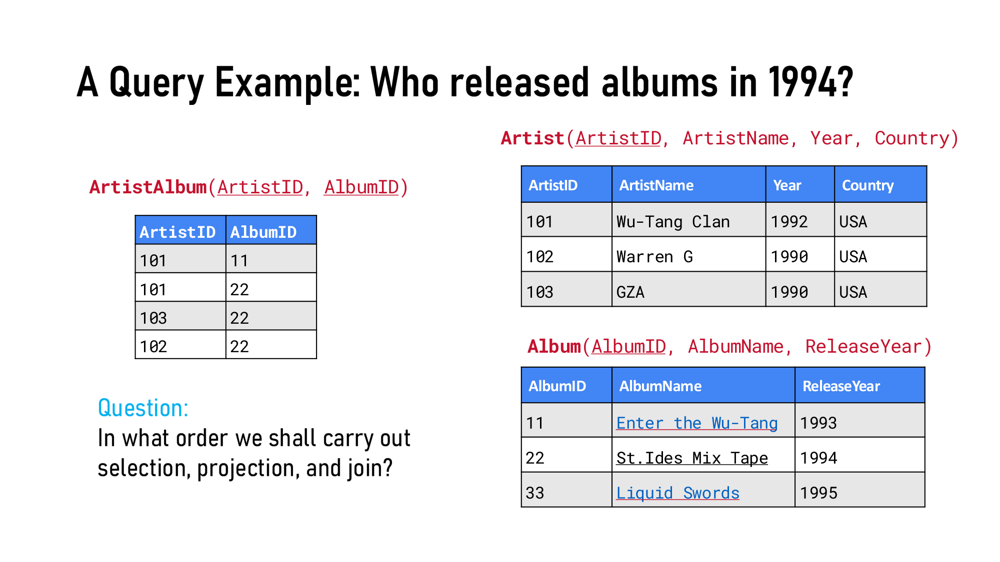

*同一个问题：Who released albums in 1994?（Artist / ArtistAlbum / Album 三张表）（Slide 4）*

p.4 的问题：选择（σ）、投影（Π）、连接（⋈）应该按什么顺序做？

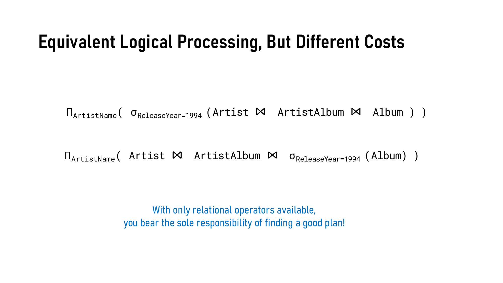

*逻辑上等价的两个关系代数表达式，代价却不同（Slide 6）*

| 表达式                                                                 | 做法                             | 代价       |
| ------------------------------------------------------------------- | ------------------------------ | -------- |
| Π\_ArtistName( σ\_ReleaseYear=1994 (Artist ⋈ ArtistAlbum ⋈ Album) ) | **先连接三张表，再筛选**                 | 中间结果大，浪费 |
| Π\_ArtistName( Artist ⋈ ArtistAlbum ⋈ σ\_ReleaseYear=1994 (Album) ) | **先把 Album 筛到只剩 1994 年那张，再连接** | 中间结果小，快  |

两者结果一样（equivalent logical processing），但**只用关系代数的话，选哪个计划是你自己的责任**（"you bear the sole responsibility of finding a good plan"）。

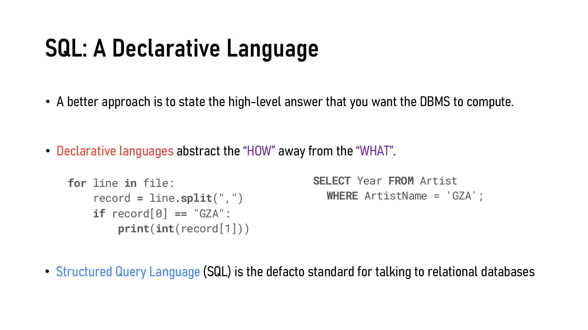

*SQL: A Declarative Language — 同一件事，Python 写「怎么做」，SQL 只写「要什么」（Slide 7）*

| 课件原文                                                                  | 中文 / 小白解释                 |
| --------------------------------------------------------------------- | ------------------------- |
| State the high-level answer that you want the DBMS to compute         | 告诉 DBMS「我要什么结果」           |
| Declarative languages abstract the **"HOW"** away from the **"WHAT"** | 声明式 = 只说 WHAT，HOW 交给 DBMS |
| SQL is the **de facto standard** for talking to relational databases  | SQL 是和关系数据库打交道的事实标准       |

> **💡 小白理解**
>
> Python 那段代码是**命令式（imperative）**：逐行读文件、切分、判断、打印——每一步都是你规定的。SQL 那句 `SELECT Year FROM Artist WHERE ArtistName = 'GZA';` 只说了结果长什么样；用不用索引、先筛还是先连，都由第 1 周讲的 **Query Parsing & Planning 层（optimizer）** 决定。

> **🎯 考点**
>
> 可能的选择题：「SQL 被称为 declarative language，是因为……」→ 它描述**要什么结果（what）**，而不是**怎么计算（how）**；执行计划由 DBMS 的 query optimizer 选。

---

## 2. 🟢 SQL 的历史、方言与标准化的好处

**历史（p.8）**：1986 年成为 ANSI 标准，1987 年成为 ISO 标准，之后一直在更新（SQL:1999 加入正则和触发器、SQL:2003 加入 XML 和窗口函数、SQL:2016 加入 JSON、SQL:2023 加入属性图查询……）。一个 DBMS 要声称「支持 SQL」，最低要求是 **SQL:92（entry level）**。各家都有自己的**方言（dialect）**：Oracle SQL、T-SQL（Microsoft SQL Server）、PostgreSQL 等。

### 🟡 标准化关系语言的好处（p.9，六条）

| 课件原文                                  | 中文         | 一句话                |
| ------------------------------------- | ---------- | ------------------ |
| Reduced training costs                | 降低培训成本     | 程序员只需学一种语言         |
| Productivity                          | 提高生产率      | 维护现有程序更快           |
| Application portability               | 应用可移植      | 程序能从一台机器搬到另一台      |
| Application longevity                 | 应用寿命长      | 标准语言存在得久，不用急着重写老程序 |
| Reduced dependence on a single vendor | 减少对单一厂商的依赖 | 可以换不同厂商的 DBMS      |
| Cross-system communication            | 跨系统通信      | 不同 DBMS 和程序之间可以协作  |

> **💼 业务视角**
>
> 站在公司角度看，这六条其实是在说**降低转换成本（switching cost）**：员工技能通用、系统能迁移、谈判时不被某个数据库厂商绑死（vendor lock-in）。但方言的存在又部分抵消了这一点——Oracle 写的 `VARCHAR2`、`SYSDATE` 搬到 SQL Server 就得改。

---

## 3. 🔴 SQL 的四类命令（DDL / DML / DCL / TCL）

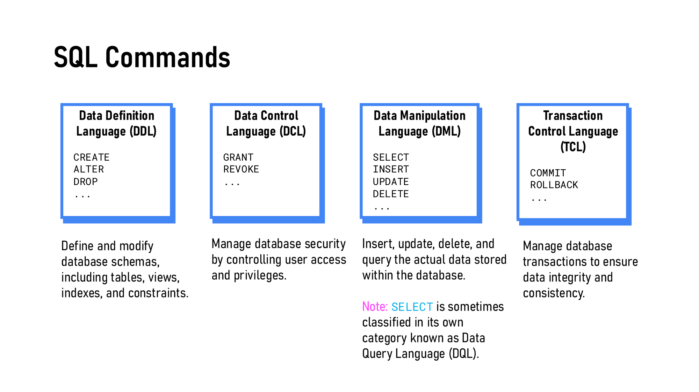

*SQL Commands 四大类（Slide 10）*

| 类别      | 全称                                  | 命令                                  | 做什么                            |
| ------- | ----------------------------------- | ----------------------------------- | ------------------------------ |
| **DDL** | Data Definition Language 数据定义语言     | `CREATE`、`ALTER`、`DROP`             | 定义和修改**结构（schema）**：表、视图、索引、约束 |
| **DML** | Data Manipulation Language 数据操作语言   | `SELECT`、`INSERT`、`UPDATE`、`DELETE` | 插入、修改、删除、查询**表里的数据**           |
| **DCL** | Data Control Language 数据控制语言        | `GRANT`、`REVOKE`                    | 控制**谁能做什么**（权限）                |
| **TCL** | Transaction Control Language 事务控制语言 | `COMMIT`、`ROLLBACK`                 | 管理事务，保证数据完整、一致                 |

> **📌 注意**
>
> `SELECT` 有时被单独归为 **DQL（Data Query Language）**。考试如果选项里同时有 DML 和 DQL，要看题目用的是哪套分法；只出现 DML 时，`SELECT` 就属于 DML。

> **⚠️ 踩坑提醒**
>
> 最容易混的一对：**`DROP TABLE`（DDL）vs `DELETE FROM`（DML）**。
>
> - `DELETE FROM Customer_T;` 删掉**所有行**，但**表还在**（空表，结构不变）
> - `DROP TABLE Customer_T;` 连**表的定义一起删掉**
>
> 判断口诀：动「结构」的是 DDL，动「数据」的是 DML。`ALTER TABLE … ADD 一列` 也是 DDL（改的是结构）。

> **🧠 记忆口诀**
>
> **D**efinition 定结构、**M**anipulation 动数据、**C**ontrol 管权限、**T**ransaction 管提交。

---

## 4. 🔴 DDL：建表与约束（CREATE TABLE）

### 4.1 要建的四张表（p.11）

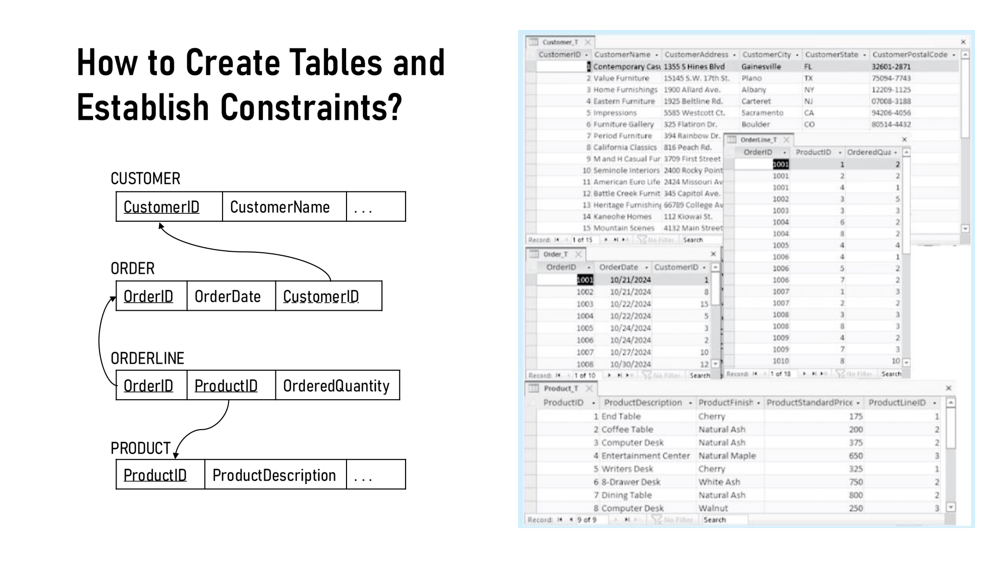

*CUSTOMER、ORDER、ORDERLINE、PRODUCT 的关系图和样例数据（Pine Valley Furniture）（Slide 11）*

这就是第 4 周映射出来的结果：`ORDER.CustomerID` 是外键指向 `CUSTOMER`；`ORDERLINE` 的主键是 (OrderID, ProductID)，两个又分别是外键。本周要做的就是**用 SQL 把它们建出来**。

### 4.2 🔴 建表七步（p.12）

| # | 课件原文                                                        | 对应的 SQL                                          |
| - | ----------------------------------------------------------- | ------------------------------------------------ |
| 1 | Identify **data types** for attributes                      | `NUMBER(11,0)`、`VARCHAR2(25)`、`DATE`…            |
| 2 | Identify columns that can and cannot be **null**            | `NOT NULL`                                       |
| 3 | Identify columns that must be **unique** (candidate keys)   | `UNIQUE` / `PRIMARY KEY`                         |
| 4 | Identify **primary key–foreign key** mates                  | `PRIMARY KEY (…)`、`FOREIGN KEY (…) REFERENCES …` |
| 5 | Determine **default values**                                | `DEFAULT SYSDATE`                                |
| 6 | Identify **constraints on columns** (domain specifications) | `CHECK (… IN (…))`                               |
| 7 | Create the table using **CREATE TABLE** command             | 把上面这些写进一条语句                                      |

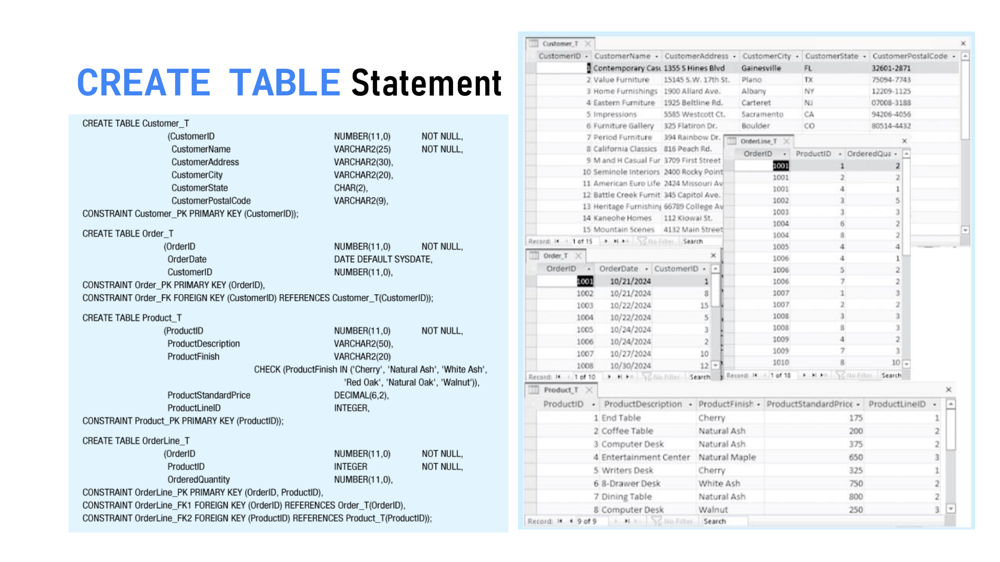

*四张表完整的 CREATE TABLE 语句（Slide 13）*

### 4.3 数据类型与 NOT NULL（p.14）

```sql
CREATE TABLE Customer_T (
       CustomerID          NUMBER(11,0)   NOT NULL,
       CustomerName        VARCHAR2(25)   NOT NULL,
       CustomerAddress     VARCHAR2(30),
       CustomerCity        VARCHAR2(20),
       CustomerState       CHAR(2),
       CustomerPostalCode  VARCHAR2(9),
CONSTRAINT Customer_PK PRIMARY KEY (CustomerID));
```

| Oracle 类型       | 含义                     | 例子                              |
| --------------- | ---------------------- | ------------------------------- |
| `NUMBER(p, s)`  | 数字，共 p 位，其中小数 s 位      | `NUMBER(11,0)` = 最多 11 位的整数     |
| `INTEGER`       | 整数                     | ProductID                       |
| `DECIMAL(p, s)` | 定点小数                   | `DECIMAL(6,2)` = 最大 9999.99（价格） |
| `VARCHAR2(n)`   | **可变长**字符串，最多 n 个字符    | 名字、地址                           |
| `CHAR(n)`       | **定长**字符串，不足补空格        | `CHAR(2)` 存州缩写 FL、TX            |
| `DATE`          | 日期（Oracle 的 DATE 也带时间） | OrderDate                       |

> **💡 小白理解**
>
> `CHAR` vs `VARCHAR2`：州缩写永远是 2 个字母，用定长 `CHAR(2)`；名字长短不一，用 `VARCHAR2`，只占实际长度的空间。这就是第 4 周 **Domain constraint** 在 SQL 里的第一层实现——数据类型本身就限制了「合法值的范围」。

**`NOT NULL`**：这一列不能空。**主键列必须 NOT NULL**（= 第 4 周的 **Entity Integrity**）。CustomerName 也设了 NOT NULL，这是业务规则（客户不能没有名字），不是因为它是键。

### 4.4 🔴 主键与外键（p.15–16）

```sql
CREATE TABLE OrderLine_T (
       OrderID          NUMBER(11,0)   NOT NULL,
       ProductID        INTEGER        NOT NULL,
       OrderedQuantity  NUMBER(11,0),
CONSTRAINT OrderLine_PK  PRIMARY KEY (OrderID, ProductID),
CONSTRAINT OrderLine_FK1 FOREIGN KEY (OrderID)   REFERENCES Order_T(OrderID),
CONSTRAINT OrderLine_FK2 FOREIGN KEY (ProductID) REFERENCES Product_T(ProductID));
```

| 写法                                                  | 含义                                      | 对应第 4 周                              |
| --------------------------------------------------- | --------------------------------------- | ------------------------------------ |
| `CONSTRAINT Customer_PK PRIMARY KEY (CustomerID)`   | `Customer_PK` 是**约束名**（自己起），括号里是主键列     | Primary key，实线下划线                    |
| `PRIMARY KEY (OrderID, ProductID)`                  | **复合主键（composite PK）**：两列放在同一个括号里       | 关联实体 / M:N 映射出来的表                    |
| `FOREIGN KEY (OrderID) REFERENCES Order_T(OrderID)` | 本表的 OrderID 必须引用 Order\_T 里已存在的 OrderID | **Referential Integrity**，虚线下划线 + 箭头 |

> **⚠️ 踩坑提醒**
>
> 复合主键要写成**一个** `PRIMARY KEY (OrderID, ProductID)`，不是两条 `PRIMARY KEY`——一张表只能有一个主键（它可以由多列组成）。而外键是**每引用一张父表写一条**，所以 OrderLine\_T 有 FK1、FK2 两条。

> **➕ 课外补充：建表和删表的先后顺序**
>
> 因为外键要引用**已经存在**的表，所以建表时必须**先建父表，再建子表**：Customer\_T → Order\_T → Product\_T → OrderLine\_T（p.13 的顺序正是这样）。删表时反过来：先删 OrderLine\_T，最后删 Customer\_T；否则 Oracle 会因为还有外键引用而拒绝 `DROP`（除非加 `CASCADE CONSTRAINTS`）。

### 4.5 DEFAULT 与 CHECK（p.17–18）

```sql
CREATE TABLE Order_T (
       OrderID     NUMBER(11,0)  NOT NULL,
       OrderDate   DATE DEFAULT SYSDATE,
       CustomerID  NUMBER(11,0),
CONSTRAINT Order_PK PRIMARY KEY (OrderID),
CONSTRAINT Order_FK FOREIGN KEY (CustomerID) REFERENCES Customer_T(CustomerID));

CREATE TABLE Product_T (
       ProductID             NUMBER(11,0)  NOT NULL,
       ProductDescription    VARCHAR2(50),
       ProductFinish         VARCHAR2(20)
             CHECK (ProductFinish IN ('Cherry', 'Natural Ash', 'White Ash',
                                      'Red Oak', 'Natural Oak', 'Walnut')),
       ProductStandardPrice  DECIMAL(6,2),
       ProductLineID         INTEGER,
CONSTRAINT Product_PK PRIMARY KEY (ProductID));
```

| 约束                 | 作用                                 | 例子                        |
| ------------------ | ---------------------------------- | ------------------------- |
| `DEFAULT SYSDATE`  | 插入时没给值，就自动填**当前日期**                | 下单不填日期 → 自动用今天            |
| `CHECK (… IN (…))` | 值必须落在允许的清单里（**domain constraint**） | ProductFinish 只能是 6 种木材之一 |

> **💡 小白理解**
>
> 注意 `Order_T.CustomerID` **没有写 NOT NULL**——外键可以为空（第 4 周：关系是 optional 时外键可以是 null）。有没有 NOT NULL，就是 ERD 里最小基数是 0 还是 1 在 SQL 里的体现。

> **🧠 把第 4 周的三种完整性约束对到 SQL**
>
> - **Domain** → 数据类型 + `CHECK`
> - **Entity integrity** → `PRIMARY KEY`（自带 NOT NULL + 唯一）
> - **Referential integrity** → `FOREIGN KEY … REFERENCES`

### 4.6 🟡 修改和删除表（ALTER / DROP，p.19）

```sql
ALTER TABLE Customer_T ADD CustomerType VARCHAR2(10) DEFAULT 'Commercial';  -- 加一列
ALTER TABLE Customer_T MODIFY CustomerType VARCHAR2(16);                    -- 改一列（小心使用！）
ALTER TABLE Customer_T DROP COLUMN CustomerType;                            -- 删一列
DROP TABLE Customer_T;                                                       -- 删整张表
```

> **⚠️ 踩坑提醒**
>
> `MODIFY` 要谨慎（"used with caution"）：把列改短或改类型时，已有数据可能放不下、转换失败。另外注意语法：删列是 `DROP COLUMN 列名`，加列是 `ADD 列名 类型`（Oracle 里 ADD 后面不写 COLUMN）。

---

## 5. 🟡 DCL：权限管理（GRANT / REVOKE）

### 5.1 两种权限（p.20）

| 权限类型     | 英文                | 例子                                         | 管的是            |
| -------- | ----------------- | ------------------------------------------ | -------------- |
| **系统权限** | System privileges | `CREATE TABLE`、`CREATE ROLE`               | 能不能**做某类操作**   |
| **对象权限** | Object privileges | `SELECT`、`INSERT`、`UPDATE`、`DELETE` ON 某张表 | 能不能**动某个具体对象** |

DCL 的目的：**controls who can do what on database objects**。

### 5.2 GRANT 与 REVOKE（p.21–22）

```sql
GRANT SELECT ON Customer_T TO sales_user;                         -- 给用户
GRANT SELECT, INSERT, UPDATE ON Order_T TO order_clerk_role;      -- 给角色
GRANT SELECT ON Customer_T TO manager WITH GRANT OPTION;          -- 允许他再转授给别人

REVOKE SELECT ON Customer_T FROM sales_user;
REVOKE INSERT, UPDATE ON Order_T FROM order_clerk_role;
```

> **🎯 考点**
>
> 课件里三条要背的规则（全是选择题素材）：
>
> 1. **`WITH GRANT OPTION` 不能用于把对象权限授给角色**（p.21 Note）
> 2. 如果权限是 `WITH GRANT OPTION` 授出的，**撤销它时，这个用户转授给别人的权限也会被连带撤销**（cascade，p.22）
> 3. **从用户身上撤销一个角色 = 撤销这个角色带来的所有权限**（p.22）
>
> 注意介词：`GRANT … TO`，`REVOKE … FROM`。

### 5.3 角色与最佳实践（p.23）

```sql
GRANT CREATE ROLE TO manager;                              -- 系统权限：允许 manager 建角色
CREATE ROLE order_clerk_role;                              -- 建一个空角色
GRANT SELECT, INSERT, UPDATE ON Order_T TO order_clerk_role;   -- 权限先给角色
GRANT order_clerk_role TO alice, bob;                      -- 再把角色给人
REVOKE order_clerk_role FROM alice;                        -- alice 换岗，收回角色
```

| 最佳实践                                                               | 中文            | 为什么                                 |
| ------------------------------------------------------------------ | ------------- | ----------------------------------- |
| Principle of **Least Privilege**                                   | 最小权限原则        | 只给完成工作所必需的权限，出事时损失最小                |
| Prefer **roles** over granting privileges directly to users        | 优先通过角色授权      | 100 个店员共用一个角色：改一次角色，全员生效；有人离职只需收回角色 |
| **Review** privileges regularly, revoke promptly when roles change | 定期审查，岗位变动及时收回 | 防止「权限蔓延」（换了三个岗位，手上攒了三份权限）           |

> **💼 业务视角**
>
> 角色（role）就是把「岗位」和「人」解耦：权限跟着**岗位**走，人只是被分配到岗位上。这和 ISOM 5070 里讲的访问控制（RBAC、least privilege、定期 access review）是同一套思路，只是这里落到了 SQL 语句上。

下面这个实验按课件的语句一步步执行，看权限矩阵怎么变。建议按「按课件顺序走下一步」走一遍，特别留意 **第 4 步（sales\_user 没有 GRANT OPTION 却想转授）**、**第 7 步（给角色加 WITH GRANT OPTION）** 和 **第 9 步（撤销 manager 时 bob 被连带撤销）**：

*（网页版此处可以按任意顺序执行 GRANT / REVOKE 并看权限矩阵变化；下面是按课件顺序走一遍的结果）*

| #  | 执行者         | 语句                                                               |   | 结果                                                                                 |
| -- | ----------- | ---------------------------------------------------------------- | - | ---------------------------------------------------------------------------------- |
| 1  | owner       | `GRANT SELECT ON Customer_T TO sales_user;`                      | ✓ | 表的所有者把 SELECT ON Customer\_T 授给 sales\_user。                                       |
| 2  | owner       | `GRANT SELECT ON Customer_T TO manager WITH GRANT OPTION;`       | ✓ | 表的所有者把 SELECT ON Customer\_T 授给 manager，并允许对方继续转授（WITH GRANT OPTION）。              |
| 3  | manager     | `GRANT SELECT ON Customer_T TO bob;`                             | ✓ | manager 把 SELECT ON Customer\_T 授给 bob。                                            |
| 4  | sales\_user | `GRANT SELECT ON Customer_T TO alice;`                           | ✗ | ORA-01031：insufficient privileges —— sales\_user 自己虽然能查，但没有 GRANT OPTION，不能再转授给别人。 |
| 5  | owner       | `CREATE ROLE order_clerk_role;`                                  | ✓ | 建好一个空角色：它本身还没有任何权限，要先把权限授给角色，再把角色授给用户。                                             |
| 6  | owner       | `GRANT SELECT, INSERT, UPDATE ON Order_T TO order_clerk_role;`   | ✓ | 表的所有者把 SELECT, INSERT, UPDATE ON Order\_T 授给 order\_clerk\_role。                   |
| 7  | owner       | `GRANT SELECT ON Order_T TO order_clerk_role WITH GRANT OPTION;` | ✗ | ORA-01926：不能把 WITH GRANT OPTION 授给角色（p.21 的 Note）。                                 |
| 8  | owner       | `GRANT order_clerk_role TO alice, bob;`                          | ✓ | alice、bob 获得了角色里的全部权限——以后改角色的权限，所有成员一起变。                                           |
| 9  | owner       | `REVOKE SELECT ON Customer_T FROM manager;`                      | ✓ | 撤销 manager 的 SELECT ON Customer\_T。连锁撤销：bob 的 SELECT ON Customer\_T（由 manager 转授）。 |
| 10 | owner       | `REVOKE order_clerk_role FROM alice;`                            | ✓ | alice 失去角色带来的所有权限（直接授给该用户的权限不受影响）。                                                 |
| 11 | owner       | `REVOKE INSERT, UPDATE ON Order_T FROM order_clerk_role;`        | ✓ | 撤销 order\_clerk\_role 的 INSERT, UPDATE ON Order\_T。                                |

**最终权限矩阵**

| 用户 / 角色                   | SELECT ON Customer\_T | SELECT ON Order\_T | INSERT ON Order\_T | UPDATE ON Order\_T |
| ------------------------- | --------------------- | ------------------ | ------------------ | ------------------ |
| manager                   | —                     | —                  | —                  | —                  |
| sales\_user               | ✓                     | —                  | —                  | —                  |
| alice                     | —                     | —                  | —                  | —                  |
| bob（+ order\_clerk\_role） | —                     | ✓（经由角色）            | —                  | —                  |
| order\_clerk\_role        | —                     | ✓                  | —                  | —                  |

### 5.4 🟢 查权限的数据字典视图（p.24）

| 视图               | 权限类别   | 范围   | 显示什么                   |
| ---------------- | ------ | ---- | ---------------------- |
| `USER_TAB_PRIVS` | Object | 当前用户 | 授给 / 由 / 在当前用户对象上的对象权限 |
| `ROLE_TAB_PRIVS` | Object | 角色   | 当前用户可用的角色拥有的对象权限       |
| `DBA_TAB_PRIVS`  | Object | 全库   | 数据库里所有对象权限             |
| `USER_SYS_PRIVS` | System | 当前用户 | 直接授给当前用户的系统权限          |
| `ROLE_SYS_PRIVS` | System | 角色   | 当前用户可用角色的系统权限          |
| `DBA_SYS_PRIVS`  | System | 全库   | 所有用户和角色的系统权限           |

规律：**前缀**决定范围（USER\_ 自己 / ROLE\_ 角色 / DBA\_ 全库），**TAB** = 对象权限，**SYS** = 系统权限。另外 `SELECT * FROM USER_ROLE_PRIVS;` 查自己被授予了哪些角色。

---

## 6. 🔴 单表查询：SELECT 语句

### 6.1 六个子句（p.25）

| 子句         | 作用              | 必须？  |
| ---------- | --------------- | ---- |
| `SELECT`   | 列出要返回的列（和表达式）   | ✅ 必须 |
| `FROM`     | 数据从哪张表来         | ✅ 必须 |
| `WHERE`    | **行**要满足什么条件才留下 | 可选   |
| `GROUP BY` | 把结果**分组**       | 可选   |
| `HAVING`   | **组**要满足什么条件才留下 | 可选   |
| `ORDER BY` | 按什么排序           | 可选   |

### 6.2 SELECT … FROM、DISTINCT（p.26–27）

```sql
SELECT * FROM Customer_T;                            -- * = 所有列
SELECT CustomerCity, CustomerName FROM Customer_T;   -- 列的显示顺序 = 你写的顺序
SELECT DISTINCT CustomerCity FROM Customer_T;        -- 去重
SELECT DISTINCT CustomerName, CustomerCity FROM Customer_T;
```

> **⚠️ 踩坑提醒**
>
> `DISTINCT` 紧跟在 `SELECT` 后面，而且作用于**所有被选的列的组合**，不是只作用于第一列。`SELECT DISTINCT CustomerName, CustomerCity` 是「(名字, 城市) 这一对」不重复，名字本身可以重复出现。
>
> （课件 p.27 把表名拼成了 `Coustomer_T`，是笔误。）

### 6.3 🔴 WHERE 筛选：比较运算符（p.28–29）

```sql
SELECT ProductDescription, ProductStandardPrice
  FROM Product_T WHERE ProductStandardPrice < 275;   -- 结果：End Table 175 / Computer Desk 250 / Coffee Table 200
```

| 运算符         | 含义        |
| ----------- | --------- |
| `=`         | 等于        |
| `<>` 或 `!=` | 不等于       |
| `>`、`<`     | 大于、小于     |
| `>=`、`<=`   | 大于等于、小于等于 |

- 数字按大小比，**文本按字母顺序比**（一定用**单引号** `'Cherry'`），日期按先后比。
- `WHERE OrderDate > '24-OCT-2018'`：Oracle 会把这个字符串按默认日期格式转换成日期再比较。

### 6.4 🔴 LIKE 与通配符（p.30）

| 通配符 | 含义               | 例子                                                                  |
| --- | ---------------- | ------------------------------------------------------------------- |
| `%` | **零个、一个或多个**任意字符 | `LIKE '%Desk'` → 以 Desk 结尾：Computer Desk、Writers Desk、8-Drawer Desk |
| `_` | **恰好一个**任意字符     | `LIKE '_-drawer'` → 3-drawer、5-drawer                               |

> **⚠️ 踩坑提醒**
>
> - `LIKE '%Desk'` 是「以 Desk **结尾**」；「包含 Desk」要写 `'%Desk%'`；「以 Desk 开头」是 `'Desk%'`。
> - 用了通配符就必须用 `LIKE`；写成 `= '%Desk'` 会去找字面上就叫 `%Desk` 的值。
> - Oracle 里字符串比较**区分大小写**：`'_-drawer'` 匹配不到 `8-Drawer Desk`（大写 D，而且后面还有字）。

### 6.5 🔴 布尔运算符与优先级（p.31）

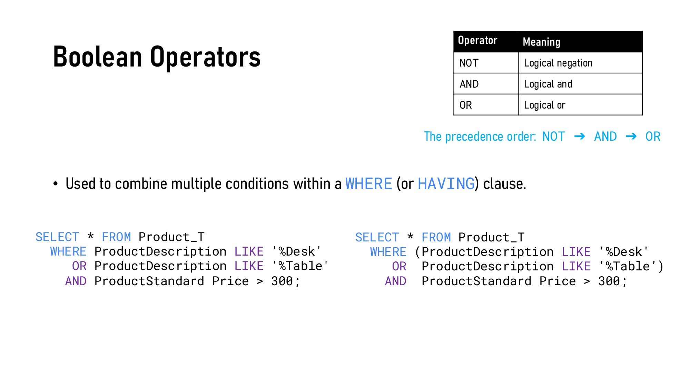

*同样三个条件，有没有括号，结果不一样（Slide 31）*

**优先级：NOT → AND → OR**（AND 比 OR 先算，就像乘法比加法先算）。

| 写法                    | 实际含义                                            | 在 Product\_T 上的结果                                                                               |
| --------------------- | ----------------------------------------------- | ----------------------------------------------------------------------------------------------- |
| `A OR B AND C`（没括号）   | A OR (B AND C) = 所有 Desk，**加上**价格 > 300 的 Table | 5 行：Computer Desk 375、Writers Desk 325、8-Drawer Desk 750、Dining Table 800、**Computer Desk 250** |
| `(A OR B) AND C`（有括号） | Desk 或 Table，**并且**价格 > 300                     | 4 行：少了 **Computer Desk 250**                                                                    |

其中 A = `ProductDescription LIKE '%Desk'`，B = `LIKE '%Table'`，C = `ProductStandardPrice > 300`。

> **🧠 记忆口诀**
>
> AND 像乘、OR 像加：`A + B × C` 先算 `B × C`。拿不准就**加括号**。（课件里 `ProductStandard Price` 中间多了空格、右引号写成了 `’`，都是笔误。）

### 6.6 🔴 BETWEEN、IN、IS NULL（p.32–34）

```sql
WHERE ProductStandardPrice BETWEEN 200 AND 300;           -- 包含两端：等价于 >= 200 AND <= 300
WHERE ProductStandardPrice NOT BETWEEN 200 AND 300;       -- 范围之外
WHERE CustomerState IN ('FL', 'TX');                      -- 等价于 state = 'FL' OR state = 'TX'
WHERE CustomerState NOT IN ('FL', 'TX');
WHERE CustomerPostalCode IS NULL;                         -- 找缺失值
WHERE CustomerPostalCode IS NOT NULL;
```

> **⚠️ 踩坑提醒：NULL 不能用 = 判断**
>
> `WHERE CustomerPostalCode = NULL` **一行都查不出来**。NULL 表示「未知」，任何值和 NULL 比较（包括 NULL = NULL）结果都是「未知」，不是 true，所以这一行不会被留下。找缺失值只能用 **`IS NULL` / `IS NOT NULL`**。

> **🎯 考点**
>
> `BETWEEN 200 AND 300` **包含** 200 和 300（inclusive）。选择题常问：价格正好 300 的产品会不会出现？→ 会。

### 6.7 🟡 表达式与内置函数（p.35–36）

```sql
SELECT ProductID, ProductStandardPrice, ProductStandardPrice * 1.1 FROM Product_T;
-- 结果列标题默认就是表达式原文 "PRODUCTSTANDARDPRICE*1.1"

SELECT UPPER('product: ' || ProductID), ProductStandardPrice FROM Product_T;
-- || 是 Oracle 的字符串拼接：'product: ' || 1 → 'product: 1'，UPPER 再变成 'PRODUCT: 1'
```

| 类型      | 例子                                      |
| ------- | --------------------------------------- |
| 数学 / 聚合 | `MIN`、`MAX`、`COUNT`、`SUM`、`AVG`、`ROUND` |
| 字符串     | `LOWER`（转小写）、`UPPER`（转大写）               |
| 日期      | `NEXT_DAY`（下一个星期几）、`ADD_MONTHS`（加减若干个月） |
| 分析      | `TOP`（前 n 名，例如年销售额前 5 的客户）              |

> **➕ 课外补充**
>
> 课件把 `TOP` 列为分析函数，但 `TOP n` 其实是 SQL Server 的写法；Oracle 12c 以后用 `FETCH FIRST 5 ROWS ONLY`，旧版用 `ROWNUM`。概念一样：取前 n 名。

### 6.8 🔴 聚合函数（Aggregate Functions，p.37–38）

**聚合函数 = 把很多行算成一个汇总值**。

```sql
SELECT COUNT(*), AVG(ProductStandardPrice) FROM Product_T
 WHERE ProductStandardPrice < 275;          -- 结果一行：3 | 208.333

SELECT ProductID, COUNT(*) FROM Product_T;  -- ❌ 报错
```

> **🎯 考点：聚合函数和普通列不能混用**
>
> **SELECT 列表里不能同时出现聚合函数和没有聚合的普通列——除非那些普通列出现在 GROUP BY 里。**
>
> `SELECT ProductID, COUNT(*) FROM Product_T;` 为什么错？COUNT(\*) 把 8 行压成 1 个数，ProductID 却有 8 个值——结果只有一行，放哪个 ProductID？Oracle 报 `ORA-00937: not a single-group group function`。

| 规则（p.38）                                      | 例子                                                                     |
| --------------------------------------------- | ---------------------------------------------------------------------- |
| 大多数聚合函数**忽略 NULL**                            | `AVG(col)` 只对非空值求平均                                                    |
| **`COUNT(*)` ≠ `COUNT(col)`**（当 col 有 NULL 时） | `COUNT(*)` 数**行数**；`COUNT(col)` 只数 col **非空**的行                        |
| `COUNT`、`SUM`、`AVG` 支持 `DISTINCT`             | `SELECT COUNT(DISTINCT ProductID) FROM OrderLine_T;` = 被订过的**不同**产品有几种 |

> **💡 小白理解**
>
> 举例：10 个客户里有 2 个没填邮编。`COUNT(*)` = 10，`COUNT(CustomerPostalCode)` = 8。`AVG` 同理：如果 5 个产品里有 1 个价格为 NULL，`AVG(price)` 是**其余 4 个**的平均，不是除以 5。

### 6.9 🔴 列别名（Column Alias，p.39）

```sql
SELECT ProductID, ProductStandardPrice * 1.1 AS Plus10Percent FROM Product_T;
SELECT ProductID, ProductStandardPrice * 1.1 Plus10Percent FROM Product_T;   -- AS 可省略
```

- 作用：结果的列标题更好读。
- **列别名的 `AS` 可以省略**；（对比：**表别名在 Oracle 里不能加 AS**，见 7.2）
- **列别名不能在 WHERE 里用**，但**可以在 ORDER BY 里用**——原因见 6.12 的逻辑执行顺序。

### 6.10 🔴 ORDER BY（p.40）

```sql
SELECT CustomerName, CustomerState FROM Customer_T
 WHERE CustomerState IN ('FL', 'TX')
 ORDER BY CustomerState, CustomerName DESC;
```

- 多列排序**从左到右**：先按 State 升序；State 相同的，再按 Name **降序**。
- `ASC` 是默认值；`DESC` 只作用于**紧挨着它的那一列**（这里只有 CustomerName 是降序，CustomerState 仍是升序）。
- 结果：FL 的三家按名字倒序（Seminole Interiors → M & H Casual Furniture → Contemporary Casuals），然后 TX 的 Value Furniture。

### 6.11 🔴 GROUP BY 与 HAVING（p.41–42）

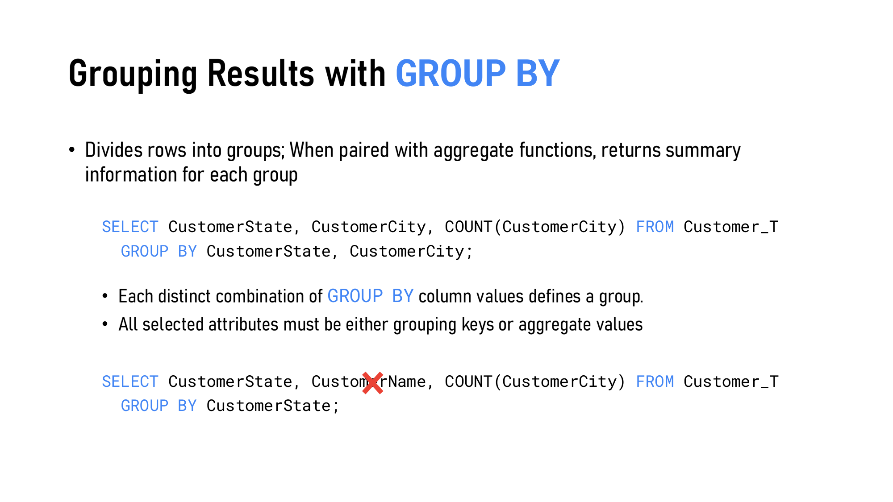

*GROUP BY：选出来的列必须是分组键或聚合值（课件用红叉标出了错误写法）（Slide 41）*

```sql
SELECT CustomerState, CustomerCity, COUNT(CustomerCity) FROM Customer_T
 GROUP BY CustomerState, CustomerCity;            -- ✅ 每个 (州, 城市) 组合一组

SELECT CustomerState, CustomerName, COUNT(CustomerCity) FROM Customer_T
 GROUP BY CustomerState;                          -- ❌ CustomerName 既不是分组键也不是聚合值

SELECT CustomerState, COUNT(CustomerState) FROM Customer_T
 GROUP BY CustomerState
HAVING COUNT(CustomerState) > 1;                  -- ✅ 只留客户数 > 1 的州：CA 2、FL 3、NJ 2
```

| 规则                                                                               | 解释                                    |
| -------------------------------------------------------------------------------- | ------------------------------------- |
| Each distinct combination of GROUP BY column values defines a group              | GROUP BY 多列时，**每种组合**是一组              |
| All selected attributes must be either **grouping keys** or **aggregate values** | SELECT 里的每一列，要么在 GROUP BY 里，要么被聚合函数包着 |
| HAVING filters **groups**, often with an aggregate                               | HAVING 筛**组**，条件里通常有聚合函数              |

> **🎯 考点：WHERE vs HAVING**
>
> |          | WHERE                | HAVING      |
> | -------- | -------------------- | ----------- |
> | 筛的对象     | **行**（分组之前）          | **组**（分组之后） |
> | 能不能用聚合函数 | ❌ 不能（这时候还没分组，没东西可聚合） | ✅ 可以，通常就是用它 |
> | 执行时机     | GROUP BY 之前          | GROUP BY 之后 |
>
> 「只统计佛州以外的客户，并且只显示客户数 > 1 的州」→ 州的条件放 WHERE，人数条件放 HAVING。`WHERE COUNT(*) > 1` 一定报错。

### 6.12 🔴🔴 逻辑执行顺序（Logical Processing Order，p.43）

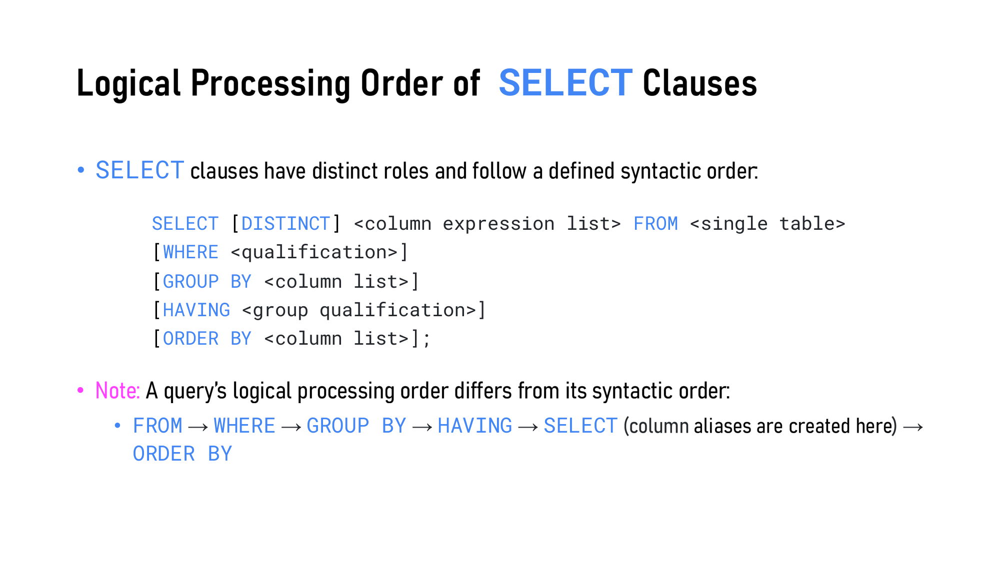

*写的顺序 ≠ 执行的顺序（Slide 43）*

|                     | 顺序                                                       |
| ------------------- | -------------------------------------------------------- |
| **写的顺序（syntactic）** | SELECT → FROM → WHERE → GROUP BY → HAVING → ORDER BY     |
| **执行的顺序（logical）**  | **FROM → WHERE → GROUP BY → HAVING → SELECT → ORDER BY** |

**列别名在 SELECT 这一步才产生**，这一条规则就能解释好几个考点：

- **WHERE 不能用列别名**：WHERE 在 SELECT 之前执行，那时别名还不存在
- **ORDER BY 可以用列别名**：ORDER BY 在 SELECT 之后
- **WHERE 不能用聚合函数**：WHERE 在 GROUP BY 之前，还没分组
- **HAVING 可以用聚合函数**：HAVING 在 GROUP BY 之后

> **🧠 记忆口诀**
>
> 执行顺序口诀：**「从哪来（FROM）→ 挑行（WHERE）→ 分组（GROUP BY）→ 挑组（HAVING）→ 挑列（SELECT）→ 排队（ORDER BY）」**。  
> 英文版：**F**ind **W**here **G**roups **H**ave **S**elected **O**rder。

下面的实验可以自己组合 WHERE / GROUP BY / HAVING / ORDER BY，然后**点 1 → 6 每一步，看那一刻的中间表**。预设里有课件的所有例子，包括两个会报错的写法（p.37、p.41），以及 p.31 有括号 / 没括号的对比：

*（网页版此处可以自己组合 WHERE / GROUP BY / HAVING / ORDER BY，并逐步查看每个子句执行后的中间表；下面是预设查询的结果）*

**p.40 WHERE IN + ORDER BY**

```sql
SELECT CustomerName, CustomerState
  FROM Customer_T
 WHERE CustomerState IN ('FL', 'TX')
 ORDER BY CustomerState, CustomerName DESC;
```

执行顺序：FROM（15 行） → WHERE（4 行） → SELECT（4 行） → ORDER BY（4 行）

| CustomerName           | CustomerState |
| ---------------------- | ------------- |
| Seminole Interiors     | FL            |
| M & H Casual Furniture | FL            |
| Contemporary Casuals   | FL            |
| Value Furniture        | TX            |

**p.42 GROUP BY + HAVING**

```sql
SELECT CustomerState, COUNT(*)
  FROM Customer_T
 GROUP BY CustomerState
HAVING COUNT(*) > 1;
```

执行顺序：FROM（15 行） → GROUP BY（15 行） → HAVING（3 组） → SELECT（3 行）

| CustomerState | COUNT(\*) |
| ------------- | --------- |
| CA            | 2         |
| FL            | 3         |
| NJ            | 2         |

**p.37 聚合（无 GROUP BY）**

```sql
SELECT COUNT(*), AVG(ProductStandardPrice) AS AvgPrice
  FROM Product_T
 WHERE ProductStandardPrice < 275;
```

执行顺序：FROM（8 行） → WHERE（3 行） → GROUP BY（3 行） → SELECT（1 行）

| COUNT(\*) | AvgPrice |
| --------- | -------- |
| 3         | 208.333  |

**p.31 没括号**

```sql
SELECT ProductDescription, ProductStandardPrice
  FROM Product_T
 WHERE ProductDescription LIKE '%Desk' OR ProductDescription LIKE '%Table' AND ProductStandardPrice > 300;
```

执行顺序：FROM（8 行） → WHERE（5 行） → SELECT（5 行）

| ProductDescription | ProductStandardPrice |
| ------------------ | -------------------- |
| Computer Desk      | 375                  |
| Writers Desk       | 325                  |
| 8-Drawer Desk      | 750                  |
| Dining Table       | 800                  |
| Computer Desk      | 250                  |

**p.31 有括号**

```sql
SELECT ProductDescription, ProductStandardPrice
  FROM Product_T
 WHERE (ProductDescription LIKE '%Desk' OR ProductDescription LIKE '%Table') AND ProductStandardPrice > 300;
```

执行顺序：FROM（8 行） → WHERE（4 行） → SELECT（4 行）

| ProductDescription | ProductStandardPrice |
| ------------------ | -------------------- |
| Computer Desk      | 375                  |
| Writers Desk       | 325                  |
| 8-Drawer Desk      | 750                  |
| Dining Table       | 800                  |

**别名用在 ORDER BY**

```sql
SELECT ProductLineID, COUNT(*), AVG(ProductStandardPrice) AS AvgPrice
  FROM Product_T
 GROUP BY ProductLineID
HAVING AVG(ProductStandardPrice) > 300
 ORDER BY AvgPrice DESC;
```

执行顺序：FROM（8 行） → GROUP BY（8 行） → HAVING（2 组） → SELECT（2 行） → ORDER BY（2 行）

| ProductLineID | COUNT(\*) | AvgPrice |
| ------------- | --------- | -------- |
| 2             | 4         | 531.25   |
| 3             | 2         | 450      |

**✗ p.41 非分组列**

```sql
SELECT CustomerState, CustomerName, COUNT(*)
  FROM Customer_T
 GROUP BY CustomerState;
```

执行顺序：FROM（15 行） → SELECT ✗

**ORA-00979：**not a GROUP BY expression —— CustomerName 既不是分组键也不是聚合值。一个组里有好几行，它该显示哪一行的值？

**✗ p.37 聚合混普通列**

```sql
SELECT ProductID, COUNT(*)
  FROM Product_T;
```

执行顺序：FROM（8 行） → SELECT ✗

**ORA-00937：**not a single-group group function —— 有聚合函数就只剩一行汇总，ProductID 却有 8 个值，没法放进同一行。

**DISTINCT**

```sql
SELECT DISTINCT CustomerState
  FROM Customer_T;
```

执行顺序：FROM（15 行） → SELECT（11 行）

| CustomerState |
| ------------- |
| FL            |
| TX            |
| NY            |
| NJ            |
| CA            |
| CO            |
| WA            |
| MI            |
| PA            |
| HI            |
| UT            |

---

## 7. 🔴 多表查询：JOIN

### 7.1 为什么能连接（p.44）

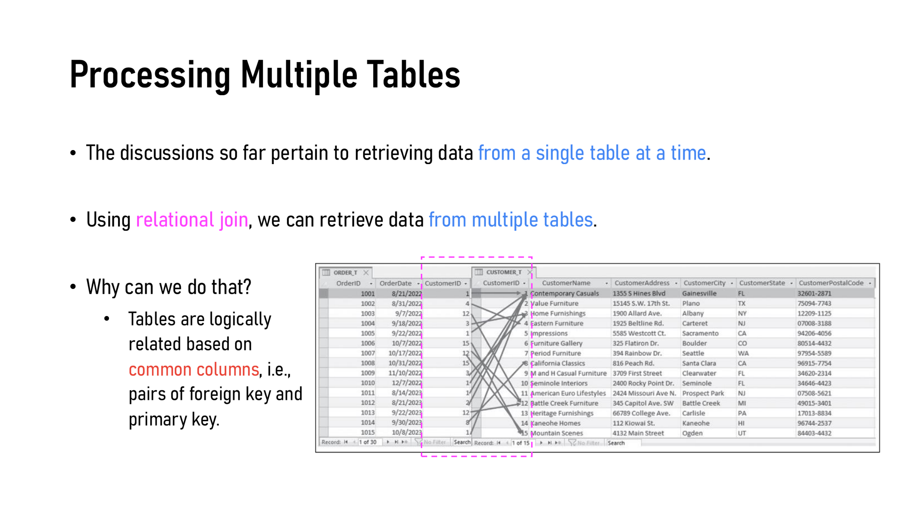

*Order\_T 和 Customer\_T 通过共同列 CustomerID 相连（Slide 44）*

表之间靠**共同列**逻辑相连，也就是**外键–主键对**（第 4 周映射时放进去的外键，这里派上用场）。

### 7.2 JOIN … ON 与表别名（p.45–46）

```sql
SELECT Customer_T.CustomerID, CustomerName, OrderID
  FROM Customer_T
  JOIN Order_T
    ON Customer_T.CustomerID = Order_T.CustomerID;
```

| 课件原文                                                                                          | 解释                                                                                                     |
| --------------------------------------------------------------------------------------------- | ------------------------------------------------------------------------------------------------------ |
| **JOIN** specifies which two tables to combine; **ON** specifies how rows match               | JOIN 说连哪两张表，ON 说怎么配对（通常 PK = FK）                                                                       |
| Qualify a column with its table name when multiple tables contain a column with the same name | 两张表都有 CustomerID，所以必须写 `Customer_T.CustomerID`，否则报「列名不明确（ambiguous）」；CustomerName、OrderID 只有一张表有，不用加前缀 |

课件给的 Python 等价写法是**两层嵌套循环**：对每个 customer、对每个 order，CustomerID 相等就拼成一行输出——这就是第 1 周讲的 nested loop join。

```sql
SELECT A.CustomerID, B.CustomerID, CustomerName, OrderID
  FROM Customer_T A
  JOIN Order_T B
    ON A.CustomerID = B.CustomerID
 ORDER BY OrderID;
```

> **⚠️ 踩坑提醒**
>
> **Oracle 里表别名不能加 `AS`**：写 `FROM Customer_T A`，不能写 `FROM Customer_T AS A`（会报错）。列别名的 `AS` 则可加可不加。一旦给表起了别名，同一条语句里就要用别名来引用它。

### 7.3 🔴 外连接（Outer Joins，p.47–48）

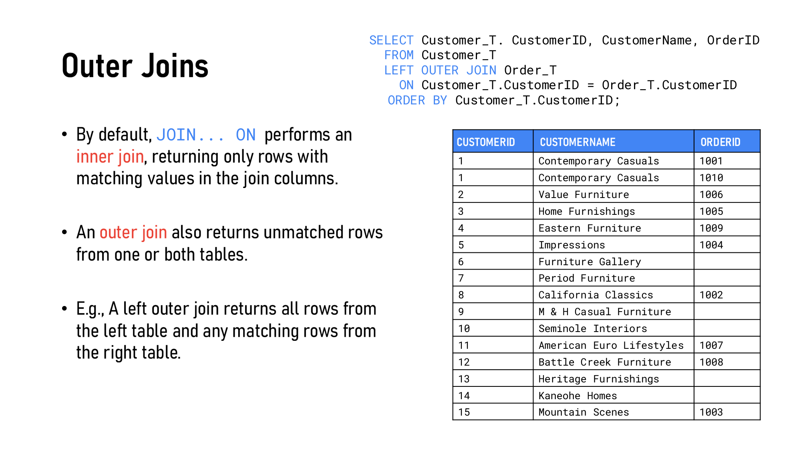

*LEFT OUTER JOIN：没有订单的客户也出现，OrderID 为空（Slide 47）*

- `JOIN … ON` 默认是 **inner join**：只返回**两边都匹配上**的行。
- **outer join** 还会返回**一边或两边匹配不上**的行，另一边的列补 **NULL**。

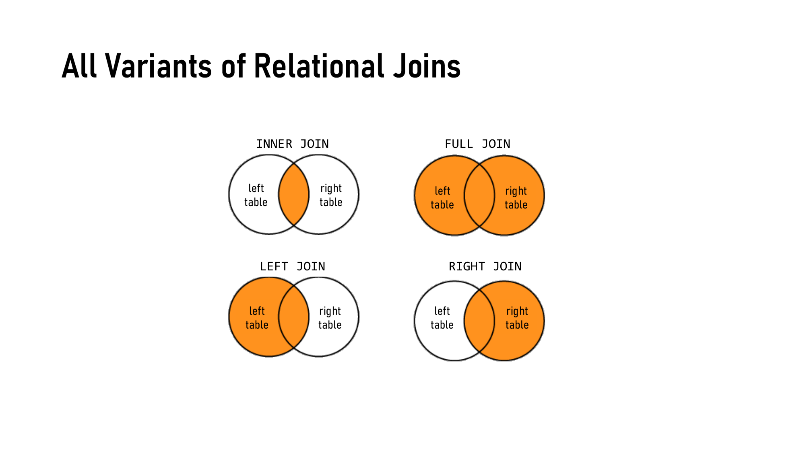

*四种 join 的维恩图（Slide 48）*

| Join                   | 返回                 | Customer\_T ⋈ Order\_T 的例子             |
| ---------------------- | ------------------ | -------------------------------------- |
| **INNER JOIN**         | 只有两边匹配的行           | 只有下过单的客户（10 行，6 个没下单的客户消失）             |
| **LEFT (OUTER) JOIN**  | 左表**全部**行 + 右表匹配的行 | 所有 15 位客户都出现，没下单的 OrderID = NULL（16 行） |
| **RIGHT (OUTER) JOIN** | 右表**全部**行 + 左表匹配的行 | 所有订单都出现；如果有订单没有客户，客户列 = NULL           |
| **FULL (OUTER) JOIN**  | 两边**全部**行          | 上面两种的并集                                |

> **🎯 考点**
>
> **「找出从没下过单的客户」**是 outer join 的经典题：
>
> ```sql
> SELECT C.CustomerID, CustomerName
>   FROM Customer_T C LEFT OUTER JOIN Order_T O
>     ON C.CustomerID = O.CustomerID
>  WHERE O.OrderID IS NULL;
> ```
>
> inner join 永远做不到这件事——它只能看见「有」的东西。

> **📌 注意**
>
> p.46 和 p.47 用的订单数据不完全一样（例如 1002 号订单在 p.46 属于客户 4，在 p.47 属于客户 8），是课件取自不同版本教材造成的。下面的实验统一用 p.47 的数据。

### 7.4 🟡 多表连接（p.49）

```sql
SELECT O.OrderID, OrderDate, OL.ProductID, P.ProductDescription,
       (OL.OrderedQuantity * P.ProductStandardPrice) AS LineTotal
  FROM Order_T O
  JOIN OrderLine_T OL ON O.OrderID = OL.OrderID
  JOIN Product_T P    ON OL.ProductID = P.ProductID
 WHERE O.OrderID = 1006;
```

| ORDERID | ORDERDATE  | PRODUCTID | PRODUCTDESCRIPTION   | LINETOTAL |
| ------- | ---------- | --------- | -------------------- | --------- |
| 1006    | 10/24/2024 | 4         | Entertainment Center | 650       |
| 1006    | 10/24/2024 | 5         | Writers Desk         | 650       |
| 1006    | 10/24/2024 | 7         | Dining Table         | 1,600     |

- 连 n 张表需要 **n − 1 个连接条件**（这里 3 张表 → 2 个 ON）。
- 通过 M:N 的**关联表** OrderLine\_T 把 Order 和 Product 串起来——这正是第 4 周 M:N 映射出一张新表的原因。
- LineTotal 核对：订单 1006 里产品 4 订了 1 件 × 650；产品 5 订了 2 件 × 325 = 650；产品 7 订了 2 件 × 800 = 1600。

### 7.5 🟡 自连接（Self-Join，p.50）

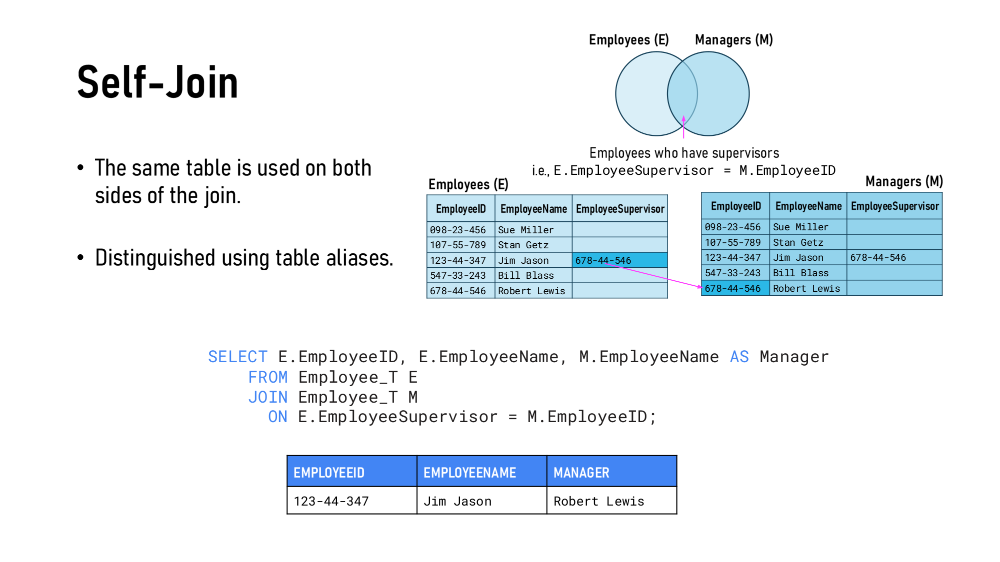

*同一张 Employee\_T 用两个别名：E 当员工，M 当上司（Slide 50）*

```sql
SELECT E.EmployeeID, E.EmployeeName, M.EmployeeName AS Manager
  FROM Employee_T E
  JOIN Employee_T M
    ON E.EmployeeSupervisor = M.EmployeeID;
```

- **同一张表出现在 join 两边**，必须用**表别名**区分。
- 这对应第 4 周的 **unary 1:M 关系**（员工 supervises 员工）映射出来的**递归外键** EmployeeSupervisor。
- 结果只有 1 行（Jim Jason → Robert Lewis），因为只有 Jim 填了上司；inner join 把没有上司的 4 个人去掉了。想列出**所有**员工（没上司的显示 NULL），要改成 `LEFT OUTER JOIN`。

下面的实验可以切换四种 join、加一张 CustomerID = NULL 的订单（让 RIGHT / FULL 有东西可显示），或者换成 self-join：

*（网页版此处可以切换四种 join、加一张 CustomerID 为 NULL 的订单、以及做 self-join；下面是同一套数据的结果）*

Customer\_T（15 位客户）⋈ Order\_T（10 张订单 + 1 张 CustomerID = NULL 的订单 1011）：

| Join             | 匹配行 | 左边独有（补 NULL） | 右边独有（补 NULL） | 结果行数   |
| ---------------- | --- | ------------ | ------------ | ------ |
| INNER JOIN       | 10  | 0            | 0            | **10** |
| LEFT OUTER JOIN  | 10  | 6            | 0            | **16** |
| RIGHT OUTER JOIN | 10  | 0            | 1            | **11** |
| FULL OUTER JOIN  | 10  | 6            | 1            | **17** |

**LEFT OUTER JOIN（p.47）**

| Customer\_T.CustomerID | CustomerName             | OrderID | Order\_T.CustomerID |
| ---------------------- | ------------------------ | ------- | ------------------- |
| 1                      | Contemporary Casuals     | 1001    | 1                   |
| 1                      | Contemporary Casuals     | 1010    | 1                   |
| 2                      | Value Furniture          | 1006    | 2                   |
| 3                      | Home Furnishings         | 1005    | 3                   |
| 4                      | Eastern Furniture        | 1009    | 4                   |
| 5                      | Impressions              | 1004    | 5                   |
| 6                      | Furniture Gallery        | NULL    | NULL                |
| 7                      | Period Furniture         | NULL    | NULL                |
| 8                      | California Classics      | 1002    | 8                   |
| 9                      | M & H Casual Furniture   | NULL    | NULL                |
| 10                     | Seminole Interiors       | NULL    | NULL                |
| 11                     | American Euro Lifestyles | 1007    | 11                  |
| 12                     | Battle Creek Furniture   | 1008    | 12                  |
| 13                     | Heritage Furnishings     | NULL    | NULL                |
| 14                     | Kaneohe Homes            | NULL    | NULL                |
| 15                     | Mountain Scenes          | 1003    | 15                  |

**Self-join（p.50）**

| E.EmployeeID | E.EmployeeName | E.EmployeeSupervisor | M.EmployeeID | M.EmployeeName AS Manager |
| ------------ | -------------- | -------------------- | ------------ | ------------------------- |
| 123-44-347   | Jim Jason      | 678-44-546           | 678-44-546   | Robert Lewis              |

### 7.6 带 JOIN 的 SELECT 执行顺序（p.51）

```sql
SELECT [DISTINCT] <col expressions> [AS <alias>]
FROM <table1> [<t1>] [LEFT | RIGHT | INNER | FULL] JOIN <table2> [<t2>]
  ON <table1>.<key> = <table2>.<key>
[WHERE …] [GROUP BY …] [HAVING …] [ORDER BY …] [ASC | DESC];
```

**先 FROM / JOIN**：把源表按 ON 条件拼成一张大表；**之后的子句和单表查询完全一样**（WHERE → GROUP BY → HAVING → SELECT → ORDER BY）。

> **⚠️ 踩坑提醒**
>
> LEFT JOIN 后面再写 `WHERE 右表.某列 = 值`，会把补了 NULL 的行又筛掉（NULL = 值 不成立），结果退化成 inner join。想「保留左表所有行，只匹配满足条件的右表行」，条件要写进 `ON` 里。

---

## 8. 🔴 DML：INSERT / UPDATE / DELETE（p.52–53）

```sql
-- 列出列名：可以换顺序，也可以省略可选列
INSERT INTO Product_T (ProductID, ProductStandardPrice, ProductDescription)
VALUES (1, 175, 'End Table');

-- 不列列名：必须按表定义的顺序给出所有列
INSERT INTO Product_T VALUES
  (1, 'End Table', 'Cherry', 175, 8),
  (2, 'Coffee Table', 'Natural Ash', 200.00, 2);

-- 用查询结果插入：目标表和源表的列要兼容且顺序一致
INSERT INTO FLCustomer_T
  SELECT * FROM Customer_T WHERE CustomerState = 'FL';

DELETE FROM Customer_T WHERE CustomerState = 'FL';   -- 删符合条件的行
DELETE FROM Customer_T;                              -- 删所有行（表还在！）

UPDATE Product_T
   SET ProductStandardPrice = 775
 WHERE ProductID = 7;
```

> **⚠️ 踩坑提醒**
>
> 1. **`UPDATE` / `DELETE` 忘写 `WHERE` = 改 / 删整张表**。这是现实中最常见的事故之一。
> 2. `INSERT` 没列出的列：有 `DEFAULT` 就用默认值，否则是 NULL；如果那列是 `NOT NULL` 又没有默认值，就报错。
> 3. 插入 / 删除受外键约束：往 Order\_T 插一张 CustomerID = 99 的订单（客户不存在）会违反 referential integrity；删除一个还有订单的客户也会被拒绝。
> 4. 一条 `INSERT … VALUES (…), (…)` 插多行是较新的语法（Oracle 23ai 起支持）；旧版 Oracle 要写多条 INSERT 或用 `INSERT ALL`。

> **➕ 课外补充：DELETE vs TRUNCATE vs DROP**
>
> | 命令                 | 类别  | 删什么          | 能加 WHERE | 能 ROLLBACK                |
> | ------------------ | --- | ------------ | -------- | ------------------------- |
> | `DELETE FROM t`    | DML | 行（可以部分删）     | ✅        | ✅                         |
> | `TRUNCATE TABLE t` | DDL | 所有行，保留结构     | ❌        | ❌                         |
> | `DROP TABLE t`     | DDL | 整张表（结构 + 数据） | ❌        | ❌（Oracle 有回收站可 FLASHBACK） |
>
> 课件没讲 TRUNCATE，但它常和 DELETE / DROP 一起出选择题。

---

## 🔴 综合速查表

| 英文 / 语法                        | 中文           | 一句话                                                  |
| ------------------------------ | ------------ | ---------------------------------------------------- |
| Declarative language           | 声明式语言        | 只说要什么（what），不说怎么做（how）                               |
| DDL                            | 数据定义语言       | `CREATE` / `ALTER` / `DROP`，动结构                      |
| DML                            | 数据操作语言       | `SELECT` / `INSERT` / `UPDATE` / `DELETE`，动数据        |
| DCL                            | 数据控制语言       | `GRANT` / `REVOKE`，管权限                               |
| TCL                            | 事务控制语言       | `COMMIT` / `ROLLBACK`                                |
| DQL                            | 数据查询语言       | 有时把 `SELECT` 单独归为这一类                                 |
| `NOT NULL`                     | 非空           | 主键必须非空（entity integrity）                             |
| `PRIMARY KEY (a, b)`           | 复合主键         | 一个约束、多列                                              |
| `FOREIGN KEY … REFERENCES`     | 外键           | referential integrity                                |
| `DEFAULT SYSDATE`              | 默认值          | 没给值时自动填当前日期                                          |
| `CHECK (col IN (…))`           | 检查约束         | domain constraint                                    |
| `WITH GRANT OPTION`            | 可转授          | 不能授给角色；撤销时连锁撤销                                       |
| Role                           | 角色           | 权限给角色，角色给人                                           |
| Least privilege                | 最小权限原则       | 只给必要权限                                               |
| `DISTINCT`                     | 去重           | 作用于所选列的整体组合                                          |
| `%` / `_`                      | 通配符          | 任意多个 / 恰好一个字符                                        |
| NOT → AND → OR                 | 布尔优先级        | AND 先于 OR                                            |
| `BETWEEN a AND b`              | 范围           | 包含两端                                                 |
| `IS NULL`                      | 判空           | 不能用 `= NULL`                                         |
| Aggregate function             | 聚合函数         | 多行 → 一个值；忽略 NULL（`COUNT(*)` 除外）                      |
| `COUNT(*)` vs `COUNT(col)`     | 行数 vs 非空值个数  | col 有 NULL 时不相等                                      |
| Column alias                   | 列别名          | `AS` 可省；WHERE 不能用，ORDER BY 能用                        |
| Table alias                    | 表别名          | Oracle 里不能加 `AS`                                     |
| `GROUP BY`                     | 分组           | SELECT 的列必须是分组键或聚合                                   |
| `HAVING`                       | 组筛选          | 分组后筛组，可用聚合                                           |
| Logical order                  | 逻辑执行顺序       | FROM → WHERE → GROUP BY → HAVING → SELECT → ORDER BY |
| Inner join                     | 内连接          | 只留匹配行                                                |
| Left / Right / Full outer join | 左 / 右 / 全外连接 | 保留一边 / 另一边 / 两边的全部行，缺的补 NULL                         |
| Self-join                      | 自连接          | 同一张表 + 两个别名（递归外键）                                    |

---

## 模拟自测题

**1. SQL is called a declarative language because:**

- A. It must be compiled before it runs
- B. The user specifies what result is wanted, and the DBMS decides how to compute it
- C. Every query must declare its variables first
- D. It can only be used to define table structures

> **答案：B**
>
> Declarative languages abstract the "HOW" away from the "WHAT"（p.7）。执行计划（先筛还是先连、用不用索引）由 query optimizer 决定。

**2. Which of the following is a DDL command?**

- A. SELECT
- B. UPDATE
- C. ALTER
- D. GRANT

> **答案：C**
>
> DDL = CREATE / ALTER / DROP（改结构）。SELECT、UPDATE 是 DML，GRANT 是 DCL。

**3. After running DELETE FROM Customer\_T; which statement is true?**

- A. The table and all its rows are removed
- B. All rows are removed but the table definition remains
- C. Only rows with NULL values are removed
- D. The statement fails because there is no WHERE clause

> **答案：B**
>
> DELETE 是 DML，只删行；表结构还在。删表要用 DROP TABLE（DDL）。

**4. In CREATE TABLE OrderLine\_T, how should the composite primary key be declared?**

- A. Two separate PRIMARY KEY constraints, one on OrderID and one on ProductID
- B. CONSTRAINT OrderLine\_PK PRIMARY KEY (OrderID, ProductID)
- C. PRIMARY KEY on OrderID and UNIQUE on ProductID
- D. Composite primary keys are not allowed in SQL

> **答案：B**
>
> 一张表只有一个主键，复合主键把多列写在同一个括号里（p.15）。

**5. Which clause implements a domain constraint that restricts ProductFinish to a fixed list of values?**

- A. DEFAULT
- B. CHECK (ProductFinish IN (...))
- C. FOREIGN KEY
- D. NOT NULL

> **答案：B**
>
> p.18：CHECK 限定取值范围 = domain constraint。DEFAULT 只是没给值时的默认值。

**6. Which statement about GRANT / REVOKE in Oracle is TRUE?**

- A. WITH GRANT OPTION can be used when granting an object privilege to a role
- B. Revoking a privilege granted WITH GRANT OPTION also revokes the privileges that user granted to others
- C. Revoking a role from a user keeps the privileges that came with the role
- D. GRANT uses FROM and REVOKE uses TO

> **答案：B**
>
> A 错：p.21 明确说不能对角色用 WITH GRANT OPTION；C 错：撤销角色 = 撤销它带来的全部权限；D 反了：GRANT … TO，REVOKE … FROM。

**7. SELECT DISTINCT CustomerName, CustomerCity FROM Customer\_T; removes rows that are duplicated in:**

- A. CustomerName only
- B. CustomerCity only
- C. The combination of CustomerName and CustomerCity
- D. Any column of Customer\_T

> **答案：C**
>
> DISTINCT 作用于所选列的整体组合（p.27）。

**8. Which WHERE clause returns products whose description ENDS with 'Desk'?**

- A. WHERE ProductDescription = '%Desk'
- B. WHERE ProductDescription LIKE 'Desk%'
- C. WHERE ProductDescription LIKE '%Desk'
- D. WHERE ProductDescription LIKE '\_Desk'

> **答案：C**
>
> % 放前面 = 前面可以是任何东西，所以是「以 Desk 结尾」。A 没用 LIKE，通配符不起作用；B 是「以 Desk 开头」；D 要求 Desk 前面恰好一个字符。

**9. WHERE ProductDescription LIKE '%Desk' OR ProductDescription LIKE '%Table' AND ProductStandardPrice > 300 — on Product\_T, is 'Computer Desk' priced 250 returned?**

- A. Yes, because AND is evaluated before OR
- B. No, because its price is not above 300
- C. No, because OR is evaluated before AND
- D. The query fails because parentheses are required

> **答案：A**
>
> 优先级 NOT → AND → OR，所以条件是 `Desk OR (Table AND 价格 > 300)`。Computer Desk 满足第一部分，价格不管多少都会返回。加上括号 `(Desk OR Table) AND 价格 > 300` 才会把它筛掉（p.31）。

**10. Which query correctly finds customers with no postal code?**

- A. WHERE CustomerPostalCode = NULL
- B. WHERE CustomerPostalCode IS NULL
- C. WHERE CustomerPostalCode = ''
- D. WHERE CustomerPostalCode LIKE NULL

> **答案：B**
>
> 任何值和 NULL 用 = 比较，结果都不是 true，所以 A 一行都查不到。必须用 IS NULL（p.34）。

**11. Column Bonus has values 100, NULL, 200, NULL. What do COUNT(\*), COUNT(Bonus) and AVG(Bonus) return?**

- A. 4, 4, 75
- B. 4, 2, 150
- C. 2, 2, 150
- D. 4, 2, 75

> **答案：B**
>
> COUNT(\*) 数行数 = 4；COUNT(Bonus) 只数非空 = 2；AVG 忽略 NULL = (100 + 200) / 2 = 150（p.38）。

**12. Why does SELECT ProductID, COUNT(\*) FROM Product\_T; fail?**

- A. COUNT(\*) cannot be used without WHERE
- B. ProductID is neither aggregated nor listed in a GROUP BY clause
- C. ProductID must be written as Product\_T.ProductID
- D. COUNT(\*) must be given an alias

> **答案：B**
>
> 聚合函数把 8 行压成 1 行，ProductID 却有 8 个值。SELECT 列表里不能混用聚合和非聚合列，除非非聚合列在 GROUP BY 里（p.37）。

**13. SELECT ProductStandardPrice \* 1.1 AS NewPrice FROM Product\_T WHERE NewPrice > 300; What happens?**

- A. Returns products whose new price exceeds 300
- B. Error: the alias NewPrice does not exist yet when WHERE is processed
- C. Returns all products because the alias is ignored
- D. Error: AS is not allowed for column aliases in Oracle

> **答案：B**
>
> 逻辑执行顺序中 WHERE 在 SELECT 之前，别名在 SELECT 才产生（p.39、p.43）。要写成 `WHERE ProductStandardPrice * 1.1 > 300`；ORDER BY 里则可以用别名。

**14. Which is the logical processing order of a SELECT statement?**

- A. SELECT, FROM, WHERE, GROUP BY, HAVING, ORDER BY
- B. FROM, WHERE, SELECT, GROUP BY, HAVING, ORDER BY
- C. FROM, WHERE, GROUP BY, HAVING, SELECT, ORDER BY
- D. FROM, GROUP BY, WHERE, HAVING, ORDER BY, SELECT

> **答案：C**
>
> A 是写的顺序（syntactic），不是执行顺序（p.43）。

**15. You need the states that have more than one customer. Where does the condition COUNT(\*) > 1 go?**

- A. WHERE
- B. HAVING
- C. ORDER BY
- D. SELECT

> **答案：B**
>
> 条件里有聚合函数、筛的是「组」→ HAVING。WHERE 在分组之前执行，不能用聚合函数（p.42）。

**16. Customer\_T has 15 customers; 9 of them have placed at least one order, and every order has a customer. Which join returns every customer, including those with no orders?**

- A. INNER JOIN Order\_T
- B. Customer\_T LEFT OUTER JOIN Order\_T
- C. Customer\_T RIGHT OUTER JOIN Order\_T
- D. None — a join always drops unmatched rows

> **答案：B**
>
> LEFT OUTER JOIN 保留左表（Customer\_T）全部行，没有订单的客户 OrderID 显示 NULL（p.47）。RIGHT JOIN 保留的是 Order\_T 全部行；由于每张订单都有客户，它的结果和 INNER JOIN 一样。

**17. Which FROM clause is valid in Oracle?**

- A. FROM Customer\_T AS C JOIN Order\_T AS O
- B. FROM Customer\_T C JOIN Order\_T O
- C. FROM C = Customer\_T JOIN O = Order\_T
- D. FROM Customer\_T(C) JOIN Order\_T(O)

> **答案：B**
>
> Oracle 的表别名不能加 AS（p.46）。列别名的 AS 可以加。

**18. A self-join is typically used to query which kind of relationship?**

- A. A ternary relationship
- B. A unary (recursive) relationship such as employee–supervisor
- C. A supertype/subtype relationship
- D. A many-to-many relationship between two different entities

> **答案：B**
>
> 自连接 = 同一张表用两个别名，处理第 4 周映射出的递归外键（EmployeeSupervisor → EmployeeID，p.50）。

**19. 写 SQL：列出每个产品线（ProductLineID）的产品数和平均价格，只显示平均价格高于 300 的产品线，按平均价格从高到低排序。**

> ```sql
> SELECT ProductLineID, COUNT(*), AVG(ProductStandardPrice) AS AvgPrice
>   FROM Product_T
>  GROUP BY ProductLineID
> HAVING AVG(ProductStandardPrice) > 300
>  ORDER BY AvgPrice DESC;
> ```
>
> **我的解答**（用 p.11 的 Product\_T 数据推算）：产品线 2 有 4 个产品、平均 531.25；产品线 3 有 2 个、平均 450；产品线 1 的平均是 250，被 HAVING 筛掉。注意 HAVING 里要写完整的 `AVG(ProductStandardPrice)`，不能用别名 AvgPrice（HAVING 在 SELECT 之前执行）；ORDER BY 里可以用别名。上面 SqlPipelineLab 的「别名用在 ORDER BY」预设就是这道题，可以逐步看。

**20. 写 SQL：列出所有从没下过订单的客户的 ID 和名字。**

> ```sql
> SELECT C.CustomerID, C.CustomerName
>   FROM Customer_T C
>   LEFT OUTER JOIN Order_T O
>     ON C.CustomerID = O.CustomerID
>  WHERE O.OrderID IS NULL;
> ```
>
> **我的解答**：LEFT JOIN 保留所有客户，没下过单的客户 OrderID 被补成 NULL，再用 `IS NULL` 把他们挑出来。按 p.47 的数据结果是客户 6、7、9、10、13、14。表别名不加 AS；判空用 IS NULL，不能用 `= NULL`。

**21. 写出建 Order\_T 的 CREATE TABLE 语句：OrderID 为主键，OrderDate 默认今天，CustomerID 引用 Customer\_T。为什么 CustomerID 没有 NOT NULL？**

> ```sql
> CREATE TABLE Order_T (
>        OrderID     NUMBER(11,0)  NOT NULL,
>        OrderDate   DATE DEFAULT SYSDATE,
>        CustomerID  NUMBER(11,0),
> CONSTRAINT Order_PK PRIMARY KEY (OrderID),
> CONSTRAINT Order_FK FOREIGN KEY (CustomerID) REFERENCES Customer_T(CustomerID));
> ```
>
> 这是课件 p.17 的原题。CustomerID 是外键，外键允许为空（只要非空时能在 Customer\_T 里找到对应的客户，就不违反 referential integrity）。允许为空的前提是业务上这层关系是 optional 的；如果规定每张订单都必须有客户，就应该加上 NOT NULL。
