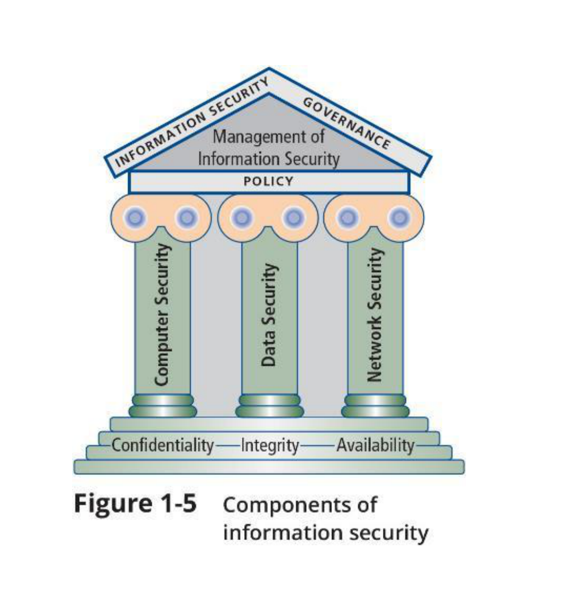
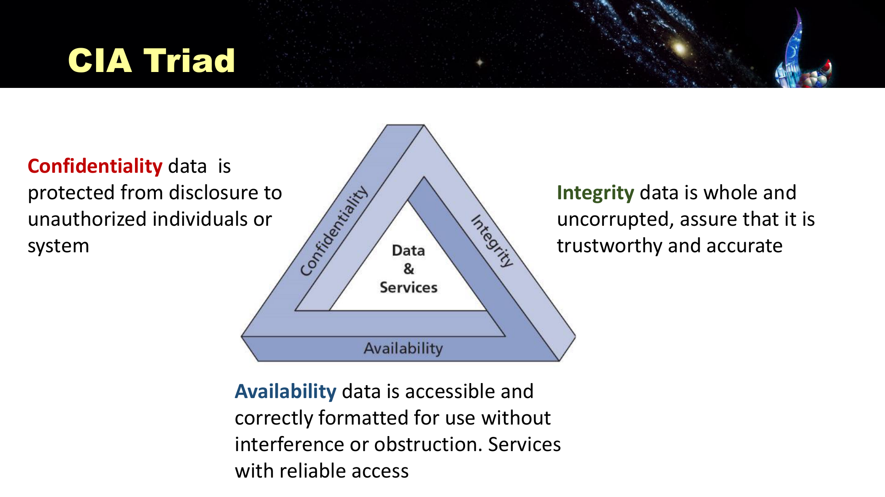
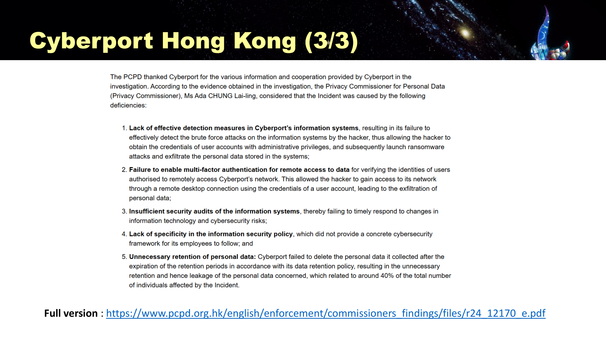
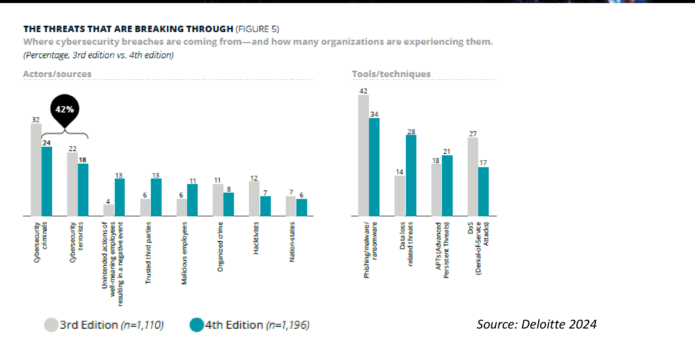
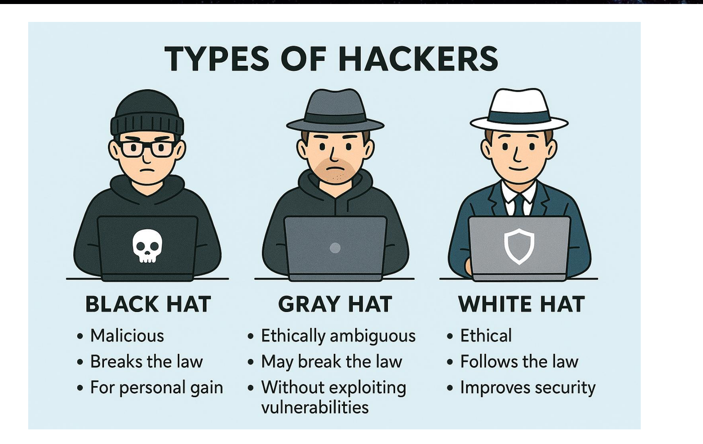
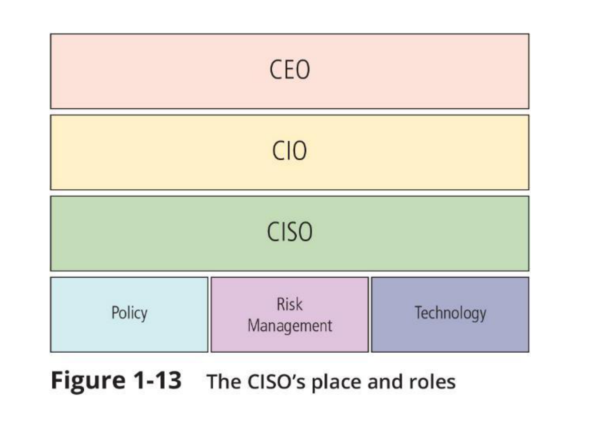
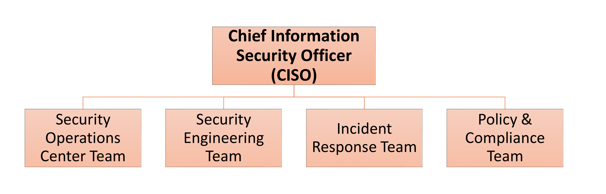

---
title:
  en: "Final Review L1 · Trust, Threat Actors & CIA"
  zh: "期末复习 L1 · 数字信任、威胁行为者与 CIA"
summary:
  en: "Lesson 1 for the final: slide definitions, what to understand and likely questions for trust in the digital economy, the InfoSec temple, CIA, incident trends, the Cyberport and Arup cases, threat actors, hacker hats, government roles and the CISO."
  zh: "第 1 课期末版：数字经济的信任、信息安全神庙、CIA、事故趋势、Cyberport 与 Arup 案例、威胁行为者、黑白灰帽、政府角色、CISO——每个点给课件原文、需要理解的逻辑和可能的问法。"
week: 1
date: 2026-10-08
tags: [FinalReview, CIA Triad, Threat Actors, CISO, Cyberport]
---
# 期末复习 L1 · 数字信任、威胁行为者与 CIA

**课件**：Lesson 1（60 页）　**详细笔记**：[第 1 课复习笔记](../../lectures/lesson-01/)　**总览**：[期末总复习](../final-review/)

> **怎么读这一页**：每个知识点都按同一个格式写——**课件原文**（定义、清单，考试最可能照抄的英文）→ **需要理解**（背后的逻辑，答题时要说出来的「为什么」）→ **可能的问法**（点开看参考答案）。
>
> 标题里的优先级：🔴 必考核心 · 🟡 需要理解 · 🟢 了解即可
>
> 标题里的**掌握要求**，指的是考试会怎么考这个点：
>
> - 📝 **默写**：能把名字、定义、清单原样写出来。对应「List…」「Define…」这类简答和填空。
> - 🔍 **区分**：给一个场景或几个相似选项，能判断是哪一个。对应选择题，例如「defacement 违反 CIA 哪一项」。
> - 🧮 **计算**：能用计算器算出来（这一课没有）。
> - ✍️ **分析**：能用课上的框架写一段有结构的论述。对应长题和「Explain why…」「Evaluate…」。

> **🎯 这一课在期末怎么考**
>
> - **老师的范围**：Lesson 1 讲的「新兴风险」和**第三方风险**被点名。
> - **Assignment 1 用到的 L1 内容**：选择题考 WEF 复杂性（EXCEPT 题）；简答考「CSTCB 与 Digital Policy Office 的 5 项作用」；长题考「Classify the type(s) of Cyber Adversaries with rationale」。
> - **课件末尾 3 道原题**：帽子分类、CIA（defacement）、Snowden 属于哪类威胁行为者。
> - 这一课是全课的**总论**，长题里「对手分类」「CIA 影响」「技术 vs 管理控制」这三个框架都来自这里。

## 本课大纲

- **[1. 为什么要管安全](#1-为什么要管安全)**
  - [1.1 🔴 数字经济需要信任（p.6）📝✍️](#11--数字经济需要信任p6️)
  - [1.2 🔴 Components of Information Security（信息安全的构成，p.7）📝](#12--components-of-information-security信息安全的构成p7)
  - [1.3 🔴 CIA Triad（p.52）📝🔍](#13--cia-triadp52)
  - [1.4 🟡 安全管理的四条原则（p.53–55）📝✍️](#14--安全管理的四条原则p5355️)
- **[2. 威胁形势与案例](#2-威胁形势与案例)**
  - [2.1 🟡 安全事故趋势（p.9–12）📝](#21--安全事故趋势p912)
  - [2.2 🔴 Cyberport 数据泄露（2023，p.14–16）✍️](#22--cyberport-数据泄露2023p1416️)
  - [2.3 🔴 Arup Deepfake 诈骗（2024，p.17）🔍✍️](#23--arup-deepfake-诈骗2024p17️)
  - [2.4 🟡 供应链攻击与 AI 公司被黑（p.19–20）🔍](#24--供应链攻击与-ai-公司被黑p1920)
  - [2.5 🟢 Ensign 2025 五大趋势（p.18）📝](#25--ensign-2025-五大趋势p18)
  - [2.6 🟡 网络空间的复杂性（WEF，p.30–31）📝🔍](#26--网络空间的复杂性wefp3031)
- **[3. 谁在攻击](#3-谁在攻击)**
  - [3.1 🔴 对手的四个分类维度（p.22）📝✍️](#31--对手的四个分类维度p22️)
  - [3.2 🔴 六类威胁行为者（p.23–24）📝🔍✍️](#32--六类威胁行为者p2324️)
  - [3.3 🔴 威胁分布（Deloitte 2024，p.25）✍️](#33--威胁分布deloitte-2024p25️)
  - [3.4 🔴 Black / Gray / White Hat（p.26）🔍](#34--black--gray--white-hatp26)
- **[4. 谁来防](#4-谁来防)**
  - [4.1 🔴 政府角色：Prevention + Detection + Recovery（p.27–35）📝✍️](#41--政府角色prevention--detection--recoveryp2735️)
  - [4.2 🟡 企业准备度（p.37–40）📝](#42--企业准备度p3740)
  - [4.3 🟢 损失（p.42–43）📝](#43--损失p4243)
  - [4.4 🟡 人才需求（p.45–47）📝](#44--人才需求p4547)
  - [4.5 🔴 CISO 的位置与角色（p.48）📝✍️](#45--ciso-的位置与角色p48️)
  - [4.6 🔴 安全团队四个 Key Functions（p.50）📝](#46--安全团队四个-key-functionsp50)
  - [4.7 🟢 CISO 影响力（Deloitte pre-reading，p.49）📝](#47--ciso-影响力deloitte-pre-readingp49)
- **[5. 课件原题（p.58–60）](#5-课件原题p5860)**
- **[6. 本课综合题（长题练习）](#6-本课综合题长题练习)**

---

## 1. 为什么要管安全

### 1.1 🔴 数字经济需要信任（p.6）📝✍️

**课件原文**

> In US, the digital economy reach **US$5 trillion** and accounted **18% of the US GDP in 2025** (Harvard Business Studies).  
> Internet Retailers / Marketplace market capital valuation **far exceed** traditional Retailers.  
> **Significant** of consumers (individual) personal data & behavior are captured.

**需要理解**

- 三句话是三个层次：**规模**（数字经济已占美国 GDP 18%）→ **结构**（市值重心已经从传统零售转到 Amazon、Alibaba 这类平台）→ **风险**（平台掌握海量个人数据）。
- 结论：一旦数据出事，受损的是**整个商业模式赖以运转的信任**，而不是某个 IT 部门的问题。这是全课「安全是管理问题」的出发点。
- 18% 是**占 GDP 的比重**，不是增长率。

**可能的问法**

**Why does the digital economy entail trust?（简答，约 3 点）**

> ① 规模：美国数字经济 2025 年达 US$5T，占 GDP 18%，不是边缘业务；② 结构：互联网平台市值远超传统零售，经济重心已在数字侧；③ 风险：平台采集大量个人数据和行为，一旦泄露，损失的是用户对整个模式的信任。只说「网购需要信任」拿不到分。

### 1.2 🔴 Components of Information Security（信息安全的构成，p.7）📝

*教材 Figure 1-5：地基 CIA → 三根柱 → Policy 横梁 → Management / Governance 屋顶（Slide 7）*

**课件原文**（全在图里）

| 层   | 内容                                                                            |
| --- | ----------------------------------------------------------------------------- |
| 地基  | **Confidentiality · Integrity · Availability**                                |
| 三根柱 | **Computer Security · Data Security · Network Security**                      |
| 横梁  | **Policy**                                                                    |
| 屋顶  | **Management of Information Security**（两侧写 Information Security / Governance） |

**需要理解**

- **自下而上支撑，自上而下治理**：CIA 是衡量「安不安全」的尺子；三根柱是三个技术领域；Policy 把它们统一起来；最上层的管理与治理决定方向。
- 这门课主要教的是**屋顶和横梁**（管理、政策），不是柱子（技术细节）。
- 和 CIA Triad 那页的区别：这张图考**结构**（谁支撑谁），CIA Triad 考**定义**。

**可能的问法**

**What are the components of information security? Explain how they relate.**

> 按四层说：三个技术支柱 Computer / Data / Network Security，建立在 CIA 地基上，由 Policy 统一，并由 Management / Governance 统领。关系是 CIA 支撑技术领域，治理通过 Policy 自上而下约束技术。只列三根柱子只能拿一半分。

### 1.3 🔴 CIA Triad（p.52）📝🔍

*CIA Triad 三个定义（Slide 52）*

**课件原文**

|                     | 定义（照抄这个措辞）                                                                                                                    |
| ------------------- | ----------------------------------------------------------------------------------------------------------------------------- |
| **Confidentiality** | data is protected from **disclosure to unauthorized** individuals or system                                                   |
| **Integrity**       | data is **whole and uncorrupted**, assure that it is trustworthy and accurate                                                 |
| **Availability**    | data is **accessible** and correctly formatted for use **without interference or obstruction**. Services with reliable access |

**需要理解**

- 判别口诀：**看了 → C；改了 → I；打不开了 → A**。
- 典型对应：数据泄露、窃听 → C；网页篡改（defacement）、账目被改 → I；DDoS、勒索加密导致打不开 → A。
- **Nonrepudiation（不可抵赖）不属于 CIA**，是常见干扰项（它属于 L4 密码学的四个目标）。
- ⚠️ L3 讲 VPN 时说「VPN must accomplish CIA」，那里的 A 是 **Authentication**，不是 Availability。

**可能的问法**

**一家银行遭 DDoS，网银两小时无法登录，但没有数据泄露或被改。违反了 CIA 的哪一项？**

> **Availability**。服务打不开，没有「看」也没有「改」。

**勒索软件既加密了文件，又把数据放到泄露网站上。违反了 CIA 的哪几项？**

> **A**（文件被加密，无法使用）+ **C**（数据被公开）。这就是「双重勒索」同时打两项。

### 1.4 🟡 安全管理的四条原则（p.53–55）📝✍️

**课件原文**

1. It is impossible to obtain perfect information security — **it is a process, not a goal**.
2. Security is a constant **balancing act between usability and control**. Managers constantly make trade-offs to allow the organization to achieve both security and business objectives.
3. To achieve balance, the level of security must **allow reasonable access, yet protect against threats**.
4. Before developing an information security strategy, security leaders should **gather information about the current and the desired states** of the organization.

p.54 的三个引导问题：What is information security? / How has the concept of security changed over time? / What are the most critical characteristics of information to keep secure?（答案是 CIA）

p.55 Exercise：Mainframe、Standalone、Centralized、Proprietary、Local、Chip、System programming、Firm-driven 各自演变成什么，和安全有什么关系。

**需要理解**

- 安全不是越多越好：锁得越紧，业务越难做。管理者的任务是找平衡点，而且这个点会随威胁和业务变化移动，所以是**过程**。
- 技术演进的共同方向：**攻击面扩大、边界变模糊、攻击门槛降低** → 安全从「守住一台机器」变成「管理整个生态的风险」。

**可能的问法**

**Why is perfect information security impossible? Use the usability vs control trade-off to explain.**

> 安全水平和易用性天然冲突：控制越严，员工和客户越难使用，业务受损；控制越松，风险越高。管理者要找到「允许合理访问又能抵御威胁」的平衡点，而威胁和业务需求一直在变，这个点要不断重新评估，所以安全是过程不是目标。可以举例：每 5 分钟重新验证一次，安全但没人能工作。

**How has the concept of computer security changed over time?**

> 从 mainframe、独立设备、集中式、本地运行，演变为分布式、联网 / IoT、云和远程访问、平台生态。每一步都扩大了攻击面、模糊了边界、降低了攻击门槛（算力和 AI 让暴力破解和自动化攻击变得可行），所以安全从保护单台机器的物理安全，变成管理整个互联生态中的风险。

---

## 2. 威胁形势与案例

### 2.1 🟡 安全事故趋势（p.9–12）📝

**课件原文（关键数字）**

| 来源          | 数字                                                                              |
| ----------- | ------------------------------------------------------------------------------- |
| HKCERT 2024 | **12,536** 宗，YoY **+62%**；其中 Phishing 7,811                                     |
| HKCERT 2025 | **15,877** 宗，「**17% increase over a high base**」；Phishing +15%，**Malware ×3.6** |
| 2024 钓鱼目标行业 | 银行金融电子支付 23%、社媒即时通讯 22%、电商 21%（三者合计约 2/3，五大行业合计 82%）                            |
| 香港警方 2025   | 科技罪案 **31,571** 宗（Hacking 52、Ransomware 43）                                     |
| CSTCB       | 处理威胁情报 3,500 万条，约每天 96,000 条                                                    |

**需要理解**

- 三组数字口径不同：HKCERT 数「事故」，警方数「罪案」，CSTCB 数「情报信号」，不要混着比。
- 趋势题答四点：**方向**（持续上升，2024 起加速）、**结构**（钓鱼最多、恶意软件增长最快）、**目标**（金融、社媒、电商）、**代价**（罪案和损失同步上升）。

**Describe the trend of security incidents in Hong Kong.**

> 方向：持续上升，2024 年 12,536 宗（+62%），2025 年 15,877 宗再升 17% 创新高；结构：钓鱼是主力，恶意软件增长最快（3.6 倍）；目标：银行金融、社媒、电商是钓鱼最多的行业；代价：警方记录 31,571 宗科技罪案，损失同步攀升。

### 2.2 🔴 Cyberport 数据泄露（2023，p.14–16）✍️

*私隐专员认定 Cyberport 的五项缺失（Slide 16）*

**课件原文**

时间线：Aug 6 黑客利用**有管理员权限的用户账户**进入 → Aug 14 文件被勒索软件加密，重置所有密码 → Aug 17 收到勒索信（US$300,000，400 GB）→ Aug 18 通报 PCPD → Sept 5 勒索团伙 Trigona 公开出售样本。

**PCPD 认定的五项缺失**：

1. **Lack of effective detection measures**（没发现暴力破解攻击）
2. **Failure to enable multi-factor authentication** for remote access to data
3. **Insufficient security audits** of the information systems
4. **Lack of specificity in the information security policy**（没有可执行的框架）
5. **Unnecessary retention of personal data**（约 **40%** 受影响者本可完全避免）

**需要理解**

- 分两类答：**技术控制**缺失（检测、MFA）和**管理控制**缺失（审计、政策、数据保留）。只补技术，不补管理，事件会换个方式重演。
- 第 5 条最能体现「数据最小化」：不该留的数据本身就是风险。
- 通知客户的信一个多月后才发出，也是事件沟通的反面例子。
- 这个案例是**「MFA 主线」**的第一个例子（后面还有 Colonial 和 JLR）。

**可能的问法**

**What went wrong at Cyberport? Classify the failures into technical and management controls.**

> 技术控制：① 没有有效检测，未发现暴力破解；② 远程访问没开 MFA。管理控制：③ 安全审计不足；④ 安全政策不具体，员工没有可执行的框架；⑤ 不必要地保留个人数据，导致约 40% 受害者本可避免。结论：技术控制堵住具体漏洞，管理控制决定能不能持续发现问题、员工知不知道怎么做、暴露面有多大，两者都要补。

**If you were Cyberport's new CISO, what three measures would you implement first? Justify each.**

> ① 对所有远程访问和管理员账号强制 MFA（直接堵住入口）；② 部署检测与集中日志（IDPS + SIEM），能发现暴力破解和异常登录；③ 建立数据保留与删除政策并清理过期数据（缩小暴露面）。也可以答定期审计、把政策写成可执行的标准。每一条要说明对应了哪一项缺失。

### 2.3 🔴 Arup Deepfake 诈骗（2024，p.17）🔍✍️

**课件原文**：Arup 香港员工参加视频会议，会议中的「CFO」和其他同事全部是 deepfake，「Everyone present on the video calls except the victim was a fake representation of real people」，用的是公开的视频素材；损失 **HK$200 million**。

**需要理解**

- **没有任何系统被入侵**。防火墙、加密、访问控制都完好，被攻破的是**人的判断**。所以这是**社会工程 + AI** 的案例。
- 应对要两条线：**技术**（deepfake 检测）+ **管理**（大额转账的带外核实、双人审批、员工培训）。「打电话确认一下」这种老办法在 deepfake 面前本身就可能失效。

**Why could traditional technical controls not stop the Arup deepfake fraud? How should organisations respond?**

> 传统控制保护的是系统和数据，而这次攻击利用的是员工在自己权限内「合法」执行转账，系统没有异常可查。应对：对高风险请求（转账、改收款账户）用独立渠道回拨核实；设双人审批和金额阈值；做 deepfake 场景的培训和演练；技术上可以加 deepfake 检测作为辅助。

### 2.4 🟡 供应链攻击与 AI 公司被黑（p.19–20）🔍

**课件原文**

- **医管局**：一家**承包商**导致 56,000+ 名患者资料外泄；医管局**暂停所有承包商访问患者数据**（2026 年 4 月）。
- **Canvas**：全球泄露，香港教育机构 **72,571** 名师生受影响（2026 年 5 月）。
- **OpenAI hack**（BBC）：「Warning shot or publicity stunt」——AI 公司本身也会被攻破。

**需要理解**

- 「第三方平台泄露了我们的数据」= **supply chain / third-party risk**，不是「我们自己被黑」。
- 这是老师期末点名的主题，和 L2 的 SolarWinds、HKMA 四条建议连起来答（见 [L2 复习](../final-l2/)）。

**A university's data is leaked because its third-party learning platform was breached. What type of risk is this, and what should the university have done?**

> 第三方 / 供应链风险。应做：选择供应商前评估其安全能力；合同写明安全要求、事件通报时限和审计权；按最小权限给供应商访问；持续监控供应商的风险；准备供应商失效的应急方案。医管局事后暂停所有承包商访问，就是事后补做「最小权限」。

### 2.5 🟢 Ensign 2025 五大趋势（p.18）📝

**课件原文**（趋势 → 建议）

1. **Ransomware** experimentation and consolidation → 多层防御，例如 **Zero Trust Architecture**
2. **State-sponsored** threat groups create effects for geopolitical leverage → 与主管当局协作、集体防御
3. Incident frequency rises due to **technology complexity** → 威胁情报驱动的漏洞优先级排序、虚拟补丁
4. **Complex cyber supply chains** elevate supply chain compromise risks → 盘点硬件、软件、供应商，主动监控
5. **Accelerated AI adoption** without security solutions → **UEBA**、收紧身份访问控制、数据分级

口诀：**勒索、国家、复杂、供应链、AI**。

### 2.6 🟡 网络空间的复杂性（WEF，p.30–31）📝🔍

**课件原文**

- WEF Global Cybersecurity Outlook 2025 的六个因素：**Cyber skills gap、AI and emerging tech、Regulatory requirements、Supply chain interdependencies、Cybercrime sophistication、Geopolitical tensions** → 「Making it extremely challenging to manage the risk」
- **Cyber Inequality Gap has widened**：Large vs Small Organization；Developed vs Emerging Economies
- 三大挑战：**Hyperconnectivity**（IT、OT、云、供应链互联，「**Attackers exploit connections, not just systems**」）；**Geopolitics & Fragmentation**；**AI Acceleration**（更快、可规模化，降低攻击门槛）

**需要理解**

- A1 的选择题考过 EXCEPT 题（「War between countries」不在六项里，是 Geopolitical tensions）。注意原文措辞。
- 不平等鸿沟是安全问题：供应链把大小公司连在一起，小公司的弱点会变成大公司的风险。

**Per the WEF report, which of the following is NOT a factor contributing to complexity in cybersecurity: skills gap / geopolitical tensions / regulatory requirements / war between countries?**

> **War between countries**。六项是 skills gap、AI and emerging tech、regulatory requirements、supply chain interdependencies、cybercrime sophistication、geopolitical tensions。

---

## 3. 谁在攻击

### 3.1 🔴 对手的四个分类维度（p.22）📝✍️

**课件原文**：Classification of Adversaries — **A. Internal Vs External**；**B. Level of sophistication**；**C. Access to resources**；**D. Motivation / Intent**

**需要理解**

- 这四个维度是**长题「classify the adversary」的答题骨架**。先逐个维度分析，再落到下面六类中的某一类。
- 一个人可以同时属于两类，因为维度是独立的：Snowden 按「在哪」是 Insider，按「为什么」是 Hacktivist。

### 3.2 🔴 六类威胁行为者（p.23–24）📝🔍✍️

**课件原文**

| 类型                      | Motivation                                                 | Tactics                                                                                        |
| ----------------------- | ---------------------------------------------------------- | ---------------------------------------------------------------------------------------------- |
| **Script Kiddie**       | Thrill, recognition, or mischief                           | Pre-built tools without deep technical knowledge; search for vulnerable victims（**NO target**） |
| **Hacktivist**          | Disagree with a company's policies or **political causes** | **Website defacement**, DDoS attacks, data leaks                                               |
| **Criminal Syndicates** | **Illegal financial gain**                                 | **Want low attention**; ransomware, phishing, credit card fraud, data theft                    |
| **Nation-State Actors** | **Espionage**, political disruption, military advantage    | **APTs**, zero-day attacks                                                                     |
| **Insider Threat**      | Revenge, financial gain or **negligence**                  | Data theft, sabotage, unauthorized access                                                      |
| **Cyber Terrorists**    | **Fear, disruption, or destruction**                       | **Infrastructure attacks**, misinformation, psychological warfare                              |

口诀：**小子闹、黑客抗、集团贪、国家谍、内鬼怨、恐怖惧**。

**需要理解（选择题最爱考的点）**

- **Script Kiddie 没有特定目标**，扫全网找弱的。所以「我们公司小，不会被盯上」是错的。
- **Criminal Syndicate 想要低调**，和 Hacktivist 恰好相反（Hacktivist 要的是被看见）。
- **Insider 包括疏忽**，员工发错邮件也算。
- **Hacktivist vs Cyber Terrorist**：前者传达观点，后者制造恐惧。
- **APT 是手法，不是一类人**。

*（网页版此处是「这是哪种 Threat Actor」的点选练习，部分题目要选两项；下表是全部题目和答案）*

| 场景                                                              | 属于                              | 理由                                                                                                                                                           |
| --------------------------------------------------------------- | ------------------------------- | ------------------------------------------------------------------------------------------------------------------------------------------------------------ |
| 一名员工不小心把含客户资料的表格转发给了外部邮箱，事后才发现收件人不对。                            | **Insider Threat**              | Insider Threat 的动机包含 revenge、financial gain \*\*或 negligence（疏忽）\*\*——这名员工没有恶意，纯粹是失误，但因为他本来就拥有合法访问权限，依然算 Insider。                                            |
| 一个犯罪团伙对医院系统部署勒索软件，索要比特币赎金，并刻意避免任何会引来媒体关注的举动。                    | **Criminal Syndicate**          | 动机是 illegal financial gain（为了钱），手法是 ransomware，且 \*\*"want low attention"\*\*——越低调越好赚，正是 Criminal Syndicate 的典型画像。                                           |
| 一群人入侵某公司官网首页，把内容替换成抗议该公司环保政策的标语。                                | **Hacktivist**                  | 动机是 disagree with a company's policies（不满某项政策），手法是 \*\*website defacement\*\*——教科书式的 Hacktivist。                                                             |
| 某国的网络部队潜伏进另一国的电网控制系统三年，期间没有采取任何破坏动作，只是持续收集情报。                   | **Nation-State Actor**          | 动机是 espionage / political disruption，手法是 \*\*Advanced Persistent Threat（长期潜伏）\*\*——APT 正是 Nation-State Actor 的标志性手法。                                         |
| 一名 14 岁少年下载了网上现成的 DDoS 工具，随便找了个游戏服务器打，只是想看看自己能不能打得动。            | **Script Kiddie**               | 动机是 thrill/mischief（图刺激），使用的是 \*\*pre-built tools without deep technical knowledge\*\*，而且没有特定目标（NO target）——典型 Script Kiddie。                                |
| 一个组织袭击城市供水系统的控制设施，目的是制造大范围恐慌，让市民对基础设施失去信心。                      | **Cyber Terrorist**             | 动机是 fear、disruption、destruction 本身，手法是 \*\*infrastructure attacks\*\*——不是为了钱也不是为了传达政治诉求，单纯要制造恐惧，是 Cyber Terrorist。                                           |
| Edward Snowden 是一名政府合同工，他把敏感的政府文件披露给记者，理由是揭发他认为不道德的活动。（本题选 2 项） | **Insider Threat + Hacktivist** | 他是 \*\*政府合同工\*\*，本身拥有合法访问权限 → \*\*Insider\*\*；他的动机是揭发不道德行为（理念/道德立场）、手法是数据泄露 → \*\*Hacktivist\*\*。这两个答案来自两条不同的分类维度：Insider 讲的是「他在哪」，Hacktivist 讲的是「他为什么」，不矛盾。 |

**可能的问法**

**一个勒索团伙入侵工厂、加密系统并要求比特币赎金，还把数据挂到泄露网站。用四个维度分类这个对手。**

> External（从外部入侵）；技术水平中到高（能横向移动、加密、外传）；资源充足、常有分工（RaaS）；动机是钱 → **Criminal Syndicate**。不是 Hacktivist（没有政治诉求），不是 Nation-state（目标是钱不是情报）。如果入口是被骗的员工，可以补一句：员工本身不是 Insider threat 的「恶意」类，但属于被社会工程利用的人为因素。

### 3.3 🔴 威胁分布（Deloitte 2024，p.25）✍️

*Deloitte Global Future of Cyber Survey：3rd vs 4th Edition（Slide 25）*

**课件原文（3rd → 4th Edition）**

| 来源                                                                                            | 变化             |
| --------------------------------------------------------------------------------------------- | -------------- |
| Cybersecurity criminals 32 → 24；terrorists 22 → 18                                            | 合计 **42%**，仍最多 |
| **Unintended actions of well-meaning employees**                                              | **4 → 13**     |
| **Trusted third parties**                                                                     | **6 → 13**     |
| Malicious employees                                                                           | 6 → 11         |
| Hacktivists 12 → 7；Nation-states 7 → 6；Organized crime 11 → 8                                 | 下降             |
| 手法：Phishing / malware / ransomware 42 → 34（仍第一）；**Data loss 14 → 28**；APT 18 → 21；DoS 27 → 17 |                |

**需要理解**

- 一句话：**威胁重心从外部转向内部和第三方**。防御重点要从边界转向身份、内部行为和第三方风险管理。
- 数字是「多少比例的受访组织经历过」，**加起来不等于 100%**。
- 这组数字是**第三方风险主线**的证据之一。

**According to the Deloitte survey, how is the threat landscape shifting? Support with data.**

> 外部行为者普遍下降（罪犯 32→24、恐怖分子 22→18、hacktivist 12→7），但两者合计 42% 仍居首；内部和第三方大幅上升：善意员工的无意行为 4→13、可信第三方 6→13、恶意员工 6→11。手法上数据丢失类从 14 翻倍到 28。所以防御要转向身份管理、内部行为监控和第三方风险管理。

### 3.4 🔴 Black / Gray / White Hat（p.26）🔍

*三种帽子（Slide 26）*

**课件原文**

|    | Black             | Gray                               | White             |
| -- | ----------------- | ---------------------------------- | ----------------- |
| 伦理 | Malicious         | Ethically ambiguous                | Ethical           |
| 法律 | Breaks the law    | May break the law                  | Follows the law   |
| 目的 | For personal gain | Without exploiting vulnerabilities | Improves security |

**需要理解**：关键是**有没有授权**，不是有没有造成损失。受雇做渗透测试 = White；没授权闯进去但不牟利、还通知对方 = Gray（未授权本身就可能违法）；**Green Hat 是干扰项**。

**某人未经允许扫描公司服务器，发现漏洞后没有利用，而是邮件通知公司。他是哪种帽子？违法了吗？**

> **Gray Hat**。伦理模糊、可能违法（未经授权访问本身就是问题）、发现漏洞后不利用牟利。

---

## 4. 谁来防

### 4.1 🔴 政府角色：Prevention + Detection + Recovery（p.27–35）📝✍️

**课件原文**

- 框架：**Prevention + Detection + Recovery**
- **CSTCB**（Cyber Security and Technology Crime Bureau）职责：handling cyber security issues；technology crime investigations；**computer forensic examinations**；prevention of technology crime；close liaison with **local and overseas law enforcement** for **cross-border** crime
- **Digital Policy Office**：Stakeholders engagement / Technical Forum；**Cybersecurity Awareness Program**；**Attack & Defend Drill 2024**；**Capture the Flag Challenge 2025**
- **Scameter+**：一站式防骗搜索（电话、账户、URL 等），Website Detection 实时提醒；热线 18222
- 内地 MIIT：重点企业定期评估；目标行业（如电信）**10% IT 预算**投入网络安全
- 个人：更新补丁（Win 10 2025 年 10 月停止支援）、改路由器默认设置、开两步验证

**需要理解**

- 用 P / D / R 把所有举措归类，就有了答题结构。
- **香港偏软性引导**（意识、演练、工具），**内地偏硬性指标**（强制比例、定期评估）。

**可能的问法**

**（A1 原题）For CSTCB and the HK Digital Policy Office, highlight 5 contributions / roles in reducing cybersecurity risk in Hong Kong.（每格 12 词内）**

> - Investigate technology crime and conduct computer forensic examinations.（CSTCB）
> - Liaise with local and overseas law enforcement against cross-border crime.（CSTCB）
> - Process threat intelligence daily to detect threats targeting Hong Kong.（CSTCB）
> - Run Cybersecurity Awareness Program and stakeholder Technical Forums.（DPO）
> - Organise Attack & Defend Drills and Capture-the-Flag challenges to build talent.（DPO）  
>   其他可答：Scameter+ 防骗工具；捣破钓鱼集团。

### 4.2 🟡 企业准备度（p.37–40）📝

**课件原文**

- Cisco Readiness Index 2025：**34%** 对自身韧性很有信心；**49%** 认为员工完全理解 AI 威胁；**96%** 计划两年内升级或重构 IT 基础设施
- 五个就绪维度：**Identity Intelligence、Network Resilience、Machine Trustworthiness、Cloud Reinforcement、AI Fortification**
- DBS CEO：威胁不可预测，用 stress test 和「**trust nothing**」心态（= Zero Trust）
- HKMA Fintech Blueprint：AI、DLT、高性能计算的主要顾虑是数据隐私和安全，三者都**高度依赖外部平台和第三方**

**需要理解**：三个 Cisco 数字合起来说明「大规模变革在信心和认知都不足的情况下进行」。HKMA 那页又是**第三方风险**的证据。

### 4.3 🟢 损失（p.42–43）📝

- **90%** 的 CISO 过去一年至少遭遇一次破坏性攻击；最担心：**Social engineering 40%**、OT/IoT 37%、Ransomware 33%、Insider 30%、**Third-party risk 29%**
- PwC：损失 $1M+ 的比例从 27% 升到 **36%**；**医疗最贵**（平均 $5.3M），零售最便宜（$3.2M）

### 4.4 🟡 人才需求（p.45–47）📝

**课件原文**：Current Landscape 四个特征——**Demand-Supply Imbalance**；**Hiring Challenge**（只有 **26%** 中小企有专职安全岗，大企业 **59%**）；**Government and Regulatory Pressure**（关键基础设施条例）；**Skill Set & Training Gaps**（AI、云）。九种岗位：security analyst、network、cloud、application security、IAM、security architect、penetration tester、malware analyzer、cryptography。

### 4.5 🔴 CISO 的位置与角色（p.48）📝✍️

*CEO → CIO → CISO；CISO 负责 Policy、Risk Management、Technology（Slide 48）*

**课件原文**

- 标题：**Requirement: Business leader + Security expert**
- 层级：CEO → CIO → **CISO**；CISO 之下 **Policy · Risk Management · Technology**
- 小字：「**Other reporting approach is also available** to fit organization / regulator needs (**CEO, Chief Risk Officer, Chief Operating Officer, Chief Audit Officer** etc)」

**需要理解**

- CIO 管「让系统跑起来」，CISO 管「让系统安全地跑」。如果 CISO 向 CIO 汇报，「为了安全推迟上线」就会和老板的 KPI 冲突 → 强监管机构常让 CISO 向 CEO 或 CRO 汇报，以保持**独立性**。
- 技术只是 CISO 三个职责之一，另外两个是政策和风险管理。

**To whom should the CISO report, and why?**

> 典型是 CEO → CIO → CISO；但可按组织和监管需要向 CEO、CRO、COO 或 CAO 汇报。原因：CISO 要同时是 business leader 和 security expert；向 CIO 汇报时，安全意见可能被「按时上线」的 KPI 压下去，直接向 CEO / CRO 汇报能保持独立性和话语权。

### 4.6 🔴 安全团队四个 Key Functions（p.50）📝

*CISO 之下的四个团队（Slide 50）*

**课件原文**：**Security Operations Center (SOC) Team · Security Engineering Team · Incident Response Team · Policy & Compliance Team**

**需要理解**：四个团队覆盖完整生命周期——Engineering 建设（Prevention）、SOC 监控（Detection）、IR 处置（Recovery）、Policy & Compliance 治理（贯穿全程）。和政府的 P + D + R、L3 的 S = P + D + R 是同一个结构。

**Describe the key functions under a CISO and explain the logic of the division.**

> SOC 团队 7×24 监控告警（检测）；Security Engineering 建设和维护防护设施（预防）；Incident Response 出事后遏制、取证、恢复（响应）；Policy & Compliance 制定政策、跟进法规、准备审计（治理）。四个团队合起来覆盖事前、事中、事后和贯穿全程的治理。

### 4.7 🟢 CISO 影响力（Deloitte pre-reading，p.49）📝

四个主题：Cybersecurity's role in **strategic business value**；Growth of the **CISO's influence** and C-suite's savviness；Integration with **tech-driven transformation**；Connections between **cyber maturity, confidence, and benefits**。主线：安全从成本中心变成战略价值来源。

---

## 5. 课件原题（p.58–60）

**Paul works for a cybersecurity company. His firm was hired to conduct a test against a health-care system, and Paul is working to gain access to the system belonging to a hospital in that system. What term best describes his work?**

- A. White Hat
- B. Gray Hat
- C. Green Hat
- D. Black Hat

> **答案：A**
>
> **hired** = 有授权 → White Hat。Green Hat 是干扰项。

**There is a security incident that compromised one of the bank's web server. CISO believes the attackers defaced one or more pages on the website. What cybersecurity objective did the attacker violate?**

- A. Confidentiality
- B. Nonrepudiation
- C. Integrity
- D. Availability

> **答案：C**
>
> Defacement 改了内容 → Integrity。

**Edward Snowden was a government contractor who disclosed sensitive government documents to journalists to uncover what he believed were unethical activities. Which 2 terms best describe him? A. Insider B. State actor C. Hacktivist D. APT E. Criminal Syndicate**

> **A + C**。合法访问权 → Insider；出于理念、手法是泄露 → Hacktivist。

---

## 6. 本课综合题（长题练习）

**「我们公司很小，黑客不会盯上我们。」用本课至少三处证据反驳。（10 marks）**

> ① Script Kiddie 没有特定目标，自动扫描全网找弱点，不看公司规模；② WEF 指出 Cyber Inequality Gap 在扩大，小企业越来越危险；③ 供应链攻击会把小公司当跳板去打它的大客户（医管局承包商、Canvas 案）；④ 只有 26% 中小企有专职安全岗位（大企业 59%），防御能力弱反而是更好的目标；⑤ 犯罪集团追求的是钱，防守弱、愿意付赎金的小公司正是目标。

**Using the Cyberport case, explain why cybersecurity is a management problem rather than only a technical one.（15 marks）**

> ① 五项缺失中三项是管理控制（审计不足、政策不具体、数据保留过久），技术工具补不上；② 是否开 MFA、保留多少数据、多久审计一次，都是管理层的资源和政策决定；③ 事后沟通（一个多月后才通知客户）、董事会成立特别工作组，都是治理层面的动作；④ 呼应神庙图：Management / Governance 通过 Policy 决定技术怎么落地；⑤ 安全是 usability vs control 的持续平衡，需要管理者做权衡。结论：技术是必要条件，但风险由管理决策决定。
