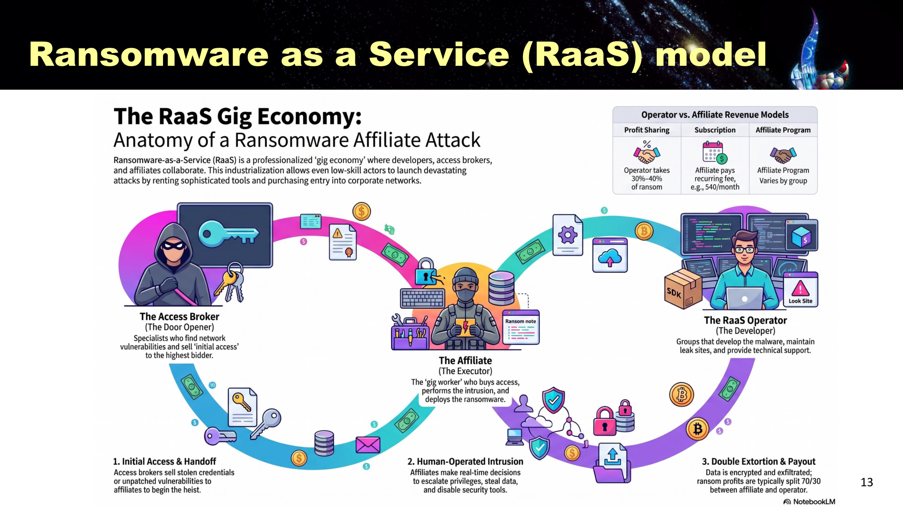
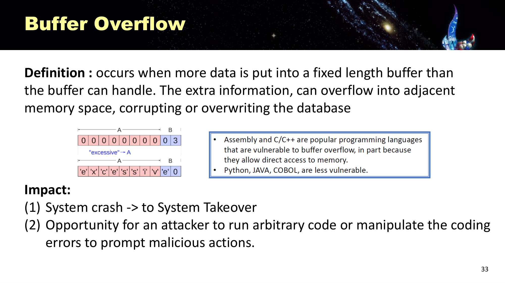
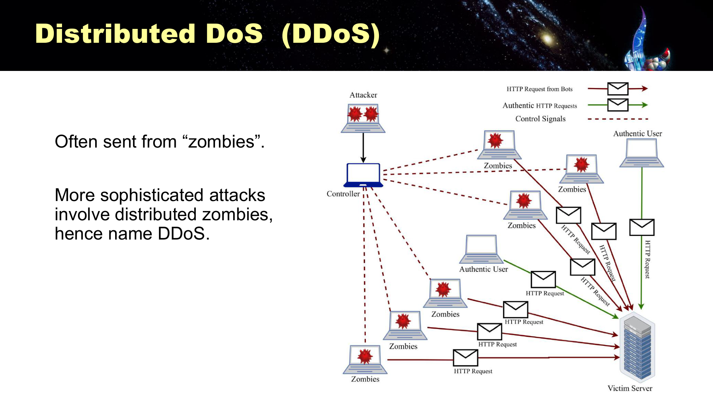
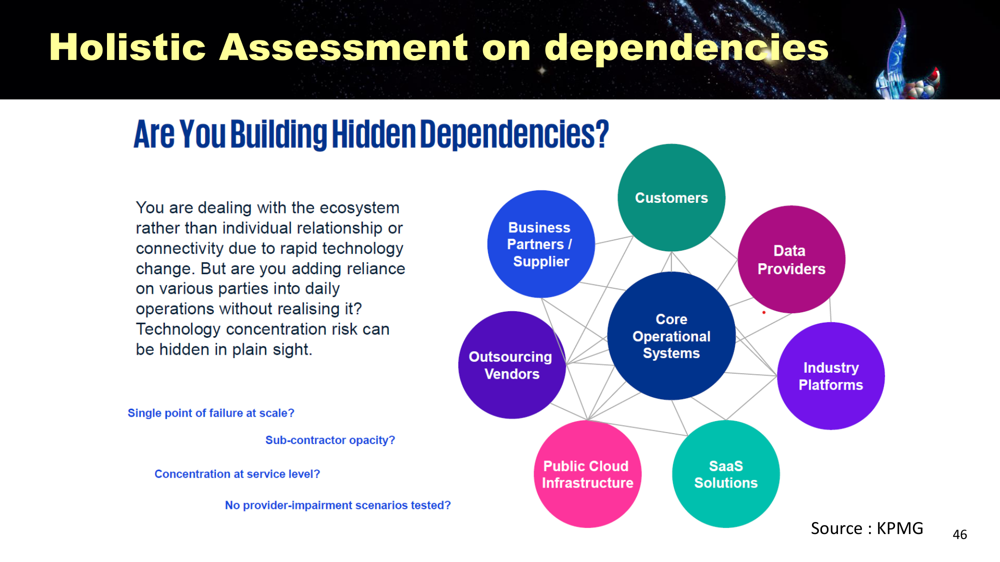

---
title:
  en: "Final Review L2 · Security Threats & Attacks"
  zh: "期末复习 L2 · 安全威胁与常见攻击"
summary:
  en: "Lesson 2 for the final: slide definitions, what to understand and likely questions for the threat terminology, malware and RaaS, communication intercept, phishing, software flaws, DoS/DDoS, supply chain attacks, password attacks and LLM threats."
  zh: "第 2 课期末版：威胁术语、恶意软件与 RaaS、通信截获、钓鱼与社会工程、软件缺陷、DoS/DDoS、供应链攻击、密码攻击、LLM 威胁——每个点给课件原文、需要理解的逻辑和可能的问法。"
week: 2
date: 2026-10-08
unlisted: true
tags: [FinalReview, Malware, RaaS, Phishing, DDoS, SupplyChain, PasswordAttack]
---
# 期末复习 L2 · 安全威胁与常见攻击

**课件**：Lesson 2（65 页）　**详细笔记**：[第 2 课复习笔记](../../lectures/lesson-02/)　**练习题**：[L2 练习题](../practice-l2/)　**总览**：[期末总复习](../final-review/)

> **怎么读这一页**：每个知识点按 **课件原文 → 需要理解 → 可能的问法** 写。
>
> 优先级：🔴 必考核心 · 🟡 需要理解 · 🟢 了解即可  
> 掌握要求：📝 **默写**（能写出名字、定义、清单）· 🔍 **区分**（给场景能判断是哪一个，选择题）· 🧮 **计算** · ✍️ **分析**（能写成有结构的一段论述，长题）

> **🎯 这一课在期末怎么考**
>
> - **老师的范围**：L1–L2 的「新兴风险」和**第三方风险管理**被点名 → 本课的**供应链攻击**一节按最高优先级。
> - **课件 Learning Objectives 第 4 条**：「Link attacks to Confidentiality-Integrity-Availability risks」→ 任何攻击都要能说出破坏了 CIA 的哪一项。
> - **Assignment 1 用到的 L2 内容**：选择题考 anti-malware、Worm、DoS 定义、对 SQL injection 无效的控制；简答考「2 种密码攻击 + 各 2 个对策」「DoS vs DDoS + 为什么 DDoS 更危险（25 词内）」。
> - **课件末尾 3 道原题**：对程序缺陷无效的控制、Worm、RaaS 不包括哪个角色。

## 本课大纲

- **[1. 基本术语](#1-基本术语)**
  - [1.1 🔴 Threat / Vulnerability / Exploit / Attack / Risk（p.5，L5 p.23 复习）📝🔍](#11--threat--vulnerability--exploit--attack--riskp5l5-p23-复习)
- **[2. Malware](#2-malware)**
  - [2.1 🔴 四种恶意软件（p.8–10）📝🔍](#21--四种恶意软件p810)
  - [2.2 🟡 防御恶意软件的 7 条对策（p.11）📝](#22--防御恶意软件的-7-条对策p11)
  - [2.3 🔴 Ransomware-as-a-Service（RaaS，p.12–13）📝🔍✍️](#23--ransomware-as-a-serviceraasp1213️)
- **[3. 🔴 Communication Intercept（通信截获，p.16–22）📝🔍](#3--communication-intercept通信截获p1622)**
- **[4. 🔴 Phishing 与 Social Engineering（p.23–28）📝✍️](#4--phishing-与-social-engineeringp2328️)**
- **[5. 🔴 Software Weaknesses（软件缺陷，p.29–37）📝🔍](#5--software-weaknesses软件缺陷p2937)**
  - [5.1 定义与 OWASP（p.30–31）](#51-定义与-owaspp3031)
  - [5.2 三种具体漏洞（p.32–37）](#52-三种具体漏洞p3237)
- **[6. 🔴 DoS 与 DDoS（p.38–43）📝🔍✍️](#6--dos-与-ddosp3843️)**
- **[7. 🔴 Supply Chain Attack（供应链攻击，p.44–48）★老师点名 📝✍️](#7--supply-chain-attack供应链攻击p4448老师点名-️)**
- **[8. 🟡 Password Attack（密码攻击，p.49–52）📝✍️](#8--password-attack密码攻击p4952️)**
- **[9. 🟢 Emerging Threats：LLM（p.53–60）📝🔍](#9--emerging-threatsllmp5360)**
- **[10. 🔴 攻击 → CIA → 对策 总表](#10--攻击--cia--对策-总表)**
- **[11. 本课综合题（长题练习）](#11-本课综合题长题练习)**

---

## 1. 基本术语

### 1.1 🔴 Threat / Vulnerability / Exploit / Attack / Risk（p.5，L5 p.23 复习）📝🔍

**课件原文**

| 术语                | 定义                                                                                                                      |
| ----------------- | ----------------------------------------------------------------------------------------------------------------------- |
| **Threat**        | An intentional or unintentional act that can damage or otherwise compromise information and the systems that support it |
| **Vulnerability** | A potential weakness in an asset or its defensive control system(s)                                                     |
| **Exploit**       | A technique used to compromise a system; may also describe a tool, program or script used in the compromise             |
| **Attack**        | An event that can cause negative impact (CIA) to an organization（L5 补的定义）                                               |
| **Risk**          | A potential risk to an asset's loss of value                                                                            |

**需要理解**

- 这是一条因果链：**Vulnerability**（墙上的洞）→ **Threat**（有人可能钻）→ **Exploit**（钻洞的工具或手法）→ **Attack**（真的钻进来并造成 CIA 影响）→ **Risk**（资产贬值的可能性）。
- Threat 包括**无意**的行为（例如员工误操作），不一定是恶意的。
- 这组术语在 L5 又复习了一遍，说明会反复考配对题。

**A company runs an unpatched web server. A criminal group publishes a script that takes over such servers and uses it to steal customer data. Identify the vulnerability, threat, exploit and attack.**

> **English**
>
> - **Vulnerability**: the unpatched web server — a weakness in the asset.
> - **Threat**: the criminal group and its intent to steal data.
> - **Exploit**: the published script used to take over the server.
> - **Attack**: actually running the script to break in and steal customer data, causing a loss of **Confidentiality**.
>
> **中文解析**
>
> Vulnerability：未打补丁的 web server；Threat：犯罪集团（以及他们盗取数据的意图）；Exploit：公开的攻击脚本；Attack：实际用脚本入侵并窃取客户数据（造成 Confidentiality 损失）。

---

## 2. Malware

### 2.1 🔴 四种恶意软件（p.8–10）📝🔍

**课件原文**

| 类型               | 定义                                                                                                                                           |
| ---------------- | -------------------------------------------------------------------------------------------------------------------------------------------- |
| **Virus**        | replicates by **attaching to some executable files**; aims to modify files or damage systems                                                 |
| **Worm**         | similar to virus, with the additional strength that it can survive and replicate on its own **without the need to attach to something else** |
| **Trojan horse** | disguises itself as **legitimate, harmless software** to trick users into installing it                                                      |
| **Ransomware**   | threatens to **publish** the victim's data or perpetually **block access** to it unless a ransom is paid                                     |

Worm 特征：Self replicating and exploring；May carry other payload；**Causing congestion**；Taking actions without consent。  
Trojan 特征：Program with hidden side-effects；superficially attractive（游戏、免费升级）；usually propagate a virus or **create a backdoor**。

**需要理解（p.14 Short Quiz 的答案）**

| 问题                | 答案                   |
| ----------------- | -------------------- |
| 哪个**不自我复制**？      | **Trojan**（靠骗用户安装）   |
| 哪个能**堵塞互联网**？     | **Worm**（大量自我复制造成拥塞） |
| 哪个必须**寄生**在合法文件上？ | **Virus**            |
| 哪个**传播最快**？       | **Worm**（不需要用户操作）    |

- Ransomware 同时打 **C**（威胁公开数据）和 **A**（锁住数据）。

**Which one of the following malware can spread without user interactions?**

- A. Ransomware
- B. Back door
- C. Trojan Horse
- D. Worm

> **答案：D**
>
> *EN:* A worm needs no host file and no user action to spread.
>
> 课件原题。Worm 不需要宿主文件，也不需要用户操作。

### 2.2 🟡 防御恶意软件的 7 条对策（p.11）📝

**课件原文**：① Update OS and patches ② Install antivirus software ③ Don't download files from an untrusted network or website ④ Browser set to **request permission** before running pop-ups, files, or programs ⑤ Don't open files from people you don't know ⑥ **Regular backups** of critical data ⑦ Scan external storage devices on an **isolated machine**

**需要理解**：按「技术（补丁、杀毒、浏览器设置、隔离扫描）+ 行为（不乱下载、不开陌生文件）+ 恢复（备份）」三类记更容易。A1 选择题考过「anti-malware 方法 EXCEPT Email notification」。

### 2.3 🔴 Ransomware-as-a-Service（RaaS，p.12–13）📝🔍✍️

*RaaS 的零工经济：Access Broker → Operator → Affiliate（Slide 13）*

**课件原文**

> Ransomware-as-a-Service (RaaS) refers to a professional **"gig-economy"** ransomware system, one that **enables even inexperienced cyber criminals** to launch ransomware attacks.
>
> - **RaaS Operators (Developers)**
> - **The Affiliates / Executors (Attackers)**
> - **Initial Access Brokers (Door Opener)**

**需要理解**

- 三个角色分工：Broker 卖「初始访问权」→ Affiliate 买来去入侵、偷数据、部署勒索软件 → Operator 提供软件和泄露网站，分成（约 30%）。
- **管理含义**：RaaS **降低了攻击门槛**，不会写代码的人也能发动勒索 → 勒索事件数量暴涨。
- 流程最后一步是**双重勒索**（加密 + 窃取数据威胁公开）。

**Which of the following is NOT a key component under Ransomware-as-a-Service (RaaS) ecosystem?**

- A. RaaS Operators / Developers
- B. The Affiliates / Attackers
- C. The Crypto Miner
- D. Initial Access Brokers

> **答案：C**
>
> *EN:* The RaaS roles are operators, affiliates and initial access brokers — a crypto miner is not one of them.
>
> 课件原题。Crypto Miner 不在 RaaS 分工里。

**Why has ransomware become more frequent in recent years? Refer to the RaaS model.**

> **English**
>
> Ransomware-as-a-Service turns ransomware into a **gig economy**: **operators / developers** supply ready-made ransomware and leak sites, **initial access brokers** sell ready-made entry points, and **affiliates** carry out the attacks and share the ransom. This **lowers the barrier to entry** — even inexperienced criminals can launch attacks — while specialisation raises the success rate, so the number of attacks has grown.
>
> **中文解析**
>
> RaaS 把勒索攻击变成分工的「零工经济」：开发者提供现成的勒索软件和泄露网站，Access Broker 出售现成的入口，Affiliate 不需要高技术就能执行攻击并分成。门槛降低、专业化分工、利润共享，使更多犯罪者参与，攻击数量和成功率都上升。

---

## 3. 🔴 Communication Intercept（通信截获，p.16–22）📝🔍

**课件原文**

> Data are transmitted in the form of **packets**. Software-based communications attacks include several subcategories designed to **intercept and collect information in transit**: 1. Packet Sniffers 2. IP Spoofing 3. Man-in-the-middle attack. Emergence of **IoT devices and Remote Workplace** reliance increase such risk.

| 手法                    | 课件原文                                                                                                                                                                                     |
| --------------------- | ---------------------------------------------------------------------------------------------------------------------------------------------------------------------------------------- |
| **Sniffing**          | an attacker intercepts data packets traveling across network. It's essentially **electronic eavesdropping**. E.g. capturing login credentials sent over **HTTP**（公共 WiFi / 未加密网络）        |
| **IP Spoofing**       | a malicious actor **disguising themselves as a trusted source** (person, device, or website) to deceive users, steal data, bypass security controls, or gain unauthorized network access |
| **Man-in-the-Middle** | attacker places him/herself **in the middle of communication between two targets**; e.g. compromising the network routers                                                                |

对策（p.22）：Firewall、IDS、**VPN**（L3）；**Data Encryption**（L4）；防止端点被装恶意软件；Spoofing 常配合 Social Engineering。

**需要理解**

- Sniffing 只「听」→ 破坏 **C**；MITM 能「听」也能「改」→ **C + I**，所以比 Sniffing 更危险。
- 根本对策是**加密**（HTTPS / TLS、VPN）：截到了也看不懂，改了会被发现（L4 的哈希和签名）。
- L4 讲「只用 Hash 会被 MITM 改内容再重算哈希」，就是这里的 MITM。

**Explain the difference between packet sniffing and a man-in-the-middle attack, and give one control for each.**

> **English**
>
> **Packet sniffing** is passive electronic eavesdropping on packets in transit (e.g. capturing HTTP login credentials on public Wi-Fi); it breaks **confidentiality**. Control: **encrypt traffic** (HTTPS / VPN).  
> A **man-in-the-middle** attacker sits between two parties and relays traffic while impersonating each side, so they can **read and alter** messages; it breaks **confidentiality and integrity**. Control: **verify identities with digital certificates** (TLS / PKI) and detect tampering with signatures / hashes.
>
> **中文解析**
>
> Sniffing 是被动窃听传输中的数据包（如在公共 WiFi 抓 HTTP 明文密码），只破坏机密性，对策是加密传输（HTTPS / VPN）。MITM 是攻击者插在通信双方之间、冒充双方转发，能读也能改，破坏机密性和完整性，对策是用数字证书验证对方身份（TLS / PKI），并用签名或哈希检测篡改。

---

## 4. 🔴 Phishing 与 Social Engineering（p.23–28）📝✍️

**课件原文**

> Social Engineering: The use of **deception to manipulate individuals** into releasing confidential or personal information → **IT IS NOT TECHNICAL, BUT A SOCIAL ONE!**  
> 「**People are the weakest link!**」— Kevin Mitnick  
> 原因：Lack or improper **training**；**Inexperience**；**Mistakes**；Lack of **awareness**

- AI-Driven Phishing：Scammers use **generative AI** to orchestrate convincing **spear-phishing** attacks, usually with only a few pieces of personal information found online（Arup deepfake 案）
- QR code 钓鱼：在钓鱼邮件里嵌二维码，引到假页面

**对策（p.28）**：① regular phishing **awareness programs and simulation** ② **MFA** ③ **Network Segmentation & Monitoring** ④ **least privilege** for each user group and account ⑤ remove or disable commonly abused and non-essential services

**需要理解**

- 钓鱼攻击的是**人**，所以光靠技术不够；但光靠培训也不够（L3：91% 知道重复用密码有风险，66% 照样做）。答案要**技术 + 管理**两条线。
- 五条对策的逻辑：减少被骗的概率（培训）→ 被骗了密码也没用（MFA）→ 进来了也走不远（分段、最小权限）→ 减少可利用的服务。这正是 Zero Trust 的思路。

**Suggest a layered approach to defend against AI-driven spear-phishing. Justify each layer.**

> **English**
>
> 1. **Regular phishing awareness training and simulations** (including deepfake and QR-code phishing) — reduces the chance staff are fooled.
> 2. **MFA**, ideally phishing-resistant (e.g. passkeys) — stolen credentials alone are not enough.
> 3. **Network segmentation and monitoring** — limits lateral movement and detects intruders early.
> 4. **Least privilege** — a compromised account can reach only limited data.
> 5. **Out-of-band verification for high-risk actions** such as payments — counters deepfake impersonation of executives.
>
> **中文解析**
>
> ① 定期钓鱼演练和意识培训（包括 deepfake、QR code 钓鱼），降低被骗概率；② MFA（最好是 phishing-resistant，如 passkey），凭证被骗走也登不进；③ 网络分段与监控，限制攻击者进来后的横向移动并尽早发现；④ 最小权限，被骗账号能接触的数据有限；⑤ 高风险操作（转账）的带外核实流程，应对 deepfake 冒充高管。

---

## 5. 🔴 Software Weaknesses（软件缺陷，p.29–37）📝🔍

### 5.1 定义与 OWASP（p.30–31）

**课件原文**

> A software weaknesses are **flaws in software design, coding, or configuration** that allow security problems to occur. The most dangerous weakness are (1) **injection flaws**, (2) **memory corruption bugs**, and (3) **access control failure**.  
> Why common: Design phase **lack of security involvement**；Machine / Human **coding errors**；**Legacy systems**

OWASP Top 10（2025）：A01 **Broken Access Control**、A02 Security Misconfiguration、A03 **Software Supply Chain Failures**、A04 Cryptographic Failures、A05 Injection……（知道它是行业公认的十大 Web 风险即可）

### 5.2 三种具体漏洞（p.32–37）

*Buffer Overflow：8 字节缓冲区塞进 excessive，多出来的字符溢出到相邻内存（Slide 33）*

**课件原文 + Short Quiz 2 的答案**

| 漏洞                  | 定义（课件）                                                                                                                       | Primary Target              | Negative Impact                                                   |
| ------------------- | ---------------------------------------------------------------------------------------------------------------------------- | --------------------------- | ----------------------------------------------------------------- |
| **SQL Injection**   | developers **fail to properly validate user input** before using it to query a relational database                           | **数据库**                     | attacker may gain access to **unauthorized information**          |
| **Buffer Overflow** | **more data is put into a fixed length buffer** than the buffer can handle; extra information overflows into adjacent memory | **内存**（C / C++ 等可直接访问内存的语言） | **System crash → system takeover**；run **arbitrary code**         |
| **XSS**             | inject **malicious scripts into a trusted website**; code-injection attack executed on the **client side**                   | **访问者的浏览器**                 | read web history, **cookies or session tokens**, stored passwords |

XSS 防御：Avoid posting HTML、**Validate Input**、**Sanitizing Data**、Cookies protection、**WAF Rules**。

**需要理解**

- 三者的共同根源：**没有正确处理输入或边界**。区别在**攻击目标**：数据库、内存、用户浏览器。
- 对程序缺陷有效的是**技术和流程控制**（输入校验、代码审查、测试、最小权限），**加预算本身不修代码**（课件原题）。

**What type of control is ineffective against Program Flaw (e.g. SQL injection)?**

- A. Hire better IT team
- B. Better plan and more users testing
- C. Principle of least user privilege
- D. Increase IT budget

> **答案：D**
>
> *EN:* Program flaws are fixed by technical and process controls (input validation, testing, least privilege); a bigger budget alone does not fix code.
>
> 课件原题。

**SQL injection and XSS are both injection attacks. What is the difference?（区别是什么？）**

> **English**
>
> **SQL injection** inserts malicious input into a **server-side database query**; the target is the **database**, and the impact is unauthorised reading or modification of data.  
> **XSS** injects a malicious script into a **trusted website** that runs in the **visitor's browser (client side)**; the impact is theft of cookies, session tokens or stored passwords.  
> Both are mitigated by **input validation and data sanitising**.
>
> **中文解析**
>
> SQL injection 把恶意输入拼进**服务器端的数据库查询**，目标是数据库，后果是读取或篡改未授权数据；XSS 把恶意脚本注入**可信网站**，在**访问者浏览器（客户端）**执行，后果是偷 cookie、session token。共同对策是输入校验和数据清洗。

---

## 6. 🔴 DoS 与 DDoS（p.38–43）📝🔍✍️

*DDoS：Attacker → Controller → Zombies → Victim（Slide 42）*

**课件原文**

- TCP **three-way handshake**：SYN → SYN-ACK → ACK
- Common types of DoS：**Malicious client not sending ACK** back to server；**SYN request started by a spoofed IP address**
- DDoS 定义：A **botnet** of thousands to millions of compromised devices floods a target — server, network, or app — overwhelming capacity and **denying access to legitimate users**
- 三种类型（CISA 2024）：

| 类型                   | 层                   | 原理                                                                                                      | 例子                                         |
| -------------------- | ------------------- | ------------------------------------------------------------------------------------------------------- | ------------------------------------------ |
| **Volumetric**       | L3/4 · Bandwidth    | Flood bandwidth with massive traffic                                                                    | UDP flood、**ICMP flood**、DNS amplification |
| **Protocol**         | L3/4 · State tables | Exploit TCP/IP weaknesses to **exhaust connection state tables** and firewall session capacity          | **SYN flood**、Smurf、fragmentation          |
| **Application (L7)** | L7                  | Target specific web services with requests that **mimic legitimate traffic** — extremely hard to detect | HTTP flood、**Slowloris**                   |

- Impact：uptime、revenue、reputation；平均每次损失 **$234,000**（Zayo 2024）

**需要理解**

- DoS / DDoS 破坏的是 **Availability**。
- **DoS vs DDoS**：DoS 来自**单一来源**，封掉那个 IP 就行；DDoS 来自**大量分散的僵尸设备**，无法按来源封堵、流量更大 → 更危险。
- SYN flood 的原理：故意不完成握手，让服务器的**半开连接队列**被占满（L3 Stateful 防火墙的 state table 也会被这样撑爆）。
- L7 攻击模仿正常请求，所以纯技术很难过滤 → 需要**应急流程**（云端清洗、限流、事先演练）。

*（网页版此处可交互：自己发正常连接 / 伪造 SYN，看队列如何被打满；下表是同一套规则跑一遍的脚本，半开连接超时阈值 = 6 tick）*

| # | 动作                           | 队列  | 队列内容                          |
| - | ---------------------------- | --- | ----------------------------- |
| 1 | 员工电脑正常连接（完成 3-way handshake） | 1/5 | ✅ 已建立                         |
| 2 | 攻击者发送伪造 SYN #1               | 2/5 | ✅ 已建立, ⏳ 半开                   |
| 3 | 攻击者发送伪造 SYN #2               | 3/5 | ✅ 已建立, ⏳ 半开, ⏳ 半开             |
| 4 | 攻击者发送伪造 SYN #3               | 4/5 | ✅ 已建立, ⏳ 半开, ⏳ 半开, ⏳ 半开       |
| 5 | 攻击者发送伪造 SYN #4               | 5/5 | ✅ 已建立, ⏳ 半开, ⏳ 半开, ⏳ 半开, ⏳ 半开 |
| 6 | 又一台员工电脑尝试连接                  | 5/5 | ✅ 已建立, ⏳ 半开, ⏳ 半开, ⏳ 半开, ⏳ 半开 |
| 7 | 等待 6 个 tick（半开连接超时被回收）       | 1/5 | ✅ 已建立                         |

**（A1 原题 / A1 question）What is the difference between a DoS and a DDoS attack? Explain why DDoS is more dangerous in less than 25 words.**

> **English**
>
> A **DoS** attack comes from a single system or IP address; a **DDoS** attack is launched simultaneously from many distributed compromised devices (a botnet).  
> Why more dangerous (under 25 words): *Traffic comes from thousands of distributed zombies at once, so it cannot be blocked by source and delivers far greater volume.*
>
> **中文解析**
>
> DoS 由单一系统或 IP 发起；DDoS 由大量分布式的被控设备（botnet）同时发起。更危险的原因（25 词内）：Traffic comes from thousands of distributed zombies at once, so it cannot be blocked by source and delivers far greater volume.

**Which type of DDoS attack is a SYN flood, and why?（SYN flood 属于哪一类？为什么？）**

> **English**
>
> A **protocol attack**. It does not saturate bandwidth (volumetric) or mimic application requests (layer 7); it abuses the TCP three-way handshake, leaving many **half-open connections** that exhaust the server's **connection state table**.
>
> **中文解析**
>
> **Protocol attack**。它不靠流量塞满带宽（Volumetric），也不模仿应用请求（L7），而是利用 TCP 三次握手，留下大量半开连接，耗尽服务器的连接状态表。

---

## 7. 🔴 Supply Chain Attack（供应链攻击，p.44–48）★老师点名 📝✍️

*Holistic Assessment on dependencies（KPMG）：核心系统被业务伙伴、数据供应商、外包、公有云、SaaS、行业平台环绕（Slide 46）*

**课件原文**

> Global trend: business models lower the cost of peripheral business via **outsourcing and offshoring**; allow immediate access to technology solutions or niche skills not economical to develop in-house (e.g. **Cloud hosting**).  
> How: **Attackers don't go after their victims' networks directly. Instead, they penetrate the system of a third-party supplier with access to their targets' network assets.**

**SolarWinds**：2019 年 9 月入侵 SolarWinds → 10 月开始在 Orion 测试注入 → 约 4 个月后植入恶意代码 **Sunburst** → 2020 年 3 月分发**带恶意代码的 Orion 更新** → 数千家客户安装，攻击者获得客户系统访问权。

**HKMA 对金融业的四条建议**：

1. Identify, assess and mitigate cyber risk **throughout the third-parties management lifecycle**
2. Assess **supply chain risks** associated with third-parties supporting **critical operations**
3. Expand **cyber threat intelligence monitoring to cover key third-parties** and actively **share intelligence with peer institutions**
4. **Scenario-based response strategies and regular drills**

**需要理解**

- 外包和云降低成本，但**把信任延伸到了第三方**：你的安全水平等于最弱的那个供应商。
- 依赖图（p.46）上的四个自问：规模化后的**单点故障**？**分包商透明吗**？服务层面是否**过度集中**？有没有**演练过供应商失效**？
- 这是跨课主线：L1 医管局、Canvas、Deloitte「可信第三方 6→13」；L5 Transference 靠 SLA；L5 讨论的 CrowdStrike（单一供应商更新出错导致全球中断）。

**Using SolarWinds as an example, explain why supply chain attacks are particularly dangerous.**

> **English**
>
> 1. **One-to-many**: compromising a single supplier gave access to thousands of downstream customers through a **trusted software update** (Orion).
> 2. The malicious code arrived through a **legitimate, signed channel**, so customers' firewalls and antivirus let it in.
> 3. **Long dwell time** — the operation spanned about six months, making detection hard.
> 4. Customers have **no visibility** into the supplier's internal development process.
>
> **中文解析**
>
> ① 攻击者只需攻破一个供应商，就能借**受信任的软件更新**进入数千家下游客户（一对多）；② 恶意代码带着合法签名和合法渠道进来，客户的防火墙和杀毒会放行；③ 潜伏时间长（SolarWinds 跨度约 6 个月），难以发现；④ 客户对供应商内部开发流程没有可见性。

**As CISO of a bank, how would you manage third-party cyber risk? Use the HKMA guidance.（10 marks）**

> **English**
>
> Manage risk across the **whole third-party lifecycle**:
>
> 1. **Due diligence** before onboarding; tier suppliers by criticality, with stricter requirements for those supporting critical operations.
> 2. **Contract**: security requirements, SLA, audit rights and incident-notification deadlines.
> 3. **Access**: least privilege / Zero Trust — no standing, network-wide access.
> 4. **Monitoring**: extend cyber threat intelligence to key third parties and share intelligence with peer banks.
> 5. **Resilience**: scenario-based response plans for supplier failure, tested by regular drills; avoid single points of failure and over-concentration.
>
> **中文解析**
>
> 按全生命周期：① 引入前做安全尽职调查，按重要性分级，关键供应商要求更高；② 合同写入安全要求、SLA、审计权、事件通报时限；③ 接入时按最小权限 / Zero Trust 给访问，不给常驻全域权限；④ 把威胁情报监控扩展到关键第三方，并与同业共享情报；⑤ 制定供应商失效的场景化应急方案并定期演练，避免单点故障和过度集中。

---

## 8. 🟡 Password Attack（密码攻击，p.49–52）📝✍️

**课件原文**

1. **Guessing** — birthday, ID, name, etc.
2. **Dictionary attack** — repeatedly try dictionary words until access is granted
3. **Brute force attack** — exhaustively try all combinations of characters. Success primarily depends on **???**（答案：密码长度和字符集，即复杂度）
4. **Rainbow table** — if an attacker is able to **steal a system's encrypted password file**

Discussion：为什么 8 位字母数字密码也会被破？什么是 **Credential Stuffing**？  
p.52 Different level：Poor（123456）→ Fair（密码 + SMS）→ Better（Authenticator、OTP、Passwordless）→ **Best（phishing-resistant：FIDO2、Passkey、证书）**

**需要理解**

- 8 位字母数字只有约 2×10¹⁴ 种组合，GPU 每秒能试数十亿次；人选的密码有规律，字典和规则攻击优先命中；没加盐的哈希能直接查彩虹表。
- **Credential stuffing（撞库）**：拿别的网站泄露的账号密码批量去试，利用的是**重复使用密码**，不是破解密码。所以对策是 MFA 和唯一密码，不是加强复杂度。
- Rainbow table 的前提是**先偷到哈希文件**；对策是**加盐（salt）**。

**（A1 原题 / A1 question）List 2 types of password attacks (other than guessing) and suggest 2 measures against each.（每点 12 词内 / max 12 words each）**

> **English**
>
> **Brute force**
>
> - Use long passphrases to enlarge the search space.
> - Rate-limit and lock accounts after repeated failed logins.
>
> **Rainbow table**
>
> - Salt each password with a unique random value before hashing.
> - Use MFA so a cracked password alone is insufficient.
>
> **中文解析**
>
> **Brute force**：Use long passphrases to enlarge the search space；Rate-limit and lock accounts after repeated failed logins.  
> **Rainbow table**：Salt each password with a unique random value before hashing；Use MFA so a cracked password alone is insufficient.  
> （也可以答 Dictionary：block common / breached passwords；Credential stuffing：unique passwords + MFA + 异常登录监控。）

---

## 9. 🟢 Emerging Threats：LLM（p.53–60）📝🔍

**课件原文**

- HKCERT 2026 五大风险：供应链与第三方缺口；企业 AI 治理薄弱导致泄露；AI 驱动攻击与 Agentic AI 风险；过度依赖云造成单点故障；AI 设备的新威胁
- 案例：M\&S 因**第三方 IT 外包**被攻击；ShadowLeak——ChatGPT Deep Research 读邮件时执行了注入的指令，把敏感信息发给攻击者
- > Data Leakage and Data Poisoning are two primary data security failure modes in LLM: **a breach of confidentiality (data moving out)** and **a breach of integrity (bad data moving in)**.

| 攻击                           | 一句话                                      |
| ---------------------------- | ---------------------------------------- |
| Training Data Memorization   | 用定向 prompt 套出模型记住的 PII、源代码、凭证            |
| Context and RAG Exfiltration | RAG / 多租户隔离不好，通过 prompt injection 泄露内部文档 |
| Dataset Contamination        | 往公开数据或微调数据里灌恶意记录                         |
| Backdoor (Trojan)            | 训练数据里埋触发词，触发时执行恶意指令                      |

防御：Leakage → Redaction、Access Control、Output Scanner (Guardrails)、Mathematical Blurring；Poisoning → Checking the Data Supplier、Data Cleaning、Stress-Testing、**Treating External Text as Data, Not Orders**

**需要理解**：泄露 = **C**，投毒 = **I**。「外部文本当数据不当指令」是防 prompt injection 的核心原则。LLM 风险里又出现了**第三方**（M\&S 外包、数据供应商）。

---

## 10. 🔴 攻击 → CIA → 对策 总表

| 攻击                            | 主要破坏         | 关键对策                      |
| ----------------------------- | ------------ | ------------------------- |
| Virus / Worm / Trojan         | C + I + A    | 补丁、杀毒、不开陌生文件              |
| Ransomware / RaaS             | **C + A**    | 备份、MFA、EDR、分段             |
| Sniffing / Spoofing / MITM    | C（MITM 还有 I） | 加密（TLS、VPN）、证书验证          |
| Phishing / Social engineering | C            | 培训演练、MFA、最小权限、带外核实        |
| SQLi / Buffer overflow / XSS  | C + I        | 输入校验、代码审查、WAF             |
| DoS / DDoS                    | **A**        | 流量清洗、限流、应急演练              |
| Supply chain                  | C + I + A    | 第三方风险管理全生命周期              |
| Password attacks              | C            | 长且唯一的密码、加盐、限速、MFA、passkey |
| LLM leakage / poisoning       | C / I        | 脱敏、访问控制、数据清洗、外部文本当数据      |

---

## 11. 本课综合题（长题练习）

**A logistics company's employee receives a call from someone claiming to be IT helpdesk, and gives out VPN credentials. The attacker later encrypts systems and leaks data. Identify every attack type from Lesson 2 involved, and the CIA element each affected.（10 marks）**

> **English**
>
> 1. **Social engineering (vishing)** — the fake helpdesk call steals credentials → **C**.
> 2. **Credential abuse / password compromise** — the stolen VPN password works because there is no MFA → **C**.
> 3. **Malware** — tools installed for privilege escalation and lateral movement → **C / I**.
> 4. **Ransomware with double extortion** — systems encrypted and data leaked → **A + C**. If the attacker is a RaaS affiliate, the credentials may have been bought from an initial access broker.
> 5. **Supply chain / third-party risk** — if the VPN is run by an outsourced provider.
>
> **中文解析**
>
> ① **Social engineering / vishing**（电话钓鱼）——骗取凭证，破坏 C；② **凭证滥用**（相当于密码被盗，没有 MFA 就能登录）——C；③ 若入侵后横向移动、装恶意软件 → **Malware**；④ **Ransomware**（加密 + 泄露 = 双重勒索）——A + C；如果攻击者是 RaaS Affiliate，入口凭证可能来自 Initial Access Broker；⑤ 如果 VPN 由外包商管理 → **供应链 / 第三方风险**。
