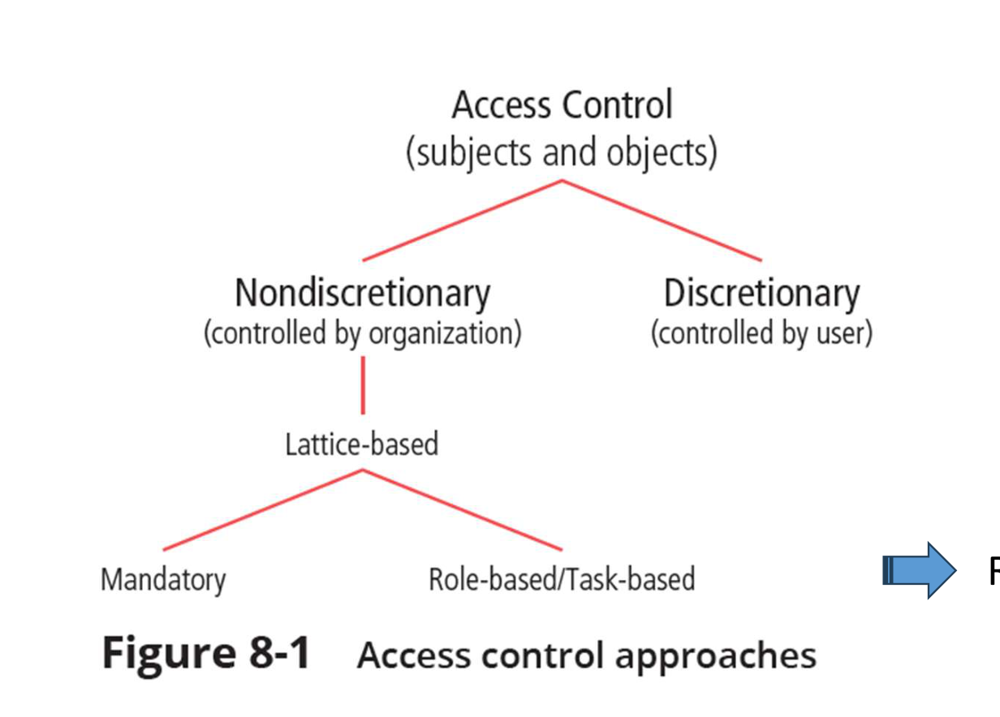
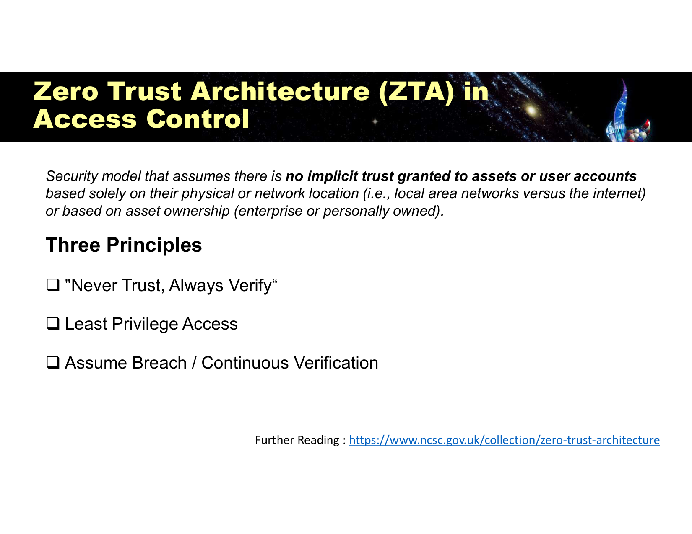
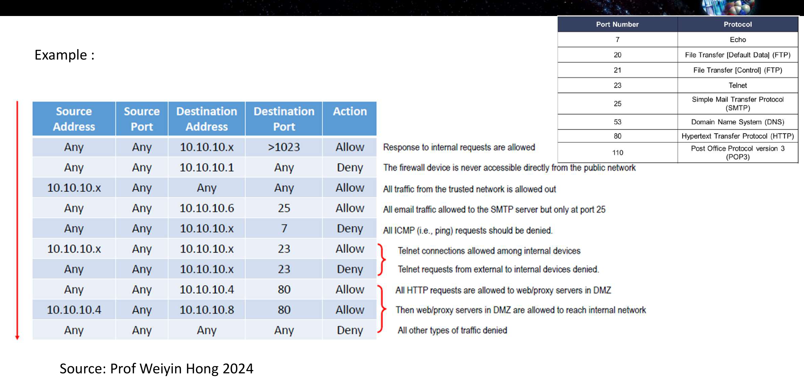
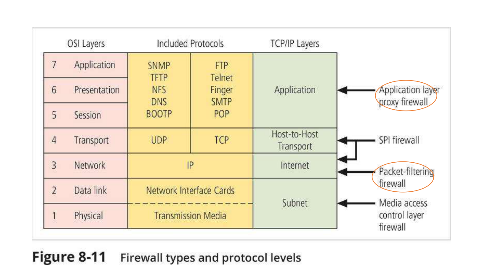
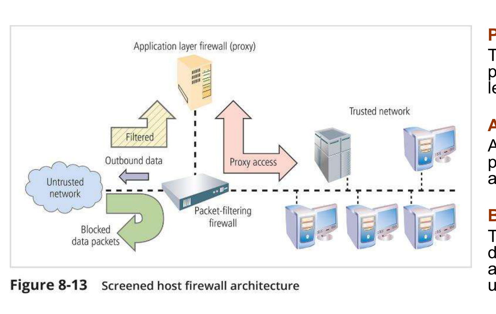
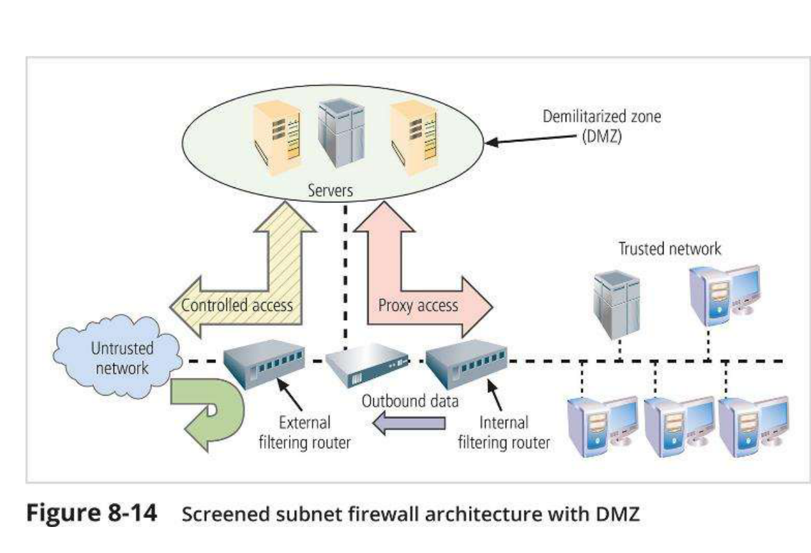
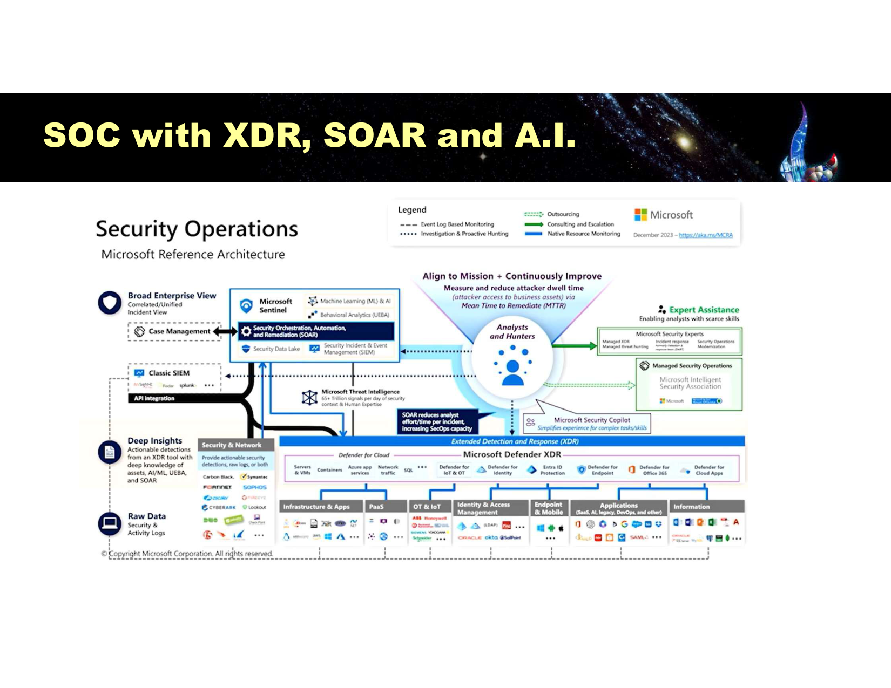
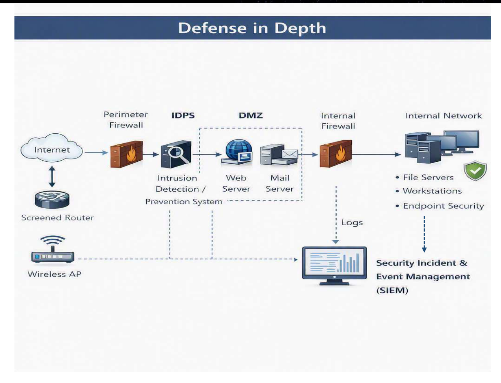

---
title:
  en: "Final Review L3 · Protection Tools & Zero Trust"
  zh: "期末复习 L3 · 防护工具与 Zero Trust"
summary:
  en: "Lesson 3 for the final: slide definitions, what to understand and likely questions for authentication, access control, Zero Trust, firewalls and architectures, VPN, IDPS, EDR, SIEM, XDR, SOAR, SOC, honeypots and the security control strategies that tie them together."
  zh: "第 3 课期末版：认证与授权、访问控制、Zero Trust、防火墙与架构、VPN、IDPS、EDR、SIEM、XDR、SOAR、SOC、蜜罐，以及把这些工具串起来的安全控制策略——每个点给课件原文、需要理解的逻辑和可能的问法。"
week: 3
date: 2026-10-08
unlisted: true
tags: [FinalReview, ZeroTrust, Firewall, DMZ, IDPS, SIEM, SOC, DefenseInDepth]
---
# 期末复习 L3 · 防护工具与 Zero Trust

**课件**：Lesson 3（65 页）　**详细笔记**：[第 3 课复习笔记](../../lectures/lesson-03/)（§37 易混对照、§40 自测题建议再做一遍）　**练习题**：[L3 练习题](../practice-l3/)　**总览**：[期末总复习](../final-review/)

> **怎么读这一页**：每个知识点按 **课件原文 → 需要理解 → 可能的问法** 写。
>
> 优先级：🔴 必考核心 · 🟡 需要理解 · 🟢 了解即可  
> 掌握要求：📝 **默写**（能写出名字、定义、清单）· 🔍 **区分**（给场景能判断是哪一个，选择题）· 🧮 **计算** · ✍️ **分析**（能写成有结构的一段论述，长题）

> **🎯 这一课在期末怎么考（老师最强调的一课）**
>
> - **老师原话**：讲完所有工具（firewall、IDPS、SIEM、SOAR……）之后，要记住**为什么把它们组合在一起**——背后的原则是 **Zero Trust Architecture**，连同 authentication / authorization。「这是我最想让你们记住的」。→ 本页第 7 节专门讲这一点。
> - **Assignment 1 用到的 L3 内容**：选择题考 signature-based IDS 的缺点、NIDS 的难点（加密流量看不到）、MFA、MAC vs DAC；简答考 False Positive vs False Negative 哪个更糟。
> - **Assignment 2 整道长题都是 L3**：NIDPS vs HIDPS（监控什么、优点、局限）、tuning 为什么是持续工作、IDPS 在检测之外的两个价值。
> - **课件原题 4 道**：Stateful、MFA 因素、网络防火墙规则、True Positive。

## 本课大纲

- **[0. 先装好三根轴](#0-先装好三根轴)**
- **[1. 访问控制](#1-访问控制)**
  - [1.1 🟡 认证真的有用吗 + 弱密码护栏（p.5–6）📝🔍](#11--认证真的有用吗--弱密码护栏p56)
  - [1.2 🔴 MFA 多因素认证（p.7）📝🔍](#12--mfa-多因素认证p7)
  - [1.3 🔴 Authorization 授权（p.8）📝🔍](#13--authorization-授权p8)
  - [1.4 🔴 Access Control Approaches（访问控制方法树，p.9）📝🔍](#14--access-control-approaches访问控制方法树p9)
  - [1.5 🔴 Zero Trust Architecture：定义与三原则（p.10）📝✍️](#15--zero-trust-architecture定义与三原则p10️)
- **[2. 防火墙](#2-防火墙)**
  - [2.1 🔴 定义 + Network vs Host-based（p.12–13）📝🔍](#21--定义--network-vs-host-basedp1213)
  - [2.2 🔴 Packet Filtering / Stateless + Bastion Host（p.15–17）📝🔍](#22--packet-filtering--stateless--bastion-hostp1517)
  - [2.3 🔴 规则表逐条读（p.18）🔍✍️](#23--规则表逐条读p18️)
  - [2.4 🔴 Stateful Inspection（p.19–20）📝🔍](#24--stateful-inspectionp1920)
  - [2.5 🔴 Application Layer Proxy Firewall（p.21）📝🔍](#25--application-layer-proxy-firewallp21)
  - [2.6 🔴 各类防火墙在 OSI 的哪一层（p.24）📝🔍](#26--各类防火墙在-osi-的哪一层p24)
  - [2.7 🟡 Next-Generation Firewall（NGFW，p.46）📝](#27--next-generation-firewallngfwp46)
- **[3. 防火墙架构](#3-防火墙架构)**
  - [3.1 🔴 Screened Host Architecture（p.25）📝🔍](#31--screened-host-architecturep25)
  - [3.2 🔴 Screened Subnet with DMZ（p.26）📝🔍✍️](#32--screened-subnet-with-dmzp26️)
  - [3.3 🟡 Case Study：选哪个架构（p.30）✍️](#33--case-study选哪个架构p30️)
- **[4. 🟡 VPN（p.27–29）📝🔍](#4--vpnp2729)**
- **[5. IDPS](#5-idps)**
  - [5.1 🔴 IDS 的角色、S = P + D + R、Intrusion vs Incident（p.31–33）📝✍️](#51--ids-的角色s--p--d--rintrusion-vs-incidentp3133️)
  - [5.2 🔴 Network-based vs Host-based IDPS（p.33–34）📝✍️](#52--network-based-vs-host-based-idpsp3334️)
  - [5.3 🔴 IDPS 的三个 Benefits（p.35）📝✍️](#53--idps-的三个-benefitsp35️)
  - [5.4 🔴 IDPS 术语：FP / FN / Noise / Tuning（p.36）📝🔍✍️](#54--idps-术语fp--fn--noise--tuningp36️)
  - [5.5 🔴 三种检测方法（p.37）📝🔍](#55--三种检测方法p37)
  - [5.6 🟡 Passive vs Active（p.38）🔍](#56--passive-vs-activep38)
  - [5.7 🟡 Strengths 与 Limitations（p.39）📝](#57--strengths-与-limitationsp39)
- **[6. 端点与集中监控](#6-端点与集中监控)**
  - [6.1 🟡 Endpoint Security 与 EDR（p.41–43）📝](#61--endpoint-security-与-edrp4143)
  - [6.2 🔴 SIEM（p.44–45）📝✍️](#62--siemp4445️)
  - [6.3 🔴 SOC、XDR、SOAR 与 AI SOC（p.50–55）📝🔍✍️](#63--socxdrsoar-与-ai-socp5055️)
  - [6.4 🟡 FIND → CONFIRM → FIX（p.49）📝✍️](#64--find--confirm--fixp49️)
- **[7. ★ 把所有工具串起来：Zero Trust 与安全控制策略](#7--把所有工具串起来zero-trust-与安全控制策略)**
  - [7.1 🔴 Defense in Depth（p.47）📝✍️](#71--defense-in-depthp47️)
  - [7.2 🔴 Zero Trust 落地：四个 Right（p.48）📝](#72--zero-trust-落地四个-rightp48)
  - [7.3 🔴 Summary：四条安全控制策略（p.60）📝✍️](#73--summary四条安全控制策略p60️)
  - [7.4 🔴 为什么说 Zero Trust 把所有工具串起来 ✍️](#74--为什么说-zero-trust-把所有工具串起来-️)
- **[8. 🔴 Honeypot 与 Honeynet（p.57–59）📝✍️](#8--honeypot-与-honeynetp5759️)**
- **[9. 课件原题汇总](#9-课件原题汇总)**
- **[10. 本课综合题（长题练习）](#10-本课综合题长题练习)**

---

## 0. 先装好三根轴

这节课是一整章的「工具目录」，名词很多。先装三根轴，每个工具问三个问题就不会散：

| 轴                       | 问题                 | 例子                                                |
| ----------------------- | ------------------ | ------------------------------------------------- |
| **看得多深**（OSI 层）         | 它看到哪一层？            | 包过滤 L3 → Stateful L3–L4 → Proxy L5–L7。越深越安全，也越慢越贵 |
| **做什么事**（S = P + D + R） | 它负责预防、检测还是响应？      | 防火墙 = P；IDS、SIEM = D；IPS、SOAR = R                 |
| **站在哪个位置**              | 单个设备、跨设备、自动化，还是组织？ | Firewall / IDPS → SIEM / XDR → SOAR → SOC（人 + 流程） |

课件的顺序本身就是一条**从外到内**的防线：认证授权 → 防火墙 → VPN → IDPS → EDR → SIEM / XDR → SOC + SOAR → 蜜罐；统领一切的是 **Defense in Depth + Zero Trust**。

---

## 1. 访问控制

### 1.1 🟡 认证真的有用吗 + 弱密码护栏（p.5–6）📝🔍

**课件原文**

- **63%** of network intrusions are the result of compromised user passwords and usernames（Microsoft）
- **91%** of people know the risks of reusing passwords, yet **66%** do it anyway（LastPass）
- NIST 护栏：验证方要把新密码和「不能用」的清单比对——**previous breach database**、**dictionary words**、**repetitive or sequential characters**、**context-specific words**（服务名、用户名）；并 **rate limiting** failed authentication attempts

**需要理解**

- 人是最弱的一环，而且「知道 ≠ 会做」→ 不能只靠提醒，要靠**技术强制**（护栏 + MFA）。
- 现代 NIST 指引**不再要求**定期改密和强制复杂字符，改为黑名单比对 + 限速。题目把「每 90 天强制改密」当正确做法是陷阱。

### 1.2 🔴 MFA 多因素认证（p.7）📝🔍

**课件原文**：requires **2 or more** credentials from **different categories**：

- **Something You Know**：password、security questions
- **Something You Have**：token、SMS (phone)、ID card
- **Something You Are, or can Produce**：signature、retina、facial recognition、voice、fingerprint……

**需要理解**

- **必须跨类别**：密码 + 安全问题 = 两个 Know → 不是 MFA。
- 跨课主线：Cyberport、Colonial 都栽在**远程访问没开 MFA**（见 [总览 §8.3](../final-review/)）。

**（课件原题）Under MFA, a system requires users to enter a passcode and then verifies that their face matches a photo stored in the system. What 2 factors is it using?**

- A. Something you know and something you have
- B. Something you have and something you know
- C. Something you have and something you are
- D. Something you know and something you are

> **答案：D**
>
> *EN:* A passcode is something you **know**; a face is something you **are**. Options A and B are the same pair in a different order, so neither can be the answer.
>
> passcode = know，face = are。A、B 是同一个答案换顺序，必定都不对。

### 1.3 🔴 Authorization 授权（p.8）📝🔍

**课件原文**

> Access Controls concept: focused on **the permissions or privileges** that a **subject (user or system)** has on **an object (resource)**, including **if, when, and from where** a subject may access an object and **especially how** the subject may use that object.  
> Goal: limit access to information to subjects that **require** it (**Confidentiality**). Privacy is most often associated with personal data, but also **commercial secret and/or intellectual property**.

**需要理解**

- **Authentication = 你是谁**（先）；**Authorization = 你能做什么**（后）。都在 Access Control 下，但是两个步骤。
- 「只给需要的人」就是 **Least Privilege / need-to-know**。
- subject 不只是人，**系统也是 subject**（服务账号）。
- 漏答 **how**（怎么用：只读？能删？）是常见失分点。

**What is access control concerned with?**

> **English**
>
> Access control is concerned with the **permissions or privileges a subject (user or system) has on an object (resource)** — **if, when and from where** the subject may access it, and **especially how** it may use it (read, modify, delete, forward). The goal is to limit access to subjects that require it, protecting **confidentiality** of personal data, commercial secrets and intellectual property.
>
> **中文解析**
>
> 主体（subject：用户或系统）对客体（object：资源）的权限：能不能访问（if）、什么时候（when）、从哪里（from where），尤其是能怎么使用（how，读、改、删、转发）。目标是只让需要的主体访问，保护机密性（个人数据、商业秘密、知识产权）。

### 1.4 🔴 Access Control Approaches（访问控制方法树，p.9）📝🔍



*Figure 8-1：Nondiscretionary（组织控制）→ Lattice-based → Mandatory / Role-based、Task-based；Discretionary（用户控制）（Slide 9）*

**课件原文（图）**

```
Access Control (subjects and objects)
 ├─ Nondiscretionary（controlled by organization）
 │    └─ Lattice-based
 │         ├─ Mandatory
 │         └─ Role-based / Task-based
 └─ Discretionary（controlled by user）
```

**需要理解**

| 类型       | 谁决定                          | 例子                      |
| -------- | ---------------------------- | ----------------------- |
| **DAC**  | **用户 / 拥有者**自己               | 你在 Google Drive 共享自己的文件 |
| **MAC**  | **系统**按密级标签强制，任何人不能 override | 军方、政府的绝密 / 机密           |
| **RBAC** | 组织按**角色**                    | 会计角色能看财务系统              |
| **TBAC** | 组织按**当前任务**，任务结束收回           | 本月负责审计才能看某几个账套          |

- **层级不能拍平**：MAC 和 RBAC 都在 Nondiscretionary 下面，不和 DAC 并列。
- RBAC 粗而静态、好管理；TBAC 细而动态，更符合最小权限。

**（A1 原题 / A1 question）An access control model in which the system determines the access policy is known as? / An access control system that gives the user some control over who has access is known as?**

> **English**
>
> 1. **Mandatory access control (MAC)**.
> 2. **Discretionary access control (DAC)**.
>
> **中文解析**
>
> 第一个是 **Mandatory access control**；第二个是 **Discretionary access control**。

### 1.5 🔴 Zero Trust Architecture：定义与三原则（p.10）📝✍️



*ZTA 三原则（Slide 10）*

**课件原文**

> Security model that assumes there is **no implicit trust granted to assets or user accounts** based **solely on their physical or network location** (i.e., local area networks versus the internet) **or based on asset ownership** (enterprise or personally owned).

Three Principles：

1. **Never Trust, Always Verify**
2. **Least Privilege Access**
3. **Assume Breach / Continuous Verification**

参考：NCSC Zero Trust Architecture、**NIST SP 800-207**

**需要理解**

- ZTA 否定了传统「城堡 + 护城河」的两个假设：**在内网 = 自己人**、**公司设备 = 可信**。
- **Assume Breach** 最关键：一旦假设攻击者已经在里面，设计就会转向微分段、持续验证、**重视检测**（这是本课后半段 IDPS / SIEM / SOC 存在的理由）。
- ZTA 在本课出现两次：p.10 讲原则，p.48 讲怎么落地（四个 Right，见 §7.2）。

**Explain the three principles of Zero Trust and why Zero Trust rejects trust based on network location.**

> **English**
>
> 1. **Never trust, always verify** — authenticate and authorise every access request, even from inside the network.
> 2. **Least privilege access** — grant only the access needed for the task, limiting damage if an account is compromised.
> 3. **Assume breach / continuous verification** — assume attackers are already inside and keep monitoring and verifying.  
>    Location is rejected as a basis for trust because insiders, stolen credentials, remote VPN users and compromised internal devices are all already inside the perimeter — being on the internal network does not make a user or device trustworthy.
>
> **中文解析**
>
> ① Never trust, always verify：每次访问都重新认证和授权，不因为刚验证过或在内网就放行；② Least privilege：只给完成任务所需的最小权限，限制被攻陷后的影响；③ Assume breach：假设攻击者已在内部，持续监控和验证。拒绝按位置信任，是因为内鬼、被盗的凭证、VPN 远程用户、被攻陷的内网设备都已经在边界之内，「在内网」不代表可信。

---

## 2. 防火墙

### 2.1 🔴 定义 + Network vs Host-based（p.12–13）📝🔍

**课件原文**

> - Prevents specific types of information from moving **between two different levels of networks**, such as an **untrusted** network like the Internet and a **trusted** network
> - Can be **hardware, software, or a hybrid**
> - **Monitor and control** network traffic **based on security rules** to prevent unauthorized access
> - Play the role of a **"gatekeeper"** to **segment** corporate networks from the Internet

|    | Network-based                                                                                                                              | Host-based                                                                         |
| -- | ------------------------------------------------------------------------------------------------------------------------------------------ | ---------------------------------------------------------------------------------- |
| 课件 | filter traffic **between networks**, securing the **network perimeter** for **large environments**                                         | control traffic **to and from individual devices**, ensuring **endpoint security** |
| 结论 | **We need Both**：network firewalls protect large-scale environments, host-based firewalls provide **granular control at the device level** |                                                                                    |

**需要理解**

- 防火墙是**功能**，不是某种盒子。
- 两种都要：网络防火墙看不到**内网主机之间**的横向移动（流量不经过边界）；主机防火墙管不了没装它的设备、规模化管理难。
- 「Network vs Host」在 IDPS 又出现一次（NIDS vs HIDS），逻辑一样。

**（课件原题）An incident originates from a single system on the Internet targeting multiple systems on this network. What control could stop the incident ASAP?**

- A. DDoS mitigation
- B. Host firewall rule
- C. Vulnerability assessment
- D. Network firewall rule

> **答案：D**
>
> *EN:* One source (so not DDoS) and many targets (host rules would be too slow): one rule at the network perimeter protects every internal system at once.
>
> 单一来源（不是 DDoS），多个目标（逐台配主机规则太慢），在网络边界加一条规则一次保护全部。

### 2.2 🔴 Packet Filtering / Stateless + Bastion Host（p.15–17）📝🔍

**课件原文**

- Packet-filtering firewalls examine the **header information**：**IP source and destination address**、**direction (inbound / outbound)**、**TCP source and destination port**；functions at the **IP layer**，deny (drop) or allow (forward)
- **Stateless / Static**：**most basic form**；decisions based on **static rules** on header info；**has no way of knowing** if a packet is **part of an existing connection**, trying to **establish a new connection**, or just a **rogue packet**；**Fast, but vulnerable to spoofing**
- **Bastion Host**：a device placed between an external, untrusted network and an internal, trusted network; also known as a **sacrificial host**, as it serves as the **sole target for attack**

**需要理解**

- Stateless 每个包独立判断，没有记忆 → 为了让回包进来，只能永久开放一大片高位端口（规则表第 1 条）→ 攻击者伪造源地址就能塞包。
- Bastion host = 故意放在最前面吸引火力的机器，必须加固，并且假设它迟早会失守。

### 2.3 🔴 规则表逐条读（p.18）🔍✍️



*静态包过滤规则表（自上而下逐条匹配）（Slide 18）*

**需要理解（三个必须看懂的模式）**

1. **自上而下逐条匹配，命中即停** → 顺序就是逻辑。第 6 条（内网之间允许 Telnet）必须在第 7 条（外部 Telnet 一律拒绝）之前，调换后内网 Telnet 也会被拒。
2. **第 8、9 条体现 DMZ**：外部只能到 DMZ 的 web/proxy（10.10.10.4:80），再由它访问内网（10.10.10.8）；**外部和内网之间没有直连规则**。
3. **最后一条 Any-Any-Any-Any-Deny = Default Deny**，即 p.60 的 **Fail-Safe Defaults**。最后一条写成 Allow 是典型错误。

端口要背：**7** ping / **20-21** FTP / **23** Telnet / **25** SMTP / **53** DNS / **80** HTTP / **110** POP3

*（网页版此处可交互：自己填 Source IP / Dest IP / Dest Port，逐条走一遍规则表；下表是几个典型场景的结果）*

| 场景                 | Packet                          | 命中规则 | 结果        |
| ------------------ | ------------------------------- | ---- | --------- |
| 外部 → 内网高位端口（回包）    | 203.0.113.5 → 10.10.10.55:51234 | #1   | **Allow** |
| 外部直连防火墙本机          | 203.0.113.5 → 10.10.10.1:22     | #2   | **Deny**  |
| 内网主机访问外网           | 10.10.10.20 → 8.8.8.8:443       | #3   | **Allow** |
| 外部发邮件到 SMTP 服务器    | 203.0.113.5 → 10.10.10.6:25     | #4   | **Allow** |
| 外部用 POP3 连邮件服务器    | 203.0.113.5 → 10.10.10.6:110    | #10  | **Deny**  |
| 外部 ping 内网主机       | 203.0.113.5 → 10.10.10.20:7     | #5   | **Deny**  |
| 内网之间 Telnet        | 10.10.10.30 → 10.10.10.40:23    | #3   | **Allow** |
| 外部对内网发起 Telnet     | 203.0.113.5 → 10.10.10.30:23    | #7   | **Deny**  |
| 外部访问 DMZ 的 Web 服务器 | 203.0.113.5 → 10.10.10.4:80     | #8   | **Allow** |
| DMZ 代理服务器访问内网      | 10.10.10.4 → 10.10.10.8:80      | #3   | **Allow** |
| 外部试图直连内网（绕过 DMZ）   | 203.0.113.5 → 10.10.10.8:80     | #10  | **Deny**  |

**What happens if the last firewall rule is Any / Any / Any / Any / Allow? Which principle does it violate?（最后一条写成 Allow 会怎样？）**

> **English**
>
> Any traffic not explicitly denied earlier is let through — the firewall becomes default-allow and relies on a blacklist that can never list every bad case. It violates **fail-safe defaults** (*access is denied by default unless explicitly permitted*) and Zero Trust.
>
> **中文解析**
>
> 凡是前面没有明确拒绝的流量都会被放行，等于默认放行、只靠黑名单，而黑名单不可能列全所有坏流量。违反 **Fail-Safe Defaults**（Access is denied by default unless explicitly permitted），也违反 Zero Trust。

### 2.4 🔴 Stateful Inspection（p.19–20）📝🔍

**课件原文**

> - Keep track of **connection status** using a **state table and a firewall ruleset**
> - Accept traffic **from the outside** that matches an existing entry in the **dynamic state table**
> - Query / examine the **packet content**
> - **Far more secure** than static packet filtering
> - **Additional processing cost** to maintain the state table

**需要理解**

- 新连接怎么建立？先查 state table，属于已有连接就放行；不属于就去查 ruleset，允许则放行**并新建一条记录**。state table 是防火墙自己写的「登记簿」，不是管理员配的白名单。
- Stateless 永久开一大片端口；Stateful 只在连接期间为那一个 IP 和端口开小口，结束就关。
- state table 本身是攻击面：SYN flood 能把它撑满（L2）。

| p.20 讨论表           | Stateless    | Stateful                     |
| ------------------ | ------------ | ---------------------------- |
| Traffic filtering  | 逐包、只看包头、静态规则 | 以连接为单位，包头 + 内容 + state table |
| Context awareness  | 无            | 知道每条连接的状态                    |
| Resources usage    | 低            | 高（维护 state table）            |
| Performance impact | 小（快）         | 较大，高并发可能成瓶颈                  |

**（课件原题）\_\_\_\_\_ inspection firewalls keep track of each network connection between internal and external systems using a state table.**

- A. Static
- B. Dynamic
- C. Stateful
- D. Stateless

> **答案：C**
>
> *EN:* The technique is **stateful** inspection; “dynamic” only describes the state table.
>
> Dynamic 是干扰项（课件说的是 dynamic state table，但技术名叫 Stateful）。

### 2.5 🔴 Application Layer Proxy Firewall（p.21）📝🔍

**课件原文**

> - A device capable of functioning **both as a firewall and an application layer proxy server**
> - proxy servers are often placed in **unsecured areas** (e.g. **DMZ**), exposed to **higher levels of risk**
> - **Additional filtering routers** can be implemented **behind** the proxy firewall
> - The proxy's IP acts as an **intermediary** — websites see the proxy's IP instead of your real IP

**需要理解**

- 本质区别：**连接被切成两段**。外部的包到 proxy 就终止，proxy 用自己的身份重新发起 → 没有外部包真正进入内网。
- 能力：架构性隔离、天然默认拒绝（没有代理模块的协议过不去）、**内容级过滤**（封 URL、禁止下载 .exe）、完整审计。
- 缺点：**慢**；**每种协议要单独开发模块**；单点瓶颈；本身是高危目标（bastion host）。
- 别名 Application-Level Gateway（ALG）。

### 2.6 🔴 各类防火墙在 OSI 的哪一层（p.24）📝🔍



*Figure 8-11：MAC layer（L2）→ Packet-filtering（L3）→ SPI（L3–L4）→ Application proxy（L5–L7）（Slide 24）*

| 防火墙                   | 层         | 看什么            |
| --------------------- | --------- | -------------- |
| MAC layer firewall    | L1–L2     | MAC 地址         |
| **Packet-filtering**  | **L3**    | IP             |
| **SPI（Stateful）**     | **L3–L4** | IP + 端口 + 连接状态 |
| **Application proxy** | **L5–L7** | 应用层内容          |

规律：**层次越高，看得越深越安全，但越慢越贵**。课件用橙圈标出 packet-filtering 和 application proxy。

### 2.7 🟡 Next-Generation Firewall（NGFW，p.46）📝

**课件原文**：Firewall + **IDS/IPS**（block in real-time）+ **Deep Packet Inspection**（inspects **payload**, not just headers）+ **Identity Awareness**（**links traffic to specific users and groups**, user-based policy）+ **Threat Intelligence Integration**（external feeds, block proactively）

**需要理解**：Identity Awareness 让规则从「按 IP」变成「按人」——这是 **Zero Trust 在防火墙上的落地**。NGFW 也说明「概念是分开的，产品是打包的」。

---

## 3. 防火墙架构

### 3.1 🔴 Screened Host Architecture（p.25）📝🔍



*Figure 8-13：Packet-filtering router → Application firewall（Bastion host）→ 内网（Slide 25）*

**课件原文**

- Packet-Filtering Router：**prescreens** incoming packets, **reducing network traffic** and **lessening the proxy server's load**
- App-level Firewall / Proxy Server：a **dedicated layer** to inspect and manage traffic
- Bastion Host Protection：acts as a **sacrificial device exposed to threats**, provides web services to the untrusted network

**需要理解**

- 为什么在 proxy 前加 router？两个理由都要答：**安全**（两道机制不同的关卡）+ **性能**（router 先挡掉大部分垃圾，减轻 proxy 负担）。
- **致命弱点**：bastion host 还连在内网上，它被攻破，攻击者就在内网里了。

### 3.2 🔴 Screened Subnet with DMZ（p.26）📝🔍✍️



*Figure 8-14：External router → DMZ（servers、bastion host）→ Internal router（Slide 26）*

**课件原文**

- **3-part** network architecture with at least one firewall to create a **buffer zone** between the untrusted internet and the internal network
- **DMZ** hosts **public-facing servers** like web or email servers, **preventing direct access from the internet to internal systems**
- **Multiple filtering routers and bastion hosts** enforce strict access controls
- 图：外 → DMZ 是 **Controlled access**；DMZ → 内网是 **Proxy access**

|          | Screened Host | Screened Subnet（DMZ） |
| -------- | ------------- | -------------------- |
| 堡垒主机在哪   | 内网上           | 独立的 DMZ 子网           |
| 过滤路由器    | 通常 1 个        | 2 个（外 + 内）           |
| 堡垒主机被攻破后 | 攻击者已在内网       | 攻击者只在 DMZ，还要再过内部路由器  |
| 成本 / 安全  | 低 / 中         | 高 / 高                |

**需要理解**：唯一的核心差异是**堡垒主机有没有被隔离在独立的 DMZ**。DMZ 是一个**区域**，bastion host 是一台**机器**，不要混。

**Compare screened host and screened subnet architectures. Which would you recommend for a bank and why?**

> **English**
>
> A **screened host** uses one packet-filtering router in front of a bastion host that is still connected to the internal network — if the bastion host is compromised, the attacker is inside.  
> A **screened subnet** places public-facing servers in a **DMZ** between an external and an internal filtering router, so the internet never reaches the internal network directly.  
> For a bank I recommend the **screened subnet**: it holds highly sensitive, regulated data, and the loss from one breach far exceeds the extra cost — it reflects defence in depth.
>
> **中文解析**
>
> 差异：screened host 只有一个过滤路由器和一台连在内网上的堡垒主机，堡垒主机被攻破就直通内网；screened subnet 用两个路由器把公开服务器隔在 DMZ，外部永远不能直接访问内网。银行处理大量敏感数据、受监管、一次泄露的损失远超两种方案的成本差，应选 screened subnet（defense in depth）。

### 3.3 🟡 Case Study：选哪个架构（p.30）✍️

**情境**：顾问书面上说由客户决定，当面却大力推贵的方案、贬低便宜的方案。问：Kelvin 应该问哪些问题？成本和「高安全 + 灵活性」哪个更重要？

**需要理解**：不要直接选边，答「**取决于风险评估**」。要问的问题：必须对外提供哪些服务、关键资产和泄露损失有多大、两个方案的 **TCO**、是否有合规要求、能否日后升级、**顾问有没有利益冲突**。资产价值高、受监管 → 选安全；资产有限 → 过度投资也是管理失职（预算有机会成本）。

---

## 4. 🟡 VPN（p.27–29）📝🔍

**课件原文**

> VPN: Extends an organization's **internal network to remote locations** (e.g. Work From Home). Provide **private and secure** network connection between systems.

|      | Tunnel Mode                           | Transport Mode                                                             |
| ---- | ------------------------------------- | -------------------------------------------------------------------------- |
| 加密范围 | **entire IP packet including header** | **only the payload**；original IP header **remains intact and unencrypted** |
| 课件场景 | 站点到站点                                 | **Remote Access to Office**（Figure 8-19）                                   |

**VPN must accomplish (CIA)**：

- **Confidentiality** through **encryption**（carrier network routes the data but cannot decrypt it）
- **Integrity** through **encapsulation**（messages cannot be changed easily in transport）
- **Authentication** through **passwords, keys, digital signatures**（users from both ends authenticate）

**需要理解**：这里的 **A = Authentication，不是 Availability**（VPN 走公共网络，保证不了可用性）。课件说 Remote Access 是 Transport Mode，考试按课件答。

---

## 5. IDPS

### 5.1 🔴 IDS 的角色、S = P + D + R、Intrusion vs Incident（p.31–33）📝✍️

**课件原文**

- 五个动作：**Monitoring → Analysis → Detection → Alerting → Logging**
- **S = P + D + R**（Security = Prevention + Detection + Response）
- 提问：**Is Intrusion = Incident?**

**需要理解**

- IDS 的输出是**告警 + 日志**，不是阻断（这是它和防火墙的根本区别）。
- **预防一定会失败**（零日、内鬼、社工、配置错误）→ 光有 P 不叫安全，必须有 D 和 R。这和 Zero Trust 的 **Assume Breach** 是同一个思想。
- **Intrusion** = 未授权访问的尝试（没成功也算）；**Incident** = 真的违反安全策略、造成影响的事。员工误删数据库是 incident 但不是 intrusion。

### 5.2 🔴 Network-based vs Host-based IDPS（p.33–34）📝✍️

**课件原文**

> **Network based**: monitoring **entire network communication traffic** for suspicious pattern — examines **packets on network** and alerts of **unusual patterns**  
> **Host based**: monitoring the **files stored on the system (end-point)** or the **actions of connected users** — examines data in files stored on host and alerts of **changes**

|      | NIDPS                          | HIDPS                     |
| ---- | ------------------------------ | ------------------------- |
| 监控什么 | 整段网络的数据包                       | 单台主机的文件变更、用户行为            |
| 优点   | 一个点看整个网段；能发现扫描、DDoS、横向移动       | 看得细；能看到加密流量解密后的结果、文件篡改、提权 |
| 局限   | **看不到加密流量的内容**（A1 原题）；流量大时可能漏包 | 每台都要装、管理成本高；只看到这一台        |

**（A2 原题 / A2 question）Compare NIDPS and HIDPS in terms of what each monitors, a key strength and a key limitation of each.（12 marks）**

> **English**
>
> |                | NIDPS                                                                                                    | HIDPS                                                                                                                 |
> | -------------- | -------------------------------------------------------------------------------------------------------- | --------------------------------------------------------------------------------------------------------------------- |
> | Monitors       | Network traffic across a whole segment, looking for unusual patterns                                     | Files, logs, system calls and user activity on a single host                                                          |
> | Key strength   | One sensor covers the whole segment; detects network-level attacks (scans, DDoS, lateral movement)       | Fine-grained; detects file tampering, privilege escalation and malicious processes, and sees traffic after decryption |
> | Key limitation | Cannot inspect encrypted traffic; may miss packets under heavy load; blind to what happens inside a host | Must be installed and maintained on every host (costly); sees only that host, not the wider network                   |
>
> They are complementary and should be used together (defence in depth).
>
> **中文解析**
>
> **NIDPS**：监控整个网段的网络流量，找异常模式；优点是一个部署点覆盖整个网段，能发现网络层攻击（扫描、DDoS、横向移动）；局限是看不到加密流量的内容，高流量时可能漏检，也看不到主机内部发生了什么。  
> **HIDPS**：监控单台主机上的文件、日志、系统调用和用户行为；优点是粒度细，能发现文件被篡改、提权、可疑进程，加密流量到主机已解密也能检查；局限是要在每台主机上部署和维护，成本高，而且只看到这一台、看不到网络全局。结论：两者互补，按 defense in depth 一起用。

### 5.3 🔴 IDPS 的三个 Benefits（p.35）📝✍️

**课件原文**

1. **Intrusion Detection**：primary purpose to identify and report an intrusion. Detecting at **early sign** allows **quick response** to **contain** the attack and prevent substantial loss. Also help to protect assets **exposed to known vulnerabilities**.
2. **Data Collection & Forensic**：logs network activity for **post-incident forensic analysis**; identifies **attack vectors** and **justifies security expenditures to management**.
3. **Quality Assurance & Compliance**：flag **suspicious data transfer** that could indicate **data theft**; **quality control for security policy implementation**; potential forensic investigation.

**需要理解**

- 三条对应三个时间点和三类受众：事中（安全运维）、事后（调查人员 + 管理层）、长期（管理层、审计、监管）。
- 「保护暴露于已知漏洞的资产」= **补偿性控制**：补丁暂时打不上，就用监控盯住这个洞。
- 「向管理层证明安全投入」：安全做得好就「什么都没发生」，IDPS 日志能把看不见的风险变成数字。

**（A2 原题 / A2 question）Identify and explain TWO reasons why an organization should deploy an IDPS beyond intrusion detection. Give examples.（8 marks）**

> **English**
>
> 1. **Data collection and forensics** — logs let the organisation reconstruct the attack path after an incident, find and close the entry point, and **justify security spending to management** (e.g. “1,200 attempts against the finance system blocked this quarter”).
> 2. **Quality assurance and compliance** — the IDPS verifies that security policy is actually implemented (e.g. policy bans plain-text FTP, but 12 hosts still use it), flags suspicious data transfers that may indicate theft, and provides the monitoring and log evidence regulators require.
>
> **中文解析**
>
> ① **Data collection & forensics**：日志可以在事后还原攻击路径、找到入口并堵住，也能用数据向管理层证明安全投入的价值（例如「本季度阻断 1,200 次针对财务系统的尝试」）。② **Quality assurance & compliance**：检查安全政策是否真的被执行（例如政策禁用明文 FTP，IDPS 发现仍有 12 台在用），侦测异常外传（员工离职前大量下载客户资料），并提供监管要求的监控和日志证据。

### 5.4 🔴 IDPS 术语：FP / FN / Noise / Tuning（p.36）📝🔍✍️

**课件原文**

| 术语                   | 定义                                                                                                              |
| -------------------- | --------------------------------------------------------------------------------------------------------------- |
| **Alarm / Alert**    | indication that a system has been attacked or is under attack; triggers analyst investigation                   |
| **False Positive**   | an alert that occurs **in the absence of an actual attack**. Excessive false positives **desensitize analysts** |
| **False Negative**   | **failure of the IDPS to react to an actual attack**. Considered the **most grievous IDPS failure**             |
| **Noise**            | alarm events that are **accurate but non-threatening**; obscure genuine alerts                                  |
| **Tuning**           | adjusting an IDPS to **maximize true positives** while **minimizing both false positives and false negatives**  |
| **Confidence Value** | measure of the IDPS's ability to correctly detect and identify specific attack types                            |

Key message：**False negatives are the serious IDPS failure — an undetected attack is far more dangerous than a false alarm.**

**需要理解**

- 2×2 表：**Positive / Negative 看「报没报」，True / False 看「对不对」**。
- **Noise ≠ False Positive**：Noise 是真实发生但无威胁；FP 是根本没发生。
- 误报的危害：太多会让分析师麻木 → 真告警被忽略 → **最终变成漏报**。

**（课件原题）NIDS alerted to a DDoS attack, and investigation revealed that this type of attack did take place. What type of report?**

- A. False positive
- B. True negative
- C. True positive
- D. False negative

> **答案：C**
>
> *EN:* An alert was raised (positive) and the attack really happened (true) → **true positive**.
>
> 报了（Positive）+ 确实发生（True）。

**（A2 原题 / A2 question）Explain IDPS tuning and why it is a continuous operational requirement rather than a one-time task. What are the consequences of inadequate tuning?（10 marks）**

> **English**
>
> **Tuning** is adjusting an IDPS (signature sets, anomaly clipping levels, protocol inspection depth, alert rules) to **maximise true positives while minimising both false positives and false negatives**.  
> It must be **continuous** because the network and business change (new systems and traffic patterns make baselines stale), attack techniques change (new signatures are needed), and the organisation's risk priorities change.  
> Consequences of poor tuning: too many false positives **desensitise analysts** so real alerts are missed; settings that are too loose cause **false negatives** — attacks go unnoticed (the most serious failure); analyst time is wasted; and an active IPS may **block legitimate business traffic**.
>
> **中文解析**
>
> Tuning 是调整 IDPS（特征库、clipping level、协议解析深度、告警规则），在压低误报和漏报之间取平衡。必须持续，因为：网络和业务在变（新系统、新流量模式让基线失效）；攻击手法在变（新特征要更新）；组织的风险重点在变。调得不好的后果：误报太多 → 分析师麻木、真告警被淹没；调得太松 → 漏报，攻击发生了没人知道（最严重）；还会浪费人力，Active IPS 误报时甚至会切断正常业务。

**（A1 原题 / A1 question）Elaborate false positive and false negative in 3 sentences. Which is less desirable? Justify in less than 30 words.**

> **English**
>
> A **false positive** is an alert raised when no actual attack is taking place. A **false negative** is the IDPS's failure to react to an actual attack. Both are balanced through tuning.  
> **False negatives are less desirable**: *an undetected attack proceeds unchecked and causes real damage, while a false alarm only wastes analyst time.*
>
> **中文解析**
>
> False positive：IDPS 在没有攻击时发出告警。False negative：IDPS 对真实发生的攻击没有反应。两者都要靠 tuning 平衡。较不可取的是 **false negative**：An undetected attack proceeds unchecked and causes real damage, while a false alarm only wastes analyst time.

### 5.5 🔴 三种检测方法（p.37）📝🔍

**课件原文**

|    | Signature-based                                                  | Anomaly-based                                                                          | Stateful Protocol Analysis                                                                  |
| -- | ---------------------------------------------------------------- | -------------------------------------------------------------------------------------- | ------------------------------------------------------------------------------------------- |
| 又叫 | Knowledge-based / **Misuse**                                     | **Behavior**-based                                                                     | **Deep Packet Inspection**                                                                  |
| 机制 | match a database of **known attack signatures**                  | **statistical baselines** of normal traffic; alert when exceeding a **clipping level** | compare against **known normal protocol profiles supplied by protocol vendors**             |
| 优点 | widely used; effective against **known** attacks                 | detect **novel, previously unseen** attacks                                            | detect anomalous protocol behaviour; inspect **authentication sessions** in depth           |
| 缺点 | **cannot detect new or unknown attacks**; needs constant updates | **high false-positive rate**, processing overhead, less deployed                       | **heavy processing overhead**; may **interfere with normal protocol operations under load** |

**需要理解**

- 区别在**参照物**：已知的坏（signature）/ 自己网络学来的正常（anomaly）/ 厂商给的协议规范（SPA）。
- 典型误差：Signature → **漏报**；Anomaly → **误报**。所以要一起用，互相补。
- **Stateful Protocol Analysis ≠ Stateful firewall**：一个是 IDPS 检测方法（跟踪协议阶段），一个是防火墙（跟踪连接）。
- A1 原题：signature-based 的缺点是「**It can't recognize unknown attacks**」。

### 5.6 🟡 Passive vs Active（p.38）🔍

**课件原文**：Passive = analyze and report, **does not interfere with traffic**, alert but **wait for administrator**；Active = **automatically initiate responses**：terminate session / connection、block access from the source、**modify firewall's rule set**、replace malicious content。参考 **NIST SP 800-94**。

**需要理解**：IDS（旁路，只告警，D）+ 自动响应 = IPS（串接，能阻断，D + R）。常常是同一套软件，区别在部署位置和是否允许它动手。Active 的风险是**误报会切断正常业务**。

### 5.7 🟡 Strengths 与 Limitations（p.39）📝

**课件原文（Limitations）**：① cannot compensate for **weak or missing underlying security mechanisms** ② cannot detect newly published attacks not yet in signature databases ③ cannot automatically investigate incidents **without human analyst** ④ cannot fully resist attacks engineered to **evade or disable the IDPS itself**

**需要理解**：第 ① 条最常考——弱密码、没补丁、权限乱给，装 IDPS 也救不了。第 ④ 条说明监控者本身也是攻击目标。

---

## 6. 端点与集中监控

### 6.1 🟡 Endpoint Security 与 EDR（p.41–43）📝

**课件原文**

- Endpoints include desktop, laptop, smartphones, tablets and **IoT** devices
- Security is only as strong as its **weakest link**; the weakest link is **usually endpoints**
- Reasons：**Number and variety**；**End users**；**Privilege** (e.g. local administrator)
- EDR：① Monitor endpoints（**software agents** continuously collect data）② Detect threats（**deviations from normal behavior**）③ Contain（**isolating the endpoint**, blocking malicious processes）④ Investigate & remediate

**需要理解**：EDR = 主机侧的 HIDS + 自动响应 + 调查取证，检测原理是 anomaly-based。

### 6.2 🔴 SIEM（p.44–45）📝✍️

**课件原文**

> - **Central element to empower a SOC** to identify and react to events, incidents, and attacks
> - Supports **threat detection** and informs **threat intelligence**; **instrumental in managing compliance**
> - As the **volume and complexity** of data multiplied, analysis using **data analytics techniques**

Capabilities：**Real-time monitoring · Incident response · User monitoring · Threat intelligence · Analytics and threat detection**

**需要理解**

- 核心价值是 **Correlation（关联分析）**：VPN 登录、加入管理员组、下载脚本、外传 8 GB，单独看都正常，串起来是一次数据窃取。
- 工作步骤：Collect → **Normalize** → Correlate → Alert / Report。
- 局限：SIEM 只吃别人的日志，**garbage in, garbage out**；贵（按日志量收费）；告警多需要调优；仍要靠人判断。

**Why can't individual security devices detect many attacks, and how does SIEM help?**

> **English**
>
> Each device sees only one part of the attack chain, and each step looks normal on its own — a login with the correct password, a script download IT often performs, traffic on a legitimate port. A **SIEM** collects logs from across the organisation, **normalises** them, and **correlates** events across sources and time to reveal the full attack chain and raise an alert. It also retains logs for **compliance and forensics**.
>
> **中文解析**
>
> 每台设备只看到攻击链的一小段，而每一步单独看都像正常操作（密码正确的登录、IT 常做的脚本下载、合法端口的流量）。SIEM 汇总全公司日志、统一格式，再跨来源、跨时间做关联分析，把零散事件串成完整的攻击链并告警，同时保存日志满足合规和取证。

### 6.3 🔴 SOC、XDR、SOAR 与 AI SOC（p.50–55）📝🔍✍️



*SOC with XDR, SOAR and A.I.：SIEM 和 SOAR 画在同一个产品框里，外加 Copilot 和外部专家支援（Slide 54）*

**课件原文**

- **SOC**：analysts and hunters + case management + classic SIEM；指标：reduce **attacker dwell time** via **Mean Time to Remediate (MTTR)**
- **XDR**（Enhancement of EDR）：covers **endpoints, identities, SaaS apps, email and collaboration**；disrupt attacks **at machine speed**、prioritized incidents、**auto-heal**、proactive hunting
- **SOAR**（Security Orchestration, Automation & **Remediation**）：**reduces analyst effort/time per incident, increasing SecOps capacity**
- AI SOC：ML & AI、UEBA、SOAR、SIEM 在一起；Security Copilot；Expert Assistance / Managed Security Operations（**scarce skills**）；SOC-as-a-Service

|         | 一句话                  | P / D / R | 是什么            |
| ------- | -------------------- | --------- | -------------- |
| SIEM    | 收全部日志做关联             | D         | 平台             |
| XDR     | 跨端点、身份、邮件、云串攻击链，还能动手 | D + R     | 平台（厂商栈）        |
| SOAR    | 按 **playbook** 自动处置  | R         | 平台             |
| **SOC** | 运营这一切                | 全流程       | **组织（人 + 流程）** |

**需要理解**

- **SOC 不是软件，是组织**。
- SIEM vs XDR：SIEM 什么日志都收但要自己调；XDR 厂商配好、能直接响应，但锁定单一厂商；现实中两者用 API 并存。
- 现代 SOC 的瓶颈是**人**（人才短缺）→ AI 降低门槛或外包。这和老师对项目的点评相连：AI 的价值是**缩短 dwell time / MTTR**，而不是裁员。

### 6.4 🟡 FIND → CONFIRM → FIX（p.49）📝✍️

**课件原文**

| 阶段                                | 做法                                                                                | 痛点数据                   |
| --------------------------------- | --------------------------------------------------------------------------------- | ---------------------- |
| **FIND**（Real-time detection）     | Real-Time Network Flow Analytics；**UBA** flags baseline deviations                | **1M+ daily feeds**    |
| **CONFIRM**（AI-driven validation） | **A.I. Triage** eliminates manual search fatigue                                  | **20% intel indexed**  |
| **FIX**（Automated response）       | **Cyber drills** + automated IR playbook (**SOAR**) at **cross-department** level | **75% lack playbooks** |

**需要理解**：三个数字层层递进——数据太多、大部分是盲区、发现了也没有处置剧本 → 需要 AI 分诊 + SOAR。答「为什么现代 SOC 需要 AI 和自动化」时直接用这条链。

---

## 7. ★ 把所有工具串起来：Zero Trust 与安全控制策略

### 7.1 🔴 Defense in Depth（p.47）📝✍️



*Multi-layer overlap：Screened router → Perimeter FW → IDPS → DMZ → Internal FW → Endpoint；所有日志汇入 SIEM（Slide 47）*

**课件原文**

> Defense-in-Depth is a cybersecurity strategy that employs **multiple, independent, and overlapping** security controls to protect an organization's **critical assets**.

**需要理解**

- 三个形容词都要有：**Multiple**（不止一层）、**Independent**（机制不同，一层被绕过不影响另一层）、**Overlapping**（覆盖有交叠，不留缝隙）。
- 这张图是全课的「总装图」：横向是一层层关卡，纵向是所有日志汇入 SIEM。

### 7.2 🔴 Zero Trust 落地：四个 Right（p.48）📝

**课件原文**

> The foundation of modern enterprise security relies on **shifting from legacy perimeter defenses** to a comprehensive **Zero Trust architecture** and **AI-driven Threat Management Lifecycle**.

| Right                    | 课件原文                                                                                                                  |
| ------------------------ | --------------------------------------------------------------------------------------------------------------------- |
| **Right Users**          | identity governance, behavioral analytics, and **privileged access management (PAM)** to mitigate **insider threats** |
| **Right Authentication** | **MFA**, **dynamic risk scoring** based on **user, device, time and geolocation**                                     |
| **Right Data**           | categorize sensitive data, **end-to-end encryption**, real-time **Data Activity Monitoring (DAM)**                    |
| **Right Reason**         | cloud access auditing, proactive fraud detection, configuration management                                            |

**需要理解**：动态风险评分的四个因子（用户、设备、时间、地点）正好对应授权定义里的 **if, when, from where**。

### 7.3 🔴 Summary：四条安全控制策略（p.60）📝✍️

**课件原文**

| 策略                                  | 原文                                                                                                                     |
| ----------------------------------- | ---------------------------------------------------------------------------------------------------------------------- |
| **IAM – Least Privilege**           | users and systems are granted **only the essential access** needed; **contain damages** and **limit lateral movement** |
| **Defense in Depth**                | **multiple, independent, and overlapping** security controls                                                           |
| **Fail-Safe Defaults / Zero-Trust** | **access is denied by default unless explicitly permitted**                                                            |
| **Simplicity and Auditability**     | **simple configurations reduce errors**; auditability allows tracking and reviewing activities                         |

**需要理解**：**横向移动**（攻陷一台后在内网扩散）靠最小权限掐断；**简单**本身就是安全——规则越复杂越容易出错，「更多控制 ≠ 更安全」。

### 7.4 🔴 为什么说 Zero Trust 把所有工具串起来 ✍️

这是老师最想让你记住的一点，很可能出成一道分析题。答题时按三原则把工具对上：

| Zero Trust 原则                  | 对应的工具和控制                                                            |
| ------------------------------ | ------------------------------------------------------------------- |
| **Never trust, always verify** | MFA、passkey；授权（RBAC / TBAC）；NGFW Identity Awareness；动态风险评分；VPN 两端认证 |
| **Least privilege**            | RBAC / TBAC、PAM、微分段、DMZ、防火墙只开必要端口                                   |
| **Assume breach**              | IDPS、EDR 检测；SIEM / XDR 关联；SOC + SOAR 响应；蜜罐引开和收集情报；日志用于取证            |
| **Fail-safe defaults**（p.60）   | 规则表最后一条 Default Deny；proxy 天然默认拒绝                                   |

一句话：**工具是零件，Zero Trust 是设计图，Defense in Depth 是摆放方式。**

**Explain how Zero Trust provides the guiding principle for combining access control, firewalls, IDPS, SIEM and SOAR in an organisation.（15 marks）**

> **English**
>
> 1. Traditional security trusts everything inside the perimeter; **Zero Trust grants no implicit trust based on location or device ownership**, so each tool covers part of what happens once the perimeter can no longer be trusted.
> 2. **Never trust, always verify** → authentication (MFA) and authorisation (RBAC); NGFW identity awareness enforces policy by user, not IP.
> 3. **Least privilege** → minimal permissions, PAM, a DMZ and firewall rules that open only necessary access, limiting lateral movement.
> 4. **Assume breach** → prevention will fail, so IDPS / EDR detect, SIEM correlates logs into attack chains, SOAR contains threats with playbooks, and the SOC runs the whole process.
> 5. These tools are layered as **multiple, independent, overlapping** controls (defence in depth), with **default-deny** rules and **simple, auditable** configurations (p.60).  
>    Conclusion: buying tools is not security — Zero Trust decides where each tool sits and what it does.
>
> **中文解析**
>
> ① 传统模型信任边界内的一切，Zero Trust 不因位置或设备归属默认信任，所以每个工具都在补「边界不可信」之后的一环；② **Never trust, always verify** → 认证（MFA）+ 授权（RBAC），NGFW 按身份放行；③ **Least privilege** → 最小权限、PAM、DMZ 和防火墙规则只开必要访问，被攻陷后限制横向移动；④ **Assume breach** → 承认预防会失败，所以需要 IDPS / EDR 检测、SIEM 把日志关联成攻击链、SOAR 按 playbook 自动遏制、SOC 运营整个过程；⑤ 这些工具按 defense in depth 多层、独立、重叠地部署，规则默认拒绝、配置保持简单可审计（p.60）。结论：单独买工具不等于安全，Zero Trust 决定了每个工具放在哪里、做什么。

---

## 8. 🔴 Honeypot 与 Honeynet（p.57–59）📝✍️

**课件原文**

> **HoneyPot**: an application that **entices** people who are illegally perusing the internal areas of a network by providing **simulated rich content** while the software **notifies the administrator**.  
> **HoneyNet**: a monitored network that contains **multiple honeypot systems**.  
> Designed to **distract or mislead** attackers away from actual critical systems (**Decoy System**).

三个目的：**Divert** an attacker from accessing critical systems；**Collect** information about the attacker's activity；**Encourage the attacker to stay** long enough for administrators to document the event and respond（**Delay**）。

**需要理解**

- 误报率接近零：正常员工根本不会碰它，所以任何访问都可疑。
- p.59「Any potential issues?」：① 法律与伦理（诱捕争议、隐私、证据效力）；② 被攻破后被当成**跳板**攻击内网或第三方；③ 老练攻击者能识别，甚至故意喂假情报；④ 只能看到来碰它的攻击者，覆盖面有限；⑤ 不直接防护任何东西，ROI 难向管理层论证。

**What are the purposes of a honeypot, and what potential issues should management consider before deploying one?**

> **English**
>
> **Purposes**: **Divert** attackers away from critical systems; **Collect** information about their activity and techniques; **Delay** them long enough for administrators to document the event and respond.  
> **Issues**: legal and ethical risks (entrapment, privacy, admissibility of evidence); a compromised honeypot can become a **stepping stone** to attack internal systems or third parties, creating downstream liability; skilled attackers may detect it or feed false information; it only sees attackers who touch it, so it **complements but cannot replace** IDPS and firewalls; its cost and ROI are hard to justify.
>
> **中文解析**
>
> 目的：Divert（引开攻击者，保护关键系统）、Collect（收集攻击手法情报）、Delay（拖住攻击者，争取时间记录和响应）。问题：法律和伦理风险（诱捕、隐私）；被攻破后可能成为攻击内网或第三方的跳板，带来下游责任；可能被识破或被反向利用；只能补充而不能替代 IDPS 和防火墙；成本和 ROI 难以证明。

---

## 9. 课件原题汇总

**\_\_\_\_\_ inspection firewalls keep track of each network connection between internal and external systems using a state table.**

- A. Static
- B. Dynamic
- C. Stateful
- D. Stateless

> **答案：C**
>
> *EN:* **Stateful** inspection — “dynamic” is a distractor.
>
> Dynamic 是干扰项。

**A disadvantage of signature-based intrusion detection is that?（A1 原题）**

- A. It can't recognize unknown attacks
- B. It detects intrusions only on hosts, not on networks
- C. It detects intrusions only on networks, not on hosts
- D. It can detect only mechanized attacks, not hacker attacks

> **答案：A**
>
> *EN:* Signature-based detection only recognises attacks already in its signature database, so it cannot detect new or unknown attacks.
>
> Signature 只认识特征库里的已知攻击。

**One of the difficulties associated with network-based intrusion detection systems is（A1 原题）**

- A. Synchronizing the signature file with the firewall
- B. The steep learning curve associated with IDS
- C. The high number of false negatives that must be eliminated
- D. A high proportion of packets are encrypted and cannot be inspected

> **答案：D**
>
> *EN:* A NIDS inspects network packets, so it cannot see the content of encrypted traffic.
>
> NIDS 看网络包，加密流量的内容看不到。

---

## 10. 本课综合题（长题练习）

**A mid-sized company has only a perimeter firewall. Recommend a layered set of controls from Lesson 3 and justify the order of investment under a limited budget.（15 marks）**

> **English**
>
> Start with a **risk assessment** of critical assets and threats, then invest in order of cost-effectiveness:
>
> 1. **MFA, least privilege and default-deny firewall rules** — cheap and stop the most common attacks (63% of intrusions come from compromised credentials).
> 2. **DMZ architecture** — separates public-facing services from the internal network.
> 3. **Basic detection** — IDPS / EDR with centralised logging (SIEM or a managed service); without detection, losses are unbounded.
> 4. **Response** — write playbooks and run drills first (75% of organisations lack playbooks, and writing them costs little), then consider SOAR.
> 5. Keep configurations **simple and auditable** — free but effective.  
>    Design the whole set around **Zero Trust and defence in depth**; a smaller firm can use SOC-as-a-Service.
>
> **中文解析**
>
> 先做风险评估（关键资产、威胁）。按性价比排序：① **MFA + 最小权限 + 默认拒绝的防火墙规则**——成本低、直接挡住最常见的凭证攻击（63% 入侵来自账号密码）；② **DMZ 架构**——把对外服务和内网隔开；③ **基本检测**：IDPS / EDR 和集中日志（SIEM 或托管服务），因为无法检测意味着损失没有上限；④ **响应**：先写 playbook 和做演练（75% 组织缺的是剧本，几乎不花钱），再考虑 SOAR；⑤ 保持配置简单可审计（免费但有效）。整体按 Zero Trust 和 defense in depth 设计，小公司可以考虑 SOC-as-a-Service。
