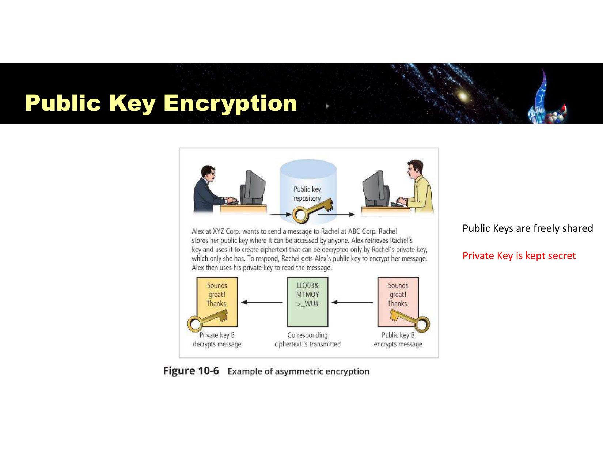
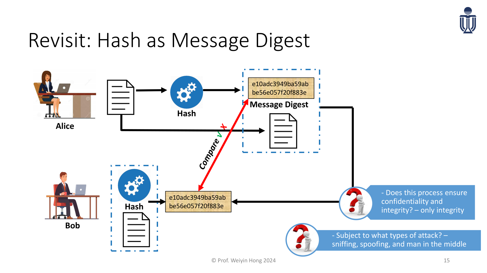
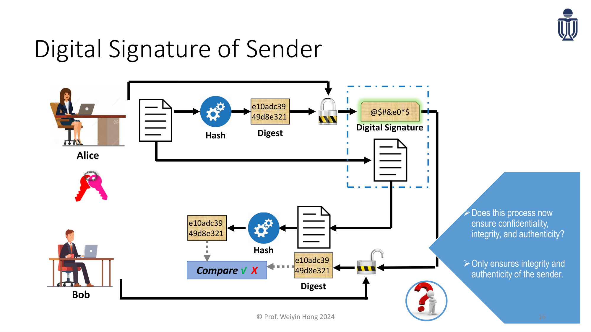
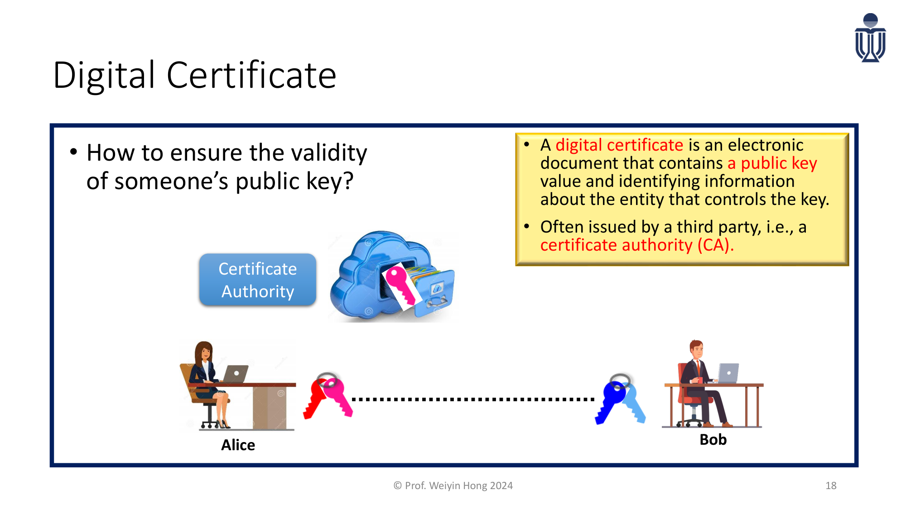
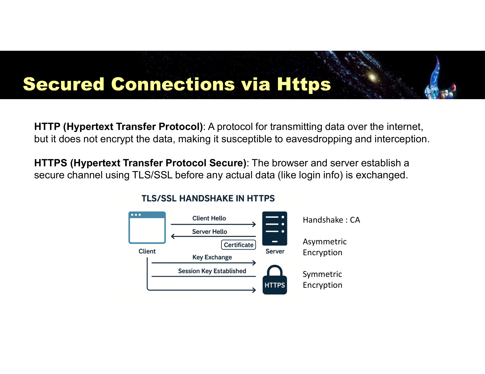
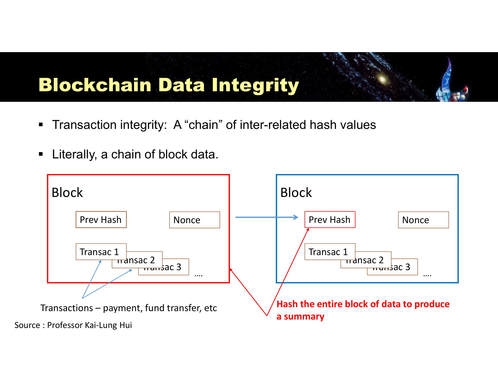

---
title:
  en: "Final Review L4 · Cryptography & PKI"
  zh: "期末复习 L4 · 密码学与 PKI"
summary:
  en: "Lesson 4 for the final: slide definitions, what to understand and likely questions for symmetric and asymmetric encryption, hashing, digital signatures, certificates and CAs, the value of PKI, hybrid cryptography in TLS, blockchain, crypto risks and quantum computing."
  zh: "第 4 课期末版：对称与非对称加密、哈希、数字签名、数字证书与 CA、PKI 的价值、TLS 里的混合加密、区块链、密码学风险与量子计算——每个点给课件原文、需要理解的逻辑和可能的问法。"
week: 4
date: 2026-10-08
unlisted: true
tags: [FinalReview, Cryptography, PKI, DigitalSignature, DigitalCertificate, TLS, Blockchain]
---
# 期末复习 L4 · 密码学与 PKI

**课件**：Lesson 4（45 页）+ PKI 专题（Prof. Weiyin Hong，16 页）　**详细笔记**：[第 4 课复习笔记](../../lectures/lesson-04/)　**总览**：[期末总复习](../final-review/)

> **怎么读这一页**：每个知识点按 **课件原文 → 需要理解 → 可能的问法** 写。
>
> 优先级：🔴 必考核心 · 🟡 需要理解 · 🟢 了解即可  
> 掌握要求：📝 **默写**（能写出名字、定义、清单）· 🔍 **区分**（给场景能判断是哪一个，选择题）· 🧮 **计算** · ✍️ **分析**（能写成有结构的一段论述，长题）

> **🎯 这一课在期末怎么考（老师点名）**
>
> - **老师原话**：对称、非对称、哈希，以及它们**怎么组合成 PKI**（数字证书、数字签名），Assignment 2 考过 TLS。要理解的**不只是加密本身，而是它在业务里怎么用**。→ 本页第 8 节专门讲业务应用。
> - **Assignment 2 的密码学题**：用例子解释对称和非对称的区别 + 对称的 3 个挑战；Hybrid encryption 是什么、TLS 为什么两种都用、各自在 TLS 里的角色。
> - **课件原题 3 道**：Key 的定义、哈希要不要密钥、公钥 + 私钥的方法叫什么。
> - **两次课堂讨论**（简答原型）：对称和非对称的根本区别与对称的局限（p.18）；PKI 给组织带来什么价值、每种密码工具各自做到什么（p.27）。

## 本课大纲

- **[0. 一条主线：问题不断升级](#0-一条主线问题不断升级)**
- **[1. 🟡 加密基础（p.3–8）📝🔍](#1--加密基础p38)**
- **[2. 🔴 对称加密 Symmetric Encryption（p.9–11、p.15）📝✍️](#2--对称加密-symmetric-encryptionp911p15️)**
- **[3. 🔴 非对称加密 Asymmetric Encryption（p.12–14、p.16，PKI p.14）📝🔍](#3--非对称加密-asymmetric-encryptionp1214p16pki-p14)**
- **[4. 🔴 哈希 Hashing（p.19–22）📝🔍](#4--哈希-hashingp1922)**
- **[5. 🔴 Hash → 数字签名 → 数字证书（PKI 专题 p.15–19）📝✍️](#5--hash--数字签名--数字证书pki-专题-p1519️)**
  - [5.1 Step ①：只用 Hash](#51-step-只用-hash)
  - [5.2 Step ②：加上数字签名](#52-step-加上数字签名)
  - [5.3 Step ③：加上数字证书](#53-step-加上数字证书)
- **[6. 🔴 PKI 的价值与密码学四个目标（p.27–28）📝✍️](#6--pki-的价值与密码学四个目标p2728️)**
- **[7. 🔴 Hybrid Cryptography 与 TLS（p.16–17，PKI p.23–30）📝✍️](#7--hybrid-cryptography-与-tlsp1617pki-p2330️)**
- **[8. 🔴 业务里怎么用（老师强调）✍️](#8--业务里怎么用老师强调️)**
- **[9. 🟡 Blockchain（p.30–34）📝🔍](#9--blockchainp3034)**
- **[10. 🟡 风险、挑战与最佳实践（p.36、p.40）📝](#10--风险挑战与最佳实践p36p40)**
- **[11. 🟢 量子计算（p.37–39）✍️](#11--量子计算p3739️)**
- **[12. 本课综合题（长题练习）](#12-本课综合题长题练习)**

---

## 0. 一条主线：问题不断升级

```
① 只让对方看懂               → 加密（对称 / 非对称）
   ↓ 对称密钥怎么安全交给对方？非对称解决了分发
② 确认内容没被改             → Hash（只管完整性，没有密钥）
   ↓ 中间人能改内容再重算 Hash
③ 确认是谁发的、不能抵赖       → Digital Signature（用发送方私钥签摘要）
   ↓ 怎么知道这把公钥真是对方的？
④ 确认公钥属于对方            → Digital Certificate + CA = PKI
   ↓ 非对称太慢，不能全程用
⑤ 又快又安全                  → Hybrid（TLS：非对称握手 + 对称传输）
```

每一步都是「**解决了上一步的什么问题、又留下了什么新问题**」。长题最爱这样问。

---

## 1. 🟡 加密基础（p.3–8）📝🔍

**课件原文**

- Cryptography: **algorithm / formula to protect data**；最早的例子 **Scytale（公元前 487 年）**
- Encryption: **process of converting a message into a form that is unreadable to unauthorized people**；Plaintext → Ciphertext
- **Substitution Cipher**：Vigenère Square（26×26 字母表，用户定义的 encryption key 决定用哪一行）
- **Transposition**（block cipher）：打乱顺序，keep a message secret from unintended audiences

**需要理解**

- **加密 = 算法 + 密钥**。Scytale 里缠绕书写的规则是算法，木棍的粗细是密钥。
- 加密强度由算法和密钥共同决定，**密钥更重要**（p.36）。
- Substitution 换的是字母本身，Transposition 换的是字母位置。

**（课件原题）Which term describes the information used in conjunction with an algorithm to create the ciphertext from the plaintext?**

- A. Cipher
- B. Code
- C. Clear text
- D. Key

> **答案：D**
>
> *EN:* Encryption = algorithm + **key**; the key is the information used with the algorithm to turn plaintext into ciphertext.
>
> 加密 = 算法 + 密钥。

---

## 2. 🔴 对称加密 Symmetric Encryption（p.9–11、p.15）📝✍️

**课件原文**

> - **Same 'secret' key** is used both to encrypt and decrypt the message, also known as **private-key encryption**.
> - Can be programmed into **fast** computing algorithms. Used for **bulk data encryption**: databases, files, network traffic.
> - Both sender and receiver **must possess the same secret key**.
> - If either copy of the key is compromised, an intermediate can decrypt and read messages **without sender / receiver knowledge**.

标准算法 **AES**：金融（交易、账户、支付数据，**PCI DSS** 合规）、加密钱包私钥和助记词、**HTTPS / TLS（after secret key exchange）**、WPA2 / WPA3。

p.15「Systemic Key Cryptography」：

- Number of keys for n parties：**n(n−1)/2**
- Advantage：**simple, fast (1,000–10,000× faster than asymmetric)**；theoretically strong if key is secured
- Disadvantage：**key distribution is a major problem**；**not scalable for larger groups**；**key must be regenerated often**；**does not implement nonrepudiation**

**需要理解**

- 对称的根本问题是**密钥分发**：要先安全地把密钥交给对方，而「安全地交」本身就需要安全通道（先有鸡还是先有蛋）。
- 人数一多，密钥数量爆炸：10 人要 45 把，100 人要 4,950 把。
- 双方共用一把钥匙，所以**无法证明消息是哪一方发的**（没有不可抵赖）。
- 「Private-key encryption」是**对称**加密的别名，不要和非对称里的「私钥」搞混。

**（A2 原题 / A2 question）List 3 challenges with symmetric cryptography.（9 marks）**

> **English**
>
> 1. **Key distribution** — the same secret key must be delivered to the other party through a secure channel before communication; if it is intercepted, all messages can be read.
> 2. **Not scalable** — n parties need n(n−1)/2 keys, which is hard to manage for large groups, and keys must be regenerated often.
> 3. **No nonrepudiation** — both parties hold the same key, so neither can prove who sent a message; it cannot support accountable transactions.
>
> **中文解析**
>
> ① **密钥分发**：通信前必须通过安全渠道把同一把密钥交给对方，密钥在传递中被截获就全部失效；② **不可扩展**：n 方两两通信需要 n(n−1)/2 把密钥，大群体难以管理，且密钥要经常更换；③ **没有不可抵赖**：双方持有同一把密钥，无法证明某条消息是谁发的，不能用于需要追责的交易。

---

## 3. 🔴 非对称加密 Asymmetric Encryption（p.12–14、p.16，PKI p.14）📝🔍



*Public Key Encryption：用 Rachel 的公钥加密，只有 Rachel 的私钥能解（Slide 13）*

**课件原文**

> - Involves **two different keys** (public key and private key), also known as **public-key encryption**.
> - **Either key can be used to encrypt** a message, but then **the other key is required to decrypt** it. If Key A encrypts, only Key B can decrypt.
> - Greatest value when one key serves as **private key** and the other as **public key**. Public keys are freely shared; private key is kept secret.

PKI 专题 p.14 的 Benefits：**easier key management and distribution**；**the private key is never distributed**, therefore more secure；**scalable**。Weakness：**slow to generate fresh strong keys**；**slow to encrypt**。

常见算法：**RSA**、**Diffie-Hellman**、**ECC**。用途（Protect data in motion）：**Secure web traffic**（TLS 握手用 RSA 等验证服务器身份、协商临时共享密钥）；**Remote access (SSH)**（ECDH）。

**需要理解：哪把钥匙干什么（最常考）**

| 目的                   | 发送方用           | 接收方用            |
| -------------------- | -------------- | --------------- |
| **保密**（只有 Bob 能读）    | **Bob 的公钥**加密  | **Bob 的私钥**解密   |
| **签名**（证明是 Alice 发的） | **Alice 的私钥**签 | **Alice 的公钥**验证 |

课件 p.14 的问题「Sender use which key? How about receiver?」就是这张表。

**（课件原题）What term describes a cryptographic method that incorporates mathematical operations involving both a public key and a private key to encipher or decipher a message?**

- A. Private-key encryption
- B. Symmetric encryption
- C. Advanced Encryption Standard (AES)
- D. Asymmetric encryption

> **答案：D**
>
> *EN:* Using both a public and a private key is the definition of **asymmetric** encryption; A, B and C all describe symmetric encryption.
>
> A、B、C 都是对称加密的说法或算法。

**（A2 原题 / A2 question）Explain, with a brief example, the difference between symmetric and asymmetric encryption.（6 marks）**

> **English**
>
> **Symmetric encryption** uses the **same secret key** to encrypt and decrypt. It is fast and suits bulk data, but both parties must share the key first. *Example*: a company encrypts its database with AES, and every authorised system holds the same key.  
> **Asymmetric encryption** uses a **mathematically related public / private key pair**: what one key encrypts, only the other can decrypt. The public key is shared freely and the private key is kept secret, which solves key distribution and enables digital signatures, but it is slow. *Example*: a customer encrypts data with the bank's public key from its certificate, and only the bank's private key can decrypt it.
>
> **中文解析**
>
> 对称：加密和解密用**同一把**密钥，快，适合大量数据，但双方要先共享密钥。例：公司用 AES 加密数据库，所有授权系统持有同一把密钥。非对称：用一对**数学相关的公钥和私钥**，一把加密只有另一把能解，公钥公开、私钥自己保存，解决了密钥分发并支持签名，但慢。例：客户用银行网站证书里的公钥加密，只有银行的私钥能解开。

---

## 4. 🔴 哈希 Hashing（p.19–22）📝🔍

**课件原文**

> Hash functions are mathematical algorithms used to **confirm the identity of a specific message** and **confirm that the content has not been changed**. It generates a **hash value or message digest**. Convert **variable-length** messages into a single **fixed-length** value.

特性：**one-way, irreversible**；**same data → same hash value**；**small change → big change in hash value**；**uniqueness**（不可能找到两条哈希相同的消息，即 hash collision）  
用途：**password storage & protection**；**data integrity verification（message digest）**；**digital signatures**

**需要理解**

- 哈希**不需要密钥**——任何人用同样的算法和输入都能算出同样的结果。这是它最大的弱点：攻击者改了内容可以重新算一个哈希。
- 存密码时存的是哈希（加盐防彩虹表，见 L2）。
- 哈希只提供**完整性**，不提供机密性，也不能证明是谁发的。

**（课件原题）True or False: Hashing functions require the use of keys?**

- A. True
- B. False

> **答案：B**
>
> *EN:* **False** — hash functions use no key, which is why a hash alone cannot prove who sent a message.
>
> 不需要密钥。

---

## 5. 🔴 Hash → 数字签名 → 数字证书（PKI 专题 p.15–19）📝✍️

这是全课设计最精心的部分，三张图层层递进。配合下面的互动组件一起看：

*（网页版此处可交互：切换 Hash / Signature / Certificate 三种模式，勾选「篡改内容」「冒充身份」看 Bob 会不会被骗；下表是同一套规则跑一遍全部组合）*

| 场景                                       | 摘要比对 | CA 检查 | 结果          |
| ---------------------------------------- | ---- | ----- | ----------- |
| 只用 Hash · 无攻击                            | 一致   | —     | 正确接受        |
| 只用 Hash · 中间人篡改内容                        | 一致   | —     | **Bob 被骗了** |
| + Digital Signature · 无攻击                | 一致   | —     | 正确接受        |
| + Digital Signature · 攻击者冒充 Alice        | 一致   | —     | **Bob 被骗了** |
| + Digital Signature · 中间人篡改内容            | 不一致  | —     | 正确拒绝        |
| + Digital Certificate (CA) · 无攻击         | 一致   | 通过    | 正确接受        |
| + Digital Certificate (CA) · 攻击者冒充 Alice | 一致   | 拒绝    | 正确拒绝        |
| + Digital Certificate (CA) · 中间人篡改内容     | 不一致  | 通过    | 正确拒绝        |

### 5.1 Step ①：只用 Hash



*Alice 把消息和哈希一起发给 Bob，Bob 重算比对（PKI p.15）*

**课件原文**：Does this process ensure confidentiality and integrity? — **only integrity**. Subject to what types of attack? — **sniffing, spoofing, and man in the middle**.

**需要理解**：没有密钥，中间人可以改内容、重算哈希，Bob 比对仍然一致。所以只是**脆弱的完整性**，也没有机密性（消息是明文）。

### 5.2 Step ②：加上数字签名



*Alice 用自己的私钥加密摘要 = 数字签名；Bob 用 Alice 的公钥解开再比对（PKI p.16）*

**课件原文**：Does this process now ensure confidentiality, integrity, and authenticity? — **Only ensures integrity and authenticity of the sender.**

**需要理解**

- 做法：Alice 先哈希消息得到摘要，再用**自己的私钥**加密摘要 → 签名。Bob 用 **Alice 的公钥**解开签名得到原摘要，和自己重算的摘要比对。
- 攻击者没有 Alice 的私钥，改了内容就签不出能对上的签名 → 篡改被发现；能用 Alice 公钥解开 → 证明是持有 Alice 私钥的人签的（**真实性**，也带来**不可抵赖**）。
- 仍然**没有机密性**（签名不是加密消息本身）。
- **新问题**：Bob 怎么知道这把公钥真的属于 Alice？攻击者可以拿自己的密钥对冒充。

### 5.3 Step ③：加上数字证书



*证书 = 用户公钥 + CA 的数字签名 + 有效期（PKI p.18–19）*

**课件原文**

> A digital certificate is an electronic document that contains **a public key value and identifying information about the entity that controls the key**. Often issued by a third party, i.e., a **certificate authority (CA)**.  
> 证书内容：**User's public key · CA's digital signature · Validation period**

主课件 p.24：Digital certificates provide communicating parties with the **assurance that the people they are communicating with truly who they claim to be**; essentially **endorsed copies of individual's public key**. CA 例子：Symantec、IdenTrust、AWS、GlobalSign、Comodo、Entrust、DigiCert。

**需要理解**

- 证书由**大家都信任的 CA** 签名，背书「这把公钥属于这个身份」。Bob 先验证证书（是不是受信任的 CA 签的、在不在有效期），再用里面的公钥验签名。
- 攻击者能自己生成密钥对，但**没法让受信任的 CA 给他签一张写着 Alice 的证书**。
- 课堂实操（Amazon 证书）要会回答：哪个 CA 签发、根 CA 是谁、有效期、主体公钥、证书签名用的哈希函数。

**Explain why a digital certificate solves a problem that a digital signature alone cannot.**

> **English**
>
> A digital signature only proves that **whoever holds the private key** signed the message; it cannot prove that the matching public key really belongs to the claimed person. An attacker can sign with their own key pair and pass off the public key as Alice's, and verification still succeeds mathematically. A **digital certificate**, signed by a trusted **certificate authority (CA)**, binds the public key to the owner's identity with a validity period. Bob first checks that the certificate chains to a root CA he trusts; an impostor cannot obtain such a certificate, so the impersonation is rejected.
>
> **中文解析**
>
> 数字签名只能证明「持有这把私钥的人签了这条消息」，但无法证明对应的公钥真的属于声称的人：攻击者可以用自己的密钥对签名，再谎称那是 Alice 的公钥，验证在数学上照样通过。证书由受信任的第三方 CA 签名，把公钥和身份绑定在一起，并有有效期；Bob 先验证证书链指向自己信任的根 CA，冒充者拿不到这样的证书，就会被拒绝。

**For each step — hash only, + digital signature, + digital certificate — state which security properties are achieved.**

> **English**
>
> - **Hash only**: weak integrity — a man-in-the-middle can alter the message and recompute the hash.
> - **+ Digital signature**: integrity plus **authenticity of the sender** (and nonrepudiation); still no confidentiality.
> - **+ Digital certificate**: also confirms the public key belongs to the claimed identity, preventing impersonation.  
>   Confidentiality additionally requires encryption — in practice a hybrid system.
>
> **中文解析**
>
> 只有 Hash：脆弱的完整性（中间人可重算）；+ 数字签名：完整性 + 发送方真实性（以及不可抵赖），仍无机密性；+ 数字证书：在签名基础上确认公钥属于声称的身份，防止冒充。要机密性还需要加密（实际用 hybrid）。

---

## 6. 🔴 PKI 的价值与密码学四个目标（p.27–28）📝✍️

**课件原文（p.27 课堂讨论的答案）**

- **Trust Establishment and Identity Verification**
- **Data Confidentiality and Integrity Protection**
- Typical PKI solution integrates：**A certificate authority (CA)** · **Certificate Enrollment** · **Verification** · **Revocation**

**四个根本目标（p.28）**：**Confidentiality · Integrity · Authentication · Nonrepudiation**（nonrepudiation means customers or partners can be **held accountable for transactions**, such as online purchases, which they **cannot later deny**）

**需要理解**

- PKI 的核心价值：让**互不认识的双方**能规模化地建立信任。没有 PKI，每两方都要事先见面交换密钥。
- **Revocation（吊销）** 容易漏：私钥泄露或员工离职时，要能宣布证书作废。
- 各工具做到什么：对称 → 机密性（快）；非对称 → 机密性 + 密钥分发；哈希 → 完整性；签名 → 完整性 + 真实性 + 不可抵赖；证书 / CA → 身份信任。

**（课堂讨论 / class discussion）How does public key infrastructure add value to an organisation seeking to use cryptography to protect information assets?（10 marks）**

> **English**
>
> 1. **Trust establishment and identity verification** — CAs issue certificates binding public keys to identities, so customers know they reach the real bank website and partners can verify who signed a document.
> 2. **Confidentiality and integrity protection** — certified public keys are used to negotiate session keys securely (TLS), and signatures detect tampering.
> 3. **Nonrepudiation** — parties cannot later deny e-contracts or online purchases.
> 4. **Scalability** — no pairwise key exchange is needed; public keys can be published openly.
> 5. **Manageability** — enrolment, verification and **revocation** manage the certificate lifecycle, e.g. revoking a certificate when a private key leaks or an employee leaves.
>
> **中文解析**
>
> ① **建立信任、验证身份**：CA 签发证书，把公钥和身份绑定，客户能确认自己连的是真的银行网站，合作方能确认签名者身份；② **保护机密性和完整性**：证书里的公钥用于安全协商会话密钥（TLS），签名用于检测篡改；③ **不可抵赖**：电子合同、网购交易事后不能否认；④ **可规模化**：不需要两两交换密钥，公钥可以公开发布；⑤ **可管理**：通过注册、验证、吊销管理证书生命周期，私钥泄露或员工离职时能吊销证书。

---

## 7. 🔴 Hybrid Cryptography 与 TLS（p.16–17，PKI p.23–30）📝✍️



*HTTPS：Client Hello / Server Hello → Certificate → 非对称协商 → Key Exchange → 对称加密传输（Slide 17）*

**课件原文**

> **Hybrid Cryptography System**：Asymmetric key algorithm is used **to verify the identity of the owner and its public key**. Once connection is built, **symmetric key (session key)** is used to encrypt and decrypt **all following traffic** between the two parties.  
> HTTP does not encrypt the data, making it susceptible to eavesdropping. **HTTPS**: the browser and server establish a **secure channel using TLS/SSL before any actual data** is exchanged.

| 环境              | 协议                 |
| --------------- | ------------------ |
| Web (https\://) | SSL、TLS            |
| Email           | S/MIME、PEM、**PGP** |
| Wireless        | WEP、WPA、WPA2、WPA3  |
| Bluetooth       | Passkey only       |

PGP：**hybrid cryptosystem**，free or low cost，邮件和文件加密的开源标准；**compress (ZIP) after signing, before encrypting**。  
Bluetooth：约 30 英尺范围内可被利用；不接受陌生配对、不在公共场所配对、删除不用的连接、不用时关闭。

**需要理解：TLS 里两种加密各自的角色**

| 阶段 | 用什么                      | 作用                                         |
| -- | ------------------------ | ------------------------------------------ |
| 握手 | **证书 + 非对称**（RSA / ECDH） | 验证服务器身份（证书由 CA 签）；安全地协商出 session key，不怕被窃听 |
| 传输 | **对称**（AES）              | 用 session key 加密网页数据，快，扛得住大流量              |
| 全程 | **哈希 / MAC**             | 检查数据在传输中没被改                                |

为什么不只用一种：只用对称 → 没法在不安全的网络上安全地交换密钥，也验证不了对方身份；只用非对称 → 太慢（慢 1,000–10,000 倍），不适合大量数据。

**（A2 原题 / A2 question）Explain hybrid encryption (3). Why does TLS use both asymmetric and symmetric encryption rather than one type (4)? Include the specific roles each plays in a TLS session (8).**

> **English**
>
> **Hybrid encryption**: asymmetric cryptography verifies identities and securely exchanges a temporary symmetric **session key**; all subsequent data is encrypted with that symmetric key.  
> **Why both**: symmetric encryption is fast but cannot distribute keys securely over a public network or verify identity; asymmetric encryption solves key distribution and authentication but is 1,000–10,000 times slower, unsuitable for bulk data. Combining them gets the strengths of each.  
> **Roles in a TLS session**:
>
> 1. In the handshake the server presents a **CA-signed certificate**; the client verifies it with the CA's public key, authenticating the server.
> 2. An **asymmetric** algorithm (RSA or ECDH) negotiates the **session key**, which eavesdroppers cannot obtain.
> 3. All web data is then encrypted with a **symmetric** algorithm (AES) using the session key — fast enough for bulk traffic.
> 4. Each record carries an **integrity check** (hash-based MAC) to detect tampering.
> 5. The session key is discarded when the session ends and renegotiated next time.
>
> **中文解析**
>
> **Hybrid**：用非对称加密验证身份并安全交换一把临时的对称会话密钥，之后所有数据用这把对称密钥加密。  
> **为什么两种都用**：对称快但无法在公共网络上安全分发密钥，也不能验证身份；非对称能解决分发和身份验证，但比对称慢 1,000–10,000 倍，不适合大量数据。组合起来兼得两者的优点。  
> **TLS 中的角色**：① 握手时服务器发送 CA 签发的证书，客户端用 CA 公钥验证证书，确认服务器身份；② 用非对称算法（RSA 或 ECDH）协商出会话密钥，窃听者拿不到；③ 之后的网页数据都用对称算法（AES）和会话密钥加密，速度快；④ 每条记录附带完整性校验，检测篡改；⑤ 会话结束后会话密钥作废，下次重新协商。

---

## 8. 🔴 业务里怎么用（老师强调）✍️

老师说要知道密码学**在业务里怎么组合起来用**。准备好下面这些场景，每个都能说出「用了哪几种技术、解决了什么」：

| 业务场景                         | 用到的技术                                      | 解决的问题                                                |
| ---------------------------- | ------------------------------------------ | ---------------------------------------------------- |
| **网银 / 网购 HTTPS**            | 证书（验证网站）+ 非对称（协商会话密钥）+ 对称 AES（传输）+ 哈希（完整性） | 不被冒充、不被窃听、不被篡改                                       |
| **电子合同 / 交易确认**              | 哈希 + 发送方私钥签名 + 证书                          | 真实性、完整性、**不可抵赖**                                     |
| **软件更新 / 安装包签名**（PKI 课堂实操 1） | 厂商用私钥签名，用户用证书验证                            | 确认安装包来自真厂商、没被改（SolarWinds 的教训：签名本身也可能被滥用，所以构建过程也要保护） |
| **密码存储**                     | 加盐哈希                                       | 数据库被偷也拿不到明文密码                                        |
| **数据库 / 备份加密**               | 对称 AES + 密钥管理                              | 数据被偷也读不了（PCI DSS 要求）                                 |
| **远程办公**                     | VPN（IPSec / TLS）、SSH                       | 公共网络上的机密性、完整性、身份验证                                   |
| **Passkey 无密码登录**（L6 开场）     | 设备存私钥、服务器存公钥、对随机 challenge 签名、绑定域名         | 防重放、服务器被攻破也没密码可偷、防钓鱼                                 |
| **区块链**                      | 每块存上一块的哈希 + 每个参与者用 PKI 签交易                 | 完整性、来源可验证、不可抵赖（但**不提供机密性**）                          |

---

## 9. 🟡 Blockchain（p.30–34）📝🔍



*每个 Block 保存上一个 Block 的哈希（Prev Hash），串成哈希链（Slide 33）*

**课件原文**

> Blockchain is a **peer-to-peer, distributed ledger** that is **cryptographically-secure, append-only, immutable** (extremely hard to change), and **updateable only via consensus** or agreement among peers.

- Peer-to-peer：no central controller，不需要银行或 VISA 这类第三方
- Distributed ledger：each peer holds **a copy of the complete ledger**
- Cryptographically-secure：provides **non-repudiation, data integrity and data origin authentication**
- Satoshi Nakamoto 2008；去中心化，**no single party can shut the system down**
- Transaction integrity：**a chain of inter-related hash values**
- **Cryptography is a MUST**：everyone must use **PKI**, no opt-out；**Bitcoin blockchain is the largest civilian deployment of PKI in the world**
- 课件问题：Does blockchain provide **confidentiality** on the transactions within the block?

**需要理解**

- 为什么难改：改了一个旧块的交易，它的哈希就变了，后面每一块的 Prev Hash 都对不上，要全部重算并说服大多数节点。
- 课件问题的答案：**不提供机密性**。账本对所有节点公开，提供的是完整性、来源认证和不可抵赖。

---

## 10. 🟡 风险、挑战与最佳实践（p.36、p.40）📝

**课件原文**

- Strength of encryption：**Encryption + Key** determine the strength（**key more important**）
- **Risks**：**key theft**、**insider threats**、**cryptographic algorithm obsolescence**
- **Challenges**：**balancing security and usability**、**system integration**
- **Best practices**：**strong key management**、**layered security**、**regular audits**
- Importance of **user education**

**需要理解**：再强的算法，密钥被偷或管理不善就没用，所以密钥管理是重点。「算法过时」直接连到下面的量子计算。

---

## 11. 🟢 量子计算（p.37–39）✍️

**课件原文**

- Quantum computing uses **qubits** in **superpositions**，可以同时做大量运算
- Today's computers would take **thousands, even millions of years** to crack RSA; a suitably powerful quantum computer could do it **in minutes**
- **Quantum Computing – Not a 2036 Problem**（KPMG）；Quantum Resilience & **PQC**

**需要理解**：现在就要盘点自己用了哪些加密算法、规划 PQC 迁移；对手可能**现在偷、以后解**（Harvest now, decrypt later），所以长期敏感的数据已经有风险。这是「cryptographic algorithm obsolescence」风险的具体例子。

---

## 12. 本课综合题（长题练习）

**A customer logs into an online bank. Walk through how symmetric encryption, asymmetric encryption, hashing, digital signatures and certificates each contribute to making the session secure.（15 marks）**

> **English**
>
> 1. The bank's server presents a **digital certificate** issued by a CA, containing the bank's public key and the CA's signature.
> 2. The browser verifies the CA's **digital signature** with a trusted root CA key and checks the validity period and domain — confirming it is the real bank.
> 3. The two sides use **asymmetric** cryptography (RSA / ECDH) to agree a session key that eavesdroppers cannot obtain.
> 4. Login details and transactions are then encrypted with **symmetric** AES and the session key — fast enough for the whole session.
> 5. **Hash**-based integrity checks on every record reveal any tampering.
> 6. The bank stores passwords only as **salted hashes**.
> 7. Signed transaction confirmations provide **nonrepudiation**.  
>    Each tool covers one property, and PKI combines them into trust that scales.
>
> **中文解析**
>
> ① 浏览器连接时，银行服务器发出由 CA 签发的**数字证书**，证书里有银行的公钥和 CA 的签名；② 浏览器用信任的根 CA 公钥验证证书签名（**数字签名**），并检查有效期和域名，确认对方确实是银行；③ 双方用**非对称**算法（RSA / ECDH）协商出一把会话密钥，窃听者无法得到；④ 之后的登录信息和交易数据都用**对称** AES 和会话密钥加密，速度快；⑤ 每条数据附带基于**哈希**的完整性校验，篡改会被发现；⑥ 银行存密码时只存加盐哈希；⑦ 交易确认可用签名提供不可抵赖。结论：每种工具各管一项，PKI 把它们组合成可规模化的信任。
