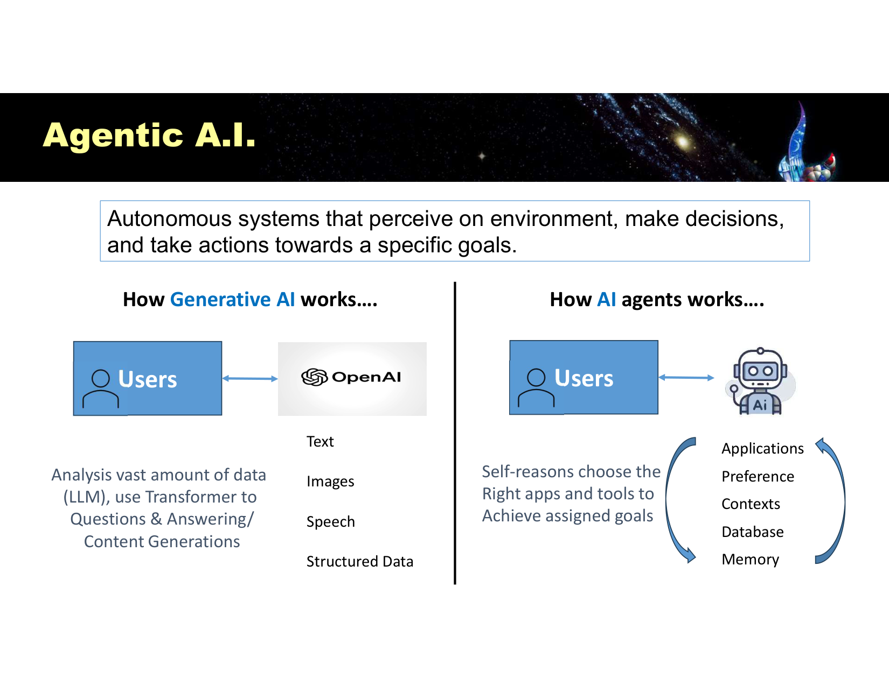
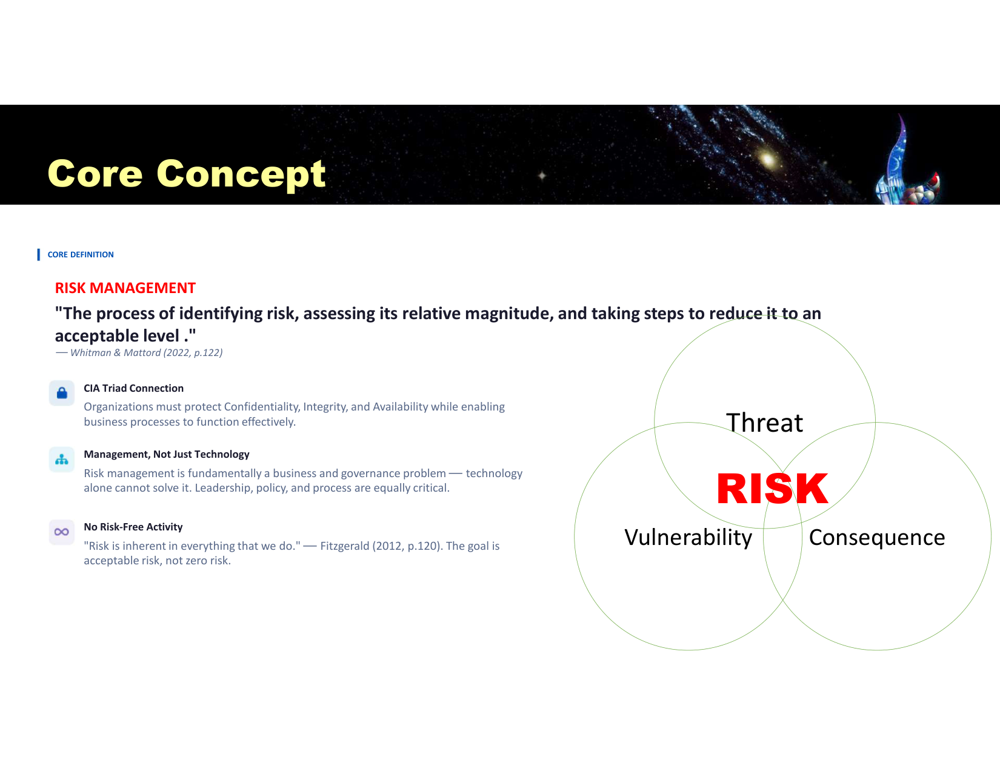
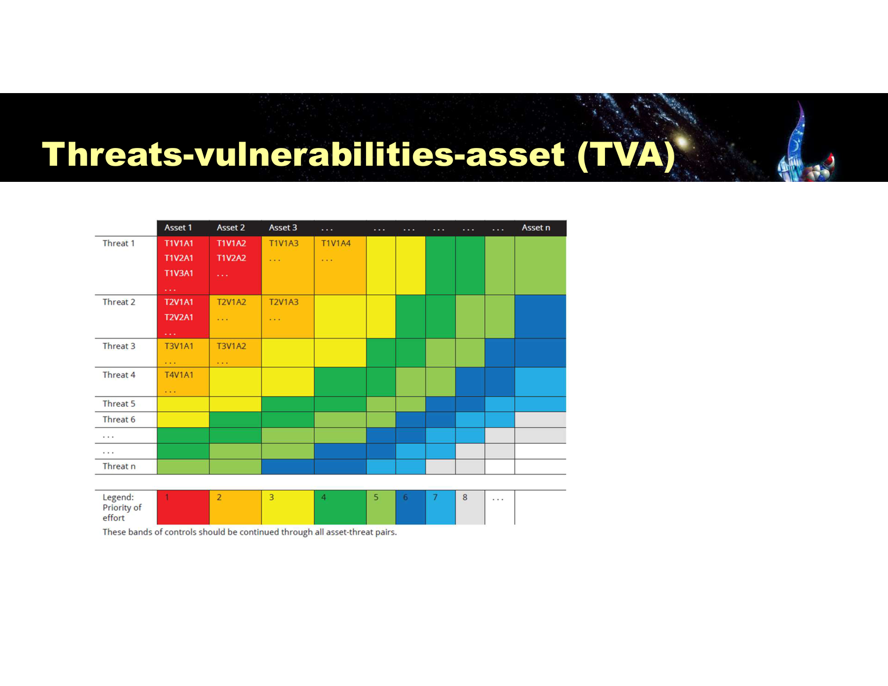
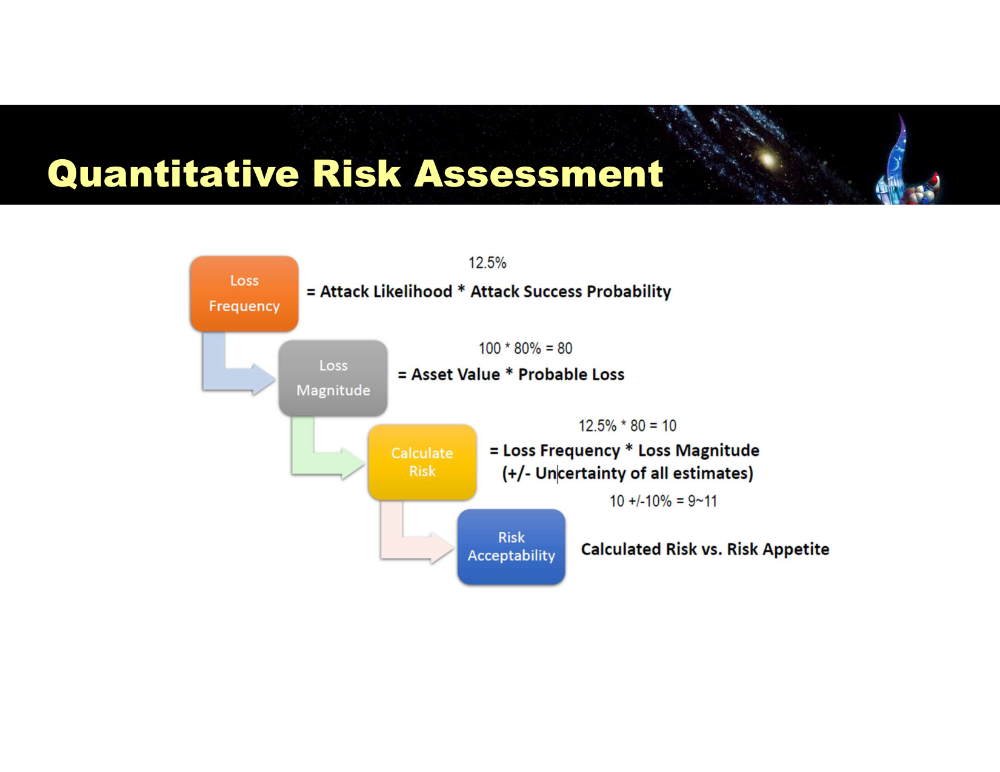
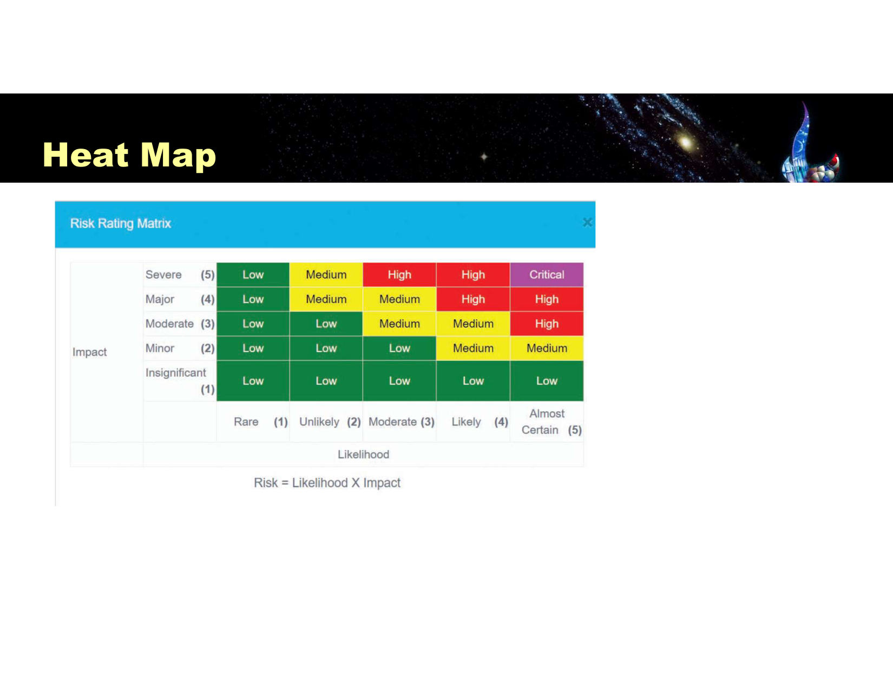

---
title:
  en: "Final Review L5 · Risk Management & AI Risk"
  zh: "期末复习 L5 · 风险管理与 AI 风险"
summary:
  en: "Lesson 5 for the final: slide definitions, what to understand and likely questions for AI risks, shadow AI, AI for security, the definition of risk, risk appetite, the risk management process, quantitative assessment and heat maps, and the four risk treatment strategies."
  zh: "第 5 课期末版：AI 风险、Shadow AI、AI 用于防御、风险的定义、风险胃口、风险管理流程、定量评估与热力图、四种风险处理策略——每个点给课件原文、需要理解的逻辑和可能的问法。"
week: 5
date: 2026-10-08
tags: [FinalReview, RiskManagement, RiskAppetite, RiskTreatment, HeatMap, ShadowAI]
---
# 期末复习 L5 · 风险管理与 AI 风险

**课件**：Lesson 5（48 页）　**详细笔记**：[第 5 课复习笔记](../../lectures/lesson-05/)　**阅读**：[CrowdStrike 2024](../../readings/crowdstrike-2024/)　**总览**：[期末总复习](../final-review/)

> **怎么读这一页**：每个知识点按 **课件原文 → 需要理解 → 可能的问法** 写。
>
> 优先级：🔴 必考核心 · 🟡 需要理解 · 🟢 了解即可  
> 掌握要求：📝 **默写**（能写出名字、定义、清单）· 🔍 **区分**（给场景能判断是哪一个，选择题）· 🧮 **计算**（要带计算器）· ✍️ **分析**（能写成有结构的一段论述，长题）

> **🎯 这一课在期末怎么考（老师点名）**
>
> - **老师原话**：Lesson 5 讲了**怎么衡量风险**，另外「**risk treatment** is important to remember」——「It's not about the risk, but as a management, how would you treat the risk」。→ 本页第 2.9 节按最高优先级。
> - **计算**：定量风险评估四步公式（和 L6 的 SLE / ALE 是同一回事）。
> - **课件原题**：Quick Quiz「加控制降低剩余风险 = Mitigation」。
> - **AI 部分**：小组项目和老师最后一课的点评都围绕「AI 怎么帮安全、有什么风险」，可能变成长题的一个角度。

## 本课大纲

- **[1. AI 风险](#1-ai-风险)**
  - [1.1 🟡 Predictive / Generative / Agentic AI（p.4–7）🔍](#11--predictive--generative--agentic-aip47)
  - [1.2 🟡 AI 风险的三个视角（p.8）📝🔍](#12--ai-风险的三个视角p8)
  - [1.3 🟡 AI 的两大局限（p.9–10）📝](#13--ai-的两大局限p910)
  - [1.4 🟡 Shadow AI（p.11–13）📝✍️](#14--shadow-aip1113️)
  - [1.5 🟡 AI for Security 与 AI 治理（p.14–17）📝✍️](#15--ai-for-security-与-ai-治理p1417️)
- **[2. 风险管理](#2-风险管理)**
  - [2.1 🔴 术语复习（p.23）🔍](#21--术语复习p23)
  - [2.2 🔴 Risk 与 Risk Management 的定义（p.24–25）📝✍️](#22--risk-与-risk-management-的定义p2425️)
  - [2.3 🔴 Risk Appetite（p.26–27）📝](#23--risk-appetitep2627)
  - [2.4 🔴 风险管理六步流程（p.28–30）📝](#24--风险管理六步流程p2830)
  - [2.5 🟡 Risk Identification 与资产清单（p.31–33）📝](#25--risk-identification-与资产清单p3133)
  - [2.6 🟡 Risk Analysis 与 TVA 矩阵（p.34–35）📝🔍](#26--risk-analysis-与-tva-矩阵p3435)
  - [2.7 🔴 定量风险评估（p.36）📝🧮](#27--定量风险评估p36)
  - [2.8 🔴 Heat Map（p.37）📝🔍](#28--heat-mapp37)
  - [2.9 🔴 四种 Risk Treatment（p.38–44）★老师点名 📝🔍✍️](#29--四种-risk-treatmentp3844老师点名-️)
  - [2.10 🟡 风险管理为什么失败（p.45–46）📝✍️](#210--风险管理为什么失败p4546️)
- **[3. 本课综合题（长题练习）](#3-本课综合题长题练习)**

---

## 1. AI 风险

### 1.1 🟡 Predictive / Generative / Agentic AI（p.4–7）🔍

*How Generative AI works vs How AI agents work（Slide 7）*

**课件原文**

- AI 演进：**Predictive AI**（credit tech、fraud detection）→ **Generative AI**（productivity、content generation）→ **Agentic AI**（autonomous execution）
- Generative AI：uses **deep learning** / multi-layer neural networks（**Generative Pre-trained Transformer**）to identify patterns and **generate new and original content**
- Chat and GPT：**Chat collects messages; GPT generates a response from the supplied context**（context window = dialogue + history + rule）。**GPT is a type of LLM; ChatGPT is an application built around models.**
- **Agentic AI**：**Autonomous systems that perceive the environment, make decisions, and take actions towards specific goals**；self-reasons to choose the right apps and tools；有 memory（database）

**需要理解**：Generative AI 的错是「一段错的内容」；Agentic AI 会**真的调用工具去执行** → 错误变成「一个被执行的错误动作」（转错账、删数据），风险更高。

**Why is Agentic AI riskier than Generative AI, even though both can hallucinate?**

> Generative AI 出错只产生错误的文字，由人决定是否采用；Agentic AI 会自主选择工具、访问数据库、执行操作，如果判断基于幻觉或被 prompt injection 操纵，后果是真实执行的错误动作（转账、删除、外发数据），而且可能没有人在回路中把关。

### 1.2 🟡 AI 风险的三个视角（p.8）📝🔍

**课件原文**

| AI for Risk Management                                                           | Risks from using AI                                                     | Risks from others using AI                                       |
| -------------------------------------------------------------------------------- | ----------------------------------------------------------------------- | ---------------------------------------------------------------- |
| Transaction monitoring at scale                                                  | **Hallucination**（fabricate facts, citations, rationales）               | **Hyper-personalized phishing** at scale                         |
| Credit risk & underwriting                                                       | **Bias** and unfair outcome                                             | **Deepfake** voice / video for social engineering                |
| **UEBA**：real-time abnormal detection                                            | **Explainability gaps**（can't defend it to regulators, auditors, court） | **Synthetic identity** factories                                 |
| Operational risk analytics（NLP mines incident reports, audit findings）           | **Model drift** and decay                                               | Automated scam conversation（chatbot）                             |
| **Third-party / vendor risk**（AI scans contracts, SOC reports, news, financials） | **Adversarial manipulation**（probe model, poison data, craft inputs）    | **Evasion** of fraud controls（probe thresholds, stay just under） |
|                                                                                  | Regulatory and legal uncertainty；IP and copyright                       | Document forgery on demand                                       |

**需要理解**：给一个场景，要能判断属于哪一栏。「员工用未批准的 AI 处理客户合同」→ Risks from using AI（Shadow AI）；「攻击者用 AI 克隆 CFO 声音」→ Risks from others using AI。

### 1.3 🟡 AI 的两大局限（p.9–10）📝

**课件原文**

- Limitation I：**Hallucinations, Injection & Reasoning**——models are **probabilistic pattern-matchers, not fact databases**。包括 hallucinations、reasoning gaps、**prompt injection & hacking**（jailbreaking、indirect injection）、deepfakes & misinformation、**context window limits**
- Limitation II：**Ethics, Bias and the Black Box**——training data bias、data drift、「black box」在传统机器学习里早就存在

**需要理解**：模型预测的是「统计上最可能的下一个词」，通顺不等于正确；它会把藏在网页里的恶意文字当成上下文执行，所以 prompt injection 很危险（L2：外部文本当数据不当指令）。

### 1.4 🟡 Shadow AI（p.11–13）📝✍️

**课件原文**

> Definitions：**Unauthorized or unsanctioned use of A.I. tools within organizations**  
> Risk：**data exposure, lack of governance, inconsistent security controls**  
> Example：**Samsung 2023** data leakage — use of unauthorized AI tools by employees  
> Prevention：**A.I. governance policies, user training**  
> Trend：say **"How" instead of "No"** to Gen AI

Cost of ungoverned shadow AI（Fortinet 2026）：医疗用 ChatGPT 总结病历违反 HIPAA、金融借贷 AI 延续歧视、制造业代码经 AI 助手泄露。

**需要理解**：单纯禁止只会把使用逼到看不见的地方，这正是 Shadow AI 的成因。所以要提供**经批准的工具 + 使用规则 + 培训**。

**How should an organisation manage Shadow AI risk?**

> ① 制定 AI 治理政策：哪些工具获批、哪些数据不能输入、谁负责审批；② 提供经批准的企业版 AI 工具，满足员工需求（How, not No）；③ 用户培训，说明数据外泄风险（Samsung 案）；④ 技术控制：DLP、访问控制、监控未经批准的 AI 服务；⑤ 定期审计 AI 使用情况。

### 1.5 🟡 AI for Security 与 AI 治理（p.14–17）📝✍️

**课件原文**

- AI is transforming defensive cybersecurity：enhance platforms, **detect sophisticated attacks, automate tasks, respond rapidly**；real-time analyse vast amounts of security event data
- AI-enhanced tools：① **Firewall / NGFW**——ML-driven multi-layer packet inspection, zero-day detection, adaptive rule tuning ② **IDPS / EDR / XDR**——deep-learning classifiers detect novel intrusions **without signatures** ③ **Threat hunting & malware analysis** ④ **UEBA** ⑤ **Agentic testing under guardrail**
- AI Governance：**Governance · Fairness · Transparency · Data Privacy · Accountability · Safety**
- 项目要求：向董事会说明 Gen AI / LLM 怎么提升 Protection、Detection、Threat Intelligence / Malware Analysis、SOAR 的效率，给真实例子、**可量化收益**和**风险**

**需要理解（结合老师最后一课的点评）**

- 按 **P / D / R** 组织 AI 的作用（老师推荐的 IBM 视频就是这个结构）。
- 量化收益**不要以裁员为主**：5 人团队省 30% 实际上省不出人，而且会引起员工抵触。应讲**缩短检测和响应时间（dwell time、MTTR）→ 减少损失**。
- 同时写 AI 自身的风险（1.2–1.4）和对应控制（人在回路、治理政策、供应商 SLA）。

---

## 2. 风险管理

### 2.1 🔴 术语复习（p.23）🔍

和 L2 相同：Threat、Vulnerability、Exploit、**Attack（an event that can cause negative impact (CIA) to an organization）**、Risk。详见 [L2 复习 §1.1](../final-l2/)。

### 2.2 🔴 Risk 与 Risk Management 的定义（p.24–25）📝✍️

*Threat ∩ Vulnerability ∩ Consequence = RISK（Slide 25）*

**课件原文**

> **(Downside) Risk**：Any event or actions that may **adversely affect an organization's ability to achieve its objective** and execute its strategies or, alternatively, **the quantifiable likelihood of loss or less-than-expected returns**（McNeil, Alexander and Paul, 2015）  
> **Risk Management**：「**The process of identifying risk, assessing its relative magnitude, and taking steps to reduce it to an acceptable level.**」（Whitman & Mattord, 2022）  
> Core concept：**Threat ∩ Vulnerability ∩ Consequence = RISK**

三条原则：

1. **CIA Triad Connection**：protect CIA **while enabling business processes** to function
2. **Management, Not Just Technology**：risk management is fundamentally a **business and governance problem**; leadership, policy, process equally critical
3. **No Risk-Free Activity**：「Risk is inherent in everything that we do」——the goal is **acceptable risk, not zero risk**

**需要理解**

- 三者缺一就没有风险：有威胁没漏洞、有漏洞没威胁、或者两者都有但没后果。所以降低风险可以从三个方向入手。
- 目标是「可接受」，所以必须先定**风险胃口**。

### 2.3 🔴 Risk Appetite（p.26–27）📝

**课件原文**

> Risk appetite is defined as **the amount and type of risk an organization is willing to take in order to meet its strategic objectives**（ISO 31000）.  
> Different appetites depending on **sector, culture and objectives**; may change over time.  
> Risk appetite and tolerance need to be **high on any board's agenda**; core consideration of enterprise risk management.  
> **Risk Appetite & Risk Limit will be in the Board Agenda.**

**需要理解**：风险胃口是一条**线**，评估阶段拿风险和它比：低于线可以接受，高于线必须处理。它由**董事会**定，是管理层决策，不是技术参数。

### 2.4 🔴 风险管理六步流程（p.28–30）📝

**课件原文**（课件连续列了两遍）

1. **Establishing the context**
2. **Identifying risk**
3. **Analyzing risk**
4. **Evaluating the risk** and **comparing uncontrolled risks against the risk appetite**
5. **Treating the unacceptable risk**
6. **Summarizing the findings**

参考框架：**NIST Cybersecurity Framework 2.0**（**Govern**、Identify、Protect、Detect、Respond、Recover；Govern 是 2.0 新加的）；其他：ISO 27001、COBIT。

**需要理解**：第 4 步才和风险胃口比较，第 5 步只处理**超出胃口**的风险。NIST CSF 2.0 的六个功能也可以用来组织「安全计划」类长题。

### 2.5 🟡 Risk Identification 与资产清单（p.31–33）📝

**课件原文**

Identifying risk：creating an **inventory of information assets** → **classifying** them → **assigning a value** → **identifying threats** → **pinpointing vulnerable assets** by tying specific threats to specific assets

资产六类：**People**（internal / external personnel）、**Procedures**、**Data**（in transmission, processing, storage — **the core asset to protect**）、**Software**、**Hardware**、**Networking**

**需要理解**：「人」和「流程」也是资产。没有资产清单就做不了风险评估（L6 的 KPMG 缺口 1：没记录清楚「皇冠上的宝石」）。

### 2.6 🟡 Risk Analysis 与 TVA 矩阵（p.34–35）📝🔍

**课件原文**

Risk analysis：determining the **likelihood** that vulnerable systems will be attacked → assessing **relative risk** so control activities focus on the most urgent → calculating risks in the current setting → looking at **controls** for identified vulnerabilities → **documenting and reporting** findings

*Threats-Vulnerabilities-Asset（TVA）矩阵：交叉格填威胁 × 漏洞组合，按颜色标处理优先级（Slide 35）*

**需要理解**：TVA 矩阵把「哪个威胁利用哪个漏洞打哪个资产」排成表，再按颜色排处理顺序，把抽象的风险变成具体的待办清单。

### 2.7 🔴 定量风险评估（p.36）📝🧮

*Loss Frequency × Loss Magnitude = Calculated Risk，再和 Risk Appetite 比较（Slide 36）*

**课件原文（四步）**

| 步骤                   | 公式                                                 | 课件例子                           |
| -------------------- | -------------------------------------------------- | ------------------------------ |
| ① Loss Frequency     | **Attack Likelihood × Attack Success Probability** | 25% × 50% = 12.5%              |
| ② Loss Magnitude     | **Asset Value × Probable Loss**                    | 100 × 80% = 80                 |
| ③ Calculate Risk     | **Loss Frequency × Loss Magnitude**（± uncertainty） | 12.5% × 80 = 10，±10% → 9 \~ 11 |
| ④ Risk Acceptability | **Calculated Risk vs Risk Appetite**               | 超出 → 要处理                       |

**需要理解**

- 每个输入都是估计值，所以要带 ± 不确定性，**用区间上限和风险胃口比**更保守。
- 和 L6 的对应：**Loss Frequency ≈ ARO**，**Loss Magnitude ≈ SLE**，**Calculated Risk ≈ ALE**。题目给哪套符号就用哪套。

*（网页版此处可交互：自己调 Asset Value / Likelihood / Probable Loss 等参数，实时看 Heat Map 落点；下表是几个例子的结果）*

| 场景      | Loss Frequency    | Loss Magnitude    | Calculated Risk | Heat Map                   | 决定           |
| ------- | ----------------- | ----------------- | --------------- | -------------------------- | ------------ |
| 课件原例    | 25% × 50% = 12.5% | 100 × 80% = 80.0  | 9.0 \~ 11.0     | Unlikely × Severe → Medium | Accept       |
| 收紧风险胃口  | 25% × 50% = 12.5% | 100 × 80% = 80.0  | 9.0 \~ 11.0     | Unlikely × Severe → Medium | **需要 Treat** |
| 资产价值翻倍  | 25% × 50% = 12.5% | 200 × 80% = 160.0 | 18.0 \~ 22.0    | Unlikely × Severe → Medium | **需要 Treat** |
| 攻击可能性更高 | 60% × 50% = 30.0% | 100 × 80% = 80.0  | 21.6 \~ 26.4    | Moderate × Severe → High   | **需要 Treat** |

**Asset value 200; attack likelihood 40%; success probability 50%; probable loss 60%; uncertainty ±20%; risk appetite 27. Accept or treat?**

> Loss Frequency = 40% × 50% = 20%；Loss Magnitude = 200 × 60% = 120；Risk = 20% × 120 = 24，±20% → 19.2 \~ 28.8。上限 28.8 超过风险胃口 27 → **Treat**。只看点估计 24 会误判为 Accept。

### 2.8 🔴 Heat Map（p.37）📝🔍

*Risk = Likelihood × Impact，5×5 映射到 Low / Medium / High / Critical（Slide 37）*

**课件原文**：**Risk = Likelihood × Impact**；Likelihood 1 Rare → 5 Almost Certain；Impact 1 Insignificant → 5 Severe；结果分 **Low / Medium / High / Critical**。

**需要理解**：Heat map 把定量数字翻译成管理层一眼能看懂的颜色，用来**排优先级和向董事会汇报**。高可能 × 高影响（右上角）先处理。

### 2.9 🔴 四种 Risk Treatment（p.38–44）★老师点名 📝🔍✍️

**课件原文（总述）**

> After the RM team has identified, analyzed, and evaluated the level of risk (**risk assessment**), it must treat the risk that is deemed unacceptable when it **exceeds its risk appetite**. Also known as **risk response or risk control**. The team must choose one of **four basic strategies**: Mitigation · Transference · Acceptance · Termination.

| 策略                             | 课件原文                                                                                                                                                                                                                                                                                                                                                                                            |
| ------------------------------ | ----------------------------------------------------------------------------------------------------------------------------------------------------------------------------------------------------------------------------------------------------------------------------------------------------------------------------------------------------------------------------------------------- |
| **Mitigation**（risk defense）   | attempts to **prevent the exploitation of the vulnerability**. **This is the preferred approach**, by **countering threats, removing vulnerabilities, limiting access to assets, and adding protective safeguards**. Improve security by **reducing the likelihood or probability of a successful attack**.                                                                                     |
| **Transference**（risk sharing） | attempts to **shift risk to another entity**: rethinking how services are offered, revising deployment models, **outsourcing**, **purchasing insurance**, **service contracts with providers**. The key is an effective **service level agreement (SLA)**.                                                                                                                                      |
| **Acceptance**                 | the decision to **do nothing beyond the current level of protection** and accept the outcome. Valid **only when** the organization has determined the level of risk, assessed the probability, estimated the potential impact, evaluated potential controls, performed a thorough risk assessment, and **determined that the costs to treat the risk do not justify the cost of the controls**. |
| **Avoidance / Termination**    | the organization's **intentional choice not to protect an asset**; removes it from the operating environment by **shutting it down or disabling its connectivity**. Sometimes the cost of protecting an asset outweighs its value. Termination must be **a conscious business decision, not simply the abandonment** of an asset.                                                               |

**需要理解：管理层怎么选（老师强调「作为管理层怎么处理风险」）**

1. 风险在**胃口以内** → 可以 **Accept**，但必须是评估过后的决定，有记录。
2. 超出胃口，能自己加控制降下来，而且控制成本低于降低的损失 → **Mitigation**（首选）。
3. 自己降不了或不划算 → **Transference**（保险、外包、SLA）。注意：转出去的是**财务后果**，**声誉和监管责任转不出去**；外包本身又带来第三方风险。
4. 资产或业务不值得保护，或保护成本高于价值 → **Termination**（下线、断网、停止这项业务）。
5. 可以**组合**：勒索风险先 Mitigate（MFA、EDR、备份），剩余风险再 Transfer（网络保险）。

**易错**

- Acceptance ≠ 不管：「放着不管」是失败，不是 Acceptance。
- Termination ≠ 放弃资产不理：必须是有意识地移除。
- Mitigation 的关键词是 **reduce likelihood**、**add safeguards**。

**（课件原题）Applying controls and safeguards that eliminate or reduce the remaining uncontrolled risks is known as \_\_\_\_\_. a. acceptance b. termination c. transference d. mitigation**

> **d. Mitigation**。

**For each scenario, name the treatment strategy: (a) buy cyber insurance; (b) shut down a 15-year-old unused server still connected to the network; (c) deploy MFA and EDR; (d) after assessment, decide not to protect a low-value public brochure site further; (e) outsource payment processing to a PCI-certified provider under an SLA.**

> (a) Transference；(b) Termination / Avoidance；(c) Mitigation；(d) Acceptance；(e) Transference（关键是 SLA）。

**As a board member, how would you decide how to treat a high ransomware risk to the core banking system? Discuss all four strategies.（15 marks）**

> ① 先确认风险超出风险胃口（核心系统、Critical 级别）。② **Termination** 不可行：核心业务不能关。③ **Acceptance** 不可行：远超胃口，而且监管不允许。④ **Mitigation** 为主：MFA、最小权限、EDR / SIEM 检测、网络分段、离线备份、演练，用 CBA 证明控制成本低于降低的预期损失。⑤ **Transference** 补充：网络保险覆盖剩余的财务损失；IT 外包要有 SLA 和安全条款，但声誉和监管责任仍在银行自己身上。⑥ 定期复评，风险胃口和威胁都会变。

### 2.10 🟡 风险管理为什么失败（p.45–46）📝✍️

**课件原文**

Common failures（Stulz 2008）：**Failure to take risks into account**；**use appropriate risk metrics**；**communicate risk to top management**；**monitor risks**；**managing risks**

Thinking Fast and Slow：「**Good decision starts with better questions, not better reports**」

| First layer                                              | In-depth second thought                                                              |
| -------------------------------------------------------- | ------------------------------------------------------------------------------------ |
| What are our top risks?                                  | What decision are we trying to make, and what uncertainties could change our choice? |
| What's our risk appetite?                                | Which option gives us the best chance of success given what we don't know?           |
| How do we get the Risk Function into strategic planning? | Are we considering uncertainties when we evaluate strategic options?                 |

「**Have you seen the underlying data?**」

**需要理解**：好报告不等于好决策；管理层要追问底层数据和不确定性。CrowdStrike 2024 是课堂讨论案例：单一供应商的一次更新错误造成全球中断——**集中度风险、第三方风险、韧性和预防同样重要**（见 [CrowdStrike 阅读笔记](../../readings/crowdstrike-2024/)）。

**What lessons does the 2024 CrowdStrike incident teach about cyber risk management?**

> ① 风险不只来自攻击者，**可信供应商的错误**也能造成大范围中断（第三方风险）；② **集中度风险**：大量组织依赖同一供应商，单点故障变成系统性事件；③ 要演练供应商失效的情景，并有手工或备用方案（韧性）；④ 合同和 SLA 要包含更新测试、分阶段发布、通报和赔偿；⑤ 这是业务和治理问题，不只是技术问题。

---

## 3. 本课综合题（长题练习）

**A hospital is considering deploying a GenAI assistant to summarise patient records. Using Lesson 5, assess the risks and recommend how to treat them.（20 marks）**

> **识别**：资产是病人数据（最核心的资产）；风险包括 Shadow AI 式的数据外泄（像医疗机构用 ChatGPT 总结病历违反 HIPAA）、幻觉导致错误摘要、prompt injection、偏见、不可解释、供应商风险。**分析**：可能性中等、影响严重（隐私法罚款、病人安全）→ heat map 落在 High / Critical，超出风险胃口。**处理**：Mitigation 为主——企业版私有部署、数据脱敏、访问控制、人在回路复核、输出审计；Transference——与供应商签 SLA 和数据处理协议、购买保险，但合规责任仍在医院；若无法把风险降到胃口以内，对高风险场景（例如诊断建议）可以 Termination，只保留低风险用途。**治理**：按 AI 治理六支柱（治理、公平、透明、隐私、问责、安全）建立政策和培训，并持续监控模型漂移。
