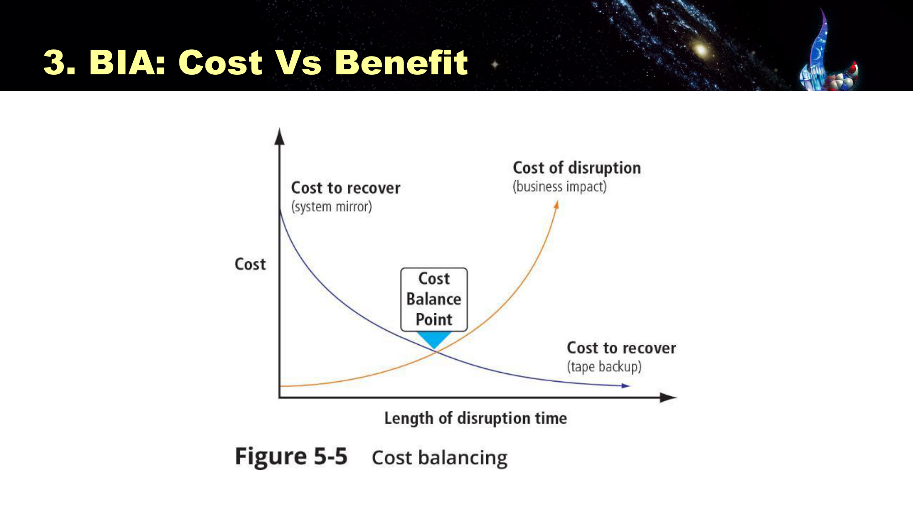

---
title:
  en: "Final Review L6 · Incident Response & Contingency Planning"
  zh: "期末复习 L6 · 事件响应与应急规划"
summary:
  en: "Lesson 6 for the final: slide definitions, what to understand and likely questions for contingency planning, BIA time and dollar metrics with calculations, plan testing, the NIST incident response lifecycle and checklist, disaster recovery, digital forensics, the Colonial Pipeline case and Hong Kong's Critical Infrastructure Ordinance."
  zh: "第 6 课期末版：应急规划、BIA 时间与金钱指标（含计算）、计划测试、NIST 事件响应四阶段与清单、灾难恢复、数字取证、Colonial Pipeline 案例、香港关键基础设施条例——每个点给课件原文、需要理解的逻辑和可能的问法。"
week: 6
date: 2026-10-08
unlisted: true
tags: [FinalReview, BIA, MTD, ALE, IncidentResponse, DisasterRecovery, ColonialPipeline, CriticalInfrastructure]
---
# 期末复习 L6 · 事件响应与应急规划

**课件**：Lesson 6（41 页）　**详细笔记**：[第 6 课复习笔记](../../lectures/lesson-06/)　**案例**：[Colonial Pipeline 解析](../../readings/colonial-pipeline-2021/)　**总览**：[期末总复习](../final-review/)

> **怎么读这一页**：每个知识点按 **课件原文 → 需要理解 → 可能的问法** 写。
>
> 优先级：🔴 必考核心 · 🟡 需要理解 · 🟢 了解即可  
> 掌握要求：📝 **默写**（能写出名字、定义、清单）· 🔍 **区分**（给场景能判断是哪一个，选择题）· 🧮 **计算**（要带计算器）· ✍️ **分析**（能写成有结构的一段论述，长题）

> **🎯 这一课在期末怎么考（老师点名，带计算器）**
>
> - **老师原话**：最后一课讲了 incident response——**怎么读一个 incident、怎么做 business impact analysis**。「I would also leave in the examination… bring along a simple calculator」。→ BIA 计算一定会考。
> - **课件标红**：MTD / RTO / WRT / RPO 和 ARO / EF / SLE / ALE 是整份课件唯一成组标红的术语。
> - **长题素材**：A1 的 JLR 题问「为什么恢复要这么久」「检测和公开时间线」——用的就是本课的 IR 阶段和 BIA 指标；Colonial 案例三道讨论题也可能出成简答或长题。
> - **有数字的地方容易出选择题**：CI 条例的 12 小时、每年评估、两年审计。

## 本课大纲

- **[0. 本课一条线](#0-本课一条线)**
- **[1. 应急规划](#1-应急规划)**
  - [1.1 🟢 开场复习：Passkey（p.2）🔍](#11--开场复习passkeyp2)
  - [1.2 🔴 Contingency Planning 的定义与四个组件（p.8、p.15）📝](#12--contingency-planning-的定义与四个组件p8p15)
  - [1.3 🟡 网络攻击应急计划 + HKMA 要求（p.6–7）📝](#13--网络攻击应急计划--hkma-要求p67)
  - [1.4 🟡 NIST CP 七步与 BIA 三阶段（p.10–11）📝](#14--nist-cp-七步与-bia-三阶段p1011)
  - [1.5 🔴 CP 团队谁负责什么（p.16）📝🔍](#15--cp-团队谁负责什么p16)
- **[2. Business Impact Analysis](#2-business-impact-analysis)**
  - [2.1 🔴 时间指标：MTD / RTO / WRT / RPO（p.12）📝🧮🔍](#21--时间指标mtd--rto--wrt--rpop12)
  - [2.2 🔴 金钱指标：ARO / EF / SLE / ALE（p.13）📝🧮](#22--金钱指标aro--ef--sle--alep13)
  - [2.3 🟡 Cost vs Benefit 平衡点（p.14）✍️](#23--cost-vs-benefit-平衡点p14️)
- **[3. 测试应急计划](#3-测试应急计划)**
  - [3.1 🟡 三种测试策略（p.17）📝🔍](#31--三种测试策略p17)
  - [3.2 🟡 HKMA 网络韧性测试框架与 Fail State（p.18–19）📝](#32--hkma-网络韧性测试框架与-fail-statep1819)
- **[4. Incident Response](#4-incident-response)**
  - [4.1 🔴 NIST 事件响应四阶段（p.21）📝✍️](#41--nist-事件响应四阶段p21️)
  - [4.2 🔴 NIST Incident Handling Checklist（p.22–24）📝🔍](#42--nist-incident-handling-checklistp2224)
  - [4.3 🟡 Reaction vs Recovery（p.25）🔍](#43--reaction-vs-recoveryp25)
  - [4.4 🟡 Post-Incident Reporting（p.27、p.30 重复出现）📝](#44--post-incident-reportingp27p30-重复出现)
  - [4.5 🟡 响应网络事件的四个常见缺口（KPMG，p.31）📝✍️](#45--响应网络事件的四个常见缺口kpmgp31️)
  - [4.6 🟡 HKMA：应对 AI 驱动的攻击（p.32）📝](#46--hkma应对-ai-驱动的攻击p32)
- **[5. 灾难恢复与数字取证](#5-灾难恢复与数字取证)**
  - [5.1 🔴 Incident vs Disaster 与 DR（p.29、p.33）📝🔍](#51--incident-vs-disaster-与-drp29p33)
  - [5.2 🟡 Digital Forensics（p.35）📝](#52--digital-forensicsp35)
- **[6. 🔴 案例：Colonial Pipeline（2021，p.5、p.26）✍️](#6--案例colonial-pipeline2021p5p26️)**
- **[7. 🔴 香港《保护关键基础设施（计算机系统）条例》（p.37–39）📝🔍](#7--香港保护关键基础设施计算机系统条例p3739)**
- **[8. 本课综合题（长题练习）](#8-本课综合题长题练习)**

---

## 0. 本课一条线

```
L5 讲事前（识别、评估、处理风险）→ L6 讲风险没挡住之后：

Contingency Planning（为意外做准备）
  ├─ ① BIA：哪个业务最要命、最多能停多久、丢了值多少钱（其他计划的输入）
  ├─ ② IR plan：发现 → 遏制、清除、恢复 → 事后检讨（循环）
  ├─ ③ DR plan：事件失控变成灾难，在原址重建
  └─ ④ BC plan：原址用不了，在备用地点维持关键业务
计划要测试：Checklist → Tabletop → Simulation
配套：数字取证；案例：Colonial；监管：香港 CI 条例
```

---

## 1. 应急规划

### 1.1 🟢 开场复习：Passkey（p.2）🔍

**课件原文（图）**：设备保存**私钥**，银行只存**公钥**；登录时银行发**随机 challenge**，设备签名、银行验签；passkey **绑定真实域名**。

**需要理解**：三个安全理由——新 challenge 防**重放**；服务器只有公钥，被攻破也**没有密码可偷**；假域名找不到匹配的 passkey，防**钓鱼**。这是 L4 数字签名的业务应用，也正好对应 Colonial「只有用户名密码、没有 MFA」的入口。

### 1.2 🔴 Contingency Planning 的定义与四个组件（p.8、p.15）📝


*Figure 5-1：CP → BIA → IR / DR / BC；DR 下有 Crisis Management；虚线框 = Business Resumption Planning（Slide 15）*

**课件原文**

> The process of preparing for **unexpected adverse events** is called **contingency planning (CP)**. It consists of 4 major components:
>
> - **Business impact analysis (BIA)**
> - **Incident response plan (IR plan)**
> - **Disaster recovery plan (DR plan)**
> - **Business continuity plan (BC plan)**

**需要理解**

| 组件  | 回答的问题                                       |
| --- | ------------------------------------------- |
| BIA | 哪些业务最关键？能停多久？损失多少？——**其他三份计划的输入**           |
| IR  | 发生安全事件时怎么发现、遏制、清除、恢复？                       |
| DR  | 事件失控成为灾难时，怎么在**原址（primary site）**重建运营？      |
| BC  | 原址暂时用不了时，怎么在**备用地点（alternate site）**维持关键业务？ |

- 严重勒索攻击可能三份计划同时启动：IR 清除恶意软件、DR 重建服务器、BC 先用备用或人工流程维持业务。

**What are the four components of contingency planning, and why does BIA come first?**

> **English**
>
> The four components are the **business impact analysis (BIA)**, the **incident response (IR) plan**, the **disaster recovery (DR) plan** and the **business continuity (BC) plan**. The BIA comes first because it identifies which business functions and systems are most critical, how long they can be down and what a loss would cost; the IR, DR and BC plans all use these results to decide what to recover first and what recovery targets to set.
>
> **中文解析**
>
> BIA、IR plan、DR plan、BC plan。BIA 先确定哪些业务和系统最关键、最多能停多久、损失值多少，IR / DR / BC 都要用这些结果决定先恢复什么、恢复目标定多少，所以 BIA 是其他三份计划的输入。

### 1.3 🟡 网络攻击应急计划 + HKMA 要求（p.6–7）📝

**课件原文**

- Cyberattack contingency plan（Forbes）：**back up data / restore previous data**；**inform IC3 / authorities**；**develop communication policies**；**establish chain of command**
- HKMA 对 BCP 的定义（**SPM TM-G-2**）：planning and preparation to ① **identify impacts** from disasters or emergencies ② **develop recovery strategies** ③ **maintain continuity of operations** ④ **test and maintain recovery capabilities**
- HKMA has progressively shifted from traditional **BCP** toward a broader **Operational Resilience** model（2022 年 5 月，SPM OR-2）

**需要理解**：传统 BCP 按**资产**思考（某个系统坏了怎么修）；Operational Resilience 按**关键业务服务**思考（不管什么原因中断，客户转账能不能在可容忍时间内继续），并默认中断一定会发生。

### 1.4 🟡 NIST CP 七步与 BIA 三阶段（p.10–11）📝

**课件原文**

NIST CP 七步：① Develop the **CP policy statement** ② Conduct the **BIA** ③ Identify **preventive controls** ④ Create **contingency strategies** ⑤ Develop a **contingency plan** ⑥ Ensure plan **testing, training, and exercises** ⑦ Ensure plan **updates and maintenance**

CPMT 做 BIA 的三个阶段（**NIST SP 800-34 Rev. 1**）：① Determine mission / business processes and **recovery criticality** ② Identify **resource requirements** ③ Identify **recovery priorities** for system resources。第一项任务是按与组织使命的关系**分析并排序业务流程**；每个部门独立评估。

口诀：**政 · 析 · 防 · 策 · 写 · 练 · 改**。

### 1.5 🔴 CP 团队谁负责什么（p.16）📝🔍

**课件原文**

Key designers：**CIO**、systems administrators、**CISO**、key IT and business managers

| 团队                         | 负责人                                             |
| -------------------------- | ----------------------------------------------- |
| **CPMT**                   | **COO**（Chief operations officer）               |
| **IR team**                | **CISO**                                        |
| **DR team**                | **Manager of business operations**              |
| **BC team**                | **Manager of information systems and services** |
| **Crisis management team** | **Legal counsel**                               |

**需要理解**：应急规划要决定「哪个业务先恢复」，这是业务决策，所以由 **COO** 领导，不是 CIO 或 CISO。CISO 只领导 IR 团队。危机管理（对外沟通、合规、制裁审查）由法律顾问领导。

**Who leads the CPMT, IR team, and crisis management team? Why is the CPMT not led by the CISO?**

> **English**
>
> - **CPMT** → the **COO**
> - **IR team** → the **CISO**
> - **Crisis management team** → **legal counsel**
> - (DR team → manager of business operations; BC team → manager of information systems and services)  
>   The CPMT is led by the COO because contingency planning sets recovery priorities by business importance and allocates resources across the whole organisation — an operational business decision. The CISO leads the technical incident response within it.
>
> **中文解析**
>
> CPMT → COO；IR team → CISO；crisis management team → legal counsel（DR → 业务运营经理，BC → 信息系统与服务经理）。应急规划要按业务重要性排定恢复优先级、调配全公司资源，是运营和业务决策，所以由 COO 领导；CISO 负责其中技术性的事件响应。

---

## 2. Business Impact Analysis

### 2.1 🔴 时间指标：MTD / RTO / WRT / RPO（p.12）📝🧮🔍


*Last backup —RPO→ Incident —RTO→ Systems recovered —WRT→ Resume operations；MTD = RTO + WRT 的上限（Slide 12）*

**课件原文**

> BIA helps determine **which business functions and information systems are the most critical** to the success of the organization.
>
> - **Maximum tolerable downtime (MTD)**：the maximum time a business can tolerate the absence or unavailability of a particular business function
> - **System recovery time (RTO)**
> - **Work recovery time (WRT)**
> - **Recovery Point Objective (RPO)**

**需要理解**

| 指标  | 意思                          | 方向                 |
| --- | --------------------------- | ------------------ |
| MTD | 业务最多能停多久                    | 往后看                |
| RTO | 把**系统**修好要多久                | 往后看                |
| WRT | 系统起来后补数据、测试验证，**业务**真正能用要多久 | 往后看                |
| RPO | 最多能丢多长时间的数据（回退到哪个时间点）       | **往前看**（上次备份 → 事故） |

两条关系：

1. **MTD ≥ RTO + WRT**。只满足 RTO 不等于满足 MTD。
2. **RPO 决定备份频率**（RPO = 1 小时 → 至少每小时备份），和恢复速度无关。最坏数据丢失 = 备份间隔。

*（网页版此处可交互：自己调备份间隔、RPO、RTO、WRT、MTD，时间轴实时变化；下表是几个预设场景的结果）*

| 场景            | 停机 = RTO + WRT                  | MTD         | 数据丢失                    | RPO     |
| ------------- | ------------------------------- | ----------- | ----------------------- | ------- |
| 银行核心系统（达标）    | 2 小时 + 1 小时 = 3 小时 vs MTD 4 小时  | 达标          | 备份间隔 15 分钟 vs RPO 15 分钟 | 达标      |
| 同上，但测试验证拖太久   | 2 小时 + 3 小时 = 5 小时 vs MTD 4 小时  | **超出 1 小时** | 备份间隔 15 分钟 vs RPO 15 分钟 | 达标      |
| 电商订单库：每天才备份一次 | 4 小时 + 2 小时 = 6 小时 vs MTD 12 小时 | 达标          | 备份间隔 24 小时 vs RPO 1 小时  | **不达标** |

**A system has RTO = 3 hours, WRT = 2 hours and MTD = 4 hours. Does the recovery plan meet the MTD?**

> **English**
>
> **No.** The business only resumes after RTO + WRT = 3 + 2 = **5 hours**, which exceeds the 4-hour MTD. Comparing RTO alone (3 ≤ 4) is misleading. The plan needs a shorter RTO or WRT (e.g. hot standby, automated validation) or a higher-tier recovery option.
>
> **中文解析**
>
> 不达标。业务真正恢复要 RTO + WRT = 5 小时，超过 MTD 4 小时。只看 RTO（3 ≤ 4）会误判。要缩短 RTO / WRT（热备、自动化验证）或换更高等级的方案。

**The RPO is 1 hour but backups run once a day at midnight. What is the problem?**

> **English**
>
> In the worst case the incident happens just before the next backup, so nearly **24 hours of data** would be lost — far beyond the 1-hour RPO. Backups must run at least hourly, or the system should use log shipping / real-time replication.
>
> **中文解析**
>
> 最坏情况下事故发生在下一次备份前，会丢接近 24 小时的数据，远超 1 小时的 RPO。要至少每小时备份，或用日志传送 / 实时复制。

### 2.2 🔴 金钱指标：ARO / EF / SLE / ALE（p.13）📝🧮

**课件原文**

> Likelihood Assessment is then conducted.
>
> - **Annualized Rate of Occurrence (ARO)**：the number of times a business expects to experience a given disaster **each year**
> - **Exposure Factor (EF)**：the amount of damage that the risk poses to the assets, expressed as **a % of the asset value (AV)**
> - **Single Loss Expectancy (SLE)**：the $ loss expected = **AV × EF**
> - **Annualized Loss Expectancy (ALE)**：the $ loss that business expects to occur as a result of the risk harming the asset **during a typical year**（= **SLE × ARO**）

教材 Ch.4 的 **Cost-Benefit Analysis**：**CBA = ALE（控制前）− ALE（控制后）− ACS**（ACS = annualized cost of safeguard），**CBA > 0** 才划算。

**需要理解**

- ARO 换算：「每 N 年一次」→ 1/N（每 4 年 = 0.25；50 年一遇 = 0.02）；「一年 N 次」→ N。
- 和 L5 对应：ARO ≈ Loss Frequency，SLE ≈ Loss Magnitude，ALE ≈ Calculated Risk。
- **ALE 会低估低频高损的风险**：50 年一遇的洪水 ALE 很小，但一次就可能远超 MTD。这类风险要回到 MTD 和监管要求判断。

*（网页版此处可交互：自己填 AV / EF / ARO 和控制后的数值；下表是预设场景的结果）*

| 场景                      | SLE = AV × EF                 | ALE = SLE × ARO             | 控制后 ALE | ACS      | CBA               |
| ----------------------- | ----------------------------- | --------------------------- | ------- | -------- | ----------------- |
| 勒索软件 × 计费系统，加 MFA + EDR | $1,000,000 × 40% = $400,000   | $400,000 × 0.5 = $200,000   | $40,000 | $50,000  | $110,000（划算）      |
| 同一风险，但控制每年花 25 万        | $1,000,000 × 40% = $400,000   | $400,000 × 0.5 = $200,000   | $40,000 | $250,000 | **−$90,000（不划算）** |
| 洪水 × 数据中心（50 年一遇），建异地灾备 | $5,000,000 × 60% = $3,000,000 | $3,000,000 × 0.02 = $60,000 | $10,000 | $100,000 | **−$50,000（不划算）** |

**A server is worth US$200,000. A ransomware attack would destroy 25% of its value and is expected once every 4 years. (a) Calculate SLE and ALE. (b) An EDR costing US$8,000 per year reduces the ARO to 0.05. Is it justified?**

> **English**
>
> (a) SLE = AV × EF = 200,000 × 25% = **US$50,000**; ARO = 1/4 = 0.25; ALE = SLE × ARO = 50,000 × 0.25 = **US$12,500 per year**.  
> (b) ALE after = 50,000 × 0.05 = US$2,500; CBA = 12,500 − 2,500 − 8,000 = **US$2,000 > 0** → the EDR is justified.
>
> **中文解析**
>
> (a) SLE = 200,000 × 25% = **US$50,000**；ARO = 0.25；ALE = 50,000 × 0.25 = **US$12,500 / 年**。  
> (b) ALE（后）= 50,000 × 0.05 = US$2,500；CBA = 12,500 − 2,500 − 8,000 = **US$2,000 > 0** → 值得。

想多练几题：[总览页的计算题随机练习](../final-review/)。

### 2.3 🟡 Cost vs Benefit 平衡点（p.14）✍️



*Figure 5-5：中断成本随时间上升，恢复成本随允许时间下降，交点是 Cost Balance Point（Slide 14）*

**需要理解**

- **Cost of disruption** 随中断时间加速上升；**Cost to recover** 越快越贵（system mirror 最贵，tape backup 最便宜）。
- 交点是总成本最低的地方：恢复方案不是越快越好，而是找到「多花的恢复成本 = 少亏的中断损失」。
- **MTD 是硬上限**：平衡点落在 MTD 右边时，只能多花钱选更快的方案。

---

## 3. 测试应急计划

### 3.1 🟡 三种测试策略（p.17）📝🔍

**课件原文**

> **Very few plans are executable as initially written**; they must be tested to identify vulnerabilities, faults, and inefficient processes.
>
> - **Checklists**
> - **Structured walk-through (Tabletop)**
> - **Simulations**  
>   → **Each time the plan is rehearsed, it should be improved.** Constant evaluation and improvement leads to an improved outcome.

**需要理解**：由浅到深——Checklist（各自核对职责和资源）→ Tabletop（大家坐在一起按情景口头推演）→ Simulation（各自按真实情况执行，但不中断业务）。Simulation 最接近真实。教材还有 parallel 和 full interruption，考试按课件答三种。

### 3.2 🟡 HKMA 网络韧性测试框架与 Fail State（p.18–19）📝

**课件原文**

- **Cyber Resilience Testing Framework（CRTF）**：Scenario Development（threat analysis；scenario narrative & **"fail state" provision**；control failure analysis；scope and impact analysis）→ **Response & Recovery Test** → **Technical Recovery Test**；产出经高管审阅、董事会级别委员会讨论
- Fail state 情景：工作日早上多台电脑出现勒索信，客户数据被放到暗网，要求 72 小时内付 HK$15M 等值比特币；客户看不到余额、出现未授权转账；核心银行和支付系统数据库被加密

**需要理解**：「severe but plausible」的情景 + 预先定义的失败状态，用来检验计划能不能撑住最坏情况。这个情景和 Colonial 高度相似（加密 + 窃取 = 双重勒索）。

---

## 4. Incident Response

### 4.1 🔴 NIST 事件响应四阶段（p.21）📝✍️


*Preparation → Detection & Analysis → Containment, Eradication & Recovery → Post-Incident Activity（A loop process!）（Slide 21）*

**课件原文**

> Phase of Incident Response — **A loop process!** The execution of the IR plan typically falls to the **computer security incident response team (CSIRT)**.

| 阶段                                      | 做什么                          |
| --------------------------------------- | ---------------------------- |
| **Preparation**                         | 写 IR 计划、组建 CSIRT、准备工具、培训演练   |
| **Detection & Analysis**                | 判断是否发生、分析范围、定优先级、**通报**      |
| **Containment, Eradication & Recovery** | **保全证据** → 遏制 → 清除 → 恢复      |
| **Post-Incident Activity**              | 跟进报告、lessons learned 会议、更新计划 |

**需要理解：两条回路**

1. **Containment → Detection & Analysis**：清除时发现新的受感染主机，回去重新检测分析（清单 6.3）。
2. **Post-Incident → Preparation**：教训用来更新计划，成为下一次的准备。

**Why is incident response described as a loop process? Identify the two loops.**

> **English**
>
> 1. **Containment → Detection & Analysis**: if more affected hosts are found during containment or eradication, the team returns to detection and analysis to identify them all, then contains and eradicates again.
> 2. **Post-incident activity → Preparation**: lessons learned are used to update plans, policies and procedures for next time.  
>    So incident response is a continuous improvement cycle, not a one-off straight line.
>
> **中文解析**
>
> ① 遏制和清除时如果发现新的受影响主机，要回到 Detection & Analysis 找出全部受影响范围，再遏制和清除；② 事后的 lessons learned 用于更新计划、政策和流程，回到 Preparation。所以 IR 是持续改进的循环，不是一次性的直线。

### 4.2 🔴 NIST Incident Handling Checklist（p.22–24）📝🔍

**课件原文**

| 阶段                                         | 步骤                                                                                                                                                                                                                                                                                                                                                                                                                                           |
| ------------------------------------------ | -------------------------------------------------------------------------------------------------------------------------------------------------------------------------------------------------------------------------------------------------------------------------------------------------------------------------------------------------------------------------------------------------------------------------------------------- |
| **Detection and Analysis**                 | **1.** Determine whether an incident has occurred（1.1 analyze **precursors and indicators**；1.2 look for **correlating information**；1.3 perform research；1.4 begin **documenting the investigation and gathering evidence**）<br />**2.** **Prioritize** handling based on **functional impact, information impact, recoverability effort**<br />**3.** **Report** the incident to appropriate internal personnel and external organizations |
| **Containment, Eradication, and Recovery** | **4.** **Acquire, preserve, secure, and document evidence**<br />**5.** **Contain** the incident<br />**6.** **Eradicate**（6.1 identify and mitigate all exploited vulnerabilities；6.2 remove malware；6.3 more affected hosts → repeat 1.1、1.2，then 5、6）<br />**7.** **Recover**（7.1 return to operationally ready state；7.2 confirm functioning normally；7.3 **additional monitoring** for future related activity）                         |
| **Post-Incident Activity**                 | **8.** Create a **follow-up report**<br />**9.** Hold a **lessons learned meeting**（**mandatory for major incidents**）；用结论更新计划、政策和流程                                                                                                                                                                                                                                                                                                         |

**需要理解（容易放错阶段的三步）**

- **通报（3）在 Detection & Analysis**，不是事后才报。
- **保全证据（4）是 Containment 阶段的第一步**，先留证据再动系统，否则重装、清除后证据就没了。
- **加强监控（7.3）属于 Recovery**，不是 Post-Incident。

*（网页版此处是「这一步属于 IR 哪个阶段」的点选练习；下表是全部题目和答案）*

| 动作                                                                                      | 阶段                                      | 理由                                                                                                                                                             |
| --------------------------------------------------------------------------------------- | --------------------------------------- | -------------------------------------------------------------------------------------------------------------------------------------------------------------- |
| 事发前：Colonial 给全体员工定期做模拟钓鱼演练，并规定从 CEO 到现场操作员每个人都有 stop-work authority（发现系统安全有风险就可以叫停作业）。 | **Preparation**                         | 事故还没发生时做的培训、授权、演练，都是在为事故「备好工具和规矩」——属于 Preparation。正因为提前授权，5 月 7 日早上控制室员工才敢直接关停管道。                                                                              |
| 5 月 7 日凌晨约 5 点，控制室员工在计费和会计系统里发现被锁的数据和勒索信，立即上报主管。                                        | **Detection & Analysis**                | 发现征兆（indicator）、确认事故确实发生，是 NIST 清单第 1 步 Determine whether an incident has occurred。                                                                            |
| 和公司 IT 商量后下达 stop-work order，15 分钟内关停全部 5,500 英里管道，目的是防止恶意软件蔓延到管道的 OT 控制系统。             | **Containment, Eradication & Recovery** | 目标是「不让它扩散」，这就是 Contain the incident（清单第 5 步）。它也是课件 Reaction 一栏的 containment strategy：把可能被波及的系统先断开。                                                             |
| 关停管道的同时，指示员工不要登录公司网络。                                                                   | **Containment, Eradication & Recovery** | 限制攻击者和恶意软件继续利用被感染的网络，属于遏制措施（类似 Disable compromised accounts / services）。                                                                                       |
| 当天高管给 FBI、CISA、能源部等十来个联邦机构打电话通报事件。                                                      | **Detection & Analysis**                | 容易选错。NIST 清单把 Report the incident to the appropriate internal personnel and external organizations（第 3 步）放在 Detection & Analysis 阶段：确认事故、定好优先级后就要通报，不是等到事后。    |
| Mandiant 扫描整个网络，判断攻击者到底深入到哪里，结论是没有证据显示攻击者进入了更关键的 OT 系统。                                 | **Detection & Analysis**                | 确定影响范围、寻找关联信息，是分析工作（清单 1.1–1.3）。先要知道「波及了什么」，才能决定遏制和恢复的范围。                                                                                                      |
| 按功能影响、信息影响、恢复难度判断这次事故的优先级。                                                              | **Detection & Analysis**                | 清单第 2 步 Prioritize handling the incident based on the relevant factors (functional impact, information impact, recoverability effort)，属于 Detection & Analysis。 |
| 获取并保全证据：做受感染服务器的磁盘镜像、保存日志，并记录证据保管链。                                                     | **Containment, Eradication & Recovery** | 也容易选错。NIST 把 Acquire, preserve, secure, and document evidence（第 4 步）放在 Containment, Eradication & Recovery 阶段的开头：在清除、重装之前先把证据留住，否则一重装就没了。                      |
| 从被感染的主机上清除勒索软件，并修补被利用的漏洞（例如停用那个遗留的 VPN 账户）。                                             | **Containment, Eradication & Recovery** | Eradicate the incident（清单第 6 步，6.1 修补被利用的漏洞、6.2 清除恶意软件）。                                                                                                       |
| 解密工具太慢，Colonial 主要用备份恢复系统，并分阶段重启管道。                                                     | **Containment, Eradication & Recovery** | Recover from the incident：让受影响系统回到可运行状态并确认运作正常（清单 7.1–7.2）。                                                                                                    |
| 恢复运行后，Mandiant 安装新的检测工具，监控攻击者会不会再来（二次攻击）。                                               | **Containment, Eradication & Recovery** | 清单 7.3 If necessary, implement additional monitoring to look for future related activity，仍属于 Recovery 这一段，不是 Post-Incident。                                    |
| 写一份事后跟进报告，记录每个行动的 who / what / when / where / why / how。                                | **Post-Incident Activity**              | Create a follow-up report（清单第 8 步）。课件 p.27：这份文档事后可以当案例检查决策是否正确，也能证明组织尽了一切努力阻止事故扩散。                                                                             |
| 召开 lessons learned 会议，把「要不要付赎金、谁来决定」写进应急计划（国会听证时议员批评它的计划里完全没有赎金条款）。                     | **Post-Incident Activity**              | Hold a lessons learned meeting（第 9 步），并用结论更新计划、政策、流程。更新后的计划又成为下一轮的 Preparation，这就是课件强调的 loop process。                                                          |

### 4.3 🟡 Reaction vs Recovery（p.25）🔍


*Incident Reaction（红框）vs Incident Recovery（绿框）（Slide 25）*

**课件原文**

| Incident Reaction                                                                                                                                                                | Incident Recovery                                      |
| -------------------------------------------------------------------------------------------------------------------------------------------------------------------------------- | ------------------------------------------------------ |
| **Notification of key personnel**（按 **alert roster**）                                                                                                                            | **Damage assessment** using computer forensics         |
| **Document** an incident                                                                                                                                                         | Identify vulnerabilities and resolve them              |
| **Containment strategies**：「**Cut the wire**」；disable compromised accounts；reconfigure firewall rules；disable compromised services；disable compromised server（e.g. email server） | Install, replace, or upgrade safeguards                |
|                                                                                                                                                                                  | Evaluate monitoring capabilities                       |
|                                                                                                                                                                                  | **Restore data, services, processes, and confidence!** |
|                                                                                                                                                                                  | **After-action review**                                |

**需要理解**：Reaction 是止血，Recovery 是复原。Recovery 里有「**confidence**」——系统修好了，客户和监管不一定还信你，要靠沟通恢复（Colonial 重启后东岸仍在抢购汽油）。

### 4.4 🟡 Post-Incident Reporting（p.27、p.30 重复出现）📝

**课件原文**

> - As soon as an incident has been confirmed and the notification process is underway, the team should **begin to document** it.
> - Record the **who, what, when, where, why, and how** of each action taken.
> - Serves as a **case study after the fact** to determine if the right actions were taken and effective.
> - Can also **prove the organization did everything possible** to deter the spread of the incident.

HKMA 事件报告表：要分别填**机构知悉事件的时间**和**向 HKMA 报告的时间**，不同要说明原因；还要填受影响客户数、投诉数、媒体查询、预计损失。

**需要理解**：监管关注「从知悉到报告隔了多久」——这就是 CI 条例「12 小时内报告」的计时起点。记录也用于应对监管、诉讼和保险理赔。

### 4.5 🟡 响应网络事件的四个常见缺口（KPMG，p.31）📝✍️

**课件原文**

1. **Inadequate documentation of organization's crown jewels** → 没有最新资产清单，隔离和遏制被拖慢
2. **Unclear roles and responsibilities of crisis management team** → 决策慢、缓解不足，可能引来监管调查
3. **Ineffective incident response plan** → 严重程度判断错误、响应慢、隔离不完整
4. **Insufficient data retention** → 关键证据丢失，无法分析事件经过

**需要理解**：四个缺口对应本课四块内容——BIA / 资产清单、CP 团队分工、IR 计划与清单、证据保全与取证。可以当成本课的总结。

### 4.6 🟡 HKMA：应对 AI 驱动的攻击（p.32）📝

**课件原文**：AI models show capacity to **independently identify and exploit zero-day vulnerabilities**, and could **commoditise the attack process**. Banks should：① review and assess the sufficiency of existing cyber defense controls ② **uplift incident response and recovery capabilities** ③ **enhance data resilience** to counter destructive attacks ④ **Task Force on A.I.-Driven Cyber Risk** for intelligence sharing ⑤ development of the **CRTF**（HKMA 2026 通函）

---

## 5. 灾难恢复与数字取证

### 5.1 🔴 Incident vs Disaster 与 DR（p.29、p.33）📝🔍


*Figure 5-12：同一种攻击，影响单一系统是 incident，影响全部系统就是 disaster（Slide 29）*

**课件原文**

> **Disaster recovery planning (DRP)** entails preparation for and recovery from a disaster, whether natural or human-made.  
> In general, an incident is a disaster when:
>
> - The organization is **unable to contain or control** the impact of an incident, or
> - The level of damage or destruction is **so severe that the organization is unable to quickly recover**  
>   The key role of a DR plan is defining how to **re-establish operations at the location where the organization is usually located (primary site)**.

**需要理解**：分界看**范围和能否控制**，不看攻击类型。同样是勒索软件，加密一台电脑是 incident（走 IR），加密全公司系统就是 disaster（启动 DR）。DR 在**原址**重建；BC 在**备用地点**维持。

**When does an incident become a disaster? Use a ransomware example.**

> **English**
>
> An incident becomes a disaster when the organisation **cannot contain or control its impact**, or the damage is **so severe that it cannot recover quickly**. *Example*: ransomware that encrypts one employee's laptop can be isolated and reimaged — an incident handled by the IR plan. Ransomware that encrypts core systems and backups across the company and halts the business is a disaster: the DR plan re-establishes operations at the primary site, and the BC plan may keep critical functions running at an alternate site (Colonial's six-day shutdown was disaster-level).
>
> **中文解析**
>
> 当组织无法遏制或控制事件影响，或者破坏严重到无法快速恢复时，incident 就升级为 disaster。例：勒索软件只加密一台员工电脑，隔离、重装就能处理，是 incident；如果加密了全公司的核心系统和备份、业务停摆，就是 disaster，要启动 DR 在原址重建，必要时用 BC 在备用地点维持关键业务（Colonial 停运 6 天就是 disaster 级别）。

### 5.2 🟡 Digital Forensics（p.35）📝

**课件原文**

> - Used to determine **what happened and how an incident occurred**
> - Involves **preservation, identification, extraction, documentation, and interpretation** of digital media for **evidentiary and/or root-cause analysis**
> - Two key purposes：**to investigate allegations of wrong conduct**；**to perform root cause analysis**
> - Most organizations **cannot sustain a permanent digital forensics team**; **collect data and outsource analysis**; hire externally; expertise can be obtained by training

**需要理解**：Colonial 就是「自己收集、外包分析」——事发约一小时请来 Mandiant，查出根因是没 MFA 的遗留 VPN 账户。

---

## 6. 🔴 案例：Colonial Pipeline（2021，p.5、p.26）✍️

**关键事实**

| 项目     | 事实                                                                 |
| ------ | ------------------------------------------------------------------ |
| 公司     | 美国最大的成品油管道，供应东岸约 **45%** 燃油，属于关键基础设施                               |
| 入口（根因） | **遗留 VPN 账户**：已不用但**没停用**，**没有 MFA**，密码出现在暗网泄露库里                   |
| 攻击者    | **DarkSide**（**RaaS**），潜伏约 8 天，窃取约 100 GB 数据（双重勒索）                 |
| 响应     | 发现勒索信后 15 分钟内**主动关停整条管道**（保护 OT）；约 1 小时请到 **Mandiant**；通报多个联邦机构    |
| 赎金     | CEO 当天决定付 **75 BTC（约 US$4.4M）**；解密工具太慢，**主要靠备份恢复**；FBI 追回 63.7 BTC |
| 恢复     | 停运约 **6 天**；部分支线**人工操作**、派人巡线（BC）                                  |
| 治理问题   | **没有 CISO**；应急计划里**没有赎金条款**；执法机关付款两天后才被告知                          |
| 事后     | 删除遗留 VPN、全部 VPN 加 MFA、聘请第一位 CISO                                   |

**课件三道讨论题**：

1. Did Colonial handle the crisis appropriately? What did the company do well and what could it have done better?
2. How should organisations manage the ever-increasing threat of data breaches? What are the roles for executives during a ransomware attack?
3. Do you agree with Blount's decision to pay the ransom?

**需要理解**：一句话结论——**Reaction 做得好，Preparation 做得差**。

**Q1. Did Colonial handle the crisis appropriately? Evaluate using the NIST IR phases.**

> **English**
>
> **Conclusion**: the response was largely appropriate and decisive; the root problems lay in preparation.
>
> - **Preparation** — *good*: IT / OT segregation, staff stop-work authority. *Weak*: a legacy VPN account not disabled, no MFA, no CISO, no ransom provision in the plan.
> - **Detection & analysis** — *good*: immediate escalation and early notification of government agencies. *Weak*: the attacker dwelt about 8 days and exfiltrated 100 GB undetected; the scope was still unclear on the day.
> - **Containment, eradication & recovery** — *good*: proactive pipeline shutdown to protect OT, Mandiant engaged within about an hour, restoration from backups, phased restart with manual operations. *Weak*: poor visibility of IT / OT dependencies forced a full shutdown.
> - **Post-incident** — *good*: MFA on all VPNs, first CISO hired, professional crisis communications. *Weak*: the ransom payment was initially kept quiet and law enforcement was told late.
>
> **中文解析**
>
> **结论**：响应阶段基本恰当且果断，问题根源在准备阶段。  
> **Preparation**：好——IT / OT 隔离、员工有 stop-work authority；差——遗留账户没停用、VPN 没 MFA、没有 CISO、计划里没有赎金条款。  
> **Detection & Analysis**：好——发现后立即上报、及早通报政府；差——攻击者潜伏 8 天、外传 100 GB 没被检测到，事发时仍不清楚入侵范围。  
> **Containment / Recovery**：好——主动关停防止扩散到 OT、迅速请 Mandiant、靠备份恢复、分阶段重启、人工维持部分运作；差——看不清 IT / OT 依赖，只能全关。  
> **Post-incident**：好——加 MFA、聘 CISO、危机沟通专业；差——付赎金起初保密，执法机关迟知。

**Q2. What are the roles of executives during a ransomware attack?（对照课件 p.16 分工）**

> **English**
>
> - **CEO** — final decisions (e.g. whether to pay), accountable to the board and government, sets the tone.
> - **COO** (CPMT lead) — operational decisions: shutdown, restart, minimum operations.
> - **CISO** (IR team lead) — technical response; coordinates the external IR firm.
> - **Legal counsel** (crisis management lead) — compliance, sanctions screening, regulatory notification, litigation risk.
> - **Communications lead** — consistent messages to staff, customers, media and government.
> - **Board** — oversight and post-incident accountability.  
>   Without a CISO or a mature division of roles, Colonial's CEO had to step in personally.
>
> **中文解析**
>
> **CEO**：最终决策（如付不付赎金）、对董事会和政府负责、定调；**COO**（CPMT 负责人）：运营决策——关停、重启、维持最低运作；**CISO**（IR 负责人）：技术响应，协调外部 IR 公司；**法律顾问**（危机管理负责人）：合规、制裁名单审查、监管通报、诉讼风险；**沟通负责人**：对员工、客户、媒体统一口径；**董事会**：监督和事后问责。Colonial 因为没有 CISO 和成熟分工，CEO 只能亲自下场。

**Q3. Do you agree with the decision to pay the ransom? Argue both sides.**

> **English**
>
> **For paying**: critical infrastructure — every day of shutdown hit fuel supply across 13 states, a social cost far above US$4.4M; it was unclear whether backups were usable, so the decryptor was insurance against a tail risk beyond the MTD; the company confirmed DarkSide was not on a sanctions list; the FBI later recovered most of the bitcoin.  
> **Against paying**: it funds crime and marks the company as a payer; the decryptor was too slow and recovery relied on backups; with double extortion, paying does not guarantee stolen data is deleted; the decision was made under pressure on the day and law enforcement was informed late.  
> **Balanced view**: treating payment as a fallback under deep uncertainty is understandable, but it **should not have been decided ad hoc on the day** — a ransom policy belongs in the IR plan, with law enforcement notified and backups verified quickly.
>
> **中文解析**
>
> **支持**：关键基础设施，每停一天影响 13 个州，社会成本远大于 US$4.4M；当时不知道备份是否可用，解密工具是对超过 MTD 的尾部风险的保险；付款前确认 DarkSide 不在制裁名单；FBI 追回大部分。  
> **反对**：助长犯罪、让自己成为会付钱的目标；解密工具太慢，最后靠备份；双重勒索下付了钱也不能保证数据被删；当天在压力下临时决定，执法机关迟知。  
> **平衡答法**：在信息不足的情况下把付款当保底选项可以理解，但问题是**它不应该在事发当天临时决定**——赎金政策应事先写进 IR 计划，并同步通知执法机关、尽快验证备份。

---

## 7. 🔴 香港《保护关键基础设施（计算机系统）条例》（p.37–39）📝🔍

**课件原文**

路线图：Hong Kong shifted from **prosecution-based** outdated computer misuse offences to a **preventive, sector-based** cybersecurity regulatory framework between 2021 and 2026.

| 年份   | 法规                                                                      | 改变                                                                                                  |
| ---- | ----------------------------------------------------------------------- | --------------------------------------------------------------------------------------------------- |
| 2021 | PDPO 修订：**anti-doxxing** offences                                       | 起底入罪，PCPD 有调查和检控权                                                                                   |
| 2025 | PDPO **Cloud Computing Guidance**（更新）                                   | 云服务的加密、访问控制、审计、供应商合约、跨境数据                                                                           |
| 2026 | **Protection of Critical Infrastructures (Computer Systems) Ordinance** | **first preventive cybersecurity regime**：mandatory risk assessments, audits and incident reporting |

覆盖范围：**Category 1** essential services（银行金融、电讯、电力、铁路）；**Category 2** important societal and economic activities（大型体育和表演场馆、科研园区）；**不适用**于政府营运的必要服务（供水、紧急救援），因为政府已有同等内部指引。

合规义务：

- **Establishing a Security Management Unit**：CI operators must set up a dedicated unit to oversee cybersecurity of their **critical computer systems (CCS)**
- **Conducting Risk Assessments**：**annual** security risk assessments and **biennial independent audits**
- **Incident Reporting**：**serious incidents within 12 hours**; other incidents within **24 hours**（课件写法；正式条例是 48 小时，考试按课件答，可以注明）

口诀：**1 个单位 · 1 年评估 · 2 年审计 · 12 小时报告**。

**需要理解**：从「事后检控」变成「**事前预防**」。这里的 **CIO 是 Critical Infrastructure Operator**，不是首席信息官。Colonial 事发时美国管道行业没有强制标准，事后才要求通报；如果在香港，它属于类别 1（能源）。

**What are the main obligations under Hong Kong's Critical Infrastructure Ordinance, and how does it change Hong Kong's approach to cybersecurity?**

> **English**
>
> **Obligations**: (1) set up a **Security Management Unit** to oversee the security of critical computer systems; (2) conduct **annual security risk assessments** and **biennial independent audits**; (3) **report serious incidents within 12 hours** (other incidents within 24 hours per the slides; 48 hours in the enacted ordinance).  
> **Change in approach**: Hong Kong shifts from prosecution-based computer-misuse offences after the fact to a **preventive, sector-based** regime — the first to make assessments, audits and incident reporting mandatory for critical infrastructure.
>
> **中文解析**
>
> 义务：① 设立 Security Management Unit 监督关键计算机系统的安全；② 每年做安全风险评估，每两年做独立审计；③ 严重事件 12 小时内向专员报告（其他事件课件写 24 小时）。改变：香港从以事后检控电脑罪行为主，转向事前预防、按行业划分的强制性监管，第一次对关键基础设施强制要求评估、审计和事件报告。

---

## 8. 本课综合题（长题练习）

**A retailer's online ordering system is hit by ransomware on a Saturday morning. Backups are taken nightly. Using Lesson 6, describe how the company should respond in the first 48 hours, and evaluate whether its BIA targets (MTD 12 h, RPO 4 h) can be met.（20 marks）**

> **English**
>
> **Detection & analysis**: confirm the incident and its scope (which systems are encrypted, whether data was exfiltrated); prioritise by functional and information impact; activate the CSIRT under the CISO and notify key personnel via the alert roster; **report promptly** to internal management and external bodies (police, PCPD); start documenting who / what / when / where / why / how.  
> **Containment, eradication & recovery**: **preserve evidence first** (disk images, logs); isolate infected segments, disable compromised accounts, change firewall rules; find and fix the entry point and remove the malware — if new infected hosts appear, loop back to detection; restore from backup, confirm normal operation and add monitoring.  
> **DR / BC**: if the whole ordering platform is encrypted it is a disaster — rebuild at the primary site while a BC arrangement (manual order taking or an alternate platform) keeps critical sales going; the crisis team (legal counsel) handles communications.  
> **BIA evaluation**: nightly backups mean up to \~24 hours of data loss → the **4-hour RPO is not met**; if system recovery takes 8 hours and re-entering and validating orders 6 hours, downtime is 14 hours → the **12-hour MTD is exceeded**.  
> **Post-incident**: follow-up report and lessons-learned meeting; update the IR plan (including a ransom decision policy) and the backup strategy.
>
> **中文解析**
>
> **Detection & Analysis**：确认是否为事件、判断范围（哪些系统被加密、数据是否外泄）、按功能影响和信息影响定优先级；启动 CSIRT（CISO 领导），按 alert roster 通知关键人员，**及时向内部和外部（警方、PCPD）通报**；开始记录 who / what / when / where / why / how。  
> **Containment, Eradication & Recovery**：**先保全证据**（磁盘镜像、日志）→ 隔离受感染网段、停用被入侵账户、改防火墙规则 → 找出并修补入口漏洞、清除恶意软件；发现新受影响主机就回到检测分析 → 从备份恢复，确认运作正常并加强监控。  
> **DR / BC**：如果全部订单系统被加密，已是 disaster，在原址重建；同时用 BC 方案（例如人工接单、备用平台）维持关键业务。危机管理团队（法律顾问）统一对外沟通。  
> **BIA 评估**：每晚备份 → 最坏丢近 24 小时数据，**RPO 4 小时不达标**，需要更频繁的备份或复制；停机 = RTO + WRT，若恢复系统要 8 小时、补单和验证 6 小时，共 14 小时，**超过 MTD 12 小时**。  
> **Post-incident**：跟进报告、lessons learned 会议，更新 IR 计划（包括赎金决策条款）和备份策略。
