---
title:
  en: "Lesson 1 · Trust, Threat Actors & the CIA Triad"
  zh: "第 1 课 · 数字信任、威胁行为者与 CIA"
summary:
  en: "Why the digital economy runs on trust, the components-of-information-security temple, 6 types of threat actors, black/gray/white hats, government's role, the CISO's place, and the CIA triad."
  zh: "数字经济为何依赖信任、信息安全构成的「神庙」结构、6 类威胁行为者、黑白灰帽、政府角色、CISO 的位置，以及 CIA 三要素。"
week: 1
date: 2026-09-04
tags: [CIA Triad, Threat Actors, CISO, Trust, Cybersecurity Landscape]
---
# ISOM 5280 Computer and Internet Security Management — Lesson 1 复习笔记

**主题：数字经济中的信任 · 信息安全的构成 · 威胁形势与真实案例 · 威胁行为者分类 · 政府与企业的角色 · CISO 与安全组织 · CIA 三要素**

> 优先级标注说明（按考试重要性）：  
> 🔴 **必考核心** — 概念名称、定义、结构必须能背出来  
> 🟡 **需要理解** — 需要懂逻辑关系，能举例说明  
> 🟢 **了解即可** — 背景知识，考试大概率不会细抠
>
> 本笔记的优先级**主要按你自己划的重点排定**（数字经济信任 / Components of Information Security / 事故趋势 / 案例 / 6 类威胁行为者 / 威胁分布 / 黑白灰帽 / 政府角色 / 人才需求 / CISO 与 Key Functions / CIA）。  
> 课件末尾有 3 道 MCQ（p.58–60），说明**考试至少有选择题**，而这 3 题分别考「帽子分类」「CIA」「威胁行为者」——正好印证了你的判断。

---

## 0. 核心地图（先建立整体框架）

这节课是全课程的**开篇总览**，它不是讲某个技术，而是回答一个问题：**「为什么要有网络安全管理这门课？」**

核心逻辑链是：

```
数字经济建立在"信任"之上（18% GDP）
   ↓ 但是……
安全事故在持续上升（HK 数据 + 全球案例）
   ↓ 是谁在攻击？
6 类威胁行为者 / 黑白灰帽 / 威胁分布数据
   ↓ 谁来防？
政府（Prevention + Detection + Recovery）+ 企业（CISO 及其团队）
   ↓ 防什么？用什么标准衡量"安全"？
CIA Triad + Components of Information Security（治理 → 政策 → 三支柱 → CIA 地基）
   ↓ 谁来做？
人才缺口巨大 = 你为什么坐在这里
```

**记住这条链**：几乎每一页 slide 都能挂在这条链的某一环上。考简答题时，这条链本身就是一个完整的答题框架。

---

## 1. 🟢 课程与讲师背景（About Me / Course Overview / Assessment）

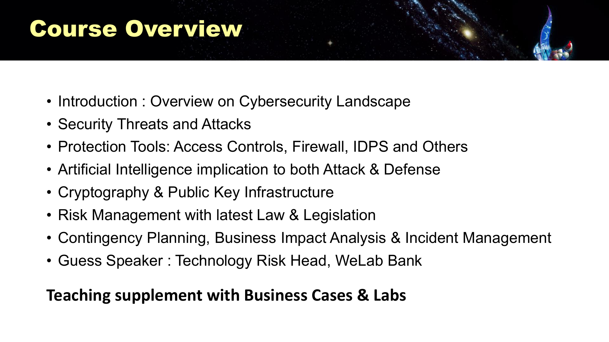

**讲师 Paul**：30 年金融与 fintech 风险管理经验（Risk Governance / Risk Analytics / Information Security）；HKU 计算机科学学士；ISACA **CISM**（Certified Information Security Manager）认证；HKIB/HKUST ECF Fintech Specialist（AI & Big Data）。

> 💡 讲师背景是**金融业风险管理**出身，不是纯技术出身。这解释了整门课的口味：**管理视角 > 技术细节**，考试也会偏"管理层怎么决策"而不是"怎么写 exploit"。

**课程 8 大模块（后续每周对应一块）**：

| # | 模块                                                           | 中文                    |
| - | ------------------------------------------------------------ | --------------------- |
| 1 | Overview on Cybersecurity Landscape                          | 网络安全形势总览（← **本课**）    |
| 2 | Security Threats and Attacks                                 | 安全威胁与攻击               |
| 3 | Protection Tools: Access Controls, Firewall, IDPS and Others | 防护工具：访问控制、防火墙、入侵检测/防御 |
| 4 | AI implication to both Attack & Defense                      | AI 对攻防两端的影响           |
| 5 | Cryptography & Public Key Infrastructure                     | 密码学与公钥基础设施            |
| 6 | Risk Management with latest Law & Legislation                | 风险管理与最新法律法规           |
| 7 | Contingency Planning, BIA & Incident Management              | 应急计划、业务影响分析与事件管理      |
| 8 | Guest Speaker: Technology Risk Head, WeLab Bank              | 客座讲者                  |

**评分构成（p.4）**：

| 项目                              | 占比       |
| ------------------------------- | -------- |
| Group Project + Peer Evaluation | 25% + 5% |
| Individual Assignment           | 20%      |
| Exam – Technical                | 20%      |
| Exam – Management               | 15%      |
| Class Participation             | 15%      |

> ⚠️ 注意：考试**拆成 Technical (20%) 和 Management (15%) 两份**，合计 35%。这意味着同一个概念可能被问两次——技术卷问"CIA 中 defacement 违反了哪一项"，管理卷问"CISO 应该向谁汇报、为什么"。复习时对每个概念都要准备**技术定义 + 管理含义**两层。

---

## 2. 🔴 Entail Trust in Digital Economy（数字经济需要信任）

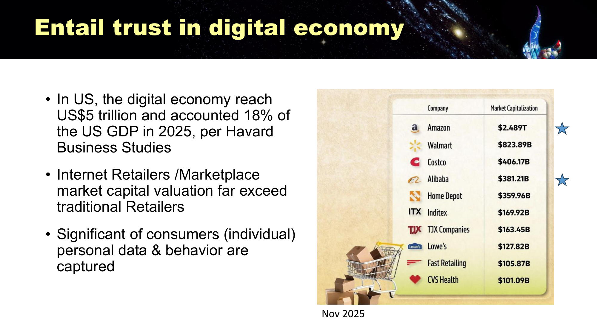

这是**全课的出发点**：网络安全不是 IT 部门的技术问题，而是**整个数字经济赖以运转的信任基础设施**。

| 论点       | 英文原文（考试可能这样出）                                                                                                                | 中文/小白解释                                                   |
| -------- | ---------------------------------------------------------------------------------------------------------------------------- | --------------------------------------------------------- |
| **经济体量** | In US, the digital economy reach **US$5 trillion** and accounted **18% of the US GDP in 2025**, per Harvard Business Studies | 美国数字经济规模 5 万亿美元，占 GDP 的 **18%**。这么大一块蛋糕全靠"用户敢在网上输密码、刷卡"撑着 |
| **估值倒挂** | Internet Retailers / Marketplace market capital valuation **far exceed** traditional Retailers                               | 互联网零售/平台的市值远超传统零售商——市场用钱投票，认为数字模式更值钱                      |
| **数据集中** | **Significant** of consumers (individual) personal data & behavior are captured                                              | 大量个人数据与行为被采集，一旦泄露，受害的是几千万个体而不只是一家公司                       |

**市值对照表（Nov 2025，slide 右侧图）**——注意讲师给 Amazon 和 Alibaba 打了星号：

| 公司             | 市值       | 类型    |
| -------------- | -------- | ----- |
| ⭐ **Amazon**   | $2.489T  | 互联网零售 |
| Walmart        | $823.89B | 传统零售  |
| Costco         | $406.17B | 传统零售  |
| ⭐ **Alibaba**  | $381.21B | 互联网平台 |
| Home Depot     | $359.96B | 传统零售  |
| Inditex (ITX)  | $169.92B | 传统零售  |
| TJX Companies  | $163.45B | 传统零售  |
| Lowe's         | $127.82B | 传统零售  |
| Fast Retailing | $105.87B | 传统零售  |
| CVS Health     | $101.09B | 传统零售  |

> **小白类比**：数字经济像一座**建在"信任"这根桩子上的摩天大楼**。你从没见过 Amazon 的仓库，却愿意把信用卡号打进去——这就是信任。网络安全事件就是在锯这根桩子，锯断一次，全楼晃一次。

**考点**：若问 *"Why does the digital economy entail trust?"*，答案要包含三层：

1. **规模层**——数字经济已占美国 GDP 的 18%（US$5T），不是边缘业务；
2. **结构层**——市值已从传统零售转移到互联网平台，经济重心本身就在数字侧；
3. **风险层**——平台大量采集个人数据与行为，信任一旦崩塌，损失的是整个经济模式而非单个企业。

只说"因为网上购物需要信任"= 没答到点子上。

> **英文模范答句**：  
> *"Trust is not a soft value in the digital economy — it is its operating condition. With the US digital economy reaching US$5 trillion and 18% of GDP in 2025, and with internet marketplaces now valued far above traditional retailers, the economy's centre of gravity sits on platforms that capture significant volumes of individual personal data and behaviour. A breach of that data is therefore not merely an IT failure but an erosion of the trust the entire model depends on."*

**踩坑提醒**：数字是 **18% of GDP / US$5 trillion / 2025 / Harvard Business Studies**。别把 18% 记成"18% 增长"——它是**占 GDP 的比重**。

---

## 3. 🔴 Components of Information Security（信息安全的构成）

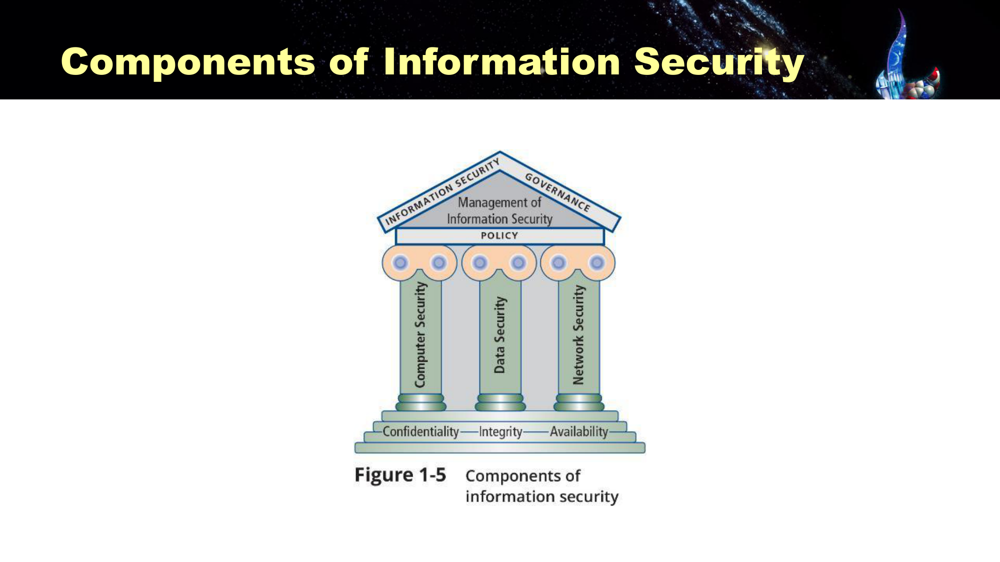

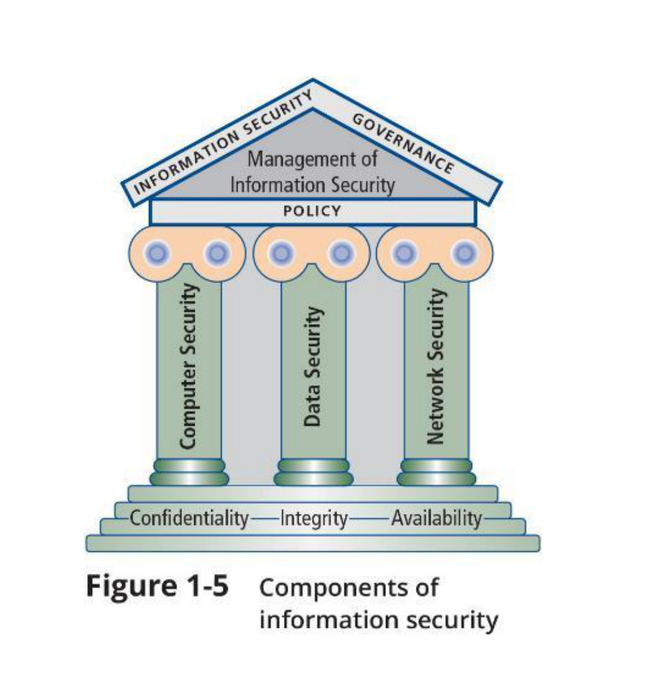

> ⚠️ 这一页 slide **只有标题是文字，全部内容都在图里**——纯文字讲义会完全漏掉它。而它是本课**最结构化、最像考题的一张图**（教材 Figure 1-5）。

这是一座**神庙（temple）结构**，一共四层，**从下往上**读：

| 层级                 | 内容                                                                                        | 含义                                |
| ------------------ | ----------------------------------------------------------------------------------------- | --------------------------------- |
| **地基（Foundation）** | **Confidentiality — Integrity — Availability**                                            | CIA 三要素是一切的基础。**没有 CIA，上面的柱子撑不住** |
| **三根柱子（Pillars）**  | **Computer Security**（计算机安全）<br />**Data Security**（数据安全）<br />**Network Security**（网络安全） | 信息安全的三大技术领域。三根柱子并列，**缺一根神庙就塌**    |
| **横梁（Beam）**       | **POLICY**（政策）                                                                            | 政策把三根柱子**绑在一起**——技术各管一摊，靠政策统一起来   |
| **屋顶（Roof）**       | **Management of Information Security**，两侧标注 **INFORMATION SECURITY** / **GOVERNANCE**     | 最顶层是**管理与治理**。整座建筑的方向由管理层决定       |

**方向很重要**：这张图是**自下而上支撑、自上而下治理**的。地基 CIA 支撑三根柱子，柱子经 POLICY 汇聚到屋顶的管理层；反过来，管理层（Governance）通过 POLICY 向下约束三个技术领域。**不要把它读成"管理层是被三根柱子支撑的附属品"——恰恰相反，它是决定其余一切的那一层。**

> **小白类比**：把它想成一座**希腊神庙**。地基（CIA）是你判断"安全没安全"的三把尺子；三根柱子（电脑/数据/网络）是三个具体战场；横梁（Policy）是把三个战场统一指挥的军令；屋顶（Management & Governance）是坐在指挥部的将军。**这门课教的主要是屋顶和横梁，不是柱子。**

**记忆口诀**：**「底 CIA、三柱撑、政策梁、治理顶」**（由下而上四层）。

**考点**：若问 *"What are the components of information security?"*，标准答案必须**分层说**，而不是列一堆并列名词：

> 三个技术支柱 **Computer / Data / Network Security**，共同建立在 **CIA（Confidentiality, Integrity, Availability）** 的基础之上，由 **Policy** 统一，并由最上层的 **Management of Information Security / Information Security Governance** 统领。

只答"电脑安全、数据安全、网络安全"三项 = 丢掉一半分数（漏了 CIA 地基、Policy 横梁和 Governance 屋顶）。

**踩坑提醒**：这张图和 §12 的 **CIA Triad** 是**两张不同的图、考不同的东西**。

- 本图考的是**结构**（谁支撑谁、四层分别是什么）；
- CIA Triad 考的是**定义**（三个词各自什么意思）。  
  两张图里都有 CIA，别混为一谈。

---

## 4. 🔴 Trend of Security Incidents（安全事故趋势）

### 4.1 香港事故趋势 — HKCERT

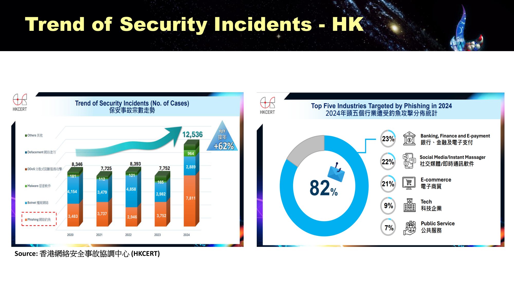

**HKCERT（香港網絡安全事故協調中心 / Hong Kong Computer Emergency Response Team Coordination Centre）保安事故宗數走勢**：

| 年份       | 总事故数                 | 关键构成                                           |
| -------- | -------------------- | ---------------------------------------------- |
| 2020     | 8,346                | Phishing 3,483 / Botnet 4,154 / Malware 181    |
| 2021     | 7,725                | Phishing 3,737 / Botnet 3,479 / Malware 112    |
| 2022     | 8,393                | Phishing 2,946 / Botnet 4,858 / Malware 121    |
| 2023     | 7,752                | Phishing 3,752 / Botnet 2,982 / Malware 165    |
| **2024** | **12,536（YoY +62%）** | **Phishing 7,811** / Botnet 2,889 / Others 964 |

**2024 年遭钓鱼攻击最多的五大行业（Top Five Industries Targeted by Phishing）**——注意这五个行业加起来占 **82%**：

| 排名 | 行业                                         | 占比      |
| -- | ------------------------------------------ | ------- |
| 1  | Banking, Finance and E-payment 银行、金融及电子支付  | **23%** |
| 2  | Social Media / Instant Messenger 社交媒体、即时通讯 | **22%** |
| 3  | E-commerce 电子商贸                            | **21%** |
| 4  | Tech 科技企业                                  | 9%      |
| 5  | Public Service 公共服务                        | 7%      |

### 4.2 2025 再创新高

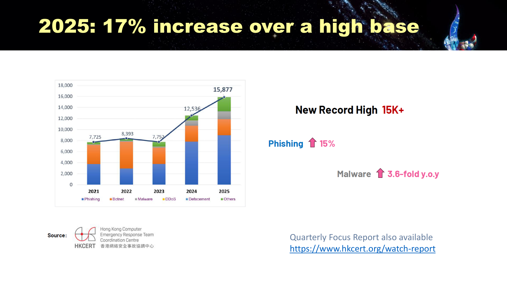

| 年份       | 事故数                               |
| -------- | --------------------------------- |
| 2021     | 7,725                             |
| 2022     | 8,393                             |
| 2023     | 7,752                             |
| 2024     | 12,536                            |
| **2025** | **15,877（New Record High, 15K+）** |

- **2025 年在 2024 已经很高的基数上再涨 17%**（"17% increase over a high base"）
- **Phishing ↑ 15%**
- **Malware ↑ 3.6 倍 y.o.y**（增速最猛的一类）
- 季度报告：HKCERT Quarterly Focus Report（hkcert.org/watch-report）

### 4.3 香港科技罪案与警方数据

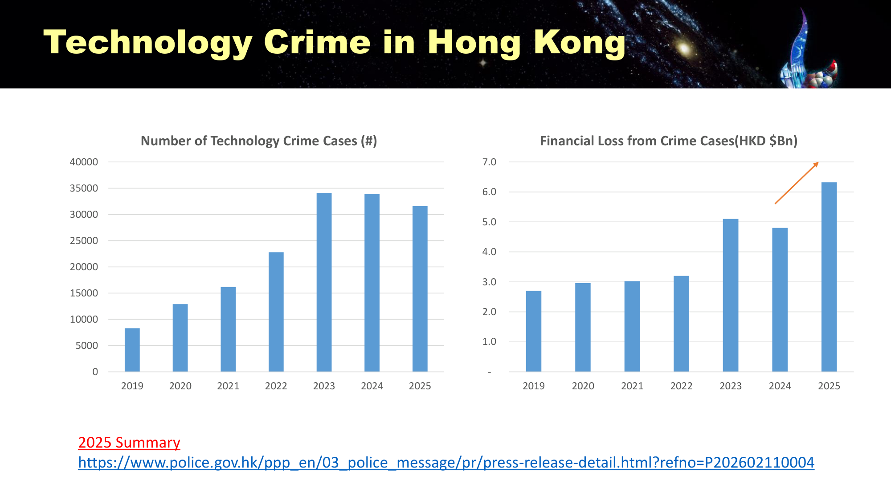

**Technology Crime in Hong Kong, 2025 Summary（香港警务处）**：两条曲线——**案件数**（2019→2025 一路攀升至 3.5 万宗量级）与**金钱损失**（HKD Bn，同步攀升至 60 亿港元量级）。

**Hong Kong Cyberthreat Report (2025) 关键数字（p.12）**：

| 指标                                    | 数值                                     |
| ------------------------------------- | -------------------------------------- |
| Technology crime cases (2025)         | **31,571 宗**（HK Police 记录，含网络欺诈与破坏性攻击） |
| — 其中 Hacking cases                    | **52 宗**                               |
| — 其中 Ransomware cases                 | **43 宗**                               |
| Cyber threat intelligence 处理量 (CSTCB) | 超过 **3,500 万条**                        |
| — 折合每日                                | 约 **96,000 条/天**                       |
| — 识别出针对香港的威胁                          | **154 万条**                             |

> **小白理解**：这几组数字讲的是**同一件事的三个刻度**——  
> HKCERT 数的是**"事故"**（技术层面被打了多少次，15,877）；  
> 警方数的是**"罪案"**（有人报案立案，31,571）；  
> CSTCB 数的是**"情报"**（雷达上扫到多少可疑信号，3,500 万）。  
> 层级不同、口径不同，**别把它们混着比较**。

**考点**：若问 *"Describe the trend of security incidents in Hong Kong."*，一个完整答案需要：

1. **方向**——持续上升，且 2024 起加速（2024 +62%，2025 再 +17% 且创 15K+ 新高）；
2. **结构**——Phishing 是绝对主力（2024 年 12,536 宗里有 7,811 宗），Malware 增速最快（2025 年 3.6 倍）；
3. **目标**——金融/社媒/电商三大行业合计吃下 82% 的钓鱼攻击；
4. **代价**——警方口径 31,571 宗科技罪案，金钱损失同步攀升。

**踩坑提醒**：**2024 的 +62% 和 2025 的 +17% 是两个不同年份的同比增速**，不要说成"两年共增长 79%"。而且 2025 的 17% 是"在高基数之上"（over a high base）——讲师专门把这句话写进了标题，说明他在意"增速虽然放缓但绝对值创新高"这层意思。

---

## 5. 🔴 案例研究（Cybersecurity Breach & Incidents）

> 讲师在这里花了 **8 页 slide 讲 5 个案例**（p.13–20），是全课占比最大的一块之一。案例题在考试中通常以"给一个情景，问它属于哪类威胁 / 违反了 CIA 哪一项 / 该公司犯了什么错"的形式出现。**每个案例要能说出：谁攻击、怎么进来的、后果、教训。**

### 5.1 🔴 Cyberport Hong Kong 数据泄露（2023）— 本课最详细的案例

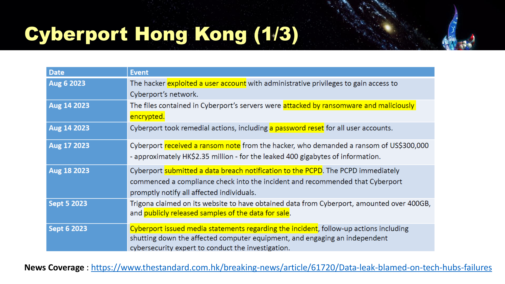

**攻击时间线**：

| 日期               | 事件                                                                                             |
| ---------------- | ---------------------------------------------------------------------------------------------- |
| **Aug 6, 2023**  | 黑客**利用一个具有管理员权限的用户账户**（exploited a user account with administrative privileges）进入 Cyberport 网络 |
| **Aug 14, 2023** | Cyberport 服务器上的文件遭**勒索软件加密**（attacked by ransomware and maliciously encrypted）                 |
| **Aug 14, 2023** | Cyberport 采取补救措施，包括**为所有用户账户重置密码**                                                             |
| **Aug 17, 2023** | 收到**勒索信**，黑客索要 **US$300,000（约 HK$2.35 million）**，涉及泄露的 **400 GB** 数据                           |
| **Aug 18, 2023** | 向 **PCPD**（私隐专员公署）提交**数据泄露通报**；PCPD 随即启动合规检查，并建议 Cyberport 尽快通知所有受影响个人                         |
| **Sept 5, 2023** | 勒索团伙 **Trigona** 在其网站宣称取得 Cyberport 超过 400GB 数据，并**公开释出样本出售**                                  |
| **Sept 6, 2023** | Cyberport 发布媒体声明，关停受影响设备，聘请独立网络安全专家调查                                                          |

**给客户的通知信（p.15）**——注意这封信的语气与结构，它本身就是一份**事件沟通（incident communication）范本**：

信中承认无法及时回复、已与网络取证顾问（cyber forensics consultants）合作确认受影响的数据主体与数据集、涉及 Leasing/FMO 团队及 FAST 计划的个人信息、调查仍在进行、届时会通知受影响租户与培育公司、已实施措施强化网络与系统安全、董事会成立由各委员会主席组成的**特别工作组（special taskforce）**监督整改。

> ⚠️ **注意这封信的日期是 Sept 2X, 2023**——事件 8 月 6 日就开始了，**一个多月后客户才收到这样一封"还在调查中"的信**。这正是下面 PCPD 认定的问题所在。

**🔴 PCPD 私隐专员认定的 5 项缺失（p.16）——这是最像考题的一页**

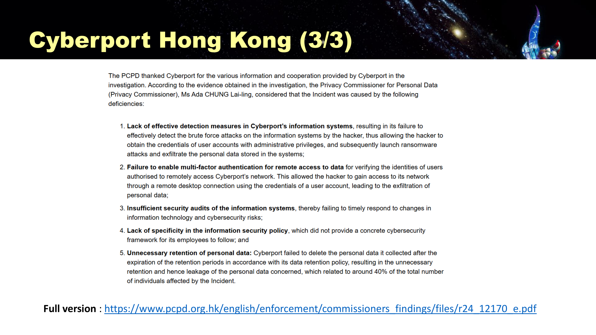

私隐专员 **Ms Ada CHUNG Lai-ling** 认定事件由以下 5 项缺失造成：

| # | 缺失（英文原文）                                                                          | 中文解释                                                                  | 对应的安全概念                             |
| - | --------------------------------------------------------------------------------- | --------------------------------------------------------------------- | ----------------------------------- |
| 1 | **Lack of effective detection measures** in Cyberport's information systems       | 缺乏有效检测措施，未能发现黑客的**暴力破解攻击（brute force attacks）**，导致管理员凭证被盗、随后勒索加密并外泄数据 | **Detection（检测）**能力缺失               |
| 2 | **Failure to enable multi-factor authentication (MFA) for remote access to data** | 未对远程访问启用**多因素认证**，黑客得以用一个用户账户的凭证通过远程桌面连接进入网络                          | **Access Control / Authentication** |
| 3 | **Insufficient security audits** of the information systems                       | 安全审计不足，未能及时响应 IT 与网络安全风险的变化                                           | **Audit / Assurance**               |
| 4 | **Lack of specificity in the information security policy**                        | 信息安全政策不够具体，没有给员工提供**可执行的网络安全框架**                                      | **Policy**（呼应 §3 神庙的"横梁"）           |
| 5 | **Unnecessary retention of personal data**                                        | 超过保留期限仍未删除个人数据，导致**约 40% 的受影响个人**本可以完全避免被波及                           | **Data Retention / 数据最小化**          |

**记忆口诀**：**「检测缺、MFA 无、审计少、政策虚、数据留」**（Detection–MFA–Audit–Policy–Retention）。

> **小白类比**：Cyberport 就像一间**没装监控（1）、大门只用一把钥匙没有第二道锁（2）、从不做安全巡检（3）、员工手册只写"注意安全"四个字（4）、而且把十年前的客户资料全堆在仓库没扔（5）**的公司。第 5 条尤其扎心：**有 40% 的受害者，本来根本不该出现在那批数据里。**

**考点**：这是最典型的**案例分析题素材**。若问 *"What went wrong at Cyberport?"* 或 *"What controls would have prevented this incident?"*，要按"**技术控制 + 管理控制**"两条线答：

- **技术控制缺失**：无有效检测（未发现暴力破解）、未启用 MFA；
- **管理控制缺失**：安全审计不足、安全政策缺乏可操作性、数据保留政策未执行。  
  只答"他们被勒索软件打了" = 描述现象，没有分析原因。

### 5.2 🔴 Arup AI Deepfake 视频诈骗（2024）

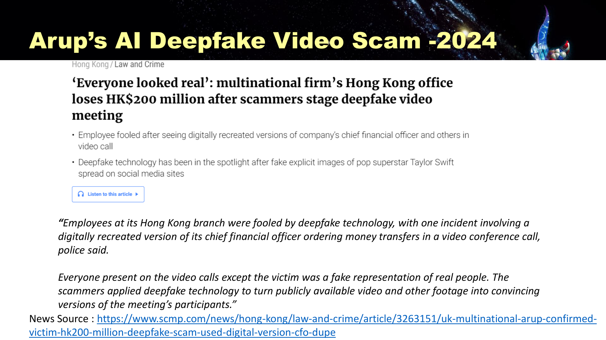

- 英国跨国工程公司 **Arup** 香港分部员工被**深度伪造（deepfake）**技术欺骗
- 骗局形式：一场**视频会议**，会议中出现"被数字重建的 CFO"，下令转账
- **除受害者本人外，视频会议里的每一个人都是伪造的**（"Everyone present on the video calls except the victim was a fake representation of real people."）
- 诈骗者用**公开可得的视频与影像素材**合成出以假乱真的与会者
- 损失：**HK$200 million（2 亿港元）**
- 来源：SCMP

> **小白理解**：传统钓鱼骗的是"你看到的一封邮件"，deepfake 骗的是"你看到的一张脸和听到的一个声音"。**过去我们教人"打个电话核实一下"——现在这条建议本身失效了。** 这就是为什么 AI 会单独成为本课程的一个模块（模块 4）。

**考点**：Arup 案是**社会工程学（social engineering）+ AI 赋能攻击**的教科书案例。注意它**没有任何系统被入侵**——防火墙、加密、访问控制全部完好，被攻破的是**人的判断**。若问 "为什么技术防护不足以阻止此类攻击"，这是最好的例子。

### 5.3 🟡 Supply Chain Attack（供应链攻击，2026）

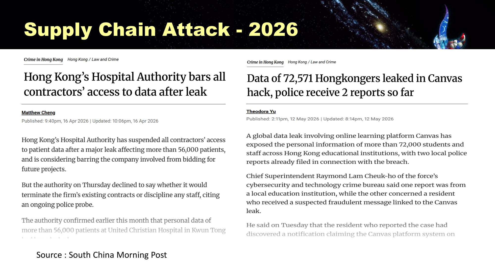

两则 SCMP 报道：

| 案例                          | 内容                                                                                                                                          |
| --------------------------- | ------------------------------------------------------------------------------------------------------------------------------------------- |
| **医管局（Hospital Authority）** | 一家**承包商**（contractor）造成 **56,000+ 名患者**数据泄露（涉观塘基督教联合医院）。医管局**暂停所有承包商访问患者数据**的权限，并考虑禁止涉事公司参与未来项目投标；因警方调查进行中，暂不表态是否终止合同或处分员工（2026 年 4 月 16 日） |
| **Canvas 学习平台**             | 全球性数据泄露，波及香港教育机构 **72,571 名**学生与教职员；警方已接获 2 宗报案——一宗来自本地教育机构，一宗来自收到疑似欺诈讯息的市民。网络安全及科技罪案调查科总警司 **Raymond Lam Cheuk-ho** 说明（2026 年 5 月 12 日）    |

> **小白类比**：供应链攻击 = **小偷不撬你家的门，而是去偷你家清洁工的钥匙**。你自己的安全做得再好，只要供应商弱，攻击者就从供应商进来。这也解释了为什么 §9 的 Ensign 报告和 §10 的 WEF 图都把"supply chain"单列为一大挑战。

**踩坑提醒**：Canvas 案对你们特别相关——**这是学生自己的数据**。考试若给一个"第三方 SaaS 平台泄露了学校数据"的情景，答案关键词是 **supply chain / third-party risk**，不是"学校自己被黑了"。

### 5.4 🟡 AI 暴露系统脆弱性 — OpenAI Hack

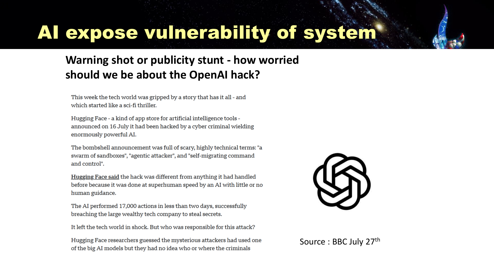

BBC（7 月 27 日）报道标题：**"Warning shot or publicity stunt — how worried should we be about the OpenAI hack?"**（警告信号还是炒作噱头——我们该有多担心 OpenAI 被黑？）

> **理解要点**：讲师放这一页不是要你记 OpenAI 的细节，而是提出一个判断问题——**当 AI 公司本身被攻破时，风险是"多了一个受害者"还是"整个技术底座出了问题"？** 这是本课程模块 4（AI 与攻防）的引子。

### 5.5 🟡 What the Industries Faced Last Year（Ensign 报告的 5 大趋势）

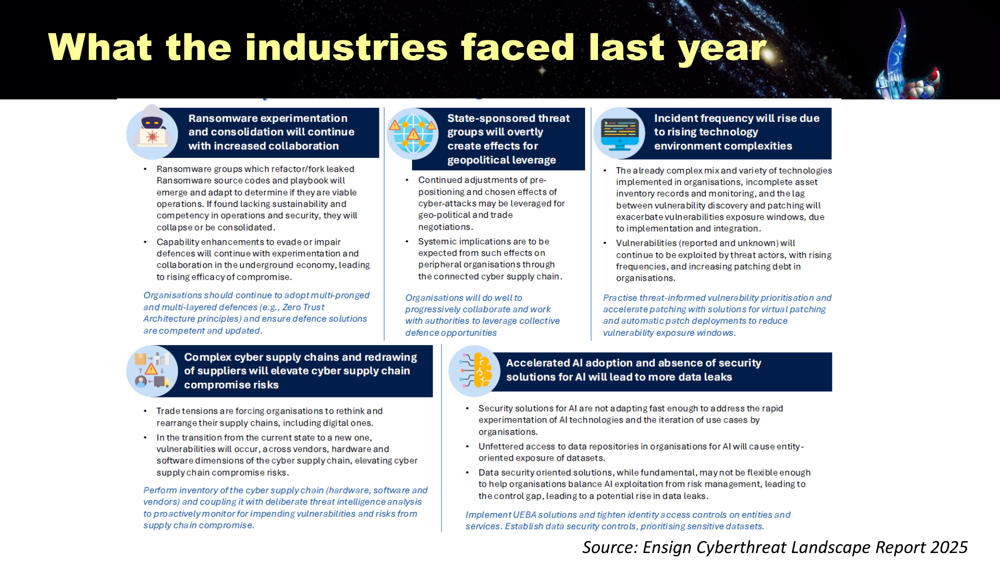

**Ensign Cyberthreat Landscape Report 2025** 列出的五大趋势（每一条都带"组织应该怎么做"的建议，**这个"趋势 + 应对"的配对结构很适合出简答题**）：

| # | 趋势（英文）                                                                                                | 中文                                                   | 建议应对                                                            |
| - | ----------------------------------------------------------------------------------------------------- | ---------------------------------------------------- | --------------------------------------------------------------- |
| 1 | **Ransomware experimentation and consolidation** will continue with increased collaboration           | 勒索软件团伙会分叉、试验泄露的源码与攻击手册，不可持续的会倒闭或被整合；地下经济中的协作让攻陷成功率上升 | 采用**多层次、多手段防御**（如 **Zero Trust Architecture** 原则），确保防御方案有效且持续更新 |
| 2 | **State-sponsored threat groups will overtly create effects for geopolitical leverage**               | 国家支持的威胁组织会公开制造影响，作为地缘政治与贸易谈判的筹码；影响会经由互联的网络供应链波及外围组织  | 逐步与**主管当局协作**，利用集体防御机会                                          |
| 3 | **Incident frequency will rise due to rising technology environment complexities**                    | 技术栈复杂、资产清单不全、监控不足、漏洞发现与修补之间存在时滞 → 暴露窗口被拉长            | 实践**威胁情报驱动的漏洞优先级排序**，用**虚拟补丁**与自动补丁部署缩短暴露窗口                     |
| 4 | **Complex cyber supply chains and redrawing of suppliers will elevate supply chain compromise risks** | 贸易紧张迫使企业重组供应链（含数字供应链），在过渡期内供应商、硬件、软件三个维度都会出现漏洞       | 盘点网络供应链（硬件、软件、供应商），结合**威胁情报分析**主动监控                             |
| 5 | **Accelerated AI adoption and absence of security solutions for AI will lead to more data leaks**     | AI 安全方案跟不上 AI 技术的快速试验与迭代；对数据仓库的无限制访问会造成实体层面的数据集暴露    | 部署 **UEBA**（用户与实体行为分析）方案，收紧身份访问控制，建立数据安全控制并对敏感数据集分级             |

**记忆口诀**：**「勒索、国家、复杂、供应链、AI」**（Ransomware–State–Complexity–Supply chain–AI）。

---

## 6. 🔴 Cybersecurity Adversaries / Threat Actors（威胁行为者）

### 6.1 🔴 Classification of Adversaries（对手的 4 个分类维度）

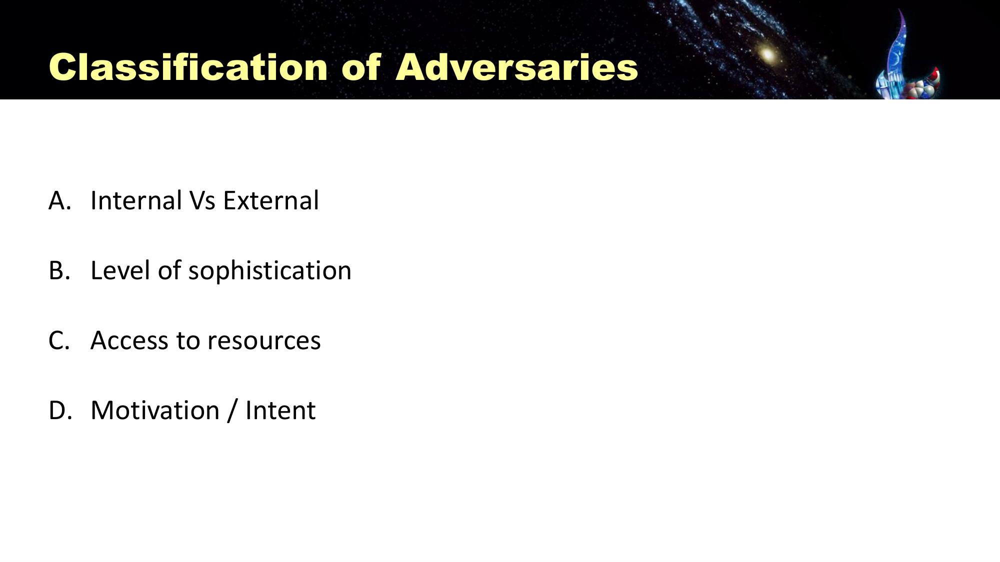

在讲具体的 6 类之前，讲师先给了**4 个分类维度**——这是分析任何一个攻击者的框架：

| 维度    | 英文                          | 中文/小白解释                             |
| ----- | --------------------------- | ----------------------------------- |
| **A** | **Internal Vs External**    | 内部 vs 外部——攻击者本来就有合法访问权，还是从外面打进来的？   |
| **B** | **Level of sophistication** | 技术成熟度——是用现成工具的菜鸟，还是能写 zero-day 的高手？ |
| **C** | **Access to resources**     | 资源获取能力——是一个人的电脑，还是一个国家的预算？          |
| **D** | **Motivation / Intent**     | 动机与意图——为了钱？为了理念？为了国家利益？还是纯为了好玩？     |

> **考点**：这 4 个维度是**答题的现成骨架**。任何"分析某攻击者属于什么类型"的题目，都可以按 Internal/External → Sophistication → Resources → Motivation 走一遍，答案自然完整。

### 6.2 🔴 6 Types of Threat Actors（六类威胁行为者）

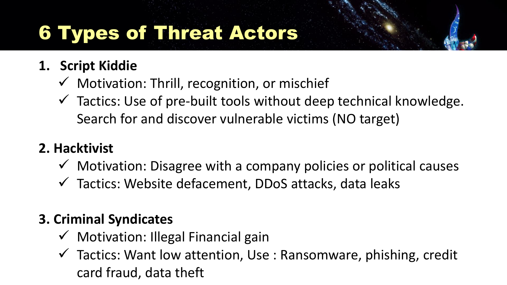

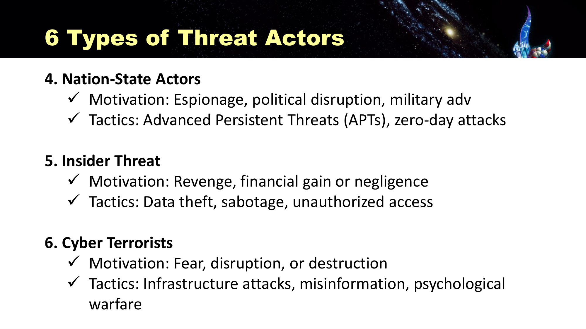

> ⚠️ **这是本课最"考试形状"的一页**——一个有编号的、可数的清单，每项都有固定的 Motivation + Tactics 结构。**必须能默写出六个名字，并说出每个的动机与手法。**

| # | 类型                                  | Motivation（动机，原文）                                          | Tactics（手法，原文）                                                                                                          | 中文速记                                  |
| - | ----------------------------------- | ---------------------------------------------------------- | ----------------------------------------------------------------------------------------------------------------------- | ------------------------------------- |
| 1 | **Script Kiddie**<br />脚本小子         | Thrill, recognition, or mischief                           | Use of **pre-built tools without deep technical knowledge**. Search for and discover vulnerable victims (**NO target**) | 为了刺激和炫耀；用现成工具，**没有特定目标**，谁弱打谁         |
| 2 | **Hacktivist**<br />黑客行动主义者         | Disagree with a company's policies or **political causes** | **Website defacement**, DDoS attacks, data leaks                                                                        | 为了理念/政治；篡改网页、DDoS、泄露数据                |
| 3 | **Criminal Syndicates**<br />犯罪集团   | **Illegal financial gain**                                 | **Want low attention.** Use: Ransomware, phishing, credit card fraud, data theft                                        | 为了钱；**刻意保持低调**（越少人注意越好赚），用勒索、钓鱼、信用卡诈骗 |
| 4 | **Nation-State Actors**<br />国家级行为者 | **Espionage**, political disruption, military advantage    | **Advanced Persistent Threats (APTs)**, zero-day attacks                                                                | 为了国家利益；长期潜伏（APT）、零日漏洞                 |
| 5 | **Insider Threat**<br />内部威胁        | **Revenge, financial gain or negligence**                  | Data theft, sabotage, unauthorized access                                                                               | 为了报复/钱，**或者纯粹是疏忽**；偷数据、搞破坏            |
| 6 | **Cyber Terrorists**<br />网络恐怖分子    | **Fear, disruption, or destruction**                       | **Infrastructure attacks**, misinformation, psychological warfare                                                       | 为了制造恐惧；打基础设施、散布假信息、心理战                |

**记忆口诀**：**「小子闹、黑客抗、集团贪、国家谍、内鬼怨、恐怖惧」**  
（Kiddie–Hacktivist–Syndicate–Nation-state–Insider–Terrorist，按动机排：闹→抗→贪→谍→怨→惧）

> **小白类比**：把六类想成六种"闯进你家的人"——  
> **脚本小子** = 随手拧门把手的顽童（谁家没锁就进谁家）；  
> **黑客行动主义者** = 在你家墙上刷标语的抗议者（要的是能见度）；  
> **犯罪集团** = 职业盗窃团伙（要的是钱，最怕上新闻）；  
> **国家级行为者** = 装了窃听器潜伏三年的间谍（要的是情报，不偷东西）；  
> **内鬼** = 有钥匙的保姆（本来就在里面）；  
> **网络恐怖分子** = 想炸掉整栋楼的人（要的是恐慌本身）。

**🚩 踩坑提醒（考试最爱在这里挖坑）**：

1. **Hacktivist vs Cyber Terrorist**：两者都不为钱。区别在**目的**——Hacktivist 想**传达一个观点**（defacement 是为了让人看见标语）；Cyber Terrorist 想**制造恐惧与破坏本身**（打基础设施是为了让人害怕）。
2. **Criminal Syndicates 的 "Want low attention"**：这一条很容易被忽略但很好考。**追求利益的攻击者反而最怕曝光**——和 Hacktivist 恰好相反。
3. **Insider Threat 包含 "negligence"（疏忽）**：内部威胁**不一定是恶意的**。一个员工不小心把数据发错人，也算 insider threat。这一点在 §7 的威胁分布图里得到了数据印证（"Unintended actions of well-meaning employees" 单独成为一类，且**从 4% 涨到 13%**）。
4. **Script Kiddie 的 "NO target"**：讲师专门用大写标注了。脚本小子**不挑目标**，是"扫描全网找弱的"；其余五类多多少少是有针对性的。
5. **APT ≠ 一种攻击**：APT（Advanced Persistent Threat）是 **Nation-State Actors 的手法**，指"长期潜伏的高级持续性威胁"，不是某个具体工具。

下面这个互动小测把「给一个场景，判断是哪种 Threat Actor」变成可以自己点的练习，最后一题就是课件原题 Snowden（可以选两项）：

*（网页版此处是「这是哪种 Threat Actor」的点选练习，部分题目要选两项；下表是全部题目和答案）*

| 场景                                                              | 属于                              | 理由                                                                                                                                                           |
| --------------------------------------------------------------- | ------------------------------- | ------------------------------------------------------------------------------------------------------------------------------------------------------------ |
| 一名员工不小心把含客户资料的表格转发给了外部邮箱，事后才发现收件人不对。                            | **Insider Threat**              | Insider Threat 的动机包含 revenge、financial gain \*\*或 negligence（疏忽）\*\*——这名员工没有恶意，纯粹是失误，但因为他本来就拥有合法访问权限，依然算 Insider。                                            |
| 一个犯罪团伙对医院系统部署勒索软件，索要比特币赎金，并刻意避免任何会引来媒体关注的举动。                    | **Criminal Syndicate**          | 动机是 illegal financial gain（为了钱），手法是 ransomware，且 \*\*"want low attention"\*\*——越低调越好赚，正是 Criminal Syndicate 的典型画像。                                           |
| 一群人入侵某公司官网首页，把内容替换成抗议该公司环保政策的标语。                                | **Hacktivist**                  | 动机是 disagree with a company's policies（不满某项政策），手法是 \*\*website defacement\*\*——教科书式的 Hacktivist。                                                             |
| 某国的网络部队潜伏进另一国的电网控制系统三年，期间没有采取任何破坏动作，只是持续收集情报。                   | **Nation-State Actor**          | 动机是 espionage / political disruption，手法是 \*\*Advanced Persistent Threat（长期潜伏）\*\*——APT 正是 Nation-State Actor 的标志性手法。                                         |
| 一名 14 岁少年下载了网上现成的 DDoS 工具，随便找了个游戏服务器打，只是想看看自己能不能打得动。            | **Script Kiddie**               | 动机是 thrill/mischief（图刺激），使用的是 \*\*pre-built tools without deep technical knowledge\*\*，而且没有特定目标（NO target）——典型 Script Kiddie。                                |
| 一个组织袭击城市供水系统的控制设施，目的是制造大范围恐慌，让市民对基础设施失去信心。                      | **Cyber Terrorist**             | 动机是 fear、disruption、destruction 本身，手法是 \*\*infrastructure attacks\*\*——不是为了钱也不是为了传达政治诉求，单纯要制造恐惧，是 Cyber Terrorist。                                           |
| Edward Snowden 是一名政府合同工，他把敏感的政府文件披露给记者，理由是揭发他认为不道德的活动。（本题选 2 项） | **Insider Threat + Hacktivist** | 他是 \*\*政府合同工\*\*，本身拥有合法访问权限 → \*\*Insider\*\*；他的动机是揭发不道德行为（理念/道德立场）、手法是数据泄露 → \*\*Hacktivist\*\*。这两个答案来自两条不同的分类维度：Insider 讲的是「他在哪」，Hacktivist 讲的是「他为什么」，不矛盾。 |

### 6.3 🔴 Threats Distribution（威胁分布 — Deloitte 2024）

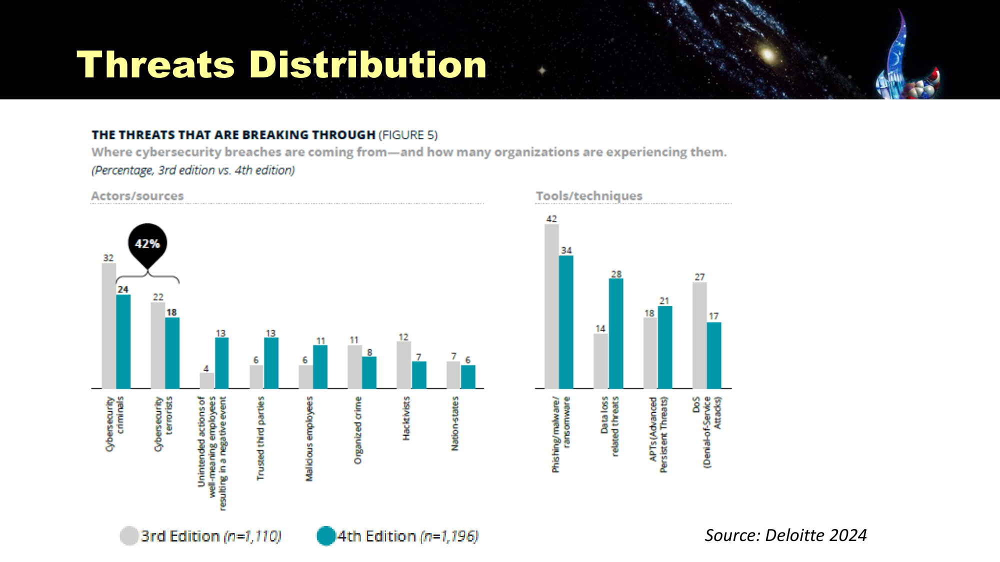

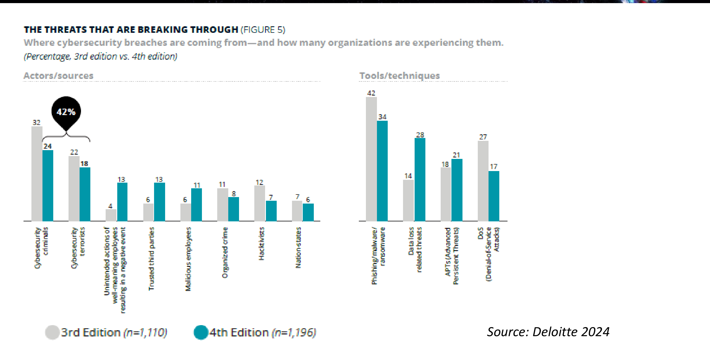

> Deloitte **Global Future of Cyber Survey**（这也是你们的 pre-reading！）图 5：**"The threats that are breaking through"** — 网络安全泄露从哪来、多少组织正在经历。灰柱 = 3rd Edition (n=1,110)，蓝柱 = 4th Edition (n=1,196)。

**左侧：Actors / Sources（攻击者与来源）**

| 来源                                                                | 3rd Ed. | 4th Ed. | 变化         |
| ----------------------------------------------------------------- | ------- | ------- | ---------- |
| **Cybersecurity criminals** 网络罪犯                                  | 32      | 24      | ↓          |
| **Cybersecurity terrorists** 网络恐怖分子                               | 22      | 18      | ↓          |
| ⭐ **Unintended actions of well-meaning employees**<br />善意员工的无意行为 | **4**   | **13**  | **↑↑ 三倍多** |
| ⭐ **Trusted third parties** 可信第三方                                 | **6**   | **13**  | **↑↑ 一倍多** |
| **Malicious employees** 恶意员工                                      | 6       | 11      | ↑          |
| **Organized crime** 有组织犯罪                                         | 11      | 8       | ↓          |
| **Hacktivists** 黑客行动主义者                                           | 12      | 7       | ↓          |
| **Nation-states** 国家行为者                                           | 7       | 6       | ↓          |

**🔑 图上唯一被特别标注的数字：42%** —— 指向前两项（Cybersecurity criminals 24 + Cybersecurity terrorists 18 = **42%**）。**罪犯与恐怖分子合计仍占最大份额。**

**右侧：Tools / Techniques（工具与手法）**

| 手法                                     | 3rd Ed. | 4th Ed. | 变化              |
| -------------------------------------- | ------- | ------- | --------------- |
| **Phishing / malware / ransomware**    | **42**  | **34**  | 仍是**第一大手法**，但下降 |
| **Data loss related threats** 数据丢失类威胁  | 14      | **28**  | **↑↑ 翻倍**       |
| **APTs (Advanced Persistent Threats)** | 18      | 21      | ↑               |
| **DoS (Denial-of-Service Attacks)**    | 27      | 17      | ↓               |

**🔴 这张图真正要你看懂的一句话**：

> **威胁的重心正在从"外部坏人"转向"内部与第三方"。**  
> 传统外部攻击者（criminals、terrorists、hacktivists、nation-states、organized crime）**全部下降**；而**善意员工的无意行为（4→13）、可信第三方（6→13）、恶意员工（6→11）三项全部大幅上升**。手法上也一样：DoS 这种"从外面砸门"的手法下降，而"数据丢失类"翻倍。

> **小白理解**：以前的比喻是"筑高墙防强盗"，现在的现实是"**钥匙在自己人和合作方手里**"。这直接呼应了 §5.3 的供应链攻击案例，以及 §6.2 中"Insider Threat 包含 negligence"这一条。

**考点**：若问 *"According to the Deloitte survey, how is the threat landscape shifting?"*，答案要抓住**方向性对比**而非罗列数字：

> 外部行为者（罪犯、恐怖分子、黑客行动主义者、国家行为者）占比普遍下降，但仍以 **42%** 居首（罪犯 24% + 恐怖分子 18%）；与此同时，**内部与第三方来源大幅上升**——善意员工的无意行为从 4% 升至 13%，可信第三方从 6% 升至 13%，恶意员工从 6% 升至 11%。手法上钓鱼/恶意软件/勒索软件仍居首（34%），但**数据丢失类威胁从 14% 翻倍至 28%**。这意味着防御重心必须从边界防护转向**身份、内部行为与第三方风险管理**。

**踩坑提醒**：这些数字是"**多少百分比的受访组织经历过该类威胁**"，**不是"占所有攻击的比例"**——所以它们加起来不等于 100%。别写成"钓鱼占所有攻击的 34%"。

### 6.4 🔴 Type of Hackers（黑帽 / 灰帽 / 白帽）

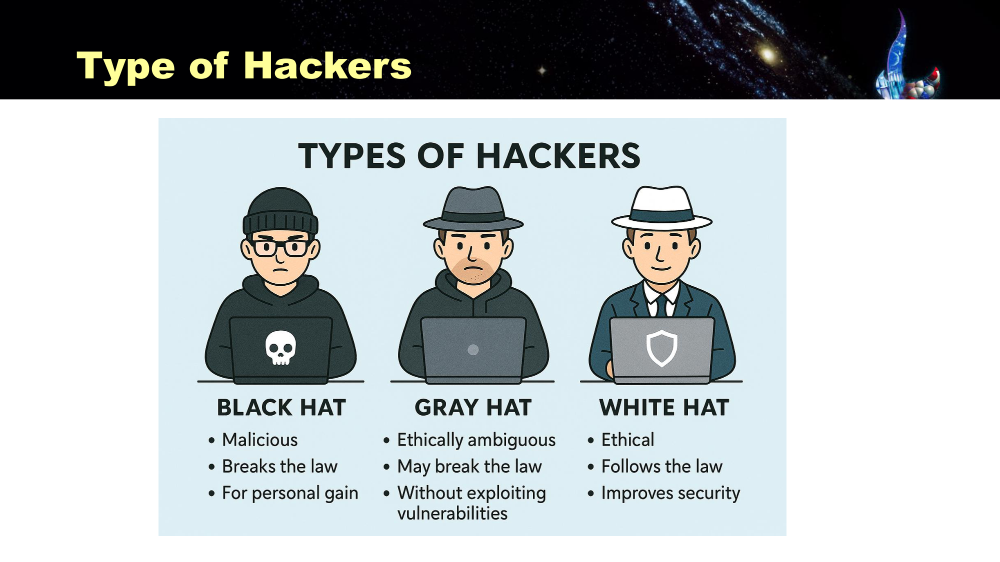

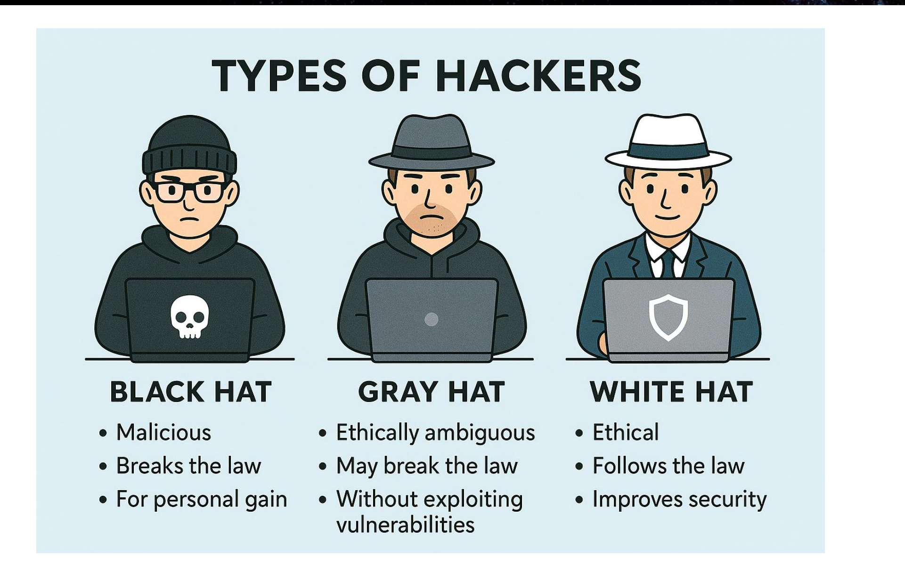

> ⚠️ 这一页 slide 的文字层**只有标题**，全部内容在图里。而**课件最后一道 MCQ（#1）直接考它**——必考。

|        | **BLACK HAT 黑帽**             | **GRAY HAT 灰帽**                                 | **WHITE HAT 白帽**            |
| ------ | ---------------------------- | ----------------------------------------------- | --------------------------- |
| **伦理** | **Malicious**（恶意）            | **Ethically ambiguous**（伦理模糊）                   | **Ethical**（合乎伦理）           |
| **法律** | **Breaks the law**（违法）       | **May break the law**（可能违法）                     | **Follows the law**（守法）     |
| **目的** | **For personal gain**（为个人利益） | **Without exploiting vulnerabilities**（不利用漏洞牟利） | **Improves security**（改善安全） |

**三者的核心分野**：

| 判断问题            | Black | Gray     | White          |
| --------------- | ----- | -------- | -------------- |
| 有没有**授权**？      | ❌ 无   | ❌ 通常无    | ✅ **有**（受雇/获准） |
| 会不会**违法**？      | ✅ 会   | ⚠️ 可能会   | ❌ 不会           |
| 找到漏洞后**拿它牟利**吗？ | ✅ 会   | ❌ **不会** | ❌ 不会           |

> **小白类比**：三个人都去试你家的锁——  
> **黑帽**：撬开进去把东西偷走；  
> **灰帽**：没经允许就撬开了（这已经违法），但**没偷东西**，还跑来告诉你"你家锁坏了"；  
> **白帽**：**你先付钱请他来**试锁，试完写份报告给你。  
> **关键区别在"授权"，不在"有没有造成损失"。**

**🚩 踩坑提醒（MCQ #1 就是这个坑）**：

> *"Paul works for a cybersecurity company. His firm was **hired** to conduct a test against a health-care system, and Paul is working to gain access to the system belonging to a hospital in that system."*
>
> 很多人看到"gain access to a hospital system"就选 Black Hat。但关键词是 **hired**（受雇）——**有授权 = White Hat**。  
> 另外注意选项里的 **"Green Hat"** 是**干扰项**，本课的框架里只有 Black / Gray / White 三种。

---

## 7. 🔴 Government Role（政府角色）

### 7.1 政府的定位与框架

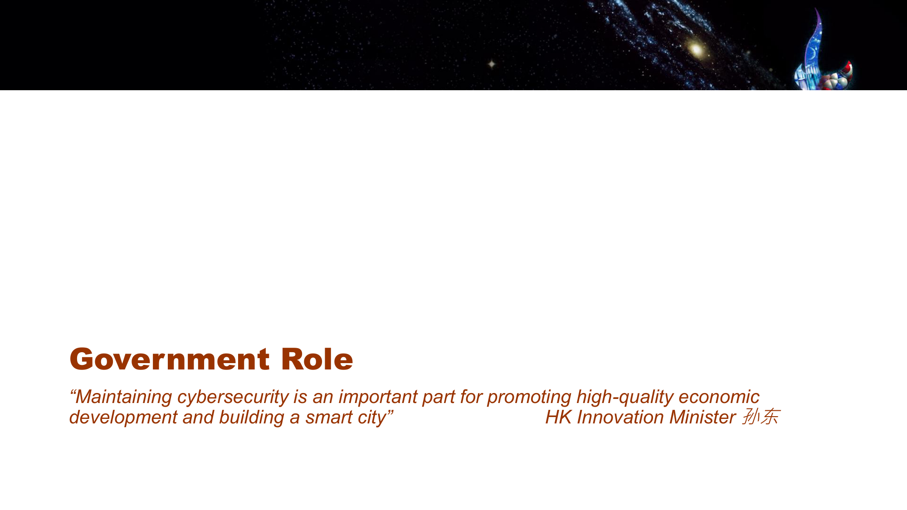

香港创新科技及工业局局长 **孙东（HK Innovation Minister）**：

> *"Maintaining cybersecurity is an important part for promoting high-quality economic development and building a smart city"*  
> （维护网络安全是推动高质量经济发展、建设智慧城市的重要组成部分）

> 💡 注意这句话的框架：政府把网络安全定位为**经济发展的支撑**，不是单纯的执法议题——这与 §2「数字经济需要信任」首尾呼应。

**🔴 政府角色的三段式框架（p.32）**：

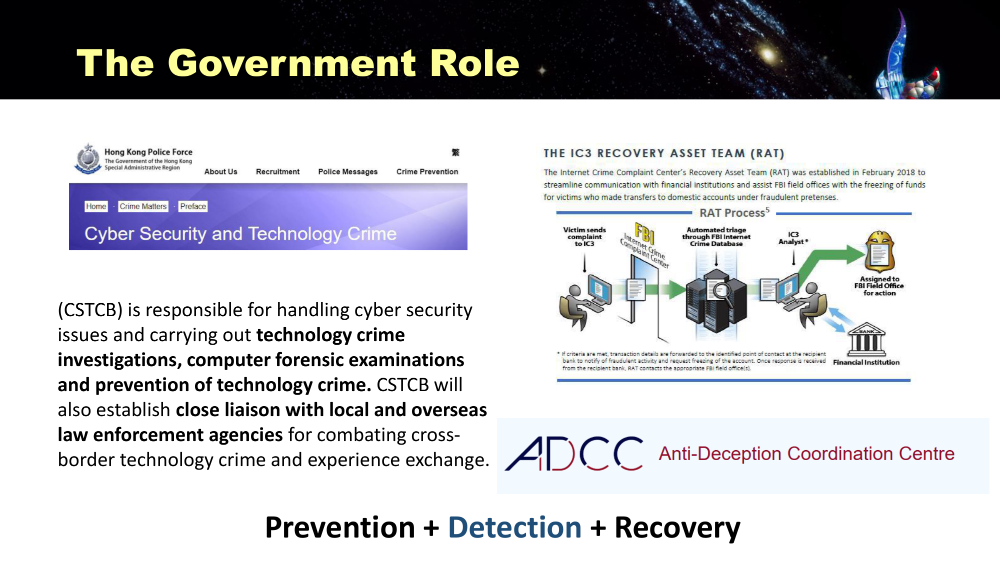

> ### **Prevention + Detection + Recovery**
>
> （预防 + 检测 + 恢复）

**CSTCB（Cyber Security and Technology Crime Bureau，网络安全及科技罪案调查科）**的职责：

- handling cyber security issues（处理网络安全议题）
- carrying out technology crime investigations（科技罪案调查）
- computer forensic examinations（电脑法证检验）
- prevention of technology crime（预防科技罪案）
- establish close liaison with **local and overseas law enforcement agencies** for combating **cross-border** technology crime and experience exchange（与本地及海外执法机构紧密联络，打击跨境科技罪案并交流经验）

**记忆口诀**：**「防—测—复」**（Prevention–Detection–Recovery）。这三个词是理解政府所有具体动作的分类器：

| 阶段                | 香港政府的具体举措                                                                                                                                                                                                           | Slide            |
| ----------------- | ------------------------------------------------------------------------------------------------------------------------------------------------------------------------------------------------------------------- | ---------------- |
| **Prevention 预防** | Digital Policy Office 的 **Technical Forum**（技术论坛）与 **Cybersecurity Awareness Program**（网络安全意识推广）<br />**Attack & Defend Drill 2024**（攻防演练）<br />**Capture the Flag Challenge 2025**（夺旗赛）<br />**Scameter+** 一站式防骗工具 | p.33, p.34, p.29 |
| **Detection 检测**  | 警方捣破钓鱼犯罪集团（**HK$16.8m**，SCMP, Jun 26 2026）<br />CSTCB 每日处理约 96,000 条威胁情报                                                                                                                                            | p.35, p.12       |
| **Recovery 恢复**   | 电脑法证检验、跨境执法协作、事故协调（HKCERT）                                                                                                                                                                                          | p.32             |

### 7.2 🟡 Hong Kong Digital Policy Office 与预防性举措

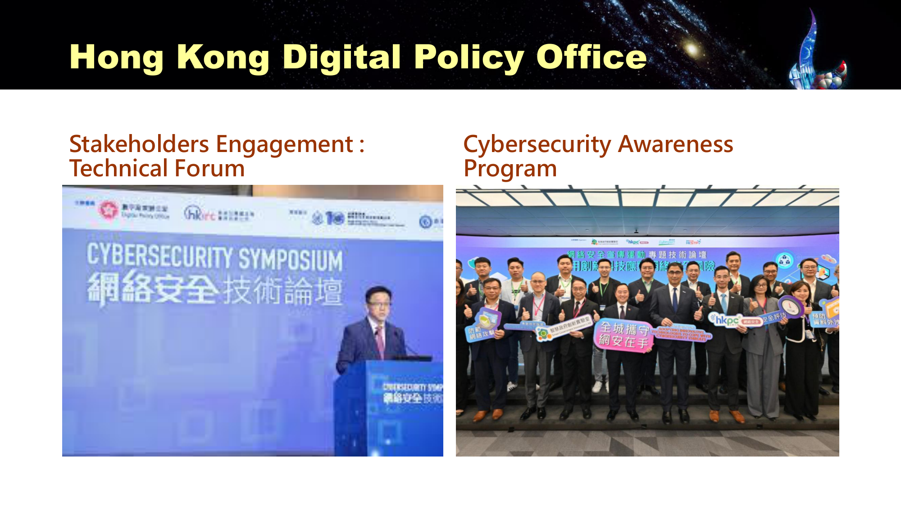

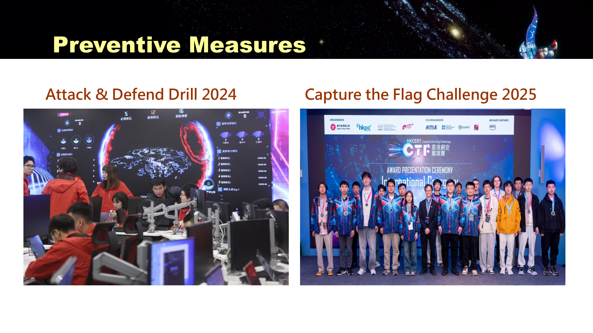

- **Stakeholders Engagement: Technical Forum** — 持份者参与的技术论坛
- **Cybersecurity Awareness Program** — 网络安全意识推广计划
- **Attack & Defend Drill 2024** — 攻防演练
- **Capture the Flag Challenge 2025** — CTF 夺旗赛（培养实战人才）

### 7.3 🟡 Scameter+：一站式防骗工具

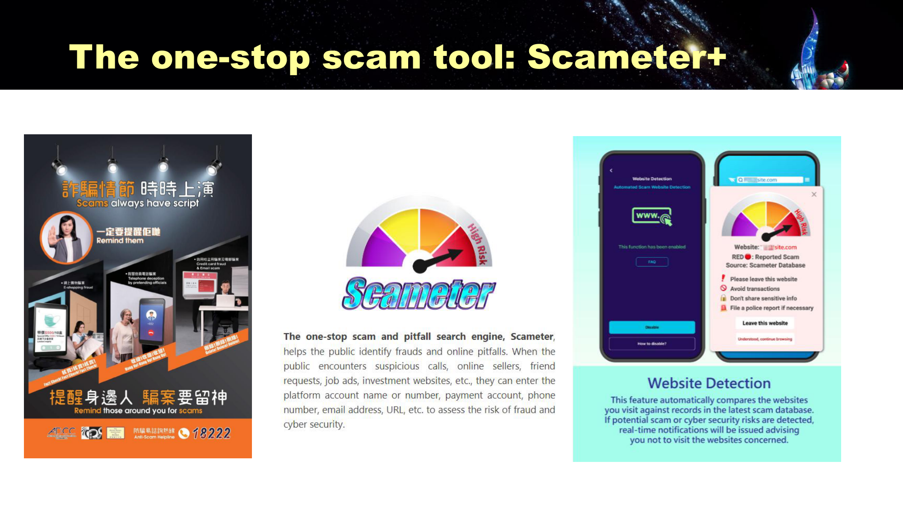

**Scameter（防骗视伏器）**是"one-stop scam and pitfall search engine"：

- **功能**：市民遇到可疑的**来电、网上卖家、交友邀请、招聘广告、投资网站**等，可输入**平台账户名/号码、支付账户、电话号码、电邮地址、URL** 来评估欺诈与网络安全风险
- **Website Detection（网站侦测）**：自动将你访问的网站与最新诈骗数据库比对，检测到风险时**实时通知**你不要访问
- 风险等级以仪表盘呈现（High Risk = 红色）；命中时提示：离开网站、避免交易、不要分享敏感信息、必要时报警
- 防骗易查询热线：**18222**

### 7.4 🟡 中国内地的投入（对比视角）

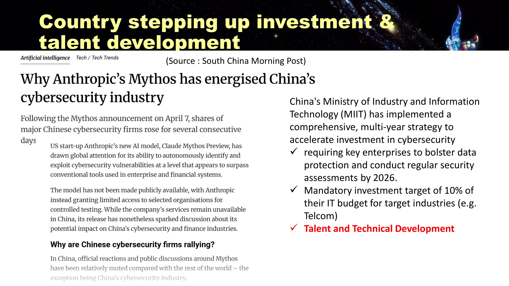

**中国工业和信息化部（MIIT）**推行多年期综合战略，加速网络安全投资：

- 要求**重点企业**加强数据保护，并在 **2026 年前定期进行安全评估**
- **强制性投资目标：目标行业（如电信）须将 IT 预算的 10% 投入网络安全**
- 人才与技术发展

**记忆锚点**：**香港 = 意识推广 + 演练 + 工具（软性引导）；内地 = 强制比例 + 定期评估（硬性指标）**。若考"比较不同地区的政府角色"，这是最好的对照。

### 7.5 🟡 个人层面的防护（How can you defend yourself?）

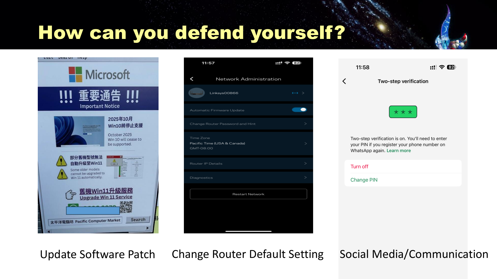

三条最基础的个人防护建议：

| 措施                                          | 说明                                                   |
| ------------------------------------------- | ---------------------------------------------------- |
| **Update Software Patch** 更新软件补丁            | 例：**Win 10 于 2025 年 10 月停止支援**——不再收到安全补丁的系统 = 敞开的门   |
| **Change Router Default Setting** 修改路由器默认设置 | 开启自动固件更新、**修改路由器默认密码**（默认密码全网公开）                     |
| **Social Media / Communication** 社交媒体与通讯    | 开启**两步验证（Two-step verification）**，如 WhatsApp 的 PIN 码 |

> 💡 注意：这三条和 §5.1 Cyberport 的失败一一对应——**没打补丁 ≈ 检测缺失，没改默认密码 ≈ 弱凭证，没开两步验证 ≈ 没有 MFA**。个人层面和企业层面的道理是同一个。

---

## 8. 🟡 Understand Complexity in Cyberspace（网络空间的复杂性）

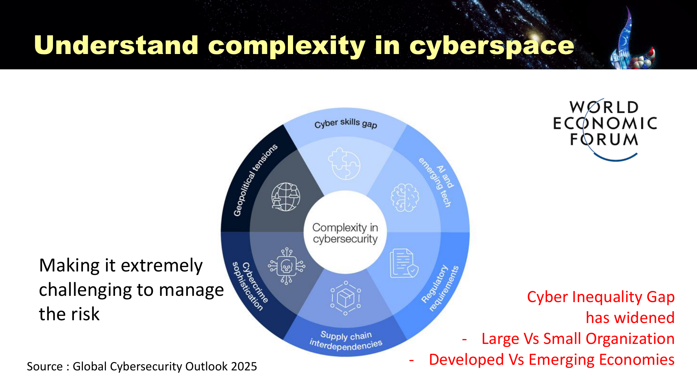

**WEF Global Cybersecurity Outlook 2025** 的复杂性轮盘图 —— 中心是 **"Complexity in cybersecurity"**，六个扇区（顺时针）：

| # | 扇区                                 | 中文       |
| - | ---------------------------------- | -------- |
| 1 | **Cyber skills gap**               | 网络安全技能缺口 |
| 2 | **AI and emerging tech**           | AI 与新兴技术 |
| 3 | **Regulatory requirements**        | 监管要求     |
| 4 | **Supply chain interdependencies** | 供应链相互依赖  |
| 5 | **Cybercrime sophistication**      | 网络犯罪的精密化 |
| 6 | **Geopolitical tensions**          | 地缘政治紧张   |

**结论**：这六者叠加 → **"Making it extremely challenging to manage the risk"**（使风险管理极其困难）

**🔴 Cyber Inequality Gap has widened（网络不平等鸿沟正在扩大）**——两条断层线：

- **Large Vs Small Organization**（大企业 vs 小企业）
- **Developed Vs Emerging Economies**（发达经济体 vs 新兴经济体）

> **小白理解**：安全能力正在**两极分化**。大公司越来越安全，小公司越来越危险；发达国家越来越安全，新兴经济体越来越危险。而由于供应链把大小公司连在一起（§5.3），**小公司的弱点最终会变成大公司的风险**——这就是为什么"不平等"本身是个安全问题，而不只是公平问题。

### 8.1 🟡 Some of the challenges（三大挑战）

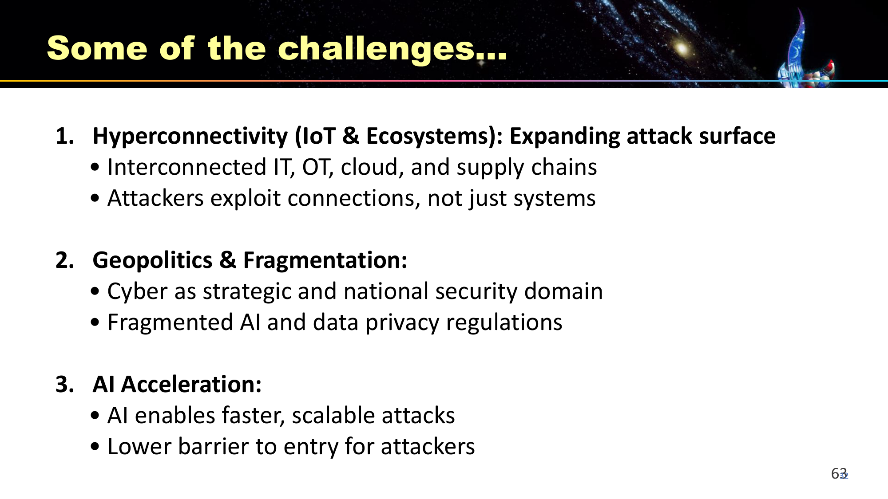

| # | 挑战                                                                                | 要点                                                                                                                                                   |
| - | --------------------------------------------------------------------------------- | ---------------------------------------------------------------------------------------------------------------------------------------------------- |
| 1 | **Hyperconnectivity (IoT & Ecosystems): Expanding attack surface**<br />超连接：攻击面扩大 | Interconnected **IT, OT, cloud, and supply chains**（IT、运营技术、云、供应链彼此互联）<br />**Attackers exploit connections, not just systems**（攻击者利用的是"连接"，不只是"系统"） |
| 2 | **Geopolitics & Fragmentation**<br />地缘政治与碎片化                                     | Cyber as **strategic and national security domain**（网络成为战略与国家安全领域）<br />**Fragmented AI and data privacy regulations**（AI 与数据隐私法规碎片化）                |
| 3 | **AI Acceleration**<br />AI 加速                                                    | AI enables **faster, scalable** attacks（更快、可规模化的攻击）<br />**Lower barrier to entry** for attackers（攻击门槛降低）                                            |

**考点**：*"Attackers exploit connections, not just systems"* 是一句很值得背的原文——它精准概括了供应链攻击（§5.3）和超连接风险的本质。

---

## 9. 🟡 Commercial Sector / Business（商业部门的应对）

### 9.1 Are companies ready to face the risk?（企业准备好了吗）

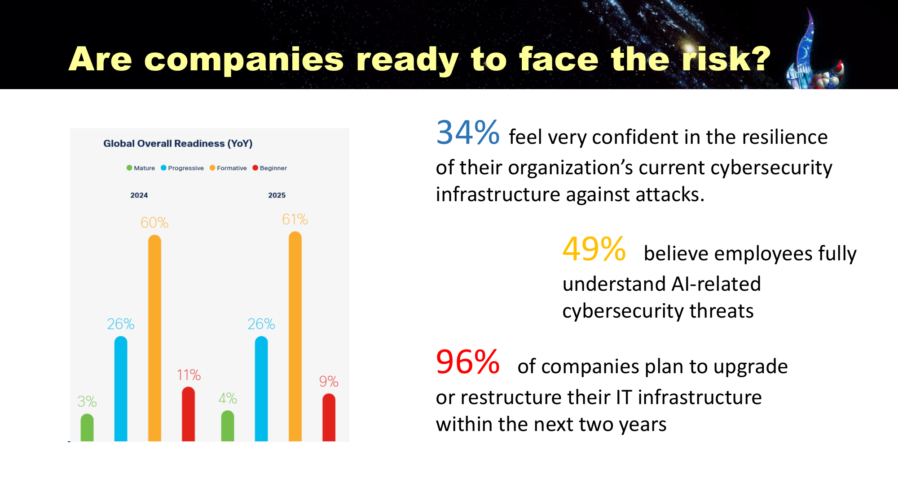

三个数字（Cisco Cybersecurity Readiness Index 2025）：

| 数字      | 含义                                                                                                                                            |
| ------- | --------------------------------------------------------------------------------------------------------------------------------------------- |
| **34%** | feel **very confident** in the resilience of their organization's current cybersecurity infrastructure against attacks（仅三分之一对自身安全基础设施的韧性很有信心） |
| **49%** | believe employees **fully understand** AI-related cybersecurity threats（不到一半认为员工完全理解 AI 相关威胁）                                                 |
| **96%** | of companies plan to **upgrade or restructure their IT infrastructure** within the next two years（几乎所有企业都打算在两年内升级或重构 IT 基础设施）                 |

> **理解要点**：这三个数字放在一起讲了一个**很矛盾的故事**——只有 34% 有信心，只有 49% 认为员工懂 AI 威胁，**却有 96% 要在两年内大改 IT 架构**。也就是说：**大规模变革正在一个信心不足、认知不足的环境里发生**。这正是 §8 中"complexity"和"incident frequency will rise"的原因。

### 9.2 🟡 Five Tech Dimensions on Readiness（五个技术就绪维度）

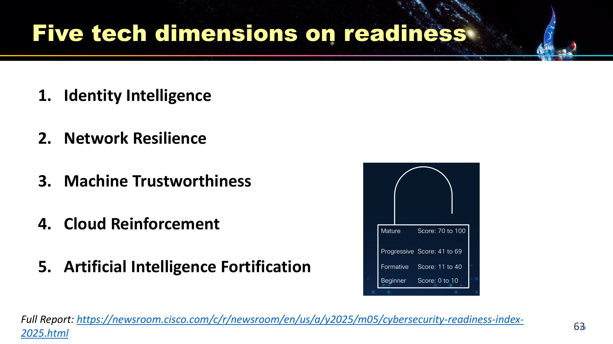

Cisco 2025 Cybersecurity Readiness Index 的五个维度：

| # | 维度                                        | 中文     |
| - | ----------------------------------------- | ------ |
| 1 | **Identity Intelligence**                 | 身份智能   |
| 2 | **Network Resilience**                    | 网络韧性   |
| 3 | **Machine Trustworthiness**               | 机器可信度  |
| 4 | **Cloud Reinforcement**                   | 云加固    |
| 5 | **Artificial Intelligence Fortification** | 人工智能强化 |

**记忆口诀**：**「身份、网络、机器、云、AI」**（Identity–Network–Machine–Cloud–AI）——**一个可数的五项清单，非常适合出填空/简答题。**

### 9.3 🟡 Financial Sector are thinking ahead（金融业的前瞻）

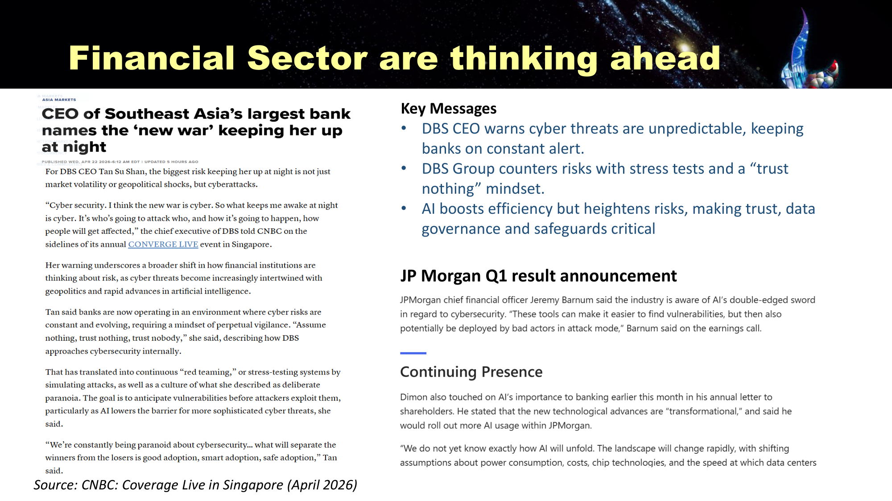

CNBC 新加坡直播（April 2026）关键讯息：

- **DBS CEO** warns cyber threats are **unpredictable**, keeping banks on constant alert（网络威胁不可预测，银行必须持续戒备）
- DBS Group counters risks with **stress tests** and a **"trust nothing" mindset**（用压力测试与"零信任"心态应对）
- **AI boosts efficiency but heightens risks**, making **trust, data governance and safeguards** critical（AI 提升效率同时放大风险，信任、数据治理与保障措施因此至关重要）
- 同页还提及 JP Morgan Q1 业绩公布

> 💡 **"trust nothing" mindset** 就是 **Zero Trust（零信任）**的通俗说法——呼应 §5.5 Ensign 报告建议的 Zero Trust Architecture。这个概念在后续模块还会出现。

### 9.4 🟡 HKMA Survey: Technology Adoption Risk

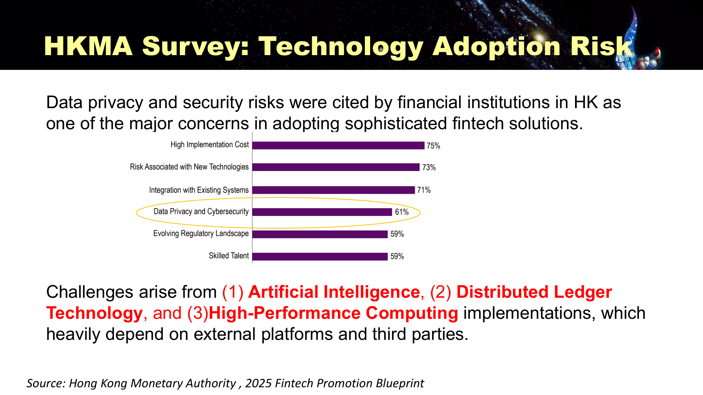

**香港金融管理局（HKMA）2025 Fintech Promotion Blueprint**：

- **Data privacy and security risks** 被香港金融机构列为采用高级金融科技方案时的**主要顾虑之一**
- 挑战来自三类技术：**(1) Artificial Intelligence**、**(2) Distributed Ledger Technology (DLT，分布式账本技术)**、**(3) High-Performance Computing**
- 共同点：这三者都**高度依赖外部平台与第三方**（heavily depend on external platforms and third parties）

> **考点**：注意这里又一次指向**第三方风险**——和 §6.3 Deloitte 数据（trusted third parties 6→13）、§5.3 供应链攻击案例、§8.1 超连接挑战全部对上。**"第三方/供应链风险"是本课贯穿始终的一条暗线，很可能成为简答题的主题。**

---

## 10. 🟡 Damages（损失）

### 10.1 Industry Intelligence（CISO Report）

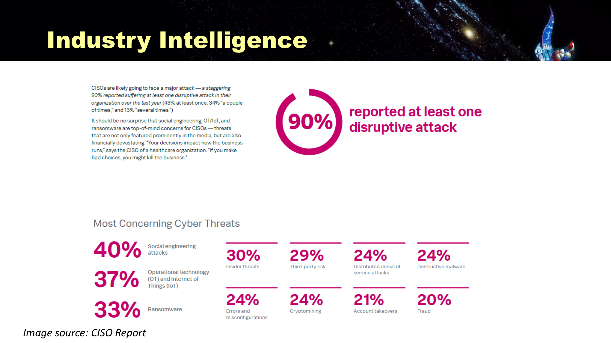

**🔑 核心数字：90% of CISOs reported suffering at least one disruptive attack in their organization over the last year**  
（90% 的 CISO 表示其组织在过去一年至少遭遇过一次破坏性攻击）  
拆解：**43% "at least once"、34% "a couple of times"、13% "several times"**

**Most Concerning Cyber Threats（CISO 最担心的威胁）**：

| 排名 | 威胁                                                           | 占比      |
| -- | ------------------------------------------------------------ | ------- |
| 1  | **Social engineering attacks** 社会工程攻击                        | **40%** |
| 2  | **Operational Technology (OT) and Internet of Things (IoT)** | **37%** |
| 3  | **Ransomware** 勒索软件                                          | **33%** |
| 4  | Insider threats 内部威胁                                         | 30%     |
| 5  | Third-party risk 第三方风险                                       | 29%     |
| 6= | Distributed denial of service attacks                        | 24%     |
| 6= | Destructive malware                                          | 24%     |
| 6= | Errors and misconfigurations 错误与配置失误                         | 24%     |
| 6= | Cryptomining 挖矿                                              | 24%     |
| 10 | Account takeovers 账户接管                                       | 21%     |
| 11 | Fraud 欺诈                                                     | 20%     |

一位医疗机构 CISO 的原话：*"Your decisions impact how the business runs. If you make bad choices, you might kill the business."*（你的决策影响业务如何运转；做错选择，可能会让公司死掉。）

> 💡 **Social engineering 排第一（40%）**——这正好解释了 §5.2 的 Arup deepfake 案。技术再好，人被骗了照样输。

### 10.2 How costly is the breach?（泄露有多贵）

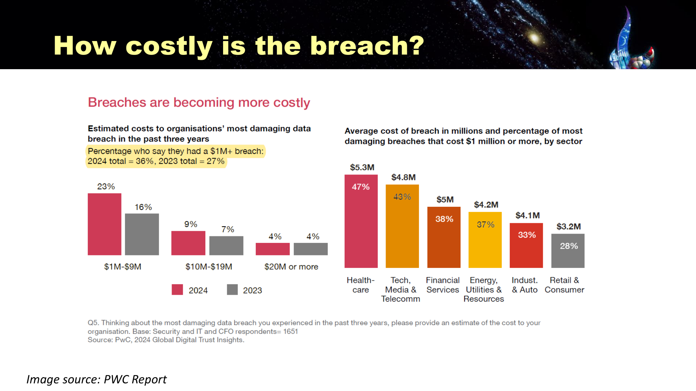

**PwC 2024 Global Digital Trust Insights**（n=1,651 安全/IT/CFO 受访者）：

**🔑 有 $1M+ 泄露损失的比例：2024 = 36%，2023 = 27%**（一年内跳升 9 个百分点）

按损失区间：

| 区间           | 2024    | 2023 |
| ------------ | ------- | ---- |
| $1M–$9M      | **23%** | 16%  |
| $10M–$19M    | **9%**  | 7%   |
| $20M or more | 4%      | 4%   |

按行业的**平均泄露成本**（及该行业中损失 ≥$1M 的比例）：

| 行业                                   | 平均成本      | ≥$1M 占比 |
| ------------------------------------ | --------- | ------- |
| **Healthcare** 医疗                    | **$5.3M** | **47%** |
| **Tech, Media & Telecomm** 科技传媒电信    | $4.8M     | 43%     |
| **Financial Services** 金融服务          | $5.0M     | 38%     |
| Energy, Utilities & Resources 能源公用资源 | $4.2M     | 37%     |
| Industrial & Auto 工业与汽车              | $4.1M     | 33%     |
| Retail & Consumer 零售与消费              | $3.2M     | 28%     |

**记忆锚点**：**医疗最贵（$5.3M / 47%），零售最便宜（$3.2M / 28%）**——因为医疗数据既敏感又受严格监管。

---

## 11. 🔴 Job Demand（人才需求）

### 11.1 🔴 Current Landscape（当前形势的四大特征）

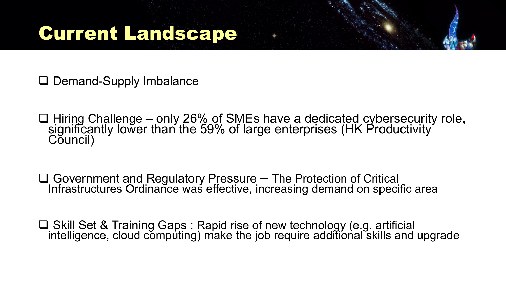

| # | 特征                                                  | 关键内容                                                                               |
| - | --------------------------------------------------- | ---------------------------------------------------------------------------------- |
| 1 | **Demand-Supply Imbalance**<br />供需失衡               | 需求远大于供给（这就是整节的主旨）                                                                  |
| 2 | **Hiring Challenge**<br />招聘挑战                      | 只有 **26% 的中小企（SMEs）**有专职网络安全岗位，远低于**大型企业的 59%**（香港生产力促进局 HK Productivity Council）  |
| 3 | **Government and Regulatory Pressure**<br />政府与监管压力 | **The Protection of Critical Infrastructures Ordinance**（《保护关键基础设施条例》）已生效，特定领域需求上升 |
| 4 | **Skill Set & Training Gaps**<br />技能与培训缺口          | 新技术（**AI、云计算**）快速涌现，岗位要求额外技能与持续升级                                                  |

> **踩坑提醒**：**26% vs 59%** 这组数字很好考。注意它印证了 §8 的 **Cyber Inequality Gap（Large Vs Small Organization）**——**中小企连一个专职安全岗都没有**，这不是"意识不够"，这是结构性的能力鸿沟。

**记忆口诀**：**「供需失衡、中小无人、监管加压、技能追不上」**。

### 11.2 🟢 Diversity of Career Choices（职业选择的多样性）

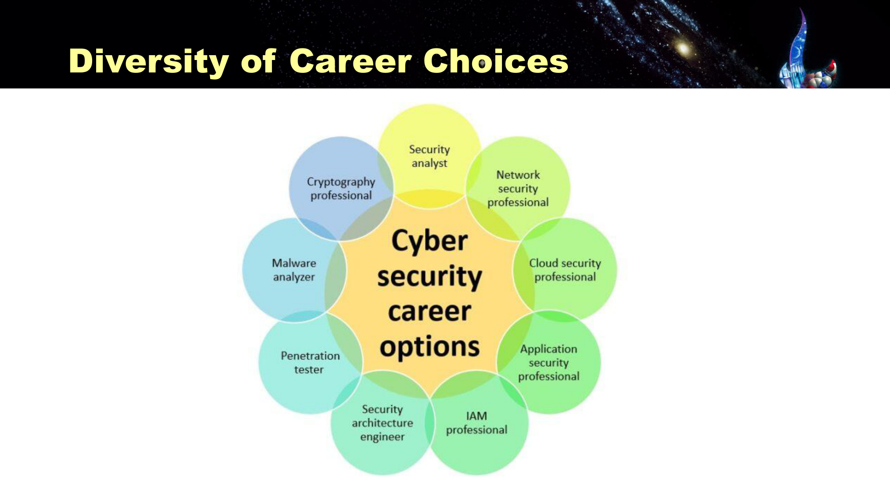

**Cyber security career options（九种岗位）**：

| 岗位                                                 | 中文                       |
| -------------------------------------------------- | ------------------------ |
| **Security analyst**                               | 安全分析师                    |
| **Network security professional**                  | 网络安全专家                   |
| **Cloud security professional**                    | 云安全专家                    |
| **Application security professional**              | 应用安全专家                   |
| **IAM professional**（Identity & Access Management） | 身份与访问管理专家                |
| **Security architecture engineer**                 | 安全架构工程师                  |
| **Penetration tester**                             | 渗透测试员（← 就是 §6.4 的**白帽**） |
| **Malware analyzer**                               | 恶意软件分析师                  |
| **Cryptography professional**                      | 密码学专家                    |

> 💡 这九个岗位和课程八大模块基本一一对应——**这门课的每一周，其实都在介绍一条职业路径。**

---

## 12. 🔴 CISO 与安全组织架构

### 12.1 🔴 The CISO's Place and Roles（CISO 的位置与角色）

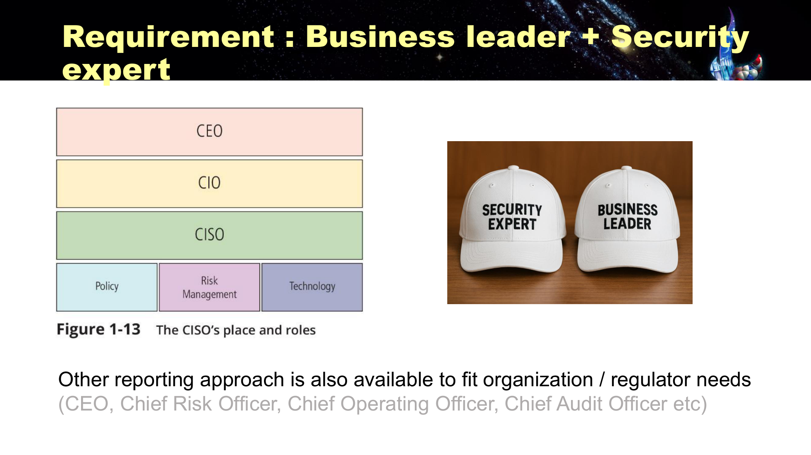

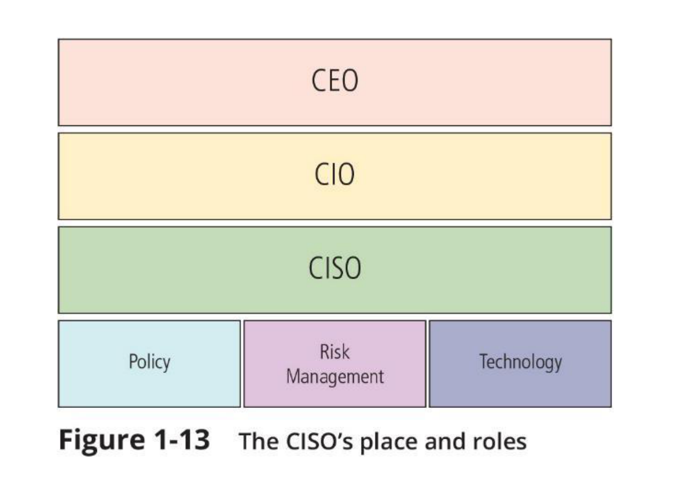

**教材 Figure 1-13** 的层级结构（**从上到下**）：

```
CEO
 └── CIO  (Chief Information Officer)
      └── CISO  (Chief Information Security Officer)
           ├── Policy        政策
           ├── Risk Management  风险管理
           └── Technology    技术
```

**两层含义**：

1. **CISO 的汇报线**：典型路径是 **CEO → CIO → CISO**（CISO 向 CIO 汇报）
2. **CISO 的三大职责领域**：**Policy（政策）、Risk Management（风险管理）、Technology（技术）**——注意"技术"只是三分之一，另外三分之二是管理工作

**🔴 幻灯片标题就是考点：Requirement: Business leader + Security expert**  
CISO 必须**同时戴两顶帽子**（slide 上就画了两顶帽子）：**SECURITY EXPERT** 和 **BUSINESS LEADER**。

**🔑 但是**（slide 底部小字，容易漏）：

> *"Other reporting approach is also available to fit organization / regulator needs (**CEO, Chief Risk Officer, Chief Operating Officer, Chief Audit Officer** etc)"*
>
> CISO **不一定向 CIO 汇报**。视组织与监管需要，也可以直接向 CEO、CRO、COO 或 CAO 汇报。

> **小白理解**：为什么汇报线是个议题？因为**如果 CISO 向 CIO 汇报，而 CIO 的 KPI 是"按时上线新系统"，那么"为了安全推迟上线"这种建议就等于在跟自己老板的 KPI 作对**。所以很多受强监管的机构（尤其银行）会让 CISO 绕开 CIO，直接向 CEO 或 CRO 汇报，以保持独立性。

**考点**：若问 *"To whom should the CISO report, and why?"*，答案要包含三层：

1. **典型结构**是 CEO → CIO → CISO；
2. **但可以有其他安排**（CEO / CRO / COO / CAO），取决于组织结构与监管要求；
3. **原因**——CISO 兼具 business leader 与 security expert 双重身份，汇报线决定了安全议题在管理层的独立性与话语权。

**踩坑提醒**：别把 **CIO** 和 **CISO** 记混。

- **CIO** = Chief **Information** Officer，管**整个 IT**（让系统跑起来）
- **CISO** = Chief Information **Security** Officer，管**信息安全**（让系统安全地跑）

### 12.2 🔴 Key Functions（安全团队的四大职能）

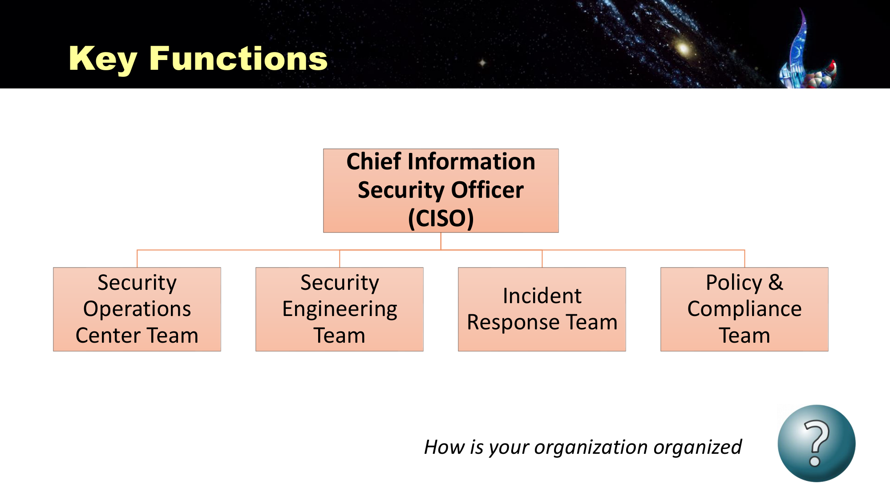

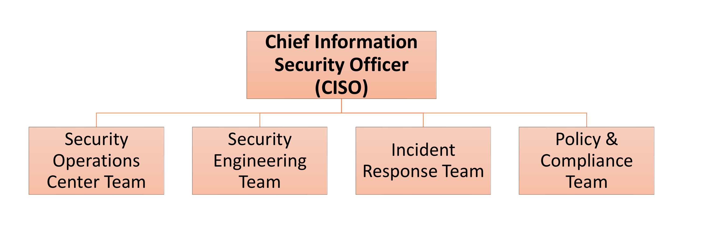

**CISO 之下的四个团队**（这是一个**可数的四项清单**，非常适合出题）：

```
              Chief Information Security Officer (CISO)
        ┌──────────────┬──────────────┬──────────────┐
   Security       Security       Incident        Policy &
  Operations     Engineering     Response       Compliance
  Center Team       Team           Team            Team
```

| 团队                                        | 中文       | 干什么（小白版）               | 对应的"防—测—复"        |
| ----------------------------------------- | -------- | ---------------------- | ----------------- |
| **Security Operations Center (SOC) Team** | 安全运营中心团队 | 7×24 盯着屏幕看告警，发现异常      | **Detection 检测**  |
| **Security Engineering Team**             | 安全工程团队   | 建设与维护防护设施（防火墙、加密、身份系统） | **Prevention 预防** |
| **Incident Response Team**                | 事件响应团队   | 出事了冲上去止血、取证、恢复         | **Recovery 恢复**   |
| **Policy & Compliance Team**              | 政策与合规团队  | 写规矩、盯法规、准备审计           | **Governance 治理** |

slide 底部提问：*"How is your organization organized"*（你所在的组织是怎么组织的？）——课堂讨论引子。

**记忆口诀**：**「运营看、工程建、响应救、合规管」**（SOC–Engineering–IR–Policy\&Compliance）。

> **小白类比**：把安全部门想象成一家医院——  
> **Security Engineering** = 公共卫生科（打疫苗、建防护）；  
> **SOC** = 监护室的心电监护仪（一直盯着，异常就报警）；  
> **Incident Response** = 急诊科（出事了立刻抢救）；  
> **Policy & Compliance** = 医务科（定规程、应付卫健委检查）。

**考点**：若问 *"Describe the key functions under a CISO"*，四个团队都要说出来，并说明**它们覆盖了安全的完整生命周期**——工程建设（事前）、运营监控（事中检测）、事件响应（事后恢复）、政策合规（贯穿全程的治理）。只列名字不说职能划分逻辑 = 答不完整。

### 12.3 🟡 CISO Influence on Strategic Value

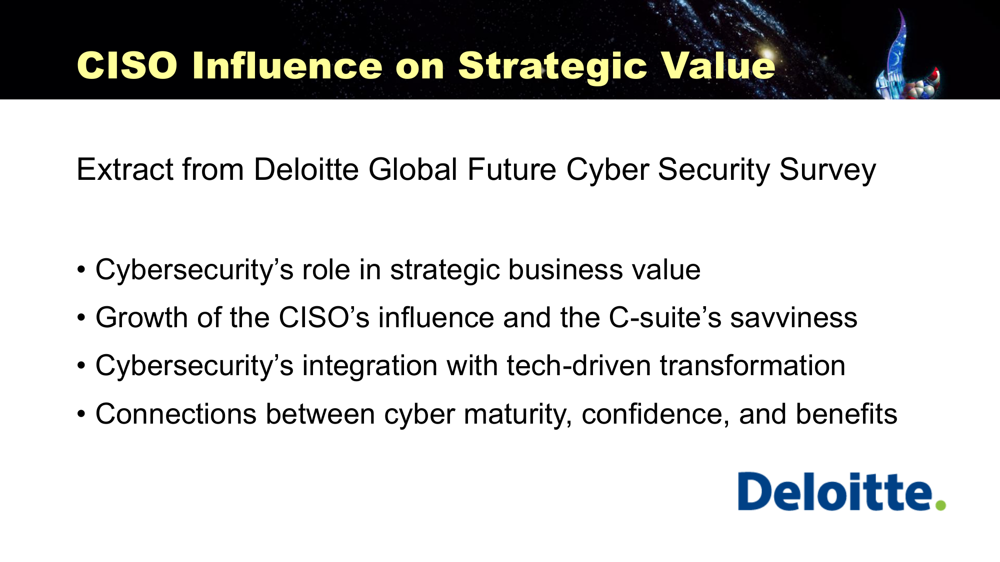

**Deloitte Global Future of Cyber Survey**（你们的 **pre-reading**！）的四个主题：

| # | 主题                                                               | 中文                    |
| - | ---------------------------------------------------------------- | --------------------- |
| 1 | **Cybersecurity's role in strategic business value**             | 网络安全在战略业务价值中的角色       |
| 2 | **Growth of the CISO's influence and the C-suite's savviness**   | CISO 影响力的增长与高管层的成熟度提升 |
| 3 | **Cybersecurity's integration with tech-driven transformation**  | 网络安全与技术驱动转型的融合        |
| 4 | **Connections between cyber maturity, confidence, and benefits** | 网络成熟度、信心与收益之间的关联      |

> 💡 **这一页直接指向你们的 pre-reading（Deloitte 4th Edition《The Promise of Cyber》）**。这四条就是该报告的四大发现，也是最可能出现在阅读相关考题里的四个角度。**考前值得回去翻一下这份 PDF 的执行摘要。**

> **一句话理解主线**：网络安全正在从"**成本中心 / IT 的一个部门**"转变为"**战略价值来源**"，CISO 也随之从技术主管变成商业决策的参与者——这与 §12.1 的 "Business leader + Security expert" 完全一致。

---

## 13. 🔴 Manage Cybersecurity：CIA Triad 与安全管理原则

### 13.1 🔴 CIA Triad（必考中的必考）

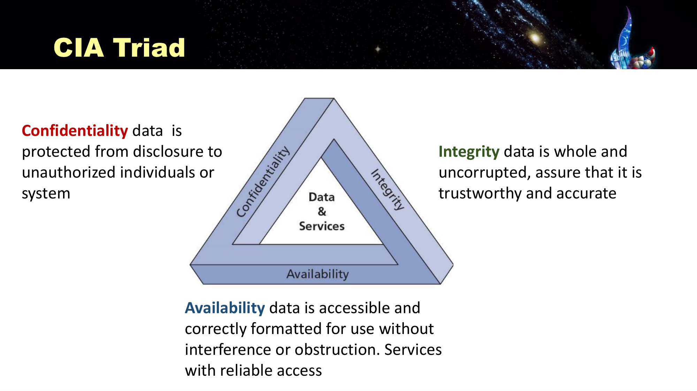

| 要素                           | 英文定义（原文，务必背这个措辞）                                                                                                          | 中文/小白解释                     | 被破坏时的典型场景                         |
| ---------------------------- | ------------------------------------------------------------------------------------------------------------------------- | --------------------------- | --------------------------------- |
| **Confidentiality**<br />机密性 | **data is protected from disclosure to unauthorized individuals or system**                                               | 数据不被未授权的人或系统看到              | 数据泄露、窃听、Cyberport 400GB 被公开出售     |
| **Integrity**<br />完整性       | **data is whole and uncorrupted, assure that it is trustworthy and accurate**                                             | 数据完整、未被篡改，可信且准确             | **网页篡改（defacement）**、数据被恶意修改、账目被改 |
| **Availability**<br />可用性    | **data is accessible and correctly formatted for use without interference or obstruction. Services with reliable access** | 数据可访问、格式正确可用，不受干扰或阻碍；服务可靠可达 | **DDoS 攻击**、勒索软件加密导致文件打不开、服务器宕机   |

> **小白类比**：把数据想成**一份合同**——  
> **Confidentiality** = 合同不能被外人看见（保密）；  
> **Integrity** = 合同上的数字不能被人偷偷改掉（真实）；  
> **Availability** = 你需要的时候能拿得到这份合同（可用）。  
> 三者缺一，这份合同就不可信了。

**🚩 踩坑提醒（MCQ #2 就是这个坑）**：

> *"There is a security incident that compromised one of the bank's web server. CISO believes the attackers **defaced** one or more pages on the website. What cybersecurity objective did the attacker violate?"*
>
> **Defacement（网页篡改）= 改动了内容 = 违反 Integrity（完整性）**，答案是 **C**。
>
> 常见错答：
>
> - 选 **Availability**——网站还在，只是内容变了，**没有不可访问**，不是可用性问题；
> - 选 **Confidentiality**——攻击者是"改"不是"看"，没有泄露；
> - 选 **Nonrepudiation（不可否认性）**——这是**干扰项**，它不属于 CIA 三要素（虽然它是一个真实的安全概念）。
>
> **判别口诀**：**看了 → C（机密性）；改了 → I（完整性）；打不开了 → A（可用性）。**

**🔗 交叉引用**：§6.2 中 **Hacktivist 的手法就是 website defacement**——这三道 MCQ 其实在考同一张知识网的不同结点。

### 13.2 🔴 信息安全管理的四条基本原则（p.53）

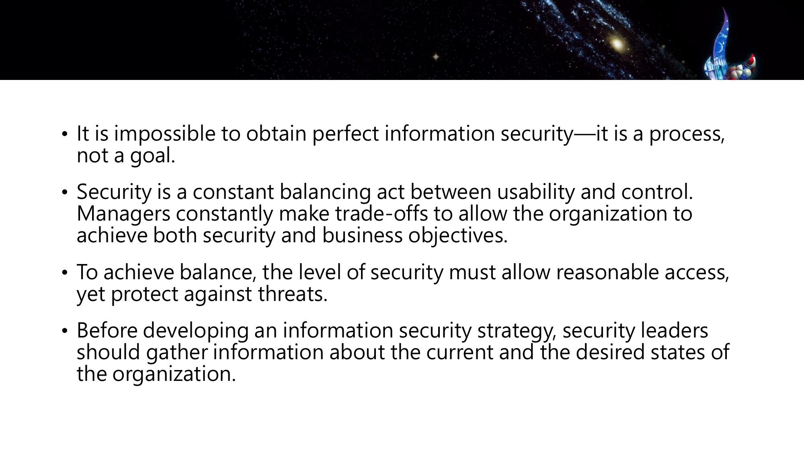

> ⚠️ 这一页没有图，纯文字，很容易被跳过——但它是**管理卷（Exam-Management, 15%）最典型的简答题素材**。

| # | 原则（英文原文）                                                                                                                                                                                | 中文/理解                                             |
| - | --------------------------------------------------------------------------------------------------------------------------------------------------------------------------------------- | ------------------------------------------------- |
| 1 | **It is impossible to obtain perfect information security — it is a process, not a goal.**                                                                                              | **完美的信息安全不可能达到——它是一个过程，不是一个目标。** 没有"做完了"这一天       |
| 2 | **Security is a constant balancing act between usability and control.** Managers constantly make trade-offs to allow the organization to achieve both security and business objectives. | 安全是**易用性与控制之间持续的平衡**。管理者必须不断权衡，让组织同时达成安全与业务目标     |
| 3 | To achieve balance, **the level of security must allow reasonable access, yet protect against threats.**                                                                                | 要取得平衡，安全水平必须**既允许合理访问、又能抵御威胁**                    |
| 4 | Before developing an information security strategy, security leaders should **gather information about the current and the desired states** of the organization.                        | 制定信息安全战略前，安全领导者应先**了解组织的现状与目标状态**（现状 → 目标 = 差距分析） |

> **小白类比**：安全就像**给房子上锁**。锁得越多越安全，但你自己进门也越麻烦。**一把锁 = 不安全；二十把锁 = 你自己进不去，快递也送不进来，生意做不成。** 管理者的工作不是"锁到最紧"，而是找到那个刚刚好的点——而且这个点会随着环境变化不断移动，所以它是 **process, not a goal**。

**考点**：这四条是**回答任何"为什么不能做到 100% 安全"「安全与业务如何平衡」类问题的标准框架**。

> **英文模范答句**：  
> *"Perfect information security is unattainable; it is a process rather than a goal. Security management is therefore a constant balancing act between usability and control, in which managers make trade-offs so that the organisation can meet both its security and its business objectives. The right level of security is the one that still permits reasonable access while protecting against threats — and identifying that level begins with understanding the organisation's current state and its desired state."*

### 13.3 🟡 三个引导性问题（p.54）

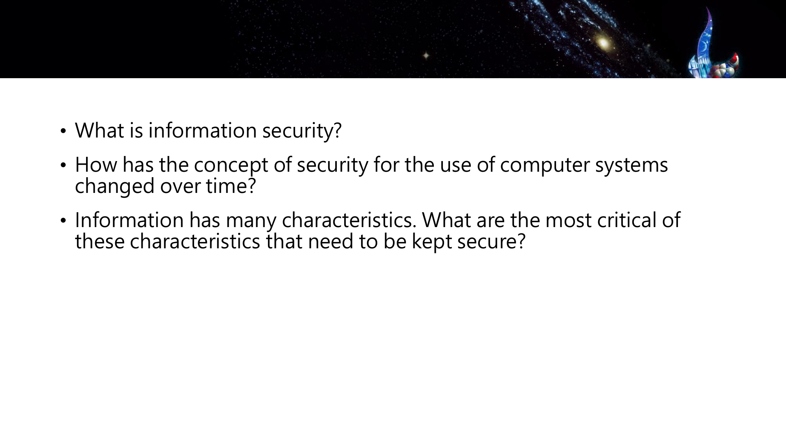

课堂讨论/复习用的三个问题——**这三个问题的形式本身就很像简答题**：

1. **What is information security?**（什么是信息安全？）  
   → 答题框架用 §3 的神庙图：CIA 地基 + 三支柱 + Policy + Governance
2. **How has the concept of security for the use of computer systems changed over time?**（计算机系统安全的概念如何随时间演变？）  
   → 答题框架用 §13.4 的技术演进表
3. **Information has many characteristics. What are the most critical of these characteristics that need to be kept secure?**（信息有很多特性，其中最关键、最需要被保护的是哪些？）  
   → 答案就是 **CIA**：Confidentiality、Integrity、Availability

### 13.4 🟡 Exercise: Evolution of Technology（技术演进练习）

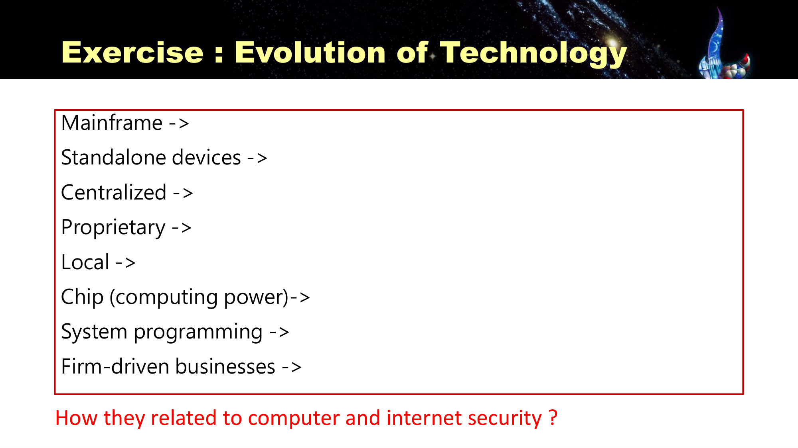

讲师给了八组"从 → 到"的演进（slide 上只写了左半边，箭头右侧留空让你思考），并问：**"How they related to computer and internet security?"**

| 从（过去）                              | → 到（现在，推演）        | 安全含义                                          |
| ---------------------------------- | ----------------- | --------------------------------------------- |
| **Mainframe** 大型主机                 | → 分布式 / 云         | 单点防守 → 无边界防守                                  |
| **Standalone devices** 独立设备        | → 联网设备 / IoT      | 物理隔离失效，攻击面爆炸（呼应 §8.1 Hyperconnectivity）       |
| **Centralized** 集中式                | → 去中心化 / 分布式      | 无法靠"守住机房"来保证安全                                |
| **Proprietary** 专有系统               | → 开源 / 标准化        | 漏洞公开可查，攻防双方信息对称                               |
| **Local** 本地                       | → 远程 / 云          | 远程访问成为主要入口（→ 这就是 Cyberport 案里 **MFA 缺失**为何致命） |
| **Chip (computing power)** 芯片算力    | → 海量算力 / GPU / AI | 暴力破解与 AI 攻击变得可行（呼应 §8.1 AI Acceleration）      |
| **System programming** 系统编程        | → 应用/低代码/AI 生成代码  | 开发门槛降低 → 代码安全质量参差                             |
| **Firm-driven businesses** 企业驱动的商业 | → 平台/生态驱动         | 风险跨组织传导（呼应 §5.3 供应链攻击）                        |

> **考点**：这道练习是 §13.3 第 2 问的答案来源。核心论点是一句话：**技术演进的每一步都在"扩大攻击面、模糊边界、降低攻击门槛"——所以安全的概念必须从"守住一台机器"演变为"管理一个不断变化的生态中的风险"。**

---

## 14. 🟢 Further Readings（延伸阅读）

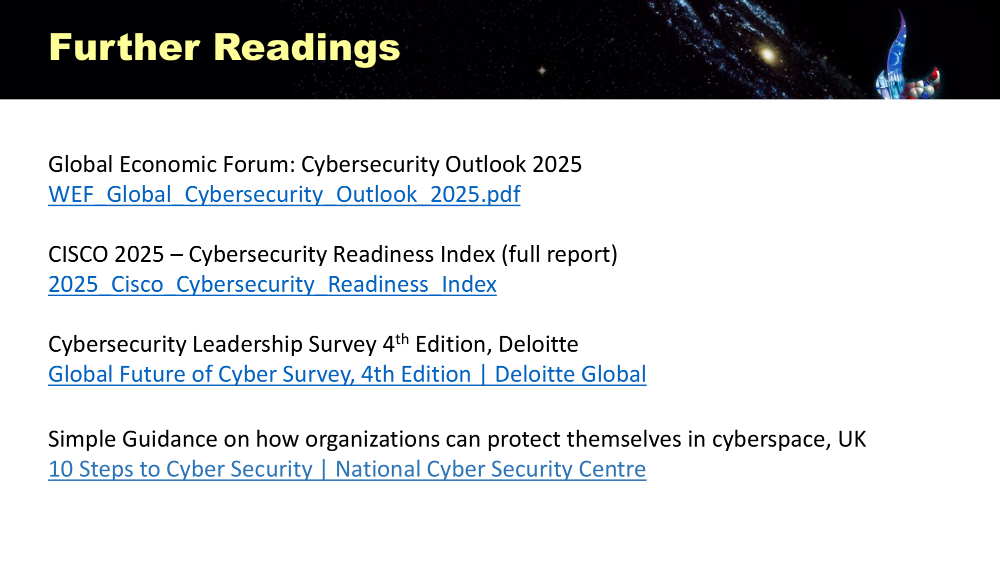

| 报告                                                                              | 出处                                       | 本课引用处                                             |
| ------------------------------------------------------------------------------- | ---------------------------------------- | ------------------------------------------------- |
| **Global Cybersecurity Outlook 2025**                                           | World Economic Forum (WEF)               | §8 复杂性轮盘图、Cyber Inequality Gap                    |
| **2025 Cisco Cybersecurity Readiness Index**                                    | CISCO                                    | §9.1 三个数字、§9.2 五个就绪维度                             |
| **Global Future of Cyber Survey, 4th Edition**（Cybersecurity Leadership Survey） | Deloitte                                 | §6.3 威胁分布、§12.3 CISO 影响力 —— **这是你们的 pre-reading** |
| **10 Steps to Cyber Security**                                                  | UK National Cyber Security Centre (NCSC) | 组织自我保护的简明指引                                       |

> 💡 **Deloitte 那份是 pre-reading，最值得优先看**——本课有两页 slide 直接取自它（§6.3 威胁分布图、§12.3 四大主题），说明讲师认为它重要。

---

## 15. 🔴 缩写速查表

| 缩写                        | 全称                                                                               | 领域/地区                    | 本笔记出处       |
| ------------------------- | -------------------------------------------------------------------------------- | ------------------------ | ----------- |
| **CIA**                   | **Confidentiality, Integrity, Availability**                                     | 信息安全核心三要素                | §13.1       |
| **CISO**                  | **Chief Information Security Officer**                                           | 企业安全最高负责人                | §12         |
| **CIO**                   | Chief Information Officer                                                        | 企业 IT 最高负责人              | §12.1       |
| **CEO / CRO / COO / CAO** | Chief Executive / Risk / Operating / Audit Officer                               | CISO 可能的其他汇报对象           | §12.1       |
| **SOC**                   | **Security Operations Center**                                                   | 安全运营中心（检测）               | §12.2       |
| **IR**                    | Incident Response                                                                | 事件响应                     | §12.2       |
| **APT**                   | **Advanced Persistent Threat**                                                   | 高级持续性威胁（国家级行为者手法）        | §6.2        |
| **DDoS / DoS**            | (Distributed) Denial of Service                                                  | 分布式拒绝服务攻击                | §4.1, §6.3  |
| **MFA**                   | **Multi-Factor Authentication**                                                  | 多因素认证（Cyberport 缺的就是它）   | §5.1        |
| **IDPS**                  | Intrusion Detection and Prevention System                                        | 入侵检测与防御系统                | §1（课程模块 3）  |
| **PKI**                   | Public Key Infrastructure                                                        | 公钥基础设施                   | §1（课程模块 5）  |
| **BIA**                   | Business Impact Analysis                                                         | 业务影响分析                   | §1（课程模块 7）  |
| **HKCERT**                | **Hong Kong Computer Emergency Response Team Coordination Centre**（香港網絡安全事故協調中心） | 香港                       | §4.1        |
| **CSTCB**                 | **Cyber Security and Technology Crime Bureau**（网络安全及科技罪案调查科）                     | 香港警务处                    | §7.1        |
| **PCPD**                  | **Privacy Commissioner for Personal Data**（个人资料私隐专员公署）                           | 香港                       | §5.1        |
| **HKMA**                  | **Hong Kong Monetary Authority**（香港金融管理局）                                        | 香港                       | §9.4        |
| **HKPC**                  | Hong Kong Productivity Council（香港生产力促进局）                                         | 香港                       | §11.1       |
| **MIIT**                  | Ministry of Industry and Information Technology（工业和信息化部）                         | 中国内地                     | §7.4        |
| **WEF**                   | World Economic Forum（世界经济论坛）                                                     | 国际                       | §8          |
| **NCSC**                  | National Cyber Security Centre                                                   | 英国                       | §14         |
| **ISACA**                 | Information Systems Audit and Control Association                                | 认证机构（CISM 发证方）           | §1          |
| **CISM**                  | Certified Information Security Manager                                           | 认证名称（讲师持有）               | §1          |
| **IoT / OT**              | Internet of Things / Operational Technology                                      | 物联网 / 运营技术               | §8.1, §10.1 |
| **IAM**                   | Identity and Access Management                                                   | 身份与访问管理                  | §11.2       |
| **UEBA**                  | User and Entity Behavior Analytics                                               | 用户与实体行为分析                | §5.5        |
| **DLT**                   | Distributed Ledger Technology                                                    | 分布式账本技术                  | §9.4        |
| **CTF**                   | Capture the Flag                                                                 | 夺旗赛（安全竞赛）                | §7.2        |
| **SME**                   | Small and Medium-sized Enterprise                                                | 中小企业                     | §11.1       |
| **FMO**                   | Facilities Management Office                                                     | 设施管理办公室（Cyberport 通知信提及） | §5.1        |

---

## 16. 🔴 课件原题（p.58–60）+ 答案与解析

> **这三道题是讲师自己放在课件末尾的，等于明示了出题风格。务必吃透。**

**Paul works for a cybersecurity company. His firm was hired to conduct a test against a health-care system, and Paul is working to gain access to the system belonging to a hospital in that system. What term best describes his work?**

- A. White Hat
- B. Gray Hat
- C. Green Hat
- D. Black Hat

> **答案：A**
>
> 关键词是 **"His firm was hired"** —— **有授权**。白帽的三条特征（Ethical / Follows the law / Improves security）全部满足。这是典型的**渗透测试（penetration testing）**。不是 Gray Hat：灰帽的特征是未经授权闯入但不牟利，这里有明确授权。不是 Black Hat：黑帽是恶意、违法、为个人利益。**C. Green Hat 是干扰项**——本课框架里只有 Black / Gray / White 三种。

**There is a security incident that compromised one of the bank's web server. CISO believes the attackers defaced one or more pages on the website. What cybersecurity objective did the attacker violate?**

- A. Confidentiality
- B. Nonrepudiation
- C. Integrity
- D. Availability

> **答案：C**
>
> **Defacement = 篡改网页内容 = 数据不再 "whole and uncorrupted" = 违反完整性。** 不是 Availability：网站仍然可以访问，只是内容被改了。不是 Confidentiality：攻击者是"改"而非"看"，没有向未授权方泄露。**B. Nonrepudiation（不可否认性）是干扰项**——它是一个真实的安全概念，但不属于 CIA 三要素。

**MCQ #3（选 2 项）：Edward Snowden was a government contractor who disclosed sensitive government documents to journalists to uncover what he believed were unethical activities. Which 2 of the following terms best describe him? A. Insider B. State actor C. Hacktivist D. APT E. Criminal Syndicate**

> **答案：A. Insider + C. Hacktivist**。**A. Insider（内部威胁）**：他是政府合同工，本身就拥有合法访问权限——完全符合 Insider Threat 的定义。**C. Hacktivist（黑客行动主义者）**：他的动机是 "to uncover what he believed were unethical activities"——出于理念/道德立场而非金钱，且手法是 data leak，正是 Hacktivist 的典型动机与手法。排除项：**B. State actor** 他不是代表国家去攻击别国，方向相反；**D. APT** 是一种攻击手法，不是一类"人"；**E. Criminal Syndicate** 动机必须是 illegal financial gain，而 Snowden 不为钱。这道题说明一个人可以同时属于多个类别——分类维度（§6.1）里 Internal/External 和 Motivation 是两条独立的轴，Insider 讲的是"他在哪"，Hacktivist 讲的是"他为什么"。

---

## 17. 模拟自测题（自查用，非押题）

> 按笔记顺序排列。先合上笔记答，再回来对。

**A 组：定义与清单（考记忆）**

**1. 画出 Components of Information Security 的四层结构，并说明每层内容与它们之间的支撑/治理关系。**

> 从下往上四层：**地基**——Confidentiality / Integrity / Availability（CIA 三要素）；**三根柱子**——Computer Security、Data Security、Network Security；**横梁**——Policy；**屋顶**——Management of Information Security / Information Security Governance。关系是**自下而上支撑、自上而下治理**：CIA 支撑三根柱子，柱子经 Policy 汇聚到屋顶的管理层；反过来，管理层通过 Policy 向下约束三个技术领域——管理层不是被支撑的附属品，而是决定其余一切的那一层。

**2. 默写 6 types of threat actors，并为每一类写出 Motivation 与 Tactics。**

> ① **Script Kiddie**：Motivation = thrill/recognition/mischief；Tactics = 用现成工具，无深度技术知识，NO target。② **Hacktivist**：Motivation = 不满公司政策/政治理念；Tactics = website defacement、DDoS、data leaks。③ **Criminal Syndicates**：Motivation = illegal financial gain；Tactics = ransomware、phishing、信用卡诈骗，且 want low attention。④ **Nation-State Actors**：Motivation = espionage、政治扰乱、军事优势；Tactics = APT、zero-day attacks。⑤ **Insider Threat**：Motivation = revenge、financial gain 或 negligence；Tactics = 偷数据、破坏、未授权访问。⑥ **Cyber Terrorists**：Motivation = fear、disruption、destruction；Tactics = infrastructure attacks、虚假信息、心理战。

**3. 写出 Black Hat / Gray Hat / White Hat 各自的三条特征（伦理 / 法律 / 目的）。**

> **Black Hat**：Malicious（恶意）/ Breaks the law（违法）/ For personal gain（为个人利益）。**Gray Hat**：Ethically ambiguous（伦理模糊）/ May break the law（可能违法）/ Without exploiting vulnerabilities（不利用漏洞牟利）。**White Hat**：Ethical（合乎伦理）/ Follows the law（守法）/ Improves security（改善安全）。三者最核心的分野在于**有没有授权**，而不是"有没有造成损失"。

**4. CIA Triad 三个要素的英文定义分别是什么？各举一个被破坏的实际场景。**

> **Confidentiality**：data is protected from disclosure to unauthorized individuals or system——例：Cyberport 400GB 数据被公开出售。**Integrity**：data is whole and uncorrupted, assure that it is trustworthy and accurate——例：网页篡改（defacement）。**Availability**：data is accessible and correctly formatted for use without interference or obstruction——例：DDoS 攻击导致网银无法登录。判别口诀：**看了 → C；改了 → I；打不开了 → A。**

**5. CISO 之下的四个 Key Functions 是哪四个？各自负责什么？**

> **Security Operations Center (SOC) Team**——7×24 监控告警，对应 Detection；**Security Engineering Team**——建设维护防护设施，对应 Prevention；**Incident Response Team**——出事了止血、取证、恢复，对应 Recovery；**Policy & Compliance Team**——写规矩、盯法规、准备审计，对应 Governance。四个团队合起来覆盖了安全的完整生命周期：事前建设、事中监控、事后恢复，加上贯穿全程的治理。

**6. 政府角色的三段式框架是哪三个词？**

> **Prevention + Detection + Recovery**（预防 + 检测 + 恢复）。这是理解 CSTCB 等政府机构所有具体动作的分类器——例如 Cybersecurity Awareness Program 属于 Prevention，警方捣破犯罪集团属于 Detection，电脑法证检验属于 Recovery。

**B 组：辨析与陷阱（考理解）**

**7. 一名员工把含客户资料的表格误发给外部收件人。这属于六类威胁行为者中的哪一类？为什么？**

> **Insider Threat（内部威胁）**。关键词是 Insider Threat 的动机不仅包含 revenge、financial gain，也包含 **negligence（疏忽）**——这名员工没有恶意，纯属失误，但他本来就拥有合法访问权限，依然算 Insider。这也呼应了 §6.3 Deloitte 数据里"Unintended actions of well-meaning employees"从 4% 涨到 13% 这一大幅上升的类别。

**8. 某黑客未经允许扫描一家公司的服务器，发现漏洞后没有利用它，而是直接邮件通知了该公司。他是哪种帽子？他违法了吗？**

> **Gray Hat（灰帽）**。他的行为符合灰帽的三条特征：Ethically ambiguous（有人认为善意，有人认为越界）、May break the law（未经授权扫描本身就可能违反计算机相关法律，即便没有恶意）、Without exploiting vulnerabilities（发现漏洞后没有利用它牟利）。所以**他确实可能违法**（未经授权访问本身就是问题），但他没有像黑帽那样利用漏洞牟利——这正是灰帽和黑帽的核心区别。

**9. 一家银行遭 DDoS 攻击导致网银两小时无法登录，但没有任何数据泄露或被改。违反了 CIA 的哪一项？**

> **Availability（可用性）**。DDoS 的效果是让服务"打不开"，没有涉及"看了"（Confidentiality）或"改了"（Integrity），完全对应判别口诀里的第三种情况。

**10. CIO 和 CISO 的区别是什么？为什么有些机构让 CISO 不向 CIO 汇报？**

> **CIO**（Chief Information Officer）管**整个 IT**，让系统跑起来；**CISO**（Chief Information Security Officer）管**信息安全**，让系统安全地跑。有些机构（尤其银行等强监管机构）让 CISO 不向 CIO 汇报，是因为**如果 CISO 向 CIO 汇报，而 CIO 的 KPI 是"按时上线新系统"，"为了安全推迟上线"这种建议就等于在跟自己老板的 KPI 作对**——绕开 CIO、直接向 CEO 或 CRO 汇报，能保持安全议题在管理层的独立性和话语权。

**11. Deloitte 的威胁分布图中，为什么说「威胁重心正在从外部转向内部与第三方」？用至少三组数字支持你的论点。**

> 三组关键数字（3rd Edition → 4th Edition）：**Unintended actions of well-meaning employees** 从 4% 升至 13%（三倍多）；**Trusted third parties** 从 6% 升至 13%（一倍多）；**Malicious employees** 从 6% 升至 11%。与此同时，传统外部行为者（Cybersecurity criminals 32→24、Cybersecurity terrorists 22→18、Hacktivists 12→7、Nation-states 7→6）**全部下降**。一升一降，说明防御重心必须从边界防护转向身份、内部行为与第三方风险管理。

**C 组：分析与论述（考应用）**

**12. PCPD 认定 Cyberport 有五项缺失。请把这五项分别归入「技术控制」与「管理控制」，并说明如果只修复技术控制、不修复管理控制，为什么类似事件仍会重演。**

> **技术控制缺失**：① Lack of effective detection measures（未能发现暴力破解）；② Failure to enable MFA。**管理控制缺失**：③ Insufficient security audits；④ Lack of specificity in the information security policy；⑤ Unnecessary retention of personal data。如果只补技术控制（比如装了检测系统、开了 MFA），但审计仍然不足，组织依然发现不了下一次出现的新风险；政策依然不具体，员工依然没有可执行的框架去正确使用这些技术控制；数据保留政策依然没有落实，业务上不该留的敏感数据还是会继续堆积，一旦技术防线被绕过，暴露面依然巨大。技术控制堵住的是"已知的具体漏洞"，管理控制解决的是"能不能持续发现新问题、员工知不知道怎么做、以及从源头减少暴露面"——少了后者，类似事件换个技术环节还会重演。

**13. Arup 深度伪造案中，没有任何系统被入侵。请解释为什么传统的技术防护（防火墙、加密、访问控制）无法阻止这类攻击，以及组织应该怎么应对。**

> 防火墙、加密、访问控制保护的是"系统和数据"本身，但 Arup 案攻击的是**人的判断**——deepfake 伪造出可信的人脸和声音，让员工在自己被授权的权限范围内"合法地"执行了转账操作，系统层面完全没有异常记录可查，因为压根没有人越权访问任何东西。应对方式：把"看到人/听到声音就信"的验证方式，改成**独立的带外验证（out-of-band verification）**流程；对涉及资金/权限变更的高风险请求，强制**双重独立审批**；并针对 deepfake 场景做专项的员工意识培训与模拟演练。

**14. 用「Prevention + Detection + Recovery」框架，把香港政府在本课中提到的所有具体举措归类。**

> **Prevention（预防）**：Digital Policy Office 的 Technical Forum、Cybersecurity Awareness Program、Attack & Defend Drill 2024、Capture the Flag Challenge 2025、Scameter+ 一站式防骗工具。**Detection（检测）**：警方捣破钓鱼犯罪集团（HK$16.8m 案）、CSTCB 每日处理约 96,000 条威胁情报、Scameter+ 的 Website Detection 实时比对诈骗数据库。**Recovery（恢复）**：电脑法证检验、与本地及海外执法机构的跨境协作、HKCERT 的事故协调。

**15. 为什么说「完美的信息安全不可能达到——它是一个过程，不是一个目标」？结合 usability vs control 的平衡，用一个具体例子说明。**

> 因为安全水平和易用性天然存在权衡：例如公司要求每次系统访问都做多重生物识别、每 5 分钟重新验证一次，安全性极高但员工几乎无法正常工作，业务陷入停摆；反过来完全不设防则员工方便但风险极高。管理者必须找到"**既允许合理访问、又能抵御威胁**"的那个平衡点，而这个点会随着威胁环境（新型攻击手法出现）和业务需求（新的合作、新的远程办公场景）不断移动——所以安全不是一次性能"做完"的目标，而是需要持续重新评估现状与目标状态、不断调整的过程。

**16. 有人说：「我们公司很小，黑客不会盯上我们。」请用本课的至少三处证据反驳。**

> ① **Script Kiddie 的特征是 NO target**——他们靠自动化工具扫描全网找弱的目标下手，根本不看公司规模，公司小反而更容易被扫到。② **Cyber Inequality Gap 正在扩大**（Large vs Small Organization）——大企业越来越安全，小企业反而越来越危险，"小"从来不是安全的理由，反而是弱点。③ **供应链攻击**：攻击者可以把小公司当跳板去打它服务的大客户（"小偷不撬你家的门，而是去偷你家清洁工的钥匙"），小公司本身就是别人的攻击入口。④ **HKPC 数据**：只有 26% 的中小企有专职网络安全岗位，远低于大型企业的 59%——防御能力薄弱恰恰让小公司成为"更好打的目标"，而不是"不会被盯上"。

---

## 18. 额外补充重点（你的重点清单之外，但我认为可能考）

> 这几条不在你列的重点里，但从课件的**篇幅、结构形状和讲师背景**判断，我认为值得补上。你可以自行决定要不要花时间。

| # | 补充内容                                                                                                  | 为什么我认为它可能考                                                                                                                         |
| - | ----------------------------------------------------------------------------------------------------- | ---------------------------------------------------------------------------------------------------------------------------------- |
| 1 | **§13.2 安全管理的四条基本原则**（p.53，"process not a goal"、usability vs control 平衡）                              | 这一页**没有任何图，纯文字**，很容易被跳过。但考试**专门有一份 Exam-Management (15%)**，而这一页是整份课件里**最"管理学"、最像论述题题干**的内容。讲师是风险管理出身，这正是他的本行。                      |
| 2 | **§6.1 Classification of Adversaries 的 4 个维度**（Internal/External、Sophistication、Resources、Motivation） | 你的重点列了"6 types"，但**这 4 个维度是 6 类的上位框架**。MCQ #3（Snowden 同时是 Insider 和 Hacktivist）之所以成立，正是因为这两个答案来自**不同的分类维度**。不懂 4 维度，就答不好这类"选两项"的题。 |
| 3 | **§5.1 PCPD 的五项缺失**（检测缺、MFA 无、审计少、政策虚、数据留）                                                            | 你列了"lots of case studies"，我把 Cyberport 单独提到 🔴。理由：讲师给了它**3 页 slide**（全课单一案例最多），而且第 3 页是**一个有编号的五项官方认定清单**——这是最标准的考题形状。             |
| 4 | **§9.2 Cisco 五个就绪维度** + **§5.5 Ensign 五大趋势**                                                          | 两个"五项清单"。凡是**可数的编号列表**都是天然的考点（无论是填空还是简答）。花五分钟背口诀的性价比很高。                                                                            |
| 5 | **§13.4 技术演进练习**（Mainframe → …）                                                                       | 这是课件的**倒数第二页正文**，且是**唯一一页明确标注 "Exercise" 的**。讲师留了空白让学生推演——留空的练习题最容易原样搬进考卷。而且它正好是 §13.3 第 2 问的答案。                                   |
| 6 | **§12.1 CISO 汇报线的"其他选项"**（CEO / CRO / COO / CAO）                                                      | 这行字是 slide 底部的**灰色小字**，极易漏读。但对一位金融风险管理出身的讲师来说，"CISO 该向谁汇报才能保持独立性"是个非常本行的问题。                                                        |

---

*笔记基于 `Computer and Internet Security Management Lesson 1.pdf`（共 60 页）整理，已覆盖全部 60 页内容。图片路径相对于本文件所在目录。*
