---
title:
  en: "Lesson 3 · Security Technology & Protection Tools"
  zh: "第 3 课 · 安全技术与防护工具"
week: 3
date: 2026-09-07
---
# ISOM 5280 Computer and Internet Security Management — Lesson 3 复习笔记
**主题：Security Technology & Protection Tools（安全技术与防护工具）— 访问控制 · 防火墙与网络架构 · VPN · IDPS · 端点防护 · SIEM · 下一代防御（NGFW / SOC / XDR / SOAR）· 蜜罐 · 安全控制策略**

> 优先级标注说明（按考试重要性）：
> 🔴 **必考核心** — 概念名称、定义、结构必须能背出来
> 🟡 **需要理解** — 需要懂逻辑关系，能举例说明
> 🟢 **了解即可** — 背景知识，考试大概率不会细抠
>
> **本笔记优先级的判定依据**（你没有指定教授强调了什么，所以我按以下信号推断，你可以随时修正）：
> ① **课件自带的 3 道 MCQ（p.63–65）** 分别考 **MFA 因素**、**防火墙控制选择**、**True/False Positive**——说明考试有选择题，且这三个点必考；
> ② **课件正文里的 Quick Recap（p.22）** 考 **Stateful inspection**；
> ③ **课件明确写出的"讨论题"**（p.20 Stateless vs Stateful 表格、p.30 Case Study、p.59 Honeypot "Any Potential Issues?"）——教授留白让学生填的地方，通常就是他要考的地方；
> ④ **篇幅**：防火墙用了 p.11–30 共 20 页，IDPS 用了 p.31–39 共 9 页，是本课两大重点块；
> ⑤ Lec 1 的经验：本课考试拆成 **Technical (20%) + Management (15%)**，所以每个概念都要准备**技术定义 + 管理含义**两层。
>
> 参考教材：**Principles of Information Security, 7th ed. (Whitman & Mattord)，Chapter 8 & 9**（课件 p.2 明确标注；p.37 检测方法那页更是直接标了 pp. 350–352）

---

## 0. 核心地图（先建立整体框架）

> 你说"这周知识点好散、都是概念、串不起来"——**这是对的判断，但不是你的问题。** 这节课确实是一整章的"工具目录"。
> 解决办法不是硬背 20 个名词，而是**先装 3 根轴**，再把每个名词挂上去。下面是本笔记最重要的一节。

### 0.1 主线：一次攻击从外到内，每一层由谁负责

课件的页顺序**本身就是一条防御纵深的推进路线**：

```
                    ┌─────────────────────────────────────────────┐
   攻击者/用户 →    │ ① 你是谁？有没有权限？                        │  Access Control
                    │    认证(MFA) + 授权(Authorization) + ZTA      │  p.4–10
                    └──────────────────┬──────────────────────────┘
                                       ↓
                    ┌─────────────────────────────────────────────┐
                    │ ② 你的流量能不能过？                          │  Firewall
                    │    包过滤 → 状态检测 → 应用层代理 → NGFW       │  p.11–22
                    │    架构：Screened Host / Screened Subnet(DMZ) │  p.23–26
                    └──────────────────┬──────────────────────────┘
                                       ↓
                    ┌─────────────────────────────────────────────┐
                    │ ③ 远程办公的人怎么安全接进来？                 │  VPN
                    │    Tunnel Mode / Transport Mode (IPSec)      │  p.27–29
                    └──────────────────┬──────────────────────────┘
                                       ↓  （挡不住的进来了）
                    ┌─────────────────────────────────────────────┐
                    │ ④ 进来之后谁在盯着？                          │  IDPS  p.31–39
                    │    网络侧 NIDS ／ 端点侧 HIDS、EDR            │  EDR   p.41–43
                    └──────────────────┬──────────────────────────┘
                                       ↓  （每个工具只看到一小块）
                    ┌─────────────────────────────────────────────┐
                    │ ⑤ 分散的线索谁来拼成完整攻击链？               │  SIEM  p.44–45
                    │    汇总全公司日志 + 关联分析                   │  XDR   p.51–52
                    └──────────────────┬──────────────────────────┘
                                       ↓  （告警太多人看不过来）
                    ┌─────────────────────────────────────────────┐
                    │ ⑥ 谁来运营？怎么自动处置？                     │  SOC   p.50
                    │    SOC 团队 + SOAR 剧本 + A.I. 分诊           │  SOAR  p.53–55
                    └──────────────────┬──────────────────────────┘
                                       ↓  （额外的主动手段）
                    ┌─────────────────────────────────────────────┐
                    │ ⑦ 主动欺骗、引开、收集情报                     │  HoneyPot p.57–59
                    └──────────────────┬──────────────────────────┘
                                       ↓
        统领一切的设计哲学：Defense-in-Depth ／ Zero Trust ／ Least Privilege ／ Fail-Safe Defaults  (p.47, p.48, p.60)
```

### 0.2 ⭐ 三根轴：所有工具都能在这张坐标里定位

**这是本笔记的核心。任何一个名词，你都能问它三个问题，答完它就不散了。**

#### 轴一｜**看得多深**（OSI 层次越来越深）

```
L2 Data Link  →  MAC layer firewall
L3 Network    →  Packet-Filtering Firewall（只看 IP）
L3–L4         →  Stateful Inspection Firewall / SPI（看 IP + 端口 + 连接状态）
L7 Application→  Application Layer Proxy Firewall、DPI、SPA
```
**规律：越往上层，看得越细、越安全，但也越慢、越贵、越可能拖垮业务。** 这条规律解释了本课至少 8 个知识点的优缺点。

#### 轴二｜**做什么事**（S = P + D + R，Lec 1 学过的公式）

| | 含义 | 本课的工具 |
|---|---|---|
| **P** Prevention 预防 | 不让坏事发生 | Access Control、Firewall、VPN、ZTA |
| **D** Detection 检测 | 发生了要能发现 | **IDS**、HIDS/NIDS、EDR、SIEM、XDR、HoneyPot |
| **R** Response 响应 | 发现后要能处置 | **IPS**、EDR、**SOAR**、SOC 团队 |

**规律：P 一定会失败，所以必须有 D；D 产生的告警必须有 R 才有意义。** 整节课就是沿着 P→D→R 走了一遍。

#### 轴三｜**站在哪个位置**（视野从单点扩大到组织）

```
单个设备         →  多设备关联        →  自动化         →  组织
Firewall/IDPS/EDR   SIEM / XDR         SOAR + A.I.      SOC 团队 + 流程
（技术）                                                （管理，ISOM 的落点）
```
**规律：这门课是 ISOM（管理），所以最后一定会走到"人和流程"。** 考 Management 卷时，答案往往在轴三的右端。

#### 一句话把三根轴合起来

> **本课 = 沿着「从浅到深看流量（轴一）」构建「预防→检测→响应（轴二）」的能力，并把这些能力「从单点整合到组织（轴三）」。**

### 0.3 记住这条链，简答题就有框架了

被问到任何"为什么需要 XX 工具"，标准答题模板是：

> "前一层的 ___ 有 ___ 这个固有局限（说轴一或轴二的短板），因此需要 ___ 来补足，代价是 ___（性能/成本/复杂度），这体现了 defense-in-depth 的思想。"

---

## 1. 🟢 本课定位（Course Overview, p.2–3）

课件 p.3 列出的本课七个模块，就是这份笔记的目录：

1. Authentication Method (Access Control)
2. Firewalls
3. Intrusion Detection and Protection System ("IDPS")
4. Endpoint Detection & Response
5. Security Information and Event Management ("SIEM")
6. Next-Gen Defense & Protection Tools: **Next Generation Firewall, XDR & Security Operation Centre ("SOC")**
7. HoneyPot

> 💡 注意 p.3 和 p.40 是**同一张目录页出现了两次**——p.40 是"我们讲完前半段了，进入后半段"的分隔。这说明教授把本课明确切成**前半（Access Control + Firewall + VPN + IDPS）**和**后半（EDR + SIEM + 下一代工具 + HoneyPot）**两块。

---

# 第一部分：Access Control（访问控制）

## 2. 🟡 Does Authentication Work?（认证真的有用吗，p.5）

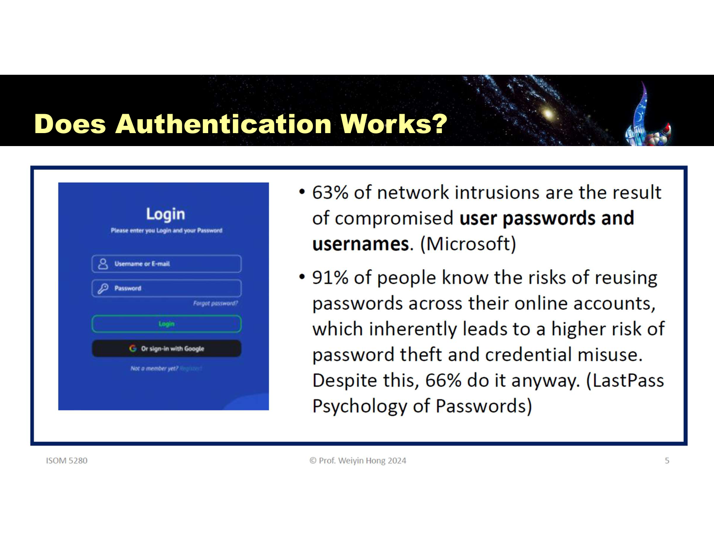

课件用两个数据说明**"光有密码根本不够"**：

| 数据 | 英文原文 | 含义 |
|---|---|---|
| **63%** | 63% of network intrusions are the result of compromised **user passwords and usernames** (Microsoft) | 六成以上的网络入侵，根源是**账号密码被盗**，不是什么高深漏洞 |
| **91% vs 66%** | 91% of people **know** the risks of reusing passwords... Despite this, **66% do it anyway** (LastPass Psychology of Passwords) | **知道 ≠ 会做。** 91% 的人知道重复用密码有风险，66% 照做不误 |

> **考点（Management 味很浓）**：这两个数字合起来说明的是——**安全最薄弱的一环是人，而且"教育/意识培训"的效果有限**。所以对策不能只靠"提醒用户"，必须靠**技术强制**（下面的 guardrail 和 MFA）。
>
> 这也是后面 Endpoint Security 那页"**the weakest link is usually endpoints**"和 ZTA"**never trust**"的思想源头。

---

## 3. 🟡 Guardrail to avoid weak passwords（弱密码护栏，p.6）

课件引用的是 **NIST 的密码指引**（用了 SHALL/should 这种规范语言）。

**要求一：验证方必须把用户想设的密码，比对一张"已知不能用"的清单**

| 禁止类型 | 英文原文 | 例子 |
|---|---|---|
| 已泄露密码 | Passwords obtained from **previous breach database** | 出现在历史泄露库里的密码 |
| 字典词 | "**Dictionary**" words | `password`、`dragon` |
| 重复或连续字符 | **Repetitive or sequential** characters | `aaaaa`、`1234abcd` |
| 场景相关词 | **Context-specific** words, such as the **name of the service**, the **username** | 在 HKUST 系统里设 `hkust2026`、或密码=用户名 |

**要求二：速率限制**
> "Verifier should implement a **rate limiting** mechanism to effectively limit the number of **failed authentication attempts**"

即**限制失败尝试次数**——直接对抗暴力破解（brute force）和撞库。

> **踩坑提醒**：注意这一页**没有**要求"必须包含大小写+数字+特殊符号+每 90 天换一次"。现代 NIST 指引恰恰**放弃**了强制复杂度和定期改密（因为会逼用户写便利贴、用 `Passw0rd!1` → `Passw0rd!2`）。**转而强调"黑名单比对 + 速率限制"。** 如果考题给你"每 90 天强制改密"作为正确做法的选项，那是个陷阱。

---

## 4. 🔴 Multi-Factor Authentication (MFA)（多因素认证，p.7）

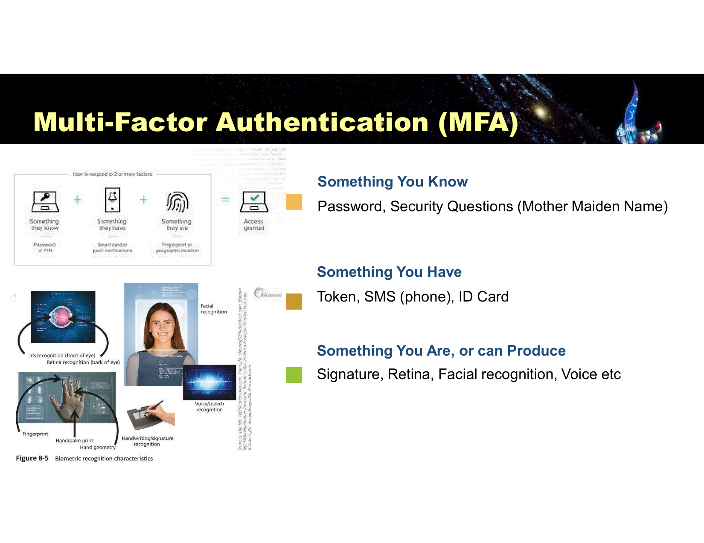

**定义：要求用户提供 2 个或以上、来自不同类别的凭证才能通过认证。**

| 因素类别 | 英文（考试原文） | 课件给的例子 |
|---|---|---|
| **你知道的** | **Something You Know** | Password、Security Questions（Mother Maiden Name 母亲婚前姓） |
| **你拥有的** | **Something You Have** | Token、SMS (phone)、ID Card |
| **你是谁 / 你能产生的** | **Something You Are, or can Produce** | Signature、Retina、Facial recognition、Voice 等 |

课件配图（Figure 8-5 Biometric recognition characteristics）列出的生物特征：
**Iris recognition（虹膜，眼球正面）／ Retina recognition（视网膜，眼球背面）／ Fingerprint 指纹 ／ Hand/palm print 掌纹 ／ Hand geometry 手形 ／ Facial recognition 人脸 ／ Voice/speech 声纹 ／ Handwriting/signature 笔迹**

> ⚠️ **最关键的一条规则：必须来自不同类别才算"多因素"。**
> **密码 + 安全问题 = 两个都是"你知道的" → 这是 2 步验证，不是真正的 MFA。**
> 密码 + 短信验证码 = know + have → ✅ 真 MFA。

**记忆口诀：知（Know）· 有（Have）· 是（Are）——脑子里的、口袋里的、身上长的。**

**考点**：课件 **Multiple Choice #1 (p.63)** 直接考这个：
> "requires users to enter a **passcode**（→ 你知道的）and then verifies that their **face** matches a photo（→ 你是谁）"
> **答案：D. Something you know and something you are** ✅

> **踩坑提醒**：选项 A 和 B 是**同一个答案换了顺序**（know+have / have+know）——出题人故意用它们制造"看起来有两个对的"的干扰。看到这种结构，说明**正确答案一定不是这两个**，直接排除，在 C 和 D 之间选。

---

## 5. 🔴 Access Control — Authorization（授权，p.8）

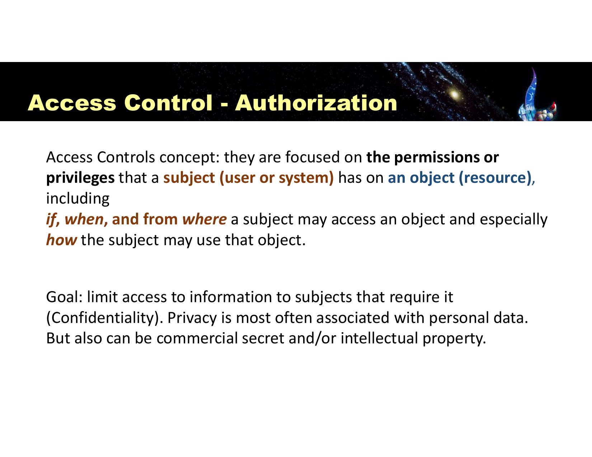

**课件原文定义（很可能原句考）：**
> "Access Controls concept: they are focused on **the permissions or privileges** that a **subject (user or system)** has on **an object (resource)**, including **if, when, and from where** a subject may access an object and especially **how** the subject may use that object."

拆解成**两个角色 + 四个维度**：

| 要素 | 英文 | 说明 |
|---|---|---|
| **主体** | **Subject** (user **or system**) | 发起访问的一方。⚠️ 注意**不只是人**，程序/系统也是 subject |
| **客体** | **Object** (resource) | 被访问的资源：文件、数据库、服务器 |
| **if** | 能不能访问 | 有没有这个权限 |
| **when** | 什么时候能访问 | 只在工作时间？ |
| **from where** | 从哪里能访问 | 只在办公室内网？（← ZTA 里的 geolocation 就来自这里） |
| **how** ⭐ | 能怎么用 | 课件用了 **especially** 强调：只读？可改？可删？可转发？ |

**目标（Goal）：**
> "limit access to information to subjects that **require** it (**Confidentiality**). **Privacy** is most often associated with **personal data**. But also can be **commercial secret** and/or **intellectual property**."

三层含义：
1. **只给"需要的人"** → 这就是 **Least Privilege / Need-to-know** 的定义（呼应 p.60 总结页）
2. **对应 CIA 里的 C（Confidentiality）** ← Lec 1 学过，这里是它的落地手段
3. **要保护的不只是个人隐私**，还包括**商业机密和知识产权**

> **考点**：若问 "What is access control concerned with?"，完整答案必须包含 **subject / object / permissions** 三个词，以及 **if, when, from where, how** 这四个维度。只答"控制谁能访问什么"只能拿一半分——**漏掉 how（用的方式）是最常见的失分点**，而课件恰恰用 *especially* 强调了它。

> **踩坑提醒：Authentication ≠ Authorization。**
> **Authentication（认证）= 你是谁？**（验明身份，p.5–7 讲的 MFA）
> **Authorization（授权）= 你能做什么？**（验明权限，p.8 讲的）
> 两个都在 Access Control 大标题下，但是**先后两个不同的步骤**。考试很爱在这里挖坑。

---

## 6. 🔴 Access Control Approaches（访问控制方法，p.9）

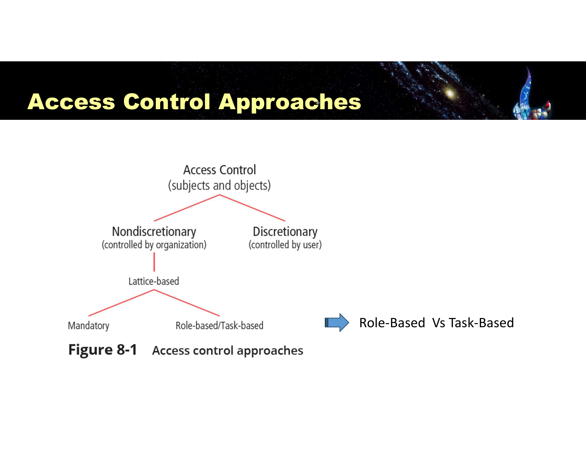

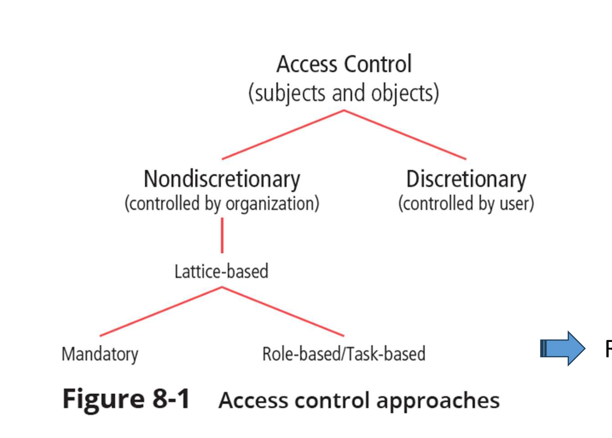

> ⚠️ **这一页几乎全部内容在图里，纯文字讲义会完全丢失。必须记住这棵树的层级关系。**

**Figure 8-1 的树状结构（注意嵌套层次，不要拍平成并列）：**

```
                    Access Control
                  (subjects and objects)
                    ／           ＼
    Nondiscretionary              Discretionary
  (controlled by organization)   (controlled by user)
           │
      Lattice-based
        ／      ＼
  Mandatory   Role-based / Task-based
```

| 类型 | 英文 | 谁说了算 | 说明 |
|---|---|---|---|
| **自主访问控制** | **Discretionary** (DAC)<br>*controlled by **user*** | **用户自己** | 资源的**拥有者自行决定**给谁权限。例：你在自己的 Google Drive 文件上点"共享给某某"。灵活，但**容易失控**（权限乱给、无法统一管理） |
| **非自主访问控制** | **Nondiscretionary**<br>*controlled by **organization*** | **组织** | 由组织统一制定规则，用户无权自行授予 |
| └ **格状访问控制** | **Lattice-based** | 组织 | 按"安全等级 × 类别"构成的格子来判定。是下面两种的**上位概念** |
| &nbsp;&nbsp;&nbsp;├ **强制访问控制** | **Mandatory** (MAC) | 系统强制 | 给主体和客体都打**密级标签**（如：绝密／机密／秘密／公开），系统按标签强制裁决，**任何人不能override**。典型场景：军方、政府 |
| &nbsp;&nbsp;&nbsp;└ **基于角色/任务** | **Role-based (RBAC) / Task-based** | 组织 | 按**角色**或**任务**授权（见下） |

**课件右侧特别用箭头标出的对比：Role-Based Vs Task-Based** ⭐ ——教授单独拉出来，说明这是考点：

| | **Role-Based (RBAC)** | **Task-Based (TBAC)** |
|---|---|---|
| 依据 | 你在组织里的**角色/职位** | 你当前正在执行的**任务/职责** |
| 粒度 | 较粗，相对**静态** | 较细，**动态**（任务结束权限即收回） |
| 例子 | "会计"这个角色 → 能看财务系统 | "本月负责年终审计"这个任务 → 临时能看某几个账套 |
| 优点 | 好管理，人员换岗只需换角色 | 更贴合最小权限，权限不会长期堆积 |

> **小白类比**：
> **DAC** = 你家的房子，**你自己决定**给谁配钥匙。
> **MAC** = 军事基地，你的**通行证等级**写死了你能进哪几个门，警卫也无权通融。
> **RBAC** = 医院，**穿白大褂的医生**能进手术室，不看你叫什么名字，只看你是什么角色。
> **TBAC** = 今天**排你的班做这台手术**，你才进得去这间手术室，做完就刷不开了。

> **记忆锚点**：**D**iscretionary = **D**ecided by user（用户决定）；**N**ondiscretionary = **N**ot up to you（轮不到你决定）。**Mandatory 是"强制"，所以在 Nondiscretionary 之下，绝不可能在 Discretionary 那边。**

> **踩坑提醒**：树的**层级不能拍平**。常见错误是把 Mandatory / RBAC / DAC 说成"三种并列的访问控制"——实际上 **Mandatory 和 RBAC 都在 Nondiscretionary → Lattice-based 之下**，和 Discretionary 不是同一层。这种"层级题"很适合出图形填空。

---

## 7. 🔴 Zero Trust Architecture (ZTA) in Access Control（零信任，p.10）

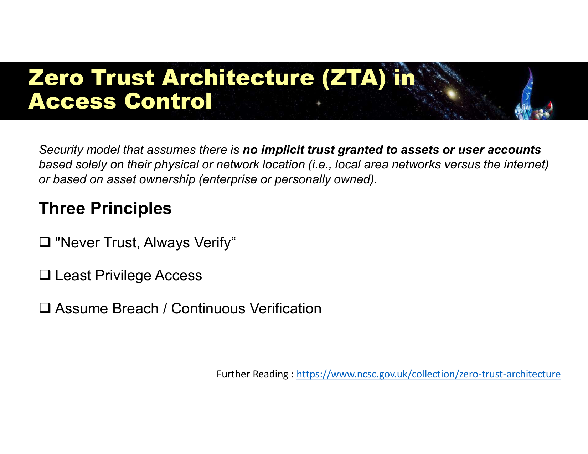

**课件原文定义（斜体，很可能原句考）：**
> "Security model that assumes there is **no implicit trust granted to assets or user accounts** based **solely on their physical or network location** (i.e., local area networks versus the internet) **or based on asset ownership** (enterprise or personally owned)."

**这段话在否定两件传统安全的默认假设：**

| 传统假设 | ZTA 的态度 |
|---|---|
| "你在内网 → 你是自己人" | ❌ 不认。位置不代表可信 |
| "这是公司发的电脑 → 可以信" | ❌ 不认。设备归属不代表可信 |

> **这是对"城堡+护城河（perimeter defense）"模型的彻底否定。** 传统模型的致命伤：一旦有人突破边界，内部就毫无防备（正是后面 Screened Host 架构的弱点）。

### 🔴 Three Principles（三大原则，必背）

| # | 英文原文 | 中文 | 含义 |
|---|---|---|---|
| 1 | **"Never Trust, Always Verify"** | 永不信任，始终验证 | 每一次访问都要重新验证，不因为"刚才验过了"就放行 |
| 2 | **Least Privilege Access** | 最小权限访问 | 只给完成任务所必需的最小权限（← 呼应 p.60 总结页的 IAM-Least Privilege） |
| 3 | **Assume Breach / Continuous Verification** | 假定已被攻陷 / 持续验证 | **假设攻击者已经在里面了**，因此要持续监控和验证，而不是一次性放行 |

> **考点**：第 3 条 **"Assume Breach"** 是最容易漏背、也最能体现 ZTA 精神的一条。它的逻辑是：**如果你假设自己已经被攻陷，你的设计就会完全不同**——你会做微分段、会持续验证、会重视检测（D）而不是只堆预防（P）。这句话同时解释了本课后半段（IDPS/SIEM/SOC）存在的必要性。

**延伸阅读（课件给的链接）**：NCSC (UK) Zero Trust Architecture、NIST SP 800-207

> 💡 **结构提示**：ZTA 在本课出现了**两次**——p.10（作为 Access Control 的一部分，讲三原则）和 p.48（作为整体架构哲学，讲 4 个 Right）。**两页要连起来看**，见第 18 节。

---

# 第二部分：Firewalls（防火墙）

## 8. 🔴 Firewall 定义（p.12）

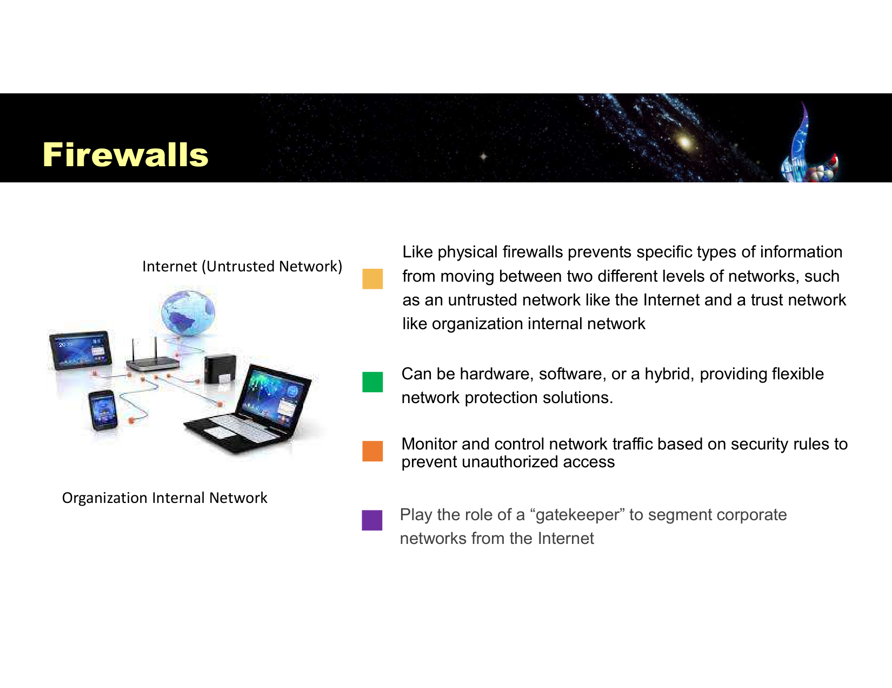

课件用四个 bullet 给出定义，每条都是考点：

| # | 英文原文 | 中文要点 |
|---|---|---|
| ① | "Like physical firewalls **prevents specific types of information from moving between two different levels of networks**, such as an **untrusted** network like the Internet and a **trust** network like organization internal network" | 防火墙的本质是**在两个信任级别不同的网络之间**做阻隔。⚠️ 关键词是 **"two different levels of networks"** |
| ② | "Can be **hardware, software, or a hybrid**, providing flexible network protection solutions." | **可以是硬件、软件或混合**——课件自己明确说了：防火墙是**功能概念，不是产品形态** |
| ③ | "**Monitor and control** network traffic **based on security rules** to prevent unauthorized access" | 依据**安全规则**监控和控制流量 |
| ④ | "Play the role of a **'gatekeeper'** to **segment** corporate networks from the Internet" | 扮演**"守门人"**角色，**分隔（segment）**企业网与互联网 |

> ⭐ **bullet ② 非常重要，请标记。** 它是本课"概念 vs 产品"这个大主题的官方背书：**同一个安全功能，可以由专用硬件盒子、纯软件、虚拟机或云服务来实现。** 详见第 26 节的混淆专区。

> **英文模范答句**：
> *"A firewall is a gatekeeper that monitors and controls traffic moving between two networks of different trust levels — typically an untrusted external network and a trusted internal one — permitting or denying it according to a defined set of security rules. It may be implemented in hardware, software, or a hybrid of both."*

---

## 9. 🔴 Network vs Host-Based Firewall（p.13）

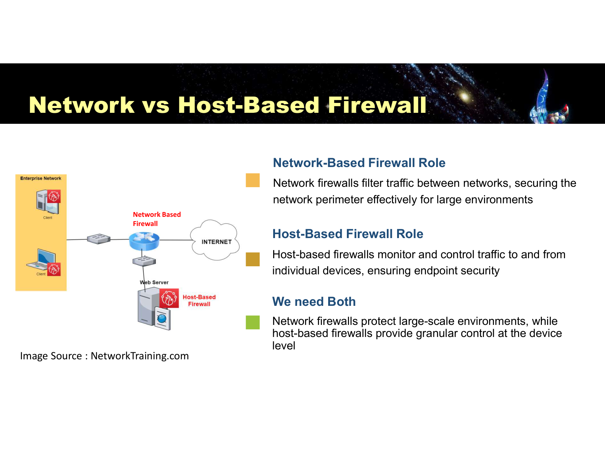

| | **Network-Based Firewall** | **Host-Based Firewall** |
|---|---|---|
| **位置** | 网络边界（图中在内网与 Internet 之间） | **装在单台设备上**（图中装在 Web Server 里） |
| **课件原文** | "filter traffic **between networks**, securing the **network perimeter** effectively for **large environments**" | "monitor and control traffic **to and from individual devices**, ensuring **endpoint security**" |
| **保护范围** | 一整片网络 | 就这一台机器 |
| **粒度** | 粗（按 IP/端口） | **细（granular control at the device level）** |
| **典型实现** | 边界设备 / NGFW | 操作系统自带（Windows Defender Firewall、iptables） |

**第三条 bullet 是结论：We need Both**
> "Network firewalls protect **large-scale environments**, while host-based firewalls provide **granular control at the device level**"

> **考点**：问"为什么两种都要？"，答案要落在**两个不同的失效场景**上：
> ① 网络防火墙**管不了内网机器之间的互相攻击**（横向移动 lateral movement 全在它眼皮底下但它看不见，因为流量根本没经过边界）；
> ② 主机防火墙保护不了**没装它的设备**，且**规模化管理困难**。
> 两者组合 = **defense-in-depth**。
>
> **注意这个"Network vs Host"的二分法，后面 IDPS 会一模一样地再出现一次（NIDS vs HIDS）——这是本课重复使用的一个结构，很适合出对照题。**

---

## 10. 🟡 Packet Filtering Firewall（包过滤防火墙，p.15–16）

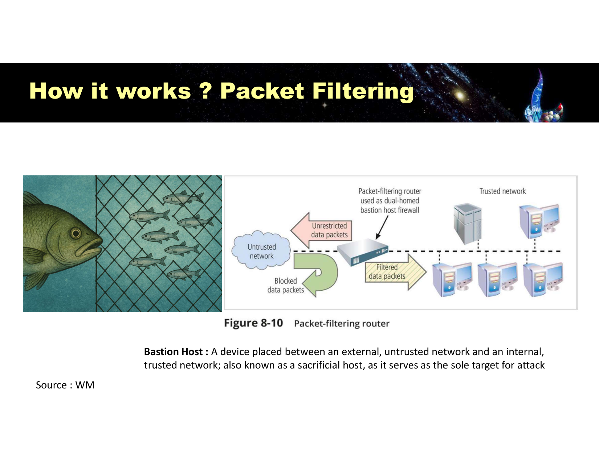

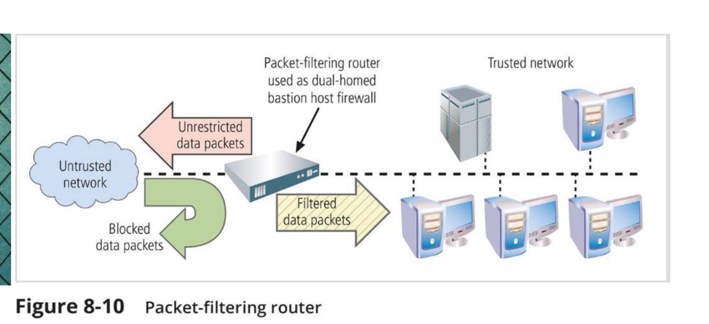

**课件定义（p.15）：**
> "Packet-filtering firewalls examine the **header information** of data packets."

**判断依据（Most often based on the combination of the following）：**
1. **IP source and destination address**（源/目的 IP 地址）
2. **Direction (inbound or outbound)**（方向：入站/出站）
3. **TCP source and destination port requests**（TCP 源/目的端口）

**工作层次：**
> "Installed on a **TCP/IP-based network** typically functions at the **IP layer** and determines whether to **deny (drop)** a packet or **allow (forward)** it to the next network connection, based on the rules programmed"

⚠️ 注意两组术语的对应：**deny = drop（丢弃）／ allow = forward（转发）**，工作在 **IP layer（网络层 L3）**。

**配图（Figure 8-10）读法**（箭头方向很重要）：
```
Untrusted network ──→ [Packet-filtering router] ──→ Trusted network
                            ↓                          ↑
                   Blocked data packets          Filtered data packets
                     （被挡掉，弹回去）            （筛过的，放进来）
              ← Unrestricted data packets（内网出去的，不受限制）
```
> 图中左侧那条粉色 "Unrestricted data packets" 箭头是**从内往外**的——说明这个例子里**出站不受限、入站要过滤**。这是最常见的默认策略。

**课件在这一页顺带给出了一个必背定义：**

> 🔴 **Bastion Host（堡垒主机）**：
> "A device placed **between an external, untrusted network and an internal, trusted network**; also known as a **sacrificial host（牺牲主机）**, as it serves as the **sole target for attack（唯一的攻击目标）**"

> **小白类比**：**Bastion host 就是城墙上最突出的那座箭楼**——故意造在最前面吸引火力，让敌人打它而不是打城里。所以它必须**被加固到极致**，同时**假设它迟早会失守**（呼应 ZTA 的 Assume Breach）。

---

## 11. 🔴 Stateless / Static Packet Filtering（无状态·静态包过滤，p.17）

**课件原文（逐条都要会）：**

| 原文 | 解读 |
|---|---|
| "**Most basic form** of firewall protection" | 最基础的防火墙形式 |
| "**Rule-Based Filtering**: Decisions are made based on **static rules** (Accept/Reject) on the packets' **header information** such as source/destination IP, port numbers, and protocol types" | 依据**静态规则**逐包判断 Accept/Reject，只看包头三要素：**IP、端口、协议类型** |
| "Has **no way of knowing** if any given packet is **part of an existing connection**, is trying to **establish a new connection** or is just a **rogue packet**" ⭐ | **核心短板**：分不清一个包是①已有连接的一部分 ②想新建连接 ③还是一个野生乱入包 |
| "**Fast**, but **vulnerable to spoofing** and certain types of attacks" | 快，但**易被 IP 欺骗（spoofing）** |

> 🔑 **"Stateless（无状态）"到底是什么意思？**
> **每个包都被独立对待，包与包之间没有任何记忆。** 防火墙看完这个包就忘了，下一个包重新从零判断。

**为什么"无记忆"就危险？—— 这是理解 Stateful 的关键铺垫：**

你用浏览器访问一个网站，网站的**回包**要能进来。但你无法预测客户端会用哪个随机高位端口（51234？62890？），所以静态规则只能写成：

```
ALLOW  in: any → 内网, dst port 1024-65535     ← 见 p.18 规则表第 1 条！
```

**这等于把内网所有高位端口对全世界永久敞开。** 而且规则是静态的、24 小时生效的，攻击者只要**伪造源 IP 和端口**，随时可以往里塞包 —— 这就是 "vulnerable to spoofing" 的具体含义。

---

## 12. 🔴 Static Packet Filtering Rules 实例（p.18）

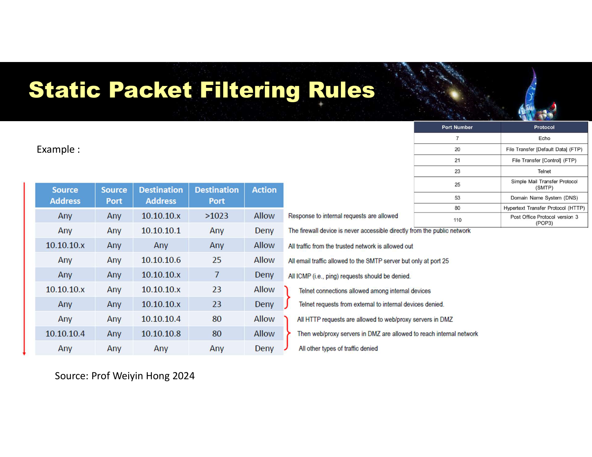

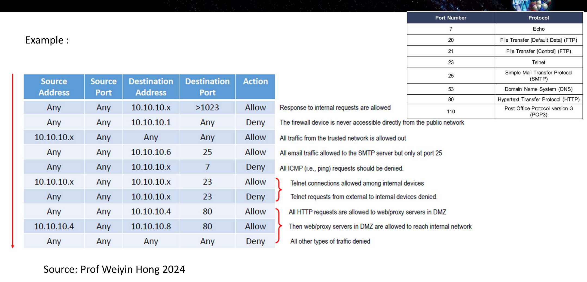

> ⚠️ **这一页是纯图片表格，文字层几乎提取不出来。而"给你一张规则表让你解释某一条"是这类课程非常典型的技术题型，必须逐条看懂。**

**⭐ 首先记住一条铁律：规则表是自上而下逐条匹配的（图左侧那个红色向下箭头就是这个意思），一旦匹配就执行该条动作，不再往下看。所以规则的顺序本身就是逻辑。**

| # | Source Addr | Src Port | Dest Addr | Dest Port | Action | 课件注释 | 为什么这样写 |
|---|---|---|---|---|---|---|---|
| 1 | Any | Any | 10.10.10.x | **>1023** | **Allow** | Response to internal requests are allowed | **允许回包进来**。因为客户端用的是 >1023 的随机高位端口。⚠️ **这条就是 Stateless 的软肋**——为了收回包，被迫永久开放整个高位端口段 |
| 2 | Any | Any | **10.10.10.1** | Any | **Deny** | The firewall device is never accessible directly from the public network | **保护防火墙自己**。10.10.10.1 是防火墙本身，外部绝不能直接访问它 |
| 3 | **10.10.10.x** | Any | Any | Any | **Allow** | All traffic from the trusted network is allowed out | **内网出站全放行**（这是很宽松的策略） |
| 4 | Any | Any | 10.10.10.6 | **25** | **Allow** | All email traffic allowed to the SMTP server but only at port 25 | 只让外部访问**邮件服务器的 25 端口（SMTP）**，其他端口不行 |
| 5 | Any | Any | 10.10.10.x | **7** | **Deny** | All ICMP (i.e., ping) requests should be denied | **禁 ping**（端口 7 = Echo）。防止攻击者扫描探测内网存活主机 |
| 6 | **10.10.10.x** | Any | 10.10.10.x | **23** | **Allow** | Telnet connections allowed **among internal devices** | 内网之间可以用 Telnet |
| 7 | Any | Any | 10.10.10.x | **23** | **Deny** | Telnet requests **from external** to internal devices denied | 外部来的 Telnet 一律拒绝 |
| 8 | Any | Any | **10.10.10.4** | **80** | **Allow** | All HTTP requests are allowed to **web/proxy servers in DMZ** | 外部可访问 DMZ 里的 Web/代理服务器（80 = HTTP） |
| 9 | **10.10.10.4** | Any | **10.10.10.8** | **80** | **Allow** | Then web/proxy servers in DMZ are allowed to **reach internal network** | DMZ 的代理服务器可以再访问内网。⚠️ 注意这是**两跳**：外→DMZ→内，外部**永远碰不到 10.10.10.8** |
| 10 | Any | Any | Any | Any | **Deny** | All other types of traffic denied | 🔴 **兜底规则（Default Deny）** |

### ⭐ 三个必须看懂的设计模式

**① 第 6、7 条成对出现（课件用红色大括号框住）—— 顺序决定一切**
两条都是关于 23 端口（Telnet），但**先写"内网之间允许"，再写"任何来源都拒绝"**。因为自上而下匹配，内网的包会先命中第 6 条被放行，外部的包匹配不到第 6 条（源地址不是 10.10.10.x），落到第 7 条被拒。
> 🔴 **如果把这两条顺序调换，内网之间的 Telnet 也会被拒掉。** 这是最经典的防火墙规则考题。

**② 第 8、9 条成对出现 —— 这是 DMZ 的规则级体现**
外部只能到 **10.10.10.4（DMZ 的代理服务器）**，然后由代理服务器再去访问 **10.10.10.8（内网）**。**外部与内网之间没有任何一条直连规则。** 这就是 p.26 Screened Subnet / DMZ 架构在规则表上的样子。

**③ 第 10 条：Default Deny（默认拒绝）**
> 🔴 **最后一条 `Any Any Any Any Deny` 是整张表最重要的一条。**
> 它意味着**凡是前面没有明确允许的，一律拒绝**。这就是 p.60 总结页的 **"Fail-Safe Defaults：Access is denied by default unless explicitly permitted"**。
>
> **反面做法**是最后一条写 Allow（默认放行，只拉黑名单）——那样你必须能想到所有坏东西，而这是不可能的。**永远用白名单思路。**

### 端口速查（课件右上角小表，值得背）

| Port | Protocol | Port | Protocol |
|---|---|---|---|
| **7** | Echo（ping） | **53** | Domain Name System (**DNS**) |
| **20** | File Transfer [Default Data] (**FTP**) | **80** | Hypertext Transfer Protocol (**HTTP**) |
| **21** | File Transfer [Control] (**FTP**) | **110** | Post Office Protocol v3 (**POP3**) |
| **23** | **Telnet** | | |
| **25** | Simple Mail Transfer Protocol (**SMTP**) | | |

> **记忆锚点**：**20/21 = FTP（一个传数据一个传命令）｜23 = Telnet｜25 = 发邮件 SMTP｜110 = 收邮件 POP3｜53 = DNS｜80 = HTTP｜7 = ping**。
> 规则表题几乎一定会用到这张表——**看到 Dest Port 25 就要立刻反应"这是邮件"**。

---

## 13. 🔴 Stateful Inspection Firewall（状态检测防火墙，p.19）

**课件原文：**

| 原文 | 解读 |
|---|---|
| "Keep track of **connection status** using a **state table** **and** a **firewall ruleset**" | 用**状态表**追踪连接状态，**并且**配合规则集。⚠️ **"and a firewall ruleset" 这半句最容易被忽略，却是理解全局的钥匙** |
| "**Accept traffic from the outside** that matches an **existing entry** in the **dynamic state table**" | **从外面进来的**流量，只要匹配状态表中已有条目就放行 |
| "**Query / Examine the packet content**" | 查看包的**内容**，不只是包头 |
| "**Far more secure** than static packet filtering firewall" | 比静态包过滤**安全得多** |
| "**Additional processing cost** in order to **maintain the state table**" | 代价：维护状态表的**额外处理开销** |

### ⭐ 最容易误解的地方：新连接还能不能建立？

**能。** 课件那句话有个被忽略的限定词：**"Accept traffic from the outside"** —— 这条规则**只管入方向**，不是说所有流量都必须匹配状态表。

**真正的判断逻辑是两步：**

```
包进来
  │
  ├─ 先查 state table：属于某条已记录的连接吗？
  │     └─ 是 → 直接放行（快，不必再过规则）
  │
  └─ 不属于任何已有连接（= 这是新连接请求）
        └─ 去查 firewall ruleset（黑白名单，和 stateless 一样）
              ├─ 规则允许 → 放行，并在 state table 里【新建一条记录】
              └─ 规则不允许 → 丢弃
```

> 🔑 **state table 不是白名单，它是"登记簿"。** 由防火墙**自己根据放行过的连接自动写入和删除**，不是管理员配置的。

### state table 里到底记了什么

你（192.168.1.10）访问 hkust.edu.hk:443，防火墙记下一行：

| Src IP | Src Port | Dst IP | Dst Port | Proto | State |
|---|---|---|---|---|---|
| 192.168.1.10 | 51234 | 143.89.x.x | 443 | TCP | ESTABLISHED |

这行的意思是：**"我记得，是我们内网的人主动去找它的，所以它待会儿回话是合法的。"**
连接关闭（FIN/RST）或超时后，这行就被**删除**。之后任何伪装成 143.89.x.x:443 的包都查不到记录 → 丢弃。

### 🔑 一句话讲清它比 Stateless 强在哪

> **Stateless 为了收回包，必须永久开放一大片高位端口（p.18 规则表第 1 条）；**
> **Stateful 只在你主动发起连接的那几秒内，为那一个 IP + 那一个端口，开一个针眼大的口子，连接一结束自动关闭。**
>
> 洞的性质从「**永久的、大面积的、静态的**」变成「**临时的、精确的、动态的**」。

**考点**：课件 **Quick Recap #1 (p.22)**：
> "_____ inspection firewalls keep track of each network connection between internal and external systems using a **state table**."
> A. Static　B. Dynamic　C. **Stateful** ✅　D. Stateless
>
> ⚠️ 选项 B "Dynamic" 是最强干扰项——因为课件里确实说了 "**dynamic** state table"。但**这个技术的名字叫 Stateful Inspection**，"dynamic" 只是修饰 state table 的形容词。**记住：题目问的是 firewall 的名字，不是 table 的形容词。**

---

## 14. 🔴 Stateless Vs Stateful Firewall（课件讨论题，p.20）

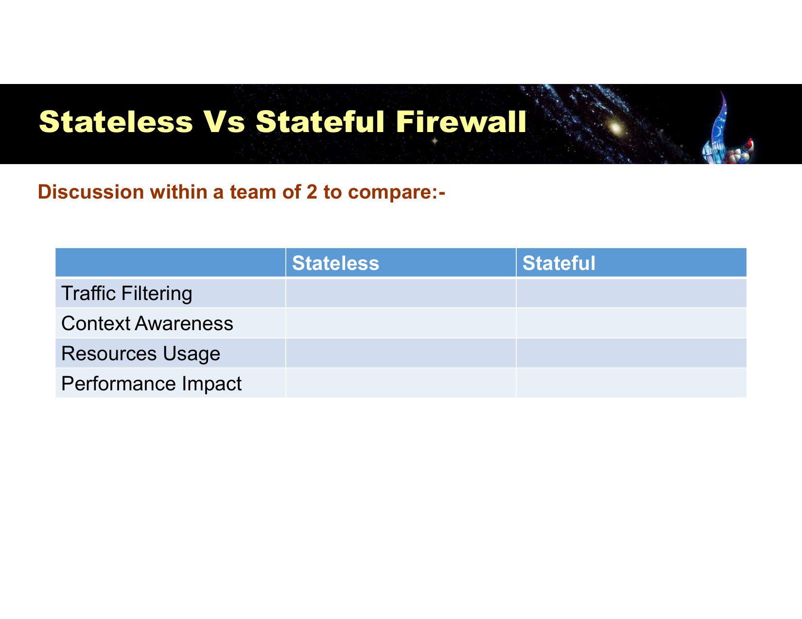

> ⚠️ **课件这一页是一张空白表格，写着 "Discussion within a team of 2 to compare"。教授留白让学生填的地方 = 高概率考点。下面是这张表的完整答案。**

| 维度 | **Stateless（静态包过滤）** | **Stateful（状态检测）** |
|---|---|---|
| **Traffic Filtering**<br>流量过滤 | **逐包独立过滤**，只看包头（IP / port / protocol），依据**静态规则** | 以**连接（session）为单位**过滤；看包头 **+ 包内容（examine packet content）**，并比对 **state table** |
| **Context Awareness**<br>上下文感知 | ❌ **无上下文**——不知道包属于哪条连接、是新建还是回包（课件原文：*has no way of knowing*） | ✅ **有上下文**——知道每条连接处于什么状态（新建/已建立/回应） |
| **Resources Usage**<br>资源占用 | **低**，无需存储任何连接信息 | **高**，需内存维护**动态 state table**；并发连接越多占用越大 |
| **Performance Impact**<br>性能影响 | **小**，吞吐快、延迟低（课件原文：*Fast*） | **较大**，每条连接都要查表/更新表；**高并发时可能成为瓶颈** |
| **安全性**（补充维度） | **弱**，易被 **spoofing** 欺骗 | **强得多**（*far more secure*），能挡掉不属于任何合法连接的包 |

> **英文模范答句**：
> *"A stateless firewall evaluates every packet in isolation against a static rule set, so it has no way of knowing whether a packet belongs to an existing connection, opens a new one, or is simply a rogue packet. A stateful firewall maintains a dynamic state table of active connections, so return traffic is admitted only when it matches an entry created by an outbound request. This gives far stronger security at the cost of the memory and processing required to maintain that table."*

> 💡 **额外一个高分点**：state table 会占内存，因此攻击者可以**大量发送半开连接把表撑爆** —— 这就是 **SYN flood**。也就是说，"additional processing cost" 不只是成本，**它本身就是一个攻击面**。能答出这一点，等于把技术卷和管理卷的思路都答到了。

---

## 15. 🔴 Application Layer Proxy Firewall（应用层代理防火墙，p.21）

**课件的四条 bullet 其实讲了三件事，分开理解才不乱：**

### bullet ①：定义 —— 既是防火墙又是代理服务器
> "A device capable of functioning **both as a firewall and an application layer proxy server**."

**它和前两种防火墙的本质区别：连接被切成两段。**

```
包过滤/状态检测（转发 forward）：
   你 ══════════ 一条 TCP 连接 ══════════> 服务器
                 ↑ 防火墙在旁边看一眼，放行
   你的包原封不动，真的到达了服务器

Proxy Firewall（代理 proxy）：
   你 ═══ TCP 连接 A ═══> [Proxy] ═══ TCP 连接 B ═══> 服务器
           （终止）                （以自己的身份全新发起）
```

> 🔑 **没有任何一个来自外部的数据包，真正进入过内网。一个都没有。**
> 你的包到 proxy 就终止了；proxy 读懂请求后，**用自己的 IP、自己的连接**重新问一遍，拿到结果再转交给你。

**这带来四层防护能力：**
1. **架构性隔离**：内外网在 IP 层根本不连通 → 畸形包、分片攻击、协议栈漏洞利用**打到 proxy 就停了**；proxy 发出去的是它自己构造的干净包
2. **天然 default-deny**：没有对应代理模块的协议**根本过不去**
3. **内容级过滤**：能封特定 URL、禁止下载 .exe、FTP 允许 GET 禁止 PUT、剥离邮件附件——**这些包过滤防火墙完全做不到**（它只看得到 IP:port）
4. **完整审计**：能记录"谁、何时、访问了哪个 URL、传了什么"

### bullet ② + ③：讲的是**部署位置**，为下一页铺垫
> "proxy servers are often placed in **unsecured areas** of the network (e.g., **DMZ**), they are exposed to **higher levels of risk**"
> "**Additional filtering routers** can be implemented **behind** the proxy firewall, further protecting internal systems."

逻辑链：**Proxy 要跟外部打交道 → 只能放 DMZ → 它自己直接暴露在攻击下（= bastion host / sacrificial host）→ 所以不能只靠它，后面还要再加一层 filtering router** → 这就是 **defense-in-depth**，也是下一页 Screened Host Architecture 的图。

### bullet ④：视角切换了（这是这页读起来跳脱的原因）
> "The IP address of a proxy server acts as an **intermediary**... websites see the **proxy's IP** instead of your **real IP**."

前三条在讲"**保护公司不被外面打**"，第四条突然在讲"**隐藏内部用户的身份**"。这其实是 proxy 的两种用法：

| | **Forward Proxy 正向代理** | **Reverse Proxy 反向代理** |
|---|---|---|
| 保护谁 | **内网用户（客户端）** | **服务器** |
| 效果 | 外部网站只看到 proxy IP，看不到用户真实 IP | 外部用户只看到 proxy，看不到真实服务器 |
| 对应 bullet | **④** | ②③ 的 DMZ 部署更接近这个 |

### 缺点（必考）

| 缺点 | 原因 |
|---|---|
| **慢** | 每个请求要拆包、解析 L7、重新建连接、再转发 |
| **每种协议要单独开发模块** | HTTP proxy 不会代理 FTP → **通用性差**，新协议要新模块 |
| **单点瓶颈 + 单点故障** | 所有流量必经它 |
| **本身是高危目标** | 直面 Internet → **bastion / sacrificial host** |

> **一句话总结**：**包过滤防火墙是"检查站"——包从旁边穿过去，它看一眼决定放不放；Proxy 防火墙是"中转站"——包到它这里就终止了，它读懂内容后自己重新发一份出去。内外网从不直接相连，这本身就是最强的隔离。**

> **踩坑提醒**：**"Application Layer Proxy Firewall" 的同义词是 Application-Level Gateway (ALG)**；当它部署在 DMZ 时，它同时**就是 bastion host**。这三个词指的可能是同一台机器的不同侧面，别当成三台设备。

---

## 16. 🔴 OSI Model —— 各类防火墙的工作层次（p.24）

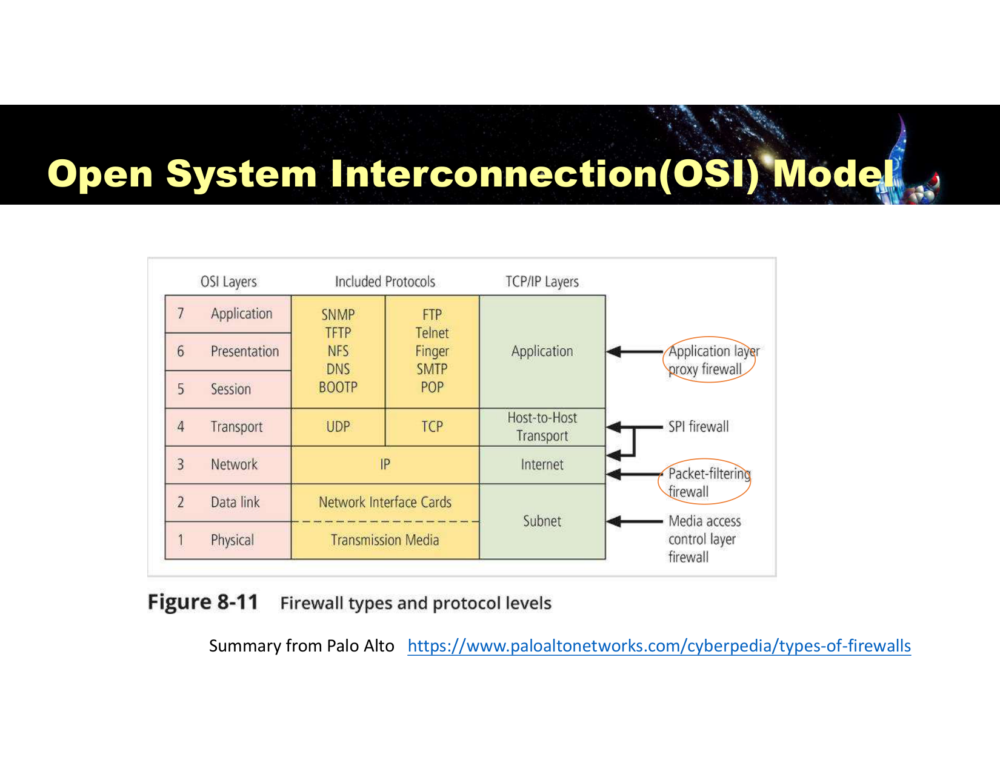

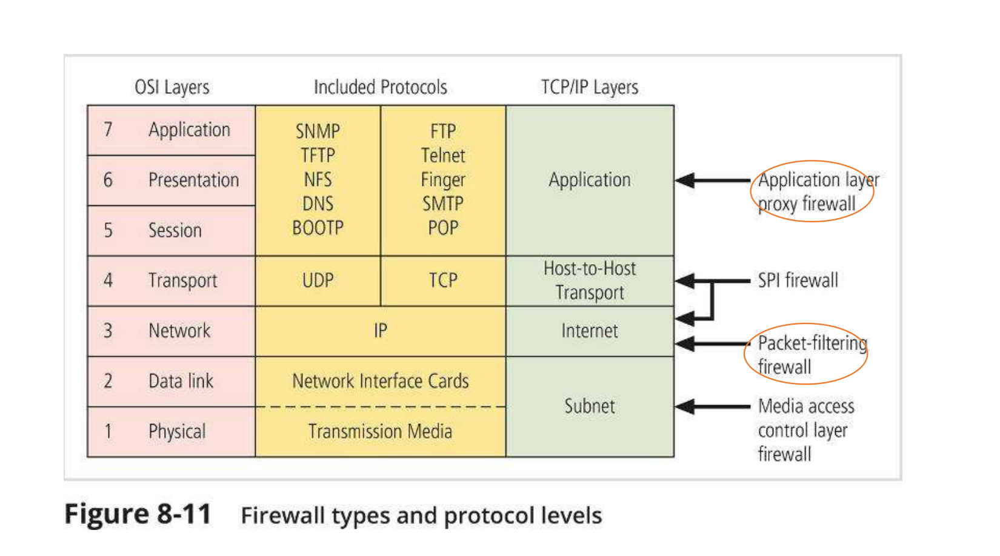

> ⚠️ **这一页文字提取只有 127 字，内容全在 Figure 8-11 里。这张图是把本章所有防火墙"排座位"的总图，极适合出对应题。**

**Figure 8-11 的完整对应关系（箭头指向哪一层就在哪一层工作）：**

| OSI 层 | TCP/IP 层 | 典型协议 | **对应的防火墙类型** |
|---|---|---|---|
| **7 Application**<br>**6 Presentation**<br>**5 Session** | Application | SNMP, TFTP, NFS, DNS, BOOTP<br>FTP, Telnet, Finger, SMTP, POP | 🟠 **Application layer proxy firewall**<br>（课件用橙圈标出） |
| **4 Transport** | Host-to-Host Transport | UDP, TCP | **SPI firewall**（箭头同时指向 L4 和 L3） |
| **3 Network** | Internet | IP | 🟠 **Packet-filtering firewall**<br>（课件用橙圈标出） |
| **2 Data link**<br>**1 Physical** | Subnet | Network Interface Cards<br>Transmission Media | **Media access control layer firewall** |

### 三个必须注意的细节

**① SPI = Stateful Packet Inspection，它的箭头是"跨两层"的**
图中 SPI firewall 的箭头**同时指向 Transport(L4) 和 Network(L3)** —— 这正是"状态检测"的技术含义：它既看 IP（L3），又看 TCP 端口和连接状态（L4）。
> **对照记忆**：Packet-filtering 只在 **L3**；SPI 在 **L3–L4**；Proxy 在 **L5–L7**。**层次越高 = 看得越深 = 越安全但越慢。**

**② 课件用橙色圈只圈了两个**：Application layer proxy firewall 和 Packet-filtering firewall。
> 💡 这是**教授自己的强调标记**——这两个是重点。（SPI 已经在 p.19 单独讲过一页了。）

**③ 还有第四种：Media access control layer firewall（L1–L2）**
这是前面正文没提过的一种，工作在数据链路层，按 **MAC 地址**过滤。容易被漏掉，但图上明明白白画着。

> **考点**：这类题会问 "Which firewall type operates at the highest layer of the OSI model?" → **Application layer proxy firewall**；或 "At which OSI layer does a packet-filtering firewall operate?" → **Network layer (Layer 3)**。
>
> **记忆锚点**：**MAC 层看网卡 → 包过滤看 IP → SPI 看端口和连接 → Proxy 看内容。四级台阶，一级比一级深。**

---

# 第三部分：Firewall Architecture（防火墙架构）

## 17. 🔴 Screened Host Architecture（屏蔽主机架构，p.25）

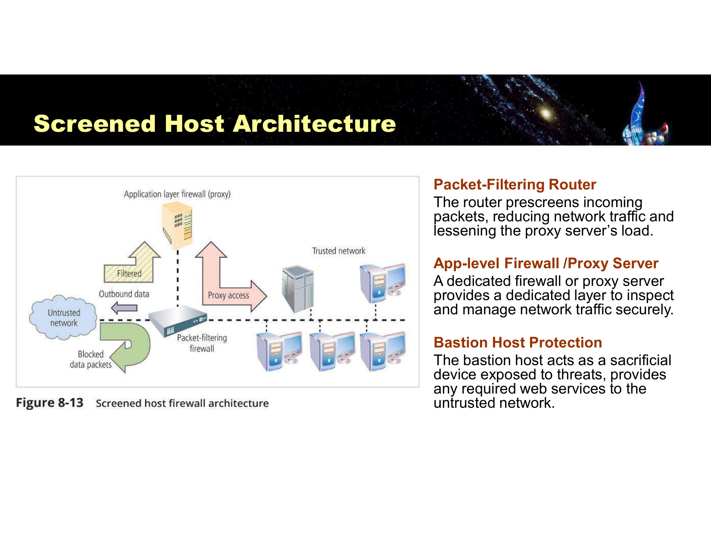

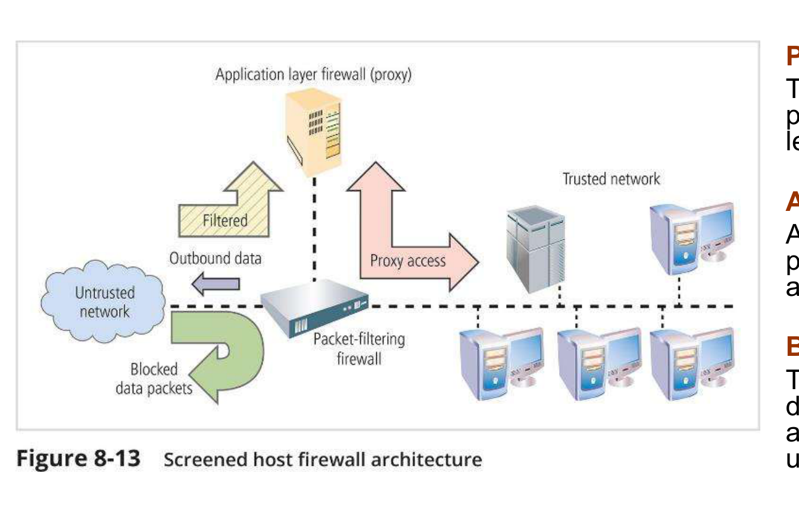

**先拆词：Screened = 被"筛"过的 → 谁被筛？Host（那台堡垒主机）。**
**Screened Host = "有人在前面替那台主机挡一道筛子"的架构。**

### 结构（Figure 8-13）

```
              ①                        ②③
Untrusted ──> [Packet-filtering] ──> [Application layer firewall]  ──> Trusted
network       [    firewall    ]     [   (proxy) = Bastion Host   ]     network
              粗筛：看包头，              深查：看应用层内容，
              挡掉明显垃圾                代理内外通信
```

**课件的三个 bullet，正好是图上三个角色：**

| 角色 | 课件原文 | 作用 | 对应前面学的 |
|---|---|---|---|
| ① **Packet-Filtering Router** | "The router **prescreens** incoming packets, **reducing network traffic** and **lessening the proxy server's load**" | **预筛**。用便宜快速的包过滤先扔掉明显不合法的包 | Stateless / Stateful |
| ② **App-level Firewall / Proxy Server** | "A **dedicated** firewall or proxy server provides a **dedicated layer** to inspect and manage network traffic securely" | **深查**。剩下的流量做 L7 检查、代理转发 | Application Layer Proxy Firewall |
| ③ **Bastion Host Protection** | "The bastion host acts as a **sacrificial device exposed to threats**, provides any required **web services to the untrusted network**" | ②那台机器的**身份定位**：对外提供服务、直面攻击的牺牲品 | Bastion Host 定义（p.16） |

> ⚠️ **② 和 ③ 是同一台机器，不是两台。** ② 说它"做什么工作"，③ 说它"处在什么处境"。这是这页最容易看晕的地方。

### ⭐ 为什么这么设计？—— 两个理由，别只答一个

**理由 A：安全（defense-in-depth）** — 攻击者要过两关，且两关**机制不同**（一个看包头、一个看内容），绕过 router 的手法未必绕得过 proxy。

**理由 B：性能** ⭐ — 课件明写 "**lessening the proxy server's load**"。Proxy 检查得深但**又慢又贵**，让它直面全部 Internet 流量会被拖垮。前面放 router 当门卫：门卫只看证件（包头），几秒一个，赶走 90% 的垃圾；剩下 10% 才轮到里面的面试官（proxy）慢慢盘问。

> **考点**：问"为什么要在 proxy 前面加一个 packet-filtering router？"，**只答"更安全"只能拿一半分**——课件原文明确提到了 **reducing network traffic / lessening the proxy's load**，性能理由必须答出来。

### 🔴 它的致命弱点（下一页存在的理由）

Screened Host 里，那台 **bastion host 本身还是连在内网上的**。

> **所以：bastion host 一旦被攻陷 = 攻击者直接站在内网里了。**

---

## 18. 🔴 Screened Subnet Firewall Architecture with DMZ（p.26）

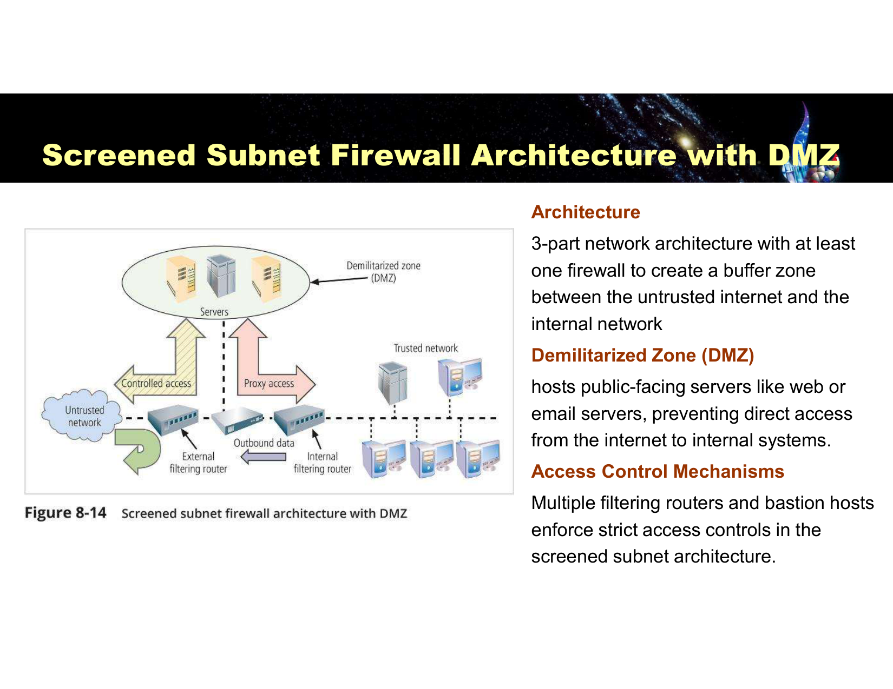

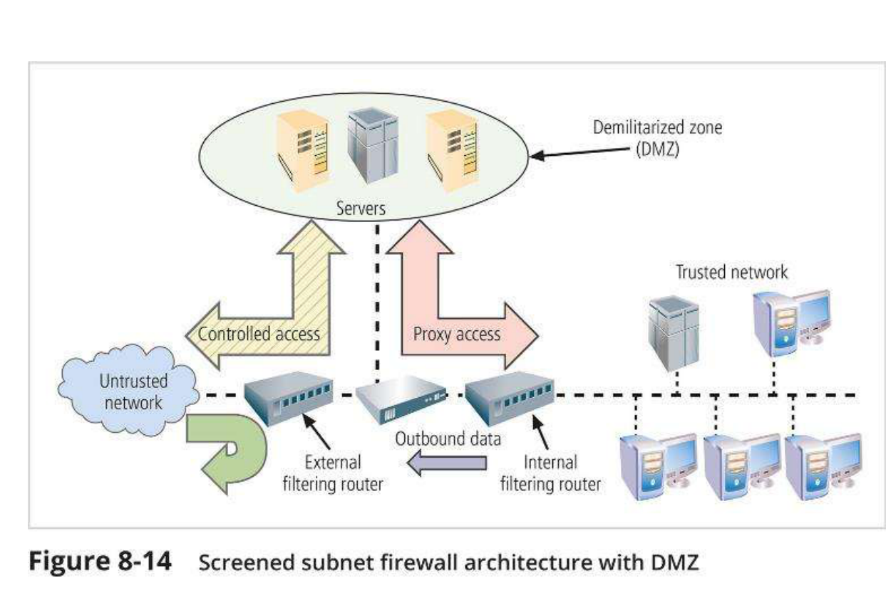

**课件三个 bullet：**

| 要点 | 课件原文 | 解读 |
|---|---|---|
| **Architecture** | "**3-part** network architecture with **at least one firewall** to create a **buffer zone** between the untrusted internet and the internal network" | **三段式**架构，用防火墙造出一个**缓冲区** |
| **Demilitarized Zone (DMZ)** | "hosts **public-facing servers** like web or email servers, **preventing direct access from the internet to internal systems**" | DMZ 放**面向公众的服务器**；关键效果是**外部无法直接触达内网** |
| **Access Control Mechanisms** | "**Multiple filtering routers and bastion hosts** enforce strict access controls" | **多个**过滤路由器 + 堡垒主机共同执行严格访问控制 |

### 结构（Figure 8-14）

```
Untrusted ──> [External        ──┐                       ┌── [Internal      ──> Trusted
network        filtering router]  │                       │    filtering router]   network
                                  ↓                       ↑
                          ┌────────── DMZ ──────────┐
                          │  Servers（Web / Mail）  │
                          │      Bastion Host       │
                          └─────────────────────────┘
              外部够得着 DMZ，但**永远够不着内网**
```

**⭐ 注意图中两个箭头的名字不同**（这是图里的关键信息）：
- 左边（外→DMZ）标的是 **"Controlled access"**（受控访问）
- 右边（DMZ→内网）标的是 **"Proxy access"**（代理访问）
> 说明外部到内网**中间隔了一次代理**，从来不是直连。

### 🔴 Screened Host vs Screened Subnet（必考对照）

| | **Screened Host** | **Screened Subnet (DMZ)** |
|---|---|---|
| **堡垒主机在哪** | 挂在**内网**上 | 隔在**独立的 DMZ 子网**里 |
| **过滤设备** | 通常 1 个 packet-filtering router | **两个**（External + Internal filtering router），把 DMZ 夹在中间 |
| **公开服务放哪** | bastion host 上（在内网） | **DMZ 里** |
| **堡垒主机被攻陷后** | 😱 攻击者**已在内网** | 😌 攻击者**只在 DMZ**，还要再破 Internal router |
| **课件关键句** | "sacrificial device **exposed to threats**" | "**preventing direct access** from the internet to internal systems" |
| **成本 / 复杂度** | 较低 | 较高 |
| **安全性** | 中 | **高** |

> 🔑 **一句话记住区别：唯一的核心差异是——堡垒主机有没有被隔离在独立的 DMZ 子网里。** 其余都是这一点的推论。

> **小白类比**：**DMZ = 军事上的"非军事区"**，南北韩之间那条缓冲带。公开服务（Web、Mail）必须让外人访问，就全部放进这条缓冲带，**外人永远只能走到这里为止**。

> **踩坑提醒**：**DMZ ≠ Bastion Host。**
> **DMZ 是一个"区域/子网"**（地点）；**Bastion Host 是放在那个区域里的一台"机器"**（设备）。考题会用"a DMZ is a device placed between..."这种偷换来设陷阱。

---

## 19. 🟡 Case Study: which model to implement（p.30）

**情境（课件原文摘要）：**
> 顾问 Susan 来自大型咨询公司 Costly & Firehouse，提出两个方案：一个是 "**adequate, if modest**"（够用但朴素）的设计，另一个是 "**a little more than we need**"（可能超出需求）。书面报告说决定权在客户，但**当面沟通时她大力吹捧贵的方案、贬低经济的方案**。

**两个讨论题：**
1. What questions do you think **Kelvin** should have included on his slide to start the discussion?
2. 如果把问题分成两类——**cost（成本）vs maintaining high security while keeping flexibility（在保持灵活性的同时维持高安全）**——对 SLS 来说哪个更重要？

### 这道题在考什么

> 🔑 **它就是让你在 Screened Host（便宜够用）和 Screened Subnet + DMZ（贵但安全）之间做论证。前面两页不是孤立知识点，是这道 case 的弹药。**

**Q1 的答题方向 —— Kelvin 该问的问题（建议按四类组织）：**

| 类别 | 该问的问题 |
|---|---|
| **业务需求** | 我们有哪些**必须对外提供**的服务（Web/Mail）？未来 3 年会增长吗？ |
| **资产与风险** | 我们要保护的**关键资产**是什么？一旦泄露的**损失量级**是多少？（→ 用 Lec 1 的 breach cost 逻辑） |
| **成本** | 两个方案的 **TCO**（不只采购价，还有运维人力、License、培训）？ |
| **合规** | 监管/行业标准**是否强制要求** DMZ 或分段隔离？ |
| **可扩展性** | 便宜方案**日后能否升级**到贵方案，还是要推倒重来？ |
| **利益冲突** ⭐ | 顾问的**推荐是否存在利益冲突**？她的报酬是否与方案规模挂钩？ |

**Q2 的答题框架 —— 不要直接选边，要给判断依据：**

> 正确的答法不是"我选安全"或"我选便宜"，而是：**"取决于风险评估的结果"**。
> - 如果 SLS 处理**大量客户敏感数据 / 受监管**，或**单次泄露损失远超两方案差价** → 选 Screened Subnet，因为**成本节约在一次事故面前毫无意义**；
> - 如果资产价值有限、对外服务简单 → **过度投资本身也是一种管理失职**（钱花在这里就不能花在别处，安全预算有机会成本）。
>
> **附加一句拿分**：无论选哪个，都必须**独立验证顾问的建议**，因为她表现出了**明显的利益倾向**（书面中立、口头推贵的）。

> 💡 **这是一道典型的 Management 卷题目。** 它考的不是技术，而是**"在信息不对称和利益冲突下如何做安全投资决策"**。答案里出现 **risk-based decision（基于风险的决策）**、**TCO**、**conflict of interest** 这几个词会很加分。

---

# 第四部分：VPN（虚拟专用网）

## 20. 🟡 Remote Access in the Age of COVID / VPN（p.27–29）

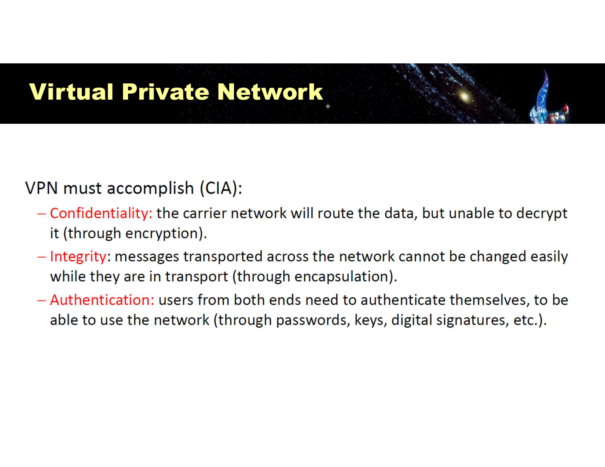

**定义（p.27）：**
> "**Virtual Private Network (VPN)**: Extends an organization's **internal network to remote locations** (e.g. Work From Home Arrangement). Provide **private and secure** network connection between systems."

**How it works：**
> 用户在设备上安装 VPN 客户端软件，连接时**在设备与组织网络之间建立一条加密隧道（encrypted tunnel）**。

### 🔴 两种模式（必考对照）

| | **Tunnel Mode（隧道模式）** | **Transport Mode（传输模式）** |
|---|---|---|
| **加密什么** | **加密整个 IP 包，包括包头**（encrypt entire IP packet including header） | **只加密 payload**（encrypt only the payload of the IP packet） |
| **原 IP 头** | 被加密并**外层重新封装一个新 IP 头** | **保持原样、不加密**（remains intact and unencrypted） |
| **典型场景** | 站点到站点（分公司↔总部）；隐藏内部拓扑 | **课件明确说：Remote Access to Office 就是 Transport Mode** |
| **别名** | IPSec's Tunnel Mode | **IPSec's Transport Mode** |

**课件 p.28 的原句（红字强调，很可能考）：**
> "**Data within an IP packet (payload) is encrypted, but the original IP header remains intact and unencrypted.**"
> "Allows user to establish **secure link directly with remote host**, encrypting only data contents of packet"

**常见协议：SSL/TLS、IPSec**

> **踩坑提醒**：⚠️ **课件 p.28 说"Remote Access to Office is example is Transport Mode"。**
> 这一点值得注意：**业界实务中，远程办公 VPN 更常用的其实是 Tunnel Mode**（因为要把远程设备"放进"公司网段）。但 **考试请按课件答 Transport Mode** —— 课件配图 Figure 8-19 明确标题就是 "Transport mode VPN"，而且图中说明是 "client machine acts as if **locally connected**"（客户端表现得像本地连接）。**记住课件的说法，别用课外知识去"纠正"它。**

### 🔴 VPN must accomplish (CIA)（p.29）

⚠️ 注意这里的 "CIA" **不是** Lec 1 的 Confidentiality/Integrity/**Availability**，而是被替换成了 **Authentication**：

| 要素 | 课件原文 | 靠什么实现 |
|---|---|---|
| **Confidentiality** | "the carrier network will **route** the data, but **unable to decrypt** it" | **through encryption（加密）** |
| **Integrity** | "messages transported across the network **cannot be changed easily** while they are in transport" | **through encapsulation（封装）** |
| **Authentication** | "users from **both ends** need to authenticate themselves, to be able to use the network" | **through passwords, keys, digital signatures** |

> 🔴 **这是个高危陷阱**：课件写着 "VPN must accomplish (**CIA**)"，但第三项是 **Authentication 不是 Availability**。如果考题问 "Which of the following must a VPN accomplish?"，选项里同时有 Availability 和 Authentication —— **按课件选 Authentication**。
>
> **逻辑上也说得通**：VPN 是走**公共互联网**的，它**没法保证可用性**（运营商断网它就断了），但它能保证**只有对的人**用得了、数据**没被看到**也**没被改**。

> **小白类比**：VPN 就是在公共马路上开了一条**加铁皮的密封通道**。
> **Confidentiality** = 车厢不透明，路上的人（carrier network）只知道有车在开，不知道里面装什么；
> **Integrity** = 车厢焊死了，路上没人能塞东西进去或换掉里面的货；
> **Authentication** = 两头的门都要刷卡才能开。

---

# 第五部分：IDPS（入侵检测与防御系统）

## 21. 🔴 IDS 的定位与角色（p.31–33）

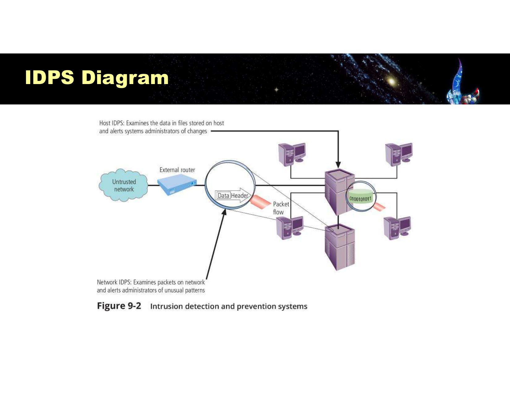

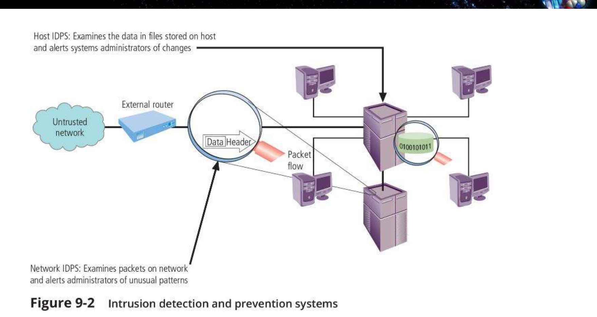

### 先定位：它和防火墙的关系

> **防火墙是门锁 🔒，IDS 是监控摄像头 + 警报器 📹🚨。**
> 门锁只能挡"进不来的"，但**已经溜进来的人、有钥匙的内鬼、从窗户翻进来的**，锁毫无办法。

**课件 p.31 的开场：**
> "Play a **critical role in the defense** of network against hackers & other security threats"

### 🔴 五个动作（p.32）

```
Monitoring → Analysis → Detection → Alerting → Logging
  持续监控     分析      判定是攻击    通知管理员   记录留存
```
> ⚠️ **注意最后两步：IDS 的输出是"告警 + 日志"，不是"阻断"。** 这是它与防火墙最本质的区别。

### 🔴 S = P + D + R（p.32）

课件给了这个公式，它是**理解 IDPS 存在意义的钥匙**：

| | 含义 | 谁负责 |
|---|---|---|
| **P** — Prevention | 不让坏事发生 | 防火墙、访问控制、VPN、加密 |
| **D** — Detection | 坏事发生了要能**发现** | **← IDS 在这里** |
| **R** — Response | 发现后要能处置 | 人工响应 / **IPS 自动响应** / SOAR |

> 🔑 **核心思想：预防一定会失败**（0-day、内鬼、社工、配置错误）。**光有 P 不叫安全，必须加上 D 和 R。**
> **IDS 存在的全部理由，就是"承认防火墙一定会被绕过"** —— 这和 ZTA 的 "Assume Breach" 是同一个思想。

### 🔴 Is Intrusion = Incident?（p.32 的提问）

**不等于。**

| | 定义 | 例子 |
|---|---|---|
| **Intrusion（入侵）** | 一次**未授权访问的尝试或事件** | 有人来撬锁——**撬了但没撬开也算** |
| **Incident（安全事件）** | 真正**违反安全策略、造成或可能造成实际影响**的事 | 撬开了、进来了、拿走东西了 |

关系：
- 入侵**被挡住** → 是 intrusion，通常**不构成 incident**
- 入侵**成功** → intrusion **升级为** incident，触发事件响应流程
- 反过来，**很多 incident 根本不是 intrusion** —— 员工误删数据库、笔记本遗失、配置错误导致数据泄露

> **一句话**：**Intrusion 描述"外部的行为"，Incident 描述"造成的后果"。** IDS 检测的是前者；判断是否升级为后者需要**人**（呼应下面的 Limitation：cannot automatically investigate without human judgment）。

### 🔴 Category：Network-based vs Host-based（p.33）

**课件原文：**
> **Network based**: by monitoring **entire network communication traffic** for suspicious pattern.
> **Host based**: by monitoring the **files stored on the system (end-point)** or by monitoring the **actions of connected users**.

**Figure 9-2（p.34）的图注（这两句是图里的核心文字）：**
> **Network IDPS**: "Examines **packets on network** and alerts administrators of **unusual patterns**"（图中用放大镜看 Data+Header）
> **Host IDPS**: "Examines the **data in files stored on host** and alerts systems administrators of **changes**"（图中用放大镜看服务器里的 0100101011）

| | **NIDS（网络型）** | **HIDS（主机型）** |
|---|---|---|
| 装在哪 | 网络节点，监听整段流量 | **单台主机/端点**上 |
| 看什么 | **packets on network** → 异常模式 | **files stored on host** → 文件变更；**connected users 的行为** |
| 擅长 | 扫描、DDoS、横向移动、异常连接 | 文件被篡改、提权、可疑登录、恶意进程 |
| 看不见 | **加密流量**里的内容 | 别的机器发生了什么 |

> 💡 **注意这是本课第二次出现 "Network vs Host" 的二分**（第一次在 p.13 防火墙）。**两处的分工逻辑完全一样：网络侧看全局但粒度粗，主机侧看得细但视野窄，所以要一起用。** 记住这个结构，两页一起答。

---

## 22. 🔴 Benefits of IDPS（p.35）

> 这一页看着是三条并列的好处，其实有一条**隐藏的时间轴**，而且**每条面向不同的人**。看懂这个，这页就活了。

```
       事中（实时）           事后（回溯）            长期（治理）
   ┌──────────────┐   ┌───────────────────┐   ┌──────────────────────┐
   │ ① Intrusion  │   │ ② Data Collection │   │ ③ QA & Compliance    │
   │   Detection  │   │    & Forensic     │   │                      │
   └──────────────┘   └───────────────────┘   └──────────────────────┘
      给：安全运维        给：调查人员 + 老板        给：管理层 / 审计 / 监管
```

⚠️ **提醒：这是 ISOM（管理）课。② 和 ③ 里那些"管理味"重的词（justifies security expenditures、compliance、quality control）恰恰是考点，别当废话跳过。**

### ① Intrusion Detection —— 本职工作（事中）

> "Primary purpose to identify and report an intrusion. Detecting at **early sign** allow **quick response** to **contain** the attack and **prevent substantial loss** or damage of information asset. Also help to protect its asset **exposed to known vulnerabilities**."

**因果链：早期发现 → 快速响应 → 遏制(contain) → 避免重大损失**

核心逻辑：**损失是随时间累积的。** 攻击有一条链（踩点→入侵→提权→横向移动→找数据→打包外传）：
- 在**第 2 步**发现 → 拔网线就完了，损失≈0
- 在**第 6 步**发现 → 数据已经出去了，赔钱、上新闻、被罚

> **注意 "contain（遏制）" 这个词**：它不是"阻止攻击发生"（那是防火墙的活），而是**"把已经发生的攻击控制在最小范围"**。

**⭐ 那句最难懂的话：**"help to protect its asset **exposed to known vulnerabilities**"
> 意思是：**当你有一个已知漏洞但暂时补不上时，IDPS 可以顶上。**
> 现实太常见了——老系统打补丁会崩、供应商停止维护、停机窗口要等季度末。
> **IDPS 的作用是：我补不上洞，但我可以在洞口装个摄像头，谁一碰它我立刻知道。**
> 这在管理上有专门的名字：**Compensating Control（补偿性控制）** —— 无法消除风险时，用监控手段把风险降到可接受水平。**这是很典型的 ISOM 考点。**

### ② Data Collection & Forensic —— 事后价值（两个完全不同的用途）

> "Logs network activity for **post-incident forensic analysis**; identifies **attack vectors** and **justifies security expenditures to management**"

**(a) 技术用途：取证 + 找到攻击路径**
**Attack vector = 攻击者是从哪条路进来的。** 事故后最要命的问题不是"损失多少"，而是**"他怎么进来的？还在不在里面？"**
> **没有日志 = 你只知道被打了，但不知道被谁打、怎么打的、还会不会再来。**
有了日志才能：还原攻击链 → 定位真正入口 → **堵住它**（把 D 的成果反馈回 P）→ 满足法律取证要求。

**(b) 管理用途：向管理层证明安全投入值得** ⭐ ← **整页最"ISOM"的一句**

安全部门的经典困境：
> **做得越好，越像没干活。** 一年没出事，老板问："那我们花这几百万干嘛？"
> 出了事，老板问："我们花了几百万，怎么还出事？"
> —— **安全的成果是"没有发生的事"，而没发生的事无法被看见。**

**IDPS 日志是唯一的证据**："本季度检测并阻断针对财务系统的攻击尝试 1,247 次，其中 3 次为高危定向攻击。"
这句话把**看不见的风险变成可量化的数字**，让安全预算从"成本中心"变成**可论证的投资（business case / ROI）**。

### ③ Quality Assurance & Compliance —— 长期治理

> "Monitor network traffic and systems data to flag **suspicious data transfer** and detect unusual activities that could indicate **data theft**. **Quality control for security policy implementation.** Potential forensic investigation"

**(a) 侦测数据外泄（data exfiltration）**
注意它盯的是**"往外送数据"这个动作本身**，不是"有人打进来"。这直接对应**内部威胁**：
- 员工离职前深夜打包下载客户名单
- 某台机器突然向境外 IP 传 20GB

**这不是入侵，防火墙完全放行**（内部合法用户、合法端口）。**只有靠行为异常检测才抓得到。**
> 🔑 **IDPS 不只防外面的人打进来，也防里面的人把东西搬出去。**

**(b) Quality control：验证"安全策略真的被执行了"** ⭐
**公司写在纸上的安全政策，和网络上实际跑的东西，往往是两回事。**
- 政策规定"禁用未加密 FTP" → IDPS 一看，还有 12 台机器天天在用
- 政策规定"研发网段不得直连外网" → IDPS 发现有人开代理绕过

**IDPS 在这里不是抓黑客，而是给安全政策做质检**——把"我们规定了"和"我们做到了"之间的落差**量化出来**。

**这也是合规硬性要求**：GDPR、香港 PDPO、PCI-DSS、ISO 27001 都要求组织**具备监控能力并保留日志**。**审计时拿不出日志 = 直接不合规，跟有没有真被攻击无关。**

### 三条 benefit 与 P+D+R 的对应（拿分要点）

| Benefit | 对应 | 时间点 | 说给谁听 |
|---|---|---|---|
| ① Intrusion Detection | **D → R** | 攻击进行中 | 安全运维团队 |
| ② Data Collection & Forensic | **R → 反馈回 P** | 攻击之后 | 调查人员 + **管理层（预算）** |
| ③ QA & Compliance | **对 P 的持续验证** | 长期持续 | **管理层、审计师、监管** |

> ⭐ **注意 ② 和 ③ 都有箭头指回 P** —— 这是精髓：**IDPS 不只是"发现攻击"，它还是一个反馈回路：靠 D 收集的信息去修正和验证 P。** 安全因此从一次性建设变成**持续改进的循环**。

---

## 23. 🔴 IDPS Terminology & Core Concept（p.36）——**本节最高频考点**

用"医院做癌症检查"来记最清楚：

| # | 术语 | 课件原文定义 | 中文/类比 |
|---|---|---|---|
| 01 | **Alarm / Alert**<br>*NOTIFICATION* | "An indication that a system **has been attacked or is currently under attack**. Alarms trigger **analyst investigation** and response workflows." | 告警。检查报告出结果，触发分析师调查 |
| 02 | **False Positive**<br>*CRITICAL TERM* | "An alert that occurs **in the absence of an actual attack**. **Excessive false positives desensitize analysts** and reduce overall security effectiveness." | **误报**：没有攻击却报警了。<br>类比：**没病却被诊断成有病** |
| 03 | **False Negative**<br>*CRITICAL TERM* | "**Failure of the IDPS to react to an actual attack event.** Considered the **most grievous IDPS failure** — an undetected intrusion causes real damage." | **漏报**：真有攻击却没报警。<br>类比：**有病却被诊断成健康** ☠️ |
| 04 | **Noise**<br>*SIGNAL QUALITY* | "Alarm events that are **accurate but non-threatening**. High noise levels **obscure genuine alerts** and increase analyst workload." | **噪音**：报警是**准确的**，但**没有威胁**。<br>类比：**查出个良性小囊肿，真实存在但不用管** |
| 05 | **Tuning**<br>*OPERATIONAL* | "The process of **adjusting an IDPS** to **maximize detection of true positives** while **minimizing both false positives and false negatives simultaneously**." | **调优**：同时压低误报和漏报——这是个永恒的权衡 |
| 06 | **Confidence Value**<br>*OPERATIONAL* | "A measure of the IDPS's **ability to correctly detect and identify specific attack types**. Higher confidence values indicate **more reliable detection accuracy**." | **置信值**：系统对"我认得出这类攻击"的把握程度，可用来给告警排优先级 |

### ⚠️ 最容易混的一对：False Positive ≠ Noise

| | **False Positive** | **Noise** |
|---|---|---|
| 事情**发生了**吗 | ❌ 没有（不存在这回事） | ✅ 发生了 |
| 告警**准确**吗 | ❌ 报错了 | ✅ **报对了** |
| 问题在哪 | 系统判断错误 | 事情真实但**无威胁** |
| 课件用词 | "in the **absence of** an actual attack" | "**accurate but** non-threatening" |

### 🔴 课件明确写出的 Key Message（几乎一定考）

> "**False negatives are the serious IDPS failure** — an **undetected attack is far more dangerous than a false alarm**. Tuning must **prioritize minimizing false negatives** above all other metrics."

**漏报 > 误报的严重性。** 误报只是浪费分析师时间；**漏报意味着攻击真的发生了而没人知道。**

⚠️ **但也别忽略误报的危害（答题时加上这一层会更完整）**：
> 课件 02 说 "Excessive false positives **desensitize** analysts"（狼来了效应）—— **误报太多 → 分析师麻木 → 真警报也被忽略 → 反而制造出漏报。**
> 所以两者不是无关的：**误报失控的最终后果，就是漏报。**

**考点**：课件 **Multiple Choice #3 (p.65)**：
> "NIDS alerted to a DDoS attack, and investigation revealed that **this type of attack did take place**. What type of report?"
> A. False positive　B. True negative　**C. True positive** ✅　D. False negative
>
> **解法（画个 2×2 表 5 秒解决）：**
> | | 系统报警了 | 系统没报警 |
> |---|---|---|
> | **真有攻击** | **True Positive** ✅ | False Negative |
> | **没有攻击** | False Positive | True Negative |
>
> 本题：系统**报了**（Positive），事实**确实发生**（True）→ **True Positive**。

> **记忆口诀**：**Positive / Negative 说的是"系统报没报"；True / False 说的是"系统对不对"。** 先定 P/N，再加 T/F，绝不会错。

---

## 24. 🔴 IDPS Detection Methods（三种检测方法，p.37）——**第二大高频考点**

> 来源：Whitman & Mattord (2022), **pp. 350–352**（课件自己标了页码，说明这页是照教材来的，考试也大概率照教材问）

### 🔑 一把钥匙：三者的区别在于**各自拿什么当参照物**

```
① Signature   参照物 = 已知【坏】的样本库          "我认得这张脸，他是通缉犯"
② Anomaly     参照物 = 你自己网络学来的【正常】基线  "这不像我们平时的样子"
③ SPA / DPI   参照物 = 厂商规定的【协议该怎么走】    "协议手册说不能这么发"
```
**一个比对"坏"，两个比对"正常"；而这两个"正常"的来源完全不同（一个自己学的，一个别人给的）。抓住这条，三者永远不会混。**

### ① Signature-Based Detection

| 项 | 课件原文 | 解读 |
|---|---|---|
| **又叫** | **Knowledge-Based / Misuse Detection** | 知识型 / 误用检测 |
| **机制** | "Examines network traffic for **patterns matching a database of known attack signatures**" | 拿流量**比对已知攻击特征库**（和杀毒软件病毒库同理） |
| **优点** | "**Widely used**; **highly effective against known, well-documented** attack types" | 应用最广；对**已知攻击非常有效**、误报低、置信值高 |
| **缺点** | "**Cannot detect new or unknown attacks**; signature database **requires constant updates**" | 🔴 **0-day 完全免疫**；特征库要不停更新，过期即失效 |

**具体例子**：规则「若 HTTP 请求参数出现 `' OR '1'='1` → 告警 SQL Injection」。本质是**模式匹配**。
**典型失败模式** 👉 **False Negative（漏报）**

### ② Anomaly-Based Detection

| 项 | 课件原文 | 解读 |
|---|---|---|
| **又叫** | **Behavior-Based Detection** | 行为型检测 |
| **机制** | "Collects **statistical baselines** of normal traffic; **alerts when activity exceeds a defined clipping level**" | 先学出"正常基线"，超过**阈值（clipping level）**就报警 |
| **优点** | "Can detect **novel, previously unseen attack types** beyond known signatures" | 🟢 **能抓 0-day 和全新攻击**——这是它存在的唯一理由 |
| **缺点** | "**High false-positive rate**, significant **processing overhead**, **less commonly deployed**" | 🔴 误报率高、开销大、**部署较少** |

**⭐ Clipping Level = 阈值/容忍线**，这是这页的关键术语。日常流量本来就有波动（周一忙周末闲），不能一波动就报警；clipping level 就是那条"波动到这个程度算正常"的线。

**具体例子**：
```
基线：财务部 Mary 的电脑，工作日 9–18 点活跃，日均外发 5 MB
实况：周日凌晨 3 点，该机器向境外 IP 外发 8 GB
      → 时间、流量、目的地三项全部超过 clipping level → 🚨
```
> 注意这里面**没有任何"已知攻击特征"**。上传数据这个动作完全合法——端口合法、用户合法、协议合法，**防火墙和 signature 检测都会放行**。抓住它的唯一依据是"**不像平时的它**"。

**隐藏陷阱** ⚠️：如果**学习基线的那段时间攻击者已经在里面了**，攻击行为会被学成"正常"，从此永不报警。
**典型失败模式** 👉 **False Positive（误报）** → 进而 desensitize 分析师 → **最终制造漏报**

### ③ Stateful Protocol Analysis (SPA)

| 项 | 课件原文 | 解读 |
|---|---|---|
| **又叫** | **Deep Packet Inspection (DPI)** | 深度包检测 |
| **机制** | "Compares observed traffic against **known normal protocol profiles supplied by protocol vendors**" | 比对**厂商提供的"协议正常行为规范"** |
| **优点** | "Detects **anomalous protocol behavior** and can **inspect authentication sessions in depth**" | 能抓协议层异常；**能深入检查认证过程** |
| **缺点** | "**Heavy processing overhead**; may **interfere with normal protocol operations under load**" | 🔴 开销最重；**高负载时可能干扰正常业务运行** |

**⭐ "supplied by protocol vendors"（厂商提供）是它和 ② 的分界线：**

| | **Anomaly-Based** | **SPA** |
|---|---|---|
| "正常"从哪来 | **自己网络学出来的**（本地的，每家公司都不同） | **厂商/标准给的**（通用的，放之四海皆准） |
| 判断依据 | "这不像**我们**平时的样子" | "这不符合**协议规定**的样子" |

**具体例子（SMTP 正常顺序 `HELO → MAIL FROM → RCPT TO → DATA`）：**
- ❌ 跳过 `HELO` 直接发 `DATA` → **协议状态机顺序违规**
- ❌ `MAIL FROM` 后面塞了 3000 字节 → 正常邮箱地址不可能这么长 → **buffer overflow 尝试**
- ❌ 声称是 443 端口的 HTTPS，内容却不是 TLS 握手 → **协议伪装/隧道**

**"Stateful" 在这里的含义**：它**记得这条会话走到哪一步了**（协议状态机的当前状态），所以才能判断"下一步这么做合不合规"。

> ⚠️ **绝对不要和 Stateful Firewall 混淆！**
> | | **Stateful Firewall** | **Stateful Protocol Analysis** |
> |---|---|---|
> | 追踪什么 | **连接**是否存在（state table） | **协议会话**走到了哪个阶段 |
> | 判断 | "这个包属于已建立的连接吗" | "这一步符合协议规范吗" |
> | 属于 | **防火墙**（p.19） | **IDPS 的检测方法**（p.37） |

### 🔴 三者对照总表（直接背这个）

| | ① Signature-Based | ② Anomaly-Based | ③ SPA |
|---|---|---|---|
| **又叫** | Knowledge-Based / **Misuse Detection** | **Behavior-Based** Detection | **Deep Packet Inspection (DPI)** |
| **参照物** | 已知攻击**特征库** | 本地统计的**基线** | 厂商提供的**协议规范** |
| **在问** | "像不像某个已知的坏人？" | "像不像我们平时的样子？" | "合不合协议的规矩？" |
| **关键词** | signature database | **clipping level**、baseline | protocol profile、**vendor** |
| **能抓未知攻击** | ❌ | ✅ | ✅（协议层面） |
| **主要误差** | **False Negative** | **False Positive** | 两者兼有 + **影响可用性** |
| **开销** | 低 | 高 | **最高** |
| **部署情况** | **最广泛** | **较少** | 中等 |

> **记忆口诀**：**Signature = 认脸｜Anomaly = 看行为｜SPA = 查规矩。**
> 认脸的抓不到生面孔（漏报）；看行为的容易冤枉好人（误报）；查规矩的最费劲还可能挡住正常人（影响业务）。

> **三点补充（容易漏但常考）**：
> **1. 现实中三者混用，不是三选一。** Signature 打主力（挡掉大部分已知攻击、成本低），Anomaly 补 0-day 和内部威胁的盲区，SPA 用在关键协议/网段上——这就是 **defense-in-depth 在检测层面的体现**。
> **2. 它们的缺点正好互补**：Signature 漏报多误报少；Anomaly 误报多但能抓新的。**一个防漏报，一个防误报**——这才是要一起用的真正原因。
> **3. Tuning 在三者上具体调什么**：Signature → 调**特征库**（开哪些规则、多久更新）；Anomaly → 调 **clipping level**（调紧则误报多，调松则漏报多）；SPA → 调**解析深度和覆盖协议**（越深越准，但开销和干扰风险越大）。**没有免费的检测——准确度、性能、误报率是永恒的三角权衡。**

---

## 25. 🔴 IDPS Configurations：Passive vs Active（p.38）

**这一页就是 IDS 和 IPS 的分界线。**

| | **Passive（= IDS）** | **Active（= IPS）** |
|---|---|---|
| **课件原文** | "**Analyze and report** the information/problem (i.e., **generate alarms**) that it has collected"<br>"**Does not interfere with the traffic itself**"<br>"**Alert but wait for administrator's actions**" | "**Automatically initiate responses** when alerts are triggered" |
| **具体动作** | 只告警，等人来处理 | • **Terminate user session or network connections**（掐断会话/连接）<br>• **Block access** to the target system from the source of the attack（封锁攻击源）<br>• **Modify firewall's rule set**（修改防火墙规则集）<br>• **Replace malicious content**（替换恶意内容） |
| **部署位置** | 旁路（out-of-band），只看流量副本 | **串接（inline）**，流量必须穿过它 |
| **风险** | 攻击持续期间**无人阻止** | 🔴 **误报 = 误杀正常业务**（业务中断） |

> 🔑 **IDS（检测）+ 自动响应能力 = IPS（防御）。合起来课件叫 IDPS。**
> 对照 S = P + D + R：**IDS 只做 D；IPS 把 R 也自动化了。**

**建议延伸阅读（课件给的）**：**NIST Special Publication (SP) 800-94**

> ⭐ **一个能拿高分的观察**：**IDS 和 IPS 常常是同一套软件。**
> Snort / Suricata 装同一份，改配置：**旁路部署 → 它是 IDS；串接部署 + 开启 drop 模式 → 它是 IPS。**
> **所以两者的区别本质上是"部署位置 + 是否允许它动手"，不是两种不同的产品。** 这正好解释了课件为什么用 **IDPS** 这个合称。

**考点**：课件 **Multiple Choice #2 (p.64)**：
> "incident originating from a **single system on the Internet** targeting **multiple systems on this network**. What control could stop the incident **ASAP**?"
> A. DDoS mitigation　B. Host firewall rule　C. Vulnerability assessment　**D. Network firewall rule** ✅
>
> **逐项排除：**
> - **A ❌** — 攻击来自**单一系统（single system）**，不是 **D**istributed，所以不是 DDoS
> - **B ❌** — 目标是**多台系统（multiple systems）**，逐台配主机防火墙太慢，不符合 "ASAP"
> - **C ❌** — 漏洞评估是**事前/事后的评估活动**，根本不能"阻止正在发生的事件"
> - **D ✅** — 在**网络防火墙**上加一条规则封掉那个源 IP，**一条规则同时保护所有内网系统**，最快
>
> 🔑 **这题实际在考 p.13 的 Network vs Host-based Firewall**：**单一攻击源 + 多个目标 → 在"汇聚点"（网络边界）处理，而不是在"末端"（每台主机）处理。**

---

## 26. 🟡 IDPS: Strengths, Limitations（p.39）

| **Strengths（能做）** | **Limitations（做不到）** |
|---|---|
| **实时**监控分析系统事件与用户行为，发现可疑活动<br>*Monitors and analyzes system events and user behaviors for suspicious activity in real time* | 🔴 **无法弥补底层安全机制本身的薄弱或缺失**<br>*Cannot compensate for **weak or missing underlying security mechanisms** in the environment* |
| **建立安全基线**并持续追踪配置变更<br>*Baselines the security state of systems and continuously tracks configuration changes over time* | **无法检测尚未入库的新攻击或变种**<br>*Cannot detect newly published attacks or variants not yet included in signature databases* |
| 攻击或违规时**告警**，支撑快速响应<br>*Alerts security staff when attacks or policy violations are detected, enabling rapid response* | **没有人类分析师的介入和判断，无法自动调查事件**<br>*Cannot automatically investigate incidents without direct human analyst intervention and judgment* |
| 让**非专家**也能做有效的安全监控<br>*Enables non-expert personnel to perform effective security monitoring with automated analysis* | 🔴 **无法完全抵御专门针对 IDPS 本身设计的规避或瘫痪攻击**<br>*Cannot fully resist sophisticated attacks specifically engineered to **evade or disable the IDPS itself*** |

> ⭐ **第 4 条 Limitation 最容易被漏掉，但它最深刻**：**IDPS 本身也是一个攻击目标。** 攻击者会专门研究如何绕过它（signature 变形、分片规避）甚至瘫痪它（打爆它的处理能力）。**监控者也需要被监控。**

> **考点**：第 1 条 Limitation **"cannot compensate for weak or missing underlying security mechanisms"** 是最常考的一句。
> 它的意思是：**弱密码、没打补丁、权限乱给——装 IDPS 也救不了。**
> 这句话同时也给 p.35 那个"Compensating Control"划了边界：**IDPS 能替你盯着一个补不上的洞，但不能替你把整套安全基础建设补上。**
>
> 💡 **这三页要连着看：p.35 能力 → p.36 前提条件（告警必须准）→ p.39 边界。** 这是一个完整的论证结构，简答题可以直接套。

---

# 第六部分：Endpoint / SIEM / 下一代工具

## 27. 🟡 Endpoint Security（端点安全，p.41）

| 要点 | 课件原文 | 解读 |
|---|---|---|
| **Coverage** | "Endpoints include **desktop, laptop** component, **smartphones, tablets**, and other **'smart' devices ('IOT' devices)**" | 端点范围很广，**包括 IoT 设备** |
| **Weakest Link** ⭐ | "Security is only as strong as its **weakest link**; and the weakest link is **usually endpoints**" | **木桶原理：安全强度取决于最弱的一环，而最弱的通常是端点** |
| **Reasons for Vulnerability** | ① **Number and variety**（数量多、种类杂）<br>② **End users**（终端用户）<br>③ **Privilege** (e.g. **local administrator**)（权限，如本地管理员） | 三个原因 |

**三个脆弱原因展开：**
- **Number and variety** — 一家公司几千台设备、各种品牌型号系统版本，**管理面极大、补丁难统一**
- **End users** — 人会点钓鱼链接、装盗版软件、用弱密码（呼应 p.5 的 63% 和 66%）
- **Privilege** — 很多用户是**本地管理员**，一旦账号被控，攻击者直接拿到高权限（→ 这正是 **Least Privilege** 要解决的问题）

> **记忆锚点**：**端点是最弱的一环，因为它"又多又杂、有人在用、还常常权限过大"。**

---

## 28. 🟡 Endpoint Detection & Response (EDR)（p.42）

**课件的四个动作（一条完整的闭环）：**

| 步骤 | 课件原文 | 解读 |
|---|---|---|
| **① Monitor Endpoints** | "EDR solutions use **software agents** to **continuously collect data** from devices like laptops, servers, and IoT devices and **file activity**" | 用**软件 Agent** 持续采集端点数据 |
| **② Detect Threats** | "Analyzes collected data to identify malicious activity, e.g. malware, unauthorized access attempts, or **data exfiltration**, by looking for **deviations from normal behavior**" | 靠**偏离正常行为**来检测（← 这就是 **Anomaly-Based**！） |
| **③ Contain incidents that are Detected** | "It can **automatically contain** the threat by **isolating the endpoint**, **blocking malicious processes**" | **自动遏制**：隔离端点、阻断恶意进程（← 这是 **Active/R** 的能力） |
| **④ Investigating incidents & Remediating endpoints** | — | 调查事件并修复端点 |

> 🔑 **EDR = HIDS + 自动响应能力 + 调查取证。**
> 它是**主机侧**的 D+R 一体化工具，和网络侧的 IDPS 形成对称。
> 注意它的检测原理是 **"deviations from normal behavior"**——**和 p.37 的 Anomaly-Based Detection 是同一个思想，只是基线建在端点行为上。**

**🟢 p.43 的小案例（Example: Microsoft Enterprise）**
> 情境：收到同事转发的邮件，附件却打不开——页面显示 "Verify Your Identity"，要求输入邮箱才能打开"安全链接"，并提示 *"this email address isn't associated with this secure link"*。
> 教授问：**"How is the design?"**

**讨论方向**：这是一个**安全与可用性（security vs usability）的权衡**案例。
- ✅ **安全角度**：链接**绑定到特定收件人**，转发出去也打不开——有效防止了敏感文件被随意扩散（这是一种 access control：**if / from where** 的落地）
- ❌ **可用性角度**：合法的业务转发被阻断，用户困惑，可能转而用**更不安全的方式**（微信发、发到私人邮箱）绕过——**安全措施太碍事，用户就会绕过它，反而更不安全**
- ⚠️ **另一个角度**：这个界面**本身长得就像钓鱼页面**（要求输入邮箱地址的弹窗）——**它在训练用户养成"看到验证框就填邮箱"的危险习惯**

> 💡 这道题很能体现本课的 ISOM 视角：**技术上正确的设计，管理上未必是好设计。**

---

## 29. 🔴 SIEM — Security Information & Event Management（p.44–45）

### 定义（p.44 原文，三条）

| 原文 | 解读 |
|---|---|
| "**Central element to empower a security operations center (SOC)** to identify and react to the many **events, incidents, and attacks** against the organization's information systems" | **SOC 的核心平台** |
| "Supports **threat detection** and informs many aspects of **threat intelligence**. It is also **instrumental in managing aspects of compliance** vulnerability management" | 支撑威胁检测与威胁情报；**在合规管理上不可或缺** |
| "As the **volume and complexity** of data flowing into the SIEM system have **multiplied**, analysis of that data using **data analytics techniques**" | 数据量暴增 → 必须用**数据分析技术** |

### 🔑 为什么需要它？—— 单个告警毫无意义

一家公司有几十种安全设备，每天几百万条日志。问题在于：**任何一条单独看，都不像攻击。**

| 时间 | 来源 | 事件 | 单独看像攻击吗 |
|---|---|---|---|
| 03:14 | VPN 日志 | Mary 账号登录成功 | ❌ 密码是对的 |
| 03:15 | AD 域控 | Mary 被加入 Domain Admins | ❌ 有人加权限而已 |
| 03:22 | EDR | 该电脑运行 PowerShell 下载脚本 | ⚠️ IT 也常这么干 |
| 03:40 | 防火墙 | 向境外 IP 外发 8 GB | ❌ 端口和用户都合法 |

**四条全部合法，四台设备各自都不会报警。** 但按时间顺序串起来——凌晨三点、异地登录、立刻提权、下载工具、大量外传——**这是一次教科书式的数据窃取。**

> 🔑 **SIEM 的核心价值：Correlation（关联分析）—— 把分散在不同系统里、单独看都无害的事件，串成一条攻击链。**

### 名字拆开看

| | 全称 | 干什么 | 时间尺度 |
|---|---|---|---|
| **SIM** | Security **Information** Management | 日志**收集、存储、检索、合规报表** | 长期、事后 |
| **SEM** | Security **Event** Management | **实时**监控、关联、告警 | 即时 |
| **SIEM** | 两者合体 | 既实时告警，也长期存证 | 全时段 |

> 课件那句 "instrumental in managing aspects of **compliance**" 说的就是 SIM 那一半——**日志留存本身就是合规硬性要求**（呼应 IDPS Benefits ③）。

### 四个工作步骤

```
① Collect（采集）— 汇总防火墙/IDPS/EDR/服务器/AD/应用的全部日志
        ↓
② Normalize（归一化）— 各家格式不同（Cisco 写 "src="，Windows 写 "Source Address:"）
                       → 统一字段才能互相比对   ← 最容易被忽略但很关键
        ↓
③ Correlate（关联）— 跨来源、跨时间找关系   ← 核心价值
   例：同一账号 5 分钟内在香港和巴西各登录一次 → impossible travel
        ↓
④ Alert / Report（告警与报表）— 推给 SOC 分析师；产出合规报表与存证
```

### 🔴 SIEM Capabilities（p.45，五项，可能考"列举"）

> "An **analytics-driven** SIEM system can provide the following essential capabilities:"

| 能力 | 含义 |
|---|---|
| **Real-time monitoring** | 实时汇聚全公司日志，即时发现异常 |
| **Incident response** | 提供完整上下文（谁/何时/哪台机/做了什么）支撑处置 |
| **User monitoring** | 盯**人**而不只是盯设备——特权账号使用、异常登录、内部威胁（即后面的 **UBA**） |
| **Threat intelligence** | 接入外部威胁情报（恶意 IP/域名/哈希），比对"我们网络里有没有连过这个 C2？" |
| **Analytics and threat detection** | 用**数据分析/机器学习**从海量日志挖出攻击模式 |

> ⚠️ **注意 "analytics-driven" 这个定语**：日志量已经大到人看不过来，所以现代 SIEM 的重点从"存日志"转向"**用分析技术自动找线索**"。这直接引出 p.49 的 AI SOC。

### 🔑 SIEM 的关键局限（高分点）

**SIEM 自己不看流量、不在数据通路上、不阻断任何东西。它只吃"别人产生的日志"。**

> **Garbage in, garbage out.** 如果底下的 IDPS 漏报了、EDR 没装、某个系统压根没送日志过来——**SIEM 也一无所知。**
> **它是放大器，不是补丁**：能让好的检测发挥更大价值，但**补不了根本不存在的检测**。
> （这和 IDPS Limitation 那句 "cannot compensate for weak or missing underlying security mechanisms" 是同一个道理。）

**其他局限**：💰 贵（按日志量收费）｜🔧 要大量调优，否则海量误报造成 **alert fatigue**｜👨‍💻 依然依赖人做判断｜📊 传统 SIEM 偏"静态日志检索"（← p.49 的痛点）

---

## 30. 🔴 Next-Generation Firewalls (NGFW)（p.46）

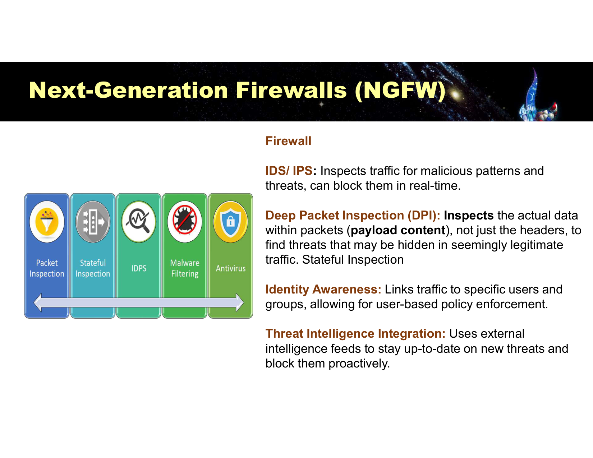

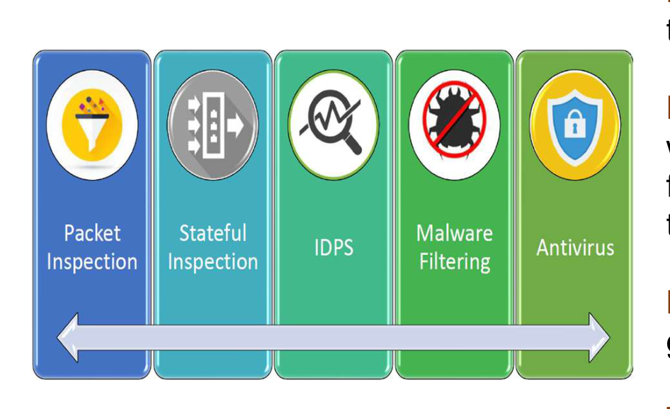

**课件配图把 NGFW 画成一个能力栈（从左到右）：**
```
Packet Inspection → Stateful Inspection → IDPS → Malware Filtering → Antivirus
```

**课件列出的五项能力：**

| 能力 | 课件原文 | 说明 |
|---|---|---|
| **Firewall** | — | 基础包过滤 |
| **IDS/IPS** | "Inspects traffic for **malicious patterns and threats**, can **block them in real-time**" | 把入侵检测/防御**集成进防火墙** |
| **Deep Packet Inspection (DPI)** | "Inspects the **actual data within packets (payload content)**, not just the headers, to find threats that may be **hidden in seemingly legitimate traffic**. Stateful Inspection" | **看 payload 内容而非只看包头**，抓藏在正常流量里的威胁 |
| **Identity Awareness** | "**Links traffic to specific users and groups**, allowing for **user-based policy enforcement**" | **把流量关联到具体的人**，实现基于用户的策略（← 不再只按 IP！） |
| **Threat Intelligence Integration** | "Uses **external intelligence feeds** to stay up-to-date on new threats and **block them proactively**" | 接外部威胁情报，**主动**拦截 |

> 🔑 **NGFW 是本课"概念 vs 产品"最好的例子：概念上是 5–6 个不同的东西，物理上是 1 台机器，License 上是 5–6 个可选模块（分开收费 💸）。**

> ⭐ **Identity Awareness 是"下一代"最有代表性的一项**：传统防火墙的规则只能写 `10.10.10.x`（IP），NGFW 能写 `财务部所有成员`（用户组）。**这是从"按位置授权"转向"按身份授权"——正是 Zero Trust 的思想在防火墙上的落地。**

---

## 31. 🔴 Multi-layer overlap cybersecurity tools / Defense in Depth（p.47）

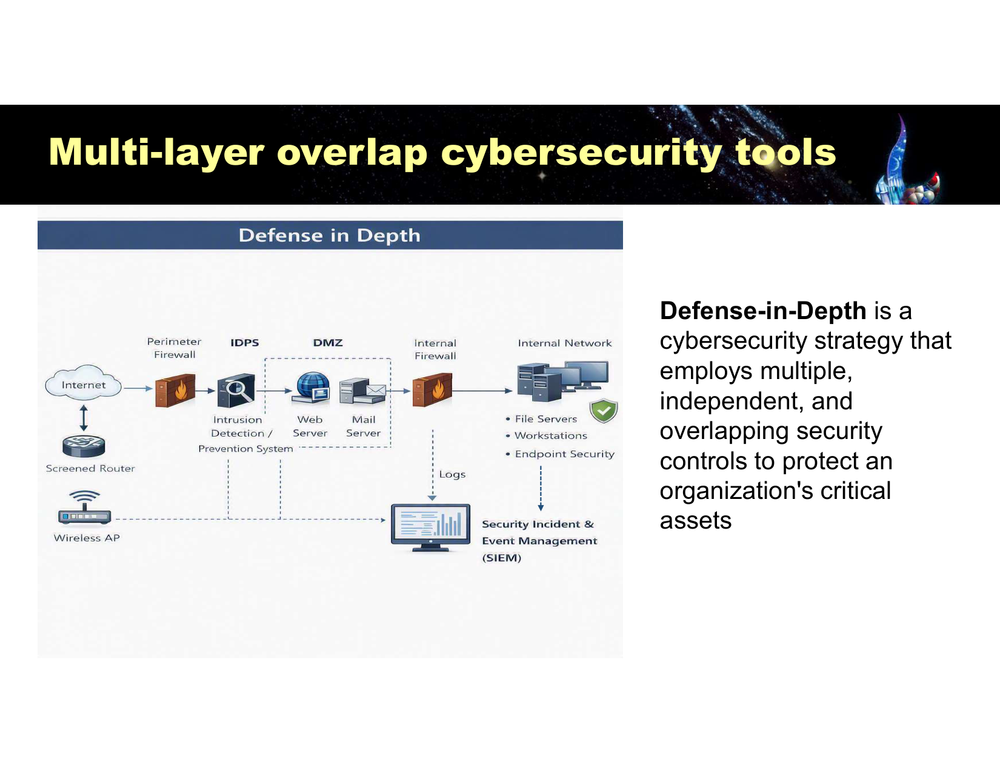

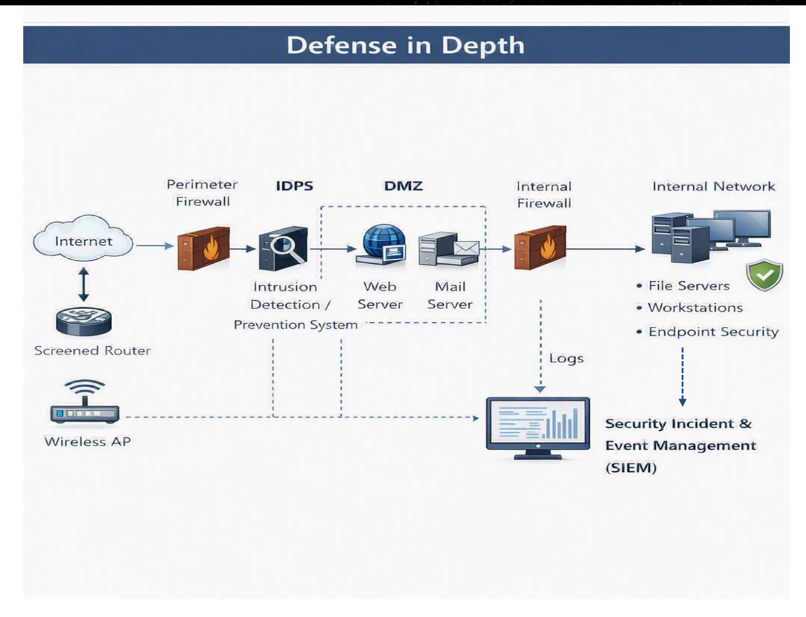

**定义（课件原文，必背）：**
> "**Defense-in-Depth** is a cybersecurity strategy that employs **multiple, independent, and overlapping security controls** to protect an organization's **critical assets**"

⚠️ **三个形容词一个都不能少**：
- **Multiple**（多重）— 不止一层
- **Independent**（独立）— 一层被绕过不影响另一层（机制不同才叫独立）
- **Overlapping**（重叠）— 覆盖范围有交叠，不留缝隙

### 🔑 这张图是全课的总集合（把前面所有工具排在了一条路径上）

```
Internet ──→ [Perimeter Firewall] ──→ [IDPS] ──→ ┌─── DMZ ───┐ ──→ [Internal Firewall] ──→ Internal Network
   ↑            边界防火墙            入侵检测/防御 │ Web Server │      内部防火墙            • File Servers
[Screened                                        │ Mail Server│                            • Workstations
 Router]                                         └────────────┘                            • Endpoint Security
                                                        │                                          │
[Wireless AP] ─ ─ ─ ─ ─ ─ ─ ─ ─ ─ ─ ─ ─ ─ ─ ─ Logs ─ ─ ─┴─ ─ ─ ─→ [ SIEM ] ←─ ─ ─ ─ ─ ─ ─ ─ ─ ─ ─ ┘
```

**读图要点（可能考"这张图体现了什么"）：**
1. **横向是纵深**：Screened Router → Perimeter Firewall → IDPS → DMZ → Internal Firewall → Endpoint Security，攻击者要**连过六关，且每关机制不同**
2. **纵向是汇聚**：所有设备的 **Logs 全部向下汇入 SIEM** —— 这就是第 29 节讲的"SIEM 吃别人产生的日志"
3. **DMZ 夹在两个防火墙中间** → 这就是 p.26 的 Screened Subnet 架构
4. **Wireless AP 也接进来了** → 提醒你无线接入也是攻击面，不能只防有线边界

> 🔑 **建议把这张图当成整份笔记的"总装图"来记。** 前面每一节讲的工具，在这张图上都有一个确定的位置。**你说的"知识点散"，这张图就是解药。**

---

## 32. 🔴 Zero Trust Architecture (ZTA) + Modern Threat Management（p.48）

**Executive Summary（课件原文）：**
> "The foundation of modern enterprise security relies on **shifting from legacy perimeter defenses** to a comprehensive **Zero Trust architecture** and **AI-driven Threat Management Lifecycle** to address gaps and **automate responses**."

> ⚠️ **注意这是 ZTA 在本课的第二次出现。** p.10 讲的是**三原则**（Never Trust / Least Privilege / Assume Breach），这一页讲的是**如何落地（Operationalizing）**。两页要一起答。

### 🔴 Operationalizing Zero Trust：四个 "Right"

| | 课件原文 | 中文 | 涉及的缩写 |
|---|---|---|---|
| **Right Users**<br>对的人 | "Secure **identity governance**, **behavioral analytics**, and **privileged access management (PAM)** to **mitigate insider threats**" | 身份治理 + 行为分析 + 特权访问管理，用于**缓解内部威胁** | **PAM** |
| **Right Authentication**<br>对的验证 | "Implement **Multiple-Factor Authentication (MFA)**, **Dynamic risk scoring** based on **user, device, time and geolocation**" | 多因素认证 + **动态风险评分**（依据用户/设备/时间/地理位置） | **MFA** |
| **Right Data**<br>对的数据 | "**Categorize sensitive data**, **end-to-end encryption**, and real-time **Data Activity Monitoring (DAM)**" | 敏感数据分级 + 端到端加密 + 实时数据活动监控 | **DAM** |
| **Right Reason**<br>对的理由 | "Maintain **cloud access auditing**, proactive **fraud detection**, **configuration management**" | 云访问审计 + 主动欺诈检测 + 配置管理 | — |

**四个缩写的解释：**

- **PAM — Privileged Access Management（特权访问管理）**
  专门管**管理员账号**（root、Domain Admin）。这些账号权力太大，被盗 = 全盘失守。做法：权限**按需临时授予、用完即收、全程录屏审计**。课件说它用来 **mitigate insider threats**。

- **MFA — Multi-Factor Authentication** → 见第 4 节

- **Dynamic risk scoring（动态风险评分）** ⭐
  不是"密码对了就放行"，而是综合判断：Mary 平时在香港用公司笔记本上午登录 → 低风险直接放行；同一账号凌晨从巴西用陌生设备登录 → 高风险，要求额外 MFA 或直接拒绝。
  > 🔑 **注意它依据的四个因子 "user, device, time and geolocation"，正好对应 p.8 Authorization 定义里的 "if, when, and from where"。前后完全呼应。**

- **DAM — Data Activity Monitoring（数据活动监控）**
  实时盯着**谁在动数据库里的敏感数据**——查了什么、导出多少。呼应 IDPS Benefits ③ 的 data exfiltration。

---

## 33. 🔴 Accelerating Detection, Validation, and Automated Incident Response（p.49）

**这一页给了一个三阶段框架 FIND → CONFIRM → FIX，把整个后半段的工具串起来了。**

| 阶段 | 标题 | 课件内容 | 痛点数据 |
|---|---|---|---|
| **01 FIND**<br>发现 | **Real-Time Detection** | "Transitioning from **static log/SIEM architectures** to **active Behavioral analysis**:"<br>• **Real-Time Network Flow Analytics** identifies anomalies instantly<br>• **User Behavior Analytics (UBA)** flags **baseline deviations** | **1M+ DAILY FEEDS**<br>每天百万条情报，人看不完 |
| **02 CONFIRM**<br>确认 | **AI-Driven Validation** | "Eliminating **blind spots** and **high-volume manual searches** via **A.I. Triage**"<br>"AI automates ingestion to eliminate **manual search fatigue**" | **20% INTEL INDEXED**<br>只有 20% 的情报被真正索引利用 → **80% 是盲区** |
| **03 FIX**<br>修复 | **Automated Response** | "Resolving critical **playbook gaps** and accelerating active incident mitigation:"<br>"Deploying **Cyber drills exercise** and **automated Incident Response Playbook (SOAR)** across the organization (**cross-department**) level" | **75% LACK PLAYBOOKS**<br>四分之三的组织**没有事先写好的响应剧本** |

**三个关键词解释：**

- **UBA — User Behavior Analytics（用户行为分析）**
  > 🔑 **这就是 p.37 的 Anomaly-Based Detection，只不过基线建在"人"身上而不是"流量"上**——学出每个员工的正常行为模式，偏离就告警。**抓内鬼的主力。**

- **A.I. Triage（AI 分诊）**
  Triage 原本是急诊室的"分诊"——把病人按紧急程度排序。这里指 **AI 自动给海量告警排优先级**，解决 "manual search fatigue"。

- **Cyber Drills（网络攻防演练）+ cross-department**
  ⭐ 课件特别强调 playbook 要**跨部门**推行，并配合演练。**因为真实的安全事件从来不只是 IT 部门的事**——要通知法务、公关、监管、客户。**光写了剧本不演练，出事时照样乱。这是很典型的 ISOM 答题点。**

> **考点**：这三个数字（**1M+ / 20% / 75%**）是教授用来论证"为什么需要 AI 和 SOAR"的**证据**。
> 论证结构是：**数据太多（1M+）→ 人处理不过来 → 大部分成了盲区（20%）→ 就算发现了也没有标准处置流程（75%）→ 所以必须 AI 分诊 + SOAR 自动化。**
> 简答题问"为什么现代 SOC 需要 AI/自动化"，**直接用这条链 + 这三个数字**。

---

## 34. 🔴 SOC / XDR / SOAR / AI SOC（p.50–55）

> ⚠️ **p.50、52、53、54 是四张几乎一样的 Microsoft Reference Architecture 图，教授在逐张叠加新组件。这个"逐层叠加"的顺序本身就是知识点。**

### 演进阶梯（课件的页顺序）

```
p.50  SOC（基础）              Raw Data → Classic SIEM → Analysts and Hunters
        ↓ 加入 XDR + 威胁情报
p.52  SOC with XDR & Threat Intelligence    多了 XDR 层 + Microsoft Threat Intelligence + API Integration
        ↓ 加入 SOAR
p.53  SOAR                                  多了 "SOAR reduces analyst effort/time per incident,
                                                     increasing SecOps capacity"
        ↓ 加入 A.I. + 专家支援
p.54  SOC with XDR, SOAR and A.I.           多了 ML & AI、UEBA、Security Copilot、Managed Security Ops
        ↓
p.55  AI SOC 案例（CITIC TrustCSI 3.0）
```

### 🔵 SOC — Security Operation Centre（p.50）

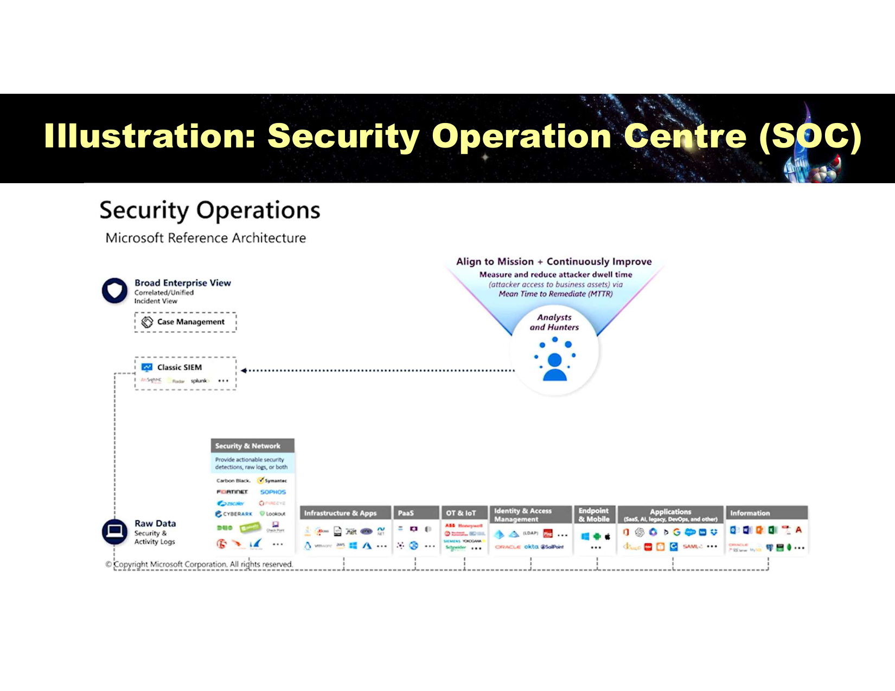

**定义：一个团队 + 一套流程 + 一个指挥中心，7×24 监控、分析、响应安全事件。**

⚠️ **SOC 不是软件，是组织。** 这是最关键的一点。

| 组成 | 内容 |
|---|---|
| **人** | 图中的 **"Analysts and Hunters"**（分析师与威胁猎人）。实务分 L1（初筛）→ L2（深入调查）→ L3（威胁狩猎/取证）→ SOC Manager |
| **流程** | 图中的 **Case Management**（案件管理）、告警分级、升级路径、事后复盘 |
| **技术** | 图中的 **Classic SIEM** 是核心平台，下面接 **Raw Data (Security & Activity Logs)** |

**图中还有一个重要指标（p.50 右上）：**
> "Align to Mission + Continuously Improve — Measure and reduce **attacker dwell time** (attacker access to business assets) via **Mean Time to Remediate (MTTR)**"

- **Dwell Time（驻留时间）** = 攻击者从进入到被发现之间的时长。**这是衡量 SOC 好坏最核心的指标**——呼应 IDPS Benefits ① 的"早期发现 → 减少损失"。
- **MTTR（Mean Time to Remediate，平均修复时间）** = 从发现到处置完成的平均时长。

> 🔑 **SOC 是消防局 🚒（有人、有制度、有值班表）；SIEM 是消防局里的火警监控大屏 🖥️。**

**课件提到的两个延伸（p.55）：**
- **SOC-as-a-Service**：自建 SOC 太贵（要养 3 班倒的团队），中小企业**外包**给电信商/安全厂商 —— CITIC TrustCSI 案例
- **Red/Blue Synergy**：**红队**（攻击方，模拟黑客）vs **蓝队**（防守方，即 SOC），互相对抗演练来检验防御是否真的有效
- **Dual SIEM**：案例中提到用**两套 SIEM**（互为冗余/交叉验证）

### 🟣 XDR — eXtended Detection and Response（p.51–52）

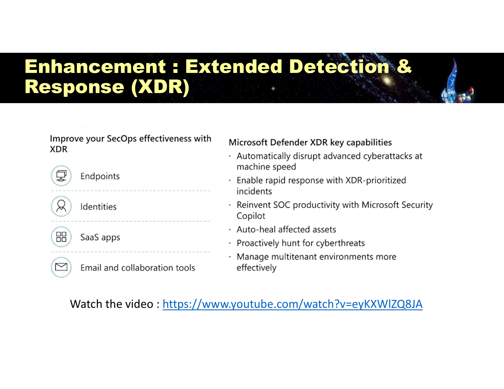

课件标题是 **"Enhancement: Extended Detection & Response (XDR)"** —— 关键词是 **Enhancement（增强）**，它是**从 EDR 扩展出来的**。

```
EDR  = Endpoint Detection & Response     只看【端点】
              ↓  扩展（X = eXtended）
XDR  = eXtended Detection & Response     看【端点 + 身份 + SaaS 应用 + 邮件/协作 + 云 + 网络】
```

**课件配图列出 XDR 覆盖的四个面（"Improve your SecOps effectiveness with XDR"）：**
**Endpoints ｜ Identities ｜ SaaS apps ｜ Email and collaboration tools**

**Microsoft Defender XDR key capabilities（课件原文）：**
- Automatically **disrupt** advanced cyberattacks **at machine speed**（机器速度自动阻断）
- Enable rapid response with **XDR-prioritized incidents**（自动排优先级）
- Reinvent SOC productivity with **Microsoft Security Copilot**（AI 助手）
- **Auto-heal** affected assets（自动修复受影响资产）
- **Proactively hunt** for cyberthreats（主动威胁狩猎）
- Manage **multitenant** environments more effectively

**它解决什么问题？** 单看 EDR：某台笔记本运行了个奇怪脚本 → 可能是 IT 在装软件，判断不了。XDR 把多个面**天然关联**起来：
```
邮件网关：Mary 收到带附件的外部邮件
   ↓
EDR：Mary 的电脑执行了附件，起了 PowerShell
   ↓
网络：该电脑开始扫描内网 50 台主机
   ↓
身份：Mary 的账号在另一台服务器登录成功
   → XDR 自动串成完整攻击链，一个告警，并可【自动隔离该电脑】
```

### 🔴 XDR vs SIEM（最容易混，高频考点）

| | **SIEM** | **XDR** |
|---|---|---|
| **数据来源** | **任何设备的日志**（厂商中立，什么都能收） | **自家产品栈的原生遥测数据**（深度绑定） |
| **数据形态** | 日志（log），要自己**归一化 + 写关联规则** | 原生结构化数据，**开箱即用、预置关联** |
| **能否响应** | ❌ 传统 SIEM 只告警 | ✅ **能直接采取行动**（隔离主机、封账号、auto-heal） |
| **合规存证** | ✅ **强项**（长期日志留存） | ⚠️ 不是重点 |
| **部署难度** | 高（要大量调优） | 较低（厂商调好的） |
| **主要局限** | 需要人写规则、告警多 | **锁定单一厂商（vendor lock-in）** |

> 🔑 **SIEM 是"什么日志都收的大杂烩，但要你自己调"；XDR 是"厂商配好的套餐，开箱能用还能动手，但只能吃这一家的菜"。**
>
> 💡 **注意 p.52 图中 SIEM 和 XDR 之间画的是 "API Integration"** —— 说明现实中**两者并存互补**，不是二选一。

### 🟠 SOAR — Security Orchestration, Automation & Remediation（p.53）

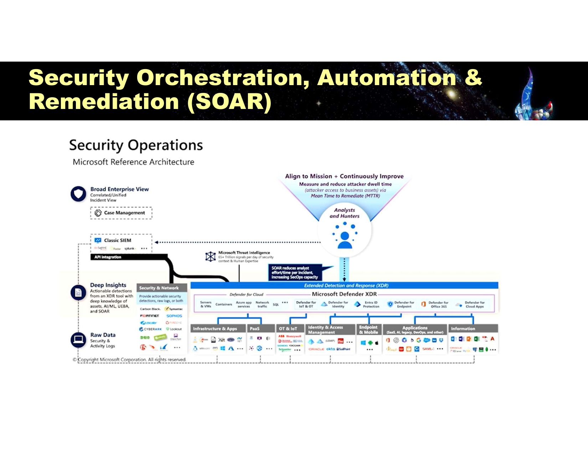

> ⚠️ **课件写的是 Remediation（修复）**，业界通用写法是 **Response（响应）**。**考试按课件写 Remediation**，但知道另一说法。

**图中新增的关键批注（p.53 的唯一新增内容）：**
> **"SOAR reduces analyst effort/time per incident, increasing SecOps capacity"**
> （SOAR 降低每起事件的分析师投入与耗时，从而提升安全运营的产能）

**拆解三个词：**

| 词 | 含义 | 例子 |
|---|---|---|
| **Orchestration**（编排） | 把**互不相通的安全工具用 API 串起来**协同工作 | 让 SIEM 的告警自动去查威胁情报库，再去命令防火墙 |
| **Automation**（自动化） | 把分析师**重复的机械动作**交给机器 | 查 IP 信誉、拉相关日志、发工单、通知负责人 |
| **Remediation / Response**（处置） | 按预设的 **Playbook（剧本）** 自动执行处置 | 封 IP、隔离主机、禁用账号、删除恶意邮件 |

**什么是 Playbook？** = 事先写好的"遇到 X 情况，按 1-2-3-4 步处理"的自动化剧本。

**钓鱼邮件 Playbook 实例：**
```
触发：用户举报一封可疑邮件
 ① 自动提取邮件里的 URL 和附件哈希
 ② 自动查威胁情报库 → 确认是已知恶意
 ③ 自动搜全公司邮箱 → 发现另有 47 人收到同一封
 ④ 自动从这 47 个邮箱中删除该邮件
 ⑤ 自动在防火墙封掉那个 URL
 ⑥ 自动开工单 + 通知这 48 人
 全程 30 秒，零人工（人工做要 2 小时）
```
> **这就是 SOAR 的价值：把 MTTR 从小时级压到秒级。**

### 🤖 SOC with XDR, SOAR and A.I.（p.54）—— 最终形态

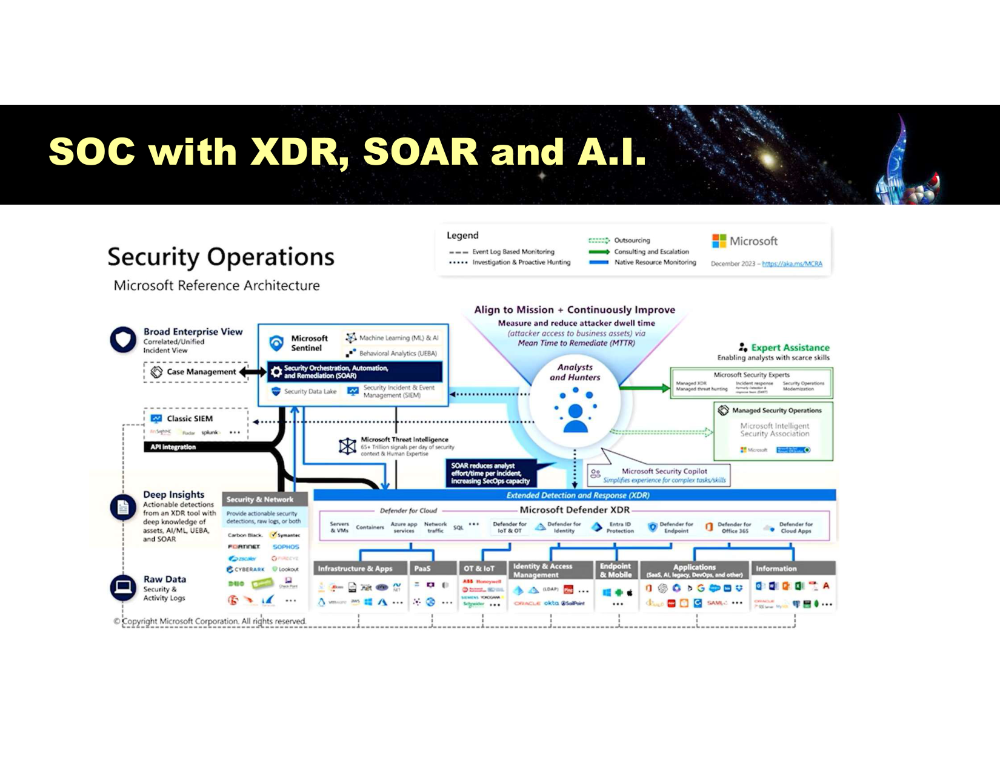

**这张图在 p.53 基础上新增了（读图重点）：**
- **Microsoft Sentinel** 方框，里面包含四个组件：**Machine Learning (ML) & AI**、**Behavioral Analytics (UEBA)**、**Security Orchestration, Automation, and Remediation (SOAR)**、**Security Incident & Event Management (SIEM)**、Security Data Lake
  > 🔑 **注意：SIEM 和 SOAR 被画在同一个产品框里** —— 印证了第 26 节讲的"概念是分开的，产品是打包的"
- **Microsoft Security Copilot** — "Simplifies experience for complex tasks/skills"（AI 助手降低技能门槛）
- **Expert Assistance / Managed Security Operations** — "Enabling analysts with **scarce skills**"（外部专家支援，应对**人才短缺**）
- **图例（Legend）**说明了四种连线：Event Log Based Monitoring｜Investigation & Proactive Hunting｜**Outsourcing**｜Consulting and Escalation｜Native Resource Monitoring

> ⭐ **"Expert Assistance / Outsourcing / scarce skills" 这几个词是 ISOM 的落点**：现代 SOC 的瓶颈**不是技术，是人**（呼应 Lec 1 的人才缺口）。所以要么用 AI 降低门槛，要么外包（SOC-as-a-Service）。

### 🔴 SIEM / XDR / SOAR / SOC 四者关系（必考）

| | 一句话 | 在 P+D+R 里 | 是什么 |
|---|---|---|---|
| **SIEM** | "把所有日志收进来，找出哪里不对" | **D** | 平台（软件/云服务） |
| **XDR** | "跨端点/身份/邮件/云把攻击链串起来，还能动手" | **D + R** | 平台（厂商产品栈） |
| **SOAR** | "发现之后，自动按 playbook 处置" | **R** | 平台（自动化编排） |
| **SOC** | "谁来运营这一切" | **全流程 + 治理** | **组织（人 + 流程）** ⭐ |

**流水线视角（对应 p.49 的 FIND → CONFIRM → FIX）：**
```
SIEM / XDR 发现问题  →  A.I. 帮忙分诊验证  →  SOAR 自动执行处置  →  SOC 团队兜底与改进
   (FIND / D)              (CONFIRM)            (FIX / R)              (治理)
```

---

## 35. 🔴 HoneyPots & HoneyNets（蜜罐与蜜网，p.57–59）

### 定义（p.58 原文）

> **HoneyPot**: "An **application** that **entices** people who are **illegally perusing** the internal areas of a network by providing **simulated rich content** while the software **notifies the administrator** of the intrusion"
>
> **HoneyNet**: "A **monitored network** that contains **multiple honeypot systems**, to detect intrusion"
>
> 共同定位：**"Designed to distract or mislead attackers away from actual critical systems (Decoy System)"**

**翻译：一个专门"钓鱼执法"的假系统**——它假装自己很有价值，引诱已经溜进内网的攻击者上钩，一旦有人碰它就立刻通知管理员。

### ⭐ 它的精妙之处：思路是反过来的（最值得理解的一点）

**前面所有工具（IDS、SIEM、防火墙）面对的都是同一个难题**：在混杂着大量正常流量的洪流里判断哪些是坏的 → 所以永远逃不掉 **False Positive / False Negative** 的权衡。

**蜜罐直接绕开了这个难题：**
> 蜜罐是一台**没有任何正常业务、任何人都没有理由去访问的机器**。
> 所以——**任何对它的访问，按定义就是可疑的。**

```
正常员工：完全不知道这台机器存在，永远不会碰它
攻击者  ：溜进内网后到处摸索，看到"客户名单_完整版.xlsx"，兴奋地扑上去 → 🚨
```

> 🔑 **考点级洞察：蜜罐的 False Positive 接近于零。**
> 它不需要 signature 库、不需要建 baseline、不需要 tuning、不需要 clipping level。
> **它不判断"这个行为像不像攻击"，它只判断"有没有人碰了不该碰的东西"。**
> —— 这一点能直接连回 p.36 的术语页，是很好的论述加分点。

**"Simulated rich content" 长什么样**：假文件（`工资表_2026.xlsx`）、假服务器（故意开弱密码、装老版本软件）、假账号（AD 里放个从没人用的 `backup_admin`）、**假凭证（Canary Token：在代码仓库里埋一把假的 AWS 密钥，谁一拿去用立刻告警）**。

### 🔴 三个设计目的（p.59，课件明确列出，要背）

| 目的 | 课件原文 | 含义 |
|---|---|---|
| **① Divert（引开）** | "**Divert** an attacker from accessing **critical systems**" | 把攻击者从**真正的关键系统**引开——他忙着挖假金矿，真金矿就安全了 |
| **② Collect（收集情报）** | "**Collect information** about the attacker's **activity**" | 观察他用什么工具、什么手法、什么漏洞。**这是唯一能获得真实攻击手法（TTP）的途径** |
| **③ Delay（拖延）** | "**Encourage the attacker to stay** on a system **long enough** for administrators to **document** the event and perhaps **respond**" | **拖住他**，争取时间取证、记录、准备反制 |

> ⚠️ **注意第 ③ 条的措辞很妙："encourage the attacker to stay"——不是赶他走，而是留住他。**
> 这三点合起来说明：**蜜罐是唯一一个"主动欺骗攻击者"的安全工具。别的工具在防守，蜜罐在误导（mislead）。**

### 🔴 课件那句 "Any Potential Issues?"（p.59 讨论题，高概率考）

| # | 问题 | 说明 |
|---|---|---|
| **1** | ⚖️ **法律与伦理风险** | **诱捕（Entrapment）争议**——你是在"引诱"别人犯罪吗？不同司法辖区认定不同；记录攻击者活动可能涉及**隐私法**；蜜罐取得的证据在法庭上**未必被采纳** |
| **2** | 🔴 **被反向利用（最实际的风险）** | 蜜罐**本身就是一台真机器**。攻陷它之后可以拿它当**跳板**攻击你内网的其他真系统，或**攻击外部第三方** → 别人追查过来源头是**你公司的 IP** → 你可能承担**下游责任（downstream liability）** |
| **3** | 🎭 **老练攻击者能识别它** | 存在 **anti-honeypot / fingerprinting** 技术（检测虚拟化痕迹、环境不真实）。识破后会直接避开（蜜罐白装），更糟的是**故意喂你假情报**，让你的防御往错误方向调 |
| **4** | 👁️ **覆盖面极其有限** | **它只能看到"主动来碰它"的攻击者。** 从别的路径进来、直奔真目标的攻击，蜜罐**完全看不见** → **蜜罐是补充，绝不能替代 IDPS/防火墙**（呼应 Defense-in-Depth） |
| **5** | 💸 **成本与 ROI 难论证** | 要做得逼真需要持续投入，而它**不产生任何直接防护效果**（不挡任何攻击）。向管理层解释"我们花钱建了个假系统，它什么都不保护"——很难（呼应 IDPS Benefits ② 的困境） |

> **HoneyPot vs HoneyNet 的区别，以及为什么要一整张网**：
> 一台孤零零的机器**很假**。真实的公司网络里，机器之间会互相通信、有域控、有文件服务器。老练的攻击者一看"这个网段就一台机器，还傻乎乎开着弱密码"→ **立刻起疑掉头就走**。
> **HoneyNet 模拟出一整个逼真的网络环境**，让攻击者相信自己真的进了内网，从而愿意深入活动 → 收集到的情报更完整。

---

## 36. 🔴 Summary: Security Controls Strategy（p.60）——**整课的收束页，必背**

| 策略 | 课件原文 | 中文 | 本课对应 |
|---|---|---|---|
| **IAM — Least Privilege**<br>身份权限管理 — 最小权限 | "Users and systems are granted **only the essential access needed for their specific roles**. **Contain damages** and **limit lateral movement** during compromise" | 只给完成本职工作所必需的最小权限；**遏制损害、限制横向移动** | RBAC/TBAC (p.9)、ZTA 三原则 (p.10)、PAM (p.48) |
| **Defense in Depth Strategy**<br>纵深防御 | "Employs **multiple, independent, and overlapping** security controls to protect an organization's **critical assets**" | 多重、独立、重叠的控制 | Screened Subnet (p.26)、Multi-layer 图 (p.47)、三种检测法并用 (p.37) |
| **Fail-Safe Defaults / Zero-Trust**<br>安全默认值 / 零信任 | "**Access is denied by default unless explicitly permitted** to enhance security" | **默认拒绝**，除非明确允许 | 规则表最后一条 `Any Any Deny` (p.18)、Proxy 天然 default-deny (p.21)、ZTA (p.10/48) |
| **Simplicity and Auditability**<br>简洁性与可审计性 | "**Simple configurations reduce errors**; **auditability** allows **tracking and reviewing firewall activities**" | 配置越简单越不易出错；一切可审计可追溯 | 规则表顺序 (p.18)、IDPS 日志取证 (p.35)、SIEM 存证 (p.44) |

> ⭐ **"Lateral movement（横向移动）" 是高频考点**：攻击者攻陷一台低价值机器后，**在内网里横向扩散**去找高价值目标。**最小权限就是为了掐断这条路。**

> ⭐ **"Simplicity" 这条最容易被忽略，但很重要**：**复杂的防火墙规则集本身就是安全风险**——规则越多越容易写错、越容易留下自己都没意识到的口子。**"更多的安全控制" ≠ "更安全"。** 这是很好的 Management 卷论点。

> **英文模范答句（总结全课）**：
> *"Effective security is not a single control but a strategy: grant only the minimum privilege needed so that a compromise cannot spread laterally; layer multiple independent and overlapping controls so that no single failure is fatal; deny by default so that anything not explicitly permitted cannot pass; and keep configurations simple and auditable, because complexity itself is a source of error."*

---

# 第七部分：混淆概念专区 & 备考工具

## 37. 🔴🔴 概念混淆对照专区（本节请单独复习一遍）

> 你说"都是概念、串不起来"——**真正会丢分的地方不是记不住某个定义，而是把两个长得像的定义搞混。** 下面把本课所有易混对全部列出。

### 37.1 ⭐ Stateless vs Stateful vs Proxy（三种防火墙）

| | **Stateless** | **Stateful** | **Application Proxy** |
|---|---|---|---|
| 别名 | Static Packet Filtering | Stateful/SPI Inspection | Application-Level Gateway (ALG) |
| **OSI 层** | **L3** | **L3–L4** | **L5–L7** |
| 看什么 | 包头（IP/端口/协议） | 包头 + **连接状态** + 内容 | **完整应用层内容** |
| 记忆 | 只看这一个包长什么样 | 还**记得**这个包属于哪场对话 | 把连接**切成两段**，代你转达 |
| 速度 | 最快 | 中 | **最慢** |
| 安全 | 最弱 | 中 | **最强** |

### 37.2 ⭐ Stateful **Firewall** vs Stateful **Protocol Analysis**（最阴险的一对）

| | **Stateful Firewall**（p.19） | **Stateful Protocol Analysis**（p.37） |
|---|---|---|
| 属于 | **防火墙** | **IDPS 的检测方法** |
| 追踪什么 | **连接**是否存在（state table） | **协议会话**走到哪个阶段 |
| 在问 | "这个包属于已建立的连接吗？" | "这一步符合协议规范吗？" |
| 别名 | SPI | **DPI（Deep Packet Inspection）** |

> **两个都叫 "Stateful" 但完全不是一回事。** 看到题目问 stateful，先看它在问防火墙还是 IDPS。

### 37.3 ⭐ Screened Host vs Screened Subnet

**唯一核心区别：堡垒主机有没有被隔离在独立的 DMZ 子网里。**

| | Screened **Host** | Screened **Subnet (DMZ)** |
|---|---|---|
| 堡垒主机在哪 | 挂在**内网**上 | 独立的 **DMZ 子网** |
| 过滤路由器 | 通常 1 个 | **2 个**（External + Internal） |
| 被攻陷后果 | 😱 攻击者**已在内网** | 😌 攻击者**只在 DMZ** |

**再加一条：DMZ（区域/子网）≠ Bastion Host（一台机器）。**

### 37.4 ⭐ Firewall vs IDS vs IPS

| | **Firewall** | **IDS** | **IPS** |
|---|---|---|---|
| 角色 | 门锁 🔒 | 监控摄像头 📹 | 会动手的保安 🚨 |
| P/D/R | **P** | **D** | **D + R** |
| 位置 | Inline 串接 | **Out-of-band 旁路** | **Inline 串接** |
| 能阻断 | ✅ | ❌ **只告警** | ✅ |
| 依据 | **规则**（allow/deny） | **检测方法**（特征/异常/协议） | 同 IDS |
| 它挂了 | 🔴 全网断 | 🟢 业务不受影响 | 🔴 全网断 |

> 🔑 **IDS 和 IPS 常常是同一套软件，区别在"部署位置 + 是否允许它动手"。**

### 37.5 ⭐ False Positive vs False Negative vs Noise vs True Positive

| | 系统报警了 | 系统没报警 |
|---|---|---|
| **真有攻击** | **True Positive** ✅ | **False Negative** ☠️ 最严重 |
| **没有攻击** | **False Positive** | **True Negative** |

**外加 Noise = 报警准确（真发生了）但无威胁。** 它**不是** False Positive。

> **口诀：Positive/Negative 说"系统报没报"；True/False 说"系统对不对"。**

### 37.6 ⭐ Signature vs Anomaly vs SPA（三种检测方法）

**参照物不同：已知的【坏】｜自学的【正常】｜厂商给的【协议规范】**

| | Signature | Anomaly | SPA |
|---|---|---|---|
| 别名 | Misuse Detection | Behavior-Based | **DPI** |
| 抓未知攻击 | ❌ | ✅ | ✅ |
| 主要误差 | **漏报 FN** | **误报 FP** | 两者 + 影响可用性 |
| 关键词 | signature database | **clipping level** | **protocol vendors** |

### 37.7 ⭐ SIEM vs XDR vs SOAR vs SOC

| | 干什么 | 是什么 | P/D/R |
|---|---|---|---|
| **SIEM** | 收全部日志做关联分析 | 平台 | D |
| **XDR** | 跨域原生遥测 + 能响应 | 平台（厂商栈） | D+R |
| **SOAR** | 按 playbook 自动处置 | 平台（编排） | R |
| **SOC** | 运营这一切 | **组织（人+流程）** | 全流程 |

**再加：EDR（只看端点）→ XDR（扩展到端点+身份+邮件+云）。X = eXtended。**

### 37.8 ⭐ Tunnel Mode vs Transport Mode（VPN）

| | **Tunnel Mode** | **Transport Mode** |
|---|---|---|
| 加密范围 | **整个 IP 包，含包头** | **只加密 payload** |
| 原 IP 头 | 被加密 + 外层新封装 | **保持原样不加密** |
| 课件场景 | 站点到站点 | **Remote Access to Office** ⚠️ |

### 37.9 ⭐ Authentication vs Authorization

| | **Authentication（认证）** | **Authorization（授权）** |
|---|---|---|
| 问什么 | **你是谁？** | **你能做什么？** |
| 手段 | 密码、MFA、生物识别 | 权限、角色、DAC/MAC/RBAC |
| 课件页 | p.5–7 | p.8–9 |
| 顺序 | **先** | **后** |

### 37.10 ⭐ Discretionary vs Nondiscretionary vs Mandatory vs RBAC（层级不能拍平！）

```
Access Control
 ├─ Nondiscretionary（组织控制）
 │    └─ Lattice-based
 │         ├─ Mandatory (MAC)
 │         └─ Role-based / Task-based
 └─ Discretionary（用户控制）
```
> **Mandatory 和 RBAC 都在 Nondiscretionary 之下，不与 Discretionary 并列。**

### 37.11 ⭐ Intrusion vs Incident

**Intrusion = 外部的行为（撬锁，撬了没开也算）｜Incident = 造成的后果（真的违反了策略/造成影响）。**
入侵被挡住 ≠ incident；很多 incident（误删、丢笔记本）根本不是 intrusion。

### 37.12 ⭐ Network-based vs Host-based（这个二分在本课出现了两次）

| | **Network-based** | **Host-based** |
|---|---|---|
| **Firewall**（p.13） | 网络边界，粗粒度，护全网 | 装在单机，**granular**，护端点 |
| **IDPS**（p.33） | 看 **packets on network** 的异常模式 | 看 **files stored on host** 的变更 + 用户行为 |
| 共同结论 | **We need Both** —— defense-in-depth | |

### 37.13 ⭐ CIA 的两个版本（陷阱）

| | Lec 1 的 CIA | **本课 VPN 的 CIA（p.29）** |
|---|---|---|
| C | Confidentiality | Confidentiality |
| I | Integrity | Integrity |
| **A** | **Availability** | 🔴 **Authentication** |

> **VPN 那页的 A 是 Authentication，不是 Availability。**

### 37.14 ⭐ 概念 vs 产品（回答"这些都是概念吗？"）

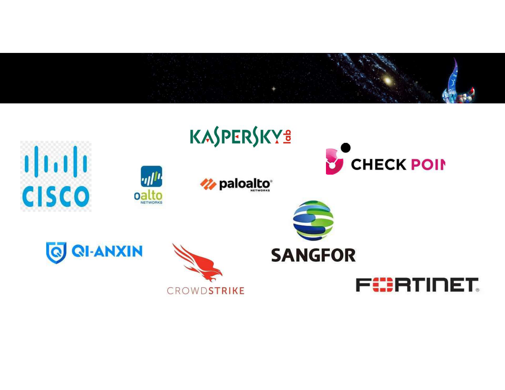

> 课件 **p.56 是一整页安全厂商 logo**（Cisco、Palo Alto、Check Point、Fortinet、Kaspersky、CrowdStrike、Sangfor、QI-ANXIN）——**这一页的存在本身就在说：上面这些概念，市场上都是由具体厂商的产品来实现的。**

**结论：Firewall / IDPS / IPS / SIEM / XDR 都是「功能定义」，不是产品形态。**

- 课件 p.12 已经明说：防火墙 "**Can be hardware, software, or a hybrid**"
- 同一个功能可以是：**专用硬件设备 / 纯软件 / Agent / 虚拟设备 / 云服务（SaaS）**
- 反过来，**一台 NGFW 同时实现了包过滤 + 状态检测 + IDPS + DPI + 身份识别 + 威胁情报**（p.46）；p.54 图里 **SIEM 和 SOAR 被画在同一个产品框（Microsoft Sentinel）里**
- **SOC 甚至根本不是软硬件，它是组织架构**

> 🔑 **真正有实质区别的不是"软件还是硬件"，而是「它串在流量路径上（inline），还是只在旁边看（out-of-band）」——这决定了它能不能阻断，以及它出故障时会不会拖垮业务。**
>
> | | 位置 | 能阻断 | 它挂了 |
> |---|---|---|---|
> | Firewall / IPS | **Inline** | ✅ | 🔴 全网断 |
> | IDS | **旁路** | ❌ | 🟢 业务无影响 |
> | SIEM | **完全离线**（只收日志） | ❌ | 🟢 业务无感 |
>
> 这也解释了：为什么 SPA 的缺点是 "may interfere with normal protocol operations under load"（它串在路径上）；为什么 Active IPS 的误报特别可怕（它真的会掐断连接）。

---

## 38. 🔴 综合缩写速查表

| 缩写 | 全称 | 中文 / 一句话 |
|---|---|---|
| **MFA** | Multi-Factor Authentication | 多因素认证：know / have / are 三类，**必须跨类别** |
| **DAC** | Discretionary Access Control | 自主访问控制，**由用户决定** |
| **MAC** | Mandatory Access Control | 强制访问控制，**系统按密级标签强制裁决** |
| **RBAC / TBAC** | Role-Based / Task-Based Access Control | 按角色 / 按任务授权 |
| **IAM** | Identity & Access Management | 身份与权限管理（配合 Least Privilege） |
| **PAM** | Privileged Access Management | 特权访问管理（专管管理员账号） |
| **ZTA** | Zero Trust Architecture | 零信任架构：Never Trust, Always Verify |
| **DMZ** | Demilitarized Zone | 非军事区：内外网之间的缓冲子网 |
| **SPI** | Stateful Packet Inspection | 状态包检测（防火墙，L3–L4） |
| **ALG** | Application-Level Gateway | 应用层网关 = Application Layer Proxy Firewall |
| **NGFW** | Next-Generation Firewall | 下一代防火墙 = FW + IPS + DPI + 身份识别 + 威胁情报 |
| **OSI** | Open System Interconnection | 七层网络模型 |
| **VPN** | Virtual Private Network | 虚拟专用网 |
| **IPSec** | Internet Protocol Security | VPN 常用协议（Tunnel / Transport 两种模式） |
| **IDS** | Intrusion Detection System | 入侵检测：发现**并告警** |
| **IPS** | Intrusion Prevention System | 入侵防御：发现**并自动阻断** |
| **IDPS** | Intrusion Detection & Prevention System | 上面两者合称 |
| **NIDS / HIDS** | Network- / Host-based IDS | 看网络流量 / 看单台主机 |
| **SPA** | Stateful Protocol Analysis | 按**协议规范**判断（= DPI），IDPS 检测方法之一 |
| **DPI** | Deep Packet Inspection | 深度包检测：看 payload 内容而非只看包头 |
| **EDR** | **Endpoint** Detection & Response | 端点检测与响应（Agent 软件） |
| **XDR** | e**X**tended Detection & Response | 扩展检测与响应：端点+身份+SaaS+邮件+云 |
| **SIEM** | Security Information & Event Management | 汇总全公司日志做**关联分析** |
| **SIM / SEM** | Security Information / Event Management | SIEM 的两半：长期存证 / 实时告警 |
| **SOC** | Security Operation Centre | 安全运营中心（**人 + 流程 + 平台**） |
| **SOAR** | Security Orchestration, Automation & **Remediation** | 按 **Playbook 自动处置**（课件用 Remediation） |
| **UBA / UEBA** | (User and Entity) Behavior Analytics | 用户（与实体）行为分析：基线偏离检测 |
| **DAM** | Data Activity Monitoring | 数据活动监控 |
| **MTTR** | Mean Time to Remediate | 平均修复时间（SOC 核心指标） |
| **Dwell Time** | — | 攻击者驻留时间（从进入到被发现） |
| **TCO** | Total Cost of Ownership | 总拥有成本（Case Study 用得上） |
| **NIST SP** | NIST Special Publication | 美国标准文件（SP 800-94 IDPS；SP 800-207 ZTA） |

---

## 39. 🔴 课件原题（p.22, p.63–65）+ 答案与解析

### Quick Recap #1（p.22）
> `_____ inspection firewalls keep track of each network connection between internal and external systems using a state table.`
> a. Static　b. Dynamic　**c. Stateful** ✅　d. Stateless
>
> **解析**：定义直接对应 p.19。⚠️ 干扰项 **b. Dynamic** 很强，因为课件原文就有 "**dynamic** state table"——但那是形容 table 的词，**技术本身叫 Stateful Inspection**。

### Multiple Choice #1（p.63）
> Under MFA, a system that requires users to enter a **passcode** and then verifies that their **face** matches a photo stored in the system. What 2 factors is it using?
> A. know + have　B. have + know　C. have + are　**D. know + are** ✅
>
> **解析**：passcode = Something you **know**；face = Something you **are**。
> ⚠️ **A 和 B 是同一个答案换顺序 → 必定都不是答案**，直接在 C、D 里选。

### Multiple Choice #2（p.64）
> Incident originating from a **single system on the Internet** targeting **multiple systems on this network**. What control could stop the incident **ASAP**?
> A. DDoS mitigation　B. Host firewall rule　C. Vulnerability assessment　**D. Network firewall rule** ✅
>
> **解析**：单一源（不是 **D**istributed → 排除 A）；多个目标（逐台配主机规则太慢 → 排除 B）；漏洞评估不能阻止正在发生的事（排除 C）。**在网络边界加一条规则，一次保护所有内网系统。**

### Multiple Choice #3（p.65）
> NIDS alerted to a DDoS attack, and investigation revealed that **this type of attack did take place**. What type of report?
> A. False positive　B. True negative　**C. True positive** ✅　D. False negative
>
> **解析**：系统**报了**（Positive）+ 事实**确实发生**（True）= **True Positive**。

---

## 40. 模拟自测题（自查用，非押题）

> 按笔记顺序排列。**先自己答，再回去对应章节核对。**

1. MFA 的三类因素分别是什么？为什么"密码 + 安全问题"不算真正的 MFA？（→ §4）
2. 画出 Access Control Approaches 的完整树状图，并说明 Mandatory 和 Role-based 分别在树的哪个位置。（→ §6）
3. ZTA 的三大原则是什么？其中 "Assume Breach" 为什么会改变整个安全架构的设计思路？（→ §7）
4. Stateless 防火墙"无法知道"的三件事是什么（课件原文）？这个短板具体导致了 p.18 规则表里的哪一条规则？（→ §11, §12）
5. 给出的规则表中，第 6、7 条（Telnet）如果顺序互换会发生什么？为什么？（→ §12）
6. Stateful 防火墙"只接受匹配 state table 的流量"——那新连接还怎么建立？完整描述它的两步判断逻辑。（→ §13）
7. 从 Traffic Filtering / Context Awareness / Resources Usage / Performance Impact 四个维度对比 Stateless 和 Stateful。（→ §14）
8. Application Layer Proxy Firewall 与前两种防火墙**最本质**的机制区别是什么？这个区别带来了哪四层防护能力？（→ §15）
9. 把 Packet-filtering / SPI / Application proxy / MAC layer firewall 四种防火墙对应到 OSI 层。（→ §16）
10. Screened Host 架构中，为什么要在 proxy 前面加一个 packet-filtering router？**请给出两个理由。**（→ §17）
11. Screened Host 与 Screened Subnet 的核心区别是什么？后者解决了前者的什么致命弱点？（→ §18）
12. VPN 的 Tunnel Mode 和 Transport Mode 分别加密什么？课件说 Remote Access to Office 属于哪一种？（→ §20）
13. 课件说 "VPN must accomplish (CIA)"，这里的 A 是什么？和 Lec 1 的 CIA 有何不同？（→ §20）
14. 写出 S = P + D + R 公式，并各举本课两个工具。IDS 存在的根本理由是什么？（→ §21）
15. Intrusion 和 Incident 有什么区别？举一个"是 incident 但不是 intrusion"的例子。（→ §21）
16. IDPS Benefits 的三条分别面向哪三类受众、对应哪三个时间点？（→ §22）
17. 解释 False Positive、False Negative、Noise 的区别。为什么课件说 False Negative 最严重？误报失控又会导致什么？（→ §23）
18. 三种检测方法的"参照物"分别是什么？各自的主要误差类型是什么？（→ §24）
19. Clipping Level 是什么？调紧和调松分别会导致什么后果？（→ §24）
20. Stateful Firewall 和 Stateful Protocol Analysis 有什么区别？（→ §24, §37.2）
21. Passive 和 Active IDPS 的区别是什么？Active 的四种响应动作是什么？（→ §25）
22. IDPS 的四条 Limitation 是什么？其中哪一条说明"IDPS 本身也是攻击目标"？（→ §26）
23. 为什么说端点是"最弱的一环"？课件给的三个原因是什么？（→ §27）
24. SIEM 的核心价值（一个词）是什么？为什么单个设备的告警往往看不出攻击？（→ §29）
25. SIEM 的五项 capabilities 是什么？（→ §29）
26. NGFW 集成了哪五项能力？其中 Identity Awareness 为什么体现了 Zero Trust 思想？（→ §30）
27. Defense-in-Depth 定义里的三个形容词是什么？少一个为什么不行？（→ §31）
28. ZTA 落地的四个 "Right" 分别是什么？各自涉及哪个缩写？（→ §32）
29. FIND / CONFIRM / FIX 三阶段各靠什么技术？课件给的三个痛点数据是什么、分别说明什么？（→ §33）
30. SIEM、XDR、SOAR、SOC 四者的区别？哪一个不是软件？（→ §34, §37.7）
31. EDR 和 XDR 的区别？X 代表什么？（→ §34）
32. 蜜罐为什么误报率接近于零？这一点如何连接到 §23 的术语？（→ §35）
33. 蜜罐的三个设计目的是什么（英文动词）？（→ §35）
34. 蜜罐至少有哪三个潜在问题？（→ §35）
35. Summary 页的四条安全控制策略是什么？"lateral movement" 是什么意思、由哪条策略对付？（→ §36）

---

## 41. 额外补充重点（我的补充判断，供你参考）

> 以下是我读完整份课件后，认为**容易被忽略但很可能考**的点。这是对你自己判断的补充，不是修正——你在课堂上听到的强调永远优先。

**① p.18 的规则表几乎一定会考，而且是技术卷的大题材料。**
它是全课**唯一一张需要动脑逐条分析**的表。可能的问法：给你一条规则问它的作用；给你一个需求让你写规则；给你一张改错的表让你找出问题（最经典的错误就是**顺序错**或**最后一条写成 Allow**）。**§12 那张逐条解读表建议整个背下来。**

**② 三个"数字"值得记住，因为它们是论证的弹药：**
- p.5：**63%** 的入侵源于账号密码泄露；**91% 知道风险但 66% 照样重用密码**
- p.49：**1M+ daily feeds / 20% intel indexed / 75% lack playbooks**
> 管理卷问"为什么要投资 MFA / 为什么要 SOAR"，**有数字的答案永远比没数字的高分。**

**③ "性能/成本"这条暗线贯穿全课，但很容易只记安全不记代价。**
Stateful 有 processing cost｜Proxy 慢且每协议要单独开发｜Anomaly 开销大且部署少｜SPA 开销最高还可能干扰业务｜SIEM 按日志量收费｜Screened Subnet 比 Screened Host 贵。
> **凡是问"缺点"，先答"慢/贵"，再答"误报/覆盖面"。** 这门课明确要求你懂 trade-off（p.30 的 Case Study 就是纯粹在考这个）。

**④ 本课有三处"教授留白让学生填"的地方，通常就是考点：**
- p.20 Stateless vs Stateful 空白表格 → **§14 已填好**
- p.30 Case Study 两道讨论题 → **§19 已给答题框架**
- p.59 "Any Potential Issues?" → **§35 已给五条**
> 另外 p.43 的 "How is the design?" 也是同类留白 → §28 已给三个角度。

**⑤ 建议把 p.47（Multi-layer overlap）那张图当成整份笔记的"总装图"背下来。**
你说知识点散——**这张图上有 Screened Router、Perimeter Firewall、IDPS、DMZ、Web/Mail Server、Internal Firewall、Endpoint Security、SIEM 八个组件，几乎覆盖了全课所有工具，而且标出了它们的相对位置和数据流向。** 考简答题时，从这张图出发描述"一个数据包从 Internet 到内网要经过哪些关卡"，就是一个完整的答案。

**⑥ 注意本课和 Lec 1 的两处接口：**
- **CIA Triad**（Lec 1）→ 本课 p.8 说 Access Control 的目标就是 **Confidentiality**；p.29 说 VPN 要实现 CIA（但 A 换成了 Authentication）
- **CISO / 安全组织**（Lec 1）→ 本课 p.50 的 **SOC** 就是那个组织的运营实体；p.35 的"justify security expenditures to management"就是 CISO 每天要面对的问题
> **跨周串联的答案通常更容易拿高分。**

**⑦ 一个可能的开放题方向：**
> "Given a company with limited budget, which controls would you prioritize and why?"
> 建议答题骨架：先 **risk-based**（先评估资产和威胁）→ 优先 **P 里性价比最高的**（MFA + 网络防火墙 + 最小权限，成本低收益大）→ 再补 **D**（至少要有日志和基本 IDPS，因为"不能检测"意味着损失无上限）→ **R 可以先靠流程和 playbook 而非买 SOAR**（75% 的组织缺的是剧本不是工具，而写剧本几乎不花钱）→ 最后强调 **Fail-Safe Defaults 和 Simplicity 是免费的**（默认拒绝、配置简洁，不需要预算，却是最有效的两条）。
> **这个骨架把技术卷和管理卷的知识点全串上了。**
