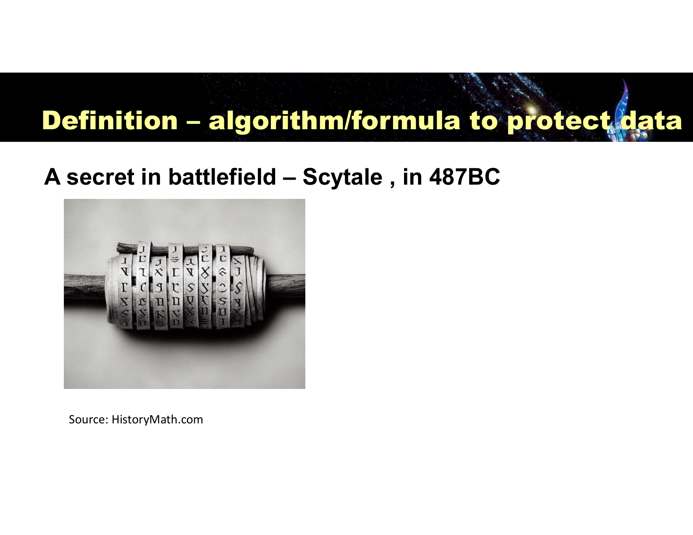
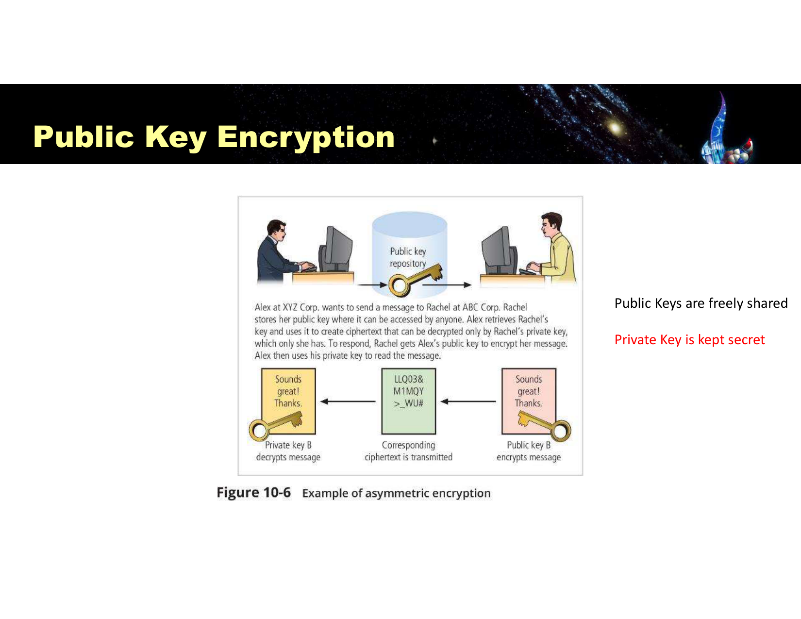
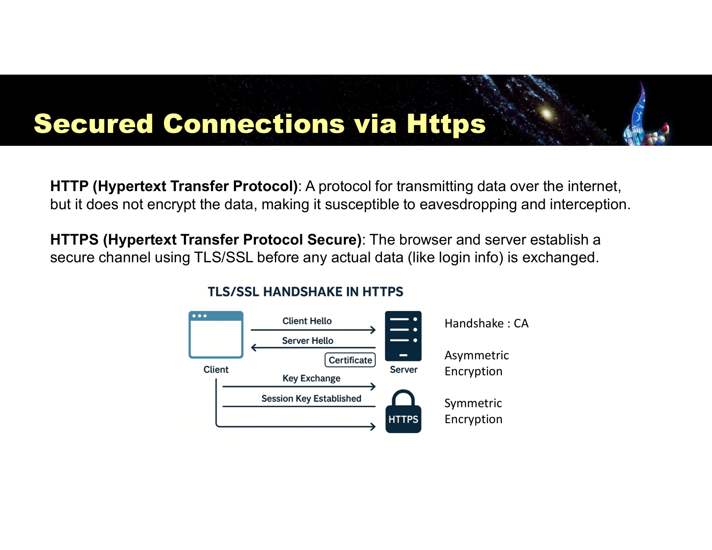
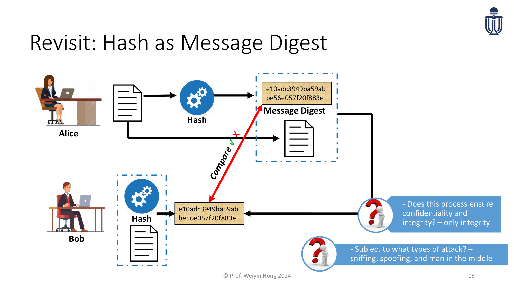
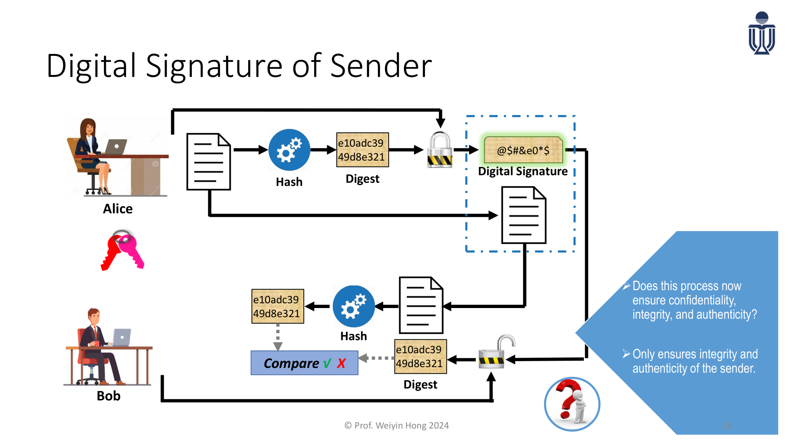
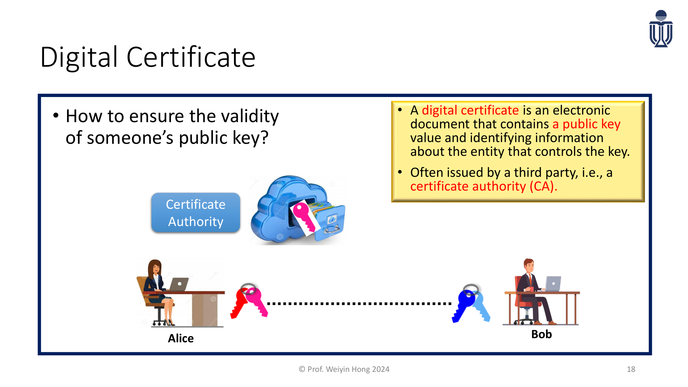
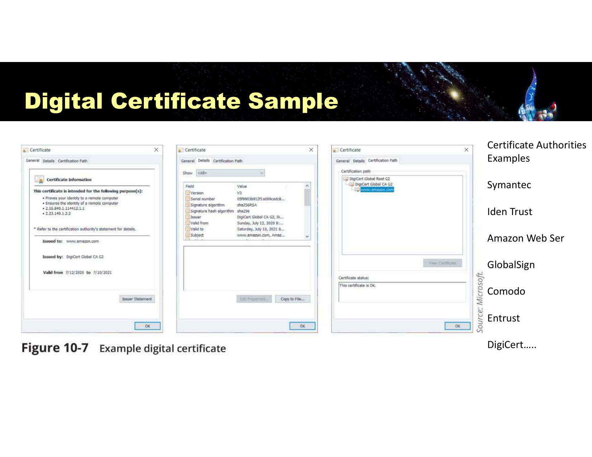
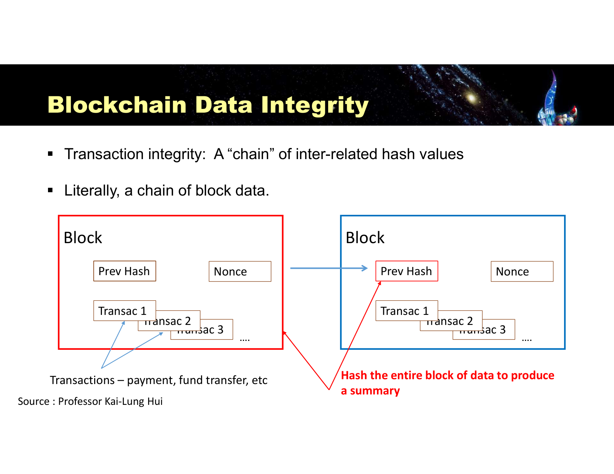
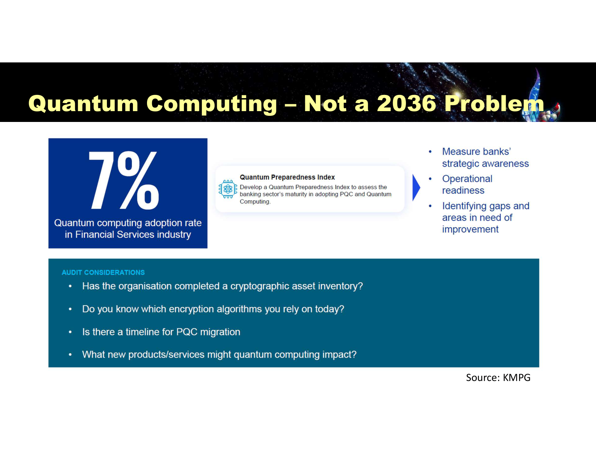

---
title:
  en: "Lesson 4 · Cryptography & Public Key Infrastructure"
  zh: "第 4 课 · 密码学与公钥基础设施 (PKI)"
summary:
  en: "Symmetric vs asymmetric encryption, hashing, the hash → digital signature → digital certificate ladder, hybrid TLS, blockchain as a business case, and quantum risk."
  zh: "对称与非对称加密、哈希、Hash → 数字签名 → 数字证书的递进关系、混合加密 TLS、区块链业务案例，以及量子计算风险。"
week: 4
date: 2026-09-14
tags: [Cryptography, PKI, DigitalSignature, DigitalCertificate, TLS, Blockchain, Quantum]
---
# ISOM 5280 Computer and Internet Security Management — Lesson 4 复习笔记

**主题：Cryptography & Public Key Infrastructure（密码学与公钥基础设施）— Symmetric/Asymmetric Encryption · Hashing · Digital Signature · Digital Certificate · Hybrid Cryptography (TLS) · Blockchain · Quantum Risk**

> 优先级标注说明（按考试重要性）：  
> 🔴 **必考核心** — 概念名称、定义、结构必须能背出来  
> 🟡 **需要理解** — 需要懂逻辑关系，能举例说明  
> 🟢 **了解即可** — 背景知识，考试大概率不会细抠
>
> **本笔记优先级的判定依据**：  
> ① **课件末尾 3 道 MCQ（p.42–44）** 分别考「Key 的定义」「Hashing 要不要用 Key（不需要）」「同时用公钥和私钥的方法叫什么（Asymmetric Encryption）」——三个最基础的定义必须精确记住；  
> ② **两次 Class Discussion / Quick Recap**（p.18 对称 vs 非对称的根本区别与局限；p.27 PKI 给组织带来什么价值）——现场提问点，通常就是简答题原型；  
> ③ **篇幅**：这门课其实是**两份课件合并**——主课件 45 页 + PKI 专题课件 16 页，PKI 专题课件把 Hash → Digital Signature → Digital Certificate 拆成 3 张连续的图**层层递进**，是全课设计最精心的部分，也是最容易考"这一步解决了上一步的什么问题"的地方；  
> ④ Lec 1 的经验：考试拆成 **Technical (20%) + Management (15%)**，密码学这章 Technical 卷大概率考"哪种算法/哪个术语"，Management 卷可能考"PKI 给企业带来什么信任价值"。
>
> 参考教材：**Principles of Information Security, 7th ed. (Whitman & Mattord)，Chapter 10**

---

## 0. 核心地图（先建立整体框架）

密码学最早的记录可以追溯到 **公元前 487 年的 Scytale（斯巴达密码棒）**——把带子缠在特定粗细的木棍上写字，解开就是乱码，只有用同样粗细的木棍才能读出来。**这就是"加密 = 算法 + 密钥"这个公式最古老的原型**：木棍的粗细就是"密钥"，缠绕书写的规则就是"算法"。



*Scytale：公元前 487 年斯巴达人用的加密棒（Slide 3）*

这节课沿着一条**问题不断升级**的主线展开：

```
① 我想让消息只有对方能看懂            → Encryption（对称 / 非对称）
   ↓ 但对称加密的密钥怎么安全交给对方？
② 我想确认消息在路上没被人动过手脚    → Hashing（只管完整性，不管是谁发的）
   ↓ 但 Hash 本身没有秘密，攻击者能顺手重算一个新的
③ 我想确认"是谁"发的，而且不能抵赖    → Digital Signature（用私钥签名）
   ↓ 但我怎么知道这把"公钥"真的是对方的？
④ 我想确认这把公钥真的属于对方        → Digital Certificate + CA（第三方背书）→ 这就是 PKI
   ↓ 签名验证很慢，每次都做不现实
⑤ 实际部署里怎么又快又安全？          → Hybrid Cryptography（TLS：非对称握手 + 对称传输）
```

> 💡 **小白类比**：Hash 就像"给包裹拍一张照片"证明包裹长什么样，但谁都能重新拍一张假照片；Digital Signature 是"用你自己专属的印章盖在照片上"，别人盖不出一样的印章；Digital Certificate 是"找公证处证明这个印章确实是你本人的"——一步比一步更难伪造。

---

## 1. 🔴 Encryption 基础：Plaintext / Ciphertext

**Encryption（加密）**：把消息转换成未授权者无法读懂的形式的过程。原文叫 **Plaintext（明文）**，加密后叫 **Ciphertext（密文）**。

| 手法                          | 类型                         | 原理                                                                                  |
| --------------------------- | -------------------------- | ----------------------------------------------------------------------------------- |
| **Vigenère Square**（维吉尼亚方阵） | 代换密码 (Substitution Cipher) | 表头和首列按 A-Z 正常顺序排列，此后每一行都向右移一位，形成 26×26 的字母表；用户自定义一个 **Encryption Key** 决定用哪一行加密每个字母 |
| **Transposition**（置换/换位密码）  | 区块密码 (Block Cipher)        | 不改变字母本身，只**打乱顺序**，让消息对无关的人保密                                                        |

> 🎯 **口诀**：Substitution 换的是"字母是什么"，Transposition 换的是"字母在哪个位置"——一个动内容，一个动顺序。

---

## 2. 🔴 Symmetric Encryption（对称加密）

**定义**：加密和解密**用同一把密钥**，也叫 private-key encryption（私钥加密）。

| 特性   | 说明                                    |
| ---- | ------------------------------------- |
| 速度   | 可以写成运算很快的算法，适合**大批量数据**加密：数据库、文件、网络流量 |
| 前提   | 发送方和接收方**必须持有同一把密钥**，接收方需要用同一把钥匙解密    |
| 致命弱点 | 密钥一旦被第三方偷到，对方可以在双方毫不知情的情况下解密、阅读所有消息   |

**标准算法**：**AES**（Advanced Encryption Standard），广泛用于：

- 金融/银行：保护线上交易、账户信息、支付数据，满足 **PCI DSS**（Payment Card Industry Data Security Standard）合规要求
- 区块链/数字资产：保护加密钱包私钥、助记词（seed phrase）
- 电商/网购：HTTPS/TLS **在密钥交换之后**用它加密网页传输、保护信用卡与个人信息
- 网络连接：WPA2/WPA3 无线网络保护（192-bit 或 256-bit AES）

> **🎯 Class Discussion（p.18）：对称加密的根本局限是什么？**
>
> **根本局限是「密钥分发 (Key Distribution)」问题**：密钥必须在使用前安全地送到对方手里，而"安全地送密钥"本身又是一个先有鸡还是先有蛋的难题；且算法**不适合大规模群体**（n 方两两通信需要 n(n-1)/2 把密钥，人一多密钥数量爆炸），密钥还需要经常更换，也**不能提供 Nonrepudiation（不可抵赖性）**——因为双方共享同一把钥匙，无法证明"这条消息确实是对方发的而不是我自己伪造的"。

---

## 3. 🔴 Asymmetric Encryption（非对称加密）



*Public Key Encryption 示例：Alex 用 Rachel 的公钥加密，只有 Rachel 的私钥能解开（Slide 13）*

**定义**：使用**两把不同但数学上相关的密钥**（公钥 Public Key + 私钥 Private Key）加解密，也叫 public-key encryption。

- **任意一把钥匙都可以加密**，但只有**另一把**能解密——用 Key A 加密，就只有 Key B 能解开
- 最大价值在于：一把作为**私钥（自己保管，绝不外传）**，另一把作为**公钥（自由公开分享）**
- 想给 Bob 发密信：用 **Bob 的公钥**加密 → 只有 **Bob 的私钥**能解开
- 想让别人验证"这条消息真的是我发的"：用**自己的私钥**签名 → 别人用**你的公钥**验证（下一节详讲）

| 对比项            | Symmetric            | Asymmetric                                                      |
| -------------- | -------------------- | --------------------------------------------------------------- |
| 密钥数量           | 1 把共享密钥              | 每人 1 对（公钥+私钥）                                                   |
| 速度             | 快，1,000–10,000 倍于非对称 | 慢                                                               |
| 密钥分发           | 困难（最大痛点）             | 容易——公钥可以随便发布                                                    |
| Nonrepudiation | 不支持                  | 支持（配合数字签名）                                                      |
| 典型算法           | AES                  | **RSA**、**Diffie-Hellman**、**ECC**（Elliptic Curve Cryptography） |

**用在哪**：保护"传输中的数据"、防窃听——

- **Secure Web Traffic**：浏览器和服务器做 **TLS 握手**，用 RSA 等非对称算法验证服务器身份，并协商出一把临时的对称共享密钥
- **Remote Access (SSH)**：握手阶段用（如 **ECDH**）验证身份、安全推导密钥



*HTTPS 的 TLS/SSL 握手：Client Hello/Server Hello → Certificate → 非对称加密协商 → Key Exchange → 对称加密传输（Slide 17）*

**HTTP vs HTTPS**：HTTP 传输数据不加密，容易被窃听拦截；HTTPS 在真正传数据（如登录信息）之前，先用 TLS/SSL 建立一条加密通道。

---

## 4. 🔴 Hashing（哈希）

**定义**：哈希函数是用来**确认消息身份、确认内容没被改动过**的数学算法，产出一个 **hash value / message digest**，把任意长度的消息转换成**固定长度**的一个值。

**四个特性（背熟，选择题常考）**：

| 特性                                 | 说明                                              |
| ---------------------------------- | ----------------------------------------------- |
| **单向、不可逆** (one-way, irreversible) | 只能从消息算出哈希，不能从哈希反推出消息                            |
| **确定性**                            | 同样的数据 → 永远得到同样的哈希值                              |
| **雪崩效应**                           | 数据发生一个很小的改动 → 哈希值发生**巨大的变化**                    |
| **唯一性**                            | 理论上不可能找到两条不同消息产生相同哈希值（**Hash Collision** 是异常情况） |

**用途**：① 密码存储与保护 ② 数据完整性校验（Message Digest）③ 数字签名（配合公钥加密 + 哈希函数）

**True or False: Hashing functions require the use of keys?**

- A. True
- B. False

> **答案：B**
>
> 课件末尾 MCQ 原题。哈希函数**不需要任何密钥**，任何人拿到同样的算法和同样的输入都能算出同样的哈希值——这也正是它下一节会暴露出的弱点：没有密钥意味着没有秘密，攻击者也能重新算一个哈希值来配合他篡改过的内容。

---

## 5. 🔴 从 Hash 到 PKI：完整性、真实性、身份信任三级跳

这是本课**设计最精巧的三张连续对比图**（PKI 专题课件 p.15–19），建议配合下面的互动组件一起看：一步步揭示"上一步解决了什么问题、又留下了什么新问题"。

*（网页版此处可交互：切换 Hash / Signature / Certificate 三种模式，勾选「篡改内容」「冒充身份」看 Bob 会不会被骗；下表是同一套规则跑一遍全部组合）*

| 场景                                       | 摘要比对 | CA 检查 | 结果          |
| ---------------------------------------- | ---- | ----- | ----------- |
| 只用 Hash · 无攻击                            | 一致   | —     | 正确接受        |
| 只用 Hash · 中间人篡改内容                        | 一致   | —     | **Bob 被骗了** |
| + Digital Signature · 无攻击                | 一致   | —     | 正确接受        |
| + Digital Signature · 攻击者冒充 Alice        | 一致   | —     | **Bob 被骗了** |
| + Digital Signature · 中间人篡改内容            | 不一致  | —     | 正确拒绝        |
| + Digital Certificate (CA) · 无攻击         | 一致   | 通过    | 正确接受        |
| + Digital Certificate (CA) · 攻击者冒充 Alice | 一致   | 拒绝    | 正确拒绝        |
| + Digital Certificate (CA) · 中间人篡改内容     | 不一致  | 通过    | 正确拒绝        |

### 5.1 Step ① 只用 Hash：能查完整性，查不出是谁发的



*Hash as Message Digest：Alice 把消息和它的哈希一起发给 Bob，Bob 重新哈希消息再比对（PKI Slide 15）*

Alice 把消息和它的哈希值一起发给 Bob；Bob 重新计算收到消息的哈希，和收到的哈希值比对，一致就说明"看起来没被改过"。

> ⚠️ **这个过程能保证机密性和完整性吗？——只能保证完整性（而且是脆弱的完整性）**。因为哈希函数没有密钥、没有秘密，一个**中间人（MITM）**完全可以：截获消息 → 篡改内容 → **重新算一个新的哈希值** → 把改过的消息和新哈希一起发给 Bob。Bob 的比对结果依然是"一致"，却完全没有发现内容已经被动过——**这正是上面互动组件里"只用 Hash + 中间人篡改内容"选项演示的场景**。同样容易受 sniffing、spoofing、MITM 攻击（呼应 Lesson 2 的通信截获章节）。

### 5.2 Step ② + Digital Signature：能证明"是谁发的"，还能发现篡改



*Digital Signature of Sender：Alice 把摘要用自己的私钥加密成签名；Bob 用 Alice 的公钥解开签名，拿到原始摘要再比对（PKI Slide 16）*

**做法**：Alice 把消息哈希得到摘要（Digest），再用**自己的私钥**加密这个摘要，生成 **Digital Signature（数字签名）**，连同消息一起发给 Bob。Bob 收到后：① 用 Alice 的**公钥**解开签名，拿到 Alice 当初锁定的原始摘要 ② 自己把收到的消息重新哈希一遍 ③ 两个摘要比对。

- 因为签名是**用 Alice 的私钥加密**出来的，攻击者篡改内容后**没有 Alice 的私钥**，没法重新签出一个能被 Alice 公钥解开、又刚好等于新内容哈希值的签名——**篡改会被发现**。
- 这一步同时确认了**完整性（integrity）+ 真实性（authenticity）**：能用 Alice 的公钥正确解开，说明"确实是握有 Alice 私钥的人签的"。

> ⚠️ **新问题**：这套流程只证明了"确实是握有这把私钥的人签的"，**但没人告诉 Bob 这把"Alice 的公钥"真的属于 Alice**！如果攻击者拿自己的一对公私钥，自己签名，却骗 Bob 说"这是 Alice 的公钥"——Bob 的验证数学上完全正确，却认错了人。这正是上面互动组件里"② + Digital Signature + 攻击者冒充 Alice"选项会让 Bob 被骗的原因。

### 5.3 Step ③ + Digital Certificate：由 CA 背书"这把公钥真的是谁的"



*Digital Certificate：Certificate Authority 为 Alice 的公钥背书，Bob 收到的不再是裸公钥而是一张证书（PKI Slide 18）*

**Digital Certificate（数字证书）**：一份包含**公钥值 + 持有者身份信息**的电子文件，通常由第三方——**Certificate Authority (CA)** ——签发。证书本身也带有 CA 的数字签名，证明"这把公钥确实属于证书上写的这个人/机构"。常见 CA：Symantec、IdenTrust、Amazon Web Services、GlobalSign、Comodo、Entrust、DigiCert……



*Digital Certificate Sample：General / Details / Certification Path 三个标签页——签发对象、签发者、有效期、证书链一路指向根 CA（Slide 26）*

现在 Bob 拿到的不再是一把"裸的"公钥，而是一整张**证书**：公钥本身 + 持有者身份 + CA 的签名 + 有效期。Bob 先验证**证书是否由自己信任的 CA 签发**，通过之后才信任里面的公钥属于 Alice，再走前面 Digital Signature 的验证流程。

> 🎯 **考点（对应上面互动组件"③ + Digital Certificate + 攻击者冒充"）**：攻击者依然可以自己生成一对公私钥、自己签名，**但他没法让一个 Bob 信任的 CA 替他签发一张"这是 Alice"的证书**——Bob 的证书链检查会直接拒绝这张自签/未受信任的证书，**根本走不到后面内容比对那一步**。这就是 Digital Certificate 解决的最后一块拼图：把"这把公钥属于谁"这件事，交给一个大家都信任的第三方来背书。

**PKI（公钥基础设施）到底给一个组织带来了什么价值？（p.27 Class Discussion）**

> PKI 把"公钥到底属于谁"这个原本无法验证的问题，转交给一个各方都信任的第三方（CA）来背书，从而同时做到：① **Trust Establishment and Identity Verification**（建立信任、验证身份）② **Data Confidentiality and Integrity Protection**（保护数据机密性与完整性）。一套典型 PKI 方案会整合：**证书颁发机构 (CA)**、**证书注册 (Certificate Enrollment)**、**验证 (Verification)**、**吊销 (Revocation)** 四个环节，让加密系统能够规模化地在互不认识的陌生人之间建立信任。

**密码学的 4 个根本目标**（Security practitioner 用密码系统要满足）：**Confidentiality**（机密性）、**Integrity**（完整性）、**Authentication**（身份验证）、**Nonrepudiation**（不可抵赖——像网购这类交易，一旦发生就不能事后否认）。

### 5.4 Hybrid Cryptography System：实际部署怎么又快又安全

**做法**：先用**非对称加密**验证身份、协商出一把临时的**对称密钥（session key）**；连接建立后，双方后续所有流量都改用这把**对称密钥**加解密——这正是 HTTPS/TLS 的真实做法：**握手阶段非对称（慢但能验证身份），传输阶段对称（快，扛得住大流量）**。

**常见安全协议速查**：

| 场景             | 协议                                                                                            |
| -------------- | --------------------------------------------------------------------------------------------- |
| Web（https\://） | SSL、TLS                                                                                       |
| 邮件             | S/MIME、PEM、**PGP**（Pretty Good Privacy——免费/低成本的混合加密系统，成为邮件与文件加密事实标准；PGP 会先用 ZIP 压缩已签名的消息，再加密） |
| 无线网络           | WEP、WPA、WPA2、WPA3                                                                             |
| 蓝牙             | 仅 Passkey                                                                                     |

> **⚠️ 蓝牙安全提醒（p.16 PKI 课件）**
>
> 蓝牙可被约 30 英尺（10 米）范围内的任何人利用：不要接受不明身份的配对请求；不要在公共场所配对；删除不再使用的蓝牙连接；不用时直接关闭蓝牙。

---

## 6. 🟡 Business Case：Blockchain

**定义**：Blockchain 是一个**点对点 (Peer-to-Peer)**、**分布式账本 (Distributed Ledger)**、**密码学安全 (Cryptographically-secure)**、**只能追加 (Append-only)**、**极难篡改 (Immutable)**、**只能靠共识更新**的系统。

| 关键词                      | 含义                                                     |
| ------------------------ | ------------------------------------------------------ |
| Peer-to-Peer             | 网络里没有中心控制者，所有参与者直接对话——现金交易可以在双方之间直接完成，不需要银行/VISA 这类第三方 |
| Distributed Ledger       | 账本分散存储在网络里的所有节点，**每个节点都保存一份完整账本副本**                    |
| Cryptographically-secure | 用密码学提供不可抵赖性、数据完整性、数据来源认证，防止账本被篡改或滥用                    |

**背景**：Satoshi Nakamoto（中本聪）2008 年发表论文，勾勒出比特币的设计——数字形式的现金、完全去中心化（不由任何央行发行/管理）、高度抗篡改、所有交易完全可追溯可验证。**区块链本身就是"去中心化"的载体**——没有单一一方能把系统关掉。



*Blockchain Data Integrity：每个 Block 把上一个 Block 的哈希值（Prev Hash）存进自己里面，串成一条哈希链（Slide 33）*

**数据完整性靠什么**：交易完整性来自**一条互相关联的哈希值链条**——每个 Block 存着交易数据（Transac 1/2/3…）、一个随机数 Nonce，以及**上一个 Block 整体的哈希值（Prev Hash）**。想改动早前某个 Block 里的一笔交易，就必须重新计算它自己和它后面**所有** Block 的哈希——这在算力上极不现实，这就是区块链"极难篡改"的来源。

> 🎯 **考点（Cryptography on Blockchain）**：区块链上的密码学是**强制的、没有 opt-out**——每个参与者都必须使用 **PKI**（公钥+私钥）。**比特币区块链是全世界民用领域部署规模最大的 PKI 系统**。
>
> **课件留的思考题**：区块链能保证 Block 内金融交易的机密性 (Confidentiality) 吗？——**不能**。区块链解决的是**完整性和来源可验证性**（谁转的、转了多少、没人能事后否认），但账本对所有参与者是**公开可读**的（这也是为什么真实世界会再叠加"隐私币"、零知识证明等额外技术来补机密性这一课没讲到的缺口）。

---

## 7. 🟡 Risk, Challenge & Best Practice

**加密强度由什么决定**：**算法 + 密钥**共同决定加密强度，而且**密钥比算法本身更重要**——再强的算法，密钥太短或管理不善也没用。

| 类别                   | 内容                                                                                 |
| -------------------- | ---------------------------------------------------------------------------------- |
| Risks（风险）            | 密钥被盗（key theft）、内部威胁（insider threats）、加密算法过时（cryptographic algorithm obsolescence） |
| Challenges（挑战）       | 在安全性与易用性之间取得平衡、系统集成难度                                                              |
| Best Practices（最佳实践） | 强健的密钥管理、分层防御（layered security）、定期审计                                                |
| 别忘了                  | 用户教育同样重要                                                                           |

### 🟢 新兴威胁：Quantum Computing（量子计算）



*Quantum Computing – Not a 2036 Problem：金融业量子计算采用率仅 7%，KPMG 建议现在就做 Quantum Preparedness Index 评估（Slide 38）*

- 经典计算机处理的是非 0 即 1 的二进制 bit；**量子计算机**用的是 **qubit（量子比特）**，可以同时处于多个叠加态（superposition），因此能**同时**进行大量运算。
- 今天的经典计算机破解 RSA 这类现行加密标准需要**成千上万甚至数百万年**；一台足够强大的量子计算机理论上可能只需要**几分钟**。
- 标题"Not a 2036 Problem"想强调的是：虽然通用量子计算机真正成熟可能还要等，但**现在**就该开始做加密资产盘点（是否知道自己在用哪些加密算法？）、规划 **PQC（Post-Quantum Cryptography，后量子密码学）迁移路线图**——等到量子计算机真的成熟了再补救就太晚了（数据现在被"先偷后解"，也是一种风险：Harvest Now, Decrypt Later）。

---

## 🔴 综合速查表

| 概念                                 | 一句话定义                      | 解决了什么 / 留下什么问题                   |
| ---------------------------------- | -------------------------- | -------------------------------- |
| Symmetric Encryption (AES)         | 加解密用同一把密钥                  | 快，但密钥分发困难、不支持不可抵赖                |
| Asymmetric Encryption (RSA/DH/ECC) | 公钥加密、私钥解密（或反过来）            | 解决密钥分发，但比对称慢 1,000–10,000 倍      |
| Hashing                            | 把任意长度消息变成固定长度摘要，单向不可逆      | 能查完整性，但没有密钥，查不出「是谁」，也防不住有心人重算哈希  |
| Digital Signature                  | 用私钥给摘要加密                   | 能证明「是谁签的」+ 发现篡改，但没法证明「这把公钥真的是谁的」 |
| Digital Certificate + CA           | 第三方 CA 为公钥与身份的绑定背书         | 解决公钥信任问题，构成完整 PKI                |
| Hybrid Cryptography (TLS)          | 握手用非对称，传输用对称               | 兼顾安全与速度，是 HTTPS 的真实做法            |
| Blockchain                         | P2P + 分布式账本 + 密码学安全 + 不可篡改 | 解决完整性与去中心化信任，**不解决机密性**          |
| Quantum Computing                  | 用 qubit 叠加态并行计算            | 对 RSA 等现有加密算法构成长期威胁，需提前规划 PQC 迁移 |

---

## 模拟自测题

**Which of the following terms is used to describe the information used in conjunction with an algorithm to create the ciphertext from the plaintext?**

- A. Cipher
- B. Code
- C. Clear text
- D. Key

> **答案：D**
>
> 课件末尾 MCQ 原题。加密 = **算法（algorithm）+ 密钥（key）**；密钥就是配合算法把明文变成密文所需要的那份"信息"。呼应开篇 Scytale 例子：算法是"缠绕书写"的规则，密钥是木棍的粗细。

**True or False: Hashing functions require the use of keys?**

- A. True
- B. False

> **答案：B**
>
> 哈希函数不需要密钥，这也正是它无法单独提供身份认证的根本原因。

**What term is used to describe a cryptographic method that incorporates mathematical operations involving both a public key and a private key to encipher or decipher a message?**

- A. Private-key encryption
- B. Symmetric encryption
- C. Advanced Encryption Standard (AES)
- D. Asymmetric encryption

> **答案：D**
>
> 公钥 + 私钥同时参与运算，正是 Asymmetric Encryption（非对称加密）的定义；A/B/C 都是对称加密的说法或具体算法。

**为什么说「Digital Certificate 解决的是 Digital Signature 解决不了的问题」？**

> Digital Signature 只能证明"用某把私钥签名的人，确实持有那把私钥"，但**没有任何机制证明那把对应的公钥真的属于它声称的那个人**——攻击者完全可以自己生成一对合法的公私钥，自己签名，却谎称"这是 Alice 的公钥"，签名验证在数学上会完全通过。Digital Certificate 通过引入一个大家都信任的第三方 **CA** 来对"公钥—身份"这个绑定关系背书，Bob 在信任签名之前，先检查证书链是否指向一个自己信任的根 CA——这一步堵住了 Digital Signature 单独存在时留下的身份冒充漏洞。

**HTTPS 里的 TLS 握手，为什么不全程使用非对称加密，也不一开始就用对称加密？**

> 一开始双方互不认识、没有共享密钥，只能先用**非对称加密**（配合服务器的数字证书）来验证身份、安全协商出一把临时的**会话密钥（session key）**——这一步不追求快，追求"确认身份 + 密钥不被窃听"；一旦身份确认、密钥协商完成，后续要传输的实际网页数据量很大，就切换成快得多的**对称加密**去处理——这就是 Hybrid Cryptography System，兼顾了"非对称能验证身份"和"对称速度快"两者的优点。
