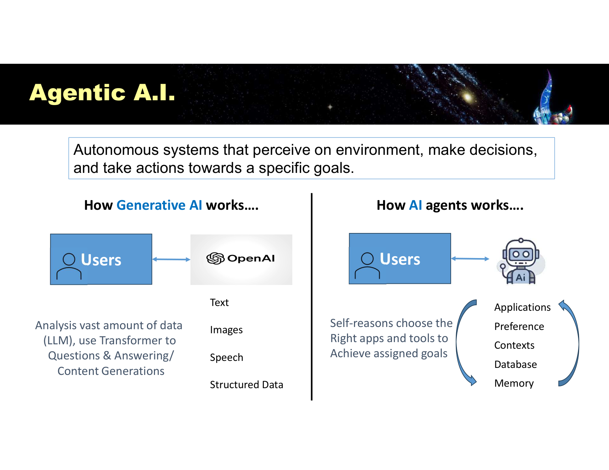
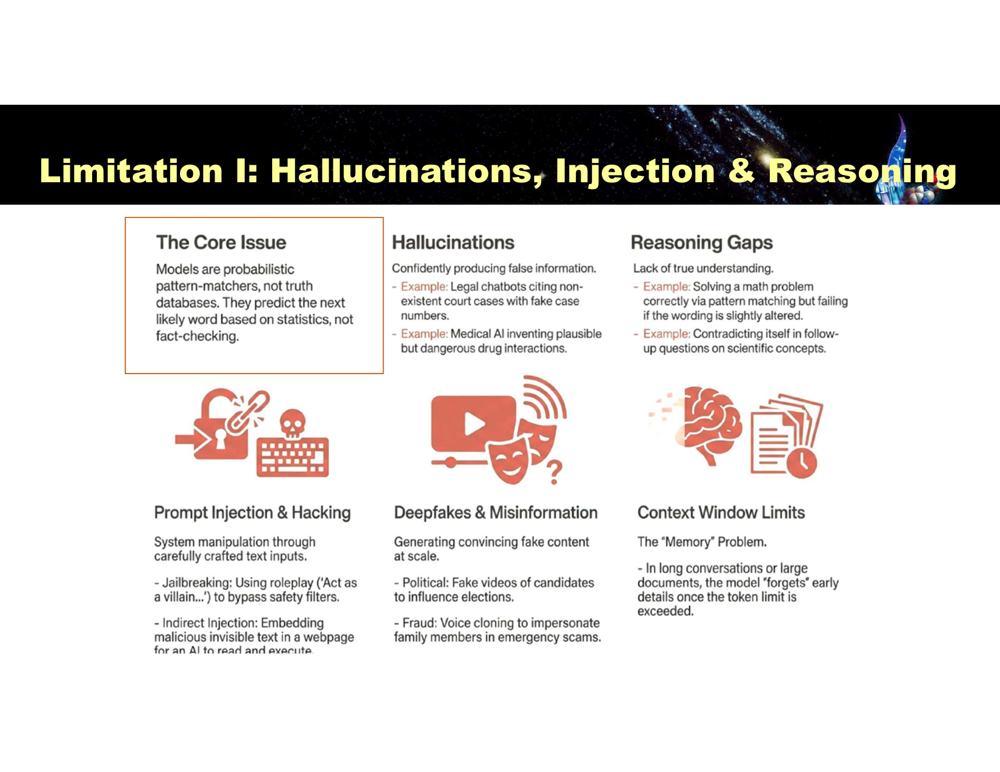
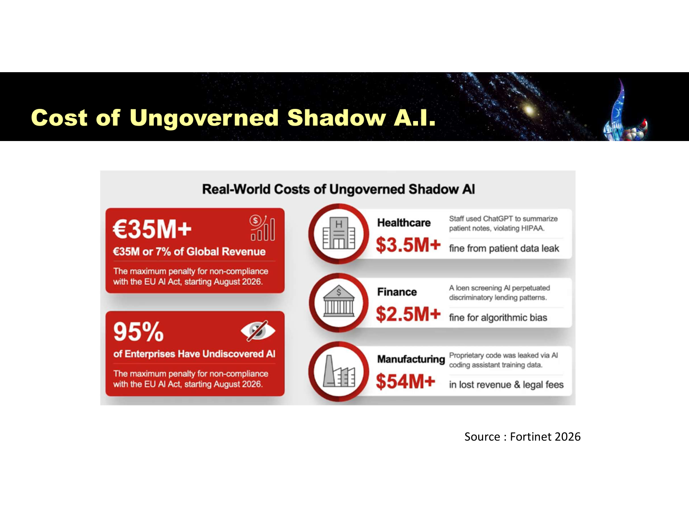
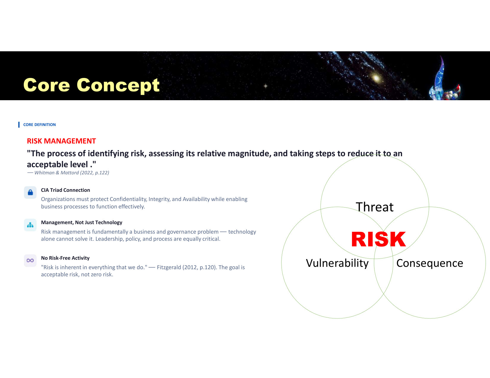
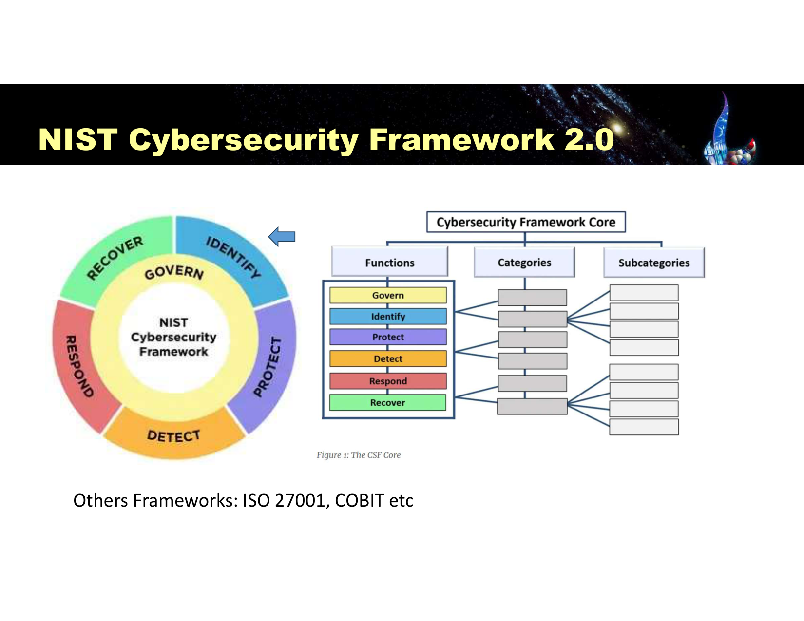
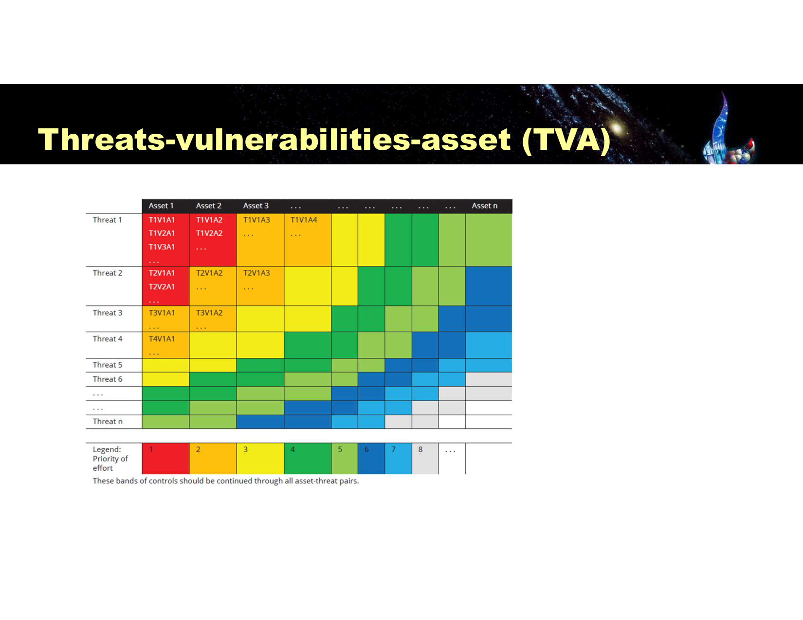
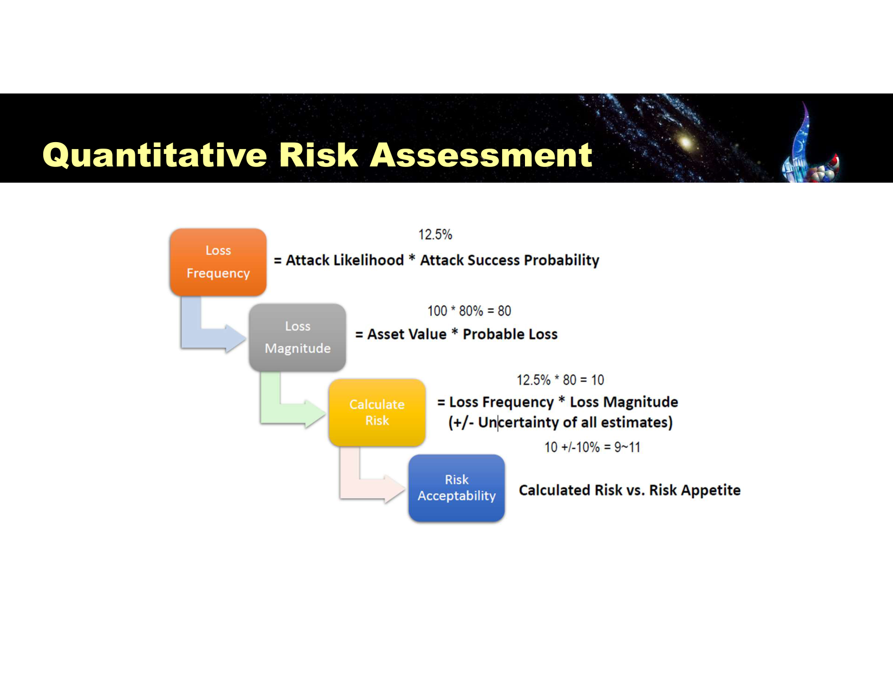
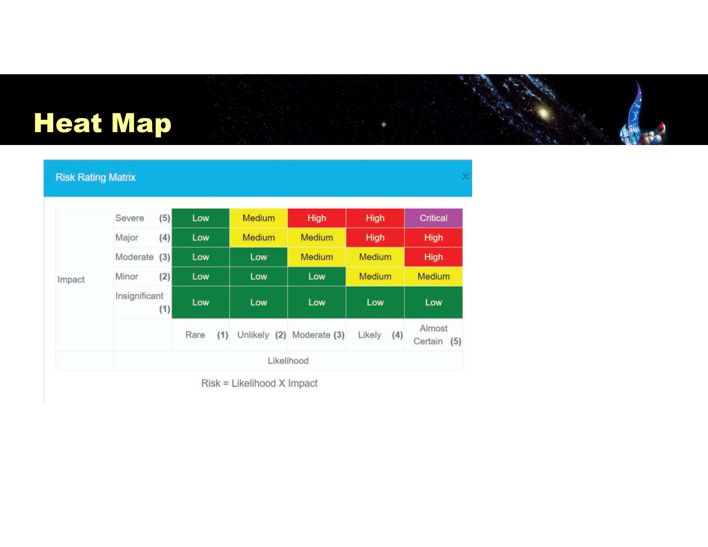

---
title:
  en: "Lesson 5 · Risk Management, AI Risk & Project Briefing"
  zh: "第 5 课 · 风险管理、人工智能风险与项目简报"
summary:
  en: "Generative/agentic AI risk (shadow AI, hallucination, AI-for-security), then the full risk management cycle: identification, quantitative assessment, heat maps, and the four treatment strategies."
  zh: "生成式/agentic AI 风险（影子 AI、幻觉、AI 防御应用），以及完整的风险管理流程：识别、定量评估、热力图、四种风险处理策略。"
week: 5
date: 2026-09-21
tags: [AIRisk, ShadowAI, RiskManagement, RiskAssessment, HeatMap, RiskTreatment]
---
# ISOM 5280 Computer and Internet Security Management — Lesson 5 复习笔记

**主题：Risk Management, Artificial Intelligence & Project Briefing（风险管理、人工智能风险与项目简报）— Generative/Agentic AI Risk · Shadow AI · AI for Security · Risk Management Process · Quantitative Risk Assessment · Heat Map · Risk Treatment**

> 优先级标注说明（按考试重要性）：  
> 🔴 **必考核心** — 概念名称、定义、结构必须能背出来  
> 🟡 **需要理解** — 需要懂逻辑关系，能举例说明  
> 🟢 **了解即可** — 背景知识，考试大概率不会细抠
>
> **本笔记优先级的判定依据**：  
> ① **课件唯一一道 Quick Quiz（p.44）** 直接考"补上剩余风险控制措施叫什么"（Mitigation）——四种风险处理策略的**名字和定义**必须精确；  
> ② **课件明确把 Risk Management Process 的六个步骤连续列了两遍**（p.28、p.29 完全重复）——这种"讲两遍"的内容历史上都是重点；  
> ③ **篇幅**：这节课其实是**两个主题拼在一起**——前 21 页讲 AI Risk + Group Project 简报，第 22 页开始才是 Risk Management 正文（p.22–48），后者是本课程"压轴"的管理框架，篇幅占了课件三分之二；  
> ④ **p.23 复习了 Lesson 2 的 Threat/Attack/Exploit/Vulnerability 四个术语**——说明这套术语会贯穿全课程反复考，值得回头翻 Lesson 2 笔记对照；  
> ⑤ Lec 1 的经验：考试拆成 **Technical (20%) + Management (15%)**，风险管理这章几乎整章都是 Management 卷的核心内容。
>
> 参考教材：**Principles of Information Security, 7th ed. (Whitman & Mattord)，Chapter 4**

---

## 0. 核心地图（先建立整体框架）

这节课名字里的三个词——**Risk Management, Artificial Intelligence & Project Briefing**——其实是两条独立主线 + 一段课务通知：

```
主线 A：AI 带来的新风险
  Gen AI 怎么用 → Agentic AI 怎么用 → 用 AI 本身有什么风险（幻觉/偏见/黑箱）
  → 别人拿 AI 攻击你有什么风险（深度伪造/自动化诈骗）→ Shadow AI（员工偷偷用）
  → 反过来，AI 也能用来做防御（AI-Enhanced Defense Tools）

主线 B：风险管理的通用方法论（这是全课程的压轴框架）
  什么是风险？（Threat × Vulnerability × Consequence）
  → 风险胃口 (Risk Appetite) 划一条线
  → 风险管理六步流程：定context → 识别 → 分析 → 评估 → 处理 → 汇总
  → 分析靠什么工具：资产清单 + TVA 矩阵 + 定量计算 + Heat Map
  → 处理只有 4 选 1：Mitigation / Transference / Acceptance / Avoidance
```

> 💡 **小白类比**：AI Risk 这部分是在说"公司新买了一个员工（AI），这个员工能干活但也可能闯祸、也可能被人冒充"；Risk Management 这部分是在说"不管风险从哪来（AI、黑客、天灾），公司都要用同一套流程去称重、分类、决定怎么处理"——**前者是具体案例，后者是通用工具箱**，这也是为什么两部分能拼在一节课里：AI Risk 恰好可以拿风险管理的框架去分析。

---

## 1. 🔴 Generative AI vs Agentic AI

| 类型                           | 定义                                                           | 工作方式                                                                           |
| ---------------------------- | ------------------------------------------------------------ | ------------------------------------------------------------------------------ |
| **Predictive AI**            | 用于信用科技（Credit Tech）、欺诈检测等预测型场景                               | 基于历史数据预测结果                                                                     |
| **Generative AI**（如 ChatGPT） | 用深度学习中的多层神经网络（如 Generative Pre-trained Transformer）处理和理解海量数据 | 分析海量数据（LLM），用 Transformer 做问答/内容生成——**用户提问 → 模型直接生成回应**                        |
| **Agentic AI**               | 能**感知环境、自主做决策、朝着特定目标采取行动**的自主系统                              | 自己判断该用哪个 App/工具去达成被交代的目标；能操作 Applications、记住 Preference/Context，还有 Memory（数据库） |



*How Generative AI works（用户 ↔ 模型直接问答） vs How AI agents work（用户交代目标，Agent 自己选工具、调数据库、执行）（Slide 7）*

> 🎯 **一句话区分**：Generative AI 负责"生成内容回答你"，Agentic AI 负责"自己动手把事情做完"——**Agentic AI 的风险等级明显更高**，因为它会真的去调用工具、写数据库，出错的后果不再只是"一段错的文字"，而是"一个被执行的错误动作"。

**GPT 与 ChatGPT 的关系**：GPT 是一种 LLM（大语言模型）；ChatGPT 是围绕这类模型搭建起来的**应用**——Chat 负责收集消息（Dialogue + History，构成 Context Window），GPT/LLM 负责基于这个上下文生成回应。

### 1.1 AI 在风险管理场景里的双重身份

| 视角                                              | 内容                                                                                                                                                                                                             |
| ----------------------------------------------- | -------------------------------------------------------------------------------------------------------------------------------------------------------------------------------------------------------------- |
| **AI for Risk Management**（用 AI 管风险）            | 大规模交易监控、实时标记异常、减少人为误差；信用风险与核保（补充行为数据信号）；UEBA（User and Entity Behavior Analytics）实时侦测用户/设备/应用的异常行为；用 NLP 挖掘事故报告、审计发现、通话记录；第三方/供应商风险——用 AI 扫合同、SOC 报告、新闻、网络安全信号、财务状况                                             |
| **Risks from using AI**（自己用 AI 带来的风险）           | **Hallucination**（幻觉：编造事实/引用/理由）；**Bias**（偏见与不公平结果）；**Explainability gaps**（无法向监管者/审计者/法庭解释模型决策）；**Model drift**（功能会随行为、欺诈模式、市场变化而失效）；**Adversarial manipulation**（犯罪分子探测模型、投毒数据、构造输入绕过检测）；监管与法律不确定性；知识产权与版权风险 |
| **Risks from others using AI**（别人用 AI 攻击你带来的风险） | 超个性化钓鱼（AI 写出语气/职位都以假乱真的邮件）；Deepfake 语音/视频用于社会工程；合成身份工厂（AI 批量生成"完整档案"）；自动化诈骗对话（Chatbot）；规避欺诈控制（犯罪分子用 AI 探测触发警报的阈值，再刻意压低行为躲过）；按需伪造文件（生成逼真的财务报表）                                                                  |

> **🎯 考点：这张三栏表本身就是一道「风险归类」送分题**
>
> 如果考试给出一个具体案例（比如"某银行员工用未经授权的 AI 工具处理客户合同"），要能立刻判断它属于哪一栏——上面例子属于 **Risks from using AI（准确说是 Shadow AI，见下节）**，而"攻击者用 AI 克隆 CFO 声音要求转账"属于 **Risks from others using AI**。

---

## 2. 🔴 AI 的两大先天局限



*Limitation I: Hallucinations, Injection & Reasoning——模型是概率型的模式匹配器，不是事实数据库（Slide 9）*

**核心问题（The Core Issue）**：模型是**概率型的模式匹配器（probabilistic pattern-matchers）**，不是事实数据库；它预测的是"接下来统计上最可能出现的词"，不是在做事实核查。

| 局限                                | 说明                             | 例子                                                                               |
| --------------------------------- | ------------------------------ | -------------------------------------------------------------------------------- |
| **Hallucinations**（幻觉）            | 自信地编造虚假信息                      | 法律聊天机器人引用不存在的判例；医疗 AI 编造听起来合理但危险的药物相互作用                                          |
| **Reasoning Gaps**（推理缺口）          | 缺乏真正的理解                        | 靠模式匹配"蒙对"数学题，但换个问法就错；在后续追问中自相矛盾                                                  |
| **Prompt Injection & Hacking**    | 精心构造的文本输入操纵系统                  | Jailbreaking（用角色扮演"扮演一个反派…"绕过安全过滤）；Indirect Injection（把恶意指令藏进网页的隐藏文字，让 AI 读到后执行） |
| **Deepfakes & Misinformation**    | 大规模生成以假乱真的内容                   | 政治：伪造候选人视频影响选举；诈骗：语音克隆冒充家人紧急求助                                                   |
| **Context Window Limits**（"记忆"问题） | 长对话/大文档超出 token 上限后模型会"忘记"早期细节 | —                                                                                |

**Limitation II：Ethics, Bias and the Black Box**——训练数据偏见（Training Data Bias）、数据漂移（Data Drift）、"黑箱"问题在传统机器学习模型里早就存在，生成式 AI 只是放大了它的影响范围。

> **💡 小白类比：为什么幻觉这么难根治？**
>
> 把 LLM 想象成一个"读过全世界的书、但从不核对真假、只负责接龙下一个最可能的词"的人——他说话通顺、自信、逻辑连贯，**但通顺不等于正确**。这也是为什么 Prompt Injection 这么危险：他会把藏在网页里的恶意文字当成"应该接龙下去的上下文"，而不是识别出"这是别人塞进来的指令"。

---

## 3. 🟡 Shadow AI（影子 AI）

**定义**：组织内**未经授权/未被批准**使用的 AI 工具。

**风险**：数据暴露、缺乏治理、安全控制不一致。

**真实案例**：**Samsung 2023 数据泄露**——员工使用未经授权的 AI 工具处理工作内容，导致敏感数据外泄。



*Real-World Costs of Ungoverned Shadow AI：医疗 $3.5M+ 罚款（用 ChatGPT 总结病历违反 HIPAA）、金融 $2.5M+ 罚款（借贷 AI 延续歧视性模式）、制造业 $54M+ 损失（专有代码通过 AI 编程助手训练数据泄露）（Slide 13）*

> ⚠️ **管理层数字**：**95% 的企业存在"未被发现的 AI"**；欧盟 AI 法案（自 2026 年 8 月生效）对不合规企业的最高罚款是 **€35M 或全球营收的 7%**（取更高者）——这意味着 Shadow AI 不再只是"IT 部门的小问题"，而是**可以直接触发监管天花板级罚款**的合规风险。

**预防工具**：AI 治理政策（Governance Policies）、用户培训。**行业趋势**：从"对 Gen AI 说不"转向"教员工怎么用（How, not No）"——单纯禁止只会把使用逼到看不见的地方（这正是 Shadow AI 的成因）。

---

## 4. 🟡 AI for Security：用 AI 做防御

AI 正在改造防御型网络安全：**实时分析海量安全事件数据**、检测复杂攻击、自动化任务、快速响应事件。伴随潜力而来的是**AI 可靠性与伦理使用**方面的合理担忧。

**AI 增强的防御工具**：

| 工具                                | AI 带来的提升                        |
| --------------------------------- | ------------------------------- |
| Firewall / NGFW                   | 机器学习驱动的多层封包检测、零日攻击检测、自适应规则调优    |
| IDPS / EDR / XDR                  | 深度学习分类器，无需特征库也能检测新型入侵和内部滥用      |
| Threat Hunting & Malware Analysis | 提升分析质量与响应速度                     |
| UEBA                              | AI 学习每个用户、系统及其他日志的正常模式，增强异常行为分析 |
| Agentic Testing                   | 在护栏（guardrail）约束下进行自主化的安全测试     |

**AI Governance 六大支柱**：Governance（治理）、Fairness（公平性）、Transparency（透明度）、Data Privacy（数据隐私）、Accountability（问责）、Safety（安全）。

> **📌 课务：Group Project（25%）简报**
>
> 本课布置了小组项目——"AI for Cybersecurity: Application, Used Cases & Limitation"：7 组、每组 5–6 人，向"董事会"展示 Gen AI/LLM 如何在 Protection、Detection、Threat Intelligence/Malware Analysis、SOAR 四个方向之一提升网络安全运营效率，要给出真实案例、可量化收益，并说明采用 GenAI/LLM 的风险。演示稿 10 月 4 日中午 12 点前提交，第 7 周课上口头报告（15 分钟 + 5 分钟 Q\&A）。

---

## 5. 🔴 Risk Management：核心概念

### 5.1 复习 Lesson 2 的四个术语（p.23 原题重现）

| 术语                | 定义                                                      |
| ----------------- | ------------------------------------------------------- |
| **Threat**        | 可能损害或危及信息及其支持系统的、有意或无意的行为                               |
| **Vulnerability** | 资产或其防御控制系统本身的潜在弱点                                       |
| **Exploit**       | 用来危害系统的技术；也可指用于攻击的工具、程序或脚本                              |
| **Attack**        | 会对组织造成负面（CIA）影响的事件——**这节课给出了 Lesson 2 没直接给的 Attack 定义** |

### 5.2 什么是风险（Risk）

**（下行）风险的定义**：任何可能对组织实现目标、执行战略产生不利影响的事件或行动；或者说，损失或低于预期回报的**可量化的可能性**（McNeil, Alexander and Paul, 2015）。

> **Core Definition — Risk Management**：*"The process of identifying risk, assessing its relative magnitude, and taking steps to reduce it to an acceptable level."*（识别风险、评估其相对量级、并采取措施将其降低到可接受水平的过程）—— Whitman & Mattord (2022, p.122)



*Core Concept：Threat（威胁）∩ Vulnerability（脆弱性）∩ Consequence（后果）三者的交集才构成 RISK（Slide 25）*

**三个必须记住的原则**：

1. **CIA Triad Connection**：组织必须在让业务流程正常运转的同时，保护 Confidentiality、Integrity、Availability
2. **Management, Not Just Technology**：风险管理本质上是**business and governance problem**，技术本身解决不了，领导力、政策、流程同样关键
3. **No Risk-Free Activity**：*"Risk is inherent in everything that we do."*（Fitzgerald, 2012）——目标是**可接受的风险**，不是零风险

### 5.3 Risk Appetite（风险胃口）

**定义（ISO 31000）**：组织为了实现战略目标，**愿意承担的风险的数量和类型**。不同行业、文化、目标的组织会有不同的风险胃口，同一组织对不同风险的胃口也可能不同，而且会随时间变化。**风险胃口与风险限额（Risk Limit）应该是董事会议程上的高优先级事项**，是企业风险管理方法的核心考量。

---

## 6. 🔴 Risk Management Process（风险管理六步流程）

课件把这六步**连续列了两遍**（p.28、p.29 完全一致），说明这是**必须能按顺序默写**的流程：

1. **Establishing the context**（确立背景）
2. **Identifying risk**（识别风险）
3. **Analyzing risk**（分析风险）
4. **Evaluating the risk and comparing uncontrolled risks against the risk appetite**（评估风险，与风险胃口比较）
5. **Treating the unacceptable risk**（处理不可接受的风险）
6. **Summarizing the findings**（汇总发现）



*NIST Cybersecurity Framework 2.0：Govern / Identify / Protect / Detect / Respond / Recover 六大 Function，每个再往下拆 Categories 和 Subcategories（Slide 30）*

**框架不用自己发明**：**NIST CSF 2.0**（Govern 是 2.0 新加的核心功能，强调治理与其他五者同等重要）是常用参考框架；其他框架还有 **ISO 27001**、**COBIT** 等。

---

## 7. 🔴 Risk Identification & Risk Analysis

### 7.1 Risk Identification（风险识别）包括

创建信息资产清单 → 有意义地分类整理这些资产 → 为每项资产赋值 → 识别针对这些资产的威胁 → 把具体威胁和具体资产对应起来，定位脆弱的资产。

**信息资产六大类（Information Assets Inventory）**：

| 类别             | 说明                             |
| -------------- | ------------------------------ |
| **People**     | 内部（可信/不可信）和外部人员，凡是能访问或管理信息系统的人 |
| **Procedures** | 治理系统访问和数据处理的标准操作流程与敏感 IT 流程    |
| **Data**       | 传输中、处理中、存储中的信息——**要保护的核心资产**   |
| **Software**   | 应用程序、操作系统、工具、安全软件              |
| **Hardware**   | 物理系统、服务器、终端、专用安全设备             |
| **Networking** | LAN、内网、互联网、云组件                 |

### 7.2 Risk Analysis（风险分析）包括

确定脆弱系统被特定威胁攻击的可能性 → 评估组织信息资产面临的相对风险，让风控活动聚焦在最紧急的地方 → 计算资产在当前配置下暴露的风险 → 寻找可能应用于已识别脆弱性的控制措施 → 记录并报告风险评估结果。



*Threats-Vulnerabilities-Asset (TVA) 矩阵：每个「威胁 × 资产」交叉格填入具体的威胁-脆弱性组合，再按颜色标出处理的优先级（Slide 35）*

**TVA 矩阵**把"哪个威胁、对应哪个脆弱性、影响哪个资产"排成一张表，用颜色（图例：1 最优先 → 8 及以后依次降低）标出**处理优先级**，让风险分析从抽象名词落到"这一格该先处理"的具体行动清单。

---

## 8. 🔴 Quantitative Risk Assessment & Heat Map（定量风险评估）



*Quantitative Risk Assessment：Loss Frequency = Attack Likelihood × Attack Success Probability；Loss Magnitude = Asset Value × Probable Loss；Calculate Risk = Loss Frequency × Loss Magnitude（± 不确定性）；再拿 Calculated Risk 和 Risk Appetite 比较（Slide 36）*

**四步公式链**（课件给了具体数字例子，下面互动组件默认值就是它）：

| 步骤                   | 公式                                             | 例子                            |
| -------------------- | ---------------------------------------------- | ----------------------------- |
| ① Loss Frequency     | Attack Likelihood × Attack Success Probability | 25% × 50% = 12.5%             |
| ② Loss Magnitude     | Asset Value × Probable Loss                    | 100 × 80% = 80                |
| ③ Calculate Risk     | Loss Frequency × Loss Magnitude（± 所有估计值的不确定性）  | 12.5% × 80 = 10，± 10% → 9\~11 |
| ④ Risk Acceptability | Calculated Risk vs. Risk Appetite              | 若 9\~11 超过风险胃口 → 需要处理         |



*Heat Map：Risk = Likelihood × Impact，5×5 矩阵映射到 Low / Medium / High / Critical 四个等级（Slide 37）*

**Heat Map（风险热力图）**把"可能性（Likelihood，1 Rare 到 5 Almost Certain）"和"影响（Impact，1 Insignificant 到 5 Severe）"交叉映射成 **Low / Medium / High / Critical** 四个等级——这是把定量算出来的数字，重新翻译成管理层一眼就能看懂的颜色分级。

下面这个互动组件把上面两张图接在一起：调整参数算出 Calculated Risk，再自动定位到 Heat Map 的哪一格：

*（网页版此处可交互：自己调 Asset Value / Likelihood / Probable Loss 等参数，实时看 Heat Map 落点；下表是几个例子的结果）*

| 场景      | Loss Frequency    | Loss Magnitude    | Calculated Risk | Heat Map                   | 决定           |
| ------- | ----------------- | ----------------- | --------------- | -------------------------- | ------------ |
| 课件原例    | 25% × 50% = 12.5% | 100 × 80% = 80.0  | 9.0 \~ 11.0     | Unlikely × Severe → Medium | Accept       |
| 收紧风险胃口  | 25% × 50% = 12.5% | 100 × 80% = 80.0  | 9.0 \~ 11.0     | Unlikely × Severe → Medium | **需要 Treat** |
| 资产价值翻倍  | 25% × 50% = 12.5% | 200 × 80% = 160.0 | 18.0 \~ 22.0    | Unlikely × Severe → Medium | **需要 Treat** |
| 攻击可能性更高 | 60% × 50% = 30.0% | 100 × 80% = 80.0  | 21.6 \~ 26.4    | Moderate × Severe → High   | **需要 Treat** |

---

## 9. 🔴 Risk Treatment / Risk Response（风险处理，四选一）

风险管理团队完成识别、分析、评估之后，对**超出风险胃口**的风险，必须从下面四种基本策略里选一个来处理（也叫 risk response / risk control）：

| 策略                   | 别名               | 做法                                            | 适用场景                                                   |
| -------------------- | ---------------- | --------------------------------------------- | ------------------------------------------------------ |
| **Mitigation**（缓解）   | Risk Defense     | 反制威胁、消除资产脆弱性、限制资产访问、增加防护措施——**降低成功攻击的可能性或概率** | **首选策略**，能自己修的先自己修                                     |
| **Transference**（转移） | Risk Sharing     | 重新设计服务提供方式、修改部署模型、外包给其他组织、购买保险、与供应商签服务合同      | 关键在于有效的 **SLA（服务水平协议）**；买保险、外包都属于这类                    |
| **Acceptance**（接受）   | —                | 不在现有保护基础上做任何额外动作，接受任何后果                       | 只有在**已经**评估过风险等级、可能性、潜在影响、可选控制措施，并确认**治理成本不划算**时才是有效策略 |
| **Avoidance**（规避/终止） | Risk Termination | 组织有意选择**不保护**某项资产，直接关停或断开其连接，把它从运营环境中移除       | 终止必须是**有意识的商业决策**，而不是"放着不管"；有时保护成本已经超过资产本身价值           |

**Applying controls and safeguards that eliminate or reduce the remaining uncontrolled risks is known as \_\_\_\_\_.（p.44 Quick Quiz）**

> 答案是 **Mitigation（缓解）**——定义就是"通过增加控制和防护措施来消除或降低剩余的不可控风险"，对应 A（acceptance）/B（termination）/C（transference）都不对：Acceptance 是不做额外动作，Termination 是直接移除资产，Transference 是把风险转嫁给别人（如保险），只有 Mitigation 才是"主动加装控制手段去降低风险本身"。

---

## 10. 🟡 Risk Management Failures（风险管理失败的常见模式）

**常见失败**（Stulz, 2008, *Journal of Applied Corp Finance*）：

- 没有把风险纳入考量
- 没有用合适的风险指标
- 没有把风险传达给高层管理者
- 没有持续监控风险
- 没有真正去管理风险

**更好的决策，从更好的问题开始（而不是更好的报告）**：

| 第一层问题            | 更深一层的追问                      |
| ---------------- | ---------------------------- |
| 我们最大的风险是什么？      | 我们到底在做哪个决策，有哪些不确定性可能改变我们的选择？ |
| 我们的风险胃口是多少？      | 在我们不知道的情况下，哪个选项胜算最大？         |
| 怎么让风险职能进入战略规划会议？ | 评估战略选项时，我们真的把不确定性考虑进去了吗？     |

> 💡 一句话总结：**"Have you seen the underlying data?"**——好的风险决策不是拿到一份漂亮的报告就够了，而是要真正看过底层数据、问对问题（呼应 *Thinking, Fast and Slow* 的"慢思考"）。

### 🟢 Class Discussion：2024 CrowdStrike 事故给我们的启示

课件把这起事故列为课堂讨论案例——这门课的 Lesson 3 材料里已经有一份**《2024 CrowdStrike 事故》中文精读笔记**可以直接对照复习：一次单一供应商的软件更新错误，如何演变成全球性的系统性中断，正是本课"风险管理是 business/governance 问题、不是纯技术问题"这条原则的最佳反面教材。

---

## 🔴 综合速查表

| 概念                           | 一句话定义                                                             |
| ---------------------------- | ----------------------------------------------------------------- |
| Generative AI                | 用户提问 → 模型直接生成内容                                                   |
| Agentic AI                   | 自主感知环境、决策、采取行动去达成目标——风险等级高于 Generative AI                         |
| Shadow AI                    | 组织内未经授权使用的 AI 工具，核心风险是数据暴露与治理缺失                                   |
| Risk                         | Threat ∩ Vulnerability ∩ Consequence 三者的交集                        |
| Risk Appetite                | 组织为实现战略目标愿意承担的风险数量与类型                                             |
| Risk Management Process      | Context → Identify → Analyze → Evaluate → Treat → Summarize       |
| TVA 矩阵                       | Threat × Vulnerability × Asset 交叉定位，按颜色标处理优先级                     |
| Quantitative Risk Assessment | Loss Frequency（可能性×成功率）× Loss Magnitude（资产×可能损失）= Calculated Risk |
| Heat Map                     | Likelihood × Impact → Low / Medium / High / Critical              |
| Mitigation                   | 加控制降低攻击成功率/可能性——首选策略                                              |
| Transference                 | 转嫁给别人（保险、外包、SLA）                                                  |
| Acceptance                   | 评估过后，主动决定不额外处理                                                    |
| Avoidance                    | 有意识地移除/关停资产                                                       |

---

## 模拟自测题

**Applying controls and safeguards that eliminate or reduce the remaining uncontrolled risks is known as \_\_\_\_\_.**

> **Mitigation**。关键词"加控制/加防护措施去消除或降低剩余风险"直接对应 Mitigation 的定义。

**一家公司决定关闭一个用了 15 年、几乎没人再用、但仍然连着内网的旧系统，而不是花钱升级它的安全防护。这属于四种风险处理策略里的哪一种？**

> **Avoidance（规避/终止）**——组织有意识地选择不再保护这项资产，直接把它从运行环境中移除（关闭/断网），而不是加控制（Mitigation）、转嫁给别人（Transference）或评估后维持现状（Acceptance）。关键判断标准是"这是一个主动的商业决策"，不是放任不管。

**为什么说 Agentic AI 的风险比 Generative AI 更高，即使它们都可能产生「幻觉」？**

> Generative AI 出现幻觉，最多是**生成一段错误的文字**，后果止步于"内容错了"；Agentic AI 会**自主调用工具、访问数据库、执行动作**去达成目标，一旦它的判断建立在幻觉或被 Prompt Injection 操纵的信息上，后果是**一个被真实执行的错误操作**（比如错误地转账、删除数据、发送敏感信息）——风险从"内容层面"升级到了"行动层面"。

**课件把 Loss Frequency 的不确定性设成 ±10%，最终算出 9\~11 这个区间。如果 Risk Appetite 设为 10，这个风险应该 Accept 还是要 Treat？为什么用「区间上限」而不是「点估计」来判断更合理？**

> 应该 **Treat**——区间上限 11 已经超过 Risk Appetite = 10。用区间上限而不是点估计（10）来判断更保守也更合理：定量风险评估里的每个输入（Likelihood、Probable Loss 等）本身都是**估计值**，存在不确定性；只看点估计等于假设"运气刚好中间"，而风险管理的本意是为最坏的合理情况做准备——只要区间上限就可能突破风险胃口，就不该心存侥幸地按点estimate 直接 Accept。
