---
title:
  en: "Lesson 6 · Incident Response & Contingency Planning"
  zh: "第 6 课 · 事件响应与应急规划"
summary:
  en: "Contingency planning (BIA, IR, DR, BC), BIA metrics (MTD/RTO/WRT/RPO, ARO/EF/SLE/ALE), plan testing, the NIST incident response lifecycle and checklist, digital forensics, the Colonial Pipeline ransomware case, and Hong Kong's Critical Infrastructure Ordinance."
  zh: "应急规划四大组件（BIA、IR、DR、BC）、BIA 指标（MTD/RTO/WRT/RPO、ARO/EF/SLE/ALE）、计划测试、NIST 事件响应四阶段与处置清单、数字取证、Colonial Pipeline 勒索案例，以及香港《关键基础设施条例》。"
week: 6
date: 2026-09-28
tags: [ContingencyPlanning, BIA, IncidentResponse, DisasterRecovery, DigitalForensics, ColonialPipeline, CriticalInfrastructure]
---
# ISOM 5280 Computer and Internet Security Management — Lesson 6 复习笔记

**主题：Incident Response & Contingency Planning（事件响应与应急规划）— Contingency Planning · Business Impact Analysis · Incident Response · Disaster Recovery · Digital Forensics · Colonial Pipeline Case · Critical Infrastructure Ordinance**

> 优先级标注说明（按考试重要性）：  
> 🔴 **必考核心** — 概念名称、定义、结构必须能背出来  
> 🟡 **需要理解** — 需要懂逻辑关系，能举例说明  
> 🟢 **了解即可** — 背景知识，考试大概率不会细抠
>
> **本笔记优先级的判定依据**：  
> ① **课件 p.12、p.13 把 MTD / RTO / WRT / RPO 和 ARO / EF / SLE / ALE 全部标成红字**，这是整份课件里唯一成组标红的术语，缩写和公式要能默写；  
> ② **NIST Incident Handling Checklist 占了三页（p.22–24）**，加上四阶段循环图（p.21），IR 流程是本课最大块内容；  
> ③ **p.27 和 p.30 是同一页「Post Incident Activity: Reporting」重复出现**，重复的内容按重点处理；  
> ④ **Colonial Pipeline 是课前指定阅读 + 课堂小组讨论（p.26 三道讨论题）**，案例细节和「该不该付赎金」的论证很可能出在 Management 卷的简答题里，完整解析见本课程 Readings 栏目的《Colonial Pipeline 勒索攻击案例解析》；  
> ⑤ **香港《关键基础设施条例》（p.37–39）有具体数字**（12 小时 / 每年风险评估 / 每两年审计），有数字的地方容易出选择题。
>
> 参考教材：**Principles of Information Security, 7th ed. (Whitman & Mattord)，Chapter 5**（课件的 Figure 5-1、5-5、5-12 都出自这一章）

---

## 0. 核心地图（先建立整体框架）

Lesson 5 讲的是**事前**：怎么识别、评估、处理风险。Lesson 6 讲的是**风险没挡住、事情真的发生了之后**怎么办：

```
Contingency Planning (CP) 应急规划：为「意外的坏事」提前做准备
  │
  ├─ ① BIA 业务影响分析：先算清楚「哪个业务最要命、最多能停多久、丢了值多少钱」
  │      时间：MTD ≥ RTO + WRT，RPO 决定备份频率
  │      金钱：SLE = AV × EF，ALE = SLE × ARO，再做 Cost vs Benefit
  │
  ├─ ② IR Plan 事件响应：Preparation → Detection & Analysis → Containment, Eradication & Recovery → Post-Incident（循环）
  ├─ ③ DR Plan 灾难恢复：事件失控升级成「灾难」，在原址重建运营
  └─ ④ BC Plan 业务连续性：原址用不了，在备用地点把业务先跑起来
  │
  └─ 计划写完要测试：Checklist → Tabletop → Simulation（每演练一次就改进一次）

配套：Digital Forensics（查清发生了什么、保全证据）
案例：Colonial Pipeline 2021（IR 做得好不好？该不该付赎金？）
监管：香港《保护关键基础设施（计算机系统）条例》（2026 年起生效）
```

> 💡 **一句话抓住本周**：**BIA 告诉你「什么最重要、能忍多久」，IR / DR / BC 三份计划告诉你「出事时按什么顺序做什么」，测试让计划真的能用。**

---

## 1. 🟢 开场复习：Passkeys（p.2）

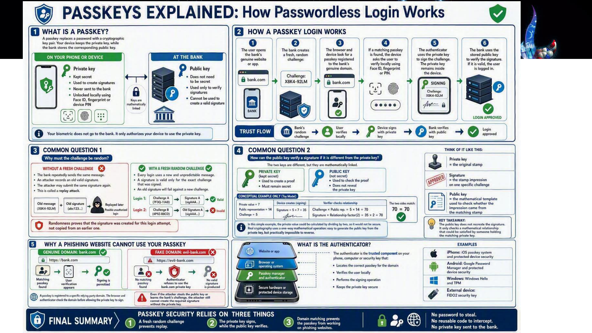

*Passkeys Explained：私钥留在设备里、只把签名发给银行；每次登录用新的随机 challenge 防重放；passkey 绑定域名，所以钓鱼网站拿不到可用签名（Slide 2）*

这页接的是之前讲认证和 PKI 的内容：passkey 是**无密码登录**，设备保存私钥（private key），银行只存公钥（public key）。登录时银行发一个**随机 challenge**，设备用私钥签名、银行用公钥验签。它比密码安全的三个原因（图底部 Final Summary）：

| 机制                 | 防的是什么                                               |
| ------------------ | --------------------------------------------------- |
| 每次都是新的随机 challenge | **Replay attack**：旧签名只对旧 challenge 有效，截获了也没用        |
| 私钥不离开设备，银行只存公钥     | 服务器被攻破也**没有密码可偷**                                   |
| Passkey 绑定真实域名     | **Phishing**：假域名 evil-bank.com 找不到匹配的 passkey，拿不到签名 |

> **💡 和 Colonial 案例的联系**
>
> Colonial 被攻破的入口，正是一个**只有用户名 + 密码、没有 MFA** 的遗留 VPN 账户，密码很可能因员工在别处重复使用而出现在暗网泄露库里。换成 passkey 或至少加上 MFA，光有泄露的密码是登不进去的。

---

## 2. 🔴 Contingency Planning（应急规划）是什么

### 2.1 定义与四大组件（p.8）

**Contingency Planning (CP)**：为**意外的不利事件**（unexpected adverse events）提前做准备的过程。它由四个主要组件构成：

| 组件                                     | 中文      | 回答的问题                                  |
| -------------------------------------- | ------- | -------------------------------------- |
| **Business Impact Analysis (BIA)**     | 业务影响分析  | 哪些业务最关键？停多久会出大事？损失值多少钱？（**其他三份计划的输入**） |
| **Incident Response Plan (IR plan)**   | 事件响应计划  | 发生安全事件时，怎么发现、遏制、清除、恢复？                 |
| **Disaster Recovery Plan (DR plan)**   | 灾难恢复计划  | 事件严重到失控时，怎么在**原址**把运营重建起来？             |
| **Business Continuity Plan (BC plan)** | 业务连续性计划 | 原址暂时用不了时，怎么在**备用地点**让关键业务继续运转？         |

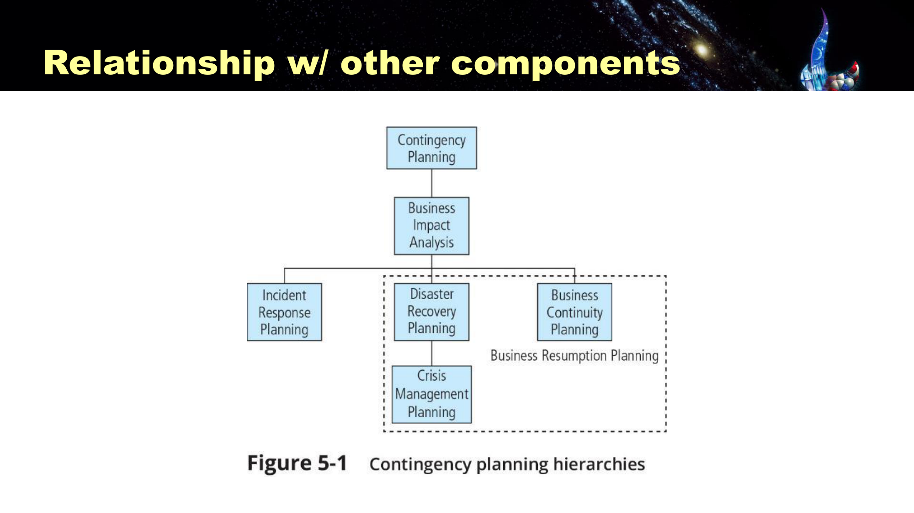

*Figure 5-1 Contingency planning hierarchies：CP 之下先做 BIA，再分出 IR / DR / BC 三份计划；DR 之下还有 Crisis Management Planning；虚线框里的 DR + BC + Crisis Management 合称 Business Resumption Planning（Slide 15）*

读图要点（箭头方向是从上往下「定义」下一层）：

- **BIA 在 IR / DR / BC 之上**：三份计划都要用 BIA 的结果决定先救哪个系统、恢复目标定多少。
- **Crisis Management Planning 挂在 DR 下面**：灾难时的对外沟通、人员安全、指挥链。
- **Business Resumption Planning = DR + BC（+ Crisis Management）**：有些组织把这几份合成一份计划。IR 不在虚线框里，因为多数 incident 不会升级到需要「恢复业务」的程度。

> **➕ IR / DR / BC 的分界（教材 Ch.5）**
>
> - **IR**：针对单个 incident，立即响应，目标是控制住、清除、恢复。
> - **DR**：incident 失控或破坏太大，升级成 disaster，目标是**在原址（primary site）重建运营**（课件 p.33 原话）。
> - **BC**：原址短期内用不了，**在备用地点（alternate site）**维持关键业务，常见的是 hot site / warm site / cold site。
>
> 三者经常同时启动：一次严重的勒索攻击可能同时触发 IR（清除恶意软件）、DR（重建服务器）和 BC（业务先切到备用系统）。

### 2.2 以网络攻击为例（p.6）

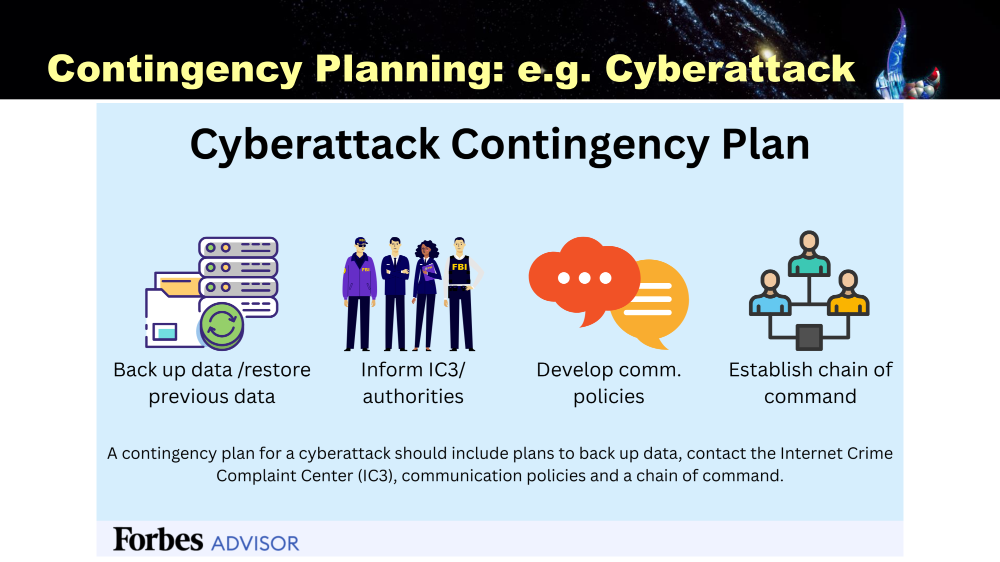

*Cyberattack Contingency Plan（Forbes Advisor）：备份并能恢复数据、通报 IC3 / 执法机关、制定沟通政策、建立指挥链（Slide 6）*

一份针对网络攻击的应急计划至少要有四样东西：**Back up data / restore previous data**（备份并能还原）、**Inform IC3 / authorities**（通报 FBI 的 Internet Crime Complaint Center 等机关）、**Develop communication policies**（对内对外怎么说）、**Establish chain of command**（谁拍板）。Colonial 案例里这四样都能找到对应（见 §15）。

### 2.3 香港金融业的要求（p.7）

**HKMA 对 Business Continuity Planning 的定义**：为以下四件事做规划和准备（出自 Supervisory Policy Manual **TM-G-2**）：

1. Identify impacts from disasters or emergencies（识别灾难或紧急情况的影响）
2. Develop recovery strategies（制定恢复策略）
3. Maintain continuity of operations（维持运营连续性）
4. Test and maintain recovery capabilities（测试并维护恢复能力）

指引内容包括 Governance、Business Impact Analysis、Recovery Strategy 等。

**趋势**：HKMA 已逐步从传统的 **BCP** 转向更广的 **Operational Resilience（运营韧性）** 模型（SPM **OR-2**，2022 年 5 月）。

> **💼 BCP 和 Operational Resilience 差在哪**
>
> 传统 BCP 的出发点是「某个系统 / 某栋楼坏了怎么恢复」，按资产思考；Operational Resilience 的出发点是「**不管什么原因中断，关键业务服务**（例如客户转账）**能不能在可容忍的中断时间内继续提供**」，按业务服务思考，并且默认中断**一定会发生**。这和上周 CrowdStrike 阅读材料里「韧性和预防一样重要」是同一个思路。

---

## 3. 🔴 NIST 应急规划方法论与 CP 团队

### 3.1 NIST CP 七步（p.10）

Contingency Planning Management Team (**CPMT**) 组建后，NIST 建议按以下七步编写 CP 文件：

1. **Develop the CP policy statement**（制定 CP 政策声明）
2. **Conduct the BIA**（开展业务影响分析）
3. **Identify preventive controls**（识别预防性控制）
4. **Create contingency strategies**（制定应急策略）
5. **Develop a contingency plan**（编写应急计划）
6. **Ensure plan testing, training, and exercises**（确保测试、培训和演练）
7. **Ensure plan updates and maintenance**（确保计划持续更新和维护）

> **🧠 记忆口诀：政 · 析 · 防 · 策 · 写 · 练 · 改**
>
> 先有**政**策授权，再做 BIA 分**析**，能**防**的先防，防不住的定应急**策**略，**写**成计划，演**练**，持续修**改**。第 6、7 步说明计划不是写完就完，这和 §6「每演练一次就改进一次」对应。

### 3.2 CPMT 做 BIA 的三个阶段（p.11，NIST SP 800-34 Rev. 1）

1. **Determine mission/business processes and recovery criticality**：确定业务流程及其恢复的关键程度
2. **Identify resource requirements**：识别每个流程依赖哪些资源（系统、人、数据）
3. **Identify recovery priorities for system resources**：确定系统资源的恢复优先顺序

第一项主要任务是**按与组织使命的关系，分析并排序业务流程**。每个部门都要**单独评估**，判断它的职能对整个组织有多重要。

### 3.3 谁在 CP 团队里（p.16）

**设计 CP 的关键人员**：CIO、系统管理员、CISO、主要的 IT 与业务经理。

**各项行动的负责人**（常考配对题）：

| 团队                                 | 负责人                                                        |
| ---------------------------------- | ---------------------------------------------------------- |
| **CPMT**（应急规划管理团队）                 | **COO**（首席运营官）                                             |
| **IR team**（事件响应团队）                | **CISO**                                                   |
| **DR team**（灾难恢复团队）                | **Manager of business operations**（业务运营经理）                 |
| **BC team**（业务连续性团队）               | **Manager of information systems and services**（信息系统与服务经理） |
| **Crisis management team**（危机管理团队） | **Legal counsel**（法律顾问）                                    |

> **⚠️ 踩坑：CPMT 的负责人是 COO，不是 CIO / CISO**
>
> 直觉上会以为应急规划归 IT 管，但课件写的是 **COO 领导 CPMT**：应急规划要决定「哪个业务先恢复」，这是业务决策，不是技术决策。CISO 只负责其中的 IR 团队。Colonial 的问题之一正是**没有 CISO**，网络安全职责挂在 CIO 下面的一个下属身上。

---

## 4. 🔴 BIA ①：时间指标 MTD / RTO / WRT / RPO（p.12）

**BIA 的作用**：判断哪些业务职能和信息系统对组织的成功**最关键**。

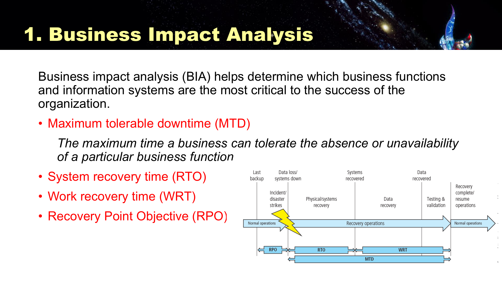

*Business Impact Analysis：MTD / RTO / WRT / RPO 标成红字；右下时间轴：Last backup →(RPO)→ Incident strikes →(RTO)→ Systems recovered →(WRT)→ Resume operations，MTD 覆盖 RTO + WRT（Slide 12）*

| 缩写      | 英文                                                 | 中文 / 小白解释                           | 时间轴上的位置              |
| ------- | -------------------------------------------------- | ----------------------------------- | -------------------- |
| **MTD** | Maximum Tolerable Downtime                         | 业务**最多能停多久**，超过就无法承受（课件唯一给了完整定义的一项） | 从事故发生到业务恢复运作         |
| **RTO** | Recovery Time Objective（课件写作 System recovery time） | **把系统本身修好**要多久                      | 事故发生 → 系统恢复          |
| **WRT** | Work Recovery Time                                 | 系统起来后，**补回数据、测试验证**，让业务真正能用要多久      | 系统恢复 → 恢复运作          |
| **RPO** | Recovery Point Objective                           | 最多能接受**丢失多长时间的数据**，也就是能回退到哪个时间点     | 上次备份 → 事故发生（往**回**看） |

> **🎯 考点：两条关系式**
>
> 1. **MTD ≥ RTO + WRT**：RTO 只是「系统起来了」，业务真正恢复还要加上 WRT。只满足 RTO 不等于满足 MTD。
> 2. **RPO 往过去看，RTO / WRT / MTD 往未来看**。RPO 决定**备份多频繁**（RPO = 1 小时 → 至少每小时备份一次），和恢复速度无关。

下面的实验把课件的时间轴做成可以调的：先点「同上，但测试验证拖太久」，看 RTO 达标但 MTD 被突破的情况；再点「每天才备份一次」，看 RPO 不达标的情况。

*（网页版此处可交互：自己调备份间隔、RPO、RTO、WRT、MTD，时间轴实时变化；下表是几个预设场景的结果）*

| 场景            | 停机 = RTO + WRT                  | MTD         | 数据丢失                    | RPO     |
| ------------- | ------------------------------- | ----------- | ----------------------- | ------- |
| 银行核心系统（达标）    | 2 小时 + 1 小时 = 3 小时 vs MTD 4 小时  | 达标          | 备份间隔 15 分钟 vs RPO 15 分钟 | 达标      |
| 同上，但测试验证拖太久   | 2 小时 + 3 小时 = 5 小时 vs MTD 4 小时  | **超出 1 小时** | 备份间隔 15 分钟 vs RPO 15 分钟 | 达标      |
| 电商订单库：每天才备份一次 | 4 小时 + 2 小时 = 6 小时 vs MTD 12 小时 | 达标          | 备份间隔 24 小时 vs RPO 1 小时  | **不达标** |

> **💡 小白类比：停电的餐厅**
>
> 餐厅停电。**RPO**：冰箱温度记录每 4 小时记一次，停电后最多有 4 小时的记录找不回来。**RTO**：电工 2 小时修好电路。**WRT**：来电后还要检查食材、重新预热烤箱，又花 1 小时。**MTD**：午市 3 小时后开始，这之前恢复不了就要关门一天。2 + 1 = 3，刚好卡线。

---

## 5. 🔴 BIA ②：金钱影响 ARO / EF / SLE / ALE（p.13）

时间算完，再做 **Likelihood Assessment（可能性评估）**，把风险换成钱：

| 缩写      | 英文                            | 定义                                 | 公式                  |
| ------- | ----------------------------- | ---------------------------------- | ------------------- |
| **AV**  | Asset Value                   | 资产价值                               | —                   |
| **EF**  | Exposure Factor               | 一次事件会毁掉资产价值的**百分之几**               | % of AV             |
| **SLE** | Single Loss Expectancy        | **发生一次**预计损失多少钱                    | **SLE = AV × EF**   |
| **ARO** | Annualized Rate of Occurrence | **一年**预计发生几次（可以小于 1，50 年一遇 = 0.02） | 次 / 年               |
| **ALE** | Annualized Loss Expectancy    | **正常一年**因这个风险预计损失多少钱               | **ALE = SLE × ARO** |

> **🧠 和 Lesson 5 定量评估的对应**
>
> 这其实是 Lesson 5 Quantitative Risk Assessment 的另一种写法：**ARO ≈ Loss Frequency**（多常发生），**SLE ≈ Loss Magnitude**（一次多大），**ALE ≈ Calculated Risk**（两者相乘）。考试给的是哪套符号，就用哪套公式。

**Cost-Benefit Analysis（CBA，教材 Ch.4 公式）**：算出 ALE 后，判断一项控制值不值得买：

> **CBA = ALE（控制前）− ALE（控制后）− ACS**（ACS = Annualized Cost of Safeguard，控制每年的成本）  
> CBA > 0 → 经济上划算。

*（网页版此处可交互：自己填 AV / EF / ARO 和控制后的数值；下表是预设场景的结果）*

| 场景                      | SLE = AV × EF                 | ALE = SLE × ARO             | 控制后 ALE | ACS      | CBA               |
| ----------------------- | ----------------------------- | --------------------------- | ------- | -------- | ----------------- |
| 勒索软件 × 计费系统，加 MFA + EDR | $1,000,000 × 40% = $400,000   | $400,000 × 0.5 = $200,000   | $40,000 | $50,000  | $110,000（划算）      |
| 同一风险，但控制每年花 25 万        | $1,000,000 × 40% = $400,000   | $400,000 × 0.5 = $200,000   | $40,000 | $250,000 | **−$90,000（不划算）** |
| 洪水 × 数据中心（50 年一遇），建异地灾备 | $5,000,000 × 60% = $3,000,000 | $3,000,000 × 0.02 = $60,000 | $10,000 | $100,000 | **−$50,000（不划算）** |

> **⚠️ 踩坑：ALE 会低估低频高损的风险**
>
> 试试「洪水 × 数据中心」这个预设：50 年一遇，ALE 只有 $60,000，建异地灾备每年 $100,000，CBA 是负的。但洪水一旦发生，一次就损失 $3,000,000，停机时间很可能远超 MTD。所以 ALE 适合比较**常见的、中等损失**的风险；**低频高损**的事件要回到 §4 的 MTD 和监管要求去判断。这也是为什么银行被监管要求必须有灾备，不能自己算账决定。

---

## 6. 🟡 BIA ③：Cost vs Benefit 平衡点（p.14）


*Figure 5-5 Cost balancing：横轴是中断时长；Cost of disruption（业务影响）随中断时间变长而上升，Cost to recover 随允许的恢复时间变长而下降（从 system mirror 到 tape backup）；两条曲线交点是 Cost Balance Point（Slide 14）*

两条曲线的意思：

- **Cost of disruption（橙线，上升）**：业务停得越久，损失越大，而且是加速上升。
- **Cost to recover（紫线，下降）**：要求恢复得越快，方案越贵。想几乎零停机就要 **system mirror**（实时镜像，最贵）；能接受停几天，用 **tape backup**（磁带备份，最便宜）就行。
- **Cost Balance Point（交点）**：总成本最低的位置。恢复方案不是越快越好，而是找到「多花的恢复成本 = 少亏的中断损失」的那个点。

> **💡 连到 MTD**
>
> MTD 是这张图上的一条**硬上限**：平衡点如果落在 MTD 右边，说明「最省钱」的方案会让业务停到撑不住，这时只能多花钱，选更快的方案。

---

## 7. 🟡 测试应急计划（p.17–19）

**核心观点**：几乎没有计划能**照最初写的版本直接执行**。计划必须经过测试，才能找出其中的漏洞、错误和低效流程。

三种主要测试策略（由浅到深）：

| 策略                                           | 做法                               | 成本 / 真实度 |
| -------------------------------------------- | -------------------------------- | -------- |
| **Checklist**（清单检查）                          | 把计划和清单发给每个相关人员，各自核对自己的职责和资源是否齐全  | 最低       |
| **Structured walk-through / Tabletop**（桌面推演） | 相关人员坐在一起，按一个假设情景，逐步口头推演「这时候谁做什么」 | 中        |
| **Simulation**（模拟演练）                         | 各人按真实情况执行自己的步骤，但不真的中断业务运作        | 较高       |

> **每演练一次，计划就应该改进一次。**持续评估和改进才能带来更好的结果。

> **➕ 教材还有两种更深的测试**
>
> **Parallel testing**（平行测试：备用系统真的跑起来，但主系统照常运作）和 **Full interruption**（完全中断：真的关掉主系统切到备用，风险最高）。课件只列了前三种，考试按课件答。

### 7.1 最佳实践：HKMA 的 Cyber Resilience Testing Framework（p.18）

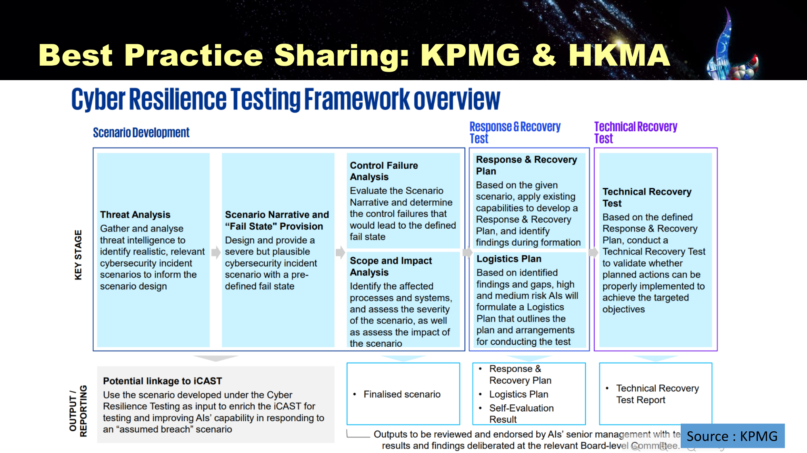

*KPMG 整理的 HKMA Cyber Resilience Testing Framework (CRTF)：Scenario Development → Response & Recovery Test → Technical Recovery Test，输出要经高管和董事会级别委员会审阅（Slide 18）*

流程按左到右读：

1. **Scenario Development（设计情景）**
   - **Threat Analysis**：收集分析威胁情报，找出真实、相关的网络事件情景
   - **Scenario Narrative & "Fail State" Provision**：写出一个严重但合理（severe but plausible）的情景，并设定一个**预先定义的失败状态**
   - **Control Failure Analysis**：推演哪些控制失效会导致这个 fail state
   - **Scope and Impact Analysis**：识别受影响的流程和系统，评估严重程度
2. **Response & Recovery Test**：按情景用现有能力制定 Response & Recovery Plan，找出缺口；针对高、中风险的缺口制定 Logistics Plan
3. **Technical Recovery Test**：按计划做技术恢复测试，验证计划的行动能否达成目标

产出（Finalised scenario、Response & Recovery Plan、Technical Recovery Test Report）要经**高管审阅、董事会级别委员会讨论**。设计出的情景还可以用于 **iCAST**（以「已被攻破」为前提的演练）。

### 7.2 Fail State 情景示例（p.19）

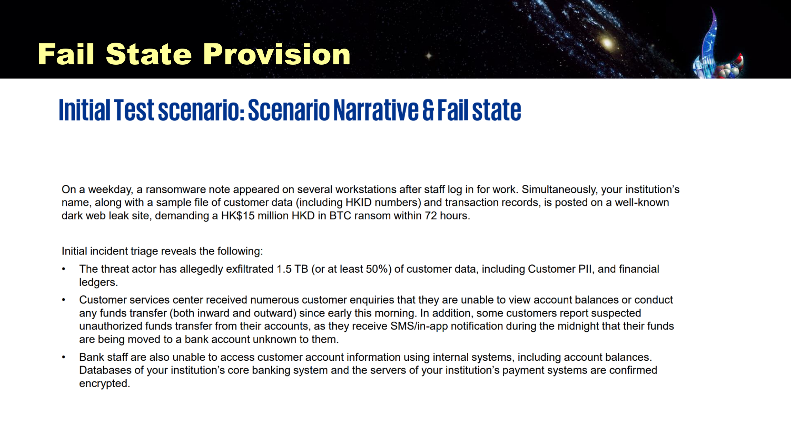

*Initial Test Scenario：工作日早上多台电脑出现勒索信，客户资料被放上暗网泄露网站，要求 72 小时内付 HK$15M 等值比特币；客户查不到余额、出现可疑转账，员工也进不了内部系统，核心银行系统数据库被加密（Slide 19）*

情景要点：攻击者声称窃取了 **1.5 TB（至少 50%）客户数据**（含 HKID、交易记录）；客服中心收到大量查询，客户**看不到余额、无法转账**，还有人收到半夜的**未授权转账**通知；员工也用不了内部系统；**核心银行系统和支付系统的数据库已被确认加密**。

> **✍️ 桌面推演：拿到这个情景，头几个小时按 IR 阶段怎么排（我的解答）**
>
> 课件没给答案，下面是按本课 NIST 流程推的：
>
> 1. **Detection & Analysis**：确认影响范围（哪些系统被加密、数据是否真被外泄，比对暗网样本）；按功能影响（客户无法转账）、信息影响（HKID 外泄）定为**最高优先级**；启动 CPMT / CSIRT，**通报 HKMA**（银行按 §11 的 HKMA 表格报告）和警方。
> 2. **Containment**：隔离被感染网段、停用可疑账户、冻结可疑的出账交易；**先保全证据**（磁盘镜像、日志）再动系统。
> 3. **Crisis communication**（Crisis management team，法律顾问牵头）：统一口径通知客户，提醒客户防范冒充银行的诈骗。
> 4. **BC**：核心系统恢复前，启用人工或备用流程维持最基本的服务。
> 5. **赎金决策**：这正是 Colonial 当年**计划里缺的一项**。应事先写明谁有权决定、需要咨询哪些方面（法律、制裁名单、执法机关）。
>
> 这个情景和 Colonial 高度相似（加密 + 窃取数据的**双重勒索**），可以两者对照复习。

---

## 8. 🔴 Incident Response：NIST 四阶段（p.21）

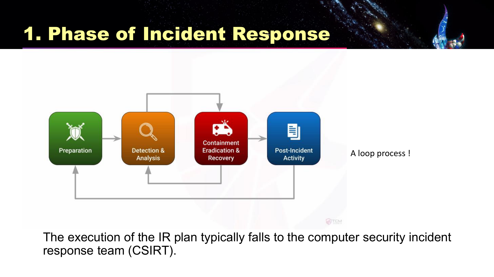

*Phase of Incident Response：Preparation → Detection & Analysis → Containment, Eradication & Recovery → Post-Incident Activity；Containment 可以回到 Detection，Post-Incident 回到 Preparation，是一个循环（A loop process!）（Slide 21）*

IR plan 通常由 **CSIRT（Computer Security Incident Response Team，计算机安全事件响应团队）**执行。

| 阶段                                         | 做什么                             |
| ------------------------------------------ | ------------------------------- |
| **1. Preparation**                         | 事前：写 IR 计划、组建 CSIRT、准备工具、培训、演练  |
| **2. Detection & Analysis**                | 判断是否真的发生了事件、分析范围、定优先级、**通报**    |
| **3. Containment, Eradication & Recovery** | 保全证据 → 遏制扩散 → 清除威胁 → 恢复系统       |
| **4. Post-Incident Activity**              | 写跟进报告、开 lessons learned 会议、更新计划 |

> **🎯 考点：图上的两条回路**
>
> 1. **Containment → Detection & Analysis**：清除时发现新的受感染主机，就要回到检测分析找出所有受影响主机，再遏制、清除（就是清单 6.3）。
> 2. **Post-Incident → Preparation**：事后的教训用来更新计划，成为下一次的准备。所以 IR 是 **loop process**，不是一条直线。

---

## 9. 🔴 NIST Incident Handling Checklist（p.22–24）

三页清单按阶段整理：

| 阶段                                      | #   | Action                                                                                               |
| --------------------------------------- | --- | ---------------------------------------------------------------------------------------------------- |
| **Detection & Analysis**                | 1   | **Determine whether an incident has occurred**（判断事件是否发生）                                             |
|                                         | 1.1 | Analyze the precursors and indicators（分析前兆和迹象）                                                       |
|                                         | 1.2 | Look for correlating information（找关联信息）                                                              |
|                                         | 1.3 | Perform research（查搜索引擎、知识库）                                                                          |
|                                         | 1.4 | 一旦认为事件已发生，**立即开始记录调查过程并收集证据**                                                                        |
|                                         | 2   | **Prioritize** handling the incident（按功能影响、信息影响、恢复难度等定优先级）                                           |
|                                         | 3   | **Report** the incident to appropriate internal personnel and external organizations（向内部相关人员和外部机构通报） |
| **Containment, Eradication & Recovery** | 4   | **Acquire, preserve, secure, and document evidence**（获取、保全、保护并记录证据）                                  |
|                                         | 5   | **Contain** the incident（遏制）                                                                         |
|                                         | 6   | **Eradicate** the incident（根除）                                                                       |
|                                         | 6.1 | Identify and mitigate all vulnerabilities that were exploited（修补被利用的漏洞）                              |
|                                         | 6.2 | Remove malware, inappropriate materials, and other components（清除恶意软件等）                               |
|                                         | 6.3 | 又发现受影响主机 → 重复 1.1、1.2 找出全部，再做 5、6                                                                    |
|                                         | 7   | **Recover** from the incident（恢复）                                                                    |
|                                         | 7.1 | Return affected systems to an operationally ready state（恢复到可运作状态）                                    |
|                                         | 7.2 | Confirm that the affected systems are functioning normally（确认运作正常）                                   |
|                                         | 7.3 | 必要时**加强监控**，留意后续相关活动                                                                                 |
| **Post-Incident Activity**              | 8   | Create a **follow-up report**（写跟进报告）                                                                 |
|                                         | 9   | Hold a **lessons learned meeting**（重大事件必须开，其他可选）；多数组织会把结论写下来，用来更新计划、政策和流程                            |

> **⚠️ 踩坑：两个容易放错阶段的步骤**
>
> - **Report（第 3 步）在 Detection & Analysis**，不是事后才报。确认事件并定好优先级后就要通报。
> - **保全证据（第 4 步）在 Containment 之前**，而且在同一个阶段里排第一。先留证据再动系统，否则一重装、一清除，证据就没了。
> - 另外，**加强监控（7.3）属于 Recovery**，不是 Post-Incident。

下面的练习用 Colonial Pipeline 案例里的真实动作，加上清单里的步骤，练习判断属于哪个阶段：

*（网页版此处是「这一步属于 IR 哪个阶段」的点选练习；下表是全部题目和答案）*

| 动作                                                                                      | 阶段                                      | 理由                                                                                                                                                             |
| --------------------------------------------------------------------------------------- | --------------------------------------- | -------------------------------------------------------------------------------------------------------------------------------------------------------------- |
| 事发前：Colonial 给全体员工定期做模拟钓鱼演练，并规定从 CEO 到现场操作员每个人都有 stop-work authority（发现系统安全有风险就可以叫停作业）。 | **Preparation**                         | 事故还没发生时做的培训、授权、演练，都是在为事故「备好工具和规矩」——属于 Preparation。正因为提前授权，5 月 7 日早上控制室员工才敢直接关停管道。                                                                              |
| 5 月 7 日凌晨约 5 点，控制室员工在计费和会计系统里发现被锁的数据和勒索信，立即上报主管。                                        | **Detection & Analysis**                | 发现征兆（indicator）、确认事故确实发生，是 NIST 清单第 1 步 Determine whether an incident has occurred。                                                                            |
| 和公司 IT 商量后下达 stop-work order，15 分钟内关停全部 5,500 英里管道，目的是防止恶意软件蔓延到管道的 OT 控制系统。             | **Containment, Eradication & Recovery** | 目标是「不让它扩散」，这就是 Contain the incident（清单第 5 步）。它也是课件 Reaction 一栏的 containment strategy：把可能被波及的系统先断开。                                                             |
| 关停管道的同时，指示员工不要登录公司网络。                                                                   | **Containment, Eradication & Recovery** | 限制攻击者和恶意软件继续利用被感染的网络，属于遏制措施（类似 Disable compromised accounts / services）。                                                                                       |
| 当天高管给 FBI、CISA、能源部等十来个联邦机构打电话通报事件。                                                      | **Detection & Analysis**                | 容易选错。NIST 清单把 Report the incident to the appropriate internal personnel and external organizations（第 3 步）放在 Detection & Analysis 阶段：确认事故、定好优先级后就要通报，不是等到事后。    |
| Mandiant 扫描整个网络，判断攻击者到底深入到哪里，结论是没有证据显示攻击者进入了更关键的 OT 系统。                                 | **Detection & Analysis**                | 确定影响范围、寻找关联信息，是分析工作（清单 1.1–1.3）。先要知道「波及了什么」，才能决定遏制和恢复的范围。                                                                                                      |
| 按功能影响、信息影响、恢复难度判断这次事故的优先级。                                                              | **Detection & Analysis**                | 清单第 2 步 Prioritize handling the incident based on the relevant factors (functional impact, information impact, recoverability effort)，属于 Detection & Analysis。 |
| 获取并保全证据：做受感染服务器的磁盘镜像、保存日志，并记录证据保管链。                                                     | **Containment, Eradication & Recovery** | 也容易选错。NIST 把 Acquire, preserve, secure, and document evidence（第 4 步）放在 Containment, Eradication & Recovery 阶段的开头：在清除、重装之前先把证据留住，否则一重装就没了。                      |
| 从被感染的主机上清除勒索软件，并修补被利用的漏洞（例如停用那个遗留的 VPN 账户）。                                             | **Containment, Eradication & Recovery** | Eradicate the incident（清单第 6 步，6.1 修补被利用的漏洞、6.2 清除恶意软件）。                                                                                                       |
| 解密工具太慢，Colonial 主要用备份恢复系统，并分阶段重启管道。                                                     | **Containment, Eradication & Recovery** | Recover from the incident：让受影响系统回到可运行状态并确认运作正常（清单 7.1–7.2）。                                                                                                    |
| 恢复运行后，Mandiant 安装新的检测工具，监控攻击者会不会再来（二次攻击）。                                               | **Containment, Eradication & Recovery** | 清单 7.3 If necessary, implement additional monitoring to look for future related activity，仍属于 Recovery 这一段，不是 Post-Incident。                                    |
| 写一份事后跟进报告，记录每个行动的 who / what / when / where / why / how。                                | **Post-Incident Activity**              | Create a follow-up report（清单第 8 步）。课件 p.27：这份文档事后可以当案例检查决策是否正确，也能证明组织尽了一切努力阻止事故扩散。                                                                             |
| 召开 lessons learned 会议，把「要不要付赎金、谁来决定」写进应急计划（国会听证时议员批评它的计划里完全没有赎金条款）。                     | **Post-Incident Activity**              | Hold a lessons learned meeting（第 9 步），并用结论更新计划、政策、流程。更新后的计划又成为下一轮的 Preparation，这就是课件强调的 loop process。                                                          |

---

## 10. 🔴 Reaction vs Recovery（p.25）

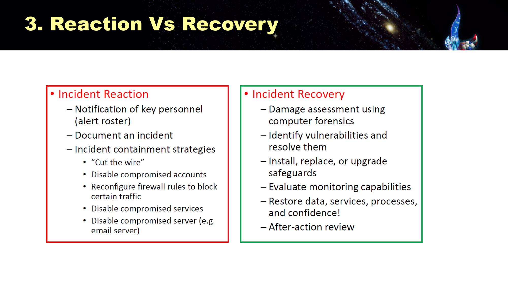

*Incident Reaction（红框）vs Incident Recovery（绿框）（Slide 25）*

| **Incident Reaction**（反应：止血）                                                                                                                                                                                                                                                   | **Incident Recovery**（恢复：复原）                                               |
| ------------------------------------------------------------------------------------------------------------------------------------------------------------------------------------------------------------------------------------------------------------------------------ | -------------------------------------------------------------------------- |
| **Notification of key personnel**：按 **alert roster**（紧急联络名单）通知关键人员                                                                                                                                                                                                             | **Damage assessment** using computer forensics：用计算机取证评估损害                  |
| **Document an incident**：记录事件                                                                                                                                                                                                                                                  | Identify vulnerabilities and resolve them：找出并修补漏洞                          |
| **Incident containment strategies**（遏制策略）：• "**Cut the wire**"（直接断网）• Disable compromised accounts（停用被入侵的账户）• Reconfigure firewall rules to block certain traffic（改防火墙规则挡流量）• Disable compromised services（停用被入侵的服务）• Disable compromised server, e.g. email server（停用被入侵的服务器） | Install, replace, or upgrade safeguards：安装、替换或升级防护措施                       |
|                                                                                                                                                                                                                                                                                | Evaluate monitoring capabilities：评估监控能力                                    |
|                                                                                                                                                                                                                                                                                | **Restore data, services, processes, and confidence!**：恢复数据、服务、流程，**还有信心** |
|                                                                                                                                                                                                                                                                                | **After-action review**：事后复盘                                               |

> **💡 Recovery 里为什么有「confidence」**
>
> 技术上系统恢复了，客户、员工、监管机构还不一定信你。Colonial 重启管道后，东岸仍然出现抢购汽油的恐慌。恢复信心要靠沟通，这就是 Crisis management team 的工作。

---

## 11. 🟡 Post-Incident Activity：Reporting（p.27 / p.30 重复出现）

- 事件一经确认、通报流程启动，团队就应**开始记录**。
- 记录每个行动的 **who, what, when, where, why, and how**（谁、做了什么、何时、何地、为什么、怎么做）。
- 用途 ①：事后当作**案例**，检查当时的行动是否正确、是否有效。
- 用途 ②：**证明组织已经尽了一切努力阻止事件扩散**（面对监管、诉讼、保险理赔时很重要）。

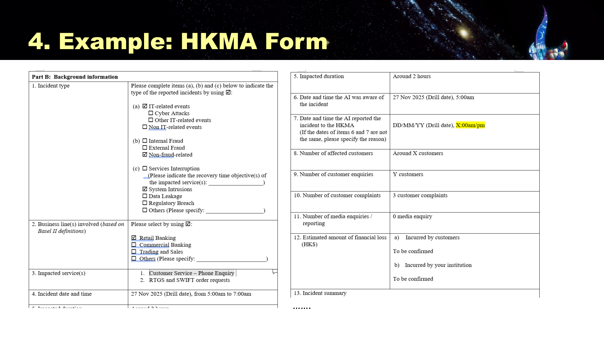

*HKMA 事件报告表（演练版）：Part B 背景信息要填事件类型（IT 相关 / 诈骗 / 服务中断 / 系统入侵 / 数据泄露…）、受影响业务线、受影响服务、事件时间和持续时长、发现时间与向 HKMA 报告的时间、受影响客户数、客户查询和投诉数、媒体查询数、预计财务损失（Slide 28）*

> **🎯 考点：HKMA 表格里的两个时间**
>
> 表格要**分别**填「机构**知道**事件的时间」和「**向 HKMA 报告**的时间」，如果两个日期不同还要说明原因。监管关注的是**从发现到报告隔了多久**，这就是 §16 条例里「12 小时内报告」这类规定的计时起点。

---

## 12. 🟡 响应网络事件的常见缺口与 AI 带来的新要求

### 12.1 KPMG：四个关键缺口（p.31）

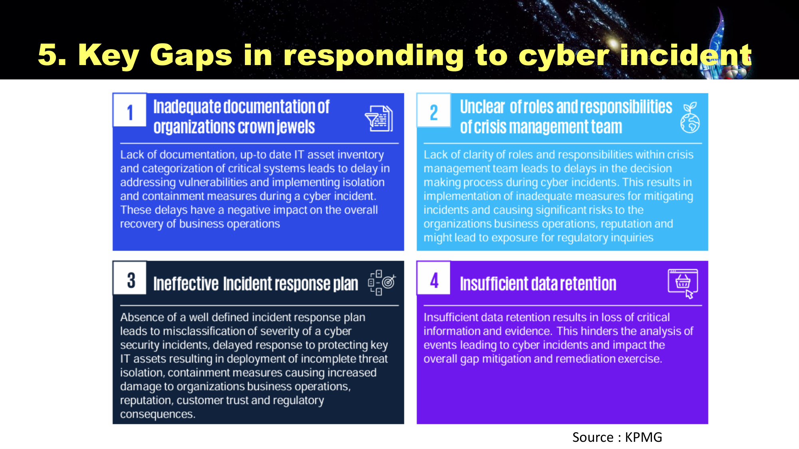

*Key Gaps in responding to cyber incident（KPMG）（Slide 31）*

| # | 缺口                                                                                  | 后果                                      |
| - | ----------------------------------------------------------------------------------- | --------------------------------------- |
| 1 | **Inadequate documentation of organization's crown jewels**（「皇冠上的宝石」，即最关键资产，没有记录清楚） | 没有最新的 IT 资产清单和关键系统分类，事件发生时**隔离和遏制会被拖慢** |
| 2 | **Unclear of roles and responsibilities of crisis management team**                 | 危机管理团队职责不清，**决策被拖慢**，缓解措施做得不够，可能引来监管调查  |
| 3 | **Ineffective incident response plan**                                              | 没有清楚的 IR 计划，事件**严重程度判断错误**、响应迟缓、隔离不完整   |
| 4 | **Insufficient data retention**                                                     | 数据保留不足，**关键信息和证据丢失**，无法分析事件经过和影响        |

> **💡 四个缺口对应本课哪一节**
>
> 缺口 1 → BIA 没做好（§3、§4）；缺口 2 → CP 团队分工（§3.3）；缺口 3 → IR 计划与清单（§8、§9）；缺口 4 → 证据保全与数字取证（§9 第 4 步、§14）。可以把这张表当成本课的总结。

### 12.2 HKMA：应对 AI 驱动的攻击（p.32）

来源：HKMA 2026 年通函 *Strengthening Cyber Resilience amid Artificial Intelligence*。背景是 **AI 模型已显示出能自主发现并利用关键软件和基础设施里的零日漏洞**，可能让攻击「商品化」，不再需要太多人类专业知识。银行应该：

1. **检视并评估**现有网络防御控制是否足够
2. **提升**事件响应和恢复能力
3. **加强数据韧性**，对抗破坏性网络攻击
4. 成立 **Task Force on AI-Driven Cyber Risk**，做情报共享
5. 发展 **Cyber Resilience Testing Framework (CRTF)**（就是 §7.1 那个框架）

---

## 13. 🔴 Incident vs Disaster 与 Disaster Recovery（p.29、p.33）

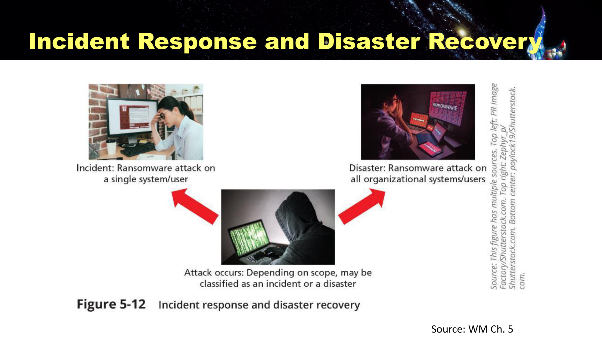

*Figure 5-12 Incident response and disaster recovery：同一种攻击，只影响单一系统 / 用户时是 incident，影响全部系统 / 用户时就是 disaster（Slide 29）*

**Disaster Recovery Planning (DRP)**：为灾难（无论自然还是人为）做准备并从中恢复。

**什么时候 incident 升级为 disaster**（满足任一）：

- 组织**无法遏制或控制**事件的影响，或
- 事件造成的损害或破坏**严重到组织无法快速恢复**

**DR 计划的关键作用**：定义如何在组织平时所在的地点（**primary site**，原址）**重建运营**。

> **🎯 考点：分界看的是「范围 + 能否控制」，不是攻击类型**
>
> Figure 5-12 的重点：**同样是勒索软件**，只加密一台电脑是 incident，走 IR 流程；加密了全公司的系统就是 disaster，要启动 DR。Colonial 的核心 IT 系统被加密、整条管道被迫停运 6 天，已经是 disaster 级别，所以 IR（Mandiant 清除）、DR（用备份重建系统）、BC（部分支线改为**人工操作**、派人巡线代替电子监控）三者是同时启动的。

---

## 14. 🟡 Digital Forensics（数字取证，p.35）

**用途**：查清**发生了什么、事件是怎么发生的**。

**内容**：对数字介质做 **preservation（保全）、identification（识别）、extraction（提取）、documentation（记录）、interpretation（解读）**，用于**取证（evidentiary）和 / 或根因分析（root-cause analysis）**。

**两个主要目的**：

1. **Investigate allegations of wrong conduct**：调查不当行为的指控（例如内部员工泄密）
2. **Perform root cause analysis**：做根因分析

**多数组织的现实做法**：

- 负担不起**常设**的数字取证团队
- **自己收集数据，把分析外包**
- 从外部聘请，或通过培训获得专业能力

> **💡 Colonial 就是「收集数据 + 外包分析」的例子**
>
> Colonial 在事发约一小时内请来 **Mandiant**。Mandiant 查出根因：一个**已不使用但没有停用**的遗留 VPN 账户，**没有 MFA**，密码出现在暗网泄露的密码库里。这就是 root cause analysis。

---

## 15. 🟡 课堂讨论：Colonial Pipeline 勒索攻击（p.5、p.26）

**事件速览**：2021 年 5 月 7 日，美国最大的成品油管道（输送美国东岸约 45% 的燃油）遭 **DarkSide** 勒索软件攻击；为防止恶意软件扩散到管道控制系统，公司**主动关停整条管道 6 天**；CEO 当天决定支付 **75 BTC（约 440 万美元）**赎金，之后 FBI 追回其中 63.7 BTC。

**p.26 的三道讨论题**：

1. Colonial 处理危机的方式恰当吗？哪些做得好，哪些可以做得更好？
2. 组织应该如何管理日益增加的数据泄露威胁？勒索攻击期间，高管分别扮演什么角色？
3. 你同意 CEO Blount 付赎金的决定吗？

> **📌 完整解析在 Readings**
>
> 案例时间线、按 NIST 阶段逐项评分、三道讨论题的答题框架（包括付赎金的正反论证），都整理在本课程 Readings 栏目的**《Colonial Pipeline 勒索攻击案例解析》**里。考试前至少要能用一两句话回答上面三道题。

---

## 16. 🔴 香港《保护关键基础设施（计算机系统）条例》（p.37–39）

### 16.1 香港网络安全法规路线图（p.37）

香港在 2021–2026 年间，从过时的、以**事后检控**为主的电脑滥用罪行，转向**事前预防、按行业划分**的网络安全监管框架。

| 年份       | 法规 / 政策                         | 改变了什么                                   |
| -------- | ------------------------------- | --------------------------------------- |
| **2021** | 《个人资料（私隐）条例》(PDPO) 修订：**反起底**罪行 | 把起底（doxxing）定为刑事罪行，赋予私隐专员 (PCPD) 调查和检控权 |
| **2025** | PDPO **云计算指引**（更新）              | 厘清使用云服务的法律责任：加密、访问控制、审计、供应商合约、跨境数据处理    |
| **2026** | **《保护关键基础设施（计算机系统）条例》**         | 香港**第一个预防性**网络安全制度：强制风险评估、审计和事件报告       |

### 16.2 覆盖范围（p.38）

| 类别       | 说明                                            |
| -------- | --------------------------------------------- |
| **类别 1** | 在香港提供**必要服务**的基础设施：银行和金融机构、电讯服务商、电力供应设施、铁路系统等 |
| **类别 2** | 维持重要**社会和经济活动**的其他基础设施：大型体育和表演场馆、科研园区等        |
| **不适用**  | **政府**营运的必要服务（例如供水、紧急救援），理由是政府已有同等要求的内部政策指引   |

### 16.3 合规义务（p.39）

关键基础设施营运者（**Critical Infrastructure Operators, CIO**，注意这里的 CIO 不是首席信息官）要满足：

| 义务                           | 要求                                                           |
| ---------------------------- | ------------------------------------------------------------ |
| **Security Management Unit** | 设立专责单位，监督其**关键计算机系统（Critical Computer Systems, CCS）**的网络安全措施 |
| **Risk Assessments**         | **每年**做一次安全风险评估，**每两年（biennial）**做一次独立审计                     |
| **Incident Reporting**       | **严重事件 12 小时内**向专员报告；其他事件课件写 **24 小时内**                      |

> **⚠️ 注意：「其他事件」的时限，课件和正式条例不一致**
>
> 课件 p.39 写的是其他事件 **24 小时**内报告。条例正式文本（**2026 年 1 月 1 日生效**）规定的是：严重事件 **12 小时**、其他事件 **48 小时**（「知悉」事件后起算）。**考试按课件答 12 / 24**，但要知道正式条例是 48 小时；如果考题问的是现行法规，可以两个都写并说明出处。

> **🧠 记忆口诀：1 · 1 · 2 · 12**
>
> **1** 个专责单位，**1** 年一次风险评估，**2** 年一次独立审计，严重事件 **12** 小时内报告。

> **💼 和 Colonial 对照**
>
> Colonial 事件发生时，美国管道行业**没有强制性的网络安全标准**；事后 TSA 才要求管道营运者遇到网络攻击时必须通报。香港这条条例是在**事前**就把关键基础设施纳入强制评估、审计和报告，正是 p.37 说的「从事后检控转向事前预防」。如果 Colonial 在香港，它属于类别 1（能源供应）。

---

## 17. 🟢 其他参考

- **p.40 Cloud Regulatory Reference**：HKMA 的 SPM（外判 SA-2、科技风险管理 TM-G-1、业务持续规划 TM-G-2、网络风险 TM-C-1、运营韧性 OR-2）、HKMA 通函（2026 年 1 月《Practice Guide on Cloud Adoption》等）、私隐专员公署的云计算和 AI 指引。按 Outsourcing / Resilience / Data Protection / AI 四个主题分类，写作业时可以按主题找依据。
- **p.41 延伸阅读**：香港银行学会 *Banking Today* 第 149 期《Cybersecurity for Banks after the Critical Infrastructure Ordinance》。

---

## 🔴 综合缩写速查表

| 缩写          | 全称                                                                  | 一句话                                                                                          |
| ----------- | ------------------------------------------------------------------- | -------------------------------------------------------------------------------------------- |
| CP          | Contingency Planning                                                | 为意外不利事件提前做准备；由 BIA + IR + DR + BC 组成                                                         |
| CPMT        | Contingency Planning Management Team                                | 编写 CP 的团队，**COO** 领导                                                                         |
| BIA         | Business Impact Analysis                                            | 找出最关键的业务和系统，是其他计划的输入                                                                         |
| MTD         | Maximum Tolerable Downtime                                          | 业务最多能停多久，**≥ RTO + WRT**                                                                     |
| RTO         | Recovery Time Objective                                             | 系统本身恢复要多久                                                                                    |
| WRT         | Work Recovery Time                                                  | 系统恢复后补数据、验证要多久                                                                               |
| RPO         | Recovery Point Objective                                            | 最多丢多少时间的数据，决定备份频率                                                                            |
| AV / EF     | Asset Value / Exposure Factor                                       | 资产价值 / 一次事件损失的百分比                                                                            |
| SLE         | Single Loss Expectancy                                              | **AV × EF**                                                                                  |
| ARO         | Annualized Rate of Occurrence                                       | 一年发生几次                                                                                       |
| ALE         | Annualized Loss Expectancy                                          | **SLE × ARO**                                                                                |
| CBA         | Cost-Benefit Analysis                                               | ALE前 − ALE后 − ACS 大于 0 就划算                                                                   |
| IR / CSIRT  | Incident Response / Computer Security Incident Response Team        | 事件响应 / 执行 IR 计划的团队，**CISO** 领导                                                               |
| DR          | Disaster Recovery                                                   | 灾难后在**原址**重建运营                                                                               |
| BC          | Business Continuity                                                 | 在**备用地点**维持关键业务                                                                              |
| NIST IR 四阶段 | —                                                                   | Preparation → Detection & Analysis → Containment, Eradication & Recovery → Post-Incident（循环） |
| CRTF        | Cyber Resilience Testing Framework                                  | HKMA 的网络韧性测试框架（情景 + fail state）                                                              |
| CI 条例       | Protection of Critical Infrastructures (Computer Systems) Ordinance | 专责单位、每年评估、两年审计、严重事件 12 小时报告                                                                  |

---

## 模拟自测题

**Contingency Planning 由哪四个组件构成？为什么 BIA 排在最前面？**

> **BIA、IR plan、DR plan、BC plan**。BIA 先回答「哪些业务最关键、最多能停多久、损失值多少钱」，IR / DR / BC 都要用这些结果决定**先救哪个系统、恢复目标定多少**。Figure 5-1 里 BIA 就画在另外三份计划的上面。

**某系统的 RTO 是 3 小时，WRT 是 2 小时，业务的 MTD 是 4 小时。这个恢复方案达标吗？**

> **不达标**。业务真正恢复要 RTO + WRT = 5 小时，超过 MTD 4 小时。只看 RTO（3 小时 ≤ 4 小时）会误判为达标。要么缩短 RTO / WRT（例如热备、自动化验证），要么换更高等级的灾备方案。

**RPO 设为 1 小时，但公司每天凌晨才备份一次。问题在哪里？**

> RPO 是「最多能接受丢多少时间的数据」，决定的是**备份频率**。每天备份一次，最坏情况（事故发生在下次备份之前）会丢将近 **24 小时**的数据，远超 1 小时。要满足 RPO，至少每小时备份一次，或者用日志传送、实时复制。

**一台服务器价值 $200,000，一次勒索攻击会毁掉其价值的 25%，预计每 4 年发生一次。求 SLE 和 ALE。**

> **SLE = AV × EF = 200,000 × 25% = $50,000**；ARO = 1/4 = 0.25；**ALE = SLE × ARO = 50,000 × 0.25 = $12,500 / 年**。

**接上题：一套 EDR 每年花 $8,000，能把 ARO 降到 0.05。值得买吗？**

> 控制后 ALE = 50,000 × 0.05 = $2,500。**CBA = 12,500 − 2,500 − 8,000 = $2,000 > 0**，经济上划算。

**NIST checklist 里，「向外部机构通报事件」和「保全证据」分别属于哪个阶段？**

> **通报（第 3 步）属于 Detection & Analysis**：确认事件并定好优先级后就要报，不是等到事后。**保全证据（第 4 步）属于 Containment, Eradication & Recovery**，而且在这个阶段排第一：先留证据再遏制、清除，否则证据会在重装、清除时丢失。

**为什么说 Incident Response 是一个 loop process？请指出图中的两条回路。**

> ① **Containment → Detection & Analysis**：清除时发现新的受感染主机，要回头重新检测分析（清单 6.3）；② **Post-Incident → Preparation**：lessons learned 的结论用来更新计划、政策、流程，成为下一次的准备。

**同样是勒索软件攻击，什么情况下是 incident，什么情况下是 disaster？**

> 看**范围和能否控制**：只影响单一系统 / 用户、组织能遏制和快速恢复，是 **incident**，走 IR；如果组织**无法遏制或控制**影响，或破坏严重到**无法快速恢复**（例如全公司系统被加密），就是 **disaster**，要启动 DR（在原址重建运营）。

**CP 团队里，CPMT、IR team、DR team、BC team、Crisis management team 分别由谁领导？**

> CPMT → **COO**；IR team → **CISO**；DR team → **Manager of business operations**；BC team → **Manager of information systems and services**；Crisis management team → **Legal counsel**。

**测试应急计划的三种主要策略是什么？哪一种最接近真实？**

> **Checklist**（各自核对清单）→ **Structured walk-through / Tabletop**（一起按情景口头推演）→ **Simulation**（各人按真实情况执行步骤，但不中断业务）。**Simulation 最接近真实**。每演练一次，计划都应改进一次。

**根据香港《关键基础设施条例》，关键基础设施营运者有哪三项主要义务？严重事件要在多久内报告？**

> ① 设立 **Security Management Unit**，监督关键计算机系统的安全；② **每年**做安全风险评估、**每两年**做独立审计；③ **事件报告**：严重事件 **12 小时**内。其他事件课件写 24 小时，正式条例是 48 小时。

**Digital forensics 的两个主要目的是什么？多数组织怎么做？**

> 两个目的：**调查不当行为的指控**、**做根因分析**。多数组织负担不起常设取证团队，所以**自己收集数据、把分析外包**（像 Colonial 请 Mandiant），或者从外部聘请、通过培训建立能力。
